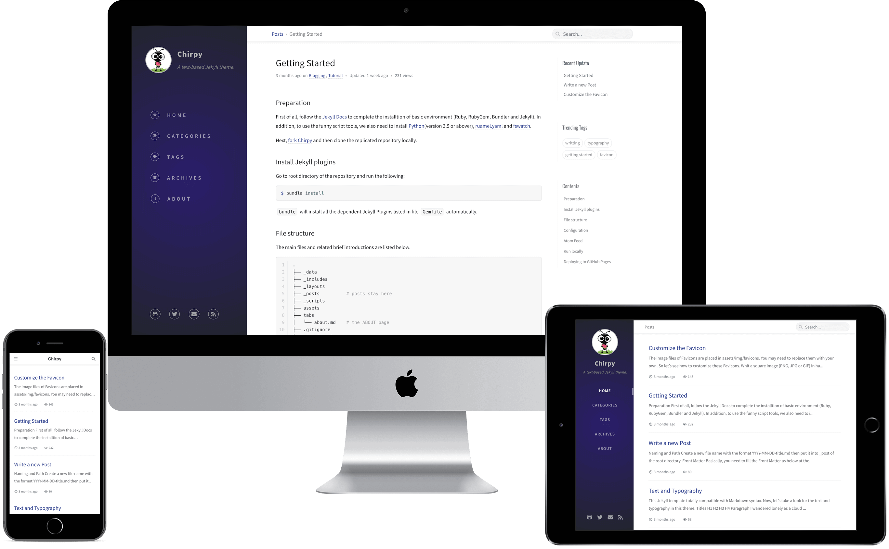

# Jekyll Theme Chirpy

[](https://travis-ci.com/cotes2020/jekyll-theme-chirpy)
[](https://github.com/cotes2020/jekyll-theme-chirpy/blob/master/LICENSE)
[](https://996.icu)



A Jekyll theme with responsive web design that focuses on text presentation. Hope you like it! [Live Demo »](https://chirpy.cotes.info)

## Features

* Last modified date
* Table of Contents
* Disqus Comments
* Syntax highlighting
* Two Level Categories
* Search
* HTML compress
* Atom feeds
* Google Analytics
* Pageviews (Advanced)

## Quick start

Complete the installation of the following environment dependencies:

- [Ruby](https://www.ruby-lang.org/en/downloads/)
- [RubyGem](https://rubygems.org/pages/download)
- [Bundler](https://bundler.io/)
- [Jekyll](https://jekyllrb.com/)
- [Python](https://www.python.org/downloads/) 
- [ruamel.yaml](https://pypi.org/project/ruamel.yaml/)
- [fswatch](http://emcrisostomo.github.io/fswatch/getting.html)

Next, [**fork**](https://github.com/cotes2020/jekyll-theme-chirpy/fork) this project and rename as `<username>.github.io`, then clone the replicated repository locally. Go to the root directory and install the Jekyll plugins:

```
$ bundle install
```

Boot your site locally:

```
$ bash run.sh
```

Now, open your favorite brower and visit <http://127.0.0.1:4000>

## Documentation

For more details, please check the [tutorial](https://chirpy.cotes.info/posts/getting-started/). BTW, a copy of the tutorial is also available on the [Wiki](https://github.com/cotes2020/jekyll-theme-chirpy/wiki).


## License

This work is published under [MIT](https://github.com/cotes2020/jekyll-theme-chirpy/blob/master/LICENSE) License.
