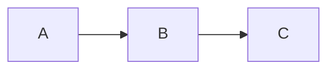
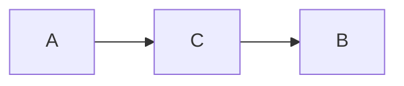

If you have ever played a game where each player draws pieces randomly from a bag each turn, you may relate to this post. For me, this game is Carcassonne. The game progresses by players drawing tiles randomly from a bag and playing them on the table. 

After playing this game enough times, there is always a temptation to "[pre-draw](https://boardgamegeek.com/thread/332689/drawing-tiles-in-carcassonne)" the pieces to speed up the game. 

>What do I mean by pre-drawing exactly? Say **player A** has drawn a piece and is now taking time to play the piece on the board. Normally, **Player B & C** are patiently waiting for **A** to play their piece so that **Player B** and then **Player C** can draw. Pre-drawing would instead allow **C** to draw (but not play the piece) immediately after **A** has drawn (while **A** is still deciding where to play) but before **B** has had a chance to draw.
{: .prompt-info }

Depending on the group you play with, this is either allowed or not allowed since pre-drawing can "change the odds". Here is some math that shows that it actually doesn't change the odds:

First, the easy case where we do not pre-draw. The chances of you drawing a particular type of tile (lets call it $x$) would be:

$$
P(e) = \frac{n}{N}
$$

So that there are $n$ remaining tiles of type $x$ out of $N$ total tiles before your turn. Now, let's say someone pre-drew before your turn (You weren't fast enough to slap their hand while they did it 😜). During this pre-draw, either $e$ or $e'$ happened **for the person who pre-drew** and now you are left with event $\tilde e$ representing your draw success of type $x$ after the pre-draw:

$$
\begin{flalign*}
P(\tilde e) &= P(\tilde e \cap e) + P(\tilde e \cap e') \\
&= P(\tilde e | e)P(e) + P(\tilde e | e')P(e') \\
P(\tilde e | e) &= \frac{n - 1}{N - 1} \\
P(\tilde e | e') &= \frac{n}{N - 1} \\ 
P(e') &= \frac{N - n}{N} \\ 
\therefore P(\tilde e) &= \frac{n - 1}{N - 1}\frac{n}{N} + \frac{n}{n-1}\frac{N - n}{N} \\
&= \frac{n}{N}[\frac{n - 1}{N - 1} + \frac{N - n}{N - 1}] \\
&= \frac{n}{N} \\
&= P(e)
\end{flalign*}
$$

Where the first line comes from the [Law of Total Probability](https://en.wikipedia.org/wiki/Law_of_total_probability) and the remainder is just counting or algebra. Since $x$ was chosen arbitrarily, this holds for any type of tile (and thus any piece).

Happy board gaming!

