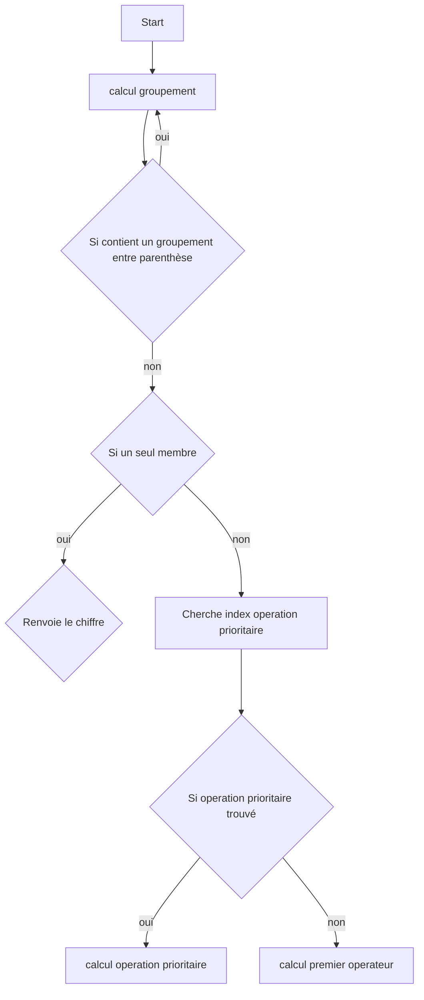

Ce projet est un projet d'entrainement au langage Rust. Je voulais apprendre Rust afin de me familiariser avec les langages bas-niveaux.

Pourquoi Rust précisément ? Tout simplement car c'est un langage prometteur dans lequel Google à investi 1 million de dollars et que Linus Torvalds, créateur du noyeau Linux, à affirmé que Rust va être de plus en plus utilisé dans le noyau Linux.

## Fonctionnement

### Task List

- [ ] Gérer l'association groupements (\<calcul\>)(\<calcul\>)
