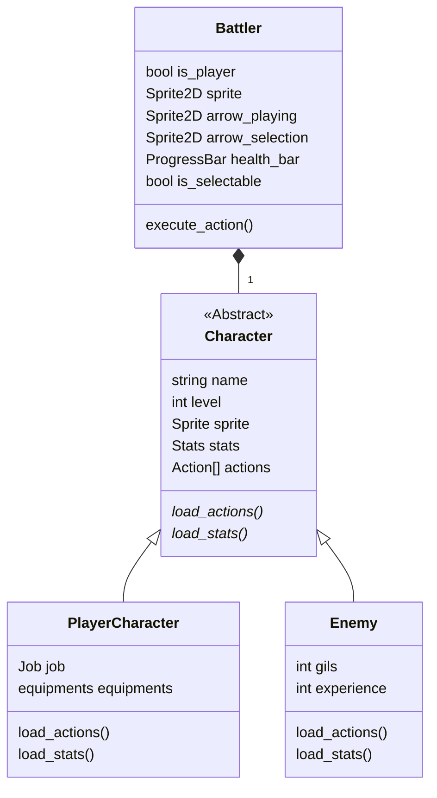
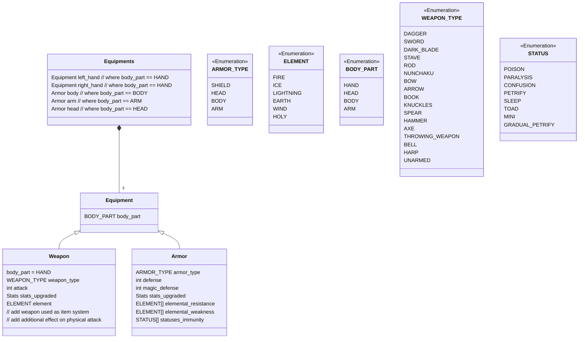

Un projet personnel qui me tient à cœur car je suis fan des jeux tour par tour et surtout de la licence Final Fantasy.

J'ai décidé d'utiliser Godot car c'est à la "mode" en ce moment et j'étais curieux de voir comment cela fonctionnait.

## Architecture

### Personnage
***

Ce qui est compliqué au niveau de la gestion des personnages, c'est le fait que nos personnages ont un "job", autrement dit, une classe, qui détermine les statistiques et les actions. 

Cependant, les ennemis ne sont pas soumis à cette règle. Ils ont leur niveau, leur statistique et leurs actions.

J'ai dû faire un choix sur comment gérer cette différence entre les deux types de personnages et j'ai opté pour une abstraction des actions et des statistiques au niveau de la classe abstraite "Character". Cette technique me permet d'accéder  facilement aux données, même si cela me complique légèrement la tâche au niveau du chargement. 

{: width="250" .left}

 
 

La deuxième solution (schéma ci-contre) était d'avoir une séparation des actions et statistiques selon le type de personnage. Pour cela, les actions et les statistiques seraient, pour la classe "Enemy", stockées dans cette dernière et pour les "PlayerCharacter" elles seraient stockées dans la variable job.

Cette option aurait permis de garder une séparation sur le fonctionnement des deux types de personnages dans le cas où elles seraient amenées à évoluer différemment or, pour le moment je ne pense pas.

 
 
 
 
 

### Equipement
***

Cette partie est en cours d'analyse, le schéma qui suit n'est pas définitif.

## Task list

### Combat 
- [ ] Navigation dans le menu du combat
  - [ ] Pouvoir annuler l'action sélectionnée (annuler l'action lors de la sélection de la cible)
  - [ ] Pouvoir annuler l'action du joueur précédent (s'il y en a un) 
  - [ ] Menu des actions dynamique selon les compétences des personnages
  - [ ] Menu des ennemis et des alliés dynamique selon leur état
    - [ ] Mort / Vivant
    - [ ] Poison, Brulure, Gel, Sommeil, Mini, Crapaud, etc

***

- [ ] Ajouter des animations pour les attaques (Attaquant et Défenseur)

***

- [ ] Ajouter des compétences
  - [ ] Magie blanche
  - [ ] Magie noire
  - [ ] Compétences

***

- [ ] Utiliser des items

### Hors combat

**Tout** 😅

