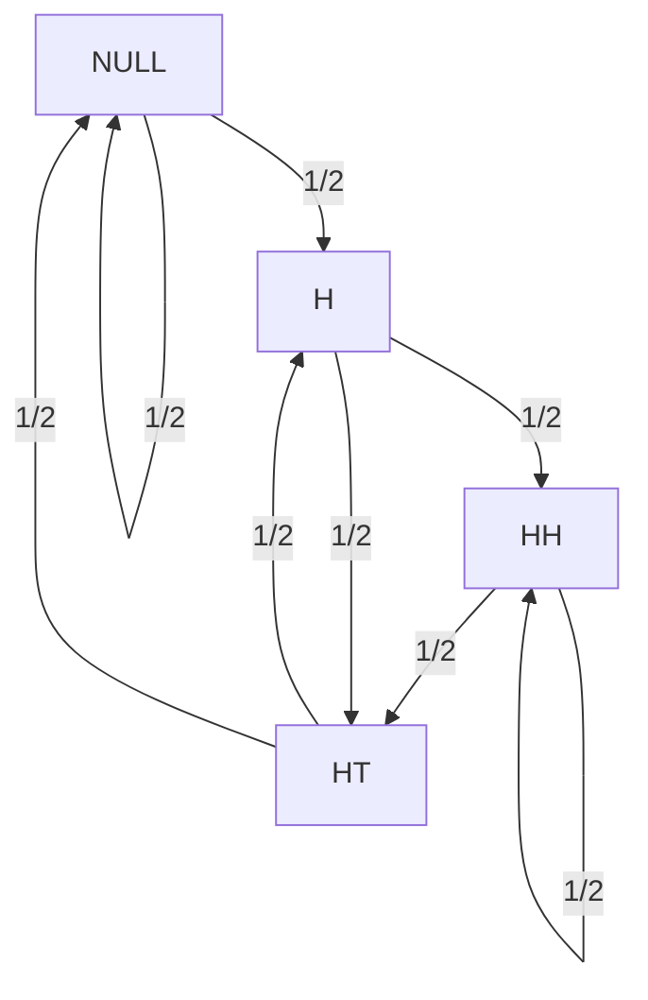

## Coin Flipping Problem
> Flip a fair coin 100 times—it gives a sequence of heads (H) and tails (T). For each HH in the sequence of flips, Alice gets a point; for each HT, Bob does, so e.g. for the sequence THHHT Alice gets 2 points and Bob gets 1 point. Who is most likely to win?

In my first two attempts at solving this problem, I guessed each wrong answer (tie and Alice). **The correct answer is Bob**, don't feel bad if you can't intuit your way to the solution. Instead of relying on instincts, we can use Markov Chain Theory to mathematically prove the probability. But before doing this, we need to translate the problem to mathematical terms. The simplest way to do this is:

$$
\begin{gather*}
t = \{1, ..., 100\}, X_t = \{H, T\}, P(X_t = \text{H}) = P(X_t = \text{T}) = \frac{1}{2} \\
Z_t = \text{Event that Alice wins at turn $t$} \\
Y_t = \text{Event that Bob wins at turn $t$} \\
P(Z_{100}) \stackrel{?}{>} P(Y_{100})
\end{gather*}
$$

Although intuitive (as its a direct translation of the problem), I wont proceed further with this approach because it becomes very difficult to analyze. This is the second trap of the problem, because each random variable only models a single time index ($t$), but the core of this problem requires us to model two time steps (namely, $HH$ and $HT$). I got this idea from this [stackoverflow post](https://stats.stackexchange.com/questions/643092/coin-flip-game-hh-vs-ht-in-a-sequence-of-flips), and will try to explain it now. First, let's map our intuitive state space (the space of all possible states) into a more useful state space:

$$
\begin{gather*}
\{X_{t - 1} = H, X_{t} = H\} \rightarrow HH \\ 
\{X_{t - 1} = H, X_{t} = T\} \rightarrow HT \\
\{X_{t - 1} \neq H, X_t = H\} \rightarrow H \\
\{X_t = T\} \rightarrow NULL \\
\end{gather*}
$$

This might seem superficial, but it allows us to track the two scoring states ($HH$, $HT$), the state before scoring ($H$), and discard the rest ($NULL$). More importantly, this formulation requires us to remember only the most recent state, ($HH$, $HT$, $H$, $NULL$), when determining what might happen next. This is known as the [*Markov Property*](https://en.wikipedia.org/wiki/Markov_property) and directly leads to a Markov Chain specification.

> Coming up with this formulation was often the most difficult part of Markov Chain analysis for me in school. Indeed, with this specified, First Step and Markov Chain analysis becomes a probability calculation.
{: .prompt-info }

Now we can write out the Markov Chain's transition matrix:

|      | $NULL$  | $H$ | $HH$ | $HT$ |
| -----| ----- |---|----|----|
| $NULL$ | 1/2   |1/2| 0   | 0 |
| $H$    | 0     |0  | 1/2 |1/2|
| $HH$   | 0     |0  | 1/2 |1/2|
| $HT$   | 1/2   |1/2|  0  |  0|

The way you can interpret this table as starting in a row (i.e. $NULL$) and each entry in those columns are the chances of transitioning into that state. For example, starting in $NULL$, you have a $\frac{1}{2}$ chance of rolling a $H$ but its impossible i.e. 

$$
P(X_t = HH | X_{t - 1} = NULL) = 0
$$

To go from $NULL$ to a $HH$. Notice how the sum of each row will always equal 1, indicating that we will always transition to *a* state next flip. **The key here is that since we constructed the definitions of our states to only exist on its previous state and still be meaningful in terms of the problem, we can construct such a table**.

This table can also be visualized in a flow chart:

With each arrow indicating a state transition according to the probability from the table.

We now need one more set of random variables, $Z_t$ and $Y_t$:

$$
\begin{gather*}
Z_t = \text{Alice's points at turn $t$} \in \{0, ..., 100\} \\
Y_t = \text{Bob's points at turn $t$} \in \{0, ..., 100\} \\
\end{gather*}
$$

I am pretty sure Bob's max points is only 50 (alternating $HT$ for 50 times), but if we use $\{0, ..., 100\}$ is makes the code easier and doesn't change the answer 😀. Lets stack all three random variables $(X_t, Z_t, Y_t)$ into a vector:

$$
\begin{gather*}
\vec S_t = [X_t, Z_t, Y_t]
\end{gather*}
$$

Now for the calculation part, we simply need to compute $P(\vec S_{100})$. To do this, lets first use the [*law of total probability*](https://en.wikipedia.org/wiki/Law_of_total_probability) and the [*chain rule of probability*](https://en.wikipedia.org/wiki/Chain_rule_(probability)) to condition on $\vec S_{99}$:

$$
\begin{gather*}
P(\vec S_{100}) = \sum_{\vec S_{99}} P(\vec S_{100}, \vec S_{99}) \\ 
= \sum_{\vec S_{99}} P(\vec S_{100} | \vec S_{99}) P(\vec S_{99})
\end{gather*}
$$

Actually, we can keep going, lets condition on $\vec S_{98}$ as well:

$$
\begin{gather*}
P(\vec S_{100}) = \sum_{\vec S_{99}} P(\vec S_{100} | \vec S_{99}) P(\vec S_{99}) \\ 
= \sum_{\vec S_{98}}\sum_{\vec S_{99}} P(\vec S_{100}, \vec S_{98} | \vec S_{99}) P(\vec S_{99}, \vec S_{98}) \\ 
= \sum_{\vec S_{98}}\sum_{\vec S_{99}} P(\vec S_{100} | \vec S_{99}) P(\vec S_{99} | \vec S_{98}) P(\vec S_{98}) \\ 
\end{gather*}
$$

Crucially, once we condition $\vec S_{100}$ on $\vec S_{99}$, $\vec S_{100}$ becomes conditionally independent from $\vec S_{98}$. Again, this is the *Markov Property* we are using. We can continue this pattern all the way down to $\vec S_1$:

$$
\begin{gather*}
P(\vec S_{100}) = \sum_{\vec S_{1}}...\sum_{\vec S_{98}}\sum_{\vec S_{99}} P(\vec S_{100} | \vec S_{99}) P(\vec S_{99} | \vec S_{98}) P(\vec S_{98} | \vec S_{97}) ... P(\vec S_{2} | \vec S_{1}) P(\vec S_1) \\ 
\end{gather*}
$$

From our transition table above, we always know:
$$
P(\vec S_{t} | \vec S_{t-1})
$$ 
and we can create a dummy timestep $t=0$ representing the state before the first flip as:

$$
\begin{gather*}
P(\vec S_0 = [Null, 0, 0]) = 1
\end{gather*}
$$

Technically, you would have to then add the condition: 

$$
P(\vec S_1 | \vec S_0) P(\vec S_0)
$$ 

to our expression for $P(\vec S_{100})$, but for clarity I will suppress this.

### Computational Tricks

We now explain three computational tricks. These aren't required from a mathematical perspective, but to get the correct answer using `numpy` in a reasonable amount of time, we need them. First:

$$
\begin{gather*}
P(\vec S_{100}) = \sum_{\vec S_{1}}...\sum_{\vec S_{98}}\sum_{\vec S_{99}} P(\vec S_{100} | \vec S_{99}) P(\vec S_{99} | \vec S_{98}) P(\vec S_{98} | \vec S_{97}) ... P(\vec S_{2} | \vec S_{1}) P(\vec S_1) \\ 
= \sum_{\vec S_{99}} P(\vec S_{100} | \vec S_{99}) \sum_{\vec S_{98}} P(\vec S_{99} | \vec S_{98}) \sum_{\vec S_{97}} P(\vec S_{98} | \vec S_{97}) ... \sum_{\vec S_{1}} P(\vec S_{2} | \vec S_{1}) P(\vec S_1)
\end{gather*}
$$

This allow us to compute the most far right part first, and store it. Consider after we compute the right most part 

$$
P(\vec S_{2}) = \sum_{\vec S_{1}} P(\vec S_{2} | \vec S_{1}) P(\vec S_1)
$$

When you are working further left to $\vec S_3$ and so on, $P(\vec S_{2})$ will not change since it is a constant. So instead of recomputing this term several times, we can simply cache it and refer to it later in the computation. Congrats, you just learned [Dynamic Programming](https://en.wikipedia.org/wiki/Dynamic_programming) and [sum-product](https://en.wikipedia.org/wiki/Belief_propagation#Description_of_the_sum-product_algorithm) inference!

The second trick is that to have numerical stability computing the product of these small probabilities, we will compute $P(\vec S_{100})$ in log-space i.e. $\log P(\vec S_{100})$:

$$
\begin{gather*}
\log P(\vec S_{100}) = \log \big [\sum_{\vec S_{99}} P(\vec S_{100} | \vec S_{99}) \sum_{\vec S_{98}} P(\vec S_{99} | \vec S_{98}) \sum_{\vec S_{97}} P(\vec S_{98} | \vec S_{97}) ... \sum_{\vec S_{1}} P(\vec S_{2} | \vec S_{1}) P(\vec S_1) \big ] \\
=\log \sum_{\vec S_{99}} \exp \log \big [P(\vec S_{100} | \vec S_{99}) \sum_{\vec S_{98}} P(\vec S_{99} | \vec S_{98}) \sum_{\vec S_{97}} P(\vec S_{98} | \vec S_{97}) ... \sum_{\vec S_{1}} P(\vec S_{2} | \vec S_{1}) P(\vec S_1)\big ] \\ 
=\log \sum_{\vec S_{99}} \exp \log P(\vec S_{100} | \vec S_{99}) + \log \big [\sum_{\vec S_{98}} P(\vec S_{99} | \vec S_{98}) \sum_{\vec S_{97}} P(\vec S_{98} | \vec S_{97}) ... \sum_{\vec S_{1}} P(\vec S_{2} | \vec S_{1}) P(\vec S_1)\big ] \\ 
... \text{ Continue converting each product using $\exp \log [\cdot]$ } ... \\
=\log \sum_{\vec S_{99}} \exp \log P(\vec S_{100} | \vec S_{99}) + \log \sum_{\vec S_{98}} \exp \log P(\vec S_{99} | \vec S_{98}) +  ...  + \log\sum_{\vec S_{1}} \exp \log P(\vec S_{2} | \vec S_{1}) P(\vec S_1) \\ 
=\log \sum_{\vec S_{99}} \exp \log P(\vec S_{100} | \vec S_{99}) + \log \sum_{\vec S_{98}} \exp \log P(\vec S_{99} | \vec S_{98}) +  ... + \log\sum_{\vec S_{1}} \exp \log P(\vec S_{2} | \vec S_{1}) + \log P(\vec S_1) \\ 
=LSE_{\vec S_{99}} \log P(\vec S_{100} | \vec S_{99}) + LSE_{\vec S_{98}} \log P(\vec S_{99} | \vec S_{98}) + ... + LSE_{\vec S_{1}} \log P(\vec S_{2} | \vec S_{1}) + \log P(\vec S_1) \\ 
\end{gather*}
$$

Where $LSE_x$ stands for [Logarithm Summation Exponentiation](https://en.wikipedia.org/wiki/LogSumExp) which happens enough times in probability that `numpy` & `scipy` has given it a [special addition implementation](https://numpy.org/doc/stable/reference/generated/numpy.logaddexp.html) and [special summation implementation](https://docs.scipy.org/doc/scipy/reference/generated/scipy.special.logsumexp.html). And lastly, just add the index $t$ to the vector itself for bookkeeping. This is not a random variable, but is useful to index into a specific time index.

## Python Implementation


```python
import numpy as np
import pandas as pd
from scipy.special import logsumexp
from numba import njit
import plotly.express as px
import plotly.graph_objects as go
from IPython.display import display, Markdown
```


```python
N = 100
# Set log-probability array
# State (ordering is [NULL, H, HH, HT]), Alice's points, Bob's points, index
log_probs = np.full((4, N + 1, N + 1, N + 1), -np.inf)
log_probs.shape
```


    (4, 101, 101, 101)


```python
@njit
def compute(log_probs: np.ndarray) -> None:
    """Compute log-probabilities for joint states starting in NULL state.

    Args:
        log_probs: Array shaped (4, N + 1, N + 1, N + 1) representing:
            - State ordered [NULL, H, HH, HT]
            - Alice's score 0, ..., 100
            - Bob's score 0, ..., 100
            - Time index 1, ..., 100 prefixed with a dummy time, 0.
    """
    # Set the dummy 0 index to a state where log_prob = 0 or prob = 1 that we
    # are in NULL state with zero points for Alice and Bob.
    log_probs[0, 0, 0, 0] = 0
    # Loop over all time indices, starting from the first coin clip.
    for t in range(1, N + 1):
        # Since we know Z_t or Y_t > t, we only need to compute probabilities
        # for values up to t.
        for a in range(t + 1):
            for b in range(t + 1):
                # We can enter NULL or H from either NULL or HT.
                log_probs[0, a, b, t] = log_probs[1, a, b, t] = np.logaddexp(
                    log_probs[0, a, b, t - 1] - np.log(2),
                    log_probs[3, a, b, t - 1] - np.log(2),
                )
                # We can enter HH from either H or HH. Since HH is also the same
                # as Alice scoring, we can increment her score in the same step.
                log_probs[2, a, b, t] = (
                    np.logaddexp(
                        log_probs[1, a - 1, b, t - 1] - np.log(2),
                        log_probs[2, a - 1, b, t - 1] - np.log(2),
                    )
                    if a > 0
                    else -np.inf
                )
                # We can enter HT from either H or HH. Since HT is also the same
                # as Bob scoring, we can increment his score in the same step.
                log_probs[3, a, b, t] = (
                    np.logaddexp(
                        log_probs[1, a, b - 1, t - 1] - np.log(2),
                        log_probs[2, a, b - 1, t - 1] - np.log(2),
                    )
                    if b > 0
                    else -np.inf
                )


compute(log_probs=log_probs)
```


```python
%%timeit
# Running naively takes ~15s
compute(log_probs)
```

    5.11 ms ± 116 µs per loop (mean ± std. dev. of 7 runs, 100 loops each)


### Joint Probability of t=100

With the entire joint probability computed, we know need to marginalize the last time index $t=100$ for the joint distribution of $P(Z_{100}, Y_{100})$:

$$
\begin{equation}
P(Z_{100}, Y_{100}) = \sum_{X_{100}} P(X_{100}, Z_{100}, Y_{100}, 100)
\end{equation}
$$


```python
# Fix the last time step, and sum over the X_{100} dimension
log_probs_final = logsumexp(log_probs[..., -1], axis=0)

# Compute joint probability distribution of points
probs_joint = np.exp(log_probs_final)
```


```python
# Plotting Helper function
def render_plotly_html(fig: go.Figure) -> None:
    """Display a Plotly figure in markdown with HTML."""
    # Show the figure if in a IPython display.
    fig.show()
    # Render the content for html output.
    display(
        Markdown(
            fig.to_html(
                include_plotlyjs="cdn",
            )
        )
    )
```


```python
render_plotly_html(
    px.imshow(
        probs_joint,
        aspect="auto",
        labels=dict(x="Bob Score", y="Alice Score", color="Probability"),
        title="P(Alice Score, Bob Score | t=100)",
    )
)
```


<html>
<head><meta charset="utf-8" /></head>
<body>
    <div>                        <script type="text/javascript">window.PlotlyConfig = {MathJaxConfig: 'local'};</script>
        <script charset="utf-8" src="https://cdn.plot.ly/plotly-2.30.0.min.js"></script>                <div id="66336826-8bf2-488f-b74f-99da473df4c3" class="plotly-graph-div" style="height:100%; width:100%;"></div>            <script type="text/javascript">                                    window.PLOTLYENV=window.PLOTLYENV || {};                                    if (document.getElementById("66336826-8bf2-488f-b74f-99da473df4c3")) {                    Plotly.newPlot(                        "66336826-8bf2-488f-b74f-99da473df4c3",                        [{"coloraxis":"coloraxis","name":"0","z":[[1.5777218104419343e-30,1.554055983285323e-28,7.422392257224225e-27,2.2902209800375795e-25,5.1319385632196715e-24,8.900838841529564e-23,1.2436094383706002e-21,1.4384229004993193e-20,1.40470713418936e-19,1.1754189825072988e-18,8.524165638460524e-18,5.4057233560397074e-17,3.0192745271533297e-16,1.4938152258785946e-15,6.577429254096121e-15,2.5870895228471786e-14,9.117404205517933e-14,2.885828984898081e-13,8.218794339867649e-13,2.1089835800259448e-12,4.8805272113292765e-12,1.0190984616164929e-11,1.9203745550250595e-11,3.265010599718125e-11,5.005737424075662e-11,6.914174817004514e-11,8.593126207079619e-11,9.59380290464782e-11,9.602440782413111e-11,8.595415541176653e-11,6.861119308089681e-11,4.867431828408911e-11,3.0568622512251974e-11,1.6917870876862185e-11,8.207679930358918e-12,3.4693507810586557e-12,1.2686715849595007e-12,3.98043846279891e-13,1.0611515903476641e-13,2.376302397106868e-14,4.409043001860884e-15,6.666421984004076e-16,8.047814141011799e-17,7.560882649268353e-18,5.348767815263374e-19,2.726822807781279e-20,9.423802345732321e-22,2.016047639262586e-23,2.2999239691717456e-25,1.0452406994177804e-27,7.8886090522096565e-31,0.0,0.0,0.0,0.0,0.0,0.0,0.0,0.0,0.0,0.0,0.0,0.0,0.0,0.0,0.0,0.0,0.0,0.0,0.0,0.0,0.0,0.0,0.0,0.0,0.0,0.0,0.0,0.0,0.0,0.0,0.0,0.0,0.0,0.0,0.0,0.0,0.0,0.0,0.0,0.0,0.0,0.0,0.0,0.0,0.0,0.0,0.0,0.0,0.0,0.0],[7.8886090522096565e-31,2.303473843245248e-28,1.8137489932840723e-26,7.748980671985843e-25,2.207365735870863e-23,4.624955708571717e-22,7.545416216643539e-21,9.945626982174878e-20,1.0866834036342563e-18,1.002843016289463e-17,7.928093778216628e-17,5.428382076693818e-16,3.2470532698662573e-15,1.708512055251595e-14,7.95168588008235e-14,3.288107329038033e-13,1.212348810955027e-12,3.9969841556751405e-12,1.18090439221233e-11,3.131766875653896e-11,7.46376467020099e-11,1.5996584274537042e-10,3.0840642107566365e-10,5.348110974307227e-10,8.337681396975923e-10,1.1675611961255034e-09,1.4667557528580696e-09,1.6502953399843546e-09,1.6595573348332522e-09,1.487843610490383e-09,1.1856448069157235e-09,8.368557614164884e-10,5.210177789961352e-10,2.847562424818373e-10,1.3585836292889147e-10,5.621717745886457e-11,2.00229471887086e-11,6.084199016062178e-12,1.5607788164549295e-12,3.3382754156947335e-13,5.864400840187112e-14,8.307800760003117e-15,9.27730950195747e-16,7.933602216485914e-17,5.0026710742758016e-18,2.209425659638205e-19,6.348304586887784e-21,1.0582278742726562e-22,8.358967366947829e-25,1.9721522630524434e-27,0.0,0.0,0.0,0.0,0.0,0.0,0.0,0.0,0.0,0.0,0.0,0.0,0.0,0.0,0.0,0.0,0.0,0.0,0.0,0.0,0.0,0.0,0.0,0.0,0.0,0.0,0.0,0.0,0.0,0.0,0.0,0.0,0.0,0.0,0.0,0.0,0.0,0.0,0.0,0.0,0.0,0.0,0.0,0.0,0.0,0.0,0.0,0.0,0.0,0.0,0.0],[7.8886090522096565e-31,3.0371144851007596e-28,3.192520083429303e-26,1.712561804971412e-24,5.860529311990438e-23,1.4296438882083928e-21,2.6535880323760884e-20,3.909604471380185e-19,4.708470259407874e-18,4.7353345797264206e-17,4.041344676656047e-16,2.9634090607131803e-15,1.8852970927443576e-14,1.0487155072074572e-13,5.132451795325885e-13,2.221015852626338e-12,8.532539865726136e-12,2.919360784010513e-11,8.917829694071217e-11,2.4367333870669007e-10,5.96370011033433e-10,1.3084343050282507e-09,2.5744785668544352e-09,4.542706712348589e-09,7.185135721995074e-09,1.017838721041507e-08,1.289721529135294e-08,1.4593191622088133e-08,1.4713373700263362e-08,1.3183925500504764e-08,1.0466102302089288e-08,7.333661722342187e-09,4.516066502089808e-09,2.4315992675314023e-09,1.1379812932014983e-09,4.5970039082836085e-10,1.5899319701830953e-10,4.663213065576821e-11,1.1467233724255578e-11,2.3323090184420475e-12,3.859207509216585e-13,5.0905572591104246e-14,5.2179142040872016e-15,4.021644130276382e-16,2.2307508123657403e-17,8.377427613088393e-19,1.9451179840533708e-20,2.4055272008319323e-22,1.1837843958972423e-24,9.663546088956921e-28,0.0,0.0,0.0,0.0,0.0,0.0,0.0,0.0,0.0,0.0,0.0,0.0,0.0,0.0,0.0,0.0,0.0,0.0,0.0,0.0,0.0,0.0,0.0,0.0,0.0,0.0,0.0,0.0,0.0,0.0,0.0,0.0,0.0,0.0,0.0,0.0,0.0,0.0,0.0,0.0,0.0,0.0,0.0,0.0,0.0,0.0,0.0,0.0,0.0,0.0,0.0],[7.8886090522096565e-31,3.754977908851881e-28,4.857016593445622e-26,3.104767196332611e-24,1.232122833940804e-22,3.412177714601491e-21,7.070339981053418e-20,1.147341211701528e-18,1.505203516022486e-17,1.633845363617698e-16,1.4932041101367937e-15,1.1645811983342954e-14,7.833560647392411e-14,4.582945047515303e-13,2.3477862556735925e-12,1.0589111205780441e-11,4.223190087140987e-11,1.4945445926524366e-10,4.705911603723783e-10,1.3211164213724523e-09,3.3116580121050983e-09,7.4194945651772495e-09,1.4863970593536785e-08,2.6627817292068703e-08,4.263762469297574e-08,6.097248551295011e-08,7.77666748282099e-08,8.830999624343943e-08,8.908683546681044e-08,7.961833635590358e-08,6.283115667098915e-08,4.3611141194791314e-08,2.6501825401256777e-08,1.4023587812439775e-08,6.420866721029798e-09,2.524930472896951e-09,8.453270519161579e-10,2.3846208247647337e-10,5.5983850205251256e-11,1.077651539087228e-11,1.6701221683339506e-12,2.0371524662448125e-13,1.9001083799789502e-14,1.3050154446840928e-15,6.269416807513366e-17,1.9570126501051577e-18,3.5398073374414864e-20,3.0304880534969853e-22,7.740500417254634e-25,0.0,0.0,0.0,0.0,0.0,0.0,0.0,0.0,0.0,0.0,0.0,0.0,0.0,0.0,0.0,0.0,0.0,0.0,0.0,0.0,0.0,0.0,0.0,0.0,0.0,0.0,0.0,0.0,0.0,0.0,0.0,0.0,0.0,0.0,0.0,0.0,0.0,0.0,0.0,0.0,0.0,0.0,0.0,0.0,0.0,0.0,0.0,0.0,0.0,0.0,0.0,0.0],[7.8886090522096565e-31,4.457064114498549e-28,6.78617593716355e-26,5.0027902001214965e-24,2.247325287809605e-22,6.936390695051821e-21,1.5815234168145838e-19,2.7940725309973956e-18,3.9550325698607397e-17,4.596622856822457e-16,4.4681329978545616e-15,3.684791609871753e-14,2.607218513341859e-13,1.5969973918142987e-12,8.529243713363654e-12,3.994897242733556e-11,1.6485625468570808e-10,6.016123253373207e-10,1.9471497730613022e-09,5.601608304320272e-09,1.4346646126801e-08,3.2746534654948545e-08,6.664818065929977e-08,1.2095940545094777e-07,1.9567549907878518e-07,2.818997699482033e-07,3.611829616941903e-07,4.108062940508171e-07,4.138150669002316e-07,3.681117282604249e-07,2.8816573665398843e-07,1.97692678472796e-07,1.1827514813930164e-07,6.135412761329299e-08,2.7409044616416437e-08,1.046099147588482e-08,3.3789089823516897e-09,9.133151820208392e-10,2.0381718645657024e-10,3.694126084724005e-11,5.328986860786388e-12,5.964666642540228e-13,5.012807513675064e-14,3.0277892461218813e-15,1.2365709135824555e-16,3.118521081320308e-18,4.18396756885931e-20,2.2311195210184447e-22,1.9713634021472199e-25,0.0,0.0,0.0,0.0,0.0,0.0,0.0,0.0,0.0,0.0,0.0,0.0,0.0,0.0,0.0,0.0,0.0,0.0,0.0,0.0,0.0,0.0,0.0,0.0,0.0,0.0,0.0,0.0,0.0,0.0,0.0,0.0,0.0,0.0,0.0,0.0,0.0,0.0,0.0,0.0,0.0,0.0,0.0,0.0,0.0,0.0,0.0,0.0,0.0,0.0,0.0,0.0],[7.8886090522096565e-31,5.143373102040775e-28,8.959408844956845e-26,7.447115157994021e-24,3.720453095790568e-22,1.2619828799134126e-20,3.130288361292614e-19,5.9644745687927934e-18,9.037826416273344e-17,1.117123729247313e-15,1.1482615484519548e-14,9.962193844586629e-14,7.381464912311146e-13,4.714858029824897e-12,2.6157625895231442e-11,1.2681250360439146e-10,5.398520643948398e-10,2.0259244753700315e-09,6.722507020147402e-09,1.9770052390749902e-08,5.1615866512065544e-08,1.1976653589393893e-07,2.47120694097492e-07,4.534480187835903e-07,7.396051566412654e-07,1.0713305230379887e-06,1.3761961045023506e-06,1.564696695661088e-06,1.5707157358198998e-06,1.3878859955457622e-06,1.0754534579705348e-06,7.276000385897843e-07,4.2754776407383584e-07,2.168629068031994e-07,9.426064105650605e-08,3.480796083973314e-08,1.0808984457754979e-08,2.7882384963790187e-09,5.886861706064899e-10,9.990146723673536e-11,1.3322467151965887e-11,1.3565395516090235e-12,1.0156660400810839e-13,5.312038787624869e-15,1.8028933869322071e-16,3.541310150282639e-18,3.2884277349369435e-20,9.09981346431178e-23,0.0,0.0,0.0,0.0,0.0,0.0,0.0,0.0,0.0,0.0,0.0,0.0,0.0,0.0,0.0,0.0,0.0,0.0,0.0,0.0,0.0,0.0,0.0,0.0,0.0,0.0,0.0,0.0,0.0,0.0,0.0,0.0,0.0,0.0,0.0,0.0,0.0,0.0,0.0,0.0,0.0,0.0,0.0,0.0,0.0,0.0,0.0,0.0,0.0,0.0,0.0,0.0,0.0],[7.8886090522096565e-31,5.813904871478624e-28,1.135659936374241e-25,1.0468105326192165e-23,5.737996099785102e-22,2.1153938032429365e-20,5.655935674222242e-19,1.1532888961450622e-17,1.8583155572501415e-16,2.4288676990905605e-15,2.626674247363013e-14,2.386774174248605e-13,1.8445612567040968e-12,1.2242242819112501e-11,7.032329745334459e-11,3.518324625317766e-10,1.5408682320872088e-09,5.93114810042246e-09,2.0129340388531555e-08,6.03788086528303e-08,1.6034682229031958e-07,3.7744230514060103e-07,7.879612745250671e-07,1.4589537651384545e-06,2.3947167196238325e-06,3.4810729161967137e-06,4.474680357922048e-06,5.0758500860289494e-06,5.06770600191024e-06,4.438715387555539e-06,3.397310898972858e-06,2.2615109468219815e-06,1.3020178879166978e-06,6.440397379874869e-07,2.7156831316854856e-07,9.670992582499102e-08,2.8764612822362357e-08,7.050610524433607e-09,1.401187359367428e-09,2.2126880226308326e-10,2.7069708618921882e-11,2.4829387465073692e-12,1.6345390235882454e-13,7.266048293153025e-15,1.9919869595340354e-16,2.901706174160163e-18,1.6780271563923234e-20,1.606004051615978e-23,0.0,0.0,0.0,0.0,0.0,0.0,0.0,0.0,0.0,0.0,0.0,0.0,0.0,0.0,0.0,0.0,0.0,0.0,0.0,0.0,0.0,0.0,0.0,0.0,0.0,0.0,0.0,0.0,0.0,0.0,0.0,0.0,0.0,0.0,0.0,0.0,0.0,0.0,0.0,0.0,0.0,0.0,0.0,0.0,0.0,0.0,0.0,0.0,0.0,0.0,0.0,0.0,0.0],[7.8886090522096565e-31,6.468659422812059e-28,1.395810485698021e-25,1.408665763009521e-23,8.38179558159539e-22,3.328384406271207e-20,9.519431964002946e-19,2.0636791169120997e-17,3.5159379472467055e-16,4.835097711125483e-15,5.4771089113818135e-14,5.191977799995645e-13,4.170264754461719e-12,2.8666164315457035e-11,1.6999296369246888e-10,8.752952147519234e-10,3.933675705161209e-09,1.549401886354226e-08,5.366157077489238e-08,1.6382138372583128e-07,4.4163084756087263e-07,1.0525204218935975e-06,2.218865387142942e-06,4.137769064624478e-06,6.821924100441016e-06,9.933194988357686e-06,1.2752916279263707e-05,1.4405097080197205e-05,1.427548696099103e-05,1.236877328384416e-05,9.330299709922493e-06,6.096882738369746e-06,3.4304921250526886e-06,1.6502351547273524e-06,6.729729407113135e-07,2.303162070155632e-07,6.535218702669177e-08,1.515037259878034e-08,2.8182786065710925e-09,4.1131393409960946e-10,4.576560728555813e-11,3.738957815628121e-12,2.1308775824202807e-13,7.870381129914236e-15,1.680238096595878e-16,1.693737405696398e-18,5.081855677613492e-21,0.0,0.0,0.0,0.0,0.0,0.0,0.0,0.0,0.0,0.0,0.0,0.0,0.0,0.0,0.0,0.0,0.0,0.0,0.0,0.0,0.0,0.0,0.0,0.0,0.0,0.0,0.0,0.0,0.0,0.0,0.0,0.0,0.0,0.0,0.0,0.0,0.0,0.0,0.0,0.0,0.0,0.0,0.0,0.0,0.0,0.0,0.0,0.0,0.0,0.0,0.0,0.0,0.0,0.0],[7.8886090522096565e-31,7.1076367560410375e-28,1.6744756004673336e-25,1.831484164155301e-23,1.1727047458758107e-21,4.9786297484209866e-20,1.5133999261575895e-18,3.468528178238201e-17,6.217557841316403e-16,8.957028338020791e-15,1.0586560493116721e-13,1.0432316147542202e-12,8.680973264338579e-12,6.16222669269789e-11,3.7622380420606467e-10,1.9886768919671763e-09,9.149557618901767e-09,3.679543401456428e-08,1.29773590535408e-07,4.02410982138274e-07,1.0990742097850487e-06,2.6470253286425577e-06,5.624708461692304e-06,1.054480303430999e-05,1.743064938035638e-05,2.5375791859026152e-05,3.247873161299715e-05,3.646116391751648e-05,3.579397906897368e-05,3.061430165328887e-05,2.2709935562499422e-05,1.4532319802493682e-05,7.970358446886915e-06,3.717964995907407e-06,1.4616177711085294e-06,4.78949802974472e-07,1.2909544965196438e-07,2.816208359102717e-08,4.87358190444553e-09,6.523580051950819e-10,6.537225705637531e-11,4.694946985559366e-12,2.273802298314322e-13,6.7825820237439886e-15,1.0736693561045294e-16,6.738959336714731e-19,6.991853353285302e-22,0.0,0.0,0.0,0.0,0.0,0.0,0.0,0.0,0.0,0.0,0.0,0.0,0.0,0.0,0.0,0.0,0.0,0.0,0.0,0.0,0.0,0.0,0.0,0.0,0.0,0.0,0.0,0.0,0.0,0.0,0.0,0.0,0.0,0.0,0.0,0.0,0.0,0.0,0.0,0.0,0.0,0.0,0.0,0.0,0.0,0.0,0.0,0.0,0.0,0.0,0.0,0.0,0.0,0.0],[7.8886090522096565e-31,7.730836871165598e-28,1.9697856803368245e-25,2.3156522779000994e-23,1.5840632463223144e-21,7.144669276194357e-20,2.295602553508136e-18,5.53523382551703e-17,1.039462021790846e-15,1.5626121866215457e-14,1.920301122002861e-13,1.960919497991534e-12,1.685546169250665e-11,1.2322750877675737e-10,7.726466464335029e-10,4.182930285446992e-09,1.9658688056676418e-08,8.055115262410805e-08,2.8873036188302513e-07,9.076524683238261e-07,2.506901047122856e-06,6.0902883567317124e-06,1.3020918333652055e-05,2.449668806483774e-05,4.0526373914129414e-05,5.888134301776426e-05,7.499062724688556e-05,8.350758875355009e-05,8.104647074166578e-05,6.828104517550164e-05,4.969600770529334e-05,3.106495020395848e-05,1.65624506729095e-05,7.469148016468185e-06,2.820872390179451e-06,8.815578771813498e-07,2.2466887646612436e-07,4.586443607677522e-08,7.333716925386988e-09,8.926332288822237e-10,7.965747741478475e-11,4.951836116328941e-12,1.9922839185230347e-13,4.627128239295458e-15,5.067873404839277e-17,1.6500773913753713e-19,0.0,0.0,0.0,0.0,0.0,0.0,0.0,0.0,0.0,0.0,0.0,0.0,0.0,0.0,0.0,0.0,0.0,0.0,0.0,0.0,0.0,0.0,0.0,0.0,0.0,0.0,0.0,0.0,0.0,0.0,0.0,0.0,0.0,0.0,0.0,0.0,0.0,0.0,0.0,0.0,0.0,0.0,0.0,0.0,0.0,0.0,0.0,0.0,0.0,0.0,0.0,0.0,0.0,0.0,0.0],[7.8886090522096565e-31,8.338259768185718e-28,2.279918456615401e-25,2.8607969730357794e-23,2.0779752043076405e-21,9.903595087037123e-20,3.347342585608466e-18,8.455415941214301e-17,1.6570802064386141e-15,2.5904942185424945e-14,3.2996003183650297e-13,3.4814832978063377e-12,3.083071230227004e-11,2.3156658754173212e-10,1.4876855519446965e-09,8.230927335879508e-09,3.94335704302321e-08,1.643057458974682e-07,5.974211828672839e-07,1.9004474465014511e-06,5.298550870356597e-06,1.2961722394000737e-05,2.7833587118143835e-05,5.2456806757360997e-05,8.669993134889967e-05,0.00012548963474399036,0.00015873680911116018,0.00017500102927193542,0.00016756703321793145,0.0001387581952556176,9.88523746556428e-05,6.020721396247262e-05,3.1115363406940936e-05,1.3522213687389268e-05,4.88825010008104e-06,1.4507190308955215e-06,3.478207050475551e-07,6.604074127165723e-08,9.6831952534794e-09,1.0612760465187972e-09,8.324036511548859e-11,4.396624124020542e-12,1.4283809485410809e-13,2.4594592166570036e-15,1.6769960267855487e-17,1.8878004053870448e-20,0.0,0.0,0.0,0.0,0.0,0.0,0.0,0.0,0.0,0.0,0.0,0.0,0.0,0.0,0.0,0.0,0.0,0.0,0.0,0.0,0.0,0.0,0.0,0.0,0.0,0.0,0.0,0.0,0.0,0.0,0.0,0.0,0.0,0.0,0.0,0.0,0.0,0.0,0.0,0.0,0.0,0.0,0.0,0.0,0.0,0.0,0.0,0.0,0.0,0.0,0.0,0.0,0.0,0.0,0.0],[7.8886090522096565e-31,8.92990544710138e-28,2.603098992266333e-25,3.4658446098703146e-23,2.6590849279707335e-21,1.3328794506749698e-19,4.719196067669635e-18,1.2441084586307056e-16,2.5358180221489863e-15,4.109617437609783e-14,5.410046635603634e-13,5.882646973447522e-12,5.353876027221177e-11,4.121860795895049e-10,2.707426598665945e-09,1.5277340734338593e-08,7.446721253934173e-08,3.149279369571243e-07,1.1594784209986973e-06,3.725823465294706e-06,1.0467833564920095e-05,2.5740920219486543e-05,5.542306907509543e-05,0.00010445792458198176,0.0001721800297127831,0.0002478208151198943,0.0003107668887690754,0.00033852283650838606,0.0003191313944752679,0.0002591613576015971,0.00018027992394825714,0.00010669765429209602,5.329061243384015e-05,2.224192276372101e-05,7.665974390934887e-06,2.1505966218263473e-06,4.824054914563222e-07,8.461461996083384e-08,1.1279357283484893e-08,1.100699042849419e-09,7.47155633448485e-11,3.2779133932499102e-12,8.290471249513472e-14,9.875293676180814e-16,3.492430749966146e-18,0.0,0.0,0.0,0.0,0.0,0.0,0.0,0.0,0.0,0.0,0.0,0.0,0.0,0.0,0.0,0.0,0.0,0.0,0.0,0.0,0.0,0.0,0.0,0.0,0.0,0.0,0.0,0.0,0.0,0.0,0.0,0.0,0.0,0.0,0.0,0.0,0.0,0.0,0.0,0.0,0.0,0.0,0.0,0.0,0.0,0.0,0.0,0.0,0.0,0.0,0.0,0.0,0.0,0.0,0.0,0.0],[7.8886090522096565e-31,9.505773907912746e-28,2.937599681907196e-25,4.1290786270739627e-23,3.3308794665026088e-21,1.748780459284973e-19,6.462006061453662e-18,1.7719349076565014e-16,3.744744861373347e-15,6.27369346022431e-14,8.513569970127687e-13,9.517018155043948e-12,8.881579549954938e-11,6.993973398474695e-10,4.687497227962304e-09,2.6924797278023652e-08,1.3328173060698488e-07,5.71089460289416e-07,2.125337773522574e-06,6.887081023165791e-06,1.946591246816392e-05,4.803720832636153e-05,0.00010353194130199055,0.00019480611995169154,0.0003196756519938716,0.00045671485868086707,0.0005666933136123673,0.0006087283269890826,0.0005637810377858587,0.0004479581415442924,0.00030350268372701704,0.00017405787459485116,8.374939379108805e-05,3.344843000236507e-05,1.0945232234304001e-05,2.8880175081422436e-06,6.024071302903585e-07,9.687346140394432e-08,1.1626133640096891e-08,9.970311636096282e-10,5.7496081507414406e-11,2.036608507822079e-12,3.8182661487141976e-14,2.831071341278931e-16,3.4609674098763223e-19,0.0,0.0,0.0,0.0,0.0,0.0,0.0,0.0,0.0,0.0,0.0,0.0,0.0,0.0,0.0,0.0,0.0,0.0,0.0,0.0,0.0,0.0,0.0,0.0,0.0,0.0,0.0,0.0,0.0,0.0,0.0,0.0,0.0,0.0,0.0,0.0,0.0,0.0,0.0,0.0,0.0,0.0,0.0,0.0,0.0,0.0,0.0,0.0,0.0,0.0,0.0,0.0,0.0,0.0,0.0,0.0],[7.8886090522096565e-31,1.0065865150619583e-27,3.2817402518098587e-25,4.848195550803468e-23,4.095631713553522e-21,2.244032655029587e-19,8.6252726067575e-18,2.4525847839747206e-16,5.359212049004642e-15,9.257633496973611e-14,1.2919238433202861e-12,1.48139677004471e-11,1.4146226251511863e-10,1.137152324568697e-09,7.76187089798092e-09,4.530118740707081e-08,2.2733577092723212e-07,9.852567907890276e-07,3.7001717759199565e-06,1.2071543418074389e-05,3.426867880802749e-05,8.472740270959689e-05,0.00018248613304823165,0.00034221527158915475,0.000558100881272534,0.0007900196138398711,0.0009680860096596445,0.001023351556774785,0.0009290993895193289,0.0007205666755152351,0.0004742390612622584,0.0002627631801323707,0.00012138957077584662,4.6212310531171026e-05,1.4291346286415259e-05,3.527315530812419e-06,6.795727330762138e-07,9.933808861715682e-08,1.0613546678789871e-08,7.876175548960807e-10,3.7721853533427804e-11,1.0400779776916974e-12,1.3487815961508576e-14,5.186126549568652e-17,0.0,0.0,0.0,0.0,0.0,0.0,0.0,0.0,0.0,0.0,0.0,0.0,0.0,0.0,0.0,0.0,0.0,0.0,0.0,0.0,0.0,0.0,0.0,0.0,0.0,0.0,0.0,0.0,0.0,0.0,0.0,0.0,0.0,0.0,0.0,0.0,0.0,0.0,0.0,0.0,0.0,0.0,0.0,0.0,0.0,0.0,0.0,0.0,0.0,0.0,0.0,0.0,0.0,0.0,0.0,0.0,0.0],[7.8886090522096565e-31,1.0610179175222026e-27,3.633887759900525e-25,5.620359426104528e-23,4.954366131226674e-21,2.8236439105819448e-19,1.1255506835741185e-17,3.309713831488627e-16,7.458701185344273e-15,1.3253530404340832e-13,1.897822477881441e-12,2.227571341553031e-11,2.1723320410798336e-10,1.7792444150209238e-09,1.2346272275392562e-08,7.309047450939951e-08,3.712199013904142e-07,1.624612679346864e-06,6.1471048647171886e-06,2.015812936587577e-05,5.7383145662283385e-05,0.0001419163879668105,0.00030495313651959116,0.0005689957875262377,0.0009205890290434936,0.0012887843853510357,0.0015566140683954644,0.001615911399749878,0.0014348884398426751,0.0010835047326037007,0.0006907883095355226,0.00036862555745952714,0.00016291785395463552,5.887148326236582e-05,1.712065348900054e-05,3.928755082877563e-06,6.938461393718626e-07,9.13012607479849e-08,8.57152933314037e-09,5.403200065046974e-10,2.0891173128155202e-11,4.269336782268799e-13,3.445792398925494e-15,4.579126111528722e-18,0.0,0.0,0.0,0.0,0.0,0.0,0.0,0.0,0.0,0.0,0.0,0.0,0.0,0.0,0.0,0.0,0.0,0.0,0.0,0.0,0.0,0.0,0.0,0.0,0.0,0.0,0.0,0.0,0.0,0.0,0.0,0.0,0.0,0.0,0.0,0.0,0.0,0.0,0.0,0.0,0.0,0.0,0.0,0.0,0.0,0.0,0.0,0.0,0.0,0.0,0.0,0.0,0.0,0.0,0.0,0.0,0.0],[7.8886090522096565e-31,1.1138715981720113e-27,3.9924565957596587e-25,6.442254670592572e-23,5.906845244779405e-21,3.491504161291072e-19,1.4394604014730178e-17,4.366233172429529e-16,1.0124164332294175e-14,1.846488173171798e-13,2.7074737056465575e-12,3.246664024215035e-11,3.22741169253215e-10,2.6886052234765314e-09,1.8933910671780104e-08,1.1350904483125736e-07,5.825242540193692e-07,2.570290872612633e-06,9.78297015381822e-06,3.21965614008976e-05,9.176119864520681e-05,0.0002266387617469968,0.0004850843590774653,0.0008990065346486648,0.0014404326601242397,0.0019905976645025873,0.00236505105991118,0.0024058311154217756,0.002084510901621218,0.0015285621076596575,0.0009412724557693674,0.0004821472282367104,0.00020307299517339665,6.933823580050134e-05,1.8858738068127046e-05,3.996553762781896e-06,6.415103162878147e-07,7.514187884570238e-08,6.103788673096998e-09,3.195185496653632e-10,9.615345857505842e-12,1.359020522136248e-13,5.687274630518859e-16,0.0,0.0,0.0,0.0,0.0,0.0,0.0,0.0,0.0,0.0,0.0,0.0,0.0,0.0,0.0,0.0,0.0,0.0,0.0,0.0,0.0,0.0,0.0,0.0,0.0,0.0,0.0,0.0,0.0,0.0,0.0,0.0,0.0,0.0,0.0,0.0,0.0,0.0,0.0,0.0,0.0,0.0,0.0,0.0,0.0,0.0,0.0,0.0,0.0,0.0,0.0,0.0,0.0,0.0,0.0,0.0,0.0,0.0],[7.8886090522096565e-31,1.1651475570113738e-27,4.355908480622113e-25,7.310137350411311e-23,6.951575113373742e-21,4.250255003137267e-19,1.807828695830649e-17,5.643428869748969e-16,1.3434950135874071e-14,2.5099188060718686e-13,3.761289484746878e-12,4.599535170727382e-11,4.6525960175192194e-10,3.935520738668687e-09,2.8081664736900127e-08,1.702121591649872e-07,8.812770299624051e-07,3.914383642364374e-06,1.49642536292796e-05,4.9349831785560315e-05,0.00014059660830461932,0.00034624713315652513,0.0007369523370310631,0.0013542930501738411,0.002145040586748479,0.0029206000070284496,0.0034063798805803874,0.003387935111896284,0.0028572206893264745,0.0020290683525485704,0.0012030903573178292,0.0005894366909000751,0.0002356075258947177,7.563790226827447e-05,1.9124134216436805e-05,3.714653988442818e-06,5.366899888041381e-07,5.523274675465905e-08,3.81076346904279e-09,1.6102808122810768e-10,3.591273754008208e-12,3.15866974391743e-14,4.567678296249932e-17,0.0,0.0,0.0,0.0,0.0,0.0,0.0,0.0,0.0,0.0,0.0,0.0,0.0,0.0,0.0,0.0,0.0,0.0,0.0,0.0,0.0,0.0,0.0,0.0,0.0,0.0,0.0,0.0,0.0,0.0,0.0,0.0,0.0,0.0,0.0,0.0,0.0,0.0,0.0,0.0,0.0,0.0,0.0,0.0,0.0,0.0,0.0,0.0,0.0,0.0,0.0,0.0,0.0,0.0,0.0,0.0,0.0,0.0],[7.8886090522096565e-31,1.2148457940402997e-27,4.722752467377034e-25,8.219884878470227e-23,8.085828037437441e-21,5.101186192343323e-19,2.23346667714298e-17,7.160070855508921e-16,1.7465435176636327e-14,3.335917522855455e-13,5.0999837911385555e-12,6.348951098305059e-11,6.524223878813233e-10,5.594674176033371e-09,4.0385584338274156e-08,2.4712060639371455e-07,1.2888881241441281e-06,5.754382550625293e-06,2.20618652524633e-05,7.279584860552463e-05,0.00020699733500967869,0.0005074844752783763,0.0010723346118037267,0.0019506569405725444,0.003048609527826473,0.004081629865232866,0.004663343951773058,0.004524261174271429,0.0037043025878091434,0.002540238463701902,0.001445470767597554,0.0006747740305736556,0.0002548156337531276,7.649653686574723e-05,1.7859599627431583e-05,3.152638615551618e-06,4.054202043085088e-07,3.6097620912224595e-08,2.0680538286397395e-09,6.800932080645431e-11,1.0488877516836564e-12,4.782627863132477e-15,0.0,0.0,0.0,0.0,0.0,0.0,0.0,0.0,0.0,0.0,0.0,0.0,0.0,0.0,0.0,0.0,0.0,0.0,0.0,0.0,0.0,0.0,0.0,0.0,0.0,0.0,0.0,0.0,0.0,0.0,0.0,0.0,0.0,0.0,0.0,0.0,0.0,0.0,0.0,0.0,0.0,0.0,0.0,0.0,0.0,0.0,0.0,0.0,0.0,0.0,0.0,0.0,0.0,0.0,0.0,0.0,0.0,0.0,0.0],[7.8886090522096565e-31,1.2629663092587759e-27,5.091544940567839e-25,9.167044134959153e-23,9.305680818417854e-21,6.044160021279161e-19,2.7182962480084758e-17,8.93154481488527e-16,2.228149881178704e-14,4.343299133110484e-13,6.7625659196771445e-12,8.556414825588919e-11,8.918245423627905e-10,7.741032332238673e-09,5.644561933528032e-08,3.4816593527069283e-07,1.8265876101754535e-06,8.185030381186992e-06,3.142493262148722e-05,0.00010359070738998951,0.0002935484208399279,0.0007153079879075191,0.0014980723026001767,0.0026927661381448706,0.004144814475345541,0.00544573333113001,0.006081463836692827,0.005741332867493653,0.004551384486291809,0.0030046327808307322,0.0016350197762794315,0.000724243319628434,0.00025711336002098406,7.174542542639839e-05,1.5351345833602328e-05,2.438936666446674e-06,2.755462728298815e-07,2.0836972217614177e-08,9.63556238907468e-10,2.3481181819817157e-11,2.253295411753242e-13,3.5496532642099525e-16,0.0,0.0,0.0,0.0,0.0,0.0,0.0,0.0,0.0,0.0,0.0,0.0,0.0,0.0,0.0,0.0,0.0,0.0,0.0,0.0,0.0,0.0,0.0,0.0,0.0,0.0,0.0,0.0,0.0,0.0,0.0,0.0,0.0,0.0,0.0,0.0,0.0,0.0,0.0,0.0,0.0,0.0,0.0,0.0,0.0,0.0,0.0,0.0,0.0,0.0,0.0,0.0,0.0,0.0,0.0,0.0,0.0,0.0,0.0],[7.8886090522096565e-31,1.3095091026668096e-27,5.460889616392326e-25,1.0146878010142377e-22,1.0606066941931091e-20,7.07756396438001e-19,3.263241504114245e-17,1.096903964671131e-15,2.793699184206201e-14,5.548381335484946e-13,8.784103554880493e-12,1.1278473145330425e-10,1.1905390157613006e-09,1.044471707291535e-08,7.682073348241205e-08,4.769628851546738e-07,2.5134188115900894e-06,1.1287963565475213e-05,4.333575150212024e-05,0.00014250390751569298,0.00040180750919796755,0.0009716071374678912,0.0020134034527665304,0.003569725611042758,0.005401230448092469,0.006949572766669947,0.007568392352504872,0.0069351734378698135,0.0053078044139559626,0.003362168813355652,0.0017429932184883578,0.0007293187829958124,0.00024208976519269053,6.237275092556513e-05,1.2127758425614752e-05,1.7148751644375071e-06,1.67610114189014e-07,1.0523986468203734e-08,3.7870893777869855e-10,6.381387545183178e-12,3.1741373136278736e-14,0.0,0.0,0.0,0.0,0.0,0.0,0.0,0.0,0.0,0.0,0.0,0.0,0.0,0.0,0.0,0.0,0.0,0.0,0.0,0.0,0.0,0.0,0.0,0.0,0.0,0.0,0.0,0.0,0.0,0.0,0.0,0.0,0.0,0.0,0.0,0.0,0.0,0.0,0.0,0.0,0.0,0.0,0.0,0.0,0.0,0.0,0.0,0.0,0.0,0.0,0.0,0.0,0.0,0.0,0.0,0.0,0.0,0.0,0.0,0.0],[7.8886090522096565e-31,1.3544741742644105e-27,5.829437542702505e-25,1.1154410369429727e-22,1.198084111052787e-20,8.198291463538138e-19,3.868142468856392e-17,1.3278821002261278e-15,3.447035419247159e-14,6.963935888314711e-13,1.1193366556635464e-11,1.4562686529647212e-10,1.5545743527534184e-09,1.3765131001823978e-08,1.0197687914343695e-07,6.364286616933797e-07,3.36392142033958e-06,1.511995456785147e-05,5.796005059061191e-05,0.0001898436803369509,0.0005317998640715206,0.0012740211729343664,0.002607790932050267,0.0045521774049446,0.006757227500153939,0.008495877850426098,0.009001359752823741,0.007984478264252415,0.005881778808591524,0.0035624269900416026,0.0017521883761474411,0.0006891764818174512,0.0002126214258074282,5.0201677620157986e-05,8.784780008084367e-06,1.0912488285497323e-06,9.058078511491427e-08,4.5903772798013335e-09,1.2239744311518104e-10,1.2831062430839447e-12,2.2045215009304377e-15,0.0,0.0,0.0,0.0,0.0,0.0,0.0,0.0,0.0,0.0,0.0,0.0,0.0,0.0,0.0,0.0,0.0,0.0,0.0,0.0,0.0,0.0,0.0,0.0,0.0,0.0,0.0,0.0,0.0,0.0,0.0,0.0,0.0,0.0,0.0,0.0,0.0,0.0,0.0,0.0,0.0,0.0,0.0,0.0,0.0,0.0,0.0,0.0,0.0,0.0,0.0,0.0,0.0,0.0,0.0,0.0,0.0,0.0,0.0,0.0],[7.8886090522096565e-31,1.3978615240515563e-27,6.195887099004781e-25,1.2184469440726561e-22,1.3422854607520536e-20,9.401750252833341e-19,4.5316933766527665e-17,1.5861618283992036e-15,4.1901534470736985e-14,8.59818320978094e-13,1.401047968008182e-11,1.8443494788882405e-10,1.9883064334089976e-09,1.7744722211171453e-08,1.3223153521422326e-07,8.283790493371373e-07,4.385710556085821e-06,1.970095263362796e-05,7.529846401224417e-05,0.0002452967682294384,0.0006815965973733445,0.0016150931314400292,0.0032597878946734192,0.005591906780556269,0.008126632408823001,0.009961964242264592,0.010242540826519049,0.008769984795337941,0.006198049123452635,0.003575894645198844,0.0016612584837409558,0.0006109022902750793,0.00017400850387761427,3.733308929374083e-05,5.814158197032326e-06,6.247934469343579e-07,4.3059461299820547e-08,1.6979893617314756e-09,3.1302603965875286e-11,1.7006308721463698e-13,0.0,0.0,0.0,0.0,0.0,0.0,0.0,0.0,0.0,0.0,0.0,0.0,0.0,0.0,0.0,0.0,0.0,0.0,0.0,0.0,0.0,0.0,0.0,0.0,0.0,0.0,0.0,0.0,0.0,0.0,0.0,0.0,0.0,0.0,0.0,0.0,0.0,0.0,0.0,0.0,0.0,0.0,0.0,0.0,0.0,0.0,0.0,0.0,0.0,0.0,0.0,0.0,0.0,0.0,0.0,0.0,0.0,0.0,0.0,0.0,0.0],[7.8886090522096565e-31,1.4396711520282624e-27,6.558983996459902e-25,1.3231729624061702e-22,1.4924040028532788e-20,1.0681897205556649e-18,5.251407029201609e-17,1.8712148530962445e-15,5.022935510041159e-14,1.0453883842278483e-12,1.7244722027359253e-11,2.2938243095292975e-10,2.4939238769563016e-09,2.2402863404062994e-08,1.676994831557593e-07,1.0531394842293695e-06,5.577211076511898e-06,2.5003395704686704e-05,9.514617708161401e-05,0.00030780990633448964,0.0008470633071917407,0.0019819841222597566,0.003937384254802159,0.006624572777257527,0.009405559993670421,0.011214712574783075,0.011159961799681184,0.009195959807822507,0.006213486356636828,0.0034008151281546954,0.001485017961941869,0.0005075276699755964,0.00013247480971201726,2.5578211178279224e-05,3.499387954654117e-06,3.1935415288437353e-07,1.7763007918191967e-08,5.189761796053601e-10,5.951349148031377e-12,1.116575825146607e-14,0.0,0.0,0.0,0.0,0.0,0.0,0.0,0.0,0.0,0.0,0.0,0.0,0.0,0.0,0.0,0.0,0.0,0.0,0.0,0.0,0.0,0.0,0.0,0.0,0.0,0.0,0.0,0.0,0.0,0.0,0.0,0.0,0.0,0.0,0.0,0.0,0.0,0.0,0.0,0.0,0.0,0.0,0.0,0.0,0.0,0.0,0.0,0.0,0.0,0.0,0.0,0.0,0.0,0.0,0.0,0.0,0.0,0.0,0.0,0.0,0.0],[7.8886090522096565e-31,1.4799030581945328e-27,6.917521277882833e-25,1.429075172349376e-22,1.647550397265585e-20,1.2031298320258156e-18,6.023606063269684e-17,2.1818796003212553e-15,5.942945132433679e-14,1.2527577843940018e-12,2.0892612087476674e-11,2.804364669263565e-10,3.0709301342811364e-09,2.7730373603809618e-08,2.082450684265485e-07,1.3092137425654931e-06,6.925832369250348e-06,3.0944362687377636e-05,0.00011706781238307456,0.00037553875953312647,0.0010218532999043684,0.002356908274824076,0.004600057621669281,0.007575605098330229,0.010484664769998119,0.012129674422403881,0.011649744266388413,0.0092086451863956,0.005926353819410875,0.0030635381989994083,0.0012506487996697666,0.0003946124459506894,9.359374777171729e-05,1.6082621075305964e-05,1.9033901505310622e-06,1.4421669037423193e-07,6.2415100993427e-09,1.2606594169138386e-10,7.490767383483521e-13,0.0,0.0,0.0,0.0,0.0,0.0,0.0,0.0,0.0,0.0,0.0,0.0,0.0,0.0,0.0,0.0,0.0,0.0,0.0,0.0,0.0,0.0,0.0,0.0,0.0,0.0,0.0,0.0,0.0,0.0,0.0,0.0,0.0,0.0,0.0,0.0,0.0,0.0,0.0,0.0,0.0,0.0,0.0,0.0,0.0,0.0,0.0,0.0,0.0,0.0,0.0,0.0,0.0,0.0,0.0,0.0,0.0,0.0,0.0,0.0,0.0,0.0],[7.8886090522096565e-31,1.5185572425503731e-27,7.270339317742896e-25,1.535602160129514e-22,1.806762634031497e-20,1.344121214503626e-18,6.843441301558895e-17,2.5163461183372487e-15,6.94528915668034e-14,1.4809018050217916e-12,2.4936409507387138e-11,3.3732966476080374e-10,3.7157453385914637e-09,3.368521743214955e-08,2.534462584989965e-07,1.5930528086690556e-06,8.406859869668583e-06,3.738201263859822e-05,0.0001403935890851329,0.0004458837479748702,0.0011976900726447092,0.0027183413736695176,0.0052024461197450154,0.008368632616417475,0.01126393659905709,0.012610661693300437,0.011654691564031929,0.008806941531580886,0.005376595352638878,0.002612282984309499,0.0009910920564688715,0.00028656169906638275,6.116528760023288e-05,9.23298421703304e-06,9.279801419252822e-07,5.6744525188884873e-08,1.8194125289586064e-09,2.285602395122997e-11,4.6888093526989906e-14,0.0,0.0,0.0,0.0,0.0,0.0,0.0,0.0,0.0,0.0,0.0,0.0,0.0,0.0,0.0,0.0,0.0,0.0,0.0,0.0,0.0,0.0,0.0,0.0,0.0,0.0,0.0,0.0,0.0,0.0,0.0,0.0,0.0,0.0,0.0,0.0,0.0,0.0,0.0,0.0,0.0,0.0,0.0,0.0,0.0,0.0,0.0,0.0,0.0,0.0,0.0,0.0,0.0,0.0,0.0,0.0,0.0,0.0,0.0,0.0,0.0,0.0],[7.8886090522096565e-31,1.5556337050957551e-27,7.616325822163752e-25,1.6421987254414817e-22,1.9690164940170305e-20,1.4901694668482944e-18,7.704936721594632e-17,2.8721587519556268e-15,8.022556143145866e-14,1.7280835556478352e-12,2.93431485738192e-11,3.9954141301136335e-10,4.42144741432603e-09,4.018987326450724e-08,3.0257530903328006e-07,1.898961288207499e-06,9.98329277523913e-06,4.411740693907195e-05,0.00016424064296033974,0.0005156215697360548,0.0013649414674045623,0.0030429224702797383,0.005699229906459983,0.008935193231681158,0.01166737694260502,0.01260571439565693,0.011174803692611712,0.00804252061876612,0.004637092761797556,0.002106265471375806,0.0007377540869543685,0.00019382953908213,3.681997126767228e-05,4.808075038941061e-06,4.0120821638579727e-07,1.9088236589531213e-08,4.230633968435662e-10,2.753268851904826e-12,0.0,0.0,0.0,0.0,0.0,0.0,0.0,0.0,0.0,0.0,0.0,0.0,0.0,0.0,0.0,0.0,0.0,0.0,0.0,0.0,0.0,0.0,0.0,0.0,0.0,0.0,0.0,0.0,0.0,0.0,0.0,0.0,0.0,0.0,0.0,0.0,0.0,0.0,0.0,0.0,0.0,0.0,0.0,0.0,0.0,0.0,0.0,0.0,0.0,0.0,0.0,0.0,0.0,0.0,0.0,0.0,0.0,0.0,0.0,0.0,0.0,0.0,0.0],[7.8886090522096565e-31,1.5911324458307057e-27,7.954415828923362e-25,1.7483094313219307e-22,2.1332364162594292e-20,1.6401723479629886e-18,8.601059981543033e-17,3.2462368713716866e-15,9.164836512237167e-14,1.991846610486779e-12,3.4064294631229365e-11,4.662907756768339e-10,5.177684871992734e-09,4.7130768193142444e-08,3.545997946206915e-07,2.219168580612759e-06,1.1606775335904312e-05,5.090225988580871e-05,0.00018756036640587417,0.0005811277275554196,0.0015134397722695702,0.003307833522408837,0.006050527729234197,0.009224082419579798,0.011654691564031929,0.012115931928949683,0.010267164855706687,0.007009366708422118,0.0037984227987516595,0.0016034409946902816,0.0005146666442148508,0.00012168968216908682,2.030731315975389e-05,2.252003357959184e-06,1.516550320291907e-07,5.3451048855823184e-09,7.36701397364345e-11,1.6547890238602264e-13,0.0,0.0,0.0,0.0,0.0,0.0,0.0,0.0,0.0,0.0,0.0,0.0,0.0,0.0,0.0,0.0,0.0,0.0,0.0,0.0,0.0,0.0,0.0,0.0,0.0,0.0,0.0,0.0,0.0,0.0,0.0,0.0,0.0,0.0,0.0,0.0,0.0,0.0,0.0,0.0,0.0,0.0,0.0,0.0,0.0,0.0,0.0,0.0,0.0,0.0,0.0,0.0,0.0,0.0,0.0,0.0,0.0,0.0,0.0,0.0,0.0,0.0,0.0],[7.8886090522096565e-31,1.6250534647551943e-27,8.283591707453932e-25,1.8533819962511137e-22,2.2983066532492803e-20,1.792933881590744e-18,9.523816894985795e-17,3.634913388024756e-15,1.0359826750851563e-13,2.269035480642933e-12,3.903608464817118e-11,5.365423497620426e-10,5.970783564139897e-09,5.4360040495938695e-08,4.0820622280186474e-07,2.5440777358355562e-06,1.3219659525330912e-05,5.745247503683949e-05,0.00020920912511540788,0.0006386711235505889,0.001633456896143186,0.003493335971593106,0.006226954011794068,0.0092086451863956,0.011227617152071025,0.011195184867519139,0.009035259852633926,0.005825545687810644,0.002951340900268993,0.0011502266784522873,0.0003354857309033955,7.059803865165992e-05,1.019185194997406e-05,9.383690095508493e-07,4.9165048149396236e-08,1.1976829151789051e-09,8.549743289944448e-12,0.0,0.0,0.0,0.0,0.0,0.0,0.0,0.0,0.0,0.0,0.0,0.0,0.0,0.0,0.0,0.0,0.0,0.0,0.0,0.0,0.0,0.0,0.0,0.0,0.0,0.0,0.0,0.0,0.0,0.0,0.0,0.0,0.0,0.0,0.0,0.0,0.0,0.0,0.0,0.0,0.0,0.0,0.0,0.0,0.0,0.0,0.0,0.0,0.0,0.0,0.0,0.0,0.0,0.0,0.0,0.0,0.0,0.0,0.0,0.0,0.0,0.0,0.0,0.0],[7.8886090522096565e-31,1.6573967618692608e-27,8.602883158842123e-25,1.956870528482627e-22,2.4630826009452687e-20,1.9471798975550763e-18,1.0464367756043439e-16,4.0339902615230015e-15,1.159301686358966e-13,2.555844435116267e-12,4.418057858449779e-11,6.090257326393076e-10,6.78405714835871e-09,6.169971972436322e-08,4.6184656206248884e-07,2.862687895990791e-06,1.4758112215770691e-05,6.346658880301111e-05,0.000228036257843711,0.0006847492693248349,0.0017167105988308603,0.0035850898028579304,0.006213486356636828,0.00889063818280127,0.010429570925052863,0.009940795962728968,0.007610362108999574,0.004611890336183427,0.002171487723888123,0.0007755572902256099,0.00020358410472223819,3.7637092772644295e-05,4.614418048197697e-06,3.4286559964358137e-07,1.3307039315662515e-08,2.0155330310617167e-10,4.96436707158065e-13,0.0,0.0,0.0,0.0,0.0,0.0,0.0,0.0,0.0,0.0,0.0,0.0,0.0,0.0,0.0,0.0,0.0,0.0,0.0,0.0,0.0,0.0,0.0,0.0,0.0,0.0,0.0,0.0,0.0,0.0,0.0,0.0,0.0,0.0,0.0,0.0,0.0,0.0,0.0,0.0,0.0,0.0,0.0,0.0,0.0,0.0,0.0,0.0,0.0,0.0,0.0,0.0,0.0,0.0,0.0,0.0,0.0,0.0,0.0,0.0,0.0,0.0,0.0,0.0],[7.8886090522096565e-31,1.6881623371728724e-27,8.911367215828772e-25,2.0582386026008911e-22,2.6264021958421034e-20,2.1015747467073343e-18,1.1413162987507603e-16,4.438809706781469e-15,1.2847957143890954e-13,2.8478939151502206e-12,4.9407411086942594e-11,6.822684305047714e-10,7.598317022868169e-09,6.894822480865285e-08,5.138059546307567e-07,3.1631682956010664e-06,1.6156055541568665e-05,6.864756297099036e-05,0.0002429804259342346,0.0007164242002688546,0.0017572638395148197,0.0035758946451988475,0.006011471529278192,0.00829992447023241,0.009338712795136843,0.008477319794833215,0.006129429272686767,0.003472711231327431,0.0015096756758487826,0.0004899853393503607,0.00011447988411584149,1.83098050871014e-05,1.8637931590863664e-06,1.0774256233805781e-07,2.8898893142551125e-09,2.266490345783708e-11,0.0,0.0,0.0,0.0,0.0,0.0,0.0,0.0,0.0,0.0,0.0,0.0,0.0,0.0,0.0,0.0,0.0,0.0,0.0,0.0,0.0,0.0,0.0,0.0,0.0,0.0,0.0,0.0,0.0,0.0,0.0,0.0,0.0,0.0,0.0,0.0,0.0,0.0,0.0,0.0,0.0,0.0,0.0,0.0,0.0,0.0,0.0,0.0,0.0,0.0,0.0,0.0,0.0,0.0,0.0,0.0,0.0,0.0,0.0,0.0,0.0,0.0,0.0,0.0,0.0],[7.8886090522096565e-31,1.717350190666056e-27,9.20816824280915e-25,2.1569621783065985e-22,2.787097276934111e-20,2.2547389201389166e-18,1.236009522213815e-16,4.8443393615930354e-15,1.4106597386863954e-13,3.1403325334954426e-12,5.4616195480102467e-11,7.546412010947357e-10,8.392563140146998e-09,7.58888883339603e-08,5.622878589003475e-07,3.433545010731868e-06,1.734962118815642e-05,7.2725845838492e-05,0.0002531636408726095,0.0007316165092636687,0.0017521883761474411,0.003466574437474197,0.005638417481422584,0.0074900694356905,0.008055883223278259,0.006937001180623151,0.004714448910865624,0.0024825696313047047,0.0009890978565905819,0.0002889413786159546,5.931142479338569e-05,8.05663074316624e-06,6.618452003878763e-07,2.833948885995013e-08,4.725278588477998e-10,1.2781818667058164e-12,0.0,0.0,0.0,0.0,0.0,0.0,0.0,0.0,0.0,0.0,0.0,0.0,0.0,0.0,0.0,0.0,0.0,0.0,0.0,0.0,0.0,0.0,0.0,0.0,0.0,0.0,0.0,0.0,0.0,0.0,0.0,0.0,0.0,0.0,0.0,0.0,0.0,0.0,0.0,0.0,0.0,0.0,0.0,0.0,0.0,0.0,0.0,0.0,0.0,0.0,0.0,0.0,0.0,0.0,0.0,0.0,0.0,0.0,0.0,0.0,0.0,0.0,0.0,0.0,0.0],[7.8886090522096565e-31,1.7449603223487935e-27,9.492457935832657e-25,2.252532361429758e-22,2.9440048159390894e-20,2.405267299991899e-18,1.3294664634039767e-16,5.2452692825248884e-15,1.5349688970329896e-13,3.427961473718332e-12,5.969949617394363e-11,8.244140210063557e-10,9.144823491848873e-09,8.230003776661673e-08,6.055110848418984e-07,3.662448011447326e-06,1.8281722725501604e-05,7.548134084296905e-05,0.0002579719946184567,0.0007293187829958124,0.0017018951482343206,0.0032658629315823933,0.005125613171688565,0.0065306940502846906,0.006689879717760382,0.005440982441054186,0.00345733528502678,0.0016810619091022464,0.0006086983684329503,0.00015827975531372717,2.811037750753519e-05,3.1703790239522768e-06,2.026222252123567e-07,5.995214120559788e-09,5.17457497650255e-11,0.0,0.0,0.0,0.0,0.0,0.0,0.0,0.0,0.0,0.0,0.0,0.0,0.0,0.0,0.0,0.0,0.0,0.0,0.0,0.0,0.0,0.0,0.0,0.0,0.0,0.0,0.0,0.0,0.0,0.0,0.0,0.0,0.0,0.0,0.0,0.0,0.0,0.0,0.0,0.0,0.0,0.0,0.0,0.0,0.0,0.0,0.0,0.0,0.0,0.0,0.0,0.0,0.0,0.0,0.0,0.0,0.0,0.0,0.0,0.0,0.0,0.0,0.0,0.0,0.0,0.0],[7.8886090522096565e-31,1.7709927322210843e-27,9.763455322603234e-25,2.344458007170799e-22,3.095977924668982e-20,2.5517477692565036e-18,1.4206154114900508e-16,5.636118310044963e-15,1.6557237887369595e-13,3.7053770590840454e-12,6.454625352500544e-11,8.898201552467783e-10,9.833098283991275e-09,8.796601842011036e-08,6.418118410037459e-07,3.839857290868888e-06,1.8906316089112575e-05,7.676193301405681e-05,0.00025711336002098406,0.0007096997356318053,0.001610082611325839,0.002989310768244901,0.004514002121944177,0.005498028053583427,0.0053429240698891645,0.004084786050947575,0.0024126533516032247,0.0010752346766666136,0.0003504584829479658,8.007226315546247e-05,1.2078496287467204e-05,1.099395662704347e-06,5.204106518129308e-08,9.570000180024111e-10,2.8475624248183973e-12,0.0,0.0,0.0,0.0,0.0,0.0,0.0,0.0,0.0,0.0,0.0,0.0,0.0,0.0,0.0,0.0,0.0,0.0,0.0,0.0,0.0,0.0,0.0,0.0,0.0,0.0,0.0,0.0,0.0,0.0,0.0,0.0,0.0,0.0,0.0,0.0,0.0,0.0,0.0,0.0,0.0,0.0,0.0,0.0,0.0,0.0,0.0,0.0,0.0,0.0,0.0,0.0,0.0,0.0,0.0,0.0,0.0,0.0,0.0,0.0,0.0,0.0,0.0,0.0,0.0,0.0],[7.8886090522096565e-31,1.7954474202829292e-27,1.0020426762478998e-24,2.4322681655693126e-22,3.241896553955858e-20,2.69277991108077e-18,1.5083810739551392e-16,6.011347088896218e-15,1.770899490142736e-13,3.9671263933599375e-12,6.904551869614802e-11,9.491252331378233e-10,1.0436355847426363e-08,9.268844237182083e-08,6.697431556037179e-07,3.9577841051410105e-06,1.9191932896341143e-05,7.649653686574723e-05,0.0002506449793866897,0.0006740849784800257,0.0014833114901399822,0.002657393831511268,0.003849027805886547,0.004465362056882165,0.004098888553181048,0.0029302533165070973,0.001598273161720374,0.0006474264951024148,0.000187855976113488,3.713844527894255e-05,4.651653760877474e-06,3.2939270347255346e-07,1.0772766739614518e-08,1.0251224729346147e-10,0.0,0.0,0.0,0.0,0.0,0.0,0.0,0.0,0.0,0.0,0.0,0.0,0.0,0.0,0.0,0.0,0.0,0.0,0.0,0.0,0.0,0.0,0.0,0.0,0.0,0.0,0.0,0.0,0.0,0.0,0.0,0.0,0.0,0.0,0.0,0.0,0.0,0.0,0.0,0.0,0.0,0.0,0.0,0.0,0.0,0.0,0.0,0.0,0.0,0.0,0.0,0.0,0.0,0.0,0.0,0.0,0.0,0.0,0.0,0.0,0.0,0.0,0.0,0.0,0.0,0.0,0.0],[7.8886090522096565e-31,1.818324386534339e-27,1.026268594647236e-24,2.515514369200655e-22,3.380677804063987e-20,2.826993534136177e-18,1.5917029886454803e-16,6.365474851710762e-15,1.878496757589086e-13,4.2078703260148e-12,7.309033667126269e-11,1.000697840521685e-09,1.0935521909719643e-08,9.629690253632592e-08,6.881639610713789e-07,4.010827169077553e-06,1.9124134216436805e-05,7.470120998012244e-05,0.00023896754886106148,0.0006248172795336391,0.0013302700570175787,0.0022931259632631147,0.0031753098829049734,0.0034949822196635653,0.0030160139373791,0.002004413180146054,0.0010022035782820114,0.0003654826988481368,9.31911769943846e-05,1.5649514978034532e-05,1.5819539300560685e-06,8.29630741172897e-08,1.6859244591644954e-09,5.527621177588636e-12,0.0,0.0,0.0,0.0,0.0,0.0,0.0,0.0,0.0,0.0,0.0,0.0,0.0,0.0,0.0,0.0,0.0,0.0,0.0,0.0,0.0,0.0,0.0,0.0,0.0,0.0,0.0,0.0,0.0,0.0,0.0,0.0,0.0,0.0,0.0,0.0,0.0,0.0,0.0,0.0,0.0,0.0,0.0,0.0,0.0,0.0,0.0,0.0,0.0,0.0,0.0,0.0,0.0,0.0,0.0,0.0,0.0,0.0,0.0,0.0,0.0,0.0,0.0,0.0,0.0,0.0,0.0],[7.8886090522096565e-31,1.8396236309753066e-27,1.0489593897250128e-24,2.59377276310046e-22,3.5112857720404946e-20,2.9530667692864972e-18,1.6695538370005352e-16,6.693196975435833e-15,1.9765938047872628e-13,4.4225475904676544e-12,7.658160441142037e-11,1.0430779517008188e-09,1.1314402475753615e-08,9.865840695819782e-08,6.963107665850757e-07,3.996553762781896e-06,1.870663708228904e-05,7.147765037703935e-05,0.00022278659292084674,0.0005650155766767727,0.0011608380704094866,0.0019195438526917715,0.0025319773317452506,0.002632736292309716,0.0021247236519786796,0.0013041846767430758,0.0005927927548136151,0.00019247570065123959,4.24705762010102e-05,5.922403639119232e-06,4.6574756053842437e-07,1.6873037322583088e-08,1.7735767378377115e-10,0.0,0.0,0.0,0.0,0.0,0.0,0.0,0.0,0.0,0.0,0.0,0.0,0.0,0.0,0.0,0.0,0.0,0.0,0.0,0.0,0.0,0.0,0.0,0.0,0.0,0.0,0.0,0.0,0.0,0.0,0.0,0.0,0.0,0.0,0.0,0.0,0.0,0.0,0.0,0.0,0.0,0.0,0.0,0.0,0.0,0.0,0.0,0.0,0.0,0.0,0.0,0.0,0.0,0.0,0.0,0.0,0.0,0.0,0.0,0.0,0.0,0.0,0.0,0.0,0.0,0.0,0.0,0.0],[7.8886090522096565e-31,1.859345153605838e-27,1.0700558969133387e-24,2.666646076916869e-22,3.6327408669793585e-20,3.0697434939938922e-18,1.7409573000701688e-16,6.989500302114981e-15,2.0633970095494625e-13,4.606533823819131e-12,7.943172884744406e-11,1.0750395604296508e-09,1.1560483400374097e-08,9.968486497376937e-08,6.938461393718639e-07,3.915671127106551e-06,1.796100028465689e-05,6.700425981803231e-05,0.00020304598301152364,0.000498265237322377,0.0009850823674415054,0.0015574279605516553,0.0019492956608295408,0.0019057522439041568,0.0014300270578323203,0.0008047752273154807,0.0003293667178445033,9.399165073655892e-05,1.7618797987318635e-05,1.9829555228984255e-06,1.1548214914598135e-07,2.5987891616385594e-09,9.405730003769876e-12,0.0,0.0,0.0,0.0,0.0,0.0,0.0,0.0,0.0,0.0,0.0,0.0,0.0,0.0,0.0,0.0,0.0,0.0,0.0,0.0,0.0,0.0,0.0,0.0,0.0,0.0,0.0,0.0,0.0,0.0,0.0,0.0,0.0,0.0,0.0,0.0,0.0,0.0,0.0,0.0,0.0,0.0,0.0,0.0,0.0,0.0,0.0,0.0,0.0,0.0,0.0,0.0,0.0,0.0,0.0,0.0,0.0,0.0,0.0,0.0,0.0,0.0,0.0,0.0,0.0,0.0,0.0,0.0],[7.8886090522096565e-31,1.877488954425919e-27,1.0895036848097586e-24,2.7337654392906057e-22,3.744128529695373e-20,3.17584985437095e-18,1.8050051113224474e-16,7.249773276795337e-15,2.1372889294860283e-13,4.755789305703587e-12,8.156791616446929e-11,1.0956441276955757e-09,1.1665556636427526e-08,9.933808861715718e-08,6.808800570762665e-07,3.7719726448057527e-06,1.6924903721521546e-05,6.15207930747655e-05,0.00018084178611670838,0.00042828002597690104,0.0008123191190378554,0.0012235554026060814,0.0014469325701409205,0.001323172889758999,0.0009171795163020177,0.00046930799793735257,0.00017104063881370795,4.224501548709002e-05,6.576347925849809e-06,5.758064218594693e-07,2.3160602784013776e-08,2.694614541620532e-10,0.0,0.0,0.0,0.0,0.0,0.0,0.0,0.0,0.0,0.0,0.0,0.0,0.0,0.0,0.0,0.0,0.0,0.0,0.0,0.0,0.0,0.0,0.0,0.0,0.0,0.0,0.0,0.0,0.0,0.0,0.0,0.0,0.0,0.0,0.0,0.0,0.0,0.0,0.0,0.0,0.0,0.0,0.0,0.0,0.0,0.0,0.0,0.0,0.0,0.0,0.0,0.0,0.0,0.0,0.0,0.0,0.0,0.0,0.0,0.0,0.0,0.0,0.0,0.0,0.0,0.0,0.0,0.0,0.0],[7.8886090522096565e-31,1.8940550334355665e-27,1.1072530551772276e-24,2.7947920344628765e-22,3.844607298827055e-20,3.2703096703474156e-18,1.8608729787401168e-16,7.469908092892271e-15,2.1968720863762851e-13,4.866989646582367e-12,8.293493932867529e-11,1.104281930550132e-09,1.1626133640096891e-08,9.76319489426264e-08,6.579624079209118e-07,3.5720640663991486e-06,1.5649198897127293e-05,5.530831273759575e-05,0.00015732675510462876,0.00035857783928049016,0.0006503577496435866,0.0009296665048119551,0.001033880884893079,0.0008792342748615601,0.0005588841990782455,0.0002575436690515054,8.250963428733128e-05,1.7314620790652073e-05,2.1755629587818543e-06,1.4105000535471508e-07,3.5229877527917496e-09,1.4101905297259494e-11,0.0,0.0,0.0,0.0,0.0,0.0,0.0,0.0,0.0,0.0,0.0,0.0,0.0,0.0,0.0,0.0,0.0,0.0,0.0,0.0,0.0,0.0,0.0,0.0,0.0,0.0,0.0,0.0,0.0,0.0,0.0,0.0,0.0,0.0,0.0,0.0,0.0,0.0,0.0,0.0,0.0,0.0,0.0,0.0,0.0,0.0,0.0,0.0,0.0,0.0,0.0,0.0,0.0,0.0,0.0,0.0,0.0,0.0,0.0,0.0,0.0,0.0,0.0,0.0,0.0,0.0,0.0,0.0,0.0],[7.8886090522096565e-31,1.90904339063477e-27,1.1232590429441609e-24,2.8494186011110587e-22,3.9334161709087886e-20,3.3521585268709097e-18,1.907835072840804e-16,7.646392244600885e-15,2.241007111259977e-13,4.937634294665078e-12,8.349725424625867e-11,1.1006990428494228e-09,1.1443619768195854e-08,9.463153320480203e-08,6.260472914711261e-07,3.324895199332364e-06,1.4194029821150459e-05,4.8666639274084465e-05,0.0001336164165260036,0.0002922075311403744,0.000505004459874673,0.0006821922454561787,0.000709770900931911,0.0005577055668865854,0.00032239533141530157,0.0001323250956898501,3.669754099315674e-05,6.396085576149336e-06,6.252074332586998e-07,2.7990048681640956e-08,3.61225727999028e-10,0.0,0.0,0.0,0.0,0.0,0.0,0.0,0.0,0.0,0.0,0.0,0.0,0.0,0.0,0.0,0.0,0.0,0.0,0.0,0.0,0.0,0.0,0.0,0.0,0.0,0.0,0.0,0.0,0.0,0.0,0.0,0.0,0.0,0.0,0.0,0.0,0.0,0.0,0.0,0.0,0.0,0.0,0.0,0.0,0.0,0.0,0.0,0.0,0.0,0.0,0.0,0.0,0.0,0.0,0.0,0.0,0.0,0.0,0.0,0.0,0.0,0.0,0.0,0.0,0.0,0.0,0.0,0.0,0.0,0.0],[7.8886090522096565e-31,1.9224540260235286e-27,1.1374814162043855e-24,2.89737077341237e-22,4.009881207475299e-20,3.4205563731996966e-18,1.9452768065188534e-16,7.77638716073966e-15,2.2688440220854525e-13,4.966128587918349e-12,8.324036511548889e-11,1.0850084656773776e-09,1.1124238743756224e-08,9.04493677774054e-08,5.86432082766134e-07,3.041139866648231e-06,1.26244092448159e-05,4.1891670184936676e-05,0.000110706838970215,0.00023155421059642742,0.0003798570457653715,0.0004826629400981037,0.00046711125939416867,0.0003366574598098221,0.0001753060027063167,6.326336958168114e-05,1.4908962625992195e-05,2.0974989329611467e-06,1.518015069533529e-07,4.218368017285895e-09,1.8712143567517366e-11,0.0,0.0,0.0,0.0,0.0,0.0,0.0,0.0,0.0,0.0,0.0,0.0,0.0,0.0,0.0,0.0,0.0,0.0,0.0,0.0,0.0,0.0,0.0,0.0,0.0,0.0,0.0,0.0,0.0,0.0,0.0,0.0,0.0,0.0,0.0,0.0,0.0,0.0,0.0,0.0,0.0,0.0,0.0,0.0,0.0,0.0,0.0,0.0,0.0,0.0,0.0,0.0,0.0,0.0,0.0,0.0,0.0,0.0,0.0,0.0,0.0,0.0,0.0,0.0,0.0,0.0,0.0,0.0,0.0,0.0],[7.8886090522096565e-31,1.934286939601841e-27,1.1498846762171693e-24,2.938408264335055e-22,4.0734213477832655e-20,3.474798472975952e-18,1.972705666426292e-16,7.857791927197825e-15,2.279845626681946e-13,4.951836116328959e-12,8.217137486164166e-11,1.0576848035864358e-09,1.0678712285933686e-08,8.523898487053097e-08,5.406762459295712e-07,2.732479722826339e-06,1.100567542538764e-05,3.525482592915503e-05,8.941198211539972e-05,0.00017823722008038353,0.0002763762895831351,0.00032862281406138166,0.0002939246943221705,0.00019269923705495125,8.939564147024297e-05,2.793188545257935e-05,5.467890113920176e-06,5.98441811174066e-07,2.9899577935317633e-08,4.290101208162499e-10,0.0,0.0,0.0,0.0,0.0,0.0,0.0,0.0,0.0,0.0,0.0,0.0,0.0,0.0,0.0,0.0,0.0,0.0,0.0,0.0,0.0,0.0,0.0,0.0,0.0,0.0,0.0,0.0,0.0,0.0,0.0,0.0,0.0,0.0,0.0,0.0,0.0,0.0,0.0,0.0,0.0,0.0,0.0,0.0,0.0,0.0,0.0,0.0,0.0,0.0,0.0,0.0,0.0,0.0,0.0,0.0,0.0,0.0,0.0,0.0,0.0,0.0,0.0,0.0,0.0,0.0,0.0,0.0,0.0,0.0,0.0],[7.8886090522096565e-31,1.944542131369706e-27,1.1604380574072194e-24,2.9723258911576526e-22,4.1235533912568797e-20,3.5143245696905996e-18,1.9897598933680864e-16,7.889290487174485e-15,2.2738022983143303e-13,4.89509933517102e-12,8.031869518581514e-11,1.019542797826318e-09,1.0121715628066081e-08,7.918630065073287e-08,4.905064301045586e-07,2.410854406206453e-06,9.399246000100816e-06,2.8986492735911273e-05,7.032543523423651e-05,0.00013310098574928882,0.00019418083127493112,0.00021482486363725995,0.0001762879775496812,0.00010413750425748091,4.248642054149271e-05,1.1282735289165168e-05,1.7829703225653433e-06,1.4446363515910438e-07,4.477983300080179e-09,2.2059031034878218e-11,0.0,0.0,0.0,0.0,0.0,0.0,0.0,0.0,0.0,0.0,0.0,0.0,0.0,0.0,0.0,0.0,0.0,0.0,0.0,0.0,0.0,0.0,0.0,0.0,0.0,0.0,0.0,0.0,0.0,0.0,0.0,0.0,0.0,0.0,0.0,0.0,0.0,0.0,0.0,0.0,0.0,0.0,0.0,0.0,0.0,0.0,0.0,0.0,0.0,0.0,0.0,0.0,0.0,0.0,0.0,0.0,0.0,0.0,0.0,0.0,0.0,0.0,0.0,0.0,0.0,0.0,0.0,0.0,0.0,0.0,0.0],[7.8886090522096565e-31,1.953219601327134e-27,1.1691155273646429e-24,2.998954443216009e-22,4.159896119285978e-20,3.538726155166456e-18,1.996214850223652e-16,7.870381129914293e-15,2.2508376505173992e-13,4.797227632257537e-12,7.773093069220916e-11,9.71700922346487e-10,9.47114374593027e-09,7.249942258219522e-08,4.3771531080179685e-07,2.08774092223277e-06,7.859030995210429e-06,2.3264739830656196e-05,5.380787536442533e-05,9.628642399708993e-05,0.00013148795990969064,0.00013447860136854995,0.00010041400506742546,5.285991619786191e-05,1.867667380581785e-05,4.120532121308329e-06,5.065563531442967e-07,2.8325847851669565e-08,4.529796372976116e-10,0.0,0.0,0.0,0.0,0.0,0.0,0.0,0.0,0.0,0.0,0.0,0.0,0.0,0.0,0.0,0.0,0.0,0.0,0.0,0.0,0.0,0.0,0.0,0.0,0.0,0.0,0.0,0.0,0.0,0.0,0.0,0.0,0.0,0.0,0.0,0.0,0.0,0.0,0.0,0.0,0.0,0.0,0.0,0.0,0.0,0.0,0.0,0.0,0.0,0.0,0.0,0.0,0.0,0.0,0.0,0.0,0.0,0.0,0.0,0.0,0.0,0.0,0.0,0.0,0.0,0.0,0.0,0.0,0.0,0.0,0.0,0.0],[7.8886090522096565e-31,1.960319349474121e-27,1.1758957868450156e-24,3.0181613918780622e-22,4.1821735315278923e-20,3.5477517525968074e-18,1.9919869595340213e-16,7.801387529100115e-15,2.211404932918723e-13,4.660453347238202e-12,7.447499069783764e-11,9.155320668602607e-10,8.74723466980818e-09,6.53976025939066e-08,3.840618779256493e-07,1.77351925613121e-06,6.428775194452448e-06,1.8209883177586966e-05,3.9998255859518426e-05,6.736146176120727e-05,8.561469444247768e-05,8.036229198120596e-05,5.408384993387559e-05,2.5045364803297316e-05,7.522701311522228e-06,1.339914437474233e-06,1.2192800617702107e-07,4.227592311441161e-09,2.3178305336859348e-11,0.0,0.0,0.0,0.0,0.0,0.0,0.0,0.0,0.0,0.0,0.0,0.0,0.0,0.0,0.0,0.0,0.0,0.0,0.0,0.0,0.0,0.0,0.0,0.0,0.0,0.0,0.0,0.0,0.0,0.0,0.0,0.0,0.0,0.0,0.0,0.0,0.0,0.0,0.0,0.0,0.0,0.0,0.0,0.0,0.0,0.0,0.0,0.0,0.0,0.0,0.0,0.0,0.0,0.0,0.0,0.0,0.0,0.0,0.0,0.0,0.0,0.0,0.0,0.0,0.0,0.0,0.0,0.0,0.0,0.0,0.0,0.0],[7.8886090522096565e-31,1.9658413758106606e-27,1.1807622697693235e-24,3.0298514427464297e-22,4.1902171773859686e-20,3.541310150282639e-18,1.9771351383935506e-16,7.683451060350321e-15,2.1562742705033874e-13,4.487857513832961e-12,7.063351863189263e-11,8.526040229882137e-10,7.97160444134824e-09,5.810009261485571e-08,3.311804136322132e-07,1.4769698908280542e-06,5.1404841495680975e-06,1.388475243498815e-05,2.8844053250607364e-05,4.548457113151966e-05,5.346087225416404e-05,4.567608952657276e-05,2.7402483966496974e-05,1.0992521808056341e-05,2.7435269981124648e-06,3.801495404328378e-07,2.3865558412846702e-08,4.2648081819820783e-10,0.0,0.0,0.0,0.0,0.0,0.0,0.0,0.0,0.0,0.0,0.0,0.0,0.0,0.0,0.0,0.0,0.0,0.0,0.0,0.0,0.0,0.0,0.0,0.0,0.0,0.0,0.0,0.0,0.0,0.0,0.0,0.0,0.0,0.0,0.0,0.0,0.0,0.0,0.0,0.0,0.0,0.0,0.0,0.0,0.0,0.0,0.0,0.0,0.0,0.0,0.0,0.0,0.0,0.0,0.0,0.0,0.0,0.0,0.0,0.0,0.0,0.0,0.0,0.0,0.0,0.0,0.0,0.0,0.0,0.0,0.0,0.0,0.0],[7.8886090522096565e-31,1.9697856803367642e-27,1.1837031432239865e-24,3.0339669300889785e-22,4.18396756885931e-20,3.5194715473150525e-18,1.9518597049229825e-16,7.518504601915301e-15,2.0865111652396422e-13,4.28326829232305e-12,6.630176050984501e-11,7.846130121312265e-10,7.166252544326421e-09,5.081563799386841e-08,2.805043151477112e-07,1.2049336304772636e-06,4.01396359229251e-06,1.0299889714630884e-05,2.0144187577876418e-05,2.9575206746706625e-05,3.191489793422418e-05,2.4585196876773747e-05,1.2979004235684329e-05,4.42720738081717e-06,8.921493661343731e-07,9.148821739393378e-08,3.558978396854386e-09,2.17674519685288e-11,0.0,0.0,0.0,0.0,0.0,0.0,0.0,0.0,0.0,0.0,0.0,0.0,0.0,0.0,0.0,0.0,0.0,0.0,0.0,0.0,0.0,0.0,0.0,0.0,0.0,0.0,0.0,0.0,0.0,0.0,0.0,0.0,0.0,0.0,0.0,0.0,0.0,0.0,0.0,0.0,0.0,0.0,0.0,0.0,0.0,0.0,0.0,0.0,0.0,0.0,0.0,0.0,0.0,0.0,0.0,0.0,0.0,0.0,0.0,0.0,0.0,0.0,0.0,0.0,0.0,0.0,0.0,0.0,0.0,0.0,0.0,0.0,0.0],[7.8886090522096565e-31,1.9721522630524294e-27,1.1847113074608685e-24,3.030488053496964e-22,4.1634746664812237e-20,3.482466597850604e-18,1.9164987776322017e-16,7.309228492083024e-15,2.0034469612990284e-13,4.051136128748743e-12,6.158401918440661e-11,7.133138160315325e-10,6.3525967367660254e-09,4.373326566214604e-08,2.3320932825006544e-07,9.621467710459247e-07,3.0573846796157076e-06,7.42244510708226e-06,1.359763275773494e-05,1.8468995249603224e-05,1.8147819873777265e-05,1.246661211175679e-05,5.702943391176011e-06,1.6167442040585772e-06,2.534480011835596e-07,1.7923875715617144e-08,3.5893138884275717e-10,0.0,0.0,0.0,0.0,0.0,0.0,0.0,0.0,0.0,0.0,0.0,0.0,0.0,0.0,0.0,0.0,0.0,0.0,0.0,0.0,0.0,0.0,0.0,0.0,0.0,0.0,0.0,0.0,0.0,0.0,0.0,0.0,0.0,0.0,0.0,0.0,0.0,0.0,0.0,0.0,0.0,0.0,0.0,0.0,0.0,0.0,0.0,0.0,0.0,0.0,0.0,0.0,0.0,0.0,0.0,0.0,0.0,0.0,0.0,0.0,0.0,0.0,0.0,0.0,0.0,0.0,0.0,0.0,0.0,0.0,0.0,0.0,0.0,0.0],[7.8886090522096565e-31,1.9729411239576425e-27,1.1837843958972256e-24,3.019432956771181e-22,4.128897435584842e-20,3.4306833661279568e-18,1.8715222356555753e-16,7.058989769511234e-15,1.908642233833246e-13,3.796390573529071e-12,5.6589858637485574e-11,6.404501748687055e-10,5.550592212293473e-09,3.701489599558985e-08,1.9017884181574088e-07,7.512472395770715e-07,2.2686911904615796e-06,5.187281372637355e-06,8.851196827531352e-06,1.104216746853189e-05,9.786729472944295e-06,5.918171511867561e-06,2.3027329943840977e-06,5.271525505111888e-07,6.114859346212107e-08,2.6774930790614748e-09,1.8313219785579586e-11,0.0,0.0,0.0,0.0,0.0,0.0,0.0,0.0,0.0,0.0,0.0,0.0,0.0,0.0,0.0,0.0,0.0,0.0,0.0,0.0,0.0,0.0,0.0,0.0,0.0,0.0,0.0,0.0,0.0,0.0,0.0,0.0,0.0,0.0,0.0,0.0,0.0,0.0,0.0,0.0,0.0,0.0,0.0,0.0,0.0,0.0,0.0,0.0,0.0,0.0,0.0,0.0,0.0,0.0,0.0,0.0,0.0,0.0,0.0,0.0,0.0,0.0,0.0,0.0,0.0,0.0,0.0,0.0,0.0,0.0,0.0,0.0,0.0,0.0],[7.8886090522096565e-31,1.9721522630524294e-27,1.1809247751158067e-24,3.0008576490359343e-22,4.080502475657443e-20,3.364662229775434e-18,1.8175233534163793e-16,6.771766247556016e-15,1.8038442877086982e-13,3.5242843773569656e-12,5.1430231601946984e-11,5.676889994276302e-10,4.777982307285594e-09,3.079014278585197e-08,1.5199185513729933e-07,5.729317654005773e-07,1.6375995523790272e-06,3.5087698479422494e-06,5.541257270972493e-06,6.297462510408042e-06,4.979352358063067e-06,2.610123581456451e-06,8.442548489464481e-07,1.5035066408808766e-07,1.2021730279287952e-08,2.7058716581141825e-10,0.0,0.0,0.0,0.0,0.0,0.0,0.0,0.0,0.0,0.0,0.0,0.0,0.0,0.0,0.0,0.0,0.0,0.0,0.0,0.0,0.0,0.0,0.0,0.0,0.0,0.0,0.0,0.0,0.0,0.0,0.0,0.0,0.0,0.0,0.0,0.0,0.0,0.0,0.0,0.0,0.0,0.0,0.0,0.0,0.0,0.0,0.0,0.0,0.0,0.0,0.0,0.0,0.0,0.0,0.0,0.0,0.0,0.0,0.0,0.0,0.0,0.0,0.0,0.0,0.0,0.0,0.0,0.0,0.0,0.0,0.0,0.0,0.0,0.0,0.0],[7.8886090522096565e-31,1.9697856803367642e-27,1.17613954486473e-24,2.974855768080689e-22,4.018661731065936e-20,3.285088794063077e-18,1.7552082670135423e-16,6.452057360092755e-15,1.6909401390466414e-13,3.240230926909212e-12,4.6213703867778953e-11,4.965616141358999e-10,4.049717214554076e-09,2.5153480083279933e-08,1.1893227440423292e-07,4.2623203948272456e-07,1.1479135489201343e-06,2.2919284646758776e-06,3.326053906971624e-06,3.4110429254896704e-06,2.375212459125373e-06,1.0593501570256042e-06,2.7673706960532144e-07,3.64595368691702e-08,1.8032915401106173e-09,1.3828349634009088e-11,0.0,0.0,0.0,0.0,0.0,0.0,0.0,0.0,0.0,0.0,0.0,0.0,0.0,0.0,0.0,0.0,0.0,0.0,0.0,0.0,0.0,0.0,0.0,0.0,0.0,0.0,0.0,0.0,0.0,0.0,0.0,0.0,0.0,0.0,0.0,0.0,0.0,0.0,0.0,0.0,0.0,0.0,0.0,0.0,0.0,0.0,0.0,0.0,0.0,0.0,0.0,0.0,0.0,0.0,0.0,0.0,0.0,0.0,0.0,0.0,0.0,0.0,0.0,0.0,0.0,0.0,0.0,0.0,0.0,0.0,0.0,0.0,0.0,0.0,0.0],[7.8886090522096565e-31,1.9658413758106606e-27,1.1694405380575928e-24,2.941558185929579e-22,3.94384929695917e-20,3.1927849043572243e-18,1.685383470808762e-16,6.104784054518379e-15,1.5719064924208853e-13,2.949641268083221e-12,4.1042939798656845e-11,4.2841473118404117e-10,3.3775642563466683e-09,2.0163764914314384e-08,9.101651125134866e-08,3.0887023840412916e-07,7.798825782026369e-07,1.441870489514405e-06,1.9071023499693778e-06,1.7456655396835381e-06,1.0541263802838134e-06,3.9093615670334044e-07,7.944644506855469e-08,7.210967694681843e-09,1.8302227456776634e-10,0.0,0.0,0.0,0.0,0.0,0.0,0.0,0.0,0.0,0.0,0.0,0.0,0.0,0.0,0.0,0.0,0.0,0.0,0.0,0.0,0.0,0.0,0.0,0.0,0.0,0.0,0.0,0.0,0.0,0.0,0.0,0.0,0.0,0.0,0.0,0.0,0.0,0.0,0.0,0.0,0.0,0.0,0.0,0.0,0.0,0.0,0.0,0.0,0.0,0.0,0.0,0.0,0.0,0.0,0.0,0.0,0.0,0.0,0.0,0.0,0.0,0.0,0.0,0.0,0.0,0.0,0.0,0.0,0.0,0.0,0.0,0.0,0.0,0.0,0.0,0.0],[7.8886090522096565e-31,1.960319349474121e-27,1.1608443207734105e-24,2.901132456638916e-22,3.8566373396736996e-20,3.088697867948109e-18,1.608941580633561e-16,5.735180288790804e-15,1.4487583151448343e-13,2.6577668822481787e-12,3.6011596411709243e-11,3.643731892468947e-10,2.7699192524045454e-09,1.5845927773605525e-08,6.803509470342241e-08,2.1765169272159138e-07,5.123703662572145e-07,8.709323986588422e-07,1.0400589104472218e-06,8.388044207344571e-07,4.31128557429498e-07,1.2915543638621337e-07,1.9412960004118377e-08,1.0887478897364504e-09,9.385757670141975e-12,0.0,0.0,0.0,0.0,0.0,0.0,0.0,0.0,0.0,0.0,0.0,0.0,0.0,0.0,0.0,0.0,0.0,0.0,0.0,0.0,0.0,0.0,0.0,0.0,0.0,0.0,0.0,0.0,0.0,0.0,0.0,0.0,0.0,0.0,0.0,0.0,0.0,0.0,0.0,0.0,0.0,0.0,0.0,0.0,0.0,0.0,0.0,0.0,0.0,0.0,0.0,0.0,0.0,0.0,0.0,0.0,0.0,0.0,0.0,0.0,0.0,0.0,0.0,0.0,0.0,0.0,0.0,0.0,0.0,0.0,0.0,0.0,0.0,0.0,0.0,0.0],[7.8886090522096565e-31,1.953219601327134e-27,1.1503721922565942e-24,2.8537821063222067e-22,3.7576911564924575e-20,2.9738880194348015e-18,1.5268456340752796e-16,5.3486789058682804e-15,1.3234976438996725e-13,2.369554035156085e-12,3.120174886389907e-11,3.0531571989689043e-10,2.2318144998665573e-09,1.2194493309030622e-08,4.960326482768334e-08,1.4885468043450595e-07,3.246613152179324e-07,5.032606629210164e-07,5.366964058832368e-07,3.755364350007446e-07,1.6055137349930225e-07,3.741683044981227e-08,3.872126793274336e-09,1.1121237390281367e-10,0.0,0.0,0.0,0.0,0.0,0.0,0.0,0.0,0.0,0.0,0.0,0.0,0.0,0.0,0.0,0.0,0.0,0.0,0.0,0.0,0.0,0.0,0.0,0.0,0.0,0.0,0.0,0.0,0.0,0.0,0.0,0.0,0.0,0.0,0.0,0.0,0.0,0.0,0.0,0.0,0.0,0.0,0.0,0.0,0.0,0.0,0.0,0.0,0.0,0.0,0.0,0.0,0.0,0.0,0.0,0.0,0.0,0.0,0.0,0.0,0.0,0.0,0.0,0.0,0.0,0.0,0.0,0.0,0.0,0.0,0.0,0.0,0.0,0.0,0.0,0.0,0.0],[7.8886090522096565e-31,1.944542131369706e-27,1.1380501849170556e-24,2.799745765403293e-22,3.6477634051271216e-20,2.8495147857759185e-18,1.440112227822094e-16,4.950794804520322e-15,1.1980642364667782e-13,2.0895149241476817e-12,2.668193975758817e-11,2.518641834778352e-10,1.765105940311536e-09,9.178483506304799e-09,3.521532668977197e-08,9.858356505347581e-08,1.9780330512044084e-07,2.769979531515579e-07,2.60414361762665e-07,1.5516514847300216e-07,5.3597204122007796e-08,9.23620208216505e-09,5.898401029181391e-10,5.732461358283804e-12,0.0,0.0,0.0,0.0,0.0,0.0,0.0,0.0,0.0,0.0,0.0,0.0,0.0,0.0,0.0,0.0,0.0,0.0,0.0,0.0,0.0,0.0,0.0,0.0,0.0,0.0,0.0,0.0,0.0,0.0,0.0,0.0,0.0,0.0,0.0,0.0,0.0,0.0,0.0,0.0,0.0,0.0,0.0,0.0,0.0,0.0,0.0,0.0,0.0,0.0,0.0,0.0,0.0,0.0,0.0,0.0,0.0,0.0,0.0,0.0,0.0,0.0,0.0,0.0,0.0,0.0,0.0,0.0,0.0,0.0,0.0,0.0,0.0,0.0,0.0,0.0,0.0],[7.8886090522096565e-31,1.934286939601841e-27,1.1239090643300602e-24,2.7392961430971224e-22,3.527687538817769e-20,2.7168214277435812e-18,1.3497938164783785e-16,4.5470083954692705e-15,1.0742896028546804e-13,1.8216200337555877e-12,2.250591007118165e-11,2.0438589962429375e-10,1.3688111872609493e-09,6.7471924207789185e-09,2.4297878708950455e-08,6.306058046180989e-08,1.1545760317688511e-07,1.4447490016701744e-07,1.1790596771429139e-07,5.845812423502922e-08,1.5709176764541886e-08,1.8625068661556263e-09,6.076409039780787e-11,0.0,0.0,0.0,0.0,0.0,0.0,0.0,0.0,0.0,0.0,0.0,0.0,0.0,0.0,0.0,0.0,0.0,0.0,0.0,0.0,0.0,0.0,0.0,0.0,0.0,0.0,0.0,0.0,0.0,0.0,0.0,0.0,0.0,0.0,0.0,0.0,0.0,0.0,0.0,0.0,0.0,0.0,0.0,0.0,0.0,0.0,0.0,0.0,0.0,0.0,0.0,0.0,0.0,0.0,0.0,0.0,0.0,0.0,0.0,0.0,0.0,0.0,0.0,0.0,0.0,0.0,0.0,0.0,0.0,0.0,0.0,0.0,0.0,0.0,0.0,0.0,0.0,0.0],[7.8886090522096565e-31,1.9224540260235423e-27,1.1079843292363672e-24,2.672738844118358e-22,3.398370488464554e-20,2.5771186536581063e-18,1.2569605160863907e-16,4.142652323145023e-15,9.53855817890283e-14,1.5692151096369296e-12,1.8712032719271754e-11,1.6300794029420926e-10,1.0395619904915468e-09,4.836307704721848e-09,1.6257805900310605e-08,3.8842055810313314e-08,6.428883476336956e-08,7.096241622669517e-08,4.934003083484007e-08,1.977005239074997e-08,3.927294191135512e-09,2.8690969098210147e-10,3.152853747056111e-12,0.0,0.0,0.0,0.0,0.0,0.0,0.0,0.0,0.0,0.0,0.0,0.0,0.0,0.0,0.0,0.0,0.0,0.0,0.0,0.0,0.0,0.0,0.0,0.0,0.0,0.0,0.0,0.0,0.0,0.0,0.0,0.0,0.0,0.0,0.0,0.0,0.0,0.0,0.0,0.0,0.0,0.0,0.0,0.0,0.0,0.0,0.0,0.0,0.0,0.0,0.0,0.0,0.0,0.0,0.0,0.0,0.0,0.0,0.0,0.0,0.0,0.0,0.0,0.0,0.0,0.0,0.0,0.0,0.0,0.0,0.0,0.0,0.0,0.0,0.0,0.0,0.0,0.0],[7.8886090522096565e-31,1.90904339063477e-27,1.0903162115421283e-24,2.6004110276179016e-22,3.2607846387291504e-20,2.4317673187304653e-18,1.1626817683569155e-16,3.74280434475814e-15,8.382603355062784e-14,1.3349650216615928e-12,1.5323432856005025e-11,1.2764160468200124e-10,7.721299281411455e-10,3.373887480203341e-09,1.0522018359723682e-08,2.2955310210757983e-08,3.397377446844758e-08,3.2573239820259946e-08,1.8854065407394855e-08,5.877583143195983e-09,8.026501881321089e-10,2.9869140761584005e-11,0.0,0.0,0.0,0.0,0.0,0.0,0.0,0.0,0.0,0.0,0.0,0.0,0.0,0.0,0.0,0.0,0.0,0.0,0.0,0.0,0.0,0.0,0.0,0.0,0.0,0.0,0.0,0.0,0.0,0.0,0.0,0.0,0.0,0.0,0.0,0.0,0.0,0.0,0.0,0.0,0.0,0.0,0.0,0.0,0.0,0.0,0.0,0.0,0.0,0.0,0.0,0.0,0.0,0.0,0.0,0.0,0.0,0.0,0.0,0.0,0.0,0.0,0.0,0.0,0.0,0.0,0.0,0.0,0.0,0.0,0.0,0.0,0.0,0.0,0.0,0.0,0.0,0.0,0.0],[7.8886090522096565e-31,1.89405503343558e-27,1.0709496763189618e-24,2.5226799083471336e-22,3.1159591505646865e-20,2.2821604389002813e-18,1.0680082279323309e-16,3.3521890905613443e-15,7.287877994530973e-14,1.1208255616076695e-12,1.234874416470207e-11,9.80147967052125e-11,5.599828521812874e-10,2.285774617123116e-09,6.567166103932199e-09,1.2961542770818665e-08,1.6933583736013623e-08,1.3840484354102202e-08,6.47639647283195e-09,1.4920265236748808e-09,1.2533022798869177e-10,1.5621217294851522e-12,0.0,0.0,0.0,0.0,0.0,0.0,0.0,0.0,0.0,0.0,0.0,0.0,0.0,0.0,0.0,0.0,0.0,0.0,0.0,0.0,0.0,0.0,0.0,0.0,0.0,0.0,0.0,0.0,0.0,0.0,0.0,0.0,0.0,0.0,0.0,0.0,0.0,0.0,0.0,0.0,0.0,0.0,0.0,0.0,0.0,0.0,0.0,0.0,0.0,0.0,0.0,0.0,0.0,0.0,0.0,0.0,0.0,0.0,0.0,0.0,0.0,0.0,0.0,0.0,0.0,0.0,0.0,0.0,0.0,0.0,0.0,0.0,0.0,0.0,0.0,0.0,0.0,0.0,0.0],[7.8886090522096565e-31,1.8774889544259328e-27,1.0499344218038719e-24,2.4399411000500216e-22,2.9649706881559474e-20,2.129704761531304e-18,9.739542345754995e-17,2.9750911846879966e-15,6.264895836310835e-14,9.280429666790696e-13,9.783419514594625e-12,7.370970638286817e-11,3.9583176478948907e-10,1.500133671831576e-09,3.938815557025118e-09,6.956852588556625e-09,7.900220433991505e-09,5.378278335203023e-09,1.95817831173818e-09,3.098445707679321e-10,1.32118431019167e-11,0.0,0.0,0.0,0.0,0.0,0.0,0.0,0.0,0.0,0.0,0.0,0.0,0.0,0.0,0.0,0.0,0.0,0.0,0.0,0.0,0.0,0.0,0.0,0.0,0.0,0.0,0.0,0.0,0.0,0.0,0.0,0.0,0.0,0.0,0.0,0.0,0.0,0.0,0.0,0.0,0.0,0.0,0.0,0.0,0.0,0.0,0.0,0.0,0.0,0.0,0.0,0.0,0.0,0.0,0.0,0.0,0.0,0.0,0.0,0.0,0.0,0.0,0.0,0.0,0.0,0.0,0.0,0.0,0.0,0.0,0.0,0.0,0.0,0.0,0.0,0.0,0.0,0.0,0.0,0.0],[7.8886090522096565e-31,1.8593451536058513e-27,1.0273248793993334e-24,2.3526168010830466e-22,2.808933613772516e-20,1.9758021465134947e-18,8.814812247701567e-17,2.615281889430933e-15,5.321715068105692e-14,7.57179736580991e-13,7.611489258512093e-12,5.420307210022004e-11,2.7213297460961484e-10,9.50915757813829e-10,2.2606881854425276e-09,3.527540286805513e-09,3.4173046528428548e-09,1.881468698274592e-09,5.060873859498584e-10,4.915829397306343e-11,6.972181730470455e-13,0.0,0.0,0.0,0.0,0.0,0.0,0.0,0.0,0.0,0.0,0.0,0.0,0.0,0.0,0.0,0.0,0.0,0.0,0.0,0.0,0.0,0.0,0.0,0.0,0.0,0.0,0.0,0.0,0.0,0.0,0.0,0.0,0.0,0.0,0.0,0.0,0.0,0.0,0.0,0.0,0.0,0.0,0.0,0.0,0.0,0.0,0.0,0.0,0.0,0.0,0.0,0.0,0.0,0.0,0.0,0.0,0.0,0.0,0.0,0.0,0.0,0.0,0.0,0.0,0.0,0.0,0.0,0.0,0.0,0.0,0.0,0.0,0.0,0.0,0.0,0.0,0.0,0.0,0.0,0.0],[7.8886090522096565e-31,1.8396236309753066e-27,1.0031802136732311e-24,2.261153822262918e-22,2.6489897195610665e-20,1.8218310200241795e-18,7.914824227013055e-17,2.2759610538561136e-15,4.463898615642974e-14,6.081641782527957e-13,5.8076424874744215e-12,3.890637233041347e-11,1.815179227785621e-10,5.801797574330097e-10,1.2354276712359173e-09,1.6770273494649243e-09,1.3540204419663195e-09,5.801372935467434e-10,1.07071240706258e-10,5.257710813141637e-12,0.0,0.0,0.0,0.0,0.0,0.0,0.0,0.0,0.0,0.0,0.0,0.0,0.0,0.0,0.0,0.0,0.0,0.0,0.0,0.0,0.0,0.0,0.0,0.0,0.0,0.0,0.0,0.0,0.0,0.0,0.0,0.0,0.0,0.0,0.0,0.0,0.0,0.0,0.0,0.0,0.0,0.0,0.0,0.0,0.0,0.0,0.0,0.0,0.0,0.0,0.0,0.0,0.0,0.0,0.0,0.0,0.0,0.0,0.0,0.0,0.0,0.0,0.0,0.0,0.0,0.0,0.0,0.0,0.0,0.0,0.0,0.0,0.0,0.0,0.0,0.0,0.0,0.0,0.0,0.0,0.0],[7.8886090522096565e-31,1.818324386534339e-27,9.775643223589023e-25,2.166021456942155e-22,2.4862975708231947e-20,1.6691281692187934e-18,7.047691289224275e-17,1.9597157087923926e-15,3.6945558710220006e-14,4.803601242616743e-13,4.339496697642986e-12,2.7203548748952798e-11,1.1713214365502434e-10,3.3931158071807957e-10,6.389119768539921e-10,7.404566033244721e-10,4.83733518495988e-10,1.5307565026541415e-10,1.7303251645212943e-11,2.8021460154191273e-13,0.0,0.0,0.0,0.0,0.0,0.0,0.0,0.0,0.0,0.0,0.0,0.0,0.0,0.0,0.0,0.0,0.0,0.0,0.0,0.0,0.0,0.0,0.0,0.0,0.0,0.0,0.0,0.0,0.0,0.0,0.0,0.0,0.0,0.0,0.0,0.0,0.0,0.0,0.0,0.0,0.0,0.0,0.0,0.0,0.0,0.0,0.0,0.0,0.0,0.0,0.0,0.0,0.0,0.0,0.0,0.0,0.0,0.0,0.0,0.0,0.0,0.0,0.0,0.0,0.0,0.0,0.0,0.0,0.0,0.0,0.0,0.0,0.0,0.0,0.0,0.0,0.0,0.0,0.0,0.0,0.0],[7.8886090522096565e-31,1.7954474202829292e-27,9.505458363550757e-25,2.0677091933124446e-22,2.32202154084892e-20,1.518971149259394e-18,6.22058896280838e-17,1.6684961649515546e-15,3.0144611228843223e-14,3.7265247775645004e-13,3.1699199952325634e-12,1.8484269893165475e-11,7.287449887142498e-11,1.8927584774750113e-10,3.103428358250913e-10,2.99983805994791e-10,1.5254420528513046e-10,3.308533831062678e-11,1.8814408960671195e-12,0.0,0.0,0.0,0.0,0.0,0.0,0.0,0.0,0.0,0.0,0.0,0.0,0.0,0.0,0.0,0.0,0.0,0.0,0.0,0.0,0.0,0.0,0.0,0.0,0.0,0.0,0.0,0.0,0.0,0.0,0.0,0.0,0.0,0.0,0.0,0.0,0.0,0.0,0.0,0.0,0.0,0.0,0.0,0.0,0.0,0.0,0.0,0.0,0.0,0.0,0.0,0.0,0.0,0.0,0.0,0.0,0.0,0.0,0.0,0.0,0.0,0.0,0.0,0.0,0.0,0.0,0.0,0.0,0.0,0.0,0.0,0.0,0.0,0.0,0.0,0.0,0.0,0.0,0.0,0.0,0.0,0.0],[7.8886090522096565e-31,1.770992732221097e-27,9.221981197259647e-25,1.9667242689358455e-22,2.1573206228969097e-20,1.372561574143353e-18,5.43965847046996e-17,1.4036099514300373e-15,2.4222411054169142e-14,2.835436792558919e-13,2.2592770449145133e-12,1.21712660930217e-11,4.353715465664193e-11,1.0009894139996448e-10,1.402562342080214e-10,1.0976505058820592e-10,4.1214063671427303e-11,5.460431855939472e-12,1.0132760145042387e-13,0.0,0.0,0.0,0.0,0.0,0.0,0.0,0.0,0.0,0.0,0.0,0.0,0.0,0.0,0.0,0.0,0.0,0.0,0.0,0.0,0.0,0.0,0.0,0.0,0.0,0.0,0.0,0.0,0.0,0.0,0.0,0.0,0.0,0.0,0.0,0.0,0.0,0.0,0.0,0.0,0.0,0.0,0.0,0.0,0.0,0.0,0.0,0.0,0.0,0.0,0.0,0.0,0.0,0.0,0.0,0.0,0.0,0.0,0.0,0.0,0.0,0.0,0.0,0.0,0.0,0.0,0.0,0.0,0.0,0.0,0.0,0.0,0.0,0.0,0.0,0.0,0.0,0.0,0.0,0.0,0.0,0.0],[7.8886090522096565e-31,1.744960322348806e-27,8.925992697011634e-25,1.8635890675037867e-22,1.993337110434907e-20,1.231009559570341e-18,4.709933429826259e-17,1.1657333919560379e-15,1.9146215443704685e-14,2.1125589745756932e-13,1.5674847769532596e-12,7.740854574691026e-12,2.4854910204916924e-11,4.981537588847643e-11,5.826954279543575e-11,3.5507501009229733e-11,9.127163088368786e-12,6.04847836350219e-13,0.0,0.0,0.0,0.0,0.0,0.0,0.0,0.0,0.0,0.0,0.0,0.0,0.0,0.0,0.0,0.0,0.0,0.0,0.0,0.0,0.0,0.0,0.0,0.0,0.0,0.0,0.0,0.0,0.0,0.0,0.0,0.0,0.0,0.0,0.0,0.0,0.0,0.0,0.0,0.0,0.0,0.0,0.0,0.0,0.0,0.0,0.0,0.0,0.0,0.0,0.0,0.0,0.0,0.0,0.0,0.0,0.0,0.0,0.0,0.0,0.0,0.0,0.0,0.0,0.0,0.0,0.0,0.0,0.0,0.0,0.0,0.0,0.0,0.0,0.0,0.0,0.0,0.0,0.0,0.0,0.0,0.0,0.0],[7.8886090522096565e-31,1.717350190666068e-27,8.61832116675739e-25,1.758838357823929e-22,1.8311852422758123e-20,1.0953195793817642e-18,4.035291717176048e-17,9.549400712049216e-16,1.4867204579788606e-14,1.5383373327537242e-13,1.0557852010057104e-12,4.736376477161398e-12,1.3478753619585444e-11,2.3111542299592265e-11,2.1903977895304182e-11,9.853756260934627e-12,1.542683207723296e-12,3.292556559950843e-14,0.0,0.0,0.0,0.0,0.0,0.0,0.0,0.0,0.0,0.0,0.0,0.0,0.0,0.0,0.0,0.0,0.0,0.0,0.0,0.0,0.0,0.0,0.0,0.0,0.0,0.0,0.0,0.0,0.0,0.0,0.0,0.0,0.0,0.0,0.0,0.0,0.0,0.0,0.0,0.0,0.0,0.0,0.0,0.0,0.0,0.0,0.0,0.0,0.0,0.0,0.0,0.0,0.0,0.0,0.0,0.0,0.0,0.0,0.0,0.0,0.0,0.0,0.0,0.0,0.0,0.0,0.0,0.0,0.0,0.0,0.0,0.0,0.0,0.0,0.0,0.0,0.0,0.0,0.0,0.0,0.0,0.0,0.0],[7.8886090522096565e-31,1.6881623371728842e-27,8.29984224210152e-25,1.653016375034798e-22,1.6719399147670628e-20,9.663779867255728e-19,3.418433588529817e-17,7.707449096892718e-16,1.1323743685951041e-14,1.0924249401487582e-13,6.881688667794313e-13,2.774833478041283e-12,6.892488157063224e-12,9.876577621291919e-12,7.291967999875527e-12,2.2430137036875e-12,1.7445635504217081e-13,0.0,0.0,0.0,0.0,0.0,0.0,0.0,0.0,0.0,0.0,0.0,0.0,0.0,0.0,0.0,0.0,0.0,0.0,0.0,0.0,0.0,0.0,0.0,0.0,0.0,0.0,0.0,0.0,0.0,0.0,0.0,0.0,0.0,0.0,0.0,0.0,0.0,0.0,0.0,0.0,0.0,0.0,0.0,0.0,0.0,0.0,0.0,0.0,0.0,0.0,0.0,0.0,0.0,0.0,0.0,0.0,0.0,0.0,0.0,0.0,0.0,0.0,0.0,0.0,0.0,0.0,0.0,0.0,0.0,0.0,0.0,0.0,0.0,0.0,0.0,0.0,0.0,0.0,0.0,0.0,0.0,0.0,0.0,0.0],[7.8886090522096565e-31,1.6573967618692608e-27,7.9714788903032915e-25,1.5466737440482067e-22,1.5166255687125916e-20,8.449424368411784e-19,2.8608865637654326e-17,6.121620603460698e-16,8.444825799692294e-15,7.545762768975604e-14,4.324115503281004e-13,1.5474943173967198e-12,3.2927829623353274e-12,3.8266797383409424e-12,2.085565494835976e-12,3.894409304271952e-13,9.597267584755755e-15,0.0,0.0,0.0,0.0,0.0,0.0,0.0,0.0,0.0,0.0,0.0,0.0,0.0,0.0,0.0,0.0,0.0,0.0,0.0,0.0,0.0,0.0,0.0,0.0,0.0,0.0,0.0,0.0,0.0,0.0,0.0,0.0,0.0,0.0,0.0,0.0,0.0,0.0,0.0,0.0,0.0,0.0,0.0,0.0,0.0,0.0,0.0,0.0,0.0,0.0,0.0,0.0,0.0,0.0,0.0,0.0,0.0,0.0,0.0,0.0,0.0,0.0,0.0,0.0,0.0,0.0,0.0,0.0,0.0,0.0,0.0,0.0,0.0,0.0,0.0,0.0,0.0,0.0,0.0,0.0,0.0,0.0,0.0,0.0],[7.8886090522096565e-31,1.6250534647552058e-27,7.634201410276037e-25,1.4403642452196385e-22,1.366205364229055e-20,7.316334300264108e-19,2.3630369512551577e-17,4.777743806692416e-16,6.153543368561964e-15,5.05416747672611e-14,2.607164055299817e-13,8.156036850053288e-13,1.4521946911069107e-12,1.3155843029494092e-12,4.896667693846022e-13,4.506543039798356e-14,0.0,0.0,0.0,0.0,0.0,0.0,0.0,0.0,0.0,0.0,0.0,0.0,0.0,0.0,0.0,0.0,0.0,0.0,0.0,0.0,0.0,0.0,0.0,0.0,0.0,0.0,0.0,0.0,0.0,0.0,0.0,0.0,0.0,0.0,0.0,0.0,0.0,0.0,0.0,0.0,0.0,0.0,0.0,0.0,0.0,0.0,0.0,0.0,0.0,0.0,0.0,0.0,0.0,0.0,0.0,0.0,0.0,0.0,0.0,0.0,0.0,0.0,0.0,0.0,0.0,0.0,0.0,0.0,0.0,0.0,0.0,0.0,0.0,0.0,0.0,0.0,0.0,0.0,0.0,0.0,0.0,0.0,0.0,0.0,0.0],[7.8886090522096565e-31,1.5911324458307057e-27,7.289027432587584e-25,1.3346414222462883e-22,1.2215707622598779e-20,6.269281707411586e-19,1.924187231736342e-17,3.6581183878828765e-16,4.370440435774768e-15,3.2706049813273826e-14,1.499818326529555e-13,4.0254367124915206e-13,5.81973872436053e-13,3.892197257264481e-13,8.762722577385665e-14,2.5036350221101602e-15,0.0,0.0,0.0,0.0,0.0,0.0,0.0,0.0,0.0,0.0,0.0,0.0,0.0,0.0,0.0,0.0,0.0,0.0,0.0,0.0,0.0,0.0,0.0,0.0,0.0,0.0,0.0,0.0,0.0,0.0,0.0,0.0,0.0,0.0,0.0,0.0,0.0,0.0,0.0,0.0,0.0,0.0,0.0,0.0,0.0,0.0,0.0,0.0,0.0,0.0,0.0,0.0,0.0,0.0,0.0,0.0,0.0,0.0,0.0,0.0,0.0,0.0,0.0,0.0,0.0,0.0,0.0,0.0,0.0,0.0,0.0,0.0,0.0,0.0,0.0,0.0,0.0,0.0,0.0,0.0,0.0,0.0,0.0,0.0,0.0],[7.8886090522096565e-31,1.5556337050957662e-27,6.937021919459851e-25,1.2300550322929986e-22,1.0835316369926333e-20,5.3115691172219445e-19,1.542637843353663e-17,2.7423589754728205e-16,3.0166078184458363e-15,2.035604899002973e-14,8.173954289581378e-14,1.8386270007323916e-13,2.0740475627419922e-13,9.462094801871852e-14,1.0402427204542247e-14,0.0,0.0,0.0,0.0,0.0,0.0,0.0,0.0,0.0,0.0,0.0,0.0,0.0,0.0,0.0,0.0,0.0,0.0,0.0,0.0,0.0,0.0,0.0,0.0,0.0,0.0,0.0,0.0,0.0,0.0,0.0,0.0,0.0,0.0,0.0,0.0,0.0,0.0,0.0,0.0,0.0,0.0,0.0,0.0,0.0,0.0,0.0,0.0,0.0,0.0,0.0,0.0,0.0,0.0,0.0,0.0,0.0,0.0,0.0,0.0,0.0,0.0,0.0,0.0,0.0,0.0,0.0,0.0,0.0,0.0,0.0,0.0,0.0,0.0,0.0,0.0,0.0,0.0,0.0,0.0,0.0,0.0,0.0,0.0,0.0,0.0],[7.8886090522096565e-31,1.5185572425503839e-27,6.579297164769349e-25,1.1271473383460049e-22,9.528070489475e-21,4.445019202322447e-19,1.2157912281902185e-17,2.0082670367337725e-16,2.016401079201038e-15,1.2118621022366189e-14,4.182591952857049e-14,7.650633174357913e-14,6.37320081039119e-14,1.7518588564335036e-14,5.828101870718068e-16,0.0,0.0,0.0,0.0,0.0,0.0,0.0,0.0,0.0,0.0,0.0,0.0,0.0,0.0,0.0,0.0,0.0,0.0,0.0,0.0,0.0,0.0,0.0,0.0,0.0,0.0,0.0,0.0,0.0,0.0,0.0,0.0,0.0,0.0,0.0,0.0,0.0,0.0,0.0,0.0,0.0,0.0,0.0,0.0,0.0,0.0,0.0,0.0,0.0,0.0,0.0,0.0,0.0,0.0,0.0,0.0,0.0,0.0,0.0,0.0,0.0,0.0,0.0,0.0,0.0,0.0,0.0,0.0,0.0,0.0,0.0,0.0,0.0,0.0,0.0,0.0,0.0,0.0,0.0,0.0,0.0,0.0,0.0,0.0,0.0,0.0],[7.8886090522096565e-31,1.479903058194554e-27,6.2170127940466085e-25,1.0264492437945507e-22,8.30016814026319e-21,3.669991669441426e-19,9.402753295122789e-18,1.4326980421238367e-16,1.2996846177402312e-15,6.853562222024293e-15,1.9861462059139004e-14,2.8381775962588748e-14,1.6111578636480712e-14,2.139631919660874e-15,0.0,0.0,0.0,0.0,0.0,0.0,0.0,0.0,0.0,0.0,0.0,0.0,0.0,0.0,0.0,0.0,0.0,0.0,0.0,0.0,0.0,0.0,0.0,0.0,0.0,0.0,0.0,0.0,0.0,0.0,0.0,0.0,0.0,0.0,0.0,0.0,0.0,0.0,0.0,0.0,0.0,0.0,0.0,0.0,0.0,0.0,0.0,0.0,0.0,0.0,0.0,0.0,0.0,0.0,0.0,0.0,0.0,0.0,0.0,0.0,0.0,0.0,0.0,0.0,0.0,0.0,0.0,0.0,0.0,0.0,0.0,0.0,0.0,0.0,0.0,0.0,0.0,0.0,0.0,0.0,0.0,0.0,0.0,0.0,0.0,0.0,0.0],[7.8886090522096565e-31,1.4396711520282829e-27,5.851375764476722e-25,9.284762692401774e-23,7.156740093339996e-21,2.985427962696242e-19,7.120830855264873e-18,9.92391319290636e-17,8.035338626794894e-16,3.649821522275784e-15,8.617152669214506e-15,9.099363144181931e-15,3.0996180441638134e-15,1.206186207231152e-16,0.0,0.0,0.0,0.0,0.0,0.0,0.0,0.0,0.0,0.0,0.0,0.0,0.0,0.0,0.0,0.0,0.0,0.0,0.0,0.0,0.0,0.0,0.0,0.0,0.0,0.0,0.0,0.0,0.0,0.0,0.0,0.0,0.0,0.0,0.0,0.0,0.0,0.0,0.0,0.0,0.0,0.0,0.0,0.0,0.0,0.0,0.0,0.0,0.0,0.0,0.0,0.0,0.0,0.0,0.0,0.0,0.0,0.0,0.0,0.0,0.0,0.0,0.0,0.0,0.0,0.0,0.0,0.0,0.0,0.0,0.0,0.0,0.0,0.0,0.0,0.0,0.0,0.0,0.0,0.0,0.0,0.0,0.0,0.0,0.0,0.0,0.0],[7.8886090522096565e-31,1.3978615240515664e-27,5.483640364898899e-25,8.337243715340042e-23,6.101785621059392e-21,2.388923899830763e-19,5.267238687643114e-18,6.647315465033075e-17,4.733599614447202e-16,1.8094537446543187e-15,3.3430399511891968e-15,2.403844958485613e-15,3.9080433114289287e-16,0.0,0.0,0.0,0.0,0.0,0.0,0.0,0.0,0.0,0.0,0.0,0.0,0.0,0.0,0.0,0.0,0.0,0.0,0.0,0.0,0.0,0.0,0.0,0.0,0.0,0.0,0.0,0.0,0.0,0.0,0.0,0.0,0.0,0.0,0.0,0.0,0.0,0.0,0.0,0.0,0.0,0.0,0.0,0.0,0.0,0.0,0.0,0.0,0.0,0.0,0.0,0.0,0.0,0.0,0.0,0.0,0.0,0.0,0.0,0.0,0.0,0.0,0.0,0.0,0.0,0.0,0.0,0.0,0.0,0.0,0.0,0.0,0.0,0.0,0.0,0.0,0.0,0.0,0.0,0.0,0.0,0.0,0.0,0.0,0.0,0.0,0.0,0.0],[7.8886090522096565e-31,1.3544741742644105e-27,5.115108215806811e-25,7.42665605041712e-23,5.138120735971947e-21,1.8768298356437158e-19,3.793822913498613e-18,4.284137601821861e-17,2.6345584073374566e-16,8.223725280385256e-16,1.1240001928074758e-15,4.829823507691875e-16,2.209225263770737e-17,0.0,0.0,0.0,0.0,0.0,0.0,0.0,0.0,0.0,0.0,0.0,0.0,0.0,0.0,0.0,0.0,0.0,0.0,0.0,0.0,0.0,0.0,0.0,0.0,0.0,0.0,0.0,0.0,0.0,0.0,0.0,0.0,0.0,0.0,0.0,0.0,0.0,0.0,0.0,0.0,0.0,0.0,0.0,0.0,0.0,0.0,0.0,0.0,0.0,0.0,0.0,0.0,0.0,0.0,0.0,0.0,0.0,0.0,0.0,0.0,0.0,0.0,0.0,0.0,0.0,0.0,0.0,0.0,0.0,0.0,0.0,0.0,0.0,0.0,0.0,0.0,0.0,0.0,0.0,0.0,0.0,0.0,0.0,0.0,0.0,0.0,0.0,0.0],[7.8886090522096565e-31,1.3095091026668096e-27,4.747128269348386e-25,6.55743625136392e-23,4.267340353111502e-21,1.4443773659321928e-19,2.6507935853263323e-18,2.639880747554277e-17,1.369970371815479e-16,3.3537839819735677e-16,3.1204853397300277e-16,6.312072182202046e-17,0.0,0.0,0.0,0.0,0.0,0.0,0.0,0.0,0.0,0.0,0.0,0.0,0.0,0.0,0.0,0.0,0.0,0.0,0.0,0.0,0.0,0.0,0.0,0.0,0.0,0.0,0.0,0.0,0.0,0.0,0.0,0.0,0.0,0.0,0.0,0.0,0.0,0.0,0.0,0.0,0.0,0.0,0.0,0.0,0.0,0.0,0.0,0.0,0.0,0.0,0.0,0.0,0.0,0.0,0.0,0.0,0.0,0.0,0.0,0.0,0.0,0.0,0.0,0.0,0.0,0.0,0.0,0.0,0.0,0.0,0.0,0.0,0.0,0.0,0.0,0.0,0.0,0.0,0.0,0.0,0.0,0.0,0.0,0.0,0.0,0.0,0.0,0.0,0.0],[7.8886090522096565e-31,1.2629663092587848e-27,4.381096809325885e-25,5.733690339192243e-23,3.4897960046746914e-21,1.085830945713421e-19,1.7883063128593096e-18,1.54265984131273e-17,6.556304325579143e-17,1.1894433101961211e-16,6.587213790144147e-17,3.5606561027806224e-18,0.0,0.0,0.0,0.0,0.0,0.0,0.0,0.0,0.0,0.0,0.0,0.0,0.0,0.0,0.0,0.0,0.0,0.0,0.0,0.0,0.0,0.0,0.0,0.0,0.0,0.0,0.0,0.0,0.0,0.0,0.0,0.0,0.0,0.0,0.0,0.0,0.0,0.0,0.0,0.0,0.0,0.0,0.0,0.0,0.0,0.0,0.0,0.0,0.0,0.0,0.0,0.0,0.0,0.0,0.0,0.0,0.0,0.0,0.0,0.0,0.0,0.0,0.0,0.0,0.0,0.0,0.0,0.0,0.0,0.0,0.0,0.0,0.0,0.0,0.0,0.0,0.0,0.0,0.0,0.0,0.0,0.0,0.0,0.0,0.0,0.0,0.0,0.0,0.0],[7.8886090522096565e-31,1.2148457940402997e-27,4.018457451195747e-25,4.9591456816792046e-23,2.804590791310988e-21,7.946620952955255e-20,1.1579588101766651e-18,8.457701298820104e-18,2.8272712933089475e-17,3.493048708424042e-17,8.969247651308126e-18,0.0,0.0,0.0,0.0,0.0,0.0,0.0,0.0,0.0,0.0,0.0,0.0,0.0,0.0,0.0,0.0,0.0,0.0,0.0,0.0,0.0,0.0,0.0,0.0,0.0,0.0,0.0,0.0,0.0,0.0,0.0,0.0,0.0,0.0,0.0,0.0,0.0,0.0,0.0,0.0,0.0,0.0,0.0,0.0,0.0,0.0,0.0,0.0,0.0,0.0,0.0,0.0,0.0,0.0,0.0,0.0,0.0,0.0,0.0,0.0,0.0,0.0,0.0,0.0,0.0,0.0,0.0,0.0,0.0,0.0,0.0,0.0,0.0,0.0,0.0,0.0,0.0,0.0,0.0,0.0,0.0,0.0,0.0,0.0,0.0,0.0,0.0,0.0,0.0,0.0],[7.8886090522096565e-31,1.165147557011382e-27,3.6607011420690026e-25,4.237101295130428e-23,2.2095933094621334e-21,5.637431049544202e-20,7.141471534191074e-19,4.287241317992242e-18,1.0648164611163459e-17,7.803020098656825e-18,5.014215081447318e-19,0.0,0.0,0.0,0.0,0.0,0.0,0.0,0.0,0.0,0.0,0.0,0.0,0.0,0.0,0.0,0.0,0.0,0.0,0.0,0.0,0.0,0.0,0.0,0.0,0.0,0.0,0.0,0.0,0.0,0.0,0.0,0.0,0.0,0.0,0.0,0.0,0.0,0.0,0.0,0.0,0.0,0.0,0.0,0.0,0.0,0.0,0.0,0.0,0.0,0.0,0.0,0.0,0.0,0.0,0.0,0.0,0.0,0.0,0.0,0.0,0.0,0.0,0.0,0.0,0.0,0.0,0.0,0.0,0.0,0.0,0.0,0.0,0.0,0.0,0.0,0.0,0.0,0.0,0.0,0.0,0.0,0.0,0.0,0.0,0.0,0.0,0.0,0.0,0.0,0.0],[7.8886090522096565e-31,1.1138715981720192e-27,3.309366160710712e-25,3.5703765684211843e-23,1.7014723494089307e-21,3.8555632155422306e-20,4.152285561441283e-19,1.968126369047481e-18,3.3334201384153465e-18,1.1142700180994006e-18,0.0,0.0,0.0,0.0,0.0,0.0,0.0,0.0,0.0,0.0,0.0,0.0,0.0,0.0,0.0,0.0,0.0,0.0,0.0,0.0,0.0,0.0,0.0,0.0,0.0,0.0,0.0,0.0,0.0,0.0,0.0,0.0,0.0,0.0,0.0,0.0,0.0,0.0,0.0,0.0,0.0,0.0,0.0,0.0,0.0,0.0,0.0,0.0,0.0,0.0,0.0,0.0,0.0,0.0,0.0,0.0,0.0,0.0,0.0,0.0,0.0,0.0,0.0,0.0,0.0,0.0,0.0,0.0,0.0,0.0,0.0,0.0,0.0,0.0,0.0,0.0,0.0,0.0,0.0,0.0,0.0,0.0,0.0,0.0,0.0,0.0,0.0,0.0,0.0,0.0,0.0],[7.8886090522096565e-31,1.0610179175222101e-27,2.96603811754043e-25,2.961258409315697e-23,1.2757542139046884e-21,2.5241420643226886e-20,2.2444189183421623e-19,7.933333809323699e-19,7.949365373026189e-19,6.114896440789336e-20,0.0,0.0,0.0,0.0,0.0,0.0,0.0,0.0,0.0,0.0,0.0,0.0,0.0,0.0,0.0,0.0,0.0,0.0,0.0,0.0,0.0,0.0,0.0,0.0,0.0,0.0,0.0,0.0,0.0,0.0,0.0,0.0,0.0,0.0,0.0,0.0,0.0,0.0,0.0,0.0,0.0,0.0,0.0,0.0,0.0,0.0,0.0,0.0,0.0,0.0,0.0,0.0,0.0,0.0,0.0,0.0,0.0,0.0,0.0,0.0,0.0,0.0,0.0,0.0,0.0,0.0,0.0,0.0,0.0,0.0,0.0,0.0,0.0,0.0,0.0,0.0,0.0,0.0,0.0,0.0,0.0,0.0,0.0,0.0,0.0,0.0,0.0,0.0,0.0,0.0,0.0],[7.8886090522096565e-31,1.0065865150619655e-27,2.632349954631944e-25,2.4114468130647128e-23,9.269045624941417e-22,1.5668439127014824e-20,1.1054439202629686e-19,2.6718904930035424e-19,1.2008772528297115e-19,0.0,0.0,0.0,0.0,0.0,0.0,0.0,0.0,0.0,0.0,0.0,0.0,0.0,0.0,0.0,0.0,0.0,0.0,0.0,0.0,0.0,0.0,0.0,0.0,0.0,0.0,0.0,0.0,0.0,0.0,0.0,0.0,0.0,0.0,0.0,0.0,0.0,0.0,0.0,0.0,0.0,0.0,0.0,0.0,0.0,0.0,0.0,0.0,0.0,0.0,0.0,0.0,0.0,0.0,0.0,0.0,0.0,0.0,0.0,0.0,0.0,0.0,0.0,0.0,0.0,0.0,0.0,0.0,0.0,0.0,0.0,0.0,0.0,0.0,0.0,0.0,0.0,0.0,0.0,0.0,0.0,0.0,0.0,0.0,0.0,0.0,0.0,0.0,0.0,0.0,0.0,0.0],[7.8886090522096565e-31,9.505773907912677e-28,2.309981945713382e-25,1.9219988532812603e-23,6.484367418372168e-22,9.101292550110175e-21,4.813332138131351e-20,6.876188768759043e-20,6.3850324281333856e-21,0.0,0.0,0.0,0.0,0.0,0.0,0.0,0.0,0.0,0.0,0.0,0.0,0.0,0.0,0.0,0.0,0.0,0.0,0.0,0.0,0.0,0.0,0.0,0.0,0.0,0.0,0.0,0.0,0.0,0.0,0.0,0.0,0.0,0.0,0.0,0.0,0.0,0.0,0.0,0.0,0.0,0.0,0.0,0.0,0.0,0.0,0.0,0.0,0.0,0.0,0.0,0.0,0.0,0.0,0.0,0.0,0.0,0.0,0.0,0.0,0.0,0.0,0.0,0.0,0.0,0.0,0.0,0.0,0.0,0.0,0.0,0.0,0.0,0.0,0.0,0.0,0.0,0.0,0.0,0.0,0.0,0.0,0.0,0.0,0.0,0.0,0.0,0.0,0.0,0.0,0.0,0.0],[7.8886090522096565e-31,8.929905447101445e-28,2.0006616961671863e-25,1.493271095094468e-23,4.330486175773929e-22,4.853780307359261e-21,1.7635401783405425e-20,1.1117468227808711e-20,0.0,0.0,0.0,0.0,0.0,0.0,0.0,0.0,0.0,0.0,0.0,0.0,0.0,0.0,0.0,0.0,0.0,0.0,0.0,0.0,0.0,0.0,0.0,0.0,0.0,0.0,0.0,0.0,0.0,0.0,0.0,0.0,0.0,0.0,0.0,0.0,0.0,0.0,0.0,0.0,0.0,0.0,0.0,0.0,0.0,0.0,0.0,0.0,0.0,0.0,0.0,0.0,0.0,0.0,0.0,0.0,0.0,0.0,0.0,0.0,0.0,0.0,0.0,0.0,0.0,0.0,0.0,0.0,0.0,0.0,0.0,0.0,0.0,0.0,0.0,0.0,0.0,0.0,0.0,0.0,0.0,0.0,0.0,0.0,0.0,0.0,0.0,0.0,0.0,0.0,0.0,0.0,0.0],[7.8886090522096565e-31,8.338259768185718e-28,1.7061641430300794e-25,1.1248604305817772e-23,2.7278997851437307e-22,2.3083676112906388e-21,4.964777608961689e-21,5.625117487986136e-22,0.0,0.0,0.0,0.0,0.0,0.0,0.0,0.0,0.0,0.0,0.0,0.0,0.0,0.0,0.0,0.0,0.0,0.0,0.0,0.0,0.0,0.0,0.0,0.0,0.0,0.0,0.0,0.0,0.0,0.0,0.0,0.0,0.0,0.0,0.0,0.0,0.0,0.0,0.0,0.0,0.0,0.0,0.0,0.0,0.0,0.0,0.0,0.0,0.0,0.0,0.0,0.0,0.0,0.0,0.0,0.0,0.0,0.0,0.0,0.0,0.0,0.0,0.0,0.0,0.0,0.0,0.0,0.0,0.0,0.0,0.0,0.0,0.0,0.0,0.0,0.0,0.0,0.0,0.0,0.0,0.0,0.0,0.0,0.0,0.0,0.0,0.0,0.0,0.0,0.0,0.0,0.0,0.0],[7.8886090522096565e-31,7.7308368711655435e-28,1.428311554993143e-25,8.155433364791966e-24,1.5926263906130453e-22,9.327406209464273e-22,8.728630584806053e-22,0.0,0.0,0.0,0.0,0.0,0.0,0.0,0.0,0.0,0.0,0.0,0.0,0.0,0.0,0.0,0.0,0.0,0.0,0.0,0.0,0.0,0.0,0.0,0.0,0.0,0.0,0.0,0.0,0.0,0.0,0.0,0.0,0.0,0.0,0.0,0.0,0.0,0.0,0.0,0.0,0.0,0.0,0.0,0.0,0.0,0.0,0.0,0.0,0.0,0.0,0.0,0.0,0.0,0.0,0.0,0.0,0.0,0.0,0.0,0.0,0.0,0.0,0.0,0.0,0.0,0.0,0.0,0.0,0.0,0.0,0.0,0.0,0.0,0.0,0.0,0.0,0.0,0.0,0.0,0.0,0.0,0.0,0.0,0.0,0.0,0.0,0.0,0.0,0.0,0.0,0.0,0.0,0.0,0.0],[7.8886090522096565e-31,7.1076367560410375e-28,1.1689735324017306e-25,5.632135541697735e-24,8.385542118692583e-23,2.9227687261244397e-22,4.099811335287648e-23,0.0,0.0,0.0,0.0,0.0,0.0,0.0,0.0,0.0,0.0,0.0,0.0,0.0,0.0,0.0,0.0,0.0,0.0,0.0,0.0,0.0,0.0,0.0,0.0,0.0,0.0,0.0,0.0,0.0,0.0,0.0,0.0,0.0,0.0,0.0,0.0,0.0,0.0,0.0,0.0,0.0,0.0,0.0,0.0,0.0,0.0,0.0,0.0,0.0,0.0,0.0,0.0,0.0,0.0,0.0,0.0,0.0,0.0,0.0,0.0,0.0,0.0,0.0,0.0,0.0,0.0,0.0,0.0,0.0,0.0,0.0,0.0,0.0,0.0,0.0,0.0,0.0,0.0,0.0,0.0,0.0,0.0,0.0,0.0,0.0,0.0,0.0,0.0,0.0,0.0,0.0,0.0,0.0,0.0],[7.8886090522096565e-31,6.468659422811967e-28,9.300670072555472e-26,3.648181919503127e-24,3.8016252263299136e-23,5.712096691861429e-23,0.0,0.0,0.0,0.0,0.0,0.0,0.0,0.0,0.0,0.0,0.0,0.0,0.0,0.0,0.0,0.0,0.0,0.0,0.0,0.0,0.0,0.0,0.0,0.0,0.0,0.0,0.0,0.0,0.0,0.0,0.0,0.0,0.0,0.0,0.0,0.0,0.0,0.0,0.0,0.0,0.0,0.0,0.0,0.0,0.0,0.0,0.0,0.0,0.0,0.0,0.0,0.0,0.0,0.0,0.0,0.0,0.0,0.0,0.0,0.0,0.0,0.0,0.0,0.0,0.0,0.0,0.0,0.0,0.0,0.0,0.0,0.0,0.0,0.0,0.0,0.0,0.0,0.0,0.0,0.0,0.0,0.0,0.0,0.0,0.0,0.0,0.0,0.0,0.0,0.0,0.0,0.0,0.0,0.0,0.0],[7.8886090522096565e-31,5.813904871478624e-28,7.135562432085957e-26,2.1629224957620857e-24,1.356367046006527e-23,2.4056321193323117e-24,0.0,0.0,0.0,0.0,0.0,0.0,0.0,0.0,0.0,0.0,0.0,0.0,0.0,0.0,0.0,0.0,0.0,0.0,0.0,0.0,0.0,0.0,0.0,0.0,0.0,0.0,0.0,0.0,0.0,0.0,0.0,0.0,0.0,0.0,0.0,0.0,0.0,0.0,0.0,0.0,0.0,0.0,0.0,0.0,0.0,0.0,0.0,0.0,0.0,0.0,0.0,0.0,0.0,0.0,0.0,0.0,0.0,0.0,0.0,0.0,0.0,0.0,0.0,0.0,0.0,0.0,0.0,0.0,0.0,0.0,0.0,0.0,0.0,0.0,0.0,0.0,0.0,0.0,0.0,0.0,0.0,0.0,0.0,0.0,0.0,0.0,0.0,0.0,0.0,0.0,0.0,0.0,0.0,0.0,0.0],[7.8886090522096565e-31,5.143373102040775e-28,5.21452835569179e-26,1.1249156508451419e-24,3.040084546408969e-24,0.0,0.0,0.0,0.0,0.0,0.0,0.0,0.0,0.0,0.0,0.0,0.0,0.0,0.0,0.0,0.0,0.0,0.0,0.0,0.0,0.0,0.0,0.0,0.0,0.0,0.0,0.0,0.0,0.0,0.0,0.0,0.0,0.0,0.0,0.0,0.0,0.0,0.0,0.0,0.0,0.0,0.0,0.0,0.0,0.0,0.0,0.0,0.0,0.0,0.0,0.0,0.0,0.0,0.0,0.0,0.0,0.0,0.0,0.0,0.0,0.0,0.0,0.0,0.0,0.0,0.0,0.0,0.0,0.0,0.0,0.0,0.0,0.0,0.0,0.0,0.0,0.0,0.0,0.0,0.0,0.0,0.0,0.0,0.0,0.0,0.0,0.0,0.0,0.0,0.0,0.0,0.0,0.0,0.0,0.0,0.0],[7.8886090522096565e-31,4.457064114498517e-28,3.5581571129992526e-26,4.7124183895186425e-25,1.091901821961643e-25,0.0,0.0,0.0,0.0,0.0,0.0,0.0,0.0,0.0,0.0,0.0,0.0,0.0,0.0,0.0,0.0,0.0,0.0,0.0,0.0,0.0,0.0,0.0,0.0,0.0,0.0,0.0,0.0,0.0,0.0,0.0,0.0,0.0,0.0,0.0,0.0,0.0,0.0,0.0,0.0,0.0,0.0,0.0,0.0,0.0,0.0,0.0,0.0,0.0,0.0,0.0,0.0,0.0,0.0,0.0,0.0,0.0,0.0,0.0,0.0,0.0,0.0,0.0,0.0,0.0,0.0,0.0,0.0,0.0,0.0,0.0,0.0,0.0,0.0,0.0,0.0,0.0,0.0,0.0,0.0,0.0,0.0,0.0,0.0,0.0,0.0,0.0,0.0,0.0,0.0,0.0,0.0,0.0,0.0,0.0,0.0],[7.8886090522096565e-31,3.7549779088518548e-28,2.187511290177787e-26,1.268015019052226e-25,0.0,0.0,0.0,0.0,0.0,0.0,0.0,0.0,0.0,0.0,0.0,0.0,0.0,0.0,0.0,0.0,0.0,0.0,0.0,0.0,0.0,0.0,0.0,0.0,0.0,0.0,0.0,0.0,0.0,0.0,0.0,0.0,0.0,0.0,0.0,0.0,0.0,0.0,0.0,0.0,0.0,0.0,0.0,0.0,0.0,0.0,0.0,0.0,0.0,0.0,0.0,0.0,0.0,0.0,0.0,0.0,0.0,0.0,0.0,0.0,0.0,0.0,0.0,0.0,0.0,0.0,0.0,0.0,0.0,0.0,0.0,0.0,0.0,0.0,0.0,0.0,0.0,0.0,0.0,0.0,0.0,0.0,0.0,0.0,0.0,0.0,0.0,0.0,0.0,0.0,0.0,0.0,0.0,0.0,0.0,0.0,0.0],[7.8886090522096565e-31,3.0371144851007596e-28,1.1241267899399026e-26,3.597205727807688e-27,0.0,0.0,0.0,0.0,0.0,0.0,0.0,0.0,0.0,0.0,0.0,0.0,0.0,0.0,0.0,0.0,0.0,0.0,0.0,0.0,0.0,0.0,0.0,0.0,0.0,0.0,0.0,0.0,0.0,0.0,0.0,0.0,0.0,0.0,0.0,0.0,0.0,0.0,0.0,0.0,0.0,0.0,0.0,0.0,0.0,0.0,0.0,0.0,0.0,0.0,0.0,0.0,0.0,0.0,0.0,0.0,0.0,0.0,0.0,0.0,0.0,0.0,0.0,0.0,0.0,0.0,0.0,0.0,0.0,0.0,0.0,0.0,0.0,0.0,0.0,0.0,0.0,0.0,0.0,0.0,0.0,0.0,0.0,0.0,0.0,0.0,0.0,0.0,0.0,0.0,0.0,0.0,0.0,0.0,0.0,0.0,0.0],[7.8886090522096565e-31,2.303473843245248e-28,3.900128315412544e-27,0.0,0.0,0.0,0.0,0.0,0.0,0.0,0.0,0.0,0.0,0.0,0.0,0.0,0.0,0.0,0.0,0.0,0.0,0.0,0.0,0.0,0.0,0.0,0.0,0.0,0.0,0.0,0.0,0.0,0.0,0.0,0.0,0.0,0.0,0.0,0.0,0.0,0.0,0.0,0.0,0.0,0.0,0.0,0.0,0.0,0.0,0.0,0.0,0.0,0.0,0.0,0.0,0.0,0.0,0.0,0.0,0.0,0.0,0.0,0.0,0.0,0.0,0.0,0.0,0.0,0.0,0.0,0.0,0.0,0.0,0.0,0.0,0.0,0.0,0.0,0.0,0.0,0.0,0.0,0.0,0.0,0.0,0.0,0.0,0.0,0.0,0.0,0.0,0.0,0.0,0.0,0.0,0.0,0.0,0.0,0.0,0.0,0.0],[7.8886090522096565e-31,1.554055983285323e-28,7.651950780643421e-29,0.0,0.0,0.0,0.0,0.0,0.0,0.0,0.0,0.0,0.0,0.0,0.0,0.0,0.0,0.0,0.0,0.0,0.0,0.0,0.0,0.0,0.0,0.0,0.0,0.0,0.0,0.0,0.0,0.0,0.0,0.0,0.0,0.0,0.0,0.0,0.0,0.0,0.0,0.0,0.0,0.0,0.0,0.0,0.0,0.0,0.0,0.0,0.0,0.0,0.0,0.0,0.0,0.0,0.0,0.0,0.0,0.0,0.0,0.0,0.0,0.0,0.0,0.0,0.0,0.0,0.0,0.0,0.0,0.0,0.0,0.0,0.0,0.0,0.0,0.0,0.0,0.0,0.0,0.0,0.0,0.0,0.0,0.0,0.0,0.0,0.0,0.0,0.0,0.0,0.0,0.0,0.0,0.0,0.0,0.0,0.0,0.0,0.0],[7.8886090522096565e-31,7.88860905220973e-29,0.0,0.0,0.0,0.0,0.0,0.0,0.0,0.0,0.0,0.0,0.0,0.0,0.0,0.0,0.0,0.0,0.0,0.0,0.0,0.0,0.0,0.0,0.0,0.0,0.0,0.0,0.0,0.0,0.0,0.0,0.0,0.0,0.0,0.0,0.0,0.0,0.0,0.0,0.0,0.0,0.0,0.0,0.0,0.0,0.0,0.0,0.0,0.0,0.0,0.0,0.0,0.0,0.0,0.0,0.0,0.0,0.0,0.0,0.0,0.0,0.0,0.0,0.0,0.0,0.0,0.0,0.0,0.0,0.0,0.0,0.0,0.0,0.0,0.0,0.0,0.0,0.0,0.0,0.0,0.0,0.0,0.0,0.0,0.0,0.0,0.0,0.0,0.0,0.0,0.0,0.0,0.0,0.0,0.0,0.0,0.0,0.0,0.0,0.0],[7.8886090522096565e-31,7.8886090522096565e-31,0.0,0.0,0.0,0.0,0.0,0.0,0.0,0.0,0.0,0.0,0.0,0.0,0.0,0.0,0.0,0.0,0.0,0.0,0.0,0.0,0.0,0.0,0.0,0.0,0.0,0.0,0.0,0.0,0.0,0.0,0.0,0.0,0.0,0.0,0.0,0.0,0.0,0.0,0.0,0.0,0.0,0.0,0.0,0.0,0.0,0.0,0.0,0.0,0.0,0.0,0.0,0.0,0.0,0.0,0.0,0.0,0.0,0.0,0.0,0.0,0.0,0.0,0.0,0.0,0.0,0.0,0.0,0.0,0.0,0.0,0.0,0.0,0.0,0.0,0.0,0.0,0.0,0.0,0.0,0.0,0.0,0.0,0.0,0.0,0.0,0.0,0.0,0.0,0.0,0.0,0.0,0.0,0.0,0.0,0.0,0.0,0.0,0.0,0.0],[7.8886090522096565e-31,0.0,0.0,0.0,0.0,0.0,0.0,0.0,0.0,0.0,0.0,0.0,0.0,0.0,0.0,0.0,0.0,0.0,0.0,0.0,0.0,0.0,0.0,0.0,0.0,0.0,0.0,0.0,0.0,0.0,0.0,0.0,0.0,0.0,0.0,0.0,0.0,0.0,0.0,0.0,0.0,0.0,0.0,0.0,0.0,0.0,0.0,0.0,0.0,0.0,0.0,0.0,0.0,0.0,0.0,0.0,0.0,0.0,0.0,0.0,0.0,0.0,0.0,0.0,0.0,0.0,0.0,0.0,0.0,0.0,0.0,0.0,0.0,0.0,0.0,0.0,0.0,0.0,0.0,0.0,0.0,0.0,0.0,0.0,0.0,0.0,0.0,0.0,0.0,0.0,0.0,0.0,0.0,0.0,0.0,0.0,0.0,0.0,0.0,0.0,0.0],[0.0,0.0,0.0,0.0,0.0,0.0,0.0,0.0,0.0,0.0,0.0,0.0,0.0,0.0,0.0,0.0,0.0,0.0,0.0,0.0,0.0,0.0,0.0,0.0,0.0,0.0,0.0,0.0,0.0,0.0,0.0,0.0,0.0,0.0,0.0,0.0,0.0,0.0,0.0,0.0,0.0,0.0,0.0,0.0,0.0,0.0,0.0,0.0,0.0,0.0,0.0,0.0,0.0,0.0,0.0,0.0,0.0,0.0,0.0,0.0,0.0,0.0,0.0,0.0,0.0,0.0,0.0,0.0,0.0,0.0,0.0,0.0,0.0,0.0,0.0,0.0,0.0,0.0,0.0,0.0,0.0,0.0,0.0,0.0,0.0,0.0,0.0,0.0,0.0,0.0,0.0,0.0,0.0,0.0,0.0,0.0,0.0,0.0,0.0,0.0,0.0]],"type":"heatmap","xaxis":"x","yaxis":"y","hovertemplate":"Bob Score: %{x}\u003cbr\u003eAlice Score: %{y}\u003cbr\u003eProbability: %{z}\u003cextra\u003e\u003c\u002fextra\u003e"}],                        {"template":{"data":{"histogram2dcontour":[{"type":"histogram2dcontour","colorbar":{"outlinewidth":0,"ticks":""},"colorscale":[[0.0,"#0d0887"],[0.1111111111111111,"#46039f"],[0.2222222222222222,"#7201a8"],[0.3333333333333333,"#9c179e"],[0.4444444444444444,"#bd3786"],[0.5555555555555556,"#d8576b"],[0.6666666666666666,"#ed7953"],[0.7777777777777778,"#fb9f3a"],[0.8888888888888888,"#fdca26"],[1.0,"#f0f921"]]}],"choropleth":[{"type":"choropleth","colorbar":{"outlinewidth":0,"ticks":""}}],"histogram2d":[{"type":"histogram2d","colorbar":{"outlinewidth":0,"ticks":""},"colorscale":[[0.0,"#0d0887"],[0.1111111111111111,"#46039f"],[0.2222222222222222,"#7201a8"],[0.3333333333333333,"#9c179e"],[0.4444444444444444,"#bd3786"],[0.5555555555555556,"#d8576b"],[0.6666666666666666,"#ed7953"],[0.7777777777777778,"#fb9f3a"],[0.8888888888888888,"#fdca26"],[1.0,"#f0f921"]]}],"heatmap":[{"type":"heatmap","colorbar":{"outlinewidth":0,"ticks":""},"colorscale":[[0.0,"#0d0887"],[0.1111111111111111,"#46039f"],[0.2222222222222222,"#7201a8"],[0.3333333333333333,"#9c179e"],[0.4444444444444444,"#bd3786"],[0.5555555555555556,"#d8576b"],[0.6666666666666666,"#ed7953"],[0.7777777777777778,"#fb9f3a"],[0.8888888888888888,"#fdca26"],[1.0,"#f0f921"]]}],"heatmapgl":[{"type":"heatmapgl","colorbar":{"outlinewidth":0,"ticks":""},"colorscale":[[0.0,"#0d0887"],[0.1111111111111111,"#46039f"],[0.2222222222222222,"#7201a8"],[0.3333333333333333,"#9c179e"],[0.4444444444444444,"#bd3786"],[0.5555555555555556,"#d8576b"],[0.6666666666666666,"#ed7953"],[0.7777777777777778,"#fb9f3a"],[0.8888888888888888,"#fdca26"],[1.0,"#f0f921"]]}],"contourcarpet":[{"type":"contourcarpet","colorbar":{"outlinewidth":0,"ticks":""}}],"contour":[{"type":"contour","colorbar":{"outlinewidth":0,"ticks":""},"colorscale":[[0.0,"#0d0887"],[0.1111111111111111,"#46039f"],[0.2222222222222222,"#7201a8"],[0.3333333333333333,"#9c179e"],[0.4444444444444444,"#bd3786"],[0.5555555555555556,"#d8576b"],[0.6666666666666666,"#ed7953"],[0.7777777777777778,"#fb9f3a"],[0.8888888888888888,"#fdca26"],[1.0,"#f0f921"]]}],"surface":[{"type":"surface","colorbar":{"outlinewidth":0,"ticks":""},"colorscale":[[0.0,"#0d0887"],[0.1111111111111111,"#46039f"],[0.2222222222222222,"#7201a8"],[0.3333333333333333,"#9c179e"],[0.4444444444444444,"#bd3786"],[0.5555555555555556,"#d8576b"],[0.6666666666666666,"#ed7953"],[0.7777777777777778,"#fb9f3a"],[0.8888888888888888,"#fdca26"],[1.0,"#f0f921"]]}],"mesh3d":[{"type":"mesh3d","colorbar":{"outlinewidth":0,"ticks":""}}],"scatter":[{"fillpattern":{"fillmode":"overlay","size":10,"solidity":0.2},"type":"scatter"}],"parcoords":[{"type":"parcoords","line":{"colorbar":{"outlinewidth":0,"ticks":""}}}],"scatterpolargl":[{"type":"scatterpolargl","marker":{"colorbar":{"outlinewidth":0,"ticks":""}}}],"bar":[{"error_x":{"color":"#2a3f5f"},"error_y":{"color":"#2a3f5f"},"marker":{"line":{"color":"#E5ECF6","width":0.5},"pattern":{"fillmode":"overlay","size":10,"solidity":0.2}},"type":"bar"}],"scattergeo":[{"type":"scattergeo","marker":{"colorbar":{"outlinewidth":0,"ticks":""}}}],"scatterpolar":[{"type":"scatterpolar","marker":{"colorbar":{"outlinewidth":0,"ticks":""}}}],"histogram":[{"marker":{"pattern":{"fillmode":"overlay","size":10,"solidity":0.2}},"type":"histogram"}],"scattergl":[{"type":"scattergl","marker":{"colorbar":{"outlinewidth":0,"ticks":""}}}],"scatter3d":[{"type":"scatter3d","line":{"colorbar":{"outlinewidth":0,"ticks":""}},"marker":{"colorbar":{"outlinewidth":0,"ticks":""}}}],"scattermapbox":[{"type":"scattermapbox","marker":{"colorbar":{"outlinewidth":0,"ticks":""}}}],"scatterternary":[{"type":"scatterternary","marker":{"colorbar":{"outlinewidth":0,"ticks":""}}}],"scattercarpet":[{"type":"scattercarpet","marker":{"colorbar":{"outlinewidth":0,"ticks":""}}}],"carpet":[{"aaxis":{"endlinecolor":"#2a3f5f","gridcolor":"white","linecolor":"white","minorgridcolor":"white","startlinecolor":"#2a3f5f"},"baxis":{"endlinecolor":"#2a3f5f","gridcolor":"white","linecolor":"white","minorgridcolor":"white","startlinecolor":"#2a3f5f"},"type":"carpet"}],"table":[{"cells":{"fill":{"color":"#EBF0F8"},"line":{"color":"white"}},"header":{"fill":{"color":"#C8D4E3"},"line":{"color":"white"}},"type":"table"}],"barpolar":[{"marker":{"line":{"color":"#E5ECF6","width":0.5},"pattern":{"fillmode":"overlay","size":10,"solidity":0.2}},"type":"barpolar"}],"pie":[{"automargin":true,"type":"pie"}]},"layout":{"autotypenumbers":"strict","colorway":["#636efa","#EF553B","#00cc96","#ab63fa","#FFA15A","#19d3f3","#FF6692","#B6E880","#FF97FF","#FECB52"],"font":{"color":"#2a3f5f"},"hovermode":"closest","hoverlabel":{"align":"left"},"paper_bgcolor":"white","plot_bgcolor":"#E5ECF6","polar":{"bgcolor":"#E5ECF6","angularaxis":{"gridcolor":"white","linecolor":"white","ticks":""},"radialaxis":{"gridcolor":"white","linecolor":"white","ticks":""}},"ternary":{"bgcolor":"#E5ECF6","aaxis":{"gridcolor":"white","linecolor":"white","ticks":""},"baxis":{"gridcolor":"white","linecolor":"white","ticks":""},"caxis":{"gridcolor":"white","linecolor":"white","ticks":""}},"coloraxis":{"colorbar":{"outlinewidth":0,"ticks":""}},"colorscale":{"sequential":[[0.0,"#0d0887"],[0.1111111111111111,"#46039f"],[0.2222222222222222,"#7201a8"],[0.3333333333333333,"#9c179e"],[0.4444444444444444,"#bd3786"],[0.5555555555555556,"#d8576b"],[0.6666666666666666,"#ed7953"],[0.7777777777777778,"#fb9f3a"],[0.8888888888888888,"#fdca26"],[1.0,"#f0f921"]],"sequentialminus":[[0.0,"#0d0887"],[0.1111111111111111,"#46039f"],[0.2222222222222222,"#7201a8"],[0.3333333333333333,"#9c179e"],[0.4444444444444444,"#bd3786"],[0.5555555555555556,"#d8576b"],[0.6666666666666666,"#ed7953"],[0.7777777777777778,"#fb9f3a"],[0.8888888888888888,"#fdca26"],[1.0,"#f0f921"]],"diverging":[[0,"#8e0152"],[0.1,"#c51b7d"],[0.2,"#de77ae"],[0.3,"#f1b6da"],[0.4,"#fde0ef"],[0.5,"#f7f7f7"],[0.6,"#e6f5d0"],[0.7,"#b8e186"],[0.8,"#7fbc41"],[0.9,"#4d9221"],[1,"#276419"]]},"xaxis":{"gridcolor":"white","linecolor":"white","ticks":"","title":{"standoff":15},"zerolinecolor":"white","automargin":true,"zerolinewidth":2},"yaxis":{"gridcolor":"white","linecolor":"white","ticks":"","title":{"standoff":15},"zerolinecolor":"white","automargin":true,"zerolinewidth":2},"scene":{"xaxis":{"backgroundcolor":"#E5ECF6","gridcolor":"white","linecolor":"white","showbackground":true,"ticks":"","zerolinecolor":"white","gridwidth":2},"yaxis":{"backgroundcolor":"#E5ECF6","gridcolor":"white","linecolor":"white","showbackground":true,"ticks":"","zerolinecolor":"white","gridwidth":2},"zaxis":{"backgroundcolor":"#E5ECF6","gridcolor":"white","linecolor":"white","showbackground":true,"ticks":"","zerolinecolor":"white","gridwidth":2}},"shapedefaults":{"line":{"color":"#2a3f5f"}},"annotationdefaults":{"arrowcolor":"#2a3f5f","arrowhead":0,"arrowwidth":1},"geo":{"bgcolor":"white","landcolor":"#E5ECF6","subunitcolor":"white","showland":true,"showlakes":true,"lakecolor":"white"},"title":{"x":0.05},"mapbox":{"style":"light"}}},"xaxis":{"anchor":"y","domain":[0.0,1.0],"title":{"text":"Bob Score"}},"yaxis":{"anchor":"x","domain":[0.0,1.0],"autorange":"reversed","title":{"text":"Alice Score"}},"coloraxis":{"colorbar":{"title":{"text":"Probability"}},"colorscale":[[0.0,"#0d0887"],[0.1111111111111111,"#46039f"],[0.2222222222222222,"#7201a8"],[0.3333333333333333,"#9c179e"],[0.4444444444444444,"#bd3786"],[0.5555555555555556,"#d8576b"],[0.6666666666666666,"#ed7953"],[0.7777777777777778,"#fb9f3a"],[0.8888888888888888,"#fdca26"],[1.0,"#f0f921"]]},"title":{"text":"P(Alice Score, Bob Score | t=100)"}},                        {"responsive": true}                    )                };                            </script>        </div>
</body>
</html>


### Probability of Winning

For the last step, we need to marginalize over $P(Z_{100}, Y_{100})$, but when we do the summation, bucket an Alice win, tie, and Bob win into 3 separate categories. Specifically, create:

$$
\begin{gather*}
W_t = \text{Outcome of the game at round $t$} \in \{\text{Alice wins}, \text{tie}, \text{Bob wins}\} \\ 
P(W_{100}) = \sum_{Z_{100}, Y_{100}} P(Z_{100}, Y_{100}) \\ 
\log P(W_{100}) = \log \sum_{Z_{100}, Y_{100}} \exp \log P(Z_{100}, Y_{100})
\end{gather*}
$$

Now we just need to sum over $\log P(Z_{100} = z, Y_{100} = y)$ and for each $(z, y)$ combination, keep a running tally of the probability mass:


```python
# Initialize log-probabilities
log_probs_win = np.full(3, -np.inf)
names = ["Alice Wins", "Tie", "Bob Wins"]

# Compute log-probabilities of Alice winning, tie, or Bob winning.
for a in range(N + 1):
    for b in range(N + 1):
        if a > b:
            log_probs_win[0] = np.logaddexp(log_probs_win[0], log_probs_final[a, b])
        elif a == b:
            log_probs_win[1] = np.logaddexp(log_probs_win[1], log_probs_final[a, b])
        else:
            log_probs_win[2] = np.logaddexp(log_probs_win[2], log_probs_final[a, b])

# Compute outcome probabilities
probs_win = np.exp(log_probs_win)
render_plotly_html(
    px.pie(
        pd.DataFrame({"State": names, "Probability": probs_win}),
        names="State",
        values="Probability",
    )
)
```


<html>
<head><meta charset="utf-8" /></head>
<body>
    <div>                        <script type="text/javascript">window.PlotlyConfig = {MathJaxConfig: 'local'};</script>
        <script charset="utf-8" src="https://cdn.plot.ly/plotly-2.30.0.min.js"></script>                <div id="a43368f8-1f75-4b2d-9d80-a38011f1bcc8" class="plotly-graph-div" style="height:100%; width:100%;"></div>            <script type="text/javascript">                                    window.PLOTLYENV=window.PLOTLYENV || {};                                    if (document.getElementById("a43368f8-1f75-4b2d-9d80-a38011f1bcc8")) {                    Plotly.newPlot(                        "a43368f8-1f75-4b2d-9d80-a38011f1bcc8",                        [{"domain":{"x":[0.0,1.0],"y":[0.0,1.0]},"hovertemplate":"State=%{label}\u003cbr\u003eProbability=%{value}\u003cextra\u003e\u003c\u002fextra\u003e","labels":["Alice Wins","Tie","Bob Wins"],"legendgroup":"","name":"","showlegend":true,"values":[0.4576402591810181,0.05652694248474038,0.4858327983342384],"type":"pie"}],                        {"template":{"data":{"histogram2dcontour":[{"type":"histogram2dcontour","colorbar":{"outlinewidth":0,"ticks":""},"colorscale":[[0.0,"#0d0887"],[0.1111111111111111,"#46039f"],[0.2222222222222222,"#7201a8"],[0.3333333333333333,"#9c179e"],[0.4444444444444444,"#bd3786"],[0.5555555555555556,"#d8576b"],[0.6666666666666666,"#ed7953"],[0.7777777777777778,"#fb9f3a"],[0.8888888888888888,"#fdca26"],[1.0,"#f0f921"]]}],"choropleth":[{"type":"choropleth","colorbar":{"outlinewidth":0,"ticks":""}}],"histogram2d":[{"type":"histogram2d","colorbar":{"outlinewidth":0,"ticks":""},"colorscale":[[0.0,"#0d0887"],[0.1111111111111111,"#46039f"],[0.2222222222222222,"#7201a8"],[0.3333333333333333,"#9c179e"],[0.4444444444444444,"#bd3786"],[0.5555555555555556,"#d8576b"],[0.6666666666666666,"#ed7953"],[0.7777777777777778,"#fb9f3a"],[0.8888888888888888,"#fdca26"],[1.0,"#f0f921"]]}],"heatmap":[{"type":"heatmap","colorbar":{"outlinewidth":0,"ticks":""},"colorscale":[[0.0,"#0d0887"],[0.1111111111111111,"#46039f"],[0.2222222222222222,"#7201a8"],[0.3333333333333333,"#9c179e"],[0.4444444444444444,"#bd3786"],[0.5555555555555556,"#d8576b"],[0.6666666666666666,"#ed7953"],[0.7777777777777778,"#fb9f3a"],[0.8888888888888888,"#fdca26"],[1.0,"#f0f921"]]}],"heatmapgl":[{"type":"heatmapgl","colorbar":{"outlinewidth":0,"ticks":""},"colorscale":[[0.0,"#0d0887"],[0.1111111111111111,"#46039f"],[0.2222222222222222,"#7201a8"],[0.3333333333333333,"#9c179e"],[0.4444444444444444,"#bd3786"],[0.5555555555555556,"#d8576b"],[0.6666666666666666,"#ed7953"],[0.7777777777777778,"#fb9f3a"],[0.8888888888888888,"#fdca26"],[1.0,"#f0f921"]]}],"contourcarpet":[{"type":"contourcarpet","colorbar":{"outlinewidth":0,"ticks":""}}],"contour":[{"type":"contour","colorbar":{"outlinewidth":0,"ticks":""},"colorscale":[[0.0,"#0d0887"],[0.1111111111111111,"#46039f"],[0.2222222222222222,"#7201a8"],[0.3333333333333333,"#9c179e"],[0.4444444444444444,"#bd3786"],[0.5555555555555556,"#d8576b"],[0.6666666666666666,"#ed7953"],[0.7777777777777778,"#fb9f3a"],[0.8888888888888888,"#fdca26"],[1.0,"#f0f921"]]}],"surface":[{"type":"surface","colorbar":{"outlinewidth":0,"ticks":""},"colorscale":[[0.0,"#0d0887"],[0.1111111111111111,"#46039f"],[0.2222222222222222,"#7201a8"],[0.3333333333333333,"#9c179e"],[0.4444444444444444,"#bd3786"],[0.5555555555555556,"#d8576b"],[0.6666666666666666,"#ed7953"],[0.7777777777777778,"#fb9f3a"],[0.8888888888888888,"#fdca26"],[1.0,"#f0f921"]]}],"mesh3d":[{"type":"mesh3d","colorbar":{"outlinewidth":0,"ticks":""}}],"scatter":[{"fillpattern":{"fillmode":"overlay","size":10,"solidity":0.2},"type":"scatter"}],"parcoords":[{"type":"parcoords","line":{"colorbar":{"outlinewidth":0,"ticks":""}}}],"scatterpolargl":[{"type":"scatterpolargl","marker":{"colorbar":{"outlinewidth":0,"ticks":""}}}],"bar":[{"error_x":{"color":"#2a3f5f"},"error_y":{"color":"#2a3f5f"},"marker":{"line":{"color":"#E5ECF6","width":0.5},"pattern":{"fillmode":"overlay","size":10,"solidity":0.2}},"type":"bar"}],"scattergeo":[{"type":"scattergeo","marker":{"colorbar":{"outlinewidth":0,"ticks":""}}}],"scatterpolar":[{"type":"scatterpolar","marker":{"colorbar":{"outlinewidth":0,"ticks":""}}}],"histogram":[{"marker":{"pattern":{"fillmode":"overlay","size":10,"solidity":0.2}},"type":"histogram"}],"scattergl":[{"type":"scattergl","marker":{"colorbar":{"outlinewidth":0,"ticks":""}}}],"scatter3d":[{"type":"scatter3d","line":{"colorbar":{"outlinewidth":0,"ticks":""}},"marker":{"colorbar":{"outlinewidth":0,"ticks":""}}}],"scattermapbox":[{"type":"scattermapbox","marker":{"colorbar":{"outlinewidth":0,"ticks":""}}}],"scatterternary":[{"type":"scatterternary","marker":{"colorbar":{"outlinewidth":0,"ticks":""}}}],"scattercarpet":[{"type":"scattercarpet","marker":{"colorbar":{"outlinewidth":0,"ticks":""}}}],"carpet":[{"aaxis":{"endlinecolor":"#2a3f5f","gridcolor":"white","linecolor":"white","minorgridcolor":"white","startlinecolor":"#2a3f5f"},"baxis":{"endlinecolor":"#2a3f5f","gridcolor":"white","linecolor":"white","minorgridcolor":"white","startlinecolor":"#2a3f5f"},"type":"carpet"}],"table":[{"cells":{"fill":{"color":"#EBF0F8"},"line":{"color":"white"}},"header":{"fill":{"color":"#C8D4E3"},"line":{"color":"white"}},"type":"table"}],"barpolar":[{"marker":{"line":{"color":"#E5ECF6","width":0.5},"pattern":{"fillmode":"overlay","size":10,"solidity":0.2}},"type":"barpolar"}],"pie":[{"automargin":true,"type":"pie"}]},"layout":{"autotypenumbers":"strict","colorway":["#636efa","#EF553B","#00cc96","#ab63fa","#FFA15A","#19d3f3","#FF6692","#B6E880","#FF97FF","#FECB52"],"font":{"color":"#2a3f5f"},"hovermode":"closest","hoverlabel":{"align":"left"},"paper_bgcolor":"white","plot_bgcolor":"#E5ECF6","polar":{"bgcolor":"#E5ECF6","angularaxis":{"gridcolor":"white","linecolor":"white","ticks":""},"radialaxis":{"gridcolor":"white","linecolor":"white","ticks":""}},"ternary":{"bgcolor":"#E5ECF6","aaxis":{"gridcolor":"white","linecolor":"white","ticks":""},"baxis":{"gridcolor":"white","linecolor":"white","ticks":""},"caxis":{"gridcolor":"white","linecolor":"white","ticks":""}},"coloraxis":{"colorbar":{"outlinewidth":0,"ticks":""}},"colorscale":{"sequential":[[0.0,"#0d0887"],[0.1111111111111111,"#46039f"],[0.2222222222222222,"#7201a8"],[0.3333333333333333,"#9c179e"],[0.4444444444444444,"#bd3786"],[0.5555555555555556,"#d8576b"],[0.6666666666666666,"#ed7953"],[0.7777777777777778,"#fb9f3a"],[0.8888888888888888,"#fdca26"],[1.0,"#f0f921"]],"sequentialminus":[[0.0,"#0d0887"],[0.1111111111111111,"#46039f"],[0.2222222222222222,"#7201a8"],[0.3333333333333333,"#9c179e"],[0.4444444444444444,"#bd3786"],[0.5555555555555556,"#d8576b"],[0.6666666666666666,"#ed7953"],[0.7777777777777778,"#fb9f3a"],[0.8888888888888888,"#fdca26"],[1.0,"#f0f921"]],"diverging":[[0,"#8e0152"],[0.1,"#c51b7d"],[0.2,"#de77ae"],[0.3,"#f1b6da"],[0.4,"#fde0ef"],[0.5,"#f7f7f7"],[0.6,"#e6f5d0"],[0.7,"#b8e186"],[0.8,"#7fbc41"],[0.9,"#4d9221"],[1,"#276419"]]},"xaxis":{"gridcolor":"white","linecolor":"white","ticks":"","title":{"standoff":15},"zerolinecolor":"white","automargin":true,"zerolinewidth":2},"yaxis":{"gridcolor":"white","linecolor":"white","ticks":"","title":{"standoff":15},"zerolinecolor":"white","automargin":true,"zerolinewidth":2},"scene":{"xaxis":{"backgroundcolor":"#E5ECF6","gridcolor":"white","linecolor":"white","showbackground":true,"ticks":"","zerolinecolor":"white","gridwidth":2},"yaxis":{"backgroundcolor":"#E5ECF6","gridcolor":"white","linecolor":"white","showbackground":true,"ticks":"","zerolinecolor":"white","gridwidth":2},"zaxis":{"backgroundcolor":"#E5ECF6","gridcolor":"white","linecolor":"white","showbackground":true,"ticks":"","zerolinecolor":"white","gridwidth":2}},"shapedefaults":{"line":{"color":"#2a3f5f"}},"annotationdefaults":{"arrowcolor":"#2a3f5f","arrowhead":0,"arrowwidth":1},"geo":{"bgcolor":"white","landcolor":"#E5ECF6","subunitcolor":"white","showland":true,"showlakes":true,"lakecolor":"white"},"title":{"x":0.05},"mapbox":{"style":"light"}}},"legend":{"tracegroupgap":0},"margin":{"t":60}},                        {"responsive": true}                    )                };                            </script>        </div>
</body>
</html>


Bob, you clever devil.


```python
# A little magic to automatically write my blog :)
import subprocess

_ = subprocess.run(
    [
        "jupyter",
        "nbconvert",
        "--to",
        "markdown",
        "--output",
        "~/jakee417.github.io/_includes/coin_problem.md",
        "coin_problem.ipynb",
    ]
)
```

    [NbConvertApp] Converting notebook coin_problem.ipynb to markdown
    [NbConvertApp] Writing 15168 bytes to /Users/jakeetaylor/jakee417.github.io/_includes/coin_problem.md

