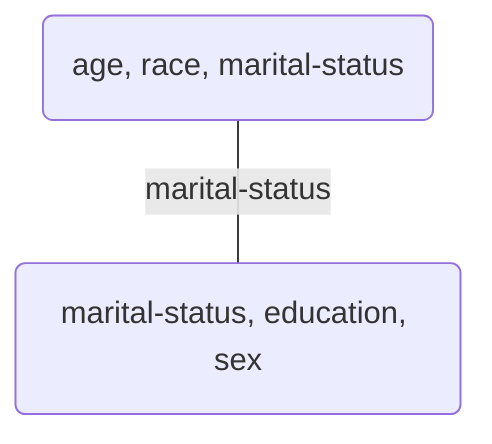

```python
import numpy as np
import pandas as pd
import plotly.graph_objects as go
import plotly.express as px
from IPython.display import display, Markdown
import itertools
from pprint import pprint
import scipy
import networkx as nx

def print_markdown(markdown: str) -> None:
    display(Markdown(markdown))


def render_plotly_html(fig: go.Figure) -> None:
    fig.show()
    display(
        Markdown(
            fig.to_html(
                include_plotlyjs="cdn",
            )
        )
    )
```

## Representation

First, lets discuss _tabular_ or _relational_ data, that is, data that can be stored in a table. Then, I will show how we can represent this tabular dataset in an Undirected Graphical Model. I will use the [`adult`](https://archive.ics.uci.edu/dataset/2/adult) dataset from uci repo as an example.


```python
X = pd.read_csv("adult.csv").fillna(value="NA")
n, p = X.shape
```


```python
print_markdown(X.head().to_markdown())
```


|    |   age |   workclass |   fnlwgt |   education-num |   marital-status |   occupation |   relationship |   race |   sex |   capital-gain |   capital-loss |   hours-per-week |   native-country |   income>50K |
|---:|------:|------------:|---------:|----------------:|-----------------:|-------------:|---------------:|-------:|------:|---------------:|---------------:|-----------------:|-----------------:|-------------:|
|  0 |    23 |           5 |        4 |              12 |                2 |            8 |              3 |      0 |     1 |              2 |              0 |               39 |                0 |            0 |
|  1 |    34 |           1 |        4 |              12 |                0 |            4 |              2 |      0 |     1 |              0 |              0 |               12 |                0 |            0 |
|  2 |    22 |           0 |       13 |               8 |                1 |            6 |              3 |      0 |     1 |              0 |              0 |               39 |                0 |            0 |
|  3 |    37 |           0 |       15 |               6 |                0 |            6 |              2 |      4 |     1 |              0 |              0 |               39 |                0 |            0 |
|  4 |    12 |           0 |       22 |              12 |                0 |            5 |              0 |      4 |     0 |              0 |              0 |               39 |               12 |            0 |


### Histograms

One compact representation of tabular data is by a [histogram](https://en.wikipedia.org/wiki/Histogram). The univariate histogram is the empirical distribution of a variable:

$$\tilde P(\text{Occupation} = j) = \frac{1}{N}\sum_N I\{x_{i, \text{occupation}} = j\}$$


```python
render_plotly_html(px.histogram(X, x="occupation"))
```


<html>
<head><meta charset="utf-8" /></head>
<body>
    <div>                        <script type="text/javascript">window.PlotlyConfig = {MathJaxConfig: 'local'};</script>
        <script charset="utf-8" src="https://cdn.plot.ly/plotly-2.30.0.min.js"></script>                <div id="ec0ca357-3681-485e-8861-7a456f272ec9" class="plotly-graph-div" style="height:100%; width:100%;"></div>            <script type="text/javascript">                                    window.PLOTLYENV=window.PLOTLYENV || {};                                    if (document.getElementById("ec0ca357-3681-485e-8861-7a456f272ec9")) {                    Plotly.newPlot(                        "ec0ca357-3681-485e-8861-7a456f272ec9",                        [{"alignmentgroup":"True","bingroup":"x","hovertemplate":"occupation=%{x}\u003cbr\u003ecount=%{y}\u003cextra\u003e\u003c\u002fextra\u003e","legendgroup":"","marker":{"color":"#636efa","pattern":{"shape":""}},"name":"","offsetgroup":"","orientation":"v","showlegend":false,"x":[8,4,6,6,5,4,2,4,5,4,4,5,8,3,1,10,9,7,3,4,5,2,9,10,0,0,1,14,4,1,12,3,4,8,2,7,7,8,3,5,7,5,0,8,6,5,7,4,1,5,4,2,5,4,4,0,7,2,8,7,3,14,10,5,0,1,8,8,4,14,5,3,3,7,5,2,8,14,2,9,3,2,2,3,1,3,12,5,3,5,5,1,7,3,12,6,5,3,4,2,4,4,5,0,1,1,14,6,8,6,3,5,2,3,7,6,3,1,3,1,2,4,4,5,2,4,8,8,14,1,3,2,1,3,0,5,1,8,3,1,1,3,2,5,0,10,2,2,1,14,8,8,4,1,14,1,6,3,1,2,14,2,4,4,3,2,4,12,6,5,2,12,3,1,5,3,1,6,2,5,4,8,1,7,8,8,4,14,5,5,7,7,1,0,0,10,1,4,5,3,5,14,4,5,8,3,2,1,3,3,10,1,3,1,7,4,3,3,5,1,6,14,2,8,7,3,14,9,8,8,10,3,8,1,5,2,8,4,4,10,5,2,12,14,1,8,8,2,0,8,5,8,2,8,10,9,2,2,4,1,5,3,2,3,1,4,14,4,5,1,4,2,9,5,5,6,1,4,0,7,5,1,3,5,6,3,5,2,4,1,5,5,12,3,0,10,3,14,1,3,8,2,10,3,8,8,0,5,8,9,3,4,14,5,3,7,3,7,0,2,4,1,10,4,1,9,14,5,6,10,1,8,2,8,10,2,1,5,3,2,3,1,12,9,12,3,14,14,2,5,4,2,4,10,14,8,2,0,8,1,2,5,10,4,3,1,3,3,4,3,8,2,7,7,1,8,1,3,4,3,10,1,1,3,10,2,7,8,8,2,2,1,1,4,2,0,6,14,4,4,6,2,12,0,6,4,8,1,14,4,2,6,4,4,7,1,7,2,7,10,3,6,4,9,1,10,5,6,4,5,14,14,5,2,1,5,9,12,8,8,5,8,13,5,1,3,4,1,7,14,7,1,1,4,3,7,4,10,10,14,9,10,5,1,0,8,10,10,4,0,5,14,1,10,2,1,2,6,2,2,1,1,5,1,14,8,14,10,5,3,2,8,4,5,1,8,7,2,5,14,9,10,8,2,3,4,12,4,8,2,6,14,1,5,1,14,8,14,14,5,4,4,6,0,7,3,4,8,1,5,7,7,2,4,5,0,11,1,9,14,10,5,6,10,3,6,2,12,6,1,4,2,8,7,1,7,7,8,0,2,10,3,5,6,5,6,4,2,1,4,1,5,3,1,5,4,14,3,5,1,14,3,1,7,0,3,8,2,1,5,14,14,10,5,8,3,14,5,0,5,0,8,2,2,9,8,1,1,4,2,5,1,6,5,2,6,10,4,3,5,3,2,11,10,6,9,3,3,4,3,2,2,1,8,1,2,6,4,10,5,1,1,6,3,1,5,8,1,14,0,2,4,5,4,7,8,14,1,1,7,6,3,5,5,3,5,10,1,14,7,4,14,9,4,3,3,2,8,1,4,12,1,1,4,8,4,14,5,4,2,9,7,5,5,0,14,5,0,5,3,5,3,6,1,5,4,2,3,1,2,5,8,5,0,8,2,7,0,3,4,2,1,5,4,4,5,3,2,2,4,2,8,8,2,14,1,3,5,2,0,2,10,4,0,6,5,10,8,1,5,4,5,1,10,6,1,10,5,8,9,2,8,12,4,3,2,2,3,3,7,9,9,1,0,3,0,8,5,3,0,1,7,4,4,3,8,9,7,14,14,0,0,14,3,10,2,7,7,0,4,1,2,9,8,3,1,14,5,5,10,2,14,4,8,9,2,5,1,10,10,8,5,0,8,4,10,2,7,8,3,14,8,6,4,14,7,8,5,4,9,3,1,5,5,1,5,2,4,1,1,5,8,3,5,5,10,8,2,5,4,8,9,4,4,7,3,6,3,9,5,4,10,3,3,2,4,6,8,10,8,7,8,1,3,1,14,4,1,3,0,14,4,8,5,9,5,3,4,4,0,2,1,6,14,3,7,7,5,6,0,3,1,9,1,3,4,5,4,4,2,3,10,7,8,14,7,7,4,3,11,7,14,2,8,7,1,5,5,1,3,2,7,4,2,7,4,8,4,1,9,5,4,2,2,4,1,3,10,4,4,5,7,1,4,10,2,3,1,4,14,1,0,4,1,10,3,4,5,2,6,8,8,14,9,12,2,1,8,1,5,3,7,1,8,4,4,5,4,7,4,2,5,5,5,2,8,7,4,1,3,7,10,7,5,5,6,0,2,1,14,1,5,3,2,7,2,5,4,8,3,8,2,3,2,14,14,4,2,11,14,2,7,8,4,0,5,14,2,3,5,7,3,8,3,1,3,10,1,5,1,4,7,2,2,3,2,5,10,4,0,5,1,1,5,8,1,3,3,1,5,5,4,9,12,8,10,12,4,4,1,5,3,5,1,8,5,7,14,3,5,14,7,4,4,5,8,5,6,1,10,3,3,8,3,6,7,1,10,5,5,0,0,4,0,2,8,10,6,2,5,7,14,2,8,14,4,4,8,1,1,2,3,3,2,3,5,4,7,4,4,2,8,14,1,12,9,4,5,10,6,1,10,3,0,5,8,8,14,5,10,8,2,9,2,2,14,8,5,8,2,14,4,5,8,1,14,4,1,8,5,2,1,10,0,2,5,5,5,7,1,8,5,1,2,1,3,12,3,14,7,3,8,1,5,2,14,1,14,4,5,1,1,1,8,10,8,5,9,8,5,5,8,8,1,2,3,3,3,2,8,5,8,4,4,2,2,5,8,8,6,4,4,8,8,10,1,8,3,5,8,1,10,14,2,1,3,5,1,8,12,4,2,2,0,2,8,3,12,10,3,3,5,14,9,8,10,3,2,4,1,14,2,10,5,6,1,2,0,2,1,13,2,10,5,4,7,7,8,3,1,4,5,14,8,6,7,5,14,5,1,8,8,3,10,8,14,6,2,3,2,7,7,7,5,5,5,5,4,0,4,5,5,8,8,3,8,4,14,4,14,5,1,3,1,7,9,1,0,3,7,1,1,2,3,4,4,7,8,4,6,2,14,2,3,8,3,10,9,3,4,8,3,5,6,4,7,3,4,14,2,0,1,3,8,7,10,10,3,6,10,8,0,8,1,14,2,3,1,10,10,2,2,5,4,4,8,2,3,5,8,14,6,8,2,8,7,9,2,7,10,7,4,3,14,12,10,2,8,5,3,1,14,4,1,2,10,3,4,4,4,1,10,14,4,1,8,1,10,14,5,4,7,1,10,1,8,1,4,12,5,10,5,5,5,6,8,2,8,8,2,1,1,3,1,5,9,8,2,8,4,3,4,8,8,6,1,3,3,4,8,4,7,2,4,14,1,4,3,8,8,5,5,5,5,4,2,8,8,4,2,12,2,4,9,5,6,2,7,4,4,1,7,4,10,2,5,4,7,7,2,8,5,12,1,14,1,3,8,1,7,8,6,7,8,5,10,8,3,10,2,6,1,14,12,2,2,9,2,1,14,14,1,2,6,14,8,9,0,5,14,3,3,3,8,9,1,4,1,4,8,12,5,14,5,2,5,8,3,7,3,1,4,5,7,0,8,14,1,1,2,3,5,5,7,8,5,5,4,1,10,3,4,2,4,2,5,1,3,7,14,2,2,8,9,7,4,2,3,5,7,2,5,5,5,5,8,7,3,4,8,6,1,3,12,1,5,14,1,3,1,1,4,5,12,6,14,3,3,8,5,3,4,1,3,8,4,14,1,1,10,2,7,4,7,10,4,2,4,2,5,2,8,3,4,3,7,4,6,1,5,8,2,6,1,14,7,1,14,7,4,3,1,7,3,7,8,8,5,3,10,8,12,3,4,2,1,1,3,5,2,4,4,3,2,3,4,1,2,2,10,8,2,1,8,1,4,5,8,2,8,7,10,8,7,4,4,4,9,14,2,5,14,8,7,4,5,6,7,12,0,12,4,1,14,2,7,7,9,14,3,3,4,2,4,8,5,5,4,8,6,0,1,2,8,7,3,8,6,8,3,8,8,2,5,4,5,7,3,12,4,4,4,10,3,3,6,1,1,1,8,6,1,3,14,10,4,5,8,3,10,2,3,5,5,1,8,3,9,8,8,1,10,1,1,10,10,14,2,5,1,6,14,6,1,10,5,5,2,2,8,3,7,4,1,12,14,2,8,2,5,10,8,4,8,2,3,4,3,14,8,2,0,5,4,4,2,3,9,2,4,9,4,2,5,3,4,3,10,7,5,2,9,10,8,1,7,5,5,10,10,1,7,4,1,1,4,3,12,5,8,8,1,0,14,3,4,3,6,1,5,8,14,7,0,3,4,5,4,4,8,9,3,12,8,8,4,5,8,5,4,4,4,5,7,12,10,3,2,5,4,8,5,5,3,10,2,3,8,1,3,3,14,5,2,3,5,4,3,9,6,5,8,4,1,4,7,3,14,1,3,11,6,3,4,4,7,3,5,3,1,1,3,9,4,3,9,8,1,1,2,4,2,2,5,5,5,5,8,4,1,2,5,2,2,4,14,7,6,0,5,4,5,1,1,3,4,14,1,5,4,4,2,9,4,4,8,14,1,1,5,8,3,2,3,3,10,5,10,6,8,2,14,5,4,8,11,4,8,2,4,5,9,14,4,12,8,2,7,9,4,12,4,4,7,14,4,3,8,8,2,3,14,3,3,14,1,5,8,5,1,4,1,1,3,10,14,1,1,9,3,12,8,8,3,4,0,1,5,14,1,8,7,12,0,11,3,14,1,2,5,8,5,8,4,1,3,11,8,2,4,5,0,8,5,10,1,5,7,5,1,7,8,14,5,11,14,1,3,3,3,4,2,1,14,14,2,3,4,3,11,1,12,7,10,3,5,1,8,7,4,4,5,3,9,3,1,5,7,3,10,10,8,8,6,3,7,1,8,8,10,9,8,8,5,4,7,10,2,3,12,14,2,6,14,2,3,8,4,7,3,1,2,14,1,10,0,8,5,8,10,3,4,3,3,7,5,0,5,0,8,5,1,6,1,4,1,3,8,6,8,4,8,8,4,4,2,9,2,3,4,10,1,8,1,4,3,7,10,1,3,1,7,3,3,1,7,2,1,3,5,5,14,2,5,5,3,5,5,12,1,6,1,14,1,1,7,1,8,2,8,4,3,0,2,3,2,1,6,5,8,10,5,3,8,8,1,4,3,5,3,1,12,1,14,4,4,1,14,9,3,4,5,10,10,4,8,7,10,0,4,14,1,9,2,4,3,0,6,1,4,4,4,4,9,14,3,14,2,14,14,4,5,1,6,10,2,8,5,1,6,12,5,14,1,5,3,3,7,8,4,14,1,14,2,4,3,3,9,10,8,4,5,6,6,3,7,5,14,3,7,8,7,2,4,3,7,4,2,8,2,2,8,4,9,4,5,9,8,3,1,14,8,10,3,7,7,5,14,3,9,1,1,3,4,0,2,8,2,0,1,3,7,8,1,3,5,6,2,12,2,3,2,3,8,8,7,3,1,8,1,1,1,4,12,14,3,7,3,3,3,0,5,0,3,1,10,14,1,7,6,3,4,8,4,5,1,14,8,1,3,1,14,6,1,4,10,14,4,3,12,8,4,7,1,10,1,14,3,1,1,12,8,8,14,10,6,2,4,2,1,1,14,1,2,7,7,5,4,4,4,2,2,12,3,1,8,8,3,7,4,8,8,3,7,14,3,10,8,8,5,2,9,3,8,4,9,3,5,5,8,8,7,4,8,3,8,14,5,9,4,14,14,1,7,5,3,3,8,14,10,10,7,1,4,1,8,14,5,4,1,8,1,7,4,14,6,1,5,10,8,8,10,0,4,6,2,14,4,2,4,3,10,3,7,4,8,10,8,3,6,10,3,1,1,1,1,4,1,6,1,0,0,14,3,14,5,8,4,14,7,1,5,8,1,2,1,2,3,8,8,8,4,5,8,4,8,3,8,10,5,1,1,7,5,4,3,6,2,2,4,6,3,5,14,2,1,14,8,9,0,5,5,5,0,4,8,5,5,10,14,1,8,2,4,1,10,2,3,9,5,3,8,3,2,2,0,6,5,3,8,0,7,2,4,1,8,5,3,4,3,8,3,6,4,5,5,5,8,2,2,11,5,2,4,1,5,12,3,8,4,4,2,2,8,3,7,4,7,10,7,3,14,4,3,9,2,4,6,4,4,14,14,1,8,2,8,1,10,3,12,8,4,2,2,0,5,3,10,8,2,5,3,3,12,6,8,3,3,5,7,8,8,1,3,5,7,5,8,2,5,5,2,5,5,8,3,5,2,2,8,9,2,3,8,3,10,1,7,5,2,4,7,1,5,5,4,1,7,4,5,4,4,3,5,8,3,1,2,3,1,5,5,8,2,3,3,5,14,4,2,9,5,3,3,5,2,14,14,14,5,3,7,6,5,3,7,6,2,5,6,1,12,1,5,8,12,1,1,6,2,6,8,4,4,1,14,1,3,5,8,2,8,4,5,4,8,7,2,5,0,10,4,6,3,2,2,11,8,2,4,6,3,8,8,7,3,3,0,4,3,9,1,1,4,1,3,1,7,8,10,14,1,14,5,7,8,2,2,7,9,3,4,1,0,2,1,2,14,5,1,5,4,14,12,7,5,4,5,4,9,5,14,5,9,1,4,1,8,3,3,9,5,6,3,1,8,1,3,7,8,4,6,4,9,8,2,1,6,1,4,5,3,4,9,3,10,4,7,6,14,7,1,2,3,8,14,0,0,1,1,3,4,5,5,6,4,8,5,9,4,5,1,1,1,3,1,7,5,2,4,7,7,1,14,8,3,5,8,1,3,4,5,14,8,6,10,8,3,9,4,10,3,10,6,4,7,3,4,8,10,2,5,1,6,5,14,10,8,4,2,4,4,14,1,3,3,3,4,2,4,5,7,4,1,6,9,7,8,14,3,8,0,9,4,5,4,14,5,5,3,7,9,7,2,3,5,4,5,4,3,5,5,8,4,2,0,3,9,9,14,8,1,8,8,8,4,8,4,7,5,2,14,10,1,5,10,9,3,8,8,1,1,1,4,4,3,14,5,4,4,6,5,4,5,3,3,5,2,1,4,5,1,7,4,8,4,1,5,4,10,8,3,5,6,4,5,8,6,2,2,12,1,7,3,5,3,3,2,3,7,1,7,2,7,2,3,9,3,7,3,4,7,3,3,3,1,4,14,7,5,6,14,3,2,8,1,9,1,3,8,4,2,1,8,3,9,10,3,14,7,4,14,4,7,2,1,1,5,4,14,2,2,6,7,5,3,3,8,3,4,8,3,5,6,1,14,5,1,6,5,5,1,10,8,4,4,0,5,5,14,2,4,1,1,5,8,5,1,1,4,10,5,9,2,8,2,2,9,1,1,4,14,5,4,4,0,10,14,2,3,8,1,8,2,8,4,3,8,6,8,3,5,9,5,10,3,12,0,4,7,8,0,1,10,5,8,9,5,5,8,14,0,8,1,6,7,8,4,14,1,2,8,2,3,8,7,8,1,1,5,9,14,8,1,6,5,8,8,8,4,3,11,2,4,8,4,7,4,5,4,5,14,2,0,1,1,10,3,1,8,7,4,1,1,7,10,3,14,9,5,5,2,5,9,2,5,4,7,4,10,1,1,14,9,8,4,7,4,3,6,4,7,7,3,1,1,4,3,4,4,2,8,2,5,9,2,5,3,3,10,0,3,7,3,2,10,1,1,1,14,5,6,1,2,5,4,9,1,3,4,3,5,8,14,5,7,14,5,3,14,1,2,10,5,8,5,4,7,5,3,4,10,5,2,5,4,3,7,3,4,0,6,3,5,1,4,14,7,4,5,2,8,5,2,4,2,2,1,6,5,0,5,1,4,4,4,8,12,10,3,3,1,8,0,4,5,14,1,12,2,1,1,1,4,6,7,8,6,2,7,3,14,9,10,2,2,4,8,4,1,3,9,3,8,8,3,6,1,3,3,4,3,1,3,3,14,4,8,5,4,2,9,7,1,4,2,5,7,7,0,7,1,14,14,5,4,2,5,5,14,1,10,2,12,5,2,5,3,14,4,0,5,14,9,14,2,8,14,8,0,2,5,5,10,3,2,10,1,7,5,8,3,0,8,1,0,4,9,2,3,8,3,11,7,8,4,8,5,4,5,5,14,8,12,1,7,7,8,1,3,10,10,7,1,7,2,3,7,4,2,8,4,5,1,10,5,7,2,3,6,10,8,9,7,5,3,4,4,10,7,14,4,5,1,5,6,7,5,8,3,12,3,4,8,4,1,2,6,6,4,10,1,1,8,2,3,7,3,4,7,4,6,1,14,5,1,2,1,8,5,8,9,8,12,4,8,4,4,2,8,10,4,8,3,4,14,8,5,1,4,8,1,7,5,3,8,14,2,1,2,2,8,10,5,14,9,11,14,1,8,4,0,7,8,3,12,8,9,10,14,1,5,2,8,6,3,12,8,2,2,5,11,10,14,4,14,8,5,12,10,8,8,1,3,1,10,4,12,4,4,3,4,8,2,1,10,7,10,3,1,12,2,8,2,2,14,5,4,5,3,5,0,12,5,5,2,5,4,1,8,9,2,14,1,9,10,9,10,1,4,2,5,10,5,14,2,5,4,4,1,8,7,8,14,4,8,8,3,0,4,3,14,2,2,6,3,8,3,5,4,3,10,0,14,1,3,10,6,1,3,6,12,7,3,4,6,10,4,4,7,12,5,4,7,5,3,0,14,1,1,8,7,3,5,8,14,5,14,2,1,4,14,14,2,8,6,5,8,2,4,3,1,5,4,1,1,14,2,5,10,12,1,8,2,8,3,5,4,6,1,3,2,1,1,5,3,8,5,1,7,5,7,14,8,7,4,0,14,4,14,14,5,0,10,3,7,5,5,1,1,5,1,1,14,5,10,5,1,10,14,8,6,6,8,8,4,9,8,3,3,14,7,5,4,2,2,8,2,7,12,14,8,1,0,4,8,2,1,10,1,3,7,3,14,5,1,3,11,6,5,8,3,6,8,12,4,7,14,14,3,8,14,3,8,0,1,4,9,2,4,12,5,1,2,1,5,4,2,10,1,4,8,6,2,3,7,7,2,1,1,3,5,10,1,4,5,6,8,1,8,3,3,3,8,3,3,2,6,4,2,6,8,14,5,8,4,1,3,0,3,14,6,1,2,1,2,14,4,5,8,14,1,5,5,7,4,6,5,6,10,1,2,10,6,3,6,3,2,3,14,8,10,12,2,8,5,10,0,3,10,8,8,7,2,3,10,4,5,5,2,1,4,9,1,8,8,4,1,8,2,12,7,8,4,1,5,1,14,9,2,8,5,14,3,5,14,8,6,11,3,1,1,1,0,2,4,2,4,2,14,3,2,0,9,14,2,1,4,8,5,10,2,3,1,5,8,1,7,10,4,1,7,7,3,1,1,5,12,7,2,14,7,4,4,9,2,7,3,5,0,5,9,14,7,1,14,3,14,3,5,8,3,1,1,2,8,2,2,8,10,1,4,4,5,4,5,5,10,4,3,14,5,1,1,3,1,5,6,2,3,7,0,1,8,6,0,8,1,10,2,3,2,8,9,4,4,5,1,10,2,8,4,14,2,5,6,3,3,8,5,6,2,3,2,7,7,8,7,14,3,1,7,4,5,5,3,2,4,2,14,3,9,2,1,1,8,0,7,9,14,0,3,5,1,4,14,1,8,8,4,1,8,4,1,5,1,10,4,6,4,12,4,5,4,3,5,2,14,5,5,8,1,3,5,10,4,8,4,6,4,6,7,10,5,5,1,4,1,8,5,5,6,1,10,4,3,3,7,4,14,7,10,4,8,5,1,4,5,7,3,4,4,7,3,7,1,1,8,1,1,5,1,2,14,5,6,3,5,3,4,2,4,3,3,1,4,8,3,8,14,10,5,2,14,8,1,8,8,4,2,7,4,14,1,3,1,10,2,8,6,8,8,4,5,0,14,4,14,5,3,5,5,4,3,7,4,2,4,8,1,3,1,8,8,3,1,5,12,9,5,14,2,3,8,14,4,5,3,7,3,10,8,8,10,5,5,1,2,4,5,3,5,4,3,8,8,1,2,5,2,3,3,5,3,1,4,9,1,2,14,14,6,4,5,5,10,6,7,6,7,2,4,1,2,4,8,8,3,10,14,2,6,8,5,1,4,7,2,2,8,4,14,6,7,6,3,5,5,3,5,8,8,9,9,1,4,5,1,14,4,7,5,1,14,2,6,8,3,10,4,7,2,2,3,8,1,3,5,12,8,8,4,6,8,9,5,7,12,2,5,2,10,8,3,3,2,8,8,2,7,3,1,14,4,2,3,1,4,5,7,1,2,10,1,8,3,14,14,4,2,1,3,5,14,9,10,8,5,4,12,4,14,4,2,3,5,6,14,1,8,1,8,10,2,0,5,1,1,2,5,1,4,2,2,2,8,10,6,3,3,3,4,5,1,6,14,5,4,2,10,2,3,5,1,6,2,5,9,4,5,1,3,3,1,4,0,3,1,5,4,4,4,5,10,8,14,5,7,14,1,0,8,0,0,1,2,3,2,1,1,1,6,3,6,10,7,9,1,2,5,1,12,8,1,6,8,2,1,2,4,2,14,3,1,3,1,10,5,5,14,2,1,9,8,2,3,4,7,10,4,5,5,5,3,4,14,3,5,4,5,3,5,14,1,4,14,1,7,1,3,3,5,8,12,5,7,14,5,0,1,2,2,2,9,0,1,5,3,14,3,4,1,14,6,4,1,10,7,5,2,5,8,7,6,7,4,8,3,10,8,10,14,7,2,9,5,10,3,8,0,3,5,14,7,8,8,4,4,14,8,7,3,5,1,2,8,8,1,2,2,1,8,1,3,8,14,5,8,14,0,2,8,3,1,6,8,1,4,4,9,1,4,12,6,0,8,3,4,10,9,5,7,10,4,1,12,1,7,3,2,5,8,5,3,8,4,5,8,4,5,10,1,1,3,14,4,4,8,4,1,9,2,2,0,4,9,3,5,5,5,1,4,1,1,2,4,5,8,1,5,7,8,8,6,1,4,2,5,4,8,8,4,8,3,4,14,0,8,5,10,2,2,1,2,6,8,8,8,8,8,7,1,14,4,3,5,3,7,5,3,4,3,4,8,3,2,4,2,14,8,5,4,1,5,10,5,7,4,4,5,14,10,5,9,5,8,1,1,3,6,14,8,14,5,1,6,2,5,4,4,3,10,6,4,4,7,1,1,8,5,5,0,4,7,1,3,2,3,10,12,0,10,5,5,10,7,5,8,4,6,14,1,10,8,8,3,5,4,9,3,2,3,6,5,9,11,8,4,7,1,12,1,8,5,4,5,1,10,9,5,4,3,3,5,1,2,7,2,4,8,10,1,1,1,14,1,4,6,1,5,5,9,3,5,3,3,2,2,1,7,3,10,12,8,3,9,1,1,1,3,2,4,1,7,7,8,2,3,5,12,9,4,2,3,2,1,4,1,3,2,7,2,10,7,4,5,1,3,3,2,5,1,2,5,3,3,7,4,3,4,1,8,4,10,2,1,6,8,12,2,4,10,2,8,3,3,4,14,1,7,7,3,8,8,1,9,14,8,4,1,5,8,2,3,1,5,8,6,9,9,1,3,14,4,3,4,3,8,10,5,5,1,6,5,4,3,3,5,10,8,1,2,4,14,7,8,5,3,14,8,4,5,5,5,1,5,2,14,2,14,3,7,9,3,14,4,3,1,4,4,5,8,5,8,4,7,1,4,14,6,2,4,2,3,8,3,0,3,12,5,0,2,4,5,1,4,8,6,1,3,3,5,7,12,7,14,2,1,8,2,8,1,0,2,3,8,10,3,5,10,10,10,8,3,12,5,4,5,6,3,12,6,4,5,3,8,6,4,10,7,5,5,3,9,14,10,14,6,8,9,6,7,14,2,4,8,9,14,2,1,4,5,4,8,9,1,8,1,12,1,14,14,3,10,7,6,9,12,4,5,2,4,6,6,4,4,1,5,8,4,14,7,7,8,14,6,14,7,2,4,2,5,1,10,4,6,3,6,5,2,1,14,1,1,3,2,5,3,3,10,4,12,3,1,12,4,1,5,10,3,4,8,3,14,14,6,4,8,0,3,2,7,8,0,5,8,2,8,1,2,4,10,5,4,1,5,4,5,3,3,8,5,2,8,3,8,2,3,1,10,9,9,5,2,2,4,6,8,7,3,1,2,5,8,8,7,5,4,1,8,14,1,1,4,3,7,14,2,10,6,3,7,8,1,8,1,5,8,5,4,8,3,3,7,4,4,6,8,2,5,1,14,6,5,2,1,2,5,1,4,0,8,3,2,5,7,3,5,1,4,3,12,14,3,5,8,7,8,2,1,3,5,8,7,8,1,1,1,3,2,2,7,3,3,5,8,1,7,5,3,2,10,1,8,1,4,14,2,5,14,5,7,5,3,2,2,10,5,5,4,6,7,4,4,12,8,2,3,14,5,1,12,3,3,1,4,3,2,3,8,5,14,12,1,0,14,3,10,1,4,1,8,3,10,4,9,10,7,11,7,0,1,4,1,4,8,5,6,5,4,14,3,3,5,2,1,5,1,6,3,0,4,5,4,2,5,4,1,10,3,12,3,8,3,1,9,2,4,4,2,10,1,2,14,8,4,2,8,9,1,3,2,14,8,4,5,1,3,1,0,2,10,3,0,3,2,10,8,12,5,7,1,14,2,0,3,2,1,4,5,7,1,4,1,6,2,10,7,5,1,5,12,3,8,8,5,2,5,8,14,5,3,4,0,1,3,8,14,8,2,1,4,2,8,0,3,12,8,7,3,7,1,1,5,2,4,1,5,5,5,8,8,1,5,7,2,2,3,9,7,14,1,3,8,6,4,7,10,12,4,12,4,5,4,1,6,7,7,1,11,2,7,8,1,5,10,3,5,4,7,4,7,7,14,5,6,10,5,8,0,5,4,0,2,5,10,14,1,8,10,3,0,2,1,8,0,1,8,8,5,3,8,0,0,2,4,1,8,14,2,7,1,4,4,12,10,8,8,4,1,2,1,5,14,9,0,10,2,14,3,7,4,10,4,1,4,3,3,2,2,4,7,5,7,3,9,6,1,3,2,7,4,14,4,2,4,5,4,8,4,10,5,11,2,6,10,2,1,4,2,2,8,7,14,1,9,1,1,7,8,6,3,3,5,10,5,9,1,3,7,1,5,2,7,1,7,3,9,2,1,10,7,3,1,3,1,1,4,8,5,3,2,8,8,12,8,8,10,8,1,1,4,3,10,6,1,2,4,8,1,7,8,4,2,8,4,14,1,1,7,2,14,10,1,5,0,5,10,14,3,3,5,6,1,8,8,8,3,1,3,1,2,6,5,5,3,1,4,5,0,3,5,5,8,8,7,1,1,7,2,8,1,4,11,4,4,1,10,5,7,5,7,1,2,7,9,4,14,9,10,4,10,10,14,5,4,2,1,7,1,3,2,6,2,7,0,10,1,1,1,4,8,5,7,3,4,9,4,0,7,3,4,5,3,6,14,3,3,0,3,4,2,10,6,4,5,1,9,2,5,3,3,8,8,8,4,10,10,2,14,0,2,3,2,8,1,8,3,8,10,1,14,2,8,7,4,3,9,1,14,8,3,5,5,4,4,5,7,4,10,9,1,8,10,8,1,5,5,1,2,4,7,5,8,10,10,10,8,3,8,2,1,0,3,2,2,7,1,8,6,1,5,9,1,2,4,2,2,1,7,8,4,1,5,8,12,4,7,10,10,4,5,3,2,1,0,2,8,4,5,5,14,9,0,8,4,8,3,2,1,2,10,2,5,8,1,4,4,2,4,4,1,2,4,3,10,2,1,3,2,5,3,4,3,1,10,8,12,8,4,4,6,2,5,8,1,3,3,14,1,9,5,4,2,12,8,2,6,8,12,2,5,8,4,3,8,0,4,2,4,5,3,1,5,1,4,2,1,4,12,1,8,0,9,9,3,5,4,1,8,4,8,3,8,5,8,5,4,4,8,6,14,5,5,1,8,4,9,6,8,3,5,5,5,2,1,1,3,4,8,1,3,3,3,8,1,4,2,5,12,1,8,6,5,1,9,1,2,2,5,1,8,3,8,1,3,12,12,1,5,1,4,10,3,14,14,8,8,4,3,3,8,3,8,2,4,5,2,2,5,1,1,7,3,5,8,10,3,4,3,0,1,3,4,14,4,2,8,5,2,4,3,9,0,3,5,2,8,8,8,1,4,5,8,5,3,5,10,12,0,4,3,14,4,8,1,4,3,3,5,8,14,1,10,8,3,3,1,8,5,11,4,7,9,4,8,7,8,6,10,8,1,4,9,4,9,5,10,5,8,10,2,4,4,5,4,2,5,1,6,9,5,5,11,8,0,6,4,2,10,0,8,5,5,9,2,3,14,3,4,2,1,6,1,5,4,8,9,6,4,3,5,8,2,3,1,3,2,2,4,5,1,14,9,1,7,3,2,3,2,1,5,4,4,8,7,2,4,14,8,2,1,7,4,6,5,2,10,3,3,8,8,8,3,4,5,1,10,4,8,8,8,1,3,5,5,5,10,4,5,3,5,5,4,5,3,5,5,2,3,1,10,5,4,4,5,8,6,1,1,5,9,3,0,6,2,2,0,1,7,14,2,12,3,6,3,8,10,7,4,10,14,3,8,5,3,8,10,5,8,3,8,1,5,5,3,14,1,7,10,8,2,14,3,7,8,12,3,4,14,6,0,10,5,10,1,5,0,14,9,5,5,10,10,14,8,9,8,9,0,3,9,8,4,0,6,3,2,2,8,4,2,1,11,1,3,4,2,4,7,8,14,3,3,2,3,3,6,7,0,3,2,7,3,2,2,1,5,4,5,12,8,2,6,0,4,10,3,10,8,9,4,3,1,1,4,8,1,10,2,3,4,5,5,3,1,10,5,1,5,14,7,8,5,1,3,14,8,8,1,6,10,7,9,7,1,2,6,2,3,3,1,8,14,5,12,8,5,7,4,6,0,5,8,1,4,0,0,3,14,7,3,3,1,3,8,4,8,2,2,7,5,8,5,7,2,8,1,5,10,8,10,4,5,3,4,8,2,5,4,5,6,1,3,5,10,4,9,2,7,5,1,1,8,5,4,5,5,1,6,1,3,6,14,14,5,9,2,1,4,4,10,2,9,9,2,5,2,3,2,5,5,2,14,2,7,8,5,3,1,1,1,8,5,1,1,14,8,9,8,8,1,8,11,6,4,8,2,4,7,8,9,8,3,2,1,1,3,1,4,2,3,8,8,2,3,10,3,14,4,4,3,3,5,4,1,3,8,5,4,8,5,5,6,4,0,5,1,7,8,2,4,3,3,2,5,10,2,8,6,1,5,8,5,14,5,2,4,8,5,2,1,4,3,5,5,8,5,1,12,1,10,10,1,8,8,2,3,1,4,14,8,14,2,9,3,10,6,2,4,0,4,0,9,2,5,5,14,7,4,3,12,8,2,5,5,10,3,8,8,5,8,5,2,1,3,14,8,10,1,4,4,2,4,10,5,12,5,8,5,4,7,1,8,14,4,4,2,3,5,2,6,1,0,3,5,5,8,4,5,8,1,8,5,4,14,4,7,3,1,8,4,4,4,8,1,4,10,14,1,4,3,4,2,5,0,1,8,8,7,3,10,3,5,5,5,10,8,2,1,8,1,3,4,8,8,0,10,9,1,5,8,5,1,2,8,6,7,5,10,8,5,3,14,4,14,3,8,2,8,5,5,8,7,2,5,1,8,7,2,4,14,3,7,3,6,1,8,4,12,12,5,5,5,1,2,8,14,0,10,3,4,7,3,3,3,3,8,8,9,3,1,0,3,3,0,1,4,7,14,8,8,4,1,1,8,8,5,1,2,5,2,4,2,1,4,4,2,2,10,9,8,7,10,4,14,8,7,5,1,3,2,3,5,5,4,2,4,1,2,3,2,8,0,8,0,7,9,0,5,14,7,14,3,5,5,14,4,8,3,12,9,4,3,4,3,9,3,10,3,5,10,1,3,2,0,8,3,1,5,0,5,8,9,0,7,14,2,2,1,10,8,0,5,7,6,2,5,4,14,6,8,1,3,1,5,3,7,3,3,5,1,8,5,14,8,6,14,7,2,4,5,8,14,5,1,10,7,8,7,5,2,8,4,4,5,2,9,3,1,7,3,5,14,5,9,7,8,1,8,0,0,5,5,3,1,3,4,7,8,8,12,1,10,12,1,2,5,1,5,8,0,3,3,1,3,8,7,6,3,7,3,0,8,2,12,10,8,5,2,1,6,0,8,8,2,10,9,4,12,1,6,3,8,7,0,8,1,5,3,3,3,3,4,1,5,5,3,1,5,2,4,12,7,4,4,4,1,5,3,2,3,1,5,5,5,4,2,7,8,4,14,3,2,10,8,4,5,2,1,5,14,10,0,5,4,5,1,7,4,2,7,10,5,1,11,8,3,3,7,5,7,14,5,7,2,12,5,7,8,12,6,4,3,1,1,3,5,4,1,14,12,1,10,7,7,1,8,2,8,12,1,14,5,8,10,0,1,8,5,6,2,4,2,8,3,10,0,2,10,5,5,12,4,1,12,4,2,2,0,12,5,7,7,7,9,2,9,8,1,10,3,5,3,1,1,1,5,5,5,2,3,3,4,2,8,8,1,4,5,6,0,2,5,3,6,10,8,4,3,2,8,8,4,1,2,9,6,2,5,6,0,0,8,8,2,8,14,7,5,2,10,1,4,3,1,4,12,3,8,8,3,4,3,7,2,1,14,8,8,8,5,2,14,12,4,11,4,2,5,5,2,14,8,8,2,6,8,2,1,3,12,2,2,8,5,5,7,5,4,1,2,10,5,1,8,10,3,4,8,9,4,2,5,6,8,1,1,8,10,14,8,10,5,6,2,5,3,1,8,1,7,8,1,7,2,1,9,8,0,4,5,5,4,0,8,1,8,7,3,12,1,6,5,4,4,4,3,2,2,8,4,4,3,14,4,4,3,5,14,14,3,8,3,10,10,3,1,0,2,9,4,1,8,8,5,14,1,8,14,6,7,3,6,14,8,8,3,5,5,7,7,3,5,1,0,4,5,2,4,10,5,3,3,4,10,7,10,8,7,9,14,7,2,10,8,2,4,2,8,7,4,8,6,8,8,1,8,8,5,6,3,4,1,5,2,8,5,1,2,7,4,9,4,2,10,1,2,7,3,3,1,3,1,5,2,3,5,2,5,3,3,4,14,7,8,5,2,6,9,0,5,4,5,7,1,1,2,12,8,4,3,2,14,4,10,8,4,3,9,5,1,5,1,4,4,1,1,0,0,7,4,12,8,3,1,7,1,4,5,5,5,3,8,5,7,2,8,4,8,5,4,6,5,14,7,3,6,4,8,5,6,0,0,2,3,2,1,2,1,14,2,2,2,8,7,14,1,11,4,14,8,0,7,3,2,6,0,6,8,2,3,2,14,1,5,8,3,2,6,12,5,7,14,7,9,2,4,4,2,4,7,3,9,14,6,12,14,9,4,8,7,5,0,8,5,1,0,7,2,5,8,3,2,3,4,2,3,3,9,5,4,8,8,4,14,2,5,5,3,3,1,12,6,0,4,14,1,5,4,1,4,3,3,1,5,8,4,3,14,7,4,5,1,3,8,1,8,12,2,2,5,8,5,9,9,5,5,1,12,5,7,14,1,1,4,1,3,7,1,4,6,14,0,1,10,14,4,0,3,10,8,2,1,1,4,10,4,5,5,7,7,2,4,7,2,5,7,2,10,14,2,5,8,3,14,4,3,8,6,8,7,3,12,8,7,7,8,7,1,1,4,4,8,5,2,2,12,8,10,4,4,3,8,2,2,0,2,7,6,2,2,14,2,3,7,7,0,2,5,6,2,5,12,8,1,3,7,5,3,2,8,3,14,2,1,1,1,4,8,3,14,5,8,1,5,5,14,6,5,4,4,11,0,3,6,1,7,7,4,9,5,1,7,7,5,1,4,7,14,5,8,14,3,8,2,2,14,6,3,8,8,2,3,2,1,3,8,8,6,2,1,14,1,8,1,4,4,2,4,3,5,8,5,3,2,4,8,9,4,1,1,14,2,5,1,5,4,4,3,5,3,10,14,5,4,1,14,3,7,4,7,8,2,4,7,3,3,5,14,2,6,2,3,12,5,9,1,8,4,9,5,1,2,3,14,7,4,14,5,10,4,4,7,9,2,14,5,14,6,14,7,5,8,4,5,2,8,6,2,1,3,2,5,6,2,1,5,4,10,7,4,3,10,5,3,5,8,4,3,8,2,10,8,14,3,10,9,3,5,2,3,5,6,5,10,7,14,8,10,5,4,4,3,3,2,4,4,10,0,6,8,2,7,7,8,3,4,14,6,10,1,9,5,5,3,8,1,2,2,2,2,10,10,12,4,7,4,8,14,1,8,3,14,0,5,3,3,8,1,6,8,5,11,2,4,9,4,4,4,8,10,4,4,6,2,3,2,8,1,8,2,14,3,5,5,4,10,12,0,9,5,5,2,4,5,0,4,1,4,3,14,8,10,7,1,8,8,2,5,2,5,10,6,8,3,1,8,3,1,1,3,4,1,7,8,4,3,4,8,5,7,3,6,2,9,1,2,1,3,5,4,7,4,3,4,5,6,10,1,10,6,7,2,8,10,7,14,1,1,8,4,8,8,2,2,3,3,10,4,11,8,2,8,8,10,6,3,8,10,4,10,14,1,10,4,8,5,5,8,4,1,2,3,8,8,2,6,8,8,12,5,4,6,8,10,7,8,7,2,3,8,3,1,1,4,3,8,2,4,0,3,1,4,14,5,5,5,4,3,1,2,3,1,3,6,2,9,7,2,8,3,8,8,3,2,5,14,4,3,5,2,10,4,4,3,1,4,6,2,5,10,5,8,8,1,8,4,8,5,1,8,3,1,1,3,0,6,3,1,3,4,4,4,5,4,1,2,6,14,5,6,1,1,3,8,6,4,8,5,10,1,4,0,4,8,14,14,3,7,5,4,11,8,4,2,0,2,5,5,5,2,8,4,4,2,8,5,8,10,4,3,14,1,9,4,5,11,5,4,4,2,12,2,8,10,10,0,0,9,3,9,0,2,7,1,2,5,6,14,4,2,6,4,5,12,3,8,5,10,5,1,8,2,2,2,3,1,10,7,6,2,5,7,4,3,7,8,8,5,8,6,14,5,6,2,4,2,0,3,1,12,7,14,12,4,3,1,7,4,5,9,1,2,5,5,10,7,1,0,3,4,4,2,7,14,1,8,10,3,1,8,2,5,4,1,5,9,7,3,8,9,8,2,3,8,1,2,1,5,0,2,2,2,4,2,4,12,3,8,8,1,8,2,1,10,4,14,6,5,10,1,2,7,3,7,3,5,4,4,5,3,3,5,4,6,5,8,0,3,3,7,1,1,10,7,14,8,1,8,2,0,3,14,7,7,1,0,4,11,5,1,8,3,12,7,2,2,3,1,1,4,9,8,8,0,10,3,1,4,8,5,3,14,9,10,5,10,7,5,1,1,5,8,6,2,1,1,5,1,1,1,14,6,14,2,5,9,9,4,1,1,4,5,2,5,2,4,5,3,5,9,4,5,4,3,7,1,4,4,4,5,10,2,3,5,7,8,10,10,5,4,2,5,2,7,7,8,2,9,4,3,4,4,6,10,4,8,7,14,0,3,8,6,1,5,5,14,7,10,4,0,7,6,14,12,5,4,12,14,5,2,2,5,3,2,4,7,5,3,5,4,14,10,6,1,1,9,14,5,8,7,1,1,0,14,10,1,2,2,12,3,6,4,2,14,5,5,5,5,0,12,8,8,4,2,4,7,6,2,5,1,14,12,3,3,4,4,2,3,4,4,5,3,5,5,12,5,10,6,12,12,8,8,6,2,11,14,7,1,0,12,4,14,3,2,8,4,5,6,1,8,4,1,1,7,9,1,1,3,7,2,8,8,1,3,9,8,7,5,3,9,4,5,11,5,9,1,1,8,10,3,8,2,4,6,1,2,4,6,1,2,10,3,8,8,9,8,14,5,5,6,3,6,3,8,2,1,3,4,14,8,8,3,10,6,9,7,4,4,1,8,10,1,10,3,7,1,7,4,14,3,1,8,6,12,8,7,3,14,5,4,10,2,14,8,9,4,9,10,8,9,5,14,4,8,4,4,3,3,3,1,8,3,8,1,1,4,10,5,4,4,3,1,0,14,3,6,5,3,10,14,8,8,1,6,14,2,1,6,10,3,6,5,1,7,7,1,4,5,2,6,3,5,10,2,3,4,9,7,6,3,3,7,4,7,3,6,14,4,14,1,4,1,8,8,2,6,10,3,4,0,2,11,0,5,2,4,7,5,1,5,3,4,6,2,3,5,0,5,8,8,5,4,5,1,9,7,2,8,4,6,4,8,10,3,8,5,8,4,7,2,8,12,4,1,7,2,2,4,8,4,8,4,2,12,10,5,3,7,7,8,8,3,9,4,14,1,3,5,5,5,10,8,3,4,2,1,6,3,1,1,2,5,9,3,5,6,2,1,4,5,8,2,1,2,3,3,14,8,14,14,6,9,5,5,4,14,14,3,1,8,12,8,10,14,3,3,4,6,1,2,5,5,3,2,5,1,4,1,14,5,8,6,3,4,8,8,14,4,1,5,3,7,5,0,1,2,7,4,2,7,4,8,5,5,10,14,3,5,10,2,2,5,0,8,9,6,6,2,4,14,5,8,14,1,3,4,4,5,8,6,5,0,1,12,3,5,3,3,2,1,4,10,0,6,1,8,8,5,8,3,1,3,7,14,1,1,4,2,10,1,2,8,8,3,7,9,2,10,4,2,6,5,2,3,4,10,4,0,3,2,3,5,4,2,5,5,0,7,1,3,4,1,1,3,8,2,1,4,2,2,10,14,8,4,1,8,4,5,1,2,5,9,8,2,4,1,3,5,3,4,1,2,8,4,10,1,5,8,3,3,5,9,14,5,8,1,2,4,8,4,7,3,7,1,3,12,4,3,14,8,14,2,12,4,9,8,4,3,5,14,5,14,5,7,6,3,14,6,7,7,9,2,7,4,0,14,7,8,6,7,5,5,4,1,3,8,4,6,0,2,2,3,4,2,4,1,12,1,1,10,4,1,2,3,3,3,9,5,9,5,2,9,2,2,0,10,1,14,4,8,6,3,4,5,4,1,5,5,3,3,8,4,8,5,7,1,1,5,10,2,1,3,0,10,10,1,3,10,4,11,7,4,1,8,1,7,12,1,9,1,14,4,5,6,12,2,6,1,8,8,8,8,3,4,10,2,5,5,7,4,1,3,10,4,3,14,10,1,8,1,2,8,14,10,4,7,1,9,14,4,2,8,4,7,8,2,2,2,14,3,5,3,9,10,10,3,1,2,2,6,7,2,5,4,3,5,5,1,10,4,2,3,1,2,3,0,1,5,3,14,8,3,10,2,14,2,1,4,2,5,2,1,1,2,10,0,2,14,1,6,5,8,0,8,3,14,8,2,1,4,5,2,3,3,2,4,2,6,8,2,2,10,1,7,8,14,7,2,0,8,14,2,2,3,9,8,5,5,8,2,3,7,6,2,8,8,2,0,4,3,2,10,8,1,1,8,3,5,5,2,2,3,8,1,14,5,8,3,5,2,8,8,2,5,14,9,2,4,12,6,4,9,7,3,7,1,1,4,5,3,1,3,3,9,2,5,6,4,14,4,4,8,10,2,5,3,2,8,8,7,3,5,7,7,7,5,1,10,8,10,8,5,8,8,1,10,3,1,0,7,1,8,8,3,3,10,4,10,3,3,5,0,3,3,7,1,8,5,6,1,8,14,3,1,5,2,14,1,4,2,14,5,2,4,7,10,5,10,5,5,4,0,8,10,2,6,7,6,4,8,3,8,4,1,4,5,8,3,9,6,10,4,1,2,9,3,4,5,0,5,4,12,9,1,8,2,3,8,10,12,4,7,5,4,4,3,1,5,7,1,8,3,8,3,8,3,14,2,1,1,12,0,8,1,8,14,1,1,8,10,3,8,5,1,4,1,4,4,7,4,1,2,3,4,11,1,8,9,2,5,5,5,4,10,5,5,8,5,5,2,3,5,4,8,8,5,5,12,10,5,1,9,7,2,5,6,8,11,8,1,3,7,1,3,10,1,2,2,4,8,7,11,1,3,8,5,1,4,14,1,5,8,1,3,5,3,4,7,3,5,14,4,3,12,2,8,12,7,8,8,0,9,4,14,2,7,3,3,1,7,2,1,12,2,8,3,1,2,4,5,3,4,4,1,4,14,4,4,8,3,8,10,7,3,10,5,1,4,4,1,3,4,1,1,14,14,5,8,0,8,1,6,2,10,9,4,14,5,5,5,10,10,3,3,2,6,2,2,8,2,5,2,3,1,2,3,5,10,7,6,5,5,4,2,4,4,1,7,8,1,5,7,7,2,7,8,3,5,5,8,4,10,1,5,5,14,3,6,2,8,7,11,1,3,2,10,2,3,8,4,1,4,8,3,9,12,11,5,3,5,3,14,3,14,14,4,3,7,6,8,3,11,5,5,6,4,5,7,3,1,2,3,8,14,5,8,1,8,1,6,5,1,5,2,12,4,6,2,2,5,8,1,6,5,14,9,5,3,10,0,5,3,14,5,2,1,5,1,7,12,7,6,7,7,8,9,3,4,3,3,5,9,4,2,9,3,5,4,5,5,8,10,14,2,5,2,14,1,1,2,14,12,1,7,8,8,2,7,14,1,3,7,5,8,8,14,10,5,2,4,5,1,9,8,14,3,6,1,7,2,9,6,8,4,5,9,2,14,1,6,9,14,4,4,10,4,6,3,8,2,3,1,8,1,6,1,6,4,2,14,1,7,8,2,12,7,5,3,5,4,3,3,7,5,11,4,1,5,11,4,3,8,5,9,4,2,12,1,3,5,5,0,6,7,5,5,1,1,7,7,4,3,5,7,8,5,2,3,9,12,5,2,1,5,2,2,1,4,10,4,14,3,6,6,4,8,4,4,0,1,14,3,6,4,6,3,6,4,2,4,1,1,3,1,1,6,4,8,1,2,4,14,3,3,2,8,4,1,9,5,4,4,9,5,10,7,4,5,5,3,8,3,1,8,2,8,5,2,4,9,10,7,0,2,5,1,4,1,4,10,8,1,7,2,0,5,1,8,10,3,6,8,4,6,6,7,8,1,7,2,2,8,0,8,4,4,12,8,10,8,2,10,0,5,5,5,14,8,7,5,3,5,1,8,2,2,2,1,9,8,14,1,1,7,8,9,2,4,5,3,4,2,8,12,1,2,2,6,6,14,3,8,0,5,3,5,4,12,4,1,7,3,8,3,10,10,3,12,4,1,4,3,8,12,5,6,1,5,12,1,1,5,5,5,4,3,6,8,8,9,5,1,3,5,3,2,7,4,1,14,8,3,1,8,8,3,10,3,2,5,9,5,1,14,5,7,1,5,3,4,7,2,5,8,5,14,4,7,14,2,2,2,9,6,5,3,8,2,8,2,8,3,5,5,7,4,1,4,14,3,7,8,8,12,4,2,9,10,3,8,2,7,1,14,9,10,8,4,2,4,5,4,2,14,14,5,9,4,2,2,2,5,1,1,4,7,3,4,8,10,4,2,12,4,10,7,7,12,8,1,1,9,3,8,1,7,5,8,8,10,5,1,5,2,5,8,4,4,4,3,3,5,7,5,3,1,3,14,4,4,8,10,3,1,14,4,3,4,4,7,5,2,7,2,11,6,1,9,1,9,10,8,10,1,4,8,5,5,14,8,4,12,2,5,12,2,4,7,3,14,5,4,1,8,8,8,8,1,5,1,3,2,4,8,5,5,8,8,4,10,5,1,1,2,7,8,12,8,1,1,8,1,8,1,0,6,4,6,1,1,2,8,1,4,7,4,3,12,2,2,4,10,4,4,5,4,2,10,7,1,5,8,10,2,3,4,1,1,1,1,0,7,2,8,7,5,3,5,2,5,6,5,10,12,12,4,8,9,5,3,1,14,5,6,2,8,9,14,6,14,5,14,14,5,6,5,3,6,5,5,8,5,4,4,10,8,2,3,14,5,4,1,14,8,2,1,0,14,2,3,8,0,2,14,10,3,14,3,6,3,5,6,0,10,1,0,9,4,8,12,7,10,1,8,5,4,10,2,5,1,7,3,10,14,14,8,1,1,2,8,3,10,8,2,6,5,3,5,8,5,4,8,2,8,10,4,3,4,2,3,3,3,5,8,1,1,6,4,8,1,0,2,14,3,1,2,8,10,8,2,5,10,7,8,1,7,5,4,0,4,0,8,5,14,7,4,5,7,8,5,2,2,4,8,2,3,8,3,14,2,3,3,1,1,6,1,14,0,7,4,8,7,5,2,2,14,2,3,8,1,0,0,5,14,2,4,1,4,2,1,8,8,11,12,14,1,8,5,3,2,7,8,8,0,1,1,5,2,10,1,1,12,4,5,3,1,1,4,7,14,1,6,2,4,7,0,2,2,3,5,3,5,8,5,5,1,2,7,12,7,5,8,8,10,4,10,4,7,4,1,7,5,2,7,8,4,5,4,1,10,1,6,8,1,4,3,1,10,7,14,14,2,10,4,3,8,0,3,3,1,12,4,6,1,8,4,1,6,3,5,5,4,2,14,3,5,5,14,1,8,12,1,5,2,4,7,1,9,3,9,7,1,6,9,1,9,8,5,0,2,6,3,8,3,3,2,1,5,6,5,2,1,5,14,12,9,9,4,3,14,1,4,6,5,2,4,2,2,4,8,4,3,5,7,10,1,1,1,4,4,8,0,7,4,3,14,4,0,1,2,10,4,10,10,0,1,2,14,4,12,7,8,5,3,14,0,7,1,1,7,9,1,10,1,14,1,2,14,5,4,2,9,4,1,5,2,5,5,8,10,4,1,1,1,2,5,4,4,4,10,4,8,2,14,0,14,3,8,4,5,5,5,4,10,5,6,12,14,7,9,7,4,5,7,5,3,0,2,2,4,1,3,1,1,5,3,2,2,8,7,9,5,4,4,1,5,4,6,1,2,1,4,7,5,4,2,4,8,1,1,10,11,4,2,1,8,9,1,2,10,8,5,7,8,5,0,14,14,1,3,2,1,14,3,5,7,1,5,8,7,1,1,7,2,1,5,2,6,11,4,8,3,5,4,7,8,7,10,8,5,14,7,3,3,7,7,14,4,8,4,8,4,0,8,8,4,1,2,5,1,6,8,8,0,5,14,8,3,2,1,1,10,3,5,12,4,14,5,3,3,7,1,14,1,8,6,3,1,9,1,9,7,2,4,0,10,0,3,6,9,6,5,1,1,2,5,8,3,5,14,4,3,12,6,1,4,8,8,0,9,7,1,1,4,1,4,10,8,9,8,7,4,4,1,14,8,8,4,1,0,3,8,14,9,3,1,6,4,6,1,10,6,8,6,5,1,5,1,2,8,8,3,4,1,14,2,2,0,4,1,5,4,4,4,2,3,14,0,3,4,2,4,14,4,12,3,9,6,14,8,8,9,5,0,14,3,1,2,5,1,3,7,8,14,4,8,8,3,2,1,1,3,4,2,2,8,2,6,4,5,12,4,2,2,8,1,6,7,2,4,8,1,0,1,6,4,2,2,2,14,0,2,6,3,5,1,10,2,1,4,3,11,5,2,6,8,5,5,5,1,6,14,1,3,8,1,3,5,3,14,8,3,6,6,1,8,4,1,14,5,0,2,10,8,8,3,4,6,4,5,8,10,2,7,1,2,1,8,5,7,10,10,4,8,1,4,5,1,14,1,1,10,1,1,5,9,1,7,4,2,5,7,14,4,5,3,12,9,4,8,2,8,14,5,6,8,4,3,8,6,10,1,5,1,6,1,8,2,14,8,3,9,10,3,4,4,1,2,5,10,2,5,4,6,14,0,5,3,8,4,2,2,3,4,14,11,3,3,4,8,14,2,3,10,1,8,4,1,4,5,5,8,14,1,1,3,5,2,14,6,2,2,12,3,7,2,11,2,1,5,1,3,5,4,2,7,8,1,2,2,8,14,1,11,4,4,14,7,14,4,1,2,5,5,8,1,8,1,1,14,9,5,8,8,4,5,1,8,4,10,7,7,12,5,5,7,3,8,4,3,3,8,14,5,4,3,2,1,4,14,2,11,8,2,8,9,5,9,4,0,3,2,5,2,5,3,8,10,3,2,3,8,3,3,5,10,8,3,3,4,4,4,8,6,3,1,14,7,5,8,5,9,2,5,5,8,1,2,3,5,1,1,5,3,7,7,9,4,5,10,3,2,3,1,8,4,14,7,1,14,8,4,4,8,1,8,3,4,3,4,7,4,6,8,8,1,2,2,5,8,1,14,2,9,1,4,5,0,2,5,2,3,4,1,4,7,8,2,5,14,14,8,14,8,5,10,8,1,2,3,8,1,5,8,4,8,1,6,3,2,1,4,4,1,1,2,4,1,5,4,7,0,4,8,10,8,14,0,14,2,6,14,2,9,5,4,8,1,4,4,5,7,4,8,7,3,1,5,3,8,7,14,3,9,8,1,4,8,4,8,5,10,5,1,10,8,5,1,1,2,4,2,9,3,8,8,5,8,10,4,4,2,12,2,5,3,1,12,8,4,6,5,12,10,4,2,7,5,8,4,4,1,4,6,7,5,5,5,5,14,5,0,5,6,9,10,4,3,1,8,6,2,14,12,5,7,2,2,0,10,8,5,1,1,1,1,3,10,4,10,8,6,8,8,2,8,12,5,3,0,1,4,2,8,12,3,2,4,12,7,2,1,5,10,5,10,3,4,9,5,1,3,3,5,8,8,1,5,5,4,9,3,10,2,8,2,9,4,10,1,2,3,1,5,3,7,14,4,4,4,12,5,1,2,7,8,3,1,1,7,8,4,1,4,10,8,8,9,2,5,5,1,4,8,7,8,8,7,1,10,8,5,2,5,5,1,2,10,2,5,2,2,12,5,2,8,2,7,10,5,3,5,2,5,4,4,5,4,1,1,10,4,1,5,1,14,14,7,9,6,8,2,12,5,2,1,5,8,14,5,4,4,2,0,2,12,4,14,6,5,6,3,3,9,2,5,8,1,10,8,2,4,3,8,10,7,1,4,3,1,4,8,5,8,12,6,5,9,10,10,5,7,4,6,1,7,14,3,2,6,2,12,5,2,7,8,1,3,3,3,8,1,1,2,3,7,10,8,9,2,7,14,3,7,7,5,14,8,1,1,8,5,8,8,0,12,4,2,4,4,6,4,5,2,1,5,7,1,3,3,8,3,5,1,1,4,1,10,14,7,8,1,1,4,2,8,2,8,6,5,10,4,3,4,4,2,8,2,2,1,5,14,2,8,12,5,8,3,2,14,4,4,6,5,10,8,6,5,2,8,7,5,5,14,8,4,1,6,3,7,7,5,5,5,8,2,1,3,8,4,1,4,1,0,1,3,14,4,4,3,5,8,8,10,1,5,7,0,1,8,12,14,14,1,5,8,14,8,5,8,1,2,12,8,3,8,3,1,8,4,4,8,8,2,8,3,7,7,10,1,4,6,8,5,10,1,4,5,12,5,10,14,1,5,7,6,1,1,7,1,1,1,2,6,5,1,5,1,11,6,8,3,1,7,9,0,1,5,8,8,7,1,7,8,1,6,5,1,8,2,6,12,2,5,1,2,7,14,12,4,1,5,1,6,7,2,6,4,1,4,7,5,5,4,9,5,3,5,3,0,4,8,3,6,14,3,2,4,3,1,9,3,14,3,5,4,5,8,1,8,0,0,1,2,4,3,5,2,10,14,2,3,5,8,3,4,2,4,8,9,4,12,10,5,3,1,8,3,4,8,7,14,10,2,0,14,1,2,3,5,8,4,5,12,5,6,8,9,6,8,6,3,5,4,7,6,5,9,4,1,3,1,9,14,1,12,8,3,5,14,10,2,8,3,1,1,5,3,2,5,8,3,9,4,2,5,14,5,4,1,1,5,1,1,6,1,14,4,3,1,7,10,10,4,4,8,0,1,9,14,4,6,5,7,3,0,6,1,10,4,4,1,3,4,2,1,4,3,7,1,6,7,3,8,10,9,0,1,8,2,1,4,0,5,1,10,10,8,6,14,14,3,1,8,8,1,3,8,1,3,4,1,2,2,2,2,4,1,4,2,7,5,8,3,1,3,5,1,10,1,4,1,10,9,4,7,8,5,8,4,1,4,5,10,2,10,4,4,4,4,1,14,12,1,4,12,3,8,3,8,1,14,3,1,4,1,7,2,5,8,1,4,9,4,0,3,4,1,2,11,1,5,3,4,3,5,3,3,8,6,5,10,5,3,8,4,2,14,5,4,2,9,8,4,1,5,3,8,5,4,4,7,4,5,4,11,5,14,8,8,9,5,8,7,1,3,8,2,4,9,5,2,5,5,8,14,3,8,10,3,1,4,10,2,2,4,7,2,6,0,2,1,5,2,10,4,7,1,10,14,2,9,5,4,3,7,8,8,8,8,1,2,4,4,5,14,8,4,7,2,8,0,8,3,3,4,3,2,4,1,8,4,4,5,2,3,8,0,12,3,8,3,3,5,1,8,8,2,9,2,6,8,4,4,7,6,5,1,0,3,5,1,5,5,3,8,3,3,3,6,6,5,1,1,5,3,8,5,5,8,4,8,3,4,8,1,2,4,2,10,1,4,5,3,1,3,2,10,5,4,1,3,10,3,0,7,8,4,8,1,1,2,8,8,3,5,3,5,5,1,2,3,5,8,4,1,12,5,1,8,5,1,14,7,3,8,5,3,8,1,1,3,14,12,2,4,5,7,3,8,3,4,0,5,8,8,2,2,2,1,8,2,0,8,2,4,3,4,6,1,7,4,3,3,3,4,3,8,5,5,10,8,8,0,2,5,5,1,7,4,3,4,7,1,11,5,8,14,9,9,3,14,2,4,2,10,14,8,1,8,4,1,2,1,2,1,7,3,7,2,1,1,4,0,4,2,3,8,8,2,4,8,1,3,7,9,9,1,9,7,3,5,7,4,7,8,2,0,4,2,5,3,4,1,3,3,14,8,2,2,1,2,3,3,8,5,14,14,5,1,1,8,1,8,11,3,12,8,1,4,3,4,7,1,14,5,4,8,1,3,7,4,7,3,1,4,8,9,6,9,4,5,2,7,2,8,2,2,12,4,8,2,5,3,8,3,8,5,4,3,5,8,1,4,3,10,2,4,7,14,4,0,1,7,1,3,9,6,10,14,2,2,3,1,14,1,5,7,5,1,5,8,1,5,4,2,7,1,5,0,6,3,2,5,5,3,3,4,2,7,7,1,6,14,14,7,10,1,2,3,8,4,2,8,2,7,6,1,3,8,14,14,3,6,3,1,4,10,8,6,5,8,2,4,5,7,7,3,9,7,2,2,7,14,1,1,10,14,4,9,2,5,14,2,10,3,1,1,6,7,1,5,11,12,6,1,8,9,8,11,12,8,4,14,8,2,7,5,3,11,4,7,10,4,5,4,2,5,14,3,4,5,1,3,5,8,8,8,3,5,3,4,2,7,2,8,5,2,5,4,5,8,5,7,2,8,1,3,5,1,6,8,1,4,5,3,4,3,2,8,8,14,6,3,6,8,2,5,10,14,3,5,8,8,4,10,1,9,5,3,5,7,4,5,1,14,8,4,7,14,14,8,3,4,5,1,6,5,10,3,8,5,1,4,5,5,6,6,5,1,5,14,5,1,5,3,8,4,4,2,1,0,5,5,2,3,1,8,3,5,3,1,5,2,3,7,4,2,3,5,1,5,14,2,0,2,5,5,11,5,7,3,3,5,7,8,7,1,4,9,4,1,8,3,8,4,7,3,1,9,5,2,3,7,6,3,3,8,5,5,4,5,4,3,6,3,3,8,8,3,5,3,4,7,2,5,7,4,14,5,4,5,5,5,2,1,2,7,1,8,14,5,3,6,3,7,7,2,5,7,2,10,8,4,5,8,3,6,3,14,2,6,8,3,8,8,4,3,11,5,8,5,8,1,9,8,8,5,4,8,3,5,3,7,9,14,12,10,4,7,4,12,2,0,8,4,5,7,4,5,8,6,10,14,4,4,5,7,14,7,8,6,1,2,5,5,4,4,1,3,8,3,14,3,1,10,5,9,5,9,7,5,4,4,1,5,1,8,3,1,8,4,1,3,5,3,5,1,5,8,10,4,7,8,1,4,0,3,3,7,4,12,8,3,8,4,8,3,10,7,5,1,4,1,2,1,3,12,3,1,8,3,10,8,8,14,1,1,1,5,8,5,5,4,6,8,1,3,5,3,3,1,10,6,5,3,2,1,7,2,2,7,5,8,5,8,4,4,3,2,8,4,2,1,1,5,1,8,8,8,4,14,2,10,5,3,14,3,2,4,5,6,14,3,3,1,5,4,5,9,2,0,5,14,10,1,7,1,2,4,0,5,2,14,5,7,4,9,1,1,2,5,14,10,9,8,7,3,1,2,11,12,7,3,3,5,8,5,1,4,14,8,7,3,14,3,5,2,5,4,9,8,7,1,1,5,3,14,5,6,8,7,10,1,1,0,3,8,4,2,4,5,8,5,14,9,1,4,5,8,2,5,4,2,8,9,1,3,3,2,2,3,10,10,2,1,14,10,10,8,7,0,4,3,3,4,2,4,1,6,1,3,5,5,14,3,3,8,3,5,9,12,8,5,4,9,8,7,5,8,3,8,3,8,14,3,1,10,4,4,7,6,5,4,2,4,9,10,3,5,8,7,6,8,1,0,8,10,1,8,2,8,8,4,1,4,5,1,10,4,4,1,1,7,6,1,7,8,8,4,12,2,3,3,1,6,10,10,4,7,9,3,9,5,2,12,9,12,8,14,3,5,3,3,5,10,2,12,7,8,5,1,5,3,8,10,4,4,7,4,8,4,8,4,1,1,5,3,2,9,3,1,14,10,10,4,5,2,4,1,1,8,4,3,8,6,1,2,3,3,4,9,8,3,9,7,5,4,4,8,3,3,7,3,2,9,3,4,5,5,3,8,14,8,8,4,5,7,4,2,1,2,8,4,8,3,7,8,8,5,6,1,5,4,4,3,8,1,3,4,3,5,3,14,5,2,1,4,1,7,1,1,1,1,4,7,3,8,0,12,1,8,6,1,3,8,0,1,3,5,5,14,1,14,5,3,7,7,11,3,2,1,1,3,1,7,5,1,10,10,4,4,10,2,2,5,1,1,3,9,3,4,4,8,7,8,2,1,2,4,3,5,14,1,7,6,8,3,2,5,5,11,8,7,1,11,8,8,1,4,2,8,4,10,3,2,10,1,3,1,4,3,3,3,10,1,7,8,8,4,0,2,5,6,2,4,5,4,10,4,2,14,2,10,6,8,6,7,5,4,6,10,4,5,8,4,8,14,5,1,2,7,5,8,11,2,2,8,4,4,8,4,1,3,5,1,10,2,5,2,2,10,5,4,4,10,0,9,1,1,12,1,2,8,1,5,6,2,0,5,0,2,1,4,3,4,4,10,4,8,2,12,4,14,2,9,5,3,8,3,8,3,2,3,12,4,8,1,9,4,4,8,8,6,2,1,3,6,3,9,7,3,3,10,8,8,9,3,8,5,4,3,4,10,8,3,1,2,3,6,10,14,8,1,8,3,4,1,6,8,8,0,7,2,2,14,2,4,3,4,10,2,2,2,8,0,5,2,0,4,12,8,6,10,0,1,2,2,1,8,1,4,2,6,4,7,8,2,10,8,1,2,5,7,3,5,14,2,1,7,1,8,1,3,8,5,14,3,5,8,0,14,8,2,12,2,5,1,5,7,1,2,6,3,7,8,1,1,1,10,4,4,2,5,7,4,5,1,3,14,3,8,10,10,8,2,1,8,8,8,5,4,2,10,4,5,3,5,2,12,4,4,2,10,7,6,14,5,5,8,10,1,1,6,1,8,1,8,2,7,5,2,0,2,7,5,1,7,6,3,4,14,3,3,12,0,8,5,0,2,1,14,3,5,5,14,2,3,4,2,3,7,5,8,5,3,1,4,2,8,10,4,4,1,9,1,5,7,6,1,10,8,1,6,3,5,5,7,3,8,5,7,14,14,1,2,6,5,2,4,5,4,7,1,4,6,2,4,2,8,4,5,4,4,5,5,1,7,14,4,4,4,2,5,8,1,10,1,5,2,8,4,5,2,8,1,6,7,1,8,4,4,3,8,8,8,9,6,6,1,8,2,3,10,8,3,0,6,5,3,1,1,10,2,4,2,5,4,14,3,0,5,2,8,1,1,8,6,8,3,5,3,14,5,4,5,14,8,3,12,8,10,2,1,7,9,1,3,14,5,3,14,1,3,5,4,3,3,14,3,2,2,7,10,1,8,8,5,5,8,7,3,1,7,5,4,2,4,5,4,10,11,4,1,5,9,14,4,8,4,1,6,7,2,0,2,1,5,4,8,5,10,7,4,6,5,14,7,4,3,1,2,7,1,10,12,0,10,14,1,1,7,2,4,8,1,1,10,3,14,8,12,0,0,1,1,2,4,8,10,1,2,10,4,8,3,4,10,3,5,2,7,12,8,3,1,8,5,0,1,9,8,5,3,4,12,5,3,8,10,7,1,3,2,8,1,8,0,8,8,5,0,7,8,1,4,1,14,1,3,11,10,3,3,9,8,7,10,2,9,10,4,1,6,1,1,3,5,7,4,9,3,8,2,1,3,3,5,2,2,6,12,14,14,14,3,9,12,2,14,8,1,1,6,5,3,14,7,4,4,3,5,3,1,1,3,5,4,4,9,1,3,5,7,8,8,5,8,5,14,3,5,14,4,4,4,14,4,10,1,7,5,5,2,4,2,5,9,2,5,3,4,3,10,3,0,8,1,2,4,14,4,8,10,1,2,1,1,4,1,2,13,8,8,3,4,14,8,9,2,10,7,5,9,12,6,1,1,4,2,8,3,4,5,10,5,3,4,5,2,12,4,4,8,14,7,7,6,4,0,3,3,6,8,4,0,4,1,6,5,4,1,1,8,8,1,5,8,10,2,14,5,5,8,4,1,4,3,4,5,8,5,10,0,3,4,14,2,8,2,14,1,2,5,6,4,3,4,4,0,4,8,8,3,1,4,4,1,2,8,5,8,5,4,0,14,14,5,2,10,10,8,6,14,4,6,5,8,4,8,1,10,1,5,5,1,5,4,8,4,14,8,4,4,14,1,10,3,4,3,8,8,8,8,4,12,1,5,5,8,1,12,4,10,5,2,1,1,8,8,14,1,5,10,10,7,7,5,5,4,3,4,3,6,1,8,3,8,1,3,2,4,0,1,10,8,1,8,0,6,3,2,1,3,7,12,5,2,4,5,1,2,3,3,5,8,4,1,2,5,4,7,8,0,10,5,3,3,8,2,10,6,10,5,3,0,9,12,1,10,0,2,8,3,4,5,10,11,2,3,8,1,4,5,0,7,8,14,14,4,3,7,3,8,3,3,2,6,14,1,1,3,8,12,7,1,8,10,8,0,8,8,9,12,4,14,12,6,8,2,3,2,4,1,10,1,10,2,1,10,5,4,5,3,5,5,3,9,8,14,2,9,3,1,8,5,12,4,8,9,10,2,4,2,3,4,5,4,10,5,4,1,3,10,7,2,5,14,10,6,3,2,1,14,8,2,1,5,1,2,8,2,12,3,4,2,5,3,5,3,10,5,8,0,6,6,7,1,3,2,2,10,2,2,10,1,2,3,14,3,14,1,2,5,9,7,5,12,5,4,8,5,5,8,10,4,1,4,10,5,1,3,5,4,3,4,9,0,3,12,14,10,8,0,11,7,3,3,7,5,14,4,2,6,7,1,1,8,1,8,8,14,4,10,8,2,8,7,12,8,8,7,8,4,7,8,3,10,8,3,4,1,5,3,1,2,1,9,3,2,2,0,14,8,7,8,5,14,8,4,3,2,4,5,3,3,0,1,8,5,4,2,5,12,1,3,3,3,5,7,8,5,1,4,0,8,3,2,3,3,8,1,1,3,10,4,5,7,8,5,1,2,1,5,1,4,4,3,8,8,5,1,7,7,2,4,8,6,14,0,4,2,8,7,5,10,1,2,1,5,2,2,2,9,5,8,2,5,1,8,4,3,6,8,3,2,2,1,5,4,9,9,1,10,2,2,5,1,3,7,5,3,5,8,14,9,7,4,2,6,1,3,2,3,5,4,4,4,2,4,14,11,2,2,10,2,1,5,7,0,7,6,5,2,7,2,8,12,1,8,1,8,2,5,2,7,4,3,14,4,2,3,8,4,5,5,3,8,3,5,10,4,8,2,6,3,14,1,7,1,0,7,3,2,7,8,5,3,12,2,5,4,1,7,14,4,1,4,7,4,1,1,5,2,14,6,5,8,8,8,3,1,5,0,1,2,1,5,3,10,10,9,12,8,14,8,7,3,5,1,14,6,10,2,3,4,10,8,4,10,7,8,2,8,3,7,5,14,14,7,2,1,8,5,7,8,4,6,4,1,2,4,3,4,5,4,1,2,1,4,6,2,5,5,7,2,3,5,5,3,7,5,3,0,8,4,9,5,14,1,5,1,8,7,10,7,2,10,8,1,0,2,0,5,1,5,5,4,7,10,12,3,1,12,4,1,5,2,7,8,5,9,12,1,4,4,3,10,1,8,4,9,4,1,10,3,8,9,10,1,8,7,1,12,7,5,4,4,7,12,0,1,14,4,1,10,4,7,0,3,7,2,14,4,14,7,6,4,3,10,8,4,3,3,5,9,7,8,7,5,7,7,5,8,0,1,5,2,4,8,2,8,8,1,2,3,8,8,5,5,3,7,14,4,4,5,2,7,4,14,4,10,7,1,14,5,4,2,8,4,7,11,14,5,4,5,1,4,7,2,9,10,5,5,8,5,2,14,8,2,8,8,5,9,2,3,3,1,12,8,4,1,4,0,8,4,2,3,4,3,1,14,3,4,6,2,5,4,3,2,14,1,2,5,4,4,4,10,1,4,14,1,4,3,3,14,6,7,5,4,2,4,3,2,3,9,5,10,1,3,0,8,2,3,12,2,9,0,1,4,8,10,10,3,5,5,1,14,14,4,8,2,14,8,5,0,1,5,4,5,0,7,0,4,14,7,14,4,2,4,5,3,4,7,7,8,5,3,5,3,0,8,1,4,14,11,5,3,2,4,3,4,2,1,5,4,1,3,7,4,1,5,1,1,1,1,4,8,6,9,7,14,4,6,1,1,3,8,10,1,5,8,4,3,3,2,8,12,4,9,2,2,5,3,5,11,8,4,1,7,1,0,14,8,6,4,5,5,3,1,9,8,2,14,7,1,1,4,2,5,3,9,2,6,14,7,5,1,2,4,3,7,4,1,3,1,5,4,1,1,8,4,2,1,3,7,4,2,1,5,1,7,3,10,4,5,6,3,5,3,2,5,6,1,10,3,4,5,2,2,2,14,5,4,3,1,8,5,10,8,1,4,10,1,10,5,3,7,4,6,8,1,8,5,6,3,5,5,4,2,1,14,8,3,5,1,14,4,1,1,14,5,8,5,9,10,1,1,4,0,4,2,8,9,2,2,1,8,7,1,4,3,4,8,5,1,8,3,1,2,5,5,10,7,1,1,1,9,8,8,8,1,3,7,2,9,7,1,1,5,5,3,7,8,5,9,4,10,7,8,2,10,4,8,14,5,2,7,3,4,3,2,5,5,5,3,3,8,14,3,6,2,4,8,2,5,8,1,4,14,5,1,4,8,8,4,5,10,5,8,4,2,7,0,9,8,6,6,3,3,4,8,1,1,3,1,6,2,5,8,8,2,6,9,3,3,2,5,5,14,1,3,8,8,8,0,8,4,3,5,1,0,8,7,1,2,8,5,8,7,4,3,2,7,8,2,3,1,5,4,8,6,4,7,8,10,4,9,4,8,3,10,5,10,1,5,4,5,14,5,1,9,5,5,2,12,3,2,1,4,3,10,10,12,1,3,4,4,3,3,4,7,9,6,8,2,5,2,5,7,6,1,1,7,9,2,4,14,5,5,4,2,14,2,8,5,4,3,3,8,3,8,3,1,6,4,1,14,7,2,2,8,3,4,1,6,4,5,7,2,1,7,8,4,4,1,8,8,1,8,4,5,3,3,3,2,12,8,3,5,10,3,12,8,8,6,0,8,5,1,5,14,4,14,7,2,7,4,6,1,10,10,4,10,6,5,5,4,4,8,14,5,2,0,8,7,7,5,8,4,5,5,4,7,3,5,6,6,0,6,6,14,4,5,10,6,1,5,2,13,8,5,1,9,10,14,8,2,1,3,10,14,12,2,1,7,1,8,14,2,10,8,2,7,14,7,3,9,7,6,2,5,2,3,14,0,8,7,7,14,3,3,6,14,3,8,7,10,8,3,1,1,3,4,10,3,5,10,4,7,8,14,5,0,5,5,8,14,6,2,1,4,5,14,9,4,4,8,4,8,5,0,8,3,14,2,3,9,8,5,8,1,5,7,1,7,5,8,2,5,14,3,3,6,2,4,6,7,4,14,3,9,1,1,3,1,7,5,7,4,2,1,7,2,7,7,1,9,1,4,2,4,1,3,5,1,8,10,1,3,4,6,3,0,1,8,8,1,8,4,12,3,4,5,1,5,5,5,2,10,5,4,7,3,7,5,3,1,6,4,4,8,3,5,7,1,5,3,12,7,14,8,14,7,8,1,3,3,1,4,4,0,1,8,8,1,2,0,4,5,2,4,8,6,5,2,2,6,3,7,3,2,8,1,4,1,2,1,4,1,3,5,5,3,5,8,9,5,5,3,4,5,4,4,14,5,8,8,3,3,3,5,11,5,8,5,7,1,3,11,12,8,2,2,0,7,6,6,5,2,6,5,3,10,5,4,2,14,4,3,14,8,2,5,1,1,3,1,12,2,4,4,5,8,6,8,7,14,8,2,1,4,14,10,1,4,5,3,14,10,8,8,6,4,7,4,3,10,1,4,5,8,7,8,10,1,0,2,4,4,3,1,1,8,8,2,4,5,4,1,6,5,4,2,3,4,4,6,8,9,2,3,14,8,14,5,4,3,4,5,5,2,2,10,9,5,4,3,10,5,2,2,5,1,2,2,1,8,1,4,5,1,10,4,9,7,14,10,14,6,4,5,2,2,3,11,3,3,5,8,5,5,5,10,8,7,8,8,12,1,4,1,6,14,1,2,8,5,3,8,8,14,2,5,4,4,2,2,6,3,2,1,10,14,8,2,8,5,6,4,5,5,4,8,1,7,1,2,2,3,6,1,1,9,1,8,1,7,2,5,7,3,0,1,14,10,1,2,2,1,12,5,7,2,1,7,5,3,6,4,1,14,2,5,7,1,5,4,8,4,10,4,1,14,7,5,2,1,8,12,14,8,9,1,8,3,4,6,1,9,0,4,5,1,1,1,5,8,0,4,10,4,8,1,7,5,3,12,5,4,9,4,9,4,4,5,4,7,8,8,14,1,8,4,7,3,6,5,5,1,2,8,3,12,10,5,4,14,4,2,1,3,10,12,9,5,10,10,4,5,1,1,3,8,10,0,10,14,4,9,4,1,5,4,6,8,1,2,6,5,7,8,1,0,4,4,4,5,5,7,4,7,5,5,4,5,5,10,2,3,3,8,2,3,5,8,6,4,1,3,3,8,3,14,8,1,1,1,4,14,4,6,1,2,8,5,7,2,5,2,8,14,3,6,6,5,14,8,14,10,5,10,5,14,2,4,1,3,14,1,14,4,2,5,8,7,10,8,1,2,1,10,4,2,2,8,4,5,4,1,10,4,1,5,7,3,4,12,5,12,3,1,14,4,4,3,14,4,5,10,14,5,2,0,7,8,5,1,14,5,7,2,8,2,5,14,0,7,8,4,8,1,8,8,4,14,2,4,3,10,4,1,5,14,1,5,14,0,3,5,1,0,5,6,2,1,5,5,8,10,8,8,7,7,4,2,8,8,2,3,3,3,3,0,10,8,4,8,4,7,2,5,2,8,6,4,14,1,2,1,1,1,0,3,2,1,3,5,8,2,5,2,3,4,2,4,3,3,1,4,10,8,7,6,0,14,4,4,5,2,7,3,5,5,2,6,4,4,4,1,0,2,1,4,8,6,4,1,10,5,6,2,1,7,3,6,5,3,2,4,7,1,5,5,4,10,5,3,8,7,8,3,10,8,8,6,1,1,4,4,4,6,5,10,14,9,10,0,4,4,8,3,1,2,8,7,14,3,9,3,1,1,14,1,1,3,4,5,1,5,1,8,2,2,1,2,5,6,5,3,8,5,3,9,3,3,5,2,1,8,2,3,4,14,4,3,9,8,6,2,4,5,8,12,1,3,0,4,14,1,0,3,10,2,0,1,8,14,1,2,3,5,6,10,4,7,4,1,4,3,4,5,4,5,2,2,4,4,6,0,4,1,3,2,7,8,1,5,5,7,2,0,10,10,3,3,3,1,7,7,11,8,1,10,8,1,4,2,1,9,0,7,3,12,14,7,14,3,10,0,5,4,2,8,8,5,8,8,3,8,4,3,7,4,4,10,3,6,1,10,5,4,4,4,3,3,6,7,5,3,14,2,5,2,12,3,1,2,8,11,4,5,1,5,2,5,8,2,5,6,10,8,4,3,1,4,2,8,0,2,6,3,1,4,1,10,14,3,4,3,5,4,5,3,2,10,8,4,3,5,7,12,3,2,4,8,9,5,8,2,2,2,6,11,3,4,10,8,9,5,0,2,2,1,5,3,10,14,4,8,9,5,0,8,6,10,10,1,1,4,10,6,4,10,4,2,5,1,1,1,8,2,8,7,6,1,10,5,0,1,8,1,1,3,12,14,3,8,7,1,2,9,4,11,3,7,2,5,0,4,3,7,4,9,5,1,1,9,2,4,5,8,1,10,1,5,5,14,0,1,2,4,3,7,4,10,7,8,2,1,2,3,7,3,3,3,2,14,5,6,2,10,7,4,4,1,4,8,11,2,1,12,14,12,5,3,5,4,1,14,3,5,8,5,14,4,10,3,4,5,3,3,7,7,1,5,3,1,10,6,1,2,3,8,4,14,7,3,12,8,8,6,8,1,10,1,5,8,4,0,1,0,5,2,10,4,3,3,4,4,1,4,6,10,6,5,2,3,8,7,1,2,2,8,5,5,3,10,1,14,8,4,2,4,9,1,7,1,0,2,8,8,3,8,2,2,4,5,1,10,14,10,14,2,8,7,3,5,5,4,5,9,3,8,8,8,3,3,10,1,3,3,7,9,1,1,9,2,4,1,5,3,4,12,0,6,1,2,2,0,1,6,8,4,3,8,3,0,7,3,14,10,4,7,8,1,2,0,14,8,2,6,9,3,1,2,2,3,4,3,5,12,1,5,3,1,3,5,7,3,8,4,7,8,1,1,1,8,4,12,3,8,6,14,5,3,4,7,1,1,12,8,5,1,8,4,3,2,5,1,6,7,0,5,0,5,0,5,2,14,2,1,10,8,8,14,5,12,5,10,8,9,9,8,7,3,4,8,5,4,7,1,5,8,3,5,8,2,2,6,5,1,8,3,5,5,7,1,0,3,8,4,5,2,12,1,8,1,10,4,1,5,0,4,5,14,2,1,7,7,5,2,14,8,3,3,3,3,4,3,5,8,1,0,2,8,9,3,2,2,4,12,1,7,1,2,2,2,5,6,5,0,0,10,5,4,7,5,6,1,2,3,5,14,2,2,4,8,2,4,3,14,14,9,5,6,14,5,8,1,4,3,4,7,0,2,8,4,10,10,5,5,2,3,2,2,6,1,2,5,5,9,4,3,3,4,5,8,2,3,3,8,4,4,8,8,7,6,5,9,1,0,0,6,2,8,3,3,3,8,4,5,5,5,10,11,14,5,14,1,6,3,5,1,2,14,7,1,5,2,2,14,6,14,7,0,1,0,0,1,3,5,5,11,4,6,3,1,5,10,3,3,4,5,1,5,10,7,14,6,14,7,5,4,4,14,7,0,5,2,14,7,1,1,4,3,5,4,2,3,7,14,2,9,6,6,4,8,5,5,1,10,2,6,1,5,7,5,14,8,0,6,1,7,4,1,1,5,6,7,10,9,4,5,5,5,8,4,11,14,10,10,7,9,2,8,4,5,1,5,12,5,1,1,2,5,4,0,3,2,2,7,10,8,5,14,8,2,6,9,4,4,7,4,3,2,5,1,2,8,7,8,4,0,2,2,3,10,4,6,3,6,9,9,2,4,4,11,3,4,4,6,9,7,14,7,2,0,2,3,14,4,5,8,3,6,6,2,7,8,2,6,3,4,4,1,1,8,2,1,14,8,5,14,7,5,1,2,4,7,1,4,0,2,5,1,8,0,3,3,3,7,5,3,1,5,2,3,12,2,3,1,4,8,3,9,8,2,0,8,3,8,5,7,8,3,3,4,4,5,6,6,5,4,3,4,3,2,8,6,7,0,4,1,5,5,5,3,3,3,10,0,4,6,5,8,6,3,7,10,2,1,8,4,4,10,3,5,8,4,2,4,2,8,3,1,2,3,1,4,1,5,2,8,3,6,14,8,14,8,5,10,4,4,7,10,8,14,5,4,3,5,1,2,1,5,4,5,10,8,9,2,13,10,14,4,2,1,5,7,4,5,4,4,1,3,0,9,8,2,1,5,3,0,14,8,1,8,4,6,5,3,4,2,10,4,4,6,3,2,5,5,8,1,5,7,8,6,5,2,3,8,8,5,6,12,2,2,3,0,2,8,14,8,8,3,8,2,1,2,4,9,11,2,0,7,4,1,8,0,4,8,2,4,10,1,4,9,6,12,8,4,2,9,4,7,1,8,8,8,5,3,6,2,1,5,1,2,7,3,4,1,7,8,3,1,4,1,8,10,7,3,12,4,5,9,2,5,8,14,7,8,14,6,10,5,11,8,8,6,5,1,1,6,1,9,3,0,3,14,5,5,2,7,1,3,4,3,0,8,8,5,14,4,4,12,3,5,7,14,1,3,7,3,1,4,9,10,1,3,8,8,5,5,8,14,14,3,4,2,3,7,1,3,4,3,4,9,3,1,14,0,5,10,14,2,5,1,8,4,8,8,14,2,8,4,0,7,3,4,3,3,1,5,6,14,1,14,4,1,5,4,1,4,8,8,4,8,12,3,5,2,4,3,3,3,3,4,8,1,8,1,4,3,4,3,1,9,1,1,6,6,14,8,2,1,2,8,5,2,1,3,7,2,8,6,1,1,9,4,4,7,10,8,8,2,1,1,4,9,14,5,8,10,3,1,2,4,3,14,5,1,1,9,4,14,8,8,2,4,14,7,1,10,0,12,2,3,5,8,8,2,3,6,14,5,14,5,4,3,14,8,4,2,5,9,1,8,6,12,6,1,12,2,10,12,5,1,0,4,3,1,14,4,14,4,2,5,1,7,9,8,5,5,9,8,1,3,3,5,5,1,2,10,10,8,5,14,9,1,5,5,4,9,9,2,8,8,4,8,1,10,8,3,1,3,9,2,4,3,7,10,2,1,0,5,12,1,0,1,5,5,9,1,2,6,10,1,3,7,3,4,9,5,2,5,9,3,8,3,1,5,3,2,14,2,5,2,14,10,8,3,8,5,2,3,7,5,1,1,0,5,4,1,5,7,1,3,5,5,10,1,5,1,14,4,2,2,6,3,7,4,12,6,7,4,2,2,3,4,8,8,2,2,2,9,2,4,4,3,4,4,7,2,5,12,1,1,1,5,1,6,14,1,1,7,5,3,7,14,5,3,3,1,2,4,7,4,8,0,6,10,4,2,5,5,3,1,14,7,10,7,14,3,2,10,1,9,5,10,3,1,1,4,4,14,4,2,1,2,7,8,3,9,4,4,3,11,2,4,1,2,8,0,4,1,5,14,14,1,2,2,14,12,8,2,3,10,2,1,5,6,2,14,8,2,1,4,3,7,14,8,4,12,1,4,1,5,7,8,5,4,8,1,8,4,3,1,8,1,4,0,13,6,7,1,8,5,8,8,6,3,5,14,8,2,1,5,8,9,1,8,7,0,7,9,8,5,7,1,8,5,5,8,7,4,4,10,3,4,10,7,4,9,4,4,5,5,3,10,7,2,2,3,1,1,9,0,7,5,5,0,5,9,3,0,8,9,2,9,4,5,3,4,2,7,0,8,14,11,5,5,5,2,8,0,5,4,14,4,5,1,3,4,4,8,9,12,9,2,7,2,8,7,8,3,3,5,14,2,0,14,1,7,3,11,1,2,2,1,5,5,4,6,1,8,12,13,2,1,3,4,8,2,3,1,1,4,5,5,2,3,2,3,11,1,10,8,6,4,5,1,14,1,8,5,2,3,3,2,8,5,10,14,3,8,8,4,6,2,4,8,5,3,3,4,0,1,1,6,8,6,5,7,12,3,8,2,1,10,4,2,5,4,2,1,1,1,0,6,1,4,5,10,14,5,4,6,2,8,6,3,2,0,10,0,4,5,0,2,1,1,6,2,9,2,10,8,3,1,8,4,6,5,1,3,6,1,6,10,5,1,2,8,3,8,12,8,5,8,7,5,8,2,4,6,1,4,10,5,4,5,5,7,5,4,3,4,1,3,14,1,12,0,4,1,5,8,7,2,8,14,14,8,5,2,1,5,3,14,10,10,14,4,8,6,4,1,8,8,14,5,8,3,4,1,4,8,0,10,14,9,5,1,9,3,8,10,3,1,3,2,14,0,12,7,3,3,8,4,6,6,3,9,4,10,8,1,3,6,7,3,10,5,1,5,6,14,3,12,14,5,2,3,4,2,8,4,9,0,5,8,5,5,3,2,6,7,0,9,5,1,5,4,10,3,2,4,1,2,5,5,7,1,8,8,8,5,3,3,2,0,2,4,4,5,6,3,5,14,5,1,5,2,0,7,4,1,4,2,1,10,5,2,8,1,14,7,3,2,4,5,1,5,8,3,5,8,1,8,3,14,1,4,5,2,5,6,3,8,6,6,8,4,6,1,4,5,14,8,4,5,3,6,2,5,1,0,3,2,3,6,8,4,2,5,12,2,3,4,1,7,2,2,3,5,10,12,1,4,8,11,0,4,1,5,1,4,4,8,0,14,14,9,0,5,1,5,10,2,6,5,3,3,1,2,1,1,10,7,4,14,5,6,5,9,6,7,3,10,7,1,3,9,3,10,14,10,5,8,3,2,1,9,8,3,6,2,14,4,2,8,1,3,7,3,1,7,6,7,5,12,10,3,3,7,5,8,5,8,8,1,4,10,2,2,4,5,2,2,3,1,5,9,10,4,0,3,3,12,8,2,7,4,7,1,2,2,14,2,5,14,8,3,2,1,2,3,14,2,2,2,4,12,4,4,6,4,10,4,10,14,4,14,2,1,5,3,7,9,3,5,4,7,7,8,11,3,4,6,3,8,5,3,3,5,6,7,4,1,5,9,14,8,8,3,4,4,6,5,5,8,1,12,4,4,9,8,1,5,4,2,8,12,3,7,4,5,5,14,3,2,12,2,2,5,14,6,14,3,3,4,4,5,5,1,1,7,1,8,1,4,5,4,8,14,2,10,10,8,3,3,3,14,1,1,6,1,1,4,2,5,5,5,10,5,0,8,1,1,0,3,5,2,1,5,10,0,1,4,2,4,3,10,2,7,5,10,2,1,1,1,1,1,4,1,11,1,1,4,8,1,9,4,5,4,0,1,3,7,2,8,7,8,6,2,2,6,3,8,12,6,4,8,5,4,5,5,5,7,5,2,5,4,8,5,11,1,1,8,2,14,4,7,0,4,14,12,4,6,5,8,8,3,1,12,3,3,5,10,5,4,5,14,1,1,4,6,3,14,14,3,5,1,8,4,6,2,4,1,1,4,5,5,0,8,5,5,4,5,5,8,7,5,1,7,4,7,1,5,14,8,8,4,2,0,1,8,6,5,0,2,8,8,5,4,10,14,1,6,2,1,1,2,6,3,3,7,8,6,8,1,3,7,0,8,4,10,12,4,5,4,8,1,12,5,3,6,5,7,1,3,14,5,14,9,14,7,1,7,8,8,3,1,7,5,10,4,8,14,2,5,4,12,3,5,3,2,8,9,3,8,5,3,4,5,12,10,4,4,3,12,9,9,10,5,7,8,1,5,1,7,1,8,5,1,5,1,5,11,3,2,12,10,2,1,5,7,0,3,9,8,0,3,14,4,5,2,14,3,7,5,2,1,5,7,4,6,3,5,2,2,2,5,7,10,4,8,9,2,4,4,1,1,10,1,9,3,4,12,10,10,3,4,8,14,1,3,1,6,8,1,5,2,2,1,7,1,1,6,6,5,0,7,10,5,8,3,1,1,5,7,2,1,2,8,10,9,9,12,5,2,4,4,8,1,2,4,10,5,3,2,5,9,14,1,14,1,5,1,2,1,5,8,3,3,1,8,7,3,5,4,8,5,0,3,7,5,1,5,8,5,8,1,4,1,7,3,1,10,2,4,3,12,9,7,2,9,1,12,1,5,4,1,3,2,12,12,2,4,2,5,14,5,1,12,5,2,3,2,1,4,5,14,6,4,4,4,8,8,8,1,1,7,14,1,14,5,7,4,2,1,1,3,1,4,5,4,1,2,8,1,4,4,7,0,7,4,5,2,14,8,14,8,4,4,6,14,14,0,1,4,8,8,2,8,11,4,14,0,1,10,8,2,7,5,10,12,7,8,14,8,8,4,5,1,3,5,10,2,10,4,4,8,5,14,2,2,7,9,9,9,1,3,3,1,2,3,11,1,8,3,10,3,1,8,2,8,8,2,3,6,5,10,4,10,3,14,10,3,11,4,8,4,14,8,5,8,3,5,2,1,3,8,8,12,4,7,4,8,0,8,5,10,8,10,2,5,5,1,10,6,7,3,5,8,10,10,1,4,10,8,8,8,3,10,3,7,7,2,4,1,2,9,8,4,9,1,5,6,3,9,6,3,8,9,1,6,8,5,8,0,4,2,2,1,4,8,9,4,5,4,4,1,3,1,5,1,1,0,1,2,7,0,14,12,3,1,4,8,5,8,5,1,2,2,4,1,7,4,4,14,1,5,7,14,5,14,5,10,8,2,4,4,3,14,5,8,5,3,3,14,10,7,1,5,4,14,8,14,7,0,9,1,4,3,14,5,10,3,9,3,4,8,4,5,0,9,5,4,5,4,3,5,1,4,3,1,0,10,2,5,14,1,8,10,14,12,1,3,14,10,1,4,1,1,6,4,1,4,4,1,2,4,2,8,1,5,1,10,3,5,14,4,5,2,3,14,1,10,2,8,4,14,1,7,1,11,8,6,3,8,8,7,3,2,1,12,5,8,6,7,0,5,4,3,3,3,5,2,10,2,1,5,1,3,10,5,8,6,5,4,5,4,4,8,4,5,4,1,3,1,8,8,7,2,1,14,4,14,3,4,3,3,0,7,5,0,5,2,2,1,6,8,9,2,10,1,2,2,6,8,8,4,1,14,5,3,2,14,7,5,2,8,3,4,3,8,8,5,5,2,3,14,3,8,3,8,4,1,9,1,8,8,8,5,10,2,7,2,5,7,5,3,10,14,8,1,3,2,8,4,2,3,9,9,6,8,1,8,7,4,7,4,1,5,10,1,9,1,4,5,8,4,4,4,4,6,2,8,1,3,8,7,14,3,1,14,6,14,3,1,6,3,5,10,12,2,2,2,4,3,3,4,10,5,0,1,1,14,2,1,8,8,12,5,5,5,7,1,14,2,4,4,5,3,7,4,1,3,8,4,14,7,4,4,9,2,9,14,6,8,3,10,7,1,5,5,8,1,7,14,7,8,5,14,2,1,3,2,2,4,1,2,5,1,8,6,8,6,9,1,8,8,7,1,7,9,5,3,0,5,4,8,5,4,8,4,1,1,7,7,8,7,5,4,7,2,8,2,8,5,8,8,5,3,7,2,0,12,3,4,7,1,14,2,4,14,3,2,4,5,9,1,1,4,8,8,7,1,3,5,3,4,7,4,6,6,1,2,10,4,8,2,8,6,6,9,2,10,0,6,14,3,14,3,8,2,5,5,5,5,5,3,6,1,7,7,1,2,5,10,8,9,9,3,1,8,2,4,4,3,5,5,1,1,1,5,3,5,12,5,14,2,4,3,2,9,14,1,8,5,4,0,1,2,4,1,4,3,4,5,1,3,10,1,7,10,5,2,2,1,9,6,7,5,4,9,12,1,5,5,12,1,3,1,10,6,2,8,1,3,8,8,8,14,1,7,14,2,12,5,4,12,5,5,8,2,1,7,8,5,14,5,9,7,6,9,2,14,12,4,12,8,5,4,1,5,12,2,5,14,8,10,2,12,5,1,7,1,6,3,6,1,14,8,7,10,8,5,10,9,3,2,2,8,2,8,8,7,1,9,2,14,9,1,5,0,0,0,8,1,2,10,1,1,14,10,5,5,14,1,5,4,1,8,5,10,2,9,1,1,3,4,5,10,5,5,2,8,7,8,4,5,1,4,5,6,2,3,5,2,2,3,14,0,1,4,7,3,0,2,3,10,14,1,2,3,8,4,5,5,14,7,8,4,5,9,8,2,4,7,9,9,8,8,2,7,5,8,3,5,4,1,14,12,5,1,4,7,2,1,3,10,1,10,2,5,2,3,3,1,8,0,5,5,5,5,9,1,5,5,7,10,7,5,1,8,6,8,10,3,14,4,8,3,4,8,2,4,0,8,4,5,8,3,6,8,1,1,10,5,1,9,9,2,0,10,8,7,9,1,1,6,4,14,8,1,7,5,1,1,5,9,8,4,8,1,3,8,11,14,3,14,14,9,7,5,5,2,14,2,10,8,1,9,8,7,7,6,3,4,12,4,7,14,1,5,8,5,6,14,3,6,4,3,3,6,8,5,7,10,2,7,4,1,3,5,12,10,4,8,1,14,14,7,1,14,5,1,4,8,1,5,5,4,8,7,1,4,3,8,3,7,0,8,3,11,3,6,3,5,5,1,5,4,10,2,7,3,3,7,8,5,3,4,14,4,0,2,5,4,3,4,5,14,4,8,14,1,4,5,10,2,1,8,8,8,1,8,1,12,2,8,1,4,8,6,5,8,0,6,8,5,8,1,0,8,4,1,7,1,2,14,1,1,1,1,2,2,1,6,2,2,3,6,4,0,14,4,1,6,2,5,5,4,14,3,1,14,5,3,6,8,1,0,10,1,1,7,8,14,8,7,9,8,8,10,10,9,7,14,4,1,2,8,6,5,8,5,3,6,7,12,0,7,5,0,4,5,2,1,4,2,0,3,10,8,8,2,9,5,3,1,4,2,10,7,8,7,5,4,2,4,3,8,5,1,4,6,1,5,4,4,8,10,8,1,3,8,3,12,5,2,6,5,2,4,9,2,5,5,1,7,4,4,1,14,5,4,5,1,4,9,3,2,2,1,12,4,2,0,1,8,1,3,9,10,4,4,7,1,6,4,10,2,4,7,8,5,10,2,6,7,8,5,2,5,10,3,8,1,12,2,6,4,7,10,12,1,2,5,7,7,14,1,3,8,5,1,1,6,4,6,8,1,5,8,2,7,0,8,14,4,2,11,1,0,8,2,2,10,5,14,4,1,5,2,0,2,5,10,5,2,4,1,1,7,1,4,14,4,8,9,14,9,10,3,7,9,14,3,7,5,1,2,14,10,1,4,5,3,10,4,4,10,10,8,6,8,3,9,2,3,14,5,7,14,3,3,12,3,8,1,1,2,5,3,5,4,3,4,3,1,2,2,4,5,2,10,7,4,1,4,4,8,6,7,4,3,8,4,4,4,4,4,8,4,2,2,3,3,5,8,5,7,2,8,8,1,10,3,3,2,6,4,2,9,5,1,14,14,8,4,2,4,2,10,5,8,5,3,1,3,3,7,10,0,5,1,2,1,7,8,1,2,0,5,3,10,14,8,14,2,1,0,2,5,5,9,0,5,1,7,3,8,1,14,5,3,3,2,8,0,5,8,8,4,2,5,5,1,1,2,3,5,2,1,2,12,2,7,8,0,7,8,8,8,4,5,3,9,6,5,2,4,1,10,8,8,8,4,10,1,6,5,12,3,10,4,5,3,5,7,6,5,14,2,5,5,3,8,1,8,14,4,4,5,6,2,5,3,3,6,3,4,5,1,2,0,5,3,1,5,3,7,4,3,7,1,5,1,8,3,4,3,7,2,4,7,4,10,14,3,1,5,4,5,0,5,4,1,8,9,1,11,10,1,14,1,7,14,5,2,1,3,12,9,2,10,14,5,12,1,0,8,14,4,4,3,4,4,5,10,2,14,8,4,4,1,7,1,7,2,2,10,4,8,8,3,1,14,3,14,0,7,3,10,6,2,8,8,1,14,12,5,4,5,2,9,1,5,9,2,5,7,8,5,1,1,4,14,2,3,8,14,0,5,4,14,5,7,1,1,3,7,1,2,5,4,7,7,5,4,1,7,8,2,4,3,3,1,4,8,14,0,2,1,1,1,7,4,14,10,1,5,14,4,5,8,8,0,6,1,5,14,9,1,8,1,3,1,2,14,8,9,1,14,0,5,3,4,4,8,3,1,8,1,10,2,4,3,3,5,12,2,8,4,7,6,5,5,0,7,4,1,5,3,3,3,10,3,6,8,14,4,4,5,4,7,10,1,8,8,4,3,10,5,4,1,4,9,10,4,1,4,2,5,10,8,2,4,5,3,8,3,9,1,1,7,5,7,3,1,14,3,0,5,4,14,5,5,12,1,2,3,3,8,0,4,7,3,5,2,5,3,14,4,1,8,2,1,4,3,9,1,5,1,6,3,2,10,8,3,14,4,1,5,2,9,2,7,4,1,4,2,2,8,3,4,8,1,12,1,14,8,9,0,8,5,3,5,3,3,8,8,14,5,8,8,8,2,10,5,1,8,7,4,4,1,7,12,2,1,1,2,2,2,0,2,2,3,8,14,1,8,2,5,2,4,4,3,5,1,2,2,2,2,1,2,10,2,1,3,14,3,10,3,8,9,1,5,4,8,7,8,1,2,3,12,14,8,2,1,8,6,8,1,5,1,4,2,8,9,7,2,2,4,8,3,3,8,9,3,3,1,10,4,7,3,3,7,6,8,3,4,7,14,6,3,5,14,7,14,9,2,7,1,12,7,14,3,12,6,12,8,5,8,3,6,2,10,5,2,4,9,9,14,6,4,5,1,9,4,4,4,3,7,5,10,3,1,9,1,1,14,9,6,1,14,9,6,2,5,2,14,10,7,4,14,5,7,0,3,1,4,4,2,9,9,6,8,5,1,3,4,1,8,2,5,1,3,4,4,8,4,6,7,5,5,14,4,5,4,8,8,2,8,1,3,5,1,2,2,3,10,4,1,8,5,1,7,14,10,8,1,9,14,1,2,2,2,7,7,6,5,7,10,7,1,7,8,8,5,9,2,4,8,10,2,5,8,8,5,14,5,2,8,3,8,2,2,6,1,8,5,8,2,4,7,1,9,2,5,8,2,7,9,7,5,3,2,1,1,5,2,5,3,8,7,2,4,7,2,0,6,2,1,5,6,5,4,1,1,6,7,4,8,5,2,2,3,1,4,14,5,4,7,5,5,4,6,2,3,2,1,5,1,5,0,14,4,3,1,4,7,0,10,5,5,5,14,5,10,4,3,3,1,5,3,14,2,8,3,3,8,9,1,5,2,4,3,7,8,10,5,8,6,14,8,7,10,4,6,1,1,1,0,4,0,1,3,6,14,2,3,3,8,8,2,1,1,7,4,3,2,4,8,9,1,8,1,14,5,1,2,5,0,1,14,2,1,3,8,2,2,8,14,0,4,3,2,3,4,4,4,6,2,1,3,8,3,3,9,1,1,5,12,14,4,8,8,5,1,3,0,7,9,0,5,8,4,8,3,3,1,1,7,1,8,4,0,5,2,12,4,6,2,5,8,10,2,4,14,10,2,8,5,12,4,2,14,4,8,3,8,7,8,5,8,4,7,2,3,1,4,8,5,2,3,6,4,8,6,3,4,10,8,7,7,8,12,1,8,1,12,1,7,4,8,8,6,5,9,1,1,8,1,5,3,12,3,5,14,9,4,5,6,1,0,8,0,6,4,3,2,1,7,9,8,8,3,4,6,8,8,4,3,8,7,4,2,14,8,5,5,3,8,5,10,7,9,3,5,1,9,2,5,6,9,8,5,2,1,4,10,8,9,5,14,0,8,5,4,3,4,4,4,0,4,6,9,5,3,5,2,11,8,11,12,2,6,8,8,1,4,6,5,3,2,9,9,9,3,10,5,6,10,5,1,6,4,4,10,6,7,7,8,8,10,1,9,5,5,8,12,3,9,4,3,5,4,12,3,1,3,14,7,14,5,7,7,1,12,2,7,2,3,6,5,10,8,7,10,4,5,8,5,2,5,8,14,4,12,2,1,14,14,12,8,7,9,5,4,1,14,1,9,1,9,1,7,1,5,14,2,5,8,3,0,5,4,6,14,6,4,5,4,10,7,1,0,4,5,2,5,4,7,3,1,14,2,8,11,3,10,1,10,4,12,4,7,5,7,5,0,1,4,4,1,1,10,10,7,7,9,5,10,10,5,1,8,10,3,3,2,2,1,3,5,3,1,9,4,6,4,3,12,3,4,5,2,3,4,8,9,7,3,1,3,5,3,10,10,6,3,1,3,3,1,5,2,1,14,3,6,6,5,7,7,14,4,10,4,3,1,6,0,14,2,6,1,5,6,1,5,3,8,1,10,4,1,8,1,5,5,1,4,8,8,1,7,2,1,4,5,7,3,7,1,5,5,1,14,1,4,3,2,2,4,4,5,2,5,14,10,1,9,3,3,3,2,5,2,7,11,4,4,4,2,4,8,4,4,6,10,3,8,10,10,3,6,10,1,4,2,1,8,1,4,4,0,5,1,1,3,1,8,4,2,0,2,10,12,2,3,8,7,1,5,1,4,4,3,5,6,8,8,4,12,2,9,3,4,7,8,4,0,3,9,1,14,5,5,2,4,8,4,5,8,4,4,14,8,1,3,8,7,5,2,3,2,6,8,8,0,2,3,9,0,1,4,12,8,8,4,5,5,3,3,5,3,7,1,2,10,4,9,2,2,5,7,5,2,3,10,1,10,2,1,3,3,12,8,5,4,8,1,8,5,4,4,5,7,3,12,5,3,5,5,8,3,6,0,3,2,1,3,3,5,5,3,5,8,1,3,5,3,5,14,3,5,3,4,5,3,4,4,3,8,8,12,1,9,4,10,3,4,3,14,12,4,3,8,1,14,1,7,7,1,5,8,1,3,7,3,4,10,4,8,3,3,1,1,2,10,1,8,1,3,1,5,8,1,14,8,2,10,3,4,4,10,3,14,2,5,14,2,10,1,7,3,11,2,1,3,8,1,10,8,5,8,7,1,8,4,8,8,14,5,2,12,5,2,7,5,7,5,5,8,5,14,3,4,2,2,5,6,3,14,6,8,3,4,4,3,14,1,1,8,0,2,8,10,1,8,5,8,10,1,4,2,2,2,9,5,1,5,1,12,1,10,3,8,8,4,9,7,8,8,5,7,2,14,0,5,8,3,4,10,4,4,0,8,8,4,14,9,1,1,8,1,1,5,5,2,4,5,14,4,12,5,4,8,1,3,7,8,3,3,5,0,4,4,1,0,14,0,9,4,2,5,10,9,3,5,7,6,9,8,10,5,6,6,8,6,4,5,4,14,9,4,5,10,5,8,2,9,7,1,1,3,1,10,10,4,5,5,10,5,12,6,7,1,14,3,5,1,8,5,2,14,5,1,4,2,3,8,3,4,1,7,10,10,4,14,4,6,7,2,4,7,5,1,5,1,1,14,8,2,3,7,10,3,3,0,8,14,1,3,3,5,8,8,8,9,4,7,2,5,4,6,5,10,10,9,10,8,5,0,6,8,9,1,1,1,3,4,4,2,4,2,5,5,8,8,4,8,1,0,14,0,8,5,8,7,3,7,1,6,9,5,1,2,1,4,5,10,4,8,2,10,3,4,5,5,4,5,8,7,2,3,2,3,2,1,1,14,9,3,8,5,3,0,4,2,1,14,1,6,6,5,3,1,8,5,3,1,2,10,2,14,3,7,10,5,10,5,4,3,0,1,3,2,14,8,8,2,4,3,4,2,2,1,2,7,2,10,6,10,1,8,2,12,8,4,3,5,12,5,8,5,0,6,8,4,3,7,10,2,7,8,7,1,14,8,3,9,8,7,9,1,1,4,1,8,8,10,5,3,14,0,5,8,5,5,8,7,9,4,1,2,2,1,1,10,8,14,12,8,7,6,1,10,7,2,8,5,8,3,4,3,8,1,4,4,14,7,2,4,14,10,3,3,7,14,2,7,6,6,3,1,9,1,4,8,5,4,4,0,2,3,4,5,3,1,4,1,4,3,4,1,2,7,3,14,1,4,3,4,8,2,1,10,7,2,5,3,4,14,2,2,8,3,9,4,10,2,4,1,2,2,4,9,10,7,1,8,6,3,10,4,8,5,1,4,5,4,5,3,9,1,4,14,9,5,9,3,5,3,2,5,5,1,3,8,6,10,14,6,6,14,8,2,14,3,1,5,2,4,14,3,5,6,4,3,4,4,8,14,3,14,8,6,1,5,1,5,8,7,6,6,2,5,5,8,5,5,4,5,0,14,4,14,8,1,4,9,8,4,4,10,8,10,3,8,14,7,10,4,7,8,2,14,0,10,11,3,2,6,7,4,4,7,1,9,8,11,6,5,1,8,4,14,4,4,4,5,4,14,5,5,5,4,3,0,1,5,1,12,2,12,5,5,7,5,3,5,3,4,7,2,3,6,4,6,9,8,8,3,8,2,6,7,8,5,8,9,5,8,4,8,4,8,5,3,3,5,2,5,8,2,5,10,9,8,8,4,2,1,4,2,1,10,4,1,9,10,3,3,9,3,2,1,10,12,4,8,2,9,14,10,5,4,6,2,2,9,2,4,5,5,2,8,4,2,0,12,8,6,2,8,2,10,10,0,8,9,2,2,4,2,1,14,14,3,14,2,1,2,8,12,14,4,4,7,4,5,4,14,4,4,4,10,7,8,4,5,10,8,4,5,2,4,2,4,1,0,5,4,8,2,3,2,4,8,3,1,5,5,4,1,3,3,2,4,6,4,4,2,14,1,2,1,12,4,4,3,8,4,8,1,4,5,3,11,8,3,12,7,4,4,5,2,5,8,5,1,8,3,3,3,0,1,1,5,9,10,5,8,2,10,8,1,14,4,8,8,1,5,5,8,4,7,2,4,4,3,4,12,1,10,9,5,7,4,3,2,1,7,8,1,3,7,8,3,12,6,14,10,5,3,6,1,9,2,5,8,1,3,5,4,0,0,4,2,8,3,1,7,5,4,1,7,1,8,4,3,8,3,5,4,7,1,4,8,4,4,8,14,8,12,4,5,7,5,1,10,4,5,7,0,7,4,1,2,4,14,10,9,7,4,1,4,5,2,2,1,2,5,3,3,14,1,8,2,4,5,4,7,5,7,12,14,3,1,4,14,1,9,5,4,3,12,2,4,3,1,5,2,8,8,7,12,2,4,2,6,6,7,1,3,3,8,6,4,2,0,2,6,5,14,0,3,4,1,6,4,3,0,5,2,4,3,4,2,2,3,10,2,6,5,1,4,8,8,14,9,2,10,14,8,1,14,5,9,6,3,2,8,2,1,2,5,10,1,1,3,3,4,8,1,1,1,7,10,8,5,4,0,1,14,7,5,1,12,4,3,3,7,1,1,4,14,2,4,4,8,6,6,5,5,3,6,8,12,8,12,14,3,4,1,3,4,1,5,2,3,1,12,4,7,3,10,3,1,8,2,9,11,5,4,2,9,10,1,2,2,8,9,10,1,2,14,5,1,14,8,14,9,1,5,8,4,1,9,1,7,4,1,8,8,4,8,14,9,5,4,3,6,1,4,1,2,9,3,8,0,10,10,5,1,14,1,3,2,1,8,9,4,4,3,4,5,1,4,5,3,5,8,5,1,9,3,10,9,8,5,14,2,4,1,3,5,4,4,3,5,2,2,5,5,7,3,2,5,8,4,3,7,1,14,6,10,5,5,5,6,4,0,10,5,4,14,6,2,0,6,2,5,3,1,8,4,1,8,5,6,4,10,9,1,3,1,1,12,0,1,8,5,9,4,3,10,7,14,5,4,8,3,2,14,14,1,5,7,3,2,3,2,5,10,3,3,8,5,4,1,8,7,1,14,10,4,3,2,1,8,8,2,2,8,14,4,7,4,9,3,1,4,3,4,8,1,5,3,8,1,5,5,6,1,1,4,1,4,4,14,10,6,4,1,1,6,3,10,2,4,12,3,4,4,8,4,8,9,4,4,2,5,6,14,8,6,4,10,1,4,4,12,3,4,3,3,3,5,6,14,5,8,2,1,3,14,5,1,7,9,4,3,8,4,5,2,10,6,1,5,8,0,8,2,1,1,5,0,5,5,3,9,4,14,5,1,4,1,3,6,3,1,8,5,2,14,0,2,4,4,3,12,2,5,8,4,2,1,2,4,7,5,5,8,2,10,10,12,7,10,5,1,4,1,3,3,5,2,8,5,5,6,14,8,2,2,0,8,14,9,0,14,2,1,2,5,8,14,1,1,4,2,9,3,1,1,7,0,7,1,3,4,8,6,2,8,1,4,1,10,5,9,9,2,10,10,1,7,2,4,9,5,4,2,4,4,2,6,1,8,0,3,8,5,12,2,2,4,3,14,5,8,9,3,7,3,4,8,14,5,4,10,2,5,8,5,1,4,14,4,4,1,5,1,12,8,5,4,2,5,4,7,2,4,5,2,7,10,7,4,3,2,9,2,8,8,4,3,1,1,3,4,2,5,0,8,5,2,7,2,1,3,4,1,5,12,6,5,5,6,10,7,2,6,8,10,5,3,3,14,5,5,1,1,1,2,14,7,6,8,8,2,2,5,5,4,8,4,2,5,4,3,12,3,2,14,0,1,4,3,2,2,3,10,2,4,2,8,8,1,7,8,9,8,4,7,5,8,10,14,4,6,2,8,5,3,8,2,2,8,0,4,3,8,1,1,4,0,2,4,3,5,5,4,4,1,3,7,7,4,8,14,8,3,3,3,2,4,8,2,7,8,3,9,1,14,4,1,6,1,3,5,6,4,9,14,8,3,0,2,1,2,0,4,2,1,6,5,1,10,5,1,5,8,5,4,2,8,7,1,4,3,8,1,5,6,5,8,7,5,9,1,5,4,8,3,3,14,1,3,1,6,14,3,5,3,3,3,12,2,2,5,4,5,5,5,3,10,5,10,8,7,2,7,5,1,4,8,1,2,3,5,0,0,3,5,2,5,4,4,4,5,5,2,4,8,4,1,1,14,14,2,8,7,2,2,4,2,3,8,10,4,4,3,1,8,9,12,0,1,5,8,3,4,6,4,1,8,7,6,4,4,9,12,3,8,5,10,9,2,9,1,2,8,8,4,2,6,2,1,0,5,2,1,0,8,14,4,3,2,7,3,8,1,14,1,7,3,8,5,1,0,3,2,1,6,1,1,8,4,2,2,4,8,7,5,3,3,8,10,5,5,1,5,1,4,5,8,10,5,5,1,1,5,4,8,14,8,3,8,1,10,5,6,14,0,7,3,7,1,8,12,8,2,14,3,10,8,1,7,8,2,3,4,14,9,10,8,3,10,6,3,4,4,8,10,8,7,8,1,3,2,10,1,4,14,8,6,5,6,1,1,10,10,4,12,5,0,3,1,2,7,14,2,9,1,1,3,10,10,14,3,4,3,5,8,2,2,10,2,5,1,2,14,8,5,8,2,5,14,5,14,5,2,3,5,1,14,5,4,5,5,4,1,7,8,14,9,2,8,4,1,6,8,5,8,1,1,10,14,7,1,0,14,2,8,3,2,0,2,0,14,5,4,2,0,5,12,14,2,5,7,4,12,5,5,1,8,6,4,3,9,2,1,1,8,2,5,4,8,4,6,2,2,4,6,11,4,1,3,7,2,1,5,8,1,3,2,9,9,4,10,3,6,3,14,14,12,2,12,3,3,4,1,5,5,4,1,4,5,1,5,3,7,14,12,8,4,10,1,4,2,14,4,3,10,4,5,5,7,8,5,8,14,2,1,4,2,7,3,3,2,4,5,2,3,2,2,4,8,2,7,7,4,3,9,8,7,5,8,4,8,8,3,1,10,8,8,3,14,3,9,7,3,8,8,8,3,12,8,7,4,8,2,2,1,3,3,12,4,10,1,3,7,5,3,0,7,4,3,1,3,3,5,8,1,3,1,0,4,10,8,1,3,1,10,9,1,14,5,3,5,2,3,6,6,1,10,7,14,7,6,4,6,4,2,3,8,1,5,6,1,3,5,2,7,0,3,1,10,3,4,9,10,14,5,2,5,1,3,3,5,4,7,14,2,6,5,8,5,3,5,3,14,1,1,14,12,5,7,14,1,4,1,10,5,1,14,1,3,1,8,0,5,6,0,14,8,2,8,3,1,3,3,1,4,1,5,4,12,4,4,5,1,6,5,2,4,5,14,2,3,10,10,10,5,7,5,5,4,5,2,1,2,7,5,6,7,8,3,3,4,14,3,8,8,8,6,8,7,10,2,5,4,14,5,6,3,3,0,12,1,2,12,6,2,9,5,5,9,4,5,5,5,1,5,8,8,1,10,3,3,2,14,3,0,3,3,3,2,2,1,1,2,1,4,12,3,5,3,8,9,4,7,8,4,14,6,10,4,1,7,5,1,5,5,4,1,5,2,10,7,9,3,4,10,8,8,14,10,5,5,8,5,8,5,14,8,10,8,10,8,1,9,4,14,4,2,8,6,5,2,10,0,9,10,8,8,14,1,10,3,1,5,1,12,7,3,8,4,1,5,10,3,6,4,4,2,3,4,3,5,1,0,8,8,14,1,6,1,14,5,5,6,5,1,6,8,10,2,1,5,6,4,0,7,7,5,4,2,5,7,2,4,4,14,4,8,2,1,6,4,1,14,4,8,4,8,5,4,8,5,5,5,7,5,10,6,4,4,3,14,1,4,2,2,2,7,2,10,5,9,4,1,2,3,8,3,8,3,8,1,6,7,8,6,6,9,4,7,4,1,4,5,5,5,4,3,4,14,5,1,1,3,3,6,7,8,1,3,12,1,2,1,10,1,3,2,4,4,2,7,5,12,1,5,3,1,10,2,0,5,2,3,0,4,1,14,2,4,8,3,2,10,10,2,1,2,8,2,2,2,8,1,3,10,1,14,6,1,3,1,1,0,14,4,0,5,9,10,14,8,5,4,3,8,1,5,4,1,1,14,8,8,4,4,2,0,6,4,6,8,2,2,8,8,4,14,8,6,1,5,4,4,6,4,1,7,6,3,4,1,2,2,6,7,1,1,1,7,3,4,3,1,4,2,2,1,2,2,3,5,5,7,2,2,9,8,4,10,9,5,2,0,2,4,3,3,1,5,7,8,10,4,8,5,10,1,8,14,12,4,14,5,14,3,5,1,3,1,2,8,8,2,2,3,1,14,8,4,5,3,9,2,7,5,2,1,4,5,7,1,3,5,3,4,2,4,1,7,2,3,4,8,8,8,8,11,14,2,7,2,5,5,1,4,3,1,14,10,8,3,8,4,1,4,1,5,14,6,0,2,5,0,7,3,1,4,3,1,8,12,4,2,5,10,4,2,5,8,10,5,8,3,1,2,8,5,4,3,4,5,1,3,1,1,1,0,3,6,12,2,5,5,4,8,14,4,6,2,0,4,4,2,4,5,5,6,1,4,5,8,6,3,8,5,7,5,2,1,3,5,12,5,3,1,7,1,3,14,7,7,6,12,3,6,4,1,10,12,5,8,2,5,5,14,7,1,4,2,1,1,2,2,5,8,8,3,5,10,5,8,4,14,2,4,3,10,6,0,0,1,8,10,2,12,6,9,5,8,8,1,9,3,5,1,14,3,2,2,5,9,5,5,3,7,8,4,8,5,7,1,3,5,2,7,4,3,14,8,0,12,4,1,10,14,0,1,1,9,1,9,4,2,4,10,5,3,4,3,3,1,14,3,3,8,6,4,4,6,6,2,1,8,2,4,5,5,2,10,4,1,5,3,4,1,5,7,3,13,3,1,14,3,6,2,14,7,1,7,4,12,4,14,2,1,3,4,2,14,8,2,5,4,9,10,14,5,4,1,10,5,2,1,5,14,1,5,8,9,10,4,5,6,7,12,14,4,2,12,9,3,3,14,3,5,1,8,1,4,0,7,1,2,7,2,3,11,6,5,1,2,6,2,5,6,1,14,1,3,7,8,8,1,4,5,10,2,4,3,3,9,2,10,5,7,9,3,10,5,7,0,14,3,5,1,0,5,4,4,4,3,6,12,4,4,7,4,4,1,7,10,1,3,9,2,5,8,14,14,14,8,8,3,8,8,6,5,3,11,1,5,6,9,6,5,3,7,8,7,4,6,3,8,10,8,1,2,5,8,4,7,8,8,0,1,5,1,7,1,1,7,4,5,1,4,14,5,9,10,14,2,7,5,10,10,12,9,0,0,5,0,3,8,1,5,1,8,1,1,8,4,8,4,0,3,8,3,2,3,4,5,14,9,8,7,12,10,2,2,1,4,1,5,9,7,5,1,2,4,3,3,2,5,7,3,9,5,5,8,14,3,4,4,10,6,0,9,2,2,10,14,6,10,0,10,4,4,6,10,5,10,2,2,3,5,5,4,8,4,7,8,3,3,4,9,5,3,4,1,3,14,1,4,8,4,4,4,6,5,6,0,12,14,3,2,4,1,7,8,3,3,3,1,6,3,1,1,4,1,5,1,2,4,4,5,2,2,5,14,3,1,1,10,1,6,3,14,8,12,5,4,5,2,3,4,5,14,5,10,1,2,3,14,1,14,5,9,6,1,5,5,3,2,1,5,10,9,1,5,3,5,11,14,5,3,5,5,1,8,3,4,5,8,5,2,1,4,4,2,5,7,0,2,6,5,5,10,12,3,5,3,0,7,5,1,6,10,8,5,6,3,4,10,2,8,5,5,5,4,9,6,8,3,7,5,5,4,1,4,1,4,3,7,8,14,4,1,2,9,4,0,5,1,1,7,4,1,6,12,10,2,3,4,14,8,5,10,12,3,9,5,3,5,10,2,0,3,4,14,6,3,6,3,7,1,4,2,5,3,5,2,1,10,1,4,3,1,1,7,3,4,2,1,8,2,2,14,8,0,3,7,2,8,8,14,14,8,5,2,5,7,10,8,0,0,7,5,2,7,5,9,14,5,4,6,2,0,2,5,8,2,8,3,8,7,7,5,10,2,1,14,5,8,1,7,0,4,7,4,6,1,6,3,3,10,5,4,14,3,12,3,4,5,4,8,4,3,1,9,9,1,4,14,8,3,12,3,4,2,3,2,0,14,5,14,1,8,8,1,10,2,1,3,8,8,1,1,4,8,0,5,4,2,8,8,4,4,3,7,2,1,7,10,3,5,5,9,8,3,14,4,7,1,3,8,14,5,1,3,8,14,4,9,1,9,3,5,6,7,11,5,7,2,1,4,4,5,8,2,5,7,5,3,8,9,8,5,6,8,14,1,5,2,10,9,1,4,4,4,2,3,3,1,10,5,4,3,0,2,5,6,8,1,2,2,5,5,9,1,6,1,8,8,0,7,3,1,4,14,8,6,8,8,5,7,2,0,8,3,5,7,10,14,8,3,12,8,10,8,8,2,14,14,0,8,2,8,8,4,1,3,14,8,0,2,5,3,1,6,2,4,2,8,8,4,2,2,8,10,8,5,5,9,8,2,3,8,1,14,7,5,2,7,3,2,4,4,8,9,4,4,5,4,6,1,14,4,8,2,5,5,1,3,8,1,7,1,8,8,5,5,8,5,5,8,14,8,8,9,2,4,4,5,1,1,4,3,14,14,10,8,8,7,6,7,1,8,8,9,8,5,4,0,4,3,6,1,5,2,8,6,3,4,8,9,1,1,4,2,4,1,3,8,11,8,1,8,4,5,3,5,4,5,2,5,0,4,5,8,4,8,1,5,4,1,6,1,2,8,2,0,7,8,10,10,2,4,10,6,2,8,1,1,3,5,8,7,1,4,3,14,3,3,5,8,2,14,14,12,10,6,6,5,3,4,2,7,2,3,1,4,4,6,1,8,3,10,8,8,4,1,5,7,10,4,3,1,2,1,1,9,3,9,9,4,1,4,5,3,6,5,1,5,7,2,5,4,3,8,4,4,5,7,4,3,8,2,1,5,8,10,0,7,1,4,5,1,1,1,8,2,10,8,10,4,3,9,8,10,8,3,9,1,2,3,14,5,8,8,4,2,1,4,2,1,4,1,0,7,6,14,9,3,8,4,5,3,6,8,1,8,1,8,5,8,0,7,1,8,6,5,3,8,1,7,3,8,5,2,3,2,1,2,4,5,3,3,1,5,4,1,0,8,7,0,7,8,14,7,3,4,2,1,2,0,4,10,10,8,1,7,6,1,3,3,1,4,5,7,6,4,4,4,2,1,14,8,1,0,1,10,5,5,10,7,12,8,3,1,5,3,5,3,1,1,5,5,2,1,4,5,2,4,2,8,5,5,3,3,6,4,10,4,8,5,1,5,3,5,1,0,3,1,7,5,0,4,2,2,4,3,3,5,14,9,5,3,14,5,5,8,4,8,0,2,5,3,4,1,3,4,5,5,1,6,1,4,2,10,4,3,3,1,8,1,5,4,14,5,10,8,3,5,8,6,6,5,2,5,2,2,12,1,1,5,7,8,5,2,5,1,14,4,1,1,14,4,1,1,8,5,14,7,7,1,7,8,14,2,2,8,7,4,8,1,2,1,4,14,3,3,3,4,4,3,4,0,14,11,3,9,14,1,7,1,0,1,7,3,3,3,4,3,10,8,11,1,14,1,7,10,9,2,1,8,5,4,4,5,5,14,9,2,7,6,8,4,8,10,4,6,10,8,3,9,5,4,7,5,9,4,2,4,10,5,6,1,7,1,0,6,3,1,1,14,14,5,4,5,5,4,1,6,1,2,3,0,1,1,14,8,1,7,8,3,6,14,5,9,5,5,9,3,2,12,0,1,4,5,5,11,4,2,4,5,8,1,5,8,3,4,5,2,5,8,9,5,5,6,14,3,1,5,14,6,8,2,3,0,4,4,11,8,6,10,1,5,8,5,4,4,2,1,10,4,3,2,4,8,7,3,2,0,1,2,10,2,1,14,3,1,8,1,2,7,2,2,10,8,5,5,4,2,2,9,8,8,2,4,5,14,6,8,7,8,4,7,5,9,4,9,4,4,1,3,4,4,3,9,5,4,12,5,6,14,4,2,2,10,1,10,4,3,3,4,0,3,4,8,4,3,1,3,5,5,4,4,7,0,2,5,6,8,12,5,3,0,6,2,5,12,9,2,5,14,10,14,7,9,7,4,10,2,1,2,0,7,2,8,6,4,4,4,8,5,2,3,3,4,4,1,1,4,6,1,1,5,8,1,3,1,6,1,5,10,10,8,5,7,4,2,2,0,5,8,12,14,2,1,2,14,3,1,3,12,7,3,4,5,2,14,3,1,8,1,8,8,2,6,1,4,7,8,3,4,4,4,7,3,14,0,8,1,4,8,10,12,4,8,3,2,1,5,2,3,1,2,3,6,3,4,12,4,4,5,3,1,4,4,4,8,14,5,9,3,1,4,2,1,5,7,3,10,7,14,8,5,12,1,2,8,10,8,7,6,12,5,2,10,1,3,6,4,11,2,2,4,1,6,7,1,1,4,2,4,14,1,4,2,1,8,5,4,4,4,0,4,8,4,7,8,8,2,9,3,5,4,7,3,1,8,14,10,10,1,5,3,5,1,2,6,0,3,3,4,14,4,3,8,4,1,3,8,1,14,6,3,3,2,3,7,7,2,1,9,2,2,2,0,0,8,5,7,6,4,3,9,14,4,8,3,6,2,8,6,2,14,4,1,8,1,2,14,2,1,2,7,14,1,6,5,14,1,3,5,4,1,6,1,1,6,3,8,6,7,8,3,6,2,1,7,1,1,3,1,5,9,6,14,7,1,8,3,1,2,9,10,1,1,2,2,5,14,3,1,4,4,5,14,5,1,12,2,7,6,4,1,14,14,3,8,1,1,9,4,7,9,2,4,14,2,5,1,7,14,10,8,5,4,4,7,3,4,3,3,6,7,3,9,5,9,10,14,5,2,8,7,3,7,7,2,4,2,5,8,1,6,8,4,1,6,8,12,5,4,8,0,2,4,5,5,14,3,4,4,3,3,7,5,3,8,4,8,3,4,5,14,2,6,1,0,4,5,3,14,5,9,3,6,5,4,1,8,2,8,14,8,4,8,5,7,2,2,10,5,0,12,3,2,2,10,4,2,4,3,6,1,14,7,2,5,14,3,3,10,1,14,7,5,1,5,9,7,7,2,8,2,4,6,5,5,4,14,10,6,3,10,10,5,14,4,8,1,1,5,8,1,7,1,4,3,8,4,1,9,8,2,2,3,1,1,8,3,5,8,3,5,4,3,2,1,6,7,9,3,10,10,1,8,14,4,4,3,14,10,5,2,6,1,6,5,5,5,8,2,7,1,9,3,5,9,3,8,1,5,5,8,1,6,8,8,3,2,0,8,2,2,14,4,4,3,8,1,3,6,1,2,7,1,11,8,4,10,1,4,5,2,2,5,3,4,5,2,1,1,4,8,8,10,3,5,3,3,14,9,12,3,4,8,9,10,1,14,3,5,5,7,7,0,2,4,5,4,2,4,7,5,1,12,9,1,7,10,5,2,3,1,8,2,0,9,8,7,4,5,8,2,1,3,3,12,1,8,10,3,4,8,14,2,10,5,2,5,8,8,5,8,1,10,8,2,8,2,4,14,5,8,10,8,8,8,3,4,7,4,0,8,8,7,7,1,1,1,10,14,6,2,7,3,3,2,4,3,14,1,1,1,4,5,1,4,2,2,4,1,6,8,3,8,10,4,5,4,2,2,6,3,5,1,4,14,10,0,8,10,1,7,10,4,0,8,2,1,4,4,7,1,5,8,10,3,7,14,4,3,3,7,0,8,9,1,7,3,8,4,7,7,7,14,2,1,0,4,6,10,3,3,2,8,14,5,6,0,3,3,3,4,9,2,1,7,6,7,2,3,1,14,4,0,2,7,8,14,6,8,1,1,7,1,8,8,2,1,3,1,7,6,3,3,3,4,4,4,2,4,1,1,8,3,5,2,5,2,2,2,4,4,10,2,2,10,5,4,8,4,2,4,0,10,1,4,3,6,5,3,8,7,5,8,3,1,1,4,3,1,8,8,8,7,8,4,14,8,7,8,3,1,10,0,1,8,4,10,10,2,4,1,2,5,0,6,9,2,3,8,5,10,14,0,1,6,2,14,14,14,9,1,14,10,1,4,8,5,7,3,2,10,7,5,12,4,9,5,14,7,4,3,2,1,4,2,11,4,1,14,4,2,4,2,0,4,10,4,10,4,9,5,1,3,5,5,8,4,14,8,3,5,7,7,3,8,4,1,4,1,14,6,4,4,14,8,3,7,3,8,8,6,3,4,2,10,8,8,4,4,9,3,12,5,7,5,1,1,4,2,3,6,0,8,6,14,7,12,4,3,0,1,2,3,8,4,2,1,2,0,1,5,4,10,7,1,6,6,5,1,5,4,1,5,12,14,5,4,3,8,14,6,6,7,3,2,9,9,7,2,12,5,3,7,8,1,2,14,4,7,1,1,1,2,0,5,7,14,7,7,8,4,1,5,1,8,1,0,4,1,3,1,5,6,14,7,5,1,5,5,5,1,3,12,12,2,10,3,8,4,2,1,5,5,2,1,4,1,14,8,3,8,4,4,7,8,3,8,4,3,1,6,2,1,10,3,4,3,1,14,10,8,5,3,1,5,3,7,2,2,8,5,5,5,1,7,14,2,14,4,5,4,10,12,9,3,8,4,14,7,4,1,6,2,4,7,6,2,7,5,9,8,1,3,6,1,4,6,2,1,1,1,8,1,8,4,2,1,2,14,2,4,7,0,8,4,1,5,5,8,5,4,8,1,4,3,2,2,9,9,8,4,1,8,3,1,5,0,4,6,6,5,4,5,1,3,7,1,8,1,2,2,1,1,4,4,9,1,10,4,14,7,14,6,1,6,5,1,3,1,1,1,7,4,8,9,2,8,2,3,4,12,4,8,2,2,8,14,1,8,10,11,3,0,5,5,2,3,8,10,6,8,7,5,1,3,5,4,6,5,3,3,4,3,5,7,7,4,5,5,1,4,4,3,5,7,7,14,4,10,8,4,14,8,5,5,7,3,5,5,1,5,2,4,1,5,3,4,2,8,1,7,1,6,7,6,6,1,0,4,8,1,4,2,8,2,1,1,10,10,14,6,3,2,3,1,2,10,3,4,1,9,1,4,6,3,5,14,12,1,5,3,7,1,12,6,8,1,7,7,4,12,8,8,1,2,5,1,12,3,5,2,5,14,1,7,2,3,2,7,4,3,2,10,10,3,5,3,2,4,1,1,1,1,10,5,5,3,9,2,1,10,3,2,6,3,2,5,7,5,8,2,8,0,8,4,1,2,1,5,9,0,1,3,4,5,1,3,2,6,14,10,14,3,5,8,4,1,4,3,4,5,5,3,8,3,8,1,3,5,4,9,6,3,2,3,9,6,1,14,1,9,0,5,7,2,10,4,8,2,8,10,3,5,9,4,7,1,1,4,8,2,5,7,4,2,8,0,7,4,4,7,4,0,8,3,8,2,6,3,2,8,5,7,5,0,10,12,1,2,4,9,10,6,3,4,2,14,5,1,4,1,1,3,8,8,2,14,1,7,4,8,8,3,4,8,5,1,2,0,4,2,5,8,1,3,14,4,8,3,4,5,10,2,5,14,10,6,4,8,8,1,2,1,1,1,3,6,3,5,3,8,2,9,4,7,5,10,10,4,1,6,1,1,11,1,6,2,8,1,1,0,3,14,1,4,6,8,7,14,2,1,10,14,10,6,8,9,8,4,5,6,4,5,1,10,5,2,12,0,6,4,6,0,3,5,9,5,3,14,8,10,7,4,3,14,5,1,0,5,4,0,4,3,8,8,5,10,14,7,1,7,5,3,5,3,4,9,7,6,6,10,14,1,4,3,14,5,8,10,3,7,1,1,6,7,8,14,1,6,1,4,2,1,5,5,2,14,5,3,5,4,10,7,8,8,5,14,10,6,4,14,2,9,5,14,6,5,7,2,8,3,1,1,4,6,3,12,12,2,1,5,5,4,5,10,7,1,8,3,7,5,8,4,4,2,2,1,10,7,8,4,1,1,11,1,4,1,5,4,4,12,4,3,4,5,1,8,12,9,2,4,0,2,5,5,1,1,8,4,14,4,6,4,4,6,5,2,5,1,1,7,1,5,14,7,3,2,2,3,4,5,4,10,2,3,5,1,1,3,0,5,2,10,6,14,14,1,8,7,8,11,4,5,0,3,14,3,2,6,2,5,1,4,4,8,0,1,4,10,5,5,1,1,7,1,8,4,14,5,4,14,5,0,1,14,4,3,2,7,7,0,10,5,4,3,5,7,12,8,4,4,4,14,4,5,4,12,3,7,4,1,14,1,2,5,3,6,1,3,4,5,5,9,3,7,8,2,4,4,3,4,3,1,3,0,3,5,3,3,5,7,8,10,9,4,6,8,2,0,3,6,1,1,7,1,3,3,3,0,1,14,1,2,7,4,3,3,8,1,8,2,3,5,3,2,1,5,9,8,3,7,3,3,6,6,1,6,9,4,14,8,3,10,3,8,6,8,7,8,6,6,1,2,1,3,14,9,8,5,3,5,1,8,3,4,6,8,5,1,4,3,6,7,7,5,4,5,1,10,5,4,3,0,1,4,2,1,3,4,3,4,1,14,3,5,2,3,0,1,5,10,12,5,3,7,6,3,4,4,4,9,2,2,2,2,5,6,11,5,8,4,5,1,4,1,0,1,2,4,5,14,9,9,0,0,4,4,6,6,1,7,4,8,14,1,4,4,8,3,1,12,14,3,10,8,1,10,14,14,3,4,4,1,7,1,1,1,8,7,8,0,1,7,14,5,2,2,2,7,10,2,7,3,3,4,3,7,3,4,3,4,4,14,14,8,10,5,1,8,8,5,1,5,12,10,2,4,2,14,8,6,7,1,1,11,12,10,4,1,3,8,2,8,2,14,1,1,1,1,7,14,4,3,2,3,3,10,8,4,1,8,7,4,10,3,7,2,8,5,3,3,6,8,0,14,6,2,7,11,4,9,5,4,0,4,1,8,3,1,14,10,1,8,1,3,2,1,6,6,10,14,10,8,4,4,3,9,1,14,7,6,1,4,5,7,1,3,0,14,9,3,4,1,5,5,6,2,4,2,1,3,2,3,14,2,0,8,4,1,2,3,1,0,8,4,3,9,4,5,3,1,8,5,2,4,5,3,4,5,4,2,2,3,10,1,4,6,10,10,10,8,10,10,3,2,1,5,5,8,2,14,2,8,6,0,6,2,5,8,7,5,2,10,7,8,1,2,5,8,0,4,0,3,7,2,1,8,4,5,7,6,4,10,4,7,6,4,3,3,6,10,3,7,1,1,12,2,4,3,10,1,4,8,1,3,14,1,8,5,14,4,0,3,7,5,4,4,3,4,3,8,8,8,10,14,2,7,12,4,7,7,4,4,11,1,8,5,14,5,5,9,8,5,7,6,5,12,5,2,5,9,7,3,6,0,8,8,8,3,3,4,4,8,1,5,4,6,3,8,5,4,7,5,7,10,1,5,7,4,2,10,8,4,5,0,14,3,4,6,8,7,3,6,5,5,10,2,3,8,5,10,5,2,2,4,2,8,2,7,4,3,4,8,5,4,4,14,5,0,6,4,14,4,1,9,3,10,6,8,1,1,3,1,14,5,8,3,2,5,1,8,5,5,11,2,10,4,14,2,9,9,5,10,2,8,2,8,3,7,10,14,3,5,1,5,5,2,4,2,1,9,7,2,4,2,14,5,8,8,3,8,3,7,12,5,1,4,2,7,8,3,4,3,8,4,3,0,3,10,1,1,6,2,8,2,5,8,8,10,1,10,1,5,4,14,8,1,8,2,7,10,14,10,3,2,1,3,1,4,5,14,5,5,6,4,5,12,14,1,3,7,2,14,5,5,8,3,6,1,5,5,1,5,8,12,1,8,4,14,5,2,10,5,3,3,14,5,3,6,8,4,1,4,4,10,4,7,5,2,11,3,6,5,0,4,5,4,5,4,1,5,3,3,1,0,3,5,10,2,7,4,4,4,1,14,10,5,3,6,1,1,5,2,10,5,5,1,4,4,8,6,1,8,4,1,14,5,9,2,3,4,1,4,4,4,2,8,4,7,5,0,4,8,6,8,3,5,9,7,10,6,10,4,1,8,1,4,5,8,6,9,3,4,2,1,5,8,4,1,3,9,5,4,9,2,5,8,4,4,14,1,4,7,5,2,10,8,8,1,5,14,2,2,2,3,1,2,4,9,10,5,5,1,9,4,2,5,0,1,8,1,5,0,7,7,3,6,1,0,2,8,1,0,12,8,5,5,2,1,5,4,8,4,1,4,4,12,8,1,12,8,4,3,9,5,0,8,1,10,2,4,2,1,5,5,1,5,5,2,5,1,8,1,3,4,14,4,4,7,3,4,10,8,2,2,8,8,7,4,2,9,4,14,2,14,0,2,8,1,5,1,14,5,8,8,3,6,8,1,4,4,4,3,2,2,8,5,4,3,8,1,4,9,0,1,9,2,3,4,10,8,8,5,1,7,14,0,4,9,8,4,3,5,5,5,10,6,7,4,8,7,5,6,8,0,7,9,3,0,8,5,3,4,7,3,8,4,9,1,2,8,10,3,8,12,1,4,3,3,1,2,3,4,8,12,5,2,0,10,14,4,14,3,2,7,2,14,5,9,5,10,3,1,2,2,8,5,5,2,4,3,1,0,10,2,4,7,5,6,2,7,4,3,4,9,4,2,10,1,2,5,3,8,2,1,6,10,6,5,14,7,14,14,9,3,5,4,4,4,4,5,14,5,4,7,0,1,3,2,10,3,1,8,2,5,8,4,1,5,8,6,0,3,3,3,1,3,5,3,5,6,5,4,8,9,10,4,4,2,3,7,3,8,5,0,4,9,6,1,5,5,14,6,1,5,6,3,3,3,4,14,10,5,10,0,8,4,4,6,5,1,4,4,4,2,1,8,10,14,10,4,3,1,7,7,8,5,7,3,7,3,2,7,8,1,3,14,1,3,12,5,7,9,3,2,6,8,1,6,8,3,6,6,12,8,7,12,14,8,6,10,5,3,2,8,4,4,7,3,8,4,7,7,6,1,0,0,1,8,6,1,10,1,12,2,12,10,4,9,7,2,5,14,9,1,1,1,5,5,3,1,5,7,7,4,10,5,14,3,1,10,12,1,6,5,5,7,2,6,10,14,1,3,7,5,14,3,4,4,2,0,2,8,1,6,14,10,5,0,8,7,1,2,5,1,5,8,9,7,5,4,4,5,12,5,7,10,4,4,4,2,7,7,4,7,6,0,14,3,6,5,4,4,14,7,10,10,1,7,14,5,1,1,8,8,1,3,6,2,1,4,14,2,3,5,1,9,2,1,4,5,5,3,8,3,4,6,4,5,3,10,5,10,4,2,3,7,2,6,1,2,2,6,1,2,5,6,1,2,6,6,2,1,1,3,1,14,2,5,1,2,5,5,7,4,1,6,8,5,1,0,1,8,5,2,5,2,7,3,4,7,1,5,1,2,3,4,6,5,4,2,8,12,2,10,10,8,8,9,5,5,14,10,4,1,4,10,8,6,4,5,7,14,8,5,3,10,5,6,8,7,5,6,1,7,7,1,14,1,5,1,4,10,5,3,12,1,1,8,4,5,1,10,12,8,6,3,4,5,3,1,1,3,4,2,1,3,2,14,8,4,2,4,4,5,2,14,14,8,4,6,14,7,2,10,4,6,2,10,5,1,3,8,5,14,9,10,2,4,4,5,12,1,5,4,4,3,7,7,2,4,6,8,14,4,3,6,3,4,2,4,3,4,2,10,5,14,3,5,1,14,2,0,5,4,3,5,3,2,8,14,3,12,4,9,2,14,6,3,1,6,14,2,5,7,4,6,2,2,4,14,10,1,2,14,5,14,8,3,3,5,12,1,1,2,4,14,8,12,7,14,5,10,4,4,8,2,1,8,4,1,5,5,4,7,9,8,14,2,1,8,4,1,1,9,0,4,5,10,6,14,3,12,12,8,1,2,2,3,9,3,4,1,8,8,3,5,10,1,14,8,1,2,3,14,2,5,14,1,8,5,5,12,2,6,4,2,8,1,5,2,1,1,2,0,3,7,3,1,1,3,8,8,2,8,3,8,8,9,1,12,8,6,3,2,14,3,5,1,4,14,5,10,14,5,5,8,11,1,5,5,4,4,1,10,2,3,2,8,3,10,1,5,1,7,4,1,10,6,6,7,4,2,7,7,3,2,5,3,6,2,3,3,4,5,0,1,1,3,10,6,8,7,1,8,12,0,5,1,1,6,3,2,5,3,7,6,6,0,7,14,2,8,1,4,2,8,3,8,9,2,2,4,0,0,8,4,2,2,3,3,5,9,2,6,4,10,2,5,6,2,1,7,14,9,8,3,9,1,2,4,4,1,5,5,8,4,5,4,8,14,3,7,4,5,10,7,4,5,8,1,3,3,1,1,1,8,8,2,3,7,4,1,12,12,8,5,8,5,8,14,7,12,5,3,2,1,1,8,2,2,4,4,10,9,2,2,5,4,4,8,8,3,10,8,3,3,10,4,1,4,4,1,10,3,1,4,10,4,3,6,14,6,1,2,8,6,9,1,6,10,4,2,7,5,14,10,5,6,14,8,5,2,1,1,4,14,2,3,9,5,4,6,4,0,4,4,4,4,4,8,2,1,8,14,14,4,7,12,5,3,1,10,5,4,4,14,8,5,3,4,0,4,3,2,12,2,4,10,4,6,9,4,9,5,2,5,14,5,5,3,1,12,1,14,11,2,10,7,5,3,14,2,8,3,4,5,7,10,4,7,14,1,8,3,3,14,2,1,8,2,5,2,4,3,12,8,12,4,5,3,3,3,10,2,2,1,5,4,5,4,5,4,5,1,7,1,8,1,6,5,4,1,10,4,4,9,4,2,1,1,3,4,5,4,5,10,5,3,3,2,14,2,3,7,1,7,2,5,5,7,8,12,0,5,1,14,3,2,5,1,4,3,1,14,2,2,4,2,12,5,5,10,6,1,1,2,3,4,5,1,9,7,14,1,8,5,4,10,4,3,1,0,1,3,3,7,6,14,1,3,3,7,4,9,6,4,3,5,10,14,10,8,8,5,4,14,5,0,9,2,7,2,3,1,3,3,2,2,5,3,5,3,7,3,5,14,1,6,14,1,3,14,4,4,1,5,4,1,1,3,5,4,5,2,9,4,3,5,5,8,8,6,8,7,8,9,1,7,4,14,8,5,1,4,10,14,2,5,4,0,8,4,0,3,1,4,5,8,1,5,2,5,3,12,7,5,4,0,5,7,5,3,3,8,4,4,2,1,10,0,3,0,0,1,5,1,1,4,3,5,9,4,14,5,3,5,3,5,6,3,10,6,5,8,14,6,6,5,6,8,9,1,7,6,7,1,2,6,3,0,6,1,14,1,4,8,10,8,4,1,4,8,7,5,8,1,2,5,5,5,8,1,7,4,8,2,8,8,8,4,8,4,5,14,10,5,0,5,9,2,2,1,3,1,14,10,5,5,8,1,8,6,7,6,1,10,9,1,8,12,3,7,5,5,5,7,8,5,4,0,10,3,6,1,1,6,1,3,11,3,5,10,11,3,2,5,1,1,2,2,7,10,2,4,1,9,7,4,5,8,5,5,4,8,4,10,3,5,3,7,12,3,2,4,10,5,0,8,8,5,8,2,0,5,2,5,0,1,12,4,1,4,1,4,2,1,4,2,6,14,9,8,1,5,6,3,1,4,14,3,9,4,14,4,6,3,2,5,9,4,1,8,7,4,8,8,5,7,3,4,5,12,8,3,10,0,8,4,7,8,14,5,3,4,8,10,0,8,5,14,12,10,5,1,8,6,4,3,8,5,4,12,8,14,0,8,14,1,5,5,3,12,12,7,6,7,7,14,1,5,4,4,6,5,1,1,3,5,2,2,1,1,1,14,3,5,8,6,5,3,5,9,1,5,3,14,2,14,4,5,7,3,10,2,1,8,8,5,7,8,7,7,8,5,7,0,5,9,4,10,3,2,6,14,2,5,14,8,2,5,14,7,5,5,9,8,4,8,9,8,8,10,3,1,1,2,5,8,10,8,4,2,12,2,2,9,3,1,14,1,14,9,11,10,1,10,1,10,4,9,3,3,14,14,7,12,3,2,2,1,3,3,8,6,6,14,8,8,5,4,12,4,3,14,5,5,9,2,4,5,6,14,7,3,4,5,4,4,10,4,3,3,1,14,3,14,8,2,6,8,14,7,7,1,6,4,5,14,8,6,0,8,7,1,14,4,2,14,3,3,6,8,3,5,3,1,4,9,4,0,12,2,14,4,14,14,4,5,2,7,2,5,4,3,4,10,12,2,2,0,8,4,14,6,2,4,9,5,5,10,5,4,6,14,8,8,9,8,12,4,4,8,4,4,5,8,8,0,14,5,5,10,7,1,10,5,3,1,0,2,3,9,4,5,3,1,6,9,5,4,3,3,3,6,14,4,8,1,7,2,0,4,1,14,4,2,7,8,2,1,3,8,0,4,4,2,4,14,5,1,9,1,5,3,8,5,1,3,10,3,4,12,6,3,6,5,2,2,5,5,14,1,5,5,14,14,3,1,2,3,7,7,8,8,8,8,8,5,1,1,10,9,3,3,9,8,2,3,3,8,5,4,1,9,5,7,8,9,5,3,3,5,4,10,4,4,2,4,8,2,9,4,5,4,7,1,7,2,5,8,12,2,9,4,4,3,3,5,4,1,1,10,2,2,5,4,8,4,5,4,8,8,4,9,7,2,7,1,9,14,14,3,2,5,7,4,3,7,1,8,14,5,7,3,4,1,5,2,14,5,8,3,3,10,3,9,3,1,2,5,5,5,2,0,4,3,3,2,1,3,5,14,1,10,0,8,2,3,4,8,6,5,3,8,4,1,3,2,10,8,12,1,9,5,14,5,4,1,3,9,9,4,14,3,8,14,0,14,0,2,8,6,14,5,8,14,10,5,1,1,14,10,4,8,4,14,6,4,1,9,1,4,2,5,5,14,4,5,1,8,2,4,1,7,1,1,4,5,8,1,0,10,4,1,1,8,1,4,5,3,8,1,4,5,1,8,2,4,5,4,4,5,1,8,8,0,5,1,10,3,5,3,12,3,3,7,1,8,3,4,2,7,8,4,8,3,3,4,5,3,2,2,7,10,4,3,3,5,1,7,0,1,3,12,6,4,7,4,5,8,4,14,4,12,8,10,8,1,9,8,4,1,5,14,6,5,5,2,14,2,1,0,3,3,6,8,6,0,2,3,10,7,3,3,5,8,2,7,8,0,4,4,5,4,8,2,3,3,4,0,4,8,9,12,1,7,9,1,9,4,5,2,4,7,3,9,2,2,7,2,5,2,8,3,8,1,1,2,5,5,3,3,12,12,1,5,7,14,12,8,7,6,8,5,2,10,4,4,5,4,7,10,2,14,10,2,0,10,7,4,8,5,5,4,12,7,14,3,6,4,1,1,14,5,6,7,14,1,13,14,1,3,1,5,12,1,8,2,5,5,1,4,7,1,1,4,9,14,2,5,10,1,3,1,7,14,8,2,1,8,10,1,1,7,1,10,8,5,8,8,4,7,1,5,1,3,1,5,3,12,3,1,5,4,4,4,2,6,1,10,2,1,4,2,8,5,1,1,3,8,0,2,3,12,8,8,2,1,0,8,2,3,12,2,1,7,2,2,8,3,3,3,3,1,2,7,2,1,1,3,5,4,4,2,2,6,4,7,14,2,8,4,9,7,2,5,6,10,5,1,4,5,1,10,2,3,1,1,7,2,1,3,10,4,3,3,8,3,1,0,5,4,8,7,1,2,4,4,5,1,4,5,5,6,5,5,1,6,1,14,2,2,4,3,5,2,4,7,2,3,4,3,14,8,3,7,14,1,5,2,10,1,10,2,5,1,3,8,1,5,2,3,5,8,7,5,1,1,8,1,1,4,2,1,3,10,7,14,10,8,7,3,14,14,5,4,8,12,4,1,5,14,8,14,14,5,2,8,0,7,5,8,1,6,3,0,4,12,0,7,8,8,4,7,9,12,7,14,2,14,5,2,1,7,8,8,14,7,4,2,8,7,5,0,2,14,5,5,1,8,7,1,5,4,2,3,12,4,14,5,11,7,1,5,3,9,2,9,5,1,10,11,4,2,6,2,2,4,8,1,4,4,6,4,3,4,7,8,2,1,2,10,3,4,0,7,6,1,14,7,3,10,8,7,4,2,1,1,7,2,3,13,14,4,2,5,8,2,6,4,9,10,8,14,8,10,2,8,7,12,10,6,2,7,1,4,14,6,6,1,2,8,3,5,3,12,0,6,8,5,5,1,5,8,1,14,5,1,5,3,7,7,9,5,8,4,4,5,4,4,3,4,3,2,2,7,1,8,8,1,3,6,4,2,3,1,3,4,4,5,1,6,4,5,5,8,4,8,4,7,7,3,7,4,4,14,4,3,14,6,7,9,2,4,5,8,14,5,4,10,5,7,6,12,4,1,5,5,3,1,4,5,3,3,2,1,10,0,7,2,7,1,4,8,7,1,3,10,1,5,4,14,14,11,5,4,0,2,0,0,2,3,10,2,1,2,10,8,14,6,3,10,7,3,1,5,5,0,7,0,2,2,5,4,5,5,8,4,6,14,1,14,3,4,10,4,4,14,2,2,6,1,12,1,6,6,0,3,7,7,12,10,4,4,6,3,8,2,7,2,3,9,7,1,6,8,4,6,5,8,8,4,3,0,6,9,4,8,1,14,3,4,7,12,4,1,7,6,5,5,2,9,5,6,14,1,8,4,3,2,2,9,4,10,1,2,5,4,5,4,1,2,1,14,6,8,2,10,5,3,5,12,8,1,1,6,4,1,5,3,3,5,2,3,1,1,3,1,4,5,4,14,1,4,0,4,8,10,2,8,8,8,4,5,10,5,1,14,7,4,14,4,4,3,0,3,2,7,10,8,7,4,5,10,8,6,14,8,10,6,5,5,4,6,1,0,3,8,8,2,8,2,14,10,2,8,4,14,5,1,14,4,4,8,3,3,4,3,5,4,5,8,8,10,9,5,8,4,7,12,5,8,7,2,1,3,1,2,12,4,7,2,6,14,5,3,5,2,9,2,7,3,3,8,6,3,4,4,1,10,2,5,1,7,6,3,6,1,4,7,4,7,5,1,1,0,8,1,14,8,4,8,10,7,2,10,2,8,11,14,0,5,9,4,10,9,9,4,8,4,4,4,3,4,5,8,2,1,5,10,1,10,2,10,5,4,8,4,9,5,2,1,1,3,7,1,8,1,9,2,5,3,5,8,8,5,14,8,1,4,3,9,2,5,3,1,8,5,8,9,1,4,3,3,5,5,2,1,12,4,8,2,4,2,6,4,8,4,2,7,3,1,7,7,10,8,4,14,4,8,12,1,8,1,5,14,3,5,7,2,7,9,4,7,3,6,1,7,4,14,4,9,7,7,8,5,8,8,4,7,14,4,6,14,14,4,4,2,3,2,14,5,8,1,3,2,3,10,3,4,14,1,3,8,6,2,8,14,5,7,4,7,4,8,2,8,4,7,3,4,3,6,5,3,10,1,1,10,8,4,8,3,12,9,7,4,14,1,2,3,2,12,5,1,4,5,14,2,8,8,8,1,4,2,4,1,2,10,9,1,14,5,4,5,0,4,1,3,5,5,3,14,0,7,3,12,7,1,1,12,1,2,2,2,1,7,4,3,7,7,5,8,10,4,4,3,1,4,1,5,8,4,4,5,8,5,2,11,14,5,8,14,4,2,8,6,3,6,5,4,7,5,6,2,14,1,10,8,5,6,6,5,1,12,2,2,9,2,5,0,0,2,1,3,4,0,7,1,4,10,3,8,1,5,0,12,1,9,4,14,2,9,5,5,2,6,4,0,2,3,2,1,4,7,2,4,0,1,0,10,9,1,10,4,12,1,5,3,5,4,4,0,8,8,5,6,1,2,2,1,3,5,1,8,3,8,2,5,0,4,7,5,1,5,3,1,14,6,3,5,12,5,5,14,0,5,5,0,5,1,3,8,4,8,4,1,2,5,7,4,1,6,3,7,1,8,9,8,5,4,10,3,1,7,3,7,14,0,14,1,7,10,8,1,4,5,3,12,7,14,7,10,9,2,3,6,14,7,1,4,4,3,4,1,3,8,3,2,5,1,9,4,4,1,7,7,6,12,3,2,10,2,10,14,9,6,7,3,8,2,1,2,2,4,4,1,2,1,4,8,4,3,5,5,14,7,7,8,7,8,4,10,2,8,4,5,4,2,3,5,9,3,5,14,8,14,4,1,14,3,4,5,14,2,10,5,2,7,1,3,0,14,0,4,7,1,5,1,4,3,2,3,14,8,0,5,3,8,2,1,8,2,5,5,5,0,14,3,4,6,5,14,5,5,4,4,1,4,5,3,5,1,6,5,6,3,14,3,8,5,8,5,3,8,8,1,6,5,8,3,10,1,7,1,8,1,8,5,2,4,10,2,8,3,1,0,7,2,9,4,3,4,1,2,7,9,2,2,6,8,4,0,1,3,0,4,10,10,8,7,5,8,1,14,5,4,3,1,1,1,14,2,5,14,5,10,7,11,1,1,4,6,3,1,1,14,4,3,8,2,3,3,3,2,1,10,2,4,4,14,5,5,10,8,2,3,0,8,7,5,14,1,14,5,0,4,3,2,8,8,14,4,10,4,5,4,2,5,2,10,8,8,6,5,8,4,7,5,6,2,14,5,5,3,7,5,3,4,14,1,4,7,0,1,1,4,2,5,5,8,2,3,8,1,10,3,3,2,3,1,4,1,4,2,10,6,12,2,11,5,6,5,3,5,14,2,3,10,5,4,8,3,5,5,14,6,9,8,8,4,1,14,14,5,10,4,8,8,0,8,11,4,3,1,3,8,5,7,10,9,1,8,9,5,1,2,8,8,14,3,8,1,4,4,4,7,3,4,4,1,10,3,8,7,5,5,6,0,8,14,12,1,7,5,8,7,8,4,8,2,4,6,4,7,1,2,4,7,0,1,6,4,0,5,1,2,5,3,5,0,9,14,1,3,5,1,4,5,4,8,5,5,6,6,3,1,1,3,4,4,5,5,4,4,2,14,5,3,2,8,14,8,7,5,9,6,1,4,8,12,14,5,5,3,6,7,1,1,8,7,5,3,3,10,2,10,5,6,14,5,5,4,3,5,10,4,10,1,3,7,3,5,4,10,5,7,5,1,8,2,14,5,2,1,4,2,1,5,4,8,14,4,12,5,4,1,5,3,6,8,8,14,5,10,5,4,4,1,3,10,4,8,5,5,1,10,2,8,3,5,9,2,3,4,3,8,11,4,14,10,5,1,5,7,4,5,1,8,1,3,4,4,5,14,10,11,4,9,5,5,1,4,9,1,3,2,6,5,8,5,12,3,4,8,8,4,7,4,0,12,1,9,8,1,3,10,5,1,3,1,4,8,1,3,1,14,3,14,1,3,8,0,7,6,3,6,5,8,14,3,7,4,8,8,11,4,8,7,5,3,8,8,2,2,8,2,7,8,8,5,5,4,3,14,9,4,1,8,5,12,4,7,10,10,5,5,8,2,9,1,7,7,8,4,9,9,3,11,8,5,5,5,4,8,8,5,14,8,14,1,7,8,8,5,1,1,3,8,6,14,14,8,5,2,4,14,5,6,2,5,2,12,3,4,1,5,2,3,14,14,7,1,5,2,4,5,3,1,8,5,2,1,8,1,14,8,3,3,10,8,3,8,10,4,1,6,8,12,4,7,3,1,12,3,3,7,1,2,14,10,5,9,2,7,3,1,1,2,2,1,1,7,1,7,14,8,2,2,10,5,2,8,4,7,4,1,2,2,10,8,8,0,5,14,6,2,3,4,5,4,6,12,1,4,5,4,4,6,8,10,1,3,1,8,1,2,9,7,11,4,12,4,8,7,4,4,14,6,8,9,8,2,3,12,6,3,5,10,3,14,5,10,6,14,8,1,11,4,1,1,5,5,5,7,5,7,10,4,4,3,4,3,4,4,2,0,8,14,8,9,6,14,2,14,1,10,4,12,5,3,14,10,1,8,14,1,1,8,8,2,7,1,8,1,14,0,2,5,12,5,5,5,2,8,5,5,14,5,3,2,4,5,1,2,5,5,2,4,3,2,7,14,1,8,1,14,8,14,3,5,14,4,1,5,7,10,7,5,4,4,9,5,10,8,3,5,0,12,5,3,9,2,7,6,6,6,14,0,5,14,4,4,3,5,5,2,3,10,5,6,10,1,2,1,4,3,6,5,3,2,1,4,3,8,3,5,14,7,11,3,9,7,7,6,8,8,2,3,6,1,4,8,10,5,4,7,7,4,8,5,2,3,10,1,12,2,8,4,10,3,4,7,5,4,8,4,1,3,8,5,7,8,14,8,8,7,4,14,3,12,9,2,2,4,1,9,1,5,14,1,4,2,1,5,0,10,1,1,8,2,5,10,2,5,1,5,4,1,4,4,2,0,5,5,5,14,5,1,10,1,4,3,6,6,3,6,8,2,4,2,2,4,2,9,8,11,2,8,3,5,3,0,4,2,8,3,2,10,10,5,5,4,8,8,3,9,14,1,7,0,1,1,6,3,5,1,1,2,8,1,10,4,2,8,8,14,5,5,4,7,1,6,1,8,3,10,7,8,14,4,7,4,1,3,8,3,5,5,3,4,8,3,2,3,5,4,3,8,4,2,3,2,5,1,2,4,3,4,9,2,4,14,12,1,3,14,3,10,4,3,3,7,5,1,5,1,4,7,11,5,3,2,4,1,1,8,5,5,5,8,14,8,3,3,4,14,4,5,2,0,0,1,4,3,8,9,4,8,3,7,3,9,7,10,3,3,8,5,3,3,6,5,1,5,8,3,3,3,1,8,4,7,5,14,2,1,14,1,1,3,5,5,8,4,4,5,2,6,8,4,3,1,3,1,1,12,5,8,1,4,4,5,4,1,5,4,3,12,2,8,3,8,5,1,14,5,10,2,8,1,8,3,1,5,4,1,7,11,10,3,4,4,5,3,12,4,12,2,1,1,7,14,7,2,6,3,5,8,1,9,4,4,5,3,0,1,2,5,3,5,5,3,3,3,4,4,9,6,14,7,2,12,0,4,2,3,1,3,3,1,5,6,10,12,8,4,5,1,5,2,3,4,3,3,14,2,8,4,5,7,3,8,1,4,3,8,5,2,8,3,4,10,3,8,8,4,12,4,3,1,7,6,3,4,1,2,2,1,3,4,3,2,8,5,8,0,14,0,3,3,8,7,4,3,3,3,14,5,2,3,10,1,1,4,5,2,5,8,5,6,3,0,2,4,4,3,4,9,5,2,3,8,5,9,6,3,0,14,6,4,3,1,2,5,7,8,4,7,4,1,7,1,8,8,7,8,0,8,4,6,4,9,12,1,1,1,9,4,3,1,1,3,2,1,4,1,4,0,1,2,8,3,3,14,10,4,1,3,14,14,1,4,4,2,4,5,5,5,4,1,3,1,4,1,12,0,8,4,4,2,4,14,3,8,12,4,8,6,5,5,14,1,9,1,2,8,10,3,3,3,8,1,8,4,8,8,8,8,8,5,2,1,4,1,11,3,1,4,1,10,5,9,5,5,1,6,4,5,1,7,5,5,2,2,5,14,8,14,4,3,2,14,5,5,5,2,2,7,4,5,14,8,4,14,10,1,8,2,6,5,5,0,3,8,12,3,1,1,5,8,10,6,5,0,14,2,1,0,1,14,1,8,14,10,5,1,0,8,4,2,14,5,3,2,2,3,10,5,10,14,10,3,3,12,5,1,3,8,7,9,1,2,3,2,4,5,2,4,2,3,8,7,14,10,5,8,9,14,1,7,0,8,4,8,3,4,14,8,7,7,5,7,1,0,1,8,5,4,7,5,1,3,0,8,8,14,2,9,4,1,8,5,4,2,2,3,4,8,5,4,9,5,11,8,6,7,6,14,10,2,8,5,1,1,4,14,7,9,7,3,2,10,1,14,14,3,5,10,14,6,9,5,8,2,9,3,1,5,6,14,5,10,3,5,3,1,4,5,5,10,1,3,6,7,1,3,2,10,12,5,8,5,3,12,1,3,8,5,4,4,0,1,5,7,8,3,5,1,2,1,1,4,9,3,12,8,0,7,3,1,12,3,7,3,14,10,8,5,8,6,4,2,1,5,9,5,2,11,9,4,8,1,3,11,4,5,6,5,7,2,1,6,1,1,10,8,8,3,0,2,5,8,7,14,12,5,1,8,1,1,5,5,3,1,7,2,9,14,14,5,8,14,4,10,5,4,4,4,2,6,3,1,12,1,4,2,4,10,1,3,14,4,2,8,1,0,3,14,5,3,6,14,1,8,8,3,0,8,1,8,5,4,4,7,7,7,3,1,1,0,1,4,4,10,5,1,1,8,3,2,5,1,7,1,1,1,9,7,8,4,1,14,7,5,3,1,7,1,3,4,10,8,5,1,3,9,5,0,1,8,2,8,5,1,5,1,3,1,1,4,8,3,10,12,6,2,3,2,0,2,2,2,6,3,3,1,9,12,3,8,10,3,7,7,4,14,8,10,4,5,4,7,2,1,4,7,4,7,5,4,5,4,7,14,2,4,2,1,2,5,12,8,5,5,2,1,2,2,10,4,2,6,2,2,10,5,3,8,3,4,1,2,1,5,5,2,4,5,14,2,2,6,4,10,8,5,10,5,14,4,6,7,3,8,11,5,2,1,4,7,4,4,6,12,2,2,2,0,10,8,0,4,3,0,2,10,8,3,14,3,5,3,2,6,4,7,6,14,8,8,7,3,2,6,8,2,2,10,8,2,1,14,1,2,5,2,2,14,3,3,4,5,3,10,10,6,1,1,7,1,14,1,5,5,2,8,0,7,4,3,5,4,1,2,2,1,3,6,5,4,5,11,3,6,8,1,5,1,3,2,14,7,8,9,5,2,8,14,8,1,0,1,6,2,3,5,14,3,4,10,2,1,6,14,8,3,10,2,10,8,5,8,5,1,7,14,3,1,6,9,10,1,12,1,3,8,2,4,1,4,7,3,2,8,5,3,8,3,7,10,3,0,10,14,4,1,8,5,1,3,7,3,4,8,0,10,14,9,3,9,4,1,2,1,4,2,8,3,0,0,2,4,5,4,6,3,1,7,10,8,10,9,8,9,5,8,4,1,6,2,9,2,3,4,2,1,12,11,1,8,7,7,3,8,9,2,3,4,1,8,10,6,4,14,4,6,5,4,4,14,7,6,8,10,3,3,5,1,1,14,5,2,14,9,5,3,10,12,5,5,2,14,4,3,11,14,2,2,7,9,14,9,4,4,5,8,9,7,5,3,5,2,2,8,2,10,4,11,8,10,6,5,14,3,2,6,1,5,7,1,0,4,5,10,5,5,0,1,4,1,7,5,6,6,8,2,5,9,1,2,7,14,3,4,1,8,5,5,1,3,14,8,4,5,2,8,9,8,3,3,1,2,6,4,6,8,14,8,2,2,4,7,10,4,7,3,1,3,9,7,10,4,5,10,5,7,4,5,3,2,0,6,6,1,9,2,4,5,2,3,3,2,7,4,1,3,5,9,2,2,0,3,12,1,3,4,4,9,5,4,3,10,8,10,2,1,5,3,2,4,3,4,7,3,4,2,7,2,3,3,0,1,5,4,6,5,4,1,8,7,1,2,8,1,5,2,2,3,9,8,14,6,8,4,8,2,14,6,5,7,2,2,7,6,14,1,2,4,8,4,4,4,1,4,14,7,5,1,5,3,3,2,4,8,5,4,5,6,4,8,4,7,8,1,4,8,3,8,9,5,5,5,4,2,5,7,4,2,3,7,10,4,5,9,1,3,1,1,0,3,8,1,14,8,3,1,5,6,8,7,1,3,4,7,5,14,1,7,8,5,5,2,2,1,8,1,6,9,4,2,6,4,7,3,6,5,8,11,9,3,1,9,3,8,9,4,2,3,7,7,4,3,6,7,4,1,4,5,5,1,0,1,5,14,1,2,1,4,3,4,5,1,5,8,2,10,1,4,1,9,8,8,7,8,12,5,4,4,6,3,3,7,14,5,1,4,3,6,4,8,1,1,1,7,8,7,1,1,2,3,4,8,6,5,7,8,6,3,2,4,1,3,6,3,8,3,2,2,4,9,4,5,2,1,4,1,6,8,8,4,8,8,4,3,7,5,4,3,10,6,2,2,6,4,3,4,2,7,2,3,7,14,1,1,3,8,3,1,8,2,3,1,3,2,4,1,4,2,9,12,3,7,1,8,8,2,5,8,0,8,12,3,14,2,14,6,3,1,3,10,10,7,3,3,4,3,1,3,5,4,7,6,11,14,1,3,8,0,2,7,4,14,7,2,2,10,12,0,8,5,2,5,7,9,1,5,9,10,1,3,1,12,8,1,8,2,7,5,14,5,5,1,9,5,1,7,5,4,9,3,7,10,2,0,2,4,2,14,4,14,2,12,8,4,5,2,2,12,1,4,14,5,5,7,5,10,5,7,5,4,5,5,5,1,2,1,3,8,10,10,8,3,4,4,4,8,4,1,3,2,3,3,2,7,1,8,10,1,7,10,3,8,7,8,2,4,5,10,10,5,5,1,2,3,10,5,1,3,12,14,2,4,1,5,0,3,2,9,8,6,4,8,4,10,3,3,8,3,6,2,4,7,1,1,2,3,10,2,5,10,8,4,9,7,8,8,14,10,6,1,3,5,14,5,9,0,7,4,5,7,14,2,3,14,3,4,9,7,5,2,2,4,4,1,2,14,5,12,4,8,5,8,3,2,1,2,3,9,5,10,3,8,3,9,1,6,2,3,8,4,5,2,1,2,2,8,8,3,1,2,5,8,6,14,3,4,3,10,1,5,1,1,2,8,3,8,3,1,4,7,1,2,4,4,5,1,9,5,5,5,7,1,0,1,8,1,4,1,2,11,8,8,1,5,3,12,14,3,10,5,0,7,2,8,4,9,7,9,5,4,14,4,5,7,8,14,2,5,5,2,4,5,1,8,4,7,5,14,4,3,14,4,3,1,7,2,14,5,14,8,1,5,3,2,4,3,2,5,9,4,14,5,4,8,4,5,8,5,1,3,1,5,6,1,1,2,6,1,7,3,0,5,7,3,2,1,14,4,1,2,1,3,2,2,7,3,12,7,14,1,7,14,6,3,4,10,1,5,4,1,14,3,9,3,3,4,12,12,1,8,3,5,1,5,14,7,2,8,5,8,2,8,4,3,7,1,8,1,1,5,4,3,4,2,2,1,3,12,11,3,0,14,7,2,5,0,8,8,4,0,14,6,7,1,0,1,2,5,2,2,5,4,4,4,3,1,8,4,1,14,3,3,8,8,0,12,10,10,1,10,4,14,9,5,9,3,12,1,14,5,2,2,4,5,4,7,3,4,0,4,7,8,3,10,8,7,5,8,1,14,4,12,2,1,9,2,1,4,3,4,7,3,8,7,2,5,5,6,5,3,4,6,8,5,4,4,8,8,5,0,1,5,8,4,5,5,4,12,2,14,2,3,7,8,14,8,4,5,10,5,14,1,8,14,5,2,14,1,10,12,2,14,0,8,14,2,8,8,3,5,8,5,2,5,1,6,7,9,1,5,0,1,14,1,4,2,1,8,14,2,3,2,1,14,5,4,3,14,1,3,1,10,5,7,14,4,10,7,3,5,3,7,3,8,6,1,3,1,4,8,14,3,2,12,8,0,9,14,5,7,8,6,3,3,1,10,3,9,6,5,4,1,5,5,14,1,6,9,6,6,3,2,8,14,8,2,7,7,8,2,8,4,10,5,4,5,1,2,8,1,7,8,8,14,2,5,2,8,1,8,5,8,1,5,11,9,8,1,12,2,3,2,3,6,4,14,2,2,9,1,4,8,4,3,2,3,8,1,5,9,2,2,8,7,3,2,5,8,3,1,5,3,6,8,2,7,7,9,5,5,4,7,7,3,7,1,9,4,1,2,4,6,7,3,5,5,1,0,0,6,1,7,5,4,6,10,5,4,6,8,5,1,3,14,3,5,2,9,11,5,8,4,5,12,3,4,7,10,14,1,4,3,7,4,3,4,7,1,5,8,14,8,7,6,3,3,5,4,8,2,4,3,8,5,2,5,14,2,2,14,5,2,8,7,3,5,5,0,3,7,0,7,7,0,3,8,1,5,4,9,2,2,7,0,1,4,4,8,7,3,5,5,14,5,1,6,2,4,5,5,8,7,1,4,3,9,9,4,4,1,6,7,2,1,1,3,5,8,9,1,8,1,8,1,8,5,5,4,0,3,1,3,4,9,8,2,3,8,3,3,2,4,4,6,8,5,6,7,14,5,12,7,8,3,2,3,3,8,14,8,7,7,3,5,4,7,8,5,3,8,14,1,1,7,2,1,11,3,4,2,1,10,2,14,1,10,5,4,5,5,5,8,2,1,3,1,2,14,2,8,1,7,9,5,4,10,12,5,8,2,5,4,11,14,14,10,3,9,2,14,7,5,3,7,5,5,0,6,10,5,0,3,5,8,14,14,7,6,8,0,7,14,3,4,4,8,3,9,8,3,4,12,5,8,2,3,10,8,5,4,2,1,12,6,2,1,10,4,3,2,4,4,12,1,5,3,7,2,2,4,0,14,3,8,10,2,4,5,3,4,12,3,1,7,2,0,9,8,4,7,5,14,9,5,7,4,0,2,10,12,5,5,4,5,12,9,7,14,14,1,5,14,2,3,3,8,14,6,3,3,2,10,14,8,3,1,1,5,4,0,5,2,4,5,6,5,4,6,7,14,14,3,0,8,8,5,14,3,5,4,4,14,8,5,3,4,3,2,7,3,1,12,12,8,3,14,8,1,8,3,8,10,1,1,3,3,8,5,5,4,2,5,4,1,14,3,14,8,1,7,5,1,8,7,4,8,6,3,2,3,2,5,4,14,1,1,14,4,3,14,8,4,5,1,5,7,8,4,0,1,5,14,5,6,14,1,4,0,2,1,3,4,7,14,8,1,4,1,4,3,1,8,1,4,3,5,5,1,14,8,10,4,3,3,4,5,4,8,3,3,2,14,4,1,5,2,2,3,2,4,8,5,2,3,3,8,0,1,7,5,1,4,4,4,8,7,3,6,8,5,14,4,3,3,7,4,1,14,14,8,3,3,4,8,11,8,5,1,9,14,2,8,1,5,1,10,7,8,10,8,3,10,14,6,2,1,2,1,10,7,8,3,8,6,10,1,1,4,2,8,8,1,4,5,2,8,1,14,2,5,6,3,14,1,1,2,1,5,14,4,4,14,8,4,8,5,9,2,0,4,4,0,4,1,8,2,5,1,9,1,3,7,5,8,1,2,14,4,5,1,3,6,0,4,1,1,5,1,1,7,10,1,8,2,1,5,6,1,4,14,8,6,1,8,4,14,8,4,4,2,3,3,5,3,8,0,7,10,2,14,8,3,4,5,1,1,4,7,2,3,1,14,2,9,5,3,3,8,7,3,14,1,5,5,6,2,3,5,5,4,1,2,9,3,9,8,3,3,2,2,7,14,14,3,1,10,10,5,6,4,10,4,8,2,7,2,3,7,2,8,1,10,0,4,1,8,5,14,12,8,3,2,5,8,4,4,5,9,14,14,6,4,12,1,4,1,8,4,6,2,4,2,7,1,5,1,9,14,12,4,4,8,9,1,5,10,2,14,8,12,6,4,11,4,14,10,8,10,1,9,1,4,8,4,1,2,3,6,3,0,8,0,4,5,3,8,5,5,3,12,5,8,3,8,5,8,0,1,8,6,4,10,10,5,6,3,5,5,4,3,14,4,4,12,4,0,5,3,10,4,3,7,5,0,10,4,1,4,14,3,3,12,8,5,0,2,11,1,9,14,1,13,2,1,6,0,11,4,4,4,4,4,2,5,4,8,7,5,2,9,8,10,5,5,8,8,4,12,1,2,1,5,14,8,2,8,8,3,5,2,1,1,4,8,4,0,2,12,7,8,4,4,8,8,4,10,1,5,8,3,2,1,8,1,8,4,9,7,4,9,2,4,14,8,2,4,11,3,6,8,5,3,2,3,8,3,1,1,3,7,8,14,8,2,2,2,6,5,2,1,2,4,2,14,2,12,1,2,1,0,5,8,10,2,3,14,14,1,1,3,5,1,14,1,1,8,3,5,3,10,1,2,1,4,14,4,1,2,5,5,8,5,7,14,1,5,1,3,2,5,8,3,8,2,1,2,4,3,1,11,5,0,5,5,3,5,5,1,14,10,6,1,1,4,2,0,8,14,4,12,7,2,7,5,10,7,5,8,1,10,3,3,5,1,3,3,10,6,0,5,4,4,6,1,2,10,4,10,9,3,5,0,7,14,9,9,14,12,7,14,4,2,8,5,7,6,1,2,5,14,3,4,1,10,7,1,5,4,3,4,12,3,4,5,9,7,3,1,0,4,8,1,7,3,8,6,1,8,14,1,3,14,3,2,12,4,5,5,3,1,8,1,1,14,8,14,1,5,3,14,1,4,3,3,6,8,10,8,7,0,5,8,7,5,1,12,8,8,4,2,6,2,7,1,8,5,1,2,10,1,4,5,3,1,4,6,14,5,8,4,6,2,4,8,7,5,14,9,3,2,14,2,3,7,1,9,1,2,5,1,8,1,4,9,8,10,8,5,8,5,2,8,12,0,7,5,10,12,7,7,3,5,6,1,1,9,14,8,1,0,4,3,6,7,1,3,7,8,14,5,12,1,1,3,8,8,12,1,1,14,3,8,14,1,1,6,7,6,1,8,8,2,4,1,7,4,4,3,2,7,1,9,4,2,3,3,2,5,5,9,2,1,1,5,14,14,1,5,12,5,8,7,9,2,5,1,5,6,2,10,8,4,2,4,14,8,1,8,0,6,8,8,8,5,4,3,7,14,0,2,4,7,4,3,0,5,4,3,4,14,5,5,7,5,1,14,4,4,14,2,5,9,8,8,5,4,10,4,9,14,5,6,4,3,3,4,5,3,7,8,8,4,6,9,4,8,5,4,5,1,7,1,3,1,4,8,5,7,7,1,3,6,8,2,12,1,14,4,5,2,2,5,7,3,0,2,8,6,2,3,4,3,7,2,12,8,3,8,3,7,4,10,6,4,10,3,5,5,1,14,8,4,2,2,1,2,8,14,8,0,8,5,6,5,4,5,5,11,8,9,2,14,5,1,2,11,2,0,3,8,3,4,1,4,7,10,4,1,5,4,10,4,3,4,4,3,3,8,3,3,5,0,5,8,8,3,8,3,5,11,6,4,4,5,4,4,5,2,14,4,1,14,3,9,8,6,5,5,5,14,1,1,0,14,5,0,2,8,8,1,4,0,1,1,9,2,1,7,3,3,4,1,5,3,10,2,8,2,2,12,8,3,5,7,8,5,5,5,5,14,4,3,10,3,7,2,8,4,5,12,1,8,5,1,4,14,2,10,2,7,14,4,7,7,3,6,3,8,6,2,4,5,2,0,0,14,4,2,0,10,2,4,1,10,2,1,4,10,2,2,5,12,6,14,14,10,2,2,3,6,1,8,3,1,3,11,2,12,1,5,9,4,1,6,0,5,4,3,3,9,0,1,4,2,2,8,5,2,8,6,6,4,8,6,3,8,3,9,2,1,4,9,8,7,5,2,2,12,8,8,0,8,7,14,4,4,8,3,7,4,4,4,4,4,4,4,8,14,5,8,3,1,1,8,7,0,2,1,2,4,8,1,8,1,1,14,7,2,7,1,5,2,5,7,1,7,6,7,14,4,5,8,14,9,7,3,5,7,10,5,8,4,5,8,8,7,3,4,5,3,10,5,3,1,8,5,4,11,10,4,4,5,2,14,12,4,2,2,7,2,6,0,4,4,10,1,5,12,6,1,3,4,7,6,1,14,2,9,4,2,12,8,5,3,10,10,10,5,8,5,1,5,3,2,5,0,8,9,8,10,5,9,9,9,3,4,5,12,12,14,2,6,8,12,6,2,6,8,1,1,4,4,8,1,8,2,7,8,5,6,8,8,2,10,5,0,2,4,0,7,1,3,14,4,14,1,0,9,4,8,2,6,5,2,14,14,7,7,5,10,2,7,6,8,8,5,8,3,8,8,5,3,10,14,4,2,10,5,4,0,2,7,8,7,1,3,1,9,14,3,2,1,8,1,10,8,7,7,7,7,2,3,5,2,1,5,2,9,4,0,3,2,1,5,5,1,1,8,5,9,5,4,4,1,4,9,11,6,8,3,8,6,7,1,4,12,3,7,2,6,3,0,2,14,9,4,7,5,14,7,5,4,4,7,7,4,4,14,5,3,8,1,5,10,8,4,4,5,10,4,8,0,1,1,8,7,7,10,3,1,4,5,1,10,1,3,7,5,14,10,3,7,3,8,5,5,9,7,0,0,4,1,10,0,1,1,5,14,14,3,12,8,1,3,1,8,8,10,8,1,3,14,2,2,4,3,7,2,3,6,3,0,7,4,6,1,10,1,2,5,5,7,2,1,5,2,4,8,8,3,6,3,5,2,3,14,14,10,5,1,7,3,2,10,2,3,9,10,4,4,4,8,8,6,2,9,3,5,5,3,4,7,8,5,1,8,7,4,10,3,4,4,0,8,4,3,7,9,1,3,5,5,1,8,5,5,9,3,4,8,8,8,8,2,14,3,2,2,5,6,3,4,14,1,2,4,8,1,8,2,3,14,5,7,8,6,3,9,4,8,4,10,5,9,6,7,3,8,14,9,5,3,9,4,4,8,1,1,4,7,8,4,4,4,5,8,4,1,8,5,5,8,0,9,12,2,6,10,2,1,0,6,3,1,2,3,4,0,6,8,1,3,3,3,1,7,2,9,2,2,4,2,12,1,3,8,6,5,5,5,5,5,3,9,3,6,3,10,7,1,3,8,8,1,3,4,11,5,2,5,7,8,7,1,14,4,14,14,8,3,10,6,2,9,8,9,14,5,2,7,4,12,2,4,3,4,4,4,4,7,1,4,5,1,9,14,5,5,6,1,12,14,2,0,1,4,5,3,5,8,11,1,8,14,7,3,2,5,3,0,2,6,3,4,6,10,14,5,5,1,1,1,8,9,3,6,3,14,1,1,6,3,6,8,1,4,6,2,5,5,2,3,6,5,4,6,7,10,3,5,4,2,4,1,11,1,4,2,5,1,2,2,3,2,5,8,3,1,0,5,5,4,8,8,4,4,2,4,2,4,2,2,2,2,8,8,5,2,2,8,9,7,2,4,14,3,7,8,6,5,9,1,0,5,5,1,6,8,6,14,5,4,4,2,4,4,2,3,1,4,1,4,6,1,0,7,14,6,7,1,8,4,12,14,5,6,0,3,5,7,5,3,0,14,2,3,6,6,14,6,7,3,5,3,4,5,8,4,5,5,0,2,7,1,1,5,10,1,7,1,3,1,8,8,2,3,2,5,7,3,5,10,14,10,14,9,2,10,3,10,2,5,2,1,8,5,5,4,8,1,3,5,3,8,3,5,5,4,9,8,3,0,14,8,9,1,4,14,2,6,0,2,9,4,3,2,10,14,8,2,3,8,5,8,5,5,5,9,1,5,1,1,1,2,8,0,2,10,1,0,4,6,4,3,2,9,1,10,4,0,14,4,7,3,6,1,7,2,4,10,10,14,6,4,10,5,7,3,7,3,3,1,4,5,14,5,6,1,9,1,8,2,3,1,2,4,1,5,4,4,2,12,9,4,2,8,1,1,5,4,5,8,1,5,1,10,3,4,5,10,9,1,9,2,8,12,4,4,8,4,2,7,1,5,8,14,10,2,3,3,1,4,5,8,4,8,5,4,3,8,5,4,5,7,7,9,2,3,3,8,3,5,6,2,7,12,5,8,7,4,5,1,4,4,1,8,4,8,9,3,1,4,4,12,7,8,3,8,2,5,4,1,2,4,2,8,8,4,2,10,10,4,10,8,4,3,1,7,0,14,5,8,12,4,14,1,8,5,8,8,4,7,1,6,3,3,8,1,4,9,8,3,3,1,8,8,7,9,1,5,10,6,8,8,10,0,4,6,2,1,4,3,5,5,1,8,5,2,3,4,0,5,1,3,3,8,4,1,4,4,8,4,6,4,3,0,1,4,8,5,8,14,2,1,14,8,7,5,0,5,1,2,4,9,3,14,7,8,7,3,10,10,0,5,3,4,8,8,5,9,8,5,14,14,6,6,1,5,8,5,3,3,6,6,3,1,1,8,4,3,0,2,9,1,4,9,4,5,7,8,2,2,8,1,3,1,10,2,10,2,8,5,2,2,10,1,8,6,1,8,5,9,7,2,3,5,14,4,4,5,4,0,1,5,14,4,3,4,5,3,1,5,1,3,6,10,2,10,2,8,3,8,1,1,14,2,3,1,5,5,8,8,6,3,1,1,14,5,1,14,4,3,0,14,9,6,2,3,3,6,2,7,9,0,3,8,2,6,5,8,2,1,1,8,10,2,7,2,10,4,2,1,7,9,4,2,14,4,5,1,2,1,7,8,1,6,3,4,5,1,7,5,1,10,7,4,5,4,1,2,8,1,5,8,2,5,6,8,5,7,9,6,1,7,3,5,5,10,2,12,4,5,4,1,1,4,3,3,1,4,1,7,5,5,2,4,7,5,5,3,4,6,8,7,2,3,4,14,2,1,7,5,1,10,3,12,3,4,3,2,4,8,7,2,1,10,2,1,3,3,8,8,7,4,7,5,8,8,1,10,1,2,2,12,3,7,1,4,4,4,5,7,5,1,1,1,4,5,14,1,4,4,3,2,2,6,4,9,14,2,7,1,1,2,7,4,7,14,2,2,2,9,4,1,4,1,1,3,4,14,6,6,8,5,5,3,1,10,4,3,1,3,1,10,7,12,4,4,1,5,5,8,5,14,3,4,0,1,9,10,1,4,3,5,4,8,3,0,1,5,2,4,1,2,12,2,4,4,2,7,4,4,3,4,14,4,3,10,1,8,12,4,5,1,2,2,3,4,9,2,5,5,14,4,1,2,5,14,9,2,8,10,14,4,0,8,8,1,8,5,2,3,5,0,3,5,8,9,12,2,1,14,2,1,14,5,8,3,3,14,5,3,5,9,1,0,1,9,2,4,4,4,6,10,10,3,3,3,10,8,0,2,2,3,5,4,7,1,2,10,5,1,3,1,5,5,5,1,4,5,5,9,5,14,5,2,2,5,3,8,4,1,8,14,9,1,14,6,6,10,4,1,2,5,0,8,14,5,2,4,8,8,2,14,1,1,5,10,2,4,14,2,5,5,6,3,4,5,12,10,8,8,4,9,2,5,3,3,4,6,1,4,6,7,7,2,2,3,5,7,2,8,1,10,5,4,9,12,1,4,3,4,6,5,4,8,8,8,8,6,7,2,1,1,9,3,4,7,8,0,5,6,8,2,5,9,12,5,3,1,1,9,5,1,2,12,14,14,3,7,4,1,5,4,2,1,4,14,2,2,2,5,7,4,0,8,2,6,7,8,2,8,4,7,1,5,1,8,4,8,8,1,6,8,4,2,4,8,7,0,4,6,7,4,14,8,9,7,14,1,1,6,3,12,6,5,5,8,14,8,3,7,8,4,3,5,14,0,8,8,7,8,14,9,8,10,3,4,4,5,8,1,3,1,14,4,1,0,2,3,0,7,4,3,7,1,5,3,5,7,4,14,4,9,5,7,6,1,1,2,1,3,5,6,2,3,5,6,3,2,7,8,9,1,2,8,5,5,5,6,5,2,10,7,1,1,4,5,10,10,1,7,5,1,14,2,10,10,5,8,2,1,7,1,5,14,8,7,8,6,6,5,3,4,0,14,4,8,14,8,10,4,2,14,3,2,5,4,8,6,8,5,4,5,1,2,10,5,8,3,9,10,1,3,1,2,14,14,10,14,3,8,4,1,1,1,5,2,10,10,8,8,3,3,2,9,7,3,3,1,14,1,10,10,8,12,1,2,1,3,10,6,5,3,8,1,4,4,1,1,12,8,5,14,10,5,5,4,5,4,4,3,1,5,10,1,1,4,2,7,1,5,7,1,13,10,2,1,5,1,8,7,1,2,1,4,6,8,8,0,4,5,2,6,2,1,5,3,10,12,5,14,4,4,4,5,14,6,8,4,14,2,5,5,5,10,2,1,8,4,4,1,5,8,14,3,3,3,10,7,1,5,5,3,5,9,0,5,2,8,4,2,7,8,10,3,1,4,3,4,4,2,4,7,1,5,8,7,5,5,8,1,14,5,8,5,8,8,8,7,4,1,12,8,1,2,2,10,3,1,2,9,10,2,9,8,14,14,8,2,2,10,4,1,14,7,2,2,14,14,1,5,0,8,4,14,7,6,4,7,2,2,10,10,2,2,3,5,8,1,4,3,8,1,1,8,2,3,10,5,10,7,7,5,3,8,2,3,1,5,6,1,2,7,14,3,2,1,2,5,12,1,7,7,10,10,3,4,4,2,3,2,4,1,4,3,14,4,1,9,4,1,14,6,5,7,2,1,12,6,5,3,8,2,5,7,14,0,4,14,5,8,8,0,1,2,8,5,5,6,8,10,7,9,3,9,14,0,4,8,4,2,3,3,14,3,5,14,8,4,3,1,12,6,1,8,7,5,8,14,8,14,3,14,6,4,1,3,4,3,8,14,4,7,7,2,1,3,12,2,4,5,4,3,3,1,5,8,8,4,3,3,2,1,7,8,8,14,10,1,4,8,14,14,3,9,1,1,8,1,3,5,4,2,9,8,2,12,8,1,1,6,2,8,4,6,10,5,1,3,1,5,3,6,5,2,5,9,8,6,5,7,3,8,4,5,5,4,2,1,14,10,0,7,14,1,4,9,1,14,3,5,4,2,6,8,8,5,10,2,5,5,8,1,3,5,2,1,1,1,7,0,4,1,7,8,4,7,2,0,11,7,8,2,5,8,14,2,2,4,3,7,3,5,3,4,8,1,5,0,12,5,1,5,2,1,7,5,6,2,1,5,5,12,5,4,2,8,1,9,2,7,5,10,1,3,1,5,3,3,5,10,12,8,8,10,3,0,4,5,9,4,4,4,5,8,6,4,1,7,7,4,5,5,1,10,8,12,8,2,1,7,1,2,5,7,2,9,8,3,12,8,11,2,0,2,5,3,7,3,7,7,5,8,7,4,1,2,2,1,1,0,8,4,7,5,3,8,8,5,2,5,5,4,10,7,3,4,3,3,4,1,2,5,3,4,5,9,5,4,5,5,4,1,8,10,4,9,5,4,8,4,4,3,5,4,2,0,2,12,1,5,2,1,1,4,9,2,8,7,5,8,1,1,3,8,1,1,3,10,8,1,6,12,4,3,8,9,10,2,8,8,8,2,3,4,4,1,10,6,8,0,8,1,2,6,4,14,3,8,2,9,4,8,4,3,8,2,3,5,3,2,0,7,0,8,5,5,3,10,7,8,2,5,14,4,7,4,7,3,12,7,2,10,8,1,2,1,1,14,6,7,7,5,5,5,3,5,14,8,6,1,7,7,5,5,8,8,12,4,4,14,3,1,1,8,5,4,0,10,2,1,5,14,8,1,3,7,9,5,14,4,0,4,3,10,5,4,4,4,8,12,4,5,14,0,4,8,3,4,4,1,12,2,10,8,9,14,1,7,0,2,3,5,7,14,4,12,4,0,2,1,4,14,4,10,14,2,4,5,9,1,4,3,14,10,10,1,1,8,8,9,12,5,1,2,1,4,3,7,10,5,0,4,8,5,6,8,2,4,3,4,1,10,9,7,14,6,5,3,5,7,4,14,4,4,14,8,8,7,9,10,5,1,1,8,5,8,6,4,1,5,3,1,8,12,4,2,14,8,1,5,7,1,5,2,4,14,9,8,6,10,3,5,4,5,14,4,11,4,8,8,8,4,12,2,2,1,3,1,4,7,8,10,7,2,2,0,2,5,0,3,5,3,7,7,6,5,5,14,14,3,14,10,1,3,2,3,1,5,3,1,1,4,14,9,3,8,4,1,10,5,5,0,5,8,1,9,10,4,1,4,14,7,1,3,2,3,14,1,4,3,10,2,3,4,4,4,4,5,6,4,2,4,1,1,3,0,4,2,1,8,5,14,10,5,6,6,1,8,2,8,4,2,12,5,5,6,3,14,9,5,5,2,14,8,3,0,6,5,1,3,5,8,8,1,5,2,0,8,8,3,8,8,1,1,4,11,4,0,2,7,7,3,5,1,14,5,5,10,7,1,8,4,6,2,4,7,8,10,10,3,6,3,1,6,1,3,2,1,4,3,5,5,7,1,3,5,4,3,1,14,10,1,4,7,7,5,5,1,3,3,8,12,9,0,5,8,2,5,2,2,3,1,5,1,8,7,7,6,8,9,3,4,2,4,1,2,1,6,1,5,4,14,6,14,1,8,10,3,7,3,7,6,5,1,3,6,1,4,3,3,8,7,8,5,5,14,6,2,4,2,4,5,7,2,2,2,9,1,3,4,5,8,3,0,2,4,8,9,10,4,8,9,14,8,14,3,5,2,10,3,14,10,14,1,4,4,3,3,4,8,1,4,5,14,8,2,9,5,4,0,1,10,2,5,5,10,2,6,9,1,1,4,6,1,8,7,12,3,7,14,6,1,10,10,9,3,14,10,14,4,8,8,5,0,2,5,14,7,1,7,1,2,1,2,1,7,5,4,4,4,1,1,1,2,2,6,2,8,12,2,1,3,3,1,1,3,14,2,3,2,3,6,2,5,5,1,5,1,8,2,3,4,2,4,0,4,8,5,2,8,5,6,1,8,0,4,5,4,7,0,1,5,14,6,10,10,1,5,1,4,3,8,2,4,8,8,8,9,5,6,1,4,1,10,0,12,1,2,1,5,2,1,5,6,3,1,4,4,6,4,8,1,14,6,8,1,8,4,14,5,1,4,4,8,10,3,3,4,8,8,8,1,5,9,7,14,4,2,12,2,4,4,8,11,8,8,3,2,4,3,14,7,3,1,10,8,0,3,8,5,4,6,3,8,8,1,1,2,10,8,10,7,5,14,5,6,11,4,4,5,14,12,3,1,9,3,3,6,2,0,8,1,3,8,1,4,4,3,12,3,5,8,1,8,12,1,3,0,5,4,4,0,10,4,4,14,7,9,2,2,3,12,14,3,2,4,2,1,14,6,4,3,5,10,2,10,4,8,3,3,8,14,14,14,4,6,4,5,3,1,8,7,8,6,3,10,3,6,4,8,1,3,5,3,1,3,4,4,3,10,7,3,4,0,7,1,2,4,14,1,6,8,9,2,2,9,5,4,5,2,3,8,0,8,7,3,3,5,14,6,3,9,5,10,5,6,8,3,9,2,4,8,7,4,3,9,4,8,7,0,3,12,10,1,5,5,1,3,10,4,0,4,8,1,4,5,4,8,3,9,8,4,8,6,5,1,1,4,5,12,3,2,8,7,14,14,1,5,5,4,5,1,14,1,2,8,4,0,3,10,0,5,3,10,9,6,3,14,11,2,3,8,5,2,7,14,4,3,1,2,3,3,8,6,5,8,10,6,1,0,0,5,6,8,7,7,3,4,5,5,1,2,7,8,5,2,4,3,9,6,3,2,12,3,14,3,1,5,14,4,3,5,6,5,3,5,0,4,4,3,2,10,10,8,7,14,14,5,1,3,5,2,3,7,1,9,1,3,2,9,3,4,9,14,5,7,5,3,14,14,5,4,2,10,1,3,4,3,8,3,4,4,2,0,14,1,2,2,3,5,1,2,4,3,1,0,7,14,1,11,2,5,4,3,7,10,6,8,1,14,8,4,3,4,5,10,7,1,12,6,5,1,4,4,0,2,4,4,14,4,8,2,1,8,3,8,1,5,6,2,7,12,3,0,2,1,0,7,8,3,4,4,9,1,5,1,4,3,4,5,7,3,5,2,6,4,10,1,10,14,6,6,2,5,5,8,14,2,2,7,8,8,1,1,14,0,9,3,5,1,7,0,5,2,8,3,14,3,1,6,4,5,2,4,10,7,2,8,2,12,5,14,10,14,8,0,0,3,1,4,4,7,1,9,2,4,4,1,14,4,3,0,10,0,6,2,8,8,1,3,2,5,1,4,3,10,5,7,3,10,1,10,1,4,1,3,8,5,2,5,3,2,0,14,1,5,6,5,14,2,2,2,3,1,4,2,5,10,3,4,2,4,1,5,1,2,5,3,2,3,6,3,14,3,3,1,6,6,7,8,5,5,14,5,1,2,1,2,4,10,14,4,3,2,7,5,7,2,1,5,4,10,8,10,4,8,10,2,4,1,1,0,8,0,5,1,14,11,5,2,0,6,8,8,1,7,7,1,2,6,5,5,8,5,3,7,7,4,6,14,5,5,8,3,2,14,5,3,7,9,4,7,2,10,8,1,5,3,3,7,4,4,5,5,9,4,4,8,5,4,6,10,5,4,4,3,1,8,2,6,4,2,8,3,7,7,8,8,6,4,3,1,8,3,0,12,9,2,4,8,5,8,3,3,4,5,4,2,1,8,1,1,4,1,2,1,4,8,1,7,0,0,4,5,8,2,5,5,6,2,3,6,6,10,2,4,3,8,3,12,5,4,14,6,8,3,8,6,1,10,3,10,7,1,5,3,8,0,10,4,5,4,3,10,8,14,1,8,5,14,10,5,2,5,9,3,2,2,12,1,9,8,3,10,2,4,9,2,13,2,4,6,8,5,10,2,3,14,1,4,8,2,0,8,1,1,14,10,3,3,5,5,5,6,4,6,10,14,1,3,8,10,7,8,8,6,3,3,8,8,1,8,2,3,8,0,2,5,8,1,8,14,4,3,1,4,6,5,8,9,10,14,5,4,0,4,8,14,9,5,1,9,4,0,8,4,4,7,4,8,5,7,0,14,4,2,6,0,4,3,8,8,4,4,1,7,8,2,11,1,8,2,8,0,5,12,0,2,8,8,3,7,2,9,8,4,4,2,4,4,1,8,3,7,3,0,3,7,14,1,14,2,3,3,5,4,1,0,8,1,1,4,10,12,5,4,2,6,7,1,9,3,4,4,2,0,14,8,4,5,2,7,10,7,4,14,10,3,2,8,8,3,7,7,3,3,2,11,8,7,1,3,1,9,3,6,5,9,4,1,5,8,14,8,0,12,7,4,3,14,1,4,2,8,1,0,6,6,1,4,1,2,14,7,4,5,14,14,3,12,2,14,3,14,1,7,1,6,0,1,3,2,8,1,9,8,14,7,8,0,9,1,3,4,3,10,9,1,3,1,3,2,4,3,2,2,5,2,8,3,2,2,1,10,1,10,4,8,4,14,4,5,0,2,7,8,2,8,4,0,5,1,4,10,5,1,4,12,4,3,0,10,5,8,2,5,4,8,4,8,6,1,1,3,7,4,10,6,9,3,2,2,2,1,2,14,4,2,8,5,8,5,5,4,8,1,4,8,5,7,3,8,5,3,5,1,3,1,9,0,8,2,3,5,3,1,10,6,3,3,8,8,6,3,1,4,2,10,1,14,7,4,7,11,7,4,4,4,3,1,3,5,0,5,5,7,3,3,2,2,6,3,14,2,6,5,12,14,2,4,2,2,2,1,2,0,7,4,5,2,1,8,7,0,9,6,4,3,4,3,8,8,3,8,9,1,0,2,4,4,3,1,9,1,1,8,4,5,7,1,7,8,3,7,1,1,3,4,7,4,12,3,4,2,2,8,8,5,3,1,7,10,1,5,0,5,3,7,5,14,8,1,2,12,5,4,7,4,1,5,9,10,1,3,8,8,1,4,7,7,5,8,4,4,1,7,5,1,10,10,14,10,0,4,5,4,1,10,5,1,5,0,4,4,3,8,3,9,4,10,14,3,3,8,3,10,4,8,5,1,3,14,3,10,4,3,4,2,2,14,1,4,8,5,1,5,4,8,2,2,6,3,9,5,3,4,5,4,11,4,5,2,5,8,9,5,3,2,5,7,6,5,7,14,7,4,6,7,3,12,2,14,5,3,8,1,10,5,3,5,4,3,0,2,4,8,2,1,5,4,3,7,6,2,5,8,3,2,7,1,10,7,8,3,8,2,6,5,8,5,1,10,10,4,1,7,7,14,2,10,4,14,5,5,14,7,5,3,4,1,5,12,10,3,3,10,7,1,8,2,1,2,7,10,4,10,8,1,1,1,14,9,10,8,4,5,8,9,5,8,6,8,2,1,6,8,5,1,6,4,3,3,2,6,1,8,2,14,4,8,4,1,5,7,3,8,1,1,5,3,2,5,9,4,8,8,5,1,3,8,5,5,1,1,9,5,5,14,8,8,8,4,1,5,8,1,2,7,14,3,2,3,2,2,6,2,9,0,2,1,1,3,8,9,4,5,3,11,8,8,2,7,8,3,7,1,14,5,5,1,3,2,14,12,6,0,4,4,5,8,8,4,7,1,8,4,0,12,4,3,3,1,8,4,4,1,1,3,5,7,1,2,2,5,14,1,7,2,8,5,5,4,2,8,7,1,1,5,10,12,1,14,5,5,8,8,1,12,4,4,1,2,5,1,2,9,2,1,9,7,6,3,14,7,0,2,3,4,2,4,7,4,10,10,14,3,1,8,12,8,3,14,14,2,5,3,1,6,1,4,2,2,0,8,5,4,10,4,5,4,1,4,4,5,10,14,6,7,5,8,7,5,2,1,7,9,5,1,1,0,3,1,3,4,5,1,4,5,1,3,5,2,14,9,3,1,1,2,13,7,10,2,5,1,8,9,4,5,5,5,10,3,4,1,0,2,8,4,5,3,7,5,5,8,2,5,1,8,4,14,5,8,4,3,8,4,1,10,4,8,2,2,3,8,4,4,4,7,4,1,4,4,7,10,14,7,7,3,8,3,1,9,4,8,7,3,4,3,5,2,8,8,2,6,4,6,8,3,3,3,3,6,11,8,8,3,8,7,5,1,8,2,2,5,5,6,5,4,1,1,4,8,8,3,3,14,3,1,10,0,8,0,1,3,3,8,0,2,3,2,7,1,5,5,10,2,1,10,6,4,5,2,3,6,3,9,1,2,1,8,3,11,3,7,3,1,1,3,8,12,6,5,7,10,12,4,4,5,8,2,14,6,8,7,2,7,4,1,1,4,4,4,5,5,6,1,0,8,7,5,2,7,5,14,3,8,1,8,4,3,2,2,4,4,3,10,2,4,4,3,1,6,1,6,8,9,3,8,4,5,2,3,5,9,0,6,0,4,5,10,10,2,3,2,0,1,2,6,1,8,8,8,5,4,6,2,12,3,1,1,4,8,1,5,5,10,4,4,10,4,10,12,14,9,5,3,2,3,0,0,1,5,9,8,2,7,3,3,5,6,3,3,1,3,3,14,5,4,5,8,7,14,8,8,2,2,4,4,8,2,1,4,9,5,1,7,2,9,8,5,10,5,1,2,14,5,0,1,10,3,7,0,8,3,0,7,2,11,0,2,8,4,5,5,4,4,5,3,3,7,4,3,9,7,1,2,14,4,1,4,2,4,9,8,3,8,1,2,4,5,3,6,3,1,14,4,9,10,1,3,1,1,3,8,1,2,1,3,2,8,3,2,8,7,4,8,1,1,8,9,1,5,9,5,8,1,1,3,3,14,8,8,4,8,2,2,0,8,2,8,3,2,4,2,5,5,14,0,4,9,10,7,4,10,5,3,10,14,10,3,10,2,5,4,7,8,10,3,4,2,5,8,9,5,2,6,9,0,2,6,1,4,0,3,4,2,5,8,7,5,5,12,10,10,14,1,8,0,10,8,7,5,2,5,3,8,1,4,7,5,9,2,12,4,3,2,2,2,1,3,8,8,7,2,8,2,3,4,14,6,2,1,8,2,4,4,2,12,4,6,7,3,2,1,1,0,5,2,14,10,1,2,12,1,5,0,6,1,14,5,8,8,4,5,1,0,5,3,8,3,3,1,1,1,2,0,1,6,2,10,4,0,10,7,14,2,5,8,1,6,7,10,1,1,3,10,5,3,3,4,6,8,4,7,8,8,7,3,14,3,9,2,6,8,5,6,1,8,10,2,1,3,2,5,8,2,2,5,11,10,8,12,5,0,3,5,8,8,6,7,4,1,6,4,5,1,8,8,4,7,8,2,14,14,2,9,6,4,2,5,10,4,10,1,4,5,4,8,5,7,8,4,6,12,4,7,10,4,3,5,8,3,1,9,5,1,14,4,1,10,8,8,1,1,3,0,8,0,14,0,5,8,0,1,7,7,8,7,8,5,5,1,4,5,14,2,8,3,5,8,4,8,3,2,1,4,9,2,7,11,2,5,10,5,2,8,6,14,4,7,4,7,2,8,4,7,14,3,4,1,5,1,5,1,5,7,4,4,3,8,8,7,8,2,8,2,4,5,3,3,1,4,4,2,10,1,2,6,5,10,1,1,7,10,4,7,8,2,3,3,2,0,14,4,4,4,3,7,5,2,14,2,8,3,7,0,5,1,4,9,2,3,6,8,10,2,10,2,1,2,8,6,3,11,1,5,3,10,1,1,12,3,4,1,4,1,3,5,3,5,1,1,0,9,8,9,8,10,2,3,1,12,1,14,3,3,8,3,14,2,9,8,4,10,6,3,4,5,3,10,9,5,4,2,6,8,12,6,8,14,4,5,3,12,0,2,6,1,0,3,4,5,4,14,8,5,8,1,4,3,1,1,5,3,3,5,5,5,2,0,4,10,5,8,1,4,6,5,5,1,8,5,7,5,8,2,7,7,4,8,4,3,8,2,9,7,5,1,6,14,3,10,5,8,1,3,4,3,5,6,8,1,4,3,8,5,2,9,1,5,6,3,14,4,10,1,1,3,5,3,7,5,14,9,1,12,8,2,3,4,3,3,10,7,3,5,2,7,8,4,3,7,14,3,9,8,14,9,14,3,5,5,0,3,8,0,4,4,3,10,9,6,14,2,8,8,10,3,8,5,1,1,4,5,4,8,4,0,3,8,14,2,3,4,7,7,5,14,14,4,4,3,7,5,8,8,0,7,3,5,10,10,3,3,3,1,1,14,1,14,3,2,9,6,14,8,8,14,5,1,2,3,2,6,10,3,2,10,14,8,4,1,2,5,8,2,5,3,4,2,3,5,8,3,8,5,5,9,2,4,0,3,9,7,4,1,8,5,8,3,1,4,14,1,8,9,1,14,1,5,3,1,5,1,5,14,14,4,14,4,4,2,5,1,4,4,8,0,1,1,6,3,7,14,4,4,7,8,5,2,4,4,1,1,14,6,14,7,1,3,7,5,2,10,0,2,10,2,8,5,3,1,2,5,4,3,5,1,1,8,10,0,2,1,0,3,1,8,3,1,5,3,2,7,1,5,2,1,4,10,12,3,4,7,10,9,6,4,10,1,5,2,2,9,14,12,0,8,5,9,2,7,6,3,4,4,3,5,8,12,4,0,2,1,4,9,3,9,3,6,6,8,5,5,3,4,8,1,12,10,3,9,9,14,3,8,4,7,2,8,3,2,7,3,8,4,8,5,1,5,7,9,1,10,1,10,9,1,1,4,14,5,5,12,2,14,5,10,7,4,6,0,8,6,8,6,1,3,1,2,4,1,12,1,4,7,4,1,12,6,14,8,8,3,8,4,3,10,1,2,0,7,2,10,6,1,4,5,14,4,4,14,5,2,8,2,5,4,3,6,14,8,5,10,8,2,4,6,3,1,1,6,3,1,7,1,1,1,4,4,1,12,1,1,12,0,9,2,9,2,4,1,2,0,4,1,8,1,9,14,8,2,4,4,8,6,6,8,0,8,3,8,8,10,1,5,7,2,14,2,4,5,0,5,14,9,5,2,12,2,10,8,8,14,3,0,3,4,6,2,10,3,7,2,5,7,11,5,8,5,5,5,5,2,12,5,2,7,9,9,3,4,8,5,10,3,9,8,14,10,8,2,14,4,4,2,4,5,2,14,9,2,14,4,14,1,7,3,4,3,2,7,8,3,5,7,5,1,9,3,6,3,5,1,2,8,0,3,4,14,1,5,5,3,8,8,0,5,2,14,1,8,7,6,4,2,2,1,3,8,2,2,14,14,3,14,10,10,4,1,14,6,8,9,5,3,5,5,4,8,8,10,5,8,8,8,2,8,10,1,10,1,2,3,5,4,10,1,4,3,3,2,14,3,2,1,3,10,1,0,5,12,6,3,10,4,10,2,2,7,8,6,3,5,7,0,10,3,4,7,1,12,12,5,8,5,3,12,8,5,2,6,7,3,8,1,5,7,2,0,1,14,9,9,3,5,2,1,4,8,3,0,4,9,7,3,2,3,5,4,3,8,8,4,1,3,4,1,8,7,3,5,1,8,8,7,4,2,4,1,3,1,8,4,6,4,1,9,5,2,3,7,14,8,7,4,3,8,5,14,8,3,7,6,1,5,8,14,12,3,4,3,10,7,1,7,4,3,5,6,10,1,4,2,8,3,0,4,5,7,3,3,2,4,14,5,1,7,1,5,4,1,14,3,4,3,10,14,0,2,6,1,5,4,5,2,3,4,6,1,8,4,1,4,7,4,8,8,3,6,0,8,2,1,3,8,4,2,1,3,7,1,8,3,1,3,6,8,3,7,8,7,1,9,0,3,8,5,10,7,5,12,6,3,1,10,3,14,1,6,2,3,3,10,4,5,5,8,3,7,4,1,9,5,3,3,0,1,12,14,4,1,2,2,0,2,5,6,14,2,5,3,4,10,4,0,4,1,4,5,4,10,6,3,4,4,8,7,8,1,5,4,1,5,3,7,1,7,4,9,3,2,5,3,3,2,0,4,5,3,4,8,14,1,8,5,9,1,8,5,8,3,5,4,4,4,4,3,1,1,8,8,12,4,14,3,5,3,8,1,1,3,8,10,10,1,8,8,1,14,7,5,2,3,10,12,7,10,5,3,2,8,14,2,2,2,8,1,7,2,5,12,3,3,2,1,6,5,4,2,4,1,4,3,8,0,12,8,4,1,2,5,4,4,8,2,8,4,8,1,14,1,12,2,4,5,0,8,8,6,9,4,3,2,3,8,8,14,8,8,14,8,2,1,1,5,5,5,14,5,11,7,3,14,12,8,14,7,0,4,0,8,2,1,14,4,11,10,1,1,2,0,10,14,5,6,3,1,4,3,5,3,4,2,8,3,8,2,0,7,4,12,7,1,1,11,8,8,0,5,5,12,4,1,5,5,9,3,1,4,1,4,4,8,5,7,8,1,4,9,1,5,1,1,1,5,3,12,3,3,3,1,8,8,8,7,9,5,6,12,1,5,5,1,1,1,3,5,8,10,8,9,7,8,8,5,2,4,4,14,8,6,4,5,5,8,4,1,1,1,6,5,2,7,14,8,3,3,6,7,1,5,2,3,2,6,1,2,8,6,1,2,6,8,0,4,1,3,6,6,4,0,8,2,0,7,4,0,6,1,1,3,1,7,5,5,7,1,4,9,3,1,1,3,5,8,8,9,4,8,4,5,5,1,0,5,6,5,8,3,5,5,5,3,4,5,9,4,2,3,0,7,14,8,14,3,4,1,5,3,12,1,2,8,3,14,1,5,5,7,4,8,12,10,7,14,3,3,5,14,3,10,1,12,0,6,5,7,9,1,1,4,9,9,8,4,5,3,5,4,8,2,8,9,14,5,8,12,0,5,1,1,0,1,10,9,14,2,12,14,5,6,7,1,6,4,5,1,1,0,3,5,1,6,5,7,8,5,5,14,7,12,8,5,5,2,4,4,10,1,3,5,9,5,3,2,3,8,10,3,7,1,4,1,14,3,4,12,3,7,5,1,4,5,5,1,14,1,7,3,5,1,5,0,2,8,14,8,5,6,3,5,10,4,4,1,3,3,9,6,10,0,8,8,6,1,10,2,5,8,4,10,5,1,1,1,2,5,3,1,7,14,8,9,5,10,8,6,0,7,4,8,5,6,5,3,4,2,10,6,5,4,1,1,8,4,1,5,5,5,4,7,5,3,7,4,2,5,9,2,1,4,4,4,10,12,6,7,4,1,14,2,8,5,5,4,2,1,9,4,4,8,5,4,4,5,5,2,5,1,0,5,5,2,1,14,8,0,10,1,8,3,9,14,1,7,6,14,4,3,3,14,11,6,7,7,3,3,8,7,4,2,14,7,8,5,2,12,8,2,1,7,5,12,6,5,0,9,8,5,0,5,7,3,2,2,3,1,4,5,7,8,5,4,2,5,3,6,3,6,14,0,5,2,8,5,7,8,6,3,3,1,2,2,8,7,7,2,4,6,6,6,10,4,3,5,14,14,9,4,3,12,3,3,1,14,4,14,14,8,1,0,4,2,5,0,5,8,8,3,8,4,4,14,6,6,1,10,8,2,14,5,4,10,7,4,5,2,2,3,8,6,6,8,13,5,8,6,1,8,1,12,4,5,4,4,5,5,14,7,2,5,3,14,14,6,1,3,2,3,3,8,8,7,1,7,5,6,3,2,3,14,2,7,2,4,14,8,5,7,1,1,3,8,2,4,4,8,8,2,8,1,1,11,3,8,2,2,3,1,10,14,8,2,1,4,8,8,2,11,2,14,5,8,1,1,7,7,8,4,4,3,8,2,12,4,5,7,12,1,12,3,0,3,3,3,5,10,7,6,3,8,3,1,1,2,4,1,8,7,1,6,6,1,1,3,0,1,14,6,5,5,0,10,10,5,4,4,4,8,4,1,10,12,3,3,3,14,1,4,8,7,3,1,2,8,1,8,1,5,8,4,8,4,4,5,6,10,12,12,3,10,7,7,2,4,1,1,3,0,4,1,3,8,10,3,4,10,1,3,8,5,8,2,12,3,2,1,2,5,7,8,1,3,0,3,3,4,6,1,14,1,14,5,14,12,4,3,4,10,1,3,8,10,1,10,5,6,1,0,14,3,8,0,6,1,1,4,0,2,1,8,5,8,3,1,1,10,3,1,6,8,4,4,0,9,5,2,2,3,1,9,8,4,3,3,10,3,5,2,10,3,10,5,8,2,8,1,4,4,5,3,10,1,8,5,1,4,7,5,1,4,2,4,6,0,1,3,4,5,6,10,2,3,5,1,3,4,4,2,5,3,2,10,8,4,5,2,5,14,12,1,14,1,1,7,8,4,8,3,14,5,3,0,4,1,8,8,7,0,1,8,1,2,10,5,4,14,5,5,1,4,7,2,8,0,3,0,6,8,1,5,2,8,6,10,1,2,3,11,1,4,4,10,2,5,14,2,10,8,10,10,3,0,14,8,3,4,14,14,3,5,7,10,10,10,1,4,1,7,8,5,4,8,14,5,5,2,4,4,4,0,1,3,3,4,8,1,1,3,2,14,3,14,7,1,3,7,0,4,3,1,8,7,7,4,10,0,10,5,2,10,14,6,11,8,5,6,14,14,5,5,4,3,9,5,1,1,14,5,10,1,0,9,12,5,9,12,5,4,8,4,12,3,5,3,7,6,4,1,6,5,6,3,2,8,14,3,3,8,3,4,4,1,2,8,2,8,10,4,8,2,14,7,7,4,3,1,14,2,1,1,8,3,0,5,4,3,12,5,3,10,1,10,3,1,1,5,3,1,7,5,3,4,2,14,3,6,14,3,14,3,5,4,5,6,5,5,8,4,12,1,1,1,7,3,8,1,1,2,8,4,8,5,1,1,4,10,4,14,10,9,6,6,1,2,5,10,8,0,0,6,0,1,14,9,1,4,8,7,10,5,5,10,0,7,6,8,14,0,1,0,4,4,8,1,5,14,3,3,0,12,1,1,2,4,3,3,8,5,7,5,7,4,14,9,1,4,8,7,7,2,1,5,1,9,8,8,1,8,4,5,1,2,5,3,10,8,3,4,4,1,5,6,8,3,1,4,5,12,4,2,1,1,1,9,1,5,3,6,4,5,7,8,3,8,2,5,6,3,7,0,14,3,5,14,12,3,2,1,10,10,5,1,4,4,1,4,1,4,3,7,5,3,9,10,7,1,3,8,3,3,3,2,2,2,2,8,2,10,8,3,2,7,4,5,5,8,1,14,1,1,4,12,2,5,5,4,6,4,2,2,4,6,5,2,8,0,8,5,10,5,5,14,2,7,5,2,1,14,4,3,1,1,8,5,7,2,1,0,5,2,4,2,3,4,5,9,2,5,4,7,4,1,4,4,8,5,5,2,14,1,9,0,7,3,10,3,7,4,1,8,3,5,2,6,5,9,6,4,4,1,3,10,2,1,3,6,4,4,3,8,3,2,2,4,9,7,2,5,2,7,8,7,1,5,14,2,2,3,9,3,3,1,3,4,1,3,11,8,9,5,1,3,5,10,5,4,1,1,4,0,3,5,5,5,14,4,1,3,1,5,4,8,8,5,2,5,2,7,7,6,0,3,3,1,7,5,4,7,4,2,1,8,8,1,8,7,9,4,9,10,10,3,1,3,11,7,4,8,3,1,1,14,4,3,5,8,4,1,7,1,10,14,3,3,5,4,14,8,7,8,1,5,4,10,14,2,7,1,1,1,5,4,4,11,10,5,12,8,8,3,3,4,1,1,5,7,5,8,6,5,5,9,4,4,4,7,10,1,7,10,2,8,11,14,7,12,8,6,2,14,11,6,4,5,10,3,6,5,10,3,5,2,4,4,5,4,9,14,1,5,1,3,4,10,2,1,4,14,5,3,1,7,8,14,3,5,2,5,5,5,7,3,12,12,2,10,4,4,4,2,5,5,4,3,10,2,1,4,14,14,4,8,0,2,8,2,8,10,8,8,10,4,5,14,7,5,8,8,8,4,4,5,4,2,5,7,8,4,10,5,4,14,8,8,2,1,10,8,2,1,2,4,7,2,7,3,2,12,3,3,3,5,0,5,7,5,14,1,4,1,1,3,8,2,14,4,14,1,2,10,14,4,2,10,2,12,9,3,1,1,2,5,14,0,7,8,6,2,7,7,3,2,6,8,8,5,4,2,4,5,4,5,3,8,3,2,1,12,3,8,10,7,8,14,14,8,12,0,4,8,8,8,7,8,4,2,5,4,3,0,7,5,3,5,2,4,5,14,2,8,3,6,8,2,8,0,10,3,8,8,8,3,5,1,1,4,4,5,1,5,3,14,4,5,6,14,9,12,2,3,8,5,11,14,14,7,2,0,14,5,5,4,6,14,1,2,8,0,6,14,1,6,1,7,2,1,3,0,0,4,5,5,5,1,1,3,10,10,1,8,0,0,10,10,14,8,4,4,10,3,2,3,4,1,3,6,4,1,3,5,14,8,14,4,2,14,0,14,2,2,2,8,0,3,4,3,14,4,7,8,1,1,4,6,0,8,12,3,8,8,4,3,4,4,5,9,14,14,10,9,14,8,12,8,0,4,8,0,1,4,4,2,8,12,5,5,10,0,14,2,8,0,6,8,7,10,2,3,4,0,14,5,8,7,7,7,5,4,2,5,5,1,4,8,12,8,2,3,3,2,7,8,4,10,14,9,4,3,10,1,9,5,7,9,0,3,8,3,10,4,4,3,3,2,5,10,6,1,4,2,4,1,10,8,1,3,0,0,3,1,7,11,2,3,5,5,1,12,7,8,5,2,5,4,14,2,6,8,5,12,12,6,8,8,8,4,7,0,1,2,2,2,14,7,10,9,0,3,1,4,5,1,10,3,1,9,4,1,4,7,1,3,6,2,4,3,5,7,3,1,9,4,1,5,9,8,10,9,2,1,7,0,5,1,8,4,2,5,3,4,14,3,2,8,5,7,8,6,5,3,14,8,1,8,2,4,2,9,0,3,8,5,1,2,5,2,5,3,0,14,12,3,2,8,2,7,7,5,4,9,3,1,6,9,8,4,1,5,1,14,3,3,2,3,0,8,5,1,7,7,3,2,8,0,7,0,8,5,5,8,3,7,14,5,5,8,14,1,0,8,6,1,5,7,4,4,10,4,1,2,5,4,7,4,2,2,6,1,1,8,12,1,4,5,2,4,10,10,4,1,3,4,10,4,2,3,1,7,14,8,3,10,3,6,1,8,2,3,7,5,1,2,1,8,1,4,4,3,6,3,1,3,8,14,1,1,4,2,12,8,10,1,1,1,9,8,5,8,3,8,2,2,9,2,3,7,4,4,4,8,5,8,7,8,5,8,8,12,12,6,2,1,2,9,7,8,8,3,4,5,1,6,4,4,8,4,1,3,2,3,8,1,10,6,5,4,7,1,7,14,3,3,8,5,5,12,8,3,2,5,1,1,7,4,5,3,5,3,5,4,4,4,10,10,1,2,2,3,2,14,5,4,5,11,9,5,8,4,3,14,14,9,3,8,5,1,8,2,2,5,10,14,8,7,5,2,2,6,10,14,1,10,2,3,3,1,14,5,12,12,9,7,3,10,1,8,1,7,4,14,6,1,2,1,3,3,5,4,1,8,12,0,4,8,2,5,14,8,3,1,6,8,10,2,4,3,2,14,0,0,8,7,1,2,4,3,1,14,14,8,5,4,4,5,2,5,5,5,10,8,4,2,5,5,6,8,2,3,1,1,6,5,3,10,14,14,11,1,3,7,5,1,0,2,1,3,4,6,2,8,2,8,6,3,10,2,12,10,5,3,1,5,8,8,6,1,14,3,9,5,10,9,8,14,1,4,12,3,10,2,1,10,3,14,3,14,4,8,3,3,1,14,4,1,2,0,7,1,5,1,2,2,5,5,7,2,5,2,3,8,3,3,6,5,0,14,1,4,3,3,1,3,8,8,2,2,3,9,5,4,5,2,8,5,4,1,4,8,1,3,5,4,10,12,5,1,1,4,8,6,2,4,6,1,3,8,3,14,4,3,1,1,14,6,3,5,5,14,8,10,3,1,3,5,0,4,14,3,1,9,2,2,2,3,10,3,1,1,4,8,12,3,2,10,5,5,3,1,5,12,5,9,5,4,12,2,5,7,5,3,1,6,12,5,2,10,3,1,2,14,12,2,10,3,4,5,7,8,14,5,3,5,3,8,2,8,8,4,1,1,3,7,7,3,5,2,8,4,5,0,1,14,5,3,4,0,1,2,6,4,5,10,1,4,4,5,1,3,7,14,3,5,7,14,4,3,5,5,14,3,10,5,1,1,1,2,8,8,4,6,10,2,1,7,2,5,2,8,2,14,0,8,1,7,10,7,14,3,1,2,5,3,4,7,2,5,6,3,4,2,10,2,14,6,2,7,1,5,3,3,2,1,2,1,5,2,4,8,2,8,6,14,8,1,5,11,3,4,14,5,4,3,6,8,3,3,0,10,3,4,5,4,2,9,7,8,1,8,7,10,8,8,1,8,1,1,1,12,1,3,4,6,3,8,7,1,14,14,2,0,6,8,5,3,5,1,4,4,10,5,4,6,2,14,2,3,8,1,3,3,5,3,2,9,5,9,5,4,2,7,2,6,2,8,3,5,2,14,14,4,4,3,14,2,4,10,7,1,5,5,8,3,8,4,12,10,2,7,1,4,1,4,4,5,4,7,12,4,1,14,2,14,10,4,7,8,4,7,0,9,9,1,3,1,4,1,8,3,10,1,1,14,1,8,0,3,2,4,3,2,10,5,3,2,8,1,14,14,5,2,3,5,5,3,4,8,2,1,11,5,2,8,1,10,2,10,4,14,7,5,0,10,2,1,1,10,4,8,1,1,14,7,3,6,4,4,14,7,8,2,3,4,6,7,5,14,10,10,8,2,10,10,5,2,8,1,12,4,4,3,6,14,3,8,8,5,4,2,5,8,5,14,14,4,3,8,4,2,6,6,2,14,4,5,4,14,2,2,14,4,1,0,1,6,9,14,2,6,4,6,14,10,8,1,6,14,7,3,3,4,14,2,2,14,4,8,5,7,4,4,5,3,12,5,2,14,5,7,14,9,2,1,1,1,1,5,5,2,2,6,4,8,1,3,7,8,8,6,1,8,0,4,1,2,5,1,2,8,14,2,8,14,1,10,1,14,5,6,3,7,1,14,9,14,8,3,1,7,7,7,4,3,3,11,9,8,6,3,0,2,3,4,6,2,4,1,8,1,4,2,12,14,5,7,4,4,1,12,8,9,2,1,6,10,2,8,1,6,8,12,0,1,3,6,8,8,2,6,8,7,1,10,14,5,4,6,8,14,5,7,8,14,3,3,5,3,4,1,5,7,14,6,9,8,2,14,3,1,5,3,2,6,1,3,5,1,2,14,6,4,5,3,5,2,8,8,7,5,4,5,2,14,1,2,14,8,5,8,2,5,3,2,10,12,11,9,8,0,2,0,0,5,2,8,3,2,7,10,3,4,3,4,6,3,8,0,5,4,4,6,2,10,5,1,5,4,9,8,2,3,4,4,0,8,2,2,1,4,3,5,3,5,2,4,8,4,1,5,1,8,5,4,5,1,8,5,3,5,1,2,2,4,5,5,1,8,14,10,4,5,14,3,4,5,0,8,1,9,5,3,4,1,4,5,2,8,9,10,3,1,2,2,4,6,7,5,7,3,1,7,8,4,4,5,4,5,1,4,4,8,10,3,4,5,4,7,1,8,4,6,4,3,3,12,5,3,5,10,4,8,4,3,8,5,3,1,2,5,3,5,3,5,8,7,5,1,3,1,2,1,3,3,4,2,10,12,2,14,0,8,5,8,1,1,4,4,1,3,6,3,10,2,2,1,5,5,6,10,1,10,1,10,12,2,5,1,5,6,14,5,0,8,8,3,3,1,1,7,7,4,14,5,0,5,4,7,4,12,3,3,5,1,1,9,5,11,8,5,6,8,3,1,2,2,5,5,14,5,8,4],"xaxis":"x","yaxis":"y","type":"histogram"}],                        {"template":{"data":{"histogram2dcontour":[{"type":"histogram2dcontour","colorbar":{"outlinewidth":0,"ticks":""},"colorscale":[[0.0,"#0d0887"],[0.1111111111111111,"#46039f"],[0.2222222222222222,"#7201a8"],[0.3333333333333333,"#9c179e"],[0.4444444444444444,"#bd3786"],[0.5555555555555556,"#d8576b"],[0.6666666666666666,"#ed7953"],[0.7777777777777778,"#fb9f3a"],[0.8888888888888888,"#fdca26"],[1.0,"#f0f921"]]}],"choropleth":[{"type":"choropleth","colorbar":{"outlinewidth":0,"ticks":""}}],"histogram2d":[{"type":"histogram2d","colorbar":{"outlinewidth":0,"ticks":""},"colorscale":[[0.0,"#0d0887"],[0.1111111111111111,"#46039f"],[0.2222222222222222,"#7201a8"],[0.3333333333333333,"#9c179e"],[0.4444444444444444,"#bd3786"],[0.5555555555555556,"#d8576b"],[0.6666666666666666,"#ed7953"],[0.7777777777777778,"#fb9f3a"],[0.8888888888888888,"#fdca26"],[1.0,"#f0f921"]]}],"heatmap":[{"type":"heatmap","colorbar":{"outlinewidth":0,"ticks":""},"colorscale":[[0.0,"#0d0887"],[0.1111111111111111,"#46039f"],[0.2222222222222222,"#7201a8"],[0.3333333333333333,"#9c179e"],[0.4444444444444444,"#bd3786"],[0.5555555555555556,"#d8576b"],[0.6666666666666666,"#ed7953"],[0.7777777777777778,"#fb9f3a"],[0.8888888888888888,"#fdca26"],[1.0,"#f0f921"]]}],"heatmapgl":[{"type":"heatmapgl","colorbar":{"outlinewidth":0,"ticks":""},"colorscale":[[0.0,"#0d0887"],[0.1111111111111111,"#46039f"],[0.2222222222222222,"#7201a8"],[0.3333333333333333,"#9c179e"],[0.4444444444444444,"#bd3786"],[0.5555555555555556,"#d8576b"],[0.6666666666666666,"#ed7953"],[0.7777777777777778,"#fb9f3a"],[0.8888888888888888,"#fdca26"],[1.0,"#f0f921"]]}],"contourcarpet":[{"type":"contourcarpet","colorbar":{"outlinewidth":0,"ticks":""}}],"contour":[{"type":"contour","colorbar":{"outlinewidth":0,"ticks":""},"colorscale":[[0.0,"#0d0887"],[0.1111111111111111,"#46039f"],[0.2222222222222222,"#7201a8"],[0.3333333333333333,"#9c179e"],[0.4444444444444444,"#bd3786"],[0.5555555555555556,"#d8576b"],[0.6666666666666666,"#ed7953"],[0.7777777777777778,"#fb9f3a"],[0.8888888888888888,"#fdca26"],[1.0,"#f0f921"]]}],"surface":[{"type":"surface","colorbar":{"outlinewidth":0,"ticks":""},"colorscale":[[0.0,"#0d0887"],[0.1111111111111111,"#46039f"],[0.2222222222222222,"#7201a8"],[0.3333333333333333,"#9c179e"],[0.4444444444444444,"#bd3786"],[0.5555555555555556,"#d8576b"],[0.6666666666666666,"#ed7953"],[0.7777777777777778,"#fb9f3a"],[0.8888888888888888,"#fdca26"],[1.0,"#f0f921"]]}],"mesh3d":[{"type":"mesh3d","colorbar":{"outlinewidth":0,"ticks":""}}],"scatter":[{"fillpattern":{"fillmode":"overlay","size":10,"solidity":0.2},"type":"scatter"}],"parcoords":[{"type":"parcoords","line":{"colorbar":{"outlinewidth":0,"ticks":""}}}],"scatterpolargl":[{"type":"scatterpolargl","marker":{"colorbar":{"outlinewidth":0,"ticks":""}}}],"bar":[{"error_x":{"color":"#2a3f5f"},"error_y":{"color":"#2a3f5f"},"marker":{"line":{"color":"#E5ECF6","width":0.5},"pattern":{"fillmode":"overlay","size":10,"solidity":0.2}},"type":"bar"}],"scattergeo":[{"type":"scattergeo","marker":{"colorbar":{"outlinewidth":0,"ticks":""}}}],"scatterpolar":[{"type":"scatterpolar","marker":{"colorbar":{"outlinewidth":0,"ticks":""}}}],"histogram":[{"marker":{"pattern":{"fillmode":"overlay","size":10,"solidity":0.2}},"type":"histogram"}],"scattergl":[{"type":"scattergl","marker":{"colorbar":{"outlinewidth":0,"ticks":""}}}],"scatter3d":[{"type":"scatter3d","line":{"colorbar":{"outlinewidth":0,"ticks":""}},"marker":{"colorbar":{"outlinewidth":0,"ticks":""}}}],"scattermapbox":[{"type":"scattermapbox","marker":{"colorbar":{"outlinewidth":0,"ticks":""}}}],"scatterternary":[{"type":"scatterternary","marker":{"colorbar":{"outlinewidth":0,"ticks":""}}}],"scattercarpet":[{"type":"scattercarpet","marker":{"colorbar":{"outlinewidth":0,"ticks":""}}}],"carpet":[{"aaxis":{"endlinecolor":"#2a3f5f","gridcolor":"white","linecolor":"white","minorgridcolor":"white","startlinecolor":"#2a3f5f"},"baxis":{"endlinecolor":"#2a3f5f","gridcolor":"white","linecolor":"white","minorgridcolor":"white","startlinecolor":"#2a3f5f"},"type":"carpet"}],"table":[{"cells":{"fill":{"color":"#EBF0F8"},"line":{"color":"white"}},"header":{"fill":{"color":"#C8D4E3"},"line":{"color":"white"}},"type":"table"}],"barpolar":[{"marker":{"line":{"color":"#E5ECF6","width":0.5},"pattern":{"fillmode":"overlay","size":10,"solidity":0.2}},"type":"barpolar"}],"pie":[{"automargin":true,"type":"pie"}]},"layout":{"autotypenumbers":"strict","colorway":["#636efa","#EF553B","#00cc96","#ab63fa","#FFA15A","#19d3f3","#FF6692","#B6E880","#FF97FF","#FECB52"],"font":{"color":"#2a3f5f"},"hovermode":"closest","hoverlabel":{"align":"left"},"paper_bgcolor":"white","plot_bgcolor":"#E5ECF6","polar":{"bgcolor":"#E5ECF6","angularaxis":{"gridcolor":"white","linecolor":"white","ticks":""},"radialaxis":{"gridcolor":"white","linecolor":"white","ticks":""}},"ternary":{"bgcolor":"#E5ECF6","aaxis":{"gridcolor":"white","linecolor":"white","ticks":""},"baxis":{"gridcolor":"white","linecolor":"white","ticks":""},"caxis":{"gridcolor":"white","linecolor":"white","ticks":""}},"coloraxis":{"colorbar":{"outlinewidth":0,"ticks":""}},"colorscale":{"sequential":[[0.0,"#0d0887"],[0.1111111111111111,"#46039f"],[0.2222222222222222,"#7201a8"],[0.3333333333333333,"#9c179e"],[0.4444444444444444,"#bd3786"],[0.5555555555555556,"#d8576b"],[0.6666666666666666,"#ed7953"],[0.7777777777777778,"#fb9f3a"],[0.8888888888888888,"#fdca26"],[1.0,"#f0f921"]],"sequentialminus":[[0.0,"#0d0887"],[0.1111111111111111,"#46039f"],[0.2222222222222222,"#7201a8"],[0.3333333333333333,"#9c179e"],[0.4444444444444444,"#bd3786"],[0.5555555555555556,"#d8576b"],[0.6666666666666666,"#ed7953"],[0.7777777777777778,"#fb9f3a"],[0.8888888888888888,"#fdca26"],[1.0,"#f0f921"]],"diverging":[[0,"#8e0152"],[0.1,"#c51b7d"],[0.2,"#de77ae"],[0.3,"#f1b6da"],[0.4,"#fde0ef"],[0.5,"#f7f7f7"],[0.6,"#e6f5d0"],[0.7,"#b8e186"],[0.8,"#7fbc41"],[0.9,"#4d9221"],[1,"#276419"]]},"xaxis":{"gridcolor":"white","linecolor":"white","ticks":"","title":{"standoff":15},"zerolinecolor":"white","automargin":true,"zerolinewidth":2},"yaxis":{"gridcolor":"white","linecolor":"white","ticks":"","title":{"standoff":15},"zerolinecolor":"white","automargin":true,"zerolinewidth":2},"scene":{"xaxis":{"backgroundcolor":"#E5ECF6","gridcolor":"white","linecolor":"white","showbackground":true,"ticks":"","zerolinecolor":"white","gridwidth":2},"yaxis":{"backgroundcolor":"#E5ECF6","gridcolor":"white","linecolor":"white","showbackground":true,"ticks":"","zerolinecolor":"white","gridwidth":2},"zaxis":{"backgroundcolor":"#E5ECF6","gridcolor":"white","linecolor":"white","showbackground":true,"ticks":"","zerolinecolor":"white","gridwidth":2}},"shapedefaults":{"line":{"color":"#2a3f5f"}},"annotationdefaults":{"arrowcolor":"#2a3f5f","arrowhead":0,"arrowwidth":1},"geo":{"bgcolor":"white","landcolor":"#E5ECF6","subunitcolor":"white","showland":true,"showlakes":true,"lakecolor":"white"},"title":{"x":0.05},"mapbox":{"style":"light"}}},"xaxis":{"anchor":"y","domain":[0.0,1.0],"title":{"text":"occupation"}},"yaxis":{"anchor":"x","domain":[0.0,1.0],"title":{"text":"count"}},"legend":{"tracegroupgap":0},"margin":{"t":60},"barmode":"relative"},                        {"responsive": true}                    )                };                            </script>        </div>
</body>
</html>


Histograms can also express marginal distributions between multiple variables:

$$\tilde P(\text{Sex} = k, \text{Occupation} = j) = \frac{1}{N}\sum_N I\{x_{i, \text{sex}} = k, x_{i, \text{occupation}} = j\}$$

This will be a 2-dimensional structure, however, we can always "unroll" the counts into one long vector:


```python
render_plotly_html(
    px.histogram(
        x=X["sex"].map(str) + " / " + X["occupation"].map(str),
        labels={"x": "Sex / Occupation"},
    )
)
```


<html>
<head><meta charset="utf-8" /></head>
<body>
    <div>                        <script type="text/javascript">window.PlotlyConfig = {MathJaxConfig: 'local'};</script>
        <script charset="utf-8" src="https://cdn.plot.ly/plotly-2.30.0.min.js"></script>                <div id="7dbce405-91ce-4dfa-a1fd-c55c0d8c2d92" class="plotly-graph-div" style="height:100%; width:100%;"></div>            <script type="text/javascript">                                    window.PLOTLYENV=window.PLOTLYENV || {};                                    if (document.getElementById("7dbce405-91ce-4dfa-a1fd-c55c0d8c2d92")) {                    Plotly.newPlot(                        "7dbce405-91ce-4dfa-a1fd-c55c0d8c2d92",                        [{"alignmentgroup":"True","bingroup":"x","hovertemplate":"Sex \u002f Occupation=%{x}\u003cbr\u003ecount=%{y}\u003cextra\u003e\u003c\u002fextra\u003e","legendgroup":"","marker":{"color":"#636efa","pattern":{"shape":""}},"name":"","offsetgroup":"","orientation":"v","showlegend":false,"x":["1 \u002f 8","1 \u002f 4","1 \u002f 6","1 \u002f 6","0 \u002f 5","0 \u002f 4","0 \u002f 2","1 \u002f 4","0 \u002f 5","1 \u002f 4","1 \u002f 4","1 \u002f 5","0 \u002f 8","1 \u002f 3","1 \u002f 1","1 \u002f 10","1 \u002f 9","1 \u002f 7","1 \u002f 3","0 \u002f 4","1 \u002f 5","0 \u002f 2","1 \u002f 9","1 \u002f 10","0 \u002f 0","1 \u002f 0","1 \u002f 1","1 \u002f 14","1 \u002f 4","1 \u002f 1","1 \u002f 12","1 \u002f 3","1 \u002f 4","1 \u002f 8","1 \u002f 2","1 \u002f 7","1 \u002f 7","0 \u002f 8","1 \u002f 3","1 \u002f 5","1 \u002f 7","1 \u002f 5","1 \u002f 0","0 \u002f 8","1 \u002f 6","1 \u002f 5","1 \u002f 7","0 \u002f 4","1 \u002f 1","1 \u002f 5","0 \u002f 4","0 \u002f 2","0 \u002f 5","1 \u002f 4","1 \u002f 4","1 \u002f 0","1 \u002f 7","1 \u002f 2","1 \u002f 8","1 \u002f 7","1 \u002f 3","1 \u002f 14","1 \u002f 10","1 \u002f 5","1 \u002f 0","1 \u002f 1","0 \u002f 8","0 \u002f 8","1 \u002f 4","1 \u002f 14","1 \u002f 5","0 \u002f 3","1 \u002f 3","1 \u002f 7","1 \u002f 5","1 \u002f 2","1 \u002f 8","1 \u002f 14","0 \u002f 2","1 \u002f 9","1 \u002f 3","1 \u002f 2","0 \u002f 2","1 \u002f 3","0 \u002f 1","0 \u002f 3","1 \u002f 12","1 \u002f 5","1 \u002f 3","0 \u002f 5","1 \u002f 5","0 \u002f 1","0 \u002f 7","0 \u002f 3","1 \u002f 12","1 \u002f 6","1 \u002f 5","1 \u002f 3","0 \u002f 4","1 \u002f 2","1 \u002f 4","1 \u002f 4","0 \u002f 5","0 \u002f 0","1 \u002f 1","1 \u002f 1","0 \u002f 14","1 \u002f 6","0 \u002f 8","1 \u002f 6","1 \u002f 3","1 \u002f 5","1 \u002f 2","0 \u002f 3","0 \u002f 7","1 \u002f 6","1 \u002f 3","1 \u002f 1","1 \u002f 3","1 \u002f 1","0 \u002f 2","1 \u002f 4","1 \u002f 4","1 \u002f 5","1 \u002f 2","0 \u002f 4","0 \u002f 8","1 \u002f 8","1 \u002f 14","1 \u002f 1","0 \u002f 3","0 \u002f 2","1 \u002f 1","1 \u002f 3","0 \u002f 0","1 \u002f 5","1 \u002f 1","0 \u002f 8","1 \u002f 3","1 \u002f 1","1 \u002f 1","0 \u002f 3","1 \u002f 2","0 \u002f 5","1 \u002f 0","0 \u002f 10","1 \u002f 2","0 \u002f 2","1 \u002f 1","0 \u002f 14","0 \u002f 8","0 \u002f 8","0 \u002f 4","1 \u002f 1","1 \u002f 14","1 \u002f 1","1 \u002f 6","1 \u002f 3","1 \u002f 1","1 \u002f 2","0 \u002f 14","0 \u002f 2","0 \u002f 4","0 \u002f 4","1 \u002f 3","0 \u002f 2","1 \u002f 4","1 \u002f 12","1 \u002f 6","0 \u002f 5","1 \u002f 2","1 \u002f 12","1 \u002f 3","1 \u002f 1","1 \u002f 5","0 \u002f 3","1 \u002f 1","1 \u002f 6","1 \u002f 2","1 \u002f 5","1 \u002f 4","0 \u002f 8","1 \u002f 1","1 \u002f 7","1 \u002f 8","1 \u002f 8","0 \u002f 4","0 \u002f 14","0 \u002f 5","1 \u002f 5","0 \u002f 7","1 \u002f 7","1 \u002f 1","1 \u002f 0","1 \u002f 0","1 \u002f 10","1 \u002f 1","0 \u002f 4","1 \u002f 5","1 \u002f 3","0 \u002f 5","1 \u002f 14","1 \u002f 4","0 \u002f 5","0 \u002f 8","0 \u002f 3","1 \u002f 2","1 \u002f 1","0 \u002f 3","0 \u002f 3","1 \u002f 10","1 \u002f 1","0 \u002f 3","1 \u002f 1","1 \u002f 7","1 \u002f 4","0 \u002f 3","1 \u002f 3","1 \u002f 5","1 \u002f 1","1 \u002f 6","1 \u002f 14","1 \u002f 2","1 \u002f 8","0 \u002f 7","0 \u002f 3","0 \u002f 14","1 \u002f 9","0 \u002f 8","0 \u002f 8","1 \u002f 10","0 \u002f 3","1 \u002f 8","0 \u002f 1","1 \u002f 5","1 \u002f 2","0 \u002f 8","1 \u002f 4","1 \u002f 4","1 \u002f 10","1 \u002f 5","0 \u002f 2","1 \u002f 12","1 \u002f 14","1 \u002f 1","1 \u002f 8","1 \u002f 8","0 \u002f 2","1 \u002f 0","1 \u002f 8","0 \u002f 5","0 \u002f 8","0 \u002f 2","1 \u002f 8","1 \u002f 10","1 \u002f 9","0 \u002f 2","0 \u002f 2","0 \u002f 4","1 \u002f 1","0 \u002f 5","1 \u002f 3","1 \u002f 2","1 \u002f 3","1 \u002f 1","1 \u002f 4","1 \u002f 14","1 \u002f 4","0 \u002f 5","0 \u002f 1","1 \u002f 4","1 \u002f 2","1 \u002f 9","1 \u002f 5","0 \u002f 5","1 \u002f 6","1 \u002f 1","0 \u002f 4","0 \u002f 0","0 \u002f 7","0 \u002f 5","1 \u002f 1","0 \u002f 3","0 \u002f 5","1 \u002f 6","1 \u002f 3","1 \u002f 5","1 \u002f 2","0 \u002f 4","1 \u002f 1","1 \u002f 5","0 \u002f 5","1 \u002f 12","1 \u002f 3","0 \u002f 0","1 \u002f 10","0 \u002f 3","0 \u002f 14","1 \u002f 1","1 \u002f 3","1 \u002f 8","0 \u002f 2","1 \u002f 10","1 \u002f 3","0 \u002f 8","0 \u002f 8","1 \u002f 0","0 \u002f 5","1 \u002f 8","1 \u002f 9","1 \u002f 3","1 \u002f 4","0 \u002f 14","0 \u002f 5","1 \u002f 3","1 \u002f 7","1 \u002f 3","0 \u002f 7","0 \u002f 0","0 \u002f 2","1 \u002f 4","1 \u002f 1","1 \u002f 10","0 \u002f 4","1 \u002f 1","1 \u002f 9","0 \u002f 14","0 \u002f 5","1 \u002f 6","1 \u002f 10","1 \u002f 1","1 \u002f 8","1 \u002f 2","1 \u002f 8","1 \u002f 10","1 \u002f 2","1 \u002f 1","1 \u002f 5","1 \u002f 3","1 \u002f 2","1 \u002f 3","1 \u002f 1","1 \u002f 12","1 \u002f 9","0 \u002f 12","1 \u002f 3","1 \u002f 14","0 \u002f 14","1 \u002f 2","1 \u002f 5","1 \u002f 4","1 \u002f 2","1 \u002f 4","1 \u002f 10","1 \u002f 14","1 \u002f 8","1 \u002f 2","1 \u002f 0","0 \u002f 8","1 \u002f 1","0 \u002f 2","1 \u002f 5","1 \u002f 10","1 \u002f 4","1 \u002f 3","1 \u002f 1","1 \u002f 3","0 \u002f 3","0 \u002f 4","0 \u002f 3","0 \u002f 8","1 \u002f 2","1 \u002f 7","1 \u002f 7","1 \u002f 1","0 \u002f 8","0 \u002f 1","1 \u002f 3","1 \u002f 4","1 \u002f 3","1 \u002f 10","0 \u002f 1","1 \u002f 1","0 \u002f 3","0 \u002f 10","0 \u002f 2","1 \u002f 7","0 \u002f 8","0 \u002f 8","0 \u002f 2","0 \u002f 2","1 \u002f 1","1 \u002f 1","1 \u002f 4","0 \u002f 2","1 \u002f 0","0 \u002f 6","0 \u002f 14","1 \u002f 4","1 \u002f 4","1 \u002f 6","0 \u002f 2","1 \u002f 12","0 \u002f 0","1 \u002f 6","1 \u002f 4","1 \u002f 8","1 \u002f 1","0 \u002f 14","1 \u002f 4","0 \u002f 2","0 \u002f 6","0 \u002f 4","1 \u002f 4","1 \u002f 7","1 \u002f 1","1 \u002f 7","0 \u002f 2","1 \u002f 7","0 \u002f 10","1 \u002f 3","1 \u002f 6","0 \u002f 4","1 \u002f 9","0 \u002f 1","1 \u002f 10","1 \u002f 5","1 \u002f 6","1 \u002f 4","1 \u002f 5","1 \u002f 14","1 \u002f 14","0 \u002f 5","0 \u002f 2","1 \u002f 1","1 \u002f 5","1 \u002f 9","0 \u002f 12","1 \u002f 8","0 \u002f 8","1 \u002f 5","0 \u002f 8","1 \u002f 13","1 \u002f 5","1 \u002f 1","1 \u002f 3","0 \u002f 4","1 \u002f 1","1 \u002f 7","0 \u002f 14","0 \u002f 7","1 \u002f 1","1 \u002f 1","1 \u002f 4","0 \u002f 3","1 \u002f 7","0 \u002f 4","1 \u002f 10","1 \u002f 10","1 \u002f 14","1 \u002f 9","1 \u002f 10","1 \u002f 5","1 \u002f 1","0 \u002f 0","0 \u002f 8","1 \u002f 10","1 \u002f 10","1 \u002f 4","0 \u002f 0","1 \u002f 5","1 \u002f 14","1 \u002f 1","1 \u002f 10","0 \u002f 2","0 \u002f 1","1 \u002f 2","1 \u002f 6","1 \u002f 2","0 \u002f 2","1 \u002f 1","1 \u002f 1","1 \u002f 5","0 \u002f 1","1 \u002f 14","0 \u002f 8","1 \u002f 14","1 \u002f 10","0 \u002f 5","1 \u002f 3","0 \u002f 2","1 \u002f 8","0 \u002f 4","0 \u002f 5","1 \u002f 1","0 \u002f 8","1 \u002f 7","1 \u002f 2","0 \u002f 5","1 \u002f 14","1 \u002f 9","1 \u002f 10","1 \u002f 8","0 \u002f 2","0 \u002f 3","1 \u002f 4","1 \u002f 12","1 \u002f 4","0 \u002f 8","0 \u002f 2","1 \u002f 6","0 \u002f 14","1 \u002f 1","1 \u002f 5","1 \u002f 1","0 \u002f 14","0 \u002f 8","1 \u002f 14","0 \u002f 14","1 \u002f 5","1 \u002f 4","1 \u002f 4","1 \u002f 6","1 \u002f 0","1 \u002f 7","0 \u002f 3","1 \u002f 4","0 \u002f 8","1 \u002f 1","1 \u002f 5","0 \u002f 7","1 \u002f 7","1 \u002f 2","0 \u002f 4","1 \u002f 5","1 \u002f 0","0 \u002f 11","1 \u002f 1","0 \u002f 9","0 \u002f 14","1 \u002f 10","1 \u002f 5","0 \u002f 6","1 \u002f 10","1 \u002f 3","0 \u002f 6","0 \u002f 2","1 \u002f 12","1 \u002f 6","1 \u002f 1","1 \u002f 4","0 \u002f 2","0 \u002f 8","0 \u002f 7","0 \u002f 1","0 \u002f 7","1 \u002f 7","0 \u002f 8","0 \u002f 0","1 \u002f 2","1 \u002f 10","1 \u002f 3","1 \u002f 5","0 \u002f 6","1 \u002f 5","1 \u002f 6","1 \u002f 4","0 \u002f 2","1 \u002f 1","1 \u002f 4","1 \u002f 1","1 \u002f 5","1 \u002f 3","1 \u002f 1","0 \u002f 5","1 \u002f 4","1 \u002f 14","0 \u002f 3","0 \u002f 5","1 \u002f 1","1 \u002f 14","1 \u002f 3","1 \u002f 1","1 \u002f 7","1 \u002f 0","0 \u002f 3","1 \u002f 8","1 \u002f 2","1 \u002f 1","1 \u002f 5","1 \u002f 14","0 \u002f 14","1 \u002f 10","1 \u002f 5","0 \u002f 8","1 \u002f 3","0 \u002f 14","1 \u002f 5","1 \u002f 0","0 \u002f 5","1 \u002f 0","1 \u002f 8","0 \u002f 2","1 \u002f 2","1 \u002f 9","0 \u002f 8","1 \u002f 1","1 \u002f 1","1 \u002f 4","0 \u002f 2","0 \u002f 5","1 \u002f 1","1 \u002f 6","1 \u002f 5","0 \u002f 2","1 \u002f 6","1 \u002f 10","1 \u002f 4","1 \u002f 3","1 \u002f 5","0 \u002f 3","0 \u002f 2","0 \u002f 11","1 \u002f 10","1 \u002f 6","1 \u002f 9","1 \u002f 3","1 \u002f 3","1 \u002f 4","1 \u002f 3","0 \u002f 2","0 \u002f 2","1 \u002f 1","0 \u002f 8","1 \u002f 1","0 \u002f 2","1 \u002f 6","1 \u002f 4","1 \u002f 10","1 \u002f 5","1 \u002f 1","1 \u002f 1","1 \u002f 6","1 \u002f 3","1 \u002f 1","1 \u002f 5","0 \u002f 8","1 \u002f 1","1 \u002f 14","1 \u002f 0","1 \u002f 2","1 \u002f 4","1 \u002f 5","0 \u002f 4","0 \u002f 7","0 \u002f 8","0 \u002f 14","1 \u002f 1","1 \u002f 1","1 \u002f 7","1 \u002f 6","1 \u002f 3","1 \u002f 5","1 \u002f 5","0 \u002f 3","0 \u002f 5","1 \u002f 10","1 \u002f 1","0 \u002f 14","1 \u002f 7","1 \u002f 4","0 \u002f 14","1 \u002f 9","1 \u002f 4","1 \u002f 3","0 \u002f 3","1 \u002f 2","1 \u002f 8","1 \u002f 1","1 \u002f 4","1 \u002f 12","1 \u002f 1","1 \u002f 1","1 \u002f 4","0 \u002f 8","0 \u002f 4","1 \u002f 14","0 \u002f 5","1 \u002f 4","1 \u002f 2","1 \u002f 9","0 \u002f 7","1 \u002f 5","1 \u002f 5","0 \u002f 0","1 \u002f 14","1 \u002f 5","1 \u002f 0","0 \u002f 5","0 \u002f 3","1 \u002f 5","0 \u002f 3","1 \u002f 6","1 \u002f 1","0 \u002f 5","0 \u002f 4","1 \u002f 2","1 \u002f 3","1 \u002f 1","1 \u002f 2","1 \u002f 5","0 \u002f 8","1 \u002f 5","1 \u002f 0","0 \u002f 8","0 \u002f 2","1 \u002f 7","0 \u002f 0","0 \u002f 3","1 \u002f 4","1 \u002f 2","1 \u002f 1","1 \u002f 5","1 \u002f 4","1 \u002f 4","1 \u002f 5","0 \u002f 3","0 \u002f 2","1 \u002f 2","1 \u002f 4","0 \u002f 2","0 \u002f 8","1 \u002f 8","0 \u002f 2","0 \u002f 14","1 \u002f 1","0 \u002f 3","1 \u002f 5","0 \u002f 2","1 \u002f 0","0 \u002f 2","1 \u002f 10","0 \u002f 4","1 \u002f 0","1 \u002f 6","0 \u002f 5","1 \u002f 10","0 \u002f 8","1 \u002f 1","1 \u002f 5","1 \u002f 4","1 \u002f 5","1 \u002f 1","1 \u002f 10","1 \u002f 6","1 \u002f 1","1 \u002f 10","0 \u002f 5","0 \u002f 8","1 \u002f 9","0 \u002f 2","0 \u002f 8","1 \u002f 12","1 \u002f 4","1 \u002f 3","0 \u002f 2","1 \u002f 2","0 \u002f 3","0 \u002f 3","1 \u002f 7","0 \u002f 9","1 \u002f 9","1 \u002f 1","0 \u002f 0","1 \u002f 3","1 \u002f 0","0 \u002f 8","1 \u002f 5","1 \u002f 3","1 \u002f 0","1 \u002f 1","0 \u002f 7","1 \u002f 4","1 \u002f 4","0 \u002f 3","0 \u002f 8","1 \u002f 9","1 \u002f 7","1 \u002f 14","0 \u002f 14","1 \u002f 0","1 \u002f 0","1 \u002f 14","0 \u002f 3","1 \u002f 10","1 \u002f 2","1 \u002f 7","1 \u002f 7","1 \u002f 0","1 \u002f 4","1 \u002f 1","1 \u002f 2","1 \u002f 9","0 \u002f 8","0 \u002f 3","1 \u002f 1","1 \u002f 14","1 \u002f 5","1 \u002f 5","1 \u002f 10","0 \u002f 2","1 \u002f 14","1 \u002f 4","1 \u002f 8","1 \u002f 9","0 \u002f 2","0 \u002f 5","1 \u002f 1","1 \u002f 10","1 \u002f 10","1 \u002f 8","0 \u002f 5","1 \u002f 0","0 \u002f 8","1 \u002f 4","1 \u002f 10","0 \u002f 2","0 \u002f 7","1 \u002f 8","1 \u002f 3","1 \u002f 14","0 \u002f 8","1 \u002f 6","1 \u002f 4","0 \u002f 14","1 \u002f 7","1 \u002f 8","0 \u002f 5","1 \u002f 4","1 \u002f 9","1 \u002f 3","1 \u002f 1","1 \u002f 5","0 \u002f 5","1 \u002f 1","1 \u002f 5","0 \u002f 2","1 \u002f 4","1 \u002f 1","1 \u002f 1","0 \u002f 5","0 \u002f 8","1 \u002f 3","0 \u002f 5","1 \u002f 5","1 \u002f 10","0 \u002f 8","1 \u002f 2","0 \u002f 5","0 \u002f 4","0 \u002f 8","1 \u002f 9","1 \u002f 4","1 \u002f 4","1 \u002f 7","0 \u002f 3","1 \u002f 6","1 \u002f 3","1 \u002f 9","1 \u002f 5","1 \u002f 4","1 \u002f 10","1 \u002f 3","1 \u002f 3","1 \u002f 2","1 \u002f 4","0 \u002f 6","0 \u002f 8","1 \u002f 10","0 \u002f 8","0 \u002f 7","1 \u002f 8","1 \u002f 1","1 \u002f 3","0 \u002f 1","1 \u002f 14","1 \u002f 4","1 \u002f 1","1 \u002f 3","0 \u002f 0","0 \u002f 14","1 \u002f 4","0 \u002f 8","1 \u002f 5","1 \u002f 9","1 \u002f 5","1 \u002f 3","0 \u002f 4","1 \u002f 4","1 \u002f 0","1 \u002f 2","1 \u002f 1","0 \u002f 6","1 \u002f 14","1 \u002f 3","0 \u002f 7","1 \u002f 7","1 \u002f 5","1 \u002f 6","1 \u002f 0","1 \u002f 3","1 \u002f 1","1 \u002f 9","1 \u002f 1","1 \u002f 3","1 \u002f 4","0 \u002f 5","1 \u002f 4","1 \u002f 4","1 \u002f 2","1 \u002f 3","1 \u002f 10","0 \u002f 7","0 \u002f 8","1 \u002f 14","1 \u002f 7","1 \u002f 7","1 \u002f 4","0 \u002f 3","0 \u002f 11","1 \u002f 7","0 \u002f 14","1 \u002f 2","0 \u002f 8","1 \u002f 7","1 \u002f 1","0 \u002f 5","1 \u002f 5","1 \u002f 1","1 \u002f 3","0 \u002f 2","1 \u002f 7","1 \u002f 4","0 \u002f 2","1 \u002f 7","0 \u002f 4","0 \u002f 8","0 \u002f 4","1 \u002f 1","1 \u002f 9","0 \u002f 5","1 \u002f 4","0 \u002f 2","0 \u002f 2","1 \u002f 4","1 \u002f 1","1 \u002f 3","1 \u002f 10","1 \u002f 4","1 \u002f 4","1 \u002f 5","0 \u002f 7","1 \u002f 1","0 \u002f 4","1 \u002f 10","0 \u002f 2","1 \u002f 3","1 \u002f 1","1 \u002f 4","0 \u002f 14","1 \u002f 1","0 \u002f 0","1 \u002f 4","1 \u002f 1","1 \u002f 10","0 \u002f 3","0 \u002f 4","1 \u002f 5","0 \u002f 2","1 \u002f 6","0 \u002f 8","0 \u002f 8","0 \u002f 14","1 \u002f 9","1 \u002f 12","0 \u002f 2","0 \u002f 1","0 \u002f 8","1 \u002f 1","0 \u002f 5","1 \u002f 3","1 \u002f 7","1 \u002f 1","1 \u002f 8","1 \u002f 4","1 \u002f 4","1 \u002f 5","1 \u002f 4","1 \u002f 7","1 \u002f 4","1 \u002f 2","1 \u002f 5","0 \u002f 5","0 \u002f 5","1 \u002f 2","1 \u002f 8","1 \u002f 7","1 \u002f 4","1 \u002f 1","1 \u002f 3","0 \u002f 7","1 \u002f 10","1 \u002f 7","1 \u002f 5","1 \u002f 5","1 \u002f 6","0 \u002f 0","0 \u002f 2","1 \u002f 1","1 \u002f 14","1 \u002f 1","1 \u002f 5","0 \u002f 3","1 \u002f 2","0 \u002f 7","1 \u002f 2","1 \u002f 5","1 \u002f 4","0 \u002f 8","1 \u002f 3","0 \u002f 8","1 \u002f 2","1 \u002f 3","0 \u002f 2","1 \u002f 14","1 \u002f 14","1 \u002f 4","1 \u002f 2","0 \u002f 11","0 \u002f 14","0 \u002f 2","0 \u002f 7","0 \u002f 8","1 \u002f 4","0 \u002f 0","1 \u002f 5","0 \u002f 14","1 \u002f 2","0 \u002f 3","1 \u002f 5","1 \u002f 7","1 \u002f 3","1 \u002f 8","1 \u002f 3","1 \u002f 1","1 \u002f 3","1 \u002f 10","0 \u002f 1","1 \u002f 5","1 \u002f 1","1 \u002f 4","1 \u002f 7","1 \u002f 2","0 \u002f 2","1 \u002f 3","1 \u002f 2","1 \u002f 5","1 \u002f 10","1 \u002f 4","0 \u002f 0","0 \u002f 5","1 \u002f 1","1 \u002f 1","0 \u002f 5","1 \u002f 8","1 \u002f 1","0 \u002f 3","1 \u002f 3","1 \u002f 1","0 \u002f 5","0 \u002f 5","0 \u002f 4","1 \u002f 9","1 \u002f 12","1 \u002f 8","1 \u002f 10","1 \u002f 12","1 \u002f 4","1 \u002f 4","1 \u002f 1","1 \u002f 5","1 \u002f 3","1 \u002f 5","1 \u002f 1","1 \u002f 8","1 \u002f 5","1 \u002f 7","0 \u002f 14","0 \u002f 3","0 \u002f 5","1 \u002f 14","1 \u002f 7","1 \u002f 4","1 \u002f 4","0 \u002f 5","0 \u002f 8","1 \u002f 5","1 \u002f 6","1 \u002f 1","1 \u002f 10","1 \u002f 3","0 \u002f 3","1 \u002f 8","0 \u002f 3","0 \u002f 6","1 \u002f 7","1 \u002f 1","1 \u002f 10","0 \u002f 5","1 \u002f 5","1 \u002f 0","0 \u002f 0","1 \u002f 4","1 \u002f 0","0 \u002f 2","0 \u002f 8","1 \u002f 10","1 \u002f 6","1 \u002f 2","1 \u002f 5","0 \u002f 7","0 \u002f 14","0 \u002f 2","0 \u002f 8","1 \u002f 14","1 \u002f 4","1 \u002f 4","1 \u002f 8","1 \u002f 1","1 \u002f 1","0 \u002f 2","1 \u002f 3","0 \u002f 3","1 \u002f 2","1 \u002f 3","1 \u002f 5","0 \u002f 4","1 \u002f 7","1 \u002f 4","1 \u002f 4","1 \u002f 2","0 \u002f 8","1 \u002f 14","1 \u002f 1","1 \u002f 12","1 \u002f 9","1 \u002f 4","0 \u002f 5","1 \u002f 10","1 \u002f 6","1 \u002f 1","1 \u002f 10","1 \u002f 3","1 \u002f 0","0 \u002f 5","0 \u002f 8","1 \u002f 8","0 \u002f 14","1 \u002f 5","1 \u002f 10","0 \u002f 8","0 \u002f 2","1 \u002f 9","1 \u002f 2","1 \u002f 2","1 \u002f 14","0 \u002f 8","1 \u002f 5","0 \u002f 8","1 \u002f 2","1 \u002f 14","0 \u002f 4","1 \u002f 5","1 \u002f 8","1 \u002f 1","1 \u002f 14","0 \u002f 4","1 \u002f 1","0 \u002f 8","1 \u002f 5","1 \u002f 2","1 \u002f 1","1 \u002f 10","1 \u002f 0","0 \u002f 2","0 \u002f 5","1 \u002f 5","1 \u002f 5","0 \u002f 7","1 \u002f 1","1 \u002f 8","1 \u002f 5","1 \u002f 1","1 \u002f 2","1 \u002f 1","1 \u002f 3","1 \u002f 12","1 \u002f 3","1 \u002f 14","1 \u002f 7","1 \u002f 3","1 \u002f 8","0 \u002f 1","1 \u002f 5","1 \u002f 2","0 \u002f 14","1 \u002f 1","0 \u002f 14","1 \u002f 4","1 \u002f 5","1 \u002f 1","1 \u002f 1","1 \u002f 1","0 \u002f 8","1 \u002f 10","0 \u002f 8","1 \u002f 5","1 \u002f 9","0 \u002f 8","1 \u002f 5","1 \u002f 5","0 \u002f 8","0 \u002f 8","1 \u002f 1","0 \u002f 2","0 \u002f 3","0 \u002f 3","0 \u002f 3","0 \u002f 2","0 \u002f 8","1 \u002f 5","0 \u002f 8","0 \u002f 4","1 \u002f 4","1 \u002f 2","0 \u002f 2","1 \u002f 5","1 \u002f 8","0 \u002f 8","0 \u002f 6","1 \u002f 4","1 \u002f 4","1 \u002f 8","0 \u002f 8","1 \u002f 10","1 \u002f 1","0 \u002f 8","1 \u002f 3","1 \u002f 5","1 \u002f 8","1 \u002f 1","1 \u002f 10","0 \u002f 14","0 \u002f 2","1 \u002f 1","0 \u002f 3","1 \u002f 5","1 \u002f 1","1 \u002f 8","1 \u002f 12","0 \u002f 4","1 \u002f 2","0 \u002f 2","0 \u002f 0","0 \u002f 2","1 \u002f 8","1 \u002f 3","1 \u002f 12","1 \u002f 10","1 \u002f 3","1 \u002f 3","0 \u002f 5","1 \u002f 14","1 \u002f 9","0 \u002f 8","1 \u002f 10","1 \u002f 3","1 \u002f 2","1 \u002f 4","1 \u002f 1","1 \u002f 14","0 \u002f 2","1 \u002f 10","1 \u002f 5","1 \u002f 6","1 \u002f 1","1 \u002f 2","1 \u002f 0","1 \u002f 2","1 \u002f 1","1 \u002f 13","0 \u002f 2","0 \u002f 10","1 \u002f 5","1 \u002f 4","1 \u002f 7","1 \u002f 7","0 \u002f 8","1 \u002f 3","0 \u002f 1","1 \u002f 4","0 \u002f 5","0 \u002f 14","0 \u002f 8","1 \u002f 6","0 \u002f 7","1 \u002f 5","1 \u002f 14","1 \u002f 5","1 \u002f 1","0 \u002f 8","1 \u002f 8","1 \u002f 3","1 \u002f 10","1 \u002f 8","1 \u002f 14","1 \u002f 6","0 \u002f 2","0 \u002f 3","0 \u002f 2","1 \u002f 7","0 \u002f 7","1 \u002f 7","1 \u002f 5","1 \u002f 5","0 \u002f 5","1 \u002f 5","1 \u002f 4","0 \u002f 0","1 \u002f 4","1 \u002f 5","0 \u002f 5","1 \u002f 8","1 \u002f 8","1 \u002f 3","0 \u002f 8","1 \u002f 4","0 \u002f 14","1 \u002f 4","1 \u002f 14","1 \u002f 5","1 \u002f 1","0 \u002f 3","1 \u002f 1","1 \u002f 7","1 \u002f 9","1 \u002f 1","1 \u002f 0","1 \u002f 3","1 \u002f 7","1 \u002f 1","1 \u002f 1","0 \u002f 2","0 \u002f 3","0 \u002f 4","0 \u002f 4","0 \u002f 7","0 \u002f 8","1 \u002f 4","1 \u002f 6","1 \u002f 2","1 \u002f 14","0 \u002f 2","1 \u002f 3","0 \u002f 8","0 \u002f 3","1 \u002f 10","1 \u002f 9","1 \u002f 3","0 \u002f 4","1 \u002f 8","1 \u002f 3","1 \u002f 5","1 \u002f 6","1 \u002f 4","1 \u002f 7","1 \u002f 3","1 \u002f 4","1 \u002f 14","1 \u002f 2","0 \u002f 0","1 \u002f 1","0 \u002f 3","0 \u002f 8","1 \u002f 7","1 \u002f 10","1 \u002f 10","1 \u002f 3","1 \u002f 6","1 \u002f 10","0 \u002f 8","1 \u002f 0","0 \u002f 8","1 \u002f 1","0 \u002f 14","1 \u002f 2","1 \u002f 3","0 \u002f 1","1 \u002f 10","1 \u002f 10","0 \u002f 2","1 \u002f 2","1 \u002f 5","1 \u002f 4","1 \u002f 4","1 \u002f 8","1 \u002f 2","1 \u002f 3","0 \u002f 5","0 \u002f 8","1 \u002f 14","1 \u002f 6","0 \u002f 8","1 \u002f 2","1 \u002f 8","1 \u002f 7","1 \u002f 9","0 \u002f 2","1 \u002f 7","1 \u002f 10","0 \u002f 7","0 \u002f 4","1 \u002f 3","0 \u002f 14","1 \u002f 12","0 \u002f 10","1 \u002f 2","0 \u002f 8","0 \u002f 5","1 \u002f 3","1 \u002f 1","1 \u002f 14","1 \u002f 4","1 \u002f 1","1 \u002f 2","1 \u002f 10","1 \u002f 3","1 \u002f 4","1 \u002f 4","1 \u002f 4","1 \u002f 1","1 \u002f 10","1 \u002f 14","1 \u002f 4","1 \u002f 1","0 \u002f 8","1 \u002f 1","1 \u002f 10","0 \u002f 14","1 \u002f 5","1 \u002f 4","1 \u002f 7","1 \u002f 1","1 \u002f 10","1 \u002f 1","1 \u002f 8","1 \u002f 1","0 \u002f 4","1 \u002f 12","1 \u002f 5","1 \u002f 10","1 \u002f 5","0 \u002f 5","1 \u002f 5","0 \u002f 6","1 \u002f 8","0 \u002f 2","0 \u002f 8","0 \u002f 8","1 \u002f 2","1 \u002f 1","1 \u002f 1","1 \u002f 3","1 \u002f 1","1 \u002f 5","1 \u002f 9","1 \u002f 8","0 \u002f 2","0 \u002f 8","1 \u002f 4","1 \u002f 3","0 \u002f 4","1 \u002f 8","1 \u002f 8","1 \u002f 6","1 \u002f 1","1 \u002f 3","0 \u002f 3","1 \u002f 4","1 \u002f 8","1 \u002f 4","1 \u002f 7","1 \u002f 2","1 \u002f 4","1 \u002f 14","1 \u002f 1","1 \u002f 4","1 \u002f 3","0 \u002f 8","1 \u002f 8","1 \u002f 5","1 \u002f 5","1 \u002f 5","1 \u002f 5","1 \u002f 4","1 \u002f 2","1 \u002f 8","0 \u002f 8","1 \u002f 4","1 \u002f 2","1 \u002f 12","0 \u002f 2","0 \u002f 4","0 \u002f 9","1 \u002f 5","1 \u002f 6","1 \u002f 2","1 \u002f 7","1 \u002f 4","0 \u002f 4","1 \u002f 1","1 \u002f 7","0 \u002f 4","1 \u002f 10","0 \u002f 2","0 \u002f 5","1 \u002f 4","1 \u002f 7","0 \u002f 7","1 \u002f 2","0 \u002f 8","1 \u002f 5","1 \u002f 12","1 \u002f 1","1 \u002f 14","1 \u002f 1","1 \u002f 3","1 \u002f 8","1 \u002f 1","0 \u002f 7","0 \u002f 8","1 \u002f 6","0 \u002f 7","0 \u002f 8","1 \u002f 5","1 \u002f 10","1 \u002f 8","1 \u002f 3","1 \u002f 10","0 \u002f 2","1 \u002f 6","1 \u002f 1","0 \u002f 14","1 \u002f 12","0 \u002f 2","0 \u002f 2","1 \u002f 9","1 \u002f 2","1 \u002f 1","1 \u002f 14","0 \u002f 14","1 \u002f 1","1 \u002f 2","1 \u002f 6","1 \u002f 14","1 \u002f 8","1 \u002f 9","1 \u002f 0","1 \u002f 5","0 \u002f 14","1 \u002f 3","1 \u002f 3","1 \u002f 3","1 \u002f 8","1 \u002f 9","1 \u002f 1","1 \u002f 4","1 \u002f 1","0 \u002f 4","0 \u002f 8","1 \u002f 12","1 \u002f 5","1 \u002f 14","1 \u002f 5","1 \u002f 2","1 \u002f 5","0 \u002f 8","0 \u002f 3","1 \u002f 7","1 \u002f 3","1 \u002f 1","0 \u002f 4","0 \u002f 5","1 \u002f 7","1 \u002f 0","1 \u002f 8","0 \u002f 14","1 \u002f 1","1 \u002f 1","1 \u002f 2","0 \u002f 3","0 \u002f 5","1 \u002f 5","1 \u002f 7","1 \u002f 8","1 \u002f 5","1 \u002f 5","0 \u002f 4","1 \u002f 1","1 \u002f 10","1 \u002f 3","1 \u002f 4","0 \u002f 2","1 \u002f 4","0 \u002f 2","1 \u002f 5","1 \u002f 1","0 \u002f 3","0 \u002f 7","0 \u002f 14","1 \u002f 2","0 \u002f 2","1 \u002f 8","1 \u002f 9","1 \u002f 7","1 \u002f 4","0 \u002f 2","0 \u002f 3","1 \u002f 5","1 \u002f 7","0 \u002f 2","1 \u002f 5","1 \u002f 5","1 \u002f 5","0 \u002f 5","0 \u002f 8","1 \u002f 7","1 \u002f 3","1 \u002f 4","0 \u002f 8","1 \u002f 6","1 \u002f 1","1 \u002f 3","1 \u002f 12","1 \u002f 1","1 \u002f 5","0 \u002f 14","1 \u002f 1","1 \u002f 3","1 \u002f 1","1 \u002f 1","1 \u002f 4","1 \u002f 5","1 \u002f 12","1 \u002f 6","0 \u002f 14","1 \u002f 3","1 \u002f 3","1 \u002f 8","1 \u002f 5","1 \u002f 3","1 \u002f 4","1 \u002f 1","1 \u002f 3","0 \u002f 8","1 \u002f 4","1 \u002f 14","1 \u002f 1","1 \u002f 1","1 \u002f 10","0 \u002f 2","1 \u002f 7","1 \u002f 4","0 \u002f 7","1 \u002f 10","1 \u002f 4","0 \u002f 2","1 \u002f 4","0 \u002f 2","1 \u002f 5","0 \u002f 2","0 \u002f 8","1 \u002f 3","0 \u002f 4","1 \u002f 3","1 \u002f 7","0 \u002f 4","1 \u002f 6","1 \u002f 1","1 \u002f 5","0 \u002f 8","0 \u002f 2","1 \u002f 6","0 \u002f 1","0 \u002f 14","1 \u002f 7","1 \u002f 1","0 \u002f 14","1 \u002f 7","1 \u002f 4","0 \u002f 3","1 \u002f 1","1 \u002f 7","1 \u002f 3","1 \u002f 7","0 \u002f 8","0 \u002f 8","1 \u002f 5","1 \u002f 3","1 \u002f 10","0 \u002f 8","1 \u002f 12","1 \u002f 3","1 \u002f 4","0 \u002f 2","1 \u002f 1","1 \u002f 1","1 \u002f 3","0 \u002f 5","1 \u002f 2","1 \u002f 4","1 \u002f 4","1 \u002f 3","1 \u002f 2","1 \u002f 3","1 \u002f 4","1 \u002f 1","0 \u002f 2","1 \u002f 2","1 \u002f 10","1 \u002f 8","0 \u002f 2","0 \u002f 1","0 \u002f 8","1 \u002f 1","0 \u002f 4","1 \u002f 5","0 \u002f 8","0 \u002f 2","0 \u002f 8","0 \u002f 7","1 \u002f 10","0 \u002f 8","0 \u002f 7","1 \u002f 4","0 \u002f 4","1 \u002f 4","1 \u002f 9","1 \u002f 14","0 \u002f 2","0 \u002f 5","1 \u002f 14","0 \u002f 8","1 \u002f 7","0 \u002f 4","0 \u002f 5","1 \u002f 6","1 \u002f 7","1 \u002f 12","1 \u002f 0","1 \u002f 12","1 \u002f 4","1 \u002f 1","0 \u002f 14","0 \u002f 2","1 \u002f 7","1 \u002f 7","1 \u002f 9","1 \u002f 14","1 \u002f 3","1 \u002f 3","1 \u002f 4","1 \u002f 2","1 \u002f 4","1 \u002f 8","0 \u002f 5","0 \u002f 5","1 \u002f 4","0 \u002f 8","0 \u002f 6","1 \u002f 0","1 \u002f 1","0 \u002f 2","0 \u002f 8","1 \u002f 7","1 \u002f 3","1 \u002f 8","1 \u002f 6","1 \u002f 8","0 \u002f 3","1 \u002f 8","0 \u002f 8","0 \u002f 2","1 \u002f 5","1 \u002f 4","1 \u002f 5","1 \u002f 7","1 \u002f 3","1 \u002f 12","1 \u002f 4","1 \u002f 4","1 \u002f 4","1 \u002f 10","0 \u002f 3","1 \u002f 3","1 \u002f 6","1 \u002f 1","0 \u002f 1","1 \u002f 1","1 \u002f 8","1 \u002f 6","1 \u002f 1","1 \u002f 3","1 \u002f 14","1 \u002f 10","1 \u002f 4","0 \u002f 5","0 \u002f 8","0 \u002f 3","0 \u002f 10","1 \u002f 2","0 \u002f 3","1 \u002f 5","0 \u002f 5","1 \u002f 1","0 \u002f 8","1 \u002f 3","1 \u002f 9","1 \u002f 8","1 \u002f 8","1 \u002f 1","1 \u002f 10","0 \u002f 1","1 \u002f 1","1 \u002f 10","1 \u002f 10","0 \u002f 14","0 \u002f 2","0 \u002f 5","1 \u002f 1","1 \u002f 6","1 \u002f 14","1 \u002f 6","1 \u002f 1","1 \u002f 10","0 \u002f 5","0 \u002f 5","0 \u002f 2","1 \u002f 2","0 \u002f 8","1 \u002f 3","1 \u002f 7","1 \u002f 4","1 \u002f 1","1 \u002f 12","0 \u002f 14","1 \u002f 2","0 \u002f 8","1 \u002f 2","1 \u002f 5","1 \u002f 10","1 \u002f 8","1 \u002f 4","1 \u002f 8","1 \u002f 2","1 \u002f 3","1 \u002f 4","1 \u002f 3","1 \u002f 14","0 \u002f 8","1 \u002f 2","1 \u002f 0","0 \u002f 5","1 \u002f 4","1 \u002f 4","0 \u002f 2","0 \u002f 3","1 \u002f 9","1 \u002f 2","0 \u002f 4","1 \u002f 9","0 \u002f 4","1 \u002f 2","1 \u002f 5","1 \u002f 3","1 \u002f 4","1 \u002f 3","1 \u002f 10","1 \u002f 7","1 \u002f 5","1 \u002f 2","0 \u002f 9","1 \u002f 10","0 \u002f 8","1 \u002f 1","1 \u002f 7","0 \u002f 5","0 \u002f 5","1 \u002f 10","1 \u002f 10","1 \u002f 1","1 \u002f 7","1 \u002f 4","1 \u002f 1","1 \u002f 1","1 \u002f 4","1 \u002f 3","1 \u002f 12","1 \u002f 5","0 \u002f 8","0 \u002f 8","1 \u002f 1","1 \u002f 0","0 \u002f 14","0 \u002f 3","1 \u002f 4","1 \u002f 3","1 \u002f 6","1 \u002f 1","1 \u002f 5","1 \u002f 8","0 \u002f 14","0 \u002f 7","0 \u002f 0","1 \u002f 3","1 \u002f 4","1 \u002f 5","0 \u002f 4","1 \u002f 4","0 \u002f 8","1 \u002f 9","1 \u002f 3","0 \u002f 12","0 \u002f 8","0 \u002f 8","1 \u002f 4","0 \u002f 5","0 \u002f 8","1 \u002f 5","1 \u002f 4","1 \u002f 4","1 \u002f 4","1 \u002f 5","1 \u002f 7","1 \u002f 12","1 \u002f 10","1 \u002f 3","0 \u002f 2","0 \u002f 5","1 \u002f 4","1 \u002f 8","1 \u002f 5","1 \u002f 5","1 \u002f 3","1 \u002f 10","0 \u002f 2","1 \u002f 3","0 \u002f 8","1 \u002f 1","1 \u002f 3","1 \u002f 3","1 \u002f 14","1 \u002f 5","1 \u002f 2","1 \u002f 3","1 \u002f 5","1 \u002f 4","0 \u002f 3","1 \u002f 9","1 \u002f 6","0 \u002f 5","1 \u002f 8","0 \u002f 4","1 \u002f 1","1 \u002f 4","1 \u002f 7","1 \u002f 3","0 \u002f 14","1 \u002f 1","0 \u002f 3","0 \u002f 11","1 \u002f 6","1 \u002f 3","1 \u002f 4","0 \u002f 4","1 \u002f 7","1 \u002f 3","0 \u002f 5","1 \u002f 3","1 \u002f 1","1 \u002f 1","0 \u002f 3","1 \u002f 9","0 \u002f 4","1 \u002f 3","1 \u002f 9","0 \u002f 8","1 \u002f 1","1 \u002f 1","0 \u002f 2","0 \u002f 4","0 \u002f 2","0 \u002f 2","0 \u002f 5","1 \u002f 5","0 \u002f 5","1 \u002f 5","1 \u002f 8","1 \u002f 4","1 \u002f 1","0 \u002f 2","1 \u002f 5","1 \u002f 2","0 \u002f 2","1 \u002f 4","0 \u002f 14","1 \u002f 7","1 \u002f 6","1 \u002f 0","1 \u002f 5","0 \u002f 4","0 \u002f 5","1 \u002f 1","1 \u002f 1","1 \u002f 3","0 \u002f 4","0 \u002f 14","1 \u002f 1","1 \u002f 5","1 \u002f 4","1 \u002f 4","0 \u002f 2","1 \u002f 9","1 \u002f 4","1 \u002f 4","1 \u002f 8","1 \u002f 14","1 \u002f 1","1 \u002f 1","0 \u002f 5","0 \u002f 8","1 \u002f 3","1 \u002f 2","1 \u002f 3","0 \u002f 3","1 \u002f 10","1 \u002f 5","1 \u002f 10","1 \u002f 6","0 \u002f 8","0 \u002f 2","1 \u002f 14","0 \u002f 5","1 \u002f 4","0 \u002f 8","0 \u002f 11","1 \u002f 4","0 \u002f 8","0 \u002f 2","1 \u002f 4","1 \u002f 5","1 \u002f 9","1 \u002f 14","1 \u002f 4","1 \u002f 12","1 \u002f 8","0 \u002f 2","1 \u002f 7","1 \u002f 9","1 \u002f 4","0 \u002f 12","1 \u002f 4","0 \u002f 4","1 \u002f 7","0 \u002f 14","1 \u002f 4","1 \u002f 3","1 \u002f 8","0 \u002f 8","1 \u002f 2","1 \u002f 3","1 \u002f 14","1 \u002f 3","1 \u002f 3","1 \u002f 14","1 \u002f 1","1 \u002f 5","0 \u002f 8","1 \u002f 5","1 \u002f 1","0 \u002f 4","1 \u002f 1","0 \u002f 1","1 \u002f 3","1 \u002f 10","1 \u002f 14","1 \u002f 1","0 \u002f 1","1 \u002f 9","1 \u002f 3","1 \u002f 12","0 \u002f 8","0 \u002f 8","0 \u002f 3","1 \u002f 4","0 \u002f 0","1 \u002f 1","0 \u002f 5","0 \u002f 14","1 \u002f 1","0 \u002f 8","0 \u002f 7","1 \u002f 12","1 \u002f 0","0 \u002f 11","1 \u002f 3","0 \u002f 14","1 \u002f 1","0 \u002f 2","1 \u002f 5","0 \u002f 8","0 \u002f 5","0 \u002f 8","0 \u002f 4","1 \u002f 1","0 \u002f 3","0 \u002f 11","0 \u002f 8","0 \u002f 2","1 \u002f 4","0 \u002f 5","1 \u002f 0","0 \u002f 8","0 \u002f 5","1 \u002f 10","1 \u002f 1","0 \u002f 5","1 \u002f 7","1 \u002f 5","1 \u002f 1","1 \u002f 7","1 \u002f 8","1 \u002f 14","1 \u002f 5","0 \u002f 11","1 \u002f 14","1 \u002f 1","1 \u002f 3","1 \u002f 3","1 \u002f 3","1 \u002f 4","0 \u002f 2","1 \u002f 1","1 \u002f 14","0 \u002f 14","0 \u002f 2","1 \u002f 3","1 \u002f 4","1 \u002f 3","0 \u002f 11","1 \u002f 1","0 \u002f 12","1 \u002f 7","1 \u002f 10","1 \u002f 3","0 \u002f 5","1 \u002f 1","0 \u002f 8","1 \u002f 7","1 \u002f 4","0 \u002f 4","1 \u002f 5","1 \u002f 3","1 \u002f 9","1 \u002f 3","1 \u002f 1","1 \u002f 5","1 \u002f 7","1 \u002f 3","0 \u002f 10","1 \u002f 10","0 \u002f 8","0 \u002f 8","1 \u002f 6","1 \u002f 3","1 \u002f 7","1 \u002f 1","0 \u002f 8","0 \u002f 8","1 \u002f 10","1 \u002f 9","1 \u002f 8","0 \u002f 8","0 \u002f 5","0 \u002f 4","0 \u002f 7","1 \u002f 10","0 \u002f 2","1 \u002f 3","1 \u002f 12","0 \u002f 14","0 \u002f 2","1 \u002f 6","1 \u002f 14","1 \u002f 2","1 \u002f 3","0 \u002f 8","1 \u002f 4","0 \u002f 7","0 \u002f 3","1 \u002f 1","0 \u002f 2","0 \u002f 14","1 \u002f 1","1 \u002f 10","1 \u002f 0","0 \u002f 8","0 \u002f 5","0 \u002f 8","1 \u002f 10","1 \u002f 3","0 \u002f 4","1 \u002f 3","1 \u002f 3","1 \u002f 7","0 \u002f 5","0 \u002f 0","1 \u002f 5","0 \u002f 0","1 \u002f 8","1 \u002f 5","1 \u002f 1","1 \u002f 6","1 \u002f 1","0 \u002f 4","1 \u002f 1","1 \u002f 3","0 \u002f 8","1 \u002f 6","1 \u002f 8","0 \u002f 4","0 \u002f 8","1 \u002f 8","0 \u002f 4","1 \u002f 4","1 \u002f 2","1 \u002f 9","0 \u002f 2","1 \u002f 3","1 \u002f 4","1 \u002f 10","1 \u002f 1","0 \u002f 8","1 \u002f 1","1 \u002f 4","1 \u002f 3","1 \u002f 7","0 \u002f 10","1 \u002f 1","1 \u002f 3","1 \u002f 1","1 \u002f 7","0 \u002f 3","1 \u002f 3","1 \u002f 1","1 \u002f 7","0 \u002f 2","1 \u002f 1","0 \u002f 3","0 \u002f 5","0 \u002f 5","1 \u002f 14","1 \u002f 2","0 \u002f 5","1 \u002f 5","0 \u002f 3","1 \u002f 5","1 \u002f 5","0 \u002f 12","1 \u002f 1","0 \u002f 6","1 \u002f 1","1 \u002f 14","1 \u002f 1","0 \u002f 1","1 \u002f 7","1 \u002f 1","0 \u002f 8","1 \u002f 2","0 \u002f 8","1 \u002f 4","0 \u002f 3","1 \u002f 0","1 \u002f 2","1 \u002f 3","0 \u002f 2","1 \u002f 1","1 \u002f 6","1 \u002f 5","0 \u002f 8","1 \u002f 10","1 \u002f 5","0 \u002f 3","0 \u002f 8","0 \u002f 8","1 \u002f 1","1 \u002f 4","1 \u002f 3","1 \u002f 5","1 \u002f 3","1 \u002f 1","1 \u002f 12","1 \u002f 1","1 \u002f 14","1 \u002f 4","1 \u002f 4","1 \u002f 1","1 \u002f 14","1 \u002f 9","1 \u002f 3","0 \u002f 4","1 \u002f 5","1 \u002f 10","1 \u002f 10","1 \u002f 4","0 \u002f 8","1 \u002f 7","1 \u002f 10","0 \u002f 0","1 \u002f 4","0 \u002f 14","1 \u002f 1","1 \u002f 9","0 \u002f 2","1 \u002f 4","1 \u002f 3","1 \u002f 0","1 \u002f 6","1 \u002f 1","1 \u002f 4","0 \u002f 4","0 \u002f 4","1 \u002f 4","1 \u002f 9","0 \u002f 14","1 \u002f 3","1 \u002f 14","1 \u002f 2","1 \u002f 14","1 \u002f 14","1 \u002f 4","1 \u002f 5","1 \u002f 1","1 \u002f 6","1 \u002f 10","0 \u002f 2","1 \u002f 8","0 \u002f 5","1 \u002f 1","1 \u002f 6","1 \u002f 12","1 \u002f 5","1 \u002f 14","1 \u002f 1","1 \u002f 5","0 \u002f 3","0 \u002f 3","1 \u002f 7","0 \u002f 8","1 \u002f 4","0 \u002f 14","1 \u002f 1","1 \u002f 14","0 \u002f 2","0 \u002f 4","1 \u002f 3","1 \u002f 3","1 \u002f 9","1 \u002f 10","1 \u002f 8","1 \u002f 4","1 \u002f 5","1 \u002f 6","1 \u002f 6","0 \u002f 3","1 \u002f 7","0 \u002f 5","0 \u002f 14","0 \u002f 3","1 \u002f 7","0 \u002f 8","1 \u002f 7","1 \u002f 2","1 \u002f 4","1 \u002f 3","1 \u002f 7","1 \u002f 4","0 \u002f 2","1 \u002f 8","1 \u002f 2","1 \u002f 2","0 \u002f 8","1 \u002f 4","1 \u002f 9","1 \u002f 4","1 \u002f 5","1 \u002f 9","0 \u002f 8","1 \u002f 3","1 \u002f 1","1 \u002f 14","0 \u002f 8","1 \u002f 10","1 \u002f 3","1 \u002f 7","1 \u002f 7","1 \u002f 5","1 \u002f 14","0 \u002f 3","1 \u002f 9","1 \u002f 1","1 \u002f 1","1 \u002f 3","1 \u002f 4","1 \u002f 0","0 \u002f 2","1 \u002f 8","1 \u002f 2","0 \u002f 0","1 \u002f 1","1 \u002f 3","1 \u002f 7","0 \u002f 8","1 \u002f 1","1 \u002f 3","1 \u002f 5","1 \u002f 6","0 \u002f 2","0 \u002f 12","0 \u002f 2","0 \u002f 3","0 \u002f 2","1 \u002f 3","0 \u002f 8","0 \u002f 8","0 \u002f 7","1 \u002f 3","1 \u002f 1","0 \u002f 8","1 \u002f 1","1 \u002f 1","1 \u002f 1","1 \u002f 4","1 \u002f 12","1 \u002f 14","1 \u002f 3","0 \u002f 7","0 \u002f 3","1 \u002f 3","0 \u002f 3","1 \u002f 0","0 \u002f 5","0 \u002f 0","1 \u002f 3","1 \u002f 1","0 \u002f 10","1 \u002f 14","1 \u002f 1","1 \u002f 7","1 \u002f 6","1 \u002f 3","1 \u002f 4","1 \u002f 8","1 \u002f 4","1 \u002f 5","1 \u002f 1","1 \u002f 14","0 \u002f 8","1 \u002f 1","0 \u002f 3","1 \u002f 1","1 \u002f 14","0 \u002f 6","1 \u002f 1","1 \u002f 4","1 \u002f 10","0 \u002f 14","1 \u002f 4","1 \u002f 3","1 \u002f 12","0 \u002f 8","1 \u002f 4","0 \u002f 7","0 \u002f 1","1 \u002f 10","1 \u002f 1","1 \u002f 14","1 \u002f 3","1 \u002f 1","1 \u002f 1","1 \u002f 12","0 \u002f 8","1 \u002f 8","1 \u002f 14","1 \u002f 10","1 \u002f 6","0 \u002f 2","1 \u002f 4","0 \u002f 2","1 \u002f 1","1 \u002f 1","0 \u002f 14","1 \u002f 1","0 \u002f 2","1 \u002f 7","1 \u002f 7","0 \u002f 5","0 \u002f 4","1 \u002f 4","1 \u002f 4","0 \u002f 2","0 \u002f 2","1 \u002f 12","1 \u002f 3","1 \u002f 1","0 \u002f 8","1 \u002f 8","1 \u002f 3","1 \u002f 7","0 \u002f 4","0 \u002f 8","1 \u002f 8","1 \u002f 3","1 \u002f 7","0 \u002f 14","0 \u002f 3","1 \u002f 10","0 \u002f 8","0 \u002f 8","0 \u002f 5","0 \u002f 2","1 \u002f 9","1 \u002f 3","0 \u002f 8","1 \u002f 4","1 \u002f 9","1 \u002f 3","0 \u002f 5","1 \u002f 5","0 \u002f 8","0 \u002f 8","0 \u002f 7","1 \u002f 4","0 \u002f 8","1 \u002f 3","1 \u002f 8","1 \u002f 14","1 \u002f 5","1 \u002f 9","1 \u002f 4","1 \u002f 14","0 \u002f 14","1 \u002f 1","0 \u002f 7","1 \u002f 5","0 \u002f 3","1 \u002f 3","0 \u002f 8","1 \u002f 14","1 \u002f 10","1 \u002f 10","0 \u002f 7","1 \u002f 1","1 \u002f 4","1 \u002f 1","0 \u002f 8","0 \u002f 14","1 \u002f 5","1 \u002f 4","1 \u002f 1","0 \u002f 8","1 \u002f 1","1 \u002f 7","1 \u002f 4","1 \u002f 14","0 \u002f 6","0 \u002f 1","0 \u002f 5","1 \u002f 10","1 \u002f 8","1 \u002f 8","1 \u002f 10","0 \u002f 0","0 \u002f 4","1 \u002f 6","1 \u002f 2","1 \u002f 14","1 \u002f 4","0 \u002f 2","1 \u002f 4","0 \u002f 3","1 \u002f 10","1 \u002f 3","1 \u002f 7","1 \u002f 4","0 \u002f 8","1 \u002f 10","0 \u002f 8","1 \u002f 3","1 \u002f 6","1 \u002f 10","1 \u002f 3","1 \u002f 1","0 \u002f 1","1 \u002f 1","1 \u002f 1","1 \u002f 4","1 \u002f 1","1 \u002f 6","1 \u002f 1","1 \u002f 0","1 \u002f 0","0 \u002f 14","1 \u002f 3","1 \u002f 14","1 \u002f 5","0 \u002f 8","0 \u002f 4","1 \u002f 14","0 \u002f 7","1 \u002f 1","0 \u002f 5","0 \u002f 8","1 \u002f 1","0 \u002f 2","1 \u002f 1","0 \u002f 2","1 \u002f 3","0 \u002f 8","0 \u002f 8","0 \u002f 8","1 \u002f 4","1 \u002f 5","1 \u002f 8","1 \u002f 4","0 \u002f 8","0 \u002f 3","0 \u002f 8","1 \u002f 10","1 \u002f 5","1 \u002f 1","1 \u002f 1","0 \u002f 7","0 \u002f 5","0 \u002f 4","1 \u002f 3","1 \u002f 6","1 \u002f 2","0 \u002f 2","0 \u002f 4","1 \u002f 6","1 \u002f 3","1 \u002f 5","1 \u002f 14","1 \u002f 2","1 \u002f 1","1 \u002f 14","1 \u002f 8","0 \u002f 9","0 \u002f 0","1 \u002f 5","1 \u002f 5","1 \u002f 5","1 \u002f 0","1 \u002f 4","0 \u002f 8","1 \u002f 5","1 \u002f 5","1 \u002f 10","0 \u002f 14","1 \u002f 1","1 \u002f 8","1 \u002f 2","1 \u002f 4","1 \u002f 1","1 \u002f 10","1 \u002f 2","1 \u002f 3","1 \u002f 9","0 \u002f 5","1 \u002f 3","0 \u002f 8","1 \u002f 3","1 \u002f 2","0 \u002f 2","0 \u002f 0","1 \u002f 6","1 \u002f 5","0 \u002f 3","0 \u002f 8","1 \u002f 0","1 \u002f 7","1 \u002f 2","0 \u002f 4","1 \u002f 1","0 \u002f 8","0 \u002f 5","1 \u002f 3","1 \u002f 4","1 \u002f 3","0 \u002f 8","1 \u002f 3","1 \u002f 6","0 \u002f 4","0 \u002f 5","0 \u002f 5","1 \u002f 5","0 \u002f 8","0 \u002f 2","1 \u002f 2","0 \u002f 11","1 \u002f 5","1 \u002f 2","0 \u002f 4","1 \u002f 1","1 \u002f 5","1 \u002f 12","0 \u002f 3","0 \u002f 8","0 \u002f 4","1 \u002f 4","1 \u002f 2","1 \u002f 2","1 \u002f 8","1 \u002f 3","1 \u002f 7","0 \u002f 4","1 \u002f 7","1 \u002f 10","0 \u002f 7","1 \u002f 3","1 \u002f 14","1 \u002f 4","1 \u002f 3","1 \u002f 9","0 \u002f 2","1 \u002f 4","1 \u002f 6","1 \u002f 4","1 \u002f 4","1 \u002f 14","1 \u002f 14","1 \u002f 1","0 \u002f 8","0 \u002f 2","0 \u002f 8","1 \u002f 1","1 \u002f 10","0 \u002f 3","1 \u002f 12","0 \u002f 8","0 \u002f 4","1 \u002f 2","1 \u002f 2","1 \u002f 0","1 \u002f 5","1 \u002f 3","1 \u002f 10","0 \u002f 8","1 \u002f 2","1 \u002f 5","1 \u002f 3","0 \u002f 3","1 \u002f 12","1 \u002f 6","0 \u002f 8","1 \u002f 3","0 \u002f 3","0 \u002f 5","1 \u002f 7","0 \u002f 8","0 \u002f 8","1 \u002f 1","0 \u002f 3","1 \u002f 5","0 \u002f 7","1 \u002f 5","1 \u002f 8","1 \u002f 2","1 \u002f 5","1 \u002f 5","0 \u002f 2","1 \u002f 5","1 \u002f 5","0 \u002f 8","1 \u002f 3","1 \u002f 5","0 \u002f 2","0 \u002f 2","0 \u002f 8","1 \u002f 9","0 \u002f 2","0 \u002f 3","1 \u002f 8","1 \u002f 3","1 \u002f 10","1 \u002f 1","1 \u002f 7","0 \u002f 5","0 \u002f 2","1 \u002f 4","1 \u002f 7","1 \u002f 1","1 \u002f 5","1 \u002f 5","0 \u002f 4","1 \u002f 1","1 \u002f 7","1 \u002f 4","1 \u002f 5","1 \u002f 4","1 \u002f 4","1 \u002f 3","1 \u002f 5","0 \u002f 8","0 \u002f 3","1 \u002f 1","0 \u002f 2","0 \u002f 3","1 \u002f 1","1 \u002f 5","0 \u002f 5","1 \u002f 8","1 \u002f 2","1 \u002f 3","1 \u002f 3","1 \u002f 5","0 \u002f 14","1 \u002f 4","0 \u002f 2","1 \u002f 9","0 \u002f 5","0 \u002f 3","0 \u002f 3","1 \u002f 5","0 \u002f 2","1 \u002f 14","0 \u002f 14","1 \u002f 14","1 \u002f 5","1 \u002f 3","0 \u002f 7","1 \u002f 6","1 \u002f 5","0 \u002f 3","1 \u002f 7","1 \u002f 6","0 \u002f 2","1 \u002f 5","1 \u002f 6","1 \u002f 1","1 \u002f 12","1 \u002f 1","0 \u002f 5","0 \u002f 8","1 \u002f 12","1 \u002f 1","1 \u002f 1","1 \u002f 6","1 \u002f 2","1 \u002f 6","0 \u002f 8","1 \u002f 4","0 \u002f 4","1 \u002f 1","0 \u002f 14","1 \u002f 1","0 \u002f 3","0 \u002f 5","1 \u002f 8","0 \u002f 2","0 \u002f 8","1 \u002f 4","0 \u002f 5","1 \u002f 4","0 \u002f 8","1 \u002f 7","0 \u002f 2","1 \u002f 5","0 \u002f 0","1 \u002f 10","1 \u002f 4","1 \u002f 6","1 \u002f 3","1 \u002f 2","0 \u002f 2","0 \u002f 11","0 \u002f 8","0 \u002f 2","1 \u002f 4","1 \u002f 6","0 \u002f 3","0 \u002f 8","0 \u002f 8","0 \u002f 7","0 \u002f 3","0 \u002f 3","1 \u002f 0","1 \u002f 4","1 \u002f 3","1 \u002f 9","1 \u002f 1","1 \u002f 1","1 \u002f 4","1 \u002f 1","0 \u002f 3","1 \u002f 1","0 \u002f 7","0 \u002f 8","1 \u002f 10","0 \u002f 14","1 \u002f 1","0 \u002f 14","1 \u002f 5","1 \u002f 7","1 \u002f 8","1 \u002f 2","1 \u002f 2","0 \u002f 7","1 \u002f 9","0 \u002f 3","1 \u002f 4","1 \u002f 1","1 \u002f 0","0 \u002f 2","1 \u002f 1","0 \u002f 2","1 \u002f 14","1 \u002f 5","1 \u002f 1","1 \u002f 5","0 \u002f 4","0 \u002f 14","1 \u002f 12","0 \u002f 7","1 \u002f 5","1 \u002f 4","0 \u002f 5","0 \u002f 4","1 \u002f 9","1 \u002f 5","1 \u002f 14","1 \u002f 5","1 \u002f 9","0 \u002f 1","1 \u002f 4","1 \u002f 1","0 \u002f 8","1 \u002f 3","1 \u002f 3","1 \u002f 9","1 \u002f 5","1 \u002f 6","1 \u002f 3","1 \u002f 1","0 \u002f 8","1 \u002f 1","1 \u002f 3","1 \u002f 7","0 \u002f 8","1 \u002f 4","1 \u002f 6","1 \u002f 4","1 \u002f 9","0 \u002f 8","0 \u002f 2","1 \u002f 1","1 \u002f 6","1 \u002f 1","1 \u002f 4","1 \u002f 5","1 \u002f 3","0 \u002f 4","0 \u002f 9","1 \u002f 3","1 \u002f 10","1 \u002f 4","0 \u002f 7","1 \u002f 6","1 \u002f 14","1 \u002f 7","1 \u002f 1","0 \u002f 2","0 \u002f 3","0 \u002f 8","1 \u002f 14","0 \u002f 0","1 \u002f 0","1 \u002f 1","1 \u002f 1","0 \u002f 3","1 \u002f 4","1 \u002f 5","0 \u002f 5","1 \u002f 6","1 \u002f 4","1 \u002f 8","1 \u002f 5","1 \u002f 9","0 \u002f 4","1 \u002f 5","1 \u002f 1","1 \u002f 1","1 \u002f 1","0 \u002f 3","1 \u002f 1","1 \u002f 7","1 \u002f 5","1 \u002f 2","1 \u002f 4","0 \u002f 7","0 \u002f 7","1 \u002f 1","1 \u002f 14","1 \u002f 8","1 \u002f 3","0 \u002f 5","0 \u002f 8","1 \u002f 1","1 \u002f 3","0 \u002f 4","1 \u002f 5","1 \u002f 14","0 \u002f 8","1 \u002f 6","1 \u002f 10","1 \u002f 8","1 \u002f 3","1 \u002f 9","1 \u002f 4","1 \u002f 10","0 \u002f 3","1 \u002f 10","1 \u002f 6","1 \u002f 4","1 \u002f 7","1 \u002f 3","1 \u002f 4","0 \u002f 8","1 \u002f 10","1 \u002f 2","0 \u002f 5","1 \u002f 1","1 \u002f 6","1 \u002f 5","1 \u002f 14","1 \u002f 10","0 \u002f 8","1 \u002f 4","0 \u002f 2","0 \u002f 4","1 \u002f 4","1 \u002f 14","1 \u002f 1","1 \u002f 3","0 \u002f 3","1 \u002f 3","1 \u002f 4","1 \u002f 2","1 \u002f 4","1 \u002f 5","0 \u002f 7","1 \u002f 4","1 \u002f 1","1 \u002f 6","1 \u002f 9","0 \u002f 7","0 \u002f 8","1 \u002f 14","1 \u002f 3","0 \u002f 8","1 \u002f 0","1 \u002f 9","1 \u002f 4","0 \u002f 5","1 \u002f 4","0 \u002f 14","0 \u002f 5","0 \u002f 5","0 \u002f 3","1 \u002f 7","1 \u002f 9","0 \u002f 7","0 \u002f 2","1 \u002f 3","1 \u002f 5","1 \u002f 4","1 \u002f 5","1 \u002f 4","0 \u002f 3","1 \u002f 5","1 \u002f 5","1 \u002f 8","1 \u002f 4","1 \u002f 2","1 \u002f 0","1 \u002f 3","1 \u002f 9","1 \u002f 9","1 \u002f 14","0 \u002f 8","1 \u002f 1","0 \u002f 8","0 \u002f 8","0 \u002f 8","1 \u002f 4","1 \u002f 8","1 \u002f 4","1 \u002f 7","0 \u002f 5","0 \u002f 2","1 \u002f 14","1 \u002f 10","1 \u002f 1","1 \u002f 5","1 \u002f 10","1 \u002f 9","1 \u002f 3","0 \u002f 8","1 \u002f 8","1 \u002f 1","1 \u002f 1","1 \u002f 1","1 \u002f 4","1 \u002f 4","1 \u002f 3","0 \u002f 14","0 \u002f 5","1 \u002f 4","1 \u002f 4","1 \u002f 6","1 \u002f 5","1 \u002f 4","1 \u002f 5","1 \u002f 3","1 \u002f 3","1 \u002f 5","1 \u002f 2","1 \u002f 1","1 \u002f 4","1 \u002f 5","1 \u002f 1","1 \u002f 7","0 \u002f 4","1 \u002f 8","0 \u002f 4","1 \u002f 1","1 \u002f 5","1 \u002f 4","1 \u002f 10","0 \u002f 8","1 \u002f 3","1 \u002f 5","0 \u002f 6","1 \u002f 4","1 \u002f 5","0 \u002f 8","1 \u002f 6","0 \u002f 2","0 \u002f 2","1 \u002f 12","1 \u002f 1","1 \u002f 7","0 \u002f 3","0 \u002f 5","1 \u002f 3","1 \u002f 3","0 \u002f 2","0 \u002f 3","1 \u002f 7","1 \u002f 1","0 \u002f 7","0 \u002f 2","0 \u002f 7","1 \u002f 2","1 \u002f 3","1 \u002f 9","1 \u002f 3","0 \u002f 7","1 \u002f 3","1 \u002f 4","1 \u002f 7","1 \u002f 3","0 \u002f 3","1 \u002f 3","1 \u002f 1","1 \u002f 4","1 \u002f 14","1 \u002f 7","0 \u002f 5","1 \u002f 6","1 \u002f 14","1 \u002f 3","1 \u002f 2","1 \u002f 8","1 \u002f 1","1 \u002f 9","1 \u002f 1","1 \u002f 3","0 \u002f 8","1 \u002f 4","1 \u002f 2","1 \u002f 1","1 \u002f 8","0 \u002f 3","1 \u002f 9","1 \u002f 10","1 \u002f 3","1 \u002f 14","1 \u002f 7","0 \u002f 4","1 \u002f 14","1 \u002f 4","0 \u002f 7","0 \u002f 2","1 \u002f 1","1 \u002f 1","1 \u002f 5","1 \u002f 4","0 \u002f 14","0 \u002f 2","1 \u002f 2","1 \u002f 6","1 \u002f 7","1 \u002f 5","1 \u002f 3","1 \u002f 3","0 \u002f 8","1 \u002f 3","1 \u002f 4","1 \u002f 8","0 \u002f 3","0 \u002f 5","1 \u002f 6","1 \u002f 1","1 \u002f 14","1 \u002f 5","1 \u002f 1","1 \u002f 6","0 \u002f 5","1 \u002f 5","1 \u002f 1","1 \u002f 10","0 \u002f 8","1 \u002f 4","1 \u002f 4","1 \u002f 0","1 \u002f 5","1 \u002f 5","0 \u002f 14","0 \u002f 2","1 \u002f 4","1 \u002f 1","1 \u002f 1","1 \u002f 5","0 \u002f 8","0 \u002f 5","1 \u002f 1","1 \u002f 1","0 \u002f 4","1 \u002f 10","1 \u002f 5","1 \u002f 9","0 \u002f 2","1 \u002f 8","1 \u002f 2","1 \u002f 2","1 \u002f 9","1 \u002f 1","1 \u002f 1","0 \u002f 4","1 \u002f 14","1 \u002f 5","1 \u002f 4","0 \u002f 4","0 \u002f 0","1 \u002f 10","1 \u002f 14","0 \u002f 2","0 \u002f 3","0 \u002f 8","0 \u002f 1","1 \u002f 8","1 \u002f 2","0 \u002f 8","1 \u002f 4","1 \u002f 3","0 \u002f 8","1 \u002f 6","1 \u002f 8","0 \u002f 3","1 \u002f 5","1 \u002f 9","0 \u002f 5","1 \u002f 10","0 \u002f 3","1 \u002f 12","1 \u002f 0","1 \u002f 4","1 \u002f 7","0 \u002f 8","1 \u002f 0","1 \u002f 1","1 \u002f 10","0 \u002f 5","0 \u002f 8","0 \u002f 9","1 \u002f 5","1 \u002f 5","0 \u002f 8","1 \u002f 14","1 \u002f 0","0 \u002f 8","1 \u002f 1","1 \u002f 6","0 \u002f 7","0 \u002f 8","1 \u002f 4","0 \u002f 14","0 \u002f 1","1 \u002f 2","0 \u002f 8","0 \u002f 2","1 \u002f 3","1 \u002f 8","0 \u002f 7","0 \u002f 8","1 \u002f 1","1 \u002f 1","0 \u002f 5","1 \u002f 9","0 \u002f 14","0 \u002f 8","1 \u002f 1","1 \u002f 6","1 \u002f 5","0 \u002f 8","0 \u002f 8","1 \u002f 8","1 \u002f 4","0 \u002f 3","0 \u002f 11","0 \u002f 2","1 \u002f 4","0 \u002f 8","1 \u002f 4","1 \u002f 7","1 \u002f 4","1 \u002f 5","1 \u002f 4","1 \u002f 5","1 \u002f 14","0 \u002f 2","0 \u002f 0","1 \u002f 1","1 \u002f 1","1 \u002f 10","1 \u002f 3","1 \u002f 1","0 \u002f 8","1 \u002f 7","1 \u002f 4","1 \u002f 1","1 \u002f 1","0 \u002f 7","1 \u002f 10","1 \u002f 3","1 \u002f 14","1 \u002f 9","1 \u002f 5","1 \u002f 5","0 \u002f 2","1 \u002f 5","1 \u002f 9","0 \u002f 2","1 \u002f 5","0 \u002f 4","1 \u002f 7","1 \u002f 4","1 \u002f 10","1 \u002f 1","1 \u002f 1","1 \u002f 14","1 \u002f 9","1 \u002f 8","1 \u002f 4","1 \u002f 7","1 \u002f 4","1 \u002f 3","0 \u002f 6","1 \u002f 4","0 \u002f 7","1 \u002f 7","1 \u002f 3","1 \u002f 1","1 \u002f 1","1 \u002f 4","0 \u002f 3","1 \u002f 4","1 \u002f 4","1 \u002f 2","0 \u002f 8","0 \u002f 2","1 \u002f 5","1 \u002f 9","1 \u002f 2","1 \u002f 5","1 \u002f 3","1 \u002f 3","0 \u002f 10","0 \u002f 0","0 \u002f 3","1 \u002f 7","1 \u002f 3","0 \u002f 2","1 \u002f 10","1 \u002f 1","1 \u002f 1","1 \u002f 1","0 \u002f 14","1 \u002f 5","1 \u002f 6","1 \u002f 1","1 \u002f 2","1 \u002f 5","1 \u002f 4","1 \u002f 9","1 \u002f 1","1 \u002f 3","0 \u002f 4","1 \u002f 3","0 \u002f 5","0 \u002f 8","0 \u002f 14","0 \u002f 5","1 \u002f 7","0 \u002f 14","0 \u002f 5","1 \u002f 3","0 \u002f 14","1 \u002f 1","0 \u002f 2","1 \u002f 10","1 \u002f 5","1 \u002f 8","1 \u002f 5","1 \u002f 4","1 \u002f 7","0 \u002f 5","1 \u002f 3","1 \u002f 4","1 \u002f 10","0 \u002f 5","1 \u002f 2","0 \u002f 5","1 \u002f 4","1 \u002f 3","1 \u002f 7","0 \u002f 3","0 \u002f 4","1 \u002f 0","0 \u002f 6","0 \u002f 3","1 \u002f 5","1 \u002f 1","1 \u002f 4","0 \u002f 14","0 \u002f 7","0 \u002f 4","0 \u002f 5","1 \u002f 2","0 \u002f 8","1 \u002f 5","0 \u002f 2","0 \u002f 4","1 \u002f 2","1 \u002f 2","1 \u002f 1","1 \u002f 6","1 \u002f 5","1 \u002f 0","0 \u002f 5","1 \u002f 1","0 \u002f 4","0 \u002f 4","1 \u002f 4","1 \u002f 8","1 \u002f 12","1 \u002f 10","0 \u002f 3","0 \u002f 3","0 \u002f 1","0 \u002f 8","1 \u002f 0","0 \u002f 4","0 \u002f 5","0 \u002f 14","1 \u002f 1","1 \u002f 12","0 \u002f 2","1 \u002f 1","1 \u002f 1","1 \u002f 1","1 \u002f 4","1 \u002f 6","1 \u002f 7","1 \u002f 8","1 \u002f 6","1 \u002f 2","0 \u002f 7","1 \u002f 3","0 \u002f 14","1 \u002f 9","1 \u002f 10","1 \u002f 2","1 \u002f 2","1 \u002f 4","0 \u002f 8","1 \u002f 4","1 \u002f 1","1 \u002f 3","1 \u002f 9","0 \u002f 3","0 \u002f 8","0 \u002f 8","0 \u002f 3","0 \u002f 6","1 \u002f 1","0 \u002f 3","0 \u002f 3","1 \u002f 4","1 \u002f 3","1 \u002f 1","0 \u002f 3","0 \u002f 3","0 \u002f 14","0 \u002f 4","1 \u002f 8","0 \u002f 5","1 \u002f 4","0 \u002f 2","1 \u002f 9","1 \u002f 7","1 \u002f 1","1 \u002f 4","0 \u002f 2","1 \u002f 5","1 \u002f 7","1 \u002f 7","0 \u002f 0","1 \u002f 7","1 \u002f 1","0 \u002f 14","1 \u002f 14","1 \u002f 5","1 \u002f 4","0 \u002f 2","1 \u002f 5","1 \u002f 5","1 \u002f 14","1 \u002f 1","1 \u002f 10","1 \u002f 2","1 \u002f 12","0 \u002f 5","1 \u002f 2","0 \u002f 5","0 \u002f 3","0 \u002f 14","0 \u002f 4","1 \u002f 0","0 \u002f 5","0 \u002f 14","0 \u002f 9","0 \u002f 14","0 \u002f 2","0 \u002f 8","1 \u002f 14","0 \u002f 8","1 \u002f 0","0 \u002f 2","1 \u002f 5","1 \u002f 5","1 \u002f 10","1 \u002f 3","0 \u002f 2","1 \u002f 10","1 \u002f 1","0 \u002f 7","0 \u002f 5","1 \u002f 8","0 \u002f 3","1 \u002f 0","0 \u002f 8","1 \u002f 1","0 \u002f 0","1 \u002f 4","1 \u002f 9","1 \u002f 2","1 \u002f 3","0 \u002f 8","1 \u002f 3","0 \u002f 11","1 \u002f 7","0 \u002f 8","1 \u002f 4","0 \u002f 8","1 \u002f 5","0 \u002f 4","1 \u002f 5","0 \u002f 5","1 \u002f 14","0 \u002f 8","0 \u002f 12","1 \u002f 1","1 \u002f 7","1 \u002f 7","0 \u002f 8","1 \u002f 1","1 \u002f 3","1 \u002f 10","0 \u002f 10","1 \u002f 7","1 \u002f 1","1 \u002f 7","0 \u002f 2","0 \u002f 3","0 \u002f 7","0 \u002f 4","1 \u002f 2","1 \u002f 8","1 \u002f 4","1 \u002f 5","1 \u002f 1","1 \u002f 10","1 \u002f 5","1 \u002f 7","1 \u002f 2","0 \u002f 3","1 \u002f 6","1 \u002f 10","0 \u002f 8","1 \u002f 9","1 \u002f 7","1 \u002f 5","1 \u002f 3","1 \u002f 4","0 \u002f 4","1 \u002f 10","1 \u002f 7","1 \u002f 14","1 \u002f 4","1 \u002f 5","1 \u002f 1","1 \u002f 5","1 \u002f 6","1 \u002f 7","0 \u002f 5","1 \u002f 8","0 \u002f 3","1 \u002f 12","1 \u002f 3","1 \u002f 4","0 \u002f 8","1 \u002f 4","1 \u002f 1","0 \u002f 2","1 \u002f 6","1 \u002f 6","1 \u002f 4","1 \u002f 10","1 \u002f 1","1 \u002f 1","0 \u002f 8","1 \u002f 2","0 \u002f 3","0 \u002f 7","1 \u002f 3","1 \u002f 4","1 \u002f 7","1 \u002f 4","1 \u002f 6","1 \u002f 1","1 \u002f 14","0 \u002f 5","1 \u002f 1","1 \u002f 2","1 \u002f 1","1 \u002f 8","0 \u002f 5","1 \u002f 8","1 \u002f 9","0 \u002f 8","1 \u002f 12","0 \u002f 4","1 \u002f 8","1 \u002f 4","1 \u002f 4","0 \u002f 2","1 \u002f 8","1 \u002f 10","1 \u002f 4","1 \u002f 8","1 \u002f 3","1 \u002f 4","1 \u002f 14","0 \u002f 8","0 \u002f 5","1 \u002f 1","0 \u002f 4","0 \u002f 8","1 \u002f 1","1 \u002f 7","0 \u002f 5","0 \u002f 3","1 \u002f 8","0 \u002f 14","1 \u002f 2","1 \u002f 1","1 \u002f 2","1 \u002f 2","1 \u002f 8","1 \u002f 10","0 \u002f 5","1 \u002f 14","1 \u002f 9","0 \u002f 11","0 \u002f 14","1 \u002f 1","1 \u002f 8","0 \u002f 4","1 \u002f 0","1 \u002f 7","0 \u002f 8","1 \u002f 3","1 \u002f 12","0 \u002f 8","0 \u002f 9","1 \u002f 10","1 \u002f 14","1 \u002f 1","0 \u002f 5","0 \u002f 2","1 \u002f 8","1 \u002f 6","0 \u002f 3","1 \u002f 12","0 \u002f 8","1 \u002f 2","0 \u002f 2","0 \u002f 5","0 \u002f 11","1 \u002f 10","0 \u002f 14","1 \u002f 4","0 \u002f 14","0 \u002f 8","1 \u002f 5","1 \u002f 12","1 \u002f 10","0 \u002f 8","0 \u002f 8","1 \u002f 1","1 \u002f 3","1 \u002f 1","1 \u002f 10","1 \u002f 4","1 \u002f 12","1 \u002f 4","1 \u002f 4","1 \u002f 3","1 \u002f 4","1 \u002f 8","1 \u002f 2","1 \u002f 1","1 \u002f 10","1 \u002f 7","1 \u002f 10","1 \u002f 3","1 \u002f 1","1 \u002f 12","1 \u002f 2","1 \u002f 8","1 \u002f 2","1 \u002f 2","0 \u002f 14","1 \u002f 5","0 \u002f 4","1 \u002f 5","1 \u002f 3","0 \u002f 5","0 \u002f 0","1 \u002f 12","0 \u002f 5","0 \u002f 5","0 \u002f 2","1 \u002f 5","1 \u002f 4","1 \u002f 1","0 \u002f 8","1 \u002f 9","0 \u002f 2","0 \u002f 14","1 \u002f 1","1 \u002f 9","1 \u002f 10","1 \u002f 9","1 \u002f 10","1 \u002f 1","1 \u002f 4","1 \u002f 2","1 \u002f 5","1 \u002f 10","1 \u002f 5","0 \u002f 14","0 \u002f 2","1 \u002f 5","1 \u002f 4","1 \u002f 4","1 \u002f 1","1 \u002f 8","0 \u002f 7","0 \u002f 8","1 \u002f 14","1 \u002f 4","1 \u002f 8","0 \u002f 8","0 \u002f 3","1 \u002f 0","0 \u002f 4","1 \u002f 3","1 \u002f 14","0 \u002f 2","1 \u002f 2","1 \u002f 6","0 \u002f 3","1 \u002f 8","0 \u002f 3","0 \u002f 5","0 \u002f 4","1 \u002f 3","1 \u002f 10","1 \u002f 0","1 \u002f 14","1 \u002f 1","0 \u002f 3","1 \u002f 10","1 \u002f 6","1 \u002f 1","0 \u002f 3","1 \u002f 6","1 \u002f 12","1 \u002f 7","0 \u002f 3","1 \u002f 4","1 \u002f 6","1 \u002f 10","1 \u002f 4","1 \u002f 4","0 \u002f 7","1 \u002f 12","0 \u002f 5","1 \u002f 4","1 \u002f 7","1 \u002f 5","0 \u002f 3","1 \u002f 0","0 \u002f 14","1 \u002f 1","1 \u002f 1","1 \u002f 8","1 \u002f 7","1 \u002f 3","1 \u002f 5","1 \u002f 8","0 \u002f 14","0 \u002f 5","1 \u002f 14","1 \u002f 2","1 \u002f 1","1 \u002f 4","1 \u002f 14","1 \u002f 14","1 \u002f 2","1 \u002f 8","1 \u002f 6","1 \u002f 5","1 \u002f 8","1 \u002f 2","1 \u002f 4","0 \u002f 3","1 \u002f 1","1 \u002f 5","1 \u002f 4","1 \u002f 1","1 \u002f 1","1 \u002f 14","1 \u002f 2","1 \u002f 5","1 \u002f 10","1 \u002f 12","1 \u002f 1","0 \u002f 8","1 \u002f 2","1 \u002f 8","1 \u002f 3","1 \u002f 5","1 \u002f 4","1 \u002f 6","1 \u002f 1","0 \u002f 3","1 \u002f 2","1 \u002f 1","1 \u002f 1","0 \u002f 5","0 \u002f 3","0 \u002f 8","0 \u002f 5","1 \u002f 1","1 \u002f 7","0 \u002f 5","1 \u002f 7","1 \u002f 14","0 \u002f 8","1 \u002f 7","1 \u002f 4","1 \u002f 0","0 \u002f 14","1 \u002f 4","0 \u002f 14","0 \u002f 14","1 \u002f 5","1 \u002f 0","1 \u002f 10","1 \u002f 3","0 \u002f 7","0 \u002f 5","0 \u002f 5","1 \u002f 1","1 \u002f 1","1 \u002f 5","1 \u002f 1","1 \u002f 1","0 \u002f 14","1 \u002f 5","0 \u002f 10","0 \u002f 5","1 \u002f 1","1 \u002f 10","1 \u002f 14","1 \u002f 8","1 \u002f 6","1 \u002f 6","0 \u002f 8","0 \u002f 8","0 \u002f 4","1 \u002f 9","1 \u002f 8","1 \u002f 3","1 \u002f 3","1 \u002f 14","1 \u002f 7","0 \u002f 5","1 \u002f 4","1 \u002f 2","1 \u002f 2","0 \u002f 8","1 \u002f 2","1 \u002f 7","1 \u002f 12","0 \u002f 14","1 \u002f 8","1 \u002f 1","0 \u002f 0","0 \u002f 4","0 \u002f 8","0 \u002f 2","1 \u002f 1","1 \u002f 10","1 \u002f 1","1 \u002f 3","1 \u002f 7","0 \u002f 3","1 \u002f 14","0 \u002f 5","1 \u002f 1","1 \u002f 3","0 \u002f 11","1 \u002f 6","0 \u002f 5","0 \u002f 8","0 \u002f 3","1 \u002f 6","0 \u002f 8","1 \u002f 12","1 \u002f 4","1 \u002f 7","1 \u002f 14","1 \u002f 14","1 \u002f 3","0 \u002f 8","0 \u002f 14","0 \u002f 3","0 \u002f 8","1 \u002f 0","1 \u002f 1","1 \u002f 4","1 \u002f 9","0 \u002f 2","1 \u002f 4","1 \u002f 12","1 \u002f 5","1 \u002f 1","1 \u002f 2","1 \u002f 1","1 \u002f 5","0 \u002f 4","0 \u002f 2","1 \u002f 10","1 \u002f 1","0 \u002f 4","0 \u002f 8","0 \u002f 6","0 \u002f 2","0 \u002f 3","1 \u002f 7","1 \u002f 7","0 \u002f 2","1 \u002f 1","1 \u002f 1","1 \u002f 3","1 \u002f 5","1 \u002f 10","1 \u002f 1","1 \u002f 4","1 \u002f 5","1 \u002f 6","0 \u002f 8","1 \u002f 1","0 \u002f 8","1 \u002f 3","1 \u002f 3","0 \u002f 3","0 \u002f 8","1 \u002f 3","1 \u002f 3","0 \u002f 2","0 \u002f 6","1 \u002f 4","0 \u002f 2","1 \u002f 6","0 \u002f 8","0 \u002f 14","0 \u002f 5","0 \u002f 8","1 \u002f 4","0 \u002f 1","1 \u002f 3","1 \u002f 0","1 \u002f 3","1 \u002f 14","0 \u002f 6","1 \u002f 1","0 \u002f 2","0 \u002f 1","0 \u002f 2","1 \u002f 14","1 \u002f 4","1 \u002f 5","1 \u002f 8","0 \u002f 14","1 \u002f 1","1 \u002f 5","1 \u002f 5","1 \u002f 7","1 \u002f 4","1 \u002f 6","1 \u002f 5","1 \u002f 6","1 \u002f 10","1 \u002f 1","1 \u002f 2","1 \u002f 10","1 \u002f 6","1 \u002f 3","1 \u002f 6","0 \u002f 3","1 \u002f 2","1 \u002f 3","0 \u002f 14","0 \u002f 8","1 \u002f 10","0 \u002f 12","0 \u002f 2","0 \u002f 8","1 \u002f 5","1 \u002f 10","1 \u002f 0","1 \u002f 3","1 \u002f 10","0 \u002f 8","1 \u002f 8","1 \u002f 7","0 \u002f 2","1 \u002f 3","1 \u002f 10","1 \u002f 4","1 \u002f 5","0 \u002f 5","0 \u002f 2","1 \u002f 1","1 \u002f 4","1 \u002f 9","1 \u002f 1","0 \u002f 8","0 \u002f 8","1 \u002f 4","1 \u002f 1","0 \u002f 8","1 \u002f 2","1 \u002f 12","1 \u002f 7","0 \u002f 8","1 \u002f 4","0 \u002f 1","0 \u002f 5","1 \u002f 1","1 \u002f 14","1 \u002f 9","1 \u002f 2","1 \u002f 8","0 \u002f 5","1 \u002f 14","1 \u002f 3","1 \u002f 5","1 \u002f 14","0 \u002f 8","1 \u002f 6","0 \u002f 11","1 \u002f 3","1 \u002f 1","1 \u002f 1","1 \u002f 1","1 \u002f 0","0 \u002f 2","0 \u002f 4","0 \u002f 2","1 \u002f 4","0 \u002f 2","0 \u002f 14","1 \u002f 3","0 \u002f 2","1 \u002f 0","0 \u002f 9","0 \u002f 14","1 \u002f 2","1 \u002f 1","1 \u002f 4","1 \u002f 8","0 \u002f 5","1 \u002f 10","0 \u002f 2","1 \u002f 3","1 \u002f 1","1 \u002f 5","1 \u002f 8","1 \u002f 1","0 \u002f 7","1 \u002f 10","1 \u002f 4","1 \u002f 1","0 \u002f 7","1 \u002f 7","1 \u002f 3","1 \u002f 1","1 \u002f 1","1 \u002f 5","1 \u002f 12","0 \u002f 7","0 \u002f 2","1 \u002f 14","1 \u002f 7","0 \u002f 4","1 \u002f 4","1 \u002f 9","0 \u002f 2","0 \u002f 7","0 \u002f 3","0 \u002f 5","0 \u002f 0","1 \u002f 5","1 \u002f 9","0 \u002f 14","1 \u002f 7","1 \u002f 1","0 \u002f 14","1 \u002f 3","0 \u002f 14","1 \u002f 3","0 \u002f 5","0 \u002f 8","0 \u002f 3","1 \u002f 1","1 \u002f 1","0 \u002f 2","1 \u002f 8","0 \u002f 2","1 \u002f 2","0 \u002f 8","0 \u002f 10","1 \u002f 1","1 \u002f 4","1 \u002f 4","0 \u002f 5","0 \u002f 4","1 \u002f 5","1 \u002f 5","1 \u002f 10","1 \u002f 4","0 \u002f 3","1 \u002f 14","1 \u002f 5","1 \u002f 1","1 \u002f 1","1 \u002f 3","1 \u002f 1","0 \u002f 5","1 \u002f 6","0 \u002f 2","1 \u002f 3","1 \u002f 7","0 \u002f 0","1 \u002f 1","0 \u002f 8","1 \u002f 6","1 \u002f 0","0 \u002f 8","1 \u002f 1","1 \u002f 10","1 \u002f 2","1 \u002f 3","1 \u002f 2","0 \u002f 8","0 \u002f 9","1 \u002f 4","1 \u002f 4","1 \u002f 5","1 \u002f 1","1 \u002f 10","1 \u002f 2","0 \u002f 8","1 \u002f 4","1 \u002f 14","0 \u002f 2","0 \u002f 5","1 \u002f 6","0 \u002f 3","1 \u002f 3","1 \u002f 8","0 \u002f 5","1 \u002f 6","0 \u002f 2","0 \u002f 3","1 \u002f 2","0 \u002f 7","1 \u002f 7","0 \u002f 8","1 \u002f 7","0 \u002f 14","1 \u002f 3","1 \u002f 1","1 \u002f 7","0 \u002f 4","1 \u002f 5","0 \u002f 5","1 \u002f 3","1 \u002f 2","1 \u002f 4","0 \u002f 2","0 \u002f 14","0 \u002f 3","1 \u002f 9","1 \u002f 2","1 \u002f 1","1 \u002f 1","1 \u002f 8","1 \u002f 0","1 \u002f 7","1 \u002f 9","0 \u002f 14","0 \u002f 0","1 \u002f 3","1 \u002f 5","1 \u002f 1","0 \u002f 4","1 \u002f 14","0 \u002f 1","1 \u002f 8","0 \u002f 8","1 \u002f 4","1 \u002f 1","1 \u002f 8","1 \u002f 4","1 \u002f 1","0 \u002f 5","1 \u002f 1","1 \u002f 10","1 \u002f 4","1 \u002f 6","1 \u002f 4","1 \u002f 12","1 \u002f 4","1 \u002f 5","1 \u002f 4","1 \u002f 3","1 \u002f 5","0 \u002f 2","1 \u002f 14","1 \u002f 5","1 \u002f 5","0 \u002f 8","1 \u002f 1","0 \u002f 3","1 \u002f 5","1 \u002f 10","1 \u002f 4","0 \u002f 8","0 \u002f 4","0 \u002f 6","1 \u002f 4","1 \u002f 6","1 \u002f 7","1 \u002f 10","0 \u002f 5","1 \u002f 5","1 \u002f 1","1 \u002f 4","1 \u002f 1","0 \u002f 8","0 \u002f 5","1 \u002f 5","1 \u002f 6","0 \u002f 1","1 \u002f 10","0 \u002f 4","1 \u002f 3","1 \u002f 3","1 \u002f 7","0 \u002f 4","0 \u002f 14","1 \u002f 7","1 \u002f 10","0 \u002f 4","1 \u002f 8","1 \u002f 5","1 \u002f 1","1 \u002f 4","1 \u002f 5","0 \u002f 7","1 \u002f 3","1 \u002f 4","1 \u002f 4","0 \u002f 7","0 \u002f 3","1 \u002f 7","1 \u002f 1","1 \u002f 1","0 \u002f 8","1 \u002f 1","1 \u002f 1","0 \u002f 5","1 \u002f 1","1 \u002f 2","1 \u002f 14","1 \u002f 5","1 \u002f 6","0 \u002f 3","0 \u002f 5","1 \u002f 3","0 \u002f 4","0 \u002f 2","0 \u002f 4","0 \u002f 3","1 \u002f 3","1 \u002f 1","1 \u002f 4","0 \u002f 8","1 \u002f 3","1 \u002f 8","0 \u002f 14","1 \u002f 10","1 \u002f 5","0 \u002f 2","0 \u002f 14","0 \u002f 8","1 \u002f 1","0 \u002f 8","1 \u002f 8","0 \u002f 4","1 \u002f 2","1 \u002f 7","1 \u002f 4","0 \u002f 14","1 \u002f 1","0 \u002f 3","1 \u002f 1","1 \u002f 10","0 \u002f 2","1 \u002f 8","1 \u002f 6","0 \u002f 8","0 \u002f 8","1 \u002f 4","1 \u002f 5","1 \u002f 0","0 \u002f 14","1 \u002f 4","0 \u002f 14","1 \u002f 5","1 \u002f 3","1 \u002f 5","1 \u002f 5","0 \u002f 4","1 \u002f 3","1 \u002f 7","1 \u002f 4","0 \u002f 2","0 \u002f 4","1 \u002f 8","1 \u002f 1","1 \u002f 3","0 \u002f 1","0 \u002f 8","0 \u002f 8","1 \u002f 3","1 \u002f 1","1 \u002f 5","1 \u002f 12","1 \u002f 9","1 \u002f 5","0 \u002f 14","1 \u002f 2","1 \u002f 3","0 \u002f 8","1 \u002f 14","1 \u002f 4","0 \u002f 5","1 \u002f 3","0 \u002f 7","1 \u002f 3","1 \u002f 10","1 \u002f 8","0 \u002f 8","1 \u002f 10","1 \u002f 5","1 \u002f 5","1 \u002f 1","1 \u002f 2","0 \u002f 4","1 \u002f 5","1 \u002f 3","1 \u002f 5","0 \u002f 4","1 \u002f 3","0 \u002f 8","0 \u002f 8","1 \u002f 1","1 \u002f 2","0 \u002f 5","1 \u002f 2","1 \u002f 3","1 \u002f 3","0 \u002f 5","0 \u002f 3","1 \u002f 1","1 \u002f 4","1 \u002f 9","1 \u002f 1","0 \u002f 2","1 \u002f 14","0 \u002f 14","1 \u002f 6","1 \u002f 4","0 \u002f 5","0 \u002f 5","1 \u002f 10","1 \u002f 6","1 \u002f 7","1 \u002f 6","0 \u002f 7","0 \u002f 2","1 \u002f 4","1 \u002f 1","1 \u002f 2","0 \u002f 4","1 \u002f 8","0 \u002f 8","1 \u002f 3","1 \u002f 10","1 \u002f 14","1 \u002f 2","1 \u002f 6","0 \u002f 8","1 \u002f 5","1 \u002f 1","0 \u002f 4","0 \u002f 7","1 \u002f 2","0 \u002f 2","1 \u002f 8","0 \u002f 4","1 \u002f 14","0 \u002f 6","1 \u002f 7","0 \u002f 6","1 \u002f 3","0 \u002f 5","1 \u002f 5","0 \u002f 3","1 \u002f 5","0 \u002f 8","0 \u002f 8","1 \u002f 9","1 \u002f 9","1 \u002f 1","0 \u002f 4","1 \u002f 5","1 \u002f 1","1 \u002f 14","1 \u002f 4","1 \u002f 7","1 \u002f 5","1 \u002f 1","1 \u002f 14","1 \u002f 2","1 \u002f 6","0 \u002f 8","0 \u002f 3","1 \u002f 10","1 \u002f 4","1 \u002f 7","1 \u002f 2","0 \u002f 2","1 \u002f 3","0 \u002f 8","1 \u002f 1","1 \u002f 3","1 \u002f 5","1 \u002f 12","0 \u002f 8","0 \u002f 8","1 \u002f 4","1 \u002f 6","0 \u002f 8","1 \u002f 9","0 \u002f 5","0 \u002f 7","1 \u002f 12","0 \u002f 2","0 \u002f 5","1 \u002f 2","1 \u002f 10","0 \u002f 8","0 \u002f 3","1 \u002f 3","1 \u002f 2","0 \u002f 8","0 \u002f 8","0 \u002f 2","0 \u002f 7","1 \u002f 3","1 \u002f 1","0 \u002f 14","1 \u002f 4","1 \u002f 2","1 \u002f 3","1 \u002f 1","1 \u002f 4","0 \u002f 5","1 \u002f 7","1 \u002f 1","0 \u002f 2","0 \u002f 10","1 \u002f 1","0 \u002f 8","0 \u002f 3","0 \u002f 14","0 \u002f 14","0 \u002f 4","0 \u002f 2","1 \u002f 1","1 \u002f 3","1 \u002f 5","1 \u002f 14","1 \u002f 9","1 \u002f 10","0 \u002f 8","1 \u002f 5","1 \u002f 4","1 \u002f 12","1 \u002f 4","1 \u002f 14","1 \u002f 4","0 \u002f 2","0 \u002f 3","1 \u002f 5","1 \u002f 6","1 \u002f 14","1 \u002f 1","0 \u002f 8","1 \u002f 1","1 \u002f 8","1 \u002f 10","0 \u002f 2","1 \u002f 0","1 \u002f 5","1 \u002f 1","1 \u002f 1","0 \u002f 2","1 \u002f 5","1 \u002f 1","1 \u002f 4","1 \u002f 2","0 \u002f 2","1 \u002f 2","1 \u002f 8","1 \u002f 10","1 \u002f 6","0 \u002f 3","0 \u002f 3","0 \u002f 3","1 \u002f 4","0 \u002f 5","1 \u002f 1","1 \u002f 6","0 \u002f 14","0 \u002f 5","1 \u002f 4","0 \u002f 2","1 \u002f 10","1 \u002f 2","1 \u002f 3","1 \u002f 5","0 \u002f 1","1 \u002f 6","0 \u002f 2","1 \u002f 5","1 \u002f 9","1 \u002f 4","1 \u002f 5","1 \u002f 1","1 \u002f 3","0 \u002f 3","1 \u002f 1","1 \u002f 4","1 \u002f 0","1 \u002f 3","1 \u002f 1","0 \u002f 5","0 \u002f 4","1 \u002f 4","1 \u002f 4","1 \u002f 5","1 \u002f 10","0 \u002f 8","0 \u002f 14","1 \u002f 5","0 \u002f 7","0 \u002f 14","1 \u002f 1","1 \u002f 0","1 \u002f 8","0 \u002f 0","1 \u002f 0","1 \u002f 1","1 \u002f 2","1 \u002f 3","1 \u002f 2","1 \u002f 1","1 \u002f 1","1 \u002f 1","1 \u002f 6","0 \u002f 3","1 \u002f 6","0 \u002f 10","0 \u002f 7","1 \u002f 9","1 \u002f 1","1 \u002f 2","1 \u002f 5","1 \u002f 1","1 \u002f 12","0 \u002f 8","1 \u002f 1","0 \u002f 6","1 \u002f 8","0 \u002f 2","1 \u002f 1","0 \u002f 2","0 \u002f 4","0 \u002f 2","1 \u002f 14","1 \u002f 3","1 \u002f 1","1 \u002f 3","1 \u002f 1","1 \u002f 10","1 \u002f 5","0 \u002f 5","0 \u002f 14","0 \u002f 2","1 \u002f 1","1 \u002f 9","1 \u002f 8","0 \u002f 2","1 \u002f 3","1 \u002f 4","1 \u002f 7","1 \u002f 10","0 \u002f 4","1 \u002f 5","0 \u002f 5","1 \u002f 5","1 \u002f 3","1 \u002f 4","0 \u002f 14","1 \u002f 3","1 \u002f 5","1 \u002f 4","0 \u002f 5","1 \u002f 3","1 \u002f 5","1 \u002f 14","1 \u002f 1","0 \u002f 4","1 \u002f 14","1 \u002f 1","1 \u002f 7","1 \u002f 1","0 \u002f 3","0 \u002f 3","1 \u002f 5","0 \u002f 8","1 \u002f 12","1 \u002f 5","1 \u002f 7","1 \u002f 14","0 \u002f 5","1 \u002f 0","0 \u002f 1","0 \u002f 2","1 \u002f 2","0 \u002f 2","1 \u002f 9","0 \u002f 0","1 \u002f 1","1 \u002f 5","1 \u002f 3","1 \u002f 14","1 \u002f 3","1 \u002f 4","1 \u002f 1","1 \u002f 14","1 \u002f 6","1 \u002f 4","0 \u002f 1","1 \u002f 10","1 \u002f 7","1 \u002f 5","1 \u002f 2","1 \u002f 5","0 \u002f 8","1 \u002f 7","1 \u002f 6","1 \u002f 7","1 \u002f 4","0 \u002f 8","1 \u002f 3","1 \u002f 10","1 \u002f 8","1 \u002f 10","1 \u002f 14","1 \u002f 7","0 \u002f 2","1 \u002f 9","0 \u002f 5","1 \u002f 10","1 \u002f 3","1 \u002f 8","1 \u002f 0","1 \u002f 3","0 \u002f 5","0 \u002f 14","1 \u002f 7","0 \u002f 8","0 \u002f 8","1 \u002f 4","0 \u002f 4","0 \u002f 14","0 \u002f 8","1 \u002f 7","0 \u002f 3","1 \u002f 5","1 \u002f 1","1 \u002f 2","1 \u002f 8","0 \u002f 8","1 \u002f 1","0 \u002f 2","0 \u002f 2","1 \u002f 1","0 \u002f 8","1 \u002f 1","1 \u002f 3","0 \u002f 8","0 \u002f 14","1 \u002f 5","0 \u002f 8","1 \u002f 14","0 \u002f 0","1 \u002f 2","0 \u002f 8","0 \u002f 3","1 \u002f 1","1 \u002f 6","1 \u002f 8","1 \u002f 1","1 \u002f 4","0 \u002f 4","1 \u002f 9","1 \u002f 1","1 \u002f 4","1 \u002f 12","1 \u002f 6","0 \u002f 0","0 \u002f 8","0 \u002f 3","1 \u002f 4","1 \u002f 10","1 \u002f 9","0 \u002f 5","1 \u002f 7","1 \u002f 10","1 \u002f 4","0 \u002f 1","1 \u002f 12","1 \u002f 1","1 \u002f 7","1 \u002f 3","0 \u002f 2","1 \u002f 5","0 \u002f 8","1 \u002f 5","1 \u002f 3","0 \u002f 8","1 \u002f 4","1 \u002f 5","0 \u002f 8","0 \u002f 4","1 \u002f 5","1 \u002f 10","1 \u002f 1","1 \u002f 1","1 \u002f 3","0 \u002f 14","1 \u002f 4","0 \u002f 4","0 \u002f 8","1 \u002f 4","1 \u002f 1","1 \u002f 9","0 \u002f 2","0 \u002f 2","0 \u002f 0","1 \u002f 4","1 \u002f 9","1 \u002f 3","1 \u002f 5","1 \u002f 5","1 \u002f 5","1 \u002f 1","1 \u002f 4","1 \u002f 1","1 \u002f 1","1 \u002f 2","0 \u002f 4","0 \u002f 5","0 \u002f 8","1 \u002f 1","0 \u002f 5","1 \u002f 7","0 \u002f 8","0 \u002f 8","0 \u002f 6","1 \u002f 1","1 \u002f 4","1 \u002f 2","0 \u002f 5","1 \u002f 4","0 \u002f 8","0 \u002f 8","1 \u002f 4","1 \u002f 8","1 \u002f 3","0 \u002f 4","1 \u002f 14","0 \u002f 0","0 \u002f 8","1 \u002f 5","1 \u002f 10","1 \u002f 2","0 \u002f 2","1 \u002f 1","0 \u002f 2","1 \u002f 6","1 \u002f 8","0 \u002f 8","1 \u002f 8","0 \u002f 8","0 \u002f 8","1 \u002f 7","1 \u002f 1","0 \u002f 14","1 \u002f 4","1 \u002f 3","1 \u002f 5","1 \u002f 3","1 \u002f 7","0 \u002f 5","1 \u002f 3","1 \u002f 4","1 \u002f 3","1 \u002f 4","1 \u002f 8","0 \u002f 3","1 \u002f 2","1 \u002f 4","0 \u002f 2","0 \u002f 14","1 \u002f 8","0 \u002f 5","0 \u002f 4","1 \u002f 1","0 \u002f 5","1 \u002f 10","1 \u002f 5","1 \u002f 7","0 \u002f 4","1 \u002f 4","1 \u002f 5","1 \u002f 14","1 \u002f 10","1 \u002f 5","1 \u002f 9","1 \u002f 5","1 \u002f 8","1 \u002f 1","1 \u002f 1","1 \u002f 3","1 \u002f 6","1 \u002f 14","1 \u002f 8","1 \u002f 14","1 \u002f 5","1 \u002f 1","1 \u002f 6","0 \u002f 2","1 \u002f 5","1 \u002f 4","0 \u002f 4","1 \u002f 3","1 \u002f 10","1 \u002f 6","1 \u002f 4","1 \u002f 4","0 \u002f 7","1 \u002f 1","1 \u002f 1","1 \u002f 8","0 \u002f 5","1 \u002f 5","0 \u002f 0","0 \u002f 4","0 \u002f 7","1 \u002f 1","1 \u002f 3","1 \u002f 2","1 \u002f 3","1 \u002f 10","1 \u002f 12","0 \u002f 0","1 \u002f 10","1 \u002f 5","1 \u002f 5","1 \u002f 10","1 \u002f 7","0 \u002f 5","0 \u002f 8","1 \u002f 4","1 \u002f 6","0 \u002f 14","1 \u002f 1","1 \u002f 10","0 \u002f 8","1 \u002f 8","1 \u002f 3","1 \u002f 5","0 \u002f 4","1 \u002f 9","0 \u002f 3","1 \u002f 2","1 \u002f 3","1 \u002f 6","1 \u002f 5","1 \u002f 9","0 \u002f 11","0 \u002f 8","1 \u002f 4","1 \u002f 7","1 \u002f 1","0 \u002f 12","1 \u002f 1","0 \u002f 8","0 \u002f 5","1 \u002f 4","1 \u002f 5","1 \u002f 1","1 \u002f 10","1 \u002f 9","1 \u002f 5","1 \u002f 4","1 \u002f 3","0 \u002f 3","1 \u002f 5","1 \u002f 1","1 \u002f 2","1 \u002f 7","1 \u002f 2","1 \u002f 4","0 \u002f 8","1 \u002f 10","1 \u002f 1","1 \u002f 1","1 \u002f 1","0 \u002f 14","1 \u002f 1","1 \u002f 4","1 \u002f 6","1 \u002f 1","0 \u002f 5","1 \u002f 5","1 \u002f 9","1 \u002f 3","1 \u002f 5","1 \u002f 3","0 \u002f 3","0 \u002f 2","0 \u002f 2","1 \u002f 1","1 \u002f 7","0 \u002f 3","1 \u002f 10","1 \u002f 12","0 \u002f 8","0 \u002f 3","1 \u002f 9","1 \u002f 1","1 \u002f 1","1 \u002f 1","1 \u002f 3","1 \u002f 2","0 \u002f 4","1 \u002f 1","1 \u002f 7","0 \u002f 7","0 \u002f 8","0 \u002f 2","1 \u002f 3","1 \u002f 5","1 \u002f 12","1 \u002f 9","1 \u002f 4","1 \u002f 2","1 \u002f 3","1 \u002f 2","1 \u002f 1","1 \u002f 4","1 \u002f 1","1 \u002f 3","1 \u002f 2","1 \u002f 7","1 \u002f 2","1 \u002f 10","0 \u002f 7","1 \u002f 4","1 \u002f 5","1 \u002f 1","1 \u002f 3","1 \u002f 3","0 \u002f 2","1 \u002f 5","1 \u002f 1","1 \u002f 2","0 \u002f 5","0 \u002f 3","1 \u002f 3","0 \u002f 7","0 \u002f 4","0 \u002f 3","1 \u002f 4","1 \u002f 1","0 \u002f 8","0 \u002f 4","0 \u002f 10","1 \u002f 2","1 \u002f 1","1 \u002f 6","0 \u002f 8","1 \u002f 12","1 \u002f 2","1 \u002f 4","1 \u002f 10","0 \u002f 2","0 \u002f 8","1 \u002f 3","0 \u002f 3","1 \u002f 4","1 \u002f 14","1 \u002f 1","1 \u002f 7","1 \u002f 7","0 \u002f 3","0 \u002f 8","0 \u002f 8","1 \u002f 1","0 \u002f 9","0 \u002f 14","0 \u002f 8","1 \u002f 4","1 \u002f 1","0 \u002f 5","0 \u002f 8","1 \u002f 2","1 \u002f 3","1 \u002f 1","1 \u002f 5","1 \u002f 8","1 \u002f 6","1 \u002f 9","1 \u002f 9","1 \u002f 1","1 \u002f 3","0 \u002f 14","1 \u002f 4","1 \u002f 3","1 \u002f 4","1 \u002f 3","0 \u002f 8","0 \u002f 10","0 \u002f 5","0 \u002f 5","1 \u002f 1","1 \u002f 6","1 \u002f 5","0 \u002f 4","1 \u002f 3","1 \u002f 3","0 \u002f 5","1 \u002f 10","0 \u002f 8","1 \u002f 1","0 \u002f 2","1 \u002f 4","0 \u002f 14","1 \u002f 7","0 \u002f 8","1 \u002f 5","1 \u002f 3","1 \u002f 14","0 \u002f 8","1 \u002f 4","1 \u002f 5","1 \u002f 5","1 \u002f 5","1 \u002f 1","1 \u002f 5","1 \u002f 2","0 \u002f 14","0 \u002f 2","0 \u002f 14","0 \u002f 3","1 \u002f 7","1 \u002f 9","0 \u002f 3","0 \u002f 14","1 \u002f 4","1 \u002f 3","0 \u002f 1","1 \u002f 4","0 \u002f 4","1 \u002f 5","1 \u002f 8","1 \u002f 5","0 \u002f 8","1 \u002f 4","1 \u002f 7","1 \u002f 1","0 \u002f 4","0 \u002f 14","1 \u002f 6","1 \u002f 2","1 \u002f 4","1 \u002f 2","1 \u002f 3","0 \u002f 8","0 \u002f 3","1 \u002f 0","0 \u002f 3","1 \u002f 12","0 \u002f 5","0 \u002f 0","0 \u002f 2","1 \u002f 4","0 \u002f 5","1 \u002f 1","1 \u002f 4","0 \u002f 8","1 \u002f 6","1 \u002f 1","1 \u002f 3","1 \u002f 3","0 \u002f 5","0 \u002f 7","1 \u002f 12","1 \u002f 7","0 \u002f 14","0 \u002f 2","1 \u002f 1","1 \u002f 8","1 \u002f 2","0 \u002f 8","1 \u002f 1","0 \u002f 0","0 \u002f 2","1 \u002f 3","0 \u002f 8","1 \u002f 10","1 \u002f 3","0 \u002f 5","1 \u002f 10","1 \u002f 10","1 \u002f 10","0 \u002f 8","1 \u002f 3","1 \u002f 12","1 \u002f 5","1 \u002f 4","1 \u002f 5","1 \u002f 6","0 \u002f 3","1 \u002f 12","1 \u002f 6","1 \u002f 4","1 \u002f 5","1 \u002f 3","0 \u002f 8","1 \u002f 6","0 \u002f 4","1 \u002f 10","1 \u002f 7","1 \u002f 5","0 \u002f 5","0 \u002f 3","1 \u002f 9","1 \u002f 14","1 \u002f 10","1 \u002f 14","1 \u002f 6","0 \u002f 8","1 \u002f 9","1 \u002f 6","1 \u002f 7","0 \u002f 14","0 \u002f 2","0 \u002f 4","1 \u002f 8","1 \u002f 9","0 \u002f 14","1 \u002f 2","1 \u002f 1","0 \u002f 4","1 \u002f 5","1 \u002f 4","0 \u002f 8","1 \u002f 9","1 \u002f 1","1 \u002f 8","1 \u002f 1","1 \u002f 12","1 \u002f 1","1 \u002f 14","0 \u002f 14","0 \u002f 3","1 \u002f 10","0 \u002f 7","1 \u002f 6","1 \u002f 9","1 \u002f 12","1 \u002f 4","1 \u002f 5","1 \u002f 2","1 \u002f 4","1 \u002f 6","1 \u002f 6","1 \u002f 4","0 \u002f 4","1 \u002f 1","0 \u002f 5","0 \u002f 8","0 \u002f 4","1 \u002f 14","1 \u002f 7","1 \u002f 7","0 \u002f 8","1 \u002f 14","1 \u002f 6","1 \u002f 14","1 \u002f 7","1 \u002f 2","0 \u002f 4","1 \u002f 2","1 \u002f 5","1 \u002f 1","1 \u002f 10","0 \u002f 4","1 \u002f 6","0 \u002f 3","1 \u002f 6","1 \u002f 5","0 \u002f 2","1 \u002f 1","1 \u002f 14","1 \u002f 1","1 \u002f 1","1 \u002f 3","1 \u002f 2","1 \u002f 5","1 \u002f 3","1 \u002f 3","1 \u002f 10","1 \u002f 4","1 \u002f 12","1 \u002f 3","1 \u002f 1","1 \u002f 12","0 \u002f 4","1 \u002f 1","0 \u002f 5","1 \u002f 10","1 \u002f 3","0 \u002f 4","0 \u002f 8","1 \u002f 3","0 \u002f 14","0 \u002f 14","1 \u002f 6","1 \u002f 4","0 \u002f 8","1 \u002f 0","1 \u002f 3","0 \u002f 2","0 \u002f 7","0 \u002f 8","0 \u002f 0","1 \u002f 5","0 \u002f 8","1 \u002f 2","1 \u002f 8","1 \u002f 1","0 \u002f 2","1 \u002f 4","1 \u002f 10","0 \u002f 5","1 \u002f 4","1 \u002f 1","1 \u002f 5","1 \u002f 4","0 \u002f 5","1 \u002f 3","0 \u002f 3","0 \u002f 8","0 \u002f 5","1 \u002f 2","0 \u002f 8","1 \u002f 3","0 \u002f 8","1 \u002f 2","1 \u002f 3","1 \u002f 1","1 \u002f 10","1 \u002f 9","1 \u002f 9","0 \u002f 5","0 \u002f 2","1 \u002f 2","1 \u002f 4","1 \u002f 6","1 \u002f 8","1 \u002f 7","0 \u002f 3","1 \u002f 1","0 \u002f 2","0 \u002f 5","0 \u002f 8","0 \u002f 8","0 \u002f 7","1 \u002f 5","1 \u002f 4","1 \u002f 1","1 \u002f 8","0 \u002f 14","0 \u002f 1","0 \u002f 1","1 \u002f 4","1 \u002f 3","1 \u002f 7","1 \u002f 14","0 \u002f 2","1 \u002f 10","0 \u002f 6","0 \u002f 3","0 \u002f 7","0 \u002f 8","0 \u002f 1","0 \u002f 8","1 \u002f 1","1 \u002f 5","1 \u002f 8","1 \u002f 5","1 \u002f 4","0 \u002f 8","1 \u002f 3","1 \u002f 3","0 \u002f 7","0 \u002f 4","1 \u002f 4","1 \u002f 6","1 \u002f 8","1 \u002f 2","1 \u002f 5","1 \u002f 1","1 \u002f 14","1 \u002f 6","1 \u002f 5","0 \u002f 2","1 \u002f 1","0 \u002f 2","1 \u002f 5","1 \u002f 1","1 \u002f 4","1 \u002f 0","0 \u002f 8","1 \u002f 3","0 \u002f 2","1 \u002f 5","1 \u002f 7","1 \u002f 3","1 \u002f 5","1 \u002f 1","0 \u002f 4","1 \u002f 3","1 \u002f 12","0 \u002f 14","1 \u002f 3","1 \u002f 5","0 \u002f 8","1 \u002f 7","1 \u002f 8","0 \u002f 2","1 \u002f 1","1 \u002f 3","1 \u002f 5","0 \u002f 8","1 \u002f 7","0 \u002f 8","1 \u002f 1","0 \u002f 1","1 \u002f 1","0 \u002f 3","1 \u002f 2","1 \u002f 2","0 \u002f 7","0 \u002f 3","0 \u002f 3","0 \u002f 5","0 \u002f 8","1 \u002f 1","1 \u002f 7","1 \u002f 5","0 \u002f 3","0 \u002f 2","1 \u002f 10","1 \u002f 1","0 \u002f 8","1 \u002f 1","0 \u002f 4","1 \u002f 14","0 \u002f 2","0 \u002f 5","1 \u002f 14","0 \u002f 5","1 \u002f 7","0 \u002f 5","0 \u002f 3","0 \u002f 2","1 \u002f 2","1 \u002f 10","1 \u002f 5","1 \u002f 5","1 \u002f 4","1 \u002f 6","1 \u002f 7","0 \u002f 4","1 \u002f 4","1 \u002f 12","1 \u002f 8","0 \u002f 2","1 \u002f 3","1 \u002f 14","1 \u002f 5","1 \u002f 1","1 \u002f 12","1 \u002f 3","1 \u002f 3","1 \u002f 1","1 \u002f 4","0 \u002f 3","0 \u002f 2","1 \u002f 3","0 \u002f 8","1 \u002f 5","0 \u002f 14","1 \u002f 12","1 \u002f 1","1 \u002f 0","0 \u002f 14","1 \u002f 3","1 \u002f 10","1 \u002f 1","0 \u002f 4","1 \u002f 1","0 \u002f 8","1 \u002f 3","1 \u002f 10","1 \u002f 4","1 \u002f 9","1 \u002f 10","1 \u002f 7","0 \u002f 11","0 \u002f 7","1 \u002f 0","1 \u002f 1","1 \u002f 4","1 \u002f 1","1 \u002f 4","0 \u002f 8","1 \u002f 5","1 \u002f 6","1 \u002f 5","1 \u002f 4","0 \u002f 14","0 \u002f 3","1 \u002f 3","1 \u002f 5","0 \u002f 2","1 \u002f 1","1 \u002f 5","1 \u002f 1","1 \u002f 6","1 \u002f 3","1 \u002f 0","1 \u002f 4","1 \u002f 5","1 \u002f 4","1 \u002f 2","0 \u002f 5","1 \u002f 4","1 \u002f 1","1 \u002f 10","0 \u002f 3","1 \u002f 12","0 \u002f 3","1 \u002f 8","1 \u002f 3","1 \u002f 1","0 \u002f 9","0 \u002f 2","0 \u002f 4","1 \u002f 4","1 \u002f 2","1 \u002f 10","1 \u002f 1","0 \u002f 2","1 \u002f 14","0 \u002f 8","1 \u002f 4","0 \u002f 2","0 \u002f 8","1 \u002f 9","1 \u002f 1","0 \u002f 3","1 \u002f 2","0 \u002f 14","1 \u002f 8","1 \u002f 4","1 \u002f 5","1 \u002f 1","0 \u002f 3","1 \u002f 1","1 \u002f 0","1 \u002f 2","1 \u002f 10","1 \u002f 3","1 \u002f 0","0 \u002f 3","0 \u002f 2","1 \u002f 10","1 \u002f 8","1 \u002f 12","1 \u002f 5","1 \u002f 7","0 \u002f 1","1 \u002f 14","1 \u002f 2","1 \u002f 0","1 \u002f 3","0 \u002f 2","1 \u002f 1","0 \u002f 4","1 \u002f 5","1 \u002f 7","1 \u002f 1","0 \u002f 4","1 \u002f 1","1 \u002f 6","1 \u002f 2","1 \u002f 10","0 \u002f 7","1 \u002f 5","1 \u002f 1","1 \u002f 5","1 \u002f 12","1 \u002f 3","1 \u002f 8","0 \u002f 8","0 \u002f 5","0 \u002f 2","1 \u002f 5","0 \u002f 8","1 \u002f 14","1 \u002f 5","1 \u002f 3","1 \u002f 4","0 \u002f 0","1 \u002f 1","1 \u002f 3","0 \u002f 8","1 \u002f 14","0 \u002f 8","0 \u002f 2","1 \u002f 1","1 \u002f 4","0 \u002f 2","0 \u002f 8","1 \u002f 0","0 \u002f 3","1 \u002f 12","1 \u002f 8","1 \u002f 7","1 \u002f 3","1 \u002f 7","1 \u002f 1","1 \u002f 1","1 \u002f 5","0 \u002f 2","1 \u002f 4","1 \u002f 1","1 \u002f 5","1 \u002f 5","1 \u002f 5","1 \u002f 8","1 \u002f 8","1 \u002f 1","1 \u002f 5","1 \u002f 7","0 \u002f 2","1 \u002f 2","1 \u002f 3","1 \u002f 9","0 \u002f 7","0 \u002f 14","1 \u002f 1","0 \u002f 3","0 \u002f 8","1 \u002f 6","0 \u002f 4","1 \u002f 7","1 \u002f 10","1 \u002f 12","0 \u002f 4","1 \u002f 12","1 \u002f 4","0 \u002f 5","1 \u002f 4","1 \u002f 1","1 \u002f 6","1 \u002f 7","1 \u002f 7","1 \u002f 1","1 \u002f 11","1 \u002f 2","1 \u002f 7","0 \u002f 8","1 \u002f 1","1 \u002f 5","1 \u002f 10","0 \u002f 3","1 \u002f 5","1 \u002f 4","1 \u002f 7","0 \u002f 4","1 \u002f 7","1 \u002f 7","0 \u002f 14","1 \u002f 5","1 \u002f 6","1 \u002f 10","1 \u002f 5","0 \u002f 8","0 \u002f 0","0 \u002f 5","1 \u002f 4","1 \u002f 0","0 \u002f 2","1 \u002f 5","0 \u002f 10","0 \u002f 14","1 \u002f 1","0 \u002f 8","1 \u002f 10","0 \u002f 3","1 \u002f 0","0 \u002f 2","1 \u002f 1","0 \u002f 8","0 \u002f 0","1 \u002f 1","1 \u002f 8","0 \u002f 8","1 \u002f 5","0 \u002f 3","0 \u002f 8","0 \u002f 0","0 \u002f 0","0 \u002f 2","0 \u002f 4","1 \u002f 1","0 \u002f 8","0 \u002f 14","0 \u002f 2","1 \u002f 7","1 \u002f 1","1 \u002f 4","1 \u002f 4","1 \u002f 12","1 \u002f 10","1 \u002f 8","1 \u002f 8","1 \u002f 4","1 \u002f 1","0 \u002f 2","1 \u002f 1","0 \u002f 5","1 \u002f 14","1 \u002f 9","0 \u002f 0","1 \u002f 10","1 \u002f 2","1 \u002f 14","0 \u002f 3","1 \u002f 7","0 \u002f 4","1 \u002f 10","1 \u002f 4","1 \u002f 1","1 \u002f 4","1 \u002f 3","1 \u002f 3","1 \u002f 2","0 \u002f 2","1 \u002f 4","1 \u002f 7","0 \u002f 5","1 \u002f 7","1 \u002f 3","1 \u002f 9","1 \u002f 6","1 \u002f 1","0 \u002f 3","1 \u002f 2","0 \u002f 7","1 \u002f 4","0 \u002f 14","0 \u002f 4","1 \u002f 2","1 \u002f 4","1 \u002f 5","1 \u002f 4","0 \u002f 8","1 \u002f 4","0 \u002f 10","1 \u002f 5","0 \u002f 11","1 \u002f 2","1 \u002f 6","1 \u002f 10","0 \u002f 2","1 \u002f 1","1 \u002f 4","1 \u002f 2","1 \u002f 2","1 \u002f 8","1 \u002f 7","0 \u002f 14","1 \u002f 1","1 \u002f 9","1 \u002f 1","1 \u002f 1","1 \u002f 7","0 \u002f 8","1 \u002f 6","1 \u002f 3","1 \u002f 3","0 \u002f 5","1 \u002f 10","0 \u002f 5","1 \u002f 9","1 \u002f 1","0 \u002f 3","1 \u002f 7","1 \u002f 1","1 \u002f 5","0 \u002f 2","1 \u002f 7","1 \u002f 1","1 \u002f 7","1 \u002f 3","1 \u002f 9","1 \u002f 2","1 \u002f 1","1 \u002f 10","1 \u002f 7","1 \u002f 3","1 \u002f 1","1 \u002f 3","1 \u002f 1","1 \u002f 1","1 \u002f 4","1 \u002f 8","0 \u002f 5","0 \u002f 3","1 \u002f 2","0 \u002f 8","0 \u002f 8","1 \u002f 12","0 \u002f 8","0 \u002f 8","1 \u002f 10","1 \u002f 8","1 \u002f 1","1 \u002f 1","0 \u002f 4","1 \u002f 3","0 \u002f 10","1 \u002f 6","1 \u002f 1","1 \u002f 2","1 \u002f 4","0 \u002f 8","1 \u002f 1","0 \u002f 7","1 \u002f 8","1 \u002f 4","0 \u002f 2","0 \u002f 8","0 \u002f 4","1 \u002f 14","1 \u002f 1","1 \u002f 1","0 \u002f 7","0 \u002f 2","0 \u002f 14","1 \u002f 10","1 \u002f 1","1 \u002f 5","1 \u002f 0","1 \u002f 5","1 \u002f 10","0 \u002f 14","1 \u002f 3","1 \u002f 3","0 \u002f 5","1 \u002f 6","1 \u002f 1","0 \u002f 8","0 \u002f 8","0 \u002f 8","1 \u002f 3","1 \u002f 1","1 \u002f 3","1 \u002f 1","0 \u002f 2","1 \u002f 6","1 \u002f 5","1 \u002f 5","0 \u002f 3","1 \u002f 1","1 \u002f 4","0 \u002f 5","0 \u002f 0","0 \u002f 3","1 \u002f 5","1 \u002f 5","0 \u002f 8","0 \u002f 8","0 \u002f 7","1 \u002f 1","1 \u002f 1","1 \u002f 7","0 \u002f 2","0 \u002f 8","0 \u002f 1","1 \u002f 4","0 \u002f 11","1 \u002f 4","1 \u002f 4","1 \u002f 1","1 \u002f 10","1 \u002f 5","1 \u002f 7","1 \u002f 5","1 \u002f 7","1 \u002f 1","0 \u002f 2","1 \u002f 7","1 \u002f 9","1 \u002f 4","1 \u002f 14","1 \u002f 9","1 \u002f 10","1 \u002f 4","1 \u002f 10","1 \u002f 10","1 \u002f 14","0 \u002f 5","1 \u002f 4","0 \u002f 2","0 \u002f 1","1 \u002f 7","1 \u002f 1","0 \u002f 3","0 \u002f 2","1 \u002f 6","0 \u002f 2","1 \u002f 7","0 \u002f 0","1 \u002f 10","1 \u002f 1","1 \u002f 1","1 \u002f 1","1 \u002f 4","0 \u002f 8","0 \u002f 5","1 \u002f 7","1 \u002f 3","1 \u002f 4","1 \u002f 9","1 \u002f 4","1 \u002f 0","1 \u002f 7","0 \u002f 3","1 \u002f 4","1 \u002f 5","1 \u002f 3","1 \u002f 6","0 \u002f 14","1 \u002f 3","1 \u002f 3","1 \u002f 0","1 \u002f 3","1 \u002f 4","0 \u002f 2","1 \u002f 10","1 \u002f 6","1 \u002f 4","1 \u002f 5","1 \u002f 1","1 \u002f 9","0 \u002f 2","0 \u002f 5","1 \u002f 3","0 \u002f 3","0 \u002f 8","1 \u002f 8","1 \u002f 8","1 \u002f 4","1 \u002f 10","1 \u002f 10","1 \u002f 2","0 \u002f 14","1 \u002f 0","0 \u002f 2","1 \u002f 3","1 \u002f 2","0 \u002f 8","1 \u002f 1","0 \u002f 8","1 \u002f 3","0 \u002f 8","1 \u002f 10","1 \u002f 1","1 \u002f 14","1 \u002f 2","0 \u002f 8","0 \u002f 7","1 \u002f 4","0 \u002f 3","1 \u002f 9","1 \u002f 1","0 \u002f 14","0 \u002f 8","1 \u002f 3","1 \u002f 5","1 \u002f 5","1 \u002f 4","1 \u002f 4","1 \u002f 5","1 \u002f 7","1 \u002f 4","1 \u002f 10","1 \u002f 9","1 \u002f 1","0 \u002f 8","1 \u002f 10","0 \u002f 8","1 \u002f 1","1 \u002f 5","0 \u002f 5","1 \u002f 1","0 \u002f 2","1 \u002f 4","1 \u002f 7","0 \u002f 5","0 \u002f 8","1 \u002f 10","1 \u002f 10","1 \u002f 10","1 \u002f 8","0 \u002f 3","1 \u002f 8","0 \u002f 2","1 \u002f 1","0 \u002f 0","1 \u002f 3","0 \u002f 2","1 \u002f 2","1 \u002f 7","1 \u002f 1","0 \u002f 8","1 \u002f 6","1 \u002f 1","1 \u002f 5","1 \u002f 9","1 \u002f 1","0 \u002f 2","1 \u002f 4","0 \u002f 2","0 \u002f 2","0 \u002f 1","1 \u002f 7","1 \u002f 8","1 \u002f 4","1 \u002f 1","0 \u002f 5","1 \u002f 8","1 \u002f 12","1 \u002f 4","1 \u002f 7","1 \u002f 10","1 \u002f 10","0 \u002f 4","1 \u002f 5","0 \u002f 3","0 \u002f 2","1 \u002f 1","0 \u002f 0","1 \u002f 2","0 \u002f 8","1 \u002f 4","1 \u002f 5","1 \u002f 5","0 \u002f 14","1 \u002f 9","1 \u002f 0","1 \u002f 8","1 \u002f 4","1 \u002f 8","1 \u002f 3","0 \u002f 2","1 \u002f 1","0 \u002f 2","1 \u002f 10","1 \u002f 2","0 \u002f 5","0 \u002f 8","1 \u002f 1","1 \u002f 4","1 \u002f 4","0 \u002f 2","1 \u002f 4","0 \u002f 4","1 \u002f 1","0 \u002f 2","1 \u002f 4","0 \u002f 3","1 \u002f 10","1 \u002f 2","1 \u002f 1","0 \u002f 3","0 \u002f 2","0 \u002f 5","1 \u002f 3","0 \u002f 4","1 \u002f 3","1 \u002f 1","1 \u002f 10","1 \u002f 8","0 \u002f 12","1 \u002f 8","0 \u002f 4","1 \u002f 4","1 \u002f 6","0 \u002f 2","1 \u002f 5","0 \u002f 8","1 \u002f 1","1 \u002f 3","1 \u002f 3","1 \u002f 14","1 \u002f 1","1 \u002f 9","1 \u002f 5","1 \u002f 4","0 \u002f 2","1 \u002f 12","1 \u002f 8","0 \u002f 2","1 \u002f 6","0 \u002f 8","1 \u002f 12","0 \u002f 2","0 \u002f 5","0 \u002f 8","0 \u002f 4","0 \u002f 3","1 \u002f 8","1 \u002f 0","0 \u002f 4","0 \u002f 2","0 \u002f 4","1 \u002f 5","1 \u002f 3","1 \u002f 1","0 \u002f 5","1 \u002f 1","1 \u002f 4","1 \u002f 2","1 \u002f 1","1 \u002f 4","1 \u002f 12","1 \u002f 1","0 \u002f 8","1 \u002f 0","1 \u002f 9","1 \u002f 9","1 \u002f 3","1 \u002f 5","1 \u002f 4","1 \u002f 1","1 \u002f 8","1 \u002f 4","1 \u002f 8","1 \u002f 3","1 \u002f 8","0 \u002f 5","0 \u002f 8","1 \u002f 5","1 \u002f 4","0 \u002f 4","0 \u002f 8","1 \u002f 6","1 \u002f 14","1 \u002f 5","1 \u002f 5","1 \u002f 1","0 \u002f 8","1 \u002f 4","1 \u002f 9","0 \u002f 6","0 \u002f 8","1 \u002f 3","0 \u002f 5","0 \u002f 5","0 \u002f 5","0 \u002f 2","1 \u002f 1","1 \u002f 1","0 \u002f 3","1 \u002f 4","1 \u002f 8","1 \u002f 1","0 \u002f 3","1 \u002f 3","1 \u002f 3","0 \u002f 8","1 \u002f 1","1 \u002f 4","1 \u002f 2","1 \u002f 5","1 \u002f 12","0 \u002f 1","0 \u002f 8","1 \u002f 6","1 \u002f 5","1 \u002f 1","1 \u002f 9","1 \u002f 1","0 \u002f 2","1 \u002f 2","0 \u002f 5","1 \u002f 1","0 \u002f 8","0 \u002f 3","0 \u002f 8","1 \u002f 1","1 \u002f 3","0 \u002f 12","1 \u002f 12","1 \u002f 1","1 \u002f 5","1 \u002f 1","1 \u002f 4","1 \u002f 10","0 \u002f 3","0 \u002f 14","1 \u002f 14","0 \u002f 8","0 \u002f 8","1 \u002f 4","1 \u002f 3","0 \u002f 3","1 \u002f 8","1 \u002f 3","1 \u002f 8","0 \u002f 2","0 \u002f 4","0 \u002f 5","0 \u002f 2","0 \u002f 2","1 \u002f 5","1 \u002f 1","1 \u002f 1","1 \u002f 7","1 \u002f 3","1 \u002f 5","1 \u002f 8","1 \u002f 10","1 \u002f 3","1 \u002f 4","0 \u002f 3","0 \u002f 0","1 \u002f 1","1 \u002f 3","1 \u002f 4","1 \u002f 14","0 \u002f 4","1 \u002f 2","0 \u002f 8","1 \u002f 5","1 \u002f 2","1 \u002f 4","1 \u002f 3","1 \u002f 9","1 \u002f 0","1 \u002f 3","1 \u002f 5","0 \u002f 2","1 \u002f 8","1 \u002f 8","0 \u002f 8","1 \u002f 1","0 \u002f 4","1 \u002f 5","0 \u002f 8","1 \u002f 5","0 \u002f 3","0 \u002f 5","1 \u002f 10","1 \u002f 12","0 \u002f 0","0 \u002f 4","1 \u002f 3","1 \u002f 14","1 \u002f 4","1 \u002f 8","1 \u002f 1","1 \u002f 4","0 \u002f 3","1 \u002f 3","1 \u002f 5","0 \u002f 8","0 \u002f 14","1 \u002f 1","1 \u002f 10","0 \u002f 8","1 \u002f 3","1 \u002f 3","1 \u002f 1","0 \u002f 8","1 \u002f 5","0 \u002f 11","0 \u002f 4","1 \u002f 7","1 \u002f 9","0 \u002f 4","1 \u002f 8","1 \u002f 7","0 \u002f 8","1 \u002f 6","1 \u002f 10","0 \u002f 8","1 \u002f 1","1 \u002f 4","1 \u002f 9","0 \u002f 4","1 \u002f 9","1 \u002f 5","1 \u002f 10","1 \u002f 5","1 \u002f 8","1 \u002f 10","1 \u002f 2","1 \u002f 4","1 \u002f 4","1 \u002f 5","0 \u002f 4","0 \u002f 2","1 \u002f 5","1 \u002f 1","1 \u002f 6","1 \u002f 9","0 \u002f 5","1 \u002f 5","0 \u002f 11","0 \u002f 8","0 \u002f 0","1 \u002f 6","1 \u002f 4","0 \u002f 2","1 \u002f 10","1 \u002f 0","0 \u002f 8","1 \u002f 5","0 \u002f 5","1 \u002f 9","0 \u002f 2","1 \u002f 3","1 \u002f 14","0 \u002f 3","1 \u002f 4","1 \u002f 2","1 \u002f 1","1 \u002f 6","1 \u002f 1","1 \u002f 5","1 \u002f 4","0 \u002f 8","1 \u002f 9","1 \u002f 6","0 \u002f 4","1 \u002f 3","1 \u002f 5","0 \u002f 8","0 \u002f 2","0 \u002f 3","1 \u002f 1","1 \u002f 3","1 \u002f 2","1 \u002f 2","1 \u002f 4","1 \u002f 5","1 \u002f 1","1 \u002f 14","1 \u002f 9","0 \u002f 1","0 \u002f 7","0 \u002f 3","1 \u002f 2","1 \u002f 3","0 \u002f 2","1 \u002f 1","1 \u002f 5","0 \u002f 4","1 \u002f 4","0 \u002f 8","0 \u002f 7","0 \u002f 2","1 \u002f 4","0 \u002f 14","0 \u002f 8","0 \u002f 2","1 \u002f 1","1 \u002f 7","0 \u002f 4","1 \u002f 6","1 \u002f 5","1 \u002f 2","1 \u002f 10","0 \u002f 3","1 \u002f 3","0 \u002f 8","0 \u002f 8","0 \u002f 8","1 \u002f 3","0 \u002f 4","1 \u002f 5","1 \u002f 1","1 \u002f 10","1 \u002f 4","0 \u002f 8","0 \u002f 8","1 \u002f 8","1 \u002f 1","1 \u002f 3","0 \u002f 5","1 \u002f 5","0 \u002f 5","1 \u002f 10","1 \u002f 4","1 \u002f 5","1 \u002f 3","0 \u002f 5","1 \u002f 5","1 \u002f 4","1 \u002f 5","1 \u002f 3","1 \u002f 5","1 \u002f 5","1 \u002f 2","1 \u002f 3","1 \u002f 1","1 \u002f 10","1 \u002f 5","0 \u002f 4","0 \u002f 4","1 \u002f 5","0 \u002f 8","1 \u002f 6","1 \u002f 1","1 \u002f 1","1 \u002f 5","1 \u002f 9","1 \u002f 3","0 \u002f 0","1 \u002f 6","0 \u002f 2","1 \u002f 2","1 \u002f 0","1 \u002f 1","1 \u002f 7","1 \u002f 14","0 \u002f 2","1 \u002f 12","1 \u002f 3","1 \u002f 6","1 \u002f 3","0 \u002f 8","0 \u002f 10","1 \u002f 7","1 \u002f 4","1 \u002f 10","0 \u002f 14","1 \u002f 3","0 \u002f 8","1 \u002f 5","1 \u002f 3","1 \u002f 8","1 \u002f 10","1 \u002f 5","0 \u002f 8","1 \u002f 3","0 \u002f 8","1 \u002f 1","1 \u002f 5","0 \u002f 5","1 \u002f 3","1 \u002f 14","1 \u002f 1","1 \u002f 7","1 \u002f 10","1 \u002f 8","1 \u002f 2","0 \u002f 14","1 \u002f 3","0 \u002f 7","0 \u002f 8","1 \u002f 12","1 \u002f 3","1 \u002f 4","0 \u002f 14","1 \u002f 6","0 \u002f 0","1 \u002f 10","0 \u002f 5","1 \u002f 10","1 \u002f 1","1 \u002f 5","1 \u002f 0","0 \u002f 14","1 \u002f 9","1 \u002f 5","1 \u002f 5","1 \u002f 10","1 \u002f 10","0 \u002f 14","0 \u002f 8","1 \u002f 9","0 \u002f 8","1 \u002f 9","1 \u002f 0","1 \u002f 3","1 \u002f 9","0 \u002f 8","1 \u002f 4","1 \u002f 0","1 \u002f 6","1 \u002f 3","1 \u002f 2","0 \u002f 2","0 \u002f 8","1 \u002f 4","1 \u002f 2","1 \u002f 1","0 \u002f 11","0 \u002f 1","1 \u002f 3","1 \u002f 4","1 \u002f 2","0 \u002f 4","0 \u002f 7","1 \u002f 8","0 \u002f 14","0 \u002f 3","1 \u002f 3","0 \u002f 2","0 \u002f 3","1 \u002f 3","1 \u002f 6","1 \u002f 7","1 \u002f 0","1 \u002f 3","0 \u002f 2","0 \u002f 7","1 \u002f 3","1 \u002f 2","1 \u002f 2","1 \u002f 1","1 \u002f 5","1 \u002f 4","1 \u002f 5","1 \u002f 12","0 \u002f 8","0 \u002f 2","1 \u002f 6","1 \u002f 0","0 \u002f 4","1 \u002f 10","0 \u002f 3","1 \u002f 10","1 \u002f 8","1 \u002f 9","1 \u002f 4","1 \u002f 3","0 \u002f 1","1 \u002f 1","1 \u002f 4","0 \u002f 8","1 \u002f 1","1 \u002f 10","0 \u002f 2","0 \u002f 3","1 \u002f 4","0 \u002f 5","1 \u002f 5","1 \u002f 3","1 \u002f 1","1 \u002f 10","0 \u002f 5","1 \u002f 1","1 \u002f 5","0 \u002f 14","1 \u002f 7","1 \u002f 8","1 \u002f 5","1 \u002f 1","1 \u002f 3","1 \u002f 14","1 \u002f 8","1 \u002f 8","1 \u002f 1","0 \u002f 6","1 \u002f 10","1 \u002f 7","1 \u002f 9","0 \u002f 7","1 \u002f 1","0 \u002f 2","1 \u002f 6","1 \u002f 2","1 \u002f 3","1 \u002f 3","1 \u002f 1","0 \u002f 8","1 \u002f 14","0 \u002f 5","1 \u002f 12","1 \u002f 8","0 \u002f 5","0 \u002f 7","0 \u002f 4","1 \u002f 6","0 \u002f 0","0 \u002f 5","0 \u002f 8","1 \u002f 1","1 \u002f 4","1 \u002f 0","0 \u002f 0","1 \u002f 3","1 \u002f 14","1 \u002f 7","1 \u002f 3","1 \u002f 3","1 \u002f 1","1 \u002f 3","1 \u002f 8","0 \u002f 4","0 \u002f 8","0 \u002f 2","1 \u002f 2","1 \u002f 7","1 \u002f 5","0 \u002f 8","1 \u002f 5","0 \u002f 7","0 \u002f 2","0 \u002f 8","1 \u002f 1","1 \u002f 5","1 \u002f 10","1 \u002f 8","1 \u002f 10","1 \u002f 4","1 \u002f 5","1 \u002f 3","1 \u002f 4","0 \u002f 8","0 \u002f 2","1 \u002f 5","0 \u002f 4","0 \u002f 5","1 \u002f 6","1 \u002f 1","1 \u002f 3","1 \u002f 5","1 \u002f 10","0 \u002f 4","1 \u002f 9","1 \u002f 2","1 \u002f 7","1 \u002f 5","1 \u002f 1","1 \u002f 1","1 \u002f 8","1 \u002f 5","1 \u002f 4","0 \u002f 5","1 \u002f 5","1 \u002f 1","1 \u002f 6","1 \u002f 1","1 \u002f 3","0 \u002f 6","1 \u002f 14","0 \u002f 14","1 \u002f 5","1 \u002f 9","1 \u002f 2","1 \u002f 1","1 \u002f 4","1 \u002f 4","1 \u002f 10","0 \u002f 2","1 \u002f 9","1 \u002f 9","1 \u002f 2","1 \u002f 5","1 \u002f 2","1 \u002f 3","1 \u002f 2","1 \u002f 5","1 \u002f 5","1 \u002f 2","0 \u002f 14","1 \u002f 2","1 \u002f 7","0 \u002f 8","0 \u002f 5","1 \u002f 3","1 \u002f 1","1 \u002f 1","1 \u002f 1","0 \u002f 8","1 \u002f 5","1 \u002f 1","1 \u002f 1","1 \u002f 14","0 \u002f 8","1 \u002f 9","1 \u002f 8","0 \u002f 8","1 \u002f 1","0 \u002f 8","0 \u002f 11","1 \u002f 6","1 \u002f 4","1 \u002f 8","0 \u002f 2","0 \u002f 4","0 \u002f 7","0 \u002f 8","1 \u002f 9","0 \u002f 8","1 \u002f 3","1 \u002f 2","1 \u002f 1","1 \u002f 1","1 \u002f 3","0 \u002f 1","0 \u002f 4","0 \u002f 2","0 \u002f 3","1 \u002f 8","0 \u002f 8","0 \u002f 2","0 \u002f 3","1 \u002f 10","0 \u002f 3","1 \u002f 14","0 \u002f 4","0 \u002f 4","0 \u002f 3","0 \u002f 3","1 \u002f 5","1 \u002f 4","1 \u002f 1","0 \u002f 3","0 \u002f 8","1 \u002f 5","0 \u002f 4","0 \u002f 8","1 \u002f 5","0 \u002f 5","1 \u002f 6","0 \u002f 4","0 \u002f 0","0 \u002f 5","1 \u002f 1","1 \u002f 7","1 \u002f 8","1 \u002f 2","1 \u002f 4","1 \u002f 3","1 \u002f 3","1 \u002f 2","1 \u002f 5","1 \u002f 10","0 \u002f 2","0 \u002f 8","1 \u002f 6","1 \u002f 1","0 \u002f 5","0 \u002f 8","1 \u002f 5","1 \u002f 14","0 \u002f 5","1 \u002f 2","1 \u002f 4","0 \u002f 8","0 \u002f 5","1 \u002f 2","1 \u002f 1","1 \u002f 4","0 \u002f 3","1 \u002f 5","0 \u002f 5","0 \u002f 8","0 \u002f 5","1 \u002f 1","1 \u002f 12","1 \u002f 1","1 \u002f 10","1 \u002f 10","1 \u002f 1","0 \u002f 8","0 \u002f 8","1 \u002f 2","0 \u002f 3","1 \u002f 1","1 \u002f 4","0 \u002f 14","0 \u002f 8","1 \u002f 14","0 \u002f 2","1 \u002f 9","0 \u002f 3","1 \u002f 10","1 \u002f 6","0 \u002f 2","1 \u002f 4","0 \u002f 0","1 \u002f 4","1 \u002f 0","1 \u002f 9","1 \u002f 2","0 \u002f 5","1 \u002f 5","1 \u002f 14","0 \u002f 7","1 \u002f 4","1 \u002f 3","1 \u002f 12","0 \u002f 8","1 \u002f 2","0 \u002f 5","1 \u002f 5","1 \u002f 10","1 \u002f 3","1 \u002f 8","0 \u002f 8","1 \u002f 5","0 \u002f 8","1 \u002f 5","1 \u002f 2","1 \u002f 1","0 \u002f 3","1 \u002f 14","1 \u002f 8","1 \u002f 10","1 \u002f 1","1 \u002f 4","1 \u002f 4","0 \u002f 2","1 \u002f 4","1 \u002f 10","1 \u002f 5","1 \u002f 12","1 \u002f 5","0 \u002f 8","0 \u002f 5","1 \u002f 4","1 \u002f 7","1 \u002f 1","1 \u002f 8","0 \u002f 14","1 \u002f 4","0 \u002f 4","0 \u002f 2","0 \u002f 3","0 \u002f 5","0 \u002f 2","0 \u002f 6","1 \u002f 1","0 \u002f 0","1 \u002f 3","1 \u002f 5","1 \u002f 5","0 \u002f 8","1 \u002f 4","1 \u002f 5","0 \u002f 8","1 \u002f 1","0 \u002f 8","1 \u002f 5","1 \u002f 4","1 \u002f 14","1 \u002f 4","1 \u002f 7","0 \u002f 3","1 \u002f 1","1 \u002f 8","1 \u002f 4","1 \u002f 4","0 \u002f 4","0 \u002f 8","1 \u002f 1","1 \u002f 4","1 \u002f 10","0 \u002f 14","1 \u002f 1","1 \u002f 4","0 \u002f 3","0 \u002f 4","0 \u002f 2","1 \u002f 5","0 \u002f 0","1 \u002f 1","1 \u002f 8","1 \u002f 8","1 \u002f 7","1 \u002f 3","1 \u002f 10","1 \u002f 3","0 \u002f 5","1 \u002f 5","1 \u002f 5","1 \u002f 10","0 \u002f 8","1 \u002f 2","1 \u002f 1","0 \u002f 8","1 \u002f 1","1 \u002f 3","1 \u002f 4","0 \u002f 8","0 \u002f 8","0 \u002f 0","1 \u002f 10","1 \u002f 9","1 \u002f 1","1 \u002f 5","1 \u002f 8","1 \u002f 5","1 \u002f 1","0 \u002f 2","1 \u002f 8","0 \u002f 6","1 \u002f 7","0 \u002f 5","1 \u002f 10","0 \u002f 8","0 \u002f 5","1 \u002f 3","0 \u002f 14","1 \u002f 4","0 \u002f 14","1 \u002f 3","0 \u002f 8","1 \u002f 2","1 \u002f 8","1 \u002f 5","1 \u002f 5","0 \u002f 8","1 \u002f 7","0 \u002f 2","1 \u002f 5","1 \u002f 1","0 \u002f 8","1 \u002f 7","0 \u002f 2","1 \u002f 4","1 \u002f 14","1 \u002f 3","1 \u002f 7","0 \u002f 3","1 \u002f 6","1 \u002f 1","1 \u002f 8","1 \u002f 4","1 \u002f 12","1 \u002f 12","1 \u002f 5","1 \u002f 5","1 \u002f 5","1 \u002f 1","1 \u002f 2","0 \u002f 8","1 \u002f 14","0 \u002f 0","1 \u002f 10","1 \u002f 3","1 \u002f 4","1 \u002f 7","1 \u002f 3","1 \u002f 3","0 \u002f 3","0 \u002f 3","1 \u002f 8","0 \u002f 8","1 \u002f 9","0 \u002f 3","1 \u002f 1","0 \u002f 0","0 \u002f 3","1 \u002f 3","0 \u002f 0","1 \u002f 1","0 \u002f 4","1 \u002f 7","1 \u002f 14","0 \u002f 8","1 \u002f 8","1 \u002f 4","1 \u002f 1","1 \u002f 1","0 \u002f 8","1 \u002f 8","0 \u002f 5","1 \u002f 1","0 \u002f 2","1 \u002f 5","0 \u002f 2","0 \u002f 4","0 \u002f 2","1 \u002f 1","1 \u002f 4","1 \u002f 4","1 \u002f 2","1 \u002f 2","1 \u002f 10","1 \u002f 9","1 \u002f 8","1 \u002f 7","1 \u002f 10","1 \u002f 4","0 \u002f 14","0 \u002f 8","1 \u002f 7","0 \u002f 5","1 \u002f 1","0 \u002f 3","0 \u002f 2","0 \u002f 3","0 \u002f 5","1 \u002f 5","1 \u002f 4","1 \u002f 2","0 \u002f 4","1 \u002f 1","1 \u002f 2","1 \u002f 3","0 \u002f 2","0 \u002f 8","0 \u002f 0","0 \u002f 8","1 \u002f 0","1 \u002f 7","1 \u002f 9","0 \u002f 0","1 \u002f 5","1 \u002f 14","0 \u002f 7","0 \u002f 14","1 \u002f 3","1 \u002f 5","0 \u002f 5","0 \u002f 14","0 \u002f 4","0 \u002f 8","0 \u002f 3","1 \u002f 12","1 \u002f 9","0 \u002f 4","1 \u002f 3","1 \u002f 4","0 \u002f 3","1 \u002f 9","1 \u002f 3","1 \u002f 10","0 \u002f 3","1 \u002f 5","0 \u002f 10","1 \u002f 1","1 \u002f 3","1 \u002f 2","0 \u002f 0","1 \u002f 8","1 \u002f 3","1 \u002f 1","1 \u002f 5","1 \u002f 0","0 \u002f 5","0 \u002f 8","1 \u002f 9","1 \u002f 0","1 \u002f 7","1 \u002f 14","0 \u002f 2","1 \u002f 2","1 \u002f 1","1 \u002f 10","0 \u002f 8","1 \u002f 0","1 \u002f 5","0 \u002f 7","1 \u002f 6","1 \u002f 2","1 \u002f 5","1 \u002f 4","1 \u002f 14","1 \u002f 6","0 \u002f 8","1 \u002f 1","1 \u002f 3","1 \u002f 1","1 \u002f 5","1 \u002f 3","1 \u002f 7","0 \u002f 3","1 \u002f 3","0 \u002f 5","1 \u002f 1","1 \u002f 8","0 \u002f 5","0 \u002f 14","0 \u002f 8","1 \u002f 6","1 \u002f 14","0 \u002f 7","1 \u002f 2","1 \u002f 4","0 \u002f 5","0 \u002f 8","1 \u002f 14","0 \u002f 5","1 \u002f 1","1 \u002f 10","1 \u002f 7","0 \u002f 8","1 \u002f 7","1 \u002f 5","0 \u002f 2","0 \u002f 8","0 \u002f 4","1 \u002f 4","0 \u002f 5","0 \u002f 2","1 \u002f 9","0 \u002f 3","1 \u002f 1","0 \u002f 7","0 \u002f 3","1 \u002f 5","1 \u002f 14","1 \u002f 5","1 \u002f 9","0 \u002f 7","0 \u002f 8","1 \u002f 1","0 \u002f 8","0 \u002f 0","1 \u002f 0","1 \u002f 5","1 \u002f 5","1 \u002f 3","1 \u002f 1","1 \u002f 3","1 \u002f 4","1 \u002f 7","0 \u002f 8","1 \u002f 8","1 \u002f 12","1 \u002f 1","1 \u002f 10","1 \u002f 12","1 \u002f 1","1 \u002f 2","1 \u002f 5","1 \u002f 1","1 \u002f 5","0 \u002f 8","0 \u002f 0","0 \u002f 3","0 \u002f 3","1 \u002f 1","1 \u002f 3","1 \u002f 8","0 \u002f 7","1 \u002f 6","0 \u002f 3","0 \u002f 7","1 \u002f 3","0 \u002f 0","0 \u002f 8","0 \u002f 2","0 \u002f 12","1 \u002f 10","0 \u002f 8","0 \u002f 5","0 \u002f 2","1 \u002f 1","0 \u002f 6","1 \u002f 0","0 \u002f 8","1 \u002f 8","1 \u002f 2","1 \u002f 10","1 \u002f 9","1 \u002f 4","1 \u002f 12","0 \u002f 1","1 \u002f 6","1 \u002f 3","1 \u002f 8","0 \u002f 7","1 \u002f 0","0 \u002f 8","1 \u002f 1","1 \u002f 5","1 \u002f 3","0 \u002f 3","1 \u002f 3","0 \u002f 3","1 \u002f 4","1 \u002f 1","1 \u002f 5","1 \u002f 5","0 \u002f 3","1 \u002f 1","0 \u002f 5","0 \u002f 2","1 \u002f 4","1 \u002f 12","0 \u002f 7","1 \u002f 4","0 \u002f 4","1 \u002f 4","1 \u002f 1","0 \u002f 5","0 \u002f 3","1 \u002f 2","0 \u002f 3","1 \u002f 1","1 \u002f 5","0 \u002f 5","1 \u002f 5","1 \u002f 4","1 \u002f 2","1 \u002f 7","1 \u002f 8","0 \u002f 4","1 \u002f 14","1 \u002f 3","0 \u002f 2","1 \u002f 10","1 \u002f 8","1 \u002f 4","1 \u002f 5","1 \u002f 2","1 \u002f 1","0 \u002f 5","0 \u002f 14","1 \u002f 10","1 \u002f 0","0 \u002f 5","0 \u002f 4","1 \u002f 5","1 \u002f 1","0 \u002f 7","1 \u002f 4","0 \u002f 2","0 \u002f 7","1 \u002f 10","0 \u002f 5","1 \u002f 1","0 \u002f 11","1 \u002f 8","1 \u002f 3","0 \u002f 3","0 \u002f 7","1 \u002f 5","1 \u002f 7","0 \u002f 14","1 \u002f 5","1 \u002f 7","1 \u002f 2","1 \u002f 12","1 \u002f 5","0 \u002f 7","0 \u002f 8","1 \u002f 12","1 \u002f 6","1 \u002f 4","0 \u002f 3","1 \u002f 1","0 \u002f 1","0 \u002f 3","1 \u002f 5","1 \u002f 4","1 \u002f 1","1 \u002f 14","1 \u002f 12","1 \u002f 1","1 \u002f 10","1 \u002f 7","0 \u002f 7","1 \u002f 1","0 \u002f 8","0 \u002f 2","1 \u002f 8","1 \u002f 12","1 \u002f 1","1 \u002f 14","1 \u002f 5","1 \u002f 8","1 \u002f 10","1 \u002f 0","1 \u002f 1","0 \u002f 8","1 \u002f 5","1 \u002f 6","0 \u002f 2","0 \u002f 4","0 \u002f 2","1 \u002f 8","1 \u002f 3","1 \u002f 10","1 \u002f 0","0 \u002f 2","1 \u002f 10","1 \u002f 5","1 \u002f 5","1 \u002f 12","1 \u002f 4","1 \u002f 1","1 \u002f 12","1 \u002f 4","0 \u002f 2","0 \u002f 2","1 \u002f 0","1 \u002f 12","0 \u002f 5","1 \u002f 7","1 \u002f 7","1 \u002f 7","1 \u002f 9","0 \u002f 2","0 \u002f 9","0 \u002f 8","1 \u002f 1","1 \u002f 10","1 \u002f 3","1 \u002f 5","1 \u002f 3","1 \u002f 1","1 \u002f 1","1 \u002f 1","1 \u002f 5","1 \u002f 5","1 \u002f 5","0 \u002f 2","0 \u002f 3","1 \u002f 3","1 \u002f 4","1 \u002f 2","0 \u002f 8","0 \u002f 8","1 \u002f 1","0 \u002f 4","1 \u002f 5","1 \u002f 6","1 \u002f 0","1 \u002f 2","1 \u002f 5","0 \u002f 3","1 \u002f 6","1 \u002f 10","0 \u002f 8","1 \u002f 4","0 \u002f 3","1 \u002f 2","0 \u002f 8","1 \u002f 8","1 \u002f 4","1 \u002f 1","0 \u002f 2","0 \u002f 9","1 \u002f 6","1 \u002f 2","1 \u002f 5","1 \u002f 6","0 \u002f 0","1 \u002f 0","0 \u002f 8","0 \u002f 8","1 \u002f 2","0 \u002f 8","1 \u002f 14","1 \u002f 7","0 \u002f 5","1 \u002f 2","1 \u002f 10","1 \u002f 1","0 \u002f 4","0 \u002f 3","1 \u002f 1","0 \u002f 4","1 \u002f 12","0 \u002f 3","0 \u002f 8","0 \u002f 8","0 \u002f 3","1 \u002f 4","0 \u002f 3","1 \u002f 7","1 \u002f 2","1 \u002f 1","0 \u002f 14","0 \u002f 8","0 \u002f 8","1 \u002f 8","1 \u002f 5","0 \u002f 2","0 \u002f 14","1 \u002f 12","1 \u002f 4","0 \u002f 11","1 \u002f 4","0 \u002f 2","1 \u002f 5","1 \u002f 5","0 \u002f 2","1 \u002f 14","0 \u002f 8","0 \u002f 8","1 \u002f 2","1 \u002f 6","0 \u002f 8","0 \u002f 2","1 \u002f 1","1 \u002f 3","1 \u002f 12","0 \u002f 2","1 \u002f 2","1 \u002f 8","0 \u002f 5","0 \u002f 5","1 \u002f 7","0 \u002f 5","1 \u002f 4","1 \u002f 1","0 \u002f 2","1 \u002f 10","1 \u002f 5","1 \u002f 1","1 \u002f 8","1 \u002f 10","1 \u002f 3","1 \u002f 4","1 \u002f 8","1 \u002f 9","1 \u002f 4","0 \u002f 2","1 \u002f 5","0 \u002f 6","0 \u002f 8","1 \u002f 1","1 \u002f 1","1 \u002f 8","1 \u002f 10","1 \u002f 14","0 \u002f 8","1 \u002f 10","1 \u002f 5","1 \u002f 6","1 \u002f 2","1 \u002f 5","1 \u002f 3","1 \u002f 1","0 \u002f 8","1 \u002f 1","1 \u002f 7","1 \u002f 8","1 \u002f 1","0 \u002f 7","0 \u002f 2","1 \u002f 1","1 \u002f 9","0 \u002f 8","1 \u002f 0","0 \u002f 4","1 \u002f 5","1 \u002f 5","1 \u002f 4","1 \u002f 0","0 \u002f 8","1 \u002f 1","0 \u002f 8","1 \u002f 7","1 \u002f 3","1 \u002f 12","1 \u002f 1","1 \u002f 6","0 \u002f 5","1 \u002f 4","1 \u002f 4","0 \u002f 4","0 \u002f 3","1 \u002f 2","1 \u002f 2","0 \u002f 8","0 \u002f 4","0 \u002f 4","1 \u002f 3","1 \u002f 14","1 \u002f 4","1 \u002f 4","1 \u002f 3","1 \u002f 5","1 \u002f 14","0 \u002f 14","1 \u002f 3","0 \u002f 8","0 \u002f 3","1 \u002f 10","1 \u002f 10","1 \u002f 3","1 \u002f 1","0 \u002f 0","0 \u002f 2","1 \u002f 9","1 \u002f 4","1 \u002f 1","1 \u002f 8","0 \u002f 8","1 \u002f 5","0 \u002f 14","1 \u002f 1","0 \u002f 8","0 \u002f 14","1 \u002f 6","0 \u002f 7","1 \u002f 3","1 \u002f 6","1 \u002f 14","0 \u002f 8","1 \u002f 8","1 \u002f 3","0 \u002f 5","0 \u002f 5","0 \u002f 7","1 \u002f 7","1 \u002f 3","0 \u002f 5","1 \u002f 1","0 \u002f 0","1 \u002f 4","0 \u002f 5","0 \u002f 2","1 \u002f 4","1 \u002f 10","1 \u002f 5","1 \u002f 3","1 \u002f 3","0 \u002f 4","1 \u002f 10","0 \u002f 7","1 \u002f 10","0 \u002f 8","1 \u002f 7","1 \u002f 9","1 \u002f 14","1 \u002f 7","1 \u002f 2","1 \u002f 10","0 \u002f 8","1 \u002f 2","0 \u002f 4","0 \u002f 2","1 \u002f 8","1 \u002f 7","1 \u002f 4","0 \u002f 8","1 \u002f 6","1 \u002f 8","0 \u002f 8","1 \u002f 1","0 \u002f 8","0 \u002f 8","1 \u002f 5","1 \u002f 6","0 \u002f 3","0 \u002f 4","1 \u002f 1","0 \u002f 5","1 \u002f 2","0 \u002f 8","0 \u002f 5","1 \u002f 1","0 \u002f 2","1 \u002f 7","1 \u002f 4","0 \u002f 9","1 \u002f 4","1 \u002f 2","1 \u002f 10","1 \u002f 1","0 \u002f 2","1 \u002f 7","1 \u002f 3","1 \u002f 3","1 \u002f 1","0 \u002f 3","0 \u002f 1","1 \u002f 5","0 \u002f 2","0 \u002f 3","1 \u002f 5","0 \u002f 2","1 \u002f 5","1 \u002f 3","0 \u002f 3","1 \u002f 4","0 \u002f 14","1 \u002f 7","0 \u002f 8","0 \u002f 5","1 \u002f 2","1 \u002f 6","1 \u002f 9","0 \u002f 0","1 \u002f 5","1 \u002f 4","1 \u002f 5","1 \u002f 7","1 \u002f 1","1 \u002f 1","0 \u002f 2","1 \u002f 12","1 \u002f 8","0 \u002f 4","1 \u002f 3","1 \u002f 2","0 \u002f 14","1 \u002f 4","1 \u002f 10","1 \u002f 8","1 \u002f 4","1 \u002f 3","1 \u002f 9","1 \u002f 5","1 \u002f 1","0 \u002f 5","1 \u002f 1","1 \u002f 4","0 \u002f 4","1 \u002f 1","1 \u002f 1","1 \u002f 0","1 \u002f 0","1 \u002f 7","1 \u002f 4","1 \u002f 12","0 \u002f 8","0 \u002f 3","1 \u002f 1","1 \u002f 7","1 \u002f 1","0 \u002f 4","1 \u002f 5","1 \u002f 5","0 \u002f 5","1 \u002f 3","0 \u002f 8","1 \u002f 5","0 \u002f 7","1 \u002f 2","0 \u002f 8","1 \u002f 4","0 \u002f 8","1 \u002f 5","1 \u002f 4","1 \u002f 6","1 \u002f 5","1 \u002f 14","1 \u002f 7","1 \u002f 3","1 \u002f 6","1 \u002f 4","0 \u002f 8","0 \u002f 5","1 \u002f 6","1 \u002f 0","0 \u002f 0","1 \u002f 2","1 \u002f 3","1 \u002f 2","0 \u002f 1","1 \u002f 2","1 \u002f 1","0 \u002f 14","1 \u002f 2","1 \u002f 2","1 \u002f 2","0 \u002f 8","1 \u002f 7","1 \u002f 14","1 \u002f 1","0 \u002f 11","0 \u002f 4","1 \u002f 14","1 \u002f 8","1 \u002f 0","0 \u002f 7","0 \u002f 3","1 \u002f 2","1 \u002f 6","1 \u002f 0","0 \u002f 6","0 \u002f 8","0 \u002f 2","1 \u002f 3","1 \u002f 2","1 \u002f 14","1 \u002f 1","1 \u002f 5","0 \u002f 8","1 \u002f 3","1 \u002f 2","1 \u002f 6","1 \u002f 12","1 \u002f 5","1 \u002f 7","0 \u002f 14","0 \u002f 7","1 \u002f 9","0 \u002f 2","1 \u002f 4","1 \u002f 4","0 \u002f 2","1 \u002f 4","1 \u002f 7","0 \u002f 3","1 \u002f 9","0 \u002f 14","1 \u002f 6","1 \u002f 12","0 \u002f 14","1 \u002f 9","1 \u002f 4","1 \u002f 8","1 \u002f 7","1 \u002f 5","0 \u002f 0","1 \u002f 8","0 \u002f 5","1 \u002f 1","1 \u002f 0","1 \u002f 7","1 \u002f 2","1 \u002f 5","1 \u002f 8","1 \u002f 3","1 \u002f 2","0 \u002f 3","1 \u002f 4","1 \u002f 2","1 \u002f 3","1 \u002f 3","1 \u002f 9","0 \u002f 5","1 \u002f 4","0 \u002f 8","1 \u002f 8","0 \u002f 4","0 \u002f 14","1 \u002f 2","0 \u002f 5","1 \u002f 5","1 \u002f 3","0 \u002f 3","0 \u002f 1","1 \u002f 12","1 \u002f 6","1 \u002f 0","0 \u002f 4","1 \u002f 14","1 \u002f 1","0 \u002f 5","0 \u002f 4","1 \u002f 1","1 \u002f 4","1 \u002f 3","1 \u002f 3","1 \u002f 1","0 \u002f 5","0 \u002f 8","1 \u002f 4","1 \u002f 3","1 \u002f 14","1 \u002f 7","0 \u002f 4","1 \u002f 5","1 \u002f 1","1 \u002f 3","0 \u002f 8","1 \u002f 1","0 \u002f 8","1 \u002f 12","0 \u002f 2","1 \u002f 2","1 \u002f 5","0 \u002f 8","0 \u002f 5","0 \u002f 9","1 \u002f 9","1 \u002f 5","0 \u002f 5","1 \u002f 1","1 \u002f 12","1 \u002f 5","0 \u002f 7","1 \u002f 14","1 \u002f 1","1 \u002f 1","1 \u002f 4","1 \u002f 1","1 \u002f 3","1 \u002f 7","1 \u002f 1","1 \u002f 4","1 \u002f 6","0 \u002f 14","0 \u002f 0","1 \u002f 1","1 \u002f 10","1 \u002f 14","1 \u002f 4","0 \u002f 0","1 \u002f 3","1 \u002f 10","0 \u002f 8","1 \u002f 2","1 \u002f 1","1 \u002f 1","1 \u002f 4","1 \u002f 10","0 \u002f 4","1 \u002f 5","0 \u002f 5","0 \u002f 7","0 \u002f 7","1 \u002f 2","1 \u002f 4","1 \u002f 7","0 \u002f 2","1 \u002f 5","1 \u002f 7","1 \u002f 2","1 \u002f 10","0 \u002f 14","1 \u002f 2","0 \u002f 5","0 \u002f 8","1 \u002f 3","1 \u002f 14","1 \u002f 4","1 \u002f 3","0 \u002f 8","0 \u002f 6","1 \u002f 8","1 \u002f 7","0 \u002f 3","0 \u002f 12","1 \u002f 8","1 \u002f 7","1 \u002f 7","0 \u002f 8","1 \u002f 7","1 \u002f 1","1 \u002f 1","1 \u002f 4","0 \u002f 4","0 \u002f 8","1 \u002f 5","1 \u002f 2","0 \u002f 2","1 \u002f 12","0 \u002f 8","1 \u002f 10","1 \u002f 4","1 \u002f 4","0 \u002f 3","0 \u002f 8","1 \u002f 2","0 \u002f 2","1 \u002f 0","0 \u002f 2","1 \u002f 7","1 \u002f 6","0 \u002f 2","1 \u002f 2","0 \u002f 14","1 \u002f 2","1 \u002f 3","0 \u002f 7","1 \u002f 7","1 \u002f 0","0 \u002f 2","0 \u002f 5","1 \u002f 6","0 \u002f 2","0 \u002f 5","1 \u002f 12","0 \u002f 8","1 \u002f 1","1 \u002f 3","1 \u002f 7","0 \u002f 5","1 \u002f 3","1 \u002f 2","1 \u002f 8","1 \u002f 3","0 \u002f 14","1 \u002f 2","1 \u002f 1","1 \u002f 1","1 \u002f 1","1 \u002f 4","0 \u002f 8","0 \u002f 3","0 \u002f 14","0 \u002f 5","0 \u002f 8","1 \u002f 1","1 \u002f 5","1 \u002f 5","1 \u002f 14","1 \u002f 6","1 \u002f 5","1 \u002f 4","1 \u002f 4","0 \u002f 11","1 \u002f 0","1 \u002f 3","1 \u002f 6","1 \u002f 1","1 \u002f 7","1 \u002f 7","1 \u002f 4","1 \u002f 9","0 \u002f 5","1 \u002f 1","1 \u002f 7","1 \u002f 7","1 \u002f 5","1 \u002f 1","0 \u002f 4","0 \u002f 7","1 \u002f 14","1 \u002f 5","0 \u002f 8","1 \u002f 14","0 \u002f 3","1 \u002f 8","1 \u002f 2","0 \u002f 2","1 \u002f 14","1 \u002f 6","1 \u002f 3","1 \u002f 8","0 \u002f 8","0 \u002f 2","1 \u002f 3","1 \u002f 2","1 \u002f 1","0 \u002f 3","0 \u002f 8","0 \u002f 8","1 \u002f 6","0 \u002f 2","1 \u002f 1","0 \u002f 14","1 \u002f 1","1 \u002f 8","1 \u002f 1","1 \u002f 4","0 \u002f 4","0 \u002f 2","0 \u002f 4","1 \u002f 3","0 \u002f 5","1 \u002f 8","0 \u002f 5","1 \u002f 3","0 \u002f 2","1 \u002f 4","0 \u002f 8","1 \u002f 9","1 \u002f 4","0 \u002f 1","0 \u002f 1","1 \u002f 14","1 \u002f 2","0 \u002f 5","1 \u002f 1","1 \u002f 5","1 \u002f 4","1 \u002f 4","0 \u002f 3","1 \u002f 5","1 \u002f 3","1 \u002f 10","0 \u002f 14","0 \u002f 5","0 \u002f 4","1 \u002f 1","1 \u002f 14","0 \u002f 3","1 \u002f 7","1 \u002f 4","1 \u002f 7","1 \u002f 8","1 \u002f 2","1 \u002f 4","1 \u002f 7","1 \u002f 3","1 \u002f 3","1 \u002f 5","1 \u002f 14","1 \u002f 2","1 \u002f 6","0 \u002f 2","1 \u002f 3","1 \u002f 12","1 \u002f 5","1 \u002f 9","1 \u002f 1","1 \u002f 8","1 \u002f 4","1 \u002f 9","0 \u002f 5","1 \u002f 1","1 \u002f 2","1 \u002f 3","1 \u002f 14","1 \u002f 7","1 \u002f 4","0 \u002f 14","0 \u002f 5","0 \u002f 10","1 \u002f 4","0 \u002f 4","1 \u002f 7","1 \u002f 9","0 \u002f 2","1 \u002f 14","0 \u002f 5","0 \u002f 14","1 \u002f 6","0 \u002f 14","0 \u002f 7","1 \u002f 5","0 \u002f 8","0 \u002f 4","1 \u002f 5","0 \u002f 2","1 \u002f 8","1 \u002f 6","0 \u002f 2","1 \u002f 1","0 \u002f 3","1 \u002f 2","1 \u002f 5","1 \u002f 6","1 \u002f 2","1 \u002f 1","1 \u002f 5","0 \u002f 4","1 \u002f 10","1 \u002f 7","1 \u002f 4","1 \u002f 3","1 \u002f 10","1 \u002f 5","1 \u002f 3","1 \u002f 5","0 \u002f 8","0 \u002f 4","0 \u002f 3","0 \u002f 8","0 \u002f 2","1 \u002f 10","0 \u002f 8","1 \u002f 14","1 \u002f 3","1 \u002f 10","1 \u002f 9","1 \u002f 3","1 \u002f 5","0 \u002f 2","0 \u002f 3","0 \u002f 5","1 \u002f 6","0 \u002f 5","1 \u002f 10","0 \u002f 7","1 \u002f 14","0 \u002f 8","1 \u002f 10","1 \u002f 5","1 \u002f 4","1 \u002f 4","1 \u002f 3","1 \u002f 3","0 \u002f 2","0 \u002f 4","1 \u002f 4","1 \u002f 10","1 \u002f 0","1 \u002f 6","0 \u002f 8","1 \u002f 2","1 \u002f 7","1 \u002f 7","0 \u002f 8","1 \u002f 3","0 \u002f 4","0 \u002f 14","1 \u002f 6","1 \u002f 10","1 \u002f 1","1 \u002f 9","0 \u002f 5","1 \u002f 5","1 \u002f 3","1 \u002f 8","1 \u002f 1","1 \u002f 2","1 \u002f 2","0 \u002f 2","0 \u002f 2","1 \u002f 10","1 \u002f 10","1 \u002f 12","1 \u002f 4","1 \u002f 7","0 \u002f 4","1 \u002f 8","0 \u002f 14","0 \u002f 1","0 \u002f 8","0 \u002f 3","1 \u002f 14","1 \u002f 0","1 \u002f 5","1 \u002f 3","0 \u002f 3","1 \u002f 8","1 \u002f 1","1 \u002f 6","1 \u002f 8","1 \u002f 5","0 \u002f 11","1 \u002f 2","1 \u002f 4","1 \u002f 9","1 \u002f 4","1 \u002f 4","1 \u002f 4","0 \u002f 8","1 \u002f 10","0 \u002f 4","1 \u002f 4","1 \u002f 6","0 \u002f 2","1 \u002f 3","1 \u002f 2","0 \u002f 8","0 \u002f 1","0 \u002f 8","0 \u002f 2","1 \u002f 14","1 \u002f 3","1 \u002f 5","1 \u002f 5","1 \u002f 4","1 \u002f 10","1 \u002f 12","1 \u002f 0","1 \u002f 9","1 \u002f 5","0 \u002f 5","0 \u002f 2","1 \u002f 4","0 \u002f 5","1 \u002f 0","1 \u002f 4","1 \u002f 1","1 \u002f 4","1 \u002f 3","0 \u002f 14","0 \u002f 8","1 \u002f 10","1 \u002f 7","1 \u002f 1","0 \u002f 8","0 \u002f 8","1 \u002f 2","1 \u002f 5","1 \u002f 2","0 \u002f 5","1 \u002f 10","1 \u002f 6","0 \u002f 8","1 \u002f 3","1 \u002f 1","0 \u002f 8","1 \u002f 3","1 \u002f 1","1 \u002f 1","0 \u002f 3","1 \u002f 4","1 \u002f 1","1 \u002f 7","0 \u002f 8","1 \u002f 4","1 \u002f 3","1 \u002f 4","0 \u002f 8","1 \u002f 5","0 \u002f 7","1 \u002f 3","1 \u002f 6","0 \u002f 2","0 \u002f 9","1 \u002f 1","0 \u002f 2","1 \u002f 1","1 \u002f 3","0 \u002f 5","0 \u002f 4","0 \u002f 7","1 \u002f 4","1 \u002f 3","1 \u002f 4","1 \u002f 5","1 \u002f 6","1 \u002f 10","1 \u002f 1","1 \u002f 10","1 \u002f 6","0 \u002f 7","0 \u002f 2","1 \u002f 8","1 \u002f 10","1 \u002f 7","0 \u002f 14","1 \u002f 1","1 \u002f 1","0 \u002f 8","1 \u002f 4","0 \u002f 8","1 \u002f 8","1 \u002f 2","0 \u002f 2","0 \u002f 3","0 \u002f 3","1 \u002f 10","0 \u002f 4","0 \u002f 11","0 \u002f 8","0 \u002f 2","1 \u002f 8","0 \u002f 8","1 \u002f 10","1 \u002f 6","0 \u002f 3","1 \u002f 8","1 \u002f 10","0 \u002f 4","1 \u002f 10","1 \u002f 14","1 \u002f 1","1 \u002f 10","1 \u002f 4","0 \u002f 8","1 \u002f 5","0 \u002f 5","0 \u002f 8","0 \u002f 4","1 \u002f 1","1 \u002f 2","1 \u002f 3","0 \u002f 8","0 \u002f 8","0 \u002f 2","1 \u002f 6","1 \u002f 8","0 \u002f 8","1 \u002f 12","0 \u002f 5","1 \u002f 4","0 \u002f 6","0 \u002f 8","1 \u002f 10","1 \u002f 7","0 \u002f 8","1 \u002f 7","0 \u002f 2","1 \u002f 3","1 \u002f 8","0 \u002f 3","1 \u002f 1","1 \u002f 1","1 \u002f 4","0 \u002f 3","0 \u002f 8","0 \u002f 2","1 \u002f 4","0 \u002f 0","1 \u002f 3","1 \u002f 1","0 \u002f 4","0 \u002f 14","1 \u002f 5","1 \u002f 5","1 \u002f 5","1 \u002f 4","1 \u002f 3","1 \u002f 1","0 \u002f 2","1 \u002f 3","1 \u002f 1","1 \u002f 3","1 \u002f 6","0 \u002f 2","1 \u002f 9","1 \u002f 7","1 \u002f 2","0 \u002f 8","1 \u002f 3","0 \u002f 8","0 \u002f 8","0 \u002f 3","0 \u002f 2","0 \u002f 5","1 \u002f 14","0 \u002f 4","1 \u002f 3","1 \u002f 5","1 \u002f 2","0 \u002f 10","1 \u002f 4","1 \u002f 4","0 \u002f 3","1 \u002f 1","1 \u002f 4","1 \u002f 6","1 \u002f 2","1 \u002f 5","1 \u002f 10","1 \u002f 5","0 \u002f 8","0 \u002f 8","1 \u002f 1","0 \u002f 8","1 \u002f 4","0 \u002f 8","1 \u002f 5","0 \u002f 1","1 \u002f 8","1 \u002f 3","1 \u002f 1","1 \u002f 1","0 \u002f 3","1 \u002f 0","0 \u002f 6","1 \u002f 3","1 \u002f 1","1 \u002f 3","0 \u002f 4","1 \u002f 4","0 \u002f 4","0 \u002f 5","1 \u002f 4","1 \u002f 1","1 \u002f 2","0 \u002f 6","0 \u002f 14","0 \u002f 5","1 \u002f 6","1 \u002f 1","1 \u002f 1","1 \u002f 3","1 \u002f 8","1 \u002f 6","1 \u002f 4","0 \u002f 8","0 \u002f 5","1 \u002f 10","1 \u002f 1","1 \u002f 4","1 \u002f 0","0 \u002f 4","0 \u002f 8","1 \u002f 14","0 \u002f 14","1 \u002f 3","1 \u002f 7","0 \u002f 5","1 \u002f 4","0 \u002f 11","1 \u002f 8","0 \u002f 4","1 \u002f 2","0 \u002f 0","1 \u002f 2","1 \u002f 5","1 \u002f 5","1 \u002f 5","1 \u002f 2","1 \u002f 8","1 \u002f 4","0 \u002f 4","0 \u002f 2","0 \u002f 8","1 \u002f 5","0 \u002f 8","1 \u002f 10","1 \u002f 4","1 \u002f 3","1 \u002f 14","1 \u002f 1","1 \u002f 9","0 \u002f 4","1 \u002f 5","0 \u002f 11","1 \u002f 5","1 \u002f 4","1 \u002f 4","0 \u002f 2","1 \u002f 12","1 \u002f 2","0 \u002f 8","1 \u002f 10","1 \u002f 10","0 \u002f 0","1 \u002f 0","1 \u002f 9","1 \u002f 3","1 \u002f 9","1 \u002f 0","0 \u002f 2","1 \u002f 7","1 \u002f 1","1 \u002f 2","0 \u002f 5","1 \u002f 6","1 \u002f 14","1 \u002f 4","0 \u002f 2","1 \u002f 6","1 \u002f 4","0 \u002f 5","1 \u002f 12","1 \u002f 3","0 \u002f 8","0 \u002f 5","1 \u002f 10","1 \u002f 5","1 \u002f 1","0 \u002f 8","1 \u002f 2","0 \u002f 2","0 \u002f 2","0 \u002f 3","1 \u002f 1","1 \u002f 10","0 \u002f 7","1 \u002f 6","0 \u002f 2","1 \u002f 5","1 \u002f 7","1 \u002f 4","1 \u002f 3","1 \u002f 7","0 \u002f 8","0 \u002f 8","0 \u002f 5","0 \u002f 8","1 \u002f 6","0 \u002f 14","1 \u002f 5","1 \u002f 6","1 \u002f 2","1 \u002f 4","0 \u002f 2","0 \u002f 0","0 \u002f 3","1 \u002f 1","1 \u002f 12","1 \u002f 7","1 \u002f 14","1 \u002f 12","0 \u002f 4","0 \u002f 3","1 \u002f 1","1 \u002f 7","0 \u002f 4","1 \u002f 5","1 \u002f 9","1 \u002f 1","0 \u002f 2","1 \u002f 5","1 \u002f 5","1 \u002f 10","1 \u002f 7","1 \u002f 1","1 \u002f 0","1 \u002f 3","1 \u002f 4","1 \u002f 4","1 \u002f 2","1 \u002f 7","0 \u002f 14","1 \u002f 1","0 \u002f 8","1 \u002f 10","1 \u002f 3","1 \u002f 1","0 \u002f 8","1 \u002f 2","1 \u002f 5","1 \u002f 4","1 \u002f 1","0 \u002f 5","1 \u002f 9","1 \u002f 7","1 \u002f 3","0 \u002f 8","1 \u002f 9","1 \u002f 8","0 \u002f 2","1 \u002f 3","0 \u002f 8","1 \u002f 1","0 \u002f 2","0 \u002f 1","0 \u002f 5","0 \u002f 0","1 \u002f 2","0 \u002f 2","1 \u002f 2","1 \u002f 4","0 \u002f 2","0 \u002f 4","1 \u002f 12","1 \u002f 3","1 \u002f 8","1 \u002f 8","1 \u002f 1","1 \u002f 8","0 \u002f 2","1 \u002f 1","1 \u002f 10","1 \u002f 4","0 \u002f 14","1 \u002f 6","0 \u002f 5","1 \u002f 10","1 \u002f 1","1 \u002f 2","1 \u002f 7","1 \u002f 3","0 \u002f 7","1 \u002f 3","0 \u002f 5","1 \u002f 4","1 \u002f 4","1 \u002f 5","1 \u002f 3","0 \u002f 3","0 \u002f 5","0 \u002f 4","1 \u002f 6","1 \u002f 5","0 \u002f 8","1 \u002f 0","0 \u002f 3","1 \u002f 3","1 \u002f 7","1 \u002f 1","1 \u002f 1","1 \u002f 10","1 \u002f 7","1 \u002f 14","1 \u002f 8","1 \u002f 1","0 \u002f 8","1 \u002f 2","1 \u002f 0","1 \u002f 3","1 \u002f 14","0 \u002f 7","1 \u002f 7","1 \u002f 1","0 \u002f 0","0 \u002f 4","0 \u002f 11","0 \u002f 5","1 \u002f 1","0 \u002f 8","1 \u002f 3","1 \u002f 12","1 \u002f 7","1 \u002f 2","1 \u002f 2","1 \u002f 3","1 \u002f 1","1 \u002f 1","0 \u002f 4","1 \u002f 9","0 \u002f 8","0 \u002f 8","1 \u002f 0","1 \u002f 10","1 \u002f 3","1 \u002f 1","1 \u002f 4","0 \u002f 8","1 \u002f 5","0 \u002f 3","0 \u002f 14","1 \u002f 9","1 \u002f 10","0 \u002f 5","1 \u002f 10","0 \u002f 7","1 \u002f 5","1 \u002f 1","1 \u002f 1","0 \u002f 5","0 \u002f 8","1 \u002f 6","0 \u002f 2","1 \u002f 1","0 \u002f 1","1 \u002f 5","1 \u002f 1","1 \u002f 1","1 \u002f 1","1 \u002f 14","1 \u002f 6","1 \u002f 14","0 \u002f 2","1 \u002f 5","1 \u002f 9","1 \u002f 9","0 \u002f 4","1 \u002f 1","0 \u002f 1","0 \u002f 4","0 \u002f 5","1 \u002f 2","1 \u002f 5","0 \u002f 2","0 \u002f 4","0 \u002f 5","1 \u002f 3","1 \u002f 5","1 \u002f 9","1 \u002f 4","0 \u002f 5","0 \u002f 4","1 \u002f 3","0 \u002f 7","1 \u002f 1","1 \u002f 4","1 \u002f 4","1 \u002f 4","1 \u002f 5","1 \u002f 10","1 \u002f 2","1 \u002f 3","0 \u002f 5","1 \u002f 7","0 \u002f 8","1 \u002f 10","1 \u002f 10","1 \u002f 5","0 \u002f 4","1 \u002f 2","0 \u002f 5","1 \u002f 2","1 \u002f 7","1 \u002f 7","1 \u002f 8","0 \u002f 2","1 \u002f 9","1 \u002f 4","1 \u002f 3","1 \u002f 4","1 \u002f 4","1 \u002f 6","1 \u002f 10","0 \u002f 4","1 \u002f 8","1 \u002f 7","0 \u002f 14","0 \u002f 0","1 \u002f 3","0 \u002f 8","1 \u002f 6","1 \u002f 1","1 \u002f 5","0 \u002f 5","0 \u002f 14","1 \u002f 7","1 \u002f 10","0 \u002f 4","1 \u002f 0","0 \u002f 7","1 \u002f 6","1 \u002f 14","1 \u002f 12","1 \u002f 5","1 \u002f 4","1 \u002f 12","0 \u002f 14","0 \u002f 5","0 \u002f 2","0 \u002f 2","1 \u002f 5","1 \u002f 3","1 \u002f 2","1 \u002f 4","1 \u002f 7","1 \u002f 5","1 \u002f 3","0 \u002f 5","1 \u002f 4","1 \u002f 14","1 \u002f 10","1 \u002f 6","1 \u002f 1","0 \u002f 1","1 \u002f 9","0 \u002f 14","0 \u002f 5","0 \u002f 8","1 \u002f 7","1 \u002f 1","1 \u002f 1","1 \u002f 0","1 \u002f 14","1 \u002f 10","1 \u002f 1","1 \u002f 2","0 \u002f 2","1 \u002f 12","0 \u002f 3","1 \u002f 6","0 \u002f 4","1 \u002f 2","1 \u002f 14","1 \u002f 5","0 \u002f 5","1 \u002f 5","1 \u002f 5","0 \u002f 0","0 \u002f 12","0 \u002f 8","1 \u002f 8","1 \u002f 4","1 \u002f 2","1 \u002f 4","1 \u002f 7","1 \u002f 6","0 \u002f 2","1 \u002f 5","1 \u002f 1","0 \u002f 14","1 \u002f 12","0 \u002f 3","1 \u002f 3","1 \u002f 4","1 \u002f 4","1 \u002f 2","1 \u002f 3","1 \u002f 4","0 \u002f 4","0 \u002f 5","1 \u002f 3","1 \u002f 5","0 \u002f 5","1 \u002f 12","0 \u002f 5","1 \u002f 10","0 \u002f 6","1 \u002f 12","1 \u002f 12","0 \u002f 8","0 \u002f 8","1 \u002f 6","0 \u002f 2","0 \u002f 11","0 \u002f 14","1 \u002f 7","1 \u002f 1","1 \u002f 0","1 \u002f 12","1 \u002f 4","0 \u002f 14","1 \u002f 3","0 \u002f 2","1 \u002f 8","1 \u002f 4","1 \u002f 5","1 \u002f 6","1 \u002f 1","0 \u002f 8","1 \u002f 4","1 \u002f 1","1 \u002f 1","0 \u002f 7","1 \u002f 9","1 \u002f 1","1 \u002f 1","1 \u002f 3","1 \u002f 7","0 \u002f 2","0 \u002f 8","0 \u002f 8","1 \u002f 1","0 \u002f 3","1 \u002f 9","0 \u002f 8","1 \u002f 7","1 \u002f 5","1 \u002f 3","1 \u002f 9","1 \u002f 4","1 \u002f 5","0 \u002f 11","1 \u002f 5","1 \u002f 9","1 \u002f 1","1 \u002f 1","1 \u002f 8","1 \u002f 10","0 \u002f 3","0 \u002f 8","0 \u002f 2","0 \u002f 4","1 \u002f 6","1 \u002f 1","0 \u002f 2","1 \u002f 4","0 \u002f 6","1 \u002f 1","0 \u002f 2","1 \u002f 10","1 \u002f 3","0 \u002f 8","0 \u002f 8","1 \u002f 9","0 \u002f 8","1 \u002f 14","1 \u002f 5","1 \u002f 5","1 \u002f 6","1 \u002f 3","1 \u002f 6","1 \u002f 3","0 \u002f 8","0 \u002f 2","1 \u002f 1","1 \u002f 3","1 \u002f 4","0 \u002f 14","1 \u002f 8","0 \u002f 8","1 \u002f 3","1 \u002f 10","1 \u002f 6","1 \u002f 9","1 \u002f 7","0 \u002f 4","1 \u002f 4","1 \u002f 1","0 \u002f 8","1 \u002f 10","1 \u002f 1","1 \u002f 10","1 \u002f 3","1 \u002f 7","1 \u002f 1","1 \u002f 7","1 \u002f 4","1 \u002f 14","0 \u002f 3","1 \u002f 1","0 \u002f 8","1 \u002f 6","1 \u002f 12","1 \u002f 8","0 \u002f 7","0 \u002f 3","0 \u002f 14","0 \u002f 5","0 \u002f 4","1 \u002f 10","1 \u002f 2","1 \u002f 14","0 \u002f 8","1 \u002f 9","1 \u002f 4","1 \u002f 9","1 \u002f 10","0 \u002f 8","1 \u002f 9","0 \u002f 5","0 \u002f 14","0 \u002f 4","0 \u002f 8","1 \u002f 4","1 \u002f 4","1 \u002f 3","1 \u002f 3","1 \u002f 3","1 \u002f 1","0 \u002f 8","1 \u002f 3","0 \u002f 8","1 \u002f 1","1 \u002f 1","1 \u002f 4","1 \u002f 10","0 \u002f 5","1 \u002f 4","1 \u002f 4","1 \u002f 3","1 \u002f 1","0 \u002f 0","0 \u002f 14","1 \u002f 3","1 \u002f 6","1 \u002f 5","1 \u002f 3","1 \u002f 10","0 \u002f 14","1 \u002f 8","1 \u002f 8","1 \u002f 1","1 \u002f 6","1 \u002f 14","0 \u002f 2","1 \u002f 1","1 \u002f 6","1 \u002f 10","1 \u002f 3","1 \u002f 6","0 \u002f 5","1 \u002f 1","1 \u002f 7","1 \u002f 7","1 \u002f 1","1 \u002f 4","1 \u002f 5","0 \u002f 2","1 \u002f 6","0 \u002f 3","0 \u002f 5","1 \u002f 10","1 \u002f 2","1 \u002f 3","0 \u002f 4","1 \u002f 9","1 \u002f 7","1 \u002f 6","1 \u002f 3","1 \u002f 3","1 \u002f 7","1 \u002f 4","1 \u002f 7","1 \u002f 3","1 \u002f 6","1 \u002f 14","1 \u002f 4","1 \u002f 14","1 \u002f 1","1 \u002f 4","1 \u002f 1","0 \u002f 8","1 \u002f 8","1 \u002f 2","1 \u002f 6","1 \u002f 10","0 \u002f 3","0 \u002f 4","1 \u002f 0","0 \u002f 2","0 \u002f 11","1 \u002f 0","0 \u002f 5","1 \u002f 2","0 \u002f 4","1 \u002f 7","0 \u002f 5","1 \u002f 1","1 \u002f 5","0 \u002f 3","0 \u002f 4","1 \u002f 6","0 \u002f 2","1 \u002f 3","1 \u002f 5","0 \u002f 0","1 \u002f 5","1 \u002f 8","0 \u002f 8","1 \u002f 5","1 \u002f 4","1 \u002f 5","1 \u002f 1","1 \u002f 9","0 \u002f 7","1 \u002f 2","0 \u002f 8","1 \u002f 4","1 \u002f 6","1 \u002f 4","0 \u002f 8","1 \u002f 10","1 \u002f 3","0 \u002f 8","0 \u002f 5","1 \u002f 8","1 \u002f 4","1 \u002f 7","1 \u002f 2","0 \u002f 8","1 \u002f 12","1 \u002f 4","1 \u002f 1","1 \u002f 7","1 \u002f 2","1 \u002f 2","1 \u002f 4","0 \u002f 8","1 \u002f 4","1 \u002f 8","1 \u002f 4","1 \u002f 2","1 \u002f 12","1 \u002f 10","0 \u002f 5","1 \u002f 3","1 \u002f 7","1 \u002f 7","0 \u002f 8","0 \u002f 8","0 \u002f 3","1 \u002f 9","1 \u002f 4","0 \u002f 14","1 \u002f 1","1 \u002f 3","1 \u002f 5","0 \u002f 5","1 \u002f 5","1 \u002f 10","1 \u002f 8","1 \u002f 3","1 \u002f 4","1 \u002f 2","0 \u002f 1","1 \u002f 6","0 \u002f 3","1 \u002f 1","1 \u002f 1","0 \u002f 2","1 \u002f 5","1 \u002f 9","1 \u002f 3","1 \u002f 5","1 \u002f 6","0 \u002f 2","1 \u002f 1","1 \u002f 4","1 \u002f 5","1 \u002f 8","0 \u002f 2","1 \u002f 1","1 \u002f 2","1 \u002f 3","1 \u002f 3","1 \u002f 14","0 \u002f 8","1 \u002f 14","0 \u002f 14","1 \u002f 6","1 \u002f 9","1 \u002f 5","1 \u002f 5","1 \u002f 4","0 \u002f 14","0 \u002f 14","0 \u002f 3","1 \u002f 1","0 \u002f 8","1 \u002f 12","0 \u002f 8","1 \u002f 10","1 \u002f 14","0 \u002f 3","0 \u002f 3","1 \u002f 4","1 \u002f 6","1 \u002f 1","0 \u002f 2","0 \u002f 5","0 \u002f 5","1 \u002f 3","0 \u002f 2","1 \u002f 5","1 \u002f 1","0 \u002f 4","1 \u002f 1","1 \u002f 14","0 \u002f 5","1 \u002f 8","1 \u002f 6","0 \u002f 3","0 \u002f 4","0 \u002f 8","1 \u002f 8","1 \u002f 14","1 \u002f 4","1 \u002f 1","0 \u002f 5","1 \u002f 3","1 \u002f 7","1 \u002f 5","1 \u002f 0","1 \u002f 1","1 \u002f 2","1 \u002f 7","1 \u002f 4","1 \u002f 2","1 \u002f 7","1 \u002f 4","1 \u002f 8","1 \u002f 5","1 \u002f 5","1 \u002f 10","1 \u002f 14","1 \u002f 3","1 \u002f 5","1 \u002f 10","0 \u002f 2","0 \u002f 2","0 \u002f 5","1 \u002f 0","1 \u002f 8","0 \u002f 9","0 \u002f 6","1 \u002f 6","0 \u002f 2","0 \u002f 4","0 \u002f 14","1 \u002f 5","1 \u002f 8","1 \u002f 14","1 \u002f 1","1 \u002f 3","1 \u002f 4","1 \u002f 4","0 \u002f 5","0 \u002f 8","1 \u002f 6","0 \u002f 5","1 \u002f 0","1 \u002f 1","1 \u002f 12","0 \u002f 3","0 \u002f 5","1 \u002f 3","1 \u002f 3","0 \u002f 2","1 \u002f 1","1 \u002f 4","1 \u002f 10","0 \u002f 0","1 \u002f 6","1 \u002f 1","1 \u002f 8","0 \u002f 8","0 \u002f 5","0 \u002f 8","1 \u002f 3","1 \u002f 1","0 \u002f 3","0 \u002f 7","1 \u002f 14","1 \u002f 1","1 \u002f 1","0 \u002f 4","0 \u002f 2","1 \u002f 10","1 \u002f 1","1 \u002f 2","0 \u002f 8","1 \u002f 8","1 \u002f 3","1 \u002f 7","1 \u002f 9","0 \u002f 2","1 \u002f 10","1 \u002f 4","0 \u002f 2","0 \u002f 6","1 \u002f 5","1 \u002f 2","1 \u002f 3","1 \u002f 4","1 \u002f 10","1 \u002f 4","1 \u002f 0","1 \u002f 3","1 \u002f 2","0 \u002f 3","1 \u002f 5","1 \u002f 4","1 \u002f 2","1 \u002f 5","0 \u002f 5","0 \u002f 0","0 \u002f 7","1 \u002f 1","0 \u002f 3","1 \u002f 4","1 \u002f 1","1 \u002f 1","1 \u002f 3","0 \u002f 8","0 \u002f 2","1 \u002f 1","0 \u002f 4","0 \u002f 2","0 \u002f 2","1 \u002f 10","1 \u002f 14","0 \u002f 8","1 \u002f 4","1 \u002f 1","0 \u002f 8","1 \u002f 4","1 \u002f 5","0 \u002f 1","1 \u002f 2","1 \u002f 5","1 \u002f 9","1 \u002f 8","1 \u002f 2","1 \u002f 4","1 \u002f 1","1 \u002f 3","1 \u002f 5","1 \u002f 3","1 \u002f 4","1 \u002f 1","1 \u002f 2","0 \u002f 8","0 \u002f 4","1 \u002f 10","1 \u002f 1","1 \u002f 5","1 \u002f 8","1 \u002f 3","1 \u002f 3","1 \u002f 5","1 \u002f 9","1 \u002f 14","1 \u002f 5","1 \u002f 8","1 \u002f 1","0 \u002f 2","1 \u002f 4","0 \u002f 8","1 \u002f 4","1 \u002f 7","0 \u002f 3","1 \u002f 7","1 \u002f 1","1 \u002f 3","1 \u002f 12","1 \u002f 4","0 \u002f 3","0 \u002f 14","1 \u002f 8","1 \u002f 14","1 \u002f 2","1 \u002f 12","1 \u002f 4","1 \u002f 9","0 \u002f 8","1 \u002f 4","0 \u002f 3","0 \u002f 5","1 \u002f 14","1 \u002f 5","0 \u002f 14","1 \u002f 5","1 \u002f 7","0 \u002f 6","1 \u002f 3","0 \u002f 14","1 \u002f 6","0 \u002f 7","1 \u002f 7","1 \u002f 9","1 \u002f 2","1 \u002f 7","1 \u002f 4","0 \u002f 0","1 \u002f 14","0 \u002f 7","0 \u002f 8","1 \u002f 6","1 \u002f 7","1 \u002f 5","1 \u002f 5","0 \u002f 4","1 \u002f 1","1 \u002f 3","0 \u002f 8","1 \u002f 4","1 \u002f 6","0 \u002f 0","1 \u002f 2","1 \u002f 2","1 \u002f 3","0 \u002f 4","1 \u002f 2","1 \u002f 4","1 \u002f 1","1 \u002f 12","1 \u002f 1","1 \u002f 1","1 \u002f 10","1 \u002f 4","1 \u002f 1","0 \u002f 2","0 \u002f 3","1 \u002f 3","1 \u002f 3","1 \u002f 9","1 \u002f 5","1 \u002f 9","0 \u002f 5","1 \u002f 2","1 \u002f 9","1 \u002f 2","1 \u002f 2","1 \u002f 0","1 \u002f 10","1 \u002f 1","1 \u002f 14","1 \u002f 4","1 \u002f 8","0 \u002f 6","1 \u002f 3","1 \u002f 4","1 \u002f 5","1 \u002f 4","1 \u002f 1","1 \u002f 5","0 \u002f 5","1 \u002f 3","0 \u002f 3","0 \u002f 8","1 \u002f 4","0 \u002f 8","1 \u002f 5","1 \u002f 7","1 \u002f 1","1 \u002f 1","1 \u002f 5","1 \u002f 10","1 \u002f 2","1 \u002f 1","0 \u002f 3","0 \u002f 0","1 \u002f 10","1 \u002f 10","1 \u002f 1","0 \u002f 3","1 \u002f 10","1 \u002f 4","0 \u002f 11","1 \u002f 7","1 \u002f 4","1 \u002f 1","0 \u002f 8","1 \u002f 1","0 \u002f 7","0 \u002f 12","1 \u002f 1","1 \u002f 9","1 \u002f 1","0 \u002f 14","1 \u002f 4","1 \u002f 5","1 \u002f 6","1 \u002f 12","0 \u002f 2","1 \u002f 6","1 \u002f 1","0 \u002f 8","1 \u002f 8","1 \u002f 8","1 \u002f 8","0 \u002f 3","1 \u002f 4","1 \u002f 10","1 \u002f 2","0 \u002f 5","0 \u002f 5","1 \u002f 7","0 \u002f 4","1 \u002f 1","0 \u002f 3","1 \u002f 10","0 \u002f 4","1 \u002f 3","0 \u002f 14","1 \u002f 10","1 \u002f 1","1 \u002f 8","1 \u002f 1","1 \u002f 2","0 \u002f 8","1 \u002f 14","1 \u002f 10","1 \u002f 4","1 \u002f 7","1 \u002f 1","1 \u002f 9","0 \u002f 14","1 \u002f 4","0 \u002f 2","1 \u002f 8","1 \u002f 4","1 \u002f 7","0 \u002f 8","0 \u002f 2","0 \u002f 2","0 \u002f 2","0 \u002f 14","1 \u002f 3","1 \u002f 5","1 \u002f 3","0 \u002f 9","1 \u002f 10","1 \u002f 10","1 \u002f 3","1 \u002f 1","0 \u002f 2","0 \u002f 2","1 \u002f 6","0 \u002f 7","1 \u002f 2","0 \u002f 5","0 \u002f 4","1 \u002f 3","0 \u002f 5","0 \u002f 5","1 \u002f 1","1 \u002f 10","0 \u002f 4","0 \u002f 2","1 \u002f 3","1 \u002f 1","0 \u002f 2","1 \u002f 3","1 \u002f 0","1 \u002f 1","1 \u002f 5","0 \u002f 3","1 \u002f 14","0 \u002f 8","1 \u002f 3","1 \u002f 10","0 \u002f 2","1 \u002f 14","1 \u002f 2","1 \u002f 1","0 \u002f 4","1 \u002f 2","0 \u002f 5","0 \u002f 2","1 \u002f 1","1 \u002f 1","0 \u002f 2","1 \u002f 10","1 \u002f 0","0 \u002f 2","1 \u002f 14","1 \u002f 1","0 \u002f 6","1 \u002f 5","1 \u002f 8","0 \u002f 0","1 \u002f 8","0 \u002f 3","1 \u002f 14","0 \u002f 8","1 \u002f 2","1 \u002f 1","0 \u002f 4","1 \u002f 5","1 \u002f 2","1 \u002f 3","0 \u002f 3","1 \u002f 2","1 \u002f 4","0 \u002f 2","1 \u002f 6","0 \u002f 8","0 \u002f 2","0 \u002f 2","1 \u002f 10","1 \u002f 1","0 \u002f 7","0 \u002f 8","0 \u002f 14","1 \u002f 7","0 \u002f 2","1 \u002f 0","0 \u002f 8","1 \u002f 14","1 \u002f 2","0 \u002f 2","0 \u002f 3","1 \u002f 9","0 \u002f 8","0 \u002f 5","1 \u002f 5","0 \u002f 8","0 \u002f 2","0 \u002f 3","0 \u002f 7","1 \u002f 6","0 \u002f 2","1 \u002f 8","0 \u002f 8","1 \u002f 2","0 \u002f 0","1 \u002f 4","1 \u002f 3","1 \u002f 2","1 \u002f 10","1 \u002f 8","1 \u002f 1","1 \u002f 1","0 \u002f 8","0 \u002f 3","0 \u002f 5","1 \u002f 5","0 \u002f 2","1 \u002f 2","1 \u002f 3","1 \u002f 8","1 \u002f 1","1 \u002f 14","1 \u002f 5","0 \u002f 8","1 \u002f 3","1 \u002f 5","0 \u002f 2","0 \u002f 8","0 \u002f 8","1 \u002f 2","0 \u002f 5","0 \u002f 14","0 \u002f 9","0 \u002f 2","1 \u002f 4","1 \u002f 12","1 \u002f 6","1 \u002f 4","1 \u002f 9","0 \u002f 7","0 \u002f 3","1 \u002f 7","1 \u002f 1","1 \u002f 1","1 \u002f 4","1 \u002f 5","1 \u002f 3","1 \u002f 1","1 \u002f 3","0 \u002f 3","1 \u002f 9","0 \u002f 2","1 \u002f 5","1 \u002f 6","1 \u002f 4","1 \u002f 14","0 \u002f 4","1 \u002f 4","1 \u002f 8","1 \u002f 10","1 \u002f 2","1 \u002f 5","1 \u002f 3","1 \u002f 2","1 \u002f 8","1 \u002f 8","1 \u002f 7","1 \u002f 3","1 \u002f 5","1 \u002f 7","0 \u002f 7","0 \u002f 7","0 \u002f 5","1 \u002f 1","1 \u002f 10","0 \u002f 8","1 \u002f 10","0 \u002f 8","1 \u002f 5","0 \u002f 8","0 \u002f 8","1 \u002f 1","1 \u002f 10","1 \u002f 3","1 \u002f 1","1 \u002f 0","1 \u002f 7","1 \u002f 1","1 \u002f 8","0 \u002f 8","1 \u002f 3","1 \u002f 3","1 \u002f 10","1 \u002f 4","1 \u002f 10","0 \u002f 3","0 \u002f 3","0 \u002f 5","0 \u002f 0","1 \u002f 3","1 \u002f 3","0 \u002f 7","1 \u002f 1","0 \u002f 8","0 \u002f 5","1 \u002f 6","1 \u002f 1","0 \u002f 8","1 \u002f 14","0 \u002f 3","1 \u002f 1","0 \u002f 5","1 \u002f 2","0 \u002f 14","1 \u002f 1","1 \u002f 4","0 \u002f 2","1 \u002f 14","1 \u002f 5","0 \u002f 2","0 \u002f 4","1 \u002f 7","1 \u002f 10","1 \u002f 5","1 \u002f 10","0 \u002f 5","0 \u002f 5","1 \u002f 4","1 \u002f 0","1 \u002f 8","1 \u002f 10","1 \u002f 2","1 \u002f 6","1 \u002f 7","0 \u002f 6","1 \u002f 4","0 \u002f 8","1 \u002f 3","0 \u002f 8","1 \u002f 4","1 \u002f 1","1 \u002f 4","0 \u002f 5","0 \u002f 8","1 \u002f 3","1 \u002f 9","1 \u002f 6","1 \u002f 10","1 \u002f 4","1 \u002f 1","0 \u002f 2","1 \u002f 9","0 \u002f 3","1 \u002f 4","1 \u002f 5","1 \u002f 0","1 \u002f 5","0 \u002f 4","0 \u002f 12","1 \u002f 9","1 \u002f 1","0 \u002f 8","1 \u002f 2","0 \u002f 3","1 \u002f 8","1 \u002f 10","1 \u002f 12","1 \u002f 4","0 \u002f 7","1 \u002f 5","1 \u002f 4","1 \u002f 4","1 \u002f 3","0 \u002f 1","1 \u002f 5","0 \u002f 7","1 \u002f 1","0 \u002f 8","1 \u002f 3","1 \u002f 8","0 \u002f 3","0 \u002f 8","1 \u002f 3","1 \u002f 14","0 \u002f 2","1 \u002f 1","1 \u002f 1","1 \u002f 12","1 \u002f 0","0 \u002f 8","1 \u002f 1","1 \u002f 8","1 \u002f 14","1 \u002f 1","1 \u002f 1","0 \u002f 8","1 \u002f 10","1 \u002f 3","1 \u002f 8","1 \u002f 5","1 \u002f 1","1 \u002f 4","1 \u002f 1","1 \u002f 4","1 \u002f 4","1 \u002f 7","1 \u002f 4","0 \u002f 1","0 \u002f 2","0 \u002f 3","0 \u002f 4","0 \u002f 11","1 \u002f 1","1 \u002f 8","1 \u002f 9","0 \u002f 2","1 \u002f 5","0 \u002f 5","1 \u002f 5","1 \u002f 4","1 \u002f 10","0 \u002f 5","1 \u002f 5","1 \u002f 8","1 \u002f 5","1 \u002f 5","1 \u002f 2","0 \u002f 3","1 \u002f 5","0 \u002f 4","0 \u002f 8","1 \u002f 8","0 \u002f 5","1 \u002f 5","1 \u002f 12","1 \u002f 10","1 \u002f 5","1 \u002f 1","1 \u002f 9","0 \u002f 7","0 \u002f 2","1 \u002f 5","0 \u002f 6","0 \u002f 8","0 \u002f 11","0 \u002f 8","1 \u002f 1","1 \u002f 3","1 \u002f 7","1 \u002f 1","0 \u002f 3","1 \u002f 10","1 \u002f 1","0 \u002f 2","1 \u002f 2","1 \u002f 4","0 \u002f 8","1 \u002f 7","0 \u002f 11","1 \u002f 1","0 \u002f 3","0 \u002f 8","1 \u002f 5","1 \u002f 1","1 \u002f 4","0 \u002f 14","1 \u002f 1","0 \u002f 5","1 \u002f 8","1 \u002f 1","1 \u002f 3","1 \u002f 5","1 \u002f 3","1 \u002f 4","1 \u002f 7","0 \u002f 3","1 \u002f 5","0 \u002f 14","1 \u002f 4","0 \u002f 3","1 \u002f 12","1 \u002f 2","0 \u002f 8","1 \u002f 12","0 \u002f 7","1 \u002f 8","0 \u002f 8","0 \u002f 0","1 \u002f 9","1 \u002f 4","1 \u002f 14","1 \u002f 2","1 \u002f 7","0 \u002f 3","1 \u002f 3","1 \u002f 1","1 \u002f 7","0 \u002f 2","1 \u002f 1","1 \u002f 12","1 \u002f 2","1 \u002f 8","1 \u002f 3","1 \u002f 1","0 \u002f 2","1 \u002f 4","0 \u002f 5","1 \u002f 3","1 \u002f 4","1 \u002f 4","1 \u002f 1","1 \u002f 4","1 \u002f 14","1 \u002f 4","1 \u002f 4","0 \u002f 8","1 \u002f 3","0 \u002f 8","1 \u002f 10","1 \u002f 7","1 \u002f 3","1 \u002f 10","0 \u002f 5","0 \u002f 1","1 \u002f 4","1 \u002f 4","1 \u002f 1","1 \u002f 3","1 \u002f 4","1 \u002f 1","1 \u002f 1","1 \u002f 14","0 \u002f 14","1 \u002f 5","0 \u002f 8","0 \u002f 0","0 \u002f 8","1 \u002f 1","0 \u002f 6","1 \u002f 2","1 \u002f 10","1 \u002f 9","1 \u002f 4","0 \u002f 14","1 \u002f 5","0 \u002f 5","0 \u002f 5","1 \u002f 10","1 \u002f 10","0 \u002f 3","1 \u002f 3","0 \u002f 2","1 \u002f 6","1 \u002f 2","1 \u002f 2","0 \u002f 8","0 \u002f 2","1 \u002f 5","0 \u002f 2","1 \u002f 3","1 \u002f 1","0 \u002f 2","1 \u002f 3","1 \u002f 5","1 \u002f 10","1 \u002f 7","0 \u002f 6","1 \u002f 5","0 \u002f 5","1 \u002f 4","0 \u002f 2","1 \u002f 4","0 \u002f 4","1 \u002f 1","1 \u002f 7","0 \u002f 8","1 \u002f 1","0 \u002f 5","1 \u002f 7","0 \u002f 7","1 \u002f 2","1 \u002f 7","1 \u002f 8","1 \u002f 3","1 \u002f 5","1 \u002f 5","0 \u002f 8","1 \u002f 4","1 \u002f 10","0 \u002f 1","1 \u002f 5","1 \u002f 5","1 \u002f 14","1 \u002f 3","1 \u002f 6","0 \u002f 2","1 \u002f 8","0 \u002f 7","0 \u002f 11","1 \u002f 1","1 \u002f 3","0 \u002f 2","1 \u002f 10","1 \u002f 2","0 \u002f 3","0 \u002f 8","0 \u002f 4","1 \u002f 1","1 \u002f 4","0 \u002f 8","1 \u002f 3","1 \u002f 9","0 \u002f 12","0 \u002f 11","1 \u002f 5","1 \u002f 3","1 \u002f 5","0 \u002f 3","0 \u002f 14","0 \u002f 3","0 \u002f 14","0 \u002f 14","1 \u002f 4","0 \u002f 3","1 \u002f 7","1 \u002f 6","0 \u002f 8","0 \u002f 3","1 \u002f 11","0 \u002f 5","1 \u002f 5","1 \u002f 6","1 \u002f 4","1 \u002f 5","1 \u002f 7","1 \u002f 3","1 \u002f 1","0 \u002f 2","1 \u002f 3","0 \u002f 8","1 \u002f 14","1 \u002f 5","0 \u002f 8","1 \u002f 1","1 \u002f 8","1 \u002f 1","1 \u002f 6","1 \u002f 5","1 \u002f 1","1 \u002f 5","1 \u002f 2","1 \u002f 12","1 \u002f 4","0 \u002f 6","1 \u002f 2","1 \u002f 2","1 \u002f 5","0 \u002f 8","1 \u002f 1","0 \u002f 6","1 \u002f 5","1 \u002f 14","1 \u002f 9","0 \u002f 5","1 \u002f 3","1 \u002f 10","1 \u002f 0","1 \u002f 5","0 \u002f 3","1 \u002f 14","1 \u002f 5","0 \u002f 2","1 \u002f 1","1 \u002f 5","1 \u002f 1","0 \u002f 7","1 \u002f 12","0 \u002f 7","1 \u002f 6","0 \u002f 7","1 \u002f 7","1 \u002f 8","1 \u002f 9","1 \u002f 3","1 \u002f 4","1 \u002f 3","1 \u002f 3","0 \u002f 5","1 \u002f 9","0 \u002f 4","0 \u002f 2","1 \u002f 9","0 \u002f 3","0 \u002f 5","0 \u002f 4","1 \u002f 5","1 \u002f 5","1 \u002f 8","1 \u002f 10","1 \u002f 14","0 \u002f 2","1 \u002f 5","1 \u002f 2","1 \u002f 14","1 \u002f 1","1 \u002f 1","1 \u002f 2","1 \u002f 14","1 \u002f 12","1 \u002f 1","1 \u002f 7","1 \u002f 8","1 \u002f 8","0 \u002f 2","1 \u002f 7","1 \u002f 14","1 \u002f 1","0 \u002f 3","1 \u002f 7","1 \u002f 5","1 \u002f 8","0 \u002f 8","0 \u002f 14","1 \u002f 10","1 \u002f 5","0 \u002f 2","0 \u002f 4","0 \u002f 5","1 \u002f 1","1 \u002f 9","0 \u002f 8","1 \u002f 14","1 \u002f 3","1 \u002f 6","1 \u002f 1","0 \u002f 7","1 \u002f 2","1 \u002f 9","1 \u002f 6","0 \u002f 8","0 \u002f 4","1 \u002f 5","1 \u002f 9","1 \u002f 2","1 \u002f 14","1 \u002f 1","1 \u002f 6","1 \u002f 9","1 \u002f 14","1 \u002f 4","1 \u002f 4","1 \u002f 10","1 \u002f 4","1 \u002f 6","0 \u002f 3","0 \u002f 8","0 \u002f 2","0 \u002f 3","1 \u002f 1","0 \u002f 8","1 \u002f 1","1 \u002f 6","1 \u002f 1","1 \u002f 6","1 \u002f 4","1 \u002f 2","1 \u002f 14","1 \u002f 1","1 \u002f 7","0 \u002f 8","1 \u002f 2","1 \u002f 12","1 \u002f 7","0 \u002f 5","0 \u002f 3","1 \u002f 5","1 \u002f 4","1 \u002f 3","1 \u002f 3","1 \u002f 7","0 \u002f 5","0 \u002f 11","1 \u002f 4","1 \u002f 1","0 \u002f 5","0 \u002f 11","0 \u002f 4","1 \u002f 3","0 \u002f 8","1 \u002f 5","1 \u002f 9","1 \u002f 4","0 \u002f 2","1 \u002f 12","1 \u002f 1","1 \u002f 3","1 \u002f 5","1 \u002f 5","1 \u002f 0","1 \u002f 6","0 \u002f 7","0 \u002f 5","1 \u002f 5","1 \u002f 1","1 \u002f 1","1 \u002f 7","1 \u002f 7","1 \u002f 4","1 \u002f 3","0 \u002f 5","1 \u002f 7","0 \u002f 8","1 \u002f 5","1 \u002f 2","0 \u002f 3","1 \u002f 9","1 \u002f 12","1 \u002f 5","0 \u002f 2","1 \u002f 1","1 \u002f 5","0 \u002f 2","1 \u002f 2","1 \u002f 1","1 \u002f 4","1 \u002f 10","0 \u002f 4","0 \u002f 14","1 \u002f 3","1 \u002f 6","1 \u002f 6","0 \u002f 4","1 \u002f 8","0 \u002f 4","0 \u002f 4","1 \u002f 0","1 \u002f 1","0 \u002f 14","1 \u002f 3","0 \u002f 6","1 \u002f 4","1 \u002f 6","1 \u002f 3","1 \u002f 6","0 \u002f 4","0 \u002f 2","1 \u002f 4","1 \u002f 1","1 \u002f 1","0 \u002f 3","1 \u002f 1","0 \u002f 1","1 \u002f 6","1 \u002f 4","1 \u002f 8","1 \u002f 1","0 \u002f 2","0 \u002f 4","1 \u002f 14","1 \u002f 3","1 \u002f 3","0 \u002f 2","0 \u002f 8","1 \u002f 4","1 \u002f 1","1 \u002f 9","0 \u002f 5","0 \u002f 4","1 \u002f 4","1 \u002f 9","1 \u002f 5","1 \u002f 10","1 \u002f 7","1 \u002f 4","1 \u002f 5","1 \u002f 5","0 \u002f 3","0 \u002f 8","1 \u002f 3","1 \u002f 1","0 \u002f 8","1 \u002f 2","1 \u002f 8","1 \u002f 5","0 \u002f 2","1 \u002f 4","1 \u002f 9","1 \u002f 10","1 \u002f 7","1 \u002f 0","0 \u002f 2","1 \u002f 5","1 \u002f 1","1 \u002f 4","0 \u002f 1","1 \u002f 4","1 \u002f 10","0 \u002f 8","1 \u002f 1","1 \u002f 7","0 \u002f 2","1 \u002f 0","0 \u002f 5","1 \u002f 1","0 \u002f 8","1 \u002f 10","1 \u002f 3","1 \u002f 6","0 \u002f 8","1 \u002f 4","1 \u002f 6","1 \u002f 6","1 \u002f 7","1 \u002f 8","1 \u002f 1","1 \u002f 7","0 \u002f 2","0 \u002f 2","1 \u002f 8","1 \u002f 0","1 \u002f 8","0 \u002f 4","1 \u002f 4","1 \u002f 12","0 \u002f 8","1 \u002f 10","0 \u002f 8","1 \u002f 2","1 \u002f 10","0 \u002f 0","1 \u002f 5","0 \u002f 5","1 \u002f 5","1 \u002f 14","0 \u002f 8","0 \u002f 7","1 \u002f 5","1 \u002f 3","0 \u002f 5","1 \u002f 1","1 \u002f 8","1 \u002f 2","1 \u002f 2","0 \u002f 2","1 \u002f 1","1 \u002f 9","1 \u002f 8","1 \u002f 14","1 \u002f 1","1 \u002f 1","0 \u002f 7","1 \u002f 8","1 \u002f 9","1 \u002f 2","1 \u002f 4","1 \u002f 5","0 \u002f 3","1 \u002f 4","0 \u002f 2","0 \u002f 8","1 \u002f 12","1 \u002f 1","0 \u002f 2","0 \u002f 2","1 \u002f 6","1 \u002f 6","0 \u002f 14","1 \u002f 3","0 \u002f 8","0 \u002f 0","1 \u002f 5","1 \u002f 3","1 \u002f 5","0 \u002f 4","1 \u002f 12","1 \u002f 4","1 \u002f 1","1 \u002f 7","1 \u002f 3","0 \u002f 8","1 \u002f 3","1 \u002f 10","1 \u002f 10","0 \u002f 3","1 \u002f 12","1 \u002f 4","1 \u002f 1","1 \u002f 4","1 \u002f 3","1 \u002f 8","1 \u002f 12","0 \u002f 5","1 \u002f 6","1 \u002f 1","1 \u002f 5","1 \u002f 12","1 \u002f 1","1 \u002f 1","1 \u002f 5","1 \u002f 5","1 \u002f 5","0 \u002f 4","1 \u002f 3","1 \u002f 6","0 \u002f 8","0 \u002f 8","0 \u002f 9","1 \u002f 5","1 \u002f 1","0 \u002f 3","1 \u002f 5","1 \u002f 3","0 \u002f 2","1 \u002f 7","1 \u002f 4","1 \u002f 1","1 \u002f 14","0 \u002f 8","1 \u002f 3","1 \u002f 1","0 \u002f 8","0 \u002f 8","1 \u002f 3","1 \u002f 10","0 \u002f 3","1 \u002f 2","1 \u002f 5","1 \u002f 9","1 \u002f 5","1 \u002f 1","1 \u002f 14","1 \u002f 5","0 \u002f 7","1 \u002f 1","1 \u002f 5","0 \u002f 3","1 \u002f 4","1 \u002f 7","0 \u002f 2","0 \u002f 5","0 \u002f 8","0 \u002f 5","1 \u002f 14","1 \u002f 4","0 \u002f 7","1 \u002f 14","1 \u002f 2","1 \u002f 2","0 \u002f 2","1 \u002f 9","1 \u002f 6","1 \u002f 5","0 \u002f 3","0 \u002f 8","1 \u002f 2","0 \u002f 8","1 \u002f 2","0 \u002f 8","1 \u002f 3","0 \u002f 5","1 \u002f 5","1 \u002f 7","1 \u002f 4","1 \u002f 1","1 \u002f 4","1 \u002f 14","1 \u002f 3","0 \u002f 7","0 \u002f 8","0 \u002f 8","1 \u002f 12","0 \u002f 4","1 \u002f 2","1 \u002f 9","1 \u002f 10","1 \u002f 3","0 \u002f 8","1 \u002f 2","1 \u002f 7","1 \u002f 1","1 \u002f 14","1 \u002f 9","1 \u002f 10","1 \u002f 8","1 \u002f 4","1 \u002f 2","0 \u002f 4","1 \u002f 5","1 \u002f 4","0 \u002f 2","1 \u002f 14","0 \u002f 14","1 \u002f 5","1 \u002f 9","1 \u002f 4","1 \u002f 2","1 \u002f 2","0 \u002f 2","1 \u002f 5","1 \u002f 1","1 \u002f 1","1 \u002f 4","1 \u002f 7","1 \u002f 3","1 \u002f 4","1 \u002f 8","1 \u002f 10","0 \u002f 4","1 \u002f 2","0 \u002f 12","0 \u002f 4","1 \u002f 10","1 \u002f 7","1 \u002f 7","1 \u002f 12","0 \u002f 8","1 \u002f 1","1 \u002f 1","1 \u002f 9","1 \u002f 3","1 \u002f 8","0 \u002f 1","0 \u002f 7","1 \u002f 5","0 \u002f 8","0 \u002f 8","1 \u002f 10","1 \u002f 5","1 \u002f 1","0 \u002f 5","0 \u002f 2","0 \u002f 5","1 \u002f 8","1 \u002f 4","1 \u002f 4","1 \u002f 4","0 \u002f 3","0 \u002f 3","1 \u002f 5","1 \u002f 7","1 \u002f 5","0 \u002f 3","1 \u002f 1","0 \u002f 3","0 \u002f 14","1 \u002f 4","1 \u002f 4","0 \u002f 8","1 \u002f 10","1 \u002f 3","1 \u002f 1","1 \u002f 14","0 \u002f 4","1 \u002f 3","1 \u002f 4","1 \u002f 4","1 \u002f 7","1 \u002f 5","0 \u002f 2","1 \u002f 7","1 \u002f 2","0 \u002f 11","1 \u002f 6","1 \u002f 1","1 \u002f 9","1 \u002f 1","1 \u002f 9","1 \u002f 10","1 \u002f 8","1 \u002f 10","1 \u002f 1","1 \u002f 4","1 \u002f 8","0 \u002f 5","1 \u002f 5","1 \u002f 14","0 \u002f 8","1 \u002f 4","1 \u002f 12","1 \u002f 2","0 \u002f 5","1 \u002f 12","0 \u002f 2","1 \u002f 4","1 \u002f 7","1 \u002f 3","1 \u002f 14","0 \u002f 5","1 \u002f 4","1 \u002f 1","0 \u002f 8","0 \u002f 8","0 \u002f 8","1 \u002f 8","1 \u002f 1","1 \u002f 5","1 \u002f 1","0 \u002f 3","0 \u002f 2","1 \u002f 4","1 \u002f 8","0 \u002f 5","0 \u002f 5","0 \u002f 8","0 \u002f 8","1 \u002f 4","1 \u002f 10","1 \u002f 5","1 \u002f 1","1 \u002f 1","1 \u002f 2","1 \u002f 7","0 \u002f 8","1 \u002f 12","1 \u002f 8","1 \u002f 1","1 \u002f 1","1 \u002f 8","1 \u002f 1","0 \u002f 8","1 \u002f 1","1 \u002f 0","1 \u002f 6","1 \u002f 4","1 \u002f 6","1 \u002f 1","1 \u002f 1","0 \u002f 2","0 \u002f 8","1 \u002f 1","1 \u002f 4","1 \u002f 7","1 \u002f 4","1 \u002f 3","0 \u002f 12","0 \u002f 2","1 \u002f 2","1 \u002f 4","1 \u002f 10","1 \u002f 4","0 \u002f 4","0 \u002f 5","1 \u002f 4","0 \u002f 2","1 \u002f 10","1 \u002f 7","1 \u002f 1","0 \u002f 5","0 \u002f 8","1 \u002f 10","0 \u002f 2","1 \u002f 3","1 \u002f 4","1 \u002f 1","1 \u002f 1","1 \u002f 1","1 \u002f 1","1 \u002f 0","1 \u002f 7","1 \u002f 2","0 \u002f 8","1 \u002f 7","1 \u002f 5","1 \u002f 3","1 \u002f 5","1 \u002f 2","1 \u002f 5","1 \u002f 6","1 \u002f 5","1 \u002f 10","1 \u002f 12","1 \u002f 12","1 \u002f 4","1 \u002f 8","1 \u002f 9","1 \u002f 5","1 \u002f 3","1 \u002f 1","1 \u002f 14","1 \u002f 5","1 \u002f 6","1 \u002f 2","0 \u002f 8","1 \u002f 9","0 \u002f 14","1 \u002f 6","0 \u002f 14","0 \u002f 5","0 \u002f 14","0 \u002f 14","1 \u002f 5","1 \u002f 6","1 \u002f 5","1 \u002f 3","1 \u002f 6","0 \u002f 5","1 \u002f 5","0 \u002f 8","0 \u002f 5","1 \u002f 4","0 \u002f 4","1 \u002f 10","1 \u002f 8","1 \u002f 2","0 \u002f 3","1 \u002f 14","1 \u002f 5","1 \u002f 4","1 \u002f 1","1 \u002f 14","0 \u002f 8","1 \u002f 2","1 \u002f 1","0 \u002f 0","1 \u002f 14","0 \u002f 2","0 \u002f 3","1 \u002f 8","1 \u002f 0","0 \u002f 2","0 \u002f 14","1 \u002f 10","1 \u002f 3","0 \u002f 14","1 \u002f 3","0 \u002f 6","1 \u002f 3","1 \u002f 5","1 \u002f 6","0 \u002f 0","1 \u002f 10","1 \u002f 1","1 \u002f 0","0 \u002f 9","1 \u002f 4","0 \u002f 8","1 \u002f 12","1 \u002f 7","1 \u002f 10","1 \u002f 1","0 \u002f 8","1 \u002f 5","1 \u002f 4","1 \u002f 10","1 \u002f 2","1 \u002f 5","1 \u002f 1","1 \u002f 7","1 \u002f 3","1 \u002f 10","1 \u002f 14","0 \u002f 14","0 \u002f 8","1 \u002f 1","1 \u002f 1","1 \u002f 2","0 \u002f 8","1 \u002f 3","1 \u002f 10","0 \u002f 8","0 \u002f 2","1 \u002f 6","1 \u002f 5","0 \u002f 3","1 \u002f 5","1 \u002f 8","1 \u002f 5","0 \u002f 4","0 \u002f 8","0 \u002f 2","0 \u002f 8","1 \u002f 10","1 \u002f 4","1 \u002f 3","1 \u002f 4","1 \u002f 2","1 \u002f 3","0 \u002f 3","0 \u002f 3","0 \u002f 5","0 \u002f 8","1 \u002f 1","0 \u002f 1","1 \u002f 6","1 \u002f 4","0 \u002f 8","1 \u002f 1","1 \u002f 0","0 \u002f 2","0 \u002f 14","1 \u002f 3","1 \u002f 1","0 \u002f 2","0 \u002f 8","1 \u002f 10","0 \u002f 8","0 \u002f 2","0 \u002f 5","1 \u002f 10","0 \u002f 7","0 \u002f 8","1 \u002f 1","1 \u002f 7","1 \u002f 5","1 \u002f 4","0 \u002f 0","1 \u002f 4","1 \u002f 0","1 \u002f 8","0 \u002f 5","1 \u002f 14","1 \u002f 7","0 \u002f 4","1 \u002f 5","1 \u002f 7","0 \u002f 8","1 \u002f 5","1 \u002f 2","1 \u002f 2","1 \u002f 4","1 \u002f 8","0 \u002f 2","1 \u002f 3","1 \u002f 8","1 \u002f 3","0 \u002f 14","0 \u002f 2","1 \u002f 3","0 \u002f 3","1 \u002f 1","0 \u002f 1","1 \u002f 6","1 \u002f 1","1 \u002f 14","1 \u002f 0","0 \u002f 7","1 \u002f 4","1 \u002f 8","1 \u002f 7","0 \u002f 5","0 \u002f 2","1 \u002f 2","0 \u002f 14","1 \u002f 2","0 \u002f 3","0 \u002f 8","1 \u002f 1","1 \u002f 0","1 \u002f 0","0 \u002f 5","1 \u002f 14","0 \u002f 2","1 \u002f 4","1 \u002f 1","1 \u002f 4","0 \u002f 2","1 \u002f 1","0 \u002f 8","0 \u002f 8","0 \u002f 11","1 \u002f 12","1 \u002f 14","1 \u002f 1","0 \u002f 8","0 \u002f 5","1 \u002f 3","0 \u002f 2","1 \u002f 7","1 \u002f 8","0 \u002f 8","1 \u002f 0","1 \u002f 1","1 \u002f 1","1 \u002f 5","0 \u002f 2","1 \u002f 10","1 \u002f 1","1 \u002f 1","0 \u002f 12","0 \u002f 4","0 \u002f 5","1 \u002f 3","1 \u002f 1","1 \u002f 1","1 \u002f 4","1 \u002f 7","0 \u002f 14","1 \u002f 1","0 \u002f 6","0 \u002f 2","0 \u002f 4","0 \u002f 7","0 \u002f 0","1 \u002f 2","1 \u002f 2","0 \u002f 3","0 \u002f 5","0 \u002f 3","0 \u002f 5","0 \u002f 8","0 \u002f 5","1 \u002f 5","1 \u002f 1","0 \u002f 2","1 \u002f 7","1 \u002f 12","1 \u002f 7","1 \u002f 5","0 \u002f 8","1 \u002f 8","1 \u002f 10","1 \u002f 4","1 \u002f 10","0 \u002f 4","1 \u002f 7","0 \u002f 4","1 \u002f 1","1 \u002f 7","0 \u002f 5","1 \u002f 2","1 \u002f 7","0 \u002f 8","1 \u002f 4","0 \u002f 5","1 \u002f 4","1 \u002f 1","1 \u002f 10","1 \u002f 1","1 \u002f 6","0 \u002f 8","1 \u002f 1","1 \u002f 4","1 \u002f 3","1 \u002f 1","1 \u002f 10","1 \u002f 7","1 \u002f 14","1 \u002f 14","1 \u002f 2","1 \u002f 10","1 \u002f 4","1 \u002f 3","1 \u002f 8","0 \u002f 0","1 \u002f 3","0 \u002f 3","1 \u002f 1","1 \u002f 12","0 \u002f 4","1 \u002f 6","1 \u002f 1","0 \u002f 8","1 \u002f 4","1 \u002f 1","1 \u002f 6","0 \u002f 3","0 \u002f 5","1 \u002f 5","1 \u002f 4","0 \u002f 2","1 \u002f 14","1 \u002f 3","1 \u002f 5","1 \u002f 5","1 \u002f 14","1 \u002f 1","0 \u002f 8","0 \u002f 12","1 \u002f 1","1 \u002f 5","0 \u002f 2","1 \u002f 4","1 \u002f 7","1 \u002f 1","1 \u002f 9","0 \u002f 3","1 \u002f 9","1 \u002f 7","0 \u002f 1","1 \u002f 6","1 \u002f 9","1 \u002f 1","1 \u002f 9","0 \u002f 8","1 \u002f 5","1 \u002f 0","0 \u002f 2","1 \u002f 6","1 \u002f 3","0 \u002f 8","1 \u002f 3","1 \u002f 3","0 \u002f 2","1 \u002f 1","1 \u002f 5","1 \u002f 6","1 \u002f 5","0 \u002f 2","1 \u002f 1","1 \u002f 5","1 \u002f 14","1 \u002f 12","1 \u002f 9","1 \u002f 9","1 \u002f 4","0 \u002f 3","1 \u002f 14","1 \u002f 1","0 \u002f 4","1 \u002f 6","1 \u002f 5","0 \u002f 2","1 \u002f 4","0 \u002f 2","1 \u002f 2","1 \u002f 4","1 \u002f 8","1 \u002f 4","1 \u002f 3","1 \u002f 5","1 \u002f 7","1 \u002f 10","1 \u002f 1","1 \u002f 1","1 \u002f 1","1 \u002f 4","1 \u002f 4","0 \u002f 8","1 \u002f 0","1 \u002f 7","1 \u002f 4","1 \u002f 3","1 \u002f 14","1 \u002f 4","1 \u002f 0","1 \u002f 1","1 \u002f 2","1 \u002f 10","0 \u002f 4","1 \u002f 10","1 \u002f 10","0 \u002f 0","1 \u002f 1","1 \u002f 2","1 \u002f 14","1 \u002f 4","1 \u002f 12","1 \u002f 7","0 \u002f 8","1 \u002f 5","1 \u002f 3","1 \u002f 14","0 \u002f 0","1 \u002f 7","1 \u002f 1","1 \u002f 1","1 \u002f 7","0 \u002f 9","1 \u002f 1","1 \u002f 10","1 \u002f 1","0 \u002f 14","1 \u002f 1","1 \u002f 2","1 \u002f 14","1 \u002f 5","1 \u002f 4","0 \u002f 2","1 \u002f 9","1 \u002f 4","1 \u002f 1","1 \u002f 5","0 \u002f 2","0 \u002f 5","1 \u002f 5","0 \u002f 8","1 \u002f 10","0 \u002f 4","0 \u002f 1","1 \u002f 1","1 \u002f 1","0 \u002f 2","1 \u002f 5","1 \u002f 4","1 \u002f 4","1 \u002f 4","1 \u002f 10","1 \u002f 4","1 \u002f 8","1 \u002f 2","0 \u002f 14","1 \u002f 0","1 \u002f 14","1 \u002f 3","1 \u002f 8","1 \u002f 4","1 \u002f 5","1 \u002f 5","1 \u002f 5","1 \u002f 4","1 \u002f 10","1 \u002f 5","1 \u002f 6","1 \u002f 12","1 \u002f 14","1 \u002f 7","1 \u002f 9","1 \u002f 7","1 \u002f 4","0 \u002f 5","1 \u002f 7","1 \u002f 5","1 \u002f 3","1 \u002f 0","1 \u002f 2","1 \u002f 2","1 \u002f 4","1 \u002f 1","0 \u002f 3","1 \u002f 1","0 \u002f 1","1 \u002f 5","0 \u002f 3","1 \u002f 2","1 \u002f 2","0 \u002f 8","1 \u002f 7","1 \u002f 9","0 \u002f 5","1 \u002f 4","0 \u002f 4","1 \u002f 1","0 \u002f 5","1 \u002f 4","1 \u002f 6","1 \u002f 1","0 \u002f 2","1 \u002f 1","1 \u002f 4","0 \u002f 7","0 \u002f 5","0 \u002f 4","0 \u002f 2","1 \u002f 4","1 \u002f 8","1 \u002f 1","0 \u002f 1","1 \u002f 10","0 \u002f 11","1 \u002f 4","0 \u002f 2","1 \u002f 1","0 \u002f 8","1 \u002f 9","1 \u002f 1","0 \u002f 2","1 \u002f 10","1 \u002f 8","1 \u002f 5","0 \u002f 7","1 \u002f 8","1 \u002f 5","1 \u002f 0","0 \u002f 14","0 \u002f 14","1 \u002f 1","0 \u002f 3","0 \u002f 2","1 \u002f 1","1 \u002f 14","1 \u002f 3","0 \u002f 5","1 \u002f 7","1 \u002f 1","0 \u002f 5","1 \u002f 8","1 \u002f 7","0 \u002f 1","1 \u002f 1","1 \u002f 7","0 \u002f 2","1 \u002f 1","1 \u002f 5","0 \u002f 2","1 \u002f 6","0 \u002f 11","1 \u002f 4","0 \u002f 8","1 \u002f 3","0 \u002f 5","1 \u002f 4","0 \u002f 7","0 \u002f 8","0 \u002f 7","1 \u002f 10","0 \u002f 8","1 \u002f 5","1 \u002f 14","1 \u002f 7","0 \u002f 3","1 \u002f 3","1 \u002f 7","1 \u002f 7","0 \u002f 14","1 \u002f 4","1 \u002f 8","1 \u002f 4","1 \u002f 8","0 \u002f 4","1 \u002f 0","0 \u002f 8","0 \u002f 8","1 \u002f 4","1 \u002f 1","1 \u002f 2","0 \u002f 5","1 \u002f 1","1 \u002f 6","0 \u002f 8","0 \u002f 8","0 \u002f 0","1 \u002f 5","1 \u002f 14","1 \u002f 8","1 \u002f 3","1 \u002f 2","1 \u002f 1","1 \u002f 1","1 \u002f 10","1 \u002f 3","1 \u002f 5","1 \u002f 12","1 \u002f 4","1 \u002f 14","1 \u002f 5","1 \u002f 3","1 \u002f 3","1 \u002f 7","1 \u002f 1","0 \u002f 14","0 \u002f 1","0 \u002f 8","1 \u002f 6","1 \u002f 3","1 \u002f 1","1 \u002f 9","1 \u002f 1","1 \u002f 9","1 \u002f 7","0 \u002f 2","1 \u002f 4","1 \u002f 0","1 \u002f 10","1 \u002f 0","1 \u002f 3","0 \u002f 6","1 \u002f 9","1 \u002f 6","0 \u002f 5","1 \u002f 1","1 \u002f 1","1 \u002f 2","1 \u002f 5","0 \u002f 8","0 \u002f 3","1 \u002f 5","1 \u002f 14","0 \u002f 4","0 \u002f 3","1 \u002f 12","1 \u002f 6","1 \u002f 1","0 \u002f 4","0 \u002f 8","1 \u002f 8","0 \u002f 0","1 \u002f 9","1 \u002f 7","1 \u002f 1","1 \u002f 1","1 \u002f 4","1 \u002f 1","0 \u002f 4","1 \u002f 10","0 \u002f 8","0 \u002f 9","0 \u002f 8","1 \u002f 7","1 \u002f 4","1 \u002f 4","1 \u002f 1","1 \u002f 14","0 \u002f 8","1 \u002f 8","1 \u002f 4","1 \u002f 1","0 \u002f 0","1 \u002f 3","0 \u002f 8","1 \u002f 14","1 \u002f 9","1 \u002f 3","1 \u002f 1","1 \u002f 6","1 \u002f 4","1 \u002f 6","1 \u002f 1","1 \u002f 10","1 \u002f 6","1 \u002f 8","1 \u002f 6","1 \u002f 5","1 \u002f 1","0 \u002f 5","1 \u002f 1","0 \u002f 2","0 \u002f 8","0 \u002f 8","0 \u002f 3","1 \u002f 4","1 \u002f 1","0 \u002f 14","1 \u002f 2","0 \u002f 2","1 \u002f 0","1 \u002f 4","1 \u002f 1","0 \u002f 5","0 \u002f 4","1 \u002f 4","1 \u002f 4","1 \u002f 2","1 \u002f 3","1 \u002f 14","1 \u002f 0","0 \u002f 3","0 \u002f 4","1 \u002f 2","0 \u002f 4","1 \u002f 14","1 \u002f 4","1 \u002f 12","0 \u002f 3","1 \u002f 9","1 \u002f 6","1 \u002f 14","1 \u002f 8","0 \u002f 8","1 \u002f 9","0 \u002f 5","1 \u002f 0","1 \u002f 14","1 \u002f 3","1 \u002f 1","1 \u002f 2","1 \u002f 5","1 \u002f 1","1 \u002f 3","1 \u002f 7","0 \u002f 8","0 \u002f 14","0 \u002f 4","0 \u002f 8","0 \u002f 8","1 \u002f 3","1 \u002f 2","1 \u002f 1","1 \u002f 1","1 \u002f 3","1 \u002f 4","0 \u002f 2","0 \u002f 2","0 \u002f 8","0 \u002f 2","1 \u002f 6","0 \u002f 4","0 \u002f 5","1 \u002f 12","1 \u002f 4","0 \u002f 2","1 \u002f 2","1 \u002f 8","1 \u002f 1","1 \u002f 6","0 \u002f 7","0 \u002f 2","1 \u002f 4","1 \u002f 8","1 \u002f 1","1 \u002f 0","1 \u002f 1","1 \u002f 6","1 \u002f 4","1 \u002f 2","1 \u002f 2","0 \u002f 2","0 \u002f 14","1 \u002f 0","0 \u002f 2","1 \u002f 6","1 \u002f 3","0 \u002f 5","1 \u002f 1","1 \u002f 10","1 \u002f 2","1 \u002f 1","1 \u002f 4","0 \u002f 3","0 \u002f 11","1 \u002f 5","1 \u002f 2","1 \u002f 6","1 \u002f 8","1 \u002f 5","1 \u002f 5","1 \u002f 5","0 \u002f 1","0 \u002f 6","0 \u002f 14","1 \u002f 1","0 \u002f 3","1 \u002f 8","1 \u002f 1","0 \u002f 3","1 \u002f 5","0 \u002f 3","0 \u002f 14","0 \u002f 8","1 \u002f 3","1 \u002f 6","1 \u002f 6","1 \u002f 1","0 \u002f 8","1 \u002f 4","1 \u002f 1","0 \u002f 14","0 \u002f 5","1 \u002f 0","1 \u002f 2","1 \u002f 10","1 \u002f 8","0 \u002f 8","0 \u002f 3","0 \u002f 4","1 \u002f 6","0 \u002f 4","0 \u002f 5","0 \u002f 8","1 \u002f 10","1 \u002f 2","1 \u002f 7","1 \u002f 1","1 \u002f 2","1 \u002f 1","0 \u002f 8","1 \u002f 5","1 \u002f 7","1 \u002f 10","1 \u002f 10","1 \u002f 4","0 \u002f 8","1 \u002f 1","0 \u002f 4","0 \u002f 5","1 \u002f 1","1 \u002f 14","1 \u002f 1","0 \u002f 1","1 \u002f 10","1 \u002f 1","1 \u002f 1","0 \u002f 5","1 \u002f 9","1 \u002f 1","1 \u002f 7","1 \u002f 4","0 \u002f 2","1 \u002f 5","1 \u002f 7","1 \u002f 14","1 \u002f 4","1 \u002f 5","0 \u002f 3","1 \u002f 12","1 \u002f 9","0 \u002f 4","0 \u002f 8","1 \u002f 2","1 \u002f 8","1 \u002f 14","1 \u002f 5","1 \u002f 6","0 \u002f 8","0 \u002f 4","1 \u002f 3","0 \u002f 8","1 \u002f 6","1 \u002f 10","1 \u002f 1","1 \u002f 5","0 \u002f 1","1 \u002f 6","1 \u002f 1","1 \u002f 8","0 \u002f 2","0 \u002f 14","1 \u002f 8","1 \u002f 3","1 \u002f 9","1 \u002f 10","1 \u002f 3","1 \u002f 4","0 \u002f 4","1 \u002f 1","0 \u002f 2","1 \u002f 5","1 \u002f 10","0 \u002f 2","1 \u002f 5","1 \u002f 4","1 \u002f 6","1 \u002f 14","0 \u002f 0","1 \u002f 5","1 \u002f 3","1 \u002f 8","1 \u002f 4","1 \u002f 2","0 \u002f 2","1 \u002f 3","0 \u002f 4","0 \u002f 14","0 \u002f 11","0 \u002f 3","1 \u002f 3","1 \u002f 4","0 \u002f 8","1 \u002f 14","1 \u002f 2","0 \u002f 3","1 \u002f 10","1 \u002f 1","0 \u002f 8","1 \u002f 4","1 \u002f 1","0 \u002f 4","1 \u002f 5","0 \u002f 5","1 \u002f 8","1 \u002f 14","1 \u002f 1","1 \u002f 1","0 \u002f 3","0 \u002f 5","1 \u002f 2","0 \u002f 14","1 \u002f 6","1 \u002f 2","0 \u002f 2","1 \u002f 12","1 \u002f 3","0 \u002f 7","0 \u002f 2","0 \u002f 11","0 \u002f 2","0 \u002f 1","1 \u002f 5","1 \u002f 1","1 \u002f 3","1 \u002f 5","1 \u002f 4","1 \u002f 2","1 \u002f 7","1 \u002f 8","1 \u002f 1","0 \u002f 2","1 \u002f 2","0 \u002f 8","0 \u002f 14","1 \u002f 1","0 \u002f 11","0 \u002f 4","1 \u002f 4","1 \u002f 14","0 \u002f 7","1 \u002f 14","0 \u002f 4","1 \u002f 1","0 \u002f 2","1 \u002f 5","0 \u002f 5","0 \u002f 8","1 \u002f 1","0 \u002f 8","1 \u002f 1","1 \u002f 1","0 \u002f 14","1 \u002f 9","1 \u002f 5","0 \u002f 8","0 \u002f 8","1 \u002f 4","0 \u002f 5","1 \u002f 1","1 \u002f 8","1 \u002f 4","1 \u002f 10","1 \u002f 7","1 \u002f 7","1 \u002f 12","0 \u002f 5","1 \u002f 5","1 \u002f 7","0 \u002f 3","0 \u002f 8","1 \u002f 4","1 \u002f 3","1 \u002f 3","0 \u002f 8","0 \u002f 14","1 \u002f 5","1 \u002f 4","1 \u002f 3","0 \u002f 2","1 \u002f 1","1 \u002f 4","1 \u002f 14","0 \u002f 2","0 \u002f 11","1 \u002f 8","1 \u002f 2","1 \u002f 8","0 \u002f 9","1 \u002f 5","1 \u002f 9","1 \u002f 4","0 \u002f 0","0 \u002f 3","0 \u002f 2","1 \u002f 5","1 \u002f 2","0 \u002f 5","1 \u002f 3","1 \u002f 8","1 \u002f 10","1 \u002f 3","1 \u002f 2","1 \u002f 3","1 \u002f 8","0 \u002f 3","1 \u002f 3","1 \u002f 5","1 \u002f 10","1 \u002f 8","1 \u002f 3","0 \u002f 3","0 \u002f 4","1 \u002f 4","1 \u002f 4","0 \u002f 8","1 \u002f 6","1 \u002f 3","1 \u002f 1","1 \u002f 14","1 \u002f 7","1 \u002f 5","0 \u002f 8","1 \u002f 5","0 \u002f 9","1 \u002f 2","0 \u002f 5","0 \u002f 5","1 \u002f 8","1 \u002f 1","1 \u002f 2","1 \u002f 3","0 \u002f 5","0 \u002f 1","1 \u002f 1","1 \u002f 5","1 \u002f 3","0 \u002f 7","1 \u002f 7","1 \u002f 9","0 \u002f 4","1 \u002f 5","1 \u002f 10","0 \u002f 3","1 \u002f 2","0 \u002f 3","1 \u002f 1","1 \u002f 8","1 \u002f 4","0 \u002f 14","1 \u002f 7","1 \u002f 1","0 \u002f 14","1 \u002f 8","1 \u002f 4","1 \u002f 4","0 \u002f 8","1 \u002f 1","0 \u002f 8","0 \u002f 3","0 \u002f 4","1 \u002f 3","0 \u002f 4","1 \u002f 7","1 \u002f 4","0 \u002f 6","0 \u002f 8","1 \u002f 8","1 \u002f 1","1 \u002f 2","1 \u002f 2","0 \u002f 5","1 \u002f 8","1 \u002f 1","0 \u002f 14","0 \u002f 2","0 \u002f 9","1 \u002f 1","1 \u002f 4","1 \u002f 5","0 \u002f 0","1 \u002f 2","0 \u002f 5","0 \u002f 2","1 \u002f 3","0 \u002f 4","1 \u002f 1","1 \u002f 4","1 \u002f 7","0 \u002f 8","0 \u002f 2","1 \u002f 5","1 \u002f 14","0 \u002f 14","0 \u002f 8","1 \u002f 14","1 \u002f 8","0 \u002f 5","1 \u002f 10","0 \u002f 8","1 \u002f 1","0 \u002f 2","1 \u002f 3","1 \u002f 8","1 \u002f 1","1 \u002f 5","1 \u002f 8","0 \u002f 4","1 \u002f 8","1 \u002f 1","1 \u002f 6","1 \u002f 3","0 \u002f 2","1 \u002f 1","1 \u002f 4","1 \u002f 4","1 \u002f 1","1 \u002f 1","0 \u002f 2","1 \u002f 4","1 \u002f 1","1 \u002f 5","1 \u002f 4","0 \u002f 7","0 \u002f 0","1 \u002f 4","0 \u002f 8","1 \u002f 10","0 \u002f 8","1 \u002f 14","0 \u002f 0","0 \u002f 14","0 \u002f 2","1 \u002f 6","1 \u002f 14","0 \u002f 2","1 \u002f 9","0 \u002f 5","1 \u002f 4","1 \u002f 8","1 \u002f 1","1 \u002f 4","1 \u002f 4","1 \u002f 5","0 \u002f 7","1 \u002f 4","0 \u002f 8","1 \u002f 7","1 \u002f 3","1 \u002f 1","1 \u002f 5","1 \u002f 3","0 \u002f 8","1 \u002f 7","0 \u002f 14","0 \u002f 3","1 \u002f 9","0 \u002f 8","1 \u002f 1","1 \u002f 4","0 \u002f 8","1 \u002f 4","0 \u002f 8","1 \u002f 5","1 \u002f 10","1 \u002f 5","1 \u002f 1","1 \u002f 10","0 \u002f 8","0 \u002f 5","1 \u002f 1","1 \u002f 1","0 \u002f 2","0 \u002f 4","1 \u002f 2","1 \u002f 9","1 \u002f 3","0 \u002f 8","0 \u002f 8","1 \u002f 5","0 \u002f 8","1 \u002f 10","1 \u002f 4","1 \u002f 4","0 \u002f 2","1 \u002f 12","1 \u002f 2","1 \u002f 5","1 \u002f 3","1 \u002f 1","1 \u002f 12","1 \u002f 8","0 \u002f 4","0 \u002f 6","1 \u002f 5","1 \u002f 12","1 \u002f 10","1 \u002f 4","0 \u002f 2","0 \u002f 7","1 \u002f 5","0 \u002f 8","1 \u002f 4","1 \u002f 4","1 \u002f 1","1 \u002f 4","1 \u002f 6","1 \u002f 7","1 \u002f 5","1 \u002f 5","0 \u002f 5","1 \u002f 5","0 \u002f 14","0 \u002f 5","1 \u002f 0","1 \u002f 5","1 \u002f 6","1 \u002f 9","1 \u002f 10","1 \u002f 4","0 \u002f 3","1 \u002f 1","0 \u002f 8","1 \u002f 6","0 \u002f 2","1 \u002f 14","1 \u002f 12","0 \u002f 5","1 \u002f 7","1 \u002f 2","0 \u002f 2","1 \u002f 0","1 \u002f 10","0 \u002f 8","1 \u002f 5","1 \u002f 1","1 \u002f 1","1 \u002f 1","1 \u002f 1","1 \u002f 3","1 \u002f 10","1 \u002f 4","1 \u002f 10","0 \u002f 8","1 \u002f 6","1 \u002f 8","0 \u002f 8","1 \u002f 2","0 \u002f 8","1 \u002f 12","1 \u002f 5","0 \u002f 3","0 \u002f 0","1 \u002f 1","0 \u002f 4","1 \u002f 2","1 \u002f 8","1 \u002f 12","1 \u002f 3","0 \u002f 2","1 \u002f 4","1 \u002f 12","1 \u002f 7","0 \u002f 2","1 \u002f 1","1 \u002f 5","1 \u002f 10","1 \u002f 5","1 \u002f 10","0 \u002f 3","0 \u002f 4","1 \u002f 9","0 \u002f 5","1 \u002f 1","1 \u002f 3","1 \u002f 3","1 \u002f 5","0 \u002f 8","0 \u002f 8","1 \u002f 1","1 \u002f 5","1 \u002f 5","0 \u002f 4","1 \u002f 9","0 \u002f 3","1 \u002f 10","0 \u002f 2","0 \u002f 8","0 \u002f 2","1 \u002f 9","1 \u002f 4","1 \u002f 10","1 \u002f 1","0 \u002f 2","1 \u002f 3","1 \u002f 1","1 \u002f 5","1 \u002f 3","0 \u002f 7","1 \u002f 14","0 \u002f 4","1 \u002f 4","1 \u002f 4","1 \u002f 12","1 \u002f 5","1 \u002f 1","0 \u002f 2","0 \u002f 7","0 \u002f 8","0 \u002f 3","0 \u002f 1","1 \u002f 1","1 \u002f 7","0 \u002f 8","0 \u002f 4","1 \u002f 1","1 \u002f 4","1 \u002f 10","0 \u002f 8","0 \u002f 8","1 \u002f 9","1 \u002f 2","1 \u002f 5","1 \u002f 5","1 \u002f 1","1 \u002f 4","0 \u002f 8","0 \u002f 7","0 \u002f 8","0 \u002f 8","1 \u002f 7","1 \u002f 1","1 \u002f 10","0 \u002f 8","0 \u002f 5","1 \u002f 2","0 \u002f 5","1 \u002f 5","1 \u002f 1","0 \u002f 2","1 \u002f 10","0 \u002f 2","1 \u002f 5","1 \u002f 2","1 \u002f 2","1 \u002f 12","0 \u002f 5","1 \u002f 2","0 \u002f 8","0 \u002f 2","1 \u002f 7","1 \u002f 10","1 \u002f 5","1 \u002f 3","1 \u002f 5","0 \u002f 2","1 \u002f 5","1 \u002f 4","1 \u002f 4","0 \u002f 5","1 \u002f 4","1 \u002f 1","0 \u002f 1","1 \u002f 10","1 \u002f 4","1 \u002f 1","1 \u002f 5","1 \u002f 1","1 \u002f 14","0 \u002f 14","0 \u002f 7","1 \u002f 9","0 \u002f 6","0 \u002f 8","1 \u002f 2","0 \u002f 12","0 \u002f 5","1 \u002f 2","1 \u002f 1","1 \u002f 5","0 \u002f 8","0 \u002f 14","1 \u002f 5","1 \u002f 4","0 \u002f 4","0 \u002f 2","0 \u002f 0","1 \u002f 2","1 \u002f 12","0 \u002f 4","1 \u002f 14","1 \u002f 6","1 \u002f 5","1 \u002f 6","0 \u002f 3","1 \u002f 3","1 \u002f 9","0 \u002f 2","0 \u002f 5","0 \u002f 8","1 \u002f 1","1 \u002f 10","0 \u002f 8","0 \u002f 2","1 \u002f 4","1 \u002f 3","1 \u002f 8","1 \u002f 10","0 \u002f 7","0 \u002f 1","1 \u002f 4","0 \u002f 3","1 \u002f 1","1 \u002f 4","1 \u002f 8","0 \u002f 5","0 \u002f 8","0 \u002f 12","1 \u002f 6","1 \u002f 5","1 \u002f 9","1 \u002f 10","1 \u002f 10","1 \u002f 5","1 \u002f 7","1 \u002f 4","1 \u002f 6","1 \u002f 1","1 \u002f 7","0 \u002f 14","1 \u002f 3","1 \u002f 2","1 \u002f 6","0 \u002f 2","1 \u002f 12","1 \u002f 5","1 \u002f 2","1 \u002f 7","0 \u002f 8","1 \u002f 1","1 \u002f 3","0 \u002f 3","1 \u002f 3","0 \u002f 8","1 \u002f 1","1 \u002f 1","0 \u002f 2","0 \u002f 3","0 \u002f 7","1 \u002f 10","0 \u002f 8","1 \u002f 9","0 \u002f 2","1 \u002f 7","1 \u002f 14","0 \u002f 3","0 \u002f 7","0 \u002f 7","1 \u002f 5","1 \u002f 14","1 \u002f 8","1 \u002f 1","1 \u002f 1","0 \u002f 8","0 \u002f 5","0 \u002f 8","0 \u002f 8","1 \u002f 0","1 \u002f 12","1 \u002f 4","1 \u002f 2","1 \u002f 4","1 \u002f 4","1 \u002f 6","1 \u002f 4","1 \u002f 5","0 \u002f 2","1 \u002f 1","0 \u002f 5","1 \u002f 7","1 \u002f 1","1 \u002f 3","0 \u002f 3","0 \u002f 8","1 \u002f 3","0 \u002f 5","1 \u002f 1","1 \u002f 1","0 \u002f 4","1 \u002f 1","1 \u002f 10","1 \u002f 14","0 \u002f 7","0 \u002f 8","1 \u002f 1","1 \u002f 1","0 \u002f 4","1 \u002f 2","0 \u002f 8","0 \u002f 2","1 \u002f 8","1 \u002f 6","1 \u002f 5","1 \u002f 10","1 \u002f 4","0 \u002f 3","1 \u002f 4","1 \u002f 4","1 \u002f 2","0 \u002f 8","0 \u002f 2","0 \u002f 2","1 \u002f 1","1 \u002f 5","1 \u002f 14","0 \u002f 2","0 \u002f 8","1 \u002f 12","0 \u002f 5","1 \u002f 8","1 \u002f 3","0 \u002f 2","1 \u002f 14","0 \u002f 4","1 \u002f 4","1 \u002f 6","1 \u002f 5","1 \u002f 10","0 \u002f 8","0 \u002f 6","1 \u002f 5","0 \u002f 2","0 \u002f 8","1 \u002f 7","0 \u002f 5","0 \u002f 5","0 \u002f 14","0 \u002f 8","0 \u002f 4","1 \u002f 1","1 \u002f 6","0 \u002f 3","1 \u002f 7","1 \u002f 7","0 \u002f 5","1 \u002f 5","0 \u002f 5","1 \u002f 8","0 \u002f 2","1 \u002f 1","1 \u002f 3","0 \u002f 8","1 \u002f 4","1 \u002f 1","1 \u002f 4","1 \u002f 1","1 \u002f 0","1 \u002f 1","1 \u002f 3","1 \u002f 14","1 \u002f 4","0 \u002f 4","1 \u002f 3","1 \u002f 5","0 \u002f 8","1 \u002f 8","1 \u002f 10","1 \u002f 1","1 \u002f 5","1 \u002f 7","1 \u002f 0","1 \u002f 1","1 \u002f 8","1 \u002f 12","1 \u002f 14","0 \u002f 14","1 \u002f 1","1 \u002f 5","0 \u002f 8","0 \u002f 14","0 \u002f 8","0 \u002f 5","0 \u002f 8","1 \u002f 1","0 \u002f 2","1 \u002f 12","0 \u002f 8","1 \u002f 3","0 \u002f 8","1 \u002f 3","1 \u002f 1","1 \u002f 8","1 \u002f 4","1 \u002f 4","0 \u002f 8","0 \u002f 8","1 \u002f 2","0 \u002f 8","1 \u002f 3","1 \u002f 7","1 \u002f 7","1 \u002f 10","1 \u002f 1","1 \u002f 4","0 \u002f 6","0 \u002f 8","1 \u002f 5","1 \u002f 10","1 \u002f 1","1 \u002f 4","0 \u002f 5","1 \u002f 12","1 \u002f 5","1 \u002f 10","0 \u002f 14","1 \u002f 1","1 \u002f 5","1 \u002f 7","1 \u002f 6","1 \u002f 1","1 \u002f 1","1 \u002f 7","1 \u002f 1","1 \u002f 1","1 \u002f 1","0 \u002f 2","1 \u002f 6","0 \u002f 5","1 \u002f 1","0 \u002f 5","1 \u002f 1","0 \u002f 11","1 \u002f 6","0 \u002f 8","0 \u002f 3","1 \u002f 1","1 \u002f 7","0 \u002f 9","1 \u002f 0","1 \u002f 1","0 \u002f 5","0 \u002f 8","0 \u002f 8","1 \u002f 7","1 \u002f 1","1 \u002f 7","0 \u002f 8","1 \u002f 1","1 \u002f 6","1 \u002f 5","1 \u002f 1","0 \u002f 8","0 \u002f 2","1 \u002f 6","1 \u002f 12","1 \u002f 2","0 \u002f 5","1 \u002f 1","0 \u002f 2","1 \u002f 7","1 \u002f 14","1 \u002f 12","1 \u002f 4","1 \u002f 1","1 \u002f 5","1 \u002f 1","1 \u002f 6","0 \u002f 7","0 \u002f 2","0 \u002f 6","0 \u002f 4","1 \u002f 1","1 \u002f 4","0 \u002f 7","0 \u002f 5","0 \u002f 5","1 \u002f 4","1 \u002f 9","1 \u002f 5","0 \u002f 3","1 \u002f 5","1 \u002f 3","0 \u002f 0","0 \u002f 4","1 \u002f 8","1 \u002f 3","1 \u002f 6","1 \u002f 14","1 \u002f 3","0 \u002f 2","0 \u002f 4","1 \u002f 3","1 \u002f 1","1 \u002f 9","0 \u002f 3","1 \u002f 14","0 \u002f 3","0 \u002f 5","0 \u002f 4","1 \u002f 5","1 \u002f 8","1 \u002f 1","1 \u002f 8","0 \u002f 0","0 \u002f 0","1 \u002f 1","0 \u002f 2","0 \u002f 4","1 \u002f 3","1 \u002f 5","0 \u002f 2","0 \u002f 10","0 \u002f 14","0 \u002f 2","1 \u002f 3","1 \u002f 5","0 \u002f 8","1 \u002f 3","1 \u002f 4","0 \u002f 2","0 \u002f 4","0 \u002f 8","1 \u002f 9","1 \u002f 4","1 \u002f 12","1 \u002f 10","1 \u002f 5","0 \u002f 3","1 \u002f 1","1 \u002f 8","1 \u002f 3","1 \u002f 4","1 \u002f 8","1 \u002f 7","1 \u002f 14","1 \u002f 10","0 \u002f 2","1 \u002f 0","1 \u002f 14","1 \u002f 1","0 \u002f 2","0 \u002f 3","1 \u002f 5","0 \u002f 8","1 \u002f 4","0 \u002f 5","1 \u002f 12","1 \u002f 5","1 \u002f 6","0 \u002f 8","0 \u002f 9","1 \u002f 6","0 \u002f 8","1 \u002f 6","1 \u002f 3","1 \u002f 5","1 \u002f 4","1 \u002f 7","1 \u002f 6","0 \u002f 5","1 \u002f 9","0 \u002f 4","1 \u002f 1","0 \u002f 3","0 \u002f 1","1 \u002f 9","0 \u002f 14","1 \u002f 1","1 \u002f 12","0 \u002f 8","0 \u002f 3","0 \u002f 5","1 \u002f 14","1 \u002f 10","1 \u002f 2","0 \u002f 8","1 \u002f 3","1 \u002f 1","1 \u002f 1","0 \u002f 5","1 \u002f 3","1 \u002f 2","0 \u002f 5","0 \u002f 8","0 \u002f 3","1 \u002f 9","1 \u002f 4","0 \u002f 2","0 \u002f 5","0 \u002f 14","1 \u002f 5","1 \u002f 4","1 \u002f 1","1 \u002f 1","1 \u002f 5","1 \u002f 1","1 \u002f 1","1 \u002f 6","1 \u002f 1","0 \u002f 14","1 \u002f 4","1 \u002f 3","1 \u002f 1","1 \u002f 7","1 \u002f 10","1 \u002f 10","1 \u002f 4","1 \u002f 4","1 \u002f 8","1 \u002f 0","1 \u002f 1","1 \u002f 9","1 \u002f 14","1 \u002f 4","1 \u002f 6","0 \u002f 5","0 \u002f 7","1 \u002f 3","1 \u002f 0","1 \u002f 6","1 \u002f 1","1 \u002f 10","0 \u002f 4","1 \u002f 4","1 \u002f 1","1 \u002f 3","1 \u002f 4","0 \u002f 2","1 \u002f 1","1 \u002f 4","1 \u002f 3","1 \u002f 7","1 \u002f 1","1 \u002f 6","1 \u002f 7","0 \u002f 3","1 \u002f 8","1 \u002f 10","1 \u002f 9","1 \u002f 0","1 \u002f 1","0 \u002f 8","1 \u002f 2","0 \u002f 1","1 \u002f 4","1 \u002f 0","1 \u002f 5","1 \u002f 1","1 \u002f 10","1 \u002f 10","0 \u002f 8","1 \u002f 6","0 \u002f 14","1 \u002f 14","1 \u002f 3","1 \u002f 1","0 \u002f 8","0 \u002f 8","1 \u002f 1","0 \u002f 3","0 \u002f 8","1 \u002f 1","0 \u002f 3","0 \u002f 4","1 \u002f 1","1 \u002f 2","0 \u002f 2","0 \u002f 2","1 \u002f 2","1 \u002f 4","1 \u002f 1","1 \u002f 4","1 \u002f 2","1 \u002f 7","1 \u002f 5","0 \u002f 8","0 \u002f 3","1 \u002f 1","0 \u002f 3","1 \u002f 5","1 \u002f 1","1 \u002f 10","1 \u002f 1","1 \u002f 4","1 \u002f 1","1 \u002f 10","1 \u002f 9","1 \u002f 4","0 \u002f 7","0 \u002f 8","0 \u002f 5","0 \u002f 8","0 \u002f 4","1 \u002f 1","0 \u002f 4","1 \u002f 5","1 \u002f 10","1 \u002f 2","1 \u002f 10","1 \u002f 4","1 \u002f 4","1 \u002f 4","0 \u002f 4","1 \u002f 1","1 \u002f 14","0 \u002f 12","1 \u002f 1","1 \u002f 4","1 \u002f 12","1 \u002f 3","1 \u002f 8","0 \u002f 3","0 \u002f 8","1 \u002f 1","0 \u002f 14","1 \u002f 3","1 \u002f 1","1 \u002f 4","1 \u002f 1","1 \u002f 7","0 \u002f 2","1 \u002f 5","0 \u002f 8","1 \u002f 1","1 \u002f 4","1 \u002f 9","1 \u002f 4","1 \u002f 0","1 \u002f 3","1 \u002f 4","1 \u002f 1","0 \u002f 2","0 \u002f 11","1 \u002f 1","0 \u002f 5","0 \u002f 3","1 \u002f 4","1 \u002f 3","1 \u002f 5","1 \u002f 3","1 \u002f 3","1 \u002f 8","1 \u002f 6","1 \u002f 5","1 \u002f 10","1 \u002f 5","0 \u002f 3","0 \u002f 8","1 \u002f 4","1 \u002f 2","0 \u002f 14","0 \u002f 5","1 \u002f 4","1 \u002f 2","1 \u002f 9","0 \u002f 8","1 \u002f 4","1 \u002f 1","1 \u002f 5","1 \u002f 3","1 \u002f 8","0 \u002f 5","1 \u002f 4","1 \u002f 4","0 \u002f 7","1 \u002f 4","1 \u002f 5","1 \u002f 4","0 \u002f 11","0 \u002f 5","1 \u002f 14","0 \u002f 8","0 \u002f 8","1 \u002f 9","1 \u002f 5","0 \u002f 8","0 \u002f 7","1 \u002f 1","1 \u002f 3","0 \u002f 8","1 \u002f 2","1 \u002f 4","1 \u002f 9","0 \u002f 5","0 \u002f 2","1 \u002f 5","1 \u002f 5","0 \u002f 8","1 \u002f 14","0 \u002f 3","1 \u002f 8","1 \u002f 10","1 \u002f 3","1 \u002f 1","0 \u002f 4","1 \u002f 10","1 \u002f 2","1 \u002f 2","0 \u002f 4","0 \u002f 7","0 \u002f 2","1 \u002f 6","1 \u002f 0","0 \u002f 2","1 \u002f 1","0 \u002f 5","1 \u002f 2","1 \u002f 10","1 \u002f 4","1 \u002f 7","1 \u002f 1","1 \u002f 10","0 \u002f 14","0 \u002f 2","1 \u002f 9","1 \u002f 5","1 \u002f 4","0 \u002f 3","1 \u002f 7","0 \u002f 8","1 \u002f 8","0 \u002f 8","0 \u002f 8","1 \u002f 1","0 \u002f 2","1 \u002f 4","1 \u002f 4","1 \u002f 5","0 \u002f 14","1 \u002f 8","1 \u002f 4","1 \u002f 7","1 \u002f 2","0 \u002f 8","0 \u002f 0","0 \u002f 8","0 \u002f 3","1 \u002f 3","1 \u002f 4","1 \u002f 3","1 \u002f 2","1 \u002f 4","1 \u002f 1","0 \u002f 8","0 \u002f 4","1 \u002f 4","1 \u002f 5","1 \u002f 2","0 \u002f 3","1 \u002f 8","1 \u002f 0","1 \u002f 12","0 \u002f 3","0 \u002f 8","1 \u002f 3","1 \u002f 3","1 \u002f 5","1 \u002f 1","0 \u002f 8","1 \u002f 8","0 \u002f 2","1 \u002f 9","1 \u002f 2","1 \u002f 6","1 \u002f 8","1 \u002f 4","1 \u002f 4","1 \u002f 7","1 \u002f 6","0 \u002f 5","1 \u002f 1","0 \u002f 0","1 \u002f 3","1 \u002f 5","1 \u002f 1","1 \u002f 5","1 \u002f 5","1 \u002f 3","0 \u002f 8","1 \u002f 3","1 \u002f 3","0 \u002f 3","1 \u002f 6","1 \u002f 6","1 \u002f 5","1 \u002f 1","1 \u002f 1","0 \u002f 5","0 \u002f 3","1 \u002f 8","1 \u002f 5","1 \u002f 5","1 \u002f 8","1 \u002f 4","0 \u002f 8","0 \u002f 3","0 \u002f 4","0 \u002f 8","1 \u002f 1","0 \u002f 2","1 \u002f 4","0 \u002f 2","1 \u002f 10","1 \u002f 1","0 \u002f 4","0 \u002f 5","1 \u002f 3","1 \u002f 1","0 \u002f 3","1 \u002f 2","1 \u002f 10","0 \u002f 5","1 \u002f 4","1 \u002f 1","0 \u002f 3","1 \u002f 10","1 \u002f 3","1 \u002f 0","1 \u002f 7","0 \u002f 8","0 \u002f 4","0 \u002f 8","1 \u002f 1","1 \u002f 1","1 \u002f 2","0 \u002f 8","1 \u002f 8","1 \u002f 3","0 \u002f 5","1 \u002f 3","0 \u002f 5","1 \u002f 5","1 \u002f 1","0 \u002f 2","0 \u002f 3","0 \u002f 5","0 \u002f 8","0 \u002f 4","1 \u002f 1","1 \u002f 12","1 \u002f 5","1 \u002f 1","1 \u002f 8","1 \u002f 5","1 \u002f 1","1 \u002f 14","1 \u002f 7","0 \u002f 3","0 \u002f 8","0 \u002f 5","0 \u002f 3","1 \u002f 8","0 \u002f 1","1 \u002f 1","1 \u002f 3","1 \u002f 14","1 \u002f 12","0 \u002f 2","1 \u002f 4","1 \u002f 5","0 \u002f 7","1 \u002f 3","0 \u002f 8","0 \u002f 3","1 \u002f 4","1 \u002f 0","1 \u002f 5","0 \u002f 8","1 \u002f 8","0 \u002f 2","0 \u002f 2","1 \u002f 2","0 \u002f 1","0 \u002f 8","0 \u002f 2","1 \u002f 0","1 \u002f 8","1 \u002f 2","1 \u002f 4","1 \u002f 3","0 \u002f 4","0 \u002f 6","1 \u002f 1","1 \u002f 7","0 \u002f 4","0 \u002f 3","0 \u002f 3","0 \u002f 3","1 \u002f 4","1 \u002f 3","0 \u002f 8","1 \u002f 5","0 \u002f 5","1 \u002f 10","0 \u002f 8","0 \u002f 8","1 \u002f 0","0 \u002f 2","1 \u002f 5","1 \u002f 5","1 \u002f 1","1 \u002f 7","1 \u002f 4","1 \u002f 3","0 \u002f 4","0 \u002f 7","1 \u002f 1","0 \u002f 11","1 \u002f 5","0 \u002f 8","0 \u002f 14","1 \u002f 9","1 \u002f 9","0 \u002f 3","1 \u002f 14","1 \u002f 2","1 \u002f 4","1 \u002f 2","1 \u002f 10","1 \u002f 14","1 \u002f 8","1 \u002f 1","0 \u002f 8","1 \u002f 4","0 \u002f 1","0 \u002f 2","0 \u002f 1","1 \u002f 2","1 \u002f 1","1 \u002f 7","1 \u002f 3","1 \u002f 7","0 \u002f 2","1 \u002f 1","0 \u002f 1","1 \u002f 4","1 \u002f 0","1 \u002f 4","0 \u002f 2","1 \u002f 3","1 \u002f 8","1 \u002f 8","1 \u002f 2","1 \u002f 4","0 \u002f 8","1 \u002f 1","1 \u002f 3","0 \u002f 7","1 \u002f 9","1 \u002f 9","1 \u002f 1","1 \u002f 9","1 \u002f 7","1 \u002f 3","0 \u002f 5","0 \u002f 7","1 \u002f 4","1 \u002f 7","0 \u002f 8","1 \u002f 2","1 \u002f 0","1 \u002f 4","1 \u002f 2","0 \u002f 5","1 \u002f 3","1 \u002f 4","1 \u002f 1","1 \u002f 3","0 \u002f 3","1 \u002f 14","0 \u002f 8","1 \u002f 2","1 \u002f 2","1 \u002f 1","0 \u002f 2","1 \u002f 3","1 \u002f 3","0 \u002f 8","0 \u002f 5","1 \u002f 14","1 \u002f 14","1 \u002f 5","1 \u002f 1","1 \u002f 1","0 \u002f 8","1 \u002f 1","1 \u002f 8","0 \u002f 11","1 \u002f 3","1 \u002f 12","1 \u002f 8","1 \u002f 1","1 \u002f 4","1 \u002f 3","1 \u002f 4","1 \u002f 7","0 \u002f 1","0 \u002f 14","1 \u002f 5","0 \u002f 4","0 \u002f 8","0 \u002f 1","0 \u002f 3","1 \u002f 7","1 \u002f 4","1 \u002f 7","1 \u002f 3","0 \u002f 1","1 \u002f 4","1 \u002f 8","1 \u002f 9","1 \u002f 6","1 \u002f 9","1 \u002f 4","0 \u002f 5","1 \u002f 2","1 \u002f 7","0 \u002f 2","0 \u002f 8","0 \u002f 2","0 \u002f 2","1 \u002f 12","1 \u002f 4","0 \u002f 8","1 \u002f 2","1 \u002f 5","0 \u002f 3","0 \u002f 8","1 \u002f 3","0 \u002f 8","1 \u002f 5","1 \u002f 4","0 \u002f 3","0 \u002f 5","1 \u002f 8","1 \u002f 1","1 \u002f 4","0 \u002f 3","1 \u002f 10","1 \u002f 2","1 \u002f 4","1 \u002f 7","1 \u002f 14","1 \u002f 4","1 \u002f 0","0 \u002f 1","0 \u002f 7","1 \u002f 1","1 \u002f 3","1 \u002f 9","1 \u002f 6","1 \u002f 10","1 \u002f 14","0 \u002f 2","0 \u002f 2","1 \u002f 3","0 \u002f 1","0 \u002f 14","1 \u002f 1","1 \u002f 5","1 \u002f 7","1 \u002f 5","1 \u002f 1","1 \u002f 5","0 \u002f 8","1 \u002f 1","1 \u002f 5","0 \u002f 4","0 \u002f 2","0 \u002f 7","1 \u002f 1","0 \u002f 5","1 \u002f 0","1 \u002f 6","0 \u002f 3","0 \u002f 2","1 \u002f 5","0 \u002f 5","0 \u002f 3","1 \u002f 3","0 \u002f 4","0 \u002f 2","1 \u002f 7","1 \u002f 7","1 \u002f 1","0 \u002f 6","1 \u002f 14","0 \u002f 14","1 \u002f 7","1 \u002f 10","1 \u002f 1","0 \u002f 2","1 \u002f 3","0 \u002f 8","1 \u002f 4","0 \u002f 2","1 \u002f 8","1 \u002f 2","1 \u002f 7","1 \u002f 6","1 \u002f 1","1 \u002f 3","1 \u002f 8","1 \u002f 14","0 \u002f 14","0 \u002f 3","0 \u002f 6","1 \u002f 3","1 \u002f 1","0 \u002f 4","1 \u002f 10","1 \u002f 8","1 \u002f 6","1 \u002f 5","0 \u002f 8","1 \u002f 2","0 \u002f 4","1 \u002f 5","0 \u002f 7","1 \u002f 7","1 \u002f 3","1 \u002f 9","1 \u002f 7","1 \u002f 2","1 \u002f 2","0 \u002f 7","1 \u002f 14","1 \u002f 1","1 \u002f 1","1 \u002f 10","1 \u002f 14","1 \u002f 4","0 \u002f 9","1 \u002f 2","1 \u002f 5","1 \u002f 14","0 \u002f 2","1 \u002f 10","1 \u002f 3","1 \u002f 1","1 \u002f 1","1 \u002f 6","1 \u002f 7","1 \u002f 1","0 \u002f 5","0 \u002f 11","1 \u002f 12","1 \u002f 6","1 \u002f 1","1 \u002f 8","1 \u002f 9","0 \u002f 8","0 \u002f 11","1 \u002f 12","1 \u002f 8","0 \u002f 4","1 \u002f 14","1 \u002f 8","1 \u002f 2","1 \u002f 7","1 \u002f 5","1 \u002f 3","0 \u002f 11","1 \u002f 4","1 \u002f 7","1 \u002f 10","1 \u002f 4","0 \u002f 5","0 \u002f 4","1 \u002f 2","1 \u002f 5","0 \u002f 14","1 \u002f 3","1 \u002f 4","0 \u002f 5","1 \u002f 1","0 \u002f 3","1 \u002f 5","0 \u002f 8","0 \u002f 8","1 \u002f 8","1 \u002f 3","1 \u002f 5","0 \u002f 3","1 \u002f 4","1 \u002f 2","1 \u002f 7","0 \u002f 2","0 \u002f 8","1 \u002f 5","0 \u002f 2","0 \u002f 5","1 \u002f 4","0 \u002f 5","0 \u002f 8","0 \u002f 5","0 \u002f 7","0 \u002f 2","1 \u002f 8","1 \u002f 1","1 \u002f 3","0 \u002f 5","1 \u002f 1","1 \u002f 6","1 \u002f 8","1 \u002f 1","1 \u002f 4","1 \u002f 5","1 \u002f 3","1 \u002f 4","0 \u002f 3","1 \u002f 2","0 \u002f 8","0 \u002f 8","0 \u002f 14","1 \u002f 6","0 \u002f 3","1 \u002f 6","0 \u002f 8","0 \u002f 2","1 \u002f 5","1 \u002f 10","1 \u002f 14","1 \u002f 3","1 \u002f 5","1 \u002f 8","1 \u002f 8","1 \u002f 4","1 \u002f 10","1 \u002f 1","1 \u002f 9","1 \u002f 5","0 \u002f 3","1 \u002f 5","0 \u002f 7","1 \u002f 4","0 \u002f 5","1 \u002f 1","1 \u002f 14","1 \u002f 8","0 \u002f 4","1 \u002f 7","0 \u002f 14","1 \u002f 14","0 \u002f 8","0 \u002f 3","1 \u002f 4","0 \u002f 5","1 \u002f 1","1 \u002f 6","1 \u002f 5","1 \u002f 10","0 \u002f 3","1 \u002f 8","1 \u002f 5","1 \u002f 1","0 \u002f 4","0 \u002f 5","1 \u002f 5","1 \u002f 6","1 \u002f 6","1 \u002f 5","1 \u002f 1","1 \u002f 5","1 \u002f 14","1 \u002f 5","1 \u002f 1","0 \u002f 5","1 \u002f 3","1 \u002f 8","1 \u002f 4","1 \u002f 4","0 \u002f 2","1 \u002f 1","1 \u002f 0","1 \u002f 5","0 \u002f 5","0 \u002f 2","0 \u002f 3","1 \u002f 1","0 \u002f 8","1 \u002f 3","0 \u002f 5","1 \u002f 3","1 \u002f 1","0 \u002f 5","1 \u002f 2","0 \u002f 3","0 \u002f 7","1 \u002f 4","0 \u002f 2","0 \u002f 3","1 \u002f 5","1 \u002f 1","1 \u002f 5","1 \u002f 14","0 \u002f 2","1 \u002f 0","1 \u002f 2","0 \u002f 5","1 \u002f 5","1 \u002f 11","1 \u002f 5","0 \u002f 7","1 \u002f 3","1 \u002f 3","1 \u002f 5","0 \u002f 7","0 \u002f 8","1 \u002f 7","1 \u002f 1","0 \u002f 4","1 \u002f 9","1 \u002f 4","0 \u002f 1","0 \u002f 8","0 \u002f 3","0 \u002f 8","1 \u002f 4","0 \u002f 7","1 \u002f 3","1 \u002f 1","1 \u002f 9","1 \u002f 5","1 \u002f 2","1 \u002f 3","1 \u002f 7","1 \u002f 6","1 \u002f 3","0 \u002f 3","1 \u002f 8","1 \u002f 5","1 \u002f 5","1 \u002f 4","1 \u002f 5","1 \u002f 4","1 \u002f 3","0 \u002f 6","1 \u002f 3","0 \u002f 3","0 \u002f 8","0 \u002f 8","0 \u002f 3","1 \u002f 5","1 \u002f 3","0 \u002f 4","1 \u002f 7","1 \u002f 2","1 \u002f 5","0 \u002f 7","1 \u002f 4","1 \u002f 14","1 \u002f 5","0 \u002f 4","0 \u002f 5","0 \u002f 5","1 \u002f 5","0 \u002f 2","1 \u002f 1","1 \u002f 2","1 \u002f 7","1 \u002f 1","1 \u002f 8","0 \u002f 14","1 \u002f 5","1 \u002f 3","1 \u002f 6","1 \u002f 3","0 \u002f 7","1 \u002f 7","0 \u002f 2","1 \u002f 5","1 \u002f 7","1 \u002f 2","1 \u002f 10","0 \u002f 8","0 \u002f 4","1 \u002f 5","0 \u002f 8","1 \u002f 3","1 \u002f 6","0 \u002f 3","1 \u002f 14","1 \u002f 2","1 \u002f 6","0 \u002f 8","1 \u002f 3","0 \u002f 8","0 \u002f 8","1 \u002f 4","1 \u002f 3","0 \u002f 11","1 \u002f 5","0 \u002f 8","0 \u002f 5","0 \u002f 8","1 \u002f 1","1 \u002f 9","0 \u002f 8","1 \u002f 8","0 \u002f 5","1 \u002f 4","0 \u002f 8","1 \u002f 3","1 \u002f 5","0 \u002f 3","0 \u002f 7","1 \u002f 9","0 \u002f 14","1 \u002f 12","1 \u002f 10","0 \u002f 4","1 \u002f 7","1 \u002f 4","1 \u002f 12","0 \u002f 2","0 \u002f 0","0 \u002f 8","0 \u002f 4","0 \u002f 5","1 \u002f 7","1 \u002f 4","0 \u002f 5","1 \u002f 8","1 \u002f 6","1 \u002f 10","0 \u002f 14","1 \u002f 4","0 \u002f 4","0 \u002f 5","1 \u002f 7","0 \u002f 14","1 \u002f 7","0 \u002f 8","1 \u002f 6","1 \u002f 1","1 \u002f 2","0 \u002f 5","1 \u002f 5","0 \u002f 4","0 \u002f 4","1 \u002f 1","0 \u002f 3","0 \u002f 8","1 \u002f 3","1 \u002f 14","1 \u002f 3","1 \u002f 1","1 \u002f 10","1 \u002f 5","1 \u002f 9","1 \u002f 5","1 \u002f 9","1 \u002f 7","1 \u002f 5","1 \u002f 4","1 \u002f 4","1 \u002f 1","0 \u002f 5","1 \u002f 1","0 \u002f 8","1 \u002f 3","1 \u002f 1","0 \u002f 8","1 \u002f 4","1 \u002f 1","0 \u002f 3","1 \u002f 5","1 \u002f 3","0 \u002f 5","1 \u002f 1","0 \u002f 5","1 \u002f 8","1 \u002f 10","1 \u002f 4","1 \u002f 7","1 \u002f 8","1 \u002f 1","0 \u002f 4","1 \u002f 0","1 \u002f 3","0 \u002f 3","0 \u002f 7","1 \u002f 4","1 \u002f 12","0 \u002f 8","1 \u002f 3","0 \u002f 8","1 \u002f 4","0 \u002f 8","0 \u002f 3","1 \u002f 10","1 \u002f 7","1 \u002f 5","1 \u002f 1","1 \u002f 4","0 \u002f 1","0 \u002f 2","1 \u002f 1","1 \u002f 3","1 \u002f 12","0 \u002f 3","1 \u002f 1","1 \u002f 8","1 \u002f 3","1 \u002f 10","0 \u002f 8","0 \u002f 8","1 \u002f 14","1 \u002f 1","1 \u002f 1","1 \u002f 1","1 \u002f 5","0 \u002f 8","0 \u002f 5","1 \u002f 5","1 \u002f 4","1 \u002f 6","0 \u002f 8","1 \u002f 1","1 \u002f 3","1 \u002f 5","0 \u002f 3","1 \u002f 3","1 \u002f 1","1 \u002f 10","1 \u002f 6","1 \u002f 5","0 \u002f 3","1 \u002f 2","1 \u002f 1","1 \u002f 7","0 \u002f 2","0 \u002f 2","1 \u002f 7","0 \u002f 5","0 \u002f 8","1 \u002f 5","0 \u002f 8","0 \u002f 4","1 \u002f 4","1 \u002f 3","1 \u002f 2","0 \u002f 8","1 \u002f 4","0 \u002f 2","1 \u002f 1","1 \u002f 1","1 \u002f 5","0 \u002f 1","0 \u002f 8","0 \u002f 8","1 \u002f 8","1 \u002f 4","1 \u002f 14","0 \u002f 2","1 \u002f 10","1 \u002f 5","1 \u002f 3","1 \u002f 14","1 \u002f 3","0 \u002f 2","1 \u002f 4","1 \u002f 5","1 \u002f 6","1 \u002f 14","1 \u002f 3","1 \u002f 3","1 \u002f 1","0 \u002f 5","1 \u002f 4","1 \u002f 5","1 \u002f 9","0 \u002f 2","1 \u002f 0","1 \u002f 5","1 \u002f 14","1 \u002f 10","1 \u002f 1","1 \u002f 7","1 \u002f 1","1 \u002f 2","1 \u002f 4","0 \u002f 0","0 \u002f 5","0 \u002f 2","0 \u002f 14","0 \u002f 5","1 \u002f 7","1 \u002f 4","1 \u002f 9","1 \u002f 1","1 \u002f 1","0 \u002f 2","0 \u002f 5","1 \u002f 14","1 \u002f 10","1 \u002f 9","1 \u002f 8","0 \u002f 7","1 \u002f 3","1 \u002f 1","1 \u002f 2","0 \u002f 11","1 \u002f 12","1 \u002f 7","0 \u002f 3","0 \u002f 3","1 \u002f 5","1 \u002f 8","1 \u002f 5","0 \u002f 1","1 \u002f 4","1 \u002f 14","1 \u002f 8","1 \u002f 7","1 \u002f 3","1 \u002f 14","0 \u002f 3","1 \u002f 5","0 \u002f 2","0 \u002f 5","1 \u002f 4","1 \u002f 9","0 \u002f 8","1 \u002f 7","1 \u002f 1","1 \u002f 1","0 \u002f 5","1 \u002f 3","1 \u002f 14","0 \u002f 5","1 \u002f 6","0 \u002f 8","1 \u002f 7","1 \u002f 10","1 \u002f 1","1 \u002f 1","1 \u002f 0","0 \u002f 3","1 \u002f 8","1 \u002f 4","0 \u002f 2","1 \u002f 4","1 \u002f 5","0 \u002f 8","0 \u002f 5","1 \u002f 14","1 \u002f 9","0 \u002f 1","1 \u002f 4","1 \u002f 5","0 \u002f 8","1 \u002f 2","1 \u002f 5","0 \u002f 4","1 \u002f 2","0 \u002f 8","1 \u002f 9","1 \u002f 1","1 \u002f 3","1 \u002f 3","1 \u002f 2","0 \u002f 2","1 \u002f 3","1 \u002f 10","1 \u002f 10","0 \u002f 2","1 \u002f 1","0 \u002f 14","1 \u002f 10","1 \u002f 10","1 \u002f 8","0 \u002f 7","1 \u002f 0","0 \u002f 4","0 \u002f 3","1 \u002f 3","1 \u002f 4","1 \u002f 2","1 \u002f 4","1 \u002f 1","1 \u002f 6","1 \u002f 1","1 \u002f 3","0 \u002f 5","1 \u002f 5","0 \u002f 14","0 \u002f 3","1 \u002f 3","0 \u002f 8","0 \u002f 3","1 \u002f 5","1 \u002f 9","1 \u002f 12","1 \u002f 8","1 \u002f 5","1 \u002f 4","1 \u002f 9","1 \u002f 8","1 \u002f 7","0 \u002f 5","1 \u002f 8","1 \u002f 3","1 \u002f 8","1 \u002f 3","0 \u002f 8","1 \u002f 14","1 \u002f 3","0 \u002f 1","1 \u002f 10","1 \u002f 4","1 \u002f 4","0 \u002f 7","1 \u002f 6","1 \u002f 5","1 \u002f 4","0 \u002f 2","1 \u002f 4","1 \u002f 9","0 \u002f 10","1 \u002f 3","0 \u002f 5","0 \u002f 8","0 \u002f 7","1 \u002f 6","0 \u002f 8","1 \u002f 1","0 \u002f 0","0 \u002f 8","1 \u002f 10","1 \u002f 1","0 \u002f 8","0 \u002f 2","1 \u002f 8","1 \u002f 8","1 \u002f 4","1 \u002f 1","1 \u002f 4","1 \u002f 5","1 \u002f 1","1 \u002f 10","1 \u002f 4","1 \u002f 4","1 \u002f 1","1 \u002f 1","0 \u002f 7","1 \u002f 6","1 \u002f 1","1 \u002f 7","0 \u002f 8","1 \u002f 8","1 \u002f 4","1 \u002f 12","1 \u002f 2","0 \u002f 3","1 \u002f 3","1 \u002f 1","1 \u002f 6","1 \u002f 10","1 \u002f 10","0 \u002f 4","0 \u002f 7","1 \u002f 9","1 \u002f 3","1 \u002f 9","0 \u002f 5","1 \u002f 2","1 \u002f 12","1 \u002f 9","1 \u002f 12","1 \u002f 8","0 \u002f 14","0 \u002f 3","0 \u002f 5","0 \u002f 3","0 \u002f 3","1 \u002f 5","1 \u002f 10","1 \u002f 2","0 \u002f 12","1 \u002f 7","0 \u002f 8","1 \u002f 5","1 \u002f 1","0 \u002f 5","0 \u002f 3","0 \u002f 8","1 \u002f 10","0 \u002f 4","1 \u002f 4","1 \u002f 7","1 \u002f 4","0 \u002f 8","1 \u002f 4","0 \u002f 8","1 \u002f 4","1 \u002f 1","1 \u002f 1","0 \u002f 5","0 \u002f 3","1 \u002f 2","0 \u002f 9","0 \u002f 3","1 \u002f 1","0 \u002f 14","1 \u002f 10","1 \u002f 10","1 \u002f 4","1 \u002f 5","0 \u002f 2","1 \u002f 4","1 \u002f 1","1 \u002f 1","0 \u002f 8","0 \u002f 4","0 \u002f 3","1 \u002f 8","1 \u002f 6","1 \u002f 1","0 \u002f 2","0 \u002f 3","0 \u002f 3","1 \u002f 4","1 \u002f 9","0 \u002f 8","1 \u002f 3","1 \u002f 9","1 \u002f 7","0 \u002f 5","1 \u002f 4","0 \u002f 4","1 \u002f 8","1 \u002f 3","0 \u002f 3","1 \u002f 7","1 \u002f 3","0 \u002f 2","1 \u002f 9","0 \u002f 3","1 \u002f 4","0 \u002f 5","1 \u002f 5","1 \u002f 3","0 \u002f 8","1 \u002f 14","1 \u002f 8","1 \u002f 8","1 \u002f 4","1 \u002f 5","0 \u002f 7","1 \u002f 4","0 \u002f 2","1 \u002f 1","0 \u002f 2","1 \u002f 8","1 \u002f 4","1 \u002f 8","1 \u002f 3","1 \u002f 7","0 \u002f 8","0 \u002f 8","1 \u002f 5","0 \u002f 6","1 \u002f 1","0 \u002f 5","1 \u002f 4","1 \u002f 4","0 \u002f 3","0 \u002f 8","1 \u002f 1","0 \u002f 3","1 \u002f 4","1 \u002f 3","0 \u002f 5","0 \u002f 3","1 \u002f 14","1 \u002f 5","1 \u002f 2","0 \u002f 1","1 \u002f 4","1 \u002f 1","1 \u002f 7","1 \u002f 1","1 \u002f 1","1 \u002f 1","1 \u002f 1","1 \u002f 4","1 \u002f 7","0 \u002f 3","1 \u002f 8","1 \u002f 0","1 \u002f 12","1 \u002f 1","0 \u002f 8","1 \u002f 6","1 \u002f 1","1 \u002f 3","0 \u002f 8","0 \u002f 0","1 \u002f 1","1 \u002f 3","1 \u002f 5","0 \u002f 5","1 \u002f 14","1 \u002f 1","1 \u002f 14","0 \u002f 5","1 \u002f 3","1 \u002f 7","0 \u002f 7","0 \u002f 11","1 \u002f 3","1 \u002f 2","1 \u002f 1","1 \u002f 1","1 \u002f 3","1 \u002f 1","1 \u002f 7","1 \u002f 5","1 \u002f 1","1 \u002f 10","1 \u002f 10","1 \u002f 4","1 \u002f 4","1 \u002f 10","0 \u002f 2","1 \u002f 2","1 \u002f 5","1 \u002f 1","1 \u002f 1","1 \u002f 3","1 \u002f 9","0 \u002f 3","0 \u002f 4","1 \u002f 4","0 \u002f 8","1 \u002f 7","1 \u002f 8","0 \u002f 2","1 \u002f 1","1 \u002f 2","1 \u002f 4","0 \u002f 3","0 \u002f 5","1 \u002f 14","1 \u002f 1","1 \u002f 7","1 \u002f 6","0 \u002f 8","1 \u002f 3","1 \u002f 2","1 \u002f 5","1 \u002f 5","0 \u002f 11","0 \u002f 8","1 \u002f 7","1 \u002f 1","0 \u002f 11","0 \u002f 8","0 \u002f 8","0 \u002f 1","1 \u002f 4","1 \u002f 2","0 \u002f 8","1 \u002f 4","1 \u002f 10","0 \u002f 3","0 \u002f 2","1 \u002f 10","1 \u002f 1","1 \u002f 3","1 \u002f 1","1 \u002f 4","1 \u002f 3","1 \u002f 3","1 \u002f 3","1 \u002f 10","1 \u002f 1","0 \u002f 7","0 \u002f 8","0 \u002f 8","1 \u002f 4","1 \u002f 0","1 \u002f 2","1 \u002f 5","1 \u002f 6","0 \u002f 2","1 \u002f 4","0 \u002f 5","1 \u002f 4","1 \u002f 10","1 \u002f 4","1 \u002f 2","0 \u002f 14","1 \u002f 2","1 \u002f 10","1 \u002f 6","0 \u002f 8","1 \u002f 6","1 \u002f 7","0 \u002f 5","1 \u002f 4","1 \u002f 6","1 \u002f 10","1 \u002f 4","0 \u002f 5","0 \u002f 8","1 \u002f 4","0 \u002f 8","1 \u002f 14","0 \u002f 5","1 \u002f 1","0 \u002f 2","0 \u002f 7","0 \u002f 5","1 \u002f 8","0 \u002f 11","1 \u002f 2","0 \u002f 2","0 \u002f 8","1 \u002f 4","1 \u002f 4","0 \u002f 8","1 \u002f 4","0 \u002f 1","1 \u002f 3","0 \u002f 5","1 \u002f 1","1 \u002f 10","1 \u002f 2","0 \u002f 5","1 \u002f 2","1 \u002f 2","1 \u002f 10","1 \u002f 5","1 \u002f 4","1 \u002f 4","1 \u002f 10","1 \u002f 0","1 \u002f 9","1 \u002f 1","1 \u002f 1","1 \u002f 12","1 \u002f 1","0 \u002f 2","0 \u002f 8","1 \u002f 1","0 \u002f 5","1 \u002f 6","1 \u002f 2","1 \u002f 0","1 \u002f 5","1 \u002f 0","0 \u002f 2","1 \u002f 1","1 \u002f 4","1 \u002f 3","1 \u002f 4","1 \u002f 4","1 \u002f 10","1 \u002f 4","1 \u002f 8","0 \u002f 2","1 \u002f 12","0 \u002f 4","0 \u002f 14","0 \u002f 2","1 \u002f 9","1 \u002f 5","1 \u002f 3","0 \u002f 8","0 \u002f 3","1 \u002f 8","0 \u002f 3","1 \u002f 2","1 \u002f 3","1 \u002f 12","1 \u002f 4","0 \u002f 8","1 \u002f 1","1 \u002f 9","0 \u002f 4","1 \u002f 4","1 \u002f 8","0 \u002f 8","1 \u002f 6","1 \u002f 2","1 \u002f 1","1 \u002f 3","1 \u002f 6","1 \u002f 3","1 \u002f 9","0 \u002f 7","0 \u002f 3","1 \u002f 3","1 \u002f 10","0 \u002f 8","1 \u002f 8","1 \u002f 9","1 \u002f 3","0 \u002f 8","1 \u002f 5","1 \u002f 4","1 \u002f 3","1 \u002f 4","1 \u002f 10","0 \u002f 8","0 \u002f 3","1 \u002f 1","0 \u002f 2","1 \u002f 3","1 \u002f 6","0 \u002f 10","0 \u002f 14","0 \u002f 8","1 \u002f 1","0 \u002f 8","0 \u002f 3","1 \u002f 4","1 \u002f 1","0 \u002f 6","1 \u002f 8","0 \u002f 8","1 \u002f 0","1 \u002f 7","0 \u002f 2","0 \u002f 2","0 \u002f 14","0 \u002f 2","0 \u002f 4","0 \u002f 3","1 \u002f 4","1 \u002f 10","1 \u002f 2","1 \u002f 2","1 \u002f 2","1 \u002f 8","1 \u002f 0","1 \u002f 5","0 \u002f 2","0 \u002f 0","0 \u002f 4","1 \u002f 12","0 \u002f 8","1 \u002f 6","1 \u002f 10","1 \u002f 0","1 \u002f 1","1 \u002f 2","0 \u002f 2","1 \u002f 1","1 \u002f 8","1 \u002f 1","1 \u002f 4","1 \u002f 2","1 \u002f 6","1 \u002f 4","0 \u002f 7","0 \u002f 8","1 \u002f 2","1 \u002f 10","1 \u002f 8","1 \u002f 1","1 \u002f 2","1 \u002f 5","1 \u002f 7","1 \u002f 3","1 \u002f 5","0 \u002f 14","1 \u002f 2","1 \u002f 1","1 \u002f 7","1 \u002f 1","0 \u002f 8","1 \u002f 1","0 \u002f 3","0 \u002f 8","1 \u002f 5","1 \u002f 14","1 \u002f 3","0 \u002f 5","0 \u002f 8","1 \u002f 0","1 \u002f 14","1 \u002f 8","0 \u002f 2","1 \u002f 12","1 \u002f 2","1 \u002f 5","1 \u002f 1","1 \u002f 5","1 \u002f 7","1 \u002f 1","1 \u002f 2","1 \u002f 6","1 \u002f 3","1 \u002f 7","0 \u002f 8","0 \u002f 1","1 \u002f 1","1 \u002f 1","1 \u002f 10","1 \u002f 4","1 \u002f 4","1 \u002f 2","1 \u002f 5","1 \u002f 7","1 \u002f 4","1 \u002f 5","1 \u002f 1","1 \u002f 3","1 \u002f 14","1 \u002f 3","1 \u002f 8","1 \u002f 10","1 \u002f 10","1 \u002f 8","1 \u002f 2","1 \u002f 1","1 \u002f 8","0 \u002f 8","0 \u002f 8","1 \u002f 5","0 \u002f 4","0 \u002f 2","1 \u002f 10","0 \u002f 4","0 \u002f 5","1 \u002f 3","0 \u002f 5","0 \u002f 2","1 \u002f 12","1 \u002f 4","1 \u002f 4","1 \u002f 2","1 \u002f 10","1 \u002f 7","1 \u002f 6","0 \u002f 14","0 \u002f 5","1 \u002f 5","0 \u002f 8","0 \u002f 10","1 \u002f 1","1 \u002f 1","1 \u002f 6","1 \u002f 1","1 \u002f 8","1 \u002f 1","0 \u002f 8","1 \u002f 2","1 \u002f 7","1 \u002f 5","0 \u002f 2","1 \u002f 0","0 \u002f 2","1 \u002f 7","1 \u002f 5","1 \u002f 1","0 \u002f 7","1 \u002f 6","1 \u002f 3","1 \u002f 4","0 \u002f 14","1 \u002f 3","1 \u002f 3","1 \u002f 12","1 \u002f 0","1 \u002f 8","0 \u002f 5","1 \u002f 0","0 \u002f 2","1 \u002f 1","0 \u002f 14","1 \u002f 3","0 \u002f 5","1 \u002f 5","1 \u002f 14","1 \u002f 2","0 \u002f 3","1 \u002f 4","0 \u002f 2","1 \u002f 3","0 \u002f 7","0 \u002f 5","1 \u002f 8","0 \u002f 5","0 \u002f 3","1 \u002f 1","1 \u002f 4","0 \u002f 2","1 \u002f 8","1 \u002f 10","1 \u002f 4","0 \u002f 4","1 \u002f 1","1 \u002f 9","1 \u002f 1","1 \u002f 5","1 \u002f 7","1 \u002f 6","1 \u002f 1","1 \u002f 10","1 \u002f 8","1 \u002f 1","1 \u002f 6","1 \u002f 3","1 \u002f 5","0 \u002f 5","1 \u002f 7","1 \u002f 3","1 \u002f 8","0 \u002f 5","1 \u002f 7","1 \u002f 14","1 \u002f 14","1 \u002f 1","0 \u002f 2","0 \u002f 6","1 \u002f 5","0 \u002f 2","0 \u002f 4","0 \u002f 5","1 \u002f 4","1 \u002f 7","1 \u002f 1","1 \u002f 4","1 \u002f 6","0 \u002f 2","1 \u002f 4","1 \u002f 2","1 \u002f 8","1 \u002f 4","0 \u002f 5","0 \u002f 4","1 \u002f 4","1 \u002f 5","1 \u002f 5","0 \u002f 1","1 \u002f 7","1 \u002f 14","1 \u002f 4","1 \u002f 4","1 \u002f 4","1 \u002f 2","1 \u002f 5","0 \u002f 8","1 \u002f 1","1 \u002f 10","1 \u002f 1","0 \u002f 5","0 \u002f 2","0 \u002f 8","0 \u002f 4","1 \u002f 5","1 \u002f 2","1 \u002f 8","1 \u002f 1","1 \u002f 6","1 \u002f 7","1 \u002f 1","0 \u002f 8","1 \u002f 4","0 \u002f 4","0 \u002f 3","1 \u002f 8","0 \u002f 8","0 \u002f 8","1 \u002f 9","1 \u002f 6","1 \u002f 6","1 \u002f 1","1 \u002f 8","1 \u002f 2","1 \u002f 3","1 \u002f 10","0 \u002f 8","0 \u002f 3","0 \u002f 0","1 \u002f 6","1 \u002f 5","0 \u002f 3","1 \u002f 1","1 \u002f 1","1 \u002f 10","1 \u002f 2","1 \u002f 4","0 \u002f 2","1 \u002f 5","0 \u002f 4","1 \u002f 14","0 \u002f 3","1 \u002f 0","1 \u002f 5","0 \u002f 2","0 \u002f 8","1 \u002f 1","1 \u002f 1","1 \u002f 8","1 \u002f 6","1 \u002f 8","0 \u002f 3","1 \u002f 5","1 \u002f 3","0 \u002f 14","1 \u002f 5","0 \u002f 4","0 \u002f 5","0 \u002f 14","0 \u002f 8","1 \u002f 3","0 \u002f 12","0 \u002f 8","1 \u002f 10","0 \u002f 2","1 \u002f 1","1 \u002f 7","1 \u002f 9","1 \u002f 1","1 \u002f 3","0 \u002f 14","0 \u002f 5","1 \u002f 3","0 \u002f 14","1 \u002f 1","0 \u002f 3","1 \u002f 5","1 \u002f 4","0 \u002f 3","1 \u002f 3","1 \u002f 14","1 \u002f 3","1 \u002f 2","1 \u002f 2","1 \u002f 7","1 \u002f 10","1 \u002f 1","0 \u002f 8","0 \u002f 8","0 \u002f 5","0 \u002f 5","1 \u002f 8","1 \u002f 7","0 \u002f 3","1 \u002f 1","1 \u002f 7","0 \u002f 5","0 \u002f 4","0 \u002f 2","1 \u002f 4","1 \u002f 5","1 \u002f 4","1 \u002f 10","0 \u002f 11","0 \u002f 4","1 \u002f 1","1 \u002f 5","1 \u002f 9","0 \u002f 14","0 \u002f 4","0 \u002f 8","0 \u002f 4","1 \u002f 1","1 \u002f 6","1 \u002f 7","1 \u002f 2","1 \u002f 0","1 \u002f 2","1 \u002f 1","0 \u002f 5","1 \u002f 4","1 \u002f 8","1 \u002f 5","1 \u002f 10","1 \u002f 7","1 \u002f 4","0 \u002f 6","1 \u002f 5","0 \u002f 14","1 \u002f 7","1 \u002f 4","1 \u002f 3","1 \u002f 1","1 \u002f 2","1 \u002f 7","1 \u002f 1","1 \u002f 10","1 \u002f 12","0 \u002f 0","1 \u002f 10","0 \u002f 14","1 \u002f 1","1 \u002f 1","1 \u002f 7","1 \u002f 2","1 \u002f 4","1 \u002f 8","1 \u002f 1","1 \u002f 1","1 \u002f 10","1 \u002f 3","1 \u002f 14","0 \u002f 8","1 \u002f 12","1 \u002f 0","1 \u002f 0","1 \u002f 1","1 \u002f 1","0 \u002f 2","0 \u002f 4","0 \u002f 8","1 \u002f 10","1 \u002f 1","1 \u002f 2","1 \u002f 10","0 \u002f 4","1 \u002f 8","1 \u002f 3","1 \u002f 4","1 \u002f 10","0 \u002f 3","0 \u002f 5","0 \u002f 2","1 \u002f 7","1 \u002f 12","0 \u002f 8","1 \u002f 3","1 \u002f 1","0 \u002f 8","0 \u002f 5","1 \u002f 0","1 \u002f 1","1 \u002f 9","1 \u002f 8","0 \u002f 5","0 \u002f 3","1 \u002f 4","1 \u002f 12","1 \u002f 5","1 \u002f 3","0 \u002f 8","1 \u002f 10","0 \u002f 7","1 \u002f 1","0 \u002f 3","0 \u002f 2","0 \u002f 8","1 \u002f 1","0 \u002f 8","1 \u002f 0","0 \u002f 8","1 \u002f 8","0 \u002f 5","0 \u002f 0","1 \u002f 7","0 \u002f 8","1 \u002f 1","1 \u002f 4","1 \u002f 1","0 \u002f 14","1 \u002f 1","0 \u002f 3","0 \u002f 11","1 \u002f 10","0 \u002f 3","0 \u002f 3","1 \u002f 9","1 \u002f 8","1 \u002f 7","1 \u002f 10","0 \u002f 2","1 \u002f 9","1 \u002f 10","0 \u002f 4","1 \u002f 1","0 \u002f 6","1 \u002f 1","1 \u002f 1","1 \u002f 3","1 \u002f 5","1 \u002f 7","0 \u002f 4","1 \u002f 9","1 \u002f 3","0 \u002f 8","1 \u002f 2","1 \u002f 1","1 \u002f 3","0 \u002f 3","1 \u002f 5","0 \u002f 2","1 \u002f 2","1 \u002f 6","1 \u002f 12","0 \u002f 14","0 \u002f 14","1 \u002f 14","1 \u002f 3","1 \u002f 9","1 \u002f 12","0 \u002f 2","0 \u002f 14","1 \u002f 8","1 \u002f 1","0 \u002f 1","1 \u002f 6","1 \u002f 5","0 \u002f 3","0 \u002f 14","1 \u002f 7","1 \u002f 4","0 \u002f 4","1 \u002f 3","0 \u002f 5","1 \u002f 3","1 \u002f 1","1 \u002f 1","1 \u002f 3","0 \u002f 5","1 \u002f 4","1 \u002f 4","1 \u002f 9","1 \u002f 1","1 \u002f 3","1 \u002f 5","1 \u002f 7","0 \u002f 8","0 \u002f 8","0 \u002f 5","1 \u002f 8","1 \u002f 5","1 \u002f 14","1 \u002f 3","1 \u002f 5","0 \u002f 14","1 \u002f 4","0 \u002f 4","1 \u002f 4","1 \u002f 14","1 \u002f 4","0 \u002f 10","1 \u002f 1","1 \u002f 7","1 \u002f 5","1 \u002f 5","1 \u002f 2","1 \u002f 4","0 \u002f 2","1 \u002f 5","1 \u002f 9","0 \u002f 2","0 \u002f 5","1 \u002f 3","0 \u002f 4","1 \u002f 3","1 \u002f 10","1 \u002f 3","1 \u002f 0","0 \u002f 8","1 \u002f 1","0 \u002f 2","1 \u002f 4","0 \u002f 14","1 \u002f 4","0 \u002f 8","1 \u002f 10","1 \u002f 1","0 \u002f 2","1 \u002f 1","1 \u002f 1","0 \u002f 4","1 \u002f 1","0 \u002f 2","1 \u002f 13","0 \u002f 8","0 \u002f 8","0 \u002f 3","1 \u002f 4","1 \u002f 14","0 \u002f 8","0 \u002f 9","0 \u002f 2","1 \u002f 10","1 \u002f 7","1 \u002f 5","0 \u002f 9","1 \u002f 12","1 \u002f 6","1 \u002f 1","1 \u002f 1","1 \u002f 4","0 \u002f 2","0 \u002f 8","0 \u002f 3","0 \u002f 4","1 \u002f 5","1 \u002f 10","1 \u002f 5","1 \u002f 3","1 \u002f 4","1 \u002f 5","1 \u002f 2","1 \u002f 12","0 \u002f 4","0 \u002f 4","0 \u002f 8","0 \u002f 14","0 \u002f 7","1 \u002f 7","0 \u002f 6","1 \u002f 4","0 \u002f 0","0 \u002f 3","0 \u002f 3","1 \u002f 6","0 \u002f 8","1 \u002f 4","0 \u002f 0","1 \u002f 4","1 \u002f 1","1 \u002f 6","1 \u002f 5","1 \u002f 4","1 \u002f 1","0 \u002f 1","1 \u002f 8","0 \u002f 8","0 \u002f 1","1 \u002f 5","0 \u002f 8","1 \u002f 10","1 \u002f 2","0 \u002f 14","0 \u002f 5","1 \u002f 5","0 \u002f 8","1 \u002f 4","1 \u002f 1","0 \u002f 4","0 \u002f 3","1 \u002f 4","1 \u002f 5","1 \u002f 8","0 \u002f 5","1 \u002f 10","0 \u002f 0","1 \u002f 3","1 \u002f 4","1 \u002f 14","0 \u002f 2","0 \u002f 8","0 \u002f 2","0 \u002f 14","1 \u002f 1","0 \u002f 2","1 \u002f 5","1 \u002f 6","1 \u002f 4","1 \u002f 3","1 \u002f 4","1 \u002f 4","1 \u002f 0","1 \u002f 4","0 \u002f 8","0 \u002f 8","0 \u002f 3","1 \u002f 1","1 \u002f 4","0 \u002f 4","1 \u002f 1","0 \u002f 2","0 \u002f 8","1 \u002f 5","0 \u002f 8","1 \u002f 5","1 \u002f 4","1 \u002f 0","1 \u002f 14","0 \u002f 14","0 \u002f 5","0 \u002f 2","1 \u002f 10","1 \u002f 10","1 \u002f 8","1 \u002f 6","1 \u002f 14","1 \u002f 4","0 \u002f 6","1 \u002f 5","0 \u002f 8","1 \u002f 4","0 \u002f 8","1 \u002f 1","1 \u002f 10","1 \u002f 1","1 \u002f 5","1 \u002f 5","1 \u002f 1","0 \u002f 5","0 \u002f 4","0 \u002f 8","1 \u002f 4","0 \u002f 14","1 \u002f 8","0 \u002f 4","1 \u002f 4","1 \u002f 14","1 \u002f 1","1 \u002f 10","1 \u002f 3","0 \u002f 4","1 \u002f 3","0 \u002f 8","0 \u002f 8","0 \u002f 8","0 \u002f 8","0 \u002f 4","1 \u002f 12","1 \u002f 1","0 \u002f 5","1 \u002f 5","1 \u002f 8","1 \u002f 1","1 \u002f 12","0 \u002f 4","1 \u002f 10","1 \u002f 5","0 \u002f 2","1 \u002f 1","1 \u002f 1","0 \u002f 8","1 \u002f 8","1 \u002f 14","1 \u002f 1","1 \u002f 5","1 \u002f 10","1 \u002f 10","1 \u002f 7","1 \u002f 7","0 \u002f 5","1 \u002f 5","0 \u002f 4","0 \u002f 3","1 \u002f 4","0 \u002f 3","1 \u002f 6","1 \u002f 1","0 \u002f 8","0 \u002f 3","0 \u002f 8","1 \u002f 1","1 \u002f 3","0 \u002f 2","1 \u002f 4","0 \u002f 0","1 \u002f 1","1 \u002f 10","1 \u002f 8","1 \u002f 1","1 \u002f 8","1 \u002f 0","1 \u002f 6","1 \u002f 3","0 \u002f 2","1 \u002f 1","0 \u002f 3","1 \u002f 7","1 \u002f 12","0 \u002f 5","0 \u002f 2","0 \u002f 4","1 \u002f 5","1 \u002f 1","0 \u002f 2","1 \u002f 3","1 \u002f 3","0 \u002f 5","0 \u002f 8","1 \u002f 4","1 \u002f 1","1 \u002f 2","0 \u002f 5","1 \u002f 4","0 \u002f 7","0 \u002f 8","1 \u002f 0","1 \u002f 10","1 \u002f 5","1 \u002f 3","0 \u002f 3","0 \u002f 8","1 \u002f 2","1 \u002f 10","1 \u002f 6","1 \u002f 10","1 \u002f 5","1 \u002f 3","0 \u002f 0","1 \u002f 9","1 \u002f 12","1 \u002f 1","1 \u002f 10","1 \u002f 0","0 \u002f 2","0 \u002f 8","0 \u002f 3","1 \u002f 4","1 \u002f 5","1 \u002f 10","0 \u002f 11","1 \u002f 2","0 \u002f 3","0 \u002f 8","1 \u002f 1","0 \u002f 4","1 \u002f 5","1 \u002f 0","1 \u002f 7","0 \u002f 8","0 \u002f 14","0 \u002f 14","1 \u002f 4","1 \u002f 3","1 \u002f 7","1 \u002f 3","1 \u002f 8","1 \u002f 3","1 \u002f 3","0 \u002f 2","1 \u002f 6","0 \u002f 14","1 \u002f 1","1 \u002f 1","1 \u002f 3","0 \u002f 8","1 \u002f 12","1 \u002f 7","1 \u002f 1","0 \u002f 8","1 \u002f 10","0 \u002f 8","1 \u002f 0","1 \u002f 8","1 \u002f 8","1 \u002f 9","1 \u002f 12","1 \u002f 4","1 \u002f 14","1 \u002f 12","1 \u002f 6","0 \u002f 8","0 \u002f 2","0 \u002f 3","1 \u002f 2","0 \u002f 4","1 \u002f 1","1 \u002f 10","1 \u002f 1","1 \u002f 10","1 \u002f 2","1 \u002f 1","1 \u002f 10","0 \u002f 5","1 \u002f 4","1 \u002f 5","0 \u002f 3","1 \u002f 5","0 \u002f 5","0 \u002f 3","1 \u002f 9","1 \u002f 8","1 \u002f 14","0 \u002f 2","0 \u002f 9","0 \u002f 3","1 \u002f 1","1 \u002f 8","1 \u002f 5","1 \u002f 12","1 \u002f 4","1 \u002f 8","1 \u002f 9","1 \u002f 10","0 \u002f 2","0 \u002f 4","1 \u002f 2","0 \u002f 3","1 \u002f 4","1 \u002f 5","1 \u002f 4","1 \u002f 10","1 \u002f 5","1 \u002f 4","1 \u002f 1","1 \u002f 3","1 \u002f 10","1 \u002f 7","0 \u002f 2","1 \u002f 5","1 \u002f 14","1 \u002f 10","1 \u002f 6","1 \u002f 3","1 \u002f 2","1 \u002f 1","1 \u002f 14","0 \u002f 8","0 \u002f 2","1 \u002f 1","0 \u002f 5","1 \u002f 1","1 \u002f 2","1 \u002f 8","0 \u002f 2","1 \u002f 12","0 \u002f 3","1 \u002f 4","1 \u002f 2","1 \u002f 5","1 \u002f 3","1 \u002f 5","1 \u002f 3","0 \u002f 10","0 \u002f 5","0 \u002f 8","1 \u002f 0","1 \u002f 6","1 \u002f 6","1 \u002f 7","1 \u002f 1","0 \u002f 3","1 \u002f 2","1 \u002f 2","1 \u002f 10","0 \u002f 2","1 \u002f 2","1 \u002f 10","1 \u002f 1","0 \u002f 2","0 \u002f 3","0 \u002f 14","1 \u002f 3","0 \u002f 14","1 \u002f 1","0 \u002f 2","0 \u002f 5","1 \u002f 9","0 \u002f 7","0 \u002f 5","0 \u002f 12","1 \u002f 5","1 \u002f 4","1 \u002f 8","0 \u002f 5","0 \u002f 5","0 \u002f 8","1 \u002f 10","1 \u002f 4","1 \u002f 1","1 \u002f 4","1 \u002f 10","1 \u002f 5","1 \u002f 1","1 \u002f 3","1 \u002f 5","0 \u002f 4","1 \u002f 3","0 \u002f 4","1 \u002f 9","1 \u002f 0","0 \u002f 3","1 \u002f 12","1 \u002f 14","1 \u002f 10","0 \u002f 8","1 \u002f 0","0 \u002f 11","1 \u002f 7","1 \u002f 3","1 \u002f 3","1 \u002f 7","0 \u002f 5","0 \u002f 14","1 \u002f 4","0 \u002f 2","1 \u002f 6","1 \u002f 7","1 \u002f 1","1 \u002f 1","0 \u002f 8","1 \u002f 1","0 \u002f 8","0 \u002f 8","0 \u002f 14","1 \u002f 4","1 \u002f 10","0 \u002f 8","0 \u002f 2","0 \u002f 8","0 \u002f 7","1 \u002f 12","0 \u002f 8","1 \u002f 8","1 \u002f 7","0 \u002f 8","0 \u002f 4","1 \u002f 7","0 \u002f 8","0 \u002f 3","1 \u002f 10","0 \u002f 8","1 \u002f 3","1 \u002f 4","1 \u002f 1","0 \u002f 5","0 \u002f 3","1 \u002f 1","0 \u002f 2","1 \u002f 1","1 \u002f 9","0 \u002f 3","0 \u002f 2","1 \u002f 2","1 \u002f 0","0 \u002f 14","0 \u002f 8","0 \u002f 7","0 \u002f 8","0 \u002f 5","0 \u002f 14","1 \u002f 8","1 \u002f 4","1 \u002f 3","1 \u002f 2","1 \u002f 4","1 \u002f 5","0 \u002f 3","1 \u002f 3","1 \u002f 0","1 \u002f 1","0 \u002f 8","0 \u002f 5","1 \u002f 4","0 \u002f 2","1 \u002f 5","1 \u002f 12","1 \u002f 1","1 \u002f 3","0 \u002f 3","1 \u002f 3","1 \u002f 5","1 \u002f 7","1 \u002f 8","1 \u002f 5","1 \u002f 1","1 \u002f 4","1 \u002f 0","0 \u002f 8","1 \u002f 3","1 \u002f 2","1 \u002f 3","1 \u002f 3","0 \u002f 8","1 \u002f 1","1 \u002f 1","1 \u002f 3","1 \u002f 10","1 \u002f 4","1 \u002f 5","1 \u002f 7","1 \u002f 8","1 \u002f 5","1 \u002f 1","0 \u002f 2","1 \u002f 1","1 \u002f 5","0 \u002f 1","1 \u002f 4","1 \u002f 4","1 \u002f 3","1 \u002f 8","1 \u002f 8","1 \u002f 5","1 \u002f 1","1 \u002f 7","1 \u002f 7","1 \u002f 2","1 \u002f 4","1 \u002f 8","1 \u002f 6","0 \u002f 14","1 \u002f 0","0 \u002f 4","1 \u002f 2","0 \u002f 8","1 \u002f 7","1 \u002f 5","1 \u002f 10","1 \u002f 1","1 \u002f 2","1 \u002f 1","1 \u002f 5","1 \u002f 2","0 \u002f 2","0 \u002f 2","1 \u002f 9","0 \u002f 5","0 \u002f 8","1 \u002f 2","0 \u002f 5","1 \u002f 1","1 \u002f 8","1 \u002f 4","1 \u002f 3","0 \u002f 6","0 \u002f 8","0 \u002f 3","0 \u002f 2","0 \u002f 2","1 \u002f 1","1 \u002f 5","1 \u002f 4","1 \u002f 9","1 \u002f 9","1 \u002f 1","1 \u002f 10","1 \u002f 2","0 \u002f 2","1 \u002f 5","1 \u002f 1","1 \u002f 3","0 \u002f 7","0 \u002f 5","1 \u002f 3","0 \u002f 5","0 \u002f 8","1 \u002f 14","1 \u002f 9","1 \u002f 7","1 \u002f 4","1 \u002f 2","0 \u002f 6","1 \u002f 1","1 \u002f 3","1 \u002f 2","0 \u002f 3","0 \u002f 5","1 \u002f 4","1 \u002f 4","1 \u002f 4","1 \u002f 2","1 \u002f 4","0 \u002f 14","0 \u002f 11","1 \u002f 2","0 \u002f 2","1 \u002f 10","0 \u002f 2","1 \u002f 1","0 \u002f 5","0 \u002f 7","1 \u002f 0","1 \u002f 7","1 \u002f 6","0 \u002f 5","1 \u002f 2","1 \u002f 7","1 \u002f 2","1 \u002f 8","1 \u002f 12","1 \u002f 1","1 \u002f 8","1 \u002f 1","0 \u002f 8","0 \u002f 2","0 \u002f 5","1 \u002f 2","1 \u002f 7","1 \u002f 4","0 \u002f 3","1 \u002f 14","0 \u002f 4","1 \u002f 2","0 \u002f 3","1 \u002f 8","1 \u002f 4","0 \u002f 5","1 \u002f 5","0 \u002f 3","1 \u002f 8","1 \u002f 3","1 \u002f 5","1 \u002f 10","1 \u002f 4","0 \u002f 8","0 \u002f 2","1 \u002f 6","0 \u002f 3","1 \u002f 14","1 \u002f 1","1 \u002f 7","1 \u002f 1","0 \u002f 0","1 \u002f 7","1 \u002f 3","1 \u002f 2","0 \u002f 7","1 \u002f 8","1 \u002f 5","0 \u002f 3","1 \u002f 12","1 \u002f 2","0 \u002f 5","1 \u002f 4","1 \u002f 1","1 \u002f 7","0 \u002f 14","0 \u002f 4","1 \u002f 1","0 \u002f 4","0 \u002f 7","1 \u002f 4","1 \u002f 1","1 \u002f 1","0 \u002f 5","0 \u002f 2","1 \u002f 14","1 \u002f 6","0 \u002f 5","0 \u002f 8","0 \u002f 8","1 \u002f 8","1 \u002f 3","1 \u002f 1","0 \u002f 5","1 \u002f 0","1 \u002f 1","0 \u002f 2","1 \u002f 1","1 \u002f 5","1 \u002f 3","1 \u002f 10","1 \u002f 10","1 \u002f 9","1 \u002f 12","1 \u002f 8","1 \u002f 14","0 \u002f 8","0 \u002f 7","0 \u002f 3","1 \u002f 5","1 \u002f 1","1 \u002f 14","1 \u002f 6","1 \u002f 10","1 \u002f 2","1 \u002f 3","1 \u002f 4","1 \u002f 10","1 \u002f 8","0 \u002f 4","1 \u002f 10","1 \u002f 7","0 \u002f 8","0 \u002f 2","0 \u002f 8","0 \u002f 3","1 \u002f 7","1 \u002f 5","0 \u002f 14","0 \u002f 14","1 \u002f 7","1 \u002f 2","1 \u002f 1","0 \u002f 8","1 \u002f 5","0 \u002f 7","0 \u002f 8","1 \u002f 4","1 \u002f 6","0 \u002f 4","1 \u002f 1","1 \u002f 2","1 \u002f 4","1 \u002f 3","1 \u002f 4","1 \u002f 5","0 \u002f 4","1 \u002f 1","0 \u002f 2","1 \u002f 1","1 \u002f 4","1 \u002f 6","0 \u002f 2","1 \u002f 5","1 \u002f 5","0 \u002f 7","1 \u002f 2","0 \u002f 3","1 \u002f 5","1 \u002f 5","1 \u002f 3","1 \u002f 7","1 \u002f 5","0 \u002f 3","1 \u002f 0","0 \u002f 8","1 \u002f 4","1 \u002f 9","1 \u002f 5","0 \u002f 14","1 \u002f 1","0 \u002f 5","0 \u002f 1","0 \u002f 8","1 \u002f 7","1 \u002f 10","1 \u002f 7","0 \u002f 2","1 \u002f 10","1 \u002f 8","1 \u002f 1","0 \u002f 0","1 \u002f 2","1 \u002f 0","0 \u002f 5","1 \u002f 1","0 \u002f 5","1 \u002f 5","1 \u002f 4","1 \u002f 7","1 \u002f 10","1 \u002f 12","0 \u002f 3","1 \u002f 1","1 \u002f 12","1 \u002f 4","1 \u002f 1","0 \u002f 5","1 \u002f 2","1 \u002f 7","1 \u002f 8","1 \u002f 5","1 \u002f 9","1 \u002f 12","1 \u002f 1","0 \u002f 4","1 \u002f 4","1 \u002f 3","1 \u002f 10","1 \u002f 1","0 \u002f 8","0 \u002f 4","1 \u002f 9","1 \u002f 4","1 \u002f 1","1 \u002f 10","1 \u002f 3","1 \u002f 8","1 \u002f 9","1 \u002f 10","1 \u002f 1","0 \u002f 8","1 \u002f 7","1 \u002f 1","1 \u002f 12","1 \u002f 7","0 \u002f 5","1 \u002f 4","1 \u002f 4","1 \u002f 7","1 \u002f 12","0 \u002f 0","1 \u002f 1","0 \u002f 14","1 \u002f 4","1 \u002f 1","0 \u002f 10","1 \u002f 4","0 \u002f 7","1 \u002f 0","1 \u002f 3","1 \u002f 7","1 \u002f 2","1 \u002f 14","1 \u002f 4","1 \u002f 14","1 \u002f 7","1 \u002f 6","0 \u002f 4","0 \u002f 3","1 \u002f 10","1 \u002f 8","0 \u002f 4","0 \u002f 3","1 \u002f 3","1 \u002f 5","1 \u002f 9","0 \u002f 7","1 \u002f 8","0 \u002f 7","1 \u002f 5","1 \u002f 7","1 \u002f 7","0 \u002f 5","1 \u002f 8","1 \u002f 0","1 \u002f 1","1 \u002f 5","0 \u002f 2","0 \u002f 4","0 \u002f 8","0 \u002f 2","0 \u002f 8","0 \u002f 8","1 \u002f 1","0 \u002f 2","0 \u002f 3","1 \u002f 8","1 \u002f 8","1 \u002f 5","0 \u002f 5","1 \u002f 3","0 \u002f 7","0 \u002f 14","0 \u002f 4","1 \u002f 4","1 \u002f 5","0 \u002f 2","1 \u002f 7","0 \u002f 4","1 \u002f 14","0 \u002f 4","1 \u002f 10","1 \u002f 7","1 \u002f 1","0 \u002f 14","1 \u002f 5","0 \u002f 4","0 \u002f 2","1 \u002f 8","0 \u002f 4","1 \u002f 7","0 \u002f 11","1 \u002f 14","1 \u002f 5","0 \u002f 4","1 \u002f 5","1 \u002f 1","1 \u002f 4","1 \u002f 7","0 \u002f 2","1 \u002f 9","1 \u002f 10","1 \u002f 5","1 \u002f 5","0 \u002f 8","1 \u002f 5","0 \u002f 2","1 \u002f 14","1 \u002f 8","0 \u002f 2","0 \u002f 8","0 \u002f 8","1 \u002f 5","1 \u002f 9","0 \u002f 2","1 \u002f 3","1 \u002f 3","1 \u002f 1","1 \u002f 12","0 \u002f 8","1 \u002f 4","1 \u002f 1","1 \u002f 4","1 \u002f 0","0 \u002f 8","1 \u002f 4","1 \u002f 2","1 \u002f 3","0 \u002f 4","1 \u002f 3","1 \u002f 1","0 \u002f 14","0 \u002f 3","1 \u002f 4","1 \u002f 6","1 \u002f 2","0 \u002f 5","1 \u002f 4","1 \u002f 3","1 \u002f 2","1 \u002f 14","1 \u002f 1","0 \u002f 2","1 \u002f 5","1 \u002f 4","1 \u002f 4","0 \u002f 4","0 \u002f 10","1 \u002f 1","1 \u002f 4","1 \u002f 14","1 \u002f 1","1 \u002f 4","0 \u002f 3","1 \u002f 3","0 \u002f 14","1 \u002f 6","1 \u002f 7","1 \u002f 5","1 \u002f 4","0 \u002f 2","1 \u002f 4","1 \u002f 3","1 \u002f 2","1 \u002f 3","0 \u002f 9","1 \u002f 5","1 \u002f 10","1 \u002f 1","1 \u002f 3","1 \u002f 0","0 \u002f 8","0 \u002f 2","1 \u002f 3","1 \u002f 12","0 \u002f 2","1 \u002f 9","1 \u002f 0","1 \u002f 1","1 \u002f 4","0 \u002f 8","1 \u002f 10","1 \u002f 10","1 \u002f 3","1 \u002f 5","0 \u002f 5","1 \u002f 1","1 \u002f 14","1 \u002f 14","0 \u002f 4","0 \u002f 8","0 \u002f 2","0 \u002f 14","0 \u002f 8","0 \u002f 5","0 \u002f 0","1 \u002f 1","1 \u002f 5","1 \u002f 4","0 \u002f 5","1 \u002f 0","1 \u002f 7","0 \u002f 0","1 \u002f 4","1 \u002f 14","0 \u002f 7","1 \u002f 14","0 \u002f 4","0 \u002f 2","1 \u002f 4","1 \u002f 5","1 \u002f 3","1 \u002f 4","1 \u002f 7","1 \u002f 7","0 \u002f 8","0 \u002f 5","1 \u002f 3","0 \u002f 5","1 \u002f 3","1 \u002f 0","0 \u002f 8","1 \u002f 1","1 \u002f 4","0 \u002f 14","0 \u002f 11","1 \u002f 5","1 \u002f 3","1 \u002f 2","1 \u002f 4","1 \u002f 3","0 \u002f 4","0 \u002f 2","1 \u002f 1","1 \u002f 5","1 \u002f 4","1 \u002f 1","1 \u002f 3","1 \u002f 7","1 \u002f 4","1 \u002f 1","1 \u002f 5","1 \u002f 1","0 \u002f 1","1 \u002f 1","1 \u002f 1","1 \u002f 4","1 \u002f 8","1 \u002f 6","1 \u002f 9","1 \u002f 7","0 \u002f 14","1 \u002f 4","1 \u002f 6","0 \u002f 1","1 \u002f 1","1 \u002f 3","1 \u002f 8","0 \u002f 10","1 \u002f 1","1 \u002f 5","0 \u002f 8","1 \u002f 4","1 \u002f 3","1 \u002f 3","0 \u002f 2","1 \u002f 8","1 \u002f 12","1 \u002f 4","1 \u002f 9","0 \u002f 2","0 \u002f 2","1 \u002f 5","0 \u002f 3","1 \u002f 5","0 \u002f 11","1 \u002f 8","1 \u002f 4","1 \u002f 1","1 \u002f 7","1 \u002f 1","0 \u002f 0","0 \u002f 14","0 \u002f 8","1 \u002f 6","0 \u002f 4","1 \u002f 5","1 \u002f 5","1 \u002f 3","1 \u002f 1","1 \u002f 9","0 \u002f 8","1 \u002f 2","0 \u002f 14","1 \u002f 7","1 \u002f 1","1 \u002f 1","1 \u002f 4","1 \u002f 2","1 \u002f 5","1 \u002f 3","1 \u002f 9","1 \u002f 2","1 \u002f 6","1 \u002f 14","1 \u002f 7","1 \u002f 5","1 \u002f 1","1 \u002f 2","1 \u002f 4","0 \u002f 3","1 \u002f 7","0 \u002f 4","1 \u002f 1","1 \u002f 3","1 \u002f 1","1 \u002f 5","1 \u002f 4","1 \u002f 1","1 \u002f 1","1 \u002f 8","1 \u002f 4","1 \u002f 2","1 \u002f 1","0 \u002f 3","0 \u002f 7","1 \u002f 4","1 \u002f 2","1 \u002f 1","0 \u002f 5","1 \u002f 1","1 \u002f 7","0 \u002f 3","1 \u002f 10","1 \u002f 4","1 \u002f 5","1 \u002f 6","0 \u002f 3","0 \u002f 5","1 \u002f 3","0 \u002f 2","1 \u002f 5","1 \u002f 6","1 \u002f 1","1 \u002f 10","1 \u002f 3","1 \u002f 4","1 \u002f 5","0 \u002f 2","1 \u002f 2","1 \u002f 2","1 \u002f 14","1 \u002f 5","1 \u002f 4","1 \u002f 3","1 \u002f 1","1 \u002f 8","1 \u002f 5","1 \u002f 10","1 \u002f 8","1 \u002f 1","1 \u002f 4","1 \u002f 10","1 \u002f 1","1 \u002f 10","1 \u002f 5","1 \u002f 3","1 \u002f 7","1 \u002f 4","1 \u002f 6","0 \u002f 8","1 \u002f 1","1 \u002f 8","1 \u002f 5","1 \u002f 6","1 \u002f 3","0 \u002f 5","0 \u002f 5","0 \u002f 4","1 \u002f 2","1 \u002f 1","0 \u002f 14","1 \u002f 8","1 \u002f 3","0 \u002f 5","1 \u002f 1","0 \u002f 14","1 \u002f 4","1 \u002f 1","1 \u002f 1","0 \u002f 14","0 \u002f 5","0 \u002f 8","1 \u002f 5","1 \u002f 9","1 \u002f 10","1 \u002f 1","1 \u002f 1","1 \u002f 4","1 \u002f 0","1 \u002f 4","1 \u002f 2","1 \u002f 8","1 \u002f 9","0 \u002f 2","0 \u002f 2","1 \u002f 1","0 \u002f 8","0 \u002f 7","1 \u002f 1","1 \u002f 4","0 \u002f 3","1 \u002f 4","0 \u002f 8","1 \u002f 5","1 \u002f 1","1 \u002f 8","1 \u002f 3","1 \u002f 1","1 \u002f 2","0 \u002f 5","1 \u002f 5","1 \u002f 10","1 \u002f 7","1 \u002f 1","1 \u002f 1","1 \u002f 1","1 \u002f 9","0 \u002f 8","1 \u002f 8","0 \u002f 8","1 \u002f 1","0 \u002f 3","1 \u002f 7","0 \u002f 2","1 \u002f 9","1 \u002f 7","0 \u002f 1","1 \u002f 1","1 \u002f 5","1 \u002f 5","0 \u002f 3","1 \u002f 7","0 \u002f 8","0 \u002f 5","1 \u002f 9","0 \u002f 4","1 \u002f 10","1 \u002f 7","0 \u002f 8","0 \u002f 2","1 \u002f 10","1 \u002f 4","0 \u002f 8","1 \u002f 14","1 \u002f 5","0 \u002f 2","0 \u002f 7","1 \u002f 3","1 \u002f 4","1 \u002f 3","1 \u002f 2","1 \u002f 5","0 \u002f 5","1 \u002f 5","1 \u002f 3","1 \u002f 3","0 \u002f 8","1 \u002f 14","0 \u002f 3","1 \u002f 6","1 \u002f 2","1 \u002f 4","0 \u002f 8","0 \u002f 2","1 \u002f 5","1 \u002f 8","1 \u002f 1","1 \u002f 4","0 \u002f 14","1 \u002f 5","1 \u002f 1","1 \u002f 4","1 \u002f 8","0 \u002f 8","1 \u002f 4","1 \u002f 5","1 \u002f 10","1 \u002f 5","0 \u002f 8","0 \u002f 4","1 \u002f 2","0 \u002f 7","0 \u002f 0","1 \u002f 9","0 \u002f 8","0 \u002f 6","1 \u002f 6","1 \u002f 3","1 \u002f 3","0 \u002f 4","1 \u002f 8","1 \u002f 1","1 \u002f 1","1 \u002f 3","1 \u002f 1","0 \u002f 6","1 \u002f 2","1 \u002f 5","0 \u002f 8","1 \u002f 8","0 \u002f 2","1 \u002f 6","1 \u002f 9","1 \u002f 3","1 \u002f 3","0 \u002f 2","1 \u002f 5","1 \u002f 5","1 \u002f 14","1 \u002f 1","0 \u002f 3","1 \u002f 8","0 \u002f 8","0 \u002f 8","1 \u002f 0","1 \u002f 8","0 \u002f 4","1 \u002f 3","1 \u002f 5","1 \u002f 1","1 \u002f 0","0 \u002f 8","1 \u002f 7","1 \u002f 1","0 \u002f 2","0 \u002f 8","1 \u002f 5","0 \u002f 8","1 \u002f 7","1 \u002f 4","0 \u002f 3","0 \u002f 2","1 \u002f 7","0 \u002f 8","1 \u002f 2","1 \u002f 3","1 \u002f 1","0 \u002f 5","1 \u002f 4","1 \u002f 8","1 \u002f 6","1 \u002f 4","1 \u002f 7","0 \u002f 8","1 \u002f 10","0 \u002f 4","1 \u002f 9","1 \u002f 4","0 \u002f 8","0 \u002f 3","1 \u002f 10","1 \u002f 5","1 \u002f 10","1 \u002f 1","0 \u002f 5","1 \u002f 4","0 \u002f 5","0 \u002f 14","1 \u002f 5","1 \u002f 1","1 \u002f 9","0 \u002f 5","0 \u002f 5","0 \u002f 2","1 \u002f 12","1 \u002f 3","1 \u002f 2","1 \u002f 1","1 \u002f 4","0 \u002f 3","1 \u002f 10","1 \u002f 10","1 \u002f 12","1 \u002f 1","0 \u002f 3","1 \u002f 4","1 \u002f 4","0 \u002f 3","1 \u002f 3","0 \u002f 4","0 \u002f 7","1 \u002f 9","1 \u002f 6","0 \u002f 8","0 \u002f 2","0 \u002f 5","1 \u002f 2","1 \u002f 5","1 \u002f 7","1 \u002f 6","1 \u002f 1","1 \u002f 1","0 \u002f 7","1 \u002f 9","0 \u002f 2","1 \u002f 4","0 \u002f 14","1 \u002f 5","1 \u002f 5","0 \u002f 4","0 \u002f 2","1 \u002f 14","0 \u002f 2","0 \u002f 8","0 \u002f 5","1 \u002f 4","1 \u002f 3","0 \u002f 3","0 \u002f 8","1 \u002f 3","0 \u002f 8","1 \u002f 3","1 \u002f 1","1 \u002f 6","1 \u002f 4","1 \u002f 1","1 \u002f 14","0 \u002f 7","0 \u002f 2","1 \u002f 2","1 \u002f 8","0 \u002f 3","1 \u002f 4","1 \u002f 1","0 \u002f 6","0 \u002f 4","0 \u002f 5","1 \u002f 7","0 \u002f 2","1 \u002f 1","1 \u002f 7","0 \u002f 8","0 \u002f 4","0 \u002f 4","1 \u002f 1","0 \u002f 8","1 \u002f 8","1 \u002f 1","0 \u002f 8","1 \u002f 4","0 \u002f 5","0 \u002f 3","1 \u002f 3","0 \u002f 3","1 \u002f 2","1 \u002f 12","0 \u002f 8","1 \u002f 3","0 \u002f 5","1 \u002f 10","1 \u002f 3","1 \u002f 12","0 \u002f 8","0 \u002f 8","1 \u002f 6","1 \u002f 0","0 \u002f 8","0 \u002f 5","1 \u002f 1","1 \u002f 5","1 \u002f 14","0 \u002f 4","1 \u002f 14","1 \u002f 7","0 \u002f 2","1 \u002f 7","1 \u002f 4","1 \u002f 6","1 \u002f 1","1 \u002f 10","1 \u002f 10","0 \u002f 4","1 \u002f 10","1 \u002f 6","1 \u002f 5","1 \u002f 5","1 \u002f 4","1 \u002f 4","0 \u002f 8","1 \u002f 14","1 \u002f 5","1 \u002f 2","0 \u002f 0","0 \u002f 8","1 \u002f 7","1 \u002f 7","0 \u002f 5","0 \u002f 8","0 \u002f 4","0 \u002f 5","0 \u002f 5","1 \u002f 4","1 \u002f 7","0 \u002f 3","0 \u002f 5","1 \u002f 6","1 \u002f 6","1 \u002f 0","1 \u002f 6","1 \u002f 6","1 \u002f 14","1 \u002f 4","0 \u002f 5","1 \u002f 10","1 \u002f 6","1 \u002f 1","1 \u002f 5","1 \u002f 2","1 \u002f 13","0 \u002f 8","1 \u002f 5","1 \u002f 1","1 \u002f 9","1 \u002f 10","1 \u002f 14","1 \u002f 8","0 \u002f 2","1 \u002f 1","1 \u002f 3","1 \u002f 10","1 \u002f 14","1 \u002f 12","1 \u002f 2","1 \u002f 1","1 \u002f 7","1 \u002f 1","0 \u002f 8","1 \u002f 14","0 \u002f 2","1 \u002f 10","0 \u002f 8","0 \u002f 2","0 \u002f 7","1 \u002f 14","1 \u002f 7","0 \u002f 3","1 \u002f 9","0 \u002f 7","1 \u002f 6","1 \u002f 2","1 \u002f 5","1 \u002f 2","1 \u002f 3","0 \u002f 14","0 \u002f 0","0 \u002f 8","0 \u002f 7","1 \u002f 7","0 \u002f 14","1 \u002f 3","1 \u002f 3","0 \u002f 6","0 \u002f 14","0 \u002f 3","1 \u002f 8","0 \u002f 7","1 \u002f 10","0 \u002f 8","1 \u002f 3","1 \u002f 1","1 \u002f 1","1 \u002f 3","1 \u002f 4","1 \u002f 10","1 \u002f 3","1 \u002f 5","1 \u002f 10","0 \u002f 4","1 \u002f 7","0 \u002f 8","1 \u002f 14","1 \u002f 5","1 \u002f 0","1 \u002f 5","1 \u002f 5","0 \u002f 8","0 \u002f 14","1 \u002f 6","1 \u002f 2","1 \u002f 1","1 \u002f 4","0 \u002f 5","0 \u002f 14","1 \u002f 9","0 \u002f 4","1 \u002f 4","0 \u002f 8","1 \u002f 4","0 \u002f 8","0 \u002f 5","0 \u002f 0","1 \u002f 8","1 \u002f 3","0 \u002f 14","0 \u002f 2","1 \u002f 3","1 \u002f 9","0 \u002f 8","1 \u002f 5","1 \u002f 8","1 \u002f 1","1 \u002f 5","1 \u002f 7","1 \u002f 1","1 \u002f 7","1 \u002f 5","1 \u002f 8","1 \u002f 2","1 \u002f 5","0 \u002f 14","1 \u002f 3","0 \u002f 3","1 \u002f 6","1 \u002f 2","0 \u002f 4","1 \u002f 6","1 \u002f 7","1 \u002f 4","0 \u002f 14","1 \u002f 3","1 \u002f 9","1 \u002f 1","1 \u002f 1","1 \u002f 3","1 \u002f 1","1 \u002f 7","1 \u002f 5","0 \u002f 7","1 \u002f 4","1 \u002f 2","1 \u002f 1","1 \u002f 7","1 \u002f 2","1 \u002f 7","1 \u002f 7","1 \u002f 1","1 \u002f 9","1 \u002f 1","1 \u002f 4","0 \u002f 2","1 \u002f 4","1 \u002f 1","1 \u002f 3","1 \u002f 5","1 \u002f 1","1 \u002f 8","1 \u002f 10","1 \u002f 1","1 \u002f 3","0 \u002f 4","1 \u002f 6","1 \u002f 3","0 \u002f 0","1 \u002f 1","0 \u002f 8","1 \u002f 8","1 \u002f 1","1 \u002f 8","1 \u002f 4","1 \u002f 12","1 \u002f 3","1 \u002f 4","0 \u002f 5","0 \u002f 1","0 \u002f 5","1 \u002f 5","1 \u002f 5","0 \u002f 2","1 \u002f 10","1 \u002f 5","1 \u002f 4","1 \u002f 7","0 \u002f 3","1 \u002f 7","1 \u002f 5","0 \u002f 3","1 \u002f 1","1 \u002f 6","1 \u002f 4","1 \u002f 4","0 \u002f 8","1 \u002f 3","1 \u002f 5","1 \u002f 7","1 \u002f 1","1 \u002f 5","1 \u002f 3","1 \u002f 12","1 \u002f 7","1 \u002f 14","0 \u002f 8","1 \u002f 14","1 \u002f 7","1 \u002f 8","1 \u002f 1","0 \u002f 3","0 \u002f 3","1 \u002f 1","0 \u002f 4","1 \u002f 4","1 \u002f 0","1 \u002f 1","0 \u002f 8","0 \u002f 8","1 \u002f 1","1 \u002f 2","1 \u002f 0","1 \u002f 4","1 \u002f 5","0 \u002f 2","0 \u002f 4","0 \u002f 8","1 \u002f 6","0 \u002f 5","1 \u002f 2","1 \u002f 2","1 \u002f 6","1 \u002f 3","0 \u002f 7","0 \u002f 3","0 \u002f 2","1 \u002f 8","1 \u002f 1","1 \u002f 4","1 \u002f 1","0 \u002f 2","1 \u002f 1","1 \u002f 4","1 \u002f 1","1 \u002f 3","0 \u002f 5","1 \u002f 5","1 \u002f 3","1 \u002f 5","0 \u002f 8","1 \u002f 9","1 \u002f 5","0 \u002f 5","0 \u002f 3","0 \u002f 4","1 \u002f 5","1 \u002f 4","0 \u002f 4","0 \u002f 14","1 \u002f 5","0 \u002f 8","0 \u002f 8","1 \u002f 3","0 \u002f 3","1 \u002f 3","1 \u002f 5","0 \u002f 11","0 \u002f 5","0 \u002f 8","1 \u002f 5","1 \u002f 7","1 \u002f 1","0 \u002f 3","0 \u002f 11","0 \u002f 12","1 \u002f 8","0 \u002f 2","0 \u002f 2","0 \u002f 0","1 \u002f 7","1 \u002f 6","1 \u002f 6","1 \u002f 5","1 \u002f 2","1 \u002f 6","0 \u002f 5","0 \u002f 3","1 \u002f 10","1 \u002f 5","1 \u002f 4","1 \u002f 2","1 \u002f 14","0 \u002f 4","1 \u002f 3","1 \u002f 14","0 \u002f 8","1 \u002f 2","1 \u002f 5","1 \u002f 1","0 \u002f 1","0 \u002f 3","1 \u002f 1","1 \u002f 12","1 \u002f 2","1 \u002f 4","0 \u002f 4","1 \u002f 5","0 \u002f 8","1 \u002f 6","0 \u002f 8","0 \u002f 7","0 \u002f 14","1 \u002f 8","0 \u002f 2","1 \u002f 1","1 \u002f 4","1 \u002f 14","1 \u002f 10","1 \u002f 1","1 \u002f 4","1 \u002f 5","1 \u002f 3","0 \u002f 14","1 \u002f 10","1 \u002f 8","1 \u002f 8","1 \u002f 6","1 \u002f 4","1 \u002f 7","0 \u002f 4","1 \u002f 3","1 \u002f 10","0 \u002f 1","0 \u002f 4","1 \u002f 5","0 \u002f 8","1 \u002f 7","0 \u002f 8","1 \u002f 10","1 \u002f 1","1 \u002f 0","1 \u002f 2","1 \u002f 4","0 \u002f 4","0 \u002f 3","1 \u002f 1","1 \u002f 1","1 \u002f 8","1 \u002f 8","0 \u002f 2","1 \u002f 4","1 \u002f 5","1 \u002f 4","1 \u002f 1","1 \u002f 6","0 \u002f 5","0 \u002f 4","0 \u002f 2","1 \u002f 3","0 \u002f 4","0 \u002f 4","1 \u002f 6","0 \u002f 8","1 \u002f 9","1 \u002f 2","0 \u002f 3","1 \u002f 14","0 \u002f 8","0 \u002f 14","1 \u002f 5","0 \u002f 4","0 \u002f 3","1 \u002f 4","1 \u002f 5","1 \u002f 5","1 \u002f 2","0 \u002f 2","1 \u002f 10","0 \u002f 9","1 \u002f 5","1 \u002f 4","0 \u002f 3","1 \u002f 10","1 \u002f 5","1 \u002f 2","0 \u002f 2","1 \u002f 5","1 \u002f 1","1 \u002f 2","0 \u002f 2","1 \u002f 1","0 \u002f 8","1 \u002f 1","0 \u002f 4","1 \u002f 5","1 \u002f 1","1 \u002f 10","1 \u002f 4","1 \u002f 9","1 \u002f 7","1 \u002f 14","1 \u002f 10","1 \u002f 14","1 \u002f 6","1 \u002f 4","1 \u002f 5","0 \u002f 2","1 \u002f 2","1 \u002f 3","0 \u002f 11","0 \u002f 3","1 \u002f 3","1 \u002f 5","0 \u002f 8","1 \u002f 5","0 \u002f 5","0 \u002f 5","1 \u002f 10","0 \u002f 8","1 \u002f 7","0 \u002f 8","0 \u002f 8","1 \u002f 12","1 \u002f 1","1 \u002f 4","1 \u002f 1","0 \u002f 6","1 \u002f 14","1 \u002f 1","1 \u002f 2","1 \u002f 8","0 \u002f 5","1 \u002f 3","1 \u002f 8","0 \u002f 8","1 \u002f 14","0 \u002f 2","1 \u002f 5","1 \u002f 4","1 \u002f 4","0 \u002f 2","0 \u002f 2","1 \u002f 6","1 \u002f 3","0 \u002f 2","1 \u002f 1","1 \u002f 10","1 \u002f 14","1 \u002f 8","0 \u002f 2","0 \u002f 8","1 \u002f 5","1 \u002f 6","1 \u002f 4","1 \u002f 5","1 \u002f 5","0 \u002f 4","0 \u002f 8","1 \u002f 1","0 \u002f 7","1 \u002f 1","0 \u002f 2","0 \u002f 2","0 \u002f 3","0 \u002f 6","1 \u002f 1","1 \u002f 1","1 \u002f 9","1 \u002f 1","0 \u002f 8","1 \u002f 1","1 \u002f 7","0 \u002f 2","1 \u002f 5","0 \u002f 7","1 \u002f 3","1 \u002f 0","1 \u002f 1","1 \u002f 14","1 \u002f 10","1 \u002f 1","1 \u002f 2","0 \u002f 2","1 \u002f 1","0 \u002f 12","0 \u002f 5","0 \u002f 7","0 \u002f 2","1 \u002f 1","1 \u002f 7","0 \u002f 5","0 \u002f 3","1 \u002f 6","1 \u002f 4","1 \u002f 1","1 \u002f 14","0 \u002f 2","1 \u002f 5","1 \u002f 7","1 \u002f 1","1 \u002f 5","0 \u002f 4","1 \u002f 8","1 \u002f 4","1 \u002f 10","1 \u002f 4","1 \u002f 1","0 \u002f 14","1 \u002f 7","1 \u002f 5","1 \u002f 2","1 \u002f 1","1 \u002f 8","1 \u002f 12","1 \u002f 14","0 \u002f 8","1 \u002f 9","1 \u002f 1","1 \u002f 8","1 \u002f 3","1 \u002f 4","1 \u002f 6","1 \u002f 1","1 \u002f 9","1 \u002f 0","1 \u002f 4","1 \u002f 5","1 \u002f 1","1 \u002f 1","1 \u002f 1","0 \u002f 5","1 \u002f 8","0 \u002f 0","0 \u002f 4","1 \u002f 10","0 \u002f 4","0 \u002f 8","1 \u002f 1","1 \u002f 7","1 \u002f 5","1 \u002f 3","1 \u002f 12","0 \u002f 5","1 \u002f 4","1 \u002f 9","1 \u002f 4","1 \u002f 9","0 \u002f 4","0 \u002f 4","1 \u002f 5","0 \u002f 4","1 \u002f 7","0 \u002f 8","1 \u002f 8","1 \u002f 14","1 \u002f 1","0 \u002f 8","0 \u002f 4","1 \u002f 7","1 \u002f 3","1 \u002f 6","1 \u002f 5","1 \u002f 5","1 \u002f 1","0 \u002f 2","0 \u002f 8","1 \u002f 3","1 \u002f 12","1 \u002f 10","1 \u002f 5","0 \u002f 4","0 \u002f 14","1 \u002f 4","0 \u002f 2","1 \u002f 1","1 \u002f 3","1 \u002f 10","1 \u002f 12","1 \u002f 9","1 \u002f 5","1 \u002f 10","1 \u002f 10","1 \u002f 4","1 \u002f 5","1 \u002f 1","1 \u002f 1","1 \u002f 3","1 \u002f 8","1 \u002f 10","1 \u002f 0","1 \u002f 10","0 \u002f 14","1 \u002f 4","1 \u002f 9","1 \u002f 4","1 \u002f 1","1 \u002f 5","1 \u002f 4","1 \u002f 6","1 \u002f 8","1 \u002f 1","1 \u002f 2","1 \u002f 6","0 \u002f 5","1 \u002f 7","1 \u002f 8","1 \u002f 1","0 \u002f 0","1 \u002f 4","1 \u002f 4","1 \u002f 4","1 \u002f 5","1 \u002f 5","1 \u002f 7","1 \u002f 4","1 \u002f 7","0 \u002f 5","1 \u002f 5","1 \u002f 4","1 \u002f 5","1 \u002f 5","1 \u002f 10","1 \u002f 2","0 \u002f 3","0 \u002f 3","0 \u002f 8","0 \u002f 2","1 \u002f 3","1 \u002f 5","0 \u002f 8","1 \u002f 6","1 \u002f 4","1 \u002f 1","1 \u002f 3","0 \u002f 3","0 \u002f 8","1 \u002f 3","0 \u002f 14","0 \u002f 8","1 \u002f 1","1 \u002f 1","1 \u002f 1","1 \u002f 4","0 \u002f 14","0 \u002f 4","1 \u002f 6","1 \u002f 1","0 \u002f 2","0 \u002f 8","1 \u002f 5","0 \u002f 7","0 \u002f 2","1 \u002f 5","0 \u002f 2","1 \u002f 8","0 \u002f 14","0 \u002f 3","1 \u002f 6","0 \u002f 6","1 \u002f 5","0 \u002f 14","0 \u002f 8","0 \u002f 14","1 \u002f 10","1 \u002f 5","1 \u002f 10","0 \u002f 5","1 \u002f 14","1 \u002f 2","1 \u002f 4","1 \u002f 1","1 \u002f 3","0 \u002f 14","1 \u002f 1","1 \u002f 14","1 \u002f 4","0 \u002f 2","1 \u002f 5","0 \u002f 8","0 \u002f 7","1 \u002f 10","1 \u002f 8","1 \u002f 1","1 \u002f 2","0 \u002f 1","1 \u002f 10","0 \u002f 4","1 \u002f 2","0 \u002f 2","0 \u002f 8","1 \u002f 4","0 \u002f 5","1 \u002f 4","1 \u002f 1","1 \u002f 10","1 \u002f 4","1 \u002f 1","1 \u002f 5","1 \u002f 7","1 \u002f 3","1 \u002f 4","1 \u002f 12","1 \u002f 5","1 \u002f 12","0 \u002f 3","1 \u002f 1","1 \u002f 14","0 \u002f 4","1 \u002f 4","1 \u002f 3","1 \u002f 14","0 \u002f 4","1 \u002f 5","1 \u002f 10","0 \u002f 14","1 \u002f 5","0 \u002f 2","1 \u002f 0","1 \u002f 7","1 \u002f 8","1 \u002f 5","1 \u002f 1","0 \u002f 14","0 \u002f 5","0 \u002f 7","0 \u002f 2","1 \u002f 8","0 \u002f 2","0 \u002f 5","0 \u002f 14","0 \u002f 0","1 \u002f 7","0 \u002f 8","0 \u002f 4","0 \u002f 8","1 \u002f 1","0 \u002f 8","0 \u002f 8","0 \u002f 4","1 \u002f 14","1 \u002f 2","1 \u002f 4","1 \u002f 3","0 \u002f 10","1 \u002f 4","1 \u002f 1","0 \u002f 5","0 \u002f 14","1 \u002f 1","0 \u002f 5","0 \u002f 14","1 \u002f 0","0 \u002f 3","1 \u002f 5","1 \u002f 1","1 \u002f 0","0 \u002f 5","1 \u002f 6","0 \u002f 2","1 \u002f 1","0 \u002f 5","1 \u002f 5","1 \u002f 8","1 \u002f 10","0 \u002f 8","0 \u002f 8","0 \u002f 7","1 \u002f 7","1 \u002f 4","1 \u002f 2","0 \u002f 8","0 \u002f 8","1 \u002f 2","1 \u002f 3","1 \u002f 3","1 \u002f 3","1 \u002f 3","1 \u002f 0","1 \u002f 10","1 \u002f 8","1 \u002f 4","1 \u002f 8","1 \u002f 4","1 \u002f 7","0 \u002f 2","0 \u002f 5","1 \u002f 2","0 \u002f 8","1 \u002f 6","0 \u002f 4","1 \u002f 14","1 \u002f 1","0 \u002f 2","1 \u002f 1","1 \u002f 1","0 \u002f 1","0 \u002f 0","1 \u002f 3","0 \u002f 2","1 \u002f 1","1 \u002f 3","1 \u002f 5","0 \u002f 8","1 \u002f 2","1 \u002f 5","1 \u002f 2","1 \u002f 3","1 \u002f 4","1 \u002f 2","1 \u002f 4","1 \u002f 3","0 \u002f 3","1 \u002f 1","1 \u002f 4","1 \u002f 10","1 \u002f 8","0 \u002f 7","1 \u002f 6","1 \u002f 0","0 \u002f 14","1 \u002f 4","1 \u002f 4","1 \u002f 5","1 \u002f 2","1 \u002f 7","1 \u002f 3","1 \u002f 5","1 \u002f 5","0 \u002f 2","1 \u002f 6","1 \u002f 4","0 \u002f 4","1 \u002f 4","1 \u002f 1","1 \u002f 0","1 \u002f 2","1 \u002f 1","1 \u002f 4","0 \u002f 8","0 \u002f 6","0 \u002f 4","1 \u002f 1","1 \u002f 10","1 \u002f 5","1 \u002f 6","1 \u002f 2","1 \u002f 1","1 \u002f 7","1 \u002f 3","1 \u002f 6","1 \u002f 5","1 \u002f 3","0 \u002f 2","1 \u002f 4","1 \u002f 7","1 \u002f 1","1 \u002f 5","0 \u002f 5","1 \u002f 4","1 \u002f 10","0 \u002f 5","1 \u002f 3","0 \u002f 8","1 \u002f 7","0 \u002f 8","1 \u002f 3","1 \u002f 10","1 \u002f 8","0 \u002f 8","1 \u002f 6","1 \u002f 1","1 \u002f 1","1 \u002f 4","1 \u002f 4","1 \u002f 4","1 \u002f 6","0 \u002f 5","1 \u002f 10","1 \u002f 14","1 \u002f 9","1 \u002f 10","1 \u002f 0","1 \u002f 4","1 \u002f 4","0 \u002f 8","1 \u002f 3","1 \u002f 1","1 \u002f 2","0 \u002f 8","0 \u002f 7","1 \u002f 14","1 \u002f 3","1 \u002f 9","0 \u002f 3","1 \u002f 1","1 \u002f 1","0 \u002f 14","1 \u002f 1","1 \u002f 1","1 \u002f 3","0 \u002f 4","1 \u002f 5","1 \u002f 1","0 \u002f 5","1 \u002f 1","0 \u002f 8","1 \u002f 2","1 \u002f 2","1 \u002f 1","1 \u002f 2","1 \u002f 5","1 \u002f 6","1 \u002f 5","1 \u002f 3","1 \u002f 8","0 \u002f 5","1 \u002f 3","1 \u002f 9","1 \u002f 3","0 \u002f 3","1 \u002f 5","1 \u002f 2","1 \u002f 1","0 \u002f 8","0 \u002f 2","1 \u002f 3","1 \u002f 4","0 \u002f 14","0 \u002f 4","1 \u002f 3","1 \u002f 9","0 \u002f 8","1 \u002f 6","1 \u002f 2","1 \u002f 4","1 \u002f 5","1 \u002f 8","1 \u002f 12","1 \u002f 1","1 \u002f 3","0 \u002f 0","0 \u002f 4","0 \u002f 14","1 \u002f 1","1 \u002f 0","1 \u002f 3","1 \u002f 10","0 \u002f 2","1 \u002f 0","1 \u002f 1","0 \u002f 8","1 \u002f 14","1 \u002f 1","1 \u002f 2","1 \u002f 3","1 \u002f 5","0 \u002f 6","1 \u002f 10","0 \u002f 4","1 \u002f 7","0 \u002f 4","1 \u002f 1","1 \u002f 4","1 \u002f 3","1 \u002f 4","1 \u002f 5","1 \u002f 4","1 \u002f 5","0 \u002f 2","0 \u002f 2","1 \u002f 4","1 \u002f 4","1 \u002f 6","0 \u002f 0","0 \u002f 4","1 \u002f 1","0 \u002f 3","1 \u002f 2","1 \u002f 7","0 \u002f 8","1 \u002f 1","0 \u002f 5","0 \u002f 5","1 \u002f 7","0 \u002f 2","1 \u002f 0","1 \u002f 10","0 \u002f 10","1 \u002f 3","1 \u002f 3","1 \u002f 3","1 \u002f 1","0 \u002f 7","1 \u002f 7","0 \u002f 11","0 \u002f 8","1 \u002f 1","1 \u002f 10","0 \u002f 8","1 \u002f 1","1 \u002f 4","0 \u002f 2","1 \u002f 1","1 \u002f 9","1 \u002f 0","1 \u002f 7","1 \u002f 3","0 \u002f 12","0 \u002f 14","0 \u002f 7","0 \u002f 14","1 \u002f 3","1 \u002f 10","1 \u002f 0","1 \u002f 5","0 \u002f 4","0 \u002f 2","1 \u002f 8","0 \u002f 8","1 \u002f 5","0 \u002f 8","0 \u002f 8","1 \u002f 3","0 \u002f 8","0 \u002f 4","0 \u002f 3","0 \u002f 7","1 \u002f 4","1 \u002f 4","1 \u002f 10","1 \u002f 3","0 \u002f 6","1 \u002f 1","1 \u002f 10","0 \u002f 5","0 \u002f 4","1 \u002f 4","1 \u002f 4","1 \u002f 3","1 \u002f 3","1 \u002f 6","1 \u002f 7","1 \u002f 5","0 \u002f 3","0 \u002f 14","0 \u002f 2","0 \u002f 5","0 \u002f 2","1 \u002f 12","1 \u002f 3","1 \u002f 1","1 \u002f 2","0 \u002f 8","0 \u002f 11","1 \u002f 4","1 \u002f 5","1 \u002f 1","0 \u002f 5","0 \u002f 2","0 \u002f 5","0 \u002f 8","0 \u002f 2","0 \u002f 5","1 \u002f 6","1 \u002f 10","1 \u002f 8","1 \u002f 4","1 \u002f 3","1 \u002f 1","0 \u002f 4","0 \u002f 2","0 \u002f 8","1 \u002f 0","0 \u002f 2","1 \u002f 6","1 \u002f 3","1 \u002f 1","1 \u002f 4","1 \u002f 1","1 \u002f 10","1 \u002f 14","1 \u002f 3","1 \u002f 4","0 \u002f 3","1 \u002f 5","1 \u002f 4","0 \u002f 5","1 \u002f 3","0 \u002f 2","1 \u002f 10","1 \u002f 8","1 \u002f 4","1 \u002f 3","1 \u002f 5","1 \u002f 7","1 \u002f 12","1 \u002f 3","1 \u002f 2","0 \u002f 4","0 \u002f 8","1 \u002f 9","0 \u002f 5","0 \u002f 8","1 \u002f 2","1 \u002f 2","0 \u002f 2","1 \u002f 6","0 \u002f 11","1 \u002f 3","1 \u002f 4","1 \u002f 10","1 \u002f 8","1 \u002f 9","0 \u002f 5","0 \u002f 0","0 \u002f 2","1 \u002f 2","1 \u002f 1","0 \u002f 5","1 \u002f 3","1 \u002f 10","1 \u002f 14","1 \u002f 4","0 \u002f 8","1 \u002f 9","1 \u002f 5","1 \u002f 0","0 \u002f 8","1 \u002f 6","1 \u002f 10","1 \u002f 10","1 \u002f 1","1 \u002f 1","0 \u002f 4","1 \u002f 10","1 \u002f 6","1 \u002f 4","1 \u002f 10","0 \u002f 4","1 \u002f 2","1 \u002f 5","1 \u002f 1","1 \u002f 1","1 \u002f 1","1 \u002f 8","0 \u002f 2","0 \u002f 8","0 \u002f 7","1 \u002f 6","1 \u002f 1","1 \u002f 10","0 \u002f 5","1 \u002f 0","1 \u002f 1","0 \u002f 8","1 \u002f 1","1 \u002f 1","1 \u002f 3","1 \u002f 12","1 \u002f 14","1 \u002f 3","1 \u002f 8","1 \u002f 7","1 \u002f 1","0 \u002f 2","1 \u002f 9","0 \u002f 4","0 \u002f 11","0 \u002f 3","1 \u002f 7","1 \u002f 2","1 \u002f 5","1 \u002f 0","1 \u002f 4","1 \u002f 3","1 \u002f 7","1 \u002f 4","1 \u002f 9","0 \u002f 5","1 \u002f 1","1 \u002f 1","1 \u002f 9","1 \u002f 2","1 \u002f 4","1 \u002f 5","0 \u002f 8","0 \u002f 1","0 \u002f 10","1 \u002f 1","1 \u002f 5","1 \u002f 5","0 \u002f 14","0 \u002f 0","1 \u002f 1","0 \u002f 2","1 \u002f 4","0 \u002f 3","1 \u002f 7","1 \u002f 4","1 \u002f 10","1 \u002f 7","0 \u002f 8","1 \u002f 2","1 \u002f 1","1 \u002f 2","1 \u002f 3","1 \u002f 7","0 \u002f 3","0 \u002f 3","1 \u002f 3","0 \u002f 2","1 \u002f 14","0 \u002f 5","1 \u002f 6","1 \u002f 2","1 \u002f 10","1 \u002f 7","0 \u002f 4","0 \u002f 4","1 \u002f 1","0 \u002f 4","0 \u002f 8","0 \u002f 11","1 \u002f 2","1 \u002f 1","1 \u002f 12","0 \u002f 14","1 \u002f 12","0 \u002f 5","0 \u002f 3","1 \u002f 5","1 \u002f 4","0 \u002f 1","1 \u002f 14","1 \u002f 3","1 \u002f 5","1 \u002f 8","1 \u002f 5","0 \u002f 14","1 \u002f 4","1 \u002f 10","1 \u002f 3","1 \u002f 4","1 \u002f 5","1 \u002f 3","1 \u002f 3","1 \u002f 7","1 \u002f 7","1 \u002f 1","1 \u002f 5","1 \u002f 3","1 \u002f 1","1 \u002f 10","0 \u002f 6","0 \u002f 1","0 \u002f 2","1 \u002f 3","0 \u002f 8","1 \u002f 4","0 \u002f 14","0 \u002f 7","1 \u002f 3","0 \u002f 12","1 \u002f 8","0 \u002f 8","1 \u002f 6","0 \u002f 8","1 \u002f 1","1 \u002f 10","1 \u002f 1","1 \u002f 5","1 \u002f 8","1 \u002f 4","1 \u002f 0","1 \u002f 1","1 \u002f 0","1 \u002f 5","0 \u002f 2","1 \u002f 10","1 \u002f 4","1 \u002f 3","0 \u002f 3","1 \u002f 4","1 \u002f 4","1 \u002f 1","1 \u002f 4","1 \u002f 6","1 \u002f 10","1 \u002f 6","0 \u002f 5","1 \u002f 2","1 \u002f 3","0 \u002f 8","1 \u002f 7","1 \u002f 1","1 \u002f 2","0 \u002f 2","0 \u002f 8","0 \u002f 5","1 \u002f 5","1 \u002f 3","1 \u002f 10","1 \u002f 1","0 \u002f 14","0 \u002f 8","1 \u002f 4","0 \u002f 2","1 \u002f 4","1 \u002f 9","1 \u002f 1","1 \u002f 7","1 \u002f 1","1 \u002f 0","0 \u002f 2","0 \u002f 8","0 \u002f 8","1 \u002f 3","0 \u002f 8","1 \u002f 2","0 \u002f 2","0 \u002f 4","0 \u002f 5","1 \u002f 1","1 \u002f 10","0 \u002f 14","1 \u002f 10","0 \u002f 14","0 \u002f 2","0 \u002f 8","1 \u002f 7","1 \u002f 3","1 \u002f 5","0 \u002f 5","1 \u002f 4","1 \u002f 5","1 \u002f 9","1 \u002f 3","0 \u002f 8","0 \u002f 8","1 \u002f 8","0 \u002f 3","1 \u002f 3","1 \u002f 10","1 \u002f 1","1 \u002f 3","1 \u002f 3","1 \u002f 7","1 \u002f 9","1 \u002f 1","1 \u002f 1","1 \u002f 9","1 \u002f 2","0 \u002f 4","1 \u002f 1","0 \u002f 5","0 \u002f 3","0 \u002f 4","1 \u002f 12","1 \u002f 0","1 \u002f 6","1 \u002f 1","0 \u002f 2","1 \u002f 2","1 \u002f 0","1 \u002f 1","1 \u002f 6","0 \u002f 8","1 \u002f 4","1 \u002f 3","0 \u002f 8","1 \u002f 3","0 \u002f 0","1 \u002f 7","1 \u002f 3","1 \u002f 14","1 \u002f 10","1 \u002f 4","0 \u002f 7","0 \u002f 8","1 \u002f 1","0 \u002f 2","0 \u002f 0","0 \u002f 14","0 \u002f 8","0 \u002f 2","1 \u002f 6","1 \u002f 9","0 \u002f 3","1 \u002f 1","0 \u002f 2","0 \u002f 2","0 \u002f 3","1 \u002f 4","1 \u002f 3","1 \u002f 5","1 \u002f 12","1 \u002f 1","1 \u002f 5","1 \u002f 3","1 \u002f 1","1 \u002f 3","1 \u002f 5","1 \u002f 7","0 \u002f 3","1 \u002f 8","1 \u002f 4","0 \u002f 7","0 \u002f 8","1 \u002f 1","1 \u002f 1","1 \u002f 1","0 \u002f 8","1 \u002f 4","1 \u002f 12","1 \u002f 3","0 \u002f 8","1 \u002f 6","1 \u002f 14","0 \u002f 5","0 \u002f 3","1 \u002f 4","1 \u002f 7","1 \u002f 1","0 \u002f 1","0 \u002f 12","1 \u002f 8","1 \u002f 5","1 \u002f 1","1 \u002f 8","1 \u002f 4","1 \u002f 3","1 \u002f 2","0 \u002f 5","1 \u002f 1","0 \u002f 6","0 \u002f 7","1 \u002f 0","0 \u002f 5","1 \u002f 0","0 \u002f 5","0 \u002f 0","1 \u002f 5","0 \u002f 2","1 \u002f 14","1 \u002f 2","1 \u002f 1","1 \u002f 10","1 \u002f 8","0 \u002f 8","1 \u002f 14","0 \u002f 5","1 \u002f 12","1 \u002f 5","1 \u002f 10","0 \u002f 8","1 \u002f 9","1 \u002f 9","0 \u002f 8","1 \u002f 7","1 \u002f 3","1 \u002f 4","0 \u002f 8","1 \u002f 5","1 \u002f 4","0 \u002f 7","1 \u002f 1","0 \u002f 5","1 \u002f 8","0 \u002f 3","1 \u002f 5","1 \u002f 8","0 \u002f 2","0 \u002f 2","1 \u002f 6","0 \u002f 5","1 \u002f 1","0 \u002f 8","0 \u002f 3","1 \u002f 5","1 \u002f 5","0 \u002f 7","1 \u002f 1","0 \u002f 0","1 \u002f 3","0 \u002f 8","1 \u002f 4","0 \u002f 5","1 \u002f 2","1 \u002f 12","1 \u002f 1","0 \u002f 8","1 \u002f 1","1 \u002f 10","0 \u002f 4","1 \u002f 1","0 \u002f 5","1 \u002f 0","0 \u002f 4","0 \u002f 5","1 \u002f 14","0 \u002f 2","1 \u002f 1","1 \u002f 7","1 \u002f 7","0 \u002f 5","1 \u002f 2","1 \u002f 14","0 \u002f 8","1 \u002f 3","1 \u002f 3","0 \u002f 3","0 \u002f 3","0 \u002f 4","1 \u002f 3","0 \u002f 5","1 \u002f 8","1 \u002f 1","1 \u002f 0","1 \u002f 2","0 \u002f 8","1 \u002f 9","1 \u002f 3","1 \u002f 2","0 \u002f 2","1 \u002f 4","1 \u002f 12","1 \u002f 1","1 \u002f 7","1 \u002f 1","0 \u002f 2","0 \u002f 2","0 \u002f 2","1 \u002f 5","1 \u002f 6","1 \u002f 5","1 \u002f 0","1 \u002f 0","1 \u002f 10","1 \u002f 5","1 \u002f 4","1 \u002f 7","0 \u002f 5","1 \u002f 6","1 \u002f 1","0 \u002f 2","1 \u002f 3","0 \u002f 5","0 \u002f 14","0 \u002f 2","0 \u002f 2","1 \u002f 4","0 \u002f 8","1 \u002f 2","0 \u002f 4","1 \u002f 3","0 \u002f 14","1 \u002f 14","1 \u002f 9","0 \u002f 5","1 \u002f 6","0 \u002f 14","0 \u002f 5","1 \u002f 8","1 \u002f 1","1 \u002f 4","1 \u002f 3","1 \u002f 4","0 \u002f 7","1 \u002f 0","1 \u002f 2","0 \u002f 8","1 \u002f 4","1 \u002f 10","1 \u002f 10","1 \u002f 5","0 \u002f 5","1 \u002f 2","1 \u002f 3","0 \u002f 2","1 \u002f 2","1 \u002f 6","1 \u002f 1","1 \u002f 2","0 \u002f 5","1 \u002f 5","1 \u002f 9","1 \u002f 4","1 \u002f 3","0 \u002f 3","1 \u002f 4","0 \u002f 5","0 \u002f 8","1 \u002f 2","1 \u002f 3","1 \u002f 3","0 \u002f 8","1 \u002f 4","1 \u002f 4","0 \u002f 8","0 \u002f 8","0 \u002f 7","1 \u002f 6","0 \u002f 5","1 \u002f 9","1 \u002f 1","0 \u002f 0","1 \u002f 0","1 \u002f 6","1 \u002f 2","0 \u002f 8","0 \u002f 3","0 \u002f 3","1 \u002f 3","1 \u002f 8","1 \u002f 4","1 \u002f 5","0 \u002f 5","0 \u002f 5","1 \u002f 10","0 \u002f 11","0 \u002f 14","1 \u002f 5","0 \u002f 14","1 \u002f 1","1 \u002f 6","0 \u002f 3","1 \u002f 5","1 \u002f 1","0 \u002f 2","0 \u002f 14","0 \u002f 7","1 \u002f 1","0 \u002f 5","1 \u002f 2","0 \u002f 2","1 \u002f 14","0 \u002f 6","1 \u002f 14","1 \u002f 7","0 \u002f 0","1 \u002f 1","0 \u002f 0","1 \u002f 0","1 \u002f 1","0 \u002f 3","1 \u002f 5","0 \u002f 5","0 \u002f 11","1 \u002f 4","1 \u002f 6","0 \u002f 3","1 \u002f 1","1 \u002f 5","1 \u002f 10","0 \u002f 3","1 \u002f 3","1 \u002f 4","1 \u002f 5","1 \u002f 1","1 \u002f 5","0 \u002f 10","1 \u002f 7","1 \u002f 14","1 \u002f 6","0 \u002f 14","1 \u002f 7","1 \u002f 5","1 \u002f 4","1 \u002f 4","0 \u002f 14","1 \u002f 7","0 \u002f 0","1 \u002f 5","1 \u002f 2","0 \u002f 14","0 \u002f 7","1 \u002f 1","1 \u002f 1","1 \u002f 4","0 \u002f 3","0 \u002f 5","1 \u002f 4","1 \u002f 2","1 \u002f 3","1 \u002f 7","0 \u002f 14","0 \u002f 2","0 \u002f 9","1 \u002f 6","1 \u002f 6","1 \u002f 4","1 \u002f 8","0 \u002f 5","0 \u002f 5","1 \u002f 1","1 \u002f 10","1 \u002f 2","0 \u002f 6","1 \u002f 1","1 \u002f 5","0 \u002f 7","1 \u002f 5","0 \u002f 14","0 \u002f 8","1 \u002f 0","1 \u002f 6","1 \u002f 1","0 \u002f 7","1 \u002f 4","1 \u002f 1","1 \u002f 1","1 \u002f 5","1 \u002f 6","1 \u002f 7","1 \u002f 10","0 \u002f 9","1 \u002f 4","0 \u002f 5","0 \u002f 5","1 \u002f 5","0 \u002f 8","0 \u002f 4","0 \u002f 11","0 \u002f 14","1 \u002f 10","0 \u002f 10","0 \u002f 7","1 \u002f 9","0 \u002f 2","0 \u002f 8","0 \u002f 4","0 \u002f 5","1 \u002f 1","1 \u002f 5","1 \u002f 12","1 \u002f 5","1 \u002f 1","1 \u002f 1","0 \u002f 2","0 \u002f 5","1 \u002f 4","0 \u002f 0","1 \u002f 3","1 \u002f 2","0 \u002f 2","1 \u002f 7","1 \u002f 10","0 \u002f 8","0 \u002f 5","0 \u002f 14","1 \u002f 8","1 \u002f 2","1 \u002f 6","1 \u002f 9","1 \u002f 4","1 \u002f 4","0 \u002f 7","1 \u002f 4","1 \u002f 3","0 \u002f 2","0 \u002f 5","1 \u002f 1","0 \u002f 2","1 \u002f 8","1 \u002f 7","0 \u002f 8","1 \u002f 4","0 \u002f 0","1 \u002f 2","0 \u002f 2","1 \u002f 3","1 \u002f 10","1 \u002f 4","1 \u002f 6","1 \u002f 3","1 \u002f 6","1 \u002f 9","1 \u002f 9","0 \u002f 2","1 \u002f 4","1 \u002f 4","0 \u002f 11","1 \u002f 3","1 \u002f 4","1 \u002f 4","0 \u002f 6","1 \u002f 9","0 \u002f 7","1 \u002f 14","1 \u002f 7","1 \u002f 2","0 \u002f 0","1 \u002f 2","0 \u002f 3","1 \u002f 14","0 \u002f 4","1 \u002f 5","0 \u002f 8","0 \u002f 3","1 \u002f 6","0 \u002f 6","0 \u002f 2","1 \u002f 7","0 \u002f 8","1 \u002f 2","1 \u002f 6","1 \u002f 3","1 \u002f 4","0 \u002f 4","1 \u002f 1","0 \u002f 1","0 \u002f 8","1 \u002f 2","1 \u002f 1","0 \u002f 14","0 \u002f 8","1 \u002f 5","1 \u002f 14","1 \u002f 7","0 \u002f 5","1 \u002f 1","1 \u002f 2","1 \u002f 4","1 \u002f 7","1 \u002f 1","1 \u002f 4","1 \u002f 0","0 \u002f 2","0 \u002f 5","1 \u002f 1","1 \u002f 8","1 \u002f 0","1 \u002f 3","1 \u002f 3","1 \u002f 3","0 \u002f 7","1 \u002f 5","1 \u002f 3","1 \u002f 1","1 \u002f 5","0 \u002f 2","1 \u002f 3","1 \u002f 12","1 \u002f 2","0 \u002f 3","1 \u002f 1","1 \u002f 4","0 \u002f 8","1 \u002f 3","1 \u002f 9","0 \u002f 8","1 \u002f 2","1 \u002f 0","0 \u002f 8","0 \u002f 3","0 \u002f 8","0 \u002f 5","1 \u002f 7","1 \u002f 8","0 \u002f 3","1 \u002f 3","1 \u002f 4","1 \u002f 4","0 \u002f 5","1 \u002f 6","1 \u002f 6","0 \u002f 5","1 \u002f 4","0 \u002f 3","1 \u002f 4","0 \u002f 3","0 \u002f 2","0 \u002f 8","0 \u002f 6","1 \u002f 7","1 \u002f 0","0 \u002f 4","1 \u002f 1","1 \u002f 5","0 \u002f 5","0 \u002f 5","1 \u002f 3","0 \u002f 3","1 \u002f 3","1 \u002f 10","1 \u002f 0","1 \u002f 4","1 \u002f 6","0 \u002f 5","0 \u002f 8","1 \u002f 6","0 \u002f 3","0 \u002f 7","1 \u002f 10","0 \u002f 2","1 \u002f 1","0 \u002f 8","1 \u002f 4","1 \u002f 4","1 \u002f 10","0 \u002f 3","1 \u002f 5","0 \u002f 8","1 \u002f 4","0 \u002f 2","1 \u002f 4","1 \u002f 2","0 \u002f 8","1 \u002f 3","1 \u002f 1","1 \u002f 2","1 \u002f 3","1 \u002f 1","1 \u002f 4","1 \u002f 1","0 \u002f 5","1 \u002f 2","0 \u002f 8","1 \u002f 3","1 \u002f 6","0 \u002f 14","1 \u002f 8","1 \u002f 14","0 \u002f 8","1 \u002f 5","1 \u002f 10","1 \u002f 4","1 \u002f 4","1 \u002f 7","1 \u002f 10","0 \u002f 8","1 \u002f 14","0 \u002f 5","1 \u002f 4","0 \u002f 3","1 \u002f 5","1 \u002f 1","1 \u002f 2","1 \u002f 1","0 \u002f 5","1 \u002f 4","0 \u002f 5","1 \u002f 10","0 \u002f 8","1 \u002f 9","0 \u002f 2","1 \u002f 13","1 \u002f 10","0 \u002f 14","1 \u002f 4","0 \u002f 2","1 \u002f 1","1 \u002f 5","1 \u002f 7","1 \u002f 4","1 \u002f 5","1 \u002f 4","0 \u002f 4","1 \u002f 1","1 \u002f 3","1 \u002f 0","1 \u002f 9","0 \u002f 8","0 \u002f 2","1 \u002f 1","1 \u002f 5","1 \u002f 3","1 \u002f 0","1 \u002f 14","0 \u002f 8","1 \u002f 1","0 \u002f 8","1 \u002f 4","1 \u002f 6","1 \u002f 5","1 \u002f 3","0 \u002f 4","1 \u002f 2","1 \u002f 10","0 \u002f 4","1 \u002f 4","0 \u002f 6","0 \u002f 3","1 \u002f 2","1 \u002f 5","1 \u002f 5","0 \u002f 8","1 \u002f 1","1 \u002f 5","1 \u002f 7","1 \u002f 8","1 \u002f 6","1 \u002f 5","1 \u002f 2","1 \u002f 3","0 \u002f 8","1 \u002f 8","1 \u002f 5","1 \u002f 6","1 \u002f 12","0 \u002f 2","1 \u002f 2","1 \u002f 3","1 \u002f 0","0 \u002f 2","1 \u002f 8","1 \u002f 14","0 \u002f 8","0 \u002f 8","1 \u002f 3","1 \u002f 8","1 \u002f 2","1 \u002f 1","1 \u002f 2","1 \u002f 4","1 \u002f 9","0 \u002f 11","0 \u002f 2","1 \u002f 0","1 \u002f 7","1 \u002f 4","1 \u002f 1","0 \u002f 8","1 \u002f 0","1 \u002f 4","0 \u002f 8","1 \u002f 2","1 \u002f 4","1 \u002f 10","1 \u002f 1","1 \u002f 4","1 \u002f 9","1 \u002f 6","1 \u002f 12","1 \u002f 8","1 \u002f 4","0 \u002f 2","1 \u002f 9","0 \u002f 4","1 \u002f 7","1 \u002f 1","1 \u002f 8","0 \u002f 8","0 \u002f 8","1 \u002f 5","0 \u002f 3","1 \u002f 6","1 \u002f 2","1 \u002f 1","1 \u002f 5","1 \u002f 1","1 \u002f 2","1 \u002f 7","1 \u002f 3","1 \u002f 4","1 \u002f 1","1 \u002f 7","0 \u002f 8","1 \u002f 3","1 \u002f 1","1 \u002f 4","1 \u002f 1","1 \u002f 8","0 \u002f 10","1 \u002f 7","0 \u002f 3","1 \u002f 12","1 \u002f 4","0 \u002f 5","1 \u002f 9","0 \u002f 2","1 \u002f 5","0 \u002f 8","1 \u002f 14","1 \u002f 7","0 \u002f 8","0 \u002f 14","1 \u002f 6","1 \u002f 10","1 \u002f 5","0 \u002f 11","0 \u002f 8","0 \u002f 8","1 \u002f 6","0 \u002f 5","1 \u002f 1","1 \u002f 1","1 \u002f 6","1 \u002f 1","1 \u002f 9","0 \u002f 3","1 \u002f 0","1 \u002f 3","0 \u002f 14","0 \u002f 5","1 \u002f 5","0 \u002f 2","1 \u002f 7","1 \u002f 1","0 \u002f 3","1 \u002f 4","0 \u002f 3","1 \u002f 0","0 \u002f 8","0 \u002f 8","1 \u002f 5","0 \u002f 14","0 \u002f 4","1 \u002f 4","1 \u002f 12","1 \u002f 3","1 \u002f 5","1 \u002f 7","0 \u002f 14","1 \u002f 1","1 \u002f 3","1 \u002f 7","1 \u002f 3","1 \u002f 1","0 \u002f 4","1 \u002f 9","1 \u002f 10","1 \u002f 1","0 \u002f 3","0 \u002f 8","0 \u002f 8","1 \u002f 5","1 \u002f 5","1 \u002f 8","0 \u002f 14","0 \u002f 14","1 \u002f 3","0 \u002f 4","0 \u002f 2","1 \u002f 3","1 \u002f 7","1 \u002f 1","1 \u002f 3","1 \u002f 4","1 \u002f 3","1 \u002f 4","1 \u002f 9","1 \u002f 3","1 \u002f 1","1 \u002f 14","0 \u002f 0","1 \u002f 5","1 \u002f 10","0 \u002f 14","0 \u002f 2","1 \u002f 5","1 \u002f 1","0 \u002f 8","1 \u002f 4","1 \u002f 8","0 \u002f 8","0 \u002f 14","1 \u002f 2","1 \u002f 8","1 \u002f 4","1 \u002f 0","1 \u002f 7","1 \u002f 3","1 \u002f 4","0 \u002f 3","1 \u002f 3","1 \u002f 1","0 \u002f 5","1 \u002f 6","1 \u002f 14","1 \u002f 1","0 \u002f 14","0 \u002f 4","1 \u002f 1","1 \u002f 5","0 \u002f 4","1 \u002f 1","1 \u002f 4","0 \u002f 8","0 \u002f 8","1 \u002f 4","0 \u002f 8","0 \u002f 12","1 \u002f 3","1 \u002f 5","1 \u002f 2","1 \u002f 4","1 \u002f 3","1 \u002f 3","1 \u002f 3","1 \u002f 3","0 \u002f 4","0 \u002f 8","1 \u002f 1","0 \u002f 8","1 \u002f 1","1 \u002f 4","1 \u002f 3","1 \u002f 4","1 \u002f 3","1 \u002f 1","1 \u002f 9","1 \u002f 1","1 \u002f 1","1 \u002f 6","1 \u002f 6","0 \u002f 14","1 \u002f 8","0 \u002f 2","1 \u002f 1","1 \u002f 2","0 \u002f 8","1 \u002f 5","0 \u002f 2","1 \u002f 1","1 \u002f 3","1 \u002f 7","1 \u002f 2","0 \u002f 8","1 \u002f 6","1 \u002f 1","1 \u002f 1","1 \u002f 9","1 \u002f 4","1 \u002f 4","1 \u002f 7","1 \u002f 10","0 \u002f 8","1 \u002f 8","1 \u002f 2","1 \u002f 1","1 \u002f 1","0 \u002f 4","1 \u002f 9","0 \u002f 14","0 \u002f 5","0 \u002f 8","0 \u002f 10","1 \u002f 3","1 \u002f 1","1 \u002f 2","0 \u002f 4","1 \u002f 3","1 \u002f 14","1 \u002f 5","1 \u002f 1","1 \u002f 1","1 \u002f 9","1 \u002f 4","1 \u002f 14","1 \u002f 8","1 \u002f 8","0 \u002f 2","1 \u002f 4","1 \u002f 14","1 \u002f 7","1 \u002f 1","1 \u002f 10","0 \u002f 0","1 \u002f 12","0 \u002f 2","1 \u002f 3","1 \u002f 5","1 \u002f 8","1 \u002f 8","0 \u002f 2","0 \u002f 3","0 \u002f 6","1 \u002f 14","1 \u002f 5","1 \u002f 14","1 \u002f 5","1 \u002f 4","1 \u002f 3","1 \u002f 14","0 \u002f 8","1 \u002f 4","0 \u002f 2","1 \u002f 5","1 \u002f 9","1 \u002f 1","0 \u002f 8","1 \u002f 6","1 \u002f 12","1 \u002f 6","1 \u002f 1","1 \u002f 12","0 \u002f 2","1 \u002f 10","1 \u002f 12","1 \u002f 5","1 \u002f 1","1 \u002f 0","0 \u002f 4","1 \u002f 3","1 \u002f 1","0 \u002f 14","1 \u002f 4","1 \u002f 14","1 \u002f 4","0 \u002f 2","0 \u002f 5","1 \u002f 1","0 \u002f 7","1 \u002f 9","1 \u002f 8","1 \u002f 5","0 \u002f 5","1 \u002f 9","0 \u002f 8","1 \u002f 1","1 \u002f 3","1 \u002f 3","0 \u002f 5","1 \u002f 5","1 \u002f 1","1 \u002f 2","1 \u002f 10","1 \u002f 10","0 \u002f 8","1 \u002f 5","1 \u002f 14","1 \u002f 9","1 \u002f 1","1 \u002f 5","0 \u002f 5","0 \u002f 4","1 \u002f 9","1 \u002f 9","0 \u002f 2","0 \u002f 8","1 \u002f 8","0 \u002f 4","0 \u002f 8","1 \u002f 1","1 \u002f 10","0 \u002f 8","0 \u002f 3","1 \u002f 1","1 \u002f 3","1 \u002f 9","1 \u002f 2","0 \u002f 4","1 \u002f 3","1 \u002f 7","1 \u002f 10","0 \u002f 2","1 \u002f 1","0 \u002f 0","1 \u002f 5","1 \u002f 12","1 \u002f 1","1 \u002f 0","1 \u002f 1","1 \u002f 5","1 \u002f 5","1 \u002f 9","1 \u002f 1","0 \u002f 2","1 \u002f 6","1 \u002f 10","1 \u002f 1","1 \u002f 3","1 \u002f 7","1 \u002f 3","1 \u002f 4","1 \u002f 9","0 \u002f 5","1 \u002f 2","1 \u002f 5","1 \u002f 9","1 \u002f 3","0 \u002f 8","0 \u002f 3","1 \u002f 1","1 \u002f 5","0 \u002f 3","0 \u002f 2","0 \u002f 14","0 \u002f 2","1 \u002f 5","1 \u002f 2","0 \u002f 14","1 \u002f 10","0 \u002f 8","1 \u002f 3","0 \u002f 8","1 \u002f 5","1 \u002f 2","1 \u002f 3","1 \u002f 7","1 \u002f 5","1 \u002f 1","1 \u002f 1","0 \u002f 0","1 \u002f 5","1 \u002f 4","1 \u002f 1","1 \u002f 5","0 \u002f 7","1 \u002f 1","1 \u002f 3","1 \u002f 5","0 \u002f 5","1 \u002f 10","1 \u002f 1","1 \u002f 5","1 \u002f 1","1 \u002f 14","1 \u002f 4","0 \u002f 2","1 \u002f 2","1 \u002f 6","0 \u002f 3","1 \u002f 7","0 \u002f 4","0 \u002f 12","1 \u002f 6","1 \u002f 7","1 \u002f 4","1 \u002f 2","0 \u002f 2","0 \u002f 3","0 \u002f 4","1 \u002f 8","0 \u002f 8","0 \u002f 2","1 \u002f 2","1 \u002f 2","1 \u002f 9","1 \u002f 2","1 \u002f 4","1 \u002f 4","1 \u002f 3","1 \u002f 4","0 \u002f 4","1 \u002f 7","1 \u002f 2","0 \u002f 5","1 \u002f 12","1 \u002f 1","1 \u002f 1","1 \u002f 1","1 \u002f 5","1 \u002f 1","0 \u002f 6","1 \u002f 14","1 \u002f 1","1 \u002f 1","1 \u002f 7","1 \u002f 5","0 \u002f 3","1 \u002f 7","1 \u002f 14","0 \u002f 5","1 \u002f 3","1 \u002f 3","1 \u002f 1","0 \u002f 2","0 \u002f 4","0 \u002f 7","1 \u002f 4","0 \u002f 8","1 \u002f 0","1 \u002f 6","0 \u002f 10","0 \u002f 4","1 \u002f 2","1 \u002f 5","1 \u002f 5","1 \u002f 3","1 \u002f 1","1 \u002f 14","1 \u002f 7","1 \u002f 10","1 \u002f 7","0 \u002f 14","1 \u002f 3","1 \u002f 2","1 \u002f 10","1 \u002f 1","1 \u002f 9","0 \u002f 5","1 \u002f 10","1 \u002f 3","1 \u002f 1","1 \u002f 1","1 \u002f 4","0 \u002f 4","0 \u002f 14","0 \u002f 4","0 \u002f 2","1 \u002f 1","0 \u002f 2","1 \u002f 7","1 \u002f 8","0 \u002f 3","1 \u002f 9","0 \u002f 4","0 \u002f 4","1 \u002f 3","0 \u002f 11","1 \u002f 2","1 \u002f 4","1 \u002f 1","0 \u002f 2","0 \u002f 8","1 \u002f 0","0 \u002f 4","1 \u002f 1","1 \u002f 5","1 \u002f 14","1 \u002f 14","1 \u002f 1","0 \u002f 2","0 \u002f 2","1 \u002f 14","1 \u002f 12","1 \u002f 8","0 \u002f 2","0 \u002f 3","1 \u002f 10","0 \u002f 2","1 \u002f 1","0 \u002f 5","1 \u002f 6","0 \u002f 2","0 \u002f 14","0 \u002f 8","0 \u002f 2","0 \u002f 1","1 \u002f 4","0 \u002f 3","0 \u002f 7","0 \u002f 14","0 \u002f 8","1 \u002f 4","1 \u002f 12","1 \u002f 1","1 \u002f 4","0 \u002f 1","0 \u002f 5","1 \u002f 7","0 \u002f 8","1 \u002f 5","1 \u002f 4","0 \u002f 8","1 \u002f 1","0 \u002f 8","1 \u002f 4","0 \u002f 3","1 \u002f 1","0 \u002f 8","1 \u002f 1","1 \u002f 4","1 \u002f 0","1 \u002f 13","1 \u002f 6","0 \u002f 7","1 \u002f 1","1 \u002f 8","0 \u002f 5","1 \u002f 8","0 \u002f 8","1 \u002f 6","1 \u002f 3","1 \u002f 5","0 \u002f 14","0 \u002f 8","1 \u002f 2","1 \u002f 1","1 \u002f 5","1 \u002f 8","1 \u002f 9","1 \u002f 1","1 \u002f 8","1 \u002f 7","1 \u002f 0","1 \u002f 7","0 \u002f 9","0 \u002f 8","1 \u002f 5","1 \u002f 7","1 \u002f 1","0 \u002f 8","1 \u002f 5","0 \u002f 5","0 \u002f 8","1 \u002f 7","0 \u002f 4","1 \u002f 4","1 \u002f 10","1 \u002f 3","1 \u002f 4","1 \u002f 10","0 \u002f 7","1 \u002f 4","1 \u002f 9","1 \u002f 4","1 \u002f 4","1 \u002f 5","0 \u002f 5","1 \u002f 3","1 \u002f 10","0 \u002f 7","1 \u002f 2","1 \u002f 2","1 \u002f 3","1 \u002f 1","1 \u002f 1","1 \u002f 9","1 \u002f 0","0 \u002f 7","1 \u002f 5","1 \u002f 5","0 \u002f 0","1 \u002f 5","1 \u002f 9","1 \u002f 3","1 \u002f 0","1 \u002f 8","1 \u002f 9","1 \u002f 2","1 \u002f 9","1 \u002f 4","1 \u002f 5","1 \u002f 3","1 \u002f 4","1 \u002f 2","1 \u002f 7","1 \u002f 0","0 \u002f 8","0 \u002f 14","0 \u002f 11","1 \u002f 5","0 \u002f 5","0 \u002f 5","1 \u002f 2","0 \u002f 8","1 \u002f 0","0 \u002f 5","1 \u002f 4","0 \u002f 14","1 \u002f 4","0 \u002f 5","1 \u002f 1","1 \u002f 3","1 \u002f 4","1 \u002f 4","1 \u002f 8","1 \u002f 9","1 \u002f 12","1 \u002f 9","1 \u002f 2","0 \u002f 7","1 \u002f 2","0 \u002f 8","0 \u002f 7","0 \u002f 8","1 \u002f 3","1 \u002f 3","0 \u002f 5","1 \u002f 14","0 \u002f 2","1 \u002f 0","0 \u002f 14","1 \u002f 1","1 \u002f 7","0 \u002f 3","0 \u002f 11","1 \u002f 1","1 \u002f 2","0 \u002f 2","0 \u002f 1","1 \u002f 5","1 \u002f 5","0 \u002f 4","1 \u002f 6","1 \u002f 1","0 \u002f 8","1 \u002f 12","1 \u002f 13","1 \u002f 2","1 \u002f 1","1 \u002f 3","1 \u002f 4","1 \u002f 8","1 \u002f 2","0 \u002f 3","0 \u002f 1","1 \u002f 1","1 \u002f 4","0 \u002f 5","1 \u002f 5","1 \u002f 2","1 \u002f 3","0 \u002f 2","1 \u002f 3","0 \u002f 11","1 \u002f 1","1 \u002f 10","1 \u002f 8","1 \u002f 6","0 \u002f 4","1 \u002f 5","1 \u002f 1","1 \u002f 14","1 \u002f 1","1 \u002f 8","1 \u002f 5","1 \u002f 2","0 \u002f 3","0 \u002f 3","0 \u002f 2","1 \u002f 8","0 \u002f 5","1 \u002f 10","0 \u002f 14","1 \u002f 3","0 \u002f 8","0 \u002f 8","1 \u002f 4","0 \u002f 6","0 \u002f 2","1 \u002f 4","0 \u002f 8","1 \u002f 5","1 \u002f 3","1 \u002f 3","1 \u002f 4","0 \u002f 0","1 \u002f 1","1 \u002f 1","1 \u002f 6","0 \u002f 8","1 \u002f 6","0 \u002f 5","1 \u002f 7","1 \u002f 12","1 \u002f 3","1 \u002f 8","0 \u002f 2","1 \u002f 1","1 \u002f 10","0 \u002f 4","1 \u002f 2","1 \u002f 5","1 \u002f 4","0 \u002f 2","1 \u002f 1","1 \u002f 1","1 \u002f 1","1 \u002f 0","1 \u002f 6","1 \u002f 1","0 \u002f 4","1 \u002f 5","1 \u002f 10","1 \u002f 14","1 \u002f 5","1 \u002f 4","1 \u002f 6","0 \u002f 2","1 \u002f 8","1 \u002f 6","0 \u002f 3","0 \u002f 2","0 \u002f 0","1 \u002f 10","1 \u002f 0","1 \u002f 4","0 \u002f 5","0 \u002f 0","0 \u002f 2","1 \u002f 1","1 \u002f 1","1 \u002f 6","1 \u002f 2","1 \u002f 9","1 \u002f 2","1 \u002f 10","0 \u002f 8","0 \u002f 3","1 \u002f 1","1 \u002f 8","0 \u002f 4","0 \u002f 6","1 \u002f 5","1 \u002f 1","0 \u002f 3","1 \u002f 6","1 \u002f 1","0 \u002f 6","1 \u002f 10","1 \u002f 5","1 \u002f 1","1 \u002f 2","0 \u002f 8","1 \u002f 3","1 \u002f 8","1 \u002f 12","1 \u002f 8","1 \u002f 5","1 \u002f 8","1 \u002f 7","1 \u002f 5","0 \u002f 8","0 \u002f 2","0 \u002f 4","1 \u002f 6","1 \u002f 1","0 \u002f 4","1 \u002f 10","0 \u002f 5","1 \u002f 4","0 \u002f 5","0 \u002f 5","1 \u002f 7","1 \u002f 5","1 \u002f 4","0 \u002f 3","0 \u002f 4","1 \u002f 1","1 \u002f 3","0 \u002f 14","1 \u002f 1","1 \u002f 12","0 \u002f 0","1 \u002f 4","1 \u002f 1","1 \u002f 5","0 \u002f 8","0 \u002f 7","0 \u002f 2","0 \u002f 8","1 \u002f 14","0 \u002f 14","0 \u002f 8","0 \u002f 5","0 \u002f 2","1 \u002f 1","0 \u002f 5","1 \u002f 3","1 \u002f 14","1 \u002f 10","0 \u002f 10","0 \u002f 14","1 \u002f 4","0 \u002f 8","1 \u002f 6","1 \u002f 4","1 \u002f 1","0 \u002f 8","1 \u002f 8","1 \u002f 14","1 \u002f 5","0 \u002f 8","0 \u002f 3","1 \u002f 4","1 \u002f 1","1 \u002f 4","1 \u002f 8","0 \u002f 0","1 \u002f 10","0 \u002f 14","1 \u002f 9","1 \u002f 5","1 \u002f 1","1 \u002f 9","0 \u002f 3","0 \u002f 8","1 \u002f 10","1 \u002f 3","1 \u002f 1","1 \u002f 3","0 \u002f 2","1 \u002f 14","0 \u002f 0","1 \u002f 12","1 \u002f 7","1 \u002f 3","0 \u002f 3","0 \u002f 8","1 \u002f 4","1 \u002f 6","1 \u002f 6","0 \u002f 3","1 \u002f 9","0 \u002f 4","1 \u002f 10","0 \u002f 8","1 \u002f 1","1 \u002f 3","1 \u002f 6","1 \u002f 7","1 \u002f 3","1 \u002f 10","0 \u002f 5","1 \u002f 1","1 \u002f 5","1 \u002f 6","0 \u002f 14","1 \u002f 3","0 \u002f 12","1 \u002f 14","0 \u002f 5","0 \u002f 2","0 \u002f 3","1 \u002f 4","0 \u002f 2","1 \u002f 8","1 \u002f 4","1 \u002f 9","1 \u002f 0","1 \u002f 5","0 \u002f 8","0 \u002f 5","0 \u002f 5","1 \u002f 3","0 \u002f 2","1 \u002f 6","0 \u002f 7","1 \u002f 0","1 \u002f 9","1 \u002f 5","1 \u002f 1","1 \u002f 5","1 \u002f 4","1 \u002f 10","1 \u002f 3","0 \u002f 2","0 \u002f 4","1 \u002f 1","1 \u002f 2","1 \u002f 5","1 \u002f 5","1 \u002f 7","1 \u002f 1","0 \u002f 8","0 \u002f 8","1 \u002f 8","1 \u002f 5","1 \u002f 3","1 \u002f 3","1 \u002f 2","1 \u002f 0","0 \u002f 2","1 \u002f 4","1 \u002f 4","1 \u002f 5","1 \u002f 6","1 \u002f 3","0 \u002f 5","1 \u002f 14","1 \u002f 5","1 \u002f 1","0 \u002f 5","0 \u002f 2","1 \u002f 0","0 \u002f 7","0 \u002f 4","1 \u002f 1","0 \u002f 4","0 \u002f 2","1 \u002f 1","1 \u002f 10","0 \u002f 5","0 \u002f 2","0 \u002f 8","1 \u002f 1","0 \u002f 14","0 \u002f 7","0 \u002f 3","1 \u002f 2","1 \u002f 4","0 \u002f 5","0 \u002f 1","1 \u002f 5","1 \u002f 8","1 \u002f 3","1 \u002f 5","0 \u002f 8","0 \u002f 1","0 \u002f 8","1 \u002f 3","1 \u002f 14","1 \u002f 1","1 \u002f 4","1 \u002f 5","0 \u002f 2","0 \u002f 5","1 \u002f 6","1 \u002f 3","0 \u002f 8","1 \u002f 6","1 \u002f 6","0 \u002f 8","1 \u002f 4","1 \u002f 6","1 \u002f 1","1 \u002f 4","0 \u002f 5","0 \u002f 14","0 \u002f 8","0 \u002f 4","1 \u002f 5","1 \u002f 3","1 \u002f 6","1 \u002f 2","0 \u002f 5","1 \u002f 1","1 \u002f 0","0 \u002f 3","0 \u002f 2","1 \u002f 3","1 \u002f 6","0 \u002f 8","1 \u002f 4","0 \u002f 2","0 \u002f 5","1 \u002f 12","0 \u002f 2","0 \u002f 3","0 \u002f 4","0 \u002f 1","1 \u002f 7","0 \u002f 2","1 \u002f 2","1 \u002f 3","0 \u002f 5","1 \u002f 10","0 \u002f 12","1 \u002f 1","1 \u002f 4","0 \u002f 8","0 \u002f 11","0 \u002f 0","1 \u002f 4","1 \u002f 1","1 \u002f 5","1 \u002f 1","0 \u002f 4","1 \u002f 4","0 \u002f 8","1 \u002f 0","1 \u002f 14","0 \u002f 14","1 \u002f 9","1 \u002f 0","0 \u002f 5","1 \u002f 1","1 \u002f 5","1 \u002f 10","0 \u002f 2","1 \u002f 6","0 \u002f 5","0 \u002f 3","0 \u002f 3","1 \u002f 1","0 \u002f 2","1 \u002f 1","1 \u002f 1","1 \u002f 10","1 \u002f 7","1 \u002f 4","0 \u002f 14","1 \u002f 5","1 \u002f 6","0 \u002f 5","1 \u002f 9","1 \u002f 6","0 \u002f 7","1 \u002f 3","1 \u002f 10","1 \u002f 7","1 \u002f 1","1 \u002f 3","1 \u002f 9","1 \u002f 3","0 \u002f 10","1 \u002f 14","1 \u002f 10","0 \u002f 5","1 \u002f 8","1 \u002f 3","1 \u002f 2","1 \u002f 1","1 \u002f 9","0 \u002f 8","0 \u002f 3","1 \u002f 6","1 \u002f 2","1 \u002f 14","0 \u002f 4","1 \u002f 2","0 \u002f 8","1 \u002f 1","0 \u002f 3","0 \u002f 7","1 \u002f 3","1 \u002f 1","1 \u002f 7","1 \u002f 6","1 \u002f 7","1 \u002f 5","0 \u002f 12","1 \u002f 10","0 \u002f 3","1 \u002f 3","1 \u002f 7","1 \u002f 5","0 \u002f 8","1 \u002f 5","0 \u002f 8","0 \u002f 8","1 \u002f 1","1 \u002f 4","1 \u002f 10","0 \u002f 2","0 \u002f 2","1 \u002f 4","0 \u002f 5","0 \u002f 2","1 \u002f 2","0 \u002f 3","1 \u002f 1","1 \u002f 5","1 \u002f 9","1 \u002f 10","0 \u002f 4","1 \u002f 0","1 \u002f 3","1 \u002f 3","1 \u002f 12","0 \u002f 8","0 \u002f 2","1 \u002f 7","1 \u002f 4","1 \u002f 7","1 \u002f 1","0 \u002f 2","0 \u002f 2","1 \u002f 14","0 \u002f 2","0 \u002f 5","1 \u002f 14","0 \u002f 8","0 \u002f 3","0 \u002f 2","0 \u002f 1","0 \u002f 2","1 \u002f 3","1 \u002f 14","0 \u002f 2","0 \u002f 2","0 \u002f 2","1 \u002f 4","1 \u002f 12","0 \u002f 4","1 \u002f 4","1 \u002f 6","1 \u002f 4","1 \u002f 10","0 \u002f 4","1 \u002f 10","1 \u002f 14","0 \u002f 4","1 \u002f 14","1 \u002f 2","1 \u002f 1","1 \u002f 5","1 \u002f 3","1 \u002f 7","1 \u002f 9","0 \u002f 3","0 \u002f 5","1 \u002f 4","1 \u002f 7","0 \u002f 7","0 \u002f 8","0 \u002f 11","0 \u002f 3","1 \u002f 4","1 \u002f 6","1 \u002f 3","0 \u002f 8","0 \u002f 5","1 \u002f 3","0 \u002f 3","0 \u002f 5","1 \u002f 6","1 \u002f 7","0 \u002f 4","1 \u002f 1","1 \u002f 5","1 \u002f 9","0 \u002f 14","0 \u002f 8","1 \u002f 8","0 \u002f 3","1 \u002f 4","0 \u002f 4","0 \u002f 6","1 \u002f 5","1 \u002f 5","0 \u002f 8","1 \u002f 1","0 \u002f 12","1 \u002f 4","0 \u002f 4","1 \u002f 9","1 \u002f 8","1 \u002f 1","0 \u002f 5","1 \u002f 4","1 \u002f 2","0 \u002f 8","1 \u002f 12","1 \u002f 3","1 \u002f 7","1 \u002f 4","1 \u002f 5","1 \u002f 5","1 \u002f 14","1 \u002f 3","0 \u002f 2","1 \u002f 12","0 \u002f 2","0 \u002f 2","1 \u002f 5","1 \u002f 14","1 \u002f 6","0 \u002f 14","0 \u002f 3","1 \u002f 3","1 \u002f 4","0 \u002f 4","1 \u002f 5","0 \u002f 5","1 \u002f 1","1 \u002f 1","1 \u002f 7","1 \u002f 1","0 \u002f 8","1 \u002f 1","1 \u002f 4","1 \u002f 5","1 \u002f 4","0 \u002f 8","1 \u002f 14","0 \u002f 2","1 \u002f 10","0 \u002f 10","0 \u002f 8","1 \u002f 3","0 \u002f 3","0 \u002f 3","0 \u002f 14","1 \u002f 1","1 \u002f 1","1 \u002f 6","1 \u002f 1","1 \u002f 1","1 \u002f 4","0 \u002f 2","1 \u002f 5","0 \u002f 5","1 \u002f 5","1 \u002f 10","0 \u002f 5","0 \u002f 0","0 \u002f 8","0 \u002f 1","1 \u002f 1","1 \u002f 0","1 \u002f 3","0 \u002f 5","0 \u002f 2","1 \u002f 1","1 \u002f 5","1 \u002f 10","1 \u002f 0","1 \u002f 1","0 \u002f 4","1 \u002f 2","1 \u002f 4","0 \u002f 3","1 \u002f 10","0 \u002f 2","0 \u002f 7","0 \u002f 5","1 \u002f 10","1 \u002f 2","1 \u002f 1","1 \u002f 1","1 \u002f 1","1 \u002f 1","1 \u002f 1","1 \u002f 4","1 \u002f 1","0 \u002f 11","1 \u002f 1","1 \u002f 1","1 \u002f 4","0 \u002f 8","1 \u002f 1","1 \u002f 9","1 \u002f 4","0 \u002f 5","0 \u002f 4","0 \u002f 0","1 \u002f 1","0 \u002f 3","0 \u002f 7","0 \u002f 2","1 \u002f 8","1 \u002f 7","1 \u002f 8","1 \u002f 6","0 \u002f 2","0 \u002f 2","1 \u002f 6","1 \u002f 3","0 \u002f 8","0 \u002f 12","1 \u002f 6","1 \u002f 4","1 \u002f 8","0 \u002f 5","0 \u002f 4","0 \u002f 5","0 \u002f 5","1 \u002f 5","1 \u002f 7","0 \u002f 5","1 \u002f 2","0 \u002f 5","0 \u002f 4","0 \u002f 8","0 \u002f 5","0 \u002f 11","1 \u002f 1","1 \u002f 1","1 \u002f 8","1 \u002f 2","1 \u002f 14","1 \u002f 4","1 \u002f 7","1 \u002f 0","1 \u002f 4","1 \u002f 14","1 \u002f 12","1 \u002f 4","1 \u002f 6","1 \u002f 5","1 \u002f 8","1 \u002f 8","1 \u002f 3","1 \u002f 1","1 \u002f 12","1 \u002f 3","1 \u002f 3","1 \u002f 5","1 \u002f 10","1 \u002f 5","1 \u002f 4","1 \u002f 5","1 \u002f 14","1 \u002f 1","0 \u002f 1","1 \u002f 4","1 \u002f 6","1 \u002f 3","0 \u002f 14","0 \u002f 14","1 \u002f 3","1 \u002f 5","0 \u002f 1","0 \u002f 8","1 \u002f 4","1 \u002f 6","0 \u002f 2","0 \u002f 4","1 \u002f 1","0 \u002f 1","1 \u002f 4","1 \u002f 5","1 \u002f 5","1 \u002f 0","0 \u002f 8","1 \u002f 5","1 \u002f 5","1 \u002f 4","0 \u002f 5","1 \u002f 5","1 \u002f 8","1 \u002f 7","0 \u002f 5","1 \u002f 1","1 \u002f 7","0 \u002f 4","1 \u002f 7","1 \u002f 1","1 \u002f 5","1 \u002f 14","0 \u002f 8","0 \u002f 8","0 \u002f 4","0 \u002f 2","1 \u002f 0","1 \u002f 1","1 \u002f 8","1 \u002f 6","0 \u002f 5","0 \u002f 0","1 \u002f 2","1 \u002f 8","1 \u002f 8","1 \u002f 5","1 \u002f 4","1 \u002f 10","1 \u002f 14","1 \u002f 1","1 \u002f 6","0 \u002f 2","1 \u002f 1","1 \u002f 1","0 \u002f 2","1 \u002f 6","0 \u002f 3","1 \u002f 3","1 \u002f 7","1 \u002f 8","1 \u002f 6","0 \u002f 8","1 \u002f 1","1 \u002f 3","1 \u002f 7","0 \u002f 0","0 \u002f 8","0 \u002f 4","1 \u002f 10","1 \u002f 12","1 \u002f 4","0 \u002f 5","0 \u002f 4","0 \u002f 8","1 \u002f 1","1 \u002f 12","1 \u002f 5","1 \u002f 3","0 \u002f 6","1 \u002f 5","1 \u002f 7","1 \u002f 1","1 \u002f 3","0 \u002f 14","1 \u002f 5","1 \u002f 14","1 \u002f 9","1 \u002f 14","1 \u002f 7","1 \u002f 1","1 \u002f 7","0 \u002f 8","1 \u002f 8","0 \u002f 3","1 \u002f 1","0 \u002f 7","0 \u002f 5","1 \u002f 10","1 \u002f 4","0 \u002f 8","1 \u002f 14","0 \u002f 2","1 \u002f 5","0 \u002f 4","1 \u002f 12","1 \u002f 3","1 \u002f 5","1 \u002f 3","1 \u002f 2","0 \u002f 8","1 \u002f 9","0 \u002f 3","0 \u002f 8","1 \u002f 5","0 \u002f 3","1 \u002f 4","0 \u002f 5","1 \u002f 12","0 \u002f 10","0 \u002f 4","0 \u002f 4","0 \u002f 3","1 \u002f 12","1 \u002f 9","1 \u002f 9","1 \u002f 10","1 \u002f 5","0 \u002f 7","0 \u002f 8","1 \u002f 1","0 \u002f 5","1 \u002f 1","1 \u002f 7","1 \u002f 1","0 \u002f 8","0 \u002f 5","0 \u002f 1","0 \u002f 5","1 \u002f 1","0 \u002f 5","0 \u002f 11","0 \u002f 3","1 \u002f 2","1 \u002f 12","1 \u002f 10","0 \u002f 2","1 \u002f 1","1 \u002f 5","0 \u002f 7","0 \u002f 0","0 \u002f 3","1 \u002f 9","0 \u002f 8","1 \u002f 0","1 \u002f 3","1 \u002f 14","1 \u002f 4","0 \u002f 5","1 \u002f 2","1 \u002f 14","1 \u002f 3","0 \u002f 7","0 \u002f 5","0 \u002f 2","1 \u002f 1","1 \u002f 5","1 \u002f 7","0 \u002f 4","1 \u002f 6","0 \u002f 3","1 \u002f 5","1 \u002f 2","0 \u002f 2","0 \u002f 2","1 \u002f 5","1 \u002f 7","1 \u002f 10","0 \u002f 4","0 \u002f 8","1 \u002f 9","1 \u002f 2","0 \u002f 4","1 \u002f 4","1 \u002f 1","1 \u002f 1","1 \u002f 10","1 \u002f 1","1 \u002f 9","0 \u002f 3","1 \u002f 4","1 \u002f 12","1 \u002f 10","1 \u002f 10","1 \u002f 3","1 \u002f 4","1 \u002f 8","1 \u002f 14","1 \u002f 1","1 \u002f 3","1 \u002f 1","1 \u002f 6","0 \u002f 8","1 \u002f 1","1 \u002f 5","1 \u002f 2","1 \u002f 2","1 \u002f 1","1 \u002f 7","1 \u002f 1","1 \u002f 1","1 \u002f 6","0 \u002f 6","0 \u002f 5","1 \u002f 0","1 \u002f 7","1 \u002f 10","1 \u002f 5","0 \u002f 8","1 \u002f 3","1 \u002f 1","1 \u002f 1","0 \u002f 5","1 \u002f 7","0 \u002f 2","1 \u002f 1","1 \u002f 2","0 \u002f 8","1 \u002f 10","1 \u002f 9","0 \u002f 9","1 \u002f 12","1 \u002f 5","0 \u002f 2","0 \u002f 4","1 \u002f 4","0 \u002f 8","1 \u002f 1","0 \u002f 2","1 \u002f 4","1 \u002f 10","0 \u002f 5","1 \u002f 3","1 \u002f 2","0 \u002f 5","1 \u002f 9","1 \u002f 14","1 \u002f 1","1 \u002f 14","0 \u002f 1","0 \u002f 5","1 \u002f 1","0 \u002f 2","1 \u002f 1","0 \u002f 5","0 \u002f 8","1 \u002f 3","1 \u002f 3","1 \u002f 1","0 \u002f 8","0 \u002f 7","1 \u002f 3","1 \u002f 5","0 \u002f 4","0 \u002f 8","1 \u002f 5","1 \u002f 0","1 \u002f 3","1 \u002f 7","1 \u002f 5","1 \u002f 1","0 \u002f 5","1 \u002f 8","1 \u002f 5","0 \u002f 8","1 \u002f 1","0 \u002f 4","1 \u002f 1","1 \u002f 7","0 \u002f 3","1 \u002f 1","1 \u002f 10","0 \u002f 2","1 \u002f 4","0 \u002f 3","1 \u002f 12","1 \u002f 9","1 \u002f 7","0 \u002f 2","0 \u002f 9","1 \u002f 1","1 \u002f 12","1 \u002f 1","1 \u002f 5","1 \u002f 4","1 \u002f 1","1 \u002f 3","1 \u002f 2","1 \u002f 12","1 \u002f 12","0 \u002f 2","1 \u002f 4","0 \u002f 2","0 \u002f 5","0 \u002f 14","1 \u002f 5","1 \u002f 1","1 \u002f 12","1 \u002f 5","0 \u002f 2","1 \u002f 3","0 \u002f 2","1 \u002f 1","1 \u002f 4","0 \u002f 5","1 \u002f 14","1 \u002f 6","1 \u002f 4","0 \u002f 4","0 \u002f 4","0 \u002f 8","0 \u002f 8","0 \u002f 8","1 \u002f 1","1 \u002f 1","1 \u002f 7","1 \u002f 14","1 \u002f 1","0 \u002f 14","1 \u002f 5","1 \u002f 7","1 \u002f 4","1 \u002f 2","1 \u002f 1","1 \u002f 1","1 \u002f 3","1 \u002f 1","1 \u002f 4","1 \u002f 5","1 \u002f 4","1 \u002f 1","0 \u002f 2","0 \u002f 8","1 \u002f 1","1 \u002f 4","1 \u002f 4","1 \u002f 7","0 \u002f 0","0 \u002f 7","0 \u002f 4","0 \u002f 5","1 \u002f 2","1 \u002f 14","1 \u002f 8","1 \u002f 14","1 \u002f 8","1 \u002f 4","1 \u002f 4","1 \u002f 6","1 \u002f 14","1 \u002f 14","1 \u002f 0","1 \u002f 1","0 \u002f 4","1 \u002f 8","0 \u002f 8","0 \u002f 2","0 \u002f 8","0 \u002f 11","1 \u002f 4","1 \u002f 14","0 \u002f 0","1 \u002f 1","1 \u002f 10","1 \u002f 8","1 \u002f 2","0 \u002f 7","0 \u002f 5","1 \u002f 10","1 \u002f 12","1 \u002f 7","0 \u002f 8","1 \u002f 14","0 \u002f 8","0 \u002f 8","1 \u002f 4","1 \u002f 5","1 \u002f 1","0 \u002f 3","0 \u002f 5","1 \u002f 10","1 \u002f 2","1 \u002f 10","1 \u002f 4","1 \u002f 4","0 \u002f 8","0 \u002f 5","0 \u002f 14","1 \u002f 2","1 \u002f 2","1 \u002f 7","1 \u002f 9","1 \u002f 9","1 \u002f 9","1 \u002f 1","0 \u002f 3","1 \u002f 3","1 \u002f 1","0 \u002f 2","0 \u002f 3","0 \u002f 11","1 \u002f 1","0 \u002f 8","1 \u002f 3","0 \u002f 10","1 \u002f 3","1 \u002f 1","0 \u002f 8","0 \u002f 2","0 \u002f 8","0 \u002f 8","0 \u002f 2","1 \u002f 3","1 \u002f 6","0 \u002f 5","1 \u002f 10","0 \u002f 4","1 \u002f 10","0 \u002f 3","0 \u002f 14","1 \u002f 10","1 \u002f 3","0 \u002f 11","1 \u002f 4","1 \u002f 8","1 \u002f 4","0 \u002f 14","0 \u002f 8","1 \u002f 5","1 \u002f 8","1 \u002f 3","1 \u002f 5","1 \u002f 2","1 \u002f 1","1 \u002f 3","0 \u002f 8","1 \u002f 8","1 \u002f 12","1 \u002f 4","1 \u002f 7","1 \u002f 4","1 \u002f 8","0 \u002f 0","0 \u002f 8","0 \u002f 5","1 \u002f 10","0 \u002f 8","1 \u002f 10","1 \u002f 2","1 \u002f 5","1 \u002f 5","1 \u002f 1","1 \u002f 10","1 \u002f 6","1 \u002f 7","1 \u002f 3","1 \u002f 5","1 \u002f 8","1 \u002f 10","1 \u002f 10","1 \u002f 1","1 \u002f 4","1 \u002f 10","0 \u002f 8","0 \u002f 8","0 \u002f 8","1 \u002f 3","1 \u002f 10","1 \u002f 3","1 \u002f 7","0 \u002f 7","1 \u002f 2","0 \u002f 4","1 \u002f 1","0 \u002f 2","0 \u002f 9","1 \u002f 8","0 \u002f 4","0 \u002f 9","1 \u002f 1","1 \u002f 5","0 \u002f 6","1 \u002f 3","1 \u002f 9","1 \u002f 6","1 \u002f 3","0 \u002f 8","1 \u002f 9","1 \u002f 1","1 \u002f 6","1 \u002f 8","0 \u002f 5","1 \u002f 8","0 \u002f 0","1 \u002f 4","0 \u002f 2","0 \u002f 2","1 \u002f 1","1 \u002f 4","0 \u002f 8","1 \u002f 9","1 \u002f 4","0 \u002f 5","1 \u002f 4","0 \u002f 4","1 \u002f 1","0 \u002f 3","1 \u002f 1","0 \u002f 5","1 \u002f 1","1 \u002f 1","1 \u002f 0","1 \u002f 1","1 \u002f 2","1 \u002f 7","1 \u002f 0","1 \u002f 14","1 \u002f 12","1 \u002f 3","1 \u002f 1","0 \u002f 4","1 \u002f 8","1 \u002f 5","1 \u002f 8","0 \u002f 5","1 \u002f 1","1 \u002f 2","0 \u002f 2","1 \u002f 4","1 \u002f 1","1 \u002f 7","1 \u002f 4","1 \u002f 4","0 \u002f 14","1 \u002f 1","1 \u002f 5","0 \u002f 7","1 \u002f 14","1 \u002f 5","1 \u002f 14","1 \u002f 5","1 \u002f 10","0 \u002f 8","0 \u002f 2","1 \u002f 4","1 \u002f 4","0 \u002f 3","0 \u002f 14","0 \u002f 5","1 \u002f 8","0 \u002f 5","0 \u002f 3","0 \u002f 3","0 \u002f 14","1 \u002f 10","1 \u002f 7","1 \u002f 1","0 \u002f 5","1 \u002f 4","0 \u002f 14","0 \u002f 8","0 \u002f 14","1 \u002f 7","1 \u002f 0","1 \u002f 9","1 \u002f 1","0 \u002f 4","1 \u002f 3","1 \u002f 14","1 \u002f 5","1 \u002f 10","1 \u002f 3","1 \u002f 9","1 \u002f 3","1 \u002f 4","1 \u002f 8","1 \u002f 4","0 \u002f 5","1 \u002f 0","1 \u002f 9","1 \u002f 5","1 \u002f 4","1 \u002f 5","0 \u002f 4","1 \u002f 3","1 \u002f 5","1 \u002f 1","1 \u002f 4","1 \u002f 3","1 \u002f 1","0 \u002f 0","1 \u002f 10","0 \u002f 2","1 \u002f 5","1 \u002f 14","1 \u002f 1","0 \u002f 8","1 \u002f 10","1 \u002f 14","1 \u002f 12","1 \u002f 1","0 \u002f 3","1 \u002f 14","1 \u002f 10","1 \u002f 1","0 \u002f 4","1 \u002f 1","1 \u002f 1","0 \u002f 6","1 \u002f 4","1 \u002f 1","1 \u002f 4","1 \u002f 4","1 \u002f 1","1 \u002f 2","1 \u002f 4","0 \u002f 2","0 \u002f 8","1 \u002f 1","1 \u002f 5","1 \u002f 1","1 \u002f 10","1 \u002f 3","1 \u002f 5","1 \u002f 14","1 \u002f 4","1 \u002f 5","0 \u002f 2","1 \u002f 3","0 \u002f 14","1 \u002f 1","1 \u002f 10","1 \u002f 2","0 \u002f 8","0 \u002f 4","1 \u002f 14","1 \u002f 1","1 \u002f 7","1 \u002f 1","1 \u002f 11","0 \u002f 8","1 \u002f 6","0 \u002f 3","0 \u002f 8","0 \u002f 8","1 \u002f 7","0 \u002f 3","0 \u002f 2","1 \u002f 1","1 \u002f 12","0 \u002f 5","0 \u002f 8","1 \u002f 6","0 \u002f 7","1 \u002f 0","1 \u002f 5","1 \u002f 4","1 \u002f 3","1 \u002f 3","1 \u002f 3","1 \u002f 5","0 \u002f 2","1 \u002f 10","0 \u002f 2","1 \u002f 1","0 \u002f 5","1 \u002f 1","0 \u002f 3","1 \u002f 10","0 \u002f 5","0 \u002f 8","1 \u002f 6","0 \u002f 5","1 \u002f 4","0 \u002f 5","1 \u002f 4","0 \u002f 4","1 \u002f 8","1 \u002f 4","1 \u002f 5","1 \u002f 4","1 \u002f 1","1 \u002f 3","1 \u002f 1","1 \u002f 8","0 \u002f 8","0 \u002f 7","0 \u002f 2","1 \u002f 1","1 \u002f 14","1 \u002f 4","0 \u002f 14","1 \u002f 3","1 \u002f 4","1 \u002f 3","1 \u002f 3","1 \u002f 0","1 \u002f 7","1 \u002f 5","1 \u002f 0","1 \u002f 5","1 \u002f 2","1 \u002f 2","1 \u002f 1","1 \u002f 6","1 \u002f 8","1 \u002f 9","0 \u002f 2","1 \u002f 10","1 \u002f 1","0 \u002f 2","1 \u002f 2","1 \u002f 6","0 \u002f 8","0 \u002f 8","0 \u002f 4","1 \u002f 1","0 \u002f 14","0 \u002f 5","1 \u002f 3","0 \u002f 2","0 \u002f 14","1 \u002f 7","1 \u002f 5","1 \u002f 2","1 \u002f 8","0 \u002f 3","0 \u002f 4","1 \u002f 3","1 \u002f 8","1 \u002f 8","1 \u002f 5","0 \u002f 5","1 \u002f 2","0 \u002f 3","0 \u002f 14","1 \u002f 3","0 \u002f 8","1 \u002f 3","1 \u002f 8","1 \u002f 4","1 \u002f 1","1 \u002f 9","1 \u002f 1","0 \u002f 8","1 \u002f 8","1 \u002f 8","0 \u002f 5","1 \u002f 10","1 \u002f 2","0 \u002f 7","0 \u002f 2","1 \u002f 5","1 \u002f 7","1 \u002f 5","1 \u002f 3","1 \u002f 10","0 \u002f 14","1 \u002f 8","1 \u002f 1","0 \u002f 3","1 \u002f 2","0 \u002f 8","0 \u002f 4","0 \u002f 2","1 \u002f 3","1 \u002f 9","1 \u002f 9","1 \u002f 6","0 \u002f 8","1 \u002f 1","1 \u002f 8","1 \u002f 7","1 \u002f 4","1 \u002f 7","0 \u002f 4","1 \u002f 1","0 \u002f 5","0 \u002f 10","1 \u002f 1","1 \u002f 9","1 \u002f 1","1 \u002f 4","1 \u002f 5","0 \u002f 8","1 \u002f 4","1 \u002f 4","1 \u002f 4","1 \u002f 4","1 \u002f 6","0 \u002f 2","0 \u002f 8","1 \u002f 1","1 \u002f 3","0 \u002f 8","0 \u002f 7","0 \u002f 14","0 \u002f 3","1 \u002f 1","0 \u002f 14","1 \u002f 6","1 \u002f 14","0 \u002f 3","1 \u002f 1","1 \u002f 6","1 \u002f 3","0 \u002f 5","1 \u002f 10","1 \u002f 12","1 \u002f 2","0 \u002f 2","1 \u002f 2","1 \u002f 4","1 \u002f 3","1 \u002f 3","1 \u002f 4","1 \u002f 10","0 \u002f 5","0 \u002f 0","1 \u002f 1","1 \u002f 1","1 \u002f 14","0 \u002f 2","1 \u002f 1","1 \u002f 8","0 \u002f 8","0 \u002f 12","0 \u002f 5","1 \u002f 5","0 \u002f 5","1 \u002f 7","1 \u002f 1","1 \u002f 14","1 \u002f 2","1 \u002f 4","1 \u002f 4","0 \u002f 5","1 \u002f 3","1 \u002f 7","1 \u002f 4","1 \u002f 1","1 \u002f 3","0 \u002f 8","1 \u002f 4","0 \u002f 14","0 \u002f 7","0 \u002f 4","0 \u002f 4","1 \u002f 9","0 \u002f 2","1 \u002f 9","1 \u002f 14","1 \u002f 6","1 \u002f 8","1 \u002f 3","1 \u002f 10","1 \u002f 7","1 \u002f 1","0 \u002f 5","1 \u002f 5","0 \u002f 8","1 \u002f 1","1 \u002f 7","0 \u002f 14","0 \u002f 7","1 \u002f 8","0 \u002f 5","0 \u002f 14","0 \u002f 2","1 \u002f 1","1 \u002f 3","0 \u002f 2","1 \u002f 2","1 \u002f 4","1 \u002f 1","0 \u002f 2","1 \u002f 5","1 \u002f 1","0 \u002f 8","1 \u002f 6","0 \u002f 8","1 \u002f 6","1 \u002f 9","1 \u002f 1","0 \u002f 8","1 \u002f 8","1 \u002f 7","1 \u002f 1","1 \u002f 7","1 \u002f 9","0 \u002f 5","1 \u002f 3","1 \u002f 0","1 \u002f 5","0 \u002f 4","0 \u002f 8","0 \u002f 5","1 \u002f 4","1 \u002f 8","1 \u002f 4","1 \u002f 1","1 \u002f 1","1 \u002f 7","1 \u002f 7","0 \u002f 8","1 \u002f 7","0 \u002f 5","1 \u002f 4","1 \u002f 7","1 \u002f 2","0 \u002f 8","1 \u002f 2","0 \u002f 8","0 \u002f 5","0 \u002f 8","1 \u002f 8","1 \u002f 5","1 \u002f 3","1 \u002f 7","1 \u002f 2","1 \u002f 0","1 \u002f 12","0 \u002f 3","1 \u002f 4","1 \u002f 7","1 \u002f 1","0 \u002f 14","0 \u002f 2","1 \u002f 4","0 \u002f 14","0 \u002f 3","0 \u002f 2","0 \u002f 4","1 \u002f 5","1 \u002f 9","1 \u002f 1","1 \u002f 1","1 \u002f 4","0 \u002f 8","1 \u002f 8","1 \u002f 7","1 \u002f 1","1 \u002f 3","0 \u002f 5","1 \u002f 3","0 \u002f 4","0 \u002f 7","1 \u002f 4","1 \u002f 6","1 \u002f 6","1 \u002f 1","1 \u002f 2","1 \u002f 10","1 \u002f 4","0 \u002f 8","1 \u002f 2","0 \u002f 8","1 \u002f 6","1 \u002f 6","1 \u002f 9","0 \u002f 2","1 \u002f 10","1 \u002f 0","1 \u002f 6","1 \u002f 14","1 \u002f 3","0 \u002f 14","0 \u002f 3","0 \u002f 8","0 \u002f 2","1 \u002f 5","1 \u002f 5","1 \u002f 5","1 \u002f 5","1 \u002f 5","0 \u002f 3","1 \u002f 6","1 \u002f 1","0 \u002f 7","0 \u002f 7","1 \u002f 1","0 \u002f 2","1 \u002f 5","0 \u002f 10","0 \u002f 8","1 \u002f 9","1 \u002f 9","1 \u002f 3","1 \u002f 1","0 \u002f 8","1 \u002f 2","0 \u002f 4","0 \u002f 4","0 \u002f 3","1 \u002f 5","1 \u002f 5","1 \u002f 1","1 \u002f 1","1 \u002f 1","0 \u002f 5","0 \u002f 3","1 \u002f 5","0 \u002f 12","1 \u002f 5","0 \u002f 14","0 \u002f 2","1 \u002f 4","1 \u002f 3","0 \u002f 2","1 \u002f 9","1 \u002f 14","1 \u002f 1","0 \u002f 8","0 \u002f 5","1 \u002f 4","1 \u002f 0","1 \u002f 1","1 \u002f 2","0 \u002f 4","1 \u002f 1","0 \u002f 4","1 \u002f 3","0 \u002f 4","0 \u002f 5","1 \u002f 1","0 \u002f 3","1 \u002f 10","1 \u002f 1","1 \u002f 7","1 \u002f 10","0 \u002f 5","1 \u002f 2","0 \u002f 2","1 \u002f 1","1 \u002f 9","1 \u002f 6","0 \u002f 7","1 \u002f 5","0 \u002f 4","1 \u002f 9","1 \u002f 12","1 \u002f 1","1 \u002f 5","1 \u002f 5","1 \u002f 12","1 \u002f 1","0 \u002f 3","1 \u002f 1","1 \u002f 10","1 \u002f 6","1 \u002f 2","0 \u002f 8","1 \u002f 1","1 \u002f 3","1 \u002f 8","0 \u002f 8","0 \u002f 8","1 \u002f 14","1 \u002f 1","1 \u002f 7","1 \u002f 14","1 \u002f 2","1 \u002f 12","0 \u002f 5","0 \u002f 4","1 \u002f 12","0 \u002f 5","1 \u002f 5","0 \u002f 8","1 \u002f 2","0 \u002f 1","1 \u002f 7","0 \u002f 8","1 \u002f 5","1 \u002f 14","1 \u002f 5","1 \u002f 9","1 \u002f 7","1 \u002f 6","1 \u002f 9","1 \u002f 2","0 \u002f 14","1 \u002f 12","0 \u002f 4","1 \u002f 12","0 \u002f 8","1 \u002f 5","1 \u002f 4","1 \u002f 1","1 \u002f 5","0 \u002f 12","1 \u002f 2","1 \u002f 5","1 \u002f 14","0 \u002f 8","1 \u002f 10","0 \u002f 2","1 \u002f 12","1 \u002f 5","1 \u002f 1","1 \u002f 7","1 \u002f 1","1 \u002f 6","0 \u002f 3","1 \u002f 6","1 \u002f 1","1 \u002f 14","0 \u002f 8","1 \u002f 7","1 \u002f 10","0 \u002f 8","1 \u002f 5","1 \u002f 10","1 \u002f 9","1 \u002f 3","0 \u002f 2","0 \u002f 2","0 \u002f 8","0 \u002f 2","1 \u002f 8","0 \u002f 8","1 \u002f 7","1 \u002f 1","1 \u002f 9","1 \u002f 2","0 \u002f 14","1 \u002f 9","1 \u002f 1","0 \u002f 5","1 \u002f 0","1 \u002f 0","0 \u002f 0","0 \u002f 8","1 \u002f 1","0 \u002f 2","1 \u002f 10","1 \u002f 1","1 \u002f 1","0 \u002f 14","1 \u002f 10","0 \u002f 5","0 \u002f 5","1 \u002f 14","1 \u002f 1","0 \u002f 5","1 \u002f 4","1 \u002f 1","0 \u002f 8","0 \u002f 5","1 \u002f 10","0 \u002f 2","1 \u002f 9","1 \u002f 1","1 \u002f 1","1 \u002f 3","1 \u002f 4","0 \u002f 5","1 \u002f 10","0 \u002f 5","1 \u002f 5","1 \u002f 2","0 \u002f 8","0 \u002f 7","1 \u002f 8","1 \u002f 4","1 \u002f 5","1 \u002f 1","1 \u002f 4","1 \u002f 5","1 \u002f 6","1 \u002f 2","1 \u002f 3","0 \u002f 5","0 \u002f 2","0 \u002f 2","1 \u002f 3","1 \u002f 14","0 \u002f 0","1 \u002f 1","1 \u002f 4","1 \u002f 7","1 \u002f 3","1 \u002f 0","0 \u002f 2","1 \u002f 3","1 \u002f 10","1 \u002f 14","1 \u002f 1","0 \u002f 2","1 \u002f 3","1 \u002f 8","1 \u002f 4","1 \u002f 5","1 \u002f 5","0 \u002f 14","1 \u002f 7","1 \u002f 8","0 \u002f 4","0 \u002f 5","1 \u002f 9","1 \u002f 8","1 \u002f 2","0 \u002f 4","0 \u002f 7","1 \u002f 9","1 \u002f 9","0 \u002f 8","0 \u002f 8","1 \u002f 2","1 \u002f 7","1 \u002f 5","1 \u002f 8","0 \u002f 3","1 \u002f 5","1 \u002f 4","1 \u002f 1","1 \u002f 14","1 \u002f 12","1 \u002f 5","1 \u002f 1","1 \u002f 4","0 \u002f 7","1 \u002f 2","1 \u002f 1","1 \u002f 3","1 \u002f 10","1 \u002f 1","1 \u002f 10","0 \u002f 2","1 \u002f 5","0 \u002f 2","0 \u002f 3","0 \u002f 3","0 \u002f 1","1 \u002f 8","1 \u002f 0","0 \u002f 5","1 \u002f 5","0 \u002f 5","1 \u002f 5","1 \u002f 9","0 \u002f 1","0 \u002f 5","1 \u002f 5","1 \u002f 7","1 \u002f 10","0 \u002f 7","1 \u002f 5","1 \u002f 1","0 \u002f 8","1 \u002f 6","1 \u002f 8","1 \u002f 10","1 \u002f 3","1 \u002f 14","1 \u002f 4","0 \u002f 8","0 \u002f 3","1 \u002f 4","0 \u002f 8","0 \u002f 2","0 \u002f 4","1 \u002f 0","0 \u002f 8","1 \u002f 4","0 \u002f 5","1 \u002f 8","0 \u002f 3","1 \u002f 6","1 \u002f 8","1 \u002f 1","1 \u002f 1","1 \u002f 10","1 \u002f 5","1 \u002f 1","1 \u002f 9","1 \u002f 9","0 \u002f 2","1 \u002f 0","1 \u002f 10","0 \u002f 8","1 \u002f 7","1 \u002f 9","1 \u002f 1","1 \u002f 1","0 \u002f 6","0 \u002f 4","1 \u002f 14","0 \u002f 8","1 \u002f 1","1 \u002f 7","1 \u002f 5","1 \u002f 1","1 \u002f 1","1 \u002f 5","1 \u002f 9","1 \u002f 8","1 \u002f 4","1 \u002f 8","1 \u002f 1","1 \u002f 3","1 \u002f 8","0 \u002f 11","1 \u002f 14","0 \u002f 3","1 \u002f 14","0 \u002f 14","1 \u002f 9","1 \u002f 7","1 \u002f 5","1 \u002f 5","1 \u002f 2","1 \u002f 14","0 \u002f 2","1 \u002f 10","0 \u002f 8","1 \u002f 1","1 \u002f 9","0 \u002f 8","0 \u002f 7","1 \u002f 7","1 \u002f 6","1 \u002f 3","1 \u002f 4","1 \u002f 12","1 \u002f 4","1 \u002f 7","0 \u002f 14","1 \u002f 1","1 \u002f 5","1 \u002f 8","1 \u002f 5","1 \u002f 6","1 \u002f 14","1 \u002f 3","0 \u002f 6","1 \u002f 4","1 \u002f 3","1 \u002f 3","1 \u002f 6","0 \u002f 8","1 \u002f 5","0 \u002f 7","1 \u002f 10","1 \u002f 2","1 \u002f 7","1 \u002f 4","1 \u002f 1","1 \u002f 3","1 \u002f 5","1 \u002f 12","0 \u002f 10","0 \u002f 4","1 \u002f 8","1 \u002f 1","1 \u002f 14","1 \u002f 14","0 \u002f 7","1 \u002f 1","0 \u002f 14","1 \u002f 5","0 \u002f 1","0 \u002f 4","0 \u002f 8","1 \u002f 1","1 \u002f 5","1 \u002f 5","1 \u002f 4","1 \u002f 8","1 \u002f 7","1 \u002f 1","1 \u002f 4","0 \u002f 3","0 \u002f 8","1 \u002f 3","1 \u002f 7","0 \u002f 0","0 \u002f 8","1 \u002f 3","0 \u002f 11","1 \u002f 3","1 \u002f 6","1 \u002f 3","1 \u002f 5","1 \u002f 5","1 \u002f 1","0 \u002f 5","1 \u002f 4","1 \u002f 10","0 \u002f 2","1 \u002f 7","1 \u002f 3","1 \u002f 3","1 \u002f 7","1 \u002f 8","1 \u002f 5","1 \u002f 3","1 \u002f 4","0 \u002f 14","1 \u002f 4","1 \u002f 0","0 \u002f 2","0 \u002f 5","1 \u002f 4","1 \u002f 3","0 \u002f 4","1 \u002f 5","0 \u002f 14","0 \u002f 4","1 \u002f 8","1 \u002f 14","1 \u002f 1","1 \u002f 4","0 \u002f 5","1 \u002f 10","0 \u002f 2","1 \u002f 1","0 \u002f 8","1 \u002f 8","0 \u002f 8","1 \u002f 1","0 \u002f 8","1 \u002f 1","1 \u002f 12","1 \u002f 2","0 \u002f 8","1 \u002f 1","1 \u002f 4","0 \u002f 8","1 \u002f 6","1 \u002f 5","0 \u002f 8","1 \u002f 0","1 \u002f 6","1 \u002f 8","0 \u002f 5","1 \u002f 8","1 \u002f 1","1 \u002f 0","0 \u002f 8","1 \u002f 4","1 \u002f 1","1 \u002f 7","1 \u002f 1","1 \u002f 2","1 \u002f 14","1 \u002f 1","1 \u002f 1","1 \u002f 1","1 \u002f 1","0 \u002f 2","0 \u002f 2","1 \u002f 1","1 \u002f 6","1 \u002f 2","0 \u002f 2","1 \u002f 3","1 \u002f 6","1 \u002f 4","0 \u002f 0","1 \u002f 14","1 \u002f 4","1 \u002f 1","1 \u002f 6","0 \u002f 2","0 \u002f 5","0 \u002f 5","1 \u002f 4","0 \u002f 14","1 \u002f 3","1 \u002f 1","0 \u002f 14","0 \u002f 5","0 \u002f 3","1 \u002f 6","0 \u002f 8","1 \u002f 1","1 \u002f 0","1 \u002f 10","1 \u002f 1","0 \u002f 1","1 \u002f 7","0 \u002f 8","1 \u002f 14","0 \u002f 8","1 \u002f 7","1 \u002f 9","0 \u002f 8","0 \u002f 8","0 \u002f 10","1 \u002f 10","1 \u002f 9","1 \u002f 7","0 \u002f 14","1 \u002f 4","1 \u002f 1","1 \u002f 2","0 \u002f 8","1 \u002f 6","1 \u002f 5","0 \u002f 8","1 \u002f 5","1 \u002f 3","1 \u002f 6","1 \u002f 7","1 \u002f 12","0 \u002f 0","0 \u002f 7","1 \u002f 5","0 \u002f 0","1 \u002f 4","0 \u002f 5","0 \u002f 2","1 \u002f 1","1 \u002f 4","1 \u002f 2","0 \u002f 0","1 \u002f 3","1 \u002f 10","1 \u002f 8","0 \u002f 8","1 \u002f 2","1 \u002f 9","1 \u002f 5","1 \u002f 3","1 \u002f 1","1 \u002f 4","0 \u002f 2","1 \u002f 10","1 \u002f 7","1 \u002f 8","1 \u002f 7","1 \u002f 5","1 \u002f 4","0 \u002f 2","1 \u002f 4","1 \u002f 3","0 \u002f 8","0 \u002f 5","1 \u002f 1","1 \u002f 4","1 \u002f 6","1 \u002f 1","1 \u002f 5","1 \u002f 4","0 \u002f 4","1 \u002f 8","1 \u002f 10","0 \u002f 8","1 \u002f 1","1 \u002f 3","0 \u002f 8","1 \u002f 3","1 \u002f 12","1 \u002f 5","0 \u002f 2","0 \u002f 6","1 \u002f 5","0 \u002f 2","1 \u002f 4","1 \u002f 9","0 \u002f 2","0 \u002f 5","1 \u002f 5","1 \u002f 1","1 \u002f 7","1 \u002f 4","1 \u002f 4","1 \u002f 1","1 \u002f 14","1 \u002f 5","0 \u002f 4","0 \u002f 5","1 \u002f 1","1 \u002f 4","1 \u002f 9","0 \u002f 3","1 \u002f 2","0 \u002f 2","1 \u002f 1","1 \u002f 12","1 \u002f 4","1 \u002f 2","0 \u002f 0","1 \u002f 1","0 \u002f 8","1 \u002f 1","0 \u002f 3","1 \u002f 9","1 \u002f 10","0 \u002f 4","0 \u002f 4","1 \u002f 7","1 \u002f 1","1 \u002f 6","1 \u002f 4","1 \u002f 10","0 \u002f 2","0 \u002f 4","1 \u002f 7","1 \u002f 8","0 \u002f 5","1 \u002f 10","0 \u002f 2","1 \u002f 6","0 \u002f 7","1 \u002f 8","1 \u002f 5","1 \u002f 2","0 \u002f 5","1 \u002f 10","1 \u002f 3","0 \u002f 8","1 \u002f 1","1 \u002f 12","1 \u002f 2","1 \u002f 6","1 \u002f 4","1 \u002f 7","1 \u002f 10","1 \u002f 12","1 \u002f 1","0 \u002f 2","0 \u002f 5","0 \u002f 7","0 \u002f 7","1 \u002f 14","1 \u002f 1","0 \u002f 3","1 \u002f 8","0 \u002f 5","1 \u002f 1","1 \u002f 1","1 \u002f 6","1 \u002f 4","1 \u002f 6","0 \u002f 8","1 \u002f 1","0 \u002f 5","1 \u002f 8","1 \u002f 2","0 \u002f 7","1 \u002f 0","1 \u002f 8","0 \u002f 14","1 \u002f 4","1 \u002f 2","0 \u002f 11","1 \u002f 1","1 \u002f 0","0 \u002f 8","1 \u002f 2","0 \u002f 2","1 \u002f 10","1 \u002f 5","1 \u002f 14","0 \u002f 4","1 \u002f 1","1 \u002f 5","1 \u002f 2","0 \u002f 0","0 \u002f 2","1 \u002f 5","1 \u002f 10","1 \u002f 5","1 \u002f 2","0 \u002f 4","1 \u002f 1","1 \u002f 1","0 \u002f 7","1 \u002f 1","1 \u002f 4","1 \u002f 14","0 \u002f 4","0 \u002f 8","1 \u002f 9","1 \u002f 14","1 \u002f 9","1 \u002f 10","0 \u002f 3","1 \u002f 7","1 \u002f 9","0 \u002f 14","0 \u002f 3","1 \u002f 7","1 \u002f 5","1 \u002f 1","1 \u002f 2","1 \u002f 14","1 \u002f 10","1 \u002f 1","1 \u002f 4","1 \u002f 5","1 \u002f 3","1 \u002f 10","1 \u002f 4","0 \u002f 4","0 \u002f 10","1 \u002f 10","0 \u002f 8","1 \u002f 6","0 \u002f 8","1 \u002f 3","1 \u002f 9","1 \u002f 2","1 \u002f 3","0 \u002f 14","1 \u002f 5","0 \u002f 7","0 \u002f 14","0 \u002f 3","1 \u002f 3","1 \u002f 12","1 \u002f 3","0 \u002f 8","1 \u002f 1","1 \u002f 1","1 \u002f 2","1 \u002f 5","1 \u002f 3","0 \u002f 5","1 \u002f 4","1 \u002f 3","1 \u002f 4","1 \u002f 3","1 \u002f 1","0 \u002f 2","1 \u002f 2","1 \u002f 4","1 \u002f 5","1 \u002f 2","1 \u002f 10","0 \u002f 7","1 \u002f 4","1 \u002f 1","1 \u002f 4","1 \u002f 4","0 \u002f 8","0 \u002f 6","1 \u002f 7","1 \u002f 4","0 \u002f 3","0 \u002f 8","1 \u002f 4","1 \u002f 4","1 \u002f 4","1 \u002f 4","1 \u002f 4","0 \u002f 8","1 \u002f 4","0 \u002f 2","0 \u002f 2","0 \u002f 3","0 \u002f 3","1 \u002f 5","0 \u002f 8","1 \u002f 5","0 \u002f 7","0 \u002f 2","0 \u002f 8","0 \u002f 8","1 \u002f 1","1 \u002f 10","1 \u002f 3","1 \u002f 3","0 \u002f 2","1 \u002f 6","0 \u002f 4","0 \u002f 2","1 \u002f 9","1 \u002f 5","1 \u002f 1","1 \u002f 14","1 \u002f 14","0 \u002f 8","1 \u002f 4","1 \u002f 2","1 \u002f 4","1 \u002f 2","1 \u002f 10","1 \u002f 5","0 \u002f 8","1 \u002f 5","1 \u002f 3","1 \u002f 1","1 \u002f 3","1 \u002f 3","1 \u002f 7","1 \u002f 10","0 \u002f 0","0 \u002f 5","1 \u002f 1","0 \u002f 2","1 \u002f 1","1 \u002f 7","1 \u002f 8","1 \u002f 1","1 \u002f 2","0 \u002f 0","0 \u002f 5","1 \u002f 3","1 \u002f 10","1 \u002f 14","0 \u002f 8","0 \u002f 14","0 \u002f 2","1 \u002f 1","1 \u002f 0","0 \u002f 2","0 \u002f 5","1 \u002f 5","1 \u002f 9","1 \u002f 0","1 \u002f 5","1 \u002f 1","1 \u002f 7","0 \u002f 3","0 \u002f 8","1 \u002f 1","0 \u002f 14","1 \u002f 5","1 \u002f 3","1 \u002f 3","1 \u002f 2","0 \u002f 8","1 \u002f 0","0 \u002f 5","0 \u002f 8","0 \u002f 8","0 \u002f 4","1 \u002f 2","0 \u002f 5","0 \u002f 5","1 \u002f 1","0 \u002f 1","1 \u002f 2","0 \u002f 3","1 \u002f 5","0 \u002f 2","1 \u002f 1","0 \u002f 2","1 \u002f 12","0 \u002f 2","1 \u002f 7","1 \u002f 8","0 \u002f 0","1 \u002f 7","0 \u002f 8","0 \u002f 8","0 \u002f 8","1 \u002f 4","1 \u002f 5","1 \u002f 3","1 \u002f 9","1 \u002f 6","1 \u002f 5","0 \u002f 2","1 \u002f 4","1 \u002f 1","1 \u002f 10","1 \u002f 8","1 \u002f 8","1 \u002f 8","0 \u002f 4","1 \u002f 10","1 \u002f 1","1 \u002f 6","0 \u002f 5","1 \u002f 12","1 \u002f 3","1 \u002f 10","1 \u002f 4","1 \u002f 5","1 \u002f 3","0 \u002f 5","1 \u002f 7","1 \u002f 6","1 \u002f 5","0 \u002f 14","0 \u002f 2","1 \u002f 5","0 \u002f 5","1 \u002f 3","0 \u002f 8","1 \u002f 1","0 \u002f 8","1 \u002f 14","1 \u002f 4","1 \u002f 4","1 \u002f 5","0 \u002f 6","1 \u002f 2","1 \u002f 5","1 \u002f 3","1 \u002f 3","1 \u002f 6","1 \u002f 3","1 \u002f 4","1 \u002f 5","1 \u002f 1","1 \u002f 2","1 \u002f 0","0 \u002f 5","0 \u002f 3","1 \u002f 1","1 \u002f 5","0 \u002f 3","0 \u002f 7","1 \u002f 4","0 \u002f 3","0 \u002f 7","1 \u002f 1","0 \u002f 5","1 \u002f 1","1 \u002f 8","1 \u002f 3","1 \u002f 4","1 \u002f 3","0 \u002f 7","1 \u002f 2","1 \u002f 4","1 \u002f 7","1 \u002f 4","1 \u002f 10","1 \u002f 14","1 \u002f 3","1 \u002f 1","1 \u002f 5","0 \u002f 4","0 \u002f 5","1 \u002f 0","1 \u002f 5","1 \u002f 4","1 \u002f 1","0 \u002f 8","1 \u002f 9","1 \u002f 1","0 \u002f 11","1 \u002f 10","1 \u002f 1","1 \u002f 14","1 \u002f 1","1 \u002f 7","1 \u002f 14","1 \u002f 5","1 \u002f 2","1 \u002f 1","0 \u002f 3","1 \u002f 12","1 \u002f 9","1 \u002f 2","1 \u002f 10","1 \u002f 14","1 \u002f 5","0 \u002f 12","1 \u002f 1","0 \u002f 0","1 \u002f 8","0 \u002f 14","0 \u002f 4","1 \u002f 4","0 \u002f 3","0 \u002f 4","1 \u002f 4","1 \u002f 5","1 \u002f 10","1 \u002f 2","1 \u002f 14","0 \u002f 8","0 \u002f 4","1 \u002f 4","1 \u002f 1","0 \u002f 7","1 \u002f 1","1 \u002f 7","1 \u002f 2","0 \u002f 2","1 \u002f 10","1 \u002f 4","0 \u002f 8","1 \u002f 8","1 \u002f 3","1 \u002f 1","0 \u002f 14","0 \u002f 3","1 \u002f 14","0 \u002f 0","1 \u002f 7","1 \u002f 3","1 \u002f 10","1 \u002f 6","0 \u002f 2","0 \u002f 8","0 \u002f 8","1 \u002f 1","0 \u002f 14","0 \u002f 12","1 \u002f 5","0 \u002f 4","1 \u002f 5","0 \u002f 2","1 \u002f 9","1 \u002f 1","1 \u002f 5","1 \u002f 9","0 \u002f 2","0 \u002f 5","1 \u002f 7","1 \u002f 8","1 \u002f 5","1 \u002f 1","1 \u002f 1","1 \u002f 4","0 \u002f 14","0 \u002f 2","0 \u002f 3","0 \u002f 8","1 \u002f 14","0 \u002f 0","0 \u002f 5","1 \u002f 4","0 \u002f 14","0 \u002f 5","1 \u002f 7","1 \u002f 1","1 \u002f 1","0 \u002f 3","1 \u002f 7","1 \u002f 1","1 \u002f 2","1 \u002f 5","1 \u002f 4","1 \u002f 7","1 \u002f 7","0 \u002f 5","1 \u002f 4","1 \u002f 1","1 \u002f 7","0 \u002f 8","1 \u002f 2","1 \u002f 4","1 \u002f 3","1 \u002f 3","1 \u002f 1","1 \u002f 4","0 \u002f 8","1 \u002f 14","1 \u002f 0","1 \u002f 2","1 \u002f 1","1 \u002f 1","1 \u002f 1","0 \u002f 7","1 \u002f 4","0 \u002f 14","1 \u002f 10","1 \u002f 1","1 \u002f 5","1 \u002f 14","1 \u002f 4","1 \u002f 5","0 \u002f 8","0 \u002f 8","0 \u002f 0","1 \u002f 6","1 \u002f 1","0 \u002f 5","1 \u002f 14","1 \u002f 9","1 \u002f 1","0 \u002f 8","1 \u002f 1","0 \u002f 3","1 \u002f 1","0 \u002f 2","0 \u002f 14","0 \u002f 8","1 \u002f 9","1 \u002f 1","0 \u002f 14","1 \u002f 0","1 \u002f 5","0 \u002f 3","0 \u002f 4","0 \u002f 4","0 \u002f 8","1 \u002f 3","1 \u002f 1","0 \u002f 8","1 \u002f 1","0 \u002f 10","1 \u002f 2","1 \u002f 4","1 \u002f 3","1 \u002f 3","1 \u002f 5","1 \u002f 12","0 \u002f 2","0 \u002f 8","1 \u002f 4","1 \u002f 7","1 \u002f 6","1 \u002f 5","1 \u002f 5","0 \u002f 0","1 \u002f 7","1 \u002f 4","1 \u002f 1","1 \u002f 5","1 \u002f 3","0 \u002f 3","0 \u002f 3","1 \u002f 10","1 \u002f 3","1 \u002f 6","0 \u002f 8","1 \u002f 14","1 \u002f 4","1 \u002f 4","1 \u002f 5","1 \u002f 4","0 \u002f 7","1 \u002f 10","1 \u002f 1","1 \u002f 8","0 \u002f 8","1 \u002f 4","0 \u002f 3","1 \u002f 10","1 \u002f 5","1 \u002f 4","1 \u002f 1","1 \u002f 4","1 \u002f 9","0 \u002f 10","0 \u002f 4","1 \u002f 1","1 \u002f 4","1 \u002f 2","0 \u002f 5","1 \u002f 10","0 \u002f 8","0 \u002f 2","1 \u002f 4","1 \u002f 5","0 \u002f 3","0 \u002f 8","0 \u002f 3","1 \u002f 9","1 \u002f 1","1 \u002f 1","1 \u002f 7","1 \u002f 5","1 \u002f 7","1 \u002f 3","1 \u002f 1","0 \u002f 14","1 \u002f 3","0 \u002f 0","0 \u002f 5","1 \u002f 4","1 \u002f 14","0 \u002f 5","0 \u002f 5","1 \u002f 12","1 \u002f 1","0 \u002f 2","0 \u002f 3","1 \u002f 3","0 \u002f 8","1 \u002f 0","1 \u002f 4","0 \u002f 7","0 \u002f 3","1 \u002f 5","0 \u002f 2","0 \u002f 5","1 \u002f 3","1 \u002f 14","0 \u002f 4","1 \u002f 1","1 \u002f 8","0 \u002f 2","1 \u002f 1","0 \u002f 4","1 \u002f 3","1 \u002f 9","1 \u002f 1","1 \u002f 5","1 \u002f 1","1 \u002f 6","0 \u002f 3","0 \u002f 2","1 \u002f 10","1 \u002f 8","1 \u002f 3","0 \u002f 14","1 \u002f 4","1 \u002f 1","0 \u002f 5","0 \u002f 2","1 \u002f 9","1 \u002f 2","0 \u002f 7","1 \u002f 4","1 \u002f 1","1 \u002f 4","0 \u002f 2","0 \u002f 2","0 \u002f 8","1 \u002f 3","1 \u002f 4","1 \u002f 8","1 \u002f 1","1 \u002f 12","1 \u002f 1","0 \u002f 14","0 \u002f 8","1 \u002f 9","1 \u002f 0","0 \u002f 8","1 \u002f 5","0 \u002f 3","1 \u002f 5","0 \u002f 3","1 \u002f 3","1 \u002f 8","1 \u002f 8","0 \u002f 14","0 \u002f 5","0 \u002f 8","0 \u002f 8","0 \u002f 8","0 \u002f 2","1 \u002f 10","0 \u002f 5","1 \u002f 1","1 \u002f 8","0 \u002f 7","1 \u002f 4","1 \u002f 4","1 \u002f 1","1 \u002f 7","1 \u002f 12","1 \u002f 2","1 \u002f 1","1 \u002f 1","0 \u002f 2","1 \u002f 2","1 \u002f 2","1 \u002f 0","0 \u002f 2","1 \u002f 2","1 \u002f 3","0 \u002f 8","0 \u002f 14","1 \u002f 1","1 \u002f 8","1 \u002f 2","1 \u002f 5","1 \u002f 2","0 \u002f 4","1 \u002f 4","1 \u002f 3","0 \u002f 5","1 \u002f 1","0 \u002f 2","0 \u002f 2","0 \u002f 2","0 \u002f 2","1 \u002f 1","0 \u002f 2","1 \u002f 10","0 \u002f 2","1 \u002f 1","1 \u002f 3","0 \u002f 14","1 \u002f 3","1 \u002f 10","1 \u002f 3","0 \u002f 8","1 \u002f 9","1 \u002f 1","1 \u002f 5","1 \u002f 4","1 \u002f 8","1 \u002f 7","1 \u002f 8","1 \u002f 1","0 \u002f 2","1 \u002f 3","1 \u002f 12","0 \u002f 14","1 \u002f 8","0 \u002f 2","1 \u002f 1","0 \u002f 8","1 \u002f 6","0 \u002f 8","1 \u002f 1","1 \u002f 5","1 \u002f 1","0 \u002f 4","0 \u002f 2","0 \u002f 8","1 \u002f 9","1 \u002f 7","0 \u002f 2","0 \u002f 2","1 \u002f 4","0 \u002f 8","1 \u002f 3","1 \u002f 3","0 \u002f 8","1 \u002f 9","1 \u002f 3","1 \u002f 3","1 \u002f 1","1 \u002f 10","0 \u002f 4","1 \u002f 7","1 \u002f 3","1 \u002f 3","1 \u002f 7","0 \u002f 6","0 \u002f 8","1 \u002f 3","1 \u002f 4","0 \u002f 7","0 \u002f 14","1 \u002f 6","1 \u002f 3","0 \u002f 5","1 \u002f 14","1 \u002f 7","1 \u002f 14","1 \u002f 9","0 \u002f 2","1 \u002f 7","1 \u002f 1","1 \u002f 12","1 \u002f 7","0 \u002f 14","1 \u002f 3","1 \u002f 12","1 \u002f 6","0 \u002f 12","1 \u002f 8","0 \u002f 5","0 \u002f 8","1 \u002f 3","1 \u002f 6","1 \u002f 2","1 \u002f 10","1 \u002f 5","0 \u002f 2","1 \u002f 4","1 \u002f 9","1 \u002f 9","1 \u002f 14","1 \u002f 6","1 \u002f 4","1 \u002f 5","1 \u002f 1","1 \u002f 9","1 \u002f 4","1 \u002f 4","0 \u002f 4","0 \u002f 3","0 \u002f 7","1 \u002f 5","1 \u002f 10","1 \u002f 3","1 \u002f 1","0 \u002f 9","1 \u002f 1","1 \u002f 1","1 \u002f 14","0 \u002f 9","1 \u002f 6","1 \u002f 1","0 \u002f 14","1 \u002f 9","1 \u002f 6","1 \u002f 2","1 \u002f 5","0 \u002f 2","1 \u002f 14","1 \u002f 10","1 \u002f 7","1 \u002f 4","1 \u002f 14","1 \u002f 5","1 \u002f 7","0 \u002f 0","1 \u002f 3","1 \u002f 1","0 \u002f 4","0 \u002f 4","1 \u002f 2","0 \u002f 9","1 \u002f 9","1 \u002f 6","1 \u002f 8","1 \u002f 5","1 \u002f 1","1 \u002f 3","0 \u002f 4","1 \u002f 1","0 \u002f 8","0 \u002f 2","0 \u002f 5","1 \u002f 1","1 \u002f 3","1 \u002f 4","0 \u002f 4","0 \u002f 8","1 \u002f 4","1 \u002f 6","0 \u002f 7","0 \u002f 5","1 \u002f 5","1 \u002f 14","0 \u002f 4","1 \u002f 5","1 \u002f 4","0 \u002f 8","1 \u002f 8","1 \u002f 2","0 \u002f 8","1 \u002f 1","0 \u002f 3","1 \u002f 5","1 \u002f 1","1 \u002f 2","0 \u002f 2","1 \u002f 3","1 \u002f 10","1 \u002f 4","1 \u002f 1","0 \u002f 8","0 \u002f 5","1 \u002f 1","0 \u002f 7","1 \u002f 14","1 \u002f 10","0 \u002f 8","1 \u002f 1","1 \u002f 9","1 \u002f 14","1 \u002f 1","0 \u002f 2","1 \u002f 2","0 \u002f 2","1 \u002f 7","1 \u002f 7","1 \u002f 6","0 \u002f 5","0 \u002f 7","1 \u002f 10","0 \u002f 7","1 \u002f 1","0 \u002f 7","1 \u002f 8","0 \u002f 8","0 \u002f 5","1 \u002f 9","0 \u002f 2","1 \u002f 4","0 \u002f 8","1 \u002f 10","1 \u002f 2","0 \u002f 5","0 \u002f 8","0 \u002f 8","0 \u002f 5","1 \u002f 14","1 \u002f 5","0 \u002f 2","1 \u002f 8","1 \u002f 3","0 \u002f 8","0 \u002f 2","1 \u002f 2","1 \u002f 6","1 \u002f 1","1 \u002f 8","1 \u002f 5","1 \u002f 8","0 \u002f 2","1 \u002f 4","1 \u002f 7","1 \u002f 1","1 \u002f 9","1 \u002f 2","1 \u002f 5","1 \u002f 8","0 \u002f 2","0 \u002f 7","1 \u002f 9","0 \u002f 7","0 \u002f 5","0 \u002f 3","1 \u002f 2","1 \u002f 1","1 \u002f 1","1 \u002f 5","1 \u002f 2","1 \u002f 5","1 \u002f 3","0 \u002f 8","1 \u002f 7","0 \u002f 2","1 \u002f 4","1 \u002f 7","0 \u002f 2","1 \u002f 0","1 \u002f 6","0 \u002f 2","1 \u002f 1","0 \u002f 5","1 \u002f 6","1 \u002f 5","1 \u002f 4","1 \u002f 1","1 \u002f 1","1 \u002f 6","0 \u002f 7","0 \u002f 4","0 \u002f 8","1 \u002f 5","1 \u002f 2","0 \u002f 2","1 \u002f 3","1 \u002f 1","0 \u002f 4","1 \u002f 14","1 \u002f 5","1 \u002f 4","1 \u002f 7","0 \u002f 5","1 \u002f 5","1 \u002f 4","1 \u002f 6","1 \u002f 2","1 \u002f 3","1 \u002f 2","1 \u002f 1","1 \u002f 5","1 \u002f 1","1 \u002f 5","1 \u002f 0","1 \u002f 14","0 \u002f 4","1 \u002f 3","1 \u002f 1","1 \u002f 4","1 \u002f 7","1 \u002f 0","1 \u002f 10","1 \u002f 5","0 \u002f 5","0 \u002f 5","1 \u002f 14","1 \u002f 5","1 \u002f 10","1 \u002f 4","1 \u002f 3","1 \u002f 3","1 \u002f 1","1 \u002f 5","1 \u002f 3","1 \u002f 14","0 \u002f 2","0 \u002f 8","0 \u002f 3","1 \u002f 3","1 \u002f 8","1 \u002f 9","1 \u002f 1","1 \u002f 5","0 \u002f 2","1 \u002f 4","0 \u002f 3","0 \u002f 7","1 \u002f 8","1 \u002f 10","1 \u002f 5","1 \u002f 8","1 \u002f 6","1 \u002f 14","0 \u002f 8","1 \u002f 7","1 \u002f 10","1 \u002f 4","1 \u002f 6","1 \u002f 1","0 \u002f 1","1 \u002f 1","0 \u002f 0","0 \u002f 4","1 \u002f 0","1 \u002f 1","0 \u002f 3","1 \u002f 6","0 \u002f 14","1 \u002f 2","0 \u002f 3","1 \u002f 3","1 \u002f 8","0 \u002f 8","0 \u002f 2","1 \u002f 1","1 \u002f 1","0 \u002f 7","1 \u002f 4","1 \u002f 3","0 \u002f 2","1 \u002f 4","0 \u002f 8","1 \u002f 9","1 \u002f 1","0 \u002f 8","1 \u002f 1","1 \u002f 14","0 \u002f 5","1 \u002f 1","0 \u002f 2","1 \u002f 5","0 \u002f 0","1 \u002f 1","0 \u002f 14","1 \u002f 2","1 \u002f 1","1 \u002f 3","1 \u002f 8","1 \u002f 2","1 \u002f 2","0 \u002f 8","1 \u002f 14","0 \u002f 0","1 \u002f 4","0 \u002f 3","0 \u002f 2","1 \u002f 3","0 \u002f 4","0 \u002f 4","0 \u002f 4","1 \u002f 6","0 \u002f 2","1 \u002f 1","1 \u002f 3","0 \u002f 8","1 \u002f 3","1 \u002f 3","0 \u002f 9","1 \u002f 1","1 \u002f 1","1 \u002f 5","1 \u002f 12","1 \u002f 14","1 \u002f 4","1 \u002f 8","0 \u002f 8","0 \u002f 5","1 \u002f 1","1 \u002f 3","1 \u002f 0","1 \u002f 7","0 \u002f 9","1 \u002f 0","0 \u002f 5","1 \u002f 8","0 \u002f 4","1 \u002f 8","1 \u002f 3","1 \u002f 3","1 \u002f 1","1 \u002f 1","1 \u002f 7","1 \u002f 1","1 \u002f 8","1 \u002f 4","1 \u002f 0","0 \u002f 5","0 \u002f 2","1 \u002f 12","0 \u002f 4","1 \u002f 6","1 \u002f 2","0 \u002f 5","1 \u002f 8","1 \u002f 10","0 \u002f 2","1 \u002f 4","1 \u002f 14","1 \u002f 10","0 \u002f 2","1 \u002f 8","1 \u002f 5","1 \u002f 12","1 \u002f 4","0 \u002f 2","1 \u002f 14","1 \u002f 4","1 \u002f 8","1 \u002f 3","0 \u002f 8","0 \u002f 7","0 \u002f 8","1 \u002f 5","0 \u002f 8","1 \u002f 4","1 \u002f 7","1 \u002f 2","0 \u002f 3","1 \u002f 1","1 \u002f 4","0 \u002f 8","1 \u002f 5","0 \u002f 2","1 \u002f 3","1 \u002f 6","1 \u002f 4","1 \u002f 8","1 \u002f 6","0 \u002f 3","1 \u002f 4","1 \u002f 10","0 \u002f 8","0 \u002f 7","1 \u002f 7","0 \u002f 8","0 \u002f 12","1 \u002f 1","0 \u002f 8","1 \u002f 1","1 \u002f 12","0 \u002f 1","1 \u002f 7","1 \u002f 4","1 \u002f 8","0 \u002f 8","1 \u002f 6","1 \u002f 5","1 \u002f 9","1 \u002f 1","1 \u002f 1","0 \u002f 8","1 \u002f 1","1 \u002f 5","0 \u002f 3","1 \u002f 12","1 \u002f 3","1 \u002f 5","1 \u002f 14","1 \u002f 9","1 \u002f 4","1 \u002f 5","1 \u002f 6","1 \u002f 1","0 \u002f 0","1 \u002f 8","0 \u002f 0","0 \u002f 6","0 \u002f 4","1 \u002f 3","0 \u002f 2","1 \u002f 1","1 \u002f 7","1 \u002f 9","0 \u002f 8","1 \u002f 8","0 \u002f 3","0 \u002f 4","1 \u002f 6","0 \u002f 8","0 \u002f 8","1 \u002f 4","0 \u002f 3","1 \u002f 8","1 \u002f 7","1 \u002f 4","1 \u002f 2","0 \u002f 14","0 \u002f 8","0 \u002f 5","1 \u002f 5","0 \u002f 3","0 \u002f 8","1 \u002f 5","1 \u002f 10","1 \u002f 7","1 \u002f 9","0 \u002f 3","1 \u002f 5","1 \u002f 1","0 \u002f 9","0 \u002f 2","0 \u002f 5","0 \u002f 6","1 \u002f 9","1 \u002f 8","0 \u002f 5","0 \u002f 2","1 \u002f 1","1 \u002f 4","1 \u002f 10","0 \u002f 8","1 \u002f 9","1 \u002f 5","0 \u002f 14","1 \u002f 0","1 \u002f 8","1 \u002f 5","1 \u002f 4","1 \u002f 3","0 \u002f 4","1 \u002f 4","1 \u002f 4","0 \u002f 0","0 \u002f 4","1 \u002f 6","1 \u002f 9","1 \u002f 5","0 \u002f 3","0 \u002f 5","0 \u002f 2","0 \u002f 11","0 \u002f 8","0 \u002f 11","1 \u002f 12","1 \u002f 2","1 \u002f 6","0 \u002f 8","0 \u002f 8","1 \u002f 1","0 \u002f 4","1 \u002f 6","0 \u002f 5","0 \u002f 3","0 \u002f 2","1 \u002f 9","1 \u002f 9","1 \u002f 9","1 \u002f 3","1 \u002f 10","1 \u002f 5","1 \u002f 6","1 \u002f 10","0 \u002f 5","1 \u002f 1","1 \u002f 6","0 \u002f 4","0 \u002f 4","1 \u002f 10","1 \u002f 6","0 \u002f 7","0 \u002f 7","1 \u002f 8","0 \u002f 8","1 \u002f 10","1 \u002f 1","1 \u002f 9","1 \u002f 5","0 \u002f 5","0 \u002f 8","1 \u002f 12","1 \u002f 3","1 \u002f 9","0 \u002f 4","1 \u002f 3","0 \u002f 5","0 \u002f 4","1 \u002f 12","1 \u002f 3","1 \u002f 1","0 \u002f 3","0 \u002f 14","1 \u002f 7","0 \u002f 14","1 \u002f 5","1 \u002f 7","1 \u002f 7","1 \u002f 1","1 \u002f 12","0 \u002f 2","0 \u002f 7","0 \u002f 2","1 \u002f 3","1 \u002f 6","1 \u002f 5","1 \u002f 10","0 \u002f 8","1 \u002f 7","1 \u002f 10","1 \u002f 4","0 \u002f 5","0 \u002f 8","1 \u002f 5","1 \u002f 2","0 \u002f 5","1 \u002f 8","1 \u002f 14","0 \u002f 4","1 \u002f 12","0 \u002f 2","1 \u002f 1","1 \u002f 14","0 \u002f 14","1 \u002f 12","0 \u002f 8","0 \u002f 7","1 \u002f 9","1 \u002f 5","1 \u002f 4","1 \u002f 1","1 \u002f 14","1 \u002f 1","1 \u002f 9","1 \u002f 1","1 \u002f 9","1 \u002f 1","1 \u002f 7","1 \u002f 1","0 \u002f 5","0 \u002f 14","1 \u002f 2","0 \u002f 5","1 \u002f 8","0 \u002f 3","0 \u002f 0","1 \u002f 5","1 \u002f 4","1 \u002f 6","0 \u002f 14","1 \u002f 6","1 \u002f 4","1 \u002f 5","1 \u002f 4","0 \u002f 10","0 \u002f 7","1 \u002f 1","1 \u002f 0","1 \u002f 4","0 \u002f 5","1 \u002f 2","1 \u002f 5","1 \u002f 4","1 \u002f 7","1 \u002f 3","1 \u002f 1","1 \u002f 14","1 \u002f 2","0 \u002f 8","0 \u002f 11","0 \u002f 3","1 \u002f 10","1 \u002f 1","1 \u002f 10","1 \u002f 4","1 \u002f 12","1 \u002f 4","1 \u002f 7","1 \u002f 5","0 \u002f 7","1 \u002f 5","0 \u002f 0","1 \u002f 1","1 \u002f 4","1 \u002f 4","1 \u002f 1","1 \u002f 1","1 \u002f 10","1 \u002f 10","0 \u002f 7","0 \u002f 7","1 \u002f 9","0 \u002f 5","1 \u002f 10","1 \u002f 10","1 \u002f 5","1 \u002f 1","0 \u002f 8","1 \u002f 10","1 \u002f 3","0 \u002f 3","0 \u002f 2","0 \u002f 2","1 \u002f 1","1 \u002f 3","0 \u002f 5","0 \u002f 3","1 \u002f 1","1 \u002f 9","0 \u002f 4","1 \u002f 6","0 \u002f 4","1 \u002f 3","0 \u002f 12","1 \u002f 3","1 \u002f 4","0 \u002f 5","1 \u002f 2","1 \u002f 3","1 \u002f 4","0 \u002f 8","1 \u002f 9","1 \u002f 7","0 \u002f 3","1 \u002f 1","1 \u002f 3","0 \u002f 5","1 \u002f 3","1 \u002f 10","1 \u002f 10","1 \u002f 6","1 \u002f 3","1 \u002f 1","1 \u002f 3","1 \u002f 3","1 \u002f 1","1 \u002f 5","0 \u002f 2","1 \u002f 1","0 \u002f 14","0 \u002f 3","1 \u002f 6","1 \u002f 6","1 \u002f 5","1 \u002f 7","1 \u002f 7","0 \u002f 14","0 \u002f 4","1 \u002f 10","1 \u002f 4","1 \u002f 3","1 \u002f 1","1 \u002f 6","0 \u002f 0","1 \u002f 14","0 \u002f 2","1 \u002f 6","1 \u002f 1","0 \u002f 5","1 \u002f 6","1 \u002f 1","0 \u002f 5","1 \u002f 3","0 \u002f 8","1 \u002f 1","1 \u002f 10","0 \u002f 4","1 \u002f 1","1 \u002f 8","1 \u002f 1","1 \u002f 5","1 \u002f 5","1 \u002f 1","0 \u002f 4","1 \u002f 8","1 \u002f 8","1 \u002f 1","1 \u002f 7","0 \u002f 2","1 \u002f 1","1 \u002f 4","1 \u002f 5","1 \u002f 7","1 \u002f 3","1 \u002f 7","1 \u002f 1","1 \u002f 5","0 \u002f 5","1 \u002f 1","0 \u002f 14","1 \u002f 1","1 \u002f 4","1 \u002f 3","1 \u002f 2","0 \u002f 2","1 \u002f 4","1 \u002f 4","1 \u002f 5","1 \u002f 2","1 \u002f 5","0 \u002f 14","1 \u002f 10","1 \u002f 1","1 \u002f 9","1 \u002f 3","0 \u002f 3","0 \u002f 3","0 \u002f 2","0 \u002f 5","0 \u002f 2","1 \u002f 7","0 \u002f 11","0 \u002f 4","0 \u002f 4","1 \u002f 4","1 \u002f 2","1 \u002f 4","1 \u002f 8","0 \u002f 4","1 \u002f 4","1 \u002f 6","1 \u002f 10","1 \u002f 3","0 \u002f 8","1 \u002f 10","1 \u002f 10","0 \u002f 3","0 \u002f 6","1 \u002f 10","1 \u002f 1","1 \u002f 4","1 \u002f 2","1 \u002f 1","0 \u002f 8","0 \u002f 1","0 \u002f 4","0 \u002f 4","1 \u002f 0","1 \u002f 5","1 \u002f 1","1 \u002f 1","0 \u002f 3","1 \u002f 1","1 \u002f 8","1 \u002f 4","1 \u002f 2","0 \u002f 0","1 \u002f 2","0 \u002f 10","1 \u002f 12","0 \u002f 2","1 \u002f 3","1 \u002f 8","0 \u002f 7","1 \u002f 1","0 \u002f 5","1 \u002f 1","1 \u002f 4","1 \u002f 4","0 \u002f 3","1 \u002f 5","1 \u002f 6","1 \u002f 8","0 \u002f 8","1 \u002f 4","1 \u002f 12","1 \u002f 2","1 \u002f 9","1 \u002f 3","0 \u002f 4","1 \u002f 7","0 \u002f 8","1 \u002f 4","0 \u002f 0","1 \u002f 3","1 \u002f 9","1 \u002f 1","0 \u002f 14","1 \u002f 5","1 \u002f 5","1 \u002f 2","1 \u002f 4","0 \u002f 8","1 \u002f 4","1 \u002f 5","0 \u002f 8","1 \u002f 4","1 \u002f 4","1 \u002f 14","1 \u002f 8","1 \u002f 1","1 \u002f 3","0 \u002f 8","1 \u002f 7","0 \u002f 5","1 \u002f 2","0 \u002f 3","1 \u002f 2","1 \u002f 6","0 \u002f 8","0 \u002f 8","1 \u002f 0","0 \u002f 2","0 \u002f 3","0 \u002f 9","1 \u002f 0","1 \u002f 1","1 \u002f 4","1 \u002f 12","1 \u002f 8","1 \u002f 8","1 \u002f 4","1 \u002f 5","1 \u002f 5","0 \u002f 3","1 \u002f 3","1 \u002f 5","1 \u002f 3","1 \u002f 7","1 \u002f 1","0 \u002f 2","1 \u002f 10","1 \u002f 4","1 \u002f 9","1 \u002f 2","0 \u002f 2","0 \u002f 5","1 \u002f 7","1 \u002f 5","1 \u002f 2","1 \u002f 3","1 \u002f 10","1 \u002f 1","1 \u002f 10","0 \u002f 2","1 \u002f 1","1 \u002f 3","1 \u002f 3","1 \u002f 12","0 \u002f 8","1 \u002f 5","1 \u002f 4","0 \u002f 8","1 \u002f 1","1 \u002f 8","0 \u002f 5","1 \u002f 4","1 \u002f 4","1 \u002f 5","0 \u002f 7","1 \u002f 3","0 \u002f 12","0 \u002f 5","1 \u002f 3","1 \u002f 5","1 \u002f 5","0 \u002f 8","1 \u002f 3","1 \u002f 6","1 \u002f 0","1 \u002f 3","0 \u002f 2","1 \u002f 1","1 \u002f 3","1 \u002f 3","1 \u002f 5","1 \u002f 5","1 \u002f 3","1 \u002f 5","0 \u002f 8","1 \u002f 1","0 \u002f 3","0 \u002f 5","1 \u002f 3","1 \u002f 5","0 \u002f 14","1 \u002f 3","1 \u002f 5","1 \u002f 3","0 \u002f 4","0 \u002f 5","1 \u002f 3","1 \u002f 4","1 \u002f 4","1 \u002f 3","0 \u002f 8","1 \u002f 8","1 \u002f 12","1 \u002f 1","1 \u002f 9","1 \u002f 4","0 \u002f 10","0 \u002f 3","1 \u002f 4","1 \u002f 3","0 \u002f 14","1 \u002f 12","0 \u002f 4","1 \u002f 3","0 \u002f 8","1 \u002f 1","0 \u002f 14","1 \u002f 1","1 \u002f 7","1 \u002f 7","1 \u002f 1","0 \u002f 5","0 \u002f 8","1 \u002f 1","1 \u002f 3","1 \u002f 7","1 \u002f 3","1 \u002f 4","1 \u002f 10","0 \u002f 4","0 \u002f 8","0 \u002f 3","0 \u002f 3","1 \u002f 1","1 \u002f 1","0 \u002f 2","0 \u002f 10","0 \u002f 1","0 \u002f 8","1 \u002f 1","0 \u002f 3","1 \u002f 1","1 \u002f 5","0 \u002f 8","1 \u002f 1","1 \u002f 14","1 \u002f 8","0 \u002f 2","1 \u002f 10","0 \u002f 3","1 \u002f 4","1 \u002f 4","1 \u002f 10","0 \u002f 3","1 \u002f 14","1 \u002f 2","0 \u002f 5","0 \u002f 14","0 \u002f 2","1 \u002f 10","0 \u002f 1","1 \u002f 7","1 \u002f 3","0 \u002f 11","0 \u002f 2","1 \u002f 1","1 \u002f 3","1 \u002f 8","1 \u002f 1","1 \u002f 10","0 \u002f 8","1 \u002f 5","1 \u002f 8","1 \u002f 7","1 \u002f 1","0 \u002f 8","0 \u002f 4","0 \u002f 8","0 \u002f 8","0 \u002f 14","1 \u002f 5","1 \u002f 2","0 \u002f 12","0 \u002f 5","0 \u002f 2","1 \u002f 7","1 \u002f 5","1 \u002f 7","1 \u002f 5","0 \u002f 5","0 \u002f 8","0 \u002f 5","1 \u002f 14","0 \u002f 3","0 \u002f 4","0 \u002f 2","1 \u002f 2","1 \u002f 5","1 \u002f 6","1 \u002f 3","0 \u002f 14","0 \u002f 6","0 \u002f 8","1 \u002f 3","1 \u002f 4","1 \u002f 4","1 \u002f 3","1 \u002f 14","1 \u002f 1","1 \u002f 1","0 \u002f 8","1 \u002f 0","0 \u002f 2","1 \u002f 8","1 \u002f 10","1 \u002f 1","0 \u002f 8","0 \u002f 5","1 \u002f 8","1 \u002f 10","1 \u002f 1","0 \u002f 4","1 \u002f 2","0 \u002f 2","1 \u002f 2","1 \u002f 9","1 \u002f 5","1 \u002f 1","0 \u002f 5","1 \u002f 1","1 \u002f 12","1 \u002f 1","1 \u002f 10","1 \u002f 3","0 \u002f 8","1 \u002f 8","1 \u002f 4","1 \u002f 9","1 \u002f 7","1 \u002f 8","1 \u002f 8","1 \u002f 5","1 \u002f 7","1 \u002f 2","0 \u002f 14","1 \u002f 0","0 \u002f 5","1 \u002f 8","0 \u002f 3","1 \u002f 4","1 \u002f 10","1 \u002f 4","0 \u002f 4","0 \u002f 0","0 \u002f 8","0 \u002f 8","1 \u002f 4","1 \u002f 14","1 \u002f 9","1 \u002f 1","1 \u002f 1","1 \u002f 8","1 \u002f 1","1 \u002f 1","1 \u002f 5","1 \u002f 5","1 \u002f 2","0 \u002f 4","1 \u002f 5","0 \u002f 14","1 \u002f 4","1 \u002f 12","1 \u002f 5","1 \u002f 4","1 \u002f 8","1 \u002f 1","0 \u002f 3","0 \u002f 7","1 \u002f 8","1 \u002f 3","1 \u002f 3","1 \u002f 5","0 \u002f 0","1 \u002f 4","1 \u002f 4","0 \u002f 1","0 \u002f 0","0 \u002f 14","0 \u002f 0","0 \u002f 9","1 \u002f 4","1 \u002f 2","1 \u002f 5","1 \u002f 10","1 \u002f 9","1 \u002f 3","0 \u002f 5","0 \u002f 7","1 \u002f 6","1 \u002f 9","1 \u002f 8","1 \u002f 10","1 \u002f 5","1 \u002f 6","1 \u002f 6","0 \u002f 8","1 \u002f 6","1 \u002f 4","1 \u002f 5","0 \u002f 4","1 \u002f 14","1 \u002f 9","1 \u002f 4","0 \u002f 5","1 \u002f 10","1 \u002f 5","0 \u002f 8","0 \u002f 2","1 \u002f 9","1 \u002f 7","1 \u002f 1","1 \u002f 1","0 \u002f 3","1 \u002f 1","1 \u002f 10","1 \u002f 10","1 \u002f 4","1 \u002f 5","1 \u002f 5","1 \u002f 10","1 \u002f 5","1 \u002f 12","1 \u002f 6","0 \u002f 7","1 \u002f 1","1 \u002f 14","0 \u002f 3","1 \u002f 5","1 \u002f 1","0 \u002f 8","0 \u002f 5","0 \u002f 2","0 \u002f 14","1 \u002f 5","1 \u002f 1","0 \u002f 4","1 \u002f 2","0 \u002f 3","0 \u002f 8","1 \u002f 3","1 \u002f 4","1 \u002f 1","1 \u002f 7","1 \u002f 10","1 \u002f 10","1 \u002f 4","1 \u002f 14","1 \u002f 4","1 \u002f 6","0 \u002f 7","0 \u002f 2","1 \u002f 4","1 \u002f 7","1 \u002f 5","1 \u002f 1","1 \u002f 5","1 \u002f 1","1 \u002f 1","0 \u002f 14","1 \u002f 8","1 \u002f 2","1 \u002f 3","1 \u002f 7","1 \u002f 10","1 \u002f 3","1 \u002f 3","1 \u002f 0","1 \u002f 8","1 \u002f 14","1 \u002f 1","0 \u002f 3","1 \u002f 3","1 \u002f 5","0 \u002f 8","0 \u002f 8","0 \u002f 8","1 \u002f 9","1 \u002f 4","1 \u002f 7","1 \u002f 2","0 \u002f 5","1 \u002f 4","1 \u002f 6","1 \u002f 5","1 \u002f 10","1 \u002f 10","1 \u002f 9","1 \u002f 10","0 \u002f 8","1 \u002f 5","1 \u002f 0","1 \u002f 6","1 \u002f 8","1 \u002f 9","1 \u002f 1","1 \u002f 1","1 \u002f 1","1 \u002f 3","1 \u002f 4","0 \u002f 4","1 \u002f 2","1 \u002f 4","0 \u002f 2","0 \u002f 5","1 \u002f 5","0 \u002f 8","0 \u002f 8","1 \u002f 4","0 \u002f 8","1 \u002f 1","1 \u002f 0","0 \u002f 14","0 \u002f 0","0 \u002f 8","0 \u002f 5","1 \u002f 8","1 \u002f 7","0 \u002f 3","0 \u002f 7","1 \u002f 1","1 \u002f 6","1 \u002f 9","0 \u002f 5","1 \u002f 1","0 \u002f 2","1 \u002f 1","0 \u002f 4","1 \u002f 5","1 \u002f 10","1 \u002f 4","0 \u002f 8","1 \u002f 2","1 \u002f 10","1 \u002f 3","0 \u002f 4","0 \u002f 5","0 \u002f 5","0 \u002f 4","1 \u002f 5","0 \u002f 8","0 \u002f 7","1 \u002f 2","1 \u002f 3","1 \u002f 2","1 \u002f 3","1 \u002f 2","1 \u002f 1","1 \u002f 1","0 \u002f 14","1 \u002f 9","1 \u002f 3","0 \u002f 8","0 \u002f 5","1 \u002f 3","1 \u002f 0","1 \u002f 4","0 \u002f 2","1 \u002f 1","1 \u002f 14","1 \u002f 1","1 \u002f 6","1 \u002f 6","1 \u002f 5","0 \u002f 3","1 \u002f 1","1 \u002f 8","1 \u002f 5","0 \u002f 3","1 \u002f 1","0 \u002f 2","1 \u002f 10","1 \u002f 2","1 \u002f 14","1 \u002f 3","1 \u002f 7","1 \u002f 10","0 \u002f 5","1 \u002f 10","1 \u002f 5","1 \u002f 4","1 \u002f 3","1 \u002f 0","1 \u002f 1","1 \u002f 3","0 \u002f 2","0 \u002f 14","1 \u002f 8","0 \u002f 8","1 \u002f 2","1 \u002f 4","1 \u002f 3","0 \u002f 4","1 \u002f 2","1 \u002f 2","1 \u002f 1","0 \u002f 2","0 \u002f 7","1 \u002f 2","1 \u002f 10","1 \u002f 6","1 \u002f 10","1 \u002f 1","1 \u002f 8","1 \u002f 2","1 \u002f 12","0 \u002f 8","1 \u002f 4","0 \u002f 3","0 \u002f 5","0 \u002f 12","0 \u002f 5","1 \u002f 8","0 \u002f 5","1 \u002f 0","1 \u002f 6","0 \u002f 8","1 \u002f 4","1 \u002f 3","0 \u002f 7","0 \u002f 10","1 \u002f 2","1 \u002f 7","1 \u002f 8","1 \u002f 7","0 \u002f 1","0 \u002f 14","1 \u002f 8","1 \u002f 3","1 \u002f 9","1 \u002f 8","1 \u002f 7","1 \u002f 9","1 \u002f 1","1 \u002f 1","0 \u002f 4","1 \u002f 1","1 \u002f 8","0 \u002f 8","1 \u002f 10","1 \u002f 5","1 \u002f 3","0 \u002f 14","1 \u002f 0","1 \u002f 5","1 \u002f 8","1 \u002f 5","1 \u002f 5","0 \u002f 8","1 \u002f 7","1 \u002f 9","1 \u002f 4","1 \u002f 1","0 \u002f 2","0 \u002f 2","1 \u002f 1","1 \u002f 1","1 \u002f 10","1 \u002f 8","1 \u002f 14","0 \u002f 12","1 \u002f 8","0 \u002f 7","1 \u002f 6","1 \u002f 1","1 \u002f 10","0 \u002f 7","0 \u002f 2","1 \u002f 8","1 \u002f 5","0 \u002f 8","1 \u002f 3","1 \u002f 4","1 \u002f 3","1 \u002f 8","1 \u002f 1","0 \u002f 4","0 \u002f 4","1 \u002f 14","1 \u002f 7","0 \u002f 2","1 \u002f 4","1 \u002f 14","1 \u002f 10","1 \u002f 3","0 \u002f 3","1 \u002f 7","0 \u002f 14","0 \u002f 2","0 \u002f 7","1 \u002f 6","1 \u002f 6","1 \u002f 3","0 \u002f 1","1 \u002f 9","1 \u002f 1","1 \u002f 4","0 \u002f 8","1 \u002f 5","1 \u002f 4","0 \u002f 4","0 \u002f 0","0 \u002f 2","0 \u002f 3","1 \u002f 4","1 \u002f 5","1 \u002f 3","1 \u002f 1","1 \u002f 4","1 \u002f 1","0 \u002f 4","1 \u002f 3","1 \u002f 4","1 \u002f 1","1 \u002f 2","0 \u002f 7","1 \u002f 3","0 \u002f 14","1 \u002f 1","0 \u002f 4","1 \u002f 3","0 \u002f 4","0 \u002f 8","1 \u002f 2","1 \u002f 1","1 \u002f 10","1 \u002f 7","0 \u002f 2","1 \u002f 5","0 \u002f 3","1 \u002f 4","0 \u002f 14","1 \u002f 2","1 \u002f 2","0 \u002f 8","1 \u002f 3","1 \u002f 9","0 \u002f 4","1 \u002f 10","0 \u002f 2","1 \u002f 4","1 \u002f 1","1 \u002f 2","0 \u002f 2","1 \u002f 4","1 \u002f 9","1 \u002f 10","1 \u002f 7","1 \u002f 1","0 \u002f 8","0 \u002f 6","1 \u002f 3","1 \u002f 10","1 \u002f 4","0 \u002f 8","0 \u002f 5","1 \u002f 1","0 \u002f 4","1 \u002f 5","0 \u002f 4","1 \u002f 5","1 \u002f 3","1 \u002f 9","1 \u002f 1","0 \u002f 4","0 \u002f 14","1 \u002f 9","1 \u002f 5","1 \u002f 9","1 \u002f 3","0 \u002f 5","1 \u002f 3","1 \u002f 2","1 \u002f 5","0 \u002f 5","1 \u002f 1","0 \u002f 3","1 \u002f 8","0 \u002f 6","1 \u002f 10","1 \u002f 14","1 \u002f 6","1 \u002f 6","0 \u002f 14","1 \u002f 8","0 \u002f 2","1 \u002f 14","0 \u002f 3","1 \u002f 1","1 \u002f 5","0 \u002f 2","1 \u002f 4","0 \u002f 14","1 \u002f 3","1 \u002f 5","0 \u002f 6","0 \u002f 4","1 \u002f 3","1 \u002f 4","0 \u002f 4","0 \u002f 8","1 \u002f 14","1 \u002f 3","1 \u002f 14","1 \u002f 8","1 \u002f 6","1 \u002f 1","1 \u002f 5","1 \u002f 1","1 \u002f 5","0 \u002f 8","1 \u002f 7","1 \u002f 6","1 \u002f 6","0 \u002f 2","0 \u002f 5","1 \u002f 5","0 \u002f 8","1 \u002f 5","1 \u002f 5","1 \u002f 4","0 \u002f 5","1 \u002f 0","0 \u002f 14","1 \u002f 4","1 \u002f 14","0 \u002f 8","1 \u002f 1","1 \u002f 4","1 \u002f 9","1 \u002f 8","1 \u002f 4","0 \u002f 4","1 \u002f 10","1 \u002f 8","1 \u002f 10","0 \u002f 3","0 \u002f 8","0 \u002f 14","1 \u002f 7","1 \u002f 10","1 \u002f 4","0 \u002f 7","0 \u002f 8","0 \u002f 2","1 \u002f 14","1 \u002f 0","1 \u002f 10","1 \u002f 11","1 \u002f 3","1 \u002f 2","1 \u002f 6","0 \u002f 7","1 \u002f 4","1 \u002f 4","0 \u002f 7","1 \u002f 1","1 \u002f 9","0 \u002f 8","0 \u002f 11","1 \u002f 6","1 \u002f 5","0 \u002f 1","0 \u002f 8","0 \u002f 4","0 \u002f 14","1 \u002f 4","1 \u002f 4","0 \u002f 4","1 \u002f 5","1 \u002f 4","1 \u002f 14","1 \u002f 5","1 \u002f 5","0 \u002f 5","1 \u002f 4","1 \u002f 3","0 \u002f 0","1 \u002f 1","0 \u002f 5","1 \u002f 1","1 \u002f 12","1 \u002f 2","1 \u002f 12","1 \u002f 5","0 \u002f 5","1 \u002f 7","1 \u002f 5","0 \u002f 3","1 \u002f 5","1 \u002f 3","1 \u002f 4","1 \u002f 7","0 \u002f 2","1 \u002f 3","1 \u002f 6","1 \u002f 4","1 \u002f 6","0 \u002f 9","0 \u002f 8","0 \u002f 8","0 \u002f 3","1 \u002f 8","0 \u002f 2","1 \u002f 6","1 \u002f 7","0 \u002f 8","0 \u002f 5","0 \u002f 8","1 \u002f 9","1 \u002f 5","0 \u002f 8","0 \u002f 4","0 \u002f 8","1 \u002f 4","0 \u002f 8","0 \u002f 5","1 \u002f 3","1 \u002f 3","1 \u002f 5","1 \u002f 2","1 \u002f 5","1 \u002f 8","0 \u002f 2","1 \u002f 5","1 \u002f 10","1 \u002f 9","0 \u002f 8","0 \u002f 8","1 \u002f 4","0 \u002f 2","1 \u002f 1","1 \u002f 4","1 \u002f 2","0 \u002f 1","1 \u002f 10","1 \u002f 4","1 \u002f 1","1 \u002f 9","1 \u002f 10","0 \u002f 3","1 \u002f 3","1 \u002f 9","1 \u002f 3","0 \u002f 2","1 \u002f 1","1 \u002f 10","1 \u002f 12","1 \u002f 4","1 \u002f 8","1 \u002f 2","1 \u002f 9","0 \u002f 14","1 \u002f 10","1 \u002f 5","1 \u002f 4","0 \u002f 6","0 \u002f 2","1 \u002f 2","1 \u002f 9","0 \u002f 2","1 \u002f 4","0 \u002f 5","0 \u002f 5","0 \u002f 2","1 \u002f 8","0 \u002f 4","0 \u002f 2","0 \u002f 0","1 \u002f 12","0 \u002f 8","1 \u002f 6","1 \u002f 2","1 \u002f 8","0 \u002f 2","1 \u002f 10","1 \u002f 10","1 \u002f 0","1 \u002f 8","1 \u002f 9","0 \u002f 2","1 \u002f 2","1 \u002f 4","1 \u002f 2","1 \u002f 1","1 \u002f 14","1 \u002f 14","1 \u002f 3","1 \u002f 14","0 \u002f 2","1 \u002f 1","0 \u002f 2","1 \u002f 8","1 \u002f 12","1 \u002f 14","1 \u002f 4","1 \u002f 4","0 \u002f 7","0 \u002f 4","0 \u002f 5","1 \u002f 4","0 \u002f 14","1 \u002f 4","1 \u002f 4","1 \u002f 4","1 \u002f 10","1 \u002f 7","1 \u002f 8","1 \u002f 4","1 \u002f 5","1 \u002f 10","0 \u002f 8","1 \u002f 4","1 \u002f 5","1 \u002f 2","1 \u002f 4","1 \u002f 2","1 \u002f 4","1 \u002f 1","1 \u002f 0","1 \u002f 5","1 \u002f 4","0 \u002f 8","0 \u002f 2","0 \u002f 3","1 \u002f 2","0 \u002f 4","0 \u002f 8","1 \u002f 3","1 \u002f 1","1 \u002f 5","0 \u002f 5","1 \u002f 4","1 \u002f 1","0 \u002f 3","1 \u002f 3","1 \u002f 2","1 \u002f 4","1 \u002f 6","1 \u002f 4","1 \u002f 4","0 \u002f 2","1 \u002f 14","1 \u002f 1","0 \u002f 2","1 \u002f 1","1 \u002f 12","0 \u002f 4","1 \u002f 4","1 \u002f 3","0 \u002f 8","1 \u002f 4","0 \u002f 8","1 \u002f 1","0 \u002f 4","0 \u002f 5","0 \u002f 3","0 \u002f 11","0 \u002f 8","0 \u002f 3","1 \u002f 12","1 \u002f 7","0 \u002f 4","1 \u002f 4","1 \u002f 5","1 \u002f 2","0 \u002f 5","0 \u002f 8","1 \u002f 5","1 \u002f 1","0 \u002f 8","1 \u002f 3","1 \u002f 3","0 \u002f 3","1 \u002f 0","1 \u002f 1","1 \u002f 1","1 \u002f 5","1 \u002f 9","1 \u002f 10","0 \u002f 5","1 \u002f 8","1 \u002f 2","1 \u002f 10","0 \u002f 8","1 \u002f 1","1 \u002f 14","0 \u002f 4","0 \u002f 8","0 \u002f 8","1 \u002f 1","1 \u002f 5","1 \u002f 5","0 \u002f 8","1 \u002f 4","1 \u002f 7","1 \u002f 2","0 \u002f 4","0 \u002f 4","1 \u002f 3","1 \u002f 4","1 \u002f 12","1 \u002f 1","1 \u002f 10","1 \u002f 9","0 \u002f 5","0 \u002f 7","0 \u002f 4","1 \u002f 3","1 \u002f 2","1 \u002f 1","1 \u002f 7","0 \u002f 8","1 \u002f 1","1 \u002f 3","1 \u002f 7","0 \u002f 8","1 \u002f 3","1 \u002f 12","1 \u002f 6","1 \u002f 14","1 \u002f 10","1 \u002f 5","1 \u002f 3","1 \u002f 6","1 \u002f 1","1 \u002f 9","0 \u002f 2","1 \u002f 5","1 \u002f 8","1 \u002f 1","1 \u002f 3","0 \u002f 5","0 \u002f 4","1 \u002f 0","0 \u002f 0","1 \u002f 4","1 \u002f 2","0 \u002f 8","0 \u002f 3","1 \u002f 1","1 \u002f 7","0 \u002f 5","0 \u002f 4","1 \u002f 1","1 \u002f 7","1 \u002f 1","0 \u002f 8","1 \u002f 4","0 \u002f 3","1 \u002f 8","1 \u002f 3","1 \u002f 5","0 \u002f 4","1 \u002f 7","1 \u002f 1","1 \u002f 4","1 \u002f 8","1 \u002f 4","1 \u002f 4","0 \u002f 8","0 \u002f 14","1 \u002f 8","1 \u002f 12","0 \u002f 4","1 \u002f 5","1 \u002f 7","1 \u002f 5","1 \u002f 1","1 \u002f 10","1 \u002f 4","1 \u002f 5","1 \u002f 7","1 \u002f 0","0 \u002f 7","1 \u002f 4","1 \u002f 1","0 \u002f 2","1 \u002f 4","0 \u002f 14","0 \u002f 10","1 \u002f 9","1 \u002f 7","1 \u002f 4","1 \u002f 1","1 \u002f 4","1 \u002f 5","0 \u002f 2","0 \u002f 2","1 \u002f 1","0 \u002f 2","1 \u002f 5","0 \u002f 3","0 \u002f 3","0 \u002f 14","1 \u002f 1","0 \u002f 8","0 \u002f 2","0 \u002f 4","0 \u002f 5","0 \u002f 4","0 \u002f 7","1 \u002f 5","1 \u002f 7","1 \u002f 12","1 \u002f 14","1 \u002f 3","1 \u002f 1","1 \u002f 4","0 \u002f 14","1 \u002f 1","1 \u002f 9","1 \u002f 5","0 \u002f 4","0 \u002f 3","1 \u002f 12","1 \u002f 2","0 \u002f 4","1 \u002f 3","1 \u002f 1","0 \u002f 5","1 \u002f 2","0 \u002f 8","0 \u002f 8","1 \u002f 7","1 \u002f 12","0 \u002f 2","0 \u002f 4","1 \u002f 2","1 \u002f 6","1 \u002f 6","1 \u002f 7","1 \u002f 1","1 \u002f 3","1 \u002f 3","1 \u002f 8","0 \u002f 6","0 \u002f 4","1 \u002f 2","0 \u002f 0","0 \u002f 2","1 \u002f 6","1 \u002f 5","0 \u002f 14","0 \u002f 0","0 \u002f 3","1 \u002f 4","1 \u002f 1","0 \u002f 6","0 \u002f 4","1 \u002f 3","0 \u002f 0","0 \u002f 5","0 \u002f 2","1 \u002f 4","0 \u002f 3","1 \u002f 4","0 \u002f 2","0 \u002f 2","1 \u002f 3","1 \u002f 10","0 \u002f 2","1 \u002f 6","0 \u002f 5","1 \u002f 1","1 \u002f 4","1 \u002f 8","1 \u002f 8","1 \u002f 14","1 \u002f 9","0 \u002f 2","1 \u002f 10","0 \u002f 14","0 \u002f 8","1 \u002f 1","1 \u002f 14","0 \u002f 5","1 \u002f 9","1 \u002f 6","1 \u002f 3","0 \u002f 2","0 \u002f 8","0 \u002f 2","1 \u002f 1","0 \u002f 2","1 \u002f 5","1 \u002f 10","1 \u002f 1","1 \u002f 1","1 \u002f 3","1 \u002f 3","1 \u002f 4","0 \u002f 8","1 \u002f 1","1 \u002f 1","1 \u002f 1","0 \u002f 7","0 \u002f 10","0 \u002f 8","1 \u002f 5","0 \u002f 4","0 \u002f 0","1 \u002f 1","1 \u002f 14","1 \u002f 7","1 \u002f 5","1 \u002f 1","1 \u002f 12","1 \u002f 4","1 \u002f 3","1 \u002f 3","1 \u002f 7","1 \u002f 1","1 \u002f 1","0 \u002f 4","0 \u002f 14","0 \u002f 2","1 \u002f 4","1 \u002f 4","0 \u002f 8","1 \u002f 6","1 \u002f 6","1 \u002f 5","1 \u002f 5","1 \u002f 3","1 \u002f 6","1 \u002f 8","1 \u002f 12","1 \u002f 8","1 \u002f 12","1 \u002f 14","0 \u002f 3","1 \u002f 4","1 \u002f 1","1 \u002f 3","0 \u002f 4","1 \u002f 1","0 \u002f 5","0 \u002f 2","1 \u002f 3","0 \u002f 1","1 \u002f 12","1 \u002f 4","0 \u002f 7","1 \u002f 3","1 \u002f 10","1 \u002f 3","1 \u002f 1","1 \u002f 8","0 \u002f 2","1 \u002f 9","0 \u002f 11","1 \u002f 5","1 \u002f 4","1 \u002f 2","1 \u002f 9","0 \u002f 10","1 \u002f 1","1 \u002f 2","0 \u002f 2","0 \u002f 8","1 \u002f 9","1 \u002f 10","1 \u002f 1","0 \u002f 2","0 \u002f 14","1 \u002f 5","1 \u002f 1","0 \u002f 14","0 \u002f 8","0 \u002f 14","1 \u002f 9","1 \u002f 1","1 \u002f 5","0 \u002f 8","0 \u002f 4","1 \u002f 1","1 \u002f 9","1 \u002f 1","1 \u002f 7","0 \u002f 4","1 \u002f 1","1 \u002f 8","0 \u002f 8","1 \u002f 4","0 \u002f 8","1 \u002f 14","1 \u002f 9","1 \u002f 5","1 \u002f 4","0 \u002f 3","1 \u002f 6","1 \u002f 1","1 \u002f 4","1 \u002f 1","0 \u002f 2","1 \u002f 9","0 \u002f 3","0 \u002f 8","1 \u002f 0","1 \u002f 10","1 \u002f 10","1 \u002f 5","1 \u002f 1","0 \u002f 14","1 \u002f 1","1 \u002f 3","0 \u002f 2","1 \u002f 1","0 \u002f 8","1 \u002f 9","1 \u002f 4","1 \u002f 4","1 \u002f 3","1 \u002f 4","1 \u002f 5","1 \u002f 1","0 \u002f 4","0 \u002f 5","0 \u002f 3","1 \u002f 5","1 \u002f 8","0 \u002f 5","1 \u002f 1","1 \u002f 9","0 \u002f 3","1 \u002f 10","1 \u002f 9","0 \u002f 8","1 \u002f 5","0 \u002f 14","1 \u002f 2","0 \u002f 4","1 \u002f 1","0 \u002f 3","0 \u002f 5","1 \u002f 4","1 \u002f 4","1 \u002f 3","1 \u002f 5","0 \u002f 2","1 \u002f 2","0 \u002f 5","0 \u002f 5","1 \u002f 7","1 \u002f 3","0 \u002f 2","0 \u002f 5","1 \u002f 8","1 \u002f 4","0 \u002f 3","1 \u002f 7","0 \u002f 1","1 \u002f 14","0 \u002f 6","1 \u002f 10","0 \u002f 5","1 \u002f 5","1 \u002f 5","1 \u002f 6","1 \u002f 4","0 \u002f 0","1 \u002f 10","1 \u002f 5","1 \u002f 4","0 \u002f 14","1 \u002f 6","0 \u002f 2","1 \u002f 0","1 \u002f 6","1 \u002f 2","0 \u002f 5","0 \u002f 3","1 \u002f 1","0 \u002f 8","1 \u002f 4","1 \u002f 1","0 \u002f 8","0 \u002f 5","1 \u002f 6","0 \u002f 4","1 \u002f 10","1 \u002f 9","1 \u002f 1","1 \u002f 3","1 \u002f 1","1 \u002f 1","1 \u002f 12","1 \u002f 0","1 \u002f 1","0 \u002f 8","1 \u002f 5","1 \u002f 9","1 \u002f 4","0 \u002f 3","1 \u002f 10","0 \u002f 7","1 \u002f 14","1 \u002f 5","1 \u002f 4","0 \u002f 8","1 \u002f 3","1 \u002f 2","0 \u002f 14","1 \u002f 14","1 \u002f 1","1 \u002f 5","0 \u002f 7","1 \u002f 3","0 \u002f 2","1 \u002f 3","0 \u002f 2","0 \u002f 5","1 \u002f 10","1 \u002f 3","1 \u002f 3","1 \u002f 8","1 \u002f 5","1 \u002f 4","1 \u002f 1","0 \u002f 8","1 \u002f 7","1 \u002f 1","1 \u002f 14","1 \u002f 10","1 \u002f 4","1 \u002f 3","0 \u002f 2","1 \u002f 1","0 \u002f 8","0 \u002f 8","0 \u002f 2","1 \u002f 2","0 \u002f 8","1 \u002f 14","1 \u002f 4","1 \u002f 7","0 \u002f 4","1 \u002f 9","1 \u002f 3","1 \u002f 1","0 \u002f 4","1 \u002f 3","1 \u002f 4","0 \u002f 8","1 \u002f 1","0 \u002f 5","1 \u002f 3","1 \u002f 8","1 \u002f 1","1 \u002f 5","1 \u002f 5","0 \u002f 6","1 \u002f 1","1 \u002f 1","1 \u002f 4","1 \u002f 1","1 \u002f 4","1 \u002f 4","0 \u002f 14","1 \u002f 10","1 \u002f 6","0 \u002f 4","1 \u002f 1","1 \u002f 1","1 \u002f 6","0 \u002f 3","1 \u002f 10","0 \u002f 2","1 \u002f 4","1 \u002f 12","1 \u002f 3","1 \u002f 4","1 \u002f 4","0 \u002f 8","1 \u002f 4","1 \u002f 8","1 \u002f 9","1 \u002f 4","0 \u002f 4","0 \u002f 2","1 \u002f 5","1 \u002f 6","0 \u002f 14","0 \u002f 8","1 \u002f 6","1 \u002f 4","1 \u002f 10","0 \u002f 1","1 \u002f 4","1 \u002f 4","1 \u002f 12","1 \u002f 3","1 \u002f 4","1 \u002f 3","0 \u002f 3","1 \u002f 3","1 \u002f 5","1 \u002f 6","1 \u002f 14","1 \u002f 5","0 \u002f 8","1 \u002f 2","1 \u002f 1","1 \u002f 3","1 \u002f 14","1 \u002f 5","1 \u002f 1","1 \u002f 7","1 \u002f 9","1 \u002f 4","1 \u002f 3","0 \u002f 8","1 \u002f 4","1 \u002f 5","0 \u002f 2","1 \u002f 10","1 \u002f 6","1 \u002f 1","0 \u002f 5","1 \u002f 8","1 \u002f 0","0 \u002f 8","1 \u002f 2","1 \u002f 1","1 \u002f 1","0 \u002f 5","1 \u002f 0","1 \u002f 5","0 \u002f 5","1 \u002f 3","1 \u002f 9","0 \u002f 4","0 \u002f 14","1 \u002f 5","0 \u002f 1","1 \u002f 4","1 \u002f 1","1 \u002f 3","1 \u002f 6","1 \u002f 3","1 \u002f 1","1 \u002f 8","1 \u002f 5","1 \u002f 2","1 \u002f 14","1 \u002f 0","0 \u002f 2","0 \u002f 4","0 \u002f 4","1 \u002f 3","1 \u002f 12","1 \u002f 2","0 \u002f 5","1 \u002f 8","0 \u002f 4","0 \u002f 2","1 \u002f 1","0 \u002f 2","1 \u002f 4","1 \u002f 7","0 \u002f 5","0 \u002f 5","1 \u002f 8","1 \u002f 2","1 \u002f 10","1 \u002f 10","1 \u002f 12","1 \u002f 7","1 \u002f 10","0 \u002f 5","0 \u002f 1","0 \u002f 4","1 \u002f 1","1 \u002f 3","1 \u002f 3","0 \u002f 5","1 \u002f 2","0 \u002f 8","1 \u002f 5","1 \u002f 5","1 \u002f 6","1 \u002f 14","1 \u002f 8","0 \u002f 2","1 \u002f 2","1 \u002f 0","0 \u002f 8","0 \u002f 14","1 \u002f 9","0 \u002f 0","0 \u002f 14","1 \u002f 2","1 \u002f 1","1 \u002f 2","0 \u002f 5","0 \u002f 8","1 \u002f 14","1 \u002f 1","1 \u002f 1","1 \u002f 4","0 \u002f 2","1 \u002f 9","1 \u002f 3","1 \u002f 1","0 \u002f 1","1 \u002f 7","1 \u002f 0","0 \u002f 7","1 \u002f 1","1 \u002f 3","1 \u002f 4","1 \u002f 8","1 \u002f 6","0 \u002f 2","0 \u002f 8","1 \u002f 1","1 \u002f 4","1 \u002f 1","1 \u002f 10","1 \u002f 5","1 \u002f 9","1 \u002f 9","0 \u002f 2","1 \u002f 10","1 \u002f 10","1 \u002f 1","1 \u002f 7","0 \u002f 2","1 \u002f 4","1 \u002f 9","0 \u002f 5","1 \u002f 4","0 \u002f 2","1 \u002f 4","1 \u002f 4","1 \u002f 2","1 \u002f 6","1 \u002f 1","1 \u002f 8","0 \u002f 0","1 \u002f 3","0 \u002f 8","1 \u002f 5","1 \u002f 12","1 \u002f 2","0 \u002f 2","0 \u002f 4","0 \u002f 3","0 \u002f 14","1 \u002f 5","0 \u002f 8","1 \u002f 9","0 \u002f 3","1 \u002f 7","1 \u002f 3","1 \u002f 4","0 \u002f 8","0 \u002f 14","1 \u002f 5","0 \u002f 4","0 \u002f 10","1 \u002f 2","1 \u002f 5","0 \u002f 8","1 \u002f 5","1 \u002f 1","1 \u002f 4","1 \u002f 14","1 \u002f 4","1 \u002f 4","1 \u002f 1","0 \u002f 5","1 \u002f 1","1 \u002f 12","1 \u002f 8","0 \u002f 5","0 \u002f 4","0 \u002f 2","1 \u002f 5","1 \u002f 4","1 \u002f 7","1 \u002f 2","1 \u002f 4","0 \u002f 5","1 \u002f 2","1 \u002f 7","1 \u002f 10","1 \u002f 7","1 \u002f 4","1 \u002f 3","0 \u002f 2","1 \u002f 9","1 \u002f 2","0 \u002f 8","1 \u002f 8","1 \u002f 4","0 \u002f 3","1 \u002f 1","0 \u002f 1","1 \u002f 3","0 \u002f 4","0 \u002f 2","1 \u002f 5","0 \u002f 0","0 \u002f 8","1 \u002f 5","0 \u002f 2","1 \u002f 7","1 \u002f 2","1 \u002f 1","1 \u002f 3","1 \u002f 4","1 \u002f 1","1 \u002f 5","1 \u002f 12","1 \u002f 6","0 \u002f 5","0 \u002f 5","1 \u002f 6","1 \u002f 10","1 \u002f 7","0 \u002f 2","1 \u002f 6","1 \u002f 8","1 \u002f 10","0 \u002f 5","0 \u002f 3","1 \u002f 3","1 \u002f 14","1 \u002f 5","1 \u002f 5","1 \u002f 1","1 \u002f 1","1 \u002f 1","1 \u002f 2","1 \u002f 14","1 \u002f 7","1 \u002f 6","0 \u002f 8","0 \u002f 8","0 \u002f 2","1 \u002f 2","0 \u002f 5","1 \u002f 5","1 \u002f 4","0 \u002f 8","1 \u002f 4","1 \u002f 2","0 \u002f 5","1 \u002f 4","1 \u002f 3","0 \u002f 12","0 \u002f 3","0 \u002f 2","0 \u002f 14","0 \u002f 0","1 \u002f 1","0 \u002f 4","1 \u002f 3","0 \u002f 2","0 \u002f 2","0 \u002f 3","1 \u002f 10","1 \u002f 2","0 \u002f 4","1 \u002f 2","0 \u002f 8","1 \u002f 8","1 \u002f 1","1 \u002f 7","1 \u002f 8","1 \u002f 9","1 \u002f 8","1 \u002f 4","0 \u002f 7","0 \u002f 5","0 \u002f 8","1 \u002f 10","0 \u002f 14","0 \u002f 4","1 \u002f 6","1 \u002f 2","0 \u002f 8","1 \u002f 5","1 \u002f 3","1 \u002f 8","0 \u002f 2","0 \u002f 2","0 \u002f 8","1 \u002f 0","1 \u002f 4","1 \u002f 3","1 \u002f 8","1 \u002f 1","1 \u002f 1","0 \u002f 4","1 \u002f 0","0 \u002f 2","0 \u002f 4","1 \u002f 3","1 \u002f 5","0 \u002f 5","1 \u002f 4","1 \u002f 4","0 \u002f 1","1 \u002f 3","1 \u002f 7","1 \u002f 7","0 \u002f 4","0 \u002f 8","1 \u002f 14","0 \u002f 8","0 \u002f 3","0 \u002f 3","1 \u002f 3","0 \u002f 2","1 \u002f 4","0 \u002f 8","0 \u002f 2","1 \u002f 7","1 \u002f 8","1 \u002f 3","1 \u002f 9","1 \u002f 1","0 \u002f 14","1 \u002f 4","1 \u002f 1","1 \u002f 6","1 \u002f 1","1 \u002f 3","1 \u002f 5","1 \u002f 6","1 \u002f 4","1 \u002f 9","1 \u002f 14","0 \u002f 8","1 \u002f 3","1 \u002f 0","1 \u002f 2","1 \u002f 1","0 \u002f 2","0 \u002f 0","1 \u002f 4","0 \u002f 2","1 \u002f 1","1 \u002f 6","1 \u002f 5","1 \u002f 1","1 \u002f 10","0 \u002f 5","1 \u002f 1","1 \u002f 5","1 \u002f 8","1 \u002f 5","1 \u002f 4","0 \u002f 2","0 \u002f 8","1 \u002f 7","1 \u002f 1","1 \u002f 4","1 \u002f 3","0 \u002f 8","1 \u002f 1","1 \u002f 5","1 \u002f 6","0 \u002f 5","0 \u002f 8","0 \u002f 7","0 \u002f 5","1 \u002f 9","1 \u002f 1","1 \u002f 5","1 \u002f 4","1 \u002f 8","0 \u002f 3","1 \u002f 3","1 \u002f 14","1 \u002f 1","0 \u002f 3","1 \u002f 1","0 \u002f 6","1 \u002f 14","1 \u002f 3","1 \u002f 5","1 \u002f 3","1 \u002f 3","0 \u002f 3","1 \u002f 12","0 \u002f 2","1 \u002f 2","1 \u002f 5","1 \u002f 4","0 \u002f 5","1 \u002f 5","0 \u002f 5","1 \u002f 3","1 \u002f 10","0 \u002f 5","1 \u002f 10","1 \u002f 8","1 \u002f 7","0 \u002f 2","1 \u002f 7","1 \u002f 5","1 \u002f 1","1 \u002f 4","0 \u002f 8","1 \u002f 1","0 \u002f 2","1 \u002f 3","1 \u002f 5","0 \u002f 0","0 \u002f 0","0 \u002f 3","1 \u002f 5","0 \u002f 2","1 \u002f 5","0 \u002f 4","0 \u002f 4","0 \u002f 4","0 \u002f 5","1 \u002f 5","1 \u002f 2","1 \u002f 4","0 \u002f 8","1 \u002f 4","1 \u002f 1","1 \u002f 1","0 \u002f 14","1 \u002f 14","1 \u002f 2","1 \u002f 8","0 \u002f 7","0 \u002f 2","0 \u002f 2","0 \u002f 4","1 \u002f 2","0 \u002f 3","0 \u002f 8","1 \u002f 10","0 \u002f 4","1 \u002f 4","0 \u002f 3","1 \u002f 1","1 \u002f 8","1 \u002f 9","1 \u002f 12","0 \u002f 0","1 \u002f 1","1 \u002f 5","1 \u002f 8","1 \u002f 3","1 \u002f 4","1 \u002f 6","1 \u002f 4","1 \u002f 1","0 \u002f 8","1 \u002f 7","1 \u002f 6","0 \u002f 4","0 \u002f 4","1 \u002f 9","1 \u002f 12","0 \u002f 3","0 \u002f 8","1 \u002f 5","1 \u002f 10","1 \u002f 9","1 \u002f 2","1 \u002f 9","1 \u002f 1","1 \u002f 2","0 \u002f 8","0 \u002f 8","1 \u002f 4","1 \u002f 2","0 \u002f 6","1 \u002f 2","1 \u002f 1","1 \u002f 0","1 \u002f 5","0 \u002f 2","1 \u002f 1","1 \u002f 0","1 \u002f 8","0 \u002f 14","1 \u002f 4","1 \u002f 3","1 \u002f 2","1 \u002f 7","1 \u002f 3","1 \u002f 8","1 \u002f 1","0 \u002f 14","1 \u002f 1","1 \u002f 7","0 \u002f 3","0 \u002f 8","0 \u002f 5","1 \u002f 1","1 \u002f 0","1 \u002f 3","0 \u002f 2","1 \u002f 1","1 \u002f 6","1 \u002f 1","1 \u002f 1","0 \u002f 8","1 \u002f 4","1 \u002f 2","1 \u002f 2","1 \u002f 4","0 \u002f 8","1 \u002f 7","0 \u002f 5","1 \u002f 3","0 \u002f 3","0 \u002f 8","1 \u002f 10","0 \u002f 5","1 \u002f 5","1 \u002f 1","1 \u002f 5","1 \u002f 1","0 \u002f 4","0 \u002f 5","0 \u002f 8","1 \u002f 10","1 \u002f 5","0 \u002f 5","1 \u002f 1","0 \u002f 1","1 \u002f 5","0 \u002f 4","0 \u002f 8","0 \u002f 14","0 \u002f 8","0 \u002f 3","0 \u002f 8","1 \u002f 1","1 \u002f 10","0 \u002f 5","1 \u002f 6","0 \u002f 14","1 \u002f 0","1 \u002f 7","0 \u002f 3","1 \u002f 7","1 \u002f 1","0 \u002f 8","1 \u002f 12","0 \u002f 8","1 \u002f 2","1 \u002f 14","1 \u002f 3","1 \u002f 10","0 \u002f 8","1 \u002f 1","1 \u002f 7","0 \u002f 8","1 \u002f 2","0 \u002f 3","1 \u002f 4","0 \u002f 14","0 \u002f 9","1 \u002f 10","0 \u002f 8","0 \u002f 3","1 \u002f 10","1 \u002f 6","0 \u002f 3","1 \u002f 4","1 \u002f 4","0 \u002f 8","1 \u002f 10","0 \u002f 8","1 \u002f 7","0 \u002f 8","1 \u002f 1","0 \u002f 3","0 \u002f 2","1 \u002f 10","1 \u002f 1","1 \u002f 4","1 \u002f 14","1 \u002f 8","1 \u002f 6","1 \u002f 5","1 \u002f 6","1 \u002f 1","1 \u002f 1","1 \u002f 10","1 \u002f 10","1 \u002f 4","1 \u002f 12","1 \u002f 5","0 \u002f 0","0 \u002f 3","1 \u002f 1","0 \u002f 2","1 \u002f 7","1 \u002f 14","0 \u002f 2","1 \u002f 9","1 \u002f 1","1 \u002f 1","0 \u002f 3","1 \u002f 10","1 \u002f 10","0 \u002f 14","0 \u002f 3","1 \u002f 4","0 \u002f 3","1 \u002f 5","0 \u002f 8","0 \u002f 2","0 \u002f 2","1 \u002f 10","0 \u002f 2","1 \u002f 5","1 \u002f 1","0 \u002f 2","1 \u002f 14","0 \u002f 8","0 \u002f 5","1 \u002f 8","0 \u002f 2","1 \u002f 5","1 \u002f 14","1 \u002f 5","0 \u002f 14","0 \u002f 5","0 \u002f 2","0 \u002f 3","0 \u002f 5","1 \u002f 1","1 \u002f 14","0 \u002f 5","0 \u002f 4","1 \u002f 5","1 \u002f 5","1 \u002f 4","0 \u002f 1","0 \u002f 7","0 \u002f 8","0 \u002f 14","1 \u002f 9","1 \u002f 2","0 \u002f 8","1 \u002f 4","1 \u002f 1","1 \u002f 6","0 \u002f 8","1 \u002f 5","0 \u002f 8","1 \u002f 1","1 \u002f 1","1 \u002f 10","0 \u002f 14","1 \u002f 7","1 \u002f 1","0 \u002f 0","1 \u002f 14","1 \u002f 2","0 \u002f 8","1 \u002f 3","1 \u002f 2","1 \u002f 0","0 \u002f 2","0 \u002f 0","0 \u002f 14","0 \u002f 5","1 \u002f 4","0 \u002f 2","0 \u002f 0","0 \u002f 5","1 \u002f 12","1 \u002f 14","1 \u002f 2","1 \u002f 5","1 \u002f 7","1 \u002f 4","1 \u002f 12","1 \u002f 5","1 \u002f 5","1 \u002f 1","1 \u002f 8","1 \u002f 6","1 \u002f 4","1 \u002f 3","0 \u002f 9","0 \u002f 2","1 \u002f 1","1 \u002f 1","0 \u002f 8","0 \u002f 2","1 \u002f 5","1 \u002f 4","1 \u002f 8","1 \u002f 4","1 \u002f 6","0 \u002f 2","1 \u002f 2","0 \u002f 4","1 \u002f 6","0 \u002f 11","0 \u002f 4","1 \u002f 1","1 \u002f 3","1 \u002f 7","1 \u002f 2","1 \u002f 1","1 \u002f 5","0 \u002f 8","1 \u002f 1","1 \u002f 3","1 \u002f 2","1 \u002f 9","1 \u002f 9","0 \u002f 4","0 \u002f 10","1 \u002f 3","1 \u002f 6","1 \u002f 3","0 \u002f 14","0 \u002f 14","0 \u002f 12","1 \u002f 2","1 \u002f 12","0 \u002f 3","1 \u002f 3","0 \u002f 4","1 \u002f 1","0 \u002f 5","0 \u002f 5","1 \u002f 4","1 \u002f 1","0 \u002f 4","0 \u002f 5","0 \u002f 1","1 \u002f 5","1 \u002f 3","1 \u002f 7","1 \u002f 14","1 \u002f 12","0 \u002f 8","1 \u002f 4","1 \u002f 10","0 \u002f 1","1 \u002f 4","1 \u002f 2","1 \u002f 14","1 \u002f 4","0 \u002f 3","1 \u002f 10","1 \u002f 4","0 \u002f 5","1 \u002f 5","0 \u002f 7","0 \u002f 8","0 \u002f 5","1 \u002f 8","1 \u002f 14","0 \u002f 2","1 \u002f 1","1 \u002f 4","0 \u002f 2","0 \u002f 7","0 \u002f 3","0 \u002f 3","0 \u002f 2","1 \u002f 4","1 \u002f 5","0 \u002f 2","1 \u002f 3","1 \u002f 2","0 \u002f 2","1 \u002f 4","1 \u002f 8","1 \u002f 2","1 \u002f 7","0 \u002f 7","1 \u002f 4","0 \u002f 3","1 \u002f 9","1 \u002f 8","1 \u002f 7","0 \u002f 5","1 \u002f 8","1 \u002f 4","0 \u002f 8","0 \u002f 8","1 \u002f 3","1 \u002f 1","1 \u002f 10","0 \u002f 8","1 \u002f 8","0 \u002f 3","0 \u002f 14","0 \u002f 3","1 \u002f 9","1 \u002f 7","1 \u002f 3","1 \u002f 8","1 \u002f 8","1 \u002f 8","1 \u002f 3","1 \u002f 12","0 \u002f 8","1 \u002f 7","1 \u002f 4","0 \u002f 8","1 \u002f 2","0 \u002f 2","1 \u002f 1","0 \u002f 3","1 \u002f 3","1 \u002f 12","1 \u002f 4","1 \u002f 10","1 \u002f 1","1 \u002f 3","1 \u002f 7","0 \u002f 5","1 \u002f 3","1 \u002f 0","1 \u002f 7","1 \u002f 4","0 \u002f 3","1 \u002f 1","1 \u002f 3","1 \u002f 3","1 \u002f 5","0 \u002f 8","1 \u002f 1","0 \u002f 3","0 \u002f 1","1 \u002f 0","1 \u002f 4","1 \u002f 10","0 \u002f 8","1 \u002f 1","1 \u002f 3","1 \u002f 1","1 \u002f 10","1 \u002f 9","0 \u002f 1","1 \u002f 14","0 \u002f 5","0 \u002f 3","1 \u002f 5","1 \u002f 2","1 \u002f 3","1 \u002f 6","1 \u002f 6","1 \u002f 1","1 \u002f 10","1 \u002f 7","1 \u002f 14","1 \u002f 7","1 \u002f 6","1 \u002f 4","1 \u002f 6","0 \u002f 4","0 \u002f 2","0 \u002f 3","0 \u002f 8","1 \u002f 1","1 \u002f 5","0 \u002f 6","1 \u002f 1","1 \u002f 3","1 \u002f 5","1 \u002f 2","1 \u002f 7","1 \u002f 0","1 \u002f 3","1 \u002f 1","1 \u002f 10","1 \u002f 3","0 \u002f 4","1 \u002f 9","1 \u002f 10","0 \u002f 14","1 \u002f 5","0 \u002f 2","1 \u002f 5","1 \u002f 1","1 \u002f 3","0 \u002f 3","1 \u002f 5","1 \u002f 4","1 \u002f 7","1 \u002f 14","0 \u002f 2","1 \u002f 6","0 \u002f 5","0 \u002f 8","1 \u002f 5","1 \u002f 3","1 \u002f 5","1 \u002f 3","1 \u002f 14","1 \u002f 1","1 \u002f 1","0 \u002f 14","1 \u002f 12","0 \u002f 5","1 \u002f 7","0 \u002f 14","1 \u002f 1","1 \u002f 4","1 \u002f 1","1 \u002f 10","1 \u002f 5","1 \u002f 1","1 \u002f 14","1 \u002f 1","1 \u002f 3","0 \u002f 1","0 \u002f 8","1 \u002f 0","0 \u002f 5","1 \u002f 6","0 \u002f 0","1 \u002f 14","1 \u002f 8","0 \u002f 2","1 \u002f 8","1 \u002f 3","1 \u002f 1","1 \u002f 3","1 \u002f 3","1 \u002f 1","1 \u002f 4","0 \u002f 1","1 \u002f 5","1 \u002f 4","1 \u002f 12","1 \u002f 4","0 \u002f 4","0 \u002f 5","1 \u002f 1","1 \u002f 6","0 \u002f 5","0 \u002f 2","1 \u002f 4","0 \u002f 5","0 \u002f 14","0 \u002f 2","1 \u002f 3","1 \u002f 10","1 \u002f 10","1 \u002f 10","1 \u002f 5","1 \u002f 7","1 \u002f 5","1 \u002f 5","0 \u002f 4","1 \u002f 5","0 \u002f 2","1 \u002f 1","0 \u002f 2","1 \u002f 7","0 \u002f 5","1 \u002f 6","1 \u002f 7","1 \u002f 8","1 \u002f 3","1 \u002f 3","0 \u002f 4","1 \u002f 14","0 \u002f 3","0 \u002f 8","0 \u002f 8","1 \u002f 8","1 \u002f 6","0 \u002f 8","1 \u002f 7","1 \u002f 10","0 \u002f 2","0 \u002f 5","0 \u002f 4","1 \u002f 14","0 \u002f 5","1 \u002f 6","1 \u002f 3","0 \u002f 3","1 \u002f 0","1 \u002f 12","1 \u002f 1","1 \u002f 2","1 \u002f 12","1 \u002f 6","1 \u002f 2","1 \u002f 9","1 \u002f 5","1 \u002f 5","1 \u002f 9","1 \u002f 4","0 \u002f 5","1 \u002f 5","0 \u002f 5","1 \u002f 1","1 \u002f 5","1 \u002f 8","0 \u002f 8","1 \u002f 1","1 \u002f 10","1 \u002f 3","1 \u002f 3","1 \u002f 2","1 \u002f 14","1 \u002f 3","1 \u002f 0","1 \u002f 3","0 \u002f 3","0 \u002f 3","1 \u002f 2","1 \u002f 2","1 \u002f 1","1 \u002f 1","0 \u002f 2","1 \u002f 1","1 \u002f 4","1 \u002f 12","0 \u002f 3","1 \u002f 5","1 \u002f 3","0 \u002f 8","1 \u002f 9","1 \u002f 4","1 \u002f 7","0 \u002f 8","0 \u002f 4","1 \u002f 14","1 \u002f 6","1 \u002f 10","0 \u002f 4","1 \u002f 1","1 \u002f 7","0 \u002f 5","1 \u002f 1","1 \u002f 5","1 \u002f 5","1 \u002f 4","1 \u002f 1","0 \u002f 5","1 \u002f 2","1 \u002f 10","1 \u002f 7","1 \u002f 9","0 \u002f 3","1 \u002f 4","1 \u002f 10","0 \u002f 8","0 \u002f 8","0 \u002f 14","1 \u002f 10","1 \u002f 5","1 \u002f 5","1 \u002f 8","0 \u002f 5","0 \u002f 8","1 \u002f 5","0 \u002f 14","0 \u002f 8","1 \u002f 10","1 \u002f 8","1 \u002f 10","0 \u002f 8","1 \u002f 1","1 \u002f 9","0 \u002f 4","0 \u002f 14","0 \u002f 4","0 \u002f 2","0 \u002f 8","1 \u002f 6","1 \u002f 5","0 \u002f 2","1 \u002f 10","1 \u002f 0","1 \u002f 9","1 \u002f 10","0 \u002f 8","0 \u002f 8","0 \u002f 14","1 \u002f 1","1 \u002f 10","1 \u002f 3","1 \u002f 1","1 \u002f 5","1 \u002f 1","1 \u002f 12","1 \u002f 7","0 \u002f 3","0 \u002f 8","0 \u002f 4","1 \u002f 1","0 \u002f 5","1 \u002f 10","1 \u002f 3","0 \u002f 6","0 \u002f 4","0 \u002f 4","1 \u002f 2","1 \u002f 3","1 \u002f 4","1 \u002f 3","1 \u002f 5","1 \u002f 1","1 \u002f 0","0 \u002f 8","0 \u002f 8","1 \u002f 14","1 \u002f 1","1 \u002f 6","1 \u002f 1","0 \u002f 14","1 \u002f 5","0 \u002f 5","1 \u002f 6","1 \u002f 5","1 \u002f 1","1 \u002f 6","1 \u002f 8","1 \u002f 10","1 \u002f 2","1 \u002f 1","1 \u002f 5","1 \u002f 6","1 \u002f 4","1 \u002f 0","1 \u002f 7","1 \u002f 7","0 \u002f 5","1 \u002f 4","0 \u002f 2","1 \u002f 5","1 \u002f 7","0 \u002f 2","1 \u002f 4","1 \u002f 4","0 \u002f 14","1 \u002f 4","0 \u002f 8","0 \u002f 2","1 \u002f 1","1 \u002f 6","1 \u002f 4","1 \u002f 1","0 \u002f 14","1 \u002f 4","0 \u002f 8","1 \u002f 4","0 \u002f 8","1 \u002f 5","0 \u002f 4","0 \u002f 8","1 \u002f 5","1 \u002f 5","1 \u002f 5","1 \u002f 7","1 \u002f 5","1 \u002f 10","1 \u002f 6","1 \u002f 4","0 \u002f 4","1 \u002f 3","1 \u002f 14","1 \u002f 1","0 \u002f 4","0 \u002f 2","1 \u002f 2","0 \u002f 2","1 \u002f 7","1 \u002f 2","1 \u002f 10","0 \u002f 5","1 \u002f 9","1 \u002f 4","1 \u002f 1","1 \u002f 2","1 \u002f 3","1 \u002f 8","1 \u002f 3","0 \u002f 8","1 \u002f 3","0 \u002f 8","1 \u002f 1","1 \u002f 6","0 \u002f 7","0 \u002f 8","1 \u002f 6","1 \u002f 6","1 \u002f 9","1 \u002f 4","1 \u002f 7","1 \u002f 4","1 \u002f 1","1 \u002f 4","0 \u002f 5","1 \u002f 5","1 \u002f 5","1 \u002f 4","0 \u002f 3","1 \u002f 4","0 \u002f 14","1 \u002f 5","1 \u002f 1","1 \u002f 1","1 \u002f 3","1 \u002f 3","0 \u002f 6","1 \u002f 7","0 \u002f 8","1 \u002f 1","1 \u002f 3","1 \u002f 12","1 \u002f 1","0 \u002f 2","0 \u002f 1","0 \u002f 10","1 \u002f 1","1 \u002f 3","1 \u002f 2","1 \u002f 4","1 \u002f 4","0 \u002f 2","1 \u002f 7","0 \u002f 5","0 \u002f 12","1 \u002f 1","0 \u002f 5","1 \u002f 3","1 \u002f 1","0 \u002f 10","1 \u002f 2","0 \u002f 0","1 \u002f 5","0 \u002f 2","0 \u002f 3","1 \u002f 0","1 \u002f 4","1 \u002f 1","1 \u002f 14","0 \u002f 2","1 \u002f 4","0 \u002f 8","0 \u002f 3","1 \u002f 2","1 \u002f 10","1 \u002f 10","0 \u002f 2","1 \u002f 1","0 \u002f 2","1 \u002f 8","1 \u002f 2","0 \u002f 2","0 \u002f 2","0 \u002f 8","1 \u002f 1","1 \u002f 3","1 \u002f 10","1 \u002f 1","1 \u002f 14","1 \u002f 6","1 \u002f 1","0 \u002f 3","1 \u002f 1","1 \u002f 1","1 \u002f 0","0 \u002f 14","1 \u002f 4","1 \u002f 0","0 \u002f 5","1 \u002f 9","1 \u002f 10","0 \u002f 14","0 \u002f 8","1 \u002f 5","1 \u002f 4","1 \u002f 3","1 \u002f 8","1 \u002f 1","1 \u002f 5","1 \u002f 4","1 \u002f 1","1 \u002f 1","1 \u002f 14","0 \u002f 8","0 \u002f 8","1 \u002f 4","1 \u002f 4","0 \u002f 2","0 \u002f 0","1 \u002f 6","1 \u002f 4","1 \u002f 6","0 \u002f 8","1 \u002f 2","1 \u002f 2","1 \u002f 8","1 \u002f 8","1 \u002f 4","1 \u002f 14","0 \u002f 8","1 \u002f 6","1 \u002f 1","1 \u002f 5","1 \u002f 4","1 \u002f 4","1 \u002f 6","1 \u002f 4","1 \u002f 1","1 \u002f 7","1 \u002f 6","1 \u002f 3","1 \u002f 4","1 \u002f 1","0 \u002f 2","1 \u002f 2","1 \u002f 6","1 \u002f 7","1 \u002f 1","1 \u002f 1","1 \u002f 1","0 \u002f 7","1 \u002f 3","1 \u002f 4","1 \u002f 3","1 \u002f 1","1 \u002f 4","1 \u002f 2","1 \u002f 2","1 \u002f 1","1 \u002f 2","0 \u002f 2","0 \u002f 3","1 \u002f 5","0 \u002f 5","1 \u002f 7","0 \u002f 2","1 \u002f 2","1 \u002f 9","0 \u002f 8","1 \u002f 4","1 \u002f 10","1 \u002f 9","1 \u002f 5","0 \u002f 2","1 \u002f 0","0 \u002f 2","0 \u002f 4","1 \u002f 3","1 \u002f 3","1 \u002f 1","1 \u002f 5","1 \u002f 7","0 \u002f 8","1 \u002f 10","1 \u002f 4","1 \u002f 8","1 \u002f 5","1 \u002f 10","1 \u002f 1","1 \u002f 8","1 \u002f 14","1 \u002f 12","1 \u002f 4","1 \u002f 14","0 \u002f 5","1 \u002f 14","0 \u002f 3","1 \u002f 5","1 \u002f 1","1 \u002f 3","1 \u002f 1","1 \u002f 2","0 \u002f 8","1 \u002f 8","1 \u002f 2","1 \u002f 2","1 \u002f 3","1 \u002f 1","1 \u002f 14","1 \u002f 8","1 \u002f 4","0 \u002f 5","0 \u002f 3","1 \u002f 9","0 \u002f 2","1 \u002f 7","1 \u002f 5","0 \u002f 2","1 \u002f 1","1 \u002f 4","1 \u002f 5","1 \u002f 7","1 \u002f 1","0 \u002f 3","1 \u002f 5","1 \u002f 3","1 \u002f 4","0 \u002f 2","1 \u002f 4","1 \u002f 1","1 \u002f 7","1 \u002f 2","1 \u002f 3","0 \u002f 4","0 \u002f 8","0 \u002f 8","0 \u002f 8","1 \u002f 8","0 \u002f 11","1 \u002f 14","1 \u002f 2","1 \u002f 7","1 \u002f 2","0 \u002f 5","1 \u002f 5","1 \u002f 1","1 \u002f 4","1 \u002f 3","1 \u002f 1","0 \u002f 14","1 \u002f 10","0 \u002f 8","1 \u002f 3","0 \u002f 8","0 \u002f 4","1 \u002f 1","0 \u002f 4","1 \u002f 1","0 \u002f 5","1 \u002f 14","1 \u002f 6","1 \u002f 0","0 \u002f 2","1 \u002f 5","1 \u002f 0","0 \u002f 7","1 \u002f 3","1 \u002f 1","1 \u002f 4","0 \u002f 3","1 \u002f 1","0 \u002f 8","1 \u002f 12","1 \u002f 4","1 \u002f 2","1 \u002f 5","1 \u002f 10","1 \u002f 4","0 \u002f 2","0 \u002f 5","0 \u002f 8","1 \u002f 10","1 \u002f 5","1 \u002f 8","1 \u002f 3","1 \u002f 1","1 \u002f 2","0 \u002f 8","0 \u002f 5","1 \u002f 4","0 \u002f 3","0 \u002f 4","1 \u002f 5","1 \u002f 1","1 \u002f 3","1 \u002f 1","1 \u002f 1","1 \u002f 1","1 \u002f 0","0 \u002f 3","1 \u002f 6","1 \u002f 12","0 \u002f 2","1 \u002f 5","1 \u002f 5","1 \u002f 4","0 \u002f 8","1 \u002f 14","1 \u002f 4","1 \u002f 6","1 \u002f 2","1 \u002f 0","1 \u002f 4","0 \u002f 4","0 \u002f 2","0 \u002f 4","0 \u002f 5","1 \u002f 5","1 \u002f 6","1 \u002f 1","0 \u002f 4","1 \u002f 5","0 \u002f 8","1 \u002f 6","0 \u002f 3","0 \u002f 8","0 \u002f 5","1 \u002f 7","0 \u002f 5","0 \u002f 2","1 \u002f 1","1 \u002f 3","1 \u002f 5","1 \u002f 12","1 \u002f 5","1 \u002f 3","1 \u002f 1","1 \u002f 7","1 \u002f 1","1 \u002f 3","1 \u002f 14","1 \u002f 7","1 \u002f 7","1 \u002f 6","1 \u002f 12","0 \u002f 3","1 \u002f 6","0 \u002f 4","1 \u002f 1","1 \u002f 10","1 \u002f 12","0 \u002f 5","0 \u002f 8","1 \u002f 2","0 \u002f 5","1 \u002f 5","0 \u002f 14","0 \u002f 7","1 \u002f 1","1 \u002f 4","0 \u002f 2","1 \u002f 1","1 \u002f 1","0 \u002f 2","0 \u002f 2","1 \u002f 5","0 \u002f 8","0 \u002f 8","1 \u002f 3","1 \u002f 5","1 \u002f 10","0 \u002f 5","0 \u002f 8","0 \u002f 4","0 \u002f 14","0 \u002f 2","1 \u002f 4","0 \u002f 3","1 \u002f 10","1 \u002f 6","1 \u002f 0","0 \u002f 0","1 \u002f 1","1 \u002f 8","1 \u002f 10","0 \u002f 2","1 \u002f 12","1 \u002f 6","1 \u002f 9","0 \u002f 5","0 \u002f 8","1 \u002f 8","1 \u002f 1","1 \u002f 9","0 \u002f 3","0 \u002f 5","1 \u002f 1","0 \u002f 14","1 \u002f 3","0 \u002f 2","1 \u002f 2","1 \u002f 5","1 \u002f 9","1 \u002f 5","0 \u002f 5","1 \u002f 3","1 \u002f 7","0 \u002f 8","0 \u002f 4","0 \u002f 8","1 \u002f 5","0 \u002f 7","1 \u002f 1","1 \u002f 3","1 \u002f 5","0 \u002f 2","0 \u002f 7","1 \u002f 4","1 \u002f 3","1 \u002f 14","1 \u002f 8","1 \u002f 0","0 \u002f 12","0 \u002f 4","1 \u002f 1","1 \u002f 10","1 \u002f 14","0 \u002f 0","1 \u002f 1","1 \u002f 1","1 \u002f 9","1 \u002f 1","1 \u002f 9","1 \u002f 4","1 \u002f 2","1 \u002f 4","0 \u002f 10","1 \u002f 5","0 \u002f 3","0 \u002f 4","1 \u002f 3","0 \u002f 3","1 \u002f 1","1 \u002f 14","1 \u002f 3","1 \u002f 3","1 \u002f 8","1 \u002f 6","1 \u002f 4","1 \u002f 4","1 \u002f 6","0 \u002f 6","1 \u002f 2","1 \u002f 1","0 \u002f 8","0 \u002f 2","1 \u002f 4","1 \u002f 5","1 \u002f 5","0 \u002f 2","1 \u002f 10","1 \u002f 4","1 \u002f 1","0 \u002f 5","0 \u002f 3","0 \u002f 4","1 \u002f 1","1 \u002f 5","1 \u002f 7","0 \u002f 3","1 \u002f 13","1 \u002f 3","1 \u002f 1","1 \u002f 14","1 \u002f 3","1 \u002f 6","1 \u002f 2","1 \u002f 14","1 \u002f 7","1 \u002f 1","1 \u002f 7","0 \u002f 4","0 \u002f 12","0 \u002f 4","1 \u002f 14","0 \u002f 2","1 \u002f 1","1 \u002f 3","1 \u002f 4","0 \u002f 2","1 \u002f 14","0 \u002f 8","0 \u002f 2","1 \u002f 5","1 \u002f 4","1 \u002f 9","1 \u002f 10","0 \u002f 14","0 \u002f 5","1 \u002f 4","1 \u002f 1","1 \u002f 10","1 \u002f 5","0 \u002f 2","1 \u002f 1","0 \u002f 5","1 \u002f 14","1 \u002f 1","1 \u002f 5","1 \u002f 8","1 \u002f 9","1 \u002f 10","0 \u002f 4","0 \u002f 5","1 \u002f 6","1 \u002f 7","1 \u002f 12","0 \u002f 14","1 \u002f 4","0 \u002f 2","1 \u002f 12","1 \u002f 9","1 \u002f 3","1 \u002f 3","0 \u002f 14","1 \u002f 3","1 \u002f 5","1 \u002f 1","0 \u002f 8","1 \u002f 1","0 \u002f 4","0 \u002f 0","1 \u002f 7","1 \u002f 1","0 \u002f 2","1 \u002f 7","1 \u002f 2","1 \u002f 3","0 \u002f 11","1 \u002f 6","0 \u002f 5","1 \u002f 1","0 \u002f 2","1 \u002f 6","0 \u002f 2","1 \u002f 5","0 \u002f 6","1 \u002f 1","1 \u002f 14","1 \u002f 1","0 \u002f 3","1 \u002f 7","1 \u002f 8","1 \u002f 8","1 \u002f 1","0 \u002f 4","1 \u002f 5","1 \u002f 10","0 \u002f 2","1 \u002f 4","0 \u002f 3","1 \u002f 3","1 \u002f 9","1 \u002f 2","1 \u002f 10","1 \u002f 5","1 \u002f 7","1 \u002f 9","0 \u002f 3","1 \u002f 10","0 \u002f 5","1 \u002f 7","0 \u002f 0","1 \u002f 14","1 \u002f 3","1 \u002f 5","1 \u002f 1","1 \u002f 0","0 \u002f 5","1 \u002f 4","1 \u002f 4","1 \u002f 4","1 \u002f 3","0 \u002f 6","1 \u002f 12","1 \u002f 4","1 \u002f 4","1 \u002f 7","1 \u002f 4","0 \u002f 4","0 \u002f 1","1 \u002f 7","1 \u002f 10","1 \u002f 1","1 \u002f 3","1 \u002f 9","1 \u002f 2","1 \u002f 5","0 \u002f 8","0 \u002f 14","0 \u002f 14","1 \u002f 14","0 \u002f 8","1 \u002f 8","1 \u002f 3","0 \u002f 8","0 \u002f 8","1 \u002f 6","0 \u002f 5","1 \u002f 3","0 \u002f 11","1 \u002f 1","0 \u002f 5","1 \u002f 6","1 \u002f 9","1 \u002f 6","0 \u002f 5","1 \u002f 3","0 \u002f 7","0 \u002f 8","0 \u002f 7","0 \u002f 4","1 \u002f 6","1 \u002f 3","0 \u002f 8","1 \u002f 10","1 \u002f 8","1 \u002f 1","0 \u002f 2","0 \u002f 5","1 \u002f 8","0 \u002f 4","1 \u002f 7","1 \u002f 8","1 \u002f 8","0 \u002f 0","1 \u002f 1","1 \u002f 5","1 \u002f 1","0 \u002f 7","1 \u002f 1","1 \u002f 1","0 \u002f 7","0 \u002f 4","0 \u002f 5","1 \u002f 1","0 \u002f 4","1 \u002f 14","1 \u002f 5","1 \u002f 9","1 \u002f 10","1 \u002f 14","0 \u002f 2","1 \u002f 7","1 \u002f 5","1 \u002f 10","1 \u002f 10","1 \u002f 12","1 \u002f 9","1 \u002f 0","0 \u002f 0","0 \u002f 5","1 \u002f 0","1 \u002f 3","0 \u002f 8","1 \u002f 1","1 \u002f 5","1 \u002f 1","0 \u002f 8","1 \u002f 1","1 \u002f 1","0 \u002f 8","1 \u002f 4","1 \u002f 8","1 \u002f 4","1 \u002f 0","1 \u002f 3","0 \u002f 8","1 \u002f 3","1 \u002f 2","1 \u002f 3","1 \u002f 4","1 \u002f 5","0 \u002f 14","1 \u002f 9","0 \u002f 8","0 \u002f 7","1 \u002f 12","1 \u002f 10","0 \u002f 2","1 \u002f 2","1 \u002f 1","0 \u002f 4","1 \u002f 1","1 \u002f 5","1 \u002f 9","1 \u002f 7","0 \u002f 5","1 \u002f 1","0 \u002f 2","1 \u002f 4","0 \u002f 3","0 \u002f 3","1 \u002f 2","1 \u002f 5","1 \u002f 7","0 \u002f 3","1 \u002f 9","1 \u002f 5","1 \u002f 5","0 \u002f 8","1 \u002f 14","0 \u002f 3","1 \u002f 4","0 \u002f 4","1 \u002f 10","1 \u002f 6","0 \u002f 0","1 \u002f 9","0 \u002f 2","1 \u002f 2","1 \u002f 10","1 \u002f 14","1 \u002f 6","1 \u002f 10","0 \u002f 0","1 \u002f 10","1 \u002f 4","1 \u002f 4","1 \u002f 6","1 \u002f 10","0 \u002f 5","1 \u002f 10","0 \u002f 2","0 \u002f 2","1 \u002f 3","1 \u002f 5","0 \u002f 5","1 \u002f 4","0 \u002f 8","0 \u002f 4","1 \u002f 7","1 \u002f 8","1 \u002f 3","1 \u002f 3","1 \u002f 4","1 \u002f 9","1 \u002f 5","0 \u002f 3","0 \u002f 4","1 \u002f 1","1 \u002f 3","0 \u002f 14","1 \u002f 1","1 \u002f 4","1 \u002f 8","0 \u002f 4","1 \u002f 4","1 \u002f 4","0 \u002f 6","1 \u002f 5","1 \u002f 6","0 \u002f 0","1 \u002f 12","1 \u002f 14","0 \u002f 3","0 \u002f 2","1 \u002f 4","1 \u002f 1","1 \u002f 7","0 \u002f 8","1 \u002f 3","1 \u002f 3","1 \u002f 3","1 \u002f 1","1 \u002f 6","1 \u002f 3","1 \u002f 1","1 \u002f 1","1 \u002f 4","1 \u002f 1","1 \u002f 5","1 \u002f 1","1 \u002f 2","1 \u002f 4","0 \u002f 4","0 \u002f 5","1 \u002f 2","1 \u002f 2","1 \u002f 5","1 \u002f 14","1 \u002f 3","1 \u002f 1","1 \u002f 1","1 \u002f 10","1 \u002f 1","1 \u002f 6","0 \u002f 3","1 \u002f 14","1 \u002f 8","1 \u002f 12","1 \u002f 5","1 \u002f 4","0 \u002f 5","1 \u002f 2","1 \u002f 3","0 \u002f 4","0 \u002f 5","0 \u002f 14","0 \u002f 5","1 \u002f 10","1 \u002f 1","1 \u002f 2","1 \u002f 3","1 \u002f 14","1 \u002f 1","0 \u002f 14","1 \u002f 5","1 \u002f 9","1 \u002f 6","1 \u002f 1","1 \u002f 5","1 \u002f 5","1 \u002f 3","0 \u002f 2","1 \u002f 1","1 \u002f 5","1 \u002f 10","1 \u002f 9","1 \u002f 1","1 \u002f 5","1 \u002f 3","1 \u002f 5","0 \u002f 11","1 \u002f 14","1 \u002f 5","0 \u002f 3","1 \u002f 5","0 \u002f 5","1 \u002f 1","0 \u002f 8","1 \u002f 3","0 \u002f 4","1 \u002f 5","1 \u002f 8","0 \u002f 5","1 \u002f 2","1 \u002f 1","0 \u002f 4","1 \u002f 4","0 \u002f 2","1 \u002f 5","1 \u002f 7","1 \u002f 0","0 \u002f 2","1 \u002f 6","0 \u002f 5","1 \u002f 5","1 \u002f 10","1 \u002f 12","1 \u002f 3","1 \u002f 5","1 \u002f 3","1 \u002f 0","1 \u002f 7","0 \u002f 5","1 \u002f 1","1 \u002f 6","1 \u002f 10","0 \u002f 8","1 \u002f 5","1 \u002f 6","1 \u002f 3","1 \u002f 4","1 \u002f 10","1 \u002f 2","1 \u002f 8","1 \u002f 5","1 \u002f 5","1 \u002f 5","1 \u002f 4","1 \u002f 9","1 \u002f 6","1 \u002f 8","1 \u002f 3","0 \u002f 7","1 \u002f 5","0 \u002f 5","1 \u002f 4","1 \u002f 1","1 \u002f 4","1 \u002f 1","1 \u002f 4","1 \u002f 3","1 \u002f 7","0 \u002f 8","0 \u002f 14","0 \u002f 4","1 \u002f 1","0 \u002f 2","1 \u002f 9","1 \u002f 4","1 \u002f 0","0 \u002f 5","1 \u002f 1","1 \u002f 1","0 \u002f 7","0 \u002f 4","1 \u002f 1","1 \u002f 6","1 \u002f 12","1 \u002f 10","1 \u002f 2","1 \u002f 3","0 \u002f 4","0 \u002f 14","1 \u002f 8","1 \u002f 5","1 \u002f 10","1 \u002f 12","1 \u002f 3","1 \u002f 9","0 \u002f 5","1 \u002f 3","1 \u002f 5","1 \u002f 10","0 \u002f 2","1 \u002f 0","1 \u002f 3","0 \u002f 4","0 \u002f 14","1 \u002f 6","1 \u002f 3","0 \u002f 6","0 \u002f 3","1 \u002f 7","1 \u002f 1","0 \u002f 4","0 \u002f 2","0 \u002f 5","1 \u002f 3","0 \u002f 5","0 \u002f 2","1 \u002f 1","1 \u002f 10","1 \u002f 1","1 \u002f 4","1 \u002f 3","1 \u002f 1","0 \u002f 1","1 \u002f 7","1 \u002f 3","1 \u002f 4","0 \u002f 2","1 \u002f 1","0 \u002f 8","0 \u002f 2","1 \u002f 2","1 \u002f 14","0 \u002f 8","1 \u002f 0","1 \u002f 3","1 \u002f 7","0 \u002f 2","0 \u002f 8","1 \u002f 8","0 \u002f 14","0 \u002f 14","1 \u002f 8","0 \u002f 5","1 \u002f 2","1 \u002f 5","1 \u002f 7","1 \u002f 10","1 \u002f 8","0 \u002f 0","1 \u002f 0","1 \u002f 7","0 \u002f 5","0 \u002f 2","1 \u002f 7","0 \u002f 5","1 \u002f 9","0 \u002f 14","1 \u002f 5","1 \u002f 4","1 \u002f 6","0 \u002f 2","1 \u002f 0","0 \u002f 2","0 \u002f 5","1 \u002f 8","1 \u002f 2","1 \u002f 8","1 \u002f 3","1 \u002f 8","1 \u002f 7","1 \u002f 7","1 \u002f 5","1 \u002f 10","1 \u002f 2","1 \u002f 1","0 \u002f 14","1 \u002f 5","1 \u002f 8","1 \u002f 1","1 \u002f 7","1 \u002f 0","1 \u002f 4","1 \u002f 7","1 \u002f 4","1 \u002f 6","0 \u002f 1","0 \u002f 6","1 \u002f 3","1 \u002f 3","1 \u002f 10","1 \u002f 5","1 \u002f 4","1 \u002f 14","0 \u002f 3","1 \u002f 12","1 \u002f 3","1 \u002f 4","1 \u002f 5","0 \u002f 4","0 \u002f 8","1 \u002f 4","0 \u002f 3","1 \u002f 1","1 \u002f 9","1 \u002f 9","1 \u002f 1","0 \u002f 4","1 \u002f 14","0 \u002f 8","1 \u002f 3","1 \u002f 12","1 \u002f 3","1 \u002f 4","0 \u002f 2","1 \u002f 3","1 \u002f 2","1 \u002f 0","0 \u002f 14","1 \u002f 5","0 \u002f 14","1 \u002f 1","0 \u002f 8","1 \u002f 8","1 \u002f 1","1 \u002f 10","1 \u002f 2","1 \u002f 1","0 \u002f 3","0 \u002f 8","0 \u002f 8","1 \u002f 1","1 \u002f 1","1 \u002f 4","0 \u002f 8","0 \u002f 0","0 \u002f 5","0 \u002f 4","1 \u002f 2","0 \u002f 8","0 \u002f 8","1 \u002f 4","0 \u002f 4","1 \u002f 3","1 \u002f 7","1 \u002f 2","1 \u002f 1","1 \u002f 7","1 \u002f 10","0 \u002f 3","1 \u002f 5","1 \u002f 5","1 \u002f 9","0 \u002f 8","1 \u002f 3","0 \u002f 14","1 \u002f 4","1 \u002f 7","1 \u002f 1","1 \u002f 3","1 \u002f 8","1 \u002f 14","1 \u002f 5","1 \u002f 1","1 \u002f 3","0 \u002f 8","1 \u002f 14","0 \u002f 4","1 \u002f 9","1 \u002f 1","1 \u002f 9","1 \u002f 3","1 \u002f 5","1 \u002f 6","1 \u002f 7","0 \u002f 11","0 \u002f 5","1 \u002f 7","1 \u002f 2","0 \u002f 1","0 \u002f 4","0 \u002f 4","1 \u002f 5","0 \u002f 8","0 \u002f 2","1 \u002f 5","1 \u002f 7","1 \u002f 5","0 \u002f 3","0 \u002f 8","1 \u002f 9","1 \u002f 8","0 \u002f 5","1 \u002f 6","1 \u002f 8","0 \u002f 14","1 \u002f 1","1 \u002f 5","1 \u002f 2","0 \u002f 10","1 \u002f 9","1 \u002f 1","1 \u002f 4","1 \u002f 4","1 \u002f 4","0 \u002f 2","0 \u002f 3","1 \u002f 3","1 \u002f 1","1 \u002f 10","1 \u002f 5","1 \u002f 4","1 \u002f 3","1 \u002f 0","1 \u002f 2","1 \u002f 5","1 \u002f 6","1 \u002f 8","1 \u002f 1","0 \u002f 2","0 \u002f 2","1 \u002f 5","1 \u002f 5","1 \u002f 9","1 \u002f 1","1 \u002f 6","1 \u002f 1","0 \u002f 8","0 \u002f 8","0 \u002f 0","1 \u002f 7","0 \u002f 3","1 \u002f 1","0 \u002f 4","0 \u002f 14","0 \u002f 8","1 \u002f 6","0 \u002f 8","1 \u002f 8","1 \u002f 5","1 \u002f 7","1 \u002f 2","1 \u002f 0","1 \u002f 8","0 \u002f 3","0 \u002f 5","1 \u002f 7","1 \u002f 10","0 \u002f 14","1 \u002f 8","0 \u002f 3","1 \u002f 12","0 \u002f 8","1 \u002f 10","0 \u002f 8","0 \u002f 8","0 \u002f 2","1 \u002f 14","0 \u002f 14","1 \u002f 0","1 \u002f 8","1 \u002f 2","0 \u002f 8","0 \u002f 8","1 \u002f 4","1 \u002f 1","1 \u002f 3","0 \u002f 14","0 \u002f 8","1 \u002f 0","0 \u002f 2","0 \u002f 5","1 \u002f 3","1 \u002f 1","1 \u002f 6","0 \u002f 2","1 \u002f 4","0 \u002f 2","1 \u002f 8","0 \u002f 8","1 \u002f 4","0 \u002f 2","0 \u002f 2","0 \u002f 8","1 \u002f 10","0 \u002f 8","0 \u002f 5","1 \u002f 5","1 \u002f 9","0 \u002f 8","1 \u002f 2","0 \u002f 3","0 \u002f 8","1 \u002f 1","1 \u002f 14","0 \u002f 7","0 \u002f 5","0 \u002f 2","1 \u002f 7","1 \u002f 3","0 \u002f 2","1 \u002f 4","1 \u002f 4","1 \u002f 8","1 \u002f 9","1 \u002f 4","0 \u002f 4","1 \u002f 5","0 \u002f 4","1 \u002f 6","1 \u002f 1","0 \u002f 14","1 \u002f 4","0 \u002f 8","1 \u002f 2","1 \u002f 5","0 \u002f 5","1 \u002f 1","0 \u002f 3","0 \u002f 8","1 \u002f 1","1 \u002f 7","1 \u002f 1","0 \u002f 8","0 \u002f 8","0 \u002f 5","0 \u002f 5","1 \u002f 8","0 \u002f 5","1 \u002f 5","0 \u002f 8","0 \u002f 14","0 \u002f 8","0 \u002f 8","1 \u002f 9","0 \u002f 2","0 \u002f 4","1 \u002f 4","0 \u002f 5","1 \u002f 1","1 \u002f 1","1 \u002f 4","1 \u002f 3","0 \u002f 14","0 \u002f 14","1 \u002f 10","0 \u002f 8","0 \u002f 8","1 \u002f 7","1 \u002f 6","1 \u002f 7","1 \u002f 1","0 \u002f 8","0 \u002f 8","0 \u002f 9","0 \u002f 8","0 \u002f 5","0 \u002f 4","0 \u002f 0","1 \u002f 4","1 \u002f 3","1 \u002f 6","1 \u002f 1","1 \u002f 5","0 \u002f 2","0 \u002f 8","1 \u002f 6","0 \u002f 3","1 \u002f 4","0 \u002f 8","1 \u002f 9","1 \u002f 1","1 \u002f 1","1 \u002f 4","1 \u002f 2","0 \u002f 4","1 \u002f 1","0 \u002f 3","0 \u002f 8","0 \u002f 11","1 \u002f 8","1 \u002f 1","0 \u002f 8","1 \u002f 4","1 \u002f 5","0 \u002f 3","0 \u002f 5","1 \u002f 4","0 \u002f 5","0 \u002f 2","1 \u002f 5","1 \u002f 0","1 \u002f 4","1 \u002f 5","1 \u002f 8","0 \u002f 4","0 \u002f 8","1 \u002f 1","0 \u002f 5","1 \u002f 4","1 \u002f 1","1 \u002f 6","1 \u002f 1","1 \u002f 2","0 \u002f 8","0 \u002f 2","1 \u002f 0","1 \u002f 7","0 \u002f 8","0 \u002f 10","1 \u002f 10","0 \u002f 2","0 \u002f 4","1 \u002f 10","1 \u002f 6","1 \u002f 2","0 \u002f 8","1 \u002f 1","1 \u002f 1","1 \u002f 3","0 \u002f 5","0 \u002f 8","1 \u002f 7","1 \u002f 1","1 \u002f 4","0 \u002f 3","0 \u002f 14","0 \u002f 3","1 \u002f 3","1 \u002f 5","0 \u002f 8","0 \u002f 2","1 \u002f 14","0 \u002f 14","1 \u002f 12","1 \u002f 10","1 \u002f 6","1 \u002f 6","1 \u002f 5","0 \u002f 3","1 \u002f 4","1 \u002f 2","1 \u002f 7","0 \u002f 2","0 \u002f 3","1 \u002f 1","1 \u002f 4","1 \u002f 4","1 \u002f 6","1 \u002f 1","0 \u002f 8","0 \u002f 3","1 \u002f 10","0 \u002f 8","0 \u002f 8","1 \u002f 4","1 \u002f 1","1 \u002f 5","1 \u002f 7","1 \u002f 10","1 \u002f 4","1 \u002f 3","1 \u002f 1","0 \u002f 2","0 \u002f 1","0 \u002f 1","1 \u002f 9","1 \u002f 3","0 \u002f 9","1 \u002f 9","0 \u002f 4","1 \u002f 1","1 \u002f 4","1 \u002f 5","1 \u002f 3","1 \u002f 6","0 \u002f 5","1 \u002f 1","1 \u002f 5","1 \u002f 7","1 \u002f 2","1 \u002f 5","0 \u002f 4","0 \u002f 3","0 \u002f 8","0 \u002f 4","0 \u002f 4","1 \u002f 5","0 \u002f 7","1 \u002f 4","1 \u002f 3","0 \u002f 8","0 \u002f 2","1 \u002f 1","0 \u002f 5","0 \u002f 8","1 \u002f 10","1 \u002f 0","1 \u002f 7","1 \u002f 1","1 \u002f 4","1 \u002f 5","1 \u002f 1","1 \u002f 1","1 \u002f 1","0 \u002f 8","0 \u002f 2","1 \u002f 10","1 \u002f 8","1 \u002f 10","1 \u002f 4","1 \u002f 3","1 \u002f 9","0 \u002f 8","1 \u002f 10","1 \u002f 8","0 \u002f 3","1 \u002f 9","1 \u002f 1","0 \u002f 2","0 \u002f 3","1 \u002f 14","0 \u002f 5","0 \u002f 8","0 \u002f 8","1 \u002f 4","0 \u002f 2","1 \u002f 1","0 \u002f 4","0 \u002f 2","1 \u002f 1","1 \u002f 4","1 \u002f 1","0 \u002f 0","1 \u002f 7","1 \u002f 6","1 \u002f 14","1 \u002f 9","1 \u002f 3","0 \u002f 8","1 \u002f 4","1 \u002f 5","1 \u002f 3","1 \u002f 6","0 \u002f 8","1 \u002f 1","0 \u002f 8","1 \u002f 1","1 \u002f 8","1 \u002f 5","0 \u002f 8","1 \u002f 0","1 \u002f 7","1 \u002f 1","0 \u002f 8","1 \u002f 6","0 \u002f 5","1 \u002f 3","0 \u002f 8","1 \u002f 1","1 \u002f 7","1 \u002f 3","1 \u002f 8","1 \u002f 5","1 \u002f 2","0 \u002f 3","1 \u002f 2","1 \u002f 1","0 \u002f 2","0 \u002f 4","1 \u002f 5","1 \u002f 3","1 \u002f 3","1 \u002f 1","1 \u002f 5","1 \u002f 4","1 \u002f 1","0 \u002f 0","0 \u002f 8","1 \u002f 7","1 \u002f 0","1 \u002f 7","1 \u002f 8","0 \u002f 14","1 \u002f 7","1 \u002f 3","0 \u002f 4","0 \u002f 2","1 \u002f 1","1 \u002f 2","1 \u002f 0","0 \u002f 4","1 \u002f 10","1 \u002f 10","1 \u002f 8","1 \u002f 1","1 \u002f 7","1 \u002f 6","1 \u002f 1","1 \u002f 3","0 \u002f 3","1 \u002f 1","1 \u002f 4","1 \u002f 5","1 \u002f 7","1 \u002f 6","0 \u002f 4","1 \u002f 4","1 \u002f 4","0 \u002f 2","1 \u002f 1","0 \u002f 14","0 \u002f 8","1 \u002f 1","0 \u002f 0","1 \u002f 1","1 \u002f 10","1 \u002f 5","1 \u002f 5","1 \u002f 10","1 \u002f 7","1 \u002f 12","1 \u002f 8","1 \u002f 3","1 \u002f 1","1 \u002f 5","1 \u002f 3","1 \u002f 5","1 \u002f 3","1 \u002f 1","1 \u002f 1","1 \u002f 5","1 \u002f 5","1 \u002f 2","1 \u002f 1","1 \u002f 4","1 \u002f 5","0 \u002f 2","1 \u002f 4","0 \u002f 2","0 \u002f 8","1 \u002f 5","1 \u002f 5","0 \u002f 3","1 \u002f 3","1 \u002f 6","0 \u002f 4","1 \u002f 10","1 \u002f 4","0 \u002f 8","1 \u002f 5","1 \u002f 1","0 \u002f 5","0 \u002f 3","1 \u002f 5","1 \u002f 1","1 \u002f 0","1 \u002f 3","1 \u002f 1","1 \u002f 7","1 \u002f 5","0 \u002f 0","0 \u002f 4","0 \u002f 2","1 \u002f 2","1 \u002f 4","0 \u002f 3","1 \u002f 3","1 \u002f 5","0 \u002f 14","1 \u002f 9","1 \u002f 5","0 \u002f 3","1 \u002f 14","1 \u002f 5","1 \u002f 5","1 \u002f 8","1 \u002f 4","1 \u002f 8","1 \u002f 0","0 \u002f 2","1 \u002f 5","1 \u002f 3","1 \u002f 4","1 \u002f 1","0 \u002f 3","1 \u002f 4","0 \u002f 5","1 \u002f 5","1 \u002f 1","0 \u002f 6","1 \u002f 1","0 \u002f 4","0 \u002f 2","1 \u002f 10","0 \u002f 4","0 \u002f 3","1 \u002f 3","1 \u002f 1","0 \u002f 8","1 \u002f 1","0 \u002f 5","0 \u002f 4","1 \u002f 14","1 \u002f 5","1 \u002f 10","0 \u002f 8","0 \u002f 3","0 \u002f 5","0 \u002f 8","1 \u002f 6","1 \u002f 6","1 \u002f 5","1 \u002f 2","1 \u002f 5","0 \u002f 2","1 \u002f 2","1 \u002f 12","1 \u002f 1","1 \u002f 1","1 \u002f 5","0 \u002f 7","0 \u002f 8","0 \u002f 5","1 \u002f 2","1 \u002f 5","1 \u002f 1","1 \u002f 14","1 \u002f 4","1 \u002f 1","1 \u002f 1","1 \u002f 14","1 \u002f 4","1 \u002f 1","1 \u002f 1","0 \u002f 8","0 \u002f 5","1 \u002f 14","1 \u002f 7","1 \u002f 7","1 \u002f 1","1 \u002f 7","1 \u002f 8","1 \u002f 14","0 \u002f 2","1 \u002f 2","0 \u002f 8","1 \u002f 7","1 \u002f 4","0 \u002f 8","1 \u002f 1","0 \u002f 2","1 \u002f 1","0 \u002f 4","0 \u002f 14","1 \u002f 3","0 \u002f 3","0 \u002f 3","0 \u002f 4","1 \u002f 4","1 \u002f 3","1 \u002f 4","1 \u002f 0","0 \u002f 14","0 \u002f 11","0 \u002f 3","1 \u002f 9","1 \u002f 14","1 \u002f 1","0 \u002f 7","1 \u002f 1","1 \u002f 0","1 \u002f 1","1 \u002f 7","1 \u002f 3","1 \u002f 3","0 \u002f 3","1 \u002f 4","0 \u002f 3","1 \u002f 10","0 \u002f 8","1 \u002f 11","1 \u002f 1","0 \u002f 14","1 \u002f 1","0 \u002f 7","1 \u002f 10","0 \u002f 9","1 \u002f 2","1 \u002f 1","0 \u002f 8","0 \u002f 5","1 \u002f 4","0 \u002f 4","1 \u002f 5","1 \u002f 5","0 \u002f 14","1 \u002f 9","1 \u002f 2","0 \u002f 7","1 \u002f 6","0 \u002f 8","1 \u002f 4","0 \u002f 8","1 \u002f 10","0 \u002f 4","1 \u002f 6","1 \u002f 10","0 \u002f 8","1 \u002f 3","1 \u002f 9","0 \u002f 5","1 \u002f 4","1 \u002f 7","1 \u002f 5","1 \u002f 9","1 \u002f 4","0 \u002f 2","0 \u002f 4","1 \u002f 10","1 \u002f 5","1 \u002f 6","0 \u002f 1","1 \u002f 7","1 \u002f 1","0 \u002f 0","1 \u002f 6","1 \u002f 3","1 \u002f 1","1 \u002f 1","1 \u002f 14","1 \u002f 14","0 \u002f 5","1 \u002f 4","1 \u002f 5","1 \u002f 5","1 \u002f 4","1 \u002f 1","1 \u002f 6","1 \u002f 1","0 \u002f 2","0 \u002f 3","0 \u002f 0","1 \u002f 1","1 \u002f 1","1 \u002f 14","1 \u002f 8","1 \u002f 1","1 \u002f 7","0 \u002f 8","1 \u002f 3","1 \u002f 6","1 \u002f 14","1 \u002f 5","1 \u002f 9","0 \u002f 5","1 \u002f 5","1 \u002f 9","1 \u002f 3","0 \u002f 2","1 \u002f 12","1 \u002f 0","1 \u002f 1","1 \u002f 4","0 \u002f 5","1 \u002f 5","0 \u002f 11","0 \u002f 4","0 \u002f 2","1 \u002f 4","1 \u002f 5","0 \u002f 8","1 \u002f 1","1 \u002f 5","1 \u002f 8","0 \u002f 3","1 \u002f 4","1 \u002f 5","0 \u002f 2","0 \u002f 5","0 \u002f 8","1 \u002f 9","1 \u002f 5","0 \u002f 5","1 \u002f 6","1 \u002f 14","1 \u002f 3","1 \u002f 1","1 \u002f 5","1 \u002f 14","1 \u002f 6","0 \u002f 8","0 \u002f 2","0 \u002f 3","1 \u002f 0","0 \u002f 4","1 \u002f 4","0 \u002f 11","0 \u002f 8","1 \u002f 6","1 \u002f 10","1 \u002f 1","0 \u002f 5","0 \u002f 8","1 \u002f 5","1 \u002f 4","1 \u002f 4","0 \u002f 2","1 \u002f 1","1 \u002f 10","1 \u002f 4","1 \u002f 3","1 \u002f 2","1 \u002f 4","0 \u002f 8","0 \u002f 7","1 \u002f 3","0 \u002f 2","0 \u002f 0","1 \u002f 1","0 \u002f 2","1 \u002f 10","0 \u002f 2","1 \u002f 1","0 \u002f 14","1 \u002f 3","1 \u002f 1","1 \u002f 8","1 \u002f 1","0 \u002f 2","1 \u002f 7","1 \u002f 2","1 \u002f 2","1 \u002f 10","0 \u002f 8","0 \u002f 5","1 \u002f 5","0 \u002f 4","1 \u002f 2","0 \u002f 2","1 \u002f 9","0 \u002f 8","0 \u002f 8","0 \u002f 2","0 \u002f 4","1 \u002f 5","1 \u002f 14","1 \u002f 6","1 \u002f 8","0 \u002f 7","0 \u002f 8","1 \u002f 4","1 \u002f 7","0 \u002f 5","1 \u002f 9","1 \u002f 4","1 \u002f 9","1 \u002f 4","1 \u002f 4","1 \u002f 1","0 \u002f 3","0 \u002f 4","1 \u002f 4","1 \u002f 3","1 \u002f 9","1 \u002f 5","1 \u002f 4","1 \u002f 12","0 \u002f 5","0 \u002f 6","0 \u002f 14","1 \u002f 4","1 \u002f 2","0 \u002f 2","1 \u002f 10","1 \u002f 1","1 \u002f 10","1 \u002f 4","0 \u002f 3","1 \u002f 3","1 \u002f 4","1 \u002f 0","1 \u002f 3","0 \u002f 4","0 \u002f 8","1 \u002f 4","0 \u002f 3","1 \u002f 1","1 \u002f 3","1 \u002f 5","0 \u002f 5","0 \u002f 4","1 \u002f 4","1 \u002f 7","1 \u002f 0","1 \u002f 2","0 \u002f 5","1 \u002f 6","0 \u002f 8","1 \u002f 12","1 \u002f 5","0 \u002f 3","1 \u002f 0","1 \u002f 6","1 \u002f 2","0 \u002f 5","0 \u002f 12","1 \u002f 9","0 \u002f 2","0 \u002f 5","0 \u002f 14","1 \u002f 10","1 \u002f 14","1 \u002f 7","1 \u002f 9","0 \u002f 7","1 \u002f 4","1 \u002f 10","1 \u002f 2","1 \u002f 1","0 \u002f 2","1 \u002f 0","1 \u002f 7","1 \u002f 2","1 \u002f 8","1 \u002f 6","1 \u002f 4","1 \u002f 4","1 \u002f 4","0 \u002f 8","1 \u002f 5","0 \u002f 2","1 \u002f 3","1 \u002f 3","1 \u002f 4","1 \u002f 4","1 \u002f 1","1 \u002f 1","1 \u002f 4","1 \u002f 6","1 \u002f 1","1 \u002f 1","1 \u002f 5","0 \u002f 8","1 \u002f 1","1 \u002f 3","1 \u002f 1","1 \u002f 6","1 \u002f 1","1 \u002f 5","1 \u002f 10","1 \u002f 10","0 \u002f 8","1 \u002f 5","0 \u002f 7","1 \u002f 4","1 \u002f 2","1 \u002f 2","0 \u002f 0","1 \u002f 5","0 \u002f 8","1 \u002f 12","1 \u002f 14","0 \u002f 2","1 \u002f 1","0 \u002f 2","1 \u002f 14","1 \u002f 3","1 \u002f 1","1 \u002f 3","0 \u002f 12","1 \u002f 7","1 \u002f 3","1 \u002f 4","0 \u002f 5","1 \u002f 2","1 \u002f 14","1 \u002f 3","1 \u002f 1","1 \u002f 8","1 \u002f 1","1 \u002f 8","0 \u002f 8","0 \u002f 2","1 \u002f 6","1 \u002f 1","0 \u002f 4","1 \u002f 7","0 \u002f 8","1 \u002f 3","1 \u002f 4","1 \u002f 4","1 \u002f 4","0 \u002f 7","1 \u002f 3","0 \u002f 14","0 \u002f 0","0 \u002f 8","1 \u002f 1","1 \u002f 4","0 \u002f 8","1 \u002f 10","1 \u002f 12","1 \u002f 4","0 \u002f 8","1 \u002f 3","1 \u002f 2","1 \u002f 1","1 \u002f 5","0 \u002f 2","1 \u002f 3","1 \u002f 1","0 \u002f 2","1 \u002f 3","1 \u002f 6","1 \u002f 3","1 \u002f 4","0 \u002f 12","1 \u002f 4","1 \u002f 4","1 \u002f 5","0 \u002f 3","1 \u002f 1","1 \u002f 4","1 \u002f 4","1 \u002f 4","1 \u002f 8","0 \u002f 14","0 \u002f 5","1 \u002f 9","1 \u002f 3","1 \u002f 1","0 \u002f 4","1 \u002f 2","1 \u002f 1","1 \u002f 5","1 \u002f 7","0 \u002f 3","1 \u002f 10","0 \u002f 7","1 \u002f 14","0 \u002f 8","0 \u002f 5","1 \u002f 12","1 \u002f 1","1 \u002f 2","0 \u002f 8","1 \u002f 10","1 \u002f 8","0 \u002f 7","1 \u002f 6","1 \u002f 12","1 \u002f 5","0 \u002f 2","1 \u002f 10","1 \u002f 1","1 \u002f 3","1 \u002f 6","1 \u002f 4","0 \u002f 11","0 \u002f 2","0 \u002f 2","0 \u002f 4","1 \u002f 1","0 \u002f 6","1 \u002f 7","1 \u002f 1","1 \u002f 1","0 \u002f 4","0 \u002f 2","0 \u002f 4","1 \u002f 14","0 \u002f 1","1 \u002f 4","0 \u002f 2","1 \u002f 1","0 \u002f 8","0 \u002f 5","1 \u002f 4","1 \u002f 4","1 \u002f 4","0 \u002f 0","0 \u002f 4","0 \u002f 8","1 \u002f 4","1 \u002f 7","1 \u002f 8","1 \u002f 8","0 \u002f 2","1 \u002f 9","1 \u002f 3","0 \u002f 5","1 \u002f 4","1 \u002f 7","1 \u002f 3","1 \u002f 1","0 \u002f 8","0 \u002f 14","1 \u002f 10","0 \u002f 10","1 \u002f 1","1 \u002f 5","1 \u002f 3","1 \u002f 5","0 \u002f 1","1 \u002f 2","1 \u002f 6","1 \u002f 0","0 \u002f 3","1 \u002f 3","0 \u002f 4","0 \u002f 14","1 \u002f 4","1 \u002f 3","0 \u002f 8","0 \u002f 4","1 \u002f 1","1 \u002f 3","0 \u002f 8","1 \u002f 1","1 \u002f 14","0 \u002f 6","1 \u002f 3","1 \u002f 3","1 \u002f 2","1 \u002f 3","0 \u002f 7","0 \u002f 7","1 \u002f 2","1 \u002f 1","1 \u002f 9","0 \u002f 2","1 \u002f 2","1 \u002f 2","1 \u002f 0","1 \u002f 0","0 \u002f 8","0 \u002f 5","1 \u002f 7","1 \u002f 6","1 \u002f 4","0 \u002f 3","1 \u002f 9","0 \u002f 14","1 \u002f 4","0 \u002f 8","0 \u002f 3","1 \u002f 6","0 \u002f 2","0 \u002f 8","1 \u002f 6","1 \u002f 2","1 \u002f 14","1 \u002f 4","1 \u002f 1","1 \u002f 8","1 \u002f 1","1 \u002f 2","0 \u002f 14","1 \u002f 2","1 \u002f 1","1 \u002f 2","1 \u002f 7","0 \u002f 14","1 \u002f 1","1 \u002f 6","0 \u002f 5","1 \u002f 14","1 \u002f 1","1 \u002f 3","0 \u002f 5","0 \u002f 4","1 \u002f 1","1 \u002f 6","1 \u002f 1","1 \u002f 1","1 \u002f 6","0 \u002f 3","0 \u002f 8","1 \u002f 6","1 \u002f 7","1 \u002f 8","1 \u002f 3","1 \u002f 6","0 \u002f 2","1 \u002f 1","1 \u002f 7","0 \u002f 1","1 \u002f 1","0 \u002f 3","1 \u002f 1","0 \u002f 5","1 \u002f 9","1 \u002f 6","0 \u002f 14","1 \u002f 7","1 \u002f 1","0 \u002f 8","1 \u002f 3","1 \u002f 1","1 \u002f 2","1 \u002f 9","1 \u002f 10","1 \u002f 1","1 \u002f 1","0 \u002f 2","0 \u002f 2","0 \u002f 5","0 \u002f 14","1 \u002f 3","1 \u002f 1","1 \u002f 4","1 \u002f 4","1 \u002f 5","0 \u002f 14","0 \u002f 5","1 \u002f 1","1 \u002f 12","0 \u002f 2","1 \u002f 7","0 \u002f 6","0 \u002f 4","1 \u002f 1","0 \u002f 14","0 \u002f 14","1 \u002f 3","1 \u002f 8","1 \u002f 1","1 \u002f 1","1 \u002f 9","1 \u002f 4","1 \u002f 7","1 \u002f 9","1 \u002f 2","1 \u002f 4","1 \u002f 14","0 \u002f 2","1 \u002f 5","1 \u002f 1","1 \u002f 7","1 \u002f 14","1 \u002f 10","0 \u002f 8","1 \u002f 5","0 \u002f 4","1 \u002f 4","1 \u002f 7","1 \u002f 3","1 \u002f 4","1 \u002f 3","1 \u002f 3","1 \u002f 6","1 \u002f 7","1 \u002f 3","1 \u002f 9","1 \u002f 5","1 \u002f 9","1 \u002f 10","1 \u002f 14","1 \u002f 5","0 \u002f 2","0 \u002f 8","1 \u002f 7","0 \u002f 3","1 \u002f 7","1 \u002f 7","0 \u002f 2","1 \u002f 4","0 \u002f 2","1 \u002f 5","0 \u002f 8","1 \u002f 1","1 \u002f 6","0 \u002f 8","0 \u002f 4","1 \u002f 1","1 \u002f 6","1 \u002f 8","1 \u002f 12","0 \u002f 5","1 \u002f 4","1 \u002f 8","1 \u002f 0","1 \u002f 2","1 \u002f 4","1 \u002f 5","1 \u002f 5","1 \u002f 14","1 \u002f 3","1 \u002f 4","1 \u002f 4","1 \u002f 3","1 \u002f 3","1 \u002f 7","1 \u002f 5","1 \u002f 3","0 \u002f 8","1 \u002f 4","0 \u002f 8","1 \u002f 3","1 \u002f 4","1 \u002f 5","0 \u002f 14","0 \u002f 2","1 \u002f 6","1 \u002f 1","0 \u002f 0","1 \u002f 4","1 \u002f 5","0 \u002f 3","1 \u002f 14","0 \u002f 5","1 \u002f 9","1 \u002f 3","1 \u002f 6","1 \u002f 5","1 \u002f 4","1 \u002f 1","0 \u002f 8","1 \u002f 2","0 \u002f 8","1 \u002f 14","0 \u002f 8","1 \u002f 4","0 \u002f 8","1 \u002f 5","1 \u002f 7","0 \u002f 2","1 \u002f 2","1 \u002f 10","0 \u002f 5","0 \u002f 0","1 \u002f 12","0 \u002f 3","1 \u002f 2","0 \u002f 2","1 \u002f 10","1 \u002f 4","1 \u002f 2","1 \u002f 4","0 \u002f 3","1 \u002f 6","1 \u002f 1","1 \u002f 14","1 \u002f 7","0 \u002f 2","0 \u002f 5","0 \u002f 14","1 \u002f 3","1 \u002f 3","1 \u002f 10","1 \u002f 1","1 \u002f 14","1 \u002f 7","1 \u002f 5","1 \u002f 1","0 \u002f 5","1 \u002f 9","0 \u002f 7","1 \u002f 7","1 \u002f 2","1 \u002f 8","1 \u002f 2","1 \u002f 4","1 \u002f 6","0 \u002f 5","0 \u002f 5","1 \u002f 4","1 \u002f 14","1 \u002f 10","1 \u002f 6","1 \u002f 3","1 \u002f 10","1 \u002f 10","0 \u002f 5","0 \u002f 14","0 \u002f 4","1 \u002f 8","1 \u002f 1","1 \u002f 1","1 \u002f 5","0 \u002f 8","1 \u002f 1","1 \u002f 7","1 \u002f 1","1 \u002f 4","0 \u002f 3","0 \u002f 8","0 \u002f 4","1 \u002f 1","1 \u002f 9","0 \u002f 8","1 \u002f 2","1 \u002f 2","1 \u002f 3","1 \u002f 1","1 \u002f 1","0 \u002f 8","1 \u002f 3","1 \u002f 5","0 \u002f 8","0 \u002f 3","1 \u002f 5","1 \u002f 4","0 \u002f 3","0 \u002f 2","1 \u002f 1","1 \u002f 6","1 \u002f 7","1 \u002f 9","0 \u002f 3","1 \u002f 10","1 \u002f 10","1 \u002f 1","1 \u002f 8","1 \u002f 14","1 \u002f 4","0 \u002f 4","1 \u002f 3","1 \u002f 14","1 \u002f 10","0 \u002f 5","0 \u002f 2","1 \u002f 6","1 \u002f 1","1 \u002f 6","1 \u002f 5","0 \u002f 5","0 \u002f 5","0 \u002f 8","1 \u002f 2","0 \u002f 7","1 \u002f 1","1 \u002f 9","1 \u002f 3","0 \u002f 5","1 \u002f 9","0 \u002f 3","0 \u002f 8","1 \u002f 1","1 \u002f 5","1 \u002f 5","0 \u002f 8","1 \u002f 1","0 \u002f 6","1 \u002f 8","0 \u002f 8","0 \u002f 3","1 \u002f 2","0 \u002f 0","0 \u002f 8","0 \u002f 2","1 \u002f 2","0 \u002f 14","1 \u002f 4","1 \u002f 4","1 \u002f 3","0 \u002f 8","1 \u002f 1","1 \u002f 3","1 \u002f 6","1 \u002f 1","1 \u002f 2","1 \u002f 7","1 \u002f 1","0 \u002f 11","1 \u002f 8","0 \u002f 4","1 \u002f 10","1 \u002f 1","1 \u002f 4","0 \u002f 5","0 \u002f 2","0 \u002f 2","0 \u002f 5","0 \u002f 3","1 \u002f 4","1 \u002f 5","1 \u002f 2","1 \u002f 1","1 \u002f 1","1 \u002f 4","1 \u002f 8","1 \u002f 8","1 \u002f 10","1 \u002f 3","0 \u002f 5","0 \u002f 3","1 \u002f 3","1 \u002f 14","1 \u002f 9","0 \u002f 12","0 \u002f 3","0 \u002f 4","0 \u002f 8","1 \u002f 9","1 \u002f 10","1 \u002f 1","1 \u002f 14","1 \u002f 3","0 \u002f 5","1 \u002f 5","0 \u002f 7","0 \u002f 7","1 \u002f 0","1 \u002f 2","1 \u002f 4","1 \u002f 5","1 \u002f 4","0 \u002f 2","1 \u002f 4","0 \u002f 7","1 \u002f 5","1 \u002f 1","0 \u002f 12","1 \u002f 9","1 \u002f 1","1 \u002f 7","1 \u002f 10","0 \u002f 5","0 \u002f 2","1 \u002f 3","1 \u002f 1","1 \u002f 8","0 \u002f 2","0 \u002f 0","1 \u002f 9","0 \u002f 8","0 \u002f 7","1 \u002f 4","0 \u002f 5","1 \u002f 8","1 \u002f 2","1 \u002f 1","0 \u002f 3","1 \u002f 3","1 \u002f 12","1 \u002f 1","0 \u002f 8","1 \u002f 10","0 \u002f 3","1 \u002f 4","0 \u002f 8","0 \u002f 14","1 \u002f 2","1 \u002f 10","0 \u002f 5","1 \u002f 2","0 \u002f 5","1 \u002f 8","1 \u002f 8","1 \u002f 5","1 \u002f 8","1 \u002f 1","1 \u002f 10","0 \u002f 8","1 \u002f 2","0 \u002f 8","0 \u002f 2","1 \u002f 4","1 \u002f 14","0 \u002f 5","0 \u002f 8","1 \u002f 10","1 \u002f 8","0 \u002f 8","1 \u002f 8","1 \u002f 3","1 \u002f 4","1 \u002f 7","1 \u002f 4","1 \u002f 0","1 \u002f 8","1 \u002f 8","1 \u002f 7","0 \u002f 7","1 \u002f 1","1 \u002f 1","1 \u002f 1","1 \u002f 10","1 \u002f 14","1 \u002f 6","0 \u002f 2","1 \u002f 7","1 \u002f 3","0 \u002f 3","1 \u002f 2","1 \u002f 4","0 \u002f 3","0 \u002f 14","1 \u002f 1","1 \u002f 1","1 \u002f 1","1 \u002f 4","0 \u002f 5","1 \u002f 1","1 \u002f 4","0 \u002f 2","1 \u002f 2","0 \u002f 4","1 \u002f 1","1 \u002f 6","0 \u002f 8","1 \u002f 3","0 \u002f 8","1 \u002f 10","1 \u002f 4","1 \u002f 5","0 \u002f 4","0 \u002f 2","1 \u002f 2","1 \u002f 6","1 \u002f 3","1 \u002f 5","1 \u002f 1","0 \u002f 4","1 \u002f 14","1 \u002f 10","1 \u002f 0","1 \u002f 8","1 \u002f 10","1 \u002f 1","1 \u002f 7","1 \u002f 10","0 \u002f 4","1 \u002f 0","0 \u002f 8","0 \u002f 2","1 \u002f 1","0 \u002f 4","0 \u002f 4","1 \u002f 7","1 \u002f 1","1 \u002f 5","0 \u002f 8","1 \u002f 10","1 \u002f 3","1 \u002f 7","0 \u002f 14","1 \u002f 4","0 \u002f 3","1 \u002f 3","0 \u002f 7","0 \u002f 0","0 \u002f 8","0 \u002f 9","1 \u002f 1","0 \u002f 7","1 \u002f 3","1 \u002f 8","0 \u002f 4","1 \u002f 7","1 \u002f 7","1 \u002f 7","0 \u002f 14","1 \u002f 2","1 \u002f 1","1 \u002f 0","0 \u002f 4","1 \u002f 6","1 \u002f 10","0 \u002f 3","0 \u002f 3","1 \u002f 2","0 \u002f 8","1 \u002f 14","0 \u002f 5","1 \u002f 6","1 \u002f 0","0 \u002f 3","1 \u002f 3","0 \u002f 3","1 \u002f 4","1 \u002f 9","0 \u002f 2","1 \u002f 1","1 \u002f 7","1 \u002f 6","1 \u002f 7","0 \u002f 2","0 \u002f 3","1 \u002f 1","0 \u002f 14","0 \u002f 4","0 \u002f 0","1 \u002f 2","0 \u002f 7","0 \u002f 8","1 \u002f 14","1 \u002f 6","0 \u002f 8","1 \u002f 1","1 \u002f 1","0 \u002f 7","1 \u002f 1","1 \u002f 8","0 \u002f 8","0 \u002f 2","1 \u002f 1","1 \u002f 3","1 \u002f 1","0 \u002f 7","1 \u002f 6","1 \u002f 3","0 \u002f 3","1 \u002f 3","1 \u002f 4","1 \u002f 4","1 \u002f 4","1 \u002f 2","0 \u002f 4","1 \u002f 1","1 \u002f 1","1 \u002f 8","1 \u002f 3","1 \u002f 5","0 \u002f 2","1 \u002f 5","0 \u002f 2","0 \u002f 2","0 \u002f 2","0 \u002f 4","1 \u002f 4","1 \u002f 10","0 \u002f 2","0 \u002f 2","1 \u002f 10","1 \u002f 5","1 \u002f 4","0 \u002f 8","1 \u002f 4","0 \u002f 2","1 \u002f 4","1 \u002f 0","1 \u002f 10","0 \u002f 1","1 \u002f 4","0 \u002f 3","1 \u002f 6","0 \u002f 5","0 \u002f 3","0 \u002f 8","1 \u002f 7","1 \u002f 5","0 \u002f 8","1 \u002f 3","1 \u002f 1","1 \u002f 1","1 \u002f 4","0 \u002f 3","1 \u002f 1","0 \u002f 8","0 \u002f 8","0 \u002f 8","0 \u002f 7","1 \u002f 8","1 \u002f 4","0 \u002f 14","0 \u002f 8","0 \u002f 7","1 \u002f 8","1 \u002f 3","1 \u002f 1","1 \u002f 10","0 \u002f 0","1 \u002f 1","1 \u002f 8","0 \u002f 4","1 \u002f 10","1 \u002f 10","0 \u002f 2","1 \u002f 4","1 \u002f 1","0 \u002f 2","1 \u002f 5","0 \u002f 0","1 \u002f 6","1 \u002f 9","1 \u002f 2","1 \u002f 3","0 \u002f 8","1 \u002f 5","1 \u002f 10","1 \u002f 14","1 \u002f 0","1 \u002f 1","1 \u002f 6","1 \u002f 2","1 \u002f 14","1 \u002f 14","1 \u002f 14","1 \u002f 9","1 \u002f 1","0 \u002f 14","1 \u002f 10","1 \u002f 1","1 \u002f 4","0 \u002f 8","0 \u002f 5","1 \u002f 7","1 \u002f 3","0 \u002f 2","1 \u002f 10","0 \u002f 7","0 \u002f 5","1 \u002f 12","1 \u002f 4","1 \u002f 9","1 \u002f 5","1 \u002f 14","1 \u002f 7","1 \u002f 4","0 \u002f 3","0 \u002f 2","1 \u002f 1","0 \u002f 4","0 \u002f 2","0 \u002f 11","0 \u002f 4","1 \u002f 1","1 \u002f 14","1 \u002f 4","1 \u002f 2","1 \u002f 4","1 \u002f 2","0 \u002f 0","1 \u002f 4","1 \u002f 10","1 \u002f 4","1 \u002f 10","1 \u002f 4","1 \u002f 9","1 \u002f 5","1 \u002f 1","1 \u002f 3","1 \u002f 5","1 \u002f 5","0 \u002f 8","1 \u002f 4","1 \u002f 14","0 \u002f 8","1 \u002f 3","1 \u002f 5","0 \u002f 7","1 \u002f 7","1 \u002f 3","0 \u002f 8","1 \u002f 4","1 \u002f 1","1 \u002f 4","1 \u002f 1","1 \u002f 14","1 \u002f 6","1 \u002f 4","1 \u002f 4","1 \u002f 14","0 \u002f 8","1 \u002f 3","1 \u002f 7","1 \u002f 3","0 \u002f 8","1 \u002f 8","0 \u002f 6","0 \u002f 3","0 \u002f 4","0 \u002f 2","1 \u002f 10","0 \u002f 8","0 \u002f 8","1 \u002f 4","0 \u002f 4","1 \u002f 9","0 \u002f 3","1 \u002f 12","1 \u002f 5","0 \u002f 7","1 \u002f 5","1 \u002f 1","1 \u002f 1","1 \u002f 4","0 \u002f 2","0 \u002f 3","1 \u002f 6","0 \u002f 0","0 \u002f 8","0 \u002f 6","0 \u002f 14","0 \u002f 7","1 \u002f 12","1 \u002f 4","1 \u002f 3","1 \u002f 0","0 \u002f 1","0 \u002f 2","0 \u002f 3","1 \u002f 8","1 \u002f 4","0 \u002f 2","1 \u002f 1","1 \u002f 2","1 \u002f 0","1 \u002f 1","0 \u002f 5","1 \u002f 4","1 \u002f 10","1 \u002f 7","1 \u002f 1","1 \u002f 6","1 \u002f 6","1 \u002f 5","1 \u002f 1","1 \u002f 5","1 \u002f 4","1 \u002f 1","1 \u002f 5","1 \u002f 12","0 \u002f 14","1 \u002f 5","0 \u002f 4","1 \u002f 3","0 \u002f 8","0 \u002f 14","1 \u002f 6","1 \u002f 6","1 \u002f 7","0 \u002f 3","0 \u002f 2","1 \u002f 9","1 \u002f 9","1 \u002f 7","1 \u002f 2","1 \u002f 12","0 \u002f 5","1 \u002f 3","1 \u002f 7","0 \u002f 8","1 \u002f 1","1 \u002f 2","1 \u002f 14","1 \u002f 4","0 \u002f 7","1 \u002f 1","1 \u002f 1","1 \u002f 1","0 \u002f 2","1 \u002f 0","1 \u002f 5","1 \u002f 7","0 \u002f 14","1 \u002f 7","1 \u002f 7","1 \u002f 8","1 \u002f 4","1 \u002f 1","0 \u002f 5","1 \u002f 1","0 \u002f 8","1 \u002f 1","0 \u002f 0","1 \u002f 4","1 \u002f 1","0 \u002f 3","1 \u002f 1","1 \u002f 5","1 \u002f 6","1 \u002f 14","1 \u002f 7","1 \u002f 5","1 \u002f 1","1 \u002f 5","1 \u002f 5","0 \u002f 5","1 \u002f 1","0 \u002f 3","1 \u002f 12","0 \u002f 12","0 \u002f 2","1 \u002f 10","0 \u002f 3","1 \u002f 8","1 \u002f 4","0 \u002f 2","1 \u002f 1","0 \u002f 5","1 \u002f 5","1 \u002f 2","1 \u002f 1","1 \u002f 4","1 \u002f 1","0 \u002f 14","0 \u002f 8","1 \u002f 3","0 \u002f 8","1 \u002f 4","1 \u002f 4","0 \u002f 7","0 \u002f 8","0 \u002f 3","0 \u002f 8","1 \u002f 4","1 \u002f 3","1 \u002f 1","1 \u002f 6","1 \u002f 2","1 \u002f 1","1 \u002f 10","0 \u002f 3","1 \u002f 4","1 \u002f 3","1 \u002f 1","1 \u002f 14","1 \u002f 10","0 \u002f 8","1 \u002f 5","1 \u002f 3","1 \u002f 1","1 \u002f 5","1 \u002f 3","1 \u002f 7","1 \u002f 2","0 \u002f 2","0 \u002f 8","0 \u002f 5","1 \u002f 5","1 \u002f 5","1 \u002f 1","1 \u002f 7","1 \u002f 14","1 \u002f 2","0 \u002f 14","1 \u002f 4","0 \u002f 5","1 \u002f 4","1 \u002f 10","1 \u002f 12","1 \u002f 9","0 \u002f 3","1 \u002f 8","1 \u002f 4","0 \u002f 14","1 \u002f 7","0 \u002f 4","1 \u002f 1","1 \u002f 6","0 \u002f 2","1 \u002f 4","0 \u002f 7","1 \u002f 6","1 \u002f 2","1 \u002f 7","1 \u002f 5","1 \u002f 9","0 \u002f 8","1 \u002f 1","0 \u002f 3","1 \u002f 6","1 \u002f 1","0 \u002f 4","1 \u002f 6","1 \u002f 2","1 \u002f 1","1 \u002f 1","1 \u002f 1","1 \u002f 8","1 \u002f 1","0 \u002f 8","0 \u002f 4","0 \u002f 2","1 \u002f 1","0 \u002f 2","1 \u002f 14","1 \u002f 2","0 \u002f 4","1 \u002f 7","1 \u002f 0","0 \u002f 8","0 \u002f 4","1 \u002f 1","1 \u002f 5","0 \u002f 5","0 \u002f 8","0 \u002f 5","0 \u002f 4","0 \u002f 8","1 \u002f 1","0 \u002f 4","0 \u002f 3","1 \u002f 2","0 \u002f 2","0 \u002f 9","1 \u002f 9","1 \u002f 8","1 \u002f 4","1 \u002f 1","0 \u002f 8","0 \u002f 3","1 \u002f 1","1 \u002f 5","0 \u002f 0","1 \u002f 4","1 \u002f 6","0 \u002f 6","0 \u002f 5","1 \u002f 4","0 \u002f 5","1 \u002f 1","1 \u002f 3","1 \u002f 7","1 \u002f 1","0 \u002f 8","1 \u002f 1","1 \u002f 2","0 \u002f 2","1 \u002f 1","1 \u002f 1","1 \u002f 4","1 \u002f 4","1 \u002f 9","1 \u002f 1","0 \u002f 10","1 \u002f 4","0 \u002f 14","0 \u002f 7","1 \u002f 14","1 \u002f 6","1 \u002f 1","1 \u002f 6","1 \u002f 5","1 \u002f 1","0 \u002f 3","1 \u002f 1","1 \u002f 1","1 \u002f 1","1 \u002f 7","1 \u002f 4","0 \u002f 8","1 \u002f 9","1 \u002f 2","0 \u002f 8","1 \u002f 2","0 \u002f 3","1 \u002f 4","0 \u002f 12","1 \u002f 4","1 \u002f 8","0 \u002f 2","0 \u002f 2","0 \u002f 8","1 \u002f 14","1 \u002f 1","1 \u002f 8","1 \u002f 10","0 \u002f 11","1 \u002f 3","0 \u002f 0","1 \u002f 5","1 \u002f 5","0 \u002f 2","0 \u002f 3","0 \u002f 8","1 \u002f 10","1 \u002f 6","0 \u002f 8","0 \u002f 7","1 \u002f 5","1 \u002f 1","0 \u002f 3","1 \u002f 5","1 \u002f 4","1 \u002f 6","0 \u002f 5","0 \u002f 3","1 \u002f 3","1 \u002f 4","1 \u002f 3","1 \u002f 5","1 \u002f 7","1 \u002f 7","0 \u002f 4","0 \u002f 5","1 \u002f 5","1 \u002f 1","1 \u002f 4","0 \u002f 4","1 \u002f 3","0 \u002f 5","0 \u002f 7","1 \u002f 7","1 \u002f 14","0 \u002f 4","1 \u002f 10","0 \u002f 8","0 \u002f 4","0 \u002f 14","0 \u002f 8","1 \u002f 5","1 \u002f 5","0 \u002f 7","1 \u002f 3","0 \u002f 5","0 \u002f 5","1 \u002f 1","1 \u002f 5","0 \u002f 2","0 \u002f 4","1 \u002f 1","1 \u002f 5","1 \u002f 3","1 \u002f 4","1 \u002f 2","1 \u002f 8","1 \u002f 1","0 \u002f 7","1 \u002f 1","1 \u002f 6","1 \u002f 7","1 \u002f 6","1 \u002f 6","1 \u002f 1","0 \u002f 0","0 \u002f 4","0 \u002f 8","1 \u002f 1","1 \u002f 4","1 \u002f 2","0 \u002f 8","0 \u002f 2","1 \u002f 1","1 \u002f 1","1 \u002f 10","1 \u002f 10","0 \u002f 14","1 \u002f 6","1 \u002f 3","0 \u002f 2","1 \u002f 3","1 \u002f 1","0 \u002f 2","1 \u002f 10","1 \u002f 3","1 \u002f 4","1 \u002f 1","1 \u002f 9","1 \u002f 1","1 \u002f 4","1 \u002f 6","1 \u002f 3","0 \u002f 5","1 \u002f 14","1 \u002f 12","1 \u002f 1","1 \u002f 5","1 \u002f 3","1 \u002f 7","1 \u002f 1","1 \u002f 12","1 \u002f 6","0 \u002f 8","1 \u002f 1","1 \u002f 7","1 \u002f 7","1 \u002f 4","1 \u002f 12","0 \u002f 8","0 \u002f 8","1 \u002f 1","0 \u002f 2","1 \u002f 5","1 \u002f 1","1 \u002f 12","0 \u002f 3","1 \u002f 5","1 \u002f 2","1 \u002f 5","1 \u002f 14","1 \u002f 1","1 \u002f 7","1 \u002f 2","0 \u002f 3","1 \u002f 2","0 \u002f 7","1 \u002f 4","1 \u002f 3","1 \u002f 2","1 \u002f 10","1 \u002f 10","1 \u002f 3","1 \u002f 5","1 \u002f 3","0 \u002f 2","1 \u002f 4","1 \u002f 1","1 \u002f 1","0 \u002f 1","1 \u002f 1","1 \u002f 10","1 \u002f 5","1 \u002f 5","0 \u002f 3","1 \u002f 9","1 \u002f 2","1 \u002f 1","1 \u002f 10","1 \u002f 3","1 \u002f 2","1 \u002f 6","1 \u002f 3","1 \u002f 2","1 \u002f 5","0 \u002f 7","1 \u002f 5","0 \u002f 8","1 \u002f 2","1 \u002f 8","1 \u002f 0","0 \u002f 8","1 \u002f 4","1 \u002f 1","0 \u002f 2","1 \u002f 1","0 \u002f 5","1 \u002f 9","0 \u002f 0","1 \u002f 1","1 \u002f 3","0 \u002f 4","0 \u002f 5","1 \u002f 1","0 \u002f 3","1 \u002f 2","1 \u002f 6","1 \u002f 14","1 \u002f 10","0 \u002f 14","0 \u002f 3","0 \u002f 5","0 \u002f 8","1 \u002f 4","1 \u002f 1","1 \u002f 4","1 \u002f 3","1 \u002f 4","0 \u002f 5","1 \u002f 5","1 \u002f 3","1 \u002f 8","1 \u002f 3","1 \u002f 8","1 \u002f 1","0 \u002f 3","0 \u002f 5","1 \u002f 4","1 \u002f 9","0 \u002f 6","0 \u002f 3","1 \u002f 2","1 \u002f 3","1 \u002f 9","1 \u002f 6","1 \u002f 1","0 \u002f 14","1 \u002f 1","1 \u002f 9","1 \u002f 0","0 \u002f 5","1 \u002f 7","1 \u002f 2","0 \u002f 10","1 \u002f 4","1 \u002f 8","0 \u002f 2","0 \u002f 8","1 \u002f 10","1 \u002f 3","1 \u002f 5","1 \u002f 9","0 \u002f 4","0 \u002f 7","1 \u002f 1","1 \u002f 1","1 \u002f 4","0 \u002f 8","0 \u002f 2","1 \u002f 5","1 \u002f 7","1 \u002f 4","0 \u002f 2","1 \u002f 8","0 \u002f 0","1 \u002f 7","1 \u002f 4","1 \u002f 4","1 \u002f 7","1 \u002f 4","0 \u002f 0","0 \u002f 8","1 \u002f 3","1 \u002f 8","0 \u002f 2","1 \u002f 6","1 \u002f 3","0 \u002f 2","0 \u002f 8","0 \u002f 5","1 \u002f 7","1 \u002f 5","0 \u002f 0","1 \u002f 10","0 \u002f 12","1 \u002f 1","1 \u002f 2","1 \u002f 4","1 \u002f 9","1 \u002f 10","1 \u002f 6","1 \u002f 3","0 \u002f 4","0 \u002f 2","1 \u002f 14","1 \u002f 5","1 \u002f 1","1 \u002f 4","0 \u002f 1","1 \u002f 1","0 \u002f 3","0 \u002f 8","0 \u002f 8","1 \u002f 2","1 \u002f 14","1 \u002f 1","0 \u002f 7","0 \u002f 4","1 \u002f 8","0 \u002f 8","0 \u002f 3","1 \u002f 4","0 \u002f 8","1 \u002f 5","1 \u002f 1","1 \u002f 2","1 \u002f 0","0 \u002f 4","0 \u002f 2","1 \u002f 5","0 \u002f 8","1 \u002f 1","1 \u002f 3","0 \u002f 14","1 \u002f 4","1 \u002f 8","0 \u002f 3","1 \u002f 4","1 \u002f 5","1 \u002f 10","1 \u002f 2","0 \u002f 5","1 \u002f 14","1 \u002f 10","1 \u002f 6","1 \u002f 4","0 \u002f 8","1 \u002f 8","1 \u002f 1","0 \u002f 2","1 \u002f 1","1 \u002f 1","1 \u002f 1","1 \u002f 3","1 \u002f 6","1 \u002f 3","1 \u002f 5","0 \u002f 3","1 \u002f 8","0 \u002f 2","0 \u002f 9","1 \u002f 4","1 \u002f 7","1 \u002f 5","1 \u002f 10","1 \u002f 10","1 \u002f 4","1 \u002f 1","1 \u002f 6","1 \u002f 1","1 \u002f 1","0 \u002f 11","1 \u002f 1","1 \u002f 6","0 \u002f 2","1 \u002f 8","1 \u002f 1","1 \u002f 1","0 \u002f 0","1 \u002f 3","0 \u002f 14","1 \u002f 1","1 \u002f 4","1 \u002f 6","1 \u002f 8","1 \u002f 7","0 \u002f 14","0 \u002f 2","1 \u002f 1","1 \u002f 10","1 \u002f 14","1 \u002f 10","1 \u002f 6","0 \u002f 8","1 \u002f 9","0 \u002f 8","1 \u002f 4","1 \u002f 5","1 \u002f 6","1 \u002f 4","0 \u002f 5","1 \u002f 1","1 \u002f 10","0 \u002f 5","0 \u002f 2","1 \u002f 12","0 \u002f 0","1 \u002f 6","1 \u002f 4","1 \u002f 6","1 \u002f 0","1 \u002f 3","1 \u002f 5","1 \u002f 9","1 \u002f 5","1 \u002f 3","0 \u002f 14","0 \u002f 8","1 \u002f 10","0 \u002f 7","1 \u002f 4","0 \u002f 3","1 \u002f 14","1 \u002f 5","1 \u002f 1","0 \u002f 0","1 \u002f 5","1 \u002f 4","1 \u002f 0","1 \u002f 4","1 \u002f 3","0 \u002f 8","1 \u002f 8","1 \u002f 5","1 \u002f 10","0 \u002f 14","0 \u002f 7","1 \u002f 1","1 \u002f 7","1 \u002f 5","1 \u002f 3","0 \u002f 5","0 \u002f 3","1 \u002f 4","1 \u002f 9","1 \u002f 7","1 \u002f 6","1 \u002f 6","1 \u002f 10","1 \u002f 14","1 \u002f 1","0 \u002f 4","1 \u002f 3","1 \u002f 14","0 \u002f 5","1 \u002f 8","1 \u002f 10","1 \u002f 3","1 \u002f 7","1 \u002f 1","1 \u002f 1","1 \u002f 6","0 \u002f 7","1 \u002f 8","1 \u002f 14","1 \u002f 1","0 \u002f 6","1 \u002f 1","1 \u002f 4","0 \u002f 2","1 \u002f 1","1 \u002f 5","1 \u002f 5","1 \u002f 2","0 \u002f 14","1 \u002f 5","0 \u002f 3","1 \u002f 5","1 \u002f 4","1 \u002f 10","0 \u002f 7","0 \u002f 8","0 \u002f 8","1 \u002f 5","1 \u002f 14","1 \u002f 10","1 \u002f 6","0 \u002f 4","0 \u002f 14","0 \u002f 2","1 \u002f 9","0 \u002f 5","1 \u002f 14","1 \u002f 6","1 \u002f 5","0 \u002f 7","0 \u002f 2","1 \u002f 8","1 \u002f 3","0 \u002f 1","1 \u002f 1","0 \u002f 4","1 \u002f 6","1 \u002f 3","0 \u002f 12","1 \u002f 12","0 \u002f 2","1 \u002f 1","0 \u002f 5","0 \u002f 5","1 \u002f 4","1 \u002f 5","1 \u002f 10","1 \u002f 7","1 \u002f 1","1 \u002f 8","1 \u002f 3","1 \u002f 7","1 \u002f 5","0 \u002f 8","1 \u002f 4","1 \u002f 4","0 \u002f 2","0 \u002f 2","1 \u002f 1","1 \u002f 10","1 \u002f 7","0 \u002f 8","1 \u002f 4","1 \u002f 1","1 \u002f 1","0 \u002f 11","1 \u002f 1","1 \u002f 4","1 \u002f 1","1 \u002f 5","1 \u002f 4","0 \u002f 4","1 \u002f 12","0 \u002f 4","1 \u002f 3","0 \u002f 4","1 \u002f 5","1 \u002f 1","0 \u002f 8","1 \u002f 12","1 \u002f 9","0 \u002f 2","1 \u002f 4","1 \u002f 0","0 \u002f 2","1 \u002f 5","0 \u002f 5","1 \u002f 1","1 \u002f 1","0 \u002f 8","1 \u002f 4","1 \u002f 14","0 \u002f 4","1 \u002f 6","1 \u002f 4","1 \u002f 4","1 \u002f 6","1 \u002f 5","0 \u002f 2","0 \u002f 5","1 \u002f 1","1 \u002f 1","1 \u002f 7","1 \u002f 1","0 \u002f 5","0 \u002f 14","1 \u002f 7","1 \u002f 3","1 \u002f 2","1 \u002f 2","0 \u002f 3","1 \u002f 4","1 \u002f 5","0 \u002f 4","1 \u002f 10","1 \u002f 2","1 \u002f 3","1 \u002f 5","1 \u002f 1","1 \u002f 1","1 \u002f 3","1 \u002f 0","1 \u002f 5","0 \u002f 2","1 \u002f 10","1 \u002f 6","1 \u002f 14","1 \u002f 14","1 \u002f 1","0 \u002f 8","1 \u002f 7","0 \u002f 8","1 \u002f 11","0 \u002f 4","0 \u002f 5","0 \u002f 0","1 \u002f 3","0 \u002f 14","1 \u002f 3","1 \u002f 2","0 \u002f 6","0 \u002f 2","1 \u002f 5","1 \u002f 1","1 \u002f 4","1 \u002f 4","0 \u002f 8","1 \u002f 0","1 \u002f 1","1 \u002f 4","1 \u002f 10","0 \u002f 5","0 \u002f 5","1 \u002f 1","1 \u002f 1","0 \u002f 7","1 \u002f 1","1 \u002f 8","1 \u002f 4","1 \u002f 14","0 \u002f 5","0 \u002f 4","1 \u002f 14","1 \u002f 5","1 \u002f 0","1 \u002f 1","0 \u002f 14","1 \u002f 4","1 \u002f 3","0 \u002f 2","1 \u002f 7","0 \u002f 7","1 \u002f 0","0 \u002f 10","0 \u002f 5","1 \u002f 4","1 \u002f 3","1 \u002f 5","1 \u002f 7","1 \u002f 12","0 \u002f 8","1 \u002f 4","1 \u002f 4","1 \u002f 4","0 \u002f 14","1 \u002f 4","0 \u002f 5","1 \u002f 4","1 \u002f 12","1 \u002f 3","1 \u002f 7","0 \u002f 4","1 \u002f 1","1 \u002f 14","1 \u002f 1","1 \u002f 2","1 \u002f 5","1 \u002f 3","1 \u002f 6","1 \u002f 1","1 \u002f 3","1 \u002f 4","1 \u002f 5","1 \u002f 5","1 \u002f 9","0 \u002f 3","1 \u002f 7","0 \u002f 8","1 \u002f 2","0 \u002f 4","0 \u002f 4","0 \u002f 3","1 \u002f 4","0 \u002f 3","1 \u002f 1","0 \u002f 3","0 \u002f 0","1 \u002f 3","1 \u002f 5","0 \u002f 3","1 \u002f 3","0 \u002f 5","1 \u002f 7","1 \u002f 8","1 \u002f 10","1 \u002f 9","0 \u002f 4","1 \u002f 6","0 \u002f 8","1 \u002f 2","0 \u002f 0","0 \u002f 3","0 \u002f 6","1 \u002f 1","1 \u002f 1","0 \u002f 7","1 \u002f 1","0 \u002f 3","1 \u002f 3","1 \u002f 3","1 \u002f 0","1 \u002f 1","1 \u002f 14","1 \u002f 1","0 \u002f 2","0 \u002f 7","1 \u002f 4","1 \u002f 3","1 \u002f 3","1 \u002f 8","0 \u002f 1","0 \u002f 8","0 \u002f 2","0 \u002f 3","1 \u002f 5","1 \u002f 3","0 \u002f 2","1 \u002f 1","1 \u002f 5","0 \u002f 9","0 \u002f 8","0 \u002f 3","1 \u002f 7","1 \u002f 3","1 \u002f 3","1 \u002f 6","1 \u002f 6","1 \u002f 1","1 \u002f 6","1 \u002f 9","0 \u002f 4","1 \u002f 14","1 \u002f 8","1 \u002f 3","1 \u002f 10","0 \u002f 3","0 \u002f 8","1 \u002f 6","0 \u002f 8","1 \u002f 7","0 \u002f 8","1 \u002f 6","1 \u002f 6","1 \u002f 1","0 \u002f 2","1 \u002f 1","1 \u002f 3","0 \u002f 14","1 \u002f 9","0 \u002f 8","1 \u002f 5","0 \u002f 3","1 \u002f 5","1 \u002f 1","0 \u002f 8","1 \u002f 3","0 \u002f 4","1 \u002f 6","0 \u002f 8","1 \u002f 5","1 \u002f 1","1 \u002f 4","1 \u002f 3","1 \u002f 6","1 \u002f 7","1 \u002f 7","1 \u002f 5","1 \u002f 4","1 \u002f 5","1 \u002f 1","1 \u002f 10","0 \u002f 5","1 \u002f 4","1 \u002f 3","1 \u002f 0","1 \u002f 1","0 \u002f 4","0 \u002f 2","1 \u002f 1","1 \u002f 3","1 \u002f 4","1 \u002f 3","0 \u002f 4","1 \u002f 1","1 \u002f 14","1 \u002f 3","1 \u002f 5","1 \u002f 2","1 \u002f 3","1 \u002f 0","1 \u002f 1","1 \u002f 5","1 \u002f 10","1 \u002f 12","0 \u002f 5","0 \u002f 3","1 \u002f 7","1 \u002f 6","0 \u002f 3","1 \u002f 4","1 \u002f 4","0 \u002f 4","1 \u002f 9","1 \u002f 2","0 \u002f 2","1 \u002f 2","0 \u002f 2","0 \u002f 5","1 \u002f 6","0 \u002f 11","1 \u002f 5","1 \u002f 8","0 \u002f 4","0 \u002f 5","1 \u002f 1","1 \u002f 4","1 \u002f 1","1 \u002f 0","1 \u002f 1","1 \u002f 2","0 \u002f 4","1 \u002f 5","0 \u002f 14","1 \u002f 9","1 \u002f 9","0 \u002f 0","0 \u002f 0","1 \u002f 4","1 \u002f 4","1 \u002f 6","1 \u002f 6","1 \u002f 1","1 \u002f 7","0 \u002f 4","1 \u002f 8","0 \u002f 14","1 \u002f 1","0 \u002f 4","1 \u002f 4","0 \u002f 8","0 \u002f 3","1 \u002f 1","1 \u002f 12","1 \u002f 14","1 \u002f 3","1 \u002f 10","0 \u002f 8","1 \u002f 1","1 \u002f 10","0 \u002f 14","0 \u002f 14","1 \u002f 3","1 \u002f 4","1 \u002f 4","0 \u002f 1","0 \u002f 7","1 \u002f 1","1 \u002f 1","1 \u002f 1","0 \u002f 8","1 \u002f 7","0 \u002f 8","1 \u002f 0","1 \u002f 1","1 \u002f 7","1 \u002f 14","1 \u002f 5","0 \u002f 2","1 \u002f 2","0 \u002f 2","1 \u002f 7","1 \u002f 10","1 \u002f 2","1 \u002f 7","1 \u002f 3","0 \u002f 3","1 \u002f 4","1 \u002f 3","0 \u002f 7","0 \u002f 3","0 \u002f 4","1 \u002f 3","1 \u002f 4","0 \u002f 4","0 \u002f 14","0 \u002f 14","0 \u002f 8","1 \u002f 10","1 \u002f 5","1 \u002f 1","1 \u002f 8","0 \u002f 8","1 \u002f 5","1 \u002f 1","0 \u002f 5","1 \u002f 12","0 \u002f 10","0 \u002f 2","0 \u002f 4","1 \u002f 2","1 \u002f 14","1 \u002f 8","1 \u002f 6","1 \u002f 7","1 \u002f 1","1 \u002f 1","0 \u002f 11","1 \u002f 12","1 \u002f 10","1 \u002f 4","1 \u002f 1","1 \u002f 3","0 \u002f 8","1 \u002f 2","0 \u002f 8","1 \u002f 2","0 \u002f 14","0 \u002f 1","1 \u002f 1","1 \u002f 1","1 \u002f 1","0 \u002f 7","1 \u002f 14","0 \u002f 4","1 \u002f 3","0 \u002f 2","1 \u002f 3","0 \u002f 3","1 \u002f 10","0 \u002f 8","0 \u002f 4","1 \u002f 1","1 \u002f 8","0 \u002f 7","1 \u002f 4","0 \u002f 10","1 \u002f 3","1 \u002f 7","1 \u002f 2","0 \u002f 8","1 \u002f 5","1 \u002f 3","1 \u002f 3","1 \u002f 6","0 \u002f 8","1 \u002f 0","0 \u002f 14","1 \u002f 6","1 \u002f 2","1 \u002f 7","0 \u002f 11","1 \u002f 4","1 \u002f 9","1 \u002f 5","1 \u002f 4","1 \u002f 0","1 \u002f 4","1 \u002f 1","0 \u002f 8","1 \u002f 3","1 \u002f 1","1 \u002f 14","1 \u002f 10","1 \u002f 1","0 \u002f 8","1 \u002f 1","0 \u002f 3","1 \u002f 2","1 \u002f 1","1 \u002f 6","0 \u002f 6","1 \u002f 10","1 \u002f 14","1 \u002f 10","0 \u002f 8","1 \u002f 4","0 \u002f 4","0 \u002f 3","1 \u002f 9","1 \u002f 1","0 \u002f 14","0 \u002f 7","1 \u002f 6","1 \u002f 1","1 \u002f 4","1 \u002f 5","1 \u002f 7","1 \u002f 1","1 \u002f 3","1 \u002f 0","1 \u002f 14","1 \u002f 9","1 \u002f 3","1 \u002f 4","1 \u002f 1","1 \u002f 5","1 \u002f 5","1 \u002f 6","0 \u002f 2","1 \u002f 4","1 \u002f 2","1 \u002f 1","1 \u002f 3","0 \u002f 2","1 \u002f 3","0 \u002f 14","1 \u002f 2","0 \u002f 0","0 \u002f 8","1 \u002f 4","1 \u002f 1","1 \u002f 2","0 \u002f 3","1 \u002f 1","1 \u002f 0","0 \u002f 8","0 \u002f 4","1 \u002f 3","1 \u002f 9","0 \u002f 4","0 \u002f 5","0 \u002f 3","1 \u002f 1","0 \u002f 8","0 \u002f 5","0 \u002f 2","1 \u002f 4","0 \u002f 5","0 \u002f 3","1 \u002f 4","1 \u002f 5","0 \u002f 4","1 \u002f 2","0 \u002f 2","1 \u002f 3","1 \u002f 10","1 \u002f 1","0 \u002f 4","1 \u002f 6","1 \u002f 10","1 \u002f 10","1 \u002f 10","0 \u002f 8","1 \u002f 10","1 \u002f 10","1 \u002f 3","0 \u002f 2","1 \u002f 1","1 \u002f 5","1 \u002f 5","1 \u002f 8","1 \u002f 2","0 \u002f 14","1 \u002f 2","0 \u002f 8","0 \u002f 6","0 \u002f 0","1 \u002f 6","1 \u002f 2","0 \u002f 5","1 \u002f 8","1 \u002f 7","1 \u002f 5","0 \u002f 2","1 \u002f 10","1 \u002f 7","0 \u002f 8","1 \u002f 1","1 \u002f 2","0 \u002f 5","0 \u002f 8","0 \u002f 0","1 \u002f 4","1 \u002f 0","1 \u002f 3","1 \u002f 7","0 \u002f 2","1 \u002f 1","1 \u002f 8","1 \u002f 4","1 \u002f 5","1 \u002f 7","1 \u002f 6","1 \u002f 4","0 \u002f 10","1 \u002f 4","1 \u002f 7","1 \u002f 6","0 \u002f 4","1 \u002f 3","0 \u002f 3","1 \u002f 6","1 \u002f 10","1 \u002f 3","1 \u002f 7","1 \u002f 1","1 \u002f 1","1 \u002f 12","0 \u002f 2","1 \u002f 4","0 \u002f 3","1 \u002f 10","1 \u002f 1","1 \u002f 4","1 \u002f 8","1 \u002f 1","0 \u002f 3","1 \u002f 14","1 \u002f 1","0 \u002f 8","1 \u002f 5","0 \u002f 14","1 \u002f 4","0 \u002f 0","0 \u002f 3","1 \u002f 7","0 \u002f 5","1 \u002f 4","1 \u002f 4","1 \u002f 3","0 \u002f 4","0 \u002f 3","0 \u002f 8","1 \u002f 8","0 \u002f 8","1 \u002f 10","1 \u002f 14","1 \u002f 2","1 \u002f 7","1 \u002f 12","1 \u002f 4","1 \u002f 7","1 \u002f 7","0 \u002f 4","1 \u002f 4","0 \u002f 11","1 \u002f 1","1 \u002f 8","0 \u002f 5","0 \u002f 14","1 \u002f 5","1 \u002f 5","1 \u002f 9","0 \u002f 8","1 \u002f 5","1 \u002f 7","1 \u002f 6","1 \u002f 5","1 \u002f 12","1 \u002f 5","0 \u002f 2","1 \u002f 5","1 \u002f 9","0 \u002f 7","0 \u002f 3","1 \u002f 6","1 \u002f 0","0 \u002f 8","1 \u002f 8","0 \u002f 8","1 \u002f 3","1 \u002f 3","1 \u002f 4","1 \u002f 4","1 \u002f 8","1 \u002f 1","0 \u002f 5","1 \u002f 4","1 \u002f 6","1 \u002f 3","0 \u002f 8","0 \u002f 5","1 \u002f 4","0 \u002f 7","1 \u002f 5","1 \u002f 7","1 \u002f 10","0 \u002f 1","0 \u002f 5","1 \u002f 7","1 \u002f 4","0 \u002f 2","1 \u002f 10","0 \u002f 8","1 \u002f 4","0 \u002f 5","0 \u002f 0","1 \u002f 14","1 \u002f 3","1 \u002f 4","1 \u002f 6","0 \u002f 8","1 \u002f 7","1 \u002f 3","0 \u002f 6","0 \u002f 5","0 \u002f 5","1 \u002f 10","0 \u002f 2","1 \u002f 3","0 \u002f 8","0 \u002f 5","1 \u002f 10","1 \u002f 5","0 \u002f 2","0 \u002f 2","1 \u002f 4","0 \u002f 2","1 \u002f 8","1 \u002f 2","1 \u002f 7","0 \u002f 4","0 \u002f 3","1 \u002f 4","0 \u002f 8","1 \u002f 5","1 \u002f 4","0 \u002f 4","0 \u002f 14","0 \u002f 5","1 \u002f 0","1 \u002f 6","0 \u002f 4","0 \u002f 14","1 \u002f 4","1 \u002f 1","1 \u002f 9","0 \u002f 3","1 \u002f 10","1 \u002f 6","0 \u002f 8","1 \u002f 1","1 \u002f 1","1 \u002f 3","1 \u002f 1","0 \u002f 14","0 \u002f 5","0 \u002f 8","0 \u002f 3","0 \u002f 2","1 \u002f 5","1 \u002f 1","1 \u002f 8","1 \u002f 5","1 \u002f 5","0 \u002f 11","1 \u002f 2","1 \u002f 10","1 \u002f 4","1 \u002f 14","0 \u002f 2","1 \u002f 9","1 \u002f 9","1 \u002f 5","1 \u002f 10","0 \u002f 2","0 \u002f 8","1 \u002f 2","1 \u002f 8","0 \u002f 3","1 \u002f 7","1 \u002f 10","1 \u002f 14","1 \u002f 3","0 \u002f 5","1 \u002f 1","1 \u002f 5","1 \u002f 5","0 \u002f 2","1 \u002f 4","0 \u002f 2","0 \u002f 1","1 \u002f 9","1 \u002f 7","0 \u002f 2","0 \u002f 4","1 \u002f 2","0 \u002f 14","1 \u002f 5","0 \u002f 8","1 \u002f 8","0 \u002f 3","0 \u002f 8","1 \u002f 3","1 \u002f 7","1 \u002f 12","0 \u002f 5","1 \u002f 1","1 \u002f 4","0 \u002f 2","1 \u002f 7","0 \u002f 8","1 \u002f 3","0 \u002f 4","1 \u002f 3","1 \u002f 8","1 \u002f 4","1 \u002f 3","1 \u002f 0","1 \u002f 3","1 \u002f 10","1 \u002f 1","0 \u002f 1","1 \u002f 6","1 \u002f 2","0 \u002f 8","0 \u002f 2","0 \u002f 5","0 \u002f 8","1 \u002f 8","0 \u002f 10","1 \u002f 1","1 \u002f 10","1 \u002f 1","1 \u002f 5","1 \u002f 4","1 \u002f 14","0 \u002f 8","1 \u002f 1","0 \u002f 8","0 \u002f 2","1 \u002f 7","0 \u002f 10","1 \u002f 14","1 \u002f 10","1 \u002f 3","0 \u002f 2","1 \u002f 1","0 \u002f 3","1 \u002f 1","1 \u002f 4","1 \u002f 5","0 \u002f 14","1 \u002f 5","0 \u002f 5","1 \u002f 6","1 \u002f 4","0 \u002f 5","1 \u002f 12","0 \u002f 14","1 \u002f 1","1 \u002f 3","1 \u002f 7","0 \u002f 2","1 \u002f 14","1 \u002f 5","0 \u002f 5","0 \u002f 8","0 \u002f 3","1 \u002f 6","1 \u002f 1","0 \u002f 5","0 \u002f 5","1 \u002f 1","0 \u002f 5","1 \u002f 8","1 \u002f 12","1 \u002f 1","0 \u002f 8","1 \u002f 4","0 \u002f 14","0 \u002f 5","1 \u002f 2","1 \u002f 10","1 \u002f 5","1 \u002f 3","1 \u002f 3","0 \u002f 14","0 \u002f 5","0 \u002f 3","1 \u002f 6","0 \u002f 8","1 \u002f 4","1 \u002f 1","1 \u002f 4","1 \u002f 4","1 \u002f 10","1 \u002f 4","0 \u002f 7","0 \u002f 5","1 \u002f 2","0 \u002f 11","1 \u002f 3","1 \u002f 6","1 \u002f 5","1 \u002f 0","0 \u002f 4","0 \u002f 5","1 \u002f 4","1 \u002f 5","1 \u002f 4","0 \u002f 1","0 \u002f 5","1 \u002f 3","0 \u002f 3","0 \u002f 1","0 \u002f 0","1 \u002f 3","1 \u002f 5","1 \u002f 10","0 \u002f 2","1 \u002f 7","1 \u002f 4","1 \u002f 4","0 \u002f 4","1 \u002f 1","1 \u002f 14","1 \u002f 10","0 \u002f 5","1 \u002f 3","1 \u002f 6","1 \u002f 1","1 \u002f 1","1 \u002f 5","0 \u002f 2","1 \u002f 10","0 \u002f 5","1 \u002f 5","1 \u002f 1","0 \u002f 4","1 \u002f 4","0 \u002f 8","1 \u002f 6","1 \u002f 1","1 \u002f 8","1 \u002f 4","1 \u002f 1","1 \u002f 14","1 \u002f 5","1 \u002f 9","0 \u002f 2","1 \u002f 3","1 \u002f 4","1 \u002f 1","1 \u002f 4","0 \u002f 4","0 \u002f 4","0 \u002f 2","0 \u002f 8","0 \u002f 4","1 \u002f 7","0 \u002f 5","1 \u002f 0","1 \u002f 4","1 \u002f 8","1 \u002f 6","0 \u002f 8","0 \u002f 3","0 \u002f 5","1 \u002f 9","1 \u002f 7","1 \u002f 10","1 \u002f 6","1 \u002f 10","1 \u002f 4","1 \u002f 1","0 \u002f 8","1 \u002f 1","1 \u002f 4","1 \u002f 5","0 \u002f 8","0 \u002f 6","1 \u002f 9","0 \u002f 3","1 \u002f 4","0 \u002f 2","1 \u002f 1","1 \u002f 5","0 \u002f 8","1 \u002f 4","1 \u002f 1","0 \u002f 3","1 \u002f 9","0 \u002f 5","1 \u002f 4","1 \u002f 9","0 \u002f 2","1 \u002f 5","0 \u002f 8","1 \u002f 4","1 \u002f 4","0 \u002f 14","1 \u002f 1","1 \u002f 4","1 \u002f 7","1 \u002f 5","0 \u002f 2","1 \u002f 10","0 \u002f 8","0 \u002f 8","1 \u002f 1","1 \u002f 5","1 \u002f 14","1 \u002f 2","0 \u002f 2","0 \u002f 2","1 \u002f 3","1 \u002f 1","0 \u002f 2","0 \u002f 4","1 \u002f 9","0 \u002f 10","1 \u002f 5","1 \u002f 5","1 \u002f 1","1 \u002f 9","1 \u002f 4","0 \u002f 2","1 \u002f 5","1 \u002f 0","1 \u002f 1","1 \u002f 8","1 \u002f 1","1 \u002f 5","1 \u002f 0","0 \u002f 7","0 \u002f 7","0 \u002f 3","1 \u002f 6","0 \u002f 1","1 \u002f 0","1 \u002f 2","1 \u002f 8","1 \u002f 1","1 \u002f 0","1 \u002f 12","1 \u002f 8","0 \u002f 5","0 \u002f 5","1 \u002f 2","1 \u002f 1","1 \u002f 5","0 \u002f 4","0 \u002f 8","1 \u002f 4","1 \u002f 1","1 \u002f 4","1 \u002f 4","1 \u002f 12","1 \u002f 8","0 \u002f 1","1 \u002f 12","0 \u002f 8","0 \u002f 4","0 \u002f 3","1 \u002f 9","1 \u002f 5","1 \u002f 0","0 \u002f 8","1 \u002f 1","1 \u002f 10","0 \u002f 2","1 \u002f 4","0 \u002f 2","1 \u002f 1","0 \u002f 5","1 \u002f 5","1 \u002f 1","1 \u002f 5","1 \u002f 5","0 \u002f 2","1 \u002f 5","1 \u002f 1","1 \u002f 8","1 \u002f 1","0 \u002f 3","1 \u002f 4","1 \u002f 14","0 \u002f 4","1 \u002f 4","1 \u002f 7","1 \u002f 3","0 \u002f 4","1 \u002f 10","0 \u002f 8","1 \u002f 2","0 \u002f 2","0 \u002f 8","0 \u002f 8","0 \u002f 7","1 \u002f 4","0 \u002f 2","1 \u002f 9","1 \u002f 4","1 \u002f 14","1 \u002f 2","0 \u002f 14","0 \u002f 0","1 \u002f 2","0 \u002f 8","1 \u002f 1","0 \u002f 5","1 \u002f 1","1 \u002f 14","1 \u002f 5","0 \u002f 8","0 \u002f 8","1 \u002f 3","1 \u002f 6","0 \u002f 8","1 \u002f 1","1 \u002f 4","1 \u002f 4","0 \u002f 4","1 \u002f 3","1 \u002f 2","1 \u002f 2","0 \u002f 8","1 \u002f 5","0 \u002f 4","0 \u002f 3","0 \u002f 8","1 \u002f 1","0 \u002f 4","1 \u002f 9","1 \u002f 0","1 \u002f 1","1 \u002f 9","1 \u002f 2","1 \u002f 3","0 \u002f 4","1 \u002f 10","1 \u002f 8","0 \u002f 8","1 \u002f 5","1 \u002f 1","1 \u002f 7","0 \u002f 14","1 \u002f 0","1 \u002f 4","1 \u002f 9","1 \u002f 8","1 \u002f 4","1 \u002f 3","1 \u002f 5","1 \u002f 5","1 \u002f 5","1 \u002f 10","1 \u002f 6","1 \u002f 7","0 \u002f 4","0 \u002f 8","1 \u002f 7","1 \u002f 5","1 \u002f 6","0 \u002f 8","0 \u002f 0","0 \u002f 7","1 \u002f 9","1 \u002f 3","0 \u002f 0","0 \u002f 8","1 \u002f 5","1 \u002f 3","0 \u002f 4","1 \u002f 7","0 \u002f 3","0 \u002f 8","1 \u002f 4","1 \u002f 9","0 \u002f 1","1 \u002f 2","0 \u002f 8","1 \u002f 10","1 \u002f 3","0 \u002f 8","0 \u002f 12","1 \u002f 1","1 \u002f 4","0 \u002f 3","1 \u002f 3","1 \u002f 1","0 \u002f 2","0 \u002f 3","1 \u002f 4","0 \u002f 8","1 \u002f 12","1 \u002f 5","0 \u002f 2","1 \u002f 0","1 \u002f 10","1 \u002f 14","0 \u002f 4","1 \u002f 14","1 \u002f 3","1 \u002f 2","0 \u002f 7","1 \u002f 2","1 \u002f 14","0 \u002f 5","1 \u002f 9","0 \u002f 5","1 \u002f 10","0 \u002f 3","1 \u002f 1","1 \u002f 2","0 \u002f 2","1 \u002f 8","0 \u002f 5","1 \u002f 5","0 \u002f 2","1 \u002f 4","0 \u002f 3","1 \u002f 1","1 \u002f 0","1 \u002f 10","0 \u002f 2","1 \u002f 4","0 \u002f 7","0 \u002f 5","1 \u002f 6","1 \u002f 2","0 \u002f 7","1 \u002f 4","0 \u002f 3","1 \u002f 4","1 \u002f 9","1 \u002f 4","0 \u002f 2","1 \u002f 10","1 \u002f 1","0 \u002f 2","1 \u002f 5","0 \u002f 3","1 \u002f 8","0 \u002f 2","1 \u002f 1","1 \u002f 6","1 \u002f 10","1 \u002f 6","1 \u002f 5","0 \u002f 14","1 \u002f 7","1 \u002f 14","1 \u002f 14","1 \u002f 9","1 \u002f 3","0 \u002f 5","0 \u002f 4","0 \u002f 4","1 \u002f 4","1 \u002f 4","1 \u002f 5","0 \u002f 14","1 \u002f 5","0 \u002f 4","0 \u002f 7","1 \u002f 0","1 \u002f 1","1 \u002f 3","1 \u002f 2","0 \u002f 10","0 \u002f 3","0 \u002f 1","0 \u002f 8","0 \u002f 2","1 \u002f 5","1 \u002f 8","1 \u002f 4","0 \u002f 1","1 \u002f 5","0 \u002f 8","1 \u002f 6","0 \u002f 0","1 \u002f 3","0 \u002f 3","0 \u002f 3","1 \u002f 1","1 \u002f 3","1 \u002f 5","0 \u002f 3","0 \u002f 5","1 \u002f 6","1 \u002f 5","1 \u002f 4","0 \u002f 8","0 \u002f 9","1 \u002f 10","1 \u002f 4","1 \u002f 4","0 \u002f 2","1 \u002f 3","1 \u002f 7","1 \u002f 3","1 \u002f 8","1 \u002f 5","1 \u002f 0","1 \u002f 4","1 \u002f 9","1 \u002f 6","1 \u002f 1","1 \u002f 5","1 \u002f 5","0 \u002f 14","1 \u002f 6","1 \u002f 1","1 \u002f 5","0 \u002f 6","1 \u002f 3","1 \u002f 3","1 \u002f 3","0 \u002f 4","0 \u002f 14","0 \u002f 10","1 \u002f 5","1 \u002f 10","1 \u002f 0","0 \u002f 8","1 \u002f 4","1 \u002f 4","1 \u002f 6","1 \u002f 5","1 \u002f 1","0 \u002f 4","0 \u002f 4","1 \u002f 4","1 \u002f 2","1 \u002f 1","0 \u002f 8","1 \u002f 10","1 \u002f 14","1 \u002f 10","0 \u002f 4","1 \u002f 3","1 \u002f 1","1 \u002f 7","0 \u002f 7","1 \u002f 8","0 \u002f 5","1 \u002f 7","1 \u002f 3","1 \u002f 7","0 \u002f 3","1 \u002f 2","1 \u002f 7","0 \u002f 8","1 \u002f 1","0 \u002f 3","0 \u002f 14","1 \u002f 1","0 \u002f 3","0 \u002f 12","0 \u002f 5","1 \u002f 7","1 \u002f 9","1 \u002f 3","1 \u002f 2","0 \u002f 6","0 \u002f 8","1 \u002f 1","1 \u002f 6","1 \u002f 8","0 \u002f 3","1 \u002f 6","1 \u002f 6","1 \u002f 12","0 \u002f 8","1 \u002f 7","1 \u002f 12","1 \u002f 14","1 \u002f 8","1 \u002f 6","1 \u002f 10","1 \u002f 5","1 \u002f 3","1 \u002f 2","0 \u002f 8","1 \u002f 4","1 \u002f 4","1 \u002f 7","0 \u002f 3","0 \u002f 8","1 \u002f 4","1 \u002f 7","1 \u002f 7","1 \u002f 6","1 \u002f 1","1 \u002f 0","1 \u002f 0","1 \u002f 1","0 \u002f 8","1 \u002f 6","0 \u002f 1","1 \u002f 10","1 \u002f 1","1 \u002f 12","1 \u002f 2","0 \u002f 12","1 \u002f 10","0 \u002f 4","1 \u002f 9","1 \u002f 7","1 \u002f 2","1 \u002f 5","0 \u002f 14","1 \u002f 9","1 \u002f 1","1 \u002f 1","1 \u002f 1","1 \u002f 5","1 \u002f 5","0 \u002f 3","1 \u002f 1","0 \u002f 5","0 \u002f 7","1 \u002f 7","1 \u002f 4","1 \u002f 10","1 \u002f 5","0 \u002f 14","0 \u002f 3","1 \u002f 1","1 \u002f 10","1 \u002f 12","1 \u002f 1","1 \u002f 6","1 \u002f 5","1 \u002f 5","1 \u002f 7","1 \u002f 2","1 \u002f 6","1 \u002f 10","1 \u002f 14","1 \u002f 1","1 \u002f 3","1 \u002f 7","0 \u002f 5","0 \u002f 14","0 \u002f 3","0 \u002f 4","0 \u002f 4","0 \u002f 2","1 \u002f 0","0 \u002f 2","0 \u002f 8","1 \u002f 1","1 \u002f 6","1 \u002f 14","1 \u002f 10","1 \u002f 5","0 \u002f 0","1 \u002f 8","1 \u002f 7","1 \u002f 1","0 \u002f 2","1 \u002f 5","1 \u002f 1","1 \u002f 5","0 \u002f 8","1 \u002f 9","1 \u002f 7","1 \u002f 5","0 \u002f 4","1 \u002f 4","1 \u002f 5","1 \u002f 12","1 \u002f 5","1 \u002f 7","1 \u002f 10","1 \u002f 4","0 \u002f 4","0 \u002f 4","1 \u002f 2","1 \u002f 7","0 \u002f 7","1 \u002f 4","1 \u002f 7","1 \u002f 6","1 \u002f 0","1 \u002f 14","1 \u002f 3","1 \u002f 6","0 \u002f 5","1 \u002f 4","0 \u002f 4","1 \u002f 14","1 \u002f 7","1 \u002f 10","1 \u002f 10","1 \u002f 1","1 \u002f 7","1 \u002f 14","1 \u002f 5","1 \u002f 1","1 \u002f 1","0 \u002f 8","1 \u002f 8","1 \u002f 1","1 \u002f 3","1 \u002f 6","0 \u002f 2","1 \u002f 1","1 \u002f 4","1 \u002f 14","1 \u002f 2","1 \u002f 3","1 \u002f 5","1 \u002f 1","1 \u002f 9","0 \u002f 2","1 \u002f 1","1 \u002f 4","1 \u002f 5","1 \u002f 5","1 \u002f 3","0 \u002f 8","1 \u002f 3","1 \u002f 4","1 \u002f 6","1 \u002f 4","1 \u002f 5","1 \u002f 3","1 \u002f 10","0 \u002f 5","1 \u002f 10","0 \u002f 4","1 \u002f 2","0 \u002f 3","1 \u002f 7","0 \u002f 2","1 \u002f 6","1 \u002f 1","0 \u002f 2","1 \u002f 2","1 \u002f 6","1 \u002f 1","1 \u002f 2","1 \u002f 5","1 \u002f 6","1 \u002f 1","0 \u002f 2","1 \u002f 6","1 \u002f 6","0 \u002f 2","1 \u002f 1","1 \u002f 1","0 \u002f 3","1 \u002f 1","0 \u002f 14","0 \u002f 2","1 \u002f 5","1 \u002f 1","0 \u002f 2","1 \u002f 5","0 \u002f 5","0 \u002f 7","1 \u002f 4","1 \u002f 1","1 \u002f 6","0 \u002f 8","0 \u002f 5","1 \u002f 1","1 \u002f 0","1 \u002f 1","0 \u002f 8","1 \u002f 5","0 \u002f 2","1 \u002f 5","1 \u002f 2","1 \u002f 7","1 \u002f 3","1 \u002f 4","1 \u002f 7","1 \u002f 1","0 \u002f 5","1 \u002f 1","1 \u002f 2","1 \u002f 3","1 \u002f 4","1 \u002f 6","1 \u002f 5","1 \u002f 4","0 \u002f 2","1 \u002f 8","1 \u002f 12","0 \u002f 2","1 \u002f 10","1 \u002f 10","1 \u002f 8","0 \u002f 8","1 \u002f 9","1 \u002f 5","1 \u002f 5","1 \u002f 14","1 \u002f 10","1 \u002f 4","1 \u002f 1","0 \u002f 4","1 \u002f 10","1 \u002f 8","1 \u002f 6","1 \u002f 4","1 \u002f 5","1 \u002f 7","1 \u002f 14","0 \u002f 8","1 \u002f 5","0 \u002f 3","1 \u002f 10","0 \u002f 5","1 \u002f 6","0 \u002f 8","0 \u002f 7","1 \u002f 5","1 \u002f 6","1 \u002f 1","0 \u002f 7","1 \u002f 7","1 \u002f 1","0 \u002f 14","1 \u002f 1","0 \u002f 5","1 \u002f 1","0 \u002f 4","1 \u002f 10","1 \u002f 5","0 \u002f 3","1 \u002f 12","1 \u002f 1","1 \u002f 1","0 \u002f 8","0 \u002f 4","0 \u002f 5","1 \u002f 1","0 \u002f 10","1 \u002f 12","0 \u002f 8","1 \u002f 6","1 \u002f 3","0 \u002f 4","1 \u002f 5","1 \u002f 3","1 \u002f 1","0 \u002f 1","1 \u002f 3","1 \u002f 4","0 \u002f 2","1 \u002f 1","0 \u002f 3","0 \u002f 2","0 \u002f 14","1 \u002f 8","1 \u002f 4","0 \u002f 2","0 \u002f 4","1 \u002f 4","0 \u002f 5","0 \u002f 2","1 \u002f 14","1 \u002f 14","0 \u002f 8","1 \u002f 4","1 \u002f 6","1 \u002f 14","0 \u002f 7","1 \u002f 2","1 \u002f 10","1 \u002f 4","1 \u002f 6","1 \u002f 2","1 \u002f 10","0 \u002f 5","1 \u002f 1","1 \u002f 3","1 \u002f 8","0 \u002f 5","0 \u002f 14","1 \u002f 9","1 \u002f 10","0 \u002f 2","0 \u002f 4","1 \u002f 4","1 \u002f 5","1 \u002f 12","1 \u002f 1","0 \u002f 5","1 \u002f 4","1 \u002f 4","1 \u002f 3","1 \u002f 7","1 \u002f 7","0 \u002f 2","1 \u002f 4","1 \u002f 6","0 \u002f 8","0 \u002f 14","1 \u002f 4","1 \u002f 3","1 \u002f 6","1 \u002f 3","1 \u002f 4","1 \u002f 2","1 \u002f 4","0 \u002f 3","1 \u002f 4","0 \u002f 2","1 \u002f 10","1 \u002f 5","0 \u002f 14","1 \u002f 3","0 \u002f 5","1 \u002f 1","1 \u002f 14","1 \u002f 2","0 \u002f 0","0 \u002f 5","0 \u002f 4","1 \u002f 3","1 \u002f 5","1 \u002f 3","0 \u002f 2","0 \u002f 8","1 \u002f 14","0 \u002f 3","1 \u002f 12","1 \u002f 4","1 \u002f 9","0 \u002f 2","1 \u002f 14","1 \u002f 6","1 \u002f 3","1 \u002f 1","1 \u002f 6","1 \u002f 14","0 \u002f 2","1 \u002f 5","1 \u002f 7","0 \u002f 4","1 \u002f 6","1 \u002f 2","1 \u002f 2","0 \u002f 4","0 \u002f 14","1 \u002f 10","1 \u002f 1","0 \u002f 2","0 \u002f 14","0 \u002f 5","0 \u002f 14","0 \u002f 8","1 \u002f 3","1 \u002f 3","0 \u002f 5","0 \u002f 12","1 \u002f 1","1 \u002f 1","1 \u002f 2","1 \u002f 4","0 \u002f 14","1 \u002f 8","1 \u002f 12","1 \u002f 7","0 \u002f 14","1 \u002f 5","1 \u002f 10","0 \u002f 4","1 \u002f 4","0 \u002f 8","1 \u002f 2","1 \u002f 1","0 \u002f 8","1 \u002f 4","1 \u002f 1","1 \u002f 5","0 \u002f 5","0 \u002f 4","1 \u002f 7","1 \u002f 9","0 \u002f 8","1 \u002f 14","0 \u002f 2","1 \u002f 1","0 \u002f 8","0 \u002f 4","1 \u002f 1","1 \u002f 1","1 \u002f 9","1 \u002f 0","1 \u002f 4","0 \u002f 5","0 \u002f 10","1 \u002f 6","1 \u002f 14","1 \u002f 3","1 \u002f 12","1 \u002f 12","1 \u002f 8","1 \u002f 1","0 \u002f 2","0 \u002f 2","0 \u002f 3","1 \u002f 9","1 \u002f 3","1 \u002f 4","1 \u002f 1","0 \u002f 8","0 \u002f 8","0 \u002f 3","1 \u002f 5","1 \u002f 10","1 \u002f 1","0 \u002f 14","0 \u002f 8","1 \u002f 1","0 \u002f 2","1 \u002f 3","0 \u002f 14","0 \u002f 2","1 \u002f 5","1 \u002f 14","1 \u002f 1","0 \u002f 8","1 \u002f 5","1 \u002f 5","1 \u002f 12","1 \u002f 2","1 \u002f 6","1 \u002f 4","0 \u002f 2","1 \u002f 8","1 \u002f 1","0 \u002f 5","0 \u002f 2","0 \u002f 1","1 \u002f 1","0 \u002f 2","1 \u002f 0","1 \u002f 3","1 \u002f 7","1 \u002f 3","1 \u002f 1","1 \u002f 1","1 \u002f 3","0 \u002f 8","0 \u002f 8","1 \u002f 2","0 \u002f 8","0 \u002f 3","0 \u002f 8","0 \u002f 8","1 \u002f 9","1 \u002f 1","0 \u002f 12","0 \u002f 8","1 \u002f 6","1 \u002f 3","1 \u002f 2","0 \u002f 14","0 \u002f 3","0 \u002f 5","1 \u002f 1","1 \u002f 4","1 \u002f 14","0 \u002f 5","1 \u002f 10","1 \u002f 14","0 \u002f 5","0 \u002f 5","0 \u002f 8","1 \u002f 11","1 \u002f 1","1 \u002f 5","1 \u002f 5","1 \u002f 4","1 \u002f 4","1 \u002f 1","1 \u002f 10","0 \u002f 2","0 \u002f 3","0 \u002f 2","0 \u002f 8","1 \u002f 3","1 \u002f 10","1 \u002f 1","1 \u002f 5","1 \u002f 1","1 \u002f 7","1 \u002f 4","1 \u002f 1","1 \u002f 10","1 \u002f 6","1 \u002f 6","1 \u002f 7","1 \u002f 4","0 \u002f 2","1 \u002f 7","1 \u002f 7","1 \u002f 3","0 \u002f 2","1 \u002f 5","1 \u002f 3","1 \u002f 6","0 \u002f 2","0 \u002f 3","1 \u002f 3","1 \u002f 4","1 \u002f 5","0 \u002f 0","1 \u002f 1","1 \u002f 1","1 \u002f 3","1 \u002f 10","1 \u002f 6","0 \u002f 8","1 \u002f 7","1 \u002f 1","1 \u002f 8","1 \u002f 12","0 \u002f 0","0 \u002f 5","1 \u002f 1","1 \u002f 1","0 \u002f 6","1 \u002f 3","1 \u002f 2","1 \u002f 5","0 \u002f 3","0 \u002f 7","1 \u002f 6","1 \u002f 6","1 \u002f 0","0 \u002f 7","0 \u002f 14","1 \u002f 2","0 \u002f 8","0 \u002f 1","1 \u002f 4","1 \u002f 2","0 \u002f 8","1 \u002f 3","0 \u002f 8","1 \u002f 9","0 \u002f 2","0 \u002f 2","0 \u002f 4","1 \u002f 0","0 \u002f 0","0 \u002f 8","1 \u002f 4","1 \u002f 2","1 \u002f 2","0 \u002f 3","1 \u002f 3","1 \u002f 5","1 \u002f 9","0 \u002f 2","1 \u002f 6","1 \u002f 4","1 \u002f 10","1 \u002f 2","1 \u002f 5","1 \u002f 6","1 \u002f 2","1 \u002f 1","0 \u002f 7","0 \u002f 14","1 \u002f 9","1 \u002f 8","0 \u002f 3","1 \u002f 9","1 \u002f 1","0 \u002f 2","1 \u002f 4","1 \u002f 4","0 \u002f 1","1 \u002f 5","1 \u002f 5","0 \u002f 8","0 \u002f 4","1 \u002f 5","1 \u002f 4","0 \u002f 8","1 \u002f 14","1 \u002f 3","0 \u002f 7","0 \u002f 4","1 \u002f 5","1 \u002f 10","1 \u002f 7","1 \u002f 4","0 \u002f 5","0 \u002f 8","1 \u002f 1","0 \u002f 3","0 \u002f 3","1 \u002f 1","1 \u002f 1","1 \u002f 1","0 \u002f 8","1 \u002f 8","0 \u002f 2","1 \u002f 3","1 \u002f 7","1 \u002f 4","1 \u002f 1","1 \u002f 12","1 \u002f 12","0 \u002f 8","1 \u002f 5","0 \u002f 8","1 \u002f 5","0 \u002f 8","1 \u002f 14","1 \u002f 7","1 \u002f 12","1 \u002f 5","1 \u002f 3","1 \u002f 2","1 \u002f 1","1 \u002f 1","0 \u002f 8","1 \u002f 2","1 \u002f 2","0 \u002f 4","0 \u002f 4","1 \u002f 10","1 \u002f 9","1 \u002f 2","0 \u002f 2","0 \u002f 5","1 \u002f 4","0 \u002f 4","1 \u002f 8","0 \u002f 8","1 \u002f 3","1 \u002f 10","0 \u002f 8","1 \u002f 3","1 \u002f 3","1 \u002f 10","1 \u002f 4","1 \u002f 1","0 \u002f 4","1 \u002f 4","1 \u002f 1","1 \u002f 10","1 \u002f 3","1 \u002f 1","1 \u002f 4","1 \u002f 10","1 \u002f 4","1 \u002f 3","1 \u002f 6","1 \u002f 14","1 \u002f 6","1 \u002f 1","1 \u002f 2","0 \u002f 8","1 \u002f 6","1 \u002f 9","1 \u002f 1","1 \u002f 6","1 \u002f 10","1 \u002f 4","1 \u002f 2","1 \u002f 7","0 \u002f 5","1 \u002f 14","1 \u002f 10","0 \u002f 5","1 \u002f 6","0 \u002f 14","0 \u002f 8","0 \u002f 5","0 \u002f 2","1 \u002f 1","1 \u002f 1","1 \u002f 4","1 \u002f 14","1 \u002f 2","1 \u002f 3","1 \u002f 9","1 \u002f 5","1 \u002f 4","1 \u002f 6","0 \u002f 4","0 \u002f 0","1 \u002f 4","0 \u002f 4","1 \u002f 4","0 \u002f 4","0 \u002f 4","0 \u002f 8","1 \u002f 2","1 \u002f 1","0 \u002f 8","1 \u002f 14","1 \u002f 14","1 \u002f 4","1 \u002f 7","1 \u002f 12","0 \u002f 5","1 \u002f 3","1 \u002f 1","1 \u002f 10","0 \u002f 5","1 \u002f 4","1 \u002f 4","0 \u002f 14","0 \u002f 8","1 \u002f 5","1 \u002f 3","1 \u002f 4","1 \u002f 0","1 \u002f 4","1 \u002f 3","0 \u002f 2","1 \u002f 12","0 \u002f 2","1 \u002f 4","1 \u002f 10","1 \u002f 4","0 \u002f 6","1 \u002f 9","1 \u002f 4","1 \u002f 9","1 \u002f 5","1 \u002f 2","1 \u002f 5","0 \u002f 14","1 \u002f 5","1 \u002f 5","1 \u002f 3","1 \u002f 1","1 \u002f 12","1 \u002f 1","1 \u002f 14","0 \u002f 11","0 \u002f 2","1 \u002f 10","1 \u002f 7","0 \u002f 5","1 \u002f 3","1 \u002f 14","0 \u002f 2","0 \u002f 8","1 \u002f 3","1 \u002f 4","0 \u002f 5","1 \u002f 7","1 \u002f 10","0 \u002f 4","1 \u002f 7","1 \u002f 14","1 \u002f 1","1 \u002f 8","1 \u002f 3","0 \u002f 3","1 \u002f 14","0 \u002f 2","1 \u002f 1","1 \u002f 8","0 \u002f 2","1 \u002f 5","0 \u002f 2","1 \u002f 4","1 \u002f 3","0 \u002f 12","1 \u002f 8","0 \u002f 12","1 \u002f 4","0 \u002f 5","1 \u002f 3","0 \u002f 3","1 \u002f 3","1 \u002f 10","0 \u002f 2","1 \u002f 2","1 \u002f 1","1 \u002f 5","1 \u002f 4","1 \u002f 5","1 \u002f 4","1 \u002f 5","1 \u002f 4","0 \u002f 5","1 \u002f 1","1 \u002f 7","1 \u002f 1","0 \u002f 8","1 \u002f 1","1 \u002f 6","0 \u002f 5","0 \u002f 4","1 \u002f 1","1 \u002f 10","1 \u002f 4","1 \u002f 4","1 \u002f 9","1 \u002f 4","0 \u002f 2","1 \u002f 1","1 \u002f 1","0 \u002f 3","1 \u002f 4","1 \u002f 5","1 \u002f 4","0 \u002f 5","1 \u002f 10","1 \u002f 5","1 \u002f 3","1 \u002f 3","0 \u002f 2","1 \u002f 14","1 \u002f 2","1 \u002f 3","1 \u002f 7","1 \u002f 1","1 \u002f 7","1 \u002f 2","1 \u002f 5","0 \u002f 5","1 \u002f 7","1 \u002f 8","1 \u002f 12","1 \u002f 0","1 \u002f 5","1 \u002f 1","0 \u002f 14","1 \u002f 3","1 \u002f 2","1 \u002f 5","1 \u002f 1","1 \u002f 4","1 \u002f 3","1 \u002f 1","0 \u002f 14","1 \u002f 2","0 \u002f 2","1 \u002f 4","1 \u002f 2","1 \u002f 12","1 \u002f 5","1 \u002f 5","1 \u002f 10","1 \u002f 6","1 \u002f 1","1 \u002f 1","1 \u002f 2","0 \u002f 3","0 \u002f 4","1 \u002f 5","1 \u002f 1","1 \u002f 9","1 \u002f 7","1 \u002f 14","1 \u002f 1","0 \u002f 8","1 \u002f 5","0 \u002f 4","1 \u002f 10","1 \u002f 4","1 \u002f 3","1 \u002f 1","1 \u002f 0","1 \u002f 1","1 \u002f 3","1 \u002f 3","1 \u002f 7","1 \u002f 6","0 \u002f 14","1 \u002f 1","0 \u002f 3","0 \u002f 3","0 \u002f 7","1 \u002f 4","1 \u002f 9","1 \u002f 6","1 \u002f 4","1 \u002f 3","1 \u002f 5","1 \u002f 10","0 \u002f 14","0 \u002f 10","1 \u002f 8","0 \u002f 8","0 \u002f 5","1 \u002f 4","1 \u002f 14","1 \u002f 5","1 \u002f 0","1 \u002f 9","1 \u002f 2","1 \u002f 7","0 \u002f 2","0 \u002f 3","1 \u002f 1","1 \u002f 3","1 \u002f 3","1 \u002f 2","1 \u002f 2","1 \u002f 5","0 \u002f 3","1 \u002f 5","0 \u002f 3","1 \u002f 7","1 \u002f 3","1 \u002f 5","1 \u002f 14","1 \u002f 1","1 \u002f 6","1 \u002f 14","1 \u002f 1","1 \u002f 3","0 \u002f 14","1 \u002f 4","1 \u002f 4","1 \u002f 1","0 \u002f 5","0 \u002f 4","1 \u002f 1","1 \u002f 1","1 \u002f 3","1 \u002f 5","0 \u002f 4","0 \u002f 5","0 \u002f 2","1 \u002f 9","1 \u002f 4","0 \u002f 3","0 \u002f 5","1 \u002f 5","0 \u002f 8","1 \u002f 8","0 \u002f 6","1 \u002f 8","1 \u002f 7","1 \u002f 8","1 \u002f 9","1 \u002f 1","0 \u002f 7","0 \u002f 4","1 \u002f 14","0 \u002f 8","0 \u002f 5","1 \u002f 1","1 \u002f 4","1 \u002f 10","0 \u002f 14","0 \u002f 2","0 \u002f 5","1 \u002f 4","0 \u002f 0","0 \u002f 8","0 \u002f 4","0 \u002f 0","1 \u002f 3","1 \u002f 1","1 \u002f 4","0 \u002f 5","0 \u002f 8","0 \u002f 1","1 \u002f 5","1 \u002f 2","0 \u002f 5","1 \u002f 3","1 \u002f 12","0 \u002f 7","1 \u002f 5","0 \u002f 4","0 \u002f 0","1 \u002f 5","1 \u002f 7","1 \u002f 5","1 \u002f 3","1 \u002f 3","0 \u002f 8","1 \u002f 4","1 \u002f 4","1 \u002f 2","1 \u002f 1","1 \u002f 10","1 \u002f 0","1 \u002f 3","1 \u002f 0","1 \u002f 0","1 \u002f 1","1 \u002f 5","1 \u002f 1","1 \u002f 1","1 \u002f 4","0 \u002f 3","1 \u002f 5","1 \u002f 9","0 \u002f 4","0 \u002f 14","0 \u002f 5","1 \u002f 3","0 \u002f 5","1 \u002f 3","1 \u002f 5","1 \u002f 6","1 \u002f 3","1 \u002f 10","1 \u002f 6","1 \u002f 5","0 \u002f 8","1 \u002f 14","1 \u002f 6","1 \u002f 6","0 \u002f 5","1 \u002f 6","0 \u002f 8","1 \u002f 9","1 \u002f 1","1 \u002f 7","1 \u002f 6","0 \u002f 7","1 \u002f 1","0 \u002f 2","1 \u002f 6","0 \u002f 3","0 \u002f 0","1 \u002f 6","1 \u002f 1","1 \u002f 14","1 \u002f 1","1 \u002f 4","0 \u002f 8","1 \u002f 10","0 \u002f 8","1 \u002f 4","1 \u002f 1","1 \u002f 4","1 \u002f 8","1 \u002f 7","0 \u002f 5","0 \u002f 8","1 \u002f 1","1 \u002f 2","1 \u002f 5","1 \u002f 5","1 \u002f 5","0 \u002f 8","1 \u002f 1","1 \u002f 7","1 \u002f 4","0 \u002f 8","1 \u002f 2","0 \u002f 8","1 \u002f 8","0 \u002f 8","1 \u002f 4","1 \u002f 8","0 \u002f 4","1 \u002f 5","1 \u002f 14","0 \u002f 10","1 \u002f 5","0 \u002f 0","1 \u002f 5","1 \u002f 9","0 \u002f 2","1 \u002f 2","1 \u002f 1","1 \u002f 3","1 \u002f 1","1 \u002f 14","1 \u002f 10","1 \u002f 5","1 \u002f 5","0 \u002f 8","1 \u002f 1","0 \u002f 8","1 \u002f 6","0 \u002f 7","1 \u002f 6","0 \u002f 1","1 \u002f 10","1 \u002f 9","1 \u002f 1","0 \u002f 8","1 \u002f 12","1 \u002f 3","1 \u002f 7","1 \u002f 5","0 \u002f 5","0 \u002f 5","1 \u002f 7","0 \u002f 8","1 \u002f 5","1 \u002f 4","1 \u002f 0","0 \u002f 10","1 \u002f 3","0 \u002f 6","1 \u002f 1","1 \u002f 1","1 \u002f 6","1 \u002f 1","0 \u002f 3","0 \u002f 11","0 \u002f 3","1 \u002f 5","1 \u002f 10","0 \u002f 11","1 \u002f 3","1 \u002f 2","1 \u002f 5","1 \u002f 1","1 \u002f 1","1 \u002f 2","0 \u002f 2","1 \u002f 7","0 \u002f 10","1 \u002f 2","1 \u002f 4","1 \u002f 1","1 \u002f 9","0 \u002f 7","0 \u002f 4","0 \u002f 5","1 \u002f 8","1 \u002f 5","0 \u002f 5","0 \u002f 4","1 \u002f 8","0 \u002f 4","1 \u002f 10","0 \u002f 3","1 \u002f 5","1 \u002f 3","1 \u002f 7","1 \u002f 12","1 \u002f 3","0 \u002f 2","0 \u002f 4","1 \u002f 10","1 \u002f 5","1 \u002f 0","1 \u002f 8","0 \u002f 8","1 \u002f 5","0 \u002f 8","1 \u002f 2","1 \u002f 0","1 \u002f 5","0 \u002f 2","1 \u002f 5","0 \u002f 0","1 \u002f 1","1 \u002f 12","1 \u002f 4","1 \u002f 1","1 \u002f 4","1 \u002f 1","0 \u002f 4","0 \u002f 2","1 \u002f 1","1 \u002f 4","0 \u002f 2","1 \u002f 6","1 \u002f 14","1 \u002f 9","0 \u002f 8","1 \u002f 1","0 \u002f 5","1 \u002f 6","1 \u002f 3","1 \u002f 1","1 \u002f 4","0 \u002f 14","0 \u002f 3","1 \u002f 9","0 \u002f 4","1 \u002f 14","0 \u002f 4","1 \u002f 6","1 \u002f 3","0 \u002f 2","0 \u002f 5","1 \u002f 9","1 \u002f 4","1 \u002f 1","1 \u002f 8","1 \u002f 7","1 \u002f 4","0 \u002f 8","0 \u002f 8","1 \u002f 5","1 \u002f 7","0 \u002f 3","1 \u002f 4","0 \u002f 5","1 \u002f 12","0 \u002f 8","1 \u002f 3","1 \u002f 10","1 \u002f 0","0 \u002f 8","1 \u002f 4","1 \u002f 7","0 \u002f 8","1 \u002f 14","0 \u002f 5","0 \u002f 3","0 \u002f 4","0 \u002f 8","1 \u002f 10","0 \u002f 0","0 \u002f 8","0 \u002f 5","0 \u002f 14","1 \u002f 12","0 \u002f 10","1 \u002f 5","1 \u002f 1","1 \u002f 8","1 \u002f 6","0 \u002f 4","0 \u002f 3","0 \u002f 8","0 \u002f 5","1 \u002f 4","1 \u002f 12","0 \u002f 8","1 \u002f 14","1 \u002f 0","1 \u002f 8","0 \u002f 14","1 \u002f 1","1 \u002f 5","0 \u002f 5","0 \u002f 3","0 \u002f 12","1 \u002f 12","1 \u002f 7","1 \u002f 6","1 \u002f 7","1 \u002f 7","1 \u002f 14","1 \u002f 1","1 \u002f 5","0 \u002f 4","1 \u002f 4","1 \u002f 6","1 \u002f 5","1 \u002f 1","1 \u002f 1","1 \u002f 3","1 \u002f 5","1 \u002f 2","1 \u002f 2","1 \u002f 1","1 \u002f 1","1 \u002f 1","1 \u002f 14","1 \u002f 3","1 \u002f 5","0 \u002f 8","0 \u002f 6","0 \u002f 5","1 \u002f 3","1 \u002f 5","1 \u002f 9","1 \u002f 1","1 \u002f 5","1 \u002f 3","0 \u002f 14","1 \u002f 2","1 \u002f 14","0 \u002f 4","1 \u002f 5","0 \u002f 7","1 \u002f 3","1 \u002f 10","0 \u002f 2","1 \u002f 1","1 \u002f 8","1 \u002f 8","1 \u002f 5","1 \u002f 7","0 \u002f 8","1 \u002f 7","1 \u002f 7","0 \u002f 8","1 \u002f 5","1 \u002f 7","1 \u002f 0","1 \u002f 5","1 \u002f 9","0 \u002f 4","1 \u002f 10","0 \u002f 3","1 \u002f 2","1 \u002f 6","0 \u002f 14","0 \u002f 2","0 \u002f 5","0 \u002f 14","1 \u002f 8","0 \u002f 2","0 \u002f 5","0 \u002f 14","1 \u002f 7","1 \u002f 5","0 \u002f 5","1 \u002f 9","1 \u002f 8","1 \u002f 4","0 \u002f 8","1 \u002f 9","1 \u002f 8","0 \u002f 8","1 \u002f 10","1 \u002f 3","1 \u002f 1","1 \u002f 1","0 \u002f 2","1 \u002f 5","1 \u002f 8","0 \u002f 10","1 \u002f 8","1 \u002f 4","0 \u002f 2","1 \u002f 12","1 \u002f 2","0 \u002f 2","1 \u002f 9","1 \u002f 3","1 \u002f 1","1 \u002f 14","1 \u002f 1","1 \u002f 14","1 \u002f 9","0 \u002f 11","1 \u002f 10","1 \u002f 1","1 \u002f 10","1 \u002f 1","1 \u002f 10","1 \u002f 4","1 \u002f 9","0 \u002f 3","1 \u002f 3","1 \u002f 14","1 \u002f 14","0 \u002f 7","1 \u002f 12","0 \u002f 3","1 \u002f 2","1 \u002f 2","1 \u002f 1","1 \u002f 3","0 \u002f 3","0 \u002f 8","1 \u002f 6","0 \u002f 6","0 \u002f 14","0 \u002f 8","0 \u002f 8","0 \u002f 5","1 \u002f 4","1 \u002f 12","1 \u002f 4","1 \u002f 3","1 \u002f 14","1 \u002f 5","1 \u002f 5","1 \u002f 9","0 \u002f 2","0 \u002f 4","1 \u002f 5","1 \u002f 6","0 \u002f 14","1 \u002f 7","1 \u002f 3","1 \u002f 4","1 \u002f 5","1 \u002f 4","1 \u002f 4","1 \u002f 10","0 \u002f 4","1 \u002f 3","0 \u002f 3","1 \u002f 1","0 \u002f 14","0 \u002f 3","0 \u002f 14","0 \u002f 8","1 \u002f 2","0 \u002f 6","0 \u002f 8","0 \u002f 14","1 \u002f 7","1 \u002f 7","1 \u002f 1","0 \u002f 6","1 \u002f 4","1 \u002f 5","0 \u002f 14","0 \u002f 8","1 \u002f 6","1 \u002f 0","0 \u002f 8","0 \u002f 7","1 \u002f 1","0 \u002f 14","0 \u002f 4","0 \u002f 2","1 \u002f 14","0 \u002f 3","0 \u002f 3","1 \u002f 6","0 \u002f 8","1 \u002f 3","1 \u002f 5","1 \u002f 3","1 \u002f 1","1 \u002f 4","1 \u002f 9","1 \u002f 4","0 \u002f 0","1 \u002f 12","0 \u002f 2","0 \u002f 14","1 \u002f 4","1 \u002f 14","0 \u002f 14","1 \u002f 4","1 \u002f 5","0 \u002f 2","1 \u002f 7","1 \u002f 2","1 \u002f 5","1 \u002f 4","1 \u002f 3","1 \u002f 4","1 \u002f 10","1 \u002f 12","1 \u002f 2","0 \u002f 2","1 \u002f 0","0 \u002f 8","1 \u002f 4","0 \u002f 14","1 \u002f 6","0 \u002f 2","1 \u002f 4","1 \u002f 9","1 \u002f 5","1 \u002f 5","1 \u002f 10","1 \u002f 5","1 \u002f 4","1 \u002f 6","1 \u002f 14","0 \u002f 8","0 \u002f 8","1 \u002f 9","1 \u002f 8","1 \u002f 12","1 \u002f 4","1 \u002f 4","1 \u002f 8","1 \u002f 4","1 \u002f 4","1 \u002f 5","0 \u002f 8","0 \u002f 8","1 \u002f 0","1 \u002f 14","1 \u002f 5","1 \u002f 5","1 \u002f 10","1 \u002f 7","0 \u002f 1","1 \u002f 10","1 \u002f 5","0 \u002f 3","1 \u002f 1","0 \u002f 0","1 \u002f 2","1 \u002f 3","1 \u002f 9","0 \u002f 4","1 \u002f 5","0 \u002f 3","1 \u002f 1","0 \u002f 6","1 \u002f 9","0 \u002f 5","1 \u002f 4","1 \u002f 3","1 \u002f 3","0 \u002f 3","1 \u002f 6","0 \u002f 14","1 \u002f 4","0 \u002f 8","1 \u002f 1","1 \u002f 7","1 \u002f 2","0 \u002f 0","1 \u002f 4","1 \u002f 1","0 \u002f 14","1 \u002f 4","0 \u002f 2","0 \u002f 7","0 \u002f 8","1 \u002f 2","1 \u002f 1","1 \u002f 3","1 \u002f 8","1 \u002f 0","0 \u002f 4","0 \u002f 4","0 \u002f 2","1 \u002f 4","1 \u002f 14","0 \u002f 5","1 \u002f 1","1 \u002f 9","1 \u002f 1","0 \u002f 5","1 \u002f 3","0 \u002f 8","0 \u002f 5","1 \u002f 1","1 \u002f 3","1 \u002f 10","0 \u002f 3","1 \u002f 4","1 \u002f 12","1 \u002f 6","0 \u002f 3","1 \u002f 6","1 \u002f 5","1 \u002f 2","1 \u002f 2","0 \u002f 5","1 \u002f 5","0 \u002f 14","1 \u002f 1","0 \u002f 5","1 \u002f 5","1 \u002f 14","1 \u002f 14","1 \u002f 3","1 \u002f 1","1 \u002f 2","1 \u002f 3","1 \u002f 7","0 \u002f 7","0 \u002f 8","0 \u002f 8","0 \u002f 8","1 \u002f 8","0 \u002f 8","1 \u002f 5","1 \u002f 1","1 \u002f 1","1 \u002f 10","1 \u002f 9","0 \u002f 3","0 \u002f 3","1 \u002f 9","0 \u002f 8","1 \u002f 2","0 \u002f 3","1 \u002f 3","1 \u002f 8","1 \u002f 5","1 \u002f 4","1 \u002f 1","0 \u002f 9","0 \u002f 5","0 \u002f 7","1 \u002f 8","1 \u002f 9","1 \u002f 5","0 \u002f 3","0 \u002f 3","1 \u002f 5","1 \u002f 4","1 \u002f 10","1 \u002f 4","0 \u002f 4","0 \u002f 2","0 \u002f 4","0 \u002f 8","0 \u002f 2","1 \u002f 9","0 \u002f 4","1 \u002f 5","1 \u002f 4","1 \u002f 7","1 \u002f 1","0 \u002f 7","0 \u002f 2","1 \u002f 5","1 \u002f 8","1 \u002f 12","0 \u002f 2","1 \u002f 9","1 \u002f 4","1 \u002f 4","0 \u002f 3","1 \u002f 3","1 \u002f 5","1 \u002f 4","1 \u002f 1","1 \u002f 1","1 \u002f 10","0 \u002f 2","1 \u002f 2","1 \u002f 5","1 \u002f 4","0 \u002f 8","1 \u002f 4","1 \u002f 5","1 \u002f 4","1 \u002f 8","1 \u002f 8","1 \u002f 4","1 \u002f 9","1 \u002f 7","1 \u002f 2","1 \u002f 7","1 \u002f 1","1 \u002f 9","1 \u002f 14","0 \u002f 14","0 \u002f 3","1 \u002f 2","1 \u002f 5","1 \u002f 7","1 \u002f 4","1 \u002f 3","1 \u002f 7","1 \u002f 1","0 \u002f 8","1 \u002f 14","1 \u002f 5","1 \u002f 7","1 \u002f 3","1 \u002f 4","1 \u002f 1","0 \u002f 5","1 \u002f 2","1 \u002f 14","0 \u002f 5","0 \u002f 8","1 \u002f 3","0 \u002f 3","1 \u002f 10","0 \u002f 3","1 \u002f 9","1 \u002f 3","1 \u002f 1","1 \u002f 2","0 \u002f 5","1 \u002f 5","1 \u002f 5","0 \u002f 2","1 \u002f 0","0 \u002f 4","1 \u002f 3","1 \u002f 3","1 \u002f 2","1 \u002f 1","1 \u002f 3","1 \u002f 5","1 \u002f 14","1 \u002f 1","1 \u002f 10","0 \u002f 0","1 \u002f 8","0 \u002f 2","0 \u002f 3","1 \u002f 4","1 \u002f 8","1 \u002f 6","1 \u002f 5","1 \u002f 3","0 \u002f 8","1 \u002f 4","1 \u002f 1","1 \u002f 3","1 \u002f 2","0 \u002f 10","1 \u002f 8","0 \u002f 12","1 \u002f 1","1 \u002f 9","1 \u002f 5","1 \u002f 14","0 \u002f 5","0 \u002f 4","1 \u002f 1","0 \u002f 3","1 \u002f 9","1 \u002f 9","1 \u002f 4","0 \u002f 14","1 \u002f 3","0 \u002f 8","1 \u002f 14","0 \u002f 0","0 \u002f 14","1 \u002f 0","1 \u002f 2","1 \u002f 8","1 \u002f 6","1 \u002f 14","0 \u002f 5","1 \u002f 8","0 \u002f 14","1 \u002f 10","1 \u002f 5","1 \u002f 1","1 \u002f 1","0 \u002f 14","1 \u002f 10","1 \u002f 4","0 \u002f 8","1 \u002f 4","1 \u002f 14","1 \u002f 6","0 \u002f 4","1 \u002f 1","1 \u002f 9","1 \u002f 1","0 \u002f 4","1 \u002f 2","0 \u002f 5","0 \u002f 5","0 \u002f 14","1 \u002f 4","0 \u002f 5","1 \u002f 1","0 \u002f 8","1 \u002f 2","1 \u002f 4","1 \u002f 1","1 \u002f 7","1 \u002f 1","1 \u002f 1","1 \u002f 4","0 \u002f 5","1 \u002f 8","1 \u002f 1","0 \u002f 0","1 \u002f 10","1 \u002f 4","1 \u002f 1","1 \u002f 1","1 \u002f 8","1 \u002f 1","1 \u002f 4","0 \u002f 5","0 \u002f 3","0 \u002f 8","1 \u002f 1","1 \u002f 4","1 \u002f 5","1 \u002f 1","1 \u002f 8","0 \u002f 2","0 \u002f 4","0 \u002f 5","0 \u002f 4","1 \u002f 4","1 \u002f 5","0 \u002f 1","0 \u002f 8","0 \u002f 8","1 \u002f 0","0 \u002f 5","1 \u002f 1","1 \u002f 10","0 \u002f 3","1 \u002f 5","0 \u002f 3","1 \u002f 12","0 \u002f 3","1 \u002f 3","0 \u002f 7","1 \u002f 1","1 \u002f 8","1 \u002f 3","1 \u002f 4","1 \u002f 2","0 \u002f 7","0 \u002f 8","1 \u002f 4","1 \u002f 8","1 \u002f 3","1 \u002f 3","0 \u002f 4","0 \u002f 5","0 \u002f 3","0 \u002f 2","1 \u002f 2","1 \u002f 7","1 \u002f 10","0 \u002f 4","1 \u002f 3","1 \u002f 3","1 \u002f 5","1 \u002f 1","1 \u002f 7","0 \u002f 0","1 \u002f 1","0 \u002f 3","1 \u002f 12","1 \u002f 6","1 \u002f 4","1 \u002f 7","1 \u002f 4","1 \u002f 5","0 \u002f 8","0 \u002f 4","0 \u002f 14","1 \u002f 4","1 \u002f 12","0 \u002f 8","1 \u002f 10","0 \u002f 8","1 \u002f 1","1 \u002f 9","0 \u002f 8","1 \u002f 4","1 \u002f 1","1 \u002f 5","0 \u002f 14","1 \u002f 6","1 \u002f 5","0 \u002f 5","0 \u002f 2","0 \u002f 14","1 \u002f 2","1 \u002f 1","1 \u002f 0","1 \u002f 3","0 \u002f 3","0 \u002f 6","0 \u002f 8","1 \u002f 6","1 \u002f 0","1 \u002f 2","0 \u002f 3","1 \u002f 10","1 \u002f 7","0 \u002f 3","1 \u002f 3","1 \u002f 5","0 \u002f 8","0 \u002f 2","1 \u002f 7","0 \u002f 8","0 \u002f 0","1 \u002f 4","0 \u002f 4","1 \u002f 5","1 \u002f 4","1 \u002f 8","0 \u002f 2","1 \u002f 3","1 \u002f 3","1 \u002f 4","1 \u002f 0","1 \u002f 4","0 \u002f 8","1 \u002f 9","1 \u002f 12","1 \u002f 1","1 \u002f 7","0 \u002f 9","1 \u002f 1","1 \u002f 9","0 \u002f 4","0 \u002f 5","1 \u002f 2","1 \u002f 4","1 \u002f 7","0 \u002f 3","1 \u002f 9","1 \u002f 2","0 \u002f 2","0 \u002f 7","1 \u002f 2","1 \u002f 5","0 \u002f 2","1 \u002f 8","1 \u002f 3","0 \u002f 8","1 \u002f 1","1 \u002f 1","1 \u002f 2","1 \u002f 5","1 \u002f 5","1 \u002f 3","0 \u002f 3","1 \u002f 12","1 \u002f 12","1 \u002f 1","1 \u002f 5","1 \u002f 7","0 \u002f 14","1 \u002f 12","0 \u002f 8","0 \u002f 7","1 \u002f 6","0 \u002f 8","1 \u002f 5","1 \u002f 2","1 \u002f 10","1 \u002f 4","0 \u002f 4","0 \u002f 5","1 \u002f 4","1 \u002f 7","1 \u002f 10","0 \u002f 2","0 \u002f 14","1 \u002f 10","0 \u002f 2","1 \u002f 0","1 \u002f 10","0 \u002f 7","0 \u002f 4","0 \u002f 8","1 \u002f 5","1 \u002f 5","1 \u002f 4","1 \u002f 12","1 \u002f 7","0 \u002f 14","1 \u002f 3","1 \u002f 6","1 \u002f 4","1 \u002f 1","1 \u002f 1","1 \u002f 14","0 \u002f 5","1 \u002f 6","1 \u002f 7","1 \u002f 14","1 \u002f 1","1 \u002f 13","0 \u002f 14","1 \u002f 1","0 \u002f 3","1 \u002f 1","1 \u002f 5","0 \u002f 12","1 \u002f 1","1 \u002f 8","0 \u002f 2","1 \u002f 5","1 \u002f 5","1 \u002f 1","1 \u002f 4","1 \u002f 7","0 \u002f 1","1 \u002f 1","1 \u002f 4","1 \u002f 9","0 \u002f 14","0 \u002f 2","1 \u002f 5","0 \u002f 10","1 \u002f 1","1 \u002f 3","1 \u002f 1","1 \u002f 7","0 \u002f 14","0 \u002f 8","1 \u002f 2","1 \u002f 1","0 \u002f 8","1 \u002f 10","0 \u002f 1","1 \u002f 1","1 \u002f 7","1 \u002f 1","1 \u002f 10","0 \u002f 8","1 \u002f 5","1 \u002f 8","0 \u002f 8","1 \u002f 4","1 \u002f 7","1 \u002f 1","0 \u002f 5","1 \u002f 1","1 \u002f 3","1 \u002f 1","1 \u002f 5","0 \u002f 3","1 \u002f 12","1 \u002f 3","1 \u002f 1","1 \u002f 5","1 \u002f 4","1 \u002f 4","0 \u002f 4","0 \u002f 2","1 \u002f 6","0 \u002f 1","1 \u002f 10","0 \u002f 2","1 \u002f 1","0 \u002f 4","1 \u002f 2","0 \u002f 8","1 \u002f 5","1 \u002f 1","1 \u002f 1","0 \u002f 3","0 \u002f 8","0 \u002f 0","1 \u002f 2","1 \u002f 3","1 \u002f 12","1 \u002f 8","1 \u002f 8","1 \u002f 2","1 \u002f 1","0 \u002f 0","0 \u002f 8","1 \u002f 2","1 \u002f 3","1 \u002f 12","0 \u002f 2","1 \u002f 1","1 \u002f 7","0 \u002f 2","1 \u002f 2","0 \u002f 8","1 \u002f 3","1 \u002f 3","1 \u002f 3","0 \u002f 3","1 \u002f 1","1 \u002f 2","1 \u002f 7","0 \u002f 2","1 \u002f 1","1 \u002f 1","0 \u002f 3","0 \u002f 5","1 \u002f 4","0 \u002f 4","0 \u002f 2","0 \u002f 2","0 \u002f 6","1 \u002f 4","0 \u002f 7","1 \u002f 14","0 \u002f 2","0 \u002f 8","0 \u002f 4","1 \u002f 9","0 \u002f 7","1 \u002f 2","1 \u002f 5","0 \u002f 6","1 \u002f 10","1 \u002f 5","1 \u002f 1","1 \u002f 4","1 \u002f 5","1 \u002f 1","1 \u002f 10","1 \u002f 2","0 \u002f 3","1 \u002f 1","0 \u002f 1","0 \u002f 7","1 \u002f 2","1 \u002f 1","1 \u002f 3","1 \u002f 10","0 \u002f 4","1 \u002f 3","1 \u002f 3","0 \u002f 8","1 \u002f 3","1 \u002f 1","1 \u002f 0","1 \u002f 5","1 \u002f 4","0 \u002f 8","0 \u002f 7","1 \u002f 1","1 \u002f 2","1 \u002f 4","0 \u002f 4","1 \u002f 5","1 \u002f 1","1 \u002f 4","0 \u002f 5","0 \u002f 5","1 \u002f 6","1 \u002f 5","0 \u002f 5","1 \u002f 1","1 \u002f 6","1 \u002f 1","1 \u002f 14","1 \u002f 2","0 \u002f 2","1 \u002f 4","0 \u002f 3","1 \u002f 5","0 \u002f 2","0 \u002f 4","0 \u002f 7","0 \u002f 2","1 \u002f 3","1 \u002f 4","1 \u002f 3","1 \u002f 14","0 \u002f 8","1 \u002f 3","0 \u002f 7","1 \u002f 14","1 \u002f 1","1 \u002f 5","0 \u002f 2","1 \u002f 10","1 \u002f 1","1 \u002f 10","1 \u002f 2","1 \u002f 5","1 \u002f 1","0 \u002f 3","1 \u002f 8","1 \u002f 1","1 \u002f 5","0 \u002f 2","0 \u002f 3","1 \u002f 5","0 \u002f 8","1 \u002f 7","0 \u002f 5","1 \u002f 1","1 \u002f 1","0 \u002f 8","1 \u002f 1","1 \u002f 1","1 \u002f 4","0 \u002f 2","1 \u002f 1","1 \u002f 3","1 \u002f 10","0 \u002f 7","0 \u002f 14","1 \u002f 10","1 \u002f 8","0 \u002f 7","0 \u002f 3","0 \u002f 14","0 \u002f 14","1 \u002f 5","1 \u002f 4","0 \u002f 8","1 \u002f 12","0 \u002f 4","1 \u002f 1","0 \u002f 5","1 \u002f 14","0 \u002f 8","0 \u002f 14","1 \u002f 14","0 \u002f 5","0 \u002f 2","0 \u002f 8","0 \u002f 0","1 \u002f 7","1 \u002f 5","0 \u002f 8","1 \u002f 1","1 \u002f 6","1 \u002f 3","1 \u002f 0","1 \u002f 4","1 \u002f 12","0 \u002f 0","1 \u002f 7","0 \u002f 8","1 \u002f 8","0 \u002f 4","1 \u002f 7","1 \u002f 9","1 \u002f 12","1 \u002f 7","0 \u002f 14","1 \u002f 2","1 \u002f 14","1 \u002f 5","0 \u002f 2","1 \u002f 1","1 \u002f 7","1 \u002f 8","0 \u002f 8","1 \u002f 14","1 \u002f 7","1 \u002f 4","1 \u002f 2","0 \u002f 8","0 \u002f 7","1 \u002f 5","1 \u002f 0","0 \u002f 2","0 \u002f 14","1 \u002f 5","1 \u002f 5","1 \u002f 1","1 \u002f 8","1 \u002f 7","1 \u002f 1","1 \u002f 5","1 \u002f 4","0 \u002f 2","1 \u002f 3","1 \u002f 12","0 \u002f 4","1 \u002f 14","1 \u002f 5","1 \u002f 11","1 \u002f 7","1 \u002f 1","1 \u002f 5","1 \u002f 3","1 \u002f 9","1 \u002f 2","1 \u002f 9","0 \u002f 5","1 \u002f 1","1 \u002f 10","0 \u002f 11","0 \u002f 4","1 \u002f 2","1 \u002f 6","0 \u002f 2","1 \u002f 2","1 \u002f 4","0 \u002f 8","1 \u002f 1","1 \u002f 4","1 \u002f 4","1 \u002f 6","0 \u002f 4","1 \u002f 3","0 \u002f 4","0 \u002f 7","0 \u002f 8","0 \u002f 2","1 \u002f 1","1 \u002f 2","1 \u002f 10","1 \u002f 3","1 \u002f 4","1 \u002f 0","1 \u002f 7","0 \u002f 6","1 \u002f 1","1 \u002f 14","1 \u002f 7","1 \u002f 3","1 \u002f 10","0 \u002f 8","1 \u002f 7","1 \u002f 4","1 \u002f 2","1 \u002f 1","1 \u002f 1","0 \u002f 7","0 \u002f 2","1 \u002f 3","1 \u002f 13","0 \u002f 14","0 \u002f 4","1 \u002f 2","0 \u002f 5","1 \u002f 8","1 \u002f 2","1 \u002f 6","0 \u002f 4","1 \u002f 9","1 \u002f 10","0 \u002f 8","0 \u002f 14","0 \u002f 8","1 \u002f 10","0 \u002f 2","0 \u002f 8","0 \u002f 7","1 \u002f 12","1 \u002f 10","1 \u002f 6","0 \u002f 2","0 \u002f 7","1 \u002f 1","1 \u002f 4","0 \u002f 14","1 \u002f 6","1 \u002f 6","1 \u002f 1","0 \u002f 2","0 \u002f 8","0 \u002f 3","0 \u002f 5","0 \u002f 3","1 \u002f 12","0 \u002f 0","0 \u002f 6","0 \u002f 8","0 \u002f 5","1 \u002f 5","1 \u002f 1","1 \u002f 5","1 \u002f 8","0 \u002f 1","0 \u002f 14","1 \u002f 5","1 \u002f 1","0 \u002f 5","1 \u002f 3","1 \u002f 7","0 \u002f 7","1 \u002f 9","1 \u002f 5","0 \u002f 8","1 \u002f 4","1 \u002f 4","0 \u002f 5","0 \u002f 4","0 \u002f 4","1 \u002f 3","1 \u002f 4","1 \u002f 3","1 \u002f 2","0 \u002f 2","1 \u002f 7","1 \u002f 1","1 \u002f 8","0 \u002f 8","1 \u002f 1","1 \u002f 3","0 \u002f 6","1 \u002f 4","1 \u002f 2","1 \u002f 3","1 \u002f 1","1 \u002f 3","1 \u002f 4","1 \u002f 4","1 \u002f 5","1 \u002f 1","1 \u002f 6","1 \u002f 4","1 \u002f 5","1 \u002f 5","0 \u002f 8","1 \u002f 4","0 \u002f 8","1 \u002f 4","1 \u002f 7","1 \u002f 7","1 \u002f 3","1 \u002f 7","1 \u002f 4","1 \u002f 4","0 \u002f 14","0 \u002f 4","0 \u002f 3","1 \u002f 14","1 \u002f 6","1 \u002f 7","1 \u002f 9","0 \u002f 2","1 \u002f 4","1 \u002f 5","0 \u002f 8","1 \u002f 14","0 \u002f 5","0 \u002f 4","1 \u002f 10","0 \u002f 5","0 \u002f 7","1 \u002f 6","1 \u002f 12","1 \u002f 4","1 \u002f 1","0 \u002f 5","1 \u002f 5","1 \u002f 3","1 \u002f 1","1 \u002f 4","0 \u002f 5","1 \u002f 3","1 \u002f 3","0 \u002f 2","0 \u002f 1","1 \u002f 10","0 \u002f 0","1 \u002f 7","1 \u002f 2","1 \u002f 7","1 \u002f 1","0 \u002f 4","1 \u002f 8","0 \u002f 7","1 \u002f 1","1 \u002f 3","1 \u002f 10","1 \u002f 1","1 \u002f 5","1 \u002f 4","0 \u002f 14","1 \u002f 14","1 \u002f 11","1 \u002f 5","0 \u002f 4","1 \u002f 0","1 \u002f 2","0 \u002f 0","1 \u002f 0","0 \u002f 2","0 \u002f 3","1 \u002f 10","0 \u002f 2","1 \u002f 1","0 \u002f 2","1 \u002f 10","0 \u002f 8","0 \u002f 14","1 \u002f 6","0 \u002f 3","1 \u002f 10","1 \u002f 7","1 \u002f 3","1 \u002f 1","1 \u002f 5","1 \u002f 5","1 \u002f 0","1 \u002f 7","1 \u002f 0","0 \u002f 2","1 \u002f 2","1 \u002f 5","0 \u002f 4","1 \u002f 5","0 \u002f 5","0 \u002f 8","0 \u002f 4","1 \u002f 6","1 \u002f 14","1 \u002f 1","0 \u002f 14","0 \u002f 3","1 \u002f 4","1 \u002f 10","0 \u002f 4","1 \u002f 4","1 \u002f 14","0 \u002f 2","1 \u002f 2","1 \u002f 6","1 \u002f 1","1 \u002f 12","1 \u002f 1","1 \u002f 6","0 \u002f 6","0 \u002f 0","1 \u002f 3","0 \u002f 7","1 \u002f 7","1 \u002f 12","1 \u002f 10","1 \u002f 4","1 \u002f 4","1 \u002f 6","1 \u002f 3","0 \u002f 8","1 \u002f 2","1 \u002f 7","1 \u002f 2","1 \u002f 3","1 \u002f 9","1 \u002f 7","1 \u002f 1","1 \u002f 6","0 \u002f 8","0 \u002f 4","1 \u002f 6","1 \u002f 5","0 \u002f 8","1 \u002f 8","1 \u002f 4","1 \u002f 3","1 \u002f 0","1 \u002f 6","1 \u002f 9","0 \u002f 4","0 \u002f 8","1 \u002f 1","1 \u002f 14","0 \u002f 3","1 \u002f 4","1 \u002f 7","1 \u002f 12","1 \u002f 4","1 \u002f 1","1 \u002f 7","1 \u002f 6","1 \u002f 5","0 \u002f 5","1 \u002f 2","1 \u002f 9","1 \u002f 5","1 \u002f 6","1 \u002f 14","1 \u002f 1","0 \u002f 8","1 \u002f 4","0 \u002f 3","0 \u002f 2","0 \u002f 2","1 \u002f 9","0 \u002f 4","1 \u002f 10","1 \u002f 1","1 \u002f 2","1 \u002f 5","1 \u002f 4","0 \u002f 5","0 \u002f 4","1 \u002f 1","0 \u002f 2","1 \u002f 1","0 \u002f 14","1 \u002f 6","0 \u002f 8","0 \u002f 2","1 \u002f 10","1 \u002f 5","1 \u002f 3","1 \u002f 5","1 \u002f 12","0 \u002f 8","1 \u002f 1","1 \u002f 1","1 \u002f 6","0 \u002f 4","1 \u002f 1","1 \u002f 5","1 \u002f 3","1 \u002f 3","0 \u002f 5","0 \u002f 2","1 \u002f 3","1 \u002f 1","1 \u002f 1","1 \u002f 3","1 \u002f 1","1 \u002f 4","0 \u002f 5","0 \u002f 4","1 \u002f 14","1 \u002f 1","1 \u002f 4","0 \u002f 0","0 \u002f 4","0 \u002f 8","1 \u002f 10","1 \u002f 2","0 \u002f 8","0 \u002f 8","0 \u002f 8","1 \u002f 4","0 \u002f 5","1 \u002f 10","0 \u002f 5","0 \u002f 1","0 \u002f 14","1 \u002f 7","1 \u002f 4","1 \u002f 14","1 \u002f 4","1 \u002f 4","0 \u002f 3","0 \u002f 0","0 \u002f 3","1 \u002f 2","1 \u002f 7","1 \u002f 10","0 \u002f 8","1 \u002f 7","0 \u002f 4","0 \u002f 5","0 \u002f 10","0 \u002f 8","1 \u002f 6","1 \u002f 14","1 \u002f 8","1 \u002f 10","1 \u002f 6","1 \u002f 5","1 \u002f 5","1 \u002f 4","1 \u002f 6","0 \u002f 1","1 \u002f 0","1 \u002f 3","0 \u002f 8","1 \u002f 8","0 \u002f 2","0 \u002f 8","0 \u002f 2","0 \u002f 14","1 \u002f 10","1 \u002f 2","0 \u002f 8","0 \u002f 4","0 \u002f 14","1 \u002f 5","1 \u002f 1","0 \u002f 14","1 \u002f 4","1 \u002f 4","1 \u002f 8","1 \u002f 3","0 \u002f 3","1 \u002f 4","0 \u002f 3","1 \u002f 5","1 \u002f 4","1 \u002f 5","1 \u002f 8","1 \u002f 8","1 \u002f 10","1 \u002f 9","1 \u002f 5","1 \u002f 8","0 \u002f 4","1 \u002f 7","1 \u002f 12","1 \u002f 5","0 \u002f 8","1 \u002f 7","0 \u002f 2","1 \u002f 1","1 \u002f 3","1 \u002f 1","1 \u002f 2","1 \u002f 12","1 \u002f 4","1 \u002f 7","1 \u002f 2","1 \u002f 6","0 \u002f 14","1 \u002f 5","1 \u002f 3","1 \u002f 5","1 \u002f 2","0 \u002f 9","1 \u002f 2","1 \u002f 7","0 \u002f 3","0 \u002f 3","0 \u002f 8","1 \u002f 6","1 \u002f 3","1 \u002f 4","0 \u002f 4","1 \u002f 1","1 \u002f 10","1 \u002f 2","1 \u002f 5","1 \u002f 1","1 \u002f 7","1 \u002f 6","1 \u002f 3","1 \u002f 6","1 \u002f 1","1 \u002f 4","1 \u002f 7","1 \u002f 4","1 \u002f 7","0 \u002f 5","1 \u002f 1","1 \u002f 1","1 \u002f 0","0 \u002f 8","1 \u002f 1","0 \u002f 14","0 \u002f 8","1 \u002f 4","0 \u002f 8","1 \u002f 10","1 \u002f 7","0 \u002f 2","1 \u002f 10","0 \u002f 2","1 \u002f 8","0 \u002f 11","1 \u002f 14","0 \u002f 0","1 \u002f 5","1 \u002f 9","0 \u002f 4","1 \u002f 10","1 \u002f 9","1 \u002f 9","1 \u002f 4","0 \u002f 8","1 \u002f 4","1 \u002f 4","0 \u002f 4","1 \u002f 3","1 \u002f 4","0 \u002f 5","0 \u002f 8","1 \u002f 2","1 \u002f 1","0 \u002f 5","1 \u002f 10","1 \u002f 1","1 \u002f 10","1 \u002f 2","1 \u002f 10","1 \u002f 5","0 \u002f 4","0 \u002f 8","1 \u002f 4","1 \u002f 9","1 \u002f 5","1 \u002f 2","1 \u002f 1","1 \u002f 1","1 \u002f 3","1 \u002f 7","1 \u002f 1","1 \u002f 8","1 \u002f 1","1 \u002f 9","1 \u002f 2","1 \u002f 5","1 \u002f 3","0 \u002f 5","0 \u002f 8","0 \u002f 8","1 \u002f 5","1 \u002f 14","1 \u002f 8","1 \u002f 1","1 \u002f 4","0 \u002f 3","1 \u002f 9","0 \u002f 2","1 \u002f 5","0 \u002f 3","1 \u002f 1","0 \u002f 8","1 \u002f 5","0 \u002f 8","1 \u002f 9","1 \u002f 1","1 \u002f 4","1 \u002f 3","1 \u002f 3","0 \u002f 5","1 \u002f 5","0 \u002f 2","1 \u002f 1","1 \u002f 12","1 \u002f 4","1 \u002f 8","0 \u002f 2","1 \u002f 4","1 \u002f 2","1 \u002f 6","0 \u002f 4","0 \u002f 8","1 \u002f 4","0 \u002f 2","0 \u002f 7","1 \u002f 3","1 \u002f 1","1 \u002f 7","0 \u002f 7","1 \u002f 10","1 \u002f 8","1 \u002f 4","1 \u002f 14","0 \u002f 4","0 \u002f 8","1 \u002f 12","1 \u002f 1","1 \u002f 8","1 \u002f 1","1 \u002f 5","1 \u002f 14","1 \u002f 3","1 \u002f 5","1 \u002f 7","1 \u002f 2","1 \u002f 7","1 \u002f 9","1 \u002f 4","1 \u002f 7","0 \u002f 3","1 \u002f 6","1 \u002f 1","1 \u002f 7","1 \u002f 4","1 \u002f 14","1 \u002f 4","1 \u002f 9","1 \u002f 7","1 \u002f 7","0 \u002f 8","1 \u002f 5","0 \u002f 8","1 \u002f 8","1 \u002f 4","1 \u002f 7","1 \u002f 14","1 \u002f 4","1 \u002f 6","0 \u002f 14","0 \u002f 14","0 \u002f 4","1 \u002f 4","1 \u002f 2","0 \u002f 3","0 \u002f 2","1 \u002f 14","0 \u002f 5","0 \u002f 8","1 \u002f 1","0 \u002f 3","0 \u002f 2","1 \u002f 3","1 \u002f 10","0 \u002f 3","1 \u002f 4","1 \u002f 14","1 \u002f 1","1 \u002f 3","0 \u002f 8","1 \u002f 6","1 \u002f 2","0 \u002f 8","1 \u002f 14","0 \u002f 5","1 \u002f 7","0 \u002f 4","1 \u002f 7","1 \u002f 4","0 \u002f 8","0 \u002f 2","0 \u002f 8","1 \u002f 4","0 \u002f 7","0 \u002f 3","1 \u002f 4","0 \u002f 3","0 \u002f 6","1 \u002f 5","1 \u002f 3","1 \u002f 10","1 \u002f 1","1 \u002f 1","1 \u002f 10","1 \u002f 8","1 \u002f 4","0 \u002f 8","0 \u002f 3","1 \u002f 12","1 \u002f 9","0 \u002f 7","1 \u002f 4","1 \u002f 14","1 \u002f 1","0 \u002f 2","0 \u002f 3","1 \u002f 2","1 \u002f 12","1 \u002f 5","1 \u002f 1","1 \u002f 4","1 \u002f 5","1 \u002f 14","0 \u002f 2","0 \u002f 8","0 \u002f 8","1 \u002f 8","1 \u002f 1","1 \u002f 4","1 \u002f 2","1 \u002f 4","1 \u002f 1","1 \u002f 2","1 \u002f 10","1 \u002f 9","1 \u002f 1","0 \u002f 14","1 \u002f 5","1 \u002f 4","1 \u002f 5","1 \u002f 0","0 \u002f 4","1 \u002f 1","0 \u002f 3","1 \u002f 5","1 \u002f 5","0 \u002f 3","0 \u002f 14","1 \u002f 0","1 \u002f 7","1 \u002f 3","1 \u002f 12","1 \u002f 7","1 \u002f 1","1 \u002f 1","1 \u002f 12","1 \u002f 1","1 \u002f 2","0 \u002f 2","0 \u002f 2","1 \u002f 1","1 \u002f 7","1 \u002f 4","1 \u002f 3","0 \u002f 7","1 \u002f 7","0 \u002f 5","0 \u002f 8","1 \u002f 10","0 \u002f 4","1 \u002f 4","1 \u002f 3","0 \u002f 1","0 \u002f 4","1 \u002f 1","1 \u002f 5","0 \u002f 8","1 \u002f 4","1 \u002f 4","1 \u002f 5","0 \u002f 8","0 \u002f 5","1 \u002f 2","0 \u002f 11","1 \u002f 14","0 \u002f 5","0 \u002f 8","1 \u002f 14","1 \u002f 4","0 \u002f 2","0 \u002f 8","1 \u002f 6","0 \u002f 3","1 \u002f 6","1 \u002f 5","1 \u002f 4","1 \u002f 7","0 \u002f 5","1 \u002f 6","0 \u002f 2","1 \u002f 14","1 \u002f 1","1 \u002f 10","1 \u002f 8","1 \u002f 5","1 \u002f 6","1 \u002f 6","0 \u002f 5","1 \u002f 1","0 \u002f 12","0 \u002f 2","1 \u002f 2","1 \u002f 9","1 \u002f 2","1 \u002f 5","0 \u002f 0","1 \u002f 0","0 \u002f 2","1 \u002f 1","1 \u002f 3","0 \u002f 4","1 \u002f 0","1 \u002f 7","1 \u002f 1","1 \u002f 4","1 \u002f 10","1 \u002f 3","0 \u002f 8","1 \u002f 1","1 \u002f 5","1 \u002f 0","1 \u002f 12","1 \u002f 1","1 \u002f 9","1 \u002f 4","1 \u002f 14","0 \u002f 2","1 \u002f 9","0 \u002f 5","0 \u002f 5","0 \u002f 2","1 \u002f 6","1 \u002f 4","1 \u002f 0","0 \u002f 2","0 \u002f 3","0 \u002f 2","1 \u002f 1","1 \u002f 4","0 \u002f 7","1 \u002f 2","1 \u002f 4","0 \u002f 0","1 \u002f 1","1 \u002f 0","1 \u002f 10","1 \u002f 9","1 \u002f 1","1 \u002f 10","1 \u002f 4","1 \u002f 12","1 \u002f 1","0 \u002f 5","0 \u002f 3","0 \u002f 5","1 \u002f 4","1 \u002f 4","1 \u002f 0","1 \u002f 8","1 \u002f 8","1 \u002f 5","1 \u002f 6","1 \u002f 1","1 \u002f 2","1 \u002f 2","1 \u002f 1","1 \u002f 3","1 \u002f 5","1 \u002f 1","0 \u002f 8","1 \u002f 3","0 \u002f 8","1 \u002f 2","1 \u002f 5","1 \u002f 0","1 \u002f 4","1 \u002f 7","1 \u002f 5","1 \u002f 1","0 \u002f 5","1 \u002f 3","1 \u002f 1","1 \u002f 14","1 \u002f 6","1 \u002f 3","0 \u002f 5","1 \u002f 12","1 \u002f 5","1 \u002f 5","1 \u002f 14","0 \u002f 0","1 \u002f 5","0 \u002f 5","1 \u002f 0","1 \u002f 5","1 \u002f 1","1 \u002f 3","1 \u002f 8","1 \u002f 4","1 \u002f 8","0 \u002f 4","1 \u002f 1","0 \u002f 2","1 \u002f 5","1 \u002f 7","1 \u002f 4","1 \u002f 1","1 \u002f 6","1 \u002f 3","1 \u002f 7","1 \u002f 1","0 \u002f 8","1 \u002f 9","1 \u002f 8","1 \u002f 5","1 \u002f 4","1 \u002f 10","1 \u002f 3","1 \u002f 1","1 \u002f 7","0 \u002f 3","1 \u002f 7","0 \u002f 14","1 \u002f 0","0 \u002f 14","1 \u002f 1","1 \u002f 7","1 \u002f 10","1 \u002f 8","1 \u002f 1","1 \u002f 4","1 \u002f 5","1 \u002f 3","1 \u002f 12","1 \u002f 7","0 \u002f 14","1 \u002f 7","1 \u002f 10","1 \u002f 9","0 \u002f 2","1 \u002f 3","1 \u002f 6","0 \u002f 14","1 \u002f 7","1 \u002f 1","0 \u002f 4","1 \u002f 4","0 \u002f 3","1 \u002f 4","1 \u002f 1","1 \u002f 3","0 \u002f 8","1 \u002f 3","1 \u002f 2","1 \u002f 5","1 \u002f 1","1 \u002f 9","1 \u002f 4","1 \u002f 4","1 \u002f 1","0 \u002f 7","0 \u002f 7","1 \u002f 6","1 \u002f 12","0 \u002f 3","1 \u002f 2","1 \u002f 10","0 \u002f 2","1 \u002f 10","0 \u002f 14","1 \u002f 9","1 \u002f 6","1 \u002f 7","1 \u002f 3","1 \u002f 8","0 \u002f 2","1 \u002f 1","0 \u002f 2","0 \u002f 2","1 \u002f 4","1 \u002f 4","1 \u002f 1","1 \u002f 2","1 \u002f 1","1 \u002f 4","0 \u002f 8","1 \u002f 4","1 \u002f 3","1 \u002f 5","1 \u002f 5","0 \u002f 14","1 \u002f 7","1 \u002f 7","1 \u002f 8","1 \u002f 7","1 \u002f 8","0 \u002f 4","0 \u002f 10","1 \u002f 2","0 \u002f 8","1 \u002f 4","1 \u002f 5","1 \u002f 4","0 \u002f 2","0 \u002f 3","0 \u002f 5","1 \u002f 9","1 \u002f 3","1 \u002f 5","0 \u002f 14","0 \u002f 8","1 \u002f 14","1 \u002f 4","1 \u002f 1","1 \u002f 14","1 \u002f 3","0 \u002f 4","1 \u002f 5","0 \u002f 14","1 \u002f 2","1 \u002f 10","1 \u002f 5","1 \u002f 2","1 \u002f 7","1 \u002f 1","1 \u002f 3","1 \u002f 0","1 \u002f 14","1 \u002f 0","0 \u002f 4","0 \u002f 7","1 \u002f 1","1 \u002f 5","1 \u002f 1","1 \u002f 4","0 \u002f 3","0 \u002f 2","0 \u002f 3","1 \u002f 14","0 \u002f 8","1 \u002f 0","1 \u002f 5","1 \u002f 3","0 \u002f 8","1 \u002f 2","1 \u002f 1","0 \u002f 8","0 \u002f 2","0 \u002f 5","1 \u002f 5","1 \u002f 5","0 \u002f 0","0 \u002f 14","0 \u002f 3","1 \u002f 4","1 \u002f 6","1 \u002f 5","1 \u002f 14","0 \u002f 5","0 \u002f 5","1 \u002f 4","1 \u002f 4","1 \u002f 1","1 \u002f 4","1 \u002f 5","1 \u002f 3","1 \u002f 5","1 \u002f 1","1 \u002f 6","1 \u002f 5","1 \u002f 6","0 \u002f 3","0 \u002f 14","1 \u002f 3","0 \u002f 8","1 \u002f 5","0 \u002f 8","1 \u002f 5","1 \u002f 3","0 \u002f 8","1 \u002f 8","1 \u002f 1","0 \u002f 6","1 \u002f 5","1 \u002f 8","0 \u002f 3","1 \u002f 10","1 \u002f 1","0 \u002f 7","1 \u002f 1","1 \u002f 8","1 \u002f 1","0 \u002f 8","1 \u002f 5","0 \u002f 2","1 \u002f 4","1 \u002f 10","0 \u002f 2","1 \u002f 8","1 \u002f 3","1 \u002f 1","1 \u002f 0","1 \u002f 7","0 \u002f 2","1 \u002f 9","1 \u002f 4","1 \u002f 3","1 \u002f 4","1 \u002f 1","0 \u002f 2","1 \u002f 7","1 \u002f 9","1 \u002f 2","0 \u002f 2","1 \u002f 6","0 \u002f 8","1 \u002f 4","0 \u002f 0","1 \u002f 1","1 \u002f 3","1 \u002f 0","1 \u002f 4","1 \u002f 10","0 \u002f 10","1 \u002f 8","1 \u002f 7","0 \u002f 5","1 \u002f 8","1 \u002f 1","1 \u002f 14","1 \u002f 5","1 \u002f 4","1 \u002f 3","1 \u002f 1","1 \u002f 1","1 \u002f 1","1 \u002f 14","0 \u002f 2","0 \u002f 5","1 \u002f 14","1 \u002f 5","1 \u002f 10","0 \u002f 7","0 \u002f 11","1 \u002f 1","1 \u002f 1","1 \u002f 4","1 \u002f 6","0 \u002f 3","1 \u002f 1","1 \u002f 1","0 \u002f 14","0 \u002f 4","1 \u002f 3","0 \u002f 8","0 \u002f 2","1 \u002f 3","1 \u002f 3","0 \u002f 3","0 \u002f 2","1 \u002f 1","1 \u002f 10","0 \u002f 2","1 \u002f 4","1 \u002f 4","1 \u002f 14","1 \u002f 5","1 \u002f 5","1 \u002f 10","0 \u002f 8","1 \u002f 2","1 \u002f 3","1 \u002f 0","0 \u002f 8","0 \u002f 7","0 \u002f 5","0 \u002f 14","1 \u002f 1","1 \u002f 14","1 \u002f 5","1 \u002f 0","0 \u002f 4","1 \u002f 3","0 \u002f 2","0 \u002f 8","0 \u002f 8","0 \u002f 14","0 \u002f 4","1 \u002f 10","0 \u002f 4","0 \u002f 5","1 \u002f 4","0 \u002f 2","1 \u002f 5","0 \u002f 2","0 \u002f 10","1 \u002f 8","1 \u002f 8","1 \u002f 6","1 \u002f 5","0 \u002f 8","1 \u002f 4","1 \u002f 7","1 \u002f 5","1 \u002f 6","1 \u002f 2","1 \u002f 14","1 \u002f 5","1 \u002f 5","0 \u002f 3","0 \u002f 7","1 \u002f 5","1 \u002f 3","1 \u002f 4","1 \u002f 14","1 \u002f 1","0 \u002f 4","0 \u002f 7","1 \u002f 0","1 \u002f 1","1 \u002f 1","0 \u002f 4","1 \u002f 2","1 \u002f 5","0 \u002f 5","1 \u002f 8","1 \u002f 2","1 \u002f 3","0 \u002f 8","1 \u002f 1","1 \u002f 10","1 \u002f 3","1 \u002f 3","0 \u002f 2","1 \u002f 3","1 \u002f 1","1 \u002f 4","1 \u002f 1","1 \u002f 4","0 \u002f 2","1 \u002f 10","1 \u002f 6","1 \u002f 12","1 \u002f 2","0 \u002f 11","1 \u002f 5","1 \u002f 6","1 \u002f 5","1 \u002f 3","0 \u002f 5","0 \u002f 14","0 \u002f 2","0 \u002f 3","1 \u002f 10","1 \u002f 5","0 \u002f 4","1 \u002f 8","1 \u002f 3","1 \u002f 5","0 \u002f 5","0 \u002f 14","0 \u002f 6","1 \u002f 9","0 \u002f 8","1 \u002f 8","1 \u002f 4","1 \u002f 1","1 \u002f 14","1 \u002f 14","1 \u002f 5","1 \u002f 10","1 \u002f 4","1 \u002f 8","0 \u002f 8","1 \u002f 0","0 \u002f 8","0 \u002f 11","1 \u002f 4","1 \u002f 3","1 \u002f 1","1 \u002f 3","0 \u002f 8","1 \u002f 5","1 \u002f 7","1 \u002f 10","1 \u002f 9","1 \u002f 1","0 \u002f 8","1 \u002f 9","1 \u002f 5","1 \u002f 1","0 \u002f 2","0 \u002f 8","0 \u002f 8","1 \u002f 14","1 \u002f 3","0 \u002f 8","1 \u002f 1","1 \u002f 4","1 \u002f 4","0 \u002f 4","1 \u002f 7","0 \u002f 3","0 \u002f 4","0 \u002f 4","1 \u002f 1","1 \u002f 10","0 \u002f 3","0 \u002f 8","1 \u002f 7","0 \u002f 5","0 \u002f 5","0 \u002f 6","0 \u002f 0","1 \u002f 8","0 \u002f 14","1 \u002f 12","0 \u002f 1","0 \u002f 7","0 \u002f 5","1 \u002f 8","1 \u002f 7","1 \u002f 8","1 \u002f 4","1 \u002f 8","1 \u002f 2","0 \u002f 4","1 \u002f 6","1 \u002f 4","1 \u002f 7","1 \u002f 1","0 \u002f 2","1 \u002f 4","0 \u002f 7","0 \u002f 0","1 \u002f 1","1 \u002f 6","1 \u002f 4","1 \u002f 0","1 \u002f 5","1 \u002f 1","1 \u002f 2","1 \u002f 5","1 \u002f 3","0 \u002f 5","1 \u002f 0","1 \u002f 9","1 \u002f 14","1 \u002f 1","0 \u002f 3","1 \u002f 5","1 \u002f 1","1 \u002f 4","0 \u002f 5","1 \u002f 4","1 \u002f 8","1 \u002f 5","1 \u002f 5","1 \u002f 6","1 \u002f 6","1 \u002f 3","1 \u002f 1","1 \u002f 1","1 \u002f 3","1 \u002f 4","1 \u002f 4","1 \u002f 5","0 \u002f 5","0 \u002f 4","1 \u002f 4","1 \u002f 2","0 \u002f 14","1 \u002f 5","1 \u002f 3","1 \u002f 2","1 \u002f 8","1 \u002f 14","0 \u002f 8","1 \u002f 7","1 \u002f 5","1 \u002f 9","1 \u002f 6","1 \u002f 1","0 \u002f 4","0 \u002f 8","1 \u002f 12","0 \u002f 14","1 \u002f 5","1 \u002f 5","1 \u002f 3","1 \u002f 6","1 \u002f 7","1 \u002f 1","1 \u002f 1","0 \u002f 8","1 \u002f 7","0 \u002f 5","1 \u002f 3","1 \u002f 3","1 \u002f 10","1 \u002f 2","1 \u002f 10","1 \u002f 5","0 \u002f 6","1 \u002f 14","0 \u002f 5","0 \u002f 5","0 \u002f 4","1 \u002f 3","0 \u002f 5","1 \u002f 10","1 \u002f 4","1 \u002f 10","1 \u002f 1","1 \u002f 3","1 \u002f 7","1 \u002f 3","0 \u002f 5","0 \u002f 4","1 \u002f 10","0 \u002f 5","1 \u002f 7","1 \u002f 5","1 \u002f 1","0 \u002f 8","0 \u002f 2","1 \u002f 14","1 \u002f 5","1 \u002f 2","1 \u002f 1","0 \u002f 4","0 \u002f 2","1 \u002f 1","0 \u002f 5","0 \u002f 4","0 \u002f 8","0 \u002f 14","1 \u002f 4","1 \u002f 12","1 \u002f 5","0 \u002f 4","1 \u002f 1","1 \u002f 5","0 \u002f 3","1 \u002f 6","0 \u002f 8","0 \u002f 8","1 \u002f 14","1 \u002f 5","1 \u002f 10","1 \u002f 5","0 \u002f 4","1 \u002f 4","1 \u002f 1","0 \u002f 3","1 \u002f 10","0 \u002f 4","1 \u002f 8","1 \u002f 5","0 \u002f 5","1 \u002f 1","1 \u002f 10","0 \u002f 2","1 \u002f 8","0 \u002f 3","0 \u002f 5","1 \u002f 9","1 \u002f 2","1 \u002f 3","1 \u002f 4","0 \u002f 3","0 \u002f 8","0 \u002f 11","1 \u002f 4","0 \u002f 14","1 \u002f 10","1 \u002f 5","1 \u002f 1","0 \u002f 5","1 \u002f 7","1 \u002f 4","1 \u002f 5","1 \u002f 1","0 \u002f 8","1 \u002f 1","0 \u002f 3","1 \u002f 4","1 \u002f 4","1 \u002f 5","1 \u002f 14","1 \u002f 10","0 \u002f 11","1 \u002f 4","1 \u002f 9","1 \u002f 5","1 \u002f 5","1 \u002f 1","0 \u002f 4","1 \u002f 9","1 \u002f 1","1 \u002f 3","0 \u002f 2","1 \u002f 6","1 \u002f 5","0 \u002f 8","1 \u002f 5","1 \u002f 12","1 \u002f 3","0 \u002f 4","0 \u002f 8","0 \u002f 8","1 \u002f 4","1 \u002f 7","1 \u002f 4","1 \u002f 0","1 \u002f 12","1 \u002f 1","1 \u002f 9","0 \u002f 8","1 \u002f 1","1 \u002f 3","1 \u002f 10","1 \u002f 5","1 \u002f 1","1 \u002f 3","1 \u002f 1","1 \u002f 4","0 \u002f 8","1 \u002f 1","1 \u002f 3","1 \u002f 1","1 \u002f 14","0 \u002f 3","1 \u002f 14","1 \u002f 1","1 \u002f 3","0 \u002f 8","0 \u002f 0","1 \u002f 7","1 \u002f 6","1 \u002f 3","1 \u002f 6","0 \u002f 5","0 \u002f 8","1 \u002f 14","1 \u002f 3","0 \u002f 7","1 \u002f 4","0 \u002f 8","0 \u002f 8","0 \u002f 11","0 \u002f 4","1 \u002f 8","0 \u002f 7","0 \u002f 5","1 \u002f 3","0 \u002f 8","0 \u002f 8","0 \u002f 2","0 \u002f 2","1 \u002f 8","0 \u002f 2","1 \u002f 7","0 \u002f 8","1 \u002f 8","1 \u002f 5","1 \u002f 5","1 \u002f 4","1 \u002f 3","0 \u002f 14","1 \u002f 9","0 \u002f 4","1 \u002f 1","0 \u002f 8","1 \u002f 5","1 \u002f 12","1 \u002f 4","1 \u002f 7","1 \u002f 10","1 \u002f 10","1 \u002f 5","0 \u002f 5","0 \u002f 8","1 \u002f 2","0 \u002f 9","1 \u002f 1","0 \u002f 7","1 \u002f 7","1 \u002f 8","0 \u002f 4","0 \u002f 9","1 \u002f 9","0 \u002f 3","0 \u002f 11","0 \u002f 8","0 \u002f 5","0 \u002f 5","1 \u002f 5","0 \u002f 4","1 \u002f 8","1 \u002f 8","1 \u002f 5","1 \u002f 14","0 \u002f 8","0 \u002f 14","1 \u002f 1","1 \u002f 7","0 \u002f 8","0 \u002f 8","1 \u002f 5","1 \u002f 1","1 \u002f 1","0 \u002f 3","0 \u002f 8","1 \u002f 6","1 \u002f 14","1 \u002f 14","1 \u002f 8","1 \u002f 5","1 \u002f 2","1 \u002f 4","0 \u002f 14","1 \u002f 5","1 \u002f 6","1 \u002f 2","0 \u002f 5","1 \u002f 2","0 \u002f 12","1 \u002f 3","1 \u002f 4","1 \u002f 1","1 \u002f 5","1 \u002f 2","1 \u002f 3","0 \u002f 14","0 \u002f 14","1 \u002f 7","1 \u002f 1","1 \u002f 5","0 \u002f 2","1 \u002f 4","1 \u002f 5","0 \u002f 3","1 \u002f 1","0 \u002f 8","0 \u002f 5","1 \u002f 2","1 \u002f 1","0 \u002f 8","1 \u002f 1","0 \u002f 14","1 \u002f 8","1 \u002f 3","0 \u002f 3","1 \u002f 10","0 \u002f 8","1 \u002f 3","0 \u002f 8","1 \u002f 10","1 \u002f 4","1 \u002f 1","1 \u002f 6","0 \u002f 8","1 \u002f 12","1 \u002f 4","1 \u002f 7","1 \u002f 3","1 \u002f 1","0 \u002f 12","0 \u002f 3","1 \u002f 3","0 \u002f 7","1 \u002f 1","0 \u002f 2","0 \u002f 14","1 \u002f 10","1 \u002f 5","1 \u002f 9","1 \u002f 2","0 \u002f 7","1 \u002f 3","1 \u002f 1","1 \u002f 1","1 \u002f 2","1 \u002f 2","1 \u002f 1","1 \u002f 1","1 \u002f 7","1 \u002f 1","1 \u002f 7","0 \u002f 14","1 \u002f 8","0 \u002f 2","1 \u002f 2","0 \u002f 10","1 \u002f 5","0 \u002f 2","0 \u002f 8","1 \u002f 4","0 \u002f 7","1 \u002f 4","1 \u002f 1","0 \u002f 2","0 \u002f 2","1 \u002f 10","0 \u002f 8","0 \u002f 8","1 \u002f 0","1 \u002f 5","0 \u002f 14","1 \u002f 6","0 \u002f 2","0 \u002f 3","1 \u002f 4","1 \u002f 5","1 \u002f 4","1 \u002f 6","1 \u002f 12","1 \u002f 1","0 \u002f 4","0 \u002f 5","0 \u002f 4","1 \u002f 4","1 \u002f 6","0 \u002f 8","1 \u002f 10","1 \u002f 1","0 \u002f 3","1 \u002f 1","1 \u002f 8","1 \u002f 1","1 \u002f 2","1 \u002f 9","1 \u002f 7","0 \u002f 11","1 \u002f 4","1 \u002f 12","1 \u002f 4","1 \u002f 8","1 \u002f 7","1 \u002f 4","1 \u002f 4","1 \u002f 14","1 \u002f 6","0 \u002f 8","1 \u002f 9","0 \u002f 8","0 \u002f 2","1 \u002f 3","1 \u002f 12","1 \u002f 6","1 \u002f 3","0 \u002f 5","1 \u002f 10","1 \u002f 3","1 \u002f 14","0 \u002f 5","1 \u002f 10","1 \u002f 6","0 \u002f 14","1 \u002f 8","1 \u002f 1","0 \u002f 11","1 \u002f 4","1 \u002f 1","1 \u002f 1","1 \u002f 5","1 \u002f 5","1 \u002f 5","0 \u002f 7","1 \u002f 5","1 \u002f 7","1 \u002f 10","0 \u002f 4","1 \u002f 4","1 \u002f 3","0 \u002f 4","0 \u002f 3","1 \u002f 4","1 \u002f 4","0 \u002f 2","0 \u002f 0","0 \u002f 8","0 \u002f 14","0 \u002f 8","1 \u002f 9","1 \u002f 6","1 \u002f 14","0 \u002f 2","0 \u002f 14","1 \u002f 1","1 \u002f 10","0 \u002f 4","1 \u002f 12","1 \u002f 5","0 \u002f 3","0 \u002f 14","1 \u002f 10","1 \u002f 1","0 \u002f 8","0 \u002f 14","1 \u002f 1","1 \u002f 1","1 \u002f 8","0 \u002f 8","0 \u002f 2","0 \u002f 7","1 \u002f 1","0 \u002f 8","1 \u002f 1","1 \u002f 14","0 \u002f 0","0 \u002f 2","0 \u002f 5","1 \u002f 12","0 \u002f 5","1 \u002f 5","1 \u002f 5","1 \u002f 2","1 \u002f 8","1 \u002f 5","0 \u002f 5","1 \u002f 14","0 \u002f 5","0 \u002f 3","0 \u002f 2","0 \u002f 4","0 \u002f 5","1 \u002f 1","1 \u002f 2","1 \u002f 5","1 \u002f 5","0 \u002f 2","1 \u002f 4","0 \u002f 3","1 \u002f 2","1 \u002f 7","1 \u002f 14","1 \u002f 1","0 \u002f 8","1 \u002f 1","0 \u002f 14","0 \u002f 8","1 \u002f 14","0 \u002f 3","1 \u002f 5","0 \u002f 14","1 \u002f 4","1 \u002f 1","0 \u002f 5","1 \u002f 7","1 \u002f 10","0 \u002f 7","1 \u002f 5","0 \u002f 4","1 \u002f 4","1 \u002f 9","1 \u002f 5","1 \u002f 10","0 \u002f 8","0 \u002f 3","0 \u002f 5","0 \u002f 0","1 \u002f 12","1 \u002f 5","1 \u002f 3","1 \u002f 9","0 \u002f 2","1 \u002f 7","1 \u002f 6","1 \u002f 6","1 \u002f 6","0 \u002f 14","0 \u002f 0","0 \u002f 5","1 \u002f 14","0 \u002f 4","1 \u002f 4","0 \u002f 3","0 \u002f 5","0 \u002f 5","0 \u002f 2","0 \u002f 3","1 \u002f 10","1 \u002f 5","1 \u002f 6","1 \u002f 10","1 \u002f 1","0 \u002f 2","1 \u002f 1","1 \u002f 4","1 \u002f 3","1 \u002f 6","1 \u002f 5","1 \u002f 3","0 \u002f 2","1 \u002f 1","0 \u002f 4","1 \u002f 3","1 \u002f 8","0 \u002f 3","0 \u002f 5","1 \u002f 14","0 \u002f 7","0 \u002f 11","1 \u002f 3","1 \u002f 9","1 \u002f 7","1 \u002f 7","0 \u002f 6","1 \u002f 8","1 \u002f 8","1 \u002f 2","1 \u002f 3","0 \u002f 6","1 \u002f 1","1 \u002f 4","0 \u002f 8","1 \u002f 10","1 \u002f 5","0 \u002f 4","1 \u002f 7","1 \u002f 7","0 \u002f 4","0 \u002f 8","1 \u002f 5","0 \u002f 2","0 \u002f 3","1 \u002f 10","1 \u002f 1","1 \u002f 12","1 \u002f 2","0 \u002f 8","1 \u002f 4","1 \u002f 10","0 \u002f 3","1 \u002f 4","1 \u002f 7","1 \u002f 5","1 \u002f 4","0 \u002f 8","0 \u002f 4","1 \u002f 1","0 \u002f 3","0 \u002f 8","0 \u002f 5","1 \u002f 7","0 \u002f 8","0 \u002f 14","0 \u002f 8","1 \u002f 8","1 \u002f 7","0 \u002f 4","1 \u002f 14","1 \u002f 3","1 \u002f 12","0 \u002f 9","0 \u002f 2","0 \u002f 2","1 \u002f 4","1 \u002f 1","1 \u002f 9","1 \u002f 1","1 \u002f 5","0 \u002f 14","1 \u002f 1","0 \u002f 4","0 \u002f 2","0 \u002f 1","1 \u002f 5","1 \u002f 0","1 \u002f 10","1 \u002f 1","1 \u002f 1","0 \u002f 8","0 \u002f 2","0 \u002f 5","1 \u002f 10","0 \u002f 2","1 \u002f 5","1 \u002f 1","1 \u002f 5","1 \u002f 4","1 \u002f 1","0 \u002f 4","1 \u002f 4","0 \u002f 2","1 \u002f 0","1 \u002f 5","1 \u002f 5","0 \u002f 5","0 \u002f 14","0 \u002f 5","1 \u002f 1","1 \u002f 10","1 \u002f 1","1 \u002f 4","1 \u002f 3","1 \u002f 6","1 \u002f 6","1 \u002f 3","1 \u002f 6","1 \u002f 8","0 \u002f 2","1 \u002f 4","1 \u002f 2","1 \u002f 2","1 \u002f 4","1 \u002f 2","1 \u002f 9","0 \u002f 8","0 \u002f 11","0 \u002f 2","0 \u002f 8","1 \u002f 3","1 \u002f 5","0 \u002f 3","1 \u002f 0","1 \u002f 4","0 \u002f 2","0 \u002f 8","1 \u002f 3","0 \u002f 2","1 \u002f 10","1 \u002f 10","1 \u002f 5","0 \u002f 5","1 \u002f 4","1 \u002f 8","0 \u002f 8","1 \u002f 3","1 \u002f 9","1 \u002f 14","1 \u002f 1","1 \u002f 7","0 \u002f 0","0 \u002f 1","1 \u002f 1","1 \u002f 6","0 \u002f 3","0 \u002f 5","1 \u002f 1","1 \u002f 1","0 \u002f 2","1 \u002f 8","1 \u002f 1","1 \u002f 10","1 \u002f 4","1 \u002f 2","0 \u002f 8","0 \u002f 8","0 \u002f 14","1 \u002f 5","1 \u002f 5","1 \u002f 4","1 \u002f 7","1 \u002f 1","1 \u002f 6","1 \u002f 1","0 \u002f 8","1 \u002f 3","1 \u002f 10","1 \u002f 7","0 \u002f 8","1 \u002f 14","1 \u002f 4","0 \u002f 7","1 \u002f 4","1 \u002f 1","1 \u002f 3","0 \u002f 8","1 \u002f 3","0 \u002f 5","0 \u002f 5","0 \u002f 3","1 \u002f 4","0 \u002f 8","0 \u002f 3","0 \u002f 2","0 \u002f 3","1 \u002f 5","0 \u002f 4","0 \u002f 3","1 \u002f 8","0 \u002f 4","1 \u002f 2","1 \u002f 3","0 \u002f 2","1 \u002f 5","1 \u002f 1","0 \u002f 2","1 \u002f 4","0 \u002f 3","0 \u002f 4","1 \u002f 9","1 \u002f 2","1 \u002f 4","1 \u002f 14","1 \u002f 12","1 \u002f 1","0 \u002f 3","1 \u002f 14","0 \u002f 3","1 \u002f 10","1 \u002f 4","0 \u002f 3","0 \u002f 3","1 \u002f 7","0 \u002f 5","1 \u002f 1","1 \u002f 5","1 \u002f 1","1 \u002f 4","1 \u002f 7","0 \u002f 11","1 \u002f 5","1 \u002f 3","0 \u002f 2","1 \u002f 4","1 \u002f 1","1 \u002f 1","0 \u002f 8","0 \u002f 5","1 \u002f 5","1 \u002f 5","0 \u002f 8","1 \u002f 14","0 \u002f 8","0 \u002f 3","0 \u002f 3","1 \u002f 4","0 \u002f 14","0 \u002f 4","1 \u002f 5","1 \u002f 2","0 \u002f 0","0 \u002f 0","0 \u002f 1","1 \u002f 4","1 \u002f 3","0 \u002f 8","1 \u002f 9","1 \u002f 4","1 \u002f 8","1 \u002f 3","1 \u002f 7","0 \u002f 3","1 \u002f 9","1 \u002f 7","1 \u002f 10","1 \u002f 3","1 \u002f 3","0 \u002f 8","1 \u002f 5","0 \u002f 3","0 \u002f 3","0 \u002f 6","1 \u002f 5","0 \u002f 1","1 \u002f 5","1 \u002f 8","0 \u002f 3","1 \u002f 3","0 \u002f 3","1 \u002f 1","0 \u002f 8","1 \u002f 4","1 \u002f 7","1 \u002f 5","1 \u002f 14","0 \u002f 2","1 \u002f 1","1 \u002f 14","1 \u002f 1","1 \u002f 1","1 \u002f 3","1 \u002f 5","1 \u002f 5","1 \u002f 8","0 \u002f 4","1 \u002f 4","1 \u002f 5","0 \u002f 2","1 \u002f 6","1 \u002f 8","0 \u002f 4","1 \u002f 3","1 \u002f 1","1 \u002f 3","1 \u002f 1","1 \u002f 1","1 \u002f 12","1 \u002f 5","1 \u002f 8","1 \u002f 1","1 \u002f 4","0 \u002f 4","1 \u002f 5","1 \u002f 4","1 \u002f 1","1 \u002f 5","0 \u002f 4","1 \u002f 3","1 \u002f 12","1 \u002f 2","0 \u002f 8","1 \u002f 3","1 \u002f 8","1 \u002f 5","1 \u002f 1","0 \u002f 14","1 \u002f 5","1 \u002f 10","0 \u002f 2","0 \u002f 8","1 \u002f 1","0 \u002f 8","1 \u002f 3","1 \u002f 1","1 \u002f 5","0 \u002f 4","1 \u002f 1","1 \u002f 7","0 \u002f 11","1 \u002f 10","1 \u002f 3","1 \u002f 4","1 \u002f 4","0 \u002f 5","1 \u002f 3","1 \u002f 12","1 \u002f 4","1 \u002f 12","0 \u002f 2","1 \u002f 1","1 \u002f 1","1 \u002f 7","0 \u002f 14","1 \u002f 7","0 \u002f 2","1 \u002f 6","1 \u002f 3","1 \u002f 5","0 \u002f 8","1 \u002f 1","1 \u002f 9","1 \u002f 4","1 \u002f 4","1 \u002f 5","1 \u002f 3","1 \u002f 0","1 \u002f 1","0 \u002f 2","1 \u002f 5","1 \u002f 3","0 \u002f 5","1 \u002f 5","1 \u002f 3","1 \u002f 3","0 \u002f 3","1 \u002f 4","0 \u002f 4","1 \u002f 9","1 \u002f 6","0 \u002f 14","1 \u002f 7","0 \u002f 2","1 \u002f 12","0 \u002f 0","1 \u002f 4","0 \u002f 2","1 \u002f 3","1 \u002f 1","1 \u002f 3","1 \u002f 3","1 \u002f 1","1 \u002f 5","1 \u002f 6","1 \u002f 10","1 \u002f 12","1 \u002f 8","1 \u002f 4","1 \u002f 5","1 \u002f 1","1 \u002f 5","1 \u002f 2","0 \u002f 3","1 \u002f 4","1 \u002f 3","1 \u002f 3","0 \u002f 14","0 \u002f 2","0 \u002f 8","1 \u002f 4","1 \u002f 5","1 \u002f 7","0 \u002f 3","0 \u002f 8","1 \u002f 1","1 \u002f 4","1 \u002f 3","0 \u002f 8","1 \u002f 5","1 \u002f 2","0 \u002f 8","0 \u002f 3","1 \u002f 4","1 \u002f 10","1 \u002f 3","0 \u002f 8","1 \u002f 8","1 \u002f 4","1 \u002f 12","1 \u002f 4","1 \u002f 3","1 \u002f 1","1 \u002f 7","1 \u002f 6","1 \u002f 3","1 \u002f 4","1 \u002f 1","0 \u002f 2","0 \u002f 2","0 \u002f 1","1 \u002f 3","1 \u002f 4","0 \u002f 3","0 \u002f 2","0 \u002f 8","1 \u002f 5","1 \u002f 8","0 \u002f 0","1 \u002f 14","1 \u002f 0","0 \u002f 3","1 \u002f 3","0 \u002f 8","1 \u002f 7","1 \u002f 4","1 \u002f 3","0 \u002f 3","1 \u002f 3","0 \u002f 14","1 \u002f 5","1 \u002f 2","1 \u002f 3","1 \u002f 10","1 \u002f 1","1 \u002f 1","0 \u002f 4","1 \u002f 5","0 \u002f 2","1 \u002f 5","0 \u002f 8","1 \u002f 5","1 \u002f 6","0 \u002f 3","1 \u002f 0","1 \u002f 2","1 \u002f 4","1 \u002f 4","1 \u002f 3","1 \u002f 4","1 \u002f 9","1 \u002f 5","0 \u002f 2","1 \u002f 3","0 \u002f 8","1 \u002f 5","1 \u002f 9","1 \u002f 6","1 \u002f 3","0 \u002f 0","0 \u002f 14","0 \u002f 6","1 \u002f 4","0 \u002f 3","1 \u002f 1","1 \u002f 2","1 \u002f 5","1 \u002f 7","1 \u002f 8","0 \u002f 4","0 \u002f 7","0 \u002f 4","1 \u002f 1","1 \u002f 7","1 \u002f 1","0 \u002f 8","0 \u002f 8","1 \u002f 7","1 \u002f 8","0 \u002f 0","1 \u002f 8","1 \u002f 4","1 \u002f 6","1 \u002f 4","1 \u002f 9","1 \u002f 12","1 \u002f 1","1 \u002f 1","1 \u002f 1","1 \u002f 9","0 \u002f 4","1 \u002f 3","0 \u002f 1","1 \u002f 1","0 \u002f 3","1 \u002f 2","1 \u002f 1","1 \u002f 4","1 \u002f 1","1 \u002f 4","1 \u002f 0","1 \u002f 1","0 \u002f 2","1 \u002f 8","1 \u002f 3","1 \u002f 3","1 \u002f 14","1 \u002f 10","0 \u002f 4","1 \u002f 1","1 \u002f 3","1 \u002f 14","1 \u002f 14","0 \u002f 1","1 \u002f 4","1 \u002f 4","0 \u002f 2","0 \u002f 4","0 \u002f 5","1 \u002f 5","1 \u002f 5","1 \u002f 4","0 \u002f 1","0 \u002f 3","1 \u002f 1","0 \u002f 4","1 \u002f 1","0 \u002f 12","0 \u002f 0","0 \u002f 8","1 \u002f 4","1 \u002f 4","0 \u002f 2","1 \u002f 4","1 \u002f 14","1 \u002f 3","0 \u002f 8","1 \u002f 12","1 \u002f 4","0 \u002f 8","1 \u002f 6","1 \u002f 5","1 \u002f 5","1 \u002f 14","1 \u002f 1","1 \u002f 9","1 \u002f 1","0 \u002f 2","0 \u002f 8","1 \u002f 10","1 \u002f 3","0 \u002f 3","0 \u002f 3","0 \u002f 8","1 \u002f 1","1 \u002f 8","1 \u002f 4","0 \u002f 8","0 \u002f 8","0 \u002f 8","1 \u002f 8","1 \u002f 8","0 \u002f 5","1 \u002f 2","1 \u002f 1","1 \u002f 4","1 \u002f 1","0 \u002f 11","1 \u002f 3","1 \u002f 1","1 \u002f 4","1 \u002f 1","1 \u002f 10","1 \u002f 5","1 \u002f 9","0 \u002f 5","1 \u002f 5","1 \u002f 1","1 \u002f 6","1 \u002f 4","1 \u002f 5","1 \u002f 1","1 \u002f 7","0 \u002f 5","1 \u002f 5","1 \u002f 2","1 \u002f 2","1 \u002f 5","1 \u002f 14","0 \u002f 8","0 \u002f 14","0 \u002f 4","1 \u002f 3","1 \u002f 2","0 \u002f 14","0 \u002f 5","0 \u002f 5","1 \u002f 5","0 \u002f 2","1 \u002f 2","1 \u002f 7","0 \u002f 4","0 \u002f 5","0 \u002f 14","0 \u002f 8","1 \u002f 4","1 \u002f 14","1 \u002f 10","1 \u002f 1","0 \u002f 8","0 \u002f 2","1 \u002f 6","1 \u002f 5","1 \u002f 5","0 \u002f 0","1 \u002f 3","0 \u002f 8","1 \u002f 12","0 \u002f 3","1 \u002f 1","1 \u002f 1","1 \u002f 5","0 \u002f 8","1 \u002f 10","1 \u002f 6","1 \u002f 5","1 \u002f 0","1 \u002f 14","0 \u002f 2","1 \u002f 1","1 \u002f 0","0 \u002f 1","1 \u002f 14","1 \u002f 1","0 \u002f 8","0 \u002f 14","1 \u002f 10","1 \u002f 5","1 \u002f 1","1 \u002f 0","0 \u002f 8","1 \u002f 4","0 \u002f 2","1 \u002f 14","0 \u002f 5","1 \u002f 3","0 \u002f 2","1 \u002f 2","0 \u002f 3","1 \u002f 10","1 \u002f 5","1 \u002f 10","0 \u002f 14","1 \u002f 10","1 \u002f 3","1 \u002f 3","0 \u002f 12","1 \u002f 5","0 \u002f 1","1 \u002f 3","1 \u002f 8","1 \u002f 7","1 \u002f 9","1 \u002f 1","1 \u002f 2","1 \u002f 3","1 \u002f 2","1 \u002f 4","1 \u002f 5","1 \u002f 2","1 \u002f 4","0 \u002f 2","1 \u002f 3","0 \u002f 8","1 \u002f 7","0 \u002f 14","1 \u002f 10","1 \u002f 5","0 \u002f 8","1 \u002f 9","0 \u002f 14","1 \u002f 1","1 \u002f 7","0 \u002f 0","0 \u002f 8","0 \u002f 4","0 \u002f 8","1 \u002f 3","1 \u002f 4","1 \u002f 14","0 \u002f 8","1 \u002f 7","1 \u002f 7","0 \u002f 5","1 \u002f 7","1 \u002f 1","1 \u002f 0","1 \u002f 1","0 \u002f 8","0 \u002f 5","1 \u002f 4","0 \u002f 7","1 \u002f 5","1 \u002f 1","0 \u002f 3","1 \u002f 0","0 \u002f 8","0 \u002f 8","1 \u002f 14","0 \u002f 2","1 \u002f 9","1 \u002f 4","1 \u002f 1","1 \u002f 8","1 \u002f 5","1 \u002f 4","0 \u002f 2","0 \u002f 2","0 \u002f 3","0 \u002f 4","1 \u002f 8","1 \u002f 5","1 \u002f 4","1 \u002f 9","0 \u002f 5","0 \u002f 11","1 \u002f 8","1 \u002f 6","1 \u002f 7","0 \u002f 6","0 \u002f 14","1 \u002f 10","1 \u002f 2","1 \u002f 8","0 \u002f 5","1 \u002f 1","1 \u002f 1","1 \u002f 4","1 \u002f 14","1 \u002f 7","1 \u002f 9","1 \u002f 7","1 \u002f 3","1 \u002f 2","1 \u002f 10","0 \u002f 1","1 \u002f 14","1 \u002f 14","1 \u002f 3","1 \u002f 5","1 \u002f 10","1 \u002f 14","0 \u002f 6","1 \u002f 9","0 \u002f 5","1 \u002f 8","1 \u002f 2","1 \u002f 9","1 \u002f 3","1 \u002f 1","1 \u002f 5","1 \u002f 6","1 \u002f 14","0 \u002f 5","1 \u002f 10","1 \u002f 3","1 \u002f 5","1 \u002f 3","1 \u002f 1","1 \u002f 4","0 \u002f 5","1 \u002f 5","1 \u002f 10","1 \u002f 1","0 \u002f 3","1 \u002f 6","0 \u002f 7","1 \u002f 1","1 \u002f 3","1 \u002f 2","1 \u002f 10","1 \u002f 12","0 \u002f 5","0 \u002f 8","0 \u002f 5","1 \u002f 3","1 \u002f 12","1 \u002f 1","0 \u002f 3","0 \u002f 8","1 \u002f 5","0 \u002f 4","1 \u002f 4","0 \u002f 0","1 \u002f 1","0 \u002f 5","1 \u002f 7","1 \u002f 8","1 \u002f 3","0 \u002f 5","1 \u002f 1","1 \u002f 2","1 \u002f 1","0 \u002f 1","1 \u002f 4","1 \u002f 9","0 \u002f 3","1 \u002f 12","0 \u002f 8","0 \u002f 0","1 \u002f 7","1 \u002f 3","1 \u002f 1","1 \u002f 12","1 \u002f 3","1 \u002f 7","1 \u002f 3","1 \u002f 14","1 \u002f 10","0 \u002f 8","1 \u002f 5","0 \u002f 8","0 \u002f 6","0 \u002f 4","0 \u002f 2","1 \u002f 1","1 \u002f 5","1 \u002f 9","1 \u002f 5","0 \u002f 2","0 \u002f 11","1 \u002f 9","1 \u002f 4","1 \u002f 8","1 \u002f 1","1 \u002f 3","0 \u002f 11","0 \u002f 4","0 \u002f 5","1 \u002f 6","0 \u002f 5","0 \u002f 7","0 \u002f 2","1 \u002f 1","0 \u002f 6","1 \u002f 1","1 \u002f 1","0 \u002f 10","0 \u002f 8","0 \u002f 8","1 \u002f 3","0 \u002f 0","0 \u002f 2","1 \u002f 5","0 \u002f 8","1 \u002f 7","1 \u002f 14","1 \u002f 12","0 \u002f 5","1 \u002f 1","0 \u002f 8","1 \u002f 1","1 \u002f 1","0 \u002f 5","0 \u002f 5","1 \u002f 3","1 \u002f 1","1 \u002f 7","0 \u002f 2","1 \u002f 9","0 \u002f 14","0 \u002f 14","1 \u002f 5","0 \u002f 8","1 \u002f 14","0 \u002f 4","1 \u002f 10","1 \u002f 5","1 \u002f 4","1 \u002f 4","1 \u002f 4","0 \u002f 2","1 \u002f 6","1 \u002f 3","1 \u002f 1","1 \u002f 12","1 \u002f 1","0 \u002f 4","0 \u002f 2","0 \u002f 4","1 \u002f 10","1 \u002f 1","1 \u002f 3","1 \u002f 14","1 \u002f 4","1 \u002f 2","0 \u002f 8","1 \u002f 1","1 \u002f 0","0 \u002f 3","0 \u002f 14","1 \u002f 5","0 \u002f 3","1 \u002f 6","0 \u002f 14","1 \u002f 1","0 \u002f 8","0 \u002f 8","1 \u002f 3","0 \u002f 0","0 \u002f 8","1 \u002f 1","1 \u002f 8","1 \u002f 5","1 \u002f 4","1 \u002f 4","1 \u002f 7","1 \u002f 7","1 \u002f 7","0 \u002f 3","1 \u002f 1","1 \u002f 1","1 \u002f 0","1 \u002f 1","1 \u002f 4","0 \u002f 4","1 \u002f 10","1 \u002f 5","1 \u002f 1","1 \u002f 1","0 \u002f 8","0 \u002f 3","1 \u002f 2","1 \u002f 5","1 \u002f 1","0 \u002f 7","1 \u002f 1","1 \u002f 1","1 \u002f 1","1 \u002f 9","1 \u002f 7","0 \u002f 8","1 \u002f 4","1 \u002f 1","1 \u002f 14","1 \u002f 7","1 \u002f 5","1 \u002f 3","1 \u002f 1","0 \u002f 7","1 \u002f 1","1 \u002f 3","1 \u002f 4","0 \u002f 10","1 \u002f 8","0 \u002f 5","1 \u002f 1","1 \u002f 3","1 \u002f 9","1 \u002f 5","1 \u002f 0","1 \u002f 1","0 \u002f 8","1 \u002f 2","0 \u002f 8","0 \u002f 5","1 \u002f 1","0 \u002f 5","1 \u002f 1","1 \u002f 3","1 \u002f 1","0 \u002f 1","1 \u002f 4","1 \u002f 8","1 \u002f 3","0 \u002f 10","1 \u002f 12","1 \u002f 6","0 \u002f 2","1 \u002f 3","1 \u002f 2","1 \u002f 0","1 \u002f 2","0 \u002f 2","1 \u002f 2","1 \u002f 6","1 \u002f 3","0 \u002f 3","0 \u002f 1","1 \u002f 9","1 \u002f 12","0 \u002f 3","0 \u002f 8","1 \u002f 10","0 \u002f 3","1 \u002f 7","1 \u002f 7","0 \u002f 4","1 \u002f 14","1 \u002f 8","1 \u002f 10","0 \u002f 4","0 \u002f 5","1 \u002f 4","1 \u002f 7","0 \u002f 2","1 \u002f 1","1 \u002f 4","1 \u002f 7","1 \u002f 4","1 \u002f 7","0 \u002f 5","1 \u002f 4","1 \u002f 5","0 \u002f 4","1 \u002f 7","0 \u002f 14","0 \u002f 2","1 \u002f 4","0 \u002f 2","1 \u002f 1","1 \u002f 2","0 \u002f 5","0 \u002f 12","0 \u002f 8","1 \u002f 5","0 \u002f 5","0 \u002f 2","1 \u002f 1","1 \u002f 2","0 \u002f 2","1 \u002f 10","0 \u002f 4","1 \u002f 2","1 \u002f 6","1 \u002f 2","1 \u002f 2","1 \u002f 10","0 \u002f 5","1 \u002f 3","1 \u002f 8","1 \u002f 3","1 \u002f 4","1 \u002f 1","0 \u002f 2","1 \u002f 1","0 \u002f 5","1 \u002f 5","0 \u002f 2","1 \u002f 4","1 \u002f 5","0 \u002f 14","0 \u002f 2","1 \u002f 2","1 \u002f 6","0 \u002f 4","1 \u002f 10","0 \u002f 8","0 \u002f 5","1 \u002f 10","1 \u002f 5","1 \u002f 14","1 \u002f 4","1 \u002f 6","0 \u002f 7","1 \u002f 3","1 \u002f 8","0 \u002f 11","1 \u002f 5","1 \u002f 2","1 \u002f 1","1 \u002f 4","1 \u002f 7","0 \u002f 4","0 \u002f 4","1 \u002f 6","0 \u002f 12","1 \u002f 2","1 \u002f 2","1 \u002f 2","0 \u002f 0","1 \u002f 10","0 \u002f 8","1 \u002f 0","1 \u002f 4","0 \u002f 3","1 \u002f 0","1 \u002f 2","1 \u002f 10","1 \u002f 8","1 \u002f 3","1 \u002f 14","1 \u002f 3","0 \u002f 5","1 \u002f 3","1 \u002f 2","1 \u002f 6","1 \u002f 4","0 \u002f 7","1 \u002f 6","1 \u002f 14","0 \u002f 8","0 \u002f 8","1 \u002f 7","1 \u002f 3","1 \u002f 2","1 \u002f 6","0 \u002f 8","0 \u002f 2","1 \u002f 2","1 \u002f 10","0 \u002f 8","0 \u002f 2","1 \u002f 1","0 \u002f 14","1 \u002f 1","1 \u002f 2","1 \u002f 5","0 \u002f 2","0 \u002f 2","0 \u002f 14","1 \u002f 3","0 \u002f 3","1 \u002f 4","0 \u002f 5","1 \u002f 3","1 \u002f 10","1 \u002f 10","1 \u002f 6","1 \u002f 1","1 \u002f 1","1 \u002f 7","1 \u002f 1","1 \u002f 14","1 \u002f 1","1 \u002f 5","1 \u002f 5","0 \u002f 2","0 \u002f 8","0 \u002f 0","0 \u002f 7","1 \u002f 4","0 \u002f 3","1 \u002f 5","1 \u002f 4","1 \u002f 1","1 \u002f 2","0 \u002f 2","1 \u002f 1","0 \u002f 3","1 \u002f 6","1 \u002f 5","1 \u002f 4","0 \u002f 5","1 \u002f 11","1 \u002f 3","0 \u002f 6","1 \u002f 8","1 \u002f 1","0 \u002f 5","1 \u002f 1","0 \u002f 3","1 \u002f 2","1 \u002f 14","0 \u002f 7","0 \u002f 8","1 \u002f 9","0 \u002f 5","0 \u002f 2","0 \u002f 8","0 \u002f 14","0 \u002f 8","1 \u002f 1","1 \u002f 0","1 \u002f 1","1 \u002f 6","0 \u002f 2","0 \u002f 3","0 \u002f 5","0 \u002f 14","1 \u002f 3","1 \u002f 4","1 \u002f 10","0 \u002f 2","1 \u002f 1","1 \u002f 6","0 \u002f 14","1 \u002f 8","0 \u002f 3","1 \u002f 10","1 \u002f 2","1 \u002f 10","0 \u002f 8","1 \u002f 5","0 \u002f 8","1 \u002f 5","1 \u002f 1","1 \u002f 7","0 \u002f 14","0 \u002f 3","1 \u002f 1","1 \u002f 6","1 \u002f 9","1 \u002f 10","1 \u002f 1","1 \u002f 12","1 \u002f 1","1 \u002f 3","0 \u002f 8","0 \u002f 2","1 \u002f 4","1 \u002f 1","1 \u002f 4","0 \u002f 7","1 \u002f 3","1 \u002f 2","0 \u002f 8","1 \u002f 5","0 \u002f 3","0 \u002f 8","1 \u002f 3","1 \u002f 7","0 \u002f 10","0 \u002f 3","0 \u002f 0","1 \u002f 10","0 \u002f 14","0 \u002f 4","1 \u002f 1","0 \u002f 8","1 \u002f 5","1 \u002f 1","1 \u002f 3","1 \u002f 7","0 \u002f 3","0 \u002f 4","0 \u002f 8","1 \u002f 0","1 \u002f 10","0 \u002f 14","0 \u002f 9","0 \u002f 3","1 \u002f 9","1 \u002f 4","1 \u002f 1","0 \u002f 2","1 \u002f 1","1 \u002f 4","1 \u002f 2","0 \u002f 8","1 \u002f 3","1 \u002f 0","0 \u002f 0","0 \u002f 2","1 \u002f 4","1 \u002f 5","1 \u002f 4","1 \u002f 6","1 \u002f 3","1 \u002f 1","1 \u002f 7","1 \u002f 10","1 \u002f 8","1 \u002f 10","1 \u002f 9","1 \u002f 8","1 \u002f 9","0 \u002f 5","0 \u002f 8","1 \u002f 4","1 \u002f 1","1 \u002f 6","1 \u002f 2","1 \u002f 9","0 \u002f 2","0 \u002f 3","0 \u002f 4","1 \u002f 2","1 \u002f 1","1 \u002f 12","0 \u002f 11","1 \u002f 1","0 \u002f 8","1 \u002f 7","1 \u002f 7","1 \u002f 3","0 \u002f 8","1 \u002f 9","0 \u002f 2","1 \u002f 3","1 \u002f 4","1 \u002f 1","0 \u002f 8","1 \u002f 10","1 \u002f 6","0 \u002f 4","1 \u002f 14","0 \u002f 4","1 \u002f 6","1 \u002f 5","1 \u002f 4","1 \u002f 4","0 \u002f 14","1 \u002f 7","1 \u002f 6","0 \u002f 8","1 \u002f 10","0 \u002f 3","1 \u002f 3","1 \u002f 5","1 \u002f 1","1 \u002f 1","1 \u002f 14","0 \u002f 5","0 \u002f 2","1 \u002f 14","1 \u002f 9","1 \u002f 5","1 \u002f 3","1 \u002f 10","1 \u002f 12","1 \u002f 5","1 \u002f 5","1 \u002f 2","0 \u002f 14","1 \u002f 4","1 \u002f 3","0 \u002f 11","1 \u002f 14","1 \u002f 2","1 \u002f 2","1 \u002f 7","1 \u002f 9","0 \u002f 14","1 \u002f 9","0 \u002f 4","0 \u002f 4","1 \u002f 5","1 \u002f 8","1 \u002f 9","1 \u002f 7","1 \u002f 5","1 \u002f 3","1 \u002f 5","1 \u002f 2","0 \u002f 2","0 \u002f 8","1 \u002f 2","1 \u002f 10","1 \u002f 4","0 \u002f 11","1 \u002f 8","1 \u002f 10","1 \u002f 6","1 \u002f 5","1 \u002f 14","1 \u002f 3","0 \u002f 2","1 \u002f 6","1 \u002f 1","1 \u002f 5","1 \u002f 7","1 \u002f 1","0 \u002f 0","0 \u002f 4","1 \u002f 5","1 \u002f 10","1 \u002f 5","0 \u002f 5","0 \u002f 0","1 \u002f 1","1 \u002f 4","1 \u002f 1","1 \u002f 7","1 \u002f 5","1 \u002f 6","1 \u002f 6","0 \u002f 8","0 \u002f 2","1 \u002f 5","1 \u002f 9","1 \u002f 1","0 \u002f 2","1 \u002f 7","0 \u002f 14","0 \u002f 3","0 \u002f 4","1 \u002f 1","0 \u002f 8","0 \u002f 5","1 \u002f 5","1 \u002f 1","0 \u002f 3","1 \u002f 14","0 \u002f 8","1 \u002f 4","1 \u002f 5","1 \u002f 2","0 \u002f 8","1 \u002f 9","1 \u002f 8","1 \u002f 3","1 \u002f 3","1 \u002f 1","1 \u002f 2","1 \u002f 6","0 \u002f 4","1 \u002f 6","0 \u002f 8","1 \u002f 14","0 \u002f 8","0 \u002f 2","1 \u002f 2","0 \u002f 4","0 \u002f 7","1 \u002f 10","1 \u002f 4","0 \u002f 7","1 \u002f 3","1 \u002f 1","1 \u002f 3","1 \u002f 9","1 \u002f 7","1 \u002f 10","1 \u002f 4","1 \u002f 5","1 \u002f 10","1 \u002f 5","1 \u002f 7","0 \u002f 4","1 \u002f 5","1 \u002f 3","1 \u002f 2","0 \u002f 0","1 \u002f 6","1 \u002f 6","1 \u002f 1","1 \u002f 9","0 \u002f 2","0 \u002f 4","1 \u002f 5","0 \u002f 2","1 \u002f 3","1 \u002f 3","1 \u002f 2","1 \u002f 7","1 \u002f 4","1 \u002f 1","0 \u002f 3","0 \u002f 5","1 \u002f 9","0 \u002f 2","1 \u002f 2","0 \u002f 0","1 \u002f 3","1 \u002f 12","1 \u002f 1","1 \u002f 3","1 \u002f 4","1 \u002f 4","1 \u002f 9","1 \u002f 5","1 \u002f 4","1 \u002f 3","1 \u002f 10","1 \u002f 8","1 \u002f 10","1 \u002f 2","1 \u002f 1","1 \u002f 5","1 \u002f 3","0 \u002f 2","1 \u002f 4","1 \u002f 3","1 \u002f 4","1 \u002f 7","1 \u002f 3","0 \u002f 4","0 \u002f 2","1 \u002f 7","0 \u002f 2","0 \u002f 3","1 \u002f 3","0 \u002f 0","1 \u002f 1","1 \u002f 5","1 \u002f 4","1 \u002f 6","0 \u002f 5","1 \u002f 4","1 \u002f 1","0 \u002f 8","1 \u002f 7","1 \u002f 1","0 \u002f 2","0 \u002f 8","1 \u002f 1","1 \u002f 5","0 \u002f 2","0 \u002f 2","0 \u002f 3","1 \u002f 9","0 \u002f 8","1 \u002f 14","1 \u002f 6","0 \u002f 8","0 \u002f 4","1 \u002f 8","1 \u002f 2","1 \u002f 14","1 \u002f 6","0 \u002f 5","0 \u002f 7","1 \u002f 2","0 \u002f 2","1 \u002f 7","1 \u002f 6","1 \u002f 14","1 \u002f 1","1 \u002f 2","1 \u002f 4","0 \u002f 8","1 \u002f 4","1 \u002f 4","1 \u002f 4","1 \u002f 1","0 \u002f 4","0 \u002f 14","1 \u002f 7","1 \u002f 5","1 \u002f 1","1 \u002f 5","1 \u002f 3","1 \u002f 3","1 \u002f 2","0 \u002f 4","1 \u002f 8","0 \u002f 5","1 \u002f 4","1 \u002f 5","1 \u002f 6","0 \u002f 4","0 \u002f 8","1 \u002f 4","1 \u002f 7","0 \u002f 8","1 \u002f 1","1 \u002f 4","0 \u002f 8","0 \u002f 3","0 \u002f 8","1 \u002f 9","1 \u002f 5","1 \u002f 5","1 \u002f 5","1 \u002f 4","1 \u002f 2","1 \u002f 5","1 \u002f 7","0 \u002f 4","0 \u002f 2","1 \u002f 3","1 \u002f 7","1 \u002f 10","0 \u002f 4","1 \u002f 5","1 \u002f 9","1 \u002f 1","0 \u002f 3","1 \u002f 1","1 \u002f 1","1 \u002f 0","1 \u002f 3","0 \u002f 8","1 \u002f 1","0 \u002f 14","0 \u002f 8","0 \u002f 3","1 \u002f 1","0 \u002f 5","1 \u002f 6","0 \u002f 8","1 \u002f 7","1 \u002f 1","0 \u002f 3","0 \u002f 4","1 \u002f 7","1 \u002f 5","0 \u002f 14","1 \u002f 1","1 \u002f 7","1 \u002f 8","1 \u002f 5","1 \u002f 5","1 \u002f 2","1 \u002f 2","1 \u002f 1","0 \u002f 8","1 \u002f 1","1 \u002f 6","0 \u002f 9","1 \u002f 4","1 \u002f 2","1 \u002f 6","1 \u002f 4","1 \u002f 7","1 \u002f 3","1 \u002f 6","1 \u002f 5","0 \u002f 8","0 \u002f 11","1 \u002f 9","1 \u002f 3","1 \u002f 1","1 \u002f 9","1 \u002f 3","0 \u002f 8","1 \u002f 9","1 \u002f 4","1 \u002f 2","0 \u002f 3","0 \u002f 7","0 \u002f 7","1 \u002f 4","1 \u002f 3","1 \u002f 6","1 \u002f 7","1 \u002f 4","1 \u002f 1","1 \u002f 4","0 \u002f 5","0 \u002f 5","1 \u002f 1","0 \u002f 0","1 \u002f 1","0 \u002f 5","1 \u002f 14","1 \u002f 1","0 \u002f 2","1 \u002f 1","0 \u002f 4","1 \u002f 3","1 \u002f 4","1 \u002f 5","1 \u002f 1","0 \u002f 5","1 \u002f 8","0 \u002f 2","1 \u002f 10","1 \u002f 1","1 \u002f 4","1 \u002f 1","1 \u002f 9","0 \u002f 8","0 \u002f 8","1 \u002f 7","1 \u002f 8","1 \u002f 12","1 \u002f 5","1 \u002f 4","0 \u002f 4","1 \u002f 6","0 \u002f 3","0 \u002f 3","1 \u002f 7","0 \u002f 14","1 \u002f 5","1 \u002f 1","0 \u002f 4","0 \u002f 3","1 \u002f 6","1 \u002f 4","0 \u002f 8","1 \u002f 1","1 \u002f 1","1 \u002f 1","1 \u002f 7","0 \u002f 8","1 \u002f 7","1 \u002f 1","1 \u002f 1","0 \u002f 2","1 \u002f 3","1 \u002f 4","0 \u002f 8","0 \u002f 6","1 \u002f 5","1 \u002f 7","1 \u002f 8","1 \u002f 6","1 \u002f 3","1 \u002f 2","1 \u002f 4","1 \u002f 1","1 \u002f 3","1 \u002f 6","1 \u002f 3","0 \u002f 8","1 \u002f 3","1 \u002f 2","0 \u002f 2","1 \u002f 4","1 \u002f 9","1 \u002f 4","0 \u002f 5","1 \u002f 2","1 \u002f 1","0 \u002f 4","1 \u002f 1","0 \u002f 6","0 \u002f 8","1 \u002f 8","1 \u002f 4","0 \u002f 8","0 \u002f 8","1 \u002f 4","1 \u002f 3","1 \u002f 7","0 \u002f 5","1 \u002f 4","1 \u002f 3","1 \u002f 10","1 \u002f 6","0 \u002f 2","0 \u002f 2","1 \u002f 6","0 \u002f 4","0 \u002f 3","1 \u002f 4","0 \u002f 2","0 \u002f 7","1 \u002f 2","1 \u002f 3","0 \u002f 7","0 \u002f 14","1 \u002f 1","1 \u002f 1","1 \u002f 3","1 \u002f 8","0 \u002f 3","1 \u002f 1","0 \u002f 8","0 \u002f 2","1 \u002f 3","1 \u002f 1","1 \u002f 3","0 \u002f 2","1 \u002f 4","1 \u002f 1","1 \u002f 4","0 \u002f 2","1 \u002f 9","1 \u002f 12","1 \u002f 3","1 \u002f 7","1 \u002f 1","1 \u002f 8","1 \u002f 8","1 \u002f 2","0 \u002f 5","0 \u002f 8","0 \u002f 0","0 \u002f 8","1 \u002f 12","0 \u002f 3","0 \u002f 14","0 \u002f 2","1 \u002f 14","0 \u002f 6","0 \u002f 3","1 \u002f 1","0 \u002f 3","1 \u002f 10","1 \u002f 10","1 \u002f 7","0 \u002f 3","1 \u002f 3","0 \u002f 4","0 \u002f 3","1 \u002f 1","1 \u002f 3","1 \u002f 5","1 \u002f 4","1 \u002f 7","1 \u002f 6","0 \u002f 11","1 \u002f 14","0 \u002f 1","1 \u002f 3","0 \u002f 8","1 \u002f 0","0 \u002f 2","0 \u002f 7","0 \u002f 4","1 \u002f 14","0 \u002f 7","0 \u002f 2","1 \u002f 2","0 \u002f 10","1 \u002f 12","1 \u002f 0","0 \u002f 8","1 \u002f 5","0 \u002f 2","0 \u002f 5","1 \u002f 7","1 \u002f 9","1 \u002f 1","1 \u002f 5","1 \u002f 9","1 \u002f 10","1 \u002f 1","1 \u002f 3","1 \u002f 1","1 \u002f 12","0 \u002f 8","1 \u002f 1","0 \u002f 8","0 \u002f 2","1 \u002f 7","1 \u002f 5","1 \u002f 14","1 \u002f 5","1 \u002f 5","1 \u002f 1","1 \u002f 9","0 \u002f 5","1 \u002f 1","0 \u002f 7","1 \u002f 5","1 \u002f 4","1 \u002f 9","1 \u002f 3","1 \u002f 7","0 \u002f 10","0 \u002f 2","0 \u002f 0","1 \u002f 2","1 \u002f 4","0 \u002f 2","1 \u002f 14","1 \u002f 4","1 \u002f 14","0 \u002f 2","1 \u002f 12","0 \u002f 8","1 \u002f 4","0 \u002f 5","1 \u002f 2","0 \u002f 2","1 \u002f 12","1 \u002f 1","1 \u002f 4","1 \u002f 14","1 \u002f 5","1 \u002f 5","1 \u002f 7","1 \u002f 5","1 \u002f 10","1 \u002f 5","1 \u002f 7","0 \u002f 5","1 \u002f 4","1 \u002f 5","1 \u002f 5","1 \u002f 5","1 \u002f 1","1 \u002f 2","1 \u002f 1","0 \u002f 3","0 \u002f 8","1 \u002f 10","0 \u002f 10","0 \u002f 8","0 \u002f 3","1 \u002f 4","1 \u002f 4","0 \u002f 4","0 \u002f 8","1 \u002f 4","1 \u002f 1","0 \u002f 3","0 \u002f 2","1 \u002f 3","0 \u002f 3","0 \u002f 2","1 \u002f 7","1 \u002f 1","1 \u002f 8","1 \u002f 10","1 \u002f 1","0 \u002f 7","1 \u002f 10","1 \u002f 3","0 \u002f 8","1 \u002f 7","0 \u002f 8","0 \u002f 2","1 \u002f 4","1 \u002f 5","1 \u002f 10","1 \u002f 10","1 \u002f 5","1 \u002f 5","1 \u002f 1","1 \u002f 2","1 \u002f 3","1 \u002f 10","0 \u002f 5","1 \u002f 1","1 \u002f 3","1 \u002f 12","1 \u002f 14","0 \u002f 2","1 \u002f 4","1 \u002f 1","0 \u002f 5","1 \u002f 0","0 \u002f 3","0 \u002f 2","1 \u002f 9","0 \u002f 8","1 \u002f 6","1 \u002f 4","0 \u002f 8","1 \u002f 4","1 \u002f 10","0 \u002f 3","1 \u002f 3","0 \u002f 8","1 \u002f 3","1 \u002f 6","0 \u002f 2","1 \u002f 4","1 \u002f 7","1 \u002f 1","1 \u002f 1","1 \u002f 2","1 \u002f 3","1 \u002f 10","0 \u002f 2","0 \u002f 5","1 \u002f 10","0 \u002f 8","1 \u002f 4","1 \u002f 9","0 \u002f 7","1 \u002f 8","0 \u002f 8","0 \u002f 14","1 \u002f 10","1 \u002f 6","1 \u002f 1","0 \u002f 3","1 \u002f 5","1 \u002f 14","1 \u002f 5","1 \u002f 9","0 \u002f 0","0 \u002f 7","0 \u002f 4","1 \u002f 5","1 \u002f 7","0 \u002f 14","0 \u002f 2","0 \u002f 3","0 \u002f 14","0 \u002f 3","1 \u002f 4","1 \u002f 9","1 \u002f 7","1 \u002f 5","1 \u002f 2","1 \u002f 2","0 \u002f 4","1 \u002f 4","1 \u002f 1","1 \u002f 2","0 \u002f 14","0 \u002f 5","1 \u002f 12","0 \u002f 4","0 \u002f 8","1 \u002f 5","1 \u002f 8","1 \u002f 3","0 \u002f 2","1 \u002f 1","1 \u002f 2","1 \u002f 3","1 \u002f 9","1 \u002f 5","1 \u002f 10","1 \u002f 3","0 \u002f 8","0 \u002f 3","1 \u002f 9","1 \u002f 1","1 \u002f 6","0 \u002f 2","1 \u002f 3","1 \u002f 8","1 \u002f 4","1 \u002f 5","1 \u002f 2","1 \u002f 1","0 \u002f 2","1 \u002f 2","0 \u002f 8","1 \u002f 8","0 \u002f 3","1 \u002f 1","0 \u002f 2","1 \u002f 5","0 \u002f 8","0 \u002f 6","0 \u002f 14","0 \u002f 3","1 \u002f 4","1 \u002f 3","1 \u002f 10","1 \u002f 1","1 \u002f 5","1 \u002f 1","1 \u002f 1","1 \u002f 2","1 \u002f 8","1 \u002f 3","0 \u002f 8","1 \u002f 3","1 \u002f 1","1 \u002f 4","1 \u002f 7","1 \u002f 1","1 \u002f 2","1 \u002f 4","1 \u002f 4","1 \u002f 5","1 \u002f 1","1 \u002f 9","0 \u002f 5","1 \u002f 5","1 \u002f 5","0 \u002f 7","1 \u002f 1","1 \u002f 0","1 \u002f 1","0 \u002f 8","1 \u002f 1","0 \u002f 4","1 \u002f 1","1 \u002f 2","0 \u002f 11","1 \u002f 8","0 \u002f 8","1 \u002f 1","0 \u002f 5","1 \u002f 3","1 \u002f 12","0 \u002f 14","1 \u002f 3","1 \u002f 10","1 \u002f 5","1 \u002f 0","1 \u002f 7","1 \u002f 2","1 \u002f 8","1 \u002f 4","1 \u002f 9","1 \u002f 7","1 \u002f 9","1 \u002f 5","1 \u002f 4","1 \u002f 14","1 \u002f 4","1 \u002f 5","1 \u002f 7","1 \u002f 8","1 \u002f 14","1 \u002f 2","0 \u002f 5","1 \u002f 5","0 \u002f 2","1 \u002f 4","0 \u002f 5","1 \u002f 1","0 \u002f 8","1 \u002f 4","0 \u002f 7","0 \u002f 5","1 \u002f 14","1 \u002f 4","0 \u002f 3","1 \u002f 14","1 \u002f 4","1 \u002f 3","1 \u002f 1","1 \u002f 7","1 \u002f 2","1 \u002f 14","1 \u002f 5","0 \u002f 14","0 \u002f 8","1 \u002f 1","1 \u002f 5","0 \u002f 3","0 \u002f 2","1 \u002f 4","1 \u002f 3","1 \u002f 2","0 \u002f 5","1 \u002f 9","1 \u002f 4","0 \u002f 14","0 \u002f 5","1 \u002f 4","1 \u002f 8","0 \u002f 4","0 \u002f 5","1 \u002f 8","1 \u002f 5","1 \u002f 1","0 \u002f 3","1 \u002f 1","1 \u002f 5","1 \u002f 6","1 \u002f 1","1 \u002f 1","1 \u002f 2","0 \u002f 6","1 \u002f 1","1 \u002f 7","1 \u002f 3","0 \u002f 0","1 \u002f 5","1 \u002f 7","1 \u002f 3","0 \u002f 2","1 \u002f 1","1 \u002f 14","1 \u002f 4","1 \u002f 1","0 \u002f 2","1 \u002f 1","0 \u002f 3","1 \u002f 2","1 \u002f 2","1 \u002f 7","0 \u002f 3","1 \u002f 12","1 \u002f 7","1 \u002f 14","1 \u002f 1","0 \u002f 7","0 \u002f 14","1 \u002f 6","1 \u002f 3","1 \u002f 4","1 \u002f 10","1 \u002f 1","1 \u002f 5","1 \u002f 4","1 \u002f 1","0 \u002f 14","1 \u002f 3","1 \u002f 9","1 \u002f 3","1 \u002f 3","1 \u002f 4","0 \u002f 12","1 \u002f 12","1 \u002f 1","0 \u002f 8","0 \u002f 3","1 \u002f 5","1 \u002f 1","1 \u002f 5","0 \u002f 14","1 \u002f 7","1 \u002f 2","1 \u002f 8","1 \u002f 5","1 \u002f 8","0 \u002f 2","1 \u002f 8","1 \u002f 4","1 \u002f 3","1 \u002f 7","1 \u002f 1","1 \u002f 8","1 \u002f 1","1 \u002f 1","0 \u002f 5","0 \u002f 4","1 \u002f 3","1 \u002f 4","0 \u002f 2","0 \u002f 2","1 \u002f 1","1 \u002f 3","1 \u002f 12","0 \u002f 11","0 \u002f 3","0 \u002f 0","0 \u002f 14","0 \u002f 7","1 \u002f 2","0 \u002f 5","1 \u002f 0","0 \u002f 8","1 \u002f 8","1 \u002f 4","1 \u002f 0","1 \u002f 14","1 \u002f 6","1 \u002f 7","1 \u002f 1","1 \u002f 0","1 \u002f 1","0 \u002f 2","1 \u002f 5","1 \u002f 2","0 \u002f 2","1 \u002f 5","1 \u002f 4","0 \u002f 4","1 \u002f 4","1 \u002f 3","1 \u002f 1","0 \u002f 8","1 \u002f 4","1 \u002f 1","0 \u002f 14","1 \u002f 3","0 \u002f 3","0 \u002f 8","0 \u002f 8","0 \u002f 0","1 \u002f 12","1 \u002f 10","0 \u002f 10","1 \u002f 1","1 \u002f 10","1 \u002f 4","1 \u002f 14","1 \u002f 9","1 \u002f 5","1 \u002f 9","0 \u002f 3","1 \u002f 12","1 \u002f 1","1 \u002f 14","0 \u002f 5","0 \u002f 2","1 \u002f 2","1 \u002f 4","1 \u002f 5","1 \u002f 4","0 \u002f 7","1 \u002f 3","0 \u002f 4","0 \u002f 0","1 \u002f 4","1 \u002f 7","1 \u002f 8","1 \u002f 3","1 \u002f 10","0 \u002f 8","1 \u002f 7","1 \u002f 5","0 \u002f 8","0 \u002f 1","1 \u002f 14","1 \u002f 4","1 \u002f 12","1 \u002f 2","1 \u002f 1","1 \u002f 9","0 \u002f 2","1 \u002f 1","1 \u002f 4","0 \u002f 3","1 \u002f 4","1 \u002f 7","1 \u002f 3","0 \u002f 8","1 \u002f 7","0 \u002f 2","1 \u002f 5","1 \u002f 5","0 \u002f 6","0 \u002f 5","1 \u002f 3","0 \u002f 4","1 \u002f 6","1 \u002f 8","1 \u002f 5","0 \u002f 4","1 \u002f 4","0 \u002f 8","0 \u002f 8","1 \u002f 5","0 \u002f 0","1 \u002f 1","1 \u002f 5","1 \u002f 8","1 \u002f 4","1 \u002f 5","0 \u002f 5","1 \u002f 4","1 \u002f 12","0 \u002f 2","1 \u002f 14","1 \u002f 2","1 \u002f 3","1 \u002f 7","0 \u002f 8","0 \u002f 14","0 \u002f 8","0 \u002f 4","1 \u002f 5","1 \u002f 10","0 \u002f 5","1 \u002f 14","1 \u002f 1","1 \u002f 8","0 \u002f 14","1 \u002f 5","0 \u002f 2","0 \u002f 14","1 \u002f 1","1 \u002f 10","1 \u002f 12","1 \u002f 2","1 \u002f 14","1 \u002f 0","0 \u002f 8","1 \u002f 14","1 \u002f 2","0 \u002f 8","0 \u002f 8","0 \u002f 3","0 \u002f 5","0 \u002f 8","1 \u002f 5","0 \u002f 2","1 \u002f 5","1 \u002f 1","1 \u002f 6","1 \u002f 7","1 \u002f 9","1 \u002f 1","1 \u002f 5","0 \u002f 0","1 \u002f 1","0 \u002f 14","1 \u002f 1","0 \u002f 4","0 \u002f 2","1 \u002f 1","1 \u002f 8","0 \u002f 14","0 \u002f 2","1 \u002f 3","0 \u002f 2","1 \u002f 1","1 \u002f 14","0 \u002f 5","1 \u002f 4","0 \u002f 3","1 \u002f 14","1 \u002f 1","1 \u002f 3","1 \u002f 1","1 \u002f 10","1 \u002f 5","1 \u002f 7","0 \u002f 14","1 \u002f 4","1 \u002f 10","0 \u002f 7","1 \u002f 3","0 \u002f 5","1 \u002f 3","1 \u002f 7","1 \u002f 3","0 \u002f 8","1 \u002f 6","1 \u002f 1","0 \u002f 3","1 \u002f 1","0 \u002f 4","0 \u002f 8","1 \u002f 14","1 \u002f 3","0 \u002f 2","1 \u002f 12","0 \u002f 8","0 \u002f 0","0 \u002f 9","0 \u002f 14","1 \u002f 5","1 \u002f 7","0 \u002f 8","1 \u002f 6","1 \u002f 3","1 \u002f 3","1 \u002f 1","1 \u002f 10","1 \u002f 3","1 \u002f 9","1 \u002f 6","0 \u002f 5","1 \u002f 4","1 \u002f 1","0 \u002f 5","1 \u002f 5","1 \u002f 14","1 \u002f 1","1 \u002f 6","1 \u002f 9","1 \u002f 6","1 \u002f 6","0 \u002f 3","0 \u002f 2","0 \u002f 8","1 \u002f 14","0 \u002f 8","0 \u002f 2","1 \u002f 7","1 \u002f 7","0 \u002f 8","0 \u002f 2","0 \u002f 8","1 \u002f 4","1 \u002f 10","1 \u002f 5","1 \u002f 4","1 \u002f 5","1 \u002f 1","0 \u002f 2","0 \u002f 8","1 \u002f 1","1 \u002f 7","0 \u002f 8","1 \u002f 8","0 \u002f 14","1 \u002f 2","1 \u002f 5","1 \u002f 2","0 \u002f 8","1 \u002f 1","0 \u002f 8","0 \u002f 5","0 \u002f 8","1 \u002f 1","1 \u002f 5","0 \u002f 11","1 \u002f 9","0 \u002f 8","1 \u002f 1","1 \u002f 12","0 \u002f 2","0 \u002f 3","0 \u002f 2","1 \u002f 3","1 \u002f 6","1 \u002f 4","1 \u002f 14","0 \u002f 2","0 \u002f 2","1 \u002f 9","1 \u002f 1","1 \u002f 4","0 \u002f 8","1 \u002f 4","1 \u002f 3","1 \u002f 2","1 \u002f 3","0 \u002f 8","1 \u002f 1","0 \u002f 5","1 \u002f 9","0 \u002f 2","0 \u002f 2","0 \u002f 8","1 \u002f 7","0 \u002f 3","0 \u002f 2","0 \u002f 5","0 \u002f 8","0 \u002f 3","1 \u002f 1","0 \u002f 5","1 \u002f 3","0 \u002f 6","0 \u002f 8","1 \u002f 2","1 \u002f 7","1 \u002f 7","1 \u002f 9","0 \u002f 5","0 \u002f 5","0 \u002f 4","0 \u002f 7","1 \u002f 7","1 \u002f 3","0 \u002f 7","1 \u002f 1","1 \u002f 9","0 \u002f 4","1 \u002f 1","0 \u002f 2","1 \u002f 4","1 \u002f 6","1 \u002f 7","1 \u002f 3","1 \u002f 5","1 \u002f 5","1 \u002f 1","0 \u002f 0","1 \u002f 0","1 \u002f 6","1 \u002f 1","1 \u002f 7","1 \u002f 5","1 \u002f 4","0 \u002f 6","1 \u002f 10","0 \u002f 5","1 \u002f 4","1 \u002f 6","0 \u002f 8","1 \u002f 5","1 \u002f 1","1 \u002f 3","0 \u002f 14","1 \u002f 3","0 \u002f 5","0 \u002f 2","0 \u002f 9","0 \u002f 11","0 \u002f 5","0 \u002f 8","1 \u002f 4","1 \u002f 5","1 \u002f 12","0 \u002f 3","0 \u002f 4","1 \u002f 7","1 \u002f 10","0 \u002f 14","1 \u002f 1","1 \u002f 4","1 \u002f 3","1 \u002f 7","0 \u002f 4","1 \u002f 3","0 \u002f 4","1 \u002f 7","1 \u002f 1","1 \u002f 5","1 \u002f 8","1 \u002f 14","0 \u002f 8","1 \u002f 7","1 \u002f 6","1 \u002f 3","1 \u002f 3","1 \u002f 5","0 \u002f 4","0 \u002f 8","0 \u002f 2","0 \u002f 4","1 \u002f 3","1 \u002f 8","1 \u002f 5","0 \u002f 2","1 \u002f 5","1 \u002f 14","1 \u002f 2","1 \u002f 2","1 \u002f 14","1 \u002f 5","0 \u002f 2","0 \u002f 8","1 \u002f 7","1 \u002f 3","0 \u002f 5","1 \u002f 5","1 \u002f 0","1 \u002f 3","1 \u002f 7","0 \u002f 0","1 \u002f 7","1 \u002f 7","0 \u002f 0","1 \u002f 3","0 \u002f 8","1 \u002f 1","0 \u002f 5","1 \u002f 4","1 \u002f 9","1 \u002f 2","0 \u002f 2","0 \u002f 7","0 \u002f 0","1 \u002f 1","1 \u002f 4","1 \u002f 4","1 \u002f 8","1 \u002f 7","0 \u002f 3","1 \u002f 5","0 \u002f 5","1 \u002f 14","0 \u002f 5","1 \u002f 1","1 \u002f 6","0 \u002f 2","1 \u002f 4","1 \u002f 5","0 \u002f 5","0 \u002f 8","1 \u002f 7","1 \u002f 1","0 \u002f 4","1 \u002f 3","1 \u002f 9","0 \u002f 9","0 \u002f 4","0 \u002f 4","1 \u002f 1","1 \u002f 6","1 \u002f 7","0 \u002f 2","1 \u002f 1","1 \u002f 1","0 \u002f 3","1 \u002f 5","0 \u002f 8","1 \u002f 9","0 \u002f 1","1 \u002f 8","1 \u002f 1","1 \u002f 8","1 \u002f 1","1 \u002f 8","0 \u002f 5","0 \u002f 5","0 \u002f 4","0 \u002f 0","0 \u002f 3","1 \u002f 1","0 \u002f 3","1 \u002f 4","1 \u002f 9","1 \u002f 8","0 \u002f 2","0 \u002f 3","0 \u002f 8","1 \u002f 3","1 \u002f 3","0 \u002f 2","0 \u002f 4","0 \u002f 4","1 \u002f 6","0 \u002f 8","0 \u002f 5","1 \u002f 6","0 \u002f 7","1 \u002f 14","0 \u002f 5","1 \u002f 12","0 \u002f 7","0 \u002f 8","0 \u002f 3","0 \u002f 2","0 \u002f 3","1 \u002f 3","0 \u002f 8","1 \u002f 14","1 \u002f 8","1 \u002f 7","0 \u002f 7","1 \u002f 3","0 \u002f 5","1 \u002f 4","1 \u002f 7","1 \u002f 8","1 \u002f 5","0 \u002f 3","0 \u002f 8","0 \u002f 14","0 \u002f 1","1 \u002f 1","1 \u002f 7","1 \u002f 2","1 \u002f 1","0 \u002f 11","1 \u002f 3","1 \u002f 4","0 \u002f 2","1 \u002f 1","1 \u002f 10","1 \u002f 2","1 \u002f 14","1 \u002f 1","0 \u002f 10","1 \u002f 5","1 \u002f 4","1 \u002f 5","0 \u002f 5","0 \u002f 5","0 \u002f 8","1 \u002f 2","1 \u002f 1","0 \u002f 3","1 \u002f 1","1 \u002f 2","0 \u002f 14","1 \u002f 2","1 \u002f 8","1 \u002f 1","1 \u002f 7","1 \u002f 9","1 \u002f 5","0 \u002f 4","1 \u002f 10","1 \u002f 12","0 \u002f 5","0 \u002f 8","1 \u002f 2","1 \u002f 5","0 \u002f 4","0 \u002f 11","0 \u002f 14","0 \u002f 14","1 \u002f 10","0 \u002f 3","1 \u002f 9","0 \u002f 2","1 \u002f 14","1 \u002f 7","1 \u002f 5","1 \u002f 3","1 \u002f 7","0 \u002f 5","0 \u002f 5","1 \u002f 0","0 \u002f 6","1 \u002f 10","1 \u002f 5","0 \u002f 0","1 \u002f 3","0 \u002f 5","1 \u002f 8","1 \u002f 14","0 \u002f 14","0 \u002f 7","1 \u002f 6","0 \u002f 8","1 \u002f 0","1 \u002f 7","1 \u002f 14","1 \u002f 3","1 \u002f 4","1 \u002f 4","0 \u002f 8","1 \u002f 3","1 \u002f 9","1 \u002f 8","1 \u002f 3","1 \u002f 4","1 \u002f 12","1 \u002f 5","0 \u002f 8","0 \u002f 2","1 \u002f 3","1 \u002f 10","0 \u002f 8","0 \u002f 5","0 \u002f 4","0 \u002f 2","1 \u002f 1","1 \u002f 12","1 \u002f 6","1 \u002f 2","1 \u002f 1","1 \u002f 10","1 \u002f 4","0 \u002f 3","0 \u002f 2","0 \u002f 4","0 \u002f 4","1 \u002f 12","1 \u002f 1","1 \u002f 5","1 \u002f 3","1 \u002f 7","0 \u002f 2","1 \u002f 2","1 \u002f 4","1 \u002f 0","0 \u002f 14","1 \u002f 3","0 \u002f 8","1 \u002f 10","1 \u002f 2","1 \u002f 4","1 \u002f 5","1 \u002f 3","1 \u002f 4","1 \u002f 12","0 \u002f 3","1 \u002f 1","1 \u002f 7","0 \u002f 2","0 \u002f 0","1 \u002f 9","1 \u002f 8","1 \u002f 4","1 \u002f 7","0 \u002f 5","0 \u002f 14","1 \u002f 9","1 \u002f 5","1 \u002f 7","0 \u002f 4","0 \u002f 0","0 \u002f 2","1 \u002f 10","1 \u002f 12","0 \u002f 5","0 \u002f 5","0 \u002f 4","1 \u002f 5","1 \u002f 12","1 \u002f 9","1 \u002f 7","0 \u002f 14","1 \u002f 14","0 \u002f 1","1 \u002f 5","0 \u002f 14","0 \u002f 2","0 \u002f 3","0 \u002f 3","0 \u002f 8","1 \u002f 14","1 \u002f 6","1 \u002f 3","0 \u002f 3","0 \u002f 2","1 \u002f 10","1 \u002f 14","0 \u002f 8","1 \u002f 3","1 \u002f 1","1 \u002f 1","0 \u002f 5","0 \u002f 4","1 \u002f 0","0 \u002f 5","1 \u002f 2","0 \u002f 4","0 \u002f 5","1 \u002f 6","1 \u002f 5","1 \u002f 4","1 \u002f 6","1 \u002f 7","1 \u002f 14","0 \u002f 14","1 \u002f 3","1 \u002f 0","0 \u002f 8","1 \u002f 8","1 \u002f 5","1 \u002f 14","1 \u002f 3","1 \u002f 5","1 \u002f 4","1 \u002f 4","0 \u002f 14","0 \u002f 8","0 \u002f 5","1 \u002f 3","1 \u002f 4","0 \u002f 3","0 \u002f 2","0 \u002f 7","0 \u002f 3","1 \u002f 1","0 \u002f 12","0 \u002f 12","0 \u002f 8","1 \u002f 3","1 \u002f 14","0 \u002f 8","1 \u002f 1","1 \u002f 8","1 \u002f 3","0 \u002f 8","1 \u002f 10","1 \u002f 1","0 \u002f 1","0 \u002f 3","1 \u002f 3","0 \u002f 8","1 \u002f 5","0 \u002f 5","1 \u002f 4","0 \u002f 2","0 \u002f 5","0 \u002f 4","1 \u002f 1","0 \u002f 14","1 \u002f 3","0 \u002f 14","0 \u002f 8","0 \u002f 1","1 \u002f 7","0 \u002f 5","1 \u002f 1","0 \u002f 8","1 \u002f 7","1 \u002f 4","0 \u002f 8","1 \u002f 6","1 \u002f 3","0 \u002f 2","1 \u002f 3","0 \u002f 2","0 \u002f 5","1 \u002f 4","1 \u002f 14","1 \u002f 1","1 \u002f 1","0 \u002f 14","1 \u002f 4","1 \u002f 3","1 \u002f 14","1 \u002f 8","1 \u002f 4","0 \u002f 5","1 \u002f 1","0 \u002f 5","0 \u002f 7","1 \u002f 8","1 \u002f 4","1 \u002f 0","0 \u002f 1","0 \u002f 5","0 \u002f 14","1 \u002f 5","1 \u002f 6","0 \u002f 14","1 \u002f 1","1 \u002f 4","0 \u002f 0","0 \u002f 2","1 \u002f 1","0 \u002f 3","1 \u002f 4","1 \u002f 7","1 \u002f 14","0 \u002f 8","1 \u002f 1","0 \u002f 4","1 \u002f 1","1 \u002f 4","0 \u002f 3","1 \u002f 1","0 \u002f 8","1 \u002f 1","1 \u002f 4","1 \u002f 3","1 \u002f 5","1 \u002f 5","1 \u002f 1","1 \u002f 14","0 \u002f 8","1 \u002f 10","0 \u002f 4","1 \u002f 3","0 \u002f 3","1 \u002f 4","1 \u002f 5","1 \u002f 4","1 \u002f 8","0 \u002f 3","0 \u002f 3","0 \u002f 2","0 \u002f 14","0 \u002f 4","1 \u002f 1","0 \u002f 5","1 \u002f 2","0 \u002f 2","1 \u002f 3","1 \u002f 2","1 \u002f 4","0 \u002f 8","1 \u002f 5","1 \u002f 2","0 \u002f 3","0 \u002f 3","1 \u002f 8","0 \u002f 0","1 \u002f 1","0 \u002f 7","0 \u002f 5","1 \u002f 1","0 \u002f 4","1 \u002f 4","1 \u002f 4","1 \u002f 8","1 \u002f 7","1 \u002f 3","1 \u002f 6","0 \u002f 8","1 \u002f 5","0 \u002f 14","1 \u002f 4","0 \u002f 3","0 \u002f 3","0 \u002f 7","1 \u002f 4","1 \u002f 1","0 \u002f 14","1 \u002f 14","0 \u002f 8","1 \u002f 3","1 \u002f 3","1 \u002f 4","0 \u002f 8","0 \u002f 11","1 \u002f 8","0 \u002f 5","1 \u002f 1","1 \u002f 9","0 \u002f 14","1 \u002f 2","1 \u002f 8","1 \u002f 1","0 \u002f 5","1 \u002f 1","1 \u002f 10","1 \u002f 7","1 \u002f 8","1 \u002f 10","0 \u002f 8","0 \u002f 3","1 \u002f 10","1 \u002f 14","1 \u002f 6","0 \u002f 2","1 \u002f 1","1 \u002f 2","1 \u002f 1","1 \u002f 10","1 \u002f 7","0 \u002f 8","1 \u002f 3","1 \u002f 8","1 \u002f 6","1 \u002f 10","1 \u002f 1","0 \u002f 1","1 \u002f 4","0 \u002f 2","1 \u002f 8","0 \u002f 8","1 \u002f 1","1 \u002f 4","1 \u002f 5","0 \u002f 2","0 \u002f 8","1 \u002f 1","0 \u002f 14","1 \u002f 2","0 \u002f 5","1 \u002f 6","1 \u002f 3","0 \u002f 14","1 \u002f 1","0 \u002f 1","1 \u002f 2","1 \u002f 1","1 \u002f 5","0 \u002f 14","1 \u002f 4","0 \u002f 4","1 \u002f 14","1 \u002f 8","1 \u002f 4","0 \u002f 8","0 \u002f 5","0 \u002f 9","0 \u002f 2","1 \u002f 0","1 \u002f 4","1 \u002f 4","0 \u002f 0","1 \u002f 4","1 \u002f 1","1 \u002f 8","1 \u002f 2","1 \u002f 5","1 \u002f 1","1 \u002f 9","1 \u002f 1","1 \u002f 3","1 \u002f 7","0 \u002f 5","0 \u002f 8","1 \u002f 1","0 \u002f 2","1 \u002f 14","1 \u002f 4","0 \u002f 5","1 \u002f 1","1 \u002f 3","0 \u002f 6","0 \u002f 0","1 \u002f 4","1 \u002f 1","1 \u002f 1","1 \u002f 5","1 \u002f 1","1 \u002f 1","1 \u002f 7","1 \u002f 10","1 \u002f 1","0 \u002f 8","1 \u002f 2","1 \u002f 1","1 \u002f 5","1 \u002f 6","1 \u002f 1","0 \u002f 4","1 \u002f 14","0 \u002f 8","1 \u002f 6","1 \u002f 1","0 \u002f 8","0 \u002f 4","0 \u002f 14","0 \u002f 8","1 \u002f 4","1 \u002f 4","0 \u002f 2","1 \u002f 3","1 \u002f 3","1 \u002f 5","1 \u002f 3","0 \u002f 8","1 \u002f 0","0 \u002f 7","1 \u002f 10","1 \u002f 2","1 \u002f 14","0 \u002f 8","1 \u002f 3","1 \u002f 4","1 \u002f 5","1 \u002f 1","1 \u002f 1","0 \u002f 4","1 \u002f 7","1 \u002f 2","1 \u002f 3","1 \u002f 1","1 \u002f 14","1 \u002f 2","1 \u002f 9","1 \u002f 5","1 \u002f 3","1 \u002f 3","0 \u002f 8","1 \u002f 7","0 \u002f 3","1 \u002f 14","1 \u002f 1","1 \u002f 5","1 \u002f 5","1 \u002f 6","1 \u002f 2","1 \u002f 3","1 \u002f 5","1 \u002f 5","0 \u002f 4","1 \u002f 1","1 \u002f 2","1 \u002f 9","1 \u002f 3","1 \u002f 9","0 \u002f 8","0 \u002f 3","0 \u002f 3","0 \u002f 2","1 \u002f 2","1 \u002f 7","1 \u002f 14","1 \u002f 14","0 \u002f 3","1 \u002f 1","1 \u002f 10","1 \u002f 10","1 \u002f 5","1 \u002f 6","1 \u002f 4","1 \u002f 10","0 \u002f 4","0 \u002f 8","1 \u002f 2","0 \u002f 7","0 \u002f 2","1 \u002f 3","1 \u002f 7","1 \u002f 2","1 \u002f 8","1 \u002f 1","1 \u002f 10","1 \u002f 0","1 \u002f 4","0 \u002f 1","0 \u002f 8","1 \u002f 5","0 \u002f 14","1 \u002f 12","0 \u002f 8","1 \u002f 3","1 \u002f 2","1 \u002f 5","1 \u002f 8","1 \u002f 4","1 \u002f 4","1 \u002f 5","1 \u002f 9","0 \u002f 14","1 \u002f 14","1 \u002f 6","1 \u002f 4","1 \u002f 12","1 \u002f 1","0 \u002f 4","1 \u002f 1","0 \u002f 8","1 \u002f 4","1 \u002f 6","0 \u002f 2","1 \u002f 4","1 \u002f 2","0 \u002f 7","1 \u002f 1","0 \u002f 5","1 \u002f 1","1 \u002f 9","0 \u002f 14","1 \u002f 12","0 \u002f 4","1 \u002f 4","0 \u002f 8","1 \u002f 9","1 \u002f 1","1 \u002f 5","1 \u002f 10","1 \u002f 2","1 \u002f 14","1 \u002f 8","1 \u002f 12","1 \u002f 6","0 \u002f 4","0 \u002f 11","1 \u002f 4","1 \u002f 14","1 \u002f 10","0 \u002f 8","1 \u002f 10","1 \u002f 1","1 \u002f 9","1 \u002f 1","0 \u002f 4","1 \u002f 8","1 \u002f 4","1 \u002f 1","1 \u002f 2","0 \u002f 3","1 \u002f 6","0 \u002f 3","1 \u002f 0","0 \u002f 8","0 \u002f 0","1 \u002f 4","0 \u002f 5","1 \u002f 3","1 \u002f 8","0 \u002f 5","0 \u002f 5","1 \u002f 3","1 \u002f 12","1 \u002f 5","0 \u002f 8","1 \u002f 3","0 \u002f 8","1 \u002f 5","0 \u002f 8","1 \u002f 0","1 \u002f 1","0 \u002f 8","1 \u002f 6","1 \u002f 4","1 \u002f 10","1 \u002f 10","1 \u002f 5","1 \u002f 6","0 \u002f 3","1 \u002f 5","1 \u002f 5","1 \u002f 4","1 \u002f 3","1 \u002f 14","1 \u002f 4","0 \u002f 4","1 \u002f 12","1 \u002f 4","1 \u002f 0","0 \u002f 5","1 \u002f 3","1 \u002f 10","1 \u002f 4","1 \u002f 3","1 \u002f 7","1 \u002f 5","1 \u002f 0","1 \u002f 10","1 \u002f 4","1 \u002f 1","1 \u002f 4","0 \u002f 14","1 \u002f 3","1 \u002f 3","1 \u002f 12","0 \u002f 8","1 \u002f 5","1 \u002f 0","1 \u002f 2","0 \u002f 11","1 \u002f 1","1 \u002f 9","1 \u002f 14","1 \u002f 1","1 \u002f 13","0 \u002f 2","1 \u002f 1","0 \u002f 6","0 \u002f 0","0 \u002f 11","0 \u002f 4","1 \u002f 4","1 \u002f 4","1 \u002f 4","1 \u002f 4","0 \u002f 2","0 \u002f 5","1 \u002f 4","1 \u002f 8","1 \u002f 7","1 \u002f 5","0 \u002f 2","1 \u002f 9","0 \u002f 8","1 \u002f 10","1 \u002f 5","0 \u002f 5","0 \u002f 8","0 \u002f 8","1 \u002f 4","1 \u002f 12","1 \u002f 1","0 \u002f 2","1 \u002f 1","1 \u002f 5","0 \u002f 14","0 \u002f 8","0 \u002f 2","0 \u002f 8","1 \u002f 8","0 \u002f 3","1 \u002f 5","0 \u002f 2","1 \u002f 1","1 \u002f 1","0 \u002f 4","0 \u002f 8","0 \u002f 4","0 \u002f 0","1 \u002f 2","1 \u002f 12","0 \u002f 7","1 \u002f 8","1 \u002f 4","1 \u002f 4","0 \u002f 8","0 \u002f 8","1 \u002f 4","1 \u002f 10","1 \u002f 1","1 \u002f 5","1 \u002f 8","1 \u002f 3","0 \u002f 2","1 \u002f 1","1 \u002f 8","1 \u002f 1","1 \u002f 8","1 \u002f 4","0 \u002f 9","0 \u002f 7","1 \u002f 4","1 \u002f 9","0 \u002f 2","1 \u002f 4","0 \u002f 14","1 \u002f 8","0 \u002f 2","1 \u002f 4","0 \u002f 11","1 \u002f 3","0 \u002f 6","0 \u002f 8","1 \u002f 5","0 \u002f 3","1 \u002f 2","0 \u002f 3","0 \u002f 8","0 \u002f 3","1 \u002f 1","1 \u002f 1","0 \u002f 3","1 \u002f 7","0 \u002f 8","1 \u002f 14","1 \u002f 8","0 \u002f 2","0 \u002f 2","0 \u002f 2","1 \u002f 6","0 \u002f 5","0 \u002f 2","1 \u002f 1","0 \u002f 2","1 \u002f 4","1 \u002f 2","1 \u002f 14","0 \u002f 2","1 \u002f 12","1 \u002f 1","1 \u002f 2","1 \u002f 1","1 \u002f 0","0 \u002f 5","0 \u002f 8","1 \u002f 10","1 \u002f 2","1 \u002f 3","1 \u002f 14","1 \u002f 14","1 \u002f 1","1 \u002f 1","1 \u002f 3","0 \u002f 5","1 \u002f 1","1 \u002f 14","1 \u002f 1","1 \u002f 1","0 \u002f 8","1 \u002f 3","1 \u002f 5","1 \u002f 3","1 \u002f 10","1 \u002f 1","0 \u002f 2","1 \u002f 1","0 \u002f 4","1 \u002f 14","1 \u002f 4","1 \u002f 1","0 \u002f 2","0 \u002f 5","0 \u002f 5","0 \u002f 8","1 \u002f 5","1 \u002f 7","1 \u002f 14","1 \u002f 1","1 \u002f 5","1 \u002f 1","0 \u002f 3","0 \u002f 2","1 \u002f 5","0 \u002f 8","1 \u002f 3","1 \u002f 8","0 \u002f 2","1 \u002f 1","1 \u002f 2","1 \u002f 4","0 \u002f 3","0 \u002f 1","0 \u002f 11","1 \u002f 5","0 \u002f 0","1 \u002f 5","0 \u002f 5","1 \u002f 3","1 \u002f 5","1 \u002f 5","1 \u002f 1","0 \u002f 14","1 \u002f 10","1 \u002f 6","1 \u002f 1","1 \u002f 1","1 \u002f 4","1 \u002f 2","0 \u002f 0","0 \u002f 8","0 \u002f 14","1 \u002f 4","1 \u002f 12","1 \u002f 7","0 \u002f 2","1 \u002f 7","0 \u002f 5","1 \u002f 10","1 \u002f 7","0 \u002f 5","0 \u002f 8","1 \u002f 1","1 \u002f 10","1 \u002f 3","1 \u002f 3","1 \u002f 5","1 \u002f 1","1 \u002f 3","0 \u002f 3","1 \u002f 10","1 \u002f 6","1 \u002f 0","1 \u002f 5","0 \u002f 4","1 \u002f 4","1 \u002f 6","1 \u002f 1","1 \u002f 2","1 \u002f 10","0 \u002f 4","1 \u002f 10","1 \u002f 9","0 \u002f 3","1 \u002f 5","1 \u002f 0","1 \u002f 7","0 \u002f 14","1 \u002f 9","1 \u002f 9","0 \u002f 14","0 \u002f 12","1 \u002f 7","0 \u002f 14","1 \u002f 4","1 \u002f 2","0 \u002f 8","1 \u002f 5","0 \u002f 7","1 \u002f 6","1 \u002f 1","0 \u002f 2","1 \u002f 5","0 \u002f 14","0 \u002f 3","1 \u002f 4","1 \u002f 1","1 \u002f 10","1 \u002f 7","1 \u002f 1","1 \u002f 5","1 \u002f 4","1 \u002f 3","0 \u002f 4","1 \u002f 12","1 \u002f 3","1 \u002f 4","1 \u002f 5","1 \u002f 9","1 \u002f 7","1 \u002f 3","1 \u002f 1","1 \u002f 0","1 \u002f 4","0 \u002f 8","1 \u002f 1","0 \u002f 7","1 \u002f 3","0 \u002f 8","1 \u002f 6","1 \u002f 1","1 \u002f 8","1 \u002f 14","1 \u002f 1","1 \u002f 3","0 \u002f 14","0 \u002f 3","0 \u002f 2","1 \u002f 12","1 \u002f 4","1 \u002f 5","1 \u002f 5","1 \u002f 3","1 \u002f 1","0 \u002f 8","1 \u002f 1","1 \u002f 1","0 \u002f 14","1 \u002f 8","0 \u002f 14","1 \u002f 1","1 \u002f 5","0 \u002f 3","1 \u002f 14","1 \u002f 1","0 \u002f 4","1 \u002f 3","1 \u002f 3","1 \u002f 6","1 \u002f 8","1 \u002f 10","0 \u002f 8","1 \u002f 7","0 \u002f 0","1 \u002f 5","0 \u002f 8","1 \u002f 7","0 \u002f 5","0 \u002f 1","1 \u002f 12","0 \u002f 8","0 \u002f 8","1 \u002f 4","0 \u002f 2","1 \u002f 6","0 \u002f 2","1 \u002f 7","1 \u002f 1","1 \u002f 8","0 \u002f 5","1 \u002f 1","0 \u002f 2","1 \u002f 10","0 \u002f 1","0 \u002f 4","1 \u002f 5","1 \u002f 3","1 \u002f 1","0 \u002f 4","1 \u002f 6","1 \u002f 14","1 \u002f 5","0 \u002f 8","0 \u002f 4","1 \u002f 6","0 \u002f 2","0 \u002f 4","1 \u002f 8","1 \u002f 7","0 \u002f 5","0 \u002f 14","0 \u002f 9","1 \u002f 3","0 \u002f 2","0 \u002f 14","1 \u002f 2","1 \u002f 3","1 \u002f 7","1 \u002f 1","1 \u002f 9","1 \u002f 1","1 \u002f 2","0 \u002f 5","1 \u002f 1","0 \u002f 8","1 \u002f 1","1 \u002f 4","1 \u002f 9","0 \u002f 8","1 \u002f 10","0 \u002f 8","1 \u002f 5","0 \u002f 8","1 \u002f 5","1 \u002f 2","1 \u002f 8","0 \u002f 12","0 \u002f 0","0 \u002f 7","1 \u002f 5","1 \u002f 10","1 \u002f 12","1 \u002f 7","1 \u002f 7","1 \u002f 3","0 \u002f 5","1 \u002f 6","1 \u002f 1","1 \u002f 1","1 \u002f 9","1 \u002f 14","0 \u002f 8","1 \u002f 1","1 \u002f 0","1 \u002f 4","0 \u002f 3","1 \u002f 6","0 \u002f 7","1 \u002f 1","0 \u002f 3","1 \u002f 7","0 \u002f 8","0 \u002f 14","1 \u002f 5","1 \u002f 12","1 \u002f 1","1 \u002f 1","0 \u002f 3","0 \u002f 8","0 \u002f 8","0 \u002f 12","1 \u002f 1","1 \u002f 1","0 \u002f 14","1 \u002f 3","0 \u002f 8","1 \u002f 14","0 \u002f 1","1 \u002f 1","1 \u002f 6","0 \u002f 7","0 \u002f 6","1 \u002f 1","0 \u002f 8","0 \u002f 8","1 \u002f 2","0 \u002f 4","1 \u002f 1","1 \u002f 7","0 \u002f 4","1 \u002f 4","1 \u002f 3","0 \u002f 2","1 \u002f 7","1 \u002f 1","1 \u002f 9","1 \u002f 4","1 \u002f 2","1 \u002f 3","0 \u002f 3","0 \u002f 2","1 \u002f 5","0 \u002f 5","1 \u002f 9","0 \u002f 2","1 \u002f 1","1 \u002f 1","0 \u002f 5","1 \u002f 14","1 \u002f 14","1 \u002f 1","1 \u002f 5","0 \u002f 12","0 \u002f 5","0 \u002f 8","0 \u002f 7","1 \u002f 9","0 \u002f 2","1 \u002f 5","1 \u002f 1","1 \u002f 5","0 \u002f 6","0 \u002f 2","0 \u002f 10","1 \u002f 8","1 \u002f 4","1 \u002f 2","1 \u002f 4","0 \u002f 14","0 \u002f 8","1 \u002f 1","1 \u002f 8","1 \u002f 0","0 \u002f 6","0 \u002f 8","0 \u002f 8","0 \u002f 8","0 \u002f 5","1 \u002f 4","1 \u002f 3","1 \u002f 7","1 \u002f 14","1 \u002f 0","0 \u002f 2","1 \u002f 4","1 \u002f 7","1 \u002f 4","0 \u002f 3","1 \u002f 0","1 \u002f 5","1 \u002f 4","0 \u002f 3","1 \u002f 4","0 \u002f 14","0 \u002f 5","1 \u002f 5","0 \u002f 7","1 \u002f 5","1 \u002f 1","1 \u002f 14","1 \u002f 4","0 \u002f 4","1 \u002f 14","1 \u002f 2","1 \u002f 5","1 \u002f 9","0 \u002f 8","0 \u002f 8","0 \u002f 5","1 \u002f 4","1 \u002f 10","0 \u002f 4","1 \u002f 9","0 \u002f 14","1 \u002f 5","1 \u002f 6","1 \u002f 4","1 \u002f 3","1 \u002f 3","1 \u002f 4","0 \u002f 5","1 \u002f 3","0 \u002f 7","1 \u002f 8","0 \u002f 8","1 \u002f 4","1 \u002f 6","1 \u002f 9","0 \u002f 4","0 \u002f 8","0 \u002f 5","1 \u002f 4","1 \u002f 5","1 \u002f 1","1 \u002f 7","1 \u002f 1","0 \u002f 3","1 \u002f 1","1 \u002f 4","0 \u002f 8","1 \u002f 5","1 \u002f 7","1 \u002f 7","1 \u002f 1","1 \u002f 3","1 \u002f 6","1 \u002f 8","1 \u002f 2","1 \u002f 12","1 \u002f 1","1 \u002f 14","0 \u002f 4","0 \u002f 5","0 \u002f 2","1 \u002f 2","0 \u002f 5","0 \u002f 7","1 \u002f 3","1 \u002f 0","1 \u002f 2","0 \u002f 8","1 \u002f 6","0 \u002f 2","1 \u002f 3","0 \u002f 4","1 \u002f 3","1 \u002f 7","1 \u002f 2","1 \u002f 12","0 \u002f 8","1 \u002f 3","0 \u002f 8","1 \u002f 3","0 \u002f 7","1 \u002f 4","0 \u002f 10","1 \u002f 6","1 \u002f 4","1 \u002f 10","1 \u002f 3","0 \u002f 5","1 \u002f 5","1 \u002f 1","1 \u002f 14","1 \u002f 8","0 \u002f 4","0 \u002f 2","0 \u002f 2","1 \u002f 1","0 \u002f 2","1 \u002f 8","1 \u002f 14","0 \u002f 8","1 \u002f 0","0 \u002f 8","1 \u002f 5","1 \u002f 6","1 \u002f 5","1 \u002f 4","0 \u002f 5","1 \u002f 5","0 \u002f 11","1 \u002f 8","1 \u002f 9","0 \u002f 2","1 \u002f 14","1 \u002f 5","1 \u002f 1","1 \u002f 2","0 \u002f 11","0 \u002f 2","1 \u002f 0","1 \u002f 3","0 \u002f 8","1 \u002f 3","0 \u002f 4","1 \u002f 1","1 \u002f 4","0 \u002f 7","1 \u002f 10","1 \u002f 4","1 \u002f 1","1 \u002f 5","0 \u002f 4","1 \u002f 10","1 \u002f 4","1 \u002f 3","0 \u002f 4","1 \u002f 4","0 \u002f 3","1 \u002f 3","1 \u002f 8","0 \u002f 3","1 \u002f 3","1 \u002f 5","0 \u002f 0","0 \u002f 5","0 \u002f 8","1 \u002f 8","1 \u002f 3","0 \u002f 8","1 \u002f 3","1 \u002f 5","1 \u002f 11","1 \u002f 6","0 \u002f 4","0 \u002f 4","1 \u002f 5","0 \u002f 4","0 \u002f 4","0 \u002f 5","0 \u002f 2","0 \u002f 14","1 \u002f 4","1 \u002f 1","0 \u002f 14","0 \u002f 3","1 \u002f 9","0 \u002f 8","1 \u002f 6","1 \u002f 5","0 \u002f 5","0 \u002f 5","1 \u002f 14","1 \u002f 1","1 \u002f 1","0 \u002f 0","1 \u002f 14","0 \u002f 5","1 \u002f 0","1 \u002f 2","0 \u002f 8","1 \u002f 8","1 \u002f 1","1 \u002f 4","0 \u002f 0","0 \u002f 1","1 \u002f 1","1 \u002f 9","0 \u002f 2","1 \u002f 1","0 \u002f 7","0 \u002f 3","1 \u002f 3","1 \u002f 4","1 \u002f 1","0 \u002f 5","0 \u002f 3","1 \u002f 10","1 \u002f 2","1 \u002f 8","1 \u002f 2","0 \u002f 2","1 \u002f 12","0 \u002f 8","1 \u002f 3","0 \u002f 5","1 \u002f 7","0 \u002f 8","1 \u002f 5","1 \u002f 5","0 \u002f 5","0 \u002f 5","1 \u002f 14","0 \u002f 4","1 \u002f 3","1 \u002f 10","1 \u002f 3","1 \u002f 7","1 \u002f 2","1 \u002f 8","1 \u002f 4","1 \u002f 5","1 \u002f 12","1 \u002f 1","1 \u002f 8","1 \u002f 5","1 \u002f 1","1 \u002f 4","0 \u002f 14","1 \u002f 2","1 \u002f 10","0 \u002f 2","1 \u002f 7","1 \u002f 14","1 \u002f 4","1 \u002f 7","1 \u002f 7","1 \u002f 3","1 \u002f 6","1 \u002f 3","0 \u002f 8","1 \u002f 6","1 \u002f 2","0 \u002f 4","1 \u002f 5","1 \u002f 2","0 \u002f 0","1 \u002f 0","0 \u002f 14","1 \u002f 4","1 \u002f 2","1 \u002f 0","1 \u002f 10","0 \u002f 2","1 \u002f 4","1 \u002f 1","1 \u002f 10","1 \u002f 2","1 \u002f 1","1 \u002f 4","1 \u002f 10","1 \u002f 2","1 \u002f 2","0 \u002f 5","1 \u002f 12","1 \u002f 6","1 \u002f 14","0 \u002f 14","1 \u002f 10","1 \u002f 2","0 \u002f 2","0 \u002f 3","1 \u002f 6","1 \u002f 1","0 \u002f 8","1 \u002f 3","1 \u002f 1","0 \u002f 3","0 \u002f 11","1 \u002f 2","1 \u002f 12","1 \u002f 1","0 \u002f 5","1 \u002f 9","1 \u002f 4","1 \u002f 1","1 \u002f 6","0 \u002f 0","1 \u002f 5","1 \u002f 4","1 \u002f 3","0 \u002f 3","1 \u002f 9","0 \u002f 0","1 \u002f 1","1 \u002f 4","0 \u002f 2","0 \u002f 2","0 \u002f 8","1 \u002f 5","1 \u002f 2","1 \u002f 8","1 \u002f 6","0 \u002f 6","0 \u002f 4","0 \u002f 8","1 \u002f 6","1 \u002f 3","0 \u002f 8","1 \u002f 3","1 \u002f 9","1 \u002f 2","1 \u002f 1","1 \u002f 4","0 \u002f 9","0 \u002f 8","1 \u002f 7","1 \u002f 5","1 \u002f 2","1 \u002f 2","1 \u002f 12","0 \u002f 8","1 \u002f 8","1 \u002f 0","0 \u002f 8","1 \u002f 7","0 \u002f 14","0 \u002f 4","0 \u002f 4","0 \u002f 8","0 \u002f 3","1 \u002f 7","0 \u002f 4","1 \u002f 4","0 \u002f 4","1 \u002f 4","1 \u002f 4","1 \u002f 4","0 \u002f 4","0 \u002f 8","0 \u002f 14","0 \u002f 5","1 \u002f 8","1 \u002f 3","1 \u002f 1","1 \u002f 1","0 \u002f 8","1 \u002f 7","1 \u002f 0","0 \u002f 2","1 \u002f 1","1 \u002f 2","1 \u002f 4","0 \u002f 8","1 \u002f 1","0 \u002f 8","1 \u002f 1","1 \u002f 1","0 \u002f 14","1 \u002f 7","1 \u002f 2","0 \u002f 7","1 \u002f 1","0 \u002f 5","0 \u002f 2","1 \u002f 5","1 \u002f 7","1 \u002f 1","1 \u002f 7","1 \u002f 6","1 \u002f 7","1 \u002f 14","1 \u002f 4","1 \u002f 5","1 \u002f 8","1 \u002f 14","1 \u002f 9","1 \u002f 7","0 \u002f 3","1 \u002f 5","1 \u002f 7","1 \u002f 10","1 \u002f 5","1 \u002f 8","0 \u002f 4","1 \u002f 5","0 \u002f 8","0 \u002f 8","0 \u002f 7","1 \u002f 3","1 \u002f 4","1 \u002f 5","1 \u002f 3","1 \u002f 10","0 \u002f 5","0 \u002f 3","1 \u002f 1","0 \u002f 8","1 \u002f 5","0 \u002f 4","0 \u002f 11","1 \u002f 10","1 \u002f 4","1 \u002f 4","1 \u002f 5","0 \u002f 2","1 \u002f 14","1 \u002f 12","1 \u002f 4","0 \u002f 2","0 \u002f 2","0 \u002f 7","0 \u002f 2","1 \u002f 6","0 \u002f 0","1 \u002f 4","1 \u002f 4","1 \u002f 10","0 \u002f 1","1 \u002f 5","1 \u002f 12","1 \u002f 6","1 \u002f 1","1 \u002f 3","1 \u002f 4","1 \u002f 7","0 \u002f 6","1 \u002f 1","0 \u002f 14","0 \u002f 2","1 \u002f 9","1 \u002f 4","0 \u002f 2","1 \u002f 12","0 \u002f 8","0 \u002f 5","0 \u002f 3","1 \u002f 10","1 \u002f 10","1 \u002f 10","1 \u002f 5","0 \u002f 8","1 \u002f 5","1 \u002f 1","0 \u002f 5","0 \u002f 3","1 \u002f 2","0 \u002f 5","0 \u002f 0","0 \u002f 8","1 \u002f 9","0 \u002f 8","1 \u002f 10","1 \u002f 5","1 \u002f 9","1 \u002f 9","0 \u002f 9","1 \u002f 3","1 \u002f 4","0 \u002f 5","1 \u002f 12","1 \u002f 12","0 \u002f 14","1 \u002f 2","0 \u002f 6","0 \u002f 8","1 \u002f 12","1 \u002f 6","1 \u002f 2","1 \u002f 6","1 \u002f 8","1 \u002f 1","1 \u002f 1","0 \u002f 4","1 \u002f 4","0 \u002f 8","1 \u002f 1","0 \u002f 8","0 \u002f 2","1 \u002f 7","1 \u002f 8","1 \u002f 5","0 \u002f 6","0 \u002f 8","1 \u002f 8","1 \u002f 2","1 \u002f 10","0 \u002f 5","0 \u002f 0","0 \u002f 2","1 \u002f 4","1 \u002f 0","1 \u002f 7","1 \u002f 1","0 \u002f 3","0 \u002f 14","1 \u002f 4","1 \u002f 14","0 \u002f 1","1 \u002f 0","1 \u002f 9","1 \u002f 4","1 \u002f 8","0 \u002f 2","1 \u002f 6","1 \u002f 5","0 \u002f 2","1 \u002f 14","0 \u002f 14","1 \u002f 7","1 \u002f 7","0 \u002f 5","1 \u002f 10","1 \u002f 2","1 \u002f 7","1 \u002f 6","0 \u002f 8","1 \u002f 8","1 \u002f 5","0 \u002f 8","1 \u002f 3","0 \u002f 8","0 \u002f 8","1 \u002f 5","1 \u002f 3","1 \u002f 10","0 \u002f 14","0 \u002f 4","0 \u002f 2","1 \u002f 10","0 \u002f 5","1 \u002f 4","1 \u002f 0","0 \u002f 2","1 \u002f 7","1 \u002f 8","0 \u002f 7","1 \u002f 1","1 \u002f 3","1 \u002f 1","1 \u002f 9","1 \u002f 14","0 \u002f 3","0 \u002f 2","1 \u002f 1","0 \u002f 8","1 \u002f 1","1 \u002f 10","0 \u002f 8","0 \u002f 7","1 \u002f 7","1 \u002f 7","1 \u002f 7","0 \u002f 2","1 \u002f 3","1 \u002f 5","1 \u002f 2","1 \u002f 1","0 \u002f 5","0 \u002f 2","1 \u002f 9","0 \u002f 4","1 \u002f 0","1 \u002f 3","1 \u002f 2","1 \u002f 1","1 \u002f 5","1 \u002f 5","1 \u002f 1","1 \u002f 1","0 \u002f 8","1 \u002f 5","1 \u002f 9","0 \u002f 5","0 \u002f 4","1 \u002f 4","1 \u002f 1","1 \u002f 4","1 \u002f 9","0 \u002f 11","1 \u002f 6","1 \u002f 8","1 \u002f 3","0 \u002f 8","1 \u002f 6","1 \u002f 7","1 \u002f 1","1 \u002f 4","0 \u002f 12","0 \u002f 3","1 \u002f 7","0 \u002f 2","0 \u002f 6","1 \u002f 3","1 \u002f 0","0 \u002f 2","0 \u002f 14","1 \u002f 9","1 \u002f 4","1 \u002f 7","1 \u002f 5","0 \u002f 14","1 \u002f 7","1 \u002f 5","1 \u002f 4","1 \u002f 4","1 \u002f 7","1 \u002f 7","0 \u002f 4","0 \u002f 4","0 \u002f 14","1 \u002f 5","1 \u002f 3","1 \u002f 8","1 \u002f 1","1 \u002f 5","1 \u002f 10","0 \u002f 8","1 \u002f 4","1 \u002f 4","1 \u002f 5","1 \u002f 10","1 \u002f 4","1 \u002f 8","0 \u002f 0","1 \u002f 1","1 \u002f 1","1 \u002f 8","1 \u002f 7","1 \u002f 7","1 \u002f 10","1 \u002f 3","1 \u002f 1","1 \u002f 4","1 \u002f 5","1 \u002f 1","1 \u002f 10","1 \u002f 1","1 \u002f 3","1 \u002f 7","0 \u002f 5","0 \u002f 14","1 \u002f 10","1 \u002f 3","1 \u002f 7","1 \u002f 3","1 \u002f 8","0 \u002f 5","1 \u002f 5","1 \u002f 9","1 \u002f 7","0 \u002f 0","1 \u002f 0","1 \u002f 4","1 \u002f 1","1 \u002f 10","0 \u002f 0","1 \u002f 1","1 \u002f 1","1 \u002f 5","0 \u002f 14","1 \u002f 14","0 \u002f 3","1 \u002f 12","0 \u002f 8","1 \u002f 1","0 \u002f 3","1 \u002f 1","0 \u002f 8","1 \u002f 8","1 \u002f 10","1 \u002f 8","1 \u002f 1","1 \u002f 3","0 \u002f 14","0 \u002f 2","1 \u002f 2","1 \u002f 4","0 \u002f 3","0 \u002f 7","1 \u002f 2","1 \u002f 3","1 \u002f 6","0 \u002f 3","0 \u002f 0","1 \u002f 7","1 \u002f 4","1 \u002f 6","1 \u002f 1","1 \u002f 10","1 \u002f 1","1 \u002f 2","0 \u002f 5","1 \u002f 5","0 \u002f 7","1 \u002f 2","1 \u002f 1","1 \u002f 5","0 \u002f 2","1 \u002f 4","0 \u002f 8","0 \u002f 8","0 \u002f 3","0 \u002f 6","1 \u002f 3","1 \u002f 5","0 \u002f 2","0 \u002f 3","1 \u002f 14","1 \u002f 14","1 \u002f 10","0 \u002f 5","1 \u002f 1","1 \u002f 7","1 \u002f 3","1 \u002f 2","1 \u002f 10","0 \u002f 2","0 \u002f 3","1 \u002f 9","1 \u002f 10","0 \u002f 4","1 \u002f 4","1 \u002f 4","0 \u002f 8","0 \u002f 8","1 \u002f 6","1 \u002f 2","1 \u002f 9","0 \u002f 3","1 \u002f 5","1 \u002f 5","0 \u002f 3","1 \u002f 4","1 \u002f 7","0 \u002f 8","0 \u002f 5","1 \u002f 1","0 \u002f 8","1 \u002f 7","0 \u002f 4","1 \u002f 10","1 \u002f 3","1 \u002f 4","1 \u002f 4","1 \u002f 0","1 \u002f 8","0 \u002f 4","0 \u002f 3","0 \u002f 7","1 \u002f 9","1 \u002f 1","0 \u002f 3","1 \u002f 5","1 \u002f 5","1 \u002f 1","0 \u002f 8","1 \u002f 5","0 \u002f 5","1 \u002f 9","1 \u002f 3","1 \u002f 4","0 \u002f 8","1 \u002f 8","1 \u002f 8","1 \u002f 8","0 \u002f 2","1 \u002f 14","1 \u002f 3","0 \u002f 2","0 \u002f 2","1 \u002f 5","0 \u002f 6","1 \u002f 3","0 \u002f 4","1 \u002f 14","1 \u002f 1","0 \u002f 2","1 \u002f 4","0 \u002f 8","1 \u002f 1","0 \u002f 8","0 \u002f 2","1 \u002f 3","1 \u002f 14","1 \u002f 5","1 \u002f 7","0 \u002f 8","0 \u002f 6","1 \u002f 3","1 \u002f 9","1 \u002f 4","1 \u002f 8","0 \u002f 4","1 \u002f 10","1 \u002f 5","1 \u002f 9","1 \u002f 6","1 \u002f 7","1 \u002f 3","0 \u002f 8","1 \u002f 14","1 \u002f 9","0 \u002f 5","1 \u002f 3","1 \u002f 9","1 \u002f 4","1 \u002f 4","0 \u002f 8","0 \u002f 1","1 \u002f 1","1 \u002f 4","0 \u002f 7","1 \u002f 8","0 \u002f 4","1 \u002f 4","1 \u002f 4","0 \u002f 5","0 \u002f 8","1 \u002f 4","1 \u002f 1","1 \u002f 8","1 \u002f 5","0 \u002f 5","0 \u002f 8","1 \u002f 0","1 \u002f 9","1 \u002f 12","1 \u002f 2","1 \u002f 6","1 \u002f 10","1 \u002f 2","1 \u002f 1","0 \u002f 0","1 \u002f 6","1 \u002f 3","1 \u002f 1","0 \u002f 2","0 \u002f 3","0 \u002f 4","1 \u002f 0","1 \u002f 6","0 \u002f 8","1 \u002f 1","0 \u002f 3","0 \u002f 3","1 \u002f 3","1 \u002f 1","1 \u002f 7","1 \u002f 2","1 \u002f 9","1 \u002f 2","0 \u002f 2","0 \u002f 4","1 \u002f 2","1 \u002f 12","1 \u002f 1","1 \u002f 3","1 \u002f 8","1 \u002f 6","0 \u002f 5","1 \u002f 5","0 \u002f 5","0 \u002f 5","1 \u002f 5","1 \u002f 3","1 \u002f 9","0 \u002f 3","1 \u002f 6","1 \u002f 3","1 \u002f 10","1 \u002f 7","1 \u002f 1","1 \u002f 3","0 \u002f 8","1 \u002f 8","1 \u002f 1","1 \u002f 3","0 \u002f 4","0 \u002f 11","0 \u002f 5","0 \u002f 2","0 \u002f 5","1 \u002f 7","0 \u002f 8","1 \u002f 7","1 \u002f 1","0 \u002f 14","1 \u002f 4","0 \u002f 14","0 \u002f 14","1 \u002f 8","1 \u002f 3","1 \u002f 10","1 \u002f 6","0 \u002f 2","1 \u002f 9","1 \u002f 8","1 \u002f 9","0 \u002f 14","0 \u002f 5","0 \u002f 2","1 \u002f 7","0 \u002f 4","0 \u002f 12","0 \u002f 2","1 \u002f 4","1 \u002f 3","0 \u002f 4","1 \u002f 4","1 \u002f 4","1 \u002f 4","1 \u002f 7","1 \u002f 1","1 \u002f 4","0 \u002f 5","1 \u002f 1","1 \u002f 9","1 \u002f 14","0 \u002f 5","0 \u002f 5","1 \u002f 6","1 \u002f 1","1 \u002f 12","1 \u002f 14","0 \u002f 2","1 \u002f 0","1 \u002f 1","1 \u002f 4","0 \u002f 5","1 \u002f 3","1 \u002f 5","0 \u002f 8","0 \u002f 11","1 \u002f 1","1 \u002f 8","1 \u002f 14","1 \u002f 7","1 \u002f 3","1 \u002f 2","0 \u002f 5","1 \u002f 3","1 \u002f 0","0 \u002f 2","1 \u002f 6","1 \u002f 3","1 \u002f 4","1 \u002f 6","1 \u002f 10","1 \u002f 14","1 \u002f 5","1 \u002f 5","1 \u002f 1","1 \u002f 1","0 \u002f 1","0 \u002f 8","1 \u002f 9","1 \u002f 3","1 \u002f 6","1 \u002f 3","1 \u002f 14","1 \u002f 1","1 \u002f 1","1 \u002f 6","1 \u002f 3","0 \u002f 6","0 \u002f 8","1 \u002f 1","1 \u002f 4","1 \u002f 6","1 \u002f 2","1 \u002f 5","1 \u002f 5","0 \u002f 2","1 \u002f 3","1 \u002f 6","1 \u002f 5","1 \u002f 4","0 \u002f 6","1 \u002f 7","1 \u002f 10","0 \u002f 3","1 \u002f 5","1 \u002f 4","1 \u002f 2","1 \u002f 4","1 \u002f 1","0 \u002f 11","1 \u002f 1","1 \u002f 4","0 \u002f 2","0 \u002f 5","1 \u002f 1","0 \u002f 2","0 \u002f 2","1 \u002f 3","0 \u002f 2","1 \u002f 5","0 \u002f 8","1 \u002f 3","1 \u002f 1","1 \u002f 0","1 \u002f 5","1 \u002f 5","1 \u002f 4","0 \u002f 8","1 \u002f 8","1 \u002f 4","0 \u002f 4","0 \u002f 2","1 \u002f 4","1 \u002f 2","1 \u002f 4","1 \u002f 2","1 \u002f 2","1 \u002f 2","1 \u002f 2","1 \u002f 8","0 \u002f 8","0 \u002f 5","1 \u002f 2","1 \u002f 2","0 \u002f 8","1 \u002f 9","1 \u002f 7","0 \u002f 2","0 \u002f 4","0 \u002f 14","1 \u002f 3","0 \u002f 7","0 \u002f 8","0 \u002f 6","0 \u002f 5","1 \u002f 9","1 \u002f 1","1 \u002f 0","0 \u002f 5","1 \u002f 5","1 \u002f 1","1 \u002f 6","0 \u002f 8","1 \u002f 6","0 \u002f 14","1 \u002f 5","0 \u002f 4","1 \u002f 4","1 \u002f 2","0 \u002f 4","1 \u002f 4","0 \u002f 2","1 \u002f 3","1 \u002f 1","1 \u002f 4","1 \u002f 1","1 \u002f 4","1 \u002f 6","1 \u002f 1","1 \u002f 0","0 \u002f 7","0 \u002f 14","0 \u002f 6","0 \u002f 7","1 \u002f 1","0 \u002f 8","1 \u002f 4","1 \u002f 12","1 \u002f 14","0 \u002f 5","0 \u002f 6","0 \u002f 0","1 \u002f 3","1 \u002f 5","1 \u002f 7","0 \u002f 5","1 \u002f 3","1 \u002f 0","1 \u002f 14","1 \u002f 2","0 \u002f 3","0 \u002f 6","1 \u002f 6","1 \u002f 14","1 \u002f 6","0 \u002f 7","1 \u002f 3","1 \u002f 5","0 \u002f 3","1 \u002f 4","1 \u002f 5","0 \u002f 8","1 \u002f 4","1 \u002f 5","0 \u002f 5","0 \u002f 0","1 \u002f 2","0 \u002f 7","1 \u002f 1","1 \u002f 1","1 \u002f 5","0 \u002f 10","1 \u002f 1","1 \u002f 7","1 \u002f 1","0 \u002f 3","1 \u002f 1","1 \u002f 8","0 \u002f 8","0 \u002f 2","1 \u002f 3","0 \u002f 2","0 \u002f 5","1 \u002f 7","1 \u002f 3","1 \u002f 5","1 \u002f 10","0 \u002f 14","1 \u002f 10","0 \u002f 14","1 \u002f 9","1 \u002f 2","0 \u002f 10","1 \u002f 3","1 \u002f 10","0 \u002f 2","0 \u002f 5","0 \u002f 2","1 \u002f 1","1 \u002f 8","0 \u002f 5","0 \u002f 5","1 \u002f 4","1 \u002f 8","1 \u002f 1","0 \u002f 3","0 \u002f 5","0 \u002f 3","0 \u002f 8","1 \u002f 3","1 \u002f 5","0 \u002f 5","1 \u002f 4","1 \u002f 9","0 \u002f 8","0 \u002f 3","1 \u002f 0","1 \u002f 14","0 \u002f 8","1 \u002f 9","1 \u002f 1","1 \u002f 4","0 \u002f 14","0 \u002f 2","0 \u002f 6","1 \u002f 0","1 \u002f 2","1 \u002f 9","0 \u002f 4","0 \u002f 3","0 \u002f 2","1 \u002f 10","1 \u002f 14","0 \u002f 8","0 \u002f 2","0 \u002f 3","1 \u002f 8","1 \u002f 5","0 \u002f 8","1 \u002f 5","0 \u002f 5","0 \u002f 5","1 \u002f 9","0 \u002f 1","0 \u002f 5","1 \u002f 1","1 \u002f 1","1 \u002f 1","1 \u002f 2","1 \u002f 8","1 \u002f 0","1 \u002f 2","1 \u002f 10","1 \u002f 1","1 \u002f 0","1 \u002f 4","1 \u002f 6","1 \u002f 4","1 \u002f 3","0 \u002f 2","1 \u002f 9","1 \u002f 1","1 \u002f 10","1 \u002f 4","1 \u002f 0","0 \u002f 14","1 \u002f 4","1 \u002f 7","0 \u002f 3","1 \u002f 6","1 \u002f 1","1 \u002f 7","1 \u002f 2","1 \u002f 4","1 \u002f 10","1 \u002f 10","0 \u002f 14","0 \u002f 6","0 \u002f 4","1 \u002f 10","1 \u002f 5","1 \u002f 7","0 \u002f 3","1 \u002f 7","1 \u002f 3","0 \u002f 3","1 \u002f 1","1 \u002f 4","1 \u002f 5","0 \u002f 14","1 \u002f 5","1 \u002f 6","1 \u002f 1","1 \u002f 9","1 \u002f 1","0 \u002f 8","0 \u002f 2","1 \u002f 3","1 \u002f 1","1 \u002f 2","0 \u002f 4","1 \u002f 1","0 \u002f 5","1 \u002f 4","1 \u002f 4","0 \u002f 2","1 \u002f 12","1 \u002f 9","1 \u002f 4","1 \u002f 2","1 \u002f 8","1 \u002f 1","1 \u002f 1","1 \u002f 5","1 \u002f 4","1 \u002f 5","1 \u002f 8","1 \u002f 1","1 \u002f 5","1 \u002f 1","1 \u002f 10","1 \u002f 3","0 \u002f 4","1 \u002f 5","1 \u002f 10","1 \u002f 9","1 \u002f 1","1 \u002f 9","0 \u002f 2","1 \u002f 8","0 \u002f 12","0 \u002f 4","0 \u002f 4","0 \u002f 8","1 \u002f 4","0 \u002f 2","1 \u002f 7","1 \u002f 1","1 \u002f 5","0 \u002f 8","0 \u002f 14","1 \u002f 10","0 \u002f 2","0 \u002f 3","1 \u002f 3","1 \u002f 1","1 \u002f 4","1 \u002f 5","0 \u002f 8","0 \u002f 4","0 \u002f 8","1 \u002f 5","1 \u002f 4","1 \u002f 3","0 \u002f 8","1 \u002f 5","1 \u002f 4","1 \u002f 5","1 \u002f 7","1 \u002f 7","1 \u002f 9","1 \u002f 2","1 \u002f 3","1 \u002f 3","0 \u002f 8","1 \u002f 3","0 \u002f 5","1 \u002f 6","1 \u002f 2","1 \u002f 7","1 \u002f 12","0 \u002f 5","0 \u002f 8","1 \u002f 7","1 \u002f 4","0 \u002f 5","1 \u002f 1","1 \u002f 4","0 \u002f 4","1 \u002f 1","0 \u002f 8","0 \u002f 4","1 \u002f 8","1 \u002f 9","0 \u002f 3","1 \u002f 1","1 \u002f 4","1 \u002f 4","0 \u002f 12","1 \u002f 7","0 \u002f 8","1 \u002f 3","0 \u002f 8","0 \u002f 2","1 \u002f 5","1 \u002f 4","1 \u002f 1","0 \u002f 2","0 \u002f 4","0 \u002f 2","0 \u002f 8","0 \u002f 8","0 \u002f 4","0 \u002f 2","1 \u002f 10","1 \u002f 10","0 \u002f 4","1 \u002f 10","0 \u002f 8","1 \u002f 4","1 \u002f 3","1 \u002f 1","1 \u002f 7","1 \u002f 0","0 \u002f 14","0 \u002f 5","0 \u002f 8","1 \u002f 12","1 \u002f 4","1 \u002f 14","1 \u002f 1","0 \u002f 8","1 \u002f 5","0 \u002f 8","0 \u002f 8","0 \u002f 4","1 \u002f 7","1 \u002f 1","0 \u002f 6","1 \u002f 3","0 \u002f 3","1 \u002f 8","1 \u002f 1","1 \u002f 4","1 \u002f 9","1 \u002f 8","1 \u002f 3","0 \u002f 3","0 \u002f 1","1 \u002f 8","0 \u002f 8","1 \u002f 7","1 \u002f 9","1 \u002f 1","1 \u002f 5","1 \u002f 10","1 \u002f 6","1 \u002f 8","0 \u002f 8","1 \u002f 10","0 \u002f 0","1 \u002f 4","1 \u002f 6","1 \u002f 2","1 \u002f 1","0 \u002f 4","1 \u002f 3","0 \u002f 5","0 \u002f 5","1 \u002f 1","0 \u002f 8","1 \u002f 5","0 \u002f 2","1 \u002f 3","1 \u002f 4","1 \u002f 0","1 \u002f 5","1 \u002f 1","0 \u002f 3","0 \u002f 3","0 \u002f 8","1 \u002f 4","1 \u002f 1","1 \u002f 4","1 \u002f 4","0 \u002f 8","0 \u002f 4","1 \u002f 6","1 \u002f 4","1 \u002f 3","1 \u002f 0","1 \u002f 1","1 \u002f 4","1 \u002f 8","0 \u002f 5","0 \u002f 8","1 \u002f 14","0 \u002f 2","1 \u002f 1","1 \u002f 14","0 \u002f 8","1 \u002f 7","0 \u002f 5","0 \u002f 0","1 \u002f 5","1 \u002f 1","0 \u002f 2","0 \u002f 4","1 \u002f 9","0 \u002f 3","1 \u002f 14","0 \u002f 7","1 \u002f 8","1 \u002f 7","0 \u002f 3","1 \u002f 10","0 \u002f 10","1 \u002f 0","1 \u002f 5","1 \u002f 3","1 \u002f 4","0 \u002f 8","0 \u002f 8","0 \u002f 5","1 \u002f 9","0 \u002f 8","1 \u002f 5","1 \u002f 14","1 \u002f 14","1 \u002f 6","1 \u002f 6","1 \u002f 1","1 \u002f 5","1 \u002f 8","1 \u002f 5","1 \u002f 3","1 \u002f 3","0 \u002f 6","1 \u002f 6","0 \u002f 3","1 \u002f 1","1 \u002f 1","1 \u002f 8","0 \u002f 4","0 \u002f 3","1 \u002f 0","0 \u002f 2","1 \u002f 9","1 \u002f 1","1 \u002f 4","1 \u002f 9","0 \u002f 4","1 \u002f 5","1 \u002f 7","0 \u002f 8","1 \u002f 2","1 \u002f 2","0 \u002f 8","1 \u002f 1","0 \u002f 3","1 \u002f 1","1 \u002f 10","1 \u002f 2","0 \u002f 10","1 \u002f 2","0 \u002f 8","0 \u002f 5","0 \u002f 2","1 \u002f 2","1 \u002f 10","1 \u002f 1","0 \u002f 8","1 \u002f 6","1 \u002f 1","1 \u002f 8","1 \u002f 5","1 \u002f 9","0 \u002f 7","1 \u002f 2","1 \u002f 3","1 \u002f 5","1 \u002f 14","1 \u002f 4","1 \u002f 4","1 \u002f 5","0 \u002f 4","1 \u002f 0","1 \u002f 1","1 \u002f 5","1 \u002f 14","1 \u002f 4","1 \u002f 3","1 \u002f 4","0 \u002f 5","1 \u002f 3","1 \u002f 1","1 \u002f 5","0 \u002f 1","0 \u002f 3","1 \u002f 6","1 \u002f 10","0 \u002f 2","1 \u002f 10","1 \u002f 2","0 \u002f 8","1 \u002f 3","0 \u002f 8","1 \u002f 1","0 \u002f 1","1 \u002f 14","1 \u002f 2","0 \u002f 3","1 \u002f 1","1 \u002f 5","0 \u002f 5","0 \u002f 8","1 \u002f 8","1 \u002f 6","1 \u002f 3","1 \u002f 1","1 \u002f 1","1 \u002f 14","1 \u002f 5","1 \u002f 1","1 \u002f 14","1 \u002f 4","1 \u002f 3","0 \u002f 0","1 \u002f 14","1 \u002f 9","1 \u002f 6","0 \u002f 2","0 \u002f 3","1 \u002f 3","1 \u002f 6","1 \u002f 2","0 \u002f 7","1 \u002f 9","0 \u002f 0","1 \u002f 3","0 \u002f 8","1 \u002f 2","1 \u002f 6","1 \u002f 5","0 \u002f 8","0 \u002f 2","1 \u002f 1","1 \u002f 1","1 \u002f 8","1 \u002f 10","1 \u002f 2","1 \u002f 7","0 \u002f 2","1 \u002f 10","1 \u002f 4","1 \u002f 2","1 \u002f 1","1 \u002f 7","1 \u002f 9","1 \u002f 4","0 \u002f 2","1 \u002f 14","1 \u002f 4","1 \u002f 5","1 \u002f 1","0 \u002f 2","1 \u002f 1","1 \u002f 7","0 \u002f 8","1 \u002f 1","1 \u002f 6","1 \u002f 3","1 \u002f 4","0 \u002f 5","1 \u002f 1","1 \u002f 7","0 \u002f 5","1 \u002f 1","1 \u002f 10","1 \u002f 7","1 \u002f 4","1 \u002f 5","1 \u002f 4","1 \u002f 1","0 \u002f 2","0 \u002f 8","1 \u002f 1","0 \u002f 5","1 \u002f 8","1 \u002f 2","1 \u002f 5","1 \u002f 6","0 \u002f 8","1 \u002f 5","0 \u002f 7","1 \u002f 9","1 \u002f 6","1 \u002f 1","1 \u002f 7","1 \u002f 3","0 \u002f 5","1 \u002f 5","1 \u002f 10","0 \u002f 2","1 \u002f 12","1 \u002f 4","1 \u002f 5","0 \u002f 4","1 \u002f 1","1 \u002f 1","0 \u002f 4","1 \u002f 3","1 \u002f 3","1 \u002f 1","1 \u002f 4","1 \u002f 1","1 \u002f 7","1 \u002f 5","1 \u002f 5","1 \u002f 2","1 \u002f 4","1 \u002f 7","1 \u002f 5","1 \u002f 5","1 \u002f 3","1 \u002f 4","1 \u002f 6","1 \u002f 8","1 \u002f 7","0 \u002f 2","0 \u002f 3","0 \u002f 4","0 \u002f 14","0 \u002f 2","0 \u002f 1","0 \u002f 7","1 \u002f 5","1 \u002f 1","1 \u002f 10","1 \u002f 3","1 \u002f 12","1 \u002f 3","1 \u002f 4","1 \u002f 3","0 \u002f 2","1 \u002f 4","1 \u002f 8","1 \u002f 7","1 \u002f 2","1 \u002f 1","1 \u002f 10","0 \u002f 2","1 \u002f 1","1 \u002f 3","1 \u002f 3","1 \u002f 8","0 \u002f 8","0 \u002f 7","1 \u002f 4","1 \u002f 7","1 \u002f 5","0 \u002f 8","1 \u002f 8","1 \u002f 1","1 \u002f 10","1 \u002f 1","0 \u002f 2","0 \u002f 2","1 \u002f 12","1 \u002f 3","1 \u002f 7","1 \u002f 1","1 \u002f 4","0 \u002f 4","1 \u002f 4","0 \u002f 5","0 \u002f 7","1 \u002f 5","1 \u002f 1","1 \u002f 1","1 \u002f 1","1 \u002f 4","1 \u002f 5","0 \u002f 14","1 \u002f 1","1 \u002f 4","1 \u002f 4","0 \u002f 3","1 \u002f 2","0 \u002f 2","1 \u002f 6","1 \u002f 4","1 \u002f 9","0 \u002f 14","1 \u002f 2","1 \u002f 7","1 \u002f 1","1 \u002f 1","1 \u002f 2","1 \u002f 7","1 \u002f 4","0 \u002f 7","0 \u002f 14","1 \u002f 2","0 \u002f 2","1 \u002f 2","1 \u002f 9","1 \u002f 4","1 \u002f 1","1 \u002f 4","1 \u002f 1","1 \u002f 1","1 \u002f 3","1 \u002f 4","0 \u002f 14","1 \u002f 6","1 \u002f 6","1 \u002f 8","1 \u002f 5","0 \u002f 5","0 \u002f 3","1 \u002f 1","1 \u002f 10","1 \u002f 4","0 \u002f 3","1 \u002f 1","1 \u002f 3","1 \u002f 1","1 \u002f 10","1 \u002f 7","1 \u002f 12","1 \u002f 4","0 \u002f 4","1 \u002f 1","0 \u002f 5","1 \u002f 5","1 \u002f 8","0 \u002f 5","1 \u002f 14","0 \u002f 3","1 \u002f 4","1 \u002f 0","1 \u002f 1","1 \u002f 9","1 \u002f 10","1 \u002f 1","0 \u002f 4","0 \u002f 3","1 \u002f 5","1 \u002f 4","1 \u002f 8","1 \u002f 3","1 \u002f 0","1 \u002f 1","0 \u002f 5","0 \u002f 2","1 \u002f 4","1 \u002f 1","0 \u002f 2","1 \u002f 12","0 \u002f 2","1 \u002f 4","1 \u002f 4","0 \u002f 2","1 \u002f 7","1 \u002f 4","1 \u002f 4","1 \u002f 3","0 \u002f 4","0 \u002f 14","1 \u002f 4","0 \u002f 3","1 \u002f 10","1 \u002f 1","1 \u002f 8","1 \u002f 12","1 \u002f 4","0 \u002f 5","1 \u002f 1","0 \u002f 2","1 \u002f 2","1 \u002f 3","0 \u002f 4","1 \u002f 9","0 \u002f 2","0 \u002f 5","1 \u002f 5","1 \u002f 14","1 \u002f 4","1 \u002f 1","1 \u002f 2","1 \u002f 5","1 \u002f 14","1 \u002f 9","0 \u002f 2","0 \u002f 8","1 \u002f 10","1 \u002f 14","1 \u002f 4","0 \u002f 0","0 \u002f 8","1 \u002f 8","1 \u002f 1","0 \u002f 8","1 \u002f 5","1 \u002f 2","0 \u002f 3","1 \u002f 5","1 \u002f 0","1 \u002f 3","1 \u002f 5","0 \u002f 8","1 \u002f 9","0 \u002f 12","0 \u002f 2","1 \u002f 1","1 \u002f 14","1 \u002f 2","0 \u002f 1","0 \u002f 14","1 \u002f 5","0 \u002f 8","1 \u002f 3","1 \u002f 3","1 \u002f 14","1 \u002f 5","1 \u002f 3","0 \u002f 5","1 \u002f 9","1 \u002f 1","0 \u002f 0","1 \u002f 1","1 \u002f 9","0 \u002f 2","1 \u002f 4","0 \u002f 4","1 \u002f 4","1 \u002f 6","1 \u002f 10","1 \u002f 10","1 \u002f 3","0 \u002f 3","1 \u002f 3","1 \u002f 10","0 \u002f 8","0 \u002f 0","1 \u002f 2","0 \u002f 2","1 \u002f 3","1 \u002f 5","0 \u002f 4","1 \u002f 7","1 \u002f 1","0 \u002f 2","1 \u002f 10","0 \u002f 5","1 \u002f 1","0 \u002f 3","0 \u002f 1","1 \u002f 5","0 \u002f 5","1 \u002f 5","1 \u002f 1","0 \u002f 4","1 \u002f 5","1 \u002f 5","1 \u002f 9","1 \u002f 5","1 \u002f 14","1 \u002f 5","0 \u002f 2","0 \u002f 2","1 \u002f 5","1 \u002f 3","0 \u002f 8","0 \u002f 4","0 \u002f 1","0 \u002f 8","1 \u002f 14","1 \u002f 9","1 \u002f 1","1 \u002f 14","1 \u002f 6","0 \u002f 6","1 \u002f 10","1 \u002f 4","1 \u002f 1","1 \u002f 2","1 \u002f 5","1 \u002f 0","1 \u002f 8","1 \u002f 14","1 \u002f 5","1 \u002f 2","1 \u002f 4","0 \u002f 8","1 \u002f 8","1 \u002f 2","1 \u002f 14","1 \u002f 1","1 \u002f 1","0 \u002f 5","1 \u002f 10","0 \u002f 2","1 \u002f 4","0 \u002f 14","1 \u002f 2","0 \u002f 5","1 \u002f 5","1 \u002f 6","1 \u002f 3","1 \u002f 4","1 \u002f 5","1 \u002f 12","1 \u002f 10","1 \u002f 8","0 \u002f 8","1 \u002f 4","1 \u002f 9","1 \u002f 2","1 \u002f 5","0 \u002f 3","1 \u002f 3","0 \u002f 4","1 \u002f 6","1 \u002f 1","1 \u002f 4","1 \u002f 6","0 \u002f 7","1 \u002f 7","0 \u002f 2","0 \u002f 2","1 \u002f 3","0 \u002f 5","1 \u002f 7","1 \u002f 2","0 \u002f 8","1 \u002f 1","1 \u002f 10","1 \u002f 5","1 \u002f 4","1 \u002f 9","1 \u002f 12","1 \u002f 1","1 \u002f 4","0 \u002f 3","1 \u002f 4","1 \u002f 6","0 \u002f 5","1 \u002f 4","0 \u002f 8","1 \u002f 8","0 \u002f 8","0 \u002f 8","1 \u002f 6","1 \u002f 7","0 \u002f 2","1 \u002f 1","1 \u002f 1","1 \u002f 9","1 \u002f 3","1 \u002f 4","0 \u002f 7","1 \u002f 8","1 \u002f 0","1 \u002f 5","1 \u002f 6","0 \u002f 8","1 \u002f 2","1 \u002f 5","1 \u002f 9","1 \u002f 12","0 \u002f 5","1 \u002f 3","1 \u002f 1","1 \u002f 1","1 \u002f 9","1 \u002f 5","1 \u002f 1","0 \u002f 2","1 \u002f 12","1 \u002f 14","1 \u002f 14","1 \u002f 3","1 \u002f 7","1 \u002f 4","1 \u002f 1","0 \u002f 5","1 \u002f 4","1 \u002f 2","1 \u002f 1","0 \u002f 4","1 \u002f 14","0 \u002f 2","1 \u002f 2","0 \u002f 2","1 \u002f 5","1 \u002f 7","0 \u002f 4","1 \u002f 0","0 \u002f 8","1 \u002f 2","1 \u002f 6","1 \u002f 7","0 \u002f 8","1 \u002f 2","0 \u002f 8","1 \u002f 4","1 \u002f 7","1 \u002f 1","0 \u002f 5","1 \u002f 1","1 \u002f 8","1 \u002f 4","0 \u002f 8","0 \u002f 8","1 \u002f 1","1 \u002f 6","1 \u002f 8","0 \u002f 4","0 \u002f 2","1 \u002f 4","1 \u002f 8","1 \u002f 7","1 \u002f 0","1 \u002f 4","1 \u002f 6","1 \u002f 7","1 \u002f 4","1 \u002f 14","0 \u002f 8","1 \u002f 9","1 \u002f 7","1 \u002f 14","1 \u002f 1","1 \u002f 1","1 \u002f 6","0 \u002f 3","1 \u002f 12","1 \u002f 6","1 \u002f 5","0 \u002f 5","1 \u002f 8","1 \u002f 14","0 \u002f 8","0 \u002f 3","1 \u002f 7","0 \u002f 8","1 \u002f 4","0 \u002f 3","1 \u002f 5","1 \u002f 14","0 \u002f 0","0 \u002f 8","1 \u002f 8","0 \u002f 7","0 \u002f 8","1 \u002f 14","1 \u002f 9","0 \u002f 8","1 \u002f 10","1 \u002f 3","1 \u002f 4","1 \u002f 4","1 \u002f 5","0 \u002f 8","1 \u002f 1","1 \u002f 3","1 \u002f 1","1 \u002f 14","0 \u002f 4","1 \u002f 1","0 \u002f 0","1 \u002f 2","0 \u002f 3","0 \u002f 0","1 \u002f 7","0 \u002f 4","1 \u002f 3","1 \u002f 7","1 \u002f 1","0 \u002f 5","0 \u002f 3","0 \u002f 5","1 \u002f 7","1 \u002f 4","1 \u002f 14","0 \u002f 4","1 \u002f 9","0 \u002f 5","1 \u002f 7","1 \u002f 6","1 \u002f 1","1 \u002f 1","1 \u002f 2","1 \u002f 1","1 \u002f 3","1 \u002f 5","1 \u002f 6","0 \u002f 2","0 \u002f 3","1 \u002f 5","1 \u002f 6","0 \u002f 3","1 \u002f 2","1 \u002f 7","0 \u002f 8","1 \u002f 9","1 \u002f 1","0 \u002f 2","0 \u002f 8","1 \u002f 5","1 \u002f 5","0 \u002f 5","1 \u002f 6","1 \u002f 5","0 \u002f 2","1 \u002f 10","1 \u002f 7","1 \u002f 1","1 \u002f 1","0 \u002f 4","0 \u002f 5","1 \u002f 10","1 \u002f 10","1 \u002f 1","1 \u002f 7","0 \u002f 5","1 \u002f 1","0 \u002f 14","0 \u002f 2","0 \u002f 10","1 \u002f 10","1 \u002f 5","0 \u002f 8","1 \u002f 2","1 \u002f 1","1 \u002f 7","1 \u002f 1","1 \u002f 5","1 \u002f 14","1 \u002f 8","0 \u002f 7","0 \u002f 8","1 \u002f 6","1 \u002f 6","1 \u002f 5","1 \u002f 3","1 \u002f 4","1 \u002f 0","1 \u002f 14","1 \u002f 4","1 \u002f 8","0 \u002f 14","0 \u002f 8","1 \u002f 10","0 \u002f 4","1 \u002f 2","0 \u002f 14","1 \u002f 3","0 \u002f 2","1 \u002f 5","1 \u002f 4","0 \u002f 8","1 \u002f 6","1 \u002f 8","1 \u002f 5","0 \u002f 4","1 \u002f 5","1 \u002f 1","1 \u002f 2","1 \u002f 10","1 \u002f 5","1 \u002f 8","0 \u002f 3","1 \u002f 9","1 \u002f 10","1 \u002f 1","0 \u002f 3","1 \u002f 1","0 \u002f 2","1 \u002f 14","1 \u002f 14","1 \u002f 10","0 \u002f 14","0 \u002f 3","0 \u002f 8","0 \u002f 4","1 \u002f 1","0 \u002f 1","1 \u002f 1","1 \u002f 5","0 \u002f 2","1 \u002f 10","1 \u002f 10","0 \u002f 8","1 \u002f 8","1 \u002f 3","1 \u002f 3","1 \u002f 2","1 \u002f 9","1 \u002f 7","1 \u002f 3","0 \u002f 3","1 \u002f 1","1 \u002f 14","1 \u002f 1","1 \u002f 10","1 \u002f 10","0 \u002f 8","1 \u002f 12","1 \u002f 1","0 \u002f 2","1 \u002f 1","1 \u002f 3","1 \u002f 10","1 \u002f 6","1 \u002f 5","0 \u002f 3","1 \u002f 8","1 \u002f 1","1 \u002f 4","1 \u002f 4","1 \u002f 1","1 \u002f 1","1 \u002f 12","0 \u002f 8","0 \u002f 5","0 \u002f 14","1 \u002f 10","0 \u002f 5","1 \u002f 5","1 \u002f 4","0 \u002f 5","1 \u002f 4","1 \u002f 4","1 \u002f 3","1 \u002f 1","1 \u002f 5","0 \u002f 10","1 \u002f 1","1 \u002f 1","1 \u002f 4","0 \u002f 2","1 \u002f 7","1 \u002f 1","0 \u002f 5","0 \u002f 7","1 \u002f 1","1 \u002f 13","1 \u002f 10","1 \u002f 2","0 \u002f 1","0 \u002f 5","1 \u002f 1","0 \u002f 8","1 \u002f 7","1 \u002f 1","0 \u002f 2","1 \u002f 1","1 \u002f 4","1 \u002f 6","0 \u002f 8","0 \u002f 8","1 \u002f 0","0 \u002f 4","0 \u002f 5","0 \u002f 2","1 \u002f 6","0 \u002f 2","1 \u002f 1","1 \u002f 5","0 \u002f 3","1 \u002f 10","1 \u002f 12","1 \u002f 5","0 \u002f 14","1 \u002f 4","1 \u002f 4","0 \u002f 4","1 \u002f 5","1 \u002f 14","0 \u002f 6","0 \u002f 8","0 \u002f 4","1 \u002f 14","1 \u002f 2","0 \u002f 5","0 \u002f 5","1 \u002f 5","1 \u002f 10","0 \u002f 2","1 \u002f 1","1 \u002f 8","1 \u002f 4","1 \u002f 4","1 \u002f 1","1 \u002f 5","1 \u002f 8","1 \u002f 14","0 \u002f 3","0 \u002f 3","1 \u002f 3","1 \u002f 10","1 \u002f 7","1 \u002f 1","0 \u002f 5","1 \u002f 5","1 \u002f 3","1 \u002f 5","1 \u002f 9","0 \u002f 0","0 \u002f 5","1 \u002f 2","1 \u002f 8","0 \u002f 4","0 \u002f 2","1 \u002f 7","0 \u002f 8","1 \u002f 10","1 \u002f 3","1 \u002f 1","1 \u002f 4","1 \u002f 3","1 \u002f 4","1 \u002f 4","0 \u002f 2","1 \u002f 4","1 \u002f 7","1 \u002f 1","1 \u002f 5","1 \u002f 8","0 \u002f 7","0 \u002f 5","1 \u002f 5","0 \u002f 8","1 \u002f 1","1 \u002f 14","0 \u002f 5","0 \u002f 8","0 \u002f 5","0 \u002f 8","0 \u002f 8","0 \u002f 8","1 \u002f 7","1 \u002f 4","1 \u002f 1","1 \u002f 12","0 \u002f 8","1 \u002f 1","0 \u002f 2","1 \u002f 2","1 \u002f 10","0 \u002f 3","1 \u002f 1","0 \u002f 2","1 \u002f 9","0 \u002f 10","0 \u002f 2","1 \u002f 9","1 \u002f 8","0 \u002f 14","0 \u002f 14","1 \u002f 8","0 \u002f 2","1 \u002f 2","1 \u002f 10","0 \u002f 4","1 \u002f 1","1 \u002f 14","0 \u002f 7","0 \u002f 2","0 \u002f 2","1 \u002f 14","1 \u002f 14","1 \u002f 1","0 \u002f 5","1 \u002f 0","1 \u002f 8","1 \u002f 4","1 \u002f 14","1 \u002f 7","1 \u002f 6","0 \u002f 4","0 \u002f 7","0 \u002f 2","0 \u002f 2","1 \u002f 10","1 \u002f 10","0 \u002f 2","0 \u002f 2","1 \u002f 3","1 \u002f 5","1 \u002f 8","1 \u002f 1","1 \u002f 4","0 \u002f 3","1 \u002f 8","1 \u002f 1","1 \u002f 1","0 \u002f 8","0 \u002f 2","1 \u002f 3","1 \u002f 10","0 \u002f 5","1 \u002f 10","1 \u002f 7","1 \u002f 7","1 \u002f 5","1 \u002f 3","0 \u002f 8","1 \u002f 2","0 \u002f 3","1 \u002f 1","0 \u002f 5","1 \u002f 6","1 \u002f 1","1 \u002f 2","0 \u002f 7","1 \u002f 14","1 \u002f 3","1 \u002f 2","1 \u002f 1","0 \u002f 2","1 \u002f 5","1 \u002f 12","1 \u002f 1","1 \u002f 7","1 \u002f 7","1 \u002f 10","1 \u002f 10","1 \u002f 3","0 \u002f 4","0 \u002f 4","0 \u002f 2","1 \u002f 3","1 \u002f 2","0 \u002f 4","1 \u002f 1","0 \u002f 4","0 \u002f 3","1 \u002f 14","1 \u002f 4","1 \u002f 1","1 \u002f 9","0 \u002f 4","1 \u002f 1","1 \u002f 14","1 \u002f 6","1 \u002f 5","1 \u002f 7","0 \u002f 2","1 \u002f 1","1 \u002f 12","1 \u002f 6","1 \u002f 5","0 \u002f 3","0 \u002f 8","0 \u002f 2","1 \u002f 5","1 \u002f 7","1 \u002f 14","1 \u002f 0","0 \u002f 4","1 \u002f 14","0 \u002f 5","1 \u002f 8","1 \u002f 8","1 \u002f 0","1 \u002f 1","0 \u002f 2","1 \u002f 8","0 \u002f 5","1 \u002f 5","1 \u002f 6","0 \u002f 8","1 \u002f 10","1 \u002f 7","1 \u002f 9","1 \u002f 3","1 \u002f 9","1 \u002f 14","1 \u002f 0","1 \u002f 4","1 \u002f 8","1 \u002f 4","0 \u002f 2","0 \u002f 3","1 \u002f 3","1 \u002f 14","0 \u002f 3","1 \u002f 5","1 \u002f 14","0 \u002f 8","1 \u002f 4","1 \u002f 3","1 \u002f 1","1 \u002f 12","1 \u002f 6","1 \u002f 1","0 \u002f 8","1 \u002f 7","1 \u002f 5","0 \u002f 8","1 \u002f 14","1 \u002f 8","1 \u002f 14","1 \u002f 3","0 \u002f 14","1 \u002f 6","1 \u002f 4","1 \u002f 1","1 \u002f 3","1 \u002f 4","1 \u002f 3","0 \u002f 8","1 \u002f 14","0 \u002f 4","1 \u002f 7","1 \u002f 7","1 \u002f 2","0 \u002f 1","1 \u002f 3","1 \u002f 12","1 \u002f 2","1 \u002f 4","1 \u002f 5","1 \u002f 4","0 \u002f 3","1 \u002f 3","1 \u002f 1","0 \u002f 5","0 \u002f 8","0 \u002f 8","1 \u002f 4","0 \u002f 3","0 \u002f 3","1 \u002f 2","1 \u002f 1","1 \u002f 7","0 \u002f 8","0 \u002f 8","0 \u002f 14","1 \u002f 10","1 \u002f 1","0 \u002f 4","1 \u002f 8","1 \u002f 14","1 \u002f 14","1 \u002f 3","1 \u002f 9","1 \u002f 1","1 \u002f 1","0 \u002f 8","1 \u002f 1","1 \u002f 3","0 \u002f 5","1 \u002f 4","0 \u002f 2","1 \u002f 9","0 \u002f 8","0 \u002f 2","1 \u002f 12","1 \u002f 8","1 \u002f 1","1 \u002f 1","1 \u002f 6","1 \u002f 2","0 \u002f 8","1 \u002f 4","1 \u002f 6","1 \u002f 10","0 \u002f 5","1 \u002f 1","0 \u002f 3","1 \u002f 1","1 \u002f 5","1 \u002f 3","1 \u002f 6","1 \u002f 5","0 \u002f 2","1 \u002f 5","1 \u002f 9","1 \u002f 8","1 \u002f 6","1 \u002f 5","0 \u002f 7","1 \u002f 3","0 \u002f 8","1 \u002f 4","1 \u002f 5","1 \u002f 5","1 \u002f 4","0 \u002f 2","1 \u002f 1","1 \u002f 14","1 \u002f 10","1 \u002f 0","0 \u002f 7","1 \u002f 14","1 \u002f 1","1 \u002f 4","1 \u002f 9","1 \u002f 1","1 \u002f 14","1 \u002f 3","1 \u002f 5","1 \u002f 4","1 \u002f 2","1 \u002f 6","0 \u002f 8","1 \u002f 8","1 \u002f 5","1 \u002f 10","1 \u002f 2","1 \u002f 5","1 \u002f 5","0 \u002f 8","1 \u002f 1","0 \u002f 3","0 \u002f 5","1 \u002f 2","1 \u002f 1","1 \u002f 1","1 \u002f 1","0 \u002f 7","1 \u002f 0","1 \u002f 4","1 \u002f 1","0 \u002f 7","1 \u002f 8","1 \u002f 4","1 \u002f 7","1 \u002f 2","1 \u002f 0","0 \u002f 11","0 \u002f 7","0 \u002f 8","1 \u002f 2","0 \u002f 5","0 \u002f 8","1 \u002f 14","1 \u002f 2","0 \u002f 2","0 \u002f 4","1 \u002f 3","1 \u002f 7","0 \u002f 3","1 \u002f 5","0 \u002f 3","0 \u002f 4","0 \u002f 8","1 \u002f 1","0 \u002f 5","1 \u002f 0","1 \u002f 12","1 \u002f 5","1 \u002f 1","1 \u002f 5","0 \u002f 2","1 \u002f 1","0 \u002f 7","1 \u002f 5","1 \u002f 6","0 \u002f 2","1 \u002f 1","1 \u002f 5","1 \u002f 5","1 \u002f 12","1 \u002f 5","1 \u002f 4","1 \u002f 2","0 \u002f 8","1 \u002f 1","1 \u002f 9","0 \u002f 2","1 \u002f 7","1 \u002f 5","1 \u002f 10","1 \u002f 1","0 \u002f 3","1 \u002f 1","0 \u002f 5","1 \u002f 3","1 \u002f 3","1 \u002f 5","1 \u002f 10","1 \u002f 12","1 \u002f 8","1 \u002f 8","1 \u002f 10","1 \u002f 3","1 \u002f 0","1 \u002f 4","1 \u002f 5","1 \u002f 9","1 \u002f 4","1 \u002f 4","0 \u002f 4","1 \u002f 5","0 \u002f 8","1 \u002f 6","0 \u002f 4","1 \u002f 1","0 \u002f 7","1 \u002f 7","1 \u002f 4","1 \u002f 5","0 \u002f 5","1 \u002f 1","1 \u002f 10","0 \u002f 8","0 \u002f 12","0 \u002f 8","1 \u002f 2","1 \u002f 1","1 \u002f 7","1 \u002f 1","0 \u002f 2","0 \u002f 5","0 \u002f 7","1 \u002f 2","1 \u002f 9","0 \u002f 8","1 \u002f 3","1 \u002f 12","0 \u002f 8","0 \u002f 11","1 \u002f 2","0 \u002f 0","0 \u002f 2","0 \u002f 5","0 \u002f 3","1 \u002f 7","0 \u002f 3","1 \u002f 7","1 \u002f 7","1 \u002f 5","0 \u002f 8","1 \u002f 7","1 \u002f 4","1 \u002f 1","0 \u002f 2","0 \u002f 2","1 \u002f 1","1 \u002f 1","1 \u002f 0","0 \u002f 8","1 \u002f 4","1 \u002f 7","1 \u002f 5","1 \u002f 3","0 \u002f 8","0 \u002f 8","1 \u002f 5","1 \u002f 2","0 \u002f 5","1 \u002f 5","0 \u002f 4","1 \u002f 10","1 \u002f 7","1 \u002f 3","1 \u002f 4","1 \u002f 3","0 \u002f 3","1 \u002f 4","1 \u002f 1","1 \u002f 2","1 \u002f 5","1 \u002f 3","1 \u002f 4","1 \u002f 5","1 \u002f 9","1 \u002f 5","1 \u002f 4","1 \u002f 5","1 \u002f 5","0 \u002f 4","1 \u002f 1","0 \u002f 8","1 \u002f 10","1 \u002f 4","0 \u002f 9","1 \u002f 5","1 \u002f 4","0 \u002f 8","1 \u002f 4","0 \u002f 4","0 \u002f 3","0 \u002f 5","1 \u002f 4","0 \u002f 2","1 \u002f 0","0 \u002f 2","1 \u002f 12","1 \u002f 1","1 \u002f 5","1 \u002f 2","1 \u002f 1","1 \u002f 1","0 \u002f 4","0 \u002f 9","0 \u002f 2","0 \u002f 8","1 \u002f 7","1 \u002f 5","0 \u002f 8","1 \u002f 1","1 \u002f 1","1 \u002f 3","1 \u002f 8","1 \u002f 1","1 \u002f 1","0 \u002f 3","1 \u002f 10","0 \u002f 8","1 \u002f 1","1 \u002f 6","1 \u002f 12","1 \u002f 4","1 \u002f 3","0 \u002f 8","1 \u002f 9","1 \u002f 10","0 \u002f 2","0 \u002f 8","1 \u002f 8","1 \u002f 8","1 \u002f 2","1 \u002f 3","1 \u002f 4","1 \u002f 4","1 \u002f 1","1 \u002f 10","1 \u002f 6","1 \u002f 8","1 \u002f 0","0 \u002f 8","1 \u002f 1","1 \u002f 2","1 \u002f 6","1 \u002f 4","1 \u002f 14","1 \u002f 3","0 \u002f 8","0 \u002f 2","1 \u002f 9","0 \u002f 4","0 \u002f 8","0 \u002f 4","0 \u002f 3","0 \u002f 8","0 \u002f 2","1 \u002f 3","1 \u002f 5","1 \u002f 3","1 \u002f 2","1 \u002f 0","1 \u002f 7","0 \u002f 0","0 \u002f 8","1 \u002f 5","0 \u002f 5","1 \u002f 3","1 \u002f 10","1 \u002f 7","1 \u002f 8","0 \u002f 2","1 \u002f 5","1 \u002f 14","0 \u002f 4","1 \u002f 7","0 \u002f 4","1 \u002f 7","0 \u002f 3","1 \u002f 12","1 \u002f 7","0 \u002f 2","1 \u002f 10","1 \u002f 8","1 \u002f 1","0 \u002f 2","1 \u002f 1","1 \u002f 1","0 \u002f 14","1 \u002f 6","0 \u002f 7","1 \u002f 7","1 \u002f 5","1 \u002f 5","1 \u002f 5","1 \u002f 3","0 \u002f 5","0 \u002f 14","0 \u002f 8","0 \u002f 6","1 \u002f 1","0 \u002f 7","0 \u002f 7","1 \u002f 5","1 \u002f 5","1 \u002f 8","1 \u002f 8","1 \u002f 12","0 \u002f 4","1 \u002f 4","1 \u002f 14","1 \u002f 3","1 \u002f 1","1 \u002f 1","1 \u002f 8","1 \u002f 5","1 \u002f 4","0 \u002f 0","1 \u002f 10","1 \u002f 2","1 \u002f 1","0 \u002f 5","0 \u002f 14","0 \u002f 8","0 \u002f 1","1 \u002f 3","0 \u002f 7","1 \u002f 9","1 \u002f 5","1 \u002f 14","1 \u002f 4","0 \u002f 0","1 \u002f 4","0 \u002f 3","1 \u002f 10","0 \u002f 5","1 \u002f 4","1 \u002f 4","1 \u002f 4","0 \u002f 8","1 \u002f 12","1 \u002f 4","1 \u002f 5","0 \u002f 14","1 \u002f 0","1 \u002f 4","0 \u002f 8","0 \u002f 3","1 \u002f 4","1 \u002f 4","0 \u002f 1","1 \u002f 12","1 \u002f 2","1 \u002f 10","0 \u002f 8","1 \u002f 9","0 \u002f 14","1 \u002f 1","1 \u002f 7","0 \u002f 0","0 \u002f 2","1 \u002f 3","0 \u002f 5","1 \u002f 7","1 \u002f 14","1 \u002f 4","1 \u002f 12","1 \u002f 4","1 \u002f 0","1 \u002f 2","1 \u002f 1","0 \u002f 4","1 \u002f 14","1 \u002f 4","1 \u002f 10","1 \u002f 14","0 \u002f 2","1 \u002f 4","1 \u002f 5","1 \u002f 9","1 \u002f 1","1 \u002f 4","1 \u002f 3","1 \u002f 14","1 \u002f 10","1 \u002f 10","1 \u002f 1","1 \u002f 1","0 \u002f 8","0 \u002f 8","0 \u002f 9","1 \u002f 12","0 \u002f 5","1 \u002f 1","0 \u002f 2","1 \u002f 1","1 \u002f 4","1 \u002f 3","1 \u002f 7","1 \u002f 10","1 \u002f 5","0 \u002f 0","1 \u002f 4","0 \u002f 8","1 \u002f 5","1 \u002f 6","0 \u002f 8","0 \u002f 2","1 \u002f 4","1 \u002f 3","0 \u002f 4","1 \u002f 1","1 \u002f 10","1 \u002f 9","1 \u002f 7","0 \u002f 14","1 \u002f 6","0 \u002f 5","0 \u002f 3","1 \u002f 5","1 \u002f 7","1 \u002f 4","1 \u002f 14","0 \u002f 4","1 \u002f 4","1 \u002f 14","0 \u002f 8","0 \u002f 8","1 \u002f 7","1 \u002f 9","1 \u002f 10","0 \u002f 5","1 \u002f 1","1 \u002f 1","0 \u002f 8","0 \u002f 5","1 \u002f 8","1 \u002f 6","1 \u002f 4","1 \u002f 1","0 \u002f 5","0 \u002f 3","1 \u002f 1","1 \u002f 8","1 \u002f 12","1 \u002f 4","1 \u002f 2","0 \u002f 14","1 \u002f 8","1 \u002f 1","1 \u002f 5","1 \u002f 7","1 \u002f 1","1 \u002f 5","0 \u002f 2","1 \u002f 4","0 \u002f 14","1 \u002f 9","1 \u002f 8","1 \u002f 6","1 \u002f 10","0 \u002f 3","1 \u002f 5","1 \u002f 4","1 \u002f 5","1 \u002f 14","0 \u002f 4","0 \u002f 11","1 \u002f 4","0 \u002f 8","0 \u002f 8","0 \u002f 8","1 \u002f 4","1 \u002f 12","0 \u002f 2","0 \u002f 2","1 \u002f 1","1 \u002f 3","1 \u002f 1","1 \u002f 4","1 \u002f 7","0 \u002f 8","1 \u002f 10","1 \u002f 7","1 \u002f 2","0 \u002f 2","1 \u002f 0","0 \u002f 2","0 \u002f 5","0 \u002f 0","1 \u002f 3","0 \u002f 5","1 \u002f 3","0 \u002f 7","1 \u002f 7","1 \u002f 6","0 \u002f 5","0 \u002f 5","0 \u002f 14","1 \u002f 14","0 \u002f 3","0 \u002f 14","1 \u002f 10","1 \u002f 1","1 \u002f 3","1 \u002f 2","1 \u002f 3","1 \u002f 1","0 \u002f 5","1 \u002f 3","1 \u002f 1","1 \u002f 1","1 \u002f 4","1 \u002f 14","1 \u002f 9","1 \u002f 3","0 \u002f 8","1 \u002f 4","1 \u002f 1","1 \u002f 10","1 \u002f 5","1 \u002f 5","1 \u002f 0","1 \u002f 5","0 \u002f 8","1 \u002f 1","1 \u002f 9","1 \u002f 10","1 \u002f 4","1 \u002f 1","1 \u002f 4","1 \u002f 14","1 \u002f 7","1 \u002f 1","1 \u002f 3","0 \u002f 2","0 \u002f 3","0 \u002f 14","1 \u002f 1","0 \u002f 4","0 \u002f 3","1 \u002f 10","1 \u002f 2","0 \u002f 3","0 \u002f 4","1 \u002f 4","0 \u002f 4","1 \u002f 4","0 \u002f 5","1 \u002f 6","0 \u002f 4","1 \u002f 2","1 \u002f 4","1 \u002f 1","1 \u002f 1","1 \u002f 3","0 \u002f 0","1 \u002f 4","1 \u002f 2","1 \u002f 1","0 \u002f 8","1 \u002f 5","1 \u002f 14","1 \u002f 10","0 \u002f 5","1 \u002f 6","1 \u002f 6","1 \u002f 1","0 \u002f 8","1 \u002f 2","1 \u002f 8","0 \u002f 4","1 \u002f 2","0 \u002f 12","0 \u002f 5","1 \u002f 5","1 \u002f 6","1 \u002f 3","0 \u002f 14","1 \u002f 9","1 \u002f 5","1 \u002f 5","0 \u002f 2","1 \u002f 14","0 \u002f 8","1 \u002f 3","1 \u002f 0","1 \u002f 6","1 \u002f 5","1 \u002f 1","0 \u002f 3","1 \u002f 5","1 \u002f 8","0 \u002f 8","1 \u002f 1","0 \u002f 5","1 \u002f 2","1 \u002f 0","1 \u002f 8","0 \u002f 8","1 \u002f 3","1 \u002f 8","0 \u002f 8","0 \u002f 1","1 \u002f 1","1 \u002f 4","0 \u002f 11","1 \u002f 4","1 \u002f 0","0 \u002f 2","1 \u002f 7","1 \u002f 7","1 \u002f 3","0 \u002f 5","1 \u002f 1","1 \u002f 14","1 \u002f 5","0 \u002f 5","1 \u002f 10","1 \u002f 7","1 \u002f 1","1 \u002f 8","1 \u002f 4","1 \u002f 6","0 \u002f 2","0 \u002f 4","0 \u002f 7","1 \u002f 8","1 \u002f 10","1 \u002f 10","0 \u002f 3","1 \u002f 6","1 \u002f 3","0 \u002f 1","1 \u002f 6","1 \u002f 1","0 \u002f 3","1 \u002f 2","1 \u002f 1","1 \u002f 4","0 \u002f 3","0 \u002f 5","1 \u002f 5","1 \u002f 7","1 \u002f 1","0 \u002f 3","1 \u002f 5","1 \u002f 4","1 \u002f 3","0 \u002f 1","0 \u002f 14","1 \u002f 10","1 \u002f 1","0 \u002f 4","1 \u002f 7","0 \u002f 7","0 \u002f 5","0 \u002f 5","1 \u002f 1","1 \u002f 3","1 \u002f 3","1 \u002f 8","0 \u002f 12","1 \u002f 9","1 \u002f 0","1 \u002f 5","0 \u002f 8","1 \u002f 2","1 \u002f 5","0 \u002f 2","0 \u002f 2","1 \u002f 3","1 \u002f 1","0 \u002f 5","1 \u002f 1","1 \u002f 8","0 \u002f 7","1 \u002f 7","1 \u002f 6","0 \u002f 8","1 \u002f 9","0 \u002f 3","1 \u002f 4","1 \u002f 2","1 \u002f 4","1 \u002f 1","1 \u002f 2","1 \u002f 1","0 \u002f 6","1 \u002f 1","1 \u002f 5","0 \u002f 4","0 \u002f 14","1 \u002f 6","1 \u002f 14","1 \u002f 1","0 \u002f 8","1 \u002f 10","1 \u002f 3","1 \u002f 7","1 \u002f 3","1 \u002f 7","1 \u002f 6","0 \u002f 5","1 \u002f 1","0 \u002f 3","1 \u002f 6","1 \u002f 1","1 \u002f 4","0 \u002f 3","0 \u002f 3","1 \u002f 8","1 \u002f 7","1 \u002f 8","1 \u002f 5","0 \u002f 5","1 \u002f 14","1 \u002f 6","1 \u002f 2","1 \u002f 4","0 \u002f 2","1 \u002f 4","0 \u002f 5","0 \u002f 7","0 \u002f 2","0 \u002f 2","0 \u002f 2","1 \u002f 9","1 \u002f 1","1 \u002f 3","1 \u002f 4","0 \u002f 5","0 \u002f 8","0 \u002f 3","1 \u002f 0","1 \u002f 2","1 \u002f 4","0 \u002f 8","1 \u002f 9","1 \u002f 10","1 \u002f 4","0 \u002f 8","1 \u002f 9","0 \u002f 14","0 \u002f 8","1 \u002f 14","1 \u002f 3","1 \u002f 5","1 \u002f 2","1 \u002f 10","1 \u002f 3","1 \u002f 14","1 \u002f 10","0 \u002f 14","1 \u002f 1","1 \u002f 4","1 \u002f 4","0 \u002f 3","0 \u002f 3","1 \u002f 4","1 \u002f 8","1 \u002f 1","0 \u002f 4","0 \u002f 5","1 \u002f 14","0 \u002f 8","0 \u002f 2","1 \u002f 9","0 \u002f 5","0 \u002f 4","1 \u002f 0","1 \u002f 1","1 \u002f 10","0 \u002f 2","1 \u002f 5","0 \u002f 5","1 \u002f 10","0 \u002f 2","1 \u002f 6","1 \u002f 9","1 \u002f 1","1 \u002f 1","1 \u002f 4","1 \u002f 6","0 \u002f 1","0 \u002f 8","0 \u002f 7","1 \u002f 12","1 \u002f 3","1 \u002f 7","1 \u002f 14","1 \u002f 6","1 \u002f 1","1 \u002f 10","1 \u002f 10","1 \u002f 9","1 \u002f 3","0 \u002f 14","1 \u002f 10","1 \u002f 14","1 \u002f 4","0 \u002f 8","1 \u002f 8","0 \u002f 5","0 \u002f 0","0 \u002f 2","0 \u002f 5","1 \u002f 14","0 \u002f 7","1 \u002f 1","1 \u002f 7","1 \u002f 1","1 \u002f 2","1 \u002f 1","0 \u002f 2","1 \u002f 1","1 \u002f 7","1 \u002f 5","0 \u002f 4","1 \u002f 4","0 \u002f 4","1 \u002f 1","1 \u002f 1","1 \u002f 1","0 \u002f 2","1 \u002f 2","1 \u002f 6","0 \u002f 2","0 \u002f 8","1 \u002f 12","1 \u002f 2","0 \u002f 1","1 \u002f 3","1 \u002f 3","1 \u002f 1","1 \u002f 1","1 \u002f 3","1 \u002f 14","1 \u002f 2","1 \u002f 3","1 \u002f 2","1 \u002f 3","1 \u002f 6","0 \u002f 2","1 \u002f 5","0 \u002f 5","1 \u002f 1","1 \u002f 5","1 \u002f 1","0 \u002f 8","0 \u002f 2","1 \u002f 3","1 \u002f 4","0 \u002f 2","0 \u002f 4","1 \u002f 0","1 \u002f 4","0 \u002f 8","1 \u002f 5","1 \u002f 2","1 \u002f 8","1 \u002f 5","1 \u002f 6","1 \u002f 1","0 \u002f 8","0 \u002f 0","1 \u002f 4","0 \u002f 5","1 \u002f 4","1 \u002f 7","1 \u002f 0","1 \u002f 1","1 \u002f 5","0 \u002f 14","1 \u002f 6","1 \u002f 10","1 \u002f 10","0 \u002f 1","0 \u002f 5","1 \u002f 1","1 \u002f 4","0 \u002f 3","0 \u002f 8","0 \u002f 2","0 \u002f 4","0 \u002f 8","1 \u002f 8","0 \u002f 8","1 \u002f 9","0 \u002f 5","1 \u002f 6","0 \u002f 1","1 \u002f 4","1 \u002f 1","1 \u002f 10","0 \u002f 0","1 \u002f 12","1 \u002f 1","1 \u002f 2","1 \u002f 1","0 \u002f 5","1 \u002f 2","1 \u002f 1","1 \u002f 5","1 \u002f 6","1 \u002f 3","1 \u002f 1","1 \u002f 4","1 \u002f 4","1 \u002f 6","1 \u002f 4","0 \u002f 8","1 \u002f 1","0 \u002f 14","1 \u002f 6","0 \u002f 8","1 \u002f 1","0 \u002f 8","1 \u002f 4","1 \u002f 14","1 \u002f 5","1 \u002f 1","1 \u002f 4","1 \u002f 4","0 \u002f 8","1 \u002f 10","0 \u002f 3","1 \u002f 3","1 \u002f 4","1 \u002f 8","0 \u002f 8","0 \u002f 8","1 \u002f 1","1 \u002f 5","0 \u002f 9","1 \u002f 7","0 \u002f 14","0 \u002f 4","0 \u002f 2","1 \u002f 12","0 \u002f 2","1 \u002f 4","1 \u002f 4","0 \u002f 8","0 \u002f 11","0 \u002f 8","0 \u002f 8","1 \u002f 3","1 \u002f 2","0 \u002f 4","1 \u002f 3","0 \u002f 14","1 \u002f 7","1 \u002f 3","1 \u002f 1","1 \u002f 10","0 \u002f 8","0 \u002f 0","0 \u002f 3","0 \u002f 8","1 \u002f 5","1 \u002f 4","1 \u002f 6","0 \u002f 3","0 \u002f 8","1 \u002f 8","1 \u002f 1","1 \u002f 1","1 \u002f 2","1 \u002f 10","0 \u002f 8","0 \u002f 10","0 \u002f 7","0 \u002f 5","1 \u002f 14","1 \u002f 5","1 \u002f 6","0 \u002f 11","0 \u002f 4","1 \u002f 4","1 \u002f 5","1 \u002f 14","1 \u002f 12","1 \u002f 3","1 \u002f 1","1 \u002f 9","0 \u002f 3","1 \u002f 3","1 \u002f 6","1 \u002f 2","0 \u002f 0","1 \u002f 8","1 \u002f 1","1 \u002f 3","0 \u002f 8","1 \u002f 1","1 \u002f 4","1 \u002f 4","0 \u002f 3","1 \u002f 12","0 \u002f 3","1 \u002f 5","0 \u002f 8","1 \u002f 1","0 \u002f 8","1 \u002f 12","1 \u002f 1","1 \u002f 3","1 \u002f 0","0 \u002f 5","1 \u002f 4","1 \u002f 4","1 \u002f 0","1 \u002f 10","1 \u002f 4","1 \u002f 4","0 \u002f 14","1 \u002f 7","1 \u002f 9","0 \u002f 2","0 \u002f 2","0 \u002f 3","1 \u002f 12","0 \u002f 14","1 \u002f 3","1 \u002f 2","0 \u002f 4","1 \u002f 2","1 \u002f 1","1 \u002f 14","1 \u002f 6","0 \u002f 4","0 \u002f 3","0 \u002f 5","1 \u002f 10","0 \u002f 2","1 \u002f 10","1 \u002f 4","0 \u002f 8","1 \u002f 3","1 \u002f 3","0 \u002f 8","1 \u002f 14","0 \u002f 14","0 \u002f 14","0 \u002f 4","0 \u002f 6","1 \u002f 4","1 \u002f 5","0 \u002f 3","1 \u002f 1","0 \u002f 8","1 \u002f 7","1 \u002f 8","1 \u002f 6","0 \u002f 3","1 \u002f 10","1 \u002f 3","1 \u002f 6","1 \u002f 4","0 \u002f 8","1 \u002f 1","1 \u002f 3","0 \u002f 5","1 \u002f 3","1 \u002f 1","1 \u002f 3","1 \u002f 4","1 \u002f 4","1 \u002f 3","1 \u002f 10","1 \u002f 7","0 \u002f 3","0 \u002f 4","1 \u002f 0","0 \u002f 7","1 \u002f 1","1 \u002f 2","0 \u002f 4","1 \u002f 14","1 \u002f 1","1 \u002f 6","0 \u002f 8","1 \u002f 9","0 \u002f 2","1 \u002f 2","0 \u002f 9","1 \u002f 5","1 \u002f 4","1 \u002f 5","1 \u002f 2","0 \u002f 3","1 \u002f 8","1 \u002f 0","0 \u002f 8","1 \u002f 7","0 \u002f 3","1 \u002f 3","1 \u002f 5","1 \u002f 14","1 \u002f 6","1 \u002f 3","1 \u002f 9","1 \u002f 5","1 \u002f 10","1 \u002f 5","1 \u002f 6","1 \u002f 8","1 \u002f 3","1 \u002f 9","1 \u002f 2","0 \u002f 4","1 \u002f 8","1 \u002f 7","0 \u002f 4","1 \u002f 3","1 \u002f 9","1 \u002f 4","0 \u002f 8","0 \u002f 7","0 \u002f 0","1 \u002f 3","1 \u002f 12","1 \u002f 10","1 \u002f 1","0 \u002f 5","1 \u002f 5","1 \u002f 1","1 \u002f 3","1 \u002f 10","1 \u002f 4","1 \u002f 0","1 \u002f 4","0 \u002f 8","1 \u002f 1","1 \u002f 4","0 \u002f 5","0 \u002f 4","0 \u002f 8","1 \u002f 3","0 \u002f 9","0 \u002f 8","0 \u002f 4","0 \u002f 8","1 \u002f 6","1 \u002f 5","1 \u002f 1","1 \u002f 1","1 \u002f 4","1 \u002f 5","1 \u002f 12","1 \u002f 3","1 \u002f 2","1 \u002f 8","0 \u002f 7","0 \u002f 14","1 \u002f 14","1 \u002f 1","1 \u002f 5","0 \u002f 5","1 \u002f 4","1 \u002f 5","1 \u002f 1","1 \u002f 14","1 \u002f 1","0 \u002f 2","0 \u002f 8","1 \u002f 4","0 \u002f 0","0 \u002f 3","1 \u002f 10","1 \u002f 0","1 \u002f 5","0 \u002f 3","1 \u002f 10","1 \u002f 9","1 \u002f 6","1 \u002f 3","1 \u002f 14","0 \u002f 11","0 \u002f 2","1 \u002f 3","0 \u002f 8","1 \u002f 5","1 \u002f 2","1 \u002f 7","1 \u002f 14","1 \u002f 4","0 \u002f 3","1 \u002f 1","0 \u002f 2","0 \u002f 3","1 \u002f 3","0 \u002f 8","1 \u002f 6","1 \u002f 5","0 \u002f 8","1 \u002f 10","1 \u002f 6","1 \u002f 1","0 \u002f 0","0 \u002f 0","1 \u002f 5","1 \u002f 6","1 \u002f 8","1 \u002f 7","1 \u002f 7","0 \u002f 3","1 \u002f 4","1 \u002f 5","1 \u002f 5","0 \u002f 1","1 \u002f 2","1 \u002f 7","1 \u002f 8","1 \u002f 5","0 \u002f 2","1 \u002f 4","0 \u002f 3","1 \u002f 9","1 \u002f 6","1 \u002f 3","0 \u002f 2","0 \u002f 12","1 \u002f 3","1 \u002f 14","1 \u002f 3","1 \u002f 1","1 \u002f 5","1 \u002f 14","1 \u002f 4","0 \u002f 3","0 \u002f 5","1 \u002f 6","1 \u002f 5","1 \u002f 3","1 \u002f 5","0 \u002f 0","1 \u002f 4","1 \u002f 4","0 \u002f 3","0 \u002f 2","1 \u002f 10","1 \u002f 10","1 \u002f 8","1 \u002f 7","1 \u002f 14","1 \u002f 14","1 \u002f 5","1 \u002f 1","0 \u002f 3","1 \u002f 5","0 \u002f 2","0 \u002f 3","1 \u002f 7","1 \u002f 1","1 \u002f 9","1 \u002f 1","1 \u002f 3","0 \u002f 2","0 \u002f 9","0 \u002f 3","1 \u002f 4","1 \u002f 9","0 \u002f 14","1 \u002f 5","1 \u002f 7","0 \u002f 5","1 \u002f 3","0 \u002f 14","0 \u002f 14","0 \u002f 5","1 \u002f 4","0 \u002f 2","1 \u002f 10","1 \u002f 1","1 \u002f 3","1 \u002f 4","1 \u002f 3","0 \u002f 8","0 \u002f 3","1 \u002f 4","1 \u002f 4","0 \u002f 2","0 \u002f 0","0 \u002f 14","1 \u002f 1","1 \u002f 2","0 \u002f 2","1 \u002f 3","0 \u002f 5","1 \u002f 1","1 \u002f 2","1 \u002f 4","1 \u002f 3","1 \u002f 1","1 \u002f 0","1 \u002f 7","1 \u002f 14","1 \u002f 1","0 \u002f 11","1 \u002f 2","1 \u002f 5","1 \u002f 4","0 \u002f 3","0 \u002f 7","1 \u002f 10","1 \u002f 6","1 \u002f 8","1 \u002f 1","1 \u002f 14","0 \u002f 8","1 \u002f 4","1 \u002f 3","1 \u002f 4","1 \u002f 5","1 \u002f 10","0 \u002f 7","1 \u002f 1","1 \u002f 12","1 \u002f 6","1 \u002f 5","1 \u002f 1","1 \u002f 4","1 \u002f 4","1 \u002f 0","0 \u002f 2","1 \u002f 4","1 \u002f 4","1 \u002f 14","1 \u002f 4","0 \u002f 8","0 \u002f 2","1 \u002f 1","0 \u002f 8","1 \u002f 3","0 \u002f 8","1 \u002f 1","0 \u002f 5","1 \u002f 6","0 \u002f 2","1 \u002f 7","1 \u002f 12","1 \u002f 3","1 \u002f 0","0 \u002f 2","1 \u002f 1","0 \u002f 0","1 \u002f 7","0 \u002f 8","1 \u002f 3","1 \u002f 4","0 \u002f 4","1 \u002f 9","1 \u002f 1","0 \u002f 5","1 \u002f 1","1 \u002f 4","0 \u002f 3","1 \u002f 4","1 \u002f 5","0 \u002f 7","0 \u002f 3","1 \u002f 5","0 \u002f 2","1 \u002f 6","1 \u002f 4","1 \u002f 10","1 \u002f 1","1 \u002f 10","1 \u002f 14","1 \u002f 6","1 \u002f 6","0 \u002f 2","1 \u002f 5","1 \u002f 5","1 \u002f 8","1 \u002f 14","1 \u002f 2","0 \u002f 2","0 \u002f 7","0 \u002f 8","1 \u002f 8","1 \u002f 1","1 \u002f 1","1 \u002f 14","0 \u002f 0","1 \u002f 9","1 \u002f 3","1 \u002f 5","1 \u002f 1","1 \u002f 7","1 \u002f 0","1 \u002f 5","0 \u002f 2","0 \u002f 8","0 \u002f 3","1 \u002f 14","0 \u002f 3","1 \u002f 1","1 \u002f 6","1 \u002f 4","0 \u002f 5","0 \u002f 2","1 \u002f 4","1 \u002f 10","1 \u002f 7","0 \u002f 2","0 \u002f 8","0 \u002f 2","0 \u002f 12","0 \u002f 5","0 \u002f 14","1 \u002f 10","0 \u002f 14","0 \u002f 8","1 \u002f 0","1 \u002f 0","0 \u002f 3","1 \u002f 1","1 \u002f 4","1 \u002f 4","1 \u002f 7","1 \u002f 1","1 \u002f 9","0 \u002f 2","1 \u002f 4","0 \u002f 4","1 \u002f 1","1 \u002f 14","0 \u002f 4","1 \u002f 3","1 \u002f 0","1 \u002f 10","1 \u002f 0","1 \u002f 6","1 \u002f 2","0 \u002f 8","0 \u002f 8","1 \u002f 1","1 \u002f 3","0 \u002f 2","1 \u002f 5","1 \u002f 1","1 \u002f 4","0 \u002f 3","1 \u002f 10","1 \u002f 5","1 \u002f 7","1 \u002f 3","1 \u002f 10","1 \u002f 1","1 \u002f 10","1 \u002f 1","1 \u002f 4","1 \u002f 1","0 \u002f 3","0 \u002f 8","1 \u002f 5","1 \u002f 2","0 \u002f 5","1 \u002f 3","0 \u002f 2","0 \u002f 0","0 \u002f 14","1 \u002f 1","1 \u002f 5","1 \u002f 6","0 \u002f 5","1 \u002f 14","0 \u002f 2","0 \u002f 2","1 \u002f 2","0 \u002f 3","1 \u002f 1","1 \u002f 4","1 \u002f 2","0 \u002f 5","1 \u002f 10","0 \u002f 3","1 \u002f 4","0 \u002f 2","0 \u002f 4","1 \u002f 1","1 \u002f 5","1 \u002f 1","1 \u002f 2","1 \u002f 5","0 \u002f 3","0 \u002f 2","0 \u002f 3","1 \u002f 6","1 \u002f 3","1 \u002f 14","1 \u002f 3","1 \u002f 3","1 \u002f 1","1 \u002f 6","1 \u002f 6","1 \u002f 7","0 \u002f 8","1 \u002f 5","0 \u002f 5","0 \u002f 14","0 \u002f 5","1 \u002f 1","1 \u002f 2","1 \u002f 1","0 \u002f 2","1 \u002f 4","1 \u002f 10","0 \u002f 14","1 \u002f 4","1 \u002f 3","1 \u002f 2","1 \u002f 7","0 \u002f 5","0 \u002f 7","0 \u002f 2","1 \u002f 1","0 \u002f 5","1 \u002f 4","1 \u002f 10","0 \u002f 8","1 \u002f 10","1 \u002f 4","0 \u002f 8","1 \u002f 10","0 \u002f 2","1 \u002f 4","1 \u002f 1","1 \u002f 1","1 \u002f 0","1 \u002f 8","1 \u002f 0","1 \u002f 5","1 \u002f 1","0 \u002f 14","0 \u002f 11","0 \u002f 5","0 \u002f 2","0 \u002f 0","1 \u002f 6","0 \u002f 8","0 \u002f 8","1 \u002f 1","0 \u002f 7","1 \u002f 7","1 \u002f 1","1 \u002f 2","1 \u002f 6","1 \u002f 5","1 \u002f 5","1 \u002f 8","1 \u002f 5","1 \u002f 3","1 \u002f 7","1 \u002f 7","1 \u002f 4","1 \u002f 6","0 \u002f 14","1 \u002f 5","0 \u002f 5","1 \u002f 8","1 \u002f 3","1 \u002f 2","1 \u002f 14","1 \u002f 5","1 \u002f 3","1 \u002f 7","1 \u002f 9","0 \u002f 4","1 \u002f 7","1 \u002f 2","1 \u002f 10","0 \u002f 8","1 \u002f 1","0 \u002f 5","1 \u002f 3","1 \u002f 3","1 \u002f 7","1 \u002f 4","1 \u002f 4","1 \u002f 5","0 \u002f 5","1 \u002f 9","0 \u002f 4","1 \u002f 4","0 \u002f 8","1 \u002f 5","1 \u002f 4","1 \u002f 6","1 \u002f 10","0 \u002f 5","0 \u002f 4","1 \u002f 4","1 \u002f 3","1 \u002f 1","0 \u002f 8","1 \u002f 2","1 \u002f 6","1 \u002f 4","1 \u002f 2","0 \u002f 8","0 \u002f 3","1 \u002f 7","1 \u002f 7","1 \u002f 8","0 \u002f 8","1 \u002f 6","1 \u002f 4","1 \u002f 3","1 \u002f 1","0 \u002f 8","1 \u002f 3","1 \u002f 0","0 \u002f 12","1 \u002f 9","0 \u002f 2","1 \u002f 4","0 \u002f 8","1 \u002f 5","1 \u002f 8","0 \u002f 3","0 \u002f 3","1 \u002f 4","1 \u002f 5","1 \u002f 4","1 \u002f 2","1 \u002f 1","0 \u002f 8","1 \u002f 1","1 \u002f 1","1 \u002f 4","1 \u002f 1","0 \u002f 2","1 \u002f 1","1 \u002f 4","0 \u002f 8","1 \u002f 1","1 \u002f 7","1 \u002f 0","0 \u002f 0","1 \u002f 4","1 \u002f 5","1 \u002f 8","0 \u002f 2","1 \u002f 5","1 \u002f 5","1 \u002f 6","1 \u002f 2","1 \u002f 3","1 \u002f 6","1 \u002f 6","1 \u002f 10","0 \u002f 2","1 \u002f 4","1 \u002f 3","0 \u002f 8","1 \u002f 3","1 \u002f 12","0 \u002f 5","0 \u002f 4","1 \u002f 14","1 \u002f 6","0 \u002f 8","1 \u002f 3","0 \u002f 8","1 \u002f 6","1 \u002f 1","1 \u002f 10","1 \u002f 3","1 \u002f 10","1 \u002f 7","1 \u002f 1","0 \u002f 5","1 \u002f 3","0 \u002f 8","0 \u002f 0","1 \u002f 10","0 \u002f 4","1 \u002f 5","1 \u002f 4","0 \u002f 3","1 \u002f 10","1 \u002f 8","1 \u002f 14","1 \u002f 1","1 \u002f 8","1 \u002f 5","1 \u002f 14","1 \u002f 10","0 \u002f 5","1 \u002f 2","1 \u002f 5","1 \u002f 9","1 \u002f 3","1 \u002f 2","1 \u002f 2","1 \u002f 12","1 \u002f 1","1 \u002f 9","0 \u002f 8","1 \u002f 3","1 \u002f 10","0 \u002f 2","1 \u002f 4","1 \u002f 9","0 \u002f 2","1 \u002f 13","0 \u002f 2","0 \u002f 4","1 \u002f 6","0 \u002f 8","1 \u002f 5","0 \u002f 10","0 \u002f 2","1 \u002f 3","1 \u002f 14","0 \u002f 1","1 \u002f 4","0 \u002f 8","1 \u002f 2","1 \u002f 0","0 \u002f 8","1 \u002f 1","1 \u002f 1","1 \u002f 14","1 \u002f 10","0 \u002f 3","1 \u002f 3","1 \u002f 5","1 \u002f 5","1 \u002f 5","1 \u002f 6","1 \u002f 4","1 \u002f 6","1 \u002f 10","0 \u002f 14","1 \u002f 1","1 \u002f 3","0 \u002f 8","1 \u002f 10","0 \u002f 7","1 \u002f 8","1 \u002f 8","1 \u002f 6","0 \u002f 3","1 \u002f 3","1 \u002f 8","1 \u002f 8","1 \u002f 1","1 \u002f 8","0 \u002f 2","1 \u002f 3","0 \u002f 8","0 \u002f 0","1 \u002f 2","1 \u002f 5","0 \u002f 8","1 \u002f 1","1 \u002f 8","1 \u002f 14","1 \u002f 4","1 \u002f 3","1 \u002f 1","1 \u002f 4","1 \u002f 6","0 \u002f 5","0 \u002f 8","1 \u002f 9","1 \u002f 10","0 \u002f 14","1 \u002f 5","0 \u002f 4","0 \u002f 0","1 \u002f 4","1 \u002f 8","1 \u002f 14","1 \u002f 9","1 \u002f 5","1 \u002f 1","1 \u002f 9","0 \u002f 4","1 \u002f 0","1 \u002f 8","1 \u002f 4","1 \u002f 4","1 \u002f 7","1 \u002f 4","0 \u002f 8","1 \u002f 5","1 \u002f 7","1 \u002f 0","0 \u002f 14","1 \u002f 4","0 \u002f 2","1 \u002f 6","0 \u002f 0","1 \u002f 4","1 \u002f 3","0 \u002f 8","0 \u002f 8","0 \u002f 4","1 \u002f 4","1 \u002f 1","1 \u002f 7","0 \u002f 8","1 \u002f 2","0 \u002f 11","1 \u002f 1","0 \u002f 8","0 \u002f 2","0 \u002f 8","1 \u002f 0","1 \u002f 5","1 \u002f 12","1 \u002f 0","1 \u002f 2","1 \u002f 8","0 \u002f 8","0 \u002f 3","1 \u002f 7","1 \u002f 2","1 \u002f 9","0 \u002f 8","1 \u002f 4","0 \u002f 4","1 \u002f 2","0 \u002f 4","1 \u002f 4","1 \u002f 1","0 \u002f 8","1 \u002f 3","1 \u002f 7","0 \u002f 3","1 \u002f 0","1 \u002f 3","0 \u002f 7","0 \u002f 14","1 \u002f 1","1 \u002f 14","0 \u002f 2","1 \u002f 3","0 \u002f 3","0 \u002f 5","0 \u002f 4","1 \u002f 1","0 \u002f 0","1 \u002f 8","0 \u002f 1","1 \u002f 1","0 \u002f 4","1 \u002f 10","0 \u002f 12","0 \u002f 5","1 \u002f 4","1 \u002f 2","1 \u002f 6","1 \u002f 7","1 \u002f 1","1 \u002f 9","1 \u002f 3","0 \u002f 4","1 \u002f 4","1 \u002f 2","1 \u002f 0","0 \u002f 14","1 \u002f 8","1 \u002f 4","1 \u002f 5","1 \u002f 2","1 \u002f 7","0 \u002f 10","1 \u002f 7","1 \u002f 4","1 \u002f 14","1 \u002f 10","1 \u002f 3","0 \u002f 2","1 \u002f 8","1 \u002f 8","0 \u002f 3","1 \u002f 7","1 \u002f 7","1 \u002f 3","0 \u002f 3","1 \u002f 2","0 \u002f 11","1 \u002f 8","1 \u002f 7","1 \u002f 1","0 \u002f 3","1 \u002f 1","1 \u002f 9","1 \u002f 3","1 \u002f 6","1 \u002f 5","1 \u002f 9","1 \u002f 4","1 \u002f 1","0 \u002f 5","1 \u002f 8","1 \u002f 14","0 \u002f 8","1 \u002f 0","1 \u002f 12","1 \u002f 7","0 \u002f 4","0 \u002f 3","0 \u002f 14","1 \u002f 1","1 \u002f 4","0 \u002f 2","0 \u002f 8","1 \u002f 1","0 \u002f 0","1 \u002f 6","0 \u002f 6","1 \u002f 1","0 \u002f 4","1 \u002f 1","0 \u002f 2","1 \u002f 14","1 \u002f 7","1 \u002f 4","1 \u002f 5","1 \u002f 14","0 \u002f 14","1 \u002f 3","0 \u002f 12","1 \u002f 2","1 \u002f 14","1 \u002f 3","0 \u002f 14","1 \u002f 1","0 \u002f 7","1 \u002f 1","1 \u002f 6","1 \u002f 0","1 \u002f 1","0 \u002f 3","0 \u002f 2","0 \u002f 8","1 \u002f 1","1 \u002f 9","0 \u002f 8","0 \u002f 14","1 \u002f 7","0 \u002f 8","0 \u002f 0","1 \u002f 9","1 \u002f 1","0 \u002f 3","0 \u002f 4","1 \u002f 3","1 \u002f 10","1 \u002f 9","1 \u002f 1","0 \u002f 3","1 \u002f 1","1 \u002f 3","1 \u002f 2","1 \u002f 4","0 \u002f 3","0 \u002f 2","1 \u002f 2","0 \u002f 5","1 \u002f 2","0 \u002f 8","1 \u002f 3","1 \u002f 2","1 \u002f 2","1 \u002f 1","1 \u002f 10","1 \u002f 1","1 \u002f 10","0 \u002f 4","0 \u002f 8","0 \u002f 4","1 \u002f 14","0 \u002f 4","1 \u002f 5","0 \u002f 0","0 \u002f 2","1 \u002f 7","1 \u002f 8","1 \u002f 2","0 \u002f 8","1 \u002f 4","1 \u002f 0","1 \u002f 5","1 \u002f 1","1 \u002f 4","1 \u002f 10","1 \u002f 5","1 \u002f 1","0 \u002f 4","1 \u002f 12","1 \u002f 4","1 \u002f 3","1 \u002f 0","1 \u002f 10","1 \u002f 5","1 \u002f 8","0 \u002f 2","0 \u002f 5","1 \u002f 4","0 \u002f 8","1 \u002f 4","0 \u002f 8","1 \u002f 6","1 \u002f 1","1 \u002f 1","0 \u002f 3","1 \u002f 7","1 \u002f 4","0 \u002f 10","1 \u002f 6","1 \u002f 9","0 \u002f 3","1 \u002f 2","1 \u002f 2","1 \u002f 2","1 \u002f 1","1 \u002f 2","1 \u002f 14","1 \u002f 4","1 \u002f 2","1 \u002f 8","1 \u002f 5","1 \u002f 8","1 \u002f 5","0 \u002f 5","1 \u002f 4","0 \u002f 8","1 \u002f 1","1 \u002f 4","0 \u002f 8","1 \u002f 5","1 \u002f 7","1 \u002f 3","0 \u002f 8","0 \u002f 5","1 \u002f 3","1 \u002f 5","1 \u002f 1","0 \u002f 3","1 \u002f 1","1 \u002f 9","0 \u002f 0","0 \u002f 8","0 \u002f 2","0 \u002f 3","1 \u002f 5","1 \u002f 3","1 \u002f 1","1 \u002f 10","1 \u002f 6","1 \u002f 3","0 \u002f 3","1 \u002f 8","0 \u002f 8","1 \u002f 6","1 \u002f 3","1 \u002f 1","1 \u002f 4","1 \u002f 2","1 \u002f 10","1 \u002f 1","1 \u002f 14","1 \u002f 7","1 \u002f 4","1 \u002f 7","0 \u002f 11","0 \u002f 7","0 \u002f 4","1 \u002f 4","1 \u002f 4","0 \u002f 3","1 \u002f 1","1 \u002f 3","0 \u002f 5","0 \u002f 0","1 \u002f 5","0 \u002f 5","1 \u002f 7","0 \u002f 3","0 \u002f 3","1 \u002f 2","1 \u002f 2","1 \u002f 6","1 \u002f 3","0 \u002f 14","0 \u002f 2","1 \u002f 6","1 \u002f 5","0 \u002f 12","0 \u002f 14","0 \u002f 2","1 \u002f 4","1 \u002f 2","0 \u002f 2","0 \u002f 2","1 \u002f 1","1 \u002f 2","1 \u002f 0","1 \u002f 7","0 \u002f 4","1 \u002f 5","1 \u002f 2","1 \u002f 1","1 \u002f 8","1 \u002f 7","1 \u002f 0","1 \u002f 9","1 \u002f 6","1 \u002f 4","1 \u002f 3","1 \u002f 4","0 \u002f 3","0 \u002f 8","0 \u002f 8","1 \u002f 3","1 \u002f 8","1 \u002f 9","1 \u002f 1","1 \u002f 0","1 \u002f 2","1 \u002f 4","0 \u002f 4","1 \u002f 3","1 \u002f 1","1 \u002f 9","1 \u002f 1","1 \u002f 1","1 \u002f 8","0 \u002f 4","1 \u002f 5","1 \u002f 7","1 \u002f 1","1 \u002f 7","1 \u002f 8","0 \u002f 3","1 \u002f 7","1 \u002f 1","1 \u002f 1","0 \u002f 3","1 \u002f 4","1 \u002f 7","1 \u002f 4","0 \u002f 12","1 \u002f 3","1 \u002f 4","1 \u002f 2","1 \u002f 2","0 \u002f 8","0 \u002f 8","1 \u002f 5","0 \u002f 3","1 \u002f 1","0 \u002f 7","1 \u002f 10","1 \u002f 1","1 \u002f 5","1 \u002f 0","0 \u002f 5","1 \u002f 3","1 \u002f 7","1 \u002f 5","0 \u002f 14","0 \u002f 8","1 \u002f 1","0 \u002f 2","1 \u002f 12","1 \u002f 5","0 \u002f 4","0 \u002f 7","1 \u002f 4","1 \u002f 1","1 \u002f 5","1 \u002f 9","1 \u002f 10","1 \u002f 1","1 \u002f 3","0 \u002f 8","0 \u002f 8","1 \u002f 1","1 \u002f 4","1 \u002f 7","1 \u002f 7","1 \u002f 5","1 \u002f 8","0 \u002f 4","1 \u002f 4","1 \u002f 1","1 \u002f 7","1 \u002f 5","1 \u002f 1","1 \u002f 10","1 \u002f 10","0 \u002f 14","1 \u002f 10","0 \u002f 0","1 \u002f 4","0 \u002f 5","0 \u002f 4","1 \u002f 1","1 \u002f 10","1 \u002f 5","1 \u002f 1","1 \u002f 5","0 \u002f 0","1 \u002f 4","1 \u002f 4","1 \u002f 3","1 \u002f 8","0 \u002f 3","1 \u002f 9","1 \u002f 4","1 \u002f 10","0 \u002f 14","0 \u002f 3","1 \u002f 3","1 \u002f 8","1 \u002f 3","1 \u002f 10","0 \u002f 4","0 \u002f 8","1 \u002f 5","1 \u002f 1","1 \u002f 3","0 \u002f 14","0 \u002f 3","1 \u002f 10","1 \u002f 4","1 \u002f 3","1 \u002f 4","0 \u002f 2","0 \u002f 2","1 \u002f 14","1 \u002f 1","0 \u002f 4","1 \u002f 8","0 \u002f 5","1 \u002f 1","0 \u002f 5","1 \u002f 4","1 \u002f 8","0 \u002f 2","0 \u002f 2","1 \u002f 6","0 \u002f 3","1 \u002f 9","0 \u002f 5","1 \u002f 3","1 \u002f 4","1 \u002f 5","1 \u002f 4","0 \u002f 11","1 \u002f 4","0 \u002f 5","0 \u002f 2","1 \u002f 5","0 \u002f 8","1 \u002f 9","1 \u002f 5","1 \u002f 3","1 \u002f 2","0 \u002f 5","1 \u002f 7","0 \u002f 6","0 \u002f 5","0 \u002f 7","1 \u002f 14","0 \u002f 7","0 \u002f 4","1 \u002f 6","1 \u002f 7","0 \u002f 3","1 \u002f 12","0 \u002f 2","0 \u002f 14","1 \u002f 5","0 \u002f 3","0 \u002f 8","1 \u002f 1","1 \u002f 10","0 \u002f 5","0 \u002f 3","1 \u002f 5","1 \u002f 4","0 \u002f 3","1 \u002f 0","1 \u002f 2","1 \u002f 4","1 \u002f 8","0 \u002f 2","0 \u002f 1","1 \u002f 5","1 \u002f 4","0 \u002f 3","1 \u002f 7","1 \u002f 6","0 \u002f 2","0 \u002f 5","1 \u002f 8","1 \u002f 3","0 \u002f 2","0 \u002f 7","1 \u002f 1","1 \u002f 10","0 \u002f 7","0 \u002f 8","0 \u002f 3","0 \u002f 8","1 \u002f 2","0 \u002f 6","0 \u002f 5","0 \u002f 8","0 \u002f 5","1 \u002f 1","1 \u002f 10","1 \u002f 10","1 \u002f 4","1 \u002f 1","0 \u002f 7","0 \u002f 7","1 \u002f 14","1 \u002f 2","1 \u002f 10","1 \u002f 4","1 \u002f 14","0 \u002f 5","1 \u002f 5","0 \u002f 14","1 \u002f 7","1 \u002f 5","1 \u002f 3","1 \u002f 4","1 \u002f 1","1 \u002f 5","1 \u002f 12","1 \u002f 10","0 \u002f 3","0 \u002f 3","1 \u002f 10","0 \u002f 7","1 \u002f 1","1 \u002f 8","1 \u002f 2","1 \u002f 1","0 \u002f 2","1 \u002f 7","1 \u002f 10","1 \u002f 4","1 \u002f 10","1 \u002f 8","1 \u002f 1","1 \u002f 1","1 \u002f 1","1 \u002f 14","1 \u002f 9","1 \u002f 10","0 \u002f 8","0 \u002f 4","0 \u002f 5","0 \u002f 8","1 \u002f 9","1 \u002f 5","1 \u002f 8","1 \u002f 6","1 \u002f 8","0 \u002f 2","1 \u002f 1","1 \u002f 6","0 \u002f 8","1 \u002f 5","1 \u002f 1","1 \u002f 6","1 \u002f 4","0 \u002f 3","1 \u002f 3","1 \u002f 2","1 \u002f 6","1 \u002f 1","0 \u002f 8","0 \u002f 2","0 \u002f 14","1 \u002f 4","0 \u002f 8","0 \u002f 4","1 \u002f 1","1 \u002f 5","0 \u002f 7","0 \u002f 3","0 \u002f 8","1 \u002f 1","1 \u002f 1","0 \u002f 5","0 \u002f 3","0 \u002f 2","1 \u002f 5","1 \u002f 9","0 \u002f 4","0 \u002f 8","0 \u002f 8","1 \u002f 5","1 \u002f 1","1 \u002f 3","0 \u002f 8","1 \u002f 5","1 \u002f 5","1 \u002f 1","1 \u002f 1","1 \u002f 9","0 \u002f 5","0 \u002f 5","1 \u002f 14","0 \u002f 8","1 \u002f 8","0 \u002f 8","1 \u002f 4","1 \u002f 1","0 \u002f 5","0 \u002f 8","1 \u002f 1","1 \u002f 2","0 \u002f 7","0 \u002f 14","1 \u002f 3","1 \u002f 2","1 \u002f 3","1 \u002f 2","1 \u002f 2","1 \u002f 6","0 \u002f 2","1 \u002f 9","1 \u002f 0","0 \u002f 2","1 \u002f 1","1 \u002f 1","0 \u002f 3","0 \u002f 8","1 \u002f 9","0 \u002f 4","1 \u002f 5","0 \u002f 3","0 \u002f 11","0 \u002f 8","0 \u002f 8","0 \u002f 2","1 \u002f 7","0 \u002f 8","1 \u002f 3","0 \u002f 7","1 \u002f 1","1 \u002f 14","1 \u002f 5","0 \u002f 5","1 \u002f 1","1 \u002f 3","0 \u002f 2","0 \u002f 14","1 \u002f 12","1 \u002f 6","1 \u002f 0","1 \u002f 4","1 \u002f 4","1 \u002f 5","1 \u002f 8","0 \u002f 8","0 \u002f 4","0 \u002f 7","1 \u002f 1","1 \u002f 8","1 \u002f 4","0 \u002f 0","1 \u002f 12","1 \u002f 4","0 \u002f 3","1 \u002f 3","1 \u002f 1","0 \u002f 8","0 \u002f 4","0 \u002f 4","1 \u002f 1","1 \u002f 1","0 \u002f 3","1 \u002f 5","1 \u002f 7","1 \u002f 1","0 \u002f 2","0 \u002f 2","1 \u002f 5","0 \u002f 14","1 \u002f 1","0 \u002f 7","1 \u002f 2","0 \u002f 8","1 \u002f 5","0 \u002f 5","1 \u002f 4","0 \u002f 2","0 \u002f 8","1 \u002f 7","1 \u002f 1","1 \u002f 1","1 \u002f 5","1 \u002f 10","1 \u002f 12","1 \u002f 1","1 \u002f 14","1 \u002f 5","1 \u002f 5","0 \u002f 8","1 \u002f 8","1 \u002f 1","1 \u002f 12","1 \u002f 4","1 \u002f 4","1 \u002f 1","1 \u002f 2","1 \u002f 5","1 \u002f 1","0 \u002f 2","1 \u002f 9","0 \u002f 2","1 \u002f 1","1 \u002f 9","1 \u002f 7","1 \u002f 6","1 \u002f 3","0 \u002f 14","1 \u002f 7","1 \u002f 0","0 \u002f 2","1 \u002f 3","1 \u002f 4","1 \u002f 2","1 \u002f 4","1 \u002f 7","1 \u002f 4","1 \u002f 10","1 \u002f 10","1 \u002f 14","1 \u002f 3","1 \u002f 1","0 \u002f 8","0 \u002f 12","0 \u002f 8","0 \u002f 3","0 \u002f 14","0 \u002f 14","0 \u002f 2","0 \u002f 5","0 \u002f 3","1 \u002f 1","1 \u002f 6","1 \u002f 1","1 \u002f 4","1 \u002f 2","1 \u002f 2","1 \u002f 0","1 \u002f 8","1 \u002f 5","1 \u002f 4","1 \u002f 10","1 \u002f 4","1 \u002f 5","1 \u002f 4","1 \u002f 1","0 \u002f 4","0 \u002f 4","1 \u002f 5","0 \u002f 10","1 \u002f 14","1 \u002f 6","1 \u002f 7","1 \u002f 5","1 \u002f 8","1 \u002f 7","1 \u002f 5","1 \u002f 2","0 \u002f 1","1 \u002f 7","1 \u002f 9","0 \u002f 5","0 \u002f 1","1 \u002f 1","1 \u002f 0","1 \u002f 3","1 \u002f 1","1 \u002f 3","0 \u002f 4","0 \u002f 5","1 \u002f 1","1 \u002f 4","1 \u002f 5","1 \u002f 1","0 \u002f 3","1 \u002f 5","1 \u002f 2","0 \u002f 14","1 \u002f 9","0 \u002f 3","0 \u002f 1","1 \u002f 1","1 \u002f 2","1 \u002f 13","1 \u002f 7","1 \u002f 10","1 \u002f 2","1 \u002f 5","1 \u002f 1","1 \u002f 8","1 \u002f 9","1 \u002f 4","0 \u002f 5","1 \u002f 5","1 \u002f 5","1 \u002f 10","1 \u002f 3","1 \u002f 4","1 \u002f 1","1 \u002f 0","1 \u002f 2","1 \u002f 8","1 \u002f 4","1 \u002f 5","1 \u002f 3","0 \u002f 7","1 \u002f 5","0 \u002f 5","0 \u002f 8","1 \u002f 2","1 \u002f 5","1 \u002f 1","1 \u002f 8","0 \u002f 4","1 \u002f 14","0 \u002f 5","0 \u002f 8","1 \u002f 4","1 \u002f 3","0 \u002f 8","1 \u002f 4","1 \u002f 1","1 \u002f 10","1 \u002f 4","0 \u002f 8","0 \u002f 2","0 \u002f 2","0 \u002f 3","0 \u002f 8","1 \u002f 4","0 \u002f 4","1 \u002f 4","1 \u002f 7","0 \u002f 4","1 \u002f 1","1 \u002f 4","1 \u002f 4","1 \u002f 7","1 \u002f 10","0 \u002f 14","1 \u002f 7","0 \u002f 7","1 \u002f 3","1 \u002f 8","1 \u002f 3","1 \u002f 1","1 \u002f 9","1 \u002f 4","0 \u002f 8","1 \u002f 7","0 \u002f 3","1 \u002f 4","0 \u002f 3","0 \u002f 5","0 \u002f 2","0 \u002f 8","1 \u002f 8","0 \u002f 2","1 \u002f 6","1 \u002f 4","0 \u002f 6","0 \u002f 8","1 \u002f 3","1 \u002f 3","0 \u002f 3","1 \u002f 3","1 \u002f 6","0 \u002f 11","0 \u002f 8","0 \u002f 8","1 \u002f 3","0 \u002f 8","1 \u002f 7","1 \u002f 5","1 \u002f 1","0 \u002f 8","1 \u002f 2","0 \u002f 2","0 \u002f 5","0 \u002f 5","1 \u002f 6","0 \u002f 5","1 \u002f 4","1 \u002f 1","1 \u002f 1","1 \u002f 4","1 \u002f 8","0 \u002f 8","0 \u002f 3","0 \u002f 3","0 \u002f 14","0 \u002f 3","1 \u002f 1","1 \u002f 10","1 \u002f 0","1 \u002f 8","1 \u002f 0","1 \u002f 1","1 \u002f 3","1 \u002f 3","1 \u002f 8","0 \u002f 0","1 \u002f 2","1 \u002f 3","1 \u002f 2","1 \u002f 7","1 \u002f 1","1 \u002f 5","1 \u002f 5","1 \u002f 10","1 \u002f 2","1 \u002f 1","1 \u002f 10","1 \u002f 6","1 \u002f 4","0 \u002f 5","1 \u002f 2","1 \u002f 3","1 \u002f 6","0 \u002f 3","1 \u002f 9","1 \u002f 1","1 \u002f 2","1 \u002f 1","0 \u002f 8","1 \u002f 3","0 \u002f 11","0 \u002f 3","0 \u002f 7","1 \u002f 3","1 \u002f 1","1 \u002f 1","1 \u002f 3","0 \u002f 8","1 \u002f 12","1 \u002f 6","0 \u002f 5","1 \u002f 7","1 \u002f 10","1 \u002f 12","0 \u002f 4","1 \u002f 4","1 \u002f 5","0 \u002f 8","1 \u002f 2","1 \u002f 14","1 \u002f 6","1 \u002f 8","1 \u002f 7","0 \u002f 2","1 \u002f 7","0 \u002f 4","1 \u002f 1","1 \u002f 1","0 \u002f 4","1 \u002f 4","1 \u002f 4","1 \u002f 5","1 \u002f 5","1 \u002f 6","1 \u002f 1","1 \u002f 0","0 \u002f 8","1 \u002f 7","1 \u002f 5","1 \u002f 2","1 \u002f 7","1 \u002f 5","0 \u002f 14","1 \u002f 3","0 \u002f 8","1 \u002f 1","0 \u002f 8","0 \u002f 4","1 \u002f 3","0 \u002f 2","0 \u002f 2","0 \u002f 4","1 \u002f 4","1 \u002f 3","1 \u002f 10","0 \u002f 2","1 \u002f 4","0 \u002f 4","0 \u002f 3","1 \u002f 1","1 \u002f 6","1 \u002f 1","1 \u002f 6","1 \u002f 8","1 \u002f 9","1 \u002f 3","0 \u002f 8","0 \u002f 4","0 \u002f 5","0 \u002f 2","0 \u002f 3","1 \u002f 5","1 \u002f 9","1 \u002f 0","1 \u002f 6","1 \u002f 0","1 \u002f 4","0 \u002f 5","1 \u002f 10","1 \u002f 10","1 \u002f 2","0 \u002f 3","1 \u002f 2","1 \u002f 0","1 \u002f 1","1 \u002f 2","1 \u002f 6","1 \u002f 1","0 \u002f 8","0 \u002f 8","1 \u002f 8","1 \u002f 5","1 \u002f 4","1 \u002f 6","0 \u002f 2","1 \u002f 12","1 \u002f 3","1 \u002f 1","1 \u002f 1","1 \u002f 4","0 \u002f 8","1 \u002f 1","1 \u002f 5","1 \u002f 5","1 \u002f 10","1 \u002f 4","0 \u002f 4","1 \u002f 10","1 \u002f 4","1 \u002f 10","1 \u002f 12","1 \u002f 14","1 \u002f 9","1 \u002f 5","1 \u002f 3","1 \u002f 2","1 \u002f 3","0 \u002f 0","1 \u002f 0","1 \u002f 1","1 \u002f 5","1 \u002f 9","0 \u002f 8","0 \u002f 2","1 \u002f 7","0 \u002f 3","1 \u002f 3","1 \u002f 5","1 \u002f 6","0 \u002f 3","1 \u002f 3","1 \u002f 1","1 \u002f 3","1 \u002f 3","1 \u002f 14","1 \u002f 5","1 \u002f 4","1 \u002f 5","1 \u002f 8","1 \u002f 7","1 \u002f 14","0 \u002f 8","0 \u002f 8","0 \u002f 2","0 \u002f 2","1 \u002f 4","1 \u002f 4","1 \u002f 8","0 \u002f 2","1 \u002f 1","0 \u002f 4","1 \u002f 9","1 \u002f 5","1 \u002f 1","1 \u002f 7","0 \u002f 2","1 \u002f 9","0 \u002f 8","1 \u002f 5","1 \u002f 10","1 \u002f 5","1 \u002f 1","0 \u002f 2","1 \u002f 14","1 \u002f 5","1 \u002f 0","1 \u002f 1","1 \u002f 10","1 \u002f 3","1 \u002f 7","0 \u002f 0","0 \u002f 8","0 \u002f 3","1 \u002f 0","0 \u002f 7","0 \u002f 2","0 \u002f 11","1 \u002f 0","1 \u002f 2","1 \u002f 8","1 \u002f 4","1 \u002f 5","0 \u002f 5","0 \u002f 4","1 \u002f 4","1 \u002f 5","1 \u002f 3","1 \u002f 3","1 \u002f 7","1 \u002f 4","1 \u002f 3","1 \u002f 9","1 \u002f 7","1 \u002f 1","1 \u002f 2","0 \u002f 14","1 \u002f 4","1 \u002f 1","0 \u002f 4","0 \u002f 2","1 \u002f 4","1 \u002f 9","1 \u002f 8","1 \u002f 3","0 \u002f 8","1 \u002f 1","0 \u002f 2","1 \u002f 4","1 \u002f 5","0 \u002f 3","1 \u002f 6","0 \u002f 3","1 \u002f 1","0 \u002f 14","1 \u002f 4","1 \u002f 9","0 \u002f 10","1 \u002f 1","1 \u002f 3","1 \u002f 1","1 \u002f 1","1 \u002f 3","1 \u002f 8","1 \u002f 1","0 \u002f 2","1 \u002f 1","1 \u002f 3","0 \u002f 2","0 \u002f 8","0 \u002f 3","0 \u002f 2","0 \u002f 8","1 \u002f 7","1 \u002f 4","0 \u002f 8","1 \u002f 1","1 \u002f 1","1 \u002f 8","1 \u002f 9","1 \u002f 1","0 \u002f 5","1 \u002f 9","0 \u002f 5","0 \u002f 8","1 \u002f 1","1 \u002f 1","1 \u002f 3","1 \u002f 3","0 \u002f 14","0 \u002f 8","1 \u002f 8","1 \u002f 4","0 \u002f 8","1 \u002f 2","1 \u002f 2","0 \u002f 0","0 \u002f 8","1 \u002f 2","1 \u002f 8","0 \u002f 3","0 \u002f 2","1 \u002f 4","0 \u002f 2","1 \u002f 5","1 \u002f 5","0 \u002f 14","0 \u002f 0","1 \u002f 4","1 \u002f 9","1 \u002f 10","1 \u002f 7","1 \u002f 4","1 \u002f 10","0 \u002f 5","1 \u002f 3","1 \u002f 10","1 \u002f 14","1 \u002f 10","0 \u002f 3","1 \u002f 10","1 \u002f 2","1 \u002f 5","1 \u002f 4","1 \u002f 7","1 \u002f 8","1 \u002f 10","1 \u002f 3","1 \u002f 4","0 \u002f 2","1 \u002f 5","1 \u002f 8","1 \u002f 9","1 \u002f 5","0 \u002f 2","1 \u002f 6","1 \u002f 9","0 \u002f 0","1 \u002f 2","1 \u002f 6","1 \u002f 1","1 \u002f 4","1 \u002f 0","1 \u002f 3","1 \u002f 4","1 \u002f 2","1 \u002f 5","1 \u002f 8","1 \u002f 7","0 \u002f 5","1 \u002f 5","1 \u002f 12","1 \u002f 10","1 \u002f 10","1 \u002f 14","1 \u002f 1","0 \u002f 8","1 \u002f 0","1 \u002f 10","0 \u002f 8","0 \u002f 7","1 \u002f 5","1 \u002f 2","0 \u002f 5","1 \u002f 3","0 \u002f 8","1 \u002f 1","1 \u002f 4","1 \u002f 7","0 \u002f 5","1 \u002f 9","0 \u002f 2","1 \u002f 12","1 \u002f 4","1 \u002f 3","0 \u002f 2","0 \u002f 2","0 \u002f 2","1 \u002f 1","0 \u002f 3","1 \u002f 8","1 \u002f 8","1 \u002f 7","0 \u002f 2","0 \u002f 8","1 \u002f 2","0 \u002f 3","1 \u002f 4","0 \u002f 14","0 \u002f 6","0 \u002f 2","1 \u002f 1","0 \u002f 8","1 \u002f 2","0 \u002f 4","1 \u002f 4","1 \u002f 2","1 \u002f 12","1 \u002f 4","1 \u002f 6","1 \u002f 7","1 \u002f 3","0 \u002f 2","1 \u002f 1","1 \u002f 1","0 \u002f 0","1 \u002f 5","0 \u002f 2","1 \u002f 14","1 \u002f 10","1 \u002f 1","0 \u002f 2","1 \u002f 12","1 \u002f 1","0 \u002f 5","1 \u002f 0","1 \u002f 6","1 \u002f 1","0 \u002f 14","0 \u002f 5","0 \u002f 8","1 \u002f 8","0 \u002f 4","0 \u002f 5","1 \u002f 1","1 \u002f 0","0 \u002f 5","1 \u002f 3","1 \u002f 8","0 \u002f 3","1 \u002f 3","1 \u002f 1","1 \u002f 1","1 \u002f 1","1 \u002f 2","0 \u002f 0","1 \u002f 1","1 \u002f 6","0 \u002f 2","1 \u002f 10","0 \u002f 4","1 \u002f 0","1 \u002f 10","1 \u002f 7","0 \u002f 14","1 \u002f 2","0 \u002f 5","1 \u002f 8","1 \u002f 1","1 \u002f 6","1 \u002f 7","1 \u002f 10","1 \u002f 1","1 \u002f 1","0 \u002f 3","1 \u002f 10","1 \u002f 5","1 \u002f 3","1 \u002f 3","1 \u002f 4","1 \u002f 6","0 \u002f 8","1 \u002f 4","1 \u002f 7","1 \u002f 8","1 \u002f 8","1 \u002f 7","0 \u002f 3","1 \u002f 14","1 \u002f 3","1 \u002f 9","0 \u002f 2","0 \u002f 6","1 \u002f 8","0 \u002f 5","1 \u002f 6","1 \u002f 1","0 \u002f 8","1 \u002f 10","0 \u002f 2","1 \u002f 1","1 \u002f 3","0 \u002f 2","0 \u002f 5","1 \u002f 8","1 \u002f 2","0 \u002f 2","1 \u002f 5","0 \u002f 11","1 \u002f 10","0 \u002f 8","1 \u002f 12","1 \u002f 5","0 \u002f 0","1 \u002f 3","0 \u002f 5","0 \u002f 8","0 \u002f 8","1 \u002f 6","1 \u002f 7","1 \u002f 4","1 \u002f 1","1 \u002f 6","1 \u002f 4","1 \u002f 5","1 \u002f 1","0 \u002f 8","1 \u002f 8","0 \u002f 4","0 \u002f 7","0 \u002f 8","0 \u002f 2","0 \u002f 14","0 \u002f 14","0 \u002f 2","1 \u002f 9","1 \u002f 6","0 \u002f 4","0 \u002f 2","1 \u002f 5","0 \u002f 10","0 \u002f 4","1 \u002f 10","1 \u002f 1","1 \u002f 4","1 \u002f 5","1 \u002f 4","1 \u002f 8","0 \u002f 5","1 \u002f 7","0 \u002f 8","0 \u002f 4","1 \u002f 6","1 \u002f 12","1 \u002f 4","1 \u002f 7","1 \u002f 10","1 \u002f 4","1 \u002f 3","1 \u002f 5","0 \u002f 8","1 \u002f 3","1 \u002f 1","1 \u002f 9","1 \u002f 5","1 \u002f 1","1 \u002f 14","0 \u002f 4","1 \u002f 1","1 \u002f 10","0 \u002f 8","1 \u002f 8","1 \u002f 1","1 \u002f 1","1 \u002f 3","0 \u002f 0","0 \u002f 8","0 \u002f 0","1 \u002f 14","0 \u002f 0","1 \u002f 5","0 \u002f 8","1 \u002f 0","1 \u002f 1","1 \u002f 7","1 \u002f 7","1 \u002f 8","1 \u002f 7","0 \u002f 8","1 \u002f 5","1 \u002f 5","1 \u002f 1","1 \u002f 4","1 \u002f 5","1 \u002f 14","1 \u002f 2","0 \u002f 8","1 \u002f 3","0 \u002f 5","0 \u002f 8","1 \u002f 4","0 \u002f 8","1 \u002f 3","0 \u002f 2","1 \u002f 1","0 \u002f 4","1 \u002f 9","1 \u002f 2","1 \u002f 7","0 \u002f 11","0 \u002f 2","0 \u002f 5","1 \u002f 10","0 \u002f 5","1 \u002f 2","1 \u002f 8","1 \u002f 6","0 \u002f 14","1 \u002f 4","0 \u002f 7","1 \u002f 4","1 \u002f 7","1 \u002f 2","1 \u002f 8","1 \u002f 4","1 \u002f 7","1 \u002f 14","1 \u002f 3","1 \u002f 4","1 \u002f 1","1 \u002f 5","1 \u002f 1","0 \u002f 5","1 \u002f 1","1 \u002f 5","1 \u002f 7","1 \u002f 4","1 \u002f 4","1 \u002f 3","1 \u002f 8","0 \u002f 8","1 \u002f 7","0 \u002f 8","0 \u002f 2","0 \u002f 8","1 \u002f 2","1 \u002f 4","0 \u002f 5","0 \u002f 3","0 \u002f 3","1 \u002f 1","1 \u002f 4","1 \u002f 4","1 \u002f 2","0 \u002f 10","1 \u002f 1","1 \u002f 2","1 \u002f 6","0 \u002f 5","1 \u002f 10","1 \u002f 1","1 \u002f 1","1 \u002f 7","1 \u002f 10","1 \u002f 4","0 \u002f 7","0 \u002f 8","0 \u002f 2","0 \u002f 3","1 \u002f 3","0 \u002f 2","1 \u002f 0","1 \u002f 14","1 \u002f 4","1 \u002f 4","0 \u002f 4","0 \u002f 3","0 \u002f 7","1 \u002f 5","1 \u002f 2","1 \u002f 14","1 \u002f 2","1 \u002f 8","1 \u002f 3","1 \u002f 7","1 \u002f 0","1 \u002f 5","1 \u002f 1","0 \u002f 4","1 \u002f 9","1 \u002f 2","0 \u002f 3","1 \u002f 6","1 \u002f 8","1 \u002f 10","0 \u002f 2","1 \u002f 10","0 \u002f 2","1 \u002f 1","1 \u002f 2","0 \u002f 8","1 \u002f 6","1 \u002f 3","0 \u002f 11","1 \u002f 1","0 \u002f 5","0 \u002f 3","1 \u002f 10","1 \u002f 1","1 \u002f 1","1 \u002f 12","1 \u002f 3","1 \u002f 4","1 \u002f 1","1 \u002f 4","1 \u002f 1","1 \u002f 3","1 \u002f 5","1 \u002f 3","1 \u002f 5","1 \u002f 1","1 \u002f 1","1 \u002f 0","1 \u002f 9","1 \u002f 8","1 \u002f 9","1 \u002f 8","1 \u002f 10","0 \u002f 2","1 \u002f 3","1 \u002f 1","1 \u002f 12","1 \u002f 1","1 \u002f 14","1 \u002f 3","1 \u002f 3","1 \u002f 8","0 \u002f 3","0 \u002f 14","1 \u002f 2","1 \u002f 9","1 \u002f 8","1 \u002f 4","1 \u002f 10","1 \u002f 6","1 \u002f 3","1 \u002f 4","0 \u002f 5","1 \u002f 3","1 \u002f 10","1 \u002f 9","1 \u002f 5","1 \u002f 4","0 \u002f 2","1 \u002f 6","0 \u002f 8","1 \u002f 12","1 \u002f 6","0 \u002f 8","1 \u002f 14","1 \u002f 4","1 \u002f 5","1 \u002f 3","1 \u002f 12","1 \u002f 0","0 \u002f 2","1 \u002f 6","1 \u002f 1","1 \u002f 0","1 \u002f 3","0 \u002f 4","1 \u002f 5","1 \u002f 4","0 \u002f 14","0 \u002f 8","1 \u002f 5","1 \u002f 8","1 \u002f 1","1 \u002f 4","1 \u002f 3","1 \u002f 1","1 \u002f 1","0 \u002f 5","1 \u002f 3","1 \u002f 3","0 \u002f 5","1 \u002f 5","1 \u002f 5","1 \u002f 2","1 \u002f 0","0 \u002f 4","1 \u002f 10","1 \u002f 5","1 \u002f 8","1 \u002f 1","0 \u002f 4","0 \u002f 6","0 \u002f 5","1 \u002f 5","1 \u002f 1","1 \u002f 8","1 \u002f 5","1 \u002f 7","1 \u002f 5","0 \u002f 8","1 \u002f 2","1 \u002f 7","1 \u002f 7","1 \u002f 4","0 \u002f 8","1 \u002f 4","1 \u002f 3","0 \u002f 8","0 \u002f 2","1 \u002f 9","1 \u002f 7","0 \u002f 5","1 \u002f 1","1 \u002f 6","1 \u002f 14","1 \u002f 3","1 \u002f 10","0 \u002f 5","1 \u002f 8","1 \u002f 1","1 \u002f 3","1 \u002f 4","1 \u002f 3","1 \u002f 5","1 \u002f 6","1 \u002f 8","1 \u002f 1","1 \u002f 4","0 \u002f 3","0 \u002f 8","0 \u002f 5","0 \u002f 2","1 \u002f 9","1 \u002f 1","1 \u002f 5","1 \u002f 6","1 \u002f 3","0 \u002f 14","1 \u002f 4","1 \u002f 10","1 \u002f 1","1 \u002f 1","1 \u002f 3","1 \u002f 5","1 \u002f 3","1 \u002f 7","1 \u002f 5","1 \u002f 14","0 \u002f 9","1 \u002f 1","1 \u002f 12","0 \u002f 8","1 \u002f 2","0 \u002f 3","1 \u002f 4","0 \u002f 3","1 \u002f 3","1 \u002f 10","1 \u002f 7","0 \u002f 3","0 \u002f 5","1 \u002f 2","1 \u002f 7","0 \u002f 8","0 \u002f 4","1 \u002f 3","1 \u002f 7","1 \u002f 14","0 \u002f 3","1 \u002f 9","0 \u002f 8","0 \u002f 14","1 \u002f 9","0 \u002f 14","0 \u002f 3","1 \u002f 5","0 \u002f 5","0 \u002f 0","1 \u002f 3","0 \u002f 8","0 \u002f 0","1 \u002f 4","1 \u002f 4","1 \u002f 3","1 \u002f 10","1 \u002f 9","1 \u002f 6","1 \u002f 14","0 \u002f 2","0 \u002f 8","0 \u002f 8","1 \u002f 10","0 \u002f 3","0 \u002f 8","1 \u002f 5","1 \u002f 1","1 \u002f 1","0 \u002f 4","1 \u002f 5","1 \u002f 4","0 \u002f 8","1 \u002f 4","1 \u002f 0","1 \u002f 3","0 \u002f 8","1 \u002f 14","1 \u002f 2","0 \u002f 3","1 \u002f 4","0 \u002f 7","1 \u002f 7","0 \u002f 5","0 \u002f 14","0 \u002f 14","0 \u002f 4","0 \u002f 4","1 \u002f 3","1 \u002f 7","0 \u002f 5","0 \u002f 8","1 \u002f 8","0 \u002f 0","1 \u002f 7","1 \u002f 3","1 \u002f 5","1 \u002f 10","1 \u002f 10","1 \u002f 3","1 \u002f 3","0 \u002f 3","1 \u002f 1","1 \u002f 1","0 \u002f 14","1 \u002f 1","0 \u002f 14","1 \u002f 3","1 \u002f 2","1 \u002f 9","0 \u002f 6","1 \u002f 14","1 \u002f 8","0 \u002f 8","0 \u002f 14","1 \u002f 5","1 \u002f 1","0 \u002f 2","0 \u002f 3","1 \u002f 2","1 \u002f 6","1 \u002f 10","0 \u002f 3","0 \u002f 2","1 \u002f 10","1 \u002f 14","0 \u002f 8","0 \u002f 4","1 \u002f 1","1 \u002f 2","1 \u002f 5","1 \u002f 8","0 \u002f 2","0 \u002f 5","1 \u002f 3","1 \u002f 4","0 \u002f 2","0 \u002f 3","1 \u002f 5","0 \u002f 8","1 \u002f 3","1 \u002f 8","1 \u002f 5","1 \u002f 5","1 \u002f 9","0 \u002f 2","0 \u002f 4","1 \u002f 0","0 \u002f 3","1 \u002f 9","1 \u002f 7","1 \u002f 4","1 \u002f 1","0 \u002f 8","1 \u002f 5","0 \u002f 8","0 \u002f 3","1 \u002f 1","0 \u002f 4","0 \u002f 14","0 \u002f 1","0 \u002f 8","1 \u002f 9","1 \u002f 1","0 \u002f 14","1 \u002f 1","0 \u002f 5","0 \u002f 3","1 \u002f 1","0 \u002f 5","1 \u002f 1","1 \u002f 5","0 \u002f 14","0 \u002f 14","1 \u002f 4","1 \u002f 14","1 \u002f 4","1 \u002f 4","1 \u002f 2","1 \u002f 5","1 \u002f 1","0 \u002f 4","1 \u002f 4","0 \u002f 8","0 \u002f 0","1 \u002f 1","1 \u002f 1","1 \u002f 6","1 \u002f 3","1 \u002f 7","1 \u002f 14","1 \u002f 4","0 \u002f 4","1 \u002f 7","1 \u002f 8","0 \u002f 5","0 \u002f 2","1 \u002f 4","0 \u002f 4","1 \u002f 1","1 \u002f 1","1 \u002f 14","1 \u002f 6","0 \u002f 14","0 \u002f 7","1 \u002f 1","1 \u002f 3","1 \u002f 7","0 \u002f 5","0 \u002f 2","1 \u002f 10","1 \u002f 0","0 \u002f 2","1 \u002f 10","0 \u002f 2","0 \u002f 8","0 \u002f 5","1 \u002f 3","1 \u002f 1","1 \u002f 2","1 \u002f 5","1 \u002f 4","1 \u002f 3","1 \u002f 5","1 \u002f 1","1 \u002f 1","0 \u002f 8","1 \u002f 10","0 \u002f 0","1 \u002f 2","1 \u002f 1","0 \u002f 0","0 \u002f 3","0 \u002f 1","1 \u002f 8","0 \u002f 3","1 \u002f 1","0 \u002f 5","0 \u002f 3","1 \u002f 2","1 \u002f 7","1 \u002f 1","0 \u002f 5","0 \u002f 2","1 \u002f 1","0 \u002f 4","1 \u002f 10","1 \u002f 12","0 \u002f 3","1 \u002f 4","1 \u002f 7","1 \u002f 10","1 \u002f 9","1 \u002f 6","1 \u002f 4","1 \u002f 10","1 \u002f 1","1 \u002f 5","0 \u002f 2","1 \u002f 2","0 \u002f 9","0 \u002f 14","1 \u002f 12","0 \u002f 0","0 \u002f 8","1 \u002f 5","1 \u002f 9","0 \u002f 2","0 \u002f 7","1 \u002f 6","0 \u002f 3","1 \u002f 4","1 \u002f 4","0 \u002f 3","1 \u002f 5","0 \u002f 8","0 \u002f 12","0 \u002f 4","1 \u002f 0","1 \u002f 2","1 \u002f 1","0 \u002f 4","1 \u002f 9","1 \u002f 3","1 \u002f 9","1 \u002f 3","1 \u002f 6","1 \u002f 6","1 \u002f 8","1 \u002f 5","0 \u002f 5","0 \u002f 3","0 \u002f 4","1 \u002f 8","1 \u002f 1","0 \u002f 12","1 \u002f 10","1 \u002f 3","1 \u002f 9","1 \u002f 9","1 \u002f 14","0 \u002f 3","0 \u002f 8","1 \u002f 4","1 \u002f 7","1 \u002f 2","1 \u002f 8","1 \u002f 3","0 \u002f 2","0 \u002f 7","1 \u002f 3","0 \u002f 8","1 \u002f 4","0 \u002f 8","1 \u002f 5","1 \u002f 1","0 \u002f 5","1 \u002f 7","1 \u002f 9","1 \u002f 1","1 \u002f 10","1 \u002f 1","1 \u002f 10","1 \u002f 9","1 \u002f 1","1 \u002f 1","1 \u002f 4","1 \u002f 14","0 \u002f 5","1 \u002f 5","1 \u002f 12","1 \u002f 2","1 \u002f 14","0 \u002f 5","1 \u002f 10","1 \u002f 7","1 \u002f 4","1 \u002f 6","0 \u002f 0","1 \u002f 8","1 \u002f 6","0 \u002f 8","1 \u002f 6","1 \u002f 1","1 \u002f 3","1 \u002f 1","1 \u002f 2","1 \u002f 4","1 \u002f 1","1 \u002f 12","1 \u002f 1","0 \u002f 4","1 \u002f 7","0 \u002f 4","1 \u002f 1","1 \u002f 12","1 \u002f 6","0 \u002f 14","1 \u002f 8","1 \u002f 8","1 \u002f 3","0 \u002f 8","1 \u002f 4","0 \u002f 3","1 \u002f 10","1 \u002f 1","1 \u002f 2","1 \u002f 0","1 \u002f 7","1 \u002f 2","1 \u002f 10","1 \u002f 6","1 \u002f 1","1 \u002f 4","0 \u002f 5","1 \u002f 14","0 \u002f 4","1 \u002f 4","1 \u002f 14","0 \u002f 5","0 \u002f 2","0 \u002f 8","1 \u002f 2","1 \u002f 5","0 \u002f 4","1 \u002f 3","1 \u002f 6","1 \u002f 14","0 \u002f 8","1 \u002f 5","1 \u002f 10","0 \u002f 8","1 \u002f 2","1 \u002f 4","1 \u002f 6","1 \u002f 3","1 \u002f 1","1 \u002f 1","1 \u002f 6","1 \u002f 3","1 \u002f 1","1 \u002f 7","1 \u002f 1","1 \u002f 1","1 \u002f 1","1 \u002f 4","1 \u002f 4","1 \u002f 1","1 \u002f 12","0 \u002f 1","1 \u002f 1","1 \u002f 12","1 \u002f 0","1 \u002f 9","1 \u002f 2","1 \u002f 9","1 \u002f 2","1 \u002f 4","1 \u002f 1","1 \u002f 2","1 \u002f 0","1 \u002f 4","1 \u002f 1","1 \u002f 8","1 \u002f 1","1 \u002f 9","1 \u002f 14","0 \u002f 8","1 \u002f 2","1 \u002f 4","1 \u002f 4","0 \u002f 8","0 \u002f 6","1 \u002f 6","0 \u002f 8","0 \u002f 0","0 \u002f 8","1 \u002f 3","0 \u002f 8","0 \u002f 8","1 \u002f 10","1 \u002f 1","1 \u002f 5","0 \u002f 7","0 \u002f 2","1 \u002f 14","1 \u002f 2","1 \u002f 4","1 \u002f 5","1 \u002f 0","1 \u002f 5","1 \u002f 14","1 \u002f 9","0 \u002f 5","0 \u002f 2","1 \u002f 12","0 \u002f 2","1 \u002f 10","0 \u002f 8","1 \u002f 8","1 \u002f 14","0 \u002f 3","0 \u002f 0","1 \u002f 3","0 \u002f 4","1 \u002f 6","0 \u002f 2","1 \u002f 10","1 \u002f 3","0 \u002f 7","1 \u002f 2","1 \u002f 5","1 \u002f 7","0 \u002f 11","0 \u002f 5","0 \u002f 8","1 \u002f 5","0 \u002f 5","1 \u002f 5","1 \u002f 5","0 \u002f 2","1 \u002f 12","1 \u002f 5","0 \u002f 2","0 \u002f 7","1 \u002f 9","1 \u002f 9","0 \u002f 3","1 \u002f 4","0 \u002f 8","1 \u002f 5","1 \u002f 10","1 \u002f 3","1 \u002f 9","0 \u002f 8","0 \u002f 14","1 \u002f 10","1 \u002f 8","0 \u002f 2","0 \u002f 14","0 \u002f 4","1 \u002f 4","0 \u002f 2","1 \u002f 4","0 \u002f 5","1 \u002f 2","0 \u002f 14","1 \u002f 9","1 \u002f 2","1 \u002f 14","1 \u002f 4","0 \u002f 14","1 \u002f 1","1 \u002f 7","0 \u002f 3","0 \u002f 4","0 \u002f 3","0 \u002f 2","1 \u002f 7","1 \u002f 8","1 \u002f 3","1 \u002f 5","1 \u002f 7","1 \u002f 5","1 \u002f 1","1 \u002f 9","0 \u002f 3","0 \u002f 6","0 \u002f 3","1 \u002f 5","1 \u002f 1","0 \u002f 2","1 \u002f 8","1 \u002f 0","0 \u002f 3","0 \u002f 4","1 \u002f 14","1 \u002f 1","1 \u002f 5","1 \u002f 5","1 \u002f 3","0 \u002f 8","0 \u002f 8","0 \u002f 0","0 \u002f 5","0 \u002f 2","0 \u002f 14","1 \u002f 1","0 \u002f 8","1 \u002f 7","1 \u002f 6","0 \u002f 4","1 \u002f 2","1 \u002f 2","1 \u002f 1","1 \u002f 3","1 \u002f 8","0 \u002f 2","1 \u002f 2","0 \u002f 14","0 \u002f 14","1 \u002f 3","0 \u002f 14","1 \u002f 10","1 \u002f 10","1 \u002f 4","1 \u002f 1","0 \u002f 14","1 \u002f 6","0 \u002f 8","1 \u002f 9","0 \u002f 5","0 \u002f 3","0 \u002f 5","1 \u002f 5","1 \u002f 4","0 \u002f 8","0 \u002f 8","1 \u002f 10","1 \u002f 5","0 \u002f 8","0 \u002f 8","1 \u002f 8","1 \u002f 2","0 \u002f 8","0 \u002f 10","1 \u002f 1","1 \u002f 10","1 \u002f 1","0 \u002f 2","1 \u002f 3","1 \u002f 5","0 \u002f 4","1 \u002f 10","1 \u002f 1","1 \u002f 4","1 \u002f 3","0 \u002f 3","1 \u002f 2","1 \u002f 14","1 \u002f 3","0 \u002f 2","1 \u002f 1","1 \u002f 3","1 \u002f 10","1 \u002f 1","1 \u002f 0","1 \u002f 5","1 \u002f 12","1 \u002f 6","1 \u002f 3","1 \u002f 10","1 \u002f 4","1 \u002f 10","1 \u002f 2","1 \u002f 2","1 \u002f 7","0 \u002f 8","1 \u002f 6","1 \u002f 3","1 \u002f 5","1 \u002f 7","1 \u002f 0","1 \u002f 10","1 \u002f 3","1 \u002f 4","1 \u002f 7","1 \u002f 1","1 \u002f 12","1 \u002f 12","1 \u002f 5","1 \u002f 8","1 \u002f 5","1 \u002f 3","1 \u002f 12","0 \u002f 8","1 \u002f 5","1 \u002f 2","1 \u002f 6","0 \u002f 7","1 \u002f 3","0 \u002f 8","1 \u002f 1","1 \u002f 5","1 \u002f 7","0 \u002f 2","1 \u002f 0","1 \u002f 1","1 \u002f 14","1 \u002f 9","1 \u002f 9","1 \u002f 3","0 \u002f 5","1 \u002f 2","1 \u002f 1","0 \u002f 4","1 \u002f 8","1 \u002f 3","0 \u002f 0","1 \u002f 4","1 \u002f 9","1 \u002f 7","1 \u002f 3","1 \u002f 2","0 \u002f 3","0 \u002f 5","1 \u002f 4","0 \u002f 3","1 \u002f 8","0 \u002f 8","0 \u002f 4","1 \u002f 1","1 \u002f 3","1 \u002f 4","1 \u002f 1","1 \u002f 8","1 \u002f 7","1 \u002f 3","1 \u002f 5","1 \u002f 1","0 \u002f 8","1 \u002f 8","1 \u002f 7","1 \u002f 4","0 \u002f 2","1 \u002f 4","1 \u002f 1","0 \u002f 3","1 \u002f 1","1 \u002f 8","1 \u002f 4","1 \u002f 6","0 \u002f 4","1 \u002f 1","1 \u002f 9","0 \u002f 5","0 \u002f 2","1 \u002f 3","1 \u002f 7","1 \u002f 14","1 \u002f 8","1 \u002f 7","1 \u002f 4","1 \u002f 3","0 \u002f 8","0 \u002f 5","0 \u002f 14","1 \u002f 8","1 \u002f 3","1 \u002f 7","1 \u002f 6","1 \u002f 1","1 \u002f 5","1 \u002f 8","1 \u002f 14","0 \u002f 12","1 \u002f 3","1 \u002f 4","1 \u002f 3","1 \u002f 10","1 \u002f 7","1 \u002f 1","1 \u002f 7","0 \u002f 4","1 \u002f 3","1 \u002f 5","1 \u002f 6","1 \u002f 10","1 \u002f 1","0 \u002f 4","1 \u002f 2","0 \u002f 8","0 \u002f 3","0 \u002f 0","1 \u002f 4","0 \u002f 5","1 \u002f 7","1 \u002f 3","1 \u002f 3","0 \u002f 2","0 \u002f 4","0 \u002f 14","1 \u002f 5","1 \u002f 1","1 \u002f 7","1 \u002f 1","1 \u002f 5","1 \u002f 4","1 \u002f 1","0 \u002f 14","1 \u002f 3","0 \u002f 4","0 \u002f 3","1 \u002f 10","0 \u002f 14","1 \u002f 0","1 \u002f 2","1 \u002f 6","1 \u002f 1","1 \u002f 5","1 \u002f 4","1 \u002f 5","1 \u002f 2","0 \u002f 3","0 \u002f 4","1 \u002f 6","1 \u002f 1","1 \u002f 8","1 \u002f 4","1 \u002f 1","1 \u002f 4","1 \u002f 7","0 \u002f 4","0 \u002f 8","0 \u002f 8","1 \u002f 3","0 \u002f 6","1 \u002f 0","1 \u002f 8","1 \u002f 2","1 \u002f 1","0 \u002f 3","0 \u002f 8","1 \u002f 4","0 \u002f 2","0 \u002f 1","1 \u002f 3","1 \u002f 7","1 \u002f 1","0 \u002f 8","1 \u002f 3","1 \u002f 1","1 \u002f 3","1 \u002f 6","0 \u002f 8","0 \u002f 3","0 \u002f 7","0 \u002f 8","1 \u002f 7","1 \u002f 1","1 \u002f 9","1 \u002f 0","0 \u002f 3","0 \u002f 8","1 \u002f 5","1 \u002f 10","0 \u002f 7","0 \u002f 5","1 \u002f 12","1 \u002f 6","1 \u002f 3","1 \u002f 1","1 \u002f 10","1 \u002f 3","1 \u002f 14","1 \u002f 1","0 \u002f 6","1 \u002f 2","0 \u002f 3","1 \u002f 3","1 \u002f 10","1 \u002f 4","1 \u002f 5","1 \u002f 5","0 \u002f 8","1 \u002f 3","1 \u002f 7","1 \u002f 4","0 \u002f 1","1 \u002f 9","1 \u002f 5","0 \u002f 3","1 \u002f 3","1 \u002f 0","1 \u002f 1","0 \u002f 12","1 \u002f 14","0 \u002f 4","1 \u002f 1","0 \u002f 2","0 \u002f 2","1 \u002f 0","0 \u002f 2","0 \u002f 5","1 \u002f 6","0 \u002f 14","1 \u002f 2","1 \u002f 5","1 \u002f 3","1 \u002f 4","1 \u002f 10","1 \u002f 4","0 \u002f 0","1 \u002f 4","1 \u002f 1","0 \u002f 4","0 \u002f 5","1 \u002f 4","1 \u002f 10","1 \u002f 6","1 \u002f 3","1 \u002f 4","1 \u002f 4","0 \u002f 8","1 \u002f 7","0 \u002f 8","1 \u002f 1","1 \u002f 5","1 \u002f 4","1 \u002f 1","0 \u002f 5","0 \u002f 3","0 \u002f 7","0 \u002f 1","1 \u002f 7","0 \u002f 4","1 \u002f 9","1 \u002f 3","0 \u002f 2","0 \u002f 5","0 \u002f 3","1 \u002f 3","1 \u002f 2","1 \u002f 0","1 \u002f 4","1 \u002f 5","1 \u002f 3","0 \u002f 4","0 \u002f 8","1 \u002f 14","1 \u002f 1","0 \u002f 8","1 \u002f 5","0 \u002f 9","1 \u002f 1","1 \u002f 8","0 \u002f 5","0 \u002f 8","1 \u002f 3","0 \u002f 5","1 \u002f 4","0 \u002f 4","1 \u002f 4","1 \u002f 4","1 \u002f 3","0 \u002f 1","0 \u002f 1","0 \u002f 8","0 \u002f 8","1 \u002f 12","0 \u002f 4","1 \u002f 14","0 \u002f 3","1 \u002f 5","1 \u002f 3","1 \u002f 8","1 \u002f 1","1 \u002f 1","1 \u002f 3","0 \u002f 8","1 \u002f 10","1 \u002f 10","1 \u002f 1","0 \u002f 8","1 \u002f 8","1 \u002f 1","1 \u002f 14","1 \u002f 7","0 \u002f 5","1 \u002f 2","0 \u002f 3","1 \u002f 10","1 \u002f 12","0 \u002f 7","1 \u002f 10","1 \u002f 5","0 \u002f 3","0 \u002f 2","1 \u002f 8","1 \u002f 14","1 \u002f 2","1 \u002f 2","0 \u002f 2","1 \u002f 8","1 \u002f 1","1 \u002f 7","1 \u002f 2","1 \u002f 5","1 \u002f 12","0 \u002f 3","0 \u002f 3","0 \u002f 2","1 \u002f 1","0 \u002f 6","1 \u002f 5","0 \u002f 4","1 \u002f 2","1 \u002f 4","1 \u002f 1","1 \u002f 4","0 \u002f 3","1 \u002f 8","0 \u002f 0","1 \u002f 12","0 \u002f 8","0 \u002f 4","1 \u002f 1","0 \u002f 2","0 \u002f 5","1 \u002f 4","1 \u002f 4","0 \u002f 8","0 \u002f 2","0 \u002f 8","1 \u002f 4","0 \u002f 8","1 \u002f 1","0 \u002f 14","1 \u002f 1","1 \u002f 12","0 \u002f 2","1 \u002f 4","0 \u002f 5","1 \u002f 0","1 \u002f 8","0 \u002f 8","1 \u002f 6","1 \u002f 9","0 \u002f 4","0 \u002f 3","1 \u002f 2","1 \u002f 3","0 \u002f 8","0 \u002f 8","0 \u002f 14","0 \u002f 8","0 \u002f 8","1 \u002f 14","0 \u002f 8","1 \u002f 2","1 \u002f 1","1 \u002f 1","1 \u002f 5","1 \u002f 5","1 \u002f 5","0 \u002f 14","0 \u002f 5","0 \u002f 11","0 \u002f 7","1 \u002f 3","1 \u002f 14","1 \u002f 12","0 \u002f 8","1 \u002f 14","1 \u002f 7","0 \u002f 0","0 \u002f 4","0 \u002f 0","1 \u002f 8","1 \u002f 2","1 \u002f 1","1 \u002f 14","1 \u002f 4","0 \u002f 11","1 \u002f 10","1 \u002f 1","0 \u002f 1","0 \u002f 2","0 \u002f 0","1 \u002f 10","1 \u002f 14","1 \u002f 5","1 \u002f 6","1 \u002f 3","1 \u002f 1","1 \u002f 4","1 \u002f 3","1 \u002f 5","0 \u002f 3","1 \u002f 4","0 \u002f 2","1 \u002f 8","0 \u002f 3","0 \u002f 8","0 \u002f 2","0 \u002f 0","1 \u002f 7","1 \u002f 4","1 \u002f 12","1 \u002f 7","1 \u002f 1","1 \u002f 1","0 \u002f 11","0 \u002f 8","0 \u002f 8","1 \u002f 0","0 \u002f 5","1 \u002f 5","1 \u002f 12","1 \u002f 4","1 \u002f 1","1 \u002f 5","1 \u002f 5","1 \u002f 9","1 \u002f 3","1 \u002f 1","0 \u002f 4","1 \u002f 1","1 \u002f 4","0 \u002f 4","1 \u002f 8","1 \u002f 5","0 \u002f 7","0 \u002f 8","1 \u002f 1","1 \u002f 4","1 \u002f 9","1 \u002f 1","1 \u002f 5","1 \u002f 1","1 \u002f 1","1 \u002f 1","1 \u002f 5","0 \u002f 3","0 \u002f 12","1 \u002f 3","1 \u002f 3","0 \u002f 3","1 \u002f 1","1 \u002f 8","1 \u002f 8","0 \u002f 8","0 \u002f 7","1 \u002f 9","1 \u002f 5","1 \u002f 6","0 \u002f 12","1 \u002f 1","0 \u002f 5","1 \u002f 5","1 \u002f 1","1 \u002f 1","1 \u002f 1","1 \u002f 3","0 \u002f 5","0 \u002f 8","1 \u002f 10","0 \u002f 8","1 \u002f 9","0 \u002f 7","0 \u002f 8","0 \u002f 8","0 \u002f 5","0 \u002f 2","0 \u002f 4","0 \u002f 4","1 \u002f 14","0 \u002f 8","1 \u002f 6","1 \u002f 4","1 \u002f 5","1 \u002f 5","1 \u002f 8","1 \u002f 4","1 \u002f 1","0 \u002f 1","1 \u002f 1","1 \u002f 6","0 \u002f 5","0 \u002f 2","0 \u002f 7","1 \u002f 14","1 \u002f 8","1 \u002f 3","0 \u002f 3","1 \u002f 6","0 \u002f 7","1 \u002f 1","1 \u002f 5","1 \u002f 2","1 \u002f 3","0 \u002f 2","1 \u002f 6","1 \u002f 1","0 \u002f 2","1 \u002f 8","0 \u002f 6","1 \u002f 1","1 \u002f 2","1 \u002f 6","1 \u002f 8","1 \u002f 0","0 \u002f 4","1 \u002f 1","1 \u002f 3","1 \u002f 6","1 \u002f 6","1 \u002f 4","0 \u002f 0","0 \u002f 8","0 \u002f 2","1 \u002f 0","0 \u002f 7","1 \u002f 4","1 \u002f 0","1 \u002f 6","1 \u002f 1","1 \u002f 1","0 \u002f 3","0 \u002f 1","1 \u002f 7","1 \u002f 5","1 \u002f 5","0 \u002f 7","1 \u002f 1","1 \u002f 4","1 \u002f 9","1 \u002f 3","1 \u002f 1","1 \u002f 1","1 \u002f 3","1 \u002f 5","1 \u002f 8","0 \u002f 8","1 \u002f 9","0 \u002f 4","0 \u002f 8","1 \u002f 4","1 \u002f 5","0 \u002f 5","1 \u002f 1","1 \u002f 0","0 \u002f 5","1 \u002f 6","0 \u002f 5","0 \u002f 8","0 \u002f 3","1 \u002f 5","0 \u002f 5","1 \u002f 5","0 \u002f 3","0 \u002f 4","0 \u002f 5","1 \u002f 9","1 \u002f 4","0 \u002f 2","1 \u002f 3","1 \u002f 0","1 \u002f 7","1 \u002f 14","1 \u002f 8","0 \u002f 14","1 \u002f 3","1 \u002f 4","1 \u002f 1","1 \u002f 5","0 \u002f 3","1 \u002f 12","1 \u002f 1","0 \u002f 2","0 \u002f 8","0 \u002f 3","0 \u002f 14","1 \u002f 1","0 \u002f 5","1 \u002f 5","0 \u002f 7","1 \u002f 4","0 \u002f 8","0 \u002f 12","1 \u002f 10","0 \u002f 7","1 \u002f 14","1 \u002f 3","0 \u002f 3","1 \u002f 5","0 \u002f 14","0 \u002f 3","1 \u002f 10","1 \u002f 1","1 \u002f 12","1 \u002f 0","0 \u002f 6","1 \u002f 5","1 \u002f 7","1 \u002f 9","1 \u002f 1","1 \u002f 1","0 \u002f 4","1 \u002f 9","1 \u002f 9","0 \u002f 8","0 \u002f 4","1 \u002f 5","1 \u002f 3","0 \u002f 5","1 \u002f 4","1 \u002f 8","1 \u002f 2","1 \u002f 8","1 \u002f 9","0 \u002f 14","0 \u002f 5","0 \u002f 8","1 \u002f 12","0 \u002f 0","0 \u002f 5","1 \u002f 1","1 \u002f 1","0 \u002f 0","1 \u002f 1","1 \u002f 10","1 \u002f 9","1 \u002f 14","0 \u002f 2","1 \u002f 12","1 \u002f 14","1 \u002f 5","1 \u002f 6","1 \u002f 7","1 \u002f 1","1 \u002f 6","0 \u002f 4","1 \u002f 5","1 \u002f 1","1 \u002f 1","1 \u002f 0","1 \u002f 3","1 \u002f 5","1 \u002f 1","1 \u002f 6","0 \u002f 5","0 \u002f 7","0 \u002f 8","0 \u002f 5","1 \u002f 5","0 \u002f 14","1 \u002f 7","1 \u002f 12","1 \u002f 8","1 \u002f 5","0 \u002f 5","1 \u002f 2","1 \u002f 4","1 \u002f 4","1 \u002f 10","1 \u002f 1","0 \u002f 3","1 \u002f 5","1 \u002f 9","1 \u002f 5","0 \u002f 3","0 \u002f 2","1 \u002f 3","1 \u002f 8","1 \u002f 10","1 \u002f 3","1 \u002f 7","1 \u002f 1","0 \u002f 4","1 \u002f 1","1 \u002f 14","1 \u002f 3","1 \u002f 4","0 \u002f 12","0 \u002f 3","1 \u002f 7","0 \u002f 5","1 \u002f 1","1 \u002f 4","1 \u002f 5","0 \u002f 5","1 \u002f 1","1 \u002f 14","1 \u002f 1","0 \u002f 7","0 \u002f 3","1 \u002f 5","1 \u002f 1","0 \u002f 5","0 \u002f 0","1 \u002f 2","1 \u002f 8","1 \u002f 14","1 \u002f 8","1 \u002f 5","1 \u002f 6","1 \u002f 3","0 \u002f 5","1 \u002f 10","1 \u002f 4","1 \u002f 4","1 \u002f 1","0 \u002f 3","1 \u002f 3","1 \u002f 9","1 \u002f 6","1 \u002f 10","1 \u002f 0","0 \u002f 8","0 \u002f 8","1 \u002f 6","1 \u002f 1","1 \u002f 10","0 \u002f 2","1 \u002f 5","0 \u002f 8","1 \u002f 4","1 \u002f 10","1 \u002f 5","1 \u002f 1","1 \u002f 1","1 \u002f 1","1 \u002f 2","1 \u002f 5","1 \u002f 3","1 \u002f 1","1 \u002f 7","1 \u002f 14","0 \u002f 8","1 \u002f 9","0 \u002f 5","1 \u002f 10","0 \u002f 8","0 \u002f 6","1 \u002f 0","1 \u002f 7","1 \u002f 4","0 \u002f 8","1 \u002f 5","1 \u002f 6","1 \u002f 5","1 \u002f 3","1 \u002f 4","0 \u002f 2","1 \u002f 10","1 \u002f 6","1 \u002f 5","1 \u002f 4","1 \u002f 1","1 \u002f 1","0 \u002f 8","0 \u002f 4","1 \u002f 1","1 \u002f 5","1 \u002f 5","1 \u002f 5","1 \u002f 4","1 \u002f 7","1 \u002f 5","1 \u002f 3","1 \u002f 7","1 \u002f 4","0 \u002f 2","1 \u002f 5","1 \u002f 9","0 \u002f 2","1 \u002f 1","1 \u002f 4","1 \u002f 4","1 \u002f 4","1 \u002f 10","1 \u002f 12","0 \u002f 6","1 \u002f 7","0 \u002f 4","1 \u002f 1","0 \u002f 14","0 \u002f 2","1 \u002f 8","0 \u002f 5","1 \u002f 5","1 \u002f 4","1 \u002f 2","0 \u002f 1","1 \u002f 9","0 \u002f 4","0 \u002f 4","1 \u002f 8","1 \u002f 5","1 \u002f 4","1 \u002f 4","1 \u002f 5","1 \u002f 5","1 \u002f 2","0 \u002f 5","1 \u002f 1","0 \u002f 0","1 \u002f 5","0 \u002f 5","0 \u002f 2","1 \u002f 1","0 \u002f 14","0 \u002f 8","1 \u002f 0","1 \u002f 10","1 \u002f 1","0 \u002f 8","1 \u002f 3","1 \u002f 9","0 \u002f 14","1 \u002f 1","1 \u002f 7","1 \u002f 6","1 \u002f 14","0 \u002f 4","1 \u002f 3","0 \u002f 3","1 \u002f 14","0 \u002f 11","0 \u002f 6","1 \u002f 7","1 \u002f 7","1 \u002f 3","0 \u002f 3","0 \u002f 8","1 \u002f 7","0 \u002f 4","1 \u002f 2","1 \u002f 14","0 \u002f 7","1 \u002f 8","0 \u002f 5","1 \u002f 2","1 \u002f 12","0 \u002f 8","1 \u002f 2","1 \u002f 1","1 \u002f 7","1 \u002f 5","1 \u002f 12","1 \u002f 6","0 \u002f 5","0 \u002f 0","1 \u002f 9","0 \u002f 8","0 \u002f 5","0 \u002f 0","1 \u002f 5","1 \u002f 7","1 \u002f 3","1 \u002f 2","1 \u002f 2","1 \u002f 3","1 \u002f 1","0 \u002f 4","1 \u002f 5","1 \u002f 7","0 \u002f 8","0 \u002f 5","1 \u002f 4","0 \u002f 2","1 \u002f 5","1 \u002f 3","0 \u002f 6","0 \u002f 3","1 \u002f 6","1 \u002f 14","1 \u002f 0","0 \u002f 5","1 \u002f 2","0 \u002f 8","1 \u002f 5","1 \u002f 7","1 \u002f 8","1 \u002f 6","0 \u002f 3","1 \u002f 3","1 \u002f 1","0 \u002f 2","0 \u002f 2","0 \u002f 8","1 \u002f 7","0 \u002f 7","1 \u002f 2","1 \u002f 4","1 \u002f 6","1 \u002f 6","1 \u002f 6","1 \u002f 10","1 \u002f 4","0 \u002f 3","0 \u002f 5","1 \u002f 14","1 \u002f 14","1 \u002f 9","1 \u002f 4","1 \u002f 3","1 \u002f 12","1 \u002f 3","1 \u002f 3","1 \u002f 1","0 \u002f 14","1 \u002f 4","0 \u002f 14","1 \u002f 14","0 \u002f 8","1 \u002f 1","1 \u002f 0","1 \u002f 4","0 \u002f 2","0 \u002f 5","0 \u002f 0","1 \u002f 5","1 \u002f 8","1 \u002f 8","1 \u002f 3","0 \u002f 8","0 \u002f 4","0 \u002f 4","1 \u002f 14","1 \u002f 6","1 \u002f 6","1 \u002f 1","1 \u002f 10","0 \u002f 8","0 \u002f 2","0 \u002f 14","1 \u002f 5","1 \u002f 4","1 \u002f 10","0 \u002f 7","1 \u002f 4","1 \u002f 5","0 \u002f 2","0 \u002f 2","0 \u002f 3","0 \u002f 8","0 \u002f 6","1 \u002f 6","0 \u002f 8","1 \u002f 13","1 \u002f 5","1 \u002f 8","1 \u002f 6","1 \u002f 1","0 \u002f 8","1 \u002f 1","1 \u002f 12","1 \u002f 4","1 \u002f 5","1 \u002f 4","1 \u002f 4","1 \u002f 5","0 \u002f 5","1 \u002f 14","0 \u002f 7","0 \u002f 2","0 \u002f 5","0 \u002f 3","1 \u002f 14","1 \u002f 14","1 \u002f 6","1 \u002f 1","0 \u002f 3","0 \u002f 2","1 \u002f 3","1 \u002f 3","1 \u002f 8","0 \u002f 8","1 \u002f 7","1 \u002f 1","1 \u002f 7","0 \u002f 5","1 \u002f 6","1 \u002f 3","0 \u002f 2","0 \u002f 3","0 \u002f 14","1 \u002f 2","1 \u002f 7","0 \u002f 2","1 \u002f 4","1 \u002f 14","0 \u002f 8","1 \u002f 5","1 \u002f 7","0 \u002f 1","1 \u002f 1","0 \u002f 3","1 \u002f 8","1 \u002f 2","1 \u002f 4","0 \u002f 4","0 \u002f 8","1 \u002f 8","0 \u002f 2","0 \u002f 8","0 \u002f 1","1 \u002f 1","0 \u002f 11","1 \u002f 3","1 \u002f 8","0 \u002f 2","0 \u002f 2","1 \u002f 3","1 \u002f 1","1 \u002f 10","0 \u002f 14","1 \u002f 8","1 \u002f 2","0 \u002f 1","0 \u002f 4","1 \u002f 8","1 \u002f 8","1 \u002f 2","1 \u002f 11","1 \u002f 2","0 \u002f 14","0 \u002f 5","0 \u002f 8","1 \u002f 1","1 \u002f 1","1 \u002f 7","1 \u002f 7","0 \u002f 8","1 \u002f 4","0 \u002f 4","1 \u002f 3","1 \u002f 8","0 \u002f 2","1 \u002f 12","0 \u002f 4","0 \u002f 5","0 \u002f 7","0 \u002f 12","1 \u002f 1","1 \u002f 12","1 \u002f 3","1 \u002f 0","0 \u002f 3","1 \u002f 3","1 \u002f 3","1 \u002f 5","1 \u002f 10","0 \u002f 7","1 \u002f 6","1 \u002f 3","1 \u002f 8","1 \u002f 3","1 \u002f 1","1 \u002f 1","0 \u002f 2","1 \u002f 4","1 \u002f 1","0 \u002f 8","1 \u002f 7","1 \u002f 1","1 \u002f 6","1 \u002f 6","1 \u002f 1","1 \u002f 1","1 \u002f 3","0 \u002f 0","1 \u002f 1","1 \u002f 14","0 \u002f 6","1 \u002f 5","1 \u002f 5","1 \u002f 0","1 \u002f 10","1 \u002f 10","1 \u002f 5","0 \u002f 4","1 \u002f 4","0 \u002f 4","0 \u002f 8","1 \u002f 4","1 \u002f 1","1 \u002f 10","1 \u002f 12","0 \u002f 3","1 \u002f 3","1 \u002f 3","0 \u002f 14","0 \u002f 1","1 \u002f 4","1 \u002f 8","1 \u002f 7","1 \u002f 3","1 \u002f 1","1 \u002f 2","1 \u002f 8","1 \u002f 1","0 \u002f 8","1 \u002f 1","0 \u002f 5","0 \u002f 8","0 \u002f 4","0 \u002f 8","1 \u002f 4","0 \u002f 4","1 \u002f 5","1 \u002f 6","1 \u002f 10","1 \u002f 12","1 \u002f 12","1 \u002f 3","1 \u002f 10","1 \u002f 7","1 \u002f 7","1 \u002f 2","1 \u002f 4","1 \u002f 1","1 \u002f 1","1 \u002f 3","0 \u002f 0","1 \u002f 4","1 \u002f 1","1 \u002f 3","0 \u002f 8","1 \u002f 10","0 \u002f 3","1 \u002f 4","1 \u002f 10","1 \u002f 1","1 \u002f 3","0 \u002f 8","1 \u002f 5","0 \u002f 8","1 \u002f 2","1 \u002f 12","1 \u002f 3","1 \u002f 2","1 \u002f 1","0 \u002f 2","0 \u002f 5","1 \u002f 7","1 \u002f 8","1 \u002f 1","0 \u002f 3","1 \u002f 0","0 \u002f 3","1 \u002f 3","0 \u002f 4","0 \u002f 6","1 \u002f 1","1 \u002f 14","1 \u002f 1","1 \u002f 14","0 \u002f 5","1 \u002f 14","1 \u002f 12","1 \u002f 4","1 \u002f 3","0 \u002f 4","1 \u002f 10","1 \u002f 1","1 \u002f 3","1 \u002f 8","1 \u002f 10","1 \u002f 1","1 \u002f 10","1 \u002f 5","1 \u002f 6","1 \u002f 1","1 \u002f 0","1 \u002f 14","1 \u002f 3","0 \u002f 8","0 \u002f 0","1 \u002f 6","1 \u002f 1","1 \u002f 1","1 \u002f 4","1 \u002f 0","0 \u002f 2","1 \u002f 1","1 \u002f 8","0 \u002f 5","0 \u002f 8","1 \u002f 3","1 \u002f 1","1 \u002f 1","1 \u002f 10","1 \u002f 3","1 \u002f 1","1 \u002f 6","0 \u002f 8","1 \u002f 4","0 \u002f 4","1 \u002f 0","1 \u002f 9","1 \u002f 5","1 \u002f 2","0 \u002f 2","1 \u002f 3","1 \u002f 1","1 \u002f 9","0 \u002f 8","1 \u002f 4","0 \u002f 3","1 \u002f 3","1 \u002f 10","0 \u002f 3","1 \u002f 5","1 \u002f 2","1 \u002f 10","1 \u002f 3","1 \u002f 10","1 \u002f 5","0 \u002f 8","0 \u002f 2","1 \u002f 8","1 \u002f 1","1 \u002f 4","1 \u002f 4","0 \u002f 5","1 \u002f 3","1 \u002f 10","1 \u002f 1","0 \u002f 8","1 \u002f 5","1 \u002f 1","1 \u002f 4","0 \u002f 7","1 \u002f 5","1 \u002f 1","1 \u002f 4","0 \u002f 2","0 \u002f 4","1 \u002f 6","1 \u002f 0","1 \u002f 1","0 \u002f 3","1 \u002f 4","1 \u002f 5","1 \u002f 6","1 \u002f 10","1 \u002f 2","0 \u002f 3","1 \u002f 5","0 \u002f 1","1 \u002f 3","1 \u002f 4","1 \u002f 4","0 \u002f 2","1 \u002f 5","1 \u002f 3","0 \u002f 2","1 \u002f 10","0 \u002f 8","1 \u002f 4","0 \u002f 5","0 \u002f 2","1 \u002f 5","1 \u002f 14","1 \u002f 12","1 \u002f 1","0 \u002f 14","1 \u002f 1","1 \u002f 1","1 \u002f 7","1 \u002f 8","0 \u002f 4","0 \u002f 8","0 \u002f 3","0 \u002f 14","0 \u002f 5","1 \u002f 3","0 \u002f 0","1 \u002f 4","1 \u002f 1","0 \u002f 8","0 \u002f 8","1 \u002f 7","1 \u002f 0","1 \u002f 1","1 \u002f 8","1 \u002f 1","1 \u002f 2","1 \u002f 10","0 \u002f 5","1 \u002f 4","1 \u002f 14","0 \u002f 5","1 \u002f 5","1 \u002f 1","0 \u002f 4","0 \u002f 7","0 \u002f 2","0 \u002f 8","0 \u002f 0","1 \u002f 3","0 \u002f 0","1 \u002f 6","0 \u002f 8","1 \u002f 1","0 \u002f 5","0 \u002f 2","0 \u002f 8","1 \u002f 6","1 \u002f 10","1 \u002f 1","1 \u002f 2","1 \u002f 3","0 \u002f 11","1 \u002f 1","1 \u002f 4","0 \u002f 4","1 \u002f 10","0 \u002f 2","1 \u002f 5","1 \u002f 14","1 \u002f 2","1 \u002f 10","0 \u002f 8","1 \u002f 10","1 \u002f 10","1 \u002f 3","1 \u002f 0","1 \u002f 14","0 \u002f 8","1 \u002f 3","1 \u002f 4","0 \u002f 14","1 \u002f 14","1 \u002f 3","1 \u002f 5","0 \u002f 7","1 \u002f 10","1 \u002f 10","1 \u002f 10","1 \u002f 1","1 \u002f 4","1 \u002f 1","1 \u002f 7","0 \u002f 8","1 \u002f 5","1 \u002f 4","1 \u002f 8","0 \u002f 14","1 \u002f 5","0 \u002f 5","0 \u002f 2","0 \u002f 4","0 \u002f 4","1 \u002f 4","1 \u002f 0","1 \u002f 1","1 \u002f 3","0 \u002f 3","1 \u002f 4","1 \u002f 8","1 \u002f 1","1 \u002f 1","1 \u002f 3","1 \u002f 2","1 \u002f 14","1 \u002f 3","0 \u002f 14","1 \u002f 7","1 \u002f 1","0 \u002f 3","0 \u002f 7","1 \u002f 0","1 \u002f 4","1 \u002f 3","1 \u002f 1","0 \u002f 8","1 \u002f 7","1 \u002f 7","1 \u002f 4","1 \u002f 10","0 \u002f 0","1 \u002f 10","1 \u002f 5","0 \u002f 2","1 \u002f 10","0 \u002f 14","1 \u002f 6","0 \u002f 11","0 \u002f 8","0 \u002f 5","1 \u002f 6","0 \u002f 14","1 \u002f 14","0 \u002f 5","0 \u002f 5","0 \u002f 4","0 \u002f 3","1 \u002f 9","1 \u002f 5","1 \u002f 1","1 \u002f 1","0 \u002f 14","1 \u002f 5","1 \u002f 10","1 \u002f 1","0 \u002f 0","1 \u002f 9","1 \u002f 12","1 \u002f 5","1 \u002f 9","1 \u002f 12","1 \u002f 5","0 \u002f 4","0 \u002f 8","1 \u002f 4","0 \u002f 12","0 \u002f 3","0 \u002f 5","1 \u002f 3","1 \u002f 7","1 \u002f 6","1 \u002f 4","1 \u002f 1","1 \u002f 6","1 \u002f 5","1 \u002f 6","1 \u002f 3","0 \u002f 2","0 \u002f 8","0 \u002f 14","0 \u002f 3","1 \u002f 3","0 \u002f 8","0 \u002f 3","0 \u002f 4","0 \u002f 4","1 \u002f 1","0 \u002f 2","1 \u002f 8","0 \u002f 2","0 \u002f 8","1 \u002f 10","1 \u002f 4","1 \u002f 8","0 \u002f 2","0 \u002f 14","0 \u002f 7","1 \u002f 7","0 \u002f 4","0 \u002f 3","0 \u002f 1","1 \u002f 14","1 \u002f 2","0 \u002f 1","0 \u002f 1","0 \u002f 8","0 \u002f 3","1 \u002f 0","0 \u002f 5","1 \u002f 4","0 \u002f 3","1 \u002f 12","1 \u002f 5","0 \u002f 3","1 \u002f 10","1 \u002f 1","1 \u002f 10","1 \u002f 3","1 \u002f 1","1 \u002f 1","1 \u002f 5","1 \u002f 3","1 \u002f 1","0 \u002f 7","1 \u002f 5","0 \u002f 3","0 \u002f 4","0 \u002f 2","0 \u002f 14","1 \u002f 3","1 \u002f 6","0 \u002f 14","1 \u002f 3","0 \u002f 14","1 \u002f 3","1 \u002f 5","1 \u002f 4","1 \u002f 5","1 \u002f 6","0 \u002f 5","1 \u002f 5","0 \u002f 8","0 \u002f 4","1 \u002f 12","1 \u002f 1","1 \u002f 1","1 \u002f 1","1 \u002f 7","1 \u002f 3","0 \u002f 8","1 \u002f 1","1 \u002f 1","1 \u002f 2","0 \u002f 8","0 \u002f 4","1 \u002f 8","0 \u002f 5","1 \u002f 1","1 \u002f 1","0 \u002f 4","1 \u002f 10","1 \u002f 4","0 \u002f 14","1 \u002f 10","1 \u002f 9","1 \u002f 6","1 \u002f 6","1 \u002f 1","0 \u002f 2","0 \u002f 5","1 \u002f 10","1 \u002f 8","0 \u002f 0","1 \u002f 0","1 \u002f 6","1 \u002f 0","1 \u002f 1","0 \u002f 14","0 \u002f 9","1 \u002f 1","1 \u002f 4","0 \u002f 8","1 \u002f 7","1 \u002f 10","0 \u002f 5","1 \u002f 5","1 \u002f 10","1 \u002f 0","1 \u002f 7","1 \u002f 6","0 \u002f 8","1 \u002f 14","1 \u002f 0","1 \u002f 1","1 \u002f 0","0 \u002f 4","1 \u002f 4","1 \u002f 8","1 \u002f 1","1 \u002f 5","1 \u002f 14","1 \u002f 3","1 \u002f 3","1 \u002f 0","1 \u002f 12","1 \u002f 1","1 \u002f 1","0 \u002f 2","0 \u002f 4","1 \u002f 3","1 \u002f 3","0 \u002f 8","1 \u002f 5","0 \u002f 7","0 \u002f 5","1 \u002f 7","0 \u002f 4","1 \u002f 14","1 \u002f 9","1 \u002f 1","1 \u002f 4","0 \u002f 8","1 \u002f 7","1 \u002f 7","1 \u002f 2","1 \u002f 1","1 \u002f 5","1 \u002f 1","1 \u002f 9","0 \u002f 8","1 \u002f 8","1 \u002f 1","1 \u002f 8","1 \u002f 4","1 \u002f 5","1 \u002f 1","0 \u002f 2","1 \u002f 5","0 \u002f 3","1 \u002f 10","0 \u002f 8","1 \u002f 3","1 \u002f 4","1 \u002f 4","1 \u002f 1","1 \u002f 5","1 \u002f 6","1 \u002f 8","1 \u002f 3","1 \u002f 1","1 \u002f 4","0 \u002f 5","1 \u002f 12","1 \u002f 4","0 \u002f 2","1 \u002f 1","1 \u002f 1","1 \u002f 1","1 \u002f 9","1 \u002f 1","1 \u002f 5","1 \u002f 3","1 \u002f 6","1 \u002f 4","1 \u002f 5","1 \u002f 7","0 \u002f 8","0 \u002f 3","0 \u002f 8","1 \u002f 2","0 \u002f 5","1 \u002f 6","1 \u002f 3","1 \u002f 7","0 \u002f 0","1 \u002f 14","0 \u002f 3","0 \u002f 5","1 \u002f 14","1 \u002f 12","0 \u002f 3","1 \u002f 2","1 \u002f 1","1 \u002f 10","1 \u002f 10","1 \u002f 5","1 \u002f 1","1 \u002f 4","1 \u002f 4","1 \u002f 1","1 \u002f 4","1 \u002f 1","1 \u002f 4","1 \u002f 3","1 \u002f 7","0 \u002f 5","1 \u002f 3","1 \u002f 9","0 \u002f 10","1 \u002f 7","1 \u002f 1","1 \u002f 3","0 \u002f 8","1 \u002f 3","0 \u002f 3","0 \u002f 3","0 \u002f 2","0 \u002f 2","0 \u002f 2","1 \u002f 2","0 \u002f 8","0 \u002f 2","1 \u002f 10","1 \u002f 8","0 \u002f 3","0 \u002f 2","1 \u002f 7","1 \u002f 4","1 \u002f 5","1 \u002f 5","0 \u002f 8","1 \u002f 1","1 \u002f 14","1 \u002f 1","1 \u002f 1","1 \u002f 4","1 \u002f 12","1 \u002f 2","1 \u002f 5","1 \u002f 5","1 \u002f 4","1 \u002f 6","1 \u002f 4","0 \u002f 2","1 \u002f 2","1 \u002f 4","1 \u002f 6","1 \u002f 5","0 \u002f 2","0 \u002f 8","0 \u002f 0","1 \u002f 8","0 \u002f 5","1 \u002f 10","0 \u002f 5","1 \u002f 5","0 \u002f 14","0 \u002f 2","1 \u002f 7","0 \u002f 5","1 \u002f 2","1 \u002f 1","0 \u002f 14","1 \u002f 4","1 \u002f 3","1 \u002f 1","1 \u002f 1","0 \u002f 8","0 \u002f 5","1 \u002f 7","1 \u002f 2","1 \u002f 1","1 \u002f 0","1 \u002f 5","0 \u002f 2","1 \u002f 4","1 \u002f 2","1 \u002f 3","1 \u002f 4","1 \u002f 5","1 \u002f 9","0 \u002f 2","0 \u002f 5","1 \u002f 4","1 \u002f 7","0 \u002f 4","0 \u002f 1","0 \u002f 4","1 \u002f 4","0 \u002f 8","1 \u002f 5","0 \u002f 5","1 \u002f 2","0 \u002f 14","1 \u002f 1","1 \u002f 9","1 \u002f 0","1 \u002f 7","1 \u002f 3","1 \u002f 10","0 \u002f 3","1 \u002f 7","1 \u002f 4","1 \u002f 1","0 \u002f 8","0 \u002f 3","0 \u002f 5","1 \u002f 2","0 \u002f 6","1 \u002f 5","1 \u002f 9","1 \u002f 6","1 \u002f 4","1 \u002f 4","1 \u002f 1","1 \u002f 3","1 \u002f 10","0 \u002f 2","1 \u002f 1","0 \u002f 3","1 \u002f 6","1 \u002f 4","0 \u002f 4","1 \u002f 3","0 \u002f 8","0 \u002f 3","0 \u002f 2","0 \u002f 2","1 \u002f 4","1 \u002f 9","0 \u002f 7","0 \u002f 2","1 \u002f 5","1 \u002f 2","1 \u002f 7","0 \u002f 8","1 \u002f 7","1 \u002f 1","0 \u002f 5","0 \u002f 14","1 \u002f 2","1 \u002f 2","1 \u002f 3","1 \u002f 9","1 \u002f 3","1 \u002f 3","1 \u002f 1","1 \u002f 3","0 \u002f 4","1 \u002f 1","1 \u002f 3","0 \u002f 11","0 \u002f 8","1 \u002f 9","1 \u002f 5","1 \u002f 1","1 \u002f 3","0 \u002f 5","1 \u002f 10","1 \u002f 5","1 \u002f 4","1 \u002f 1","1 \u002f 1","1 \u002f 4","0 \u002f 0","0 \u002f 3","0 \u002f 5","1 \u002f 5","1 \u002f 5","0 \u002f 14","1 \u002f 4","1 \u002f 1","0 \u002f 3","1 \u002f 1","1 \u002f 5","1 \u002f 4","0 \u002f 8","0 \u002f 8","1 \u002f 5","0 \u002f 2","1 \u002f 5","0 \u002f 2","0 \u002f 7","1 \u002f 7","1 \u002f 6","1 \u002f 0","0 \u002f 3","1 \u002f 3","1 \u002f 1","0 \u002f 7","1 \u002f 5","1 \u002f 4","1 \u002f 7","0 \u002f 4","0 \u002f 2","1 \u002f 1","1 \u002f 8","0 \u002f 8","1 \u002f 1","1 \u002f 8","1 \u002f 7","1 \u002f 9","1 \u002f 4","0 \u002f 9","1 \u002f 10","1 \u002f 10","0 \u002f 3","1 \u002f 1","0 \u002f 3","0 \u002f 11","1 \u002f 7","1 \u002f 4","1 \u002f 8","0 \u002f 3","1 \u002f 1","1 \u002f 1","0 \u002f 14","1 \u002f 4","1 \u002f 3","1 \u002f 5","0 \u002f 8","0 \u002f 4","1 \u002f 1","0 \u002f 7","1 \u002f 1","1 \u002f 10","1 \u002f 14","0 \u002f 3","1 \u002f 3","1 \u002f 5","1 \u002f 4","1 \u002f 14","1 \u002f 8","1 \u002f 7","0 \u002f 8","1 \u002f 1","1 \u002f 5","1 \u002f 4","1 \u002f 10","0 \u002f 14","0 \u002f 2","1 \u002f 7","1 \u002f 1","1 \u002f 1","0 \u002f 1","0 \u002f 5","0 \u002f 4","1 \u002f 4","0 \u002f 11","1 \u002f 10","0 \u002f 5","1 \u002f 12","0 \u002f 8","0 \u002f 8","0 \u002f 3","0 \u002f 3","0 \u002f 4","1 \u002f 1","1 \u002f 1","1 \u002f 5","1 \u002f 7","0 \u002f 5","0 \u002f 8","1 \u002f 6","0 \u002f 5","1 \u002f 5","1 \u002f 9","1 \u002f 4","1 \u002f 4","1 \u002f 4","1 \u002f 7","1 \u002f 10","0 \u002f 1","0 \u002f 7","1 \u002f 10","1 \u002f 2","0 \u002f 8","1 \u002f 11","0 \u002f 14","1 \u002f 7","1 \u002f 12","1 \u002f 8","0 \u002f 6","0 \u002f 2","1 \u002f 14","0 \u002f 11","1 \u002f 6","1 \u002f 4","1 \u002f 5","1 \u002f 10","0 \u002f 3","1 \u002f 6","0 \u002f 5","1 \u002f 10","1 \u002f 3","1 \u002f 5","1 \u002f 2","1 \u002f 4","1 \u002f 4","1 \u002f 5","1 \u002f 4","1 \u002f 9","1 \u002f 14","1 \u002f 1","1 \u002f 5","1 \u002f 1","1 \u002f 3","1 \u002f 4","1 \u002f 10","1 \u002f 2","1 \u002f 1","0 \u002f 4","0 \u002f 14","0 \u002f 5","1 \u002f 3","1 \u002f 1","1 \u002f 7","0 \u002f 8","0 \u002f 14","0 \u002f 3","1 \u002f 5","1 \u002f 2","1 \u002f 5","1 \u002f 5","1 \u002f 5","1 \u002f 7","0 \u002f 3","1 \u002f 12","1 \u002f 12","0 \u002f 2","1 \u002f 10","1 \u002f 4","1 \u002f 4","1 \u002f 4","1 \u002f 2","1 \u002f 5","1 \u002f 5","1 \u002f 4","1 \u002f 3","0 \u002f 10","0 \u002f 2","1 \u002f 1","0 \u002f 4","0 \u002f 14","0 \u002f 14","1 \u002f 4","0 \u002f 8","1 \u002f 0","0 \u002f 2","0 \u002f 8","0 \u002f 2","1 \u002f 8","1 \u002f 10","0 \u002f 8","0 \u002f 8","1 \u002f 10","1 \u002f 4","0 \u002f 5","0 \u002f 14","0 \u002f 7","0 \u002f 5","0 \u002f 8","1 \u002f 8","1 \u002f 8","0 \u002f 4","0 \u002f 4","1 \u002f 5","1 \u002f 4","0 \u002f 2","1 \u002f 5","0 \u002f 7","1 \u002f 8","1 \u002f 4","1 \u002f 10","1 \u002f 5","1 \u002f 4","1 \u002f 14","0 \u002f 8","1 \u002f 8","0 \u002f 2","1 \u002f 1","1 \u002f 10","1 \u002f 8","0 \u002f 2","1 \u002f 1","1 \u002f 2","1 \u002f 4","0 \u002f 7","1 \u002f 2","1 \u002f 7","1 \u002f 3","1 \u002f 2","1 \u002f 12","1 \u002f 3","1 \u002f 3","0 \u002f 3","1 \u002f 5","1 \u002f 0","0 \u002f 5","1 \u002f 7","1 \u002f 5","1 \u002f 14","1 \u002f 1","1 \u002f 4","1 \u002f 1","1 \u002f 1","1 \u002f 3","0 \u002f 8","1 \u002f 2","0 \u002f 14","1 \u002f 4","1 \u002f 14","1 \u002f 1","1 \u002f 2","1 \u002f 10","1 \u002f 14","0 \u002f 4","0 \u002f 2","0 \u002f 10","1 \u002f 2","1 \u002f 12","1 \u002f 9","1 \u002f 3","1 \u002f 1","1 \u002f 1","0 \u002f 2","1 \u002f 5","1 \u002f 14","1 \u002f 0","1 \u002f 7","0 \u002f 8","1 \u002f 6","0 \u002f 2","1 \u002f 7","1 \u002f 7","1 \u002f 3","1 \u002f 2","1 \u002f 6","1 \u002f 8","0 \u002f 8","0 \u002f 5","1 \u002f 4","1 \u002f 2","1 \u002f 4","1 \u002f 5","1 \u002f 4","1 \u002f 5","0 \u002f 3","0 \u002f 8","0 \u002f 3","1 \u002f 2","1 \u002f 1","1 \u002f 12","0 \u002f 3","0 \u002f 8","1 \u002f 10","0 \u002f 7","0 \u002f 8","1 \u002f 14","0 \u002f 14","1 \u002f 8","1 \u002f 12","1 \u002f 0","1 \u002f 4","1 \u002f 8","1 \u002f 8","0 \u002f 8","1 \u002f 7","1 \u002f 8","1 \u002f 4","0 \u002f 2","0 \u002f 5","1 \u002f 4","0 \u002f 3","0 \u002f 0","1 \u002f 7","1 \u002f 5","0 \u002f 3","1 \u002f 5","1 \u002f 2","0 \u002f 4","1 \u002f 5","1 \u002f 14","1 \u002f 2","0 \u002f 8","1 \u002f 3","1 \u002f 6","0 \u002f 8","0 \u002f 2","0 \u002f 8","1 \u002f 0","1 \u002f 10","1 \u002f 3","0 \u002f 8","1 \u002f 8","0 \u002f 8","0 \u002f 3","1 \u002f 5","1 \u002f 1","1 \u002f 1","1 \u002f 4","1 \u002f 4","1 \u002f 5","1 \u002f 1","0 \u002f 5","0 \u002f 3","0 \u002f 14","0 \u002f 4","1 \u002f 5","1 \u002f 6","0 \u002f 14","1 \u002f 9","1 \u002f 12","0 \u002f 2","1 \u002f 3","0 \u002f 8","1 \u002f 5","0 \u002f 11","1 \u002f 14","1 \u002f 14","1 \u002f 7","0 \u002f 2","0 \u002f 0","0 \u002f 14","0 \u002f 5","1 \u002f 5","1 \u002f 4","1 \u002f 6","0 \u002f 14","1 \u002f 1","0 \u002f 2","1 \u002f 8","1 \u002f 0","1 \u002f 6","0 \u002f 14","1 \u002f 1","1 \u002f 6","1 \u002f 1","0 \u002f 7","0 \u002f 2","1 \u002f 1","1 \u002f 3","1 \u002f 0","0 \u002f 0","1 \u002f 4","1 \u002f 5","0 \u002f 5","0 \u002f 5","1 \u002f 1","1 \u002f 1","0 \u002f 3","1 \u002f 10","1 \u002f 10","1 \u002f 1","1 \u002f 8","0 \u002f 0","1 \u002f 0","1 \u002f 10","1 \u002f 10","0 \u002f 14","0 \u002f 8","0 \u002f 4","1 \u002f 4","1 \u002f 10","0 \u002f 3","0 \u002f 2","1 \u002f 3","1 \u002f 4","1 \u002f 1","1 \u002f 3","1 \u002f 6","1 \u002f 4","1 \u002f 1","1 \u002f 3","1 \u002f 5","1 \u002f 14","0 \u002f 8","0 \u002f 14","1 \u002f 4","1 \u002f 2","1 \u002f 14","1 \u002f 0","1 \u002f 14","0 \u002f 2","0 \u002f 2","1 \u002f 2","1 \u002f 8","1 \u002f 0","1 \u002f 3","0 \u002f 4","1 \u002f 3","1 \u002f 14","1 \u002f 4","1 \u002f 7","1 \u002f 8","1 \u002f 1","1 \u002f 1","1 \u002f 4","1 \u002f 6","1 \u002f 0","0 \u002f 8","1 \u002f 12","1 \u002f 3","1 \u002f 8","0 \u002f 8","0 \u002f 4","1 \u002f 3","1 \u002f 4","0 \u002f 4","1 \u002f 5","1 \u002f 9","0 \u002f 14","0 \u002f 14","1 \u002f 10","1 \u002f 9","1 \u002f 14","1 \u002f 8","1 \u002f 12","1 \u002f 8","0 \u002f 0","1 \u002f 4","0 \u002f 8","1 \u002f 0","1 \u002f 1","0 \u002f 4","1 \u002f 4","1 \u002f 2","1 \u002f 8","1 \u002f 12","1 \u002f 5","0 \u002f 5","1 \u002f 10","0 \u002f 0","1 \u002f 14","0 \u002f 2","0 \u002f 8","0 \u002f 0","1 \u002f 6","0 \u002f 8","1 \u002f 7","1 \u002f 10","0 \u002f 2","0 \u002f 3","0 \u002f 4","0 \u002f 0","1 \u002f 14","0 \u002f 5","0 \u002f 8","0 \u002f 7","0 \u002f 7","0 \u002f 7","1 \u002f 5","1 \u002f 4","0 \u002f 2","0 \u002f 5","1 \u002f 5","0 \u002f 1","0 \u002f 4","0 \u002f 8","1 \u002f 12","0 \u002f 8","1 \u002f 2","1 \u002f 3","1 \u002f 3","0 \u002f 2","1 \u002f 7","0 \u002f 8","1 \u002f 4","1 \u002f 10","1 \u002f 14","1 \u002f 9","1 \u002f 4","1 \u002f 3","1 \u002f 10","1 \u002f 1","1 \u002f 9","0 \u002f 5","1 \u002f 7","0 \u002f 9","0 \u002f 0","1 \u002f 3","0 \u002f 8","0 \u002f 3","1 \u002f 10","1 \u002f 4","0 \u002f 4","1 \u002f 3","0 \u002f 3","0 \u002f 2","1 \u002f 5","1 \u002f 10","0 \u002f 6","1 \u002f 1","1 \u002f 4","0 \u002f 2","1 \u002f 4","1 \u002f 1","1 \u002f 10","0 \u002f 8","1 \u002f 1","0 \u002f 3","1 \u002f 0","1 \u002f 0","0 \u002f 3","1 \u002f 1","1 \u002f 7","0 \u002f 11","0 \u002f 2","1 \u002f 3","1 \u002f 5","1 \u002f 5","1 \u002f 1","1 \u002f 12","1 \u002f 7","1 \u002f 8","0 \u002f 5","0 \u002f 2","0 \u002f 5","1 \u002f 4","1 \u002f 14","1 \u002f 2","1 \u002f 6","1 \u002f 8","1 \u002f 5","0 \u002f 12","1 \u002f 12","1 \u002f 6","1 \u002f 8","0 \u002f 8","0 \u002f 8","1 \u002f 4","1 \u002f 7","1 \u002f 0","1 \u002f 1","1 \u002f 2","1 \u002f 2","0 \u002f 2","0 \u002f 14","1 \u002f 7","1 \u002f 10","1 \u002f 9","1 \u002f 0","1 \u002f 3","1 \u002f 1","1 \u002f 4","1 \u002f 5","1 \u002f 1","1 \u002f 10","1 \u002f 3","1 \u002f 1","1 \u002f 9","0 \u002f 4","1 \u002f 1","1 \u002f 4","1 \u002f 7","1 \u002f 1","0 \u002f 3","1 \u002f 6","0 \u002f 2","1 \u002f 4","1 \u002f 3","1 \u002f 5","0 \u002f 7","1 \u002f 3","0 \u002f 1","1 \u002f 9","1 \u002f 4","1 \u002f 1","0 \u002f 5","1 \u002f 9","0 \u002f 8","1 \u002f 10","1 \u002f 9","0 \u002f 2","1 \u002f 1","1 \u002f 7","0 \u002f 0","0 \u002f 5","1 \u002f 1","1 \u002f 8","0 \u002f 4","1 \u002f 2","0 \u002f 5","1 \u002f 3","1 \u002f 4","0 \u002f 14","0 \u002f 3","0 \u002f 2","1 \u002f 8","1 \u002f 5","1 \u002f 7","1 \u002f 8","1 \u002f 6","1 \u002f 5","1 \u002f 3","0 \u002f 14","0 \u002f 8","1 \u002f 1","1 \u002f 8","1 \u002f 2","1 \u002f 4","1 \u002f 2","1 \u002f 9","1 \u002f 0","1 \u002f 3","1 \u002f 8","1 \u002f 5","1 \u002f 1","1 \u002f 2","0 \u002f 5","0 \u002f 2","1 \u002f 5","1 \u002f 3","0 \u002f 0","0 \u002f 14","0 \u002f 12","1 \u002f 3","1 \u002f 2","0 \u002f 8","1 \u002f 2","0 \u002f 7","0 \u002f 7","1 \u002f 5","1 \u002f 4","1 \u002f 9","0 \u002f 3","1 \u002f 1","1 \u002f 6","0 \u002f 9","1 \u002f 8","0 \u002f 4","1 \u002f 1","1 \u002f 5","1 \u002f 1","0 \u002f 14","1 \u002f 3","1 \u002f 3","0 \u002f 2","1 \u002f 3","0 \u002f 0","0 \u002f 8","1 \u002f 5","1 \u002f 1","1 \u002f 7","1 \u002f 7","0 \u002f 3","0 \u002f 2","0 \u002f 8","0 \u002f 0","0 \u002f 7","0 \u002f 0","0 \u002f 8","0 \u002f 5","1 \u002f 5","0 \u002f 8","1 \u002f 3","1 \u002f 7","1 \u002f 14","0 \u002f 5","1 \u002f 5","1 \u002f 8","0 \u002f 14","1 \u002f 1","1 \u002f 0","0 \u002f 8","0 \u002f 6","1 \u002f 1","1 \u002f 5","1 \u002f 7","1 \u002f 4","1 \u002f 4","1 \u002f 10","1 \u002f 4","1 \u002f 1","0 \u002f 2","1 \u002f 5","1 \u002f 4","1 \u002f 7","0 \u002f 4","1 \u002f 2","0 \u002f 2","0 \u002f 6","0 \u002f 1","1 \u002f 1","1 \u002f 8","1 \u002f 12","1 \u002f 1","1 \u002f 4","0 \u002f 5","1 \u002f 2","1 \u002f 4","1 \u002f 10","1 \u002f 10","0 \u002f 4","1 \u002f 1","1 \u002f 3","0 \u002f 4","1 \u002f 10","1 \u002f 4","1 \u002f 2","1 \u002f 3","0 \u002f 1","1 \u002f 7","1 \u002f 14","0 \u002f 8","1 \u002f 3","1 \u002f 10","0 \u002f 3","1 \u002f 6","1 \u002f 1","0 \u002f 8","0 \u002f 2","1 \u002f 3","0 \u002f 7","1 \u002f 5","1 \u002f 1","1 \u002f 2","1 \u002f 1","0 \u002f 8","1 \u002f 1","1 \u002f 4","0 \u002f 4","1 \u002f 3","1 \u002f 6","1 \u002f 3","1 \u002f 1","1 \u002f 3","1 \u002f 8","0 \u002f 14","1 \u002f 1","0 \u002f 1","0 \u002f 4","0 \u002f 2","0 \u002f 12","0 \u002f 8","1 \u002f 10","1 \u002f 1","1 \u002f 1","1 \u002f 1","1 \u002f 9","0 \u002f 8","1 \u002f 5","0 \u002f 8","1 \u002f 3","1 \u002f 8","1 \u002f 2","1 \u002f 2","1 \u002f 9","0 \u002f 2","0 \u002f 3","0 \u002f 7","1 \u002f 4","1 \u002f 4","1 \u002f 4","0 \u002f 8","1 \u002f 5","1 \u002f 8","1 \u002f 7","0 \u002f 8","1 \u002f 5","0 \u002f 8","0 \u002f 8","1 \u002f 12","1 \u002f 12","1 \u002f 6","1 \u002f 2","1 \u002f 1","0 \u002f 2","1 \u002f 9","0 \u002f 7","0 \u002f 8","1 \u002f 8","0 \u002f 3","1 \u002f 4","0 \u002f 5","1 \u002f 1","1 \u002f 6","1 \u002f 4","0 \u002f 4","1 \u002f 8","1 \u002f 4","1 \u002f 1","1 \u002f 3","1 \u002f 2","0 \u002f 3","0 \u002f 8","1 \u002f 1","1 \u002f 10","1 \u002f 6","1 \u002f 5","0 \u002f 4","1 \u002f 7","1 \u002f 1","0 \u002f 7","1 \u002f 14","0 \u002f 3","1 \u002f 3","1 \u002f 8","1 \u002f 5","1 \u002f 5","1 \u002f 12","0 \u002f 8","1 \u002f 3","0 \u002f 2","0 \u002f 5","1 \u002f 1","1 \u002f 1","1 \u002f 7","1 \u002f 4","0 \u002f 5","0 \u002f 3","1 \u002f 5","0 \u002f 3","0 \u002f 5","1 \u002f 4","0 \u002f 4","1 \u002f 4","1 \u002f 10","1 \u002f 10","1 \u002f 1","1 \u002f 2","0 \u002f 2","0 \u002f 3","1 \u002f 2","1 \u002f 14","1 \u002f 5","1 \u002f 4","1 \u002f 5","0 \u002f 11","1 \u002f 9","1 \u002f 5","1 \u002f 8","1 \u002f 4","1 \u002f 3","1 \u002f 14","0 \u002f 14","1 \u002f 9","0 \u002f 3","1 \u002f 8","1 \u002f 5","1 \u002f 1","0 \u002f 8","0 \u002f 2","0 \u002f 2","1 \u002f 5","1 \u002f 10","1 \u002f 14","0 \u002f 8","1 \u002f 7","0 \u002f 5","0 \u002f 2","1 \u002f 2","1 \u002f 6","1 \u002f 10","1 \u002f 14","1 \u002f 1","1 \u002f 10","0 \u002f 2","0 \u002f 3","0 \u002f 3","1 \u002f 1","0 \u002f 14","1 \u002f 5","1 \u002f 12","1 \u002f 12","1 \u002f 9","1 \u002f 7","1 \u002f 3","1 \u002f 10","1 \u002f 1","0 \u002f 8","1 \u002f 1","1 \u002f 7","1 \u002f 4","1 \u002f 14","1 \u002f 6","1 \u002f 1","0 \u002f 2","1 \u002f 1","1 \u002f 3","1 \u002f 3","1 \u002f 5","1 \u002f 4","1 \u002f 1","0 \u002f 8","1 \u002f 12","0 \u002f 0","1 \u002f 4","0 \u002f 8","0 \u002f 2","1 \u002f 5","1 \u002f 14","0 \u002f 8","0 \u002f 3","1 \u002f 1","1 \u002f 6","0 \u002f 8","1 \u002f 10","0 \u002f 2","1 \u002f 4","1 \u002f 3","1 \u002f 2","1 \u002f 14","0 \u002f 0","1 \u002f 0","0 \u002f 8","1 \u002f 7","1 \u002f 1","1 \u002f 2","1 \u002f 4","0 \u002f 3","1 \u002f 1","0 \u002f 14","1 \u002f 14","0 \u002f 8","1 \u002f 5","1 \u002f 4","1 \u002f 4","1 \u002f 5","0 \u002f 2","0 \u002f 5","1 \u002f 5","0 \u002f 5","1 \u002f 10","0 \u002f 8","0 \u002f 4","1 \u002f 2","0 \u002f 5","0 \u002f 5","1 \u002f 6","1 \u002f 8","0 \u002f 2","1 \u002f 3","1 \u002f 1","0 \u002f 1","1 \u002f 6","1 \u002f 5","1 \u002f 3","1 \u002f 10","1 \u002f 14","1 \u002f 14","0 \u002f 11","1 \u002f 1","1 \u002f 3","0 \u002f 7","1 \u002f 5","1 \u002f 1","0 \u002f 0","1 \u002f 2","1 \u002f 1","1 \u002f 3","1 \u002f 4","1 \u002f 6","0 \u002f 2","1 \u002f 8","0 \u002f 2","1 \u002f 8","1 \u002f 6","0 \u002f 3","1 \u002f 10","1 \u002f 2","1 \u002f 12","1 \u002f 10","0 \u002f 5","0 \u002f 3","1 \u002f 1","1 \u002f 5","0 \u002f 8","0 \u002f 8","0 \u002f 6","1 \u002f 1","0 \u002f 14","0 \u002f 3","1 \u002f 9","1 \u002f 5","1 \u002f 10","1 \u002f 9","0 \u002f 8","1 \u002f 14","1 \u002f 1","1 \u002f 4","1 \u002f 12","0 \u002f 3","1 \u002f 10","1 \u002f 2","1 \u002f 1","1 \u002f 10","0 \u002f 3","1 \u002f 14","1 \u002f 3","1 \u002f 14","1 \u002f 4","0 \u002f 8","1 \u002f 3","1 \u002f 3","1 \u002f 1","0 \u002f 14","1 \u002f 4","1 \u002f 1","0 \u002f 2","1 \u002f 0","1 \u002f 7","1 \u002f 1","0 \u002f 5","1 \u002f 1","0 \u002f 2","1 \u002f 2","0 \u002f 5","1 \u002f 5","1 \u002f 7","1 \u002f 2","1 \u002f 5","1 \u002f 2","0 \u002f 3","0 \u002f 8","1 \u002f 3","1 \u002f 3","1 \u002f 6","1 \u002f 5","1 \u002f 0","1 \u002f 14","1 \u002f 1","1 \u002f 4","0 \u002f 3","0 \u002f 3","1 \u002f 1","1 \u002f 3","0 \u002f 8","0 \u002f 8","1 \u002f 2","0 \u002f 2","0 \u002f 3","1 \u002f 9","1 \u002f 5","1 \u002f 4","1 \u002f 5","1 \u002f 2","0 \u002f 8","1 \u002f 5","1 \u002f 4","1 \u002f 1","1 \u002f 4","1 \u002f 8","1 \u002f 1","1 \u002f 3","1 \u002f 5","1 \u002f 4","1 \u002f 10","1 \u002f 12","0 \u002f 5","1 \u002f 1","1 \u002f 1","1 \u002f 4","1 \u002f 8","1 \u002f 6","0 \u002f 2","1 \u002f 4","1 \u002f 6","1 \u002f 1","1 \u002f 3","0 \u002f 8","0 \u002f 3","1 \u002f 14","0 \u002f 4","1 \u002f 3","1 \u002f 1","1 \u002f 1","0 \u002f 14","1 \u002f 6","1 \u002f 3","0 \u002f 5","1 \u002f 5","0 \u002f 14","0 \u002f 8","1 \u002f 10","0 \u002f 3","1 \u002f 1","1 \u002f 3","1 \u002f 5","1 \u002f 0","1 \u002f 4","0 \u002f 14","1 \u002f 3","1 \u002f 1","1 \u002f 9","1 \u002f 2","1 \u002f 2","0 \u002f 2","0 \u002f 3","1 \u002f 10","1 \u002f 3","1 \u002f 1","1 \u002f 1","1 \u002f 4","0 \u002f 8","1 \u002f 12","1 \u002f 3","1 \u002f 2","1 \u002f 10","0 \u002f 5","0 \u002f 5","0 \u002f 3","1 \u002f 1","1 \u002f 5","1 \u002f 12","0 \u002f 5","1 \u002f 9","0 \u002f 5","1 \u002f 4","1 \u002f 12","0 \u002f 2","1 \u002f 5","1 \u002f 7","1 \u002f 5","1 \u002f 3","1 \u002f 1","1 \u002f 6","0 \u002f 12","1 \u002f 5","0 \u002f 2","1 \u002f 10","0 \u002f 3","0 \u002f 1","1 \u002f 2","0 \u002f 14","1 \u002f 12","0 \u002f 2","0 \u002f 10","0 \u002f 3","1 \u002f 4","1 \u002f 5","1 \u002f 7","0 \u002f 8","0 \u002f 14","1 \u002f 5","1 \u002f 3","0 \u002f 5","0 \u002f 3","0 \u002f 8","0 \u002f 2","0 \u002f 8","0 \u002f 8","1 \u002f 4","1 \u002f 1","1 \u002f 1","1 \u002f 3","1 \u002f 7","1 \u002f 7","0 \u002f 3","1 \u002f 5","0 \u002f 2","0 \u002f 8","0 \u002f 4","1 \u002f 5","1 \u002f 0","1 \u002f 1","0 \u002f 14","1 \u002f 5","1 \u002f 3","1 \u002f 4","0 \u002f 0","1 \u002f 1","0 \u002f 2","1 \u002f 6","1 \u002f 4","0 \u002f 5","1 \u002f 10","1 \u002f 1","1 \u002f 4","0 \u002f 4","1 \u002f 5","1 \u002f 1","1 \u002f 3","1 \u002f 7","0 \u002f 14","1 \u002f 3","1 \u002f 5","1 \u002f 7","1 \u002f 14","1 \u002f 4","0 \u002f 3","1 \u002f 5","1 \u002f 5","1 \u002f 14","0 \u002f 3","1 \u002f 10","1 \u002f 5","1 \u002f 1","1 \u002f 1","1 \u002f 1","0 \u002f 2","0 \u002f 8","1 \u002f 8","0 \u002f 4","1 \u002f 6","1 \u002f 10","0 \u002f 2","0 \u002f 1","1 \u002f 7","1 \u002f 2","1 \u002f 5","0 \u002f 2","0 \u002f 8","0 \u002f 2","1 \u002f 14","1 \u002f 0","1 \u002f 8","1 \u002f 1","1 \u002f 7","1 \u002f 10","0 \u002f 7","1 \u002f 14","1 \u002f 3","1 \u002f 1","0 \u002f 2","0 \u002f 5","0 \u002f 3","0 \u002f 4","1 \u002f 7","0 \u002f 2","0 \u002f 5","1 \u002f 6","1 \u002f 3","1 \u002f 4","0 \u002f 2","1 \u002f 10","1 \u002f 2","0 \u002f 14","0 \u002f 6","0 \u002f 2","0 \u002f 7","1 \u002f 1","0 \u002f 5","1 \u002f 3","1 \u002f 3","1 \u002f 2","1 \u002f 1","0 \u002f 2","1 \u002f 1","1 \u002f 5","0 \u002f 2","1 \u002f 4","1 \u002f 8","0 \u002f 2","0 \u002f 8","1 \u002f 6","0 \u002f 14","0 \u002f 8","1 \u002f 1","0 \u002f 5","0 \u002f 11","1 \u002f 3","1 \u002f 4","0 \u002f 14","0 \u002f 5","1 \u002f 4","1 \u002f 3","1 \u002f 6","0 \u002f 8","0 \u002f 3","1 \u002f 3","0 \u002f 0","1 \u002f 10","1 \u002f 3","1 \u002f 4","1 \u002f 5","1 \u002f 4","1 \u002f 2","1 \u002f 9","1 \u002f 7","0 \u002f 8","1 \u002f 1","0 \u002f 8","0 \u002f 7","1 \u002f 10","0 \u002f 8","1 \u002f 8","1 \u002f 1","0 \u002f 8","1 \u002f 1","1 \u002f 1","1 \u002f 1","1 \u002f 12","1 \u002f 1","1 \u002f 3","1 \u002f 4","1 \u002f 6","1 \u002f 3","0 \u002f 8","1 \u002f 7","1 \u002f 1","1 \u002f 14","0 \u002f 14","1 \u002f 2","0 \u002f 0","1 \u002f 6","0 \u002f 8","0 \u002f 5","1 \u002f 3","0 \u002f 5","1 \u002f 1","1 \u002f 4","1 \u002f 4","1 \u002f 10","1 \u002f 5","1 \u002f 4","0 \u002f 6","1 \u002f 2","0 \u002f 14","0 \u002f 2","0 \u002f 3","0 \u002f 8","1 \u002f 1","1 \u002f 3","0 \u002f 3","1 \u002f 5","1 \u002f 3","1 \u002f 2","1 \u002f 9","1 \u002f 5","1 \u002f 9","0 \u002f 5","1 \u002f 4","0 \u002f 2","1 \u002f 7","0 \u002f 2","1 \u002f 6","1 \u002f 2","1 \u002f 8","0 \u002f 3","0 \u002f 5","0 \u002f 2","1 \u002f 14","0 \u002f 14","1 \u002f 4","0 \u002f 4","0 \u002f 3","0 \u002f 14","0 \u002f 2","0 \u002f 4","1 \u002f 10","1 \u002f 7","1 \u002f 1","0 \u002f 5","1 \u002f 5","1 \u002f 8","1 \u002f 3","0 \u002f 8","1 \u002f 4","0 \u002f 12","1 \u002f 10","1 \u002f 2","1 \u002f 7","1 \u002f 1","0 \u002f 4","1 \u002f 1","1 \u002f 4","0 \u002f 4","0 \u002f 5","1 \u002f 4","0 \u002f 7","1 \u002f 12","1 \u002f 4","1 \u002f 1","1 \u002f 14","0 \u002f 2","1 \u002f 14","1 \u002f 10","0 \u002f 4","0 \u002f 7","1 \u002f 8","0 \u002f 4","1 \u002f 7","1 \u002f 0","1 \u002f 9","1 \u002f 9","1 \u002f 1","1 \u002f 3","1 \u002f 1","1 \u002f 4","1 \u002f 1","0 \u002f 8","1 \u002f 3","1 \u002f 10","1 \u002f 1","1 \u002f 1","1 \u002f 14","1 \u002f 1","1 \u002f 8","1 \u002f 0","1 \u002f 3","0 \u002f 2","0 \u002f 4","1 \u002f 3","1 \u002f 2","1 \u002f 10","1 \u002f 5","0 \u002f 3","1 \u002f 2","0 \u002f 8","1 \u002f 1","0 \u002f 14","0 \u002f 14","1 \u002f 5","0 \u002f 2","1 \u002f 3","0 \u002f 5","1 \u002f 5","1 \u002f 3","0 \u002f 4","1 \u002f 8","1 \u002f 2","1 \u002f 1","0 \u002f 11","1 \u002f 5","0 \u002f 2","0 \u002f 8","1 \u002f 1","1 \u002f 10","1 \u002f 2","1 \u002f 10","1 \u002f 4","1 \u002f 14","1 \u002f 7","1 \u002f 5","1 \u002f 0","0 \u002f 10","1 \u002f 2","1 \u002f 1","1 \u002f 1","1 \u002f 10","1 \u002f 4","0 \u002f 8","1 \u002f 1","1 \u002f 1","0 \u002f 14","0 \u002f 7","1 \u002f 3","1 \u002f 6","1 \u002f 4","1 \u002f 4","1 \u002f 14","1 \u002f 7","0 \u002f 8","1 \u002f 2","1 \u002f 3","0 \u002f 4","1 \u002f 6","1 \u002f 7","1 \u002f 5","1 \u002f 14","1 \u002f 10","1 \u002f 10","0 \u002f 8","0 \u002f 2","1 \u002f 10","1 \u002f 10","0 \u002f 5","0 \u002f 2","0 \u002f 8","1 \u002f 1","1 \u002f 12","1 \u002f 4","1 \u002f 4","0 \u002f 3","0 \u002f 6","0 \u002f 14","1 \u002f 3","0 \u002f 8","0 \u002f 8","0 \u002f 5","0 \u002f 4","1 \u002f 2","0 \u002f 5","0 \u002f 8","0 \u002f 5","0 \u002f 14","0 \u002f 14","1 \u002f 4","1 \u002f 3","1 \u002f 8","1 \u002f 4","0 \u002f 2","1 \u002f 6","1 \u002f 6","0 \u002f 2","1 \u002f 14","0 \u002f 4","1 \u002f 5","0 \u002f 4","0 \u002f 14","1 \u002f 2","0 \u002f 2","1 \u002f 14","1 \u002f 4","1 \u002f 1","0 \u002f 0","0 \u002f 1","1 \u002f 6","1 \u002f 9","1 \u002f 14","1 \u002f 2","0 \u002f 6","1 \u002f 4","1 \u002f 6","0 \u002f 14","1 \u002f 10","0 \u002f 8","1 \u002f 1","1 \u002f 6","0 \u002f 14","0 \u002f 7","0 \u002f 3","1 \u002f 3","0 \u002f 4","0 \u002f 14","0 \u002f 2","0 \u002f 2","0 \u002f 14","0 \u002f 4","0 \u002f 8","1 \u002f 5","0 \u002f 7","0 \u002f 4","0 \u002f 4","1 \u002f 5","0 \u002f 3","1 \u002f 12","1 \u002f 5","0 \u002f 2","0 \u002f 14","1 \u002f 5","1 \u002f 7","1 \u002f 14","1 \u002f 9","0 \u002f 2","1 \u002f 1","1 \u002f 1","1 \u002f 1","1 \u002f 1","1 \u002f 5","1 \u002f 5","1 \u002f 2","1 \u002f 2","0 \u002f 6","1 \u002f 4","0 \u002f 8","1 \u002f 1","0 \u002f 3","1 \u002f 7","1 \u002f 8","0 \u002f 8","1 \u002f 6","1 \u002f 1","1 \u002f 8","0 \u002f 0","1 \u002f 4","1 \u002f 1","1 \u002f 2","1 \u002f 5","1 \u002f 1","0 \u002f 2","1 \u002f 8","1 \u002f 14","1 \u002f 2","0 \u002f 8","1 \u002f 14","1 \u002f 1","1 \u002f 10","1 \u002f 1","0 \u002f 14","1 \u002f 5","1 \u002f 6","1 \u002f 3","1 \u002f 7","1 \u002f 1","1 \u002f 14","1 \u002f 9","1 \u002f 14","0 \u002f 8","1 \u002f 3","1 \u002f 1","1 \u002f 7","1 \u002f 7","0 \u002f 7","1 \u002f 4","0 \u002f 3","0 \u002f 3","0 \u002f 11","1 \u002f 9","0 \u002f 8","1 \u002f 6","0 \u002f 3","0 \u002f 0","0 \u002f 2","0 \u002f 3","1 \u002f 4","1 \u002f 6","0 \u002f 2","0 \u002f 4","1 \u002f 1","0 \u002f 8","1 \u002f 1","1 \u002f 4","0 \u002f 2","1 \u002f 12","0 \u002f 14","1 \u002f 5","0 \u002f 7","1 \u002f 4","1 \u002f 4","1 \u002f 1","0 \u002f 12","0 \u002f 8","1 \u002f 9","0 \u002f 2","1 \u002f 1","1 \u002f 6","1 \u002f 10","0 \u002f 2","1 \u002f 8","1 \u002f 1","1 \u002f 6","0 \u002f 8","1 \u002f 12","1 \u002f 0","1 \u002f 1","1 \u002f 3","1 \u002f 6","0 \u002f 8","0 \u002f 8","1 \u002f 2","1 \u002f 6","1 \u002f 8","1 \u002f 7","1 \u002f 1","1 \u002f 10","1 \u002f 14","0 \u002f 5","1 \u002f 4","1 \u002f 6","0 \u002f 8","0 \u002f 14","1 \u002f 5","1 \u002f 7","0 \u002f 8","0 \u002f 14","0 \u002f 3","0 \u002f 3","1 \u002f 5","1 \u002f 3","1 \u002f 4","1 \u002f 1","1 \u002f 5","1 \u002f 7","0 \u002f 14","1 \u002f 6","1 \u002f 9","0 \u002f 8","0 \u002f 2","0 \u002f 14","1 \u002f 3","1 \u002f 1","1 \u002f 5","1 \u002f 3","0 \u002f 2","1 \u002f 6","1 \u002f 1","1 \u002f 3","0 \u002f 5","1 \u002f 1","1 \u002f 2","0 \u002f 14","1 \u002f 6","0 \u002f 4","1 \u002f 5","0 \u002f 3","1 \u002f 5","0 \u002f 2","0 \u002f 8","1 \u002f 8","1 \u002f 7","1 \u002f 5","1 \u002f 4","1 \u002f 5","0 \u002f 2","1 \u002f 14","1 \u002f 1","1 \u002f 2","1 \u002f 14","1 \u002f 8","1 \u002f 5","0 \u002f 8","1 \u002f 2","1 \u002f 5","1 \u002f 3","1 \u002f 2","1 \u002f 10","1 \u002f 12","0 \u002f 11","0 \u002f 9","0 \u002f 8","0 \u002f 0","1 \u002f 2","1 \u002f 0","0 \u002f 0","1 \u002f 5","0 \u002f 2","0 \u002f 8","1 \u002f 3","1 \u002f 2","0 \u002f 7","1 \u002f 10","0 \u002f 3","1 \u002f 4","1 \u002f 3","1 \u002f 4","1 \u002f 6","1 \u002f 3","1 \u002f 8","1 \u002f 0","0 \u002f 5","1 \u002f 4","1 \u002f 4","1 \u002f 6","1 \u002f 2","1 \u002f 10","1 \u002f 5","1 \u002f 1","0 \u002f 5","1 \u002f 4","0 \u002f 9","1 \u002f 8","1 \u002f 2","1 \u002f 3","0 \u002f 4","1 \u002f 4","1 \u002f 0","1 \u002f 8","1 \u002f 2","0 \u002f 2","1 \u002f 1","1 \u002f 4","0 \u002f 3","1 \u002f 5","0 \u002f 3","0 \u002f 5","0 \u002f 2","1 \u002f 4","0 \u002f 8","0 \u002f 4","1 \u002f 1","1 \u002f 5","1 \u002f 1","1 \u002f 8","1 \u002f 5","0 \u002f 4","1 \u002f 5","1 \u002f 1","0 \u002f 8","0 \u002f 5","1 \u002f 3","0 \u002f 5","1 \u002f 1","1 \u002f 2","1 \u002f 2","1 \u002f 4","0 \u002f 5","1 \u002f 5","1 \u002f 1","0 \u002f 8","0 \u002f 14","1 \u002f 10","0 \u002f 4","1 \u002f 5","1 \u002f 14","0 \u002f 3","1 \u002f 4","0 \u002f 5","1 \u002f 0","0 \u002f 8","1 \u002f 1","1 \u002f 9","0 \u002f 5","1 \u002f 3","1 \u002f 4","1 \u002f 1","0 \u002f 4","1 \u002f 5","1 \u002f 2","0 \u002f 8","1 \u002f 9","1 \u002f 10","1 \u002f 3","1 \u002f 1","0 \u002f 2","1 \u002f 2","0 \u002f 4","1 \u002f 6","0 \u002f 7","0 \u002f 5","1 \u002f 7","1 \u002f 3","1 \u002f 1","0 \u002f 7","1 \u002f 8","1 \u002f 4","1 \u002f 4","1 \u002f 5","1 \u002f 4","0 \u002f 5","1 \u002f 1","1 \u002f 4","1 \u002f 4","0 \u002f 8","1 \u002f 10","1 \u002f 3","1 \u002f 4","1 \u002f 5","1 \u002f 4","0 \u002f 7","1 \u002f 1","1 \u002f 8","0 \u002f 4","1 \u002f 6","0 \u002f 4","0 \u002f 3","0 \u002f 3","1 \u002f 12","1 \u002f 5","0 \u002f 3","1 \u002f 5","1 \u002f 10","1 \u002f 4","0 \u002f 8","1 \u002f 4","1 \u002f 3","0 \u002f 8","1 \u002f 5","1 \u002f 3","1 \u002f 1","0 \u002f 2","0 \u002f 5","1 \u002f 3","1 \u002f 5","1 \u002f 3","1 \u002f 5","0 \u002f 8","1 \u002f 7","1 \u002f 5","1 \u002f 1","1 \u002f 3","1 \u002f 1","0 \u002f 2","1 \u002f 1","1 \u002f 3","1 \u002f 3","0 \u002f 4","0 \u002f 2","1 \u002f 10","1 \u002f 12","0 \u002f 2","0 \u002f 14","0 \u002f 0","0 \u002f 8","0 \u002f 5","0 \u002f 8","1 \u002f 1","0 \u002f 1","1 \u002f 4","0 \u002f 4","1 \u002f 1","1 \u002f 3","1 \u002f 6","1 \u002f 3","1 \u002f 10","0 \u002f 2","0 \u002f 2","1 \u002f 1","0 \u002f 5","1 \u002f 5","1 \u002f 6","1 \u002f 10","1 \u002f 1","1 \u002f 10","0 \u002f 1","1 \u002f 10","1 \u002f 12","0 \u002f 2","1 \u002f 5","1 \u002f 1","1 \u002f 5","0 \u002f 6","1 \u002f 14","1 \u002f 5","1 \u002f 0","1 \u002f 8","1 \u002f 8","1 \u002f 3","1 \u002f 3","1 \u002f 1","1 \u002f 1","1 \u002f 7","1 \u002f 7","1 \u002f 4","1 \u002f 14","1 \u002f 5","0 \u002f 0","1 \u002f 5","1 \u002f 4","1 \u002f 7","0 \u002f 4","1 \u002f 12","0 \u002f 3","0 \u002f 3","1 \u002f 5","1 \u002f 1","1 \u002f 1","1 \u002f 9","0 \u002f 5","0 \u002f 11","0 \u002f 8","1 \u002f 5","1 \u002f 6","1 \u002f 8","1 \u002f 3","1 \u002f 1","0 \u002f 2","1 \u002f 2","1 \u002f 5","0 \u002f 5","1 \u002f 14","1 \u002f 5","1 \u002f 8","1 \u002f 4"],"xaxis":"x","yaxis":"y","type":"histogram"}],                        {"template":{"data":{"histogram2dcontour":[{"type":"histogram2dcontour","colorbar":{"outlinewidth":0,"ticks":""},"colorscale":[[0.0,"#0d0887"],[0.1111111111111111,"#46039f"],[0.2222222222222222,"#7201a8"],[0.3333333333333333,"#9c179e"],[0.4444444444444444,"#bd3786"],[0.5555555555555556,"#d8576b"],[0.6666666666666666,"#ed7953"],[0.7777777777777778,"#fb9f3a"],[0.8888888888888888,"#fdca26"],[1.0,"#f0f921"]]}],"choropleth":[{"type":"choropleth","colorbar":{"outlinewidth":0,"ticks":""}}],"histogram2d":[{"type":"histogram2d","colorbar":{"outlinewidth":0,"ticks":""},"colorscale":[[0.0,"#0d0887"],[0.1111111111111111,"#46039f"],[0.2222222222222222,"#7201a8"],[0.3333333333333333,"#9c179e"],[0.4444444444444444,"#bd3786"],[0.5555555555555556,"#d8576b"],[0.6666666666666666,"#ed7953"],[0.7777777777777778,"#fb9f3a"],[0.8888888888888888,"#fdca26"],[1.0,"#f0f921"]]}],"heatmap":[{"type":"heatmap","colorbar":{"outlinewidth":0,"ticks":""},"colorscale":[[0.0,"#0d0887"],[0.1111111111111111,"#46039f"],[0.2222222222222222,"#7201a8"],[0.3333333333333333,"#9c179e"],[0.4444444444444444,"#bd3786"],[0.5555555555555556,"#d8576b"],[0.6666666666666666,"#ed7953"],[0.7777777777777778,"#fb9f3a"],[0.8888888888888888,"#fdca26"],[1.0,"#f0f921"]]}],"heatmapgl":[{"type":"heatmapgl","colorbar":{"outlinewidth":0,"ticks":""},"colorscale":[[0.0,"#0d0887"],[0.1111111111111111,"#46039f"],[0.2222222222222222,"#7201a8"],[0.3333333333333333,"#9c179e"],[0.4444444444444444,"#bd3786"],[0.5555555555555556,"#d8576b"],[0.6666666666666666,"#ed7953"],[0.7777777777777778,"#fb9f3a"],[0.8888888888888888,"#fdca26"],[1.0,"#f0f921"]]}],"contourcarpet":[{"type":"contourcarpet","colorbar":{"outlinewidth":0,"ticks":""}}],"contour":[{"type":"contour","colorbar":{"outlinewidth":0,"ticks":""},"colorscale":[[0.0,"#0d0887"],[0.1111111111111111,"#46039f"],[0.2222222222222222,"#7201a8"],[0.3333333333333333,"#9c179e"],[0.4444444444444444,"#bd3786"],[0.5555555555555556,"#d8576b"],[0.6666666666666666,"#ed7953"],[0.7777777777777778,"#fb9f3a"],[0.8888888888888888,"#fdca26"],[1.0,"#f0f921"]]}],"surface":[{"type":"surface","colorbar":{"outlinewidth":0,"ticks":""},"colorscale":[[0.0,"#0d0887"],[0.1111111111111111,"#46039f"],[0.2222222222222222,"#7201a8"],[0.3333333333333333,"#9c179e"],[0.4444444444444444,"#bd3786"],[0.5555555555555556,"#d8576b"],[0.6666666666666666,"#ed7953"],[0.7777777777777778,"#fb9f3a"],[0.8888888888888888,"#fdca26"],[1.0,"#f0f921"]]}],"mesh3d":[{"type":"mesh3d","colorbar":{"outlinewidth":0,"ticks":""}}],"scatter":[{"fillpattern":{"fillmode":"overlay","size":10,"solidity":0.2},"type":"scatter"}],"parcoords":[{"type":"parcoords","line":{"colorbar":{"outlinewidth":0,"ticks":""}}}],"scatterpolargl":[{"type":"scatterpolargl","marker":{"colorbar":{"outlinewidth":0,"ticks":""}}}],"bar":[{"error_x":{"color":"#2a3f5f"},"error_y":{"color":"#2a3f5f"},"marker":{"line":{"color":"#E5ECF6","width":0.5},"pattern":{"fillmode":"overlay","size":10,"solidity":0.2}},"type":"bar"}],"scattergeo":[{"type":"scattergeo","marker":{"colorbar":{"outlinewidth":0,"ticks":""}}}],"scatterpolar":[{"type":"scatterpolar","marker":{"colorbar":{"outlinewidth":0,"ticks":""}}}],"histogram":[{"marker":{"pattern":{"fillmode":"overlay","size":10,"solidity":0.2}},"type":"histogram"}],"scattergl":[{"type":"scattergl","marker":{"colorbar":{"outlinewidth":0,"ticks":""}}}],"scatter3d":[{"type":"scatter3d","line":{"colorbar":{"outlinewidth":0,"ticks":""}},"marker":{"colorbar":{"outlinewidth":0,"ticks":""}}}],"scattermapbox":[{"type":"scattermapbox","marker":{"colorbar":{"outlinewidth":0,"ticks":""}}}],"scatterternary":[{"type":"scatterternary","marker":{"colorbar":{"outlinewidth":0,"ticks":""}}}],"scattercarpet":[{"type":"scattercarpet","marker":{"colorbar":{"outlinewidth":0,"ticks":""}}}],"carpet":[{"aaxis":{"endlinecolor":"#2a3f5f","gridcolor":"white","linecolor":"white","minorgridcolor":"white","startlinecolor":"#2a3f5f"},"baxis":{"endlinecolor":"#2a3f5f","gridcolor":"white","linecolor":"white","minorgridcolor":"white","startlinecolor":"#2a3f5f"},"type":"carpet"}],"table":[{"cells":{"fill":{"color":"#EBF0F8"},"line":{"color":"white"}},"header":{"fill":{"color":"#C8D4E3"},"line":{"color":"white"}},"type":"table"}],"barpolar":[{"marker":{"line":{"color":"#E5ECF6","width":0.5},"pattern":{"fillmode":"overlay","size":10,"solidity":0.2}},"type":"barpolar"}],"pie":[{"automargin":true,"type":"pie"}]},"layout":{"autotypenumbers":"strict","colorway":["#636efa","#EF553B","#00cc96","#ab63fa","#FFA15A","#19d3f3","#FF6692","#B6E880","#FF97FF","#FECB52"],"font":{"color":"#2a3f5f"},"hovermode":"closest","hoverlabel":{"align":"left"},"paper_bgcolor":"white","plot_bgcolor":"#E5ECF6","polar":{"bgcolor":"#E5ECF6","angularaxis":{"gridcolor":"white","linecolor":"white","ticks":""},"radialaxis":{"gridcolor":"white","linecolor":"white","ticks":""}},"ternary":{"bgcolor":"#E5ECF6","aaxis":{"gridcolor":"white","linecolor":"white","ticks":""},"baxis":{"gridcolor":"white","linecolor":"white","ticks":""},"caxis":{"gridcolor":"white","linecolor":"white","ticks":""}},"coloraxis":{"colorbar":{"outlinewidth":0,"ticks":""}},"colorscale":{"sequential":[[0.0,"#0d0887"],[0.1111111111111111,"#46039f"],[0.2222222222222222,"#7201a8"],[0.3333333333333333,"#9c179e"],[0.4444444444444444,"#bd3786"],[0.5555555555555556,"#d8576b"],[0.6666666666666666,"#ed7953"],[0.7777777777777778,"#fb9f3a"],[0.8888888888888888,"#fdca26"],[1.0,"#f0f921"]],"sequentialminus":[[0.0,"#0d0887"],[0.1111111111111111,"#46039f"],[0.2222222222222222,"#7201a8"],[0.3333333333333333,"#9c179e"],[0.4444444444444444,"#bd3786"],[0.5555555555555556,"#d8576b"],[0.6666666666666666,"#ed7953"],[0.7777777777777778,"#fb9f3a"],[0.8888888888888888,"#fdca26"],[1.0,"#f0f921"]],"diverging":[[0,"#8e0152"],[0.1,"#c51b7d"],[0.2,"#de77ae"],[0.3,"#f1b6da"],[0.4,"#fde0ef"],[0.5,"#f7f7f7"],[0.6,"#e6f5d0"],[0.7,"#b8e186"],[0.8,"#7fbc41"],[0.9,"#4d9221"],[1,"#276419"]]},"xaxis":{"gridcolor":"white","linecolor":"white","ticks":"","title":{"standoff":15},"zerolinecolor":"white","automargin":true,"zerolinewidth":2},"yaxis":{"gridcolor":"white","linecolor":"white","ticks":"","title":{"standoff":15},"zerolinecolor":"white","automargin":true,"zerolinewidth":2},"scene":{"xaxis":{"backgroundcolor":"#E5ECF6","gridcolor":"white","linecolor":"white","showbackground":true,"ticks":"","zerolinecolor":"white","gridwidth":2},"yaxis":{"backgroundcolor":"#E5ECF6","gridcolor":"white","linecolor":"white","showbackground":true,"ticks":"","zerolinecolor":"white","gridwidth":2},"zaxis":{"backgroundcolor":"#E5ECF6","gridcolor":"white","linecolor":"white","showbackground":true,"ticks":"","zerolinecolor":"white","gridwidth":2}},"shapedefaults":{"line":{"color":"#2a3f5f"}},"annotationdefaults":{"arrowcolor":"#2a3f5f","arrowhead":0,"arrowwidth":1},"geo":{"bgcolor":"white","landcolor":"#E5ECF6","subunitcolor":"white","showland":true,"showlakes":true,"lakecolor":"white"},"title":{"x":0.05},"mapbox":{"style":"light"}}},"xaxis":{"anchor":"y","domain":[0.0,1.0],"title":{"text":"Sex \u002f Occupation"}},"yaxis":{"anchor":"x","domain":[0.0,1.0],"title":{"text":"count"}},"legend":{"tracegroupgap":0},"margin":{"t":60},"barmode":"relative"},                        {"responsive": true}                    )                };                            </script>        </div>
</body>
</html>


In this way, we can compute joint histograms of as many variables as we wish (i.e. 3, 4, ...). We can also compute marginal distributions conditioned upon another variable (also known as conditional distributions):

$$\tilde P(\text{Occupation}=j \mid \text{Sex}=k)=\frac{\tilde P(\text{Occupation}=j,\text{Sex}=k))}{\tilde P(\text{Sex}=k)}$$


```python
render_plotly_html(px.histogram(X, x="occupation", facet_row="sex"))
```


<html>
<head><meta charset="utf-8" /></head>
<body>
    <div>                        <script type="text/javascript">window.PlotlyConfig = {MathJaxConfig: 'local'};</script>
        <script charset="utf-8" src="https://cdn.plot.ly/plotly-2.30.0.min.js"></script>                <div id="75359285-d594-4888-98ed-c22d967acac4" class="plotly-graph-div" style="height:100%; width:100%;"></div>            <script type="text/javascript">                                    window.PLOTLYENV=window.PLOTLYENV || {};                                    if (document.getElementById("75359285-d594-4888-98ed-c22d967acac4")) {                    Plotly.newPlot(                        "75359285-d594-4888-98ed-c22d967acac4",                        [{"alignmentgroup":"True","bingroup":"x","hovertemplate":"sex=1\u003cbr\u003eoccupation=%{x}\u003cbr\u003ecount=%{y}\u003cextra\u003e\u003c\u002fextra\u003e","legendgroup":"","marker":{"color":"#636efa","pattern":{"shape":""}},"name":"","offsetgroup":"","orientation":"v","showlegend":false,"x":[8,4,6,6,4,4,4,5,3,1,10,9,7,3,5,9,10,0,1,14,4,1,12,3,4,8,2,7,7,3,5,7,5,0,6,5,7,1,5,4,4,0,7,2,8,7,3,14,10,5,0,1,4,14,5,3,7,5,2,8,14,9,3,2,3,12,5,3,5,12,6,5,3,2,4,4,1,1,6,6,3,5,2,6,3,1,3,1,4,4,5,2,8,14,1,1,3,5,1,3,1,1,2,0,2,1,1,14,1,6,3,1,2,3,4,12,6,2,12,3,1,5,1,6,2,5,4,1,7,8,8,5,7,1,0,0,10,1,5,3,14,4,2,1,10,1,1,7,4,3,5,1,6,14,2,8,9,10,8,5,2,4,4,10,5,12,14,1,8,8,0,8,8,10,9,1,3,2,3,1,4,14,4,4,2,9,5,6,1,1,6,3,5,2,1,5,12,3,10,1,3,8,10,3,0,8,9,3,4,3,7,3,4,1,10,1,9,6,10,1,8,2,8,10,2,1,5,3,2,3,1,12,9,3,14,2,5,4,2,4,10,14,8,2,0,1,5,10,4,3,1,3,2,7,7,1,3,4,3,10,1,7,1,1,4,0,4,4,6,12,6,4,8,1,4,4,7,1,7,7,3,6,9,10,5,6,4,5,14,14,1,5,9,8,5,13,5,1,3,1,7,1,1,4,7,10,10,14,9,10,5,1,10,10,4,5,14,1,10,2,6,2,1,1,5,14,14,10,3,8,1,7,2,14,9,10,8,4,12,4,6,1,5,1,14,5,4,4,6,0,7,4,1,5,7,2,5,0,1,10,5,10,3,12,6,1,4,7,2,10,3,5,5,6,4,1,4,1,5,3,1,4,14,1,14,3,1,7,0,8,2,1,5,14,10,5,3,5,0,0,8,2,9,1,1,4,1,6,5,6,10,4,3,5,10,6,9,3,3,4,3,1,1,6,4,10,5,1,1,6,3,1,5,1,14,0,2,4,5,1,1,7,6,3,5,5,10,1,7,4,9,4,3,2,8,1,4,12,1,1,4,14,4,2,9,5,5,14,5,0,5,6,1,2,3,1,2,5,5,0,7,4,2,1,5,4,4,5,2,4,8,1,5,0,10,0,6,10,1,5,4,5,1,10,6,1,10,9,12,4,3,2,7,9,1,3,0,5,3,0,1,4,4,9,7,14,0,0,14,10,2,7,7,0,4,1,2,9,1,14,5,5,10,14,4,8,9,1,10,10,8,0,4,10,8,3,14,6,4,7,8,4,9,3,1,5,1,5,4,1,1,3,5,10,2,9,4,4,7,6,3,9,5,4,10,3,3,2,4,10,8,1,3,14,4,1,3,4,5,9,5,3,4,0,2,1,14,3,7,5,6,0,3,1,9,1,3,4,4,4,2,3,10,14,7,7,4,7,2,7,1,5,1,3,7,4,7,1,9,4,4,1,3,10,4,4,5,1,10,3,1,4,1,4,1,10,5,6,9,12,1,3,7,1,8,4,4,5,4,7,4,2,5,2,8,7,4,1,3,10,7,5,5,6,1,14,1,5,2,2,5,4,3,2,3,14,14,4,2,4,5,2,5,7,3,8,3,1,3,10,5,1,4,7,2,3,2,5,10,4,1,1,8,1,3,1,9,12,8,10,12,4,4,1,5,3,5,1,8,5,7,14,7,4,4,5,6,1,10,3,8,7,1,10,5,0,4,0,10,6,2,5,14,4,4,8,1,1,3,2,3,5,7,4,4,2,14,1,12,9,4,10,6,1,10,3,0,8,5,10,9,2,2,14,5,2,14,5,8,1,14,1,5,2,1,10,0,5,5,1,8,5,1,2,1,3,12,3,14,7,3,8,5,2,1,4,5,1,1,1,10,5,9,5,5,1,5,4,2,5,8,4,4,8,10,1,3,5,8,1,10,1,5,1,8,12,2,8,3,12,10,3,3,14,9,10,3,2,4,1,14,10,5,6,1,2,0,2,1,13,5,4,7,7,3,4,6,5,14,5,1,8,3,10,8,14,6,7,7,5,5,5,4,4,5,8,8,3,4,4,14,5,1,1,7,9,1,0,3,7,1,1,4,6,2,14,3,10,9,3,8,3,5,6,4,7,3,4,14,2,1,7,10,10,3,6,10,0,1,2,3,10,10,2,5,4,4,8,2,3,14,6,2,8,7,9,7,10,3,12,2,3,1,14,4,1,2,10,3,4,4,4,1,10,14,4,1,1,10,5,4,7,1,10,1,8,1,12,5,10,5,5,8,2,1,1,3,1,5,9,8,4,3,8,8,6,1,3,4,8,4,7,2,4,14,1,4,3,8,5,5,5,5,4,2,8,4,2,12,5,6,2,7,4,1,7,10,4,7,2,5,12,1,14,1,3,8,1,6,5,10,8,3,10,6,1,12,9,2,1,14,1,2,6,14,8,9,0,5,3,3,3,8,9,1,4,1,12,5,14,5,2,5,7,3,1,7,0,8,1,1,2,5,7,8,5,5,1,10,3,4,4,5,1,2,8,9,7,4,5,7,5,5,5,7,3,4,6,1,3,12,1,5,1,3,1,1,4,5,12,6,3,3,8,5,3,4,1,3,4,14,1,1,10,7,4,10,4,4,5,3,3,7,6,1,5,6,7,1,7,4,1,7,3,7,5,3,10,12,3,4,1,1,3,2,4,4,3,2,3,4,1,2,10,8,1,5,10,4,4,9,14,14,7,6,7,12,0,12,4,1,7,7,9,14,3,3,4,2,4,8,4,0,1,7,3,8,6,8,8,5,4,5,7,3,12,4,4,4,10,3,6,1,1,8,6,1,3,14,10,4,2,5,1,3,9,8,8,1,10,1,10,10,1,6,14,6,1,10,2,3,7,4,1,12,2,2,5,10,8,4,8,2,3,4,3,14,2,0,4,4,9,2,9,2,5,3,4,3,10,7,5,2,10,1,7,10,10,1,7,4,1,1,4,3,12,5,1,0,4,3,6,1,5,8,3,4,5,4,9,3,4,5,4,4,4,5,7,12,10,3,4,8,5,5,3,10,3,1,3,3,14,5,2,3,5,4,9,6,8,1,4,7,3,1,6,3,4,7,3,3,1,1,9,3,9,1,1,5,5,8,4,1,5,2,4,7,6,0,5,1,1,3,1,5,4,4,9,4,4,8,14,1,1,3,2,3,10,5,10,6,14,4,4,4,5,9,14,4,12,8,7,9,4,4,7,4,3,8,2,3,14,3,3,14,1,5,5,1,1,3,10,14,1,9,3,12,4,1,1,12,0,3,1,5,1,4,0,10,1,7,5,1,7,8,14,5,14,1,3,3,3,4,1,14,3,4,3,1,7,10,3,1,7,4,5,3,9,3,1,5,7,3,10,6,3,7,1,10,9,8,10,3,12,6,14,2,3,4,1,1,10,0,10,3,3,3,7,5,8,5,1,6,1,1,3,6,8,8,4,2,9,3,4,10,1,1,4,3,7,1,3,1,7,3,1,7,1,14,2,5,5,5,1,1,14,1,7,1,2,4,0,2,3,1,6,5,10,5,1,4,3,5,3,1,12,1,14,4,4,1,14,9,3,5,10,10,4,7,10,4,1,9,4,3,0,6,1,4,4,9,3,14,2,14,14,4,5,1,6,10,8,1,6,12,5,14,1,5,7,4,1,14,3,3,9,10,8,4,5,6,6,7,7,7,2,4,3,7,4,8,2,2,4,9,4,5,9,3,1,14,10,3,7,7,5,14,9,1,1,3,4,0,8,2,1,3,7,1,3,5,6,3,3,1,1,1,1,4,12,14,3,3,0,3,1,14,1,7,6,3,4,8,4,5,1,14,1,1,14,1,4,10,4,3,12,4,10,1,14,3,1,1,12,8,14,10,6,4,1,1,1,7,7,4,4,12,3,1,8,3,7,8,3,7,10,9,3,4,9,3,5,4,3,8,14,5,9,4,14,1,5,3,14,10,10,1,4,1,5,4,1,1,7,4,14,10,8,8,10,6,2,14,4,4,10,3,7,4,10,3,6,10,3,1,1,1,4,1,6,1,0,0,3,14,5,14,1,1,1,3,4,5,8,4,10,5,1,1,3,6,2,6,3,5,14,2,1,14,8,5,5,5,0,4,5,5,10,1,8,2,4,1,10,2,3,9,3,3,2,6,5,0,7,2,1,3,4,3,3,6,5,2,5,2,1,5,12,4,2,2,8,3,7,7,10,3,14,4,3,9,4,6,4,4,14,14,1,1,10,12,2,2,0,5,3,10,2,5,3,12,6,3,7,1,5,5,8,2,5,5,5,5,3,5,9,8,3,10,1,7,4,7,1,5,5,1,7,4,5,4,4,3,5,1,1,5,8,2,3,3,5,4,9,5,14,14,5,3,6,5,7,6,5,6,1,12,1,12,1,1,6,2,6,4,1,1,8,4,4,7,5,10,4,6,3,2,4,6,0,4,3,9,1,1,4,1,1,10,1,5,7,8,2,2,9,4,1,0,1,14,5,1,5,12,5,4,9,5,14,5,9,4,1,3,3,9,5,6,3,1,1,3,7,4,6,4,9,1,6,1,4,5,3,3,10,4,6,14,7,1,14,0,1,1,4,5,6,4,8,5,9,5,1,1,1,1,7,5,2,4,1,14,8,3,1,3,5,14,6,10,8,3,9,4,10,10,6,4,7,3,4,10,2,1,6,5,14,10,4,4,14,1,3,3,4,2,4,5,4,1,6,9,14,3,0,9,4,4,7,9,3,5,4,5,4,5,5,8,4,2,0,3,9,9,14,1,4,8,4,7,14,10,1,5,10,9,3,8,1,1,1,4,4,3,4,4,6,5,4,5,3,3,5,2,1,4,5,1,7,8,1,5,4,10,3,5,4,5,6,12,1,7,3,3,7,1,2,3,9,3,3,4,7,3,3,1,4,14,7,6,14,3,2,8,1,9,1,3,4,2,1,8,9,10,3,14,7,14,4,1,1,5,4,2,6,7,5,3,3,3,4,8,6,1,14,5,1,6,5,1,10,4,4,0,5,5,4,1,1,5,1,1,10,5,9,8,2,2,9,1,1,14,5,4,10,14,8,2,4,3,6,8,5,9,10,12,0,4,7,0,1,10,5,5,14,0,1,6,4,2,3,8,1,1,9,1,6,5,8,4,4,4,7,4,5,4,5,14,1,1,10,3,1,7,4,1,1,10,3,14,9,5,5,5,9,5,7,4,10,1,1,14,9,8,4,7,4,3,4,7,3,1,1,4,4,4,2,5,9,2,5,3,3,7,3,10,1,1,1,5,6,1,2,5,4,9,1,3,3,7,3,1,10,5,8,5,4,7,3,4,10,2,4,3,7,0,5,1,4,2,5,2,2,1,6,5,0,1,4,8,12,10,0,1,12,1,1,1,4,6,7,8,6,2,3,9,10,2,2,4,4,1,3,9,1,4,3,1,8,4,9,7,1,4,5,7,7,7,1,14,5,4,5,5,14,1,10,2,12,2,0,14,0,5,5,10,3,10,1,8,0,1,4,9,2,3,3,7,4,5,5,14,1,7,7,1,3,10,7,1,7,2,8,4,5,1,10,5,7,2,6,10,9,7,5,3,4,10,7,14,4,5,1,5,6,7,8,12,3,4,4,1,6,6,4,10,1,1,2,3,4,7,4,6,1,14,1,2,1,8,8,9,12,8,4,4,8,10,4,8,3,4,14,1,1,7,8,2,1,2,2,8,10,14,9,1,8,0,7,3,12,10,14,1,8,6,12,2,10,4,5,12,10,1,3,1,10,4,12,4,4,3,4,8,2,1,10,7,10,3,1,12,2,8,2,2,5,5,3,12,5,4,1,9,1,9,10,9,10,1,4,2,5,10,5,5,4,4,1,8,14,4,8,0,3,14,2,6,8,3,10,0,14,1,10,6,1,6,12,7,4,6,10,4,4,12,4,7,5,0,1,1,8,7,3,5,8,14,2,1,4,14,14,2,8,6,5,8,2,4,1,5,4,1,1,14,2,5,10,12,1,2,8,3,5,4,6,1,2,1,1,1,7,7,14,7,4,0,4,5,0,10,3,1,1,5,1,1,5,1,10,14,8,6,6,9,8,3,3,14,7,4,2,2,2,7,12,8,1,1,10,1,3,7,14,1,3,6,6,12,4,7,14,14,3,0,1,4,9,4,12,5,1,2,1,5,10,1,7,7,1,1,3,5,10,1,4,5,6,1,3,3,3,3,4,6,4,3,0,3,14,1,14,4,5,8,1,5,5,7,4,6,5,6,10,1,2,10,6,3,6,2,3,10,5,10,0,3,10,8,7,3,10,4,5,1,4,9,1,4,1,2,12,7,4,1,14,9,2,8,14,3,5,14,6,3,1,1,1,0,4,3,0,2,1,4,8,10,3,1,5,8,1,10,4,1,7,3,1,1,5,12,14,7,4,9,5,9,7,1,3,3,1,1,8,2,1,4,4,5,5,10,4,14,5,1,1,3,1,6,3,7,1,6,0,1,10,2,3,2,4,4,5,1,10,2,4,14,6,3,8,6,2,7,7,3,1,7,5,3,2,4,9,2,1,1,8,0,7,9,3,5,1,14,8,4,1,8,4,1,1,10,4,6,4,12,4,5,4,3,5,14,5,5,1,5,10,4,4,6,7,10,5,1,4,1,5,6,10,3,3,7,7,10,8,5,1,4,5,3,4,4,7,1,1,1,1,1,2,14,5,6,3,3,1,4,3,8,10,5,1,8,2,7,4,1,1,10,8,6,4,5,0,4,5,3,5,5,3,7,4,8,1,3,3,1,5,12,9,5,2,3,14,4,3,3,10,8,10,5,5,1,2,5,3,5,3,1,2,2,3,3,1,4,9,1,14,6,4,10,6,7,6,4,1,2,8,3,10,14,2,6,5,1,2,8,14,7,3,5,5,9,9,1,5,1,14,4,7,5,1,14,2,6,10,4,7,2,3,1,3,5,12,4,6,9,12,2,10,3,2,3,1,4,2,3,1,4,7,1,1,1,3,5,14,9,10,5,4,12,4,14,4,5,6,14,1,1,8,10,0,5,1,1,5,1,4,2,2,8,10,6,4,1,6,4,10,2,3,5,6,5,9,4,5,1,3,1,4,0,3,1,4,4,5,10,5,1,0,8,0,1,2,3,2,1,1,1,6,6,9,1,2,5,1,12,1,8,1,14,3,1,3,1,10,5,1,9,8,3,4,7,10,5,5,3,4,3,5,4,3,5,14,1,14,1,7,1,5,12,5,7,14,0,2,9,1,5,3,14,3,4,1,14,6,4,10,7,5,2,5,7,6,7,4,3,10,8,10,14,7,9,10,3,8,0,3,7,4,7,5,1,2,8,1,1,1,3,5,14,2,1,6,8,1,4,9,1,4,12,6,4,10,9,7,10,4,12,1,7,3,5,5,3,4,5,5,10,1,1,3,4,4,1,9,4,9,3,5,5,5,1,4,1,1,2,1,7,1,4,2,4,4,8,3,14,5,10,2,1,6,8,8,7,1,4,3,5,3,7,3,4,3,4,8,2,4,8,1,10,5,7,4,5,14,10,5,9,5,8,1,1,3,6,14,8,14,5,1,6,5,4,3,10,6,4,4,1,1,8,5,1,3,2,3,10,12,10,5,5,10,7,4,6,1,10,8,3,5,9,2,3,6,5,9,4,7,1,1,4,5,1,10,9,5,4,3,5,1,2,7,2,4,10,1,1,1,1,4,6,1,5,9,3,5,3,1,7,10,12,9,1,1,1,3,2,1,7,3,5,12,9,4,2,3,2,1,4,1,3,2,7,2,10,4,5,1,3,3,5,1,2,3,4,1,2,1,6,12,2,4,10,3,4,14,1,7,7,1,4,1,2,3,1,5,8,6,9,9,1,3,4,3,4,3,1,6,5,3,3,10,1,4,7,5,3,14,4,5,5,5,1,5,2,7,9,4,3,4,5,8,5,4,7,1,6,2,4,2,3,0,12,4,1,4,6,1,3,3,12,7,1,8,2,1,3,10,3,10,10,10,3,12,5,4,5,6,12,6,4,5,3,6,10,7,5,9,14,10,14,6,9,6,7,8,9,2,1,5,4,9,1,8,1,12,1,14,10,6,9,12,4,5,2,4,6,6,4,1,14,7,7,14,6,14,7,2,2,5,1,10,6,6,5,1,14,1,1,3,2,5,3,3,10,4,12,3,1,12,1,10,3,3,6,4,0,3,5,2,8,1,4,10,4,1,5,4,3,2,3,2,3,1,10,9,9,2,4,6,8,7,1,5,4,1,8,4,3,7,14,10,1,5,8,5,4,3,3,4,6,8,2,5,1,14,6,5,1,5,1,4,0,3,5,7,3,5,1,3,12,3,5,7,8,1,3,5,7,1,1,2,2,1,7,5,10,1,1,14,14,7,2,10,5,5,4,6,7,4,12,8,3,14,5,1,12,3,3,1,4,3,5,12,1,0,3,10,1,1,3,10,4,9,10,7,0,1,4,1,4,5,6,5,4,3,5,1,5,1,6,3,0,4,5,4,2,4,1,10,12,8,3,1,4,2,10,1,14,4,9,1,2,8,4,5,1,1,0,2,10,3,0,10,8,12,5,7,14,2,0,3,1,5,7,1,1,6,2,10,5,1,5,12,3,8,5,14,5,3,4,1,3,14,1,4,0,12,8,7,3,7,1,1,5,4,1,5,5,5,8,8,1,5,7,2,3,9,1,6,7,10,12,12,4,4,1,6,7,7,1,11,2,7,1,5,10,5,4,7,7,7,5,6,10,5,4,0,5,1,10,0,1,1,8,5,1,7,1,4,4,12,10,8,8,4,1,1,14,9,10,2,14,7,10,4,1,4,3,3,2,4,7,7,3,9,6,1,2,4,2,4,5,4,4,5,2,6,10,1,4,2,2,8,7,1,9,1,1,7,6,3,3,10,9,1,7,1,5,7,1,7,3,9,2,1,10,7,3,1,3,1,1,4,8,2,12,10,8,1,1,3,6,1,2,4,1,8,4,14,1,1,10,1,5,0,5,10,3,3,6,1,3,1,3,1,6,5,5,1,4,5,5,1,1,7,4,4,4,1,10,5,7,5,7,1,7,9,4,14,9,10,4,10,10,14,4,7,1,6,7,10,1,1,1,4,7,3,4,9,4,0,7,4,5,3,6,3,3,0,3,4,10,6,4,5,1,9,3,8,8,4,10,10,2,0,3,2,1,3,10,1,14,2,4,9,1,3,5,5,4,4,5,7,4,10,9,1,10,1,5,1,4,7,10,10,10,8,8,1,3,2,7,1,6,1,5,9,1,4,7,8,4,1,8,12,4,7,10,10,5,1,2,4,5,5,9,0,8,4,8,3,1,10,2,1,4,4,4,1,4,10,2,1,3,3,1,10,8,8,4,6,5,1,3,3,14,1,9,5,4,12,8,6,12,8,0,5,3,1,1,4,2,1,4,12,1,0,9,9,3,5,4,1,8,4,8,3,8,5,4,6,14,5,5,1,4,9,3,1,1,4,8,1,3,3,1,4,2,5,12,6,5,1,9,1,2,1,1,3,12,1,5,1,4,10,14,4,3,8,3,8,5,1,1,7,3,5,8,10,3,4,1,3,4,14,2,5,2,4,3,9,0,3,5,8,8,1,5,5,10,12,3,14,4,8,1,4,3,5,1,10,3,3,1,5,7,9,8,7,6,10,1,4,9,9,5,10,5,8,10,2,4,4,5,5,1,6,9,5,6,4,10,0,5,9,3,14,4,2,1,6,1,5,4,9,6,3,5,1,3,2,2,4,5,1,14,9,2,3,1,5,4,4,1,7,6,5,2,10,3,3,5,1,10,4,8,1,3,5,10,4,5,3,5,4,5,3,5,5,2,3,1,10,5,5,6,1,1,5,9,3,6,2,0,1,7,14,12,3,6,3,7,4,10,3,5,3,8,10,5,3,1,5,3,14,1,7,10,8,2,3,12,3,4,6,10,10,1,5,0,9,5,5,10,10,9,9,0,3,9,4,0,6,3,2,4,2,1,3,4,2,8,3,3,6,7,0,3,3,2,2,1,5,4,5,12,6,0,10,10,8,9,4,3,1,4,1,10,4,5,3,1,10,1,5,7,8,5,1,3,14,8,8,1,10,7,9,1,6,2,3,3,1,14,12,8,6,1,4,0,3,14,7,3,3,1,3,8,2,7,5,5,1,5,10,8,10,4,5,3,4,5,6,1,3,5,10,9,2,7,5,1,1,8,5,4,5,1,6,1,3,14,5,9,2,1,4,4,10,9,9,2,5,2,3,2,5,5,2,2,7,3,1,1,1,5,1,1,14,9,8,1,6,4,8,9,3,2,1,1,3,8,10,14,5,4,1,5,5,6,1,7,8,2,4,3,3,2,5,10,6,1,5,14,2,4,2,1,4,5,1,12,1,10,10,1,2,1,4,14,9,10,6,4,4,0,9,2,5,14,4,3,12,2,5,10,3,8,5,5,2,1,14,8,10,1,4,4,4,10,5,12,5,4,7,1,8,4,1,3,5,5,4,5,1,5,4,14,4,7,1,8,4,4,1,4,10,1,4,5,1,8,8,7,3,10,3,5,5,10,2,1,1,3,4,10,9,1,5,8,5,1,8,7,10,3,4,3,2,8,5,5,7,5,1,7,4,14,3,7,6,1,8,4,12,12,5,5,5,1,2,14,10,3,4,7,3,3,8,9,1,3,1,7,14,8,4,1,1,8,1,5,1,4,4,2,2,10,9,8,7,10,4,7,1,5,4,2,1,2,3,0,7,9,5,14,3,5,12,9,3,4,9,3,10,5,1,3,2,8,3,1,5,0,9,0,7,14,2,1,10,0,5,6,2,5,4,14,6,1,3,1,5,3,7,3,1,8,6,14,2,4,14,1,10,7,7,5,4,9,1,5,14,5,9,1,0,5,5,3,1,3,4,7,8,12,1,10,12,1,2,5,1,5,1,3,8,6,3,10,1,0,8,2,10,9,4,12,6,3,8,0,1,5,3,3,4,1,5,5,1,4,12,4,4,1,2,1,5,5,4,2,7,8,14,3,10,8,4,5,2,1,10,0,5,1,4,10,1,8,3,5,7,5,7,2,12,5,12,6,4,1,5,4,1,14,12,1,10,7,1,8,12,1,14,5,8,10,0,1,5,6,8,3,10,0,10,5,5,12,4,1,12,4,0,12,7,7,7,9,1,10,3,5,3,1,1,1,5,5,5,3,4,2,1,5,6,0,2,5,6,10,4,2,8,4,1,6,2,5,6,0,2,14,7,2,10,1,1,12,4,7,2,1,8,5,12,4,4,5,5,14,2,6,1,3,12,2,8,7,4,1,10,5,1,8,10,3,4,8,9,4,5,1,1,8,10,14,10,5,6,2,5,3,1,1,7,8,1,1,9,0,5,5,4,0,1,7,3,12,1,6,4,4,2,2,3,14,4,4,3,5,14,3,10,10,3,1,9,4,1,8,5,1,6,3,6,14,8,3,7,3,1,4,4,10,5,3,3,10,10,7,9,14,7,2,10,2,8,7,4,6,8,1,5,6,1,2,1,7,4,4,2,10,1,7,3,3,1,5,5,5,3,4,7,2,6,9,5,4,5,7,1,1,12,8,3,2,4,10,8,4,3,9,5,1,1,4,1,1,0,0,7,4,12,1,7,1,5,5,3,5,2,4,5,4,6,5,14,7,3,6,4,6,0,2,3,2,2,1,2,2,2,7,14,1,14,8,0,2,6,0,3,2,14,1,5,3,2,6,12,5,7,9,4,4,4,7,9,6,12,9,4,8,7,5,8,1,0,7,2,5,8,3,2,4,2,3,3,9,4,8,2,5,3,12,6,0,14,1,1,4,3,3,1,4,3,14,7,5,1,3,1,12,2,5,9,5,1,12,5,14,1,1,4,1,3,7,1,4,6,1,10,14,4,3,10,2,1,1,4,10,5,2,4,7,5,7,2,10,2,3,14,4,3,8,7,8,7,7,7,1,1,4,5,2,12,10,4,4,2,0,7,6,2,2,3,7,0,6,12,1,3,7,3,2,8,3,2,1,1,1,4,1,5,5,14,6,5,4,4,0,3,6,1,7,7,4,9,1,7,7,5,1,14,5,14,8,2,14,6,3,8,3,2,1,6,1,1,8,1,4,3,8,3,4,9,4,14,2,1,5,4,4,5,3,10,1,14,7,4,7,8,2,4,7,3,3,5,14,2,6,3,12,5,9,1,8,4,9,1,2,3,14,7,4,4,7,9,14,6,5,5,8,6,1,2,5,6,2,1,5,10,7,4,3,10,5,3,5,10,14,3,10,9,3,5,6,10,14,10,5,4,4,3,3,4,10,0,6,2,7,7,3,6,10,1,9,5,3,8,1,2,2,10,10,12,4,7,8,14,0,5,3,8,1,6,8,5,2,4,9,4,4,4,10,4,6,3,2,14,3,5,5,4,10,12,0,9,5,4,0,4,1,4,3,10,7,1,2,5,2,10,6,3,1,3,1,1,4,1,7,4,3,4,5,3,6,1,1,3,4,3,4,5,6,10,1,10,6,8,10,7,1,1,4,8,2,10,8,10,6,8,10,10,14,1,10,4,5,1,2,3,6,8,12,4,10,7,7,3,8,1,1,4,4,3,1,5,5,5,4,3,1,3,1,3,6,9,7,2,3,14,3,5,2,4,4,1,4,6,2,5,10,5,1,4,5,8,3,1,1,0,3,1,3,4,4,1,2,6,1,1,3,8,6,4,10,1,4,0,14,3,7,4,8,2,2,5,5,5,2,8,4,5,10,4,3,14,1,9,5,5,4,4,12,2,10,10,0,9,3,9,0,7,1,2,6,14,4,6,4,12,3,10,5,1,2,1,10,6,5,7,4,3,7,6,5,6,2,4,1,12,7,14,12,1,7,5,9,1,5,5,10,7,1,0,3,4,4,2,7,1,10,3,1,2,5,4,1,9,7,3,9,8,3,1,2,2,4,12,3,8,8,1,8,1,10,4,6,10,1,2,7,3,3,4,4,5,3,6,5,0,3,7,1,1,10,7,14,8,1,2,0,3,14,7,1,1,3,12,7,2,2,3,1,1,9,0,10,3,1,4,5,9,10,10,5,1,1,6,1,5,1,1,1,14,6,14,5,9,9,1,2,5,3,5,9,4,3,1,4,4,4,5,10,2,3,7,10,10,5,2,2,7,7,8,9,4,3,4,4,6,10,8,7,3,6,1,5,7,10,0,6,14,12,5,4,12,5,3,2,4,7,5,3,4,14,10,6,1,9,7,1,1,0,14,10,1,2,12,6,2,14,5,5,5,8,4,2,4,7,6,5,1,12,3,4,4,2,3,4,3,5,12,10,12,12,6,7,1,0,12,4,3,8,4,5,6,1,4,1,1,9,1,1,3,7,1,9,7,5,3,9,4,5,5,9,1,1,8,10,6,1,4,1,10,3,9,14,5,5,6,3,6,3,1,3,4,8,3,10,6,9,7,4,1,10,1,10,3,7,1,7,4,14,1,6,12,8,10,2,14,9,4,9,10,9,4,4,3,3,3,1,3,1,1,4,10,4,4,3,1,3,6,5,3,10,8,8,1,6,14,1,6,10,3,6,1,7,7,1,4,5,6,10,2,3,9,7,6,3,3,7,4,7,3,6,14,4,14,1,4,1,8,2,6,10,0,0,2,7,1,5,6,3,5,5,8,5,4,5,1,9,2,4,6,4,10,3,8,4,7,2,12,4,1,7,2,2,4,4,8,4,2,12,10,3,7,7,9,4,1,3,5,5,10,8,3,4,2,6,1,1,5,9,3,5,6,1,4,5,8,1,2,3,3,14,14,6,9,5,5,4,1,12,10,14,4,6,1,3,5,1,1,14,8,6,8,14,4,1,3,7,5,0,1,2,7,4,2,7,4,8,5,5,10,14,3,5,10,0,8,6,5,8,14,1,3,4,4,6,0,1,12,3,3,1,4,10,6,1,8,3,1,14,1,1,10,1,2,8,3,7,9,10,4,5,2,3,4,10,4,0,3,2,5,4,2,5,1,4,1,1,3,1,10,14,4,1,4,5,2,5,9,8,2,4,1,3,5,3,4,1,2,10,1,5,8,3,3,5,9,14,5,8,1,4,4,7,7,1,3,12,4,8,14,2,12,4,9,4,14,5,5,7,3,6,7,9,2,7,4,14,6,7,5,5,1,3,4,6,2,2,3,2,4,1,12,1,1,10,4,1,3,3,9,5,9,2,9,2,2,0,10,1,14,4,8,3,4,5,4,1,5,3,4,5,7,1,1,5,10,2,1,10,10,1,10,4,7,4,1,1,1,9,1,4,5,6,12,6,1,8,8,8,4,10,2,7,1,10,3,10,1,8,1,2,14,10,4,7,1,9,4,8,4,7,3,5,3,10,10,3,1,6,2,3,1,10,3,1,3,0,1,5,14,3,10,14,2,1,2,1,1,10,0,14,1,5,8,8,14,2,1,5,2,3,2,4,6,10,1,7,0,14,2,9,5,6,8,2,4,3,2,10,8,1,1,5,2,3,8,1,14,5,3,5,2,4,12,6,4,9,7,1,1,4,5,3,1,3,9,5,6,4,14,4,8,10,2,5,3,2,8,8,7,3,5,7,1,10,10,5,1,10,3,1,0,7,1,8,3,3,10,4,10,3,3,1,6,1,14,1,2,1,4,14,5,7,10,5,10,4,0,8,10,2,6,7,4,3,4,1,4,3,9,6,10,4,1,9,4,5,0,5,9,1,2,8,10,12,4,5,4,4,3,5,1,3,8,3,14,1,1,12,0,1,8,14,1,1,10,3,8,5,1,4,1,4,4,7,4,1,8,9,5,5,4,10,5,8,5,5,2,5,8,5,12,10,5,1,9,5,1,3,7,1,10,1,2,4,7,1,5,1,4,1,8,1,3,5,3,4,7,5,4,12,2,12,8,9,4,14,2,7,3,1,7,1,12,2,8,3,1,4,3,4,4,1,4,14,4,4,3,10,7,3,10,4,4,1,3,4,1,1,14,5,1,2,10,9,4,5,10,10,3,6,2,2,5,3,1,3,5,10,7,5,4,4,1,7,1,7,2,7,8,3,5,5,4,10,5,5,14,3,6,8,1,3,10,2,1,4,3,9,5,3,5,4,7,6,11,5,6,4,5,7,3,1,3,14,5,1,8,1,6,5,1,5,2,12,4,2,2,5,1,5,14,9,3,10,0,5,14,5,1,5,1,12,6,7,8,9,3,4,3,3,9,9,5,5,8,10,14,5,2,14,1,1,2,14,12,1,7,8,8,7,14,1,7,5,8,10,5,1,9,14,3,6,1,2,9,6,5,9,2,14,1,6,9,14,4,4,10,4,6,1,1,6,1,6,4,2,14,1,7,2,12,7,5,4,3,3,7,4,1,3,5,9,4,12,1,3,5,5,0,6,5,1,1,7,7,4,3,7,5,2,9,12,5,1,5,2,1,4,10,3,6,6,8,0,1,3,4,6,3,6,4,1,1,1,6,4,8,1,14,3,3,4,1,9,4,9,5,10,7,4,5,5,3,1,2,8,5,4,9,10,7,0,5,1,4,4,10,1,7,0,1,10,3,6,4,6,6,7,8,1,7,8,0,8,4,12,10,2,10,5,5,14,5,3,1,8,2,2,1,9,8,14,1,1,8,9,2,4,5,4,12,1,6,6,3,5,3,5,12,4,1,7,3,3,10,10,12,4,1,4,3,8,12,6,1,5,12,1,1,5,5,5,3,6,5,1,5,3,7,4,1,14,3,1,3,10,2,5,9,5,1,14,5,1,5,4,7,14,4,14,2,2,9,6,5,2,2,3,5,7,4,1,4,14,3,12,2,9,10,3,2,7,1,14,9,10,8,4,2,5,4,14,5,9,4,2,2,5,1,1,4,7,3,4,8,10,2,10,7,7,12,1,1,9,3,8,5,10,5,1,8,4,4,4,5,7,5,1,4,4,10,3,1,14,3,4,4,7,5,7,2,6,1,9,1,9,10,8,10,1,4,8,5,14,4,12,2,12,4,7,3,14,4,1,8,1,5,1,4,8,4,10,5,1,1,2,7,12,8,1,1,8,1,1,0,6,4,6,1,1,1,4,7,4,3,2,4,10,4,4,10,7,1,10,3,4,1,1,1,1,0,7,2,7,5,3,5,2,5,6,5,10,12,12,4,8,9,5,3,1,14,5,6,2,9,6,5,6,5,3,6,5,4,10,8,2,14,5,4,1,14,2,1,14,8,0,10,3,3,3,5,6,10,1,0,4,12,7,10,1,5,4,10,2,5,1,7,3,10,14,1,1,2,3,10,6,5,5,8,5,10,4,3,4,2,3,1,6,4,1,0,3,1,10,10,1,7,5,4,4,0,8,14,7,5,7,5,2,2,4,8,3,8,3,3,1,6,1,14,0,4,8,7,2,2,1,0,0,14,4,1,4,1,12,14,1,3,7,8,0,1,1,5,10,1,1,3,1,1,4,7,1,2,2,5,1,7,12,7,5,8,10,4,10,7,1,7,2,7,4,4,1,10,1,6,1,4,3,1,10,7,14,14,2,10,4,3,8,3,1,12,6,1,4,1,6,5,4,14,3,5,5,14,1,1,5,4,7,1,9,9,7,6,9,1,9,5,0,6,3,3,3,1,5,6,5,1,5,14,12,9,9,4,14,1,6,5,4,2,4,8,4,3,5,7,10,1,1,1,4,4,0,7,4,3,14,4,0,1,2,10,10,10,1,2,14,4,12,7,5,3,14,7,1,1,7,1,10,1,1,2,14,5,4,9,4,1,5,5,10,1,1,5,4,4,4,10,4,8,2,0,14,3,8,4,5,5,5,4,10,5,6,12,14,7,9,7,4,7,5,3,0,2,2,4,1,1,5,2,2,7,9,4,1,4,6,1,1,4,4,8,1,10,4,1,9,1,10,8,5,8,5,0,1,1,14,3,7,1,8,7,1,7,1,5,6,4,3,4,10,5,14,7,3,7,7,4,8,4,8,0,4,1,2,1,6,5,14,8,3,2,1,1,10,3,5,12,4,14,5,3,3,7,1,6,3,1,9,1,9,7,4,0,10,0,3,9,6,1,1,2,5,5,14,12,6,1,8,9,7,1,1,4,1,10,7,4,4,1,14,8,4,1,3,14,9,3,1,6,4,6,1,10,6,8,6,5,1,1,4,1,2,0,4,1,4,4,2,3,14,0,2,14,4,12,9,6,14,8,9,0,14,3,1,2,5,1,3,7,3,2,1,1,3,4,6,12,4,2,8,1,6,4,8,1,0,1,6,4,2,2,0,6,3,1,10,2,1,4,5,2,6,8,5,5,5,1,8,1,5,3,6,6,1,4,1,0,2,10,8,6,10,2,7,1,2,1,5,7,10,10,4,1,1,14,1,10,1,1,9,1,7,4,5,7,14,4,5,12,9,2,8,14,5,6,3,6,10,1,5,6,1,8,8,3,9,10,3,4,1,5,10,5,4,6,14,5,3,8,4,2,3,3,4,14,2,10,1,4,1,5,8,14,1,1,2,6,2,12,3,5,1,3,5,4,2,7,8,1,2,1,4,14,14,1,5,1,1,1,9,5,4,1,8,4,10,7,7,12,5,7,4,3,3,5,4,3,1,4,14,8,2,8,5,9,4,5,2,3,8,10,3,2,3,8,3,5,10,8,3,4,4,6,3,1,14,7,5,5,2,8,1,2,3,1,5,3,7,9,5,10,2,1,8,4,7,1,8,4,4,1,3,7,4,8,1,2,2,8,1,1,4,5,2,3,1,4,7,5,14,14,8,10,1,3,8,1,5,8,8,1,6,3,1,4,4,1,1,4,1,5,4,4,10,14,6,14,9,4,8,1,4,4,5,4,7,3,1,5,3,7,9,1,4,4,5,10,5,1,10,1,1,2,9,3,5,10,4,4,12,2,5,3,1,12,8,5,12,10,4,5,4,4,1,4,6,7,5,5,5,0,5,6,9,10,4,1,6,14,12,7,2,0,10,5,1,1,1,1,3,10,4,10,6,8,2,12,5,1,2,8,12,3,4,12,7,1,5,10,5,10,9,1,3,3,5,1,5,5,9,10,9,4,10,1,3,1,5,3,14,4,4,12,5,1,1,7,1,4,10,9,2,5,5,1,4,7,1,10,2,5,1,10,5,2,2,12,2,7,10,5,3,5,5,4,4,4,1,10,4,1,5,1,14,9,2,2,1,5,5,4,2,12,14,6,5,6,3,9,1,10,4,3,8,10,4,1,4,8,6,5,9,10,10,5,7,4,6,1,7,3,2,6,12,5,2,7,1,3,3,1,1,10,9,7,14,5,14,8,1,1,0,12,4,2,4,4,6,4,5,1,7,1,3,3,1,1,1,10,14,1,1,2,8,6,5,10,4,4,4,2,1,5,14,12,8,3,14,4,6,5,10,5,7,1,6,7,7,5,8,1,3,4,1,4,1,0,1,3,14,4,3,5,8,10,1,5,7,0,1,8,12,14,1,5,1,12,3,3,1,8,4,4,2,3,7,7,10,1,4,5,10,1,4,12,5,10,1,5,7,6,1,1,7,1,1,1,6,1,1,6,1,7,0,1,7,1,7,1,6,5,1,6,12,2,1,7,14,12,4,1,5,1,6,1,4,4,9,5,5,3,8,3,6,14,3,3,1,9,14,5,8,1,8,1,3,5,3,5,3,4,9,4,12,10,5,1,8,3,4,8,7,14,10,0,14,1,5,4,12,5,6,6,6,3,5,4,7,6,9,1,9,1,12,14,10,2,3,1,1,3,2,9,4,5,4,1,1,5,1,1,6,1,4,3,1,7,10,10,4,4,8,0,1,9,14,4,6,3,0,6,1,10,4,1,3,4,1,4,3,7,1,6,7,8,10,9,0,1,2,4,0,5,1,10,10,6,14,3,1,1,1,1,2,2,4,1,4,2,7,5,1,5,1,10,1,4,1,10,9,4,1,5,10,2,10,4,4,4,1,14,1,4,12,3,8,1,3,1,4,1,7,5,1,4,9,4,0,3,4,1,1,4,3,5,3,3,8,6,5,10,5,4,2,4,2,9,4,1,5,3,8,4,4,4,5,4,14,9,5,1,3,2,4,9,5,5,14,8,10,3,1,10,2,2,6,0,1,2,10,4,7,1,10,9,5,4,7,8,1,4,4,5,8,4,7,2,3,4,3,2,4,1,4,5,2,8,0,12,3,3,5,1,8,9,2,6,8,4,4,7,6,1,3,5,1,5,5,3,3,3,6,6,5,1,1,8,5,5,8,4,1,4,10,1,3,1,2,10,4,1,10,3,0,7,1,1,2,8,3,3,5,1,1,12,5,1,8,5,1,14,7,8,1,3,14,12,4,5,3,4,0,5,8,2,0,8,2,4,3,1,7,4,3,5,10,0,5,5,1,7,4,3,1,5,9,9,14,2,4,2,10,14,8,1,4,2,1,7,3,7,1,4,0,4,3,8,8,2,4,1,3,9,9,1,9,7,3,4,7,2,0,4,2,3,4,1,3,14,2,2,1,3,3,14,14,5,1,1,1,8,3,12,8,1,4,3,4,7,5,7,4,7,3,4,8,9,6,9,4,2,7,12,4,2,5,3,5,4,8,1,4,10,2,4,7,14,4,0,1,3,9,6,10,14,3,1,5,7,5,1,5,1,5,1,0,6,5,3,7,7,1,14,7,10,1,3,4,8,2,7,6,1,3,8,14,3,1,10,8,6,5,2,5,7,3,9,7,2,2,14,1,1,10,14,4,2,5,14,10,3,1,1,6,7,1,12,6,1,8,9,12,8,14,8,2,7,5,3,4,7,10,4,2,5,3,4,1,5,8,3,5,4,2,7,5,4,8,1,3,1,6,8,1,4,5,3,4,2,6,6,5,10,14,3,5,8,8,4,10,1,9,5,5,4,1,14,8,7,14,4,1,6,5,10,8,5,1,5,6,6,5,1,5,14,5,1,3,8,4,4,1,0,5,1,3,3,1,2,4,5,1,5,14,0,2,5,11,5,3,3,5,7,1,9,4,4,3,1,9,5,2,3,7,6,3,8,5,5,4,5,4,3,3,5,3,7,2,5,4,14,5,5,1,2,7,1,8,5,3,6,3,7,5,7,2,10,5,3,6,14,2,6,3,4,3,5,1,9,8,4,3,5,9,12,10,7,4,12,7,4,8,6,10,4,7,7,6,1,2,5,1,3,14,3,1,10,5,9,5,9,7,5,4,4,1,1,3,1,4,1,5,3,1,8,10,4,7,8,1,0,3,4,12,3,4,10,7,5,1,4,1,3,12,1,8,3,10,14,1,1,1,5,5,4,6,1,3,5,3,1,10,6,5,2,1,7,7,5,4,3,2,4,1,1,5,8,4,14,10,5,3,14,3,4,5,6,14,3,3,1,4,5,9,0,5,14,10,1,7,1,2,4,7,4,9,1,1,14,10,9,8,3,1,2,12,7,5,8,5,4,14,8,7,3,14,5,4,9,7,1,1,3,14,6,7,10,1,1,0,8,4,4,5,14,9,4,5,2,5,2,9,1,3,3,2,3,10,10,1,10,10,8,0,3,4,2,4,1,6,1,3,5,3,5,9,12,8,5,4,9,8,7,8,3,8,3,14,3,10,4,4,6,5,4,4,9,3,6,1,10,1,8,8,4,1,4,5,1,10,4,4,1,1,6,1,7,8,4,12,2,3,1,6,10,10,9,3,9,2,12,9,12,8,5,10,2,7,5,1,10,4,7,4,4,4,1,1,2,1,10,10,4,5,4,1,1,8,6,1,4,9,3,9,7,4,8,3,7,3,9,4,5,3,14,8,8,4,5,4,1,8,4,8,3,7,5,1,4,4,1,4,3,14,5,2,4,1,7,1,1,1,1,4,7,8,0,12,1,6,1,3,1,3,5,14,1,14,3,7,3,2,1,1,3,1,7,5,1,10,10,4,4,10,2,5,1,1,3,9,4,7,8,1,2,4,14,1,7,6,3,2,5,5,7,1,4,2,4,10,10,1,3,1,4,3,3,3,10,1,4,0,2,5,6,4,4,10,4,2,2,10,6,6,7,4,6,10,4,4,14,1,8,2,4,4,4,3,1,10,2,2,2,10,5,4,4,10,0,9,1,1,12,1,1,6,2,0,5,0,1,4,3,4,4,10,4,8,12,9,5,3,8,2,3,12,4,1,9,4,8,6,2,1,3,6,3,9,3,10,8,9,3,5,4,3,4,10,1,3,6,1,4,1,8,0,7,4,10,2,2,2,8,0,5,12,6,10,0,1,2,1,8,1,4,2,6,4,2,10,8,1,2,5,7,3,5,2,1,7,1,1,5,14,3,0,14,8,12,2,5,1,5,7,1,2,6,3,7,1,1,10,4,4,2,5,7,4,5,1,3,14,3,8,10,10,8,2,1,8,5,10,3,12,4,4,2,10,7,6,5,1,1,6,1,8,1,2,7,5,0,7,5,1,6,3,4,3,3,12,0,8,0,1,3,5,14,2,4,3,8,1,4,8,10,4,1,9,1,5,7,6,1,10,8,1,6,3,5,7,3,8,7,14,14,1,5,4,7,1,4,6,4,2,8,4,4,5,5,7,14,4,4,4,2,5,1,10,1,5,2,8,1,6,7,1,4,8,9,6,6,1,8,2,3,10,6,5,1,1,10,2,4,5,14,0,5,1,1,8,6,8,5,3,5,3,10,1,7,9,1,3,3,1,5,4,3,14,3,2,2,7,10,1,8,7,1,7,4,5,4,10,1,5,9,1,6,7,2,0,2,1,4,8,5,10,7,4,5,7,4,3,1,2,7,1,10,12,10,1,1,7,2,4,8,1,1,10,3,14,12,0,0,1,1,10,1,2,10,8,3,4,10,7,12,3,1,0,1,9,8,4,12,5,3,10,1,1,0,8,7,1,4,1,1,10,9,8,7,10,9,10,1,1,1,3,5,7,9,3,2,1,3,5,2,6,12,14,3,9,12,8,1,6,5,7,4,3,3,1,1,3,4,4,9,1,3,5,7,8,5,14,3,5,4,4,14,4,1,7,5,5,2,4,5,9,3,3,10,3,0,1,4,4,10,1,1,1,1,13,4,14,10,7,5,12,6,1,1,4,5,10,5,3,4,5,2,12,7,4,6,4,4,1,6,5,4,1,8,5,10,2,5,4,1,4,5,8,10,3,4,14,1,5,6,4,3,4,4,0,4,1,4,1,5,5,4,0,14,10,10,8,6,14,4,5,4,1,10,1,5,5,1,4,8,4,14,1,10,3,3,12,1,5,8,1,12,10,5,1,1,8,14,1,5,10,10,7,7,5,4,6,1,1,3,4,1,10,8,1,8,0,6,3,1,7,12,5,1,3,3,4,1,2,4,0,10,5,3,2,10,6,10,5,3,9,12,1,10,0,4,5,10,2,1,5,0,7,4,3,7,3,8,3,3,6,1,1,3,12,7,1,10,0,8,8,9,12,4,14,12,6,2,1,10,1,10,2,1,10,4,5,5,9,8,14,1,8,5,12,4,8,9,10,2,4,5,4,10,5,4,1,3,10,7,5,14,10,6,3,2,1,14,1,1,2,8,12,4,2,5,3,5,3,0,6,6,7,1,2,2,10,2,10,1,3,1,9,5,4,8,10,4,1,4,10,5,1,3,5,3,9,0,12,14,10,0,7,3,3,7,4,6,7,1,1,1,4,10,12,8,7,7,10,3,4,1,1,1,9,2,0,8,4,3,2,4,5,3,0,1,4,5,12,1,3,3,5,7,8,5,1,4,0,3,2,3,3,1,1,3,10,4,5,7,8,5,1,1,5,4,4,3,8,8,5,1,7,7,2,4,8,6,0,2,7,5,10,1,2,1,5,2,9,2,1,8,4,3,1,5,4,9,9,1,10,2,5,1,3,3,14,9,7,4,2,1,3,2,4,4,4,2,4,2,10,1,0,7,6,2,7,2,8,12,1,8,1,2,7,4,14,2,8,4,5,8,3,5,10,4,6,14,1,7,1,7,3,2,8,5,12,2,4,1,7,1,4,1,1,14,6,8,3,1,0,1,1,5,3,10,10,9,12,8,14,5,1,14,6,10,2,3,4,10,8,10,7,7,5,7,2,1,5,4,6,1,2,4,3,4,5,1,1,4,6,5,5,2,5,5,3,7,5,0,4,9,5,1,7,10,7,10,8,1,2,0,1,5,4,7,10,12,1,12,4,1,2,7,8,5,9,12,1,4,3,10,1,9,4,1,10,3,8,9,10,1,7,1,12,7,4,4,7,12,1,4,1,4,0,3,7,2,14,4,14,7,6,10,8,3,5,9,8,5,7,7,8,0,1,5,1,8,8,5,3,4,5,7,14,10,7,1,5,8,7,14,5,5,1,4,7,9,10,5,5,5,14,8,5,9,3,3,1,12,4,1,4,0,4,2,3,3,1,4,6,2,4,3,2,14,1,5,4,4,1,4,14,1,4,3,6,7,5,4,4,3,2,3,5,10,1,3,0,3,12,9,0,1,4,10,10,3,5,1,14,14,1,5,4,0,7,4,14,14,4,5,3,4,7,7,3,3,0,1,4,5,3,2,4,3,1,5,4,1,3,7,4,1,5,1,1,1,4,8,6,9,7,4,6,1,3,8,1,5,4,3,3,8,12,4,9,5,5,8,4,1,7,1,6,5,5,3,1,9,2,7,1,1,4,2,5,3,9,2,6,14,7,5,1,2,4,7,1,3,1,5,4,1,1,8,4,2,1,4,2,1,1,7,10,4,5,6,3,5,6,1,10,3,4,5,2,2,14,5,4,3,1,8,5,10,8,1,4,10,1,10,5,3,7,4,6,1,8,5,6,3,2,1,8,3,1,4,1,1,5,9,10,1,1,4,0,4,2,8,9,1,1,4,4,5,1,8,3,1,2,5,10,7,1,1,1,9,8,1,7,9,7,1,5,5,7,9,10,7,10,4,14,5,3,4,3,2,5,5,3,3,14,6,2,4,5,8,1,4,5,1,4,8,4,5,10,5,2,9,6,3,3,8,1,1,3,1,2,5,8,6,9,3,3,5,5,14,1,8,0,8,3,5,1,0,7,1,5,7,4,7,2,3,1,4,8,6,4,7,10,9,4,10,5,10,1,4,5,1,9,12,3,2,1,4,10,10,12,1,4,4,3,9,6,2,5,7,6,1,1,9,4,5,5,14,4,3,3,3,1,6,4,1,14,2,8,4,1,7,1,7,1,8,1,4,3,2,12,3,10,3,12,6,0,1,5,14,14,7,7,4,6,1,10,10,10,6,5,5,4,4,14,5,2,7,7,4,7,6,6,0,6,6,14,4,10,6,1,5,2,13,5,1,9,10,14,8,1,3,10,14,12,2,1,7,1,14,10,14,7,9,6,2,5,2,3,7,3,3,8,10,3,1,1,3,4,10,3,5,10,7,14,5,0,5,5,6,2,1,4,9,4,4,8,3,3,9,5,8,1,5,7,1,7,5,8,2,5,3,6,2,6,7,4,3,9,1,1,3,1,7,5,4,2,1,7,2,7,7,1,9,1,4,4,1,3,5,1,8,10,1,3,6,3,1,8,1,8,4,12,3,4,5,5,10,5,4,7,7,5,1,6,4,4,3,5,7,1,5,3,12,7,14,14,7,8,1,1,4,0,1,1,2,0,4,5,6,2,2,6,3,8,1,4,1,1,4,1,3,5,3,5,9,5,5,4,5,3,3,5,5,7,1,8,7,6,6,5,2,6,10,5,4,2,14,3,14,2,5,1,1,12,2,4,5,6,8,1,4,14,10,1,4,5,3,10,8,8,6,4,7,3,10,5,7,10,1,0,2,4,1,1,8,8,4,5,4,1,6,3,6,9,2,14,5,4,5,5,2,10,5,4,10,5,2,5,1,2,1,1,5,1,10,4,9,7,14,10,14,6,4,5,2,3,3,5,5,10,7,12,1,4,1,14,1,2,8,3,8,14,5,4,4,6,3,1,10,14,8,5,6,4,5,5,1,1,1,1,9,1,1,7,5,3,0,1,14,10,1,2,1,1,7,6,4,1,14,5,7,1,5,8,4,10,4,1,7,5,2,1,8,12,14,9,1,8,3,4,6,1,9,0,4,5,1,1,1,8,10,1,7,5,3,12,4,9,4,9,5,7,8,14,1,7,3,6,5,5,1,3,12,10,5,4,1,3,10,12,9,5,10,10,4,5,1,1,3,8,10,0,10,4,9,4,1,5,4,6,8,1,2,6,7,8,1,4,4,4,5,5,7,4,7,5,4,5,5,10,2,3,5,6,4,1,3,3,1,1,1,4,6,1,5,5,8,6,5,10,5,10,14,2,4,1,3,1,14,4,5,10,8,1,2,10,2,4,4,1,10,4,1,5,7,3,4,12,5,12,1,14,4,3,14,5,10,5,0,7,8,5,1,8,7,1,14,2,4,3,4,1,1,0,5,1,0,6,1,5,8,10,7,4,2,2,3,3,3,3,0,10,8,4,8,4,7,2,6,14,1,1,1,3,1,3,5,2,5,2,3,4,2,4,3,1,4,10,8,6,0,4,4,5,2,7,3,5,5,6,4,4,1,0,2,1,4,1,10,5,6,2,1,7,3,6,5,3,4,7,1,5,4,10,3,7,3,10,8,6,1,1,4,4,4,6,10,14,9,10,0,4,4,3,1,2,14,3,9,1,1,1,1,3,5,1,1,2,2,1,2,5,6,5,3,8,3,9,3,5,2,1,3,4,3,9,6,2,4,5,8,12,1,3,1,0,3,10,0,1,14,1,2,3,5,10,7,1,4,3,4,5,4,5,4,4,6,1,2,7,1,7,0,10,3,3,3,1,7,1,10,1,4,1,9,0,7,3,3,10,0,5,8,5,3,4,4,10,3,1,10,4,4,3,3,6,7,5,12,3,1,2,4,5,1,6,10,8,4,3,1,0,6,3,1,4,1,10,14,3,4,5,4,3,10,8,4,3,5,7,12,3,2,9,2,2,6,3,4,10,8,9,2,1,3,10,14,4,9,5,0,6,10,10,1,1,10,6,4,10,2,5,1,1,1,8,6,1,10,0,1,1,1,3,12,14,3,8,7,1,9,7,2,5,0,4,3,7,4,9,1,1,9,2,4,5,1,5,5,1,4,7,4,10,7,2,1,2,3,7,3,14,6,2,10,7,1,2,1,12,12,5,4,14,3,5,8,5,4,10,3,4,5,3,3,7,7,1,5,3,1,10,3,4,3,8,6,1,10,1,5,8,4,0,1,0,5,10,4,3,4,4,1,4,6,10,6,2,3,7,1,2,5,3,10,1,4,4,9,1,7,1,0,3,2,1,10,10,7,3,5,4,5,9,3,8,3,10,1,3,3,7,9,1,1,9,2,1,12,0,6,1,2,0,1,6,4,3,3,7,3,14,10,4,1,6,9,1,4,3,5,12,1,5,3,1,3,5,7,8,4,1,1,1,4,12,3,6,14,4,7,1,8,5,1,8,4,3,2,1,0,0,5,14,2,1,10,8,14,12,5,10,9,9,7,3,4,5,4,1,8,5,8,6,1,5,5,1,3,4,2,12,1,1,10,1,0,14,1,7,7,2,14,3,3,3,8,1,0,2,9,3,2,4,12,1,7,1,5,6,5,0,0,10,5,4,7,6,1,3,4,2,3,14,9,6,8,1,4,3,4,0,2,4,10,10,5,2,3,2,6,1,2,5,9,4,3,4,2,3,3,4,4,6,9,1,0,6,2,3,8,4,5,10,5,1,6,5,1,1,2,14,14,7,1,0,1,5,4,6,1,5,10,3,4,5,1,5,7,14,6,7,5,4,4,7,5,2,1,1,4,4,2,3,7,6,6,4,8,1,10,2,1,5,5,0,6,1,4,1,1,5,6,7,10,4,5,10,9,1,5,12,5,1,1,4,3,2,7,10,8,2,6,9,4,4,4,3,1,8,7,4,2,3,10,4,6,3,6,9,9,4,4,3,4,4,9,14,7,2,2,14,5,6,7,2,6,3,4,1,2,1,5,14,7,1,2,4,7,1,4,0,1,8,0,3,3,3,5,3,1,5,3,12,2,1,4,3,9,2,0,7,8,3,4,4,6,6,4,4,7,0,1,5,3,3,10,0,4,6,6,10,1,4,4,10,5,4,4,2,3,1,2,3,1,4,1,2,3,6,8,14,5,10,4,4,7,10,14,4,5,1,2,1,4,10,9,13,10,4,1,5,7,4,5,4,1,3,0,9,1,5,3,0,14,1,4,6,5,3,2,10,4,2,5,5,1,5,7,8,6,5,2,3,8,5,6,12,2,3,0,8,14,3,8,2,1,2,4,9,0,7,4,1,0,4,2,4,10,1,4,9,6,12,8,4,9,7,1,8,5,6,2,1,5,1,2,7,3,4,1,7,3,1,4,1,8,7,12,4,9,5,14,7,6,10,5,6,1,1,6,1,9,0,3,5,7,1,4,0,5,4,12,3,5,7,1,3,7,3,1,9,10,1,5,5,8,3,3,7,1,3,4,3,4,9,3,1,14,5,10,5,1,4,8,2,8,4,0,7,3,4,3,1,6,14,1,1,5,1,4,4,3,5,2,4,3,3,3,3,1,1,4,3,4,3,1,9,1,1,6,6,8,1,2,5,1,3,7,2,6,1,1,9,4,4,7,10,8,2,1,1,9,3,1,2,3,14,5,1,1,9,4,14,8,8,4,14,7,1,10,12,3,5,8,8,14,5,14,5,4,3,14,4,5,9,1,6,12,6,1,12,10,12,5,1,0,3,1,4,14,4,1,9,8,5,9,1,3,3,5,1,2,10,10,5,14,9,1,5,9,9,8,1,10,1,3,9,2,3,7,10,1,5,12,1,0,1,5,5,9,1,6,10,1,3,7,3,4,9,2,5,9,3,1,5,5,2,10,3,5,2,3,7,5,1,1,5,4,1,5,1,3,5,10,1,5,1,14,4,2,6,7,6,7,4,2,8,2,2,9,2,4,4,3,4,7,2,12,1,1,1,5,1,14,1,1,7,5,7,14,3,3,1,4,0,6,2,5,5,3,1,14,7,10,7,3,2,10,1,9,10,3,1,1,4,1,7,8,9,3,2,4,1,0,1,5,14,14,1,14,12,8,10,1,6,4,4,12,1,4,7,5,4,1,4,1,1,4,0,13,6,1,8,8,6,3,5,2,1,5,8,9,1,8,7,0,7,5,7,1,5,7,4,10,3,4,10,4,9,4,4,5,3,10,2,2,3,1,1,9,0,5,5,5,9,3,0,8,9,2,9,4,5,3,4,2,7,0,5,2,0,4,4,1,3,4,4,8,9,12,9,2,2,3,3,14,0,1,7,1,2,5,5,6,1,12,13,2,1,3,4,8,2,1,4,5,2,3,3,1,10,8,6,5,1,14,1,8,5,2,8,10,3,4,4,5,3,3,4,1,1,6,6,7,12,3,8,1,10,2,5,4,1,1,1,0,6,1,5,10,14,5,4,6,8,6,10,0,4,1,1,6,2,9,2,10,1,8,5,1,6,1,10,5,1,2,3,8,12,8,5,8,7,5,6,1,10,4,7,5,4,1,3,1,12,4,1,5,14,1,3,14,10,4,6,4,1,8,14,5,4,1,4,8,10,9,5,1,9,10,3,1,3,14,12,7,3,4,6,6,9,10,1,3,6,7,3,10,1,5,6,3,14,4,8,4,9,0,5,3,6,0,9,5,1,5,4,10,3,1,2,5,5,7,1,8,5,3,3,2,0,4,4,5,6,3,14,5,1,0,1,1,10,1,2,4,5,8,3,5,3,14,1,4,5,6,3,6,6,4,6,1,4,5,3,6,2,1,0,3,6,4,12,7,2,3,10,1,4,4,1,5,1,4,0,14,9,0,1,5,10,6,1,1,1,10,7,4,5,6,9,6,3,10,7,1,3,9,3,14,10,8,3,2,1,9,6,2,14,2,1,3,1,7,6,7,5,10,3,7,5,5,1,4,10,4,2,1,5,9,10,0,3,3,12,7,4,7,1,14,14,3,14,4,12,4,6,4,10,10,14,14,2,1,5,3,7,9,4,7,4,6,3,3,6,7,1,5,9,8,4,5,5,1,4,9,8,1,4,2,12,3,7,4,5,5,14,3,12,5,14,6,3,4,5,1,1,7,1,1,4,5,4,14,10,3,1,1,6,1,1,4,5,5,10,1,0,3,1,5,10,0,1,2,4,10,10,2,1,1,1,1,1,4,1,1,1,4,1,9,4,1,8,7,8,6,6,3,6,4,8,5,7,2,1,1,8,2,14,4,7,0,4,14,12,4,6,5,8,8,3,1,12,3,3,5,10,5,4,5,14,1,4,6,3,3,5,4,6,1,4,5,5,0,5,5,4,5,8,7,1,7,7,1,5,14,0,1,8,6,2,8,8,5,4,10,14,1,6,1,1,6,3,7,8,6,1,3,7,10,12,4,1,12,5,3,5,7,1,3,5,14,9,14,7,1,7,8,1,10,4,14,5,12,3,5,3,2,9,5,4,12,12,9,9,10,5,1,1,7,1,1,2,12,10,1,5,9,0,3,14,4,2,14,3,1,5,7,6,5,2,5,7,10,9,2,4,1,1,10,1,9,4,12,10,10,3,4,8,14,1,3,1,6,1,5,2,2,1,7,1,1,6,0,7,10,5,3,1,1,7,1,2,10,9,12,5,4,1,4,10,3,2,9,14,1,14,1,1,3,3,1,3,5,5,0,3,7,5,1,8,5,1,1,7,1,10,4,12,9,7,1,12,1,5,4,1,3,2,12,12,4,5,1,12,5,3,1,4,14,6,4,1,1,7,14,1,5,7,4,2,1,1,3,1,4,5,4,1,1,4,4,7,2,14,8,14,8,4,4,6,14,14,0,1,8,4,14,1,10,8,2,10,12,7,14,4,5,1,10,2,10,4,4,2,2,7,9,9,9,1,3,1,1,3,3,1,3,6,10,10,10,3,4,8,4,5,8,3,5,2,1,3,8,12,4,7,4,8,10,10,2,5,5,1,10,6,7,3,5,8,10,10,1,4,10,3,10,3,7,2,1,8,1,5,3,9,6,3,9,1,6,8,8,4,1,4,9,4,4,1,1,1,1,0,1,2,7,0,14,12,3,1,8,5,8,1,2,4,1,7,4,4,1,5,14,5,14,5,10,4,4,8,10,7,1,4,7,0,9,1,3,14,5,10,3,9,3,4,8,4,0,9,5,4,5,3,5,1,4,3,1,10,5,14,1,10,14,12,1,14,10,1,1,1,4,1,4,4,1,2,4,1,5,1,10,3,5,14,4,5,3,1,10,2,14,1,7,1,11,6,7,1,12,6,0,5,4,3,3,3,5,10,1,1,10,6,4,4,8,4,5,4,1,3,1,8,1,14,4,3,4,3,3,0,7,5,0,5,2,2,1,6,8,9,10,1,2,6,1,3,7,5,2,8,3,8,8,5,2,3,3,8,4,1,9,1,8,8,10,2,5,7,5,3,10,8,1,2,3,9,9,6,1,8,7,4,7,1,1,9,1,4,5,4,4,4,4,6,1,3,1,6,14,1,6,3,10,12,2,2,4,3,3,4,10,1,1,14,1,8,5,7,1,14,2,4,4,3,7,4,1,3,4,9,9,14,6,8,3,10,7,1,5,1,7,8,1,3,2,4,1,5,1,6,6,9,1,8,7,1,7,9,3,0,5,4,8,4,1,1,7,7,7,4,7,2,2,8,5,3,7,2,0,12,4,7,1,4,5,9,1,1,4,8,7,1,3,3,4,6,6,1,2,10,4,2,6,6,9,10,0,6,14,3,5,5,5,5,5,6,1,1,5,9,9,3,1,2,5,5,1,1,1,5,5,4,3,9,14,1,4,0,1,2,1,3,1,10,1,7,10,2,1,9,6,5,9,12,1,5,5,12,1,1,10,6,2,1,3,8,14,1,7,14,2,12,12,5,2,7,5,14,5,9,7,6,9,2,12,12,5,4,1,5,2,5,14,10,12,5,1,7,1,6,6,1,14,7,10,5,10,9,3,8,7,1,9,2,9,1,0,0,1,10,1,1,10,14,1,4,1,10,9,1,1,3,4,10,5,2,8,4,5,1,4,5,6,2,3,3,14,1,4,7,3,0,3,10,14,1,3,8,4,5,5,7,8,9,8,2,9,9,2,7,5,8,5,4,1,14,12,5,1,4,2,1,3,10,1,10,5,8,0,5,5,9,5,7,10,5,1,6,8,10,3,14,4,4,0,4,8,6,8,1,1,10,5,1,9,9,0,10,7,9,1,1,14,1,7,5,1,1,5,9,8,4,8,1,3,8,14,14,9,7,5,5,2,14,10,1,9,7,6,3,4,12,4,7,1,5,8,5,6,14,3,4,3,3,6,5,10,2,7,4,1,3,5,12,8,1,14,14,1,5,1,5,5,4,8,7,1,4,3,7,3,3,6,3,5,5,1,4,10,7,3,3,7,8,5,3,4,4,0,4,3,5,8,14,1,4,10,1,8,1,1,12,2,1,4,6,5,0,6,8,8,1,0,4,1,7,1,2,14,1,1,1,1,1,6,2,3,6,4,14,4,1,6,4,3,1,6,1,0,10,1,7,14,7,9,10,9,7,4,1,2,6,5,5,3,6,7,12,5,4,1,4,2,3,10,8,2,9,5,3,1,4,10,7,8,7,5,4,4,3,1,4,6,1,5,4,8,10,1,3,3,12,5,5,4,9,5,1,7,4,4,1,14,5,1,4,9,2,1,12,4,2,1,1,9,10,7,1,6,4,10,7,8,10,6,8,5,2,10,3,1,12,2,6,4,7,10,12,1,14,1,8,1,1,6,4,6,1,8,2,0,8,4,2,1,0,2,10,5,14,1,5,2,5,10,5,2,1,1,1,4,14,9,14,9,10,7,9,7,5,1,2,14,10,1,4,5,3,10,4,10,6,3,9,2,3,5,3,12,3,1,1,2,5,3,4,3,4,3,1,2,4,5,2,10,4,1,4,4,7,4,4,4,4,4,4,4,5,5,1,10,3,3,6,9,5,1,14,14,4,2,4,2,10,5,5,3,1,3,3,7,10,1,1,7,8,1,2,3,10,14,1,0,5,9,0,5,1,7,1,5,3,3,2,0,2,1,2,5,1,12,7,8,7,4,5,3,9,6,5,4,1,10,8,8,8,10,1,6,12,3,10,4,5,3,7,6,5,5,3,1,14,4,4,5,2,5,3,3,6,3,4,5,1,2,0,1,5,4,1,1,8,3,4,3,2,4,7,4,10,14,3,1,5,0,5,4,1,9,1,10,1,14,1,7,14,5,2,1,12,9,2,10,14,5,1,8,4,4,5,10,2,14,4,1,1,7,2,10,4,8,3,1,14,7,3,10,6,1,5,5,9,1,5,9,7,8,5,1,1,4,14,4,7,1,1,7,1,2,5,4,7,7,4,1,7,2,4,3,3,1,4,14,0,2,1,1,1,4,10,1,5,14,4,5,6,1,14,9,1,1,1,9,1,0,5,3,1,1,2,4,3,3,5,12,4,7,6,5,5,7,4,1,5,3,10,3,6,14,4,4,5,4,10,1,8,4,10,5,4,1,4,9,1,4,2,10,4,5,9,1,1,7,5,7,3,1,3,4,14,12,1,3,0,4,5,3,14,1,8,1,3,9,1,5,1,6,10,8,3,4,1,9,2,4,1,4,3,4,8,1,12,1,9,0,5,5,3,8,8,10,1,8,4,4,1,7,12,2,1,1,2,2,0,2,3,1,8,2,5,2,4,3,1,1,10,1,3,3,10,3,9,1,5,4,8,7,8,1,3,12,8,1,6,1,5,1,9,7,4,3,3,9,3,3,1,10,7,3,3,7,3,4,6,3,14,7,14,9,7,1,12,7,3,12,6,8,3,6,2,10,5,4,9,9,14,6,4,5,1,9,4,4,5,10,3,1,1,1,14,6,1,9,6,2,5,14,10,7,4,14,5,7,3,1,2,9,6,8,5,1,3,1,1,3,4,4,6,5,14,5,4,8,2,1,5,1,2,3,10,4,1,1,14,10,1,9,14,1,2,7,7,6,10,1,8,9,4,10,2,14,5,8,3,2,6,1,8,5,8,4,7,1,9,2,5,8,9,2,1,1,5,2,5,3,7,4,7,0,6,1,6,5,4,1,1,6,5,2,3,1,14,5,4,7,5,4,6,2,3,2,1,5,1,5,0,14,3,1,4,7,0,10,5,14,5,10,4,3,3,1,5,3,14,3,8,9,1,5,4,8,10,5,8,6,14,7,10,4,6,1,1,0,1,6,2,3,8,1,1,4,3,4,9,1,1,14,1,5,1,2,1,3,8,2,2,14,4,3,6,1,3,3,3,1,1,5,12,14,4,8,1,3,0,7,0,8,8,3,3,1,1,7,1,8,4,0,12,6,2,8,10,4,14,10,8,5,12,4,14,4,8,3,5,4,7,2,1,4,5,3,6,4,8,6,4,10,7,1,1,12,7,4,8,6,5,9,1,1,1,5,12,3,5,14,9,4,5,6,1,8,3,1,7,9,8,6,4,8,7,4,2,5,5,10,7,9,5,1,9,8,1,4,10,9,5,0,8,5,4,3,4,4,6,9,5,12,2,6,1,6,9,9,9,3,10,5,6,10,1,6,10,6,8,10,1,9,5,12,3,9,3,12,3,1,7,5,7,7,1,12,3,6,5,10,7,10,4,5,2,8,14,12,1,14,12,9,5,4,1,14,1,9,1,9,1,7,1,2,8,5,4,6,6,4,5,4,1,0,4,2,5,4,7,3,1,14,2,10,1,10,4,12,4,7,5,5,1,4,4,1,1,10,10,9,10,10,5,1,10,3,1,3,1,9,6,3,3,4,2,3,4,9,7,1,3,3,10,10,6,3,1,3,3,1,5,1,6,6,5,7,7,10,4,3,1,6,14,6,1,6,1,3,1,10,1,8,1,5,5,1,8,8,1,7,1,4,5,7,3,7,1,5,1,1,4,3,2,4,4,5,2,5,10,1,9,3,7,4,2,4,8,4,6,10,3,10,10,10,1,4,2,1,0,5,1,1,1,8,4,2,2,12,3,8,1,1,4,4,5,6,8,4,12,2,9,3,7,4,3,9,1,5,5,2,4,4,5,4,4,14,8,1,3,7,2,2,6,0,0,1,4,12,8,8,4,5,5,3,5,3,7,1,10,4,9,2,7,5,2,3,10,1,10,1,3,3,12,5,4,1,8,4,4,5,3,3,5,5,3,6,0,3,1,3,3,5,5,3,5,1,3,5,3,5,3,3,4,4,3,8,12,1,9,4,4,3,12,3,1,1,7,7,1,1,3,7,3,4,10,1,1,1,1,5,1,14,8,10,4,4,10,14,2,10,7,3,1,3,8,1,10,5,8,7,1,5,2,7,5,7,5,14,2,5,6,3,3,4,4,3,14,1,1,0,8,10,1,8,10,1,2,2,9,5,1,1,12,1,10,3,8,4,9,7,8,8,5,7,2,0,8,4,10,4,4,14,9,1,1,8,1,1,5,5,2,5,4,12,5,4,8,1,8,3,3,5,4,4,4,2,5,10,9,3,6,9,8,10,5,6,6,6,4,5,14,9,4,10,5,9,7,1,1,1,10,10,4,5,5,10,5,12,6,1,14,5,1,5,1,2,3,4,1,7,10,10,4,14,4,6,4,7,5,1,5,1,1,8,2,3,7,10,3,3,0,8,14,1,3,5,9,4,7,2,4,6,5,10,10,9,10,5,0,6,8,9,1,1,1,3,4,2,4,5,4,1,0,8,7,1,6,9,1,1,5,10,4,2,10,3,5,2,3,2,3,2,1,1,9,3,3,0,4,1,14,1,6,6,5,1,8,5,1,10,2,14,3,7,10,10,5,4,3,0,1,3,8,2,4,3,2,2,1,2,10,6,10,1,8,2,12,4,8,0,6,4,3,2,7,8,7,8,3,9,8,7,9,1,1,1,8,10,5,3,0,5,8,5,5,7,9,4,1,1,1,10,8,14,8,6,1,10,8,5,3,4,3,8,1,14,7,4,14,10,3,7,6,6,3,9,1,4,5,4,4,5,3,1,4,1,3,4,1,2,3,1,3,2,1,10,7,5,4,2,2,3,9,10,4,1,2,4,9,10,7,1,3,10,4,1,5,5,3,9,1,9,5,9,3,3,2,5,1,8,10,14,6,6,8,14,1,5,4,3,5,3,4,14,3,14,8,6,1,5,1,5,7,6,6,5,5,5,4,0,4,14,1,4,9,8,4,10,8,10,7,10,4,14,0,10,11,3,2,6,4,4,1,9,6,5,4,4,5,4,14,5,5,4,3,1,1,12,2,12,5,7,5,5,3,4,7,3,6,4,6,8,6,7,9,5,4,3,3,5,2,5,8,5,10,9,4,1,4,2,10,4,1,9,10,3,9,3,1,10,12,4,8,2,9,10,5,4,2,9,4,8,12,6,2,8,10,10,0,8,9,2,4,2,1,14,14,3,14,1,8,12,14,4,4,4,4,4,4,10,7,8,4,5,10,4,5,2,4,2,4,1,0,5,4,2,3,1,5,4,1,3,2,4,6,4,4,14,1,1,12,4,3,4,1,12,7,4,5,2,5,1,3,3,0,1,1,5,9,10,8,2,10,1,14,1,5,5,4,7,2,3,4,12,1,10,9,3,2,1,7,1,3,7,3,12,6,14,10,5,3,6,1,9,5,8,1,3,0,4,2,1,7,1,7,1,4,8,3,5,7,1,4,8,4,4,8,12,5,7,5,1,10,4,5,7,0,4,1,4,9,7,4,1,4,5,1,5,1,5,7,12,14,3,1,4,1,9,5,12,2,3,1,2,7,12,2,6,6,7,1,3,3,8,2,6,5,4,1,3,4,4,3,10,6,1,4,8,8,14,9,10,1,14,9,6,3,1,5,10,1,1,3,3,4,1,1,1,5,1,14,7,5,1,12,4,3,3,7,1,1,4,4,6,6,5,5,3,6,8,12,8,12,14,4,1,3,1,3,12,4,3,10,3,1,8,9,5,4,2,9,1,2,9,10,1,5,1,9,1,5,1,9,1,7,1,8,4,14,9,5,4,6,1,4,1,9,0,10,10,5,1,1,3,1,9,4,4,3,4,5,1,5,8,1,9,10,9,5,2,1,4,4,3,5,2,7,3,8,4,7,14,10,5,5,6,4,10,5,4,6,0,6,2,1,4,1,6,10,9,1,3,1,1,12,0,1,5,9,4,10,14,5,4,3,2,14,1,5,3,3,10,3,3,8,5,4,1,7,1,14,10,4,3,1,2,14,4,7,9,3,1,3,4,1,3,8,1,5,5,1,1,4,1,4,4,10,6,1,1,6,10,4,12,3,4,4,4,8,9,4,5,6,6,4,10,4,4,12,3,4,3,3,5,6,14,5,2,1,3,14,5,1,7,9,4,3,4,5,10,6,1,8,0,2,1,1,0,5,3,9,5,4,1,3,6,3,1,8,5,2,14,0,3,12,2,8,1,4,7,8,2,10,10,12,7,10,1,3,3,2,5,5,6,14,8,2,0,9,2,1,2,14,1,1,4,9,3,1,7,0,1,3,4,8,6,1,4,1,10,5,9,9,10,10,1,7,4,9,4,4,4,2,6,1,8,3,5,12,2,5,9,7,3,4,5,2,5,5,1,4,14,4,4,1,1,12,8,5,4,7,2,4,2,7,10,7,4,3,9,2,8,4,1,3,5,5,7,2,1,3,4,1,5,12,6,6,10,7,6,8,10,3,14,5,5,1,1,1,2,14,7,6,2,5,4,4,2,4,3,1,3,10,2,2,8,1,7,8,9,8,4,10,6,2,5,3,8,0,4,3,8,1,1,0,3,5,4,4,3,7,7,14,3,4,7,8,3,9,1,4,1,6,1,3,5,6,4,9,14,3,0,2,1,4,1,6,5,1,10,1,5,8,5,4,7,1,4,3,1,5,6,9,1,5,4,8,3,14,1,1,14,3,5,3,3,12,2,5,4,5,3,10,10,8,7,7,5,1,4,1,3,5,5,5,5,2,4,4,1,1,14,2,8,2,10,4,1,8,9,12,1,5,8,3,4,6,4,1,7,6,9,12,5,10,9,2,9,1,2,4,2,2,1,0,5,1,0,8,4,3,2,7,3,8,1,1,7,1,0,3,1,6,1,1,4,2,2,4,7,3,10,5,1,5,1,10,5,1,5,1,10,6,0,7,7,1,12,2,14,3,10,1,7,2,4,10,10,6,4,4,10,7,1,10,1,4,14,8,6,5,6,1,1,10,10,4,12,5,1,7,14,9,1,1,10,10,4,5,10,5,1,14,8,5,14,5,1,14,5,5,4,9,2,4,1,6,5,1,1,10,7,1,14,2,3,2,0,4,12,14,2,5,7,4,12,5,5,1,8,6,4,3,1,1,5,4,8,4,6,2,6,1,3,7,2,1,5,1,3,2,9,9,3,6,3,2,12,3,1,4,1,5,3,7,14,12,4,10,4,2,14,4,10,4,5,8,14,1,4,4,5,3,2,4,8,2,7,4,9,8,7,8,4,3,1,10,8,9,7,3,8,8,8,3,12,7,4,2,1,3,12,4,10,1,3,7,3,0,7,4,1,3,3,5,1,0,4,10,1,3,1,10,9,14,5,2,3,6,6,1,10,7,14,7,6,4,6,1,5,1,3,5,2,7,0,3,1,10,3,9,10,5,5,1,3,5,4,7,14,6,5,3,5,3,14,1,1,12,7,1,4,1,10,5,1,14,1,3,0,6,14,8,8,3,1,3,3,1,4,5,4,12,4,1,6,4,3,10,10,10,5,7,5,5,5,1,7,6,7,8,3,3,14,8,6,7,10,14,6,3,0,12,1,2,12,6,2,9,5,5,9,4,5,1,5,8,1,10,3,3,2,14,3,0,3,2,2,1,1,1,4,12,5,3,9,4,7,14,6,10,1,7,1,5,5,4,1,2,10,7,9,4,10,10,5,5,8,5,10,8,10,1,9,6,5,10,0,9,10,1,10,3,1,5,1,12,7,1,10,3,2,3,4,3,5,1,0,14,1,6,1,5,6,5,1,6,8,10,2,1,5,6,4,0,7,7,4,5,7,4,4,4,1,6,4,1,4,4,5,5,5,5,7,5,10,6,4,3,14,1,2,7,2,10,9,4,1,2,3,8,3,3,1,6,6,6,9,4,7,4,1,4,5,5,4,4,5,1,1,3,3,7,1,3,12,1,1,3,2,4,4,7,1,3,1,2,5,0,4,1,14,4,2,10,10,1,8,2,1,3,10,1,14,6,1,1,1,0,4,0,9,10,5,4,3,8,1,5,4,1,1,14,4,4,6,4,6,2,2,8,8,4,14,6,1,5,4,4,6,4,1,7,6,3,4,1,2,6,7,1,1,1,3,4,3,1,4,2,2,1,2,5,7,2,9,4,10,9,5,0,3,3,1,5,7,10,4,8,5,10,1,8,14,12,4,14,14,5,1,3,1,2,8,2,2,3,1,14,8,4,9,7,5,1,4,5,7,1,5,3,4,4,1,7,2,3,8,14,2,7,2,5,1,4,3,1,10,3,1,1,14,6,0,5,0,3,1,4,1,12,4,2,5,10,4,10,5,8,3,1,2,4,5,1,3,1,1,1,0,6,12,5,5,4,14,4,6,2,0,4,5,6,1,5,6,7,1,3,5,12,5,3,1,7,1,3,14,7,7,6,12,6,1,10,12,2,5,1,4,1,1,5,3,5,10,4,10,6,0,1,8,10,12,6,9,8,1,9,1,3,2,5,9,5,3,7,5,1,3,5,4,3,14,8,0,1,10,14,1,1,9,1,9,4,2,4,5,3,1,14,3,3,8,6,4,4,6,2,1,4,5,5,10,4,1,1,5,7,13,3,1,14,3,6,2,14,7,1,7,14,1,3,4,14,5,4,9,10,4,1,10,5,1,14,1,5,8,9,10,6,7,12,4,12,9,3,3,3,5,1,1,7,1,7,2,3,6,1,6,5,1,14,1,7,8,8,1,5,10,4,3,9,2,10,5,7,9,10,7,14,3,5,1,0,4,4,4,3,12,4,4,7,4,7,10,1,3,9,2,5,14,8,3,6,3,1,6,9,6,3,6,3,10,8,1,8,7,8,8,1,5,1,1,1,1,14,5,9,10,14,7,5,10,10,12,9,0,0,3,1,5,1,1,1,4,8,4,0,3,3,2,3,4,5,9,12,10,2,1,1,5,9,7,1,4,2,5,7,9,5,5,14,4,10,6,9,2,10,14,6,10,10,4,4,6,10,10,3,5,4,7,8,3,3,4,9,5,1,3,1,4,8,4,4,5,6,12,14,4,1,7,3,3,3,1,6,3,1,1,4,1,5,1,2,4,2,2,5,14,3,1,1,10,1,6,14,8,12,5,4,2,3,10,1,2,3,14,1,5,9,6,1,5,5,3,1,5,10,9,1,5,3,5,14,5,5,1,3,5,8,2,1,4,5,7,0,6,5,10,12,3,5,3,0,7,1,6,10,5,6,3,4,10,2,8,5,5,5,4,9,6,8,3,5,4,1,4,1,4,3,7,1,9,4,0,1,1,1,6,12,10,2,3,8,5,10,12,3,9,3,5,10,0,3,6,3,7,1,3,1,10,1,4,3,1,7,3,4,1,2,14,0,3,7,8,8,2,5,7,10,8,0,7,7,9,5,4,6,0,8,2,8,3,8,7,7,5,10,2,1,5,8,1,7,0,4,7,4,6,3,3,10,5,4,14,12,3,4,5,4,1,9,9,1,14,3,12,3,4,3,2,0,5,1,8,1,10,2,1,1,1,4,2,4,3,7,2,1,7,10,5,5,9,3,4,7,1,3,8,14,5,1,3,14,9,1,9,3,5,6,7,7,2,5,5,7,5,9,8,6,8,1,5,2,9,1,4,4,4,3,1,10,5,4,3,0,2,5,6,8,1,5,5,9,1,6,1,7,1,6,8,5,7,2,0,8,7,10,8,12,10,14,0,8,2,4,1,3,0,3,1,6,4,8,4,10,5,9,2,1,14,7,3,4,4,8,9,4,5,6,1,4,2,5,1,1,7,1,8,5,9,4,1,1,4,3,10,7,6,7,1,4,3,6,1,5,6,4,9,1,1,4,2,1,8,1,4,5,4,5,0,4,5,8,1,4,1,6,1,2,0,7,10,10,6,2,1,1,3,7,1,4,3,5,14,12,10,6,6,5,4,2,7,1,4,4,6,1,10,4,1,5,7,10,4,3,1,9,3,9,1,4,5,3,6,1,5,7,2,5,5,4,3,1,10,0,7,1,4,5,1,1,1,10,8,10,4,3,9,10,8,9,1,14,4,1,1,4,1,7,6,14,9,3,4,5,3,6,1,1,8,5,0,7,1,6,3,1,7,3,8,5,2,2,1,5,3,3,1,5,4,1,7,0,7,8,7,3,1,2,0,10,10,8,1,7,6,1,3,1,4,5,7,6,4,4,1,1,1,10,5,5,10,7,12,8,3,1,5,3,5,3,1,1,5,5,2,1,4,5,4,5,5,3,6,10,4,5,1,5,1,0,3,1,7,5,2,4,3,5,9,5,14,5,5,8,4,8,0,5,3,4,1,4,5,1,1,10,3,1,1,14,5,10,6,6,5,2,5,2,12,1,1,5,2,5,1,14,4,1,1,14,4,1,1,14,7,7,1,7,8,14,2,7,4,1,1,3,4,3,4,0,9,14,1,1,0,1,7,3,3,4,10,11,1,1,10,2,1,4,5,5,9,2,6,4,10,6,10,3,9,4,7,5,9,4,10,5,6,7,1,6,3,1,1,14,14,4,5,5,4,1,6,1,1,1,14,8,1,7,3,6,14,5,9,5,9,3,12,0,1,4,5,4,5,1,5,8,4,5,9,5,6,14,3,1,5,14,6,0,4,6,10,1,5,4,4,1,10,4,3,2,4,3,1,10,1,3,1,8,1,7,2,2,10,5,2,9,5,14,6,8,4,7,9,4,9,4,4,1,4,3,9,5,4,12,4,2,10,1,10,4,3,4,0,3,4,1,3,5,4,7,0,2,6,12,5,0,6,2,9,10,14,7,9,4,10,2,1,0,7,2,8,6,4,4,4,5,3,3,4,4,1,1,4,6,1,1,5,1,3,1,6,1,5,10,10,5,4,2,2,5,12,14,1,14,3,1,3,7,3,4,2,14,3,1,8,1,8,6,1,7,3,4,4,4,3,1,4,10,12,4,3,2,1,5,3,1,3,6,3,4,4,4,5,1,4,4,4,8,9,3,1,2,1,5,7,10,14,12,1,2,10,8,6,12,5,10,1,3,6,4,1,7,1,1,14,4,1,4,4,4,4,7,8,8,9,3,4,7,3,1,10,1,5,3,5,2,6,0,3,4,3,1,3,1,14,3,3,2,3,2,1,9,2,2,0,0,7,6,4,9,4,6,6,2,14,4,1,8,1,2,2,1,2,7,1,6,14,1,3,1,6,1,1,6,6,7,8,3,6,1,7,1,1,9,6,7,1,3,1,2,9,10,1,1,3,1,4,4,5,1,12,7,1,3,8,1,1,9,4,7,9,2,4,14,5,1,7,14,10,5,4,7,3,4,3,3,6,7,3,9,5,9,10,14,5,7,7,7,4,5,1,6,1,6,8,12,4,8,0,2,4,5,5,14,3,4,4,3,3,7,5,3,4,3,4,5,6,1,4,5,14,9,3,6,5,4,1,2,14,4,5,7,2,10,12,2,10,4,2,4,6,1,14,7,3,3,10,1,14,7,5,1,9,7,2,8,2,4,6,4,14,10,6,3,10,10,8,1,1,5,1,7,1,4,1,9,2,2,3,1,1,3,5,5,4,1,6,7,9,10,10,1,8,14,4,3,14,10,6,1,6,5,2,1,9,3,9,1,5,5,1,8,2,2,4,4,3,1,3,6,1,2,7,1,8,10,1,4,4,5,2,1,1,4,8,8,10,3,3,14,9,9,10,1,14,3,5,0,2,4,5,4,4,5,1,9,1,7,10,3,1,8,9,4,8,2,1,3,12,1,10,4,2,10,2,8,8,5,8,1,10,2,4,14,10,8,8,3,4,7,4,0,8,8,7,1,1,1,10,14,6,7,3,2,4,1,1,1,4,1,4,2,1,6,3,10,4,5,2,6,3,5,1,14,10,0,8,10,1,7,10,0,1,7,1,5,10,3,7,4,3,1,3,8,7,7,7,2,1,0,6,10,2,14,6,0,3,4,9,1,7,6,7,1,2,14,6,1,1,1,8,1,3,1,6,3,3,4,4,4,2,1,1,8,3,5,5,4,10,10,5,4,4,4,0,10,4,6,7,5,3,1,1,4,1,8,4,8,3,1,10,1,8,10,10,4,1,5,6,9,2,3,5,10,14,0,1,6,2,14,14,14,9,1,10,1,4,7,3,10,12,4,9,5,14,7,4,1,1,14,4,2,4,2,4,10,4,10,4,9,5,1,3,5,5,4,14,3,5,7,3,4,1,4,1,14,6,4,4,14,3,7,3,8,10,4,9,12,5,5,1,1,4,6,12,4,3,0,8,4,1,2,0,1,4,10,7,1,6,6,5,1,5,4,1,5,12,5,3,6,6,7,9,9,7,2,12,3,7,1,2,14,4,1,1,1,0,5,7,7,7,8,4,1,1,1,4,1,1,5,6,14,7,5,1,5,5,1,12,10,8,4,1,5,2,1,4,1,3,4,4,4,3,1,6,2,1,10,4,3,1,14,10,5,3,1,5,3,7,2,5,5,1,7,14,2,4,4,10,12,9,8,4,7,1,6,4,6,2,7,5,9,1,6,1,6,2,1,1,1,8,1,1,14,2,7,0,1,5,1,2,9,8,4,1,1,5,4,6,4,1,3,7,1,1,2,1,1,4,4,9,1,4,14,6,1,6,5,1,1,1,1,7,4,9,2,2,4,4,8,14,1,8,10,3,5,5,10,6,5,1,5,4,6,3,4,3,5,7,7,5,1,4,3,7,14,10,5,5,3,1,5,1,5,3,4,2,8,1,1,6,7,6,6,1,1,4,2,1,1,10,10,6,3,3,1,10,3,4,1,9,1,4,6,3,14,12,1,5,3,7,1,12,6,1,7,7,4,12,1,5,1,12,5,2,5,14,1,7,2,2,4,3,2,10,10,3,5,3,4,1,1,1,10,5,5,9,2,1,10,3,2,6,3,2,5,5,2,8,0,4,1,1,9,1,3,1,2,6,14,10,4,1,4,3,4,5,3,8,3,8,1,4,9,2,3,9,6,1,1,9,0,7,2,4,8,10,3,5,9,1,1,4,5,7,4,8,7,4,4,7,4,3,8,6,3,7,5,10,1,2,4,9,10,6,3,14,5,1,4,1,2,14,1,8,4,5,1,2,0,5,1,3,4,8,4,5,10,2,14,10,6,4,8,1,1,1,1,3,6,3,5,8,4,7,5,10,10,4,1,6,1,1,1,6,8,1,1,3,1,4,6,8,7,1,10,14,10,6,9,4,5,6,4,1,10,12,6,4,6,0,3,5,9,5,3,10,4,14,5,1,5,4,0,4,3,8,5,10,1,7,5,3,4,9,7,6,6,10,14,1,3,14,8,10,3,7,1,1,6,8,14,1,1,4,1,5,5,2,5,5,4,10,5,14,10,6,9,14,6,5,8,3,1,6,3,12,1,4,5,10,7,1,8,3,7,5,4,4,1,10,7,4,1,1,1,4,1,5,4,12,3,5,1,12,9,4,0,5,1,1,4,14,6,4,4,6,5,1,1,7,1,7,3,2,2,4,5,10,2,3,5,1,1,3,0,5,10,6,14,14,1,7,11,3,3,2,5,1,4,4,0,1,4,10,1,1,1,8,4,14,14,5,0,1,4,3,7,0,4,3,5,7,12,4,4,4,4,4,12,3,7,1,14,1,2,5,3,6,1,3,4,5,5,9,7,2,4,1,3,5,3,7,8,10,9,6,2,1,1,1,3,3,0,1,14,1,4,3,3,8,5,3,1,5,7,3,3,6,6,1,6,9,14,8,3,10,6,7,6,6,1,1,3,9,5,5,1,3,6,5,1,4,3,6,7,7,5,4,5,1,10,4,3,0,1,1,3,4,3,1,14,3,5,2,3,0,1,5,10,12,7,6,4,4,9,2,2,6,5,8,1,4,1,0,1,2,5,9,9,4,4,6,6,1,7,8,1,4,1,12,14,3,10,1,10,3,4,4,1,1,1,7,0,1,7,14,5,2,7,10,2,7,3,4,3,3,4,10,5,1,8,5,1,12,2,14,8,6,7,1,1,12,10,4,1,3,2,2,1,1,1,14,3,3,10,1,8,4,3,7,2,5,3,3,6,0,6,2,7,4,9,5,4,0,4,1,3,1,14,10,1,1,2,1,6,10,14,10,4,9,1,6,1,4,5,7,1,3,0,14,9,3,4,1,5,5,6,4,2,1,3,3,2,4,1,2,1,0,3,9,1,4,4,5,2,3,10,1,6,10,10,10,10,10,3,1,5,5,8,2,2,6,2,8,7,5,10,7,1,2,4,0,3,7,1,8,4,5,7,6,4,4,7,6,3,6,10,3,7,1,1,12,4,10,1,4,8,1,14,1,5,4,7,4,4,3,8,10,14,2,7,12,4,7,7,4,1,8,5,5,9,5,7,6,5,12,5,5,9,6,0,8,3,3,4,4,8,1,4,6,3,4,5,7,10,7,4,10,4,14,3,4,6,7,3,10,3,10,5,4,8,2,7,4,5,4,0,6,4,1,9,10,6,1,1,3,1,5,1,8,5,5,2,10,4,14,9,9,5,10,2,8,7,10,14,3,1,5,5,4,9,7,2,5,8,3,7,12,1,4,7,3,3,8,4,3,0,3,10,1,6,2,8,1,10,1,5,4,14,1,7,14,10,3,1,1,4,5,5,6,4,12,1,3,7,14,5,6,1,1,8,12,1,4,2,10,5,3,3,6,4,1,4,4,10,4,2,3,6,5,0,4,5,4,3,3,5,10,7,4,4,1,14,10,3,6,1,1,5,10,5,1,4,6,1,8,4,1,14,5,9,3,4,1,4,7,0,4,8,6,9,7,10,6,10,4,1,1,4,5,9,4,1,5,4,1,9,4,9,5,4,4,1,4,7,5,10,1,5,14,2,3,1,9,5,5,1,9,4,5,0,1,8,1,5,0,6,0,2,8,1,0,12,8,2,1,5,4,1,4,4,12,8,12,9,5,0,1,10,4,1,5,1,5,5,5,1,8,1,4,14,4,7,3,10,2,4,9,4,14,2,2,1,1,14,5,3,6,1,4,4,3,2,2,5,1,9,0,1,9,2,3,10,8,5,1,7,0,4,9,8,4,3,5,5,5,10,6,7,7,5,6,9,3,5,3,7,4,9,2,10,3,1,4,3,1,4,12,5,0,10,14,14,3,2,2,14,9,10,1,2,8,5,4,1,0,10,4,6,2,4,4,9,4,10,1,5,8,1,6,10,6,5,7,14,14,9,3,4,4,5,5,0,1,3,2,5,8,4,5,6,3,1,3,5,6,5,4,10,4,4,3,7,3,8,5,0,4,9,6,1,5,5,6,1,5,3,3,3,5,10,0,4,4,6,5,1,4,2,1,10,14,10,3,1,7,8,7,3,7,2,7,1,1,7,9,3,2,1,6,8,6,6,12,7,12,14,8,6,10,5,3,2,4,4,7,4,7,7,6,1,0,0,1,6,10,1,12,2,10,9,7,2,5,9,1,1,1,5,5,1,7,4,10,5,1,10,12,1,6,5,5,7,2,6,10,14,1,3,7,0,1,6,14,10,5,8,7,1,5,1,5,9,7,5,4,5,12,5,7,10,4,2,7,4,7,6,0,14,3,6,4,14,7,10,10,1,7,14,5,1,1,8,1,3,6,1,4,14,2,3,5,1,9,1,4,5,5,3,3,4,6,4,5,3,10,10,2,7,6,1,2,6,1,2,5,6,1,6,6,1,1,1,5,1,5,4,1,6,1,0,1,5,5,2,7,3,4,7,1,1,2,3,4,6,5,4,8,12,10,10,8,9,5,5,14,10,4,1,10,8,6,4,5,7,14,5,10,6,5,6,1,7,1,1,1,10,5,12,1,1,1,12,6,3,5,3,1,3,4,1,8,4,4,14,14,4,6,14,2,10,4,6,2,10,1,3,8,9,10,4,5,12,1,4,4,3,7,7,4,6,4,3,6,3,4,2,4,4,10,5,3,1,14,2,3,5,3,14,12,4,9,14,6,3,1,6,14,5,7,6,2,2,10,1,3,3,1,1,2,4,8,12,7,5,10,4,2,1,4,1,5,7,9,14,1,1,1,9,0,4,6,14,3,12,12,8,1,9,3,4,1,5,10,1,1,3,5,14,1,5,5,12,2,6,4,8,1,1,0,3,7,3,1,1,3,2,9,1,6,3,2,1,4,14,10,14,11,1,5,5,4,4,1,10,3,10,1,5,1,7,4,1,10,6,6,7,4,7,7,3,5,3,6,3,4,5,1,1,3,10,6,7,1,8,12,1,1,3,2,5,6,6,0,2,4,2,3,9,0,4,2,2,3,5,9,6,4,10,2,5,6,2,1,9,8,9,1,4,4,5,5,5,4,14,3,5,10,7,4,1,1,1,1,8,3,7,4,1,12,12,5,5,14,7,12,5,3,2,1,1,2,2,10,9,2,4,8,3,10,3,3,10,4,1,4,1,10,3,1,4,10,4,3,6,14,6,1,2,6,9,1,6,10,4,2,7,14,10,6,1,1,4,14,2,3,9,5,4,6,4,4,2,1,14,14,4,7,12,3,1,10,4,4,5,3,4,0,4,3,12,4,10,4,9,4,9,5,2,5,5,5,3,1,12,1,14,10,7,3,14,3,4,7,10,7,14,1,8,3,14,1,8,5,4,3,8,4,3,3,10,2,1,5,4,5,4,5,4,1,7,1,1,6,1,10,4,4,9,4,1,1,4,5,4,10,5,3,3,14,2,3,7,1,7,2,5,7,8,12,0,5,1,3,2,5,1,4,3,1,2,4,2,12,5,5,10,6,1,1,2,5,1,9,7,14,1,5,10,4,3,1,0,1,3,3,7,6,1,4,9,6,4,3,5,10,8,4,14,5,0,9,2,7,1,3,3,2,2,5,5,7,3,5,14,1,6,14,1,3,4,4,1,1,1,3,5,9,4,5,8,8,7,8,9,1,14,1,4,10,4,3,1,4,5,2,3,12,5,5,7,5,3,3,4,4,2,1,10,0,3,0,0,1,5,1,1,4,5,9,3,3,5,6,3,10,6,5,14,6,6,6,9,1,7,6,1,6,6,1,14,1,4,10,4,1,4,8,7,1,2,5,5,5,1,7,4,2,8,4,8,5,14,5,5,9,2,1,3,1,14,10,5,5,1,6,6,10,9,1,12,3,7,5,7,5,4,0,3,1,1,6,1,5,10,3,2,5,1,1,2,7,2,4,1,9,8,5,8,10,5,3,7,12,3,10,5,0,8,5,2,0,5,5,1,12,4,1,4,1,1,4,6,14,9,1,6,3,1,4,9,14,6,3,9,4,1,8,7,4,5,7,4,12,3,10,0,4,7,14,10,12,5,1,8,6,4,12,14,0,8,1,5,12,7,6,7,7,14,1,5,4,6,5,1,1,3,5,2,2,1,1,1,14,3,5,3,5,9,1,5,3,2,14,5,3,10,1,8,8,5,7,7,7,5,7,0,5,9,10,2,6,8,7,5,9,8,4,9,8,10,3,1,1,5,8,8,4,12,2,9,3,1,14,1,14,9,10,1,10,1,10,4,9,3,14,14,12,2,2,1,3,6,4,12,4,3,14,5,5,9,5,6,7,3,4,5,4,4,10,3,1,2,7,7,1,4,5,6,0,1,14,6,3,5,3,1,4,9,4,12,4,14,4,5,7,2,5,4,3,4,10,12,2,0,4,6,4,9,5,5,10,5,4,6,14,9,8,12,4,4,8,4,4,5,0,14,5,5,10,7,10,5,1,2,3,9,5,1,9,4,3,3,6,4,1,7,2,4,1,4,2,1,3,8,0,4,14,1,9,1,3,1,3,10,4,12,6,6,5,2,2,5,1,5,14,14,3,1,2,3,7,8,5,1,1,10,9,9,2,3,8,5,4,1,8,9,5,5,4,10,4,9,5,4,7,1,5,8,12,9,4,4,3,5,4,1,1,10,2,5,4,4,5,4,8,8,4,9,7,2,7,1,9,14,2,5,7,4,3,7,1,14,5,7,3,4,1,2,14,3,10,9,3,1,2,5,5,0,3,3,2,1,3,5,14,1,10,8,4,8,6,5,3,4,1,3,2,8,1,9,5,14,1,9,9,4,3,14,0,2,8,6,14,8,10,5,1,1,10,4,4,14,6,1,9,1,2,4,1,2,4,1,7,1,1,4,8,1,10,4,1,1,8,1,4,1,4,5,1,8,4,5,0,1,10,5,12,3,1,8,3,4,2,4,8,3,3,2,7,10,3,3,5,1,7,1,12,6,4,7,4,5,4,12,10,1,9,4,1,5,6,5,2,1,0,3,6,0,2,10,7,3,5,7,4,5,4,8,3,3,4,0,4,9,12,1,7,1,9,2,4,7,9,2,2,5,8,3,1,1,2,5,5,3,12,12,1,5,7,12,6,5,2,10,4,4,7,10,10,0,10,5,5,4,12,7,3,6,4,1,1,14,6,7,14,1,13,1,1,5,1,8,5,5,1,4,7,1,4,9,5,1,3,1,7,2,1,10,1,7,1,10,5,8,4,7,1,1,3,1,5,12,3,1,5,4,4,6,10,1,2,5,1,1,2,3,12,8,8,2,1,2,3,12,1,7,2,3,3,3,1,2,7,1,1,4,4,14,9,2,5,10,5,1,4,5,1,10,2,1,2,1,3,10,3,3,3,1,0,5,4,1,2,4,5,1,4,6,5,1,6,1,14,2,4,5,3,4,3,14,3,14,1,5,10,1,10,2,5,1,8,1,5,5,7,1,1,1,1,4,1,3,10,10,8,5,4,12,1,14,14,7,5,1,6,3,0,4,12,7,8,7,9,12,7,2,14,5,1,7,8,14,7,4,2,5,0,5,5,1,8,7,1,5,4,3,12,14,5,11,7,1,5,3,9,2,9,1,10,2,6,2,4,1,4,4,6,3,1,2,10,3,4,0,7,1,14,7,3,10,7,4,2,1,1,3,13,2,8,2,6,9,10,10,12,10,6,1,4,6,6,1,12,5,1,5,8,5,1,3,7,9,5,4,4,3,4,3,2,7,1,8,1,3,4,2,3,1,3,4,4,5,1,6,4,5,5,4,4,7,7,3,7,4,4,14,6,7,9,4,5,14,10,6,12,4,1,5,3,1,4,3,3,10,7,2,7,1,8,1,3,10,1,5,4,14,11,5,0,2,0,10,1,10,6,10,7,3,1,5,5,0,7,0,2,5,5,6,14,1,4,10,4,14,2,6,1,12,1,6,3,7,12,10,4,4,6,3,2,7,2,3,9,7,1,6,6,5,8,4,3,0,6,9,1,14,4,7,12,4,1,7,6,5,2,9,5,6,14,1,4,9,10,1,2,5,4,1,1,6,10,5,3,5,12,1,1,6,1,5,3,3,3,1,1,3,1,4,14,1,4,10,2,4,10,7,4,14,4,4,2,7,10,7,6,14,8,10,6,5,5,4,6,0,3,8,10,2,5,1,4,4,8,3,4,5,4,5,8,8,10,9,5,8,7,12,5,7,1,3,1,2,12,4,7,2,6,5,3,5,2,2,7,6,3,4,1,10,2,5,1,7,6,3,6,1,4,7,4,7,1,1,0,1,4,10,7,10,8,14,5,9,10,9,9,4,4,4,3,4,2,1,10,1,10,2,10,5,4,9,5,2,1,1,3,7,1,8,1,9,2,5,3,5,14,8,1,4,9,5,1,5,9,1,4,3,3,5,1,12,4,8,4,2,6,4,3,1,7,10,8,4,14,12,1,8,1,5,14,3,5,7,2,7,9,4,7,6,1,7,4,14,4,9,7,7,5,8,4,7,14,4,6,4,2,14,1,3,10,4,14,1,3,6,2,14,7,7,4,4,4,5,3,10,1,1,10,8,4,12,9,4,14,1,2,12,5,1,4,5,14,8,1,4,2,4,1,2,10,9,1,5,4,5,0,1,5,5,0,7,3,12,7,1,1,12,1,2,1,7,4,3,7,10,4,3,1,5,4,4,5,2,14,14,4,6,6,5,4,7,6,14,1,10,8,5,6,6,1,2,9,2,5,0,1,3,0,7,1,4,10,3,1,5,0,12,1,9,4,14,9,6,4,0,1,4,2,4,1,0,10,9,1,10,4,12,1,4,4,0,8,8,5,6,1,2,2,1,3,5,1,3,2,5,0,4,7,5,1,3,1,14,6,3,12,5,5,14,5,0,5,1,3,8,4,8,1,5,7,4,1,6,3,7,1,9,8,5,4,10,3,1,7,7,0,1,7,10,8,1,4,5,3,12,7,7,10,9,3,6,7,1,4,4,1,3,3,2,5,1,9,4,4,1,6,12,2,10,10,9,6,7,3,8,1,4,4,1,2,1,4,4,3,5,5,7,7,8,7,8,2,4,5,4,9,3,5,14,4,1,14,3,5,2,10,5,2,7,1,3,0,14,0,1,5,1,4,14,0,5,3,2,1,5,5,4,6,5,14,4,4,1,4,5,3,5,1,6,5,6,3,5,5,3,8,1,5,8,10,1,1,8,1,5,4,10,8,3,1,0,7,9,4,3,4,1,7,9,2,6,4,1,3,0,4,10,8,7,8,1,14,5,4,3,1,1,1,14,14,5,10,1,1,4,6,1,1,3,3,3,1,10,4,4,14,5,5,10,2,3,0,1,14,5,0,3,10,4,5,8,8,6,5,4,7,5,6,2,14,5,5,5,3,4,14,1,0,1,1,2,5,8,2,3,1,10,3,3,3,1,4,1,4,10,6,12,2,5,6,5,3,10,5,8,3,5,9,8,4,1,14,14,5,10,4,8,0,4,3,1,3,5,7,10,9,1,9,5,1,14,3,1,4,4,7,1,10,7,8,12,8,7,8,4,8,2,6,4,7,1,4,1,6,4,0,5,1,2,5,3,0,9,14,1,5,1,4,4,8,5,5,6,6,3,1,1,3,4,4,5,4,2,5,3,2,8,14,7,5,9,6,1,12,5,5,3,6,7,1,1,7,3,3,10,2,10,5,14,3,10,4,10,1,3,7,3,10,7,5,1,14,5,2,1,1,4,12,5,1,5,6,14,5,10,5,4,1,10,8,5,1,10,8,9,2,3,4,4,10,5,1,7,4,5,1,1,4,4,5,14,10,4,9,5,5,1,9,1,3,6,5,5,12,3,4,7,4,0,12,1,9,1,3,10,5,1,3,1,4,1,3,1,14,14,1,3,7,6,3,6,14,3,4,8,3,8,7,8,5,5,4,3,9,1,5,12,4,7,10,10,5,2,1,7,8,9,5,8,8,5,14,1,7,5,1,1,6,14,14,8,5,2,4,5,6,2,2,3,4,1,5,2,3,7,1,5,4,5,1,2,1,1,8,3,10,3,10,4,1,6,12,4,7,3,1,3,1,10,5,9,2,3,1,1,2,2,1,1,7,1,7,8,2,5,4,4,1,10,0,5,6,4,5,4,6,12,1,4,6,10,1,1,8,1,2,9,7,4,12,4,8,7,4,4,14,6,9,3,12,6,3,10,3,14,10,6,8,1,4,1,1,5,5,5,5,7,10,4,3,4,4,9,6,14,1,10,12,5,10,1,1,1,8,1,1,14,12,5,5,2,8,5,14,1,2,5,5,4,2,7,14,1,1,14,5,4,1,7,10,5,4,9,5,10,12,5,3,9,7,6,6,6,14,4,10,5,6,10,1,1,4,3,6,5,3,1,3,8,14,3,9,7,7,8,8,2,3,1,4,10,5,7,7,5,10,1,12,2,4,10,4,7,5,4,1,7,8,7,14,3,12,4,1,9,1,5,1,5,0,10,1,1,10,5,1,5,4,1,4,0,5,5,1,10,1,4,3,6,6,3,6,8,4,2,2,4,2,9,3,5,0,4,3,10,10,5,4,8,3,9,14,1,7,1,6,1,1,8,1,10,4,2,5,5,4,7,1,6,1,3,10,7,14,4,4,1,3,3,4,5,8,2,3,5,1,4,9,2,4,14,12,1,14,10,4,7,1,5,1,4,7,5,3,4,1,1,5,5,14,4,5,2,4,3,9,4,8,3,7,9,7,10,3,3,5,5,5,8,3,1,4,7,5,14,1,14,1,1,3,5,5,8,4,5,6,8,3,1,3,1,1,12,5,8,1,4,5,4,1,5,3,12,2,3,8,5,1,5,10,1,3,1,5,1,7,10,3,4,4,3,12,4,12,1,1,7,7,6,3,5,1,9,4,4,5,3,0,1,5,3,5,3,3,4,9,6,7,12,4,3,1,3,3,1,5,6,10,12,8,4,5,1,5,2,4,3,3,4,5,7,1,4,3,5,2,4,10,3,8,4,12,4,3,1,7,6,3,4,1,3,4,5,8,14,0,3,7,4,3,3,5,2,3,10,1,1,5,5,5,6,0,2,4,4,3,4,9,5,3,5,9,6,3,4,1,2,5,7,8,1,7,1,7,8,8,4,6,4,9,12,1,1,1,9,3,1,2,1,4,1,4,0,1,8,3,3,14,10,1,3,14,14,4,4,5,5,4,1,1,4,4,4,14,3,12,4,6,5,5,14,1,9,1,10,3,1,8,4,8,8,2,1,4,1,3,1,4,1,10,5,9,5,1,6,4,5,1,7,5,2,2,5,14,3,2,5,2,7,4,14,10,1,6,5,5,3,12,1,1,5,10,6,5,0,14,1,0,14,1,10,5,1,0,4,14,3,2,10,5,10,10,3,3,5,3,8,7,9,1,2,3,2,4,5,2,4,3,7,10,5,9,1,7,3,4,14,7,7,7,1,0,1,4,5,1,0,14,9,4,1,8,5,4,8,5,4,9,8,6,7,10,2,8,1,1,4,14,7,9,7,3,2,10,14,14,3,5,10,14,9,8,2,9,3,1,5,6,14,10,3,5,3,1,4,5,10,1,6,1,3,2,10,12,3,12,1,5,4,1,7,8,3,1,2,1,4,9,12,7,3,1,12,3,7,3,14,10,5,1,5,9,5,9,4,8,1,3,6,1,1,1,3,5,7,14,12,1,1,1,3,1,7,9,5,14,10,5,4,4,4,6,3,1,12,1,10,1,3,14,4,2,1,0,5,6,1,3,1,8,5,4,4,7,7,7,1,1,0,1,4,10,5,1,1,2,5,1,1,1,1,9,7,4,1,14,7,5,3,1,1,3,4,8,1,3,9,5,0,1,2,1,1,3,1,4,8,3,12,6,3,2,0,2,2,6,3,9,12,10,7,7,14,8,10,4,7,1,4,7,4,7,4,5,7,4,1,2,5,1,2,10,2,6,2,2,10,3,8,3,4,1,1,5,4,5,2,6,10,10,5,14,4,6,3,8,5,2,1,4,7,6,2,2,2,10,0,4,0,2,10,8,3,14,3,3,2,6,4,6,14,7,3,2,6,2,10,1,1,2,5,3,4,3,10,10,6,1,1,7,1,14,1,5,5,4,5,4,1,2,1,6,5,4,11,3,8,1,1,2,14,9,1,0,1,6,3,4,10,1,6,8,10,2,10,5,5,1,7,1,6,9,10,1,12,1,3,4,1,4,3,2,5,3,7,10,1,5,1,3,7,0,10,9,4,1,1,4,2,3,0,4,5,4,6,3,1,7,10,8,10,9,8,9,4,1,6,2,9,2,1,12,1,7,7,3,9,3,4,1,10,6,14,6,5,4,4,7,6,10,3,5,1,1,14,14,9,5,3,10,12,5,5,2,4,3,14,2,2,7,9,9,5,8,9,7,5,3,5,2,2,10,4,8,10,6,5,14,3,6,1,5,7,1,5,10,5,1,4,1,7,5,6,6,5,9,1,7,1,5,1,14,4,5,2,9,8,3,3,1,2,6,6,14,2,10,4,3,1,3,9,7,10,4,5,10,5,7,5,3,2,6,6,1,9,5,3,3,2,7,4,1,9,2,3,12,1,3,4,4,9,5,4,3,10,8,10,2,1,5,3,4,3,4,7,3,7,3,1,5,4,6,4,1,7,1,1,5,9,14,6,8,2,14,6,2,7,6,14,1,2,4,4,4,4,1,7,5,1,5,3,3,2,8,4,5,6,4,7,1,4,9,5,5,5,4,2,5,7,3,7,10,5,9,1,1,1,0,3,1,1,6,7,1,7,5,1,7,8,5,5,2,2,1,1,6,4,2,6,4,7,3,6,5,9,3,1,9,3,9,4,2,4,3,6,7,4,1,4,1,1,14,1,1,3,4,5,1,8,10,1,4,1,9,7,8,12,5,4,6,7,5,1,6,4,1,1,1,7,7,1,1,3,4,5,7,8,6,3,2,4,1,3,6,3,3,2,4,9,4,2,1,1,8,4,4,3,7,4,3,10,6,6,4,2,3,1,1,3,8,1,3,1,3,4,1,4,9,12,3,7,1,8,8,2,12,14,1,10,10,7,3,1,3,5,4,7,6,14,3,0,14,2,12,0,5,7,9,1,5,9,10,1,3,1,12,1,7,5,14,5,5,1,9,1,5,4,9,3,7,2,4,14,4,14,12,4,2,12,1,4,14,5,5,7,5,10,5,7,4,5,5,5,1,2,1,10,4,4,4,1,3,7,1,8,10,1,10,3,7,4,5,10,10,5,5,1,2,3,10,1,3,12,14,4,1,0,9,6,4,4,10,3,3,6,4,7,1,1,2,3,10,10,4,9,8,10,6,1,5,14,5,9,5,7,4,9,7,5,2,2,4,1,2,12,5,8,3,1,2,3,9,5,10,3,9,1,6,3,8,4,5,2,1,2,8,1,5,4,3,10,1,5,1,1,2,8,3,3,1,4,7,1,2,4,4,5,1,9,5,5,1,0,1,1,1,2,8,1,3,12,3,10,5,0,7,2,8,4,9,7,9,5,4,14,4,5,7,8,14,2,5,4,1,4,14,4,14,4,3,1,7,2,14,5,1,5,4,3,2,9,4,4,8,8,5,1,1,5,6,1,1,2,1,7,3,5,7,3,1,14,4,1,1,2,2,7,12,7,14,1,6,3,4,10,1,5,4,1,3,9,3,3,4,12,1,5,1,5,7,2,8,5,8,8,4,3,7,1,8,1,1,3,4,1,3,12,2,0,8,4,0,14,6,7,1,0,1,5,2,5,4,4,3,1,4,1,3,12,10,1,10,4,14,9,5,9,12,1,14,2,4,5,4,3,4,7,8,3,10,7,5,14,4,12,2,1,9,1,4,4,7,3,7,5,5,3,6,8,5,4,5,1,5,8,4,5,4,12,14,2,3,7,5,10,14,1,8,5,1,10,12,2,14,0,14,2,5,5,1,6,7,9,1,5,1,1,1,8,3,1,14,4,14,1,3,1,10,5,7,4,10,3,3,7,3,6,1,1,14,3,12,5,7,6,3,3,1,10,3,9,6,4,1,5,14,1,6,9,6,6,14,7,7,4,10,5,4,5,1,1,7,8,2,5,2,1,1,5,9,1,12,3,6,4,14,9,1,4,4,3,2,3,1,9,7,1,3,2,7,7,9,7,3,1,9,1,4,6,7,3,5,5,1,0,6,1,7,5,4,10,4,6,5,1,3,3,4,5,12,7,10,1,4,3,7,3,7,1,5,8,14,7,6,3,3,5,3,8,5,5,14,2,2,14,5,7,3,5,0,3,7,7,7,3,1,4,9,2,1,4,4,8,7,5,14,1,6,4,5,7,1,3,9,1,6,7,1,1,5,9,8,1,8,1,8,1,4,9,8,3,3,6,6,14,12,3,14,8,7,3,4,7,8,5,1,7,2,1,3,4,1,10,2,14,1,5,4,5,2,1,1,2,2,8,1,7,9,5,10,12,2,5,10,9,14,7,5,3,7,0,10,5,3,8,14,6,0,7,14,3,4,4,3,9,8,3,4,12,5,3,10,1,12,6,2,1,10,4,12,1,5,3,7,2,4,0,3,10,2,4,5,3,4,12,1,7,9,8,4,7,9,5,7,10,12,5,12,9,7,14,5,14,6,3,10,14,3,1,1,0,2,6,5,4,6,7,14,3,0,8,5,14,3,5,4,4,3,4,1,3,14,1,8,3,10,1,3,5,4,1,3,7,1,7,4,6,3,3,4,14,1,1,4,3,14,8,4,1,8,4,0,5,6,1,4,1,4,7,14,1,1,4,1,1,4,3,5,5,1,14,10,3,4,5,4,8,1,2,3,2,4,5,2,8,1,1,4,4,8,7,3,6,5,4,4,1,14,3,3,4,8,1,9,2,8,1,1,10,7,8,10,10,14,6,1,2,1,10,7,3,8,6,10,1,4,8,1,4,5,1,2,6,3,1,2,1,5,4,14,8,4,0,4,4,4,1,8,2,5,1,9,1,3,7,1,14,4,1,3,4,1,1,5,1,1,7,10,1,2,1,5,6,1,14,6,1,4,4,3,3,5,3,0,10,2,14,3,4,5,1,1,7,2,3,1,14,2,9,5,3,3,7,14,1,5,5,6,2,3,5,5,1,2,9,3,9,2,7,14,14,1,10,10,5,6,4,10,2,3,7,2,8,1,10,0,4,5,12,3,2,5,8,4,4,5,9,14,6,4,12,1,1,4,6,4,2,1,1,9,12,4,9,1,5,10,2,14,8,12,6,4,14,10,10,1,9,1,8,4,1,2,6,0,4,3,8,3,12,5,3,5,0,1,6,4,10,10,5,6,5,5,4,3,14,4,12,4,0,3,10,4,3,7,5,0,10,4,1,4,3,3,12,5,0,2,1,9,14,1,13,1,4,4,4,4,4,8,7,5,9,10,5,4,12,1,1,5,8,5,1,1,2,12,8,4,4,4,10,1,5,8,3,1,8,1,8,4,4,9,4,8,4,3,5,2,1,1,7,14,8,6,1,4,2,14,12,1,2,1,0,10,2,3,14,14,1,1,3,1,14,1,1,3,5,3,10,1,1,14,4,1,5,7,14,1,5,1,5,3,8,1,2,4,5,5,3,5,5,1,10,6,1,1,4,2,4,12,7,7,10,7,1,10,3,3,5,1,3,10,6,0,5,4,6,1,2,10,10,9,5,0,7,9,9,7,4,2,5,6,1,5,4,1,10,7,1,5,4,3,12,3,4,5,9,7,3,1,0,4,1,3,6,1,8,14,1,3,12,4,5,5,3,1,1,1,8,1,5,14,1,3,3,6,8,10,7,5,7,12,4,6,7,1,8,1,10,5,3,1,6,14,5,6,8,7,3,2,3,7,1,9,1,2,1,1,4,9,10,5,5,2,8,5,10,12,7,7,3,6,1,1,9,14,1,0,4,6,1,7,5,12,1,1,1,1,3,14,1,6,1,2,1,7,4,3,7,1,9,4,2,3,5,9,1,1,14,14,1,5,9,5,1,5,8,4,2,4,1,8,0,4,3,7,14,0,4,7,4,0,5,4,4,5,5,1,14,4,14,2,5,9,4,10,9,5,6,4,3,3,4,3,8,4,6,9,4,5,1,7,1,1,4,5,7,7,1,3,6,8,2,12,1,14,2,3,0,2,6,3,3,7,2,12,3,3,4,6,4,10,3,5,1,14,8,1,8,14,0,5,6,5,4,5,8,9,14,5,1,2,0,3,3,1,4,10,4,1,5,10,4,3,4,3,8,3,5,8,3,3,5,11,6,5,4,1,9,6,5,14,1,1,14,0,2,8,1,4,1,9,1,3,4,1,10,2,8,2,12,3,7,5,5,14,3,10,3,7,2,8,4,5,12,1,8,5,1,4,2,10,7,14,4,7,7,3,6,3,6,2,5,2,0,4,2,0,10,4,1,10,2,1,4,10,2,2,12,6,14,10,2,6,1,3,1,2,12,1,9,4,1,6,5,4,3,9,1,4,5,2,8,6,6,3,3,9,2,1,4,7,5,2,2,12,8,0,7,7,4,4,4,4,8,3,1,1,7,0,1,2,4,1,1,1,7,2,1,5,7,1,7,6,7,14,4,5,8,14,9,7,5,7,10,5,8,5,3,4,5,3,10,1,5,10,4,4,5,14,12,4,6,4,4,10,5,12,6,1,3,4,7,1,9,4,12,10,10,10,5,5,1,2,9,10,5,9,9,3,4,12,12,2,12,6,2,6,8,1,1,4,1,7,8,5,8,2,10,4,0,7,1,4,14,0,9,4,8,6,5,14,7,7,10,2,7,6,8,5,3,5,3,10,10,4,0,7,8,1,3,1,9,14,1,1,10,7,7,7,3,5,2,1,9,0,3,2,1,5,5,1,1,5,9,4,1,4,9,6,8,3,6,7,1,4,7,3,0,9,4,7,5,7,5,4,4,7,7,5,3,8,1,5,10,4,4,5,10,4,8,1,1,8,7,7,10,3,1,4,5,1,10,1,3,7,10,3,7,3,8,5,9,7,0,4,1,10,1,1,5,14,12,1,1,8,10,8,1,3,2,4,2,3,6,7,4,6,1,10,1,2,5,2,1,5,4,3,5,14,14,10,1,7,3,2,10,9,10,4,4,6,2,9,5,5,4,7,1,7,10,3,4,4,0,8,9,1,5,5,1,5,9,3,4,8,8,8,14,3,5,3,14,1,4,1,3,14,5,7,3,9,4,8,10,5,9,6,7,3,14,9,3,9,4,4,1,4,8,4,4,4,1,8,5,0,9,12,2,6,10,2,1,6,3,1,0,6,1,3,1,7,2,9,2,2,12,1,3,8,6,5,5,3,9,6,3,10,7,1,3,8,1,3,7,7,1,4,8,3,10,6,9,8,9,7,4,3,4,4,4,7,1,4,1,9,14,6,1,12,14,0,1,4,3,5,1,8,14,7,3,2,3,0,6,3,4,6,10,14,5,5,1,1,9,3,6,3,14,1,1,6,3,1,4,6,2,5,5,3,6,5,4,7,10,5,4,2,4,1,1,4,1,3,5,3,1,0,5,5,4,8,4,4,2,4,2,2,2,2,8,2,2,9,7,3,9,1,0,5,1,6,6,5,4,2,4,3,1,4,1,4,6,1,0,1,4,12,14,3,5,7,3,0,14,2,6,14,6,3,5,4,5,4,5,2,1,1,5,1,7,1,1,8,3,7,3,5,10,10,9,2,3,10,1,8,4,8,1,3,5,4,9,0,14,9,1,4,0,2,9,10,14,8,5,5,9,1,1,1,2,8,0,2,10,1,0,4,6,4,3,9,1,10,4,0,4,7,6,1,7,2,4,10,10,10,5,7,7,3,1,4,5,5,6,1,9,1,3,1,2,1,4,4,12,9,4,2,8,1,1,5,4,5,8,1,5,1,10,3,5,10,9,1,9,8,4,7,1,5,10,3,1,4,5,5,4,3,5,4,5,7,7,9,2,3,3,3,6,2,7,12,7,4,1,4,1,8,9,1,4,4,7,3,5,4,1,10,10,10,4,3,1,7,0,12,4,14,1,5,7,1,3,8,1,4,9,8,3,8,7,9,1,5,10,6,8,10,4,6,2,1,3,1,5,3,4,0,5,1,4,1,4,4,6,4,3,0,1,4,8,14,1,14,7,5,1,9,14,8,7,10,0,5,3,4,9,5,14,14,6,6,1,5,8,5,3,3,6,1,1,8,0,9,1,4,9,5,7,2,2,1,1,10,2,2,2,10,1,6,1,8,5,9,2,3,5,14,4,4,5,0,1,5,14,4,3,4,3,1,5,6,10,10,2,3,1,14,2,1,5,8,6,3,1,1,14,5,1,14,4,3,14,9,6,3,6,2,9,3,2,6,5,1,1,8,10,2,7,10,4,2,1,7,9,4,14,4,5,1,1,7,1,6,3,4,1,7,1,10,7,4,5,4,1,1,8,2,5,6,5,9,6,1,7,3,5,10,12,4,5,1,1,3,3,1,4,1,7,5,5,2,4,7,5,5,3,4,6,8,7,5,1,10,3,12,3,4,3,4,8,7,2,1,10,1,3,3,8,4,7,5,8,1,10,1,12,3,7,1,4,4,5,1,1,1,4,5,1,4,4,2,6,4,9,2,7,1,1,2,7,4,2,2,9,4,1,4,1,1,3,4,6,6,8,5,1,10,4,1,3,1,10,7,12,4,1,5,8,14,4,0,1,9,10,1,5,4,8,3,0,1,4,1,12,4,4,7,4,4,3,4,10,1,8,12,4,1,2,3,9,5,14,4,1,2,5,14,9,10,14,4,8,1,5,2,5,0,3,5,9,1,14,2,5,3,3,14,5,3,9,1,1,9,4,4,6,10,10,3,3,10,2,3,5,7,1,10,1,5,5,1,5,5,9,5,14,5,5,3,14,9,1,14,6,10,4,1,2,5,0,8,14,5,2,4,8,2,14,1,1,10,4,2,5,6,3,4,5,12,10,8,4,9,2,5,3,6,1,4,6,7,3,7,2,1,10,5,4,9,12,1,4,4,6,4,8,6,7,1,1,9,3,4,8,0,5,6,2,5,9,12,3,1,1,9,5,1,12,14,14,3,7,4,1,4,2,1,14,2,5,7,0,2,6,7,2,4,7,1,1,8,4,1,6,8,4,8,7,0,4,6,7,4,14,9,7,14,1,1,6,12,6,5,8,14,7,4,5,14,8,14,9,10,3,4,4,5,1,3,1,14,1,2,7,3,7,1,7,4,14,9,7,6,1,1,2,1,3,5,6,5,6,2,7,9,1,5,5,6,5,10,7,1,1,10,10,1,7,1,10,5,2,1,7,1,5,14,8,6,6,5,3,4,0,14,4,8,10,2,3,5,4,6,8,5,5,1,2,10,5,8,9,10,1,1,14,14,10,1,1,5,10,10,8,3,3,2,9,7,3,1,14,1,10,10,12,1,1,3,10,6,5,8,1,4,4,1,1,12,10,5,4,4,4,3,1,5,1,1,4,7,1,1,13,10,2,1,7,1,1,4,6,0,6,1,5,10,12,5,4,4,5,14,14,2,5,10,1,8,4,4,1,5,8,14,3,10,7,1,5,3,5,9,2,8,7,10,3,1,4,3,4,4,4,7,1,5,8,5,1,14,7,4,1,12,1,2,10,1,9,9,8,8,2,10,1,14,14,14,1,0,8,4,14,7,6,10,10,3,5,8,1,4,8,1,1,3,10,10,7,7,5,3,2,1,6,1,2,14,3,2,1,5,12,1,7,7,10,10,3,3,2,1,14,4,1,9,1,14,6,5,7,1,12,6,5,5,7,14,0,14,8,8,0,1,8,5,6,10,7,9,3,9,14,0,4,8,4,3,14,5,14,4,3,1,12,6,1,7,5,14,8,14,3,6,4,1,3,4,3,14,7,7,2,3,12,2,4,5,4,3,1,4,2,1,7,10,1,8,14,14,3,9,1,1,1,3,4,9,12,8,1,1,6,2,4,6,10,1,1,5,3,6,5,5,9,8,6,5,3,4,5,5,4,1,14,10,0,14,1,4,9,1,14,3,5,4,2,6,8,5,10,2,5,5,1,2,1,1,1,0,4,1,8,4,7,2,0,2,14,2,3,7,5,1,0,12,5,1,5,1,5,6,1,5,5,12,5,4,2,1,9,7,5,10,1,1,3,3,5,10,12,8,8,10,3,0,4,5,9,4,4,5,6,1,7,4,5,1,10,2,1,7,1,2,9,3,12,2,7,7,7,5,7,4,1,1,1,0,4,7,5,3,5,2,5,10,7,3,4,3,4,1,2,5,3,4,5,9,5,4,5,5,1,10,4,5,4,4,4,0,12,1,5,2,1,1,7,5,1,1,3,8,1,1,10,1,6,12,4,3,9,10,8,8,2,3,4,4,1,10,6,8,0,1,2,6,4,14,3,9,3,5,3,2,0,7,5,3,10,7,8,5,14,7,7,12,7,10,8,1,1,1,6,7,5,5,5,3,1,5,5,8,8,12,4,14,3,1,1,8,5,4,10,2,1,3,9,5,14,4,4,10,4,4,4,12,4,5,0,4,4,4,12,2,10,9,1,7,3,7,14,4,12,4,0,2,1,14,4,10,14,4,5,9,1,4,3,14,10,10,1,1,12,1,1,4,3,7,10,5,4,5,6,4,3,1,10,9,7,6,5,7,4,14,4,14,7,9,10,1,1,8,6,4,1,1,8,12,4,2,8,1,5,7,1,5,4,9,8,6,10,5,4,5,14,4,4,12,1,3,1,4,7,10,7,2,0,3,3,7,6,14,10,1,3,2,3,1,3,1,1,4,14,9,3,4,1,10,5,5,0,5,1,9,10,4,1,4,14,7,1,3,1,10,2,4,4,6,2,4,1,1,3,4,2,1,5,14,10,6,6,1,2,8,2,5,6,3,9,5,5,14,3,0,6,5,1,5,8,1,2,0,8,3,8,1,4,4,0,7,7,3,1,14,5,10,7,1,8,4,6,8,10,10,6,3,6,1,2,1,4,5,7,1,5,4,3,10,1,7,1,3,3,8,9,0,5,2,5,3,1,1,8,7,6,9,4,2,4,1,2,1,1,5,6,14,1,10,3,7,3,7,6,1,6,1,4,8,7,8,5,14,6,2,4,4,9,1,3,4,0,2,4,9,10,4,9,14,3,5,2,10,3,14,10,1,4,4,4,8,1,14,9,0,1,10,5,10,6,9,1,1,4,6,12,3,7,14,6,1,10,10,9,3,10,14,4,8,14,1,7,1,2,1,1,7,5,4,1,1,1,2,6,12,2,3,3,1,1,3,14,2,3,2,3,6,5,1,5,1,3,4,0,4,5,2,8,5,6,1,4,4,7,0,1,5,6,10,10,1,4,8,9,6,4,1,10,12,1,2,1,2,1,5,6,3,1,4,4,6,4,1,6,1,4,14,5,1,4,4,10,3,4,8,1,5,7,12,4,4,3,2,3,7,3,1,10,5,4,6,8,1,1,2,10,14,5,6,4,5,14,12,3,1,9,3,6,2,8,1,3,1,4,4,12,5,1,12,1,3,0,4,4,0,10,4,4,7,9,12,3,2,2,1,14,6,10,10,4,3,3,14,4,5,1,7,8,6,10,3,6,4,1,3,3,1,3,4,4,3,10,7,0,1,2,14,1,6,9,2,5,4,5,2,8,0,7,3,5,14,6,3,9,5,10,5,6,8,3,9,2,8,7,3,9,4,3,12,10,1,5,1,3,10,4,0,4,1,4,3,6,5,1,1,4,5,12,3,2,8,14,1,5,4,5,1,14,1,4,10,0,5,10,9,6,3,14,3,5,2,7,14,4,1,3,6,5,10,6,1,5,6,8,7,7,4,5,5,2,7,8,5,4,9,6,3,3,14,3,1,5,14,4,6,5,3,5,4,4,10,10,8,7,14,14,5,1,5,7,1,9,1,3,4,9,5,7,3,4,10,1,3,4,3,4,4,1,2,3,1,2,4,3,1,0,7,14,1,2,5,4,10,6,8,1,14,4,3,4,5,10,1,12,6,5,1,4,4,0,4,4,14,4,1,3,1,6,7,12,3,0,1,7,3,4,9,1,1,4,4,5,5,6,4,10,1,10,14,6,6,5,5,8,14,2,8,1,1,14,9,3,5,1,7,0,5,14,1,6,4,4,10,7,10,0,0,1,4,4,7,1,9,4,1,14,3,0,10,0,6,2,1,3,5,1,4,10,5,7,3,10,1,10,1,4,1,5,2,3,1,5,6,14,2,1,4,2,10,4,1,5,1,2,5,6,3,14,3,3,1,6,6,7,5,1,2,1,4,10,4,3,2,7,1,4,10,10,4,10,4,1,1,0,8,0,5,1,6,1,7,1,2,6,5,5,8,5,3,7,7,4,6,5,8,3,2,14,5,3,7,9,7,2,10,1,3,3,7,4,4,5,9,4,5,4,6,10,4,3,1,2,6,4,2,7,7,8,6,4,3,1,3,0,9,4,5,8,4,5,4,2,1,1,1,4,1,1,4,1,7,0,4,5,8,5,5,6,2,3,6,6,10,4,3,3,12,14,6,3,6,1,10,3,10,7,1,3,10,5,4,10,8,14,1,8,5,14,10,2,5,9,3,2,2,12,1,9,3,10,4,9,13,6,5,3,14,4,2,0,1,1,14,10,3,5,5,5,6,4,6,10,1,3,10,8,8,6,3,8,8,1,8,3,2,5,1,8,14,4,3,1,4,6,9,10,5,4,8,14,9,5,1,9,0,8,4,4,7,4,5,7,0,4,6,4,3,4,1,7,2,1,0,5,12,0,2,8,7,2,9,4,2,4,1,3,7,0,3,1,14,3,1,8,1,10,4,2,6,7,1,9,3,4,2,0,8,4,5,2,7,7,4,14,10,3,8,8,7,7,3,2,8,7,1,1,9,3,6,5,9,4,1,8,14,0,12,7,1,4,1,6,1,1,14,7,4,5,14,3,2,14,3,1,1,6,0,1,1,9,7,9,1,3,10,9,1,1,3,2,4,2,2,3,2,2,1,10,1,10,14,5,7,8,2,4,0,5,1,4,10,5,1,12,4,3,0,10,5,8,4,4,6,1,1,7,4,6,9,2,2,2,1,2,14,4,2,8,5,8,5,4,1,4,5,7,3,3,5,1,1,9,5,3,1,10,6,3,8,6,3,1,4,2,10,1,14,7,4,7,4,4,1,3,5,7,2,2,6,3,6,5,4,2,1,2,0,7,5,2,1,8,7,0,9,6,4,3,4,3,8,9,1,0,2,4,3,1,9,1,1,8,5,7,1,7,8,7,1,1,4,7,4,3,4,2,2,5,1,10,1,5,0,3,7,5,1,12,5,4,1,5,9,10,1,3,1,4,7,7,5,8,4,1,7,5,1,10,10,10,4,1,10,5,1,5,4,4,3,8,9,4,10,3,8,3,10,5,1,3,10,4,3,4,14,1,8,1,4,8,6,9,3,4,5,4,4,5,9,5,3,2,7,14,6,7,12,5,1,10,5,4,0,2,4,8,5,4,7,6,8,3,1,10,2,1,10,10,4,1,14,2,10,4,14,5,7,5,3,4,1,5,12,10,10,1,8,2,1,7,10,4,10,8,1,1,1,14,9,10,9,5,8,6,8,1,6,5,1,6,4,3,2,6,1,4,1,5,1,1,5,9,5,1,3,5,5,1,1,9,14,8,4,1,1,2,3,2,3,2,2,6,9,0,1,1,9,5,7,3,1,14,5,1,3,12,6,0,4,4,5,8,1,8,4,12,4,3,1,1,1,5,7,1,5,1,2,5,4,7,1,1,5,10,12,1,14,5,5,8,1,12,4,4,1,2,5,1,9,1,9,7,6,3,7,0,3,4,2,4,7,4,10,10,14,3,1,1,6,1,4,2,2,0,8,5,4,10,4,5,4,1,5,14,6,7,5,8,7,5,2,7,9,1,0,3,1,3,1,4,5,1,5,2,9,1,2,13,7,10,2,5,1,8,9,4,5,5,10,3,4,1,0,2,8,4,5,3,5,2,5,1,8,14,4,3,4,1,10,4,4,4,7,1,4,4,7,10,7,3,8,3,1,9,4,7,4,8,6,4,3,3,3,6,3,7,5,1,2,6,4,1,1,4,8,1,10,0,8,0,1,3,3,8,2,3,2,7,1,5,5,10,2,1,10,6,4,2,3,6,9,1,2,1,3,3,1,1,3,12,6,7,10,12,4,5,2,14,6,8,7,7,1,1,4,4,5,5,6,1,0,7,5,2,7,5,3,1,3,4,3,10,4,1,6,1,6,8,9,3,5,9,0,6,0,4,10,10,2,2,0,1,2,6,1,8,5,4,6,12,3,1,1,4,1,5,5,10,4,10,4,10,12,14,9,5,3,2,3,0,1,5,9,7,3,5,6,3,1,3,3,14,5,4,5,8,7,14,4,4,8,1,9,5,1,7,9,5,10,5,1,14,5,0,1,10,3,7,0,0,2,8,4,5,4,5,3,3,7,4,3,9,7,1,2,4,1,4,9,8,3,1,4,5,6,1,4,9,1,3,1,1,3,8,1,1,3,7,4,1,1,8,9,1,9,1,1,3,3,8,4,2,2,2,8,4,5,5,4,9,10,7,4,10,3,10,14,10,10,2,5,4,7,8,10,3,4,5,8,9,5,6,9,2,6,1,4,0,3,4,2,5,8,7,5,12,10,10,14,1,0,10,5,2,3,1,4,7,9,12,4,3,1,8,8,7,2,4,1,2,4,2,12,4,6,7,3,1,1,5,14,10,1,12,1,0,6,1,8,1,0,3,8,3,1,1,1,2,1,6,10,0,10,7,2,8,1,6,7,10,1,1,10,5,3,3,4,6,4,7,8,8,7,14,3,9,8,6,1,10,1,3,8,2,5,10,12,5,3,6,7,4,1,6,4,5,1,8,9,6,5,10,1,4,5,4,8,7,6,12,4,7,10,4,3,5,3,1,9,5,1,14,1,10,8,1,1,3,14,5,0,1,7,7,8,7,5,5,1,4,5,14,2,3,4,3,1,9,2,7,10,2,8,6,4,4,7,2,8,4,7,14,3,4,1,5,1,1,5,7,4,4,3,8,7,2,4,1,4,4,2,1,2,6,10,1,1,7,10,4,3,0,14,4,4,5,2,14,2,8,3,7,0,5,1,9,2,6,8,10,10,1,2,6,3,1,10,1,1,12,3,4,1,4,1,3,5,3,5,1,1,0,9,8,9,8,10,3,1,12,1,14,3,3,8,2,9,8,4,10,6,3,4,3,10,9,5,4,6,12,6,14,4,5,3,12,0,6,1,0,3,5,4,5,8,1,4,3,1,1,3,3,5,5,2,0,10,5,8,1,5,1,8,5,7,5,2,7,7,4,4,3,9,7,1,6,14,3,10,8,1,3,4,3,5,6,8,1,4,9,1,5,6,3,4,10,1,1,3,5,3,7,5,14,1,12,2,4,3,10,7,2,7,3,7,14,9,9,5,3,4,4,3,10,9,6,14,10,5,1,1,5,4,4,0,3,14,2,4,7,3,7,8,7,3,5,10,10,3,3,1,1,1,3,2,9,14,8,5,1,2,6,10,10,14,1,2,5,8,3,4,5,3,8,5,5,9,0,9,7,4,1,5,1,9,1,1,1,1,5,4,14,4,4,2,5,1,4,1,1,6,3,7,14,4,7,8,4,1,1,14,6,1,3,7,10,0,10,3,1,2,5,4,3,5,1,1,10,2,1,8,1,2,7,1,1,10,12,4,7,10,9,6,4,10,1,5,2,12,5,9,6,4,4,5,0,2,1,9,3,9,3,6,6,8,5,8,1,10,3,9,9,14,4,7,2,8,3,3,4,5,1,7,9,1,10,1,10,9,1,1,4,14,5,12,2,14,10,7,4,6,8,6,6,1,3,1,2,4,1,12,1,7,1,12,6,8,8,3,4,10,1,2,0,7,2,10,6,1,4,14,4,14,2,5,3,6,14,5,10,2,4,6,3,1,1,6,3,1,7,1,1,1,4,4,1,12,1,12,0,9,2,9,2,4,1,2,0,4,1,8,1,9,14,2,4,4,6,3,10,1,5,14,2,4,5,0,5,14,9,12,10,8,14,3,6,10,3,2,5,7,5,5,5,12,5,9,9,4,5,10,3,9,10,8,4,4,2,9,2,14,4,1,7,7,8,3,5,7,5,1,9,5,1,8,0,14,1,5,5,3,1,7,6,2,2,1,3,8,2,3,10,10,4,1,6,9,5,4,10,5,8,2,1,10,1,3,5,10,1,4,3,2,14,3,1,3,10,1,0,5,12,6,3,10,4,10,2,2,7,6,3,5,7,0,10,3,4,7,1,12,12,5,8,5,3,12,5,2,6,3,1,5,7,0,1,14,9,9,3,2,1,8,3,4,9,7,3,2,4,8,1,3,4,1,8,7,3,5,1,8,7,4,4,1,1,8,4,6,1,9,3,7,14,8,7,4,3,8,3,7,6,1,5,8,14,3,4,3,10,7,1,7,3,5,6,10,1,2,4,7,3,3,5,1,7,1,5,4,1,3,10,0,2,6,1,5,4,5,2,6,1,8,4,1,4,7,3,0,8,2,1,4,3,7,1,3,1,3,6,7,1,9,0,5,10,12,6,3,1,10,3,14,1,2,3,10,4,5,5,3,7,4,9,5,3,0,1,14,1,0,6,2,5,3,4,10,4,4,1,4,10,6,3,4,4,7,1,5,4,1,7,9,3,3,2,0,4,5,3,14,1,5,1,8,3,4,4,4,3,12,14,5,3,8,1,1,3,10,10,1,8,1,14,7,2,10,12,10,5,8,14,2,2,8,1,7,2,5,12,1,5,2,4,1,4,8,12,1,4,4,4,1,1,12,4,0,8,6,9,2,3,14,2,1,1,5,5,5,3,14,12,14,7,8,2,1,14,4,10,1,10,14,5,6,3,1,4,3,5,4,8,7,4,12,7,1,1,0,5,12,4,1,5,5,9,3,1,1,4,8,5,1,4,9,1,5,1,1,1,5,3,3,1,8,8,9,5,6,1,5,1,1,1,3,10,9,14,6,4,5,5,8,4,1,1,6,14,8,3,6,1,5,2,3,6,1,8,1,2,6,8,0,1,3,6,6,4,0,4,0,6,1,1,7,5,5,1,4,9,3,1,1,3,5,8,9,4,5,1,0,6,5,5,9,4,3,0,7,14,8,3,4,1,5,12,1,1,5,4,10,14,3,5,10,1,12,0,5,7,9,1,1,9,9,5,3,4,8,2,8,9,12,1,1,1,10,9,14,12,14,5,6,7,1,6,5,1,1,0,3,5,1,6,5,7,12,8,5,2,4,4,10,1,5,9,5,3,8,10,3,7,1,1,14,3,4,7,1,4,5,1,14,1,5,1,2,8,14,8,5,6,3,10,4,4,1,3,9,6,10,0,6,1,10,5,4,10,5,1,1,1,2,5,3,1,7,14,9,10,0,7,4,5,6,5,3,4,10,6,5,4,1,1,1,5,5,5,4,7,5,3,7,4,5,9,1,4,4,4,10,12,7,1,8,5,4,2,9,8,5,4,4,5,5,2,1,5,1,0,10,1,3,9,1,7,6,14,3,14,7,7,3,7,2,14,8,2,12,2,1,7,5,12,6,9,5,7,3,2,2,3,1,5,7,4,5,3,6,14,0,2,5,7,8,6,3,1,7,2,4,6,6,6,10,4,14,14,9,4,3,12,3,3,1,4,14,1,0,4,5,8,8,3,14,6,6,1,10,5,4,10,4,5,6,13,5,8,6,1,1,12,4,5,4,4,5,14,14,14,6,1,3,3,8,7,1,7,6,3,2,7,4,14,5,7,1,8,2,4,8,1,3,8,3,1,10,8,2,8,8,2,11,2,1,1,7,7,4,3,8,12,1,12,3,0,3,3,5,10,6,3,8,3,1,1,4,1,7,1,6,6,1,1,3,1,14,5,5,0,10,10,5,4,4,1,10,12,3,3,4,8,7,3,1,2,8,1,1,4,5,6,10,12,12,3,10,7,7,2,4,1,1,3,4,1,3,10,4,10,1,3,5,2,12,3,2,1,7,8,1,0,3,1,14,1,14,14,12,4,3,10,1,3,8,10,1,10,5,6,1,0,14,3,6,1,1,4,0,1,8,3,1,1,10,3,1,6,4,0,9,5,2,3,1,9,4,3,10,5,2,10,3,10,5,8,1,4,4,3,10,1,5,1,4,5,1,4,6,0,1,4,5,6,10,2,5,3,4,4,5,3,10,4,5,14,12,1,1,1,7,8,3,4,1,7,0,1,8,1,2,10,4,14,5,1,3,6,1,6,10,1,2,3,1,4,10,5,14,2,10,10,10,3,0,14,3,4,14,3,5,10,10,10,1,4,1,7,5,4,8,5,4,0,1,3,4,8,1,1,3,2,14,3,7,1,0,4,3,1,7,7,4,10,10,5,10,6,6,14,9,5,1,1,5,10,1,9,12,5,9,12,5,4,3,7,6,4,1,6,5,6,3,3,1,8,10,4,8,7,14,2,0,4,12,5,10,1,10,3,1,1,5,3,1,5,3,6,3,3,5,4,5,6,5,12,1,1,1,7,3,1,1,2,8,1,1,10,4,10,9,6,6,1,10,8,0,6,0,1,1,4,7,10,5,10,0,7,6,14,0,1,0,4,8,1,5,14,3,3,0,12,1,1,3,3,5,7,14,9,1,4,7,7,2,1,5,1,9,8,1,8,4,5,1,5,10,3,4,4,1,5,6,8,3,1,4,12,4,1,1,1,9,1,5,3,6,4,5,7,2,6,3,7,14,14,12,2,1,10,10,5,1,4,4,1,4,1,4,3,7,3,9,7,1,3,3,2,10,8,7,4,5,5,1,14,1,1,4,12,2,5,5,4,6,4,2,4,6,5,8,10,5,7,2,1,4,3,1,1,7,2,1,0,5,4,2,3,4,5,9,4,7,4,5,2,1,9,0,7,3,10,7,4,1,2,5,9,6,4,4,1,3,10,1,6,4,3,4,9,5,2,7,7,1,2,2,3,9,3,3,1,3,1,3,9,5,1,3,10,5,4,1,1,4,5,5,4,1,1,5,4,5,5,7,6,0,3,1,5,4,7,1,8,1,8,7,9,4,10,10,1,7,4,8,1,1,4,3,5,1,1,10,14,3,5,4,14,8,7,1,5,4,10,7,1,1,4,10,12,1,1,5,7,6,5,9,4,4,4,7,10,10,2,11,7,12,8,14,6,4,5,10,6,10,3,5,2,4,4,5,4,9,14,1,5,1,3,4,10,2,1,3,1,7,5,2,5,5,5,7,12,12,10,4,4,4,2,5,5,4,3,1,4,0,8,10,10,4,8,8,5,4,5,8,4,10,5,4,14,8,1,10,8,1,2,4,2,7,3,2,12,3,3,5,0,7,5,14,1,4,1,1,3,2,4,14,1,2,10,14,2,12,9,3,1,1,5,14,0,7,6,7,7,3,2,6,8,4,2,4,5,4,5,2,1,12,10,14,8,12,0,4,8,8,7,8,4,4,7,5,5,2,5,14,2,3,6,0,10,3,8,5,1,1,4,4,5,1,5,6,9,12,3,5,14,14,7,5,4,6,1,8,0,6,1,6,1,1,3,0,4,5,1,1,10,10,1,8,0,10,10,4,10,3,4,1,3,6,4,1,3,5,14,4,2,14,0,14,2,8,0,3,3,14,4,7,8,1,1,4,6,0,12,3,8,3,4,5,9,10,9,14,8,12,8,4,0,1,4,2,8,12,5,10,14,6,7,10,14,5,4,5,12,2,3,3,7,4,10,14,9,4,3,10,1,9,7,3,10,4,3,5,10,1,4,4,1,10,1,0,0,1,7,3,5,5,1,12,7,8,4,14,2,6,8,5,12,6,8,4,7,0,1,2,2,7,10,9,0,3,1,4,5,1,10,3,1,9,1,4,7,1,6,4,3,5,3,9,4,1,9,10,9,1,7,1,8,2,3,4,8,5,7,8,6,5,3,1,8,2,4,2,9,0,3,8,5,1,2,5,3,3,2,2,5,4,9,1,6,8,1,5,1,3,3,3,5,1,7,7,5,3,7,14,5,8,1,0,1,5,7,4,4,10,4,1,5,4,7,2,1,8,12,1,4,2,4,10,10,1,3,10,4,2,3,7,14,3,10,6,1,3,5,1,2,1,1,4,3,6,3,1,3,8,1,10,1,1,1,9,5,3,8,2,2,9,4,4,4,5,8,7,5,12,12,6,2,1,9,8,4,1,6,4,8,4,1,3,2,1,10,6,5,7,1,14,3,8,5,5,12,3,1,1,7,4,5,4,4,10,10,1,2,2,14,5,4,5,9,5,8,4,3,14,9,8,5,1,5,10,14,7,2,6,10,14,1,10,1,5,12,12,9,7,3,10,1,1,7,4,14,6,1,1,3,3,5,4,1,12,4,5,14,1,6,10,4,3,2,14,0,7,1,2,4,1,14,5,4,4,5,5,10,2,6,8,3,1,6,5,3,10,14,14,1,3,5,1,2,1,3,4,6,8,8,6,10,2,12,10,1,5,1,9,5,10,9,14,1,4,12,10,2,1,10,14,3,14,4,3,3,1,4,1,0,7,1,1,2,5,7,2,5,2,3,3,6,5,0,14,1,4,1,3,2,9,5,4,5,2,5,4,1,4,8,1,3,5,4,10,12,1,1,4,8,6,4,6,1,3,14,3,1,1,6,3,5,10,1,3,5,0,4,3,1,9,2,2,10,3,1,1,4,12,3,2,10,1,5,12,9,4,12,5,7,5,3,1,6,5,10,2,12,4,5,7,5,3,4,1,1,3,7,7,5,5,0,1,5,3,4,1,6,4,10,1,4,5,1,3,7,3,5,7,14,4,5,5,14,10,5,1,1,1,8,6,10,7,2,5,14,0,8,1,7,10,14,3,1,7,6,3,4,10,2,1,3,3,2,1,1,5,4,8,6,1,3,4,4,3,6,3,10,3,4,5,4,2,9,7,1,10,8,1,1,1,1,12,1,3,4,6,3,7,1,14,2,6,3,1,4,4,10,5,4,2,1,3,5,3,2,9,5,9,4,7,6,2,8,14,4,10,7,1,5,8,3,4,10,2,7,1,1,4,4,12,4,1,14,14,10,8,7,0,9,9,1,3,1,4,1,3,10,1,1,14,1,8,0,3,3,2,10,5,2,1,5,3,5,3,8,2,1,5,1,10,2,10,4,14,7,5,0,2,1,1,10,4,1,1,3,6,4,4,14,7,2,3,6,7,5,14,10,10,10,10,1,12,4,4,3,2,4,3,8,4,6,6,14,5,2,14,4,1,6,9,14,2,4,6,10,1,6,3,5,5,12,5,5,7,14,9,1,1,1,1,5,5,2,2,4,1,7,8,6,1,8,4,1,2,5,1,8,14,2,14,1,10,1,5,6,3,7,1,14,9,14,3,1,7,7,4,9,6,4,6,1,1,4,12,5,4,4,1,9,1,6,10,8,1,6,12,0,1,3,6,2,6,8,7,1,10,14,4,6,5,7,5,3,4,1,5,7,6,9,3,1,5,3,6,1,3,1,2,6,5,5,8,7,5,4,5,14,1,2,14,8,5,2,5,3,2,10,12,2,0,5,3,2,10,4,3,4,6,3,8,0,4,4,6,2,10,5,1,4,8,2,3,4,0,8,2,1,4,5,4,1,5,1,8,5,5,1,3,1,2,2,4,5,1,10,5,14,4,0,1,9,3,4,1,5,2,9,10,3,1,2,6,7,3,1,8,4,4,5,4,1,4,4,10,3,4,5,4,1,8,6,12,5,5,10,4,4,3,5,3,1,3,5,3,5,7,5,1,3,1,1,3,3,10,12,1,4,1,3,6,3,10,1,5,6,10,1,10,10,12,5,1,5,14,5,0,8,8,3,3,1,1,7,7,4,14,5,5,4,7,12,5,1,1,9,5,6,8,3,1,2,5,14,5,8,4],"xaxis":"x2","yaxis":"y2","type":"histogram"},{"alignmentgroup":"True","bingroup":"x","hovertemplate":"sex=0\u003cbr\u003eoccupation=%{x}\u003cbr\u003ecount=%{y}\u003cextra\u003e\u003c\u002fextra\u003e","legendgroup":"","marker":{"color":"#636efa","pattern":{"shape":""}},"name":"","offsetgroup":"","orientation":"v","showlegend":false,"x":[5,4,2,5,8,4,2,0,8,8,4,4,2,5,8,8,3,2,2,1,3,5,1,7,3,4,5,0,14,8,3,7,2,4,8,3,2,0,8,3,5,10,2,14,8,8,4,14,2,4,4,2,5,3,8,4,14,5,7,4,5,5,8,3,3,3,3,3,7,3,14,8,8,3,1,8,2,2,5,8,2,2,2,4,5,5,1,5,4,0,7,5,3,5,4,5,0,3,14,2,8,8,5,14,5,7,0,2,4,14,5,12,14,8,2,3,4,3,8,8,1,1,3,10,2,8,8,2,2,2,6,14,2,0,14,2,6,4,2,10,4,1,5,2,12,8,8,4,14,7,3,4,0,8,0,2,1,2,1,8,5,2,4,5,8,5,2,3,8,2,14,14,8,14,3,8,7,4,11,9,14,6,6,2,2,8,7,1,7,8,0,6,2,5,3,5,3,14,8,14,5,2,8,2,5,2,3,2,11,2,2,8,2,8,4,7,8,14,3,5,14,14,3,8,4,5,7,0,5,3,3,5,4,8,8,2,0,3,3,2,2,8,2,14,3,2,2,4,5,8,5,8,2,8,2,3,3,9,0,8,7,3,8,14,3,8,3,2,2,5,5,8,2,7,8,14,5,5,2,5,8,5,8,5,4,8,3,6,8,8,7,1,0,14,8,4,6,7,5,7,8,3,11,14,8,5,2,2,4,8,4,5,2,2,7,4,2,14,0,3,4,2,8,8,14,2,1,8,5,5,5,7,0,2,3,7,8,8,2,11,14,2,7,8,0,14,3,1,2,0,5,5,3,5,5,4,14,3,5,5,8,3,3,6,5,0,2,8,7,14,2,8,2,3,4,8,5,5,8,14,8,2,8,8,4,4,8,2,5,7,1,14,14,8,8,8,8,8,2,3,3,3,2,8,8,4,2,8,6,8,8,14,2,3,4,2,0,2,5,8,2,2,10,8,1,5,14,8,7,8,2,3,2,7,5,0,5,8,14,3,2,3,4,4,7,8,2,8,3,4,0,3,8,8,8,14,1,2,5,8,8,2,7,4,14,10,8,5,8,14,4,5,6,2,8,8,2,8,4,3,8,8,2,4,9,4,4,2,5,7,8,7,8,7,8,2,14,2,2,14,14,4,8,8,3,4,5,14,3,5,4,2,2,3,7,14,2,2,3,2,5,8,8,14,14,8,2,7,2,2,2,8,4,4,8,2,1,14,14,3,8,8,8,2,5,2,2,1,8,4,8,2,8,7,8,7,4,2,5,8,4,5,14,2,5,5,8,6,2,8,3,8,2,3,1,5,8,3,10,3,5,8,1,14,2,5,5,5,2,8,14,8,8,5,2,3,4,4,9,8,5,5,8,8,14,3,14,7,0,4,8,12,8,8,5,8,2,5,2,8,3,5,4,14,3,11,4,5,3,4,8,2,4,2,2,5,5,2,2,14,4,5,4,14,2,5,8,3,8,2,5,8,11,8,2,2,12,4,14,8,8,4,1,1,8,8,3,0,5,14,8,7,11,14,2,8,5,8,4,3,11,8,2,5,8,5,5,11,2,14,2,11,12,5,8,4,10,8,8,8,8,8,5,4,7,2,14,2,8,7,3,2,14,8,5,8,4,5,0,0,4,8,4,8,4,2,8,10,3,2,3,5,5,5,3,12,6,1,8,8,3,2,8,3,8,8,4,8,0,14,2,4,4,14,2,5,3,3,8,14,2,4,3,5,14,3,8,2,8,8,8,3,2,0,8,2,12,2,3,2,8,8,7,8,7,3,3,5,0,10,8,3,6,14,8,7,1,8,2,2,14,2,5,4,2,2,8,4,8,14,3,8,8,5,2,8,5,8,8,7,8,14,7,3,8,7,8,14,8,6,1,5,0,4,2,3,8,8,1,14,8,4,7,5,8,2,2,8,8,8,8,3,8,7,5,4,2,4,9,0,8,14,5,8,2,0,3,8,4,8,5,8,4,5,5,8,2,11,4,3,8,4,4,7,2,8,2,8,3,8,4,8,3,8,3,5,8,8,3,7,2,8,2,2,8,2,3,5,2,4,8,3,2,3,5,14,2,5,3,3,2,14,7,3,2,5,8,8,4,14,3,5,2,8,5,8,2,0,2,11,8,2,3,8,8,7,3,3,3,7,8,14,14,7,3,2,2,4,14,7,5,4,1,8,8,8,8,2,4,9,7,2,3,8,0,3,5,4,3,7,7,5,8,4,8,3,8,5,8,2,4,3,7,7,8,8,5,14,5,5,3,7,2,3,8,8,8,8,5,2,8,14,5,4,4,8,6,8,2,2,3,5,2,3,7,2,7,7,3,5,8,3,4,7,2,14,2,8,3,5,5,8,14,2,8,5,4,2,4,4,0,2,3,8,1,8,8,3,5,3,8,5,8,9,8,8,7,8,14,1,8,2,7,8,5,14,8,8,8,3,11,2,8,2,0,8,7,2,2,4,6,7,3,8,2,10,0,3,2,14,4,5,8,14,5,14,5,14,2,5,5,5,3,4,6,3,14,7,4,5,8,2,4,5,4,4,3,3,1,8,4,5,14,2,7,14,8,3,8,8,3,6,3,3,3,3,14,4,5,2,2,0,14,2,5,5,3,14,4,5,14,9,14,2,8,8,2,2,7,5,3,8,0,8,11,8,8,4,5,8,12,8,10,2,3,7,4,3,8,4,5,3,8,2,8,3,7,5,5,8,4,2,8,5,4,8,5,3,14,5,11,14,4,8,8,9,5,2,3,8,2,5,11,14,14,8,8,8,14,4,5,0,5,5,2,8,2,14,14,2,7,8,8,3,4,2,3,3,5,4,3,3,3,7,5,3,14,14,5,3,8,3,5,3,8,5,5,8,14,14,14,7,5,5,14,10,5,8,8,4,5,8,14,0,4,8,2,3,5,11,5,8,3,8,8,14,3,8,2,4,2,4,8,6,2,3,2,8,8,3,8,2,6,2,8,14,5,8,1,6,2,1,2,14,3,14,8,12,2,8,8,2,5,2,8,8,8,8,1,5,5,8,11,2,4,2,2,14,2,9,14,5,2,7,7,7,2,4,2,7,3,5,0,14,14,14,5,8,3,2,2,8,10,5,4,3,5,2,0,8,8,8,9,8,2,5,3,5,2,3,7,8,14,4,5,2,14,3,14,0,4,1,8,5,2,8,3,8,4,6,5,8,5,1,4,4,14,4,7,7,3,8,5,3,5,4,2,4,3,8,14,2,14,8,8,4,14,3,2,8,8,14,14,4,2,4,1,8,8,14,8,5,7,8,4,4,8,8,5,5,3,2,14,5,5,7,2,4,8,8,4,7,2,4,6,6,5,3,8,8,4,8,3,2,8,8,8,8,5,7,2,5,8,3,8,8,2,7,14,5,2,10,8,3,14,14,4,2,8,2,3,8,2,2,2,3,3,3,5,14,5,2,1,2,3,5,4,8,14,7,14,0,3,10,7,8,6,2,2,4,2,5,14,2,2,4,5,14,5,4,3,3,8,5,1,2,2,0,1,8,8,2,5,5,14,8,8,4,14,8,3,8,2,2,8,8,14,8,0,8,3,4,0,8,3,5,1,2,8,8,8,4,14,4,8,2,2,0,4,5,8,5,8,8,6,5,8,8,4,0,8,2,2,8,8,8,14,5,3,2,14,5,4,5,4,2,4,7,5,0,4,7,0,5,8,14,8,4,3,11,8,12,8,5,3,8,14,5,3,2,2,3,8,3,4,7,8,2,7,2,5,3,7,4,3,8,4,10,8,2,8,3,3,8,8,9,14,8,5,8,14,8,10,5,5,4,5,8,2,14,8,8,14,2,14,3,3,14,1,4,8,4,14,8,3,3,5,0,2,5,8,5,7,14,2,8,0,2,8,5,8,3,8,4,5,3,8,14,2,4,14,4,8,14,3,7,4,5,8,4,8,4,4,3,2,4,5,4,8,14,14,8,2,7,8,0,8,2,5,5,3,8,5,8,8,5,2,3,2,5,8,8,7,14,1,1,2,6,3,7,8,1,8,8,7,4,2,2,8,2,4,14,8,2,8,8,1,3,7,3,3,5,8,3,2,8,4,2,5,5,5,3,2,4,2,3,2,8,14,14,4,8,11,7,8,14,3,2,5,3,3,9,2,4,2,8,2,8,3,14,3,3,2,1,2,4,4,7,8,5,2,8,0,8,8,2,2,8,3,2,2,7,14,3,8,4,4,5,8,3,4,14,8,0,5,2,10,14,8,3,2,8,0,8,3,8,0,0,2,4,8,14,2,2,5,0,3,4,2,5,3,7,14,4,8,10,11,2,14,8,5,5,3,2,5,3,8,8,8,8,4,10,8,7,2,8,4,7,2,14,14,5,8,8,8,2,3,5,0,3,8,8,7,2,8,1,11,2,5,2,1,3,2,2,0,8,5,3,14,2,2,5,3,8,14,2,8,8,8,8,7,3,14,8,8,8,5,2,5,8,3,2,0,2,8,2,2,2,1,5,4,3,2,0,8,14,2,2,5,8,2,4,2,3,3,2,5,4,12,4,2,8,2,2,8,2,5,8,4,3,4,2,4,5,8,5,8,4,8,8,6,8,5,5,5,2,3,3,8,1,8,2,5,8,3,8,12,3,14,8,8,3,2,4,5,2,2,3,0,4,8,2,8,4,8,3,5,0,4,3,8,14,8,8,11,4,4,8,8,4,4,2,5,11,8,0,2,8,5,2,3,8,4,8,2,3,1,7,3,2,4,8,7,2,14,8,2,4,3,8,8,8,4,8,8,5,5,5,4,4,8,0,2,2,8,10,14,8,8,8,5,14,7,8,14,0,5,14,14,8,8,8,2,8,11,1,4,7,14,3,2,3,2,7,8,2,4,3,1,8,2,3,5,5,14,6,7,2,8,5,5,7,4,0,5,8,0,4,8,2,8,7,2,8,8,2,4,5,4,5,6,14,2,14,8,5,8,8,8,8,11,2,4,7,8,8,1,4,2,3,8,2,3,3,4,4,3,3,3,8,4,8,5,4,0,5,2,8,5,8,5,8,5,3,5,8,5,8,8,3,14,8,2,3,2,0,5,7,8,5,8,8,3,2,8,5,14,4,2,3,5,2,6,0,8,8,8,3,4,8,14,3,4,2,0,5,8,8,8,8,0,2,6,5,8,5,14,14,8,8,2,8,2,3,8,0,3,3,8,3,0,3,0,4,8,8,5,2,2,4,2,14,8,5,3,2,3,5,4,2,8,0,8,0,7,14,5,14,4,8,3,4,3,3,10,0,5,8,2,8,7,8,3,5,5,14,8,7,5,8,5,8,2,8,4,5,2,3,7,3,7,8,8,0,8,8,0,3,3,7,3,7,0,8,2,12,8,5,2,6,8,1,7,8,3,3,3,5,2,7,4,5,3,3,5,4,2,5,14,5,4,7,2,7,5,11,3,7,14,7,8,3,1,3,7,8,2,8,2,4,2,2,2,2,5,2,9,8,2,3,8,8,4,3,8,3,8,2,9,0,8,8,8,5,4,3,4,3,8,8,3,3,14,8,8,2,14,11,2,2,8,8,8,2,2,5,5,5,2,2,6,8,8,8,7,2,8,4,8,8,5,4,3,8,4,4,14,8,3,0,2,8,14,8,14,7,8,5,5,7,5,0,5,2,4,7,8,8,4,2,8,8,8,8,3,4,5,8,5,2,9,2,3,1,2,3,2,3,14,8,5,0,2,4,14,5,4,8,3,4,5,8,7,8,8,8,5,0,1,14,8,11,4,7,3,6,8,2,8,14,7,2,2,3,14,14,0,5,3,5,8,4,14,5,3,1,4,5,4,5,8,4,8,8,2,8,5,9,5,7,14,0,0,8,4,5,7,7,2,14,5,8,8,6,3,12,8,4,8,2,8,3,8,2,2,2,14,7,2,5,2,5,8,5,14,8,3,14,5,8,11,5,4,7,8,3,2,8,2,3,8,8,2,14,4,2,4,5,5,2,8,1,1,5,3,14,5,4,3,2,5,14,5,10,4,2,5,14,14,7,8,4,2,2,3,4,8,4,3,8,2,8,2,3,5,5,7,8,2,4,8,8,4,14,5,2,2,4,14,1,8,3,3,11,8,4,2,8,1,8,2,5,2,5,14,8,8,8,5,8,8,3,8,8,7,2,9,2,5,4,7,7,2,14,8,8,2,3,3,4,11,8,2,8,3,4,8,5,8,4,8,8,2,8,5,6,8,8,2,3,3,8,2,0,4,14,2,2,8,8,8,3,2,5,4,10,3,8,8,8,8,1,3,6,4,4,5,6,14,5,8,5,4,8,14,5,11,4,0,4,2,8,8,4,11,2,8,0,2,5,2,5,8,5,8,2,2,3,7,2,8,8,5,8,14,2,0,3,4,3,4,2,14,8,8,5,8,2,8,2,1,5,0,2,2,4,2,14,5,7,5,3,5,4,8,3,8,7,0,4,11,5,8,4,8,8,8,3,14,5,7,5,8,2,1,2,4,1,4,5,2,4,5,5,4,7,5,8,4,5,2,4,14,0,8,5,14,4,7,14,5,2,2,5,1,14,5,8,2,3,4,5,0,12,8,2,14,3,4,5,5,5,6,8,8,2,11,14,14,2,8,7,2,8,8,3,8,11,3,8,2,4,2,6,2,8,8,8,8,2,14,8,4,8,3,8,7,3,14,5,4,8,8,5,14,4,8,8,8,5,0,14,14,2,5,2,3,5,4,8,3,4,2,11,5,4,5,3,4,2,0,8,7,8,8,8,5,8,8,5,8,8,3,14,5,1,3,2,2,2,8,14,14,14,3,8,8,3,3,2,5,5,2,4,5,3,4,8,5,2,2,5,9,6,2,4,14,5,8,5,3,5,2,0,8,5,8,3,7,4,2,8,2,2,6,3,5,0,7,3,8,2,4,2,2,8,8,1,8,4,2,8,3,3,14,8,3,5,14,6,14,7,0,7,8,4,8,0,4,2,3,5,6,5,3,8,8,3,0,3,11,8,7,12,14,2,8,3,5,5,4,3,4,14,8,14,2,8,2,2,2,14,9,2,2,7,5,4,5,5,4,2,2,3,8,2,4,5,2,2,2,6,0,3,8,4,3,2,8,2,2,7,8,14,2,8,2,3,8,5,8,2,3,7,2,8,0,8,3,5,2,8,2,8,8,5,14,9,2,7,3,3,2,4,7,7,5,8,8,8,8,8,3,3,5,0,7,8,5,8,3,5,14,2,2,4,5,5,6,8,8,5,8,2,3,4,12,8,3,7,1,7,8,3,8,2,8,8,1,2,3,4,11,2,5,5,3,4,8,5,7,2,6,8,11,8,3,2,8,11,3,8,14,5,3,14,3,8,7,8,0,3,2,2,5,8,8,5,1,14,8,0,8,6,14,5,5,3,2,8,2,2,2,6,5,2,4,8,5,7,8,1,2,7,11,2,3,8,4,8,12,11,3,14,3,14,14,3,8,3,5,2,8,8,6,8,6,5,3,2,7,7,7,5,4,2,3,5,4,2,2,3,8,14,2,4,5,8,7,8,4,3,8,2,3,8,8,5,3,5,11,5,11,4,8,2,7,5,5,8,3,2,2,4,14,4,4,4,14,6,4,2,3,1,2,4,2,8,5,4,3,8,8,2,2,1,8,2,5,8,8,2,2,4,8,8,0,5,8,7,5,2,7,3,2,8,2,2,14,8,0,4,8,3,5,4,8,8,9,3,2,8,8,8,3,7,3,2,5,8,5,7,2,3,8,8,8,5,7,8,8,4,8,4,2,14,2,4,12,4,8,1,7,8,8,5,2,5,3,3,3,3,14,8,4,2,11,5,8,5,2,5,8,8,8,3,2,5,5,8,8,8,8,2,8,12,2,4,5,2,5,8,2,8,8,14,14,5,14,14,5,8,5,4,3,8,0,2,3,2,14,14,6,0,9,8,8,14,8,8,8,2,3,4,8,2,8,3,3,5,8,1,8,2,14,2,8,8,2,5,7,8,0,5,4,8,2,14,2,3,1,7,5,2,14,3,8,5,2,2,8,8,11,8,5,2,8,2,12,4,5,14,6,2,4,7,0,3,5,3,5,8,5,2,8,4,4,5,8,5,8,0,3,4,8,3,5,2,8,12,2,3,1,8,2,8,2,2,3,4,2,2,8,4,0,8,0,9,14,2,2,5,8,4,1,2,14,5,3,1,3,8,5,4,5,2,7,5,4,2,1,11,2,8,2,7,14,14,3,2,5,5,1,2,2,11,8,5,7,8,7,8,3,14,4,8,8,5,8,8,0,14,1,8,2,6,5,8,3,4,3,4,8,0,4,8,9,8,8,0,8,5,2,8,8,3,14,2,5,4,3,4,4,3,8,5,8,14,4,8,8,2,2,8,2,4,5,2,7,2,2,14,2,5,3,11,1,6,14,3,3,3,14,8,8,14,5,8,3,4,4,5,8,8,8,4,5,1,5,2,3,4,8,8,4,8,1,2,14,4,2,2,0,2,4,14,11,3,8,3,8,4,5,3,5,14,2,7,2,11,2,1,2,8,14,11,4,7,4,2,5,8,8,14,8,8,5,5,3,8,8,14,2,2,11,9,0,3,2,5,3,3,4,8,8,9,5,5,5,1,7,4,3,3,14,14,8,8,3,4,4,6,8,5,14,2,9,0,5,2,4,8,2,14,8,5,8,2,4,2,2,7,0,8,8,0,14,2,2,5,7,8,8,14,3,8,8,8,8,5,2,4,8,8,8,2,4,6,2,7,8,5,14,5,3,8,2,5,2,8,8,8,8,3,0,4,2,2,3,4,5,8,8,4,3,2,8,2,2,7,4,2,7,8,3,1,8,4,8,8,8,7,8,8,8,5,5,2,2,5,8,2,2,5,1,14,7,6,8,12,5,8,14,4,2,0,4,3,2,5,8,8,2,7,1,3,5,8,12,14,2,8,3,8,2,3,7,8,2,3,7,7,8,5,8,8,2,5,3,8,5,4,7,8,4,8,2,3,8,2,2,2,8,5,2,4,8,6,2,8,5,5,14,8,4,3,5,5,2,8,4,8,14,8,14,8,5,8,2,8,8,8,8,8,6,8,5,14,2,5,5,11,8,3,9,5,8,8,8,8,2,5,2,7,2,6,4,7,5,5,3,0,4,2,4,3,3,5,4,0,0,2,4,2,10,14,2,8,2,4,8,3,2,2,3,8,5,8,9,8,5,4,3,1,14,8,3,5,8,5,5,8,3,2,5,14,14,5,7,4,2,3,8,1,8,14,8,8,3,8,3,4,2,2,8,3,3,7,8,5,8,4,4,4,12,3,8,14,2,8,2,11,5,3,3,8,14,5,8,5,7,11,5,8,8,8,7,8,5,2,8,3,4,4,7,2,2,5,14,2,3,8,8,8,2,14,8,0,8,3,8,4,3,3,8,8,2,5,0,8,3,5,3,8,3,4,8,2,2,4,5,3,5,3,8,4,8,8,5,5,2,3,5,8,4,3,8,5,3,1,2,7,8,3,8,2,2,1,8,2,4,6,4,3,3,3,8,5,8,8,2,4,7,11,8,14,3,8,1,2,1,2,1,2,8,7,5,7,8,5,3,8,2,8,5,8,11,1,14,4,8,1,3,1,5,2,8,2,2,8,3,8,8,3,5,3,1,7,2,2,1,14,8,4,2,7,5,3,2,5,3,4,2,6,14,2,8,2,14,3,6,4,8,4,7,7,9,2,5,11,8,11,4,11,5,4,14,5,3,8,8,3,2,8,2,5,5,8,5,7,2,5,3,8,8,14,3,8,2,3,7,5,4,14,8,3,5,3,4,5,5,2,5,2,3,8,5,5,3,7,2,3,2,5,7,7,8,4,1,8,3,8,7,3,6,3,8,8,3,4,7,4,5,5,2,14,7,2,8,4,8,3,8,8,8,11,8,5,8,8,5,8,3,7,14,4,2,0,8,4,5,5,14,4,5,14,8,5,4,4,3,8,5,8,8,3,5,5,4,3,7,8,8,8,3,1,2,3,8,8,8,5,8,3,3,2,2,5,8,8,4,8,2,1,8,8,2,2,5,2,0,5,2,14,5,2,5,7,11,3,3,1,3,2,5,8,5,5,8,3,2,8,5,1,8,4,8,2,2,14,7,4,3,5,14,3,8,3,5,8,1,7,2,10,5,8,7,8,0,8,8,2,7,8,3,4,7,5,14,3,5,3,3,12,8,5,3,8,4,8,8,5,3,9,3,14,2,8,4,3,2,3,3,8,5,4,3,2,3,5,8,7,2,2,8,8,6,5,3,8,3,5,3,1,3,8,8,0,5,5,7,11,2,3,4,8,2,3,5,8,11,8,11,8,8,1,8,3,2,7,8,8,2,5,14,8,5,5,8,8,5,2,7,5,11,2,8,8,1,5,5,2,8,5,2,2,4,14,2,8,3,3,8,4,8,7,3,8,8,8,3,2,10,14,8,8,3,6,8,2,2,14,2,4,3,2,0,4,8,2,7,8,14,8,3,8,5,8,2,8,1,8,8,4,2,4,5,5,2,14,5,8,10,8,2,2,7,14,5,2,14,5,3,2,7,5,5,3,2,4,5,5,2,6,2,4,5,2,5,4,1,8,5,2,8,4,8,4,3,8,8,8,3,0,3,2,4,3,2,8,3,14,4,5,14,8,12,8,2,14,5,14,3,3,8,8,5,5,3,5,4,2,11,4,14,4,8,4,5,6,14,0,14,8,2,4,8,4,3,5,2,8,8,5,5,3,8,7,3,2,8,8,8,5,0,8,14,3,11,3,3,2,4,6,4,8,3,2,14,14,2,14,1,3,14,4,5,5,8,8,5,14,4,10,2,2,5,4,8,2,14,8,2,4,2,8,8,3,8,9,2,9,2,8,3,4,4,4,8,14,7,6,0,3,3,8,0,1,8,1,8,14,5,8,4,3,5,0,2,8,2,14,2,8,8,3,4,2,8,8,14,5,2,6,8,8,5,4,8,14,4,4,8,8,8,8,4,5,4,2,8,5,4,3,3,8,3,8,2,0,2,3,5,2,4,2,5,8,5,7,8,3,8,0,2,8,3,11,3,8,4,8,14,14,2,14,8,8,8,8,2,3,4,5,3,5,3,2,9,3,2,4,3,2,8,2,5,2,3,10,5,8,3,2,2,3,14,14,2,5,7,5,12,5,5,8,4,4,3,8,11,5,14,2,8,8,8,14,8,2,8,7,8,8,4,8,3,8,5,3,2,3,2,14,8,7,8,5,14,3,8,5,2,3,8,8,2,1,14,4,8,2,2,5,8,5,6,8,3,2,2,2,7,5,5,8,6,3,5,14,11,2,2,5,7,5,8,2,5,3,4,3,5,3,8,2,3,0,7,3,5,14,4,4,7,5,2,5,8,8,5,2,8,7,3,4,8,2,8,3,14,14,8,7,8,4,4,2,2,7,3,3,8,14,5,1,8,2,0,5,5,3,5,4,8,4,8,5,0,14,10,7,4,3,4,3,7,7,5,2,4,8,2,8,8,2,3,5,7,14,4,2,4,4,14,4,2,4,11,4,2,8,2,2,8,8,2,8,8,4,14,3,5,2,4,10,3,14,2,9,8,2,2,8,5,4,8,2,14,8,5,0,5,0,7,4,2,8,5,5,8,14,11,4,2,1,14,1,10,8,2,2,2,3,11,0,14,8,4,8,14,3,4,3,7,5,3,3,5,2,2,8,5,5,4,14,5,14,14,5,8,2,2,8,7,3,8,5,8,8,3,2,1,3,8,5,4,8,2,8,2,7,5,8,3,8,2,14,8,8,4,7,0,8,6,4,6,8,2,2,3,8,8,4,8,2,8,8,3,2,8,5,8,4,8,3,5,5,14,5,5,2,3,3,3,4,7,8,2,5,7,2,14,4,2,2,8,5,3,8,8,7,2,3,6,4,5,2,8,4,4,8,8,5,3,3,8,5,8,8,8,5,4,2,4,8,0,8,5,8,4,5,5,3,5,5,8,2,8,2,8,2,7,3,7,14,0,8,7,14,6,14,3,7,8,4,8,8,14,5,14,4,8,8,5,0,14,2,8,14,3,4,14,7,2,4,0,8,5,1,5,2,3,3,8,8,3,3,4,8,8,2,4,8,5,7,3,2,2,5,8,5,3,4,4,14,8,8,3,11,5,8,3,11,12,2,2,0,5,3,4,8,1,3,4,8,8,7,14,2,14,4,1,4,8,8,4,3,2,5,4,2,4,4,8,3,8,14,4,3,2,9,3,2,2,8,4,2,11,3,8,5,5,8,8,8,6,5,8,2,2,2,2,2,8,4,8,7,2,2,3,6,8,2,7,2,12,5,7,2,5,3,2,4,14,8,5,0,4,4,8,5,4,4,4,8,8,4,2,8,4,14,2,14,5,0,5,3,3,8,2,8,3,8,14,8,14,4,2,8,7,2,2,14,3,6,14,8,14,5,14,2,8,7,1,4,2,8,5,3,4,4,14,2,14,5,7,2,2,5,14,0,8,4,8,8,8,4,10,5,14,5,14,3,5,2,5,8,8,7,8,8,2,5,8,4,2,1,0,2,8,3,7,14,2,4,8,6,4,2,5,5,8,8,8,5,8,8,7,3,14,4,5,8,5,3,8,2,14,4,8,0,4,14,2,8,6,4,4,2,2,0,4,3,8,5,5,2,10,7,11,8,8,2,12,14,7,14,4,2,8,8,8,8,4,3,7,6,5,4,3,14,2,5,2,8,11,5,2,5,8,2,5,4,2,8,2,3,5,2,4,8,5,8,2,11,5,0,2,5,8,8,4,4,2,8,7,5,8,2,4,11,3,5,8,1,10,14,0,2,3,8,3,3,2,5,4,4,4,8,11,14,5,3,1,14,6,1,2,8,14,7,12,8,8,2,3,5,8,2,8,5,14,8,2,2,8,8,8,2,4,5,14,14,2,8,5,8,8,3,4,5,3,4,2,8,8,0,7,8,2,0,14,8,2,3,2,2,3,3,7,8,8,8,5,3,1,12,5,6,7,5,5,0,2,8,5,8,8,8,7,5,3,2,2,5,8,3,7,0,8,5,8,4,5,4,5,2,5,8,3,3,4,5,8,2,2,2,2,5,2,5,14,2,2,8,4,14,5,14,5,7,8,5,2,5,3,5,8,8,8,8,7,5,0,8,3,3,5,5,11,14,14,3,2,14,7,5,2,6,0,0,3,5,11,3,3,10,14,14,0,14,7,3,5,14,2,9,5,5,6,7,14,8,7,9,5,5,8,4,11,14,10,7,2,8,4,5,2,5,0,2,8,5,14,7,2,5,2,8,0,2,2,11,6,7,0,3,4,8,3,6,2,8,4,1,8,14,8,5,2,5,7,2,3,8,8,8,3,8,5,3,5,5,3,3,2,8,6,4,5,5,3,5,8,3,7,2,8,3,8,2,8,5,8,14,8,8,5,3,5,5,8,2,14,2,4,8,2,8,8,4,4,6,3,8,8,2,2,8,8,11,2,8,8,2,4,8,8,3,8,10,3,5,2,8,8,14,11,8,8,5,3,14,5,2,3,3,8,8,14,4,14,4,3,8,8,14,14,4,2,0,14,2,8,8,14,3,5,14,4,4,8,8,8,12,4,8,8,14,2,8,2,8,8,4,14,5,8,10,4,2,0,2,2,3,6,8,2,8,2,4,14,2,5,7,5,8,5,8,5,4,2,8,4,8,8,3,4,2,0,2,5,8,3,3,2,14,2,14,8,8,0,7,5,2,3,4,12,2,3,4,8,2,4,5,6,3,5,2,4,7,8,10,4,14,5,4,14,4,2,2,3,4,4,11,2,8,4,2,2,2,3,2,5,2,14,8,2,1,3,7,14,8,1,5,8,8,8,3,8,7,5,8,14,8,9,8,8,5,8,4,7,5,7,7,0,8,14,11,5,5,8,5,14,5,7,8,7,8,5,2,14,3,11,2,1,4,8,3,1,5,2,11,4,3,3,2,5,14,8,8,6,2,8,0,8,5,2,4,2,4,2,3,2,0,5,0,2,8,3,4,6,3,6,8,8,2,4,4,5,5,5,3,4,14,0,8,7,2,8,14,8,5,2,5,10,14,8,8,8,3,0,14,3,8,2,0,3,8,3,4,8,5,14,12,5,2,3,2,8,5,5,2,7,2,4,8,8,2,5,5,2,7,4,4,2,5,2,8,14,7,3,5,1,8,1,8,2,5,8,8,5,14,8,4,5,3,2,8,2,5,2,3,4,1,2,5,12,8,11,0,4,8,14,5,2,5,3,3,2,14,5,7,10,5,8,3,4,8,3,7,12,3,8,8,8,2,2,5,2,3,4,8,2,2,2,2,5,8,3,2,1,2,2,2,2,4,4,4,3,5,7,8,11,3,8,5,3,5,4,14,8,3,4,6,8,12,4,5,8,2,2,2,14,3,4,5,8,8,2,10,8,3,3,14,2,5,5,0,8,1,5,2,4,3,2,7,5,11,8,5,4,0,3,7,2,2,2,8,12,5,4,5,5,5,5,4,8,5,11,1,14,14,1,8,2,4,1,8,5,5,4,8,8,4,2,5,0,2,2,3,8,0,8,4,5,4,8,6,14,8,3,7,5,8,2,4,8,3,8,3,5,10,4,4,3,7,8,5,8,5,1,5,5,11,3,2,7,0,3,8,5,7,5,2,4,3,2,2,4,8,4,3,8,6,5,8,5,2,8,9,2,4,8,2,5,5,1,5,2,5,8,8,7,4,8,5,8,4,3,2,3,2,9,2,2,5,14,2,2,5,4,4,8,8,8,14,2,8,0,7,4,5,4,8,2,8,11,0,7,5,8,8,8,3,5,8,5,14,3,2,3,11,8,10,8,2,8,8,2,5,4,3,14,11,14,8,8,0,8,5,8,8,8,8,7,4,2,9,4,9,6,8,5,0,2,2,8,5,4,3,5,4,5,2,14,7,8,2,3,14,5,5,3,3,14,5,14,8,14,4,5,4,0,2,8,3,4,6,2,8,2,14,8,4,8,3,8,8,3,2,5,8,7,2,2,5,3,5,8,5,5,4,8,7,2,14,2,2,8,8,4,14,5,2,14,3,4,5,3,14,8,8,5,7,2,14,3,8,4,2,8,4,5,10,8,2,8,8,7,14,3,14,3,5,2,5,0,2,8,12,5,5,5,8,14,7,4,4,2,5,8,14,7,5,14,2,2,2,8,8,8,5,4,8,5,8,5,8,8,5,8,3,14,2,14,3,2,4,8,5,4,7,8,8,2,14,3,8,2,3,7,7,2,10,8,8,4,4,3,5,3,12,14,2,2,8,5,4,4,4,5,3,5,2,7,4,3,8,8,8,5,4,5,8,1,8,14,4,8,12,8,2,3,8,8,2,2,8,2,8,14,5,0,8,2,14,5,5,5,8,5,2,5,5,8,7,5,2,2,0,2,2,14,4,5,4,7,8,8,3,7,2,2,3,3,1,5,5,1,5,7,8,8,3,8,2,4,8,5,3,2,8,6,4,8,11,3,14,2,8,8,7,14,6,8,7,10,4,7,14,1,4,8,3,8,0,8,11,5,2,14,2,5,4,14,4,5,2,8,8,8,8,8,8,5,8,2,2,2,0,2,5,5,14,14,5,3,8,1,8,8,8,8,10,14,8,8,0,7,0,5,2,0,8,2,2,8,5,4,8,8,2,6,2,2,5,4,5,3,2,0,8,3,4,4,2,4,5,2,7,5,8,2,5,7,7,3,5,8,5,7,14,11,8,2,4,0,2,4,7,4,8,3,14,3,4,10,8,8,14,7,14,3,8,5,2,7,8,6,3,8,8,2,2,3,3,8,7,2,8,8,2,4,2,8,8,0,5,2,0,5,8,14,2,2,5,3,8,14,8,5,8,8,4,5,5,1,3,2,2,2,0,8,8,8,2,4,5,5,14,2,5,8,8,6,5,3,3,7,3,7,5,7,4,5,8,11,3,12,0,14,4,3,4,8,4,7,2,8,14,3,0,2,8,8,14,12,4,2,2,5,14,2,3,8,0,5,14,5,3,5,8,8,7,14,8,8,0,5,8,3,2,14,8,14,3,4,4,8,8,10,2,8,0,3,3,8,7,8,3,10,4,5,8,2,3,8,3,14,0,5,5,5,2,3,8,7,3,2,5,4,2,4,3,2,14,5,2,7,2,2,8,14,8,8,3,3,14,5,8,8,8,2,5,7,2,2,8,14,4,5,2,2,2,2,2,2,14,8,2,14,2,8,8,4,2,8,2,2,8,8,4,6,8,7,14,5,2,14,12,5,8,2,4,3,7,9,9,14,2,0,4,4,9,4,8,2,5,4,8,7,5,4,8,8,3,2,8,5,7,8,2,2,5,7,7,7,8,5,2,8,5,8,8,5,2,8,2,2,2,7,7,5,3,8,2,2,2,5,7,4,8,2,4,5,4,5,5,2,8,3,2,3,7,8,1,0,4,3,14,3,8,2,7,2,8,8,5,2,0,14,8,0,3,2,4,4,4,2,8,9,8,5,9,5,4,5,2,4,5,2,2,2,8,7,8,8,3,8,2,3,8,7,8,12,8,1,8,8,3,0,0,6,4,2,8,3,4,8,8,3,14,8,5,3,8,3,9,2,5,6,5,2,8,14,4,0,4,3,5,2,11,8,11,8,8,4,5,3,2,5,4,4,7,7,8,5,8,4,5,4,3,14,14,2,7,2,8,5,8,5,4,2,14,8,7,5,14,5,3,0,14,10,7,5,8,11,3,7,0,7,7,5,8,3,2,2,5,3,4,4,12,5,8,3,5,2,14,3,14,4,0,2,5,5,8,4,4,2,5,14,2,14,3,3,2,5,2,11,4,4,4,8,3,6,8,1,4,4,3,0,10,2,7,5,3,8,4,8,0,14,8,8,8,5,3,8,8,2,3,9,3,2,2,5,2,8,8,5,7,12,5,8,2,8,3,5,14,4,5,8,10,3,14,4,8,14,5,8,4,8,3,3,2,10,1,8,3,8,2,3,3,5,14,2,1,11,2,8,8,4,8,8,14,12,5,2,5,8,5,3,4,2,14,6,8,8,2,8,5,4,2,5,8,14,5,3,4,0,8,8,4,14,3,7,0,1,0,14,0,9,5,7,8,4,5,8,2,3,7,3,8,5,2,14,4,3,8,7,2,14,3,8,8,8,5,8,4,2,5,8,8,8,14,0,8,5,3,7,5,2,4,8,4,5,5,4,8,7,14,8,5,2,3,3,2,5,2,14,8,4,2,7,8,3,5,12,5,5,8,7,10,1,14,4,8,14,8,2,2,12,7,7,2,8,4,4,2,3,14,2,7,1,8,4,0,2,3,4,7,14,4,4,8,2,3,14,8,4,2,2,8,6,8,5,4,4,4,14,5,5,3,6,14,2,3,2,14,6,4,4,8,8,2,5,8,5,14,8,4,3,8,14,7,8,2,7,7,8,11,1,8,4,14,4,5,0,5,5,3,2,9,8,8,3,2,8,5,8,8,4,8,8,5,2,8,8,2,1,3,2,14,6,2,2,5,5,2,4,2,0,8,2,2,2,2,7,4,5,14,8,8,2,3,4,8,5,3,2,2,4,8,8,4,5,3,11,8,3,4,5,8,8,3,5,8,4,8,8,8,4,4,5,7,4,8,8,2,5,4,0,8,3,5,4,8,3,4,8,14,4,7,2,14,10,2,2,2,3,3,14,8,2,4,5,4,7,14,4,3,4,5,8,8,2,4,6,4,0,2,14,0,3,6,4,0,5,2,3,2,2,2,5,2,14,8,5,2,8,2,2,8,7,10,8,4,0,4,14,2,8,3,4,5,2,1,7,2,11,10,2,8,2,14,14,8,14,8,4,4,8,8,3,2,3,8,14,2,8,4,5,3,5,3,8,14,4,3,5,2,5,5,2,5,3,1,6,5,0,14,2,5,3,8,8,5,4,8,3,7,8,14,7,2,2,5,8,2,8,8,2,8,4,4,8,5,6,14,4,3,2,8,4,2,14,8,1,3,8,8,2,5,8,5,5,4,14,1,2,4,4,5,4,2,2,5,5,5,1,4,5,8,2,8,14,0,14,5,8,2,1,7,2,8,2,2,5,2,0,8,2,4,3,14,8,3,8,14,4,10,8,5,5,4,2,5,2,8,3,1,4,2,0,8,2,5,5,2,5,3,8,8,2,5,8,5,12,3,2,14,0,4,2,2,3,4,8,7,5,8,14,4,8,2,2,8,4,2,4,5,1,4,8,8,3,3,2,8,2,14,8,2,0,2,5,2,8,8,5,8,7,5,3,3,6,3,2,5,5,5,2,8,2,0,0,3,2,4,4,4,5,8,14,7,2,2,4,3,8,4,3,0,8,4,4,3,8,8,8,6,2,14,14,3,8,5,2,8,8,5,3,8,5,4,5,8,5,1,4,8,14,8,3,8,5,14,3,8,8,8,8,3,14,9,8,3,3,8,8,8,3,2,0,3,2,2,3,14,3,3,8,2,2,2,2,8,5,2,14,5,2,3,5,5,4,1,7,8,14,8,8,8,14,0,8,2,0,14,5,2,0,5,9,2,8,2,2,4,11,4,8,4,10,14,14,12,3,4,5,5,4,5,1,8,1,3,5,7,8,5,2,2,7,3,3,2,2,2,7,3,5,8,8,8,3,14,3,8,8,2,3,5,3,8,3,1,8,1,5,3,4,2,3,8,6,4,14,2,3,2,5,8,14,5,14,1,8,5,0,2,1,4,5,5,2,5,14,2,4,2,2,5,4,3,8,8,8,2,5,4,5,3,5,5,8,3,3,2,3,8,8,4,4,5,5,3,8,8,14,5,8,14,8,8,4,14,4,2,8,2,8,8,14,3,8,4,5,6,4,4,8,8,14,5,5,2,2,14,8,2,14,8,8,4,8,4,4,2,2,5,8,8,7,8,5,3,14,6,8,2,1,10,2,5,12,5,10,0,2,3,2,8,3,2,2,2,2,8,3,14,5,14,8,8,8,2,0,8,8,2,7,2,3,5,2,8,2,2,4,8,5,3,8,5,3,2,2,3,2,4,8,8,8,11,5,14,8,8,4,4,5,2,7,3,8,2,5,8,8,5,3,4,3,2,8,4,2,4,5,4,8,3,8,5,5,2,3,4,5,8,5,14,7,2,2,2,8,8,5,8,4,14,2,3,0,2,5,8,3,5,14,2,5,8,4,8,7,2,7,12,4,0,10,3,4,3,6,8,2,2,5,3,4,3,4,12,4,2,2,8,2,14,5,2,5,4,5,14,2,14,8,4,0,2,11,5,2,2,6,3,4,2,3,3,5,0,5,6,4,1,8,14,14,8,8,8,5,11,5,5,7,8,7,4,8,2,5,4,0,7,7,4,5,4,2,0,5,8,8,8,8,14,8,7,2,4,5,2,3,3,3,8,3,4,0,2,0,5,2,2,5,8,4,3,4,14,4,6,0,3,2,8,4,5,3,5,4,5,14,5,14,2,11,3,5,8,4,5,4,2,2,5,5,8,7,5,8,14,4,2,5,7,4,4,14,5,2,4,14,6,3,4,2,5,5,2,1,2,8,2,8,2,8,14,14,5,0,5,2,5,14,2,2,5,14,1,6,3,4,8,3,4,8,2,14,14,8,3,8,8,8,0,5,4,8,8,4,3,8,14,8,4,11,5,1,4,4,8,2,3,8,5,14,10,2,3,2,2,8,8,0,3,4,14,8,8,3,5,14,3,8,8,8,2,14,8,8,14,8,2,5,2,2,8,2,2,8,8,5,8,3,8,7,5,2,2,4,4,14,8,5,3,8,8,8,5,5,5,8,14,8,8,2,4,5,14,14,8,8,8,8,9,8,5,4,0,2,8,3,8,4,3,8,11,8,3,5,5,2,4,8,5,8,2,8,10,2,4,8,5,8,3,14,3,8,2,14,3,2,3,8,3,8,8,2,1,1,9,4,5,4,3,8,4,4,7,8,2,5,8,8,2,8,3,2,3,5,8,8,2,4,2,0,8,8,8,8,8,5,8,3,2,4,0,8,14,4,2,4,3,4,2,14,8,0,2,2,8,3,4,8,5,3,0,4,2,3,14,3,2,3,5,6,4,2,4,3,8,5,4,8,3,5,8,2,7,8,5,8,5,2,8,8,2,4,14,3,3,4,14,11,3,7,3,3,8,14,7,9,8,5,4,14,7,8,8,4,8,5,2,4,1,0,5,2,3,0,8,5,2,5,11,4,2,8,3,2,5,8,5,8,2,3,4,11,8,5,8,2,8,7,2,0,2,2,14,2,8,5,4,2,8,8,2,4,7,8,5,3,4,5,6,14,2,3,4,8,3,5,4,5,8,3,5,12,2,5,14,7,2,8,2,8,8,7,0,8,2,2,12,5,8,2,4,8,7,14,0,8,8,8,2,2,12,3,14,5,4,3,7,8,5,8,7,2,11,2,2,4,6,4,2,4,1,2,8,5,0,4,8,2,5,8,14,10,1,3,4,14,8,4,8,6,7,7,2,8,5,3,14,8,3,2,8,14,14,5,5,4,3,8,2,1,3,5,14,8,2,2,5,14,14,5,2,6,4,14,14,2,8,4,2,8,3,2,2,8,8,4,5,8,8,14,2,0,3,5,8,8,8,8,2,5,0,3,2,3,2,5,14,5,7,5,5,5,14,4,8,3,8,4,8,8,8,3,3,2,3,4,5,2,5,5,8,7,5,3,8,8,6,8,3,0,8,2,14,8,11,4,5,2,2,5,3,5,3,12,3,4,8,5,7,7,2,7,12,5,2,2,0,8,7,5,3,8,3,8,14,5,5,8,8,2,5,8,8,7,2,3,3,14,5,2,4,8,8,4,2,4,4,8,2,4,4,8,14,3,7,0,8,9,7,4,14,4,3,3,8,5,3,3,2,2,3,14,4,0,7,8,8,7,8,2,7,3,4,2,2,2,2,4,2,2,8,2,1,3,5,3,8,8,3,8,8,8,7,14,8,7,0,4,2,2,0,8,14,8,5,2,7,5,3,2,4,2,11,4,0,8,8,7,8,8,8,6,3,4,2,8,8,4,3,7,2,3,0,8,6,14,7,1,2,3,2,5,14,4,8,14,3,2,5,8,7,2,14,5,8,0,3,5,3,12,2,3,2,5,14,8,8,7,8,3,8,3,8,2,8,5,14,5,3,14,4,2,7,8,3,4,8,4,2,2,4,8,4,5,8,5,4,8,4,3,2,9,8,3,0,6,5,5,8,2,10,14,7,3,8,8,3,12,2,2,8,11,0,2,3,8,8,7,3,5,3,4,5,4,5,7,4,8,4,14,8,7,5,5,2,4,7,0,4,8,8,2,14,2,2,5,8,8,8,2,3,3,7,2,1,3,7,8,8,2,5,0,4,5,3,14,3,5,8,5,3,5,6,3,14,5,10,2,8,4,7,8,2,2,0,0,8,2,2,8,5,0,12,4,2,1,3,8,8,7,4,8,3,8,4,2,8,14,3,5,8,2,3,2,9,11,2,0,14,14,2,8,8,5,5,2,0,14,8,7,3,0,8,14,7,5,3,4,5,7,6,2,14,3,7,8,8,4,14,2,5,7,2,1,4,12,2,5,5,8,2,2,8,11,4,4,4,8,2,2,5,8,4,2,5,5,14,3,4,2,8,8,4,5,0,14,6,2,8,5,5,7,5,4,14,2,7,10,5,8,14,5,4,3,8,4,4,3,3,3,0,3,5,4,8,0,3,6,7,3,2,7,1,8,2,3,2,9,8,3,4,3,8,8,8,2,14,8,3,8,4,8,5,4,2,4,5,3,3,4,2,2,5,11,4,5,4,14,0,0,4,14,4,8,3,8,14,14,1,7,8,8,2,2,3,7,3,4,4,14,14,8,8,5,10,2,4,11,8,8,14,1,7,4,2,3,8,4,7,10,8,8,14,11,8,8,3,6,8,4,3,14,7,2,2,14,0,8,3,8,4,4,5,3,8,5,2,5,3,4,2,4,8,2,14,8,6,0,5,2,8,5,8,0,2,10,4,3,2,3,3,8,14,0,3,5,4,3,8,8,4,11,5,14,8,2,7,3,8,8,5,8,5,7,1,5,2,8,5,0,8,6,5,5,2,8,5,2,2,2,4,3,8,4,14,5,4,14,3,8,14,5,8,3,2,11,2,2,8,3,5,2,2,1,2,4,14,8,3,8,5,2,8,4,1,8,2,5,8,10,8,8,2,10,2,3,14,5,5,14,2,5,8,3,5,5,5,8,14,5,14,5,3,8,7,5,11,4,5,1,5,3,1,0,2,4,5,2,5,4,8,2,4,4,2,8,4,5,8,3,5,8,8,6,3,2,8,3,5,2,8,14,2,8,8,2,2,2,4,10,2,7,7,3,1,5,5,4,8,1,8,4,3,8,2,2,5,2,3,4,4,8,2,8,8,7,2,14,0,8,5,8,8,8,4,8,4,3,8,4,4,8,14,4,8,8,0,7,0,8,4,3,8,1,8,8,12,3,2,3,8,2,4,7,5,5,3,2,5,2,3,2,7,5,7,3,2,2,3,2,14,5,4,4,14,4,7,10,3,1,8,2,1,8,0,3,3,3,5,8,9,2,14,6,4,14,10,8,4,4,8,4,7,5,3,8,3,14,3,12,5,6,8,3,8,8,3,8,8,1,12,4,14,3,5,7,14,3,5,14,3,4,4,2,2,8,0,2,8,4,4,4,7,5,4,8,2,2,8,5,4,3,2,2,2,2,3,14,2,2,5,7,8,5,8,2,5,2,2,8,4,8,3,5,8,7,7,14,5,4,3,8,4,5,10,8,4,1,2,3,2,14,2,4,5,2,8,7,5,5,14,2,4,5,2,8,14,3,2,14,5,0,5,4,2,8,3,2,2,4,4,14,2,14,5,14,8,5,12,14,14,4,8,8,5,4,8,2,8,4,5,10,2,2,3,8,8,3,14,8,2,14,2,8,2,5,2,1,2,8,8,8,3,8,8,12,8,14,3,5,5,5,5,8,2,3,2,8,2,2,2,3,0,8,0,5,6,3,7,7,14,8,1,8,8,2,2,4,0,8,3,2,7,14,3,2,1,8,4,8,7,4,5,8,3,3,8,2,8,8,8,8,4,4,2,5,4,8,8,4,8,5,5,14,8,5,2,4,0,4,4,4,8,8,5,5,14,8,2,2,6,14,11,2,5,2,8,5,4,3,2,2,2,12,12,5,3,2,5,8,5,4,2,3,5,2,5,14,14,2,3,4,8,4,14,3,3,7,14,10,8,5,2,3,3,3,14,5,4,4,5,2,3,5,8,6,7,4,8,5,14,2,5,0,8,4,0,5,8,1,5,7,4,0,8,3,4,14,5,5,8,5,8,7,2,3,0,8,8,5,8,8,8,8,8,4,10,0,2,8,8,7,1,8,5,5,8,10,6,3,11,3,11,2,10,7,4,5,5,4,4,3,2,4,8,8,2,0,4,2,2,8,5,14,3,4,4,2,5,8,8,3,5,8,8,8,5,3,4,8,0,8,5,14,10,4,3,8,5,8,14,5,3,12,4,8,6,5,14,4,7,2,8,8,4,3,14,2,5,14,2,5,14,5,8,8,2,10,2,2,11,3,7,3,3,8,6,14,8,8,5,2,4,14,4,3,14,3,14,8,6,8,14,6,14,8,8,7,14,4,2,3,3,8,0,2,14,14,2,2,8,14,2,8,8,8,8,1,3,0,4,3,6,5,3,14,8,0,14,2,7,8,4,4,2,5,5,8,5,3,3,5,14,5,7,8,8,8,8,3,3,8,3,9,5,7,3,3,4,2,4,8,2,4,7,2,2,3,2,8,14,3,8,5,5,8,3,3,5,2,4,0,2,3,8,10,12,5,4,3,14,8,0,14,5,14,14,8,4,4,5,5,14,5,8,5,0,5,3,8,2,4,5,4,1,8,8,5,3,3,3,7,7,8,4,5,3,2,4,0,3,8,4,14,8,8,8,14,5,2,14,3,6,8,3,3,8,2,8,0,4,2,8,9,4,5,3,2,7,2,8,3,14,8,7,8,4,5,2,14,2,7,4,8,14,5,14,3,12,2,1,14,2,10,14,8,8,1,8,8,5,3,4,2,1,2,4,8,3,8,0,0,8,2,2,8,3,2,3,5,4,2,2,6,7,2,8,4,7,6,3,1,7,4,8,8,7,4,5,5,5,2,3,2,4,7,2,8,7,2,3,2,3,8,5,8,2,7,14,7,3,14,14,8,4,5,8,14,5,2,8,0,8,0,8,4,14,2,8,8,7,2,14,2,4,5,11,4,2,8,4,4,7,8,2,6,8,7,2,14,4,5,4,8,14,8,2,8,7,2,7,14,2,8,3,5,3,0,6,8,5,1,14,5,7,8,5,4,4,2,8,6,8,8,14,4,3,2,8,5,4,5,7,5,5,2,1,0,4,7,14,4,0,2,3,2,2,8,14,3,2,4,5,8,4,14,3,4,2,6,0,7,8,8,4,8,4,8,3,5,8,3,2,2,4,5,4,2,14,8,2,8,4,5,2,5,4,0,4,8,8,8,8,5,5,1,14,3,0,3,8,4,5,10,8,1,8,2,8,2,14,8,4,14,14,3,3,4,8,2,14,9,3,3,8,4,5,8,14,8,8,2,2,11,0,4,8,4,5,8,5,4,8,5,8,8,3,2,3,8,8,5,2,2,4,8,2,7,7,4,8,3,8,8,14,14,4,3,2,5,8,3,2,3,8,8,5,4,8,2,8,7,3,3,6,8,3,7,2,3,2,8,8,14,4,3,3,14,2,2,7,5,8,4,1,4,8,8,5,11,5,8,2,8,3,5,2,5,12,2,0,2,4,8,2,5,5,2,2,3,2,7,0,5,3,5,8,8,5,5,0,5,4,2,8,3,14,14,14,2,14,4,3,8,7,7,3,2,14,2,2,2,8,14,4,10,8,2,3,5,14,8,4,14,4,7,3,2,3,8,8,8,2,5,0,14,3,5,5,3,14,8,8,8,6,3,7,8,2,2,2,2,2,8,0,10,5,2,5,7,11,3,14,4,8,2,3,2,2,8,8,7,5,14,4,2,8,8,14,4,4,5,2,2,10,8,3,7,4,7,4,5,8,2,2,11,5,14,2,3,4,5,14,6,8,8,8,11,8,8,2,8,8,8,4,3,4,4,3,8,5,5,6,0,14,1,7,5,4,2,7,0,5,3,5,5,4,14,8,4,8,14,8,5,6,5,5,4,5,5,4,5,8,2,4,2,5,4,8,14,4,3,8,8,4,3,4,5,2,3,5,3,8,11,14,5,8,3,11,4,2,8,4,8,8,8,8,3,8,0,5,8,7,8,8,11,4,7,5,8,8,2,2,2,8,14,4,8,5,8,9,7,4,9,3,11,8,5,5,4,8,14,8,8,3,8,14,5,12,14,14,2,3,8,5,8,14,3,8,8,8,12,3,7,2,14,7,14,2,10,2,8,7,2,2,8,8,14,2,3,4,5,4,8,3,11,8,8,2,5,5,14,11,7,4,4,3,2,0,8,14,8,2,14,4,3,14,8,14,8,2,7,8,0,2,5,5,5,5,3,2,4,5,2,3,8,14,8,3,14,5,7,4,8,3,5,0,2,14,0,5,4,3,5,5,2,3,2,2,4,3,5,7,11,6,6,8,4,4,8,2,3,8,3,8,4,3,8,5,8,14,8,4,9,2,2,14,4,2,1,8,2,5,2,4,2,5,14,5,2,8,11,2,8,3,2,8,2,5,8,0,1,3,5,2,8,8,14,8,8,7,8,5,5,3,8,3,2,3,4,3,4,2,2,3,4,3,3,3,3,5,11,2,8,5,8,8,3,3,14,4,0,0,1,8,3,8,3,3,6,1,3,3,8,2,4,2,4,4,4,8,14,2,8,8,4,11,5,2,14,2,8,2,5,3,4,14,2,0,2,3,14,2,8,3,8,8,8,3,8,2,2,1,3,2,8,0,3,8,3,14,4,2,8,3,2,8,0,14,6,3,4,7,4,8,8,0,4,1,3,2,4,1,2,4,5,1,3,4,12,0,8,2,8,8,2,8,3,3,8,8,8,8,5,11,5,5,8,14,4,14,5,5,2,4,5,14,8,8,2,0,8,3,8,2,1,8,14,8,2,5,2,3,14,12,1,2,8,14,8,14,0,8,4,8,8,5,8,5,7,3,8,8,2,2,2,3,4,5,11,6,14,5,1,6,5,5,5,3,7,5,8,5,3,8,4,0,5,5,1,3,8,0,8,8,6,4,2,2,11,11,4,5,5,7,2,6,10,8,8,0,2,8,5,8,5,5,2,14,14,8,4,2,4,2,4,8,3,14,3,14,8,8,0,8,3,4,8,3,7,8,7,10,5,8,8,5,5,1,10,2,2,3,1,3,8,3,4,4,5,2,5,4,14,2,2,5,12,8,5,2,2,4,5,2,5,2,14,2,4,8,5,7,11,4,4,12,0,8,3,5,7,8,8,8,2,8,2,14,2,2,14,3,5,2,8,0,7,3,2,3,5,6,5,3,7,8,5,2,8,14,8,2,3,5,14,2,14,3,8,8,14,3,8,2,7,8,3,8,10,3,0,14,4,8,3,4,8,14,9,3,2,8,0,2,5,8,2,3,4,11,8,8,2,8,4,4,14,8,3,5,2,14,11,14,4,4,2,8,11,2,0,4,5,0,8,2,2,14,3,4,8,5,3,8,8,4,8,8,2,4,7,7,4,0,2,4,2,3,5,2,0,2,4,2,2,3,0,5,8,2,8,2,2,3,8,8,4,5,7,2,8,4,14,4,5,4,8,8,8,3,8,4,2,4,3,8,14,8,3,5,8,3,4,14,8,9,8,11,8,3,7,7,5,5,0,5,2,4,5,2,8,8,4,3,3,14,4,3,8,8,2,8,6,8,2,5,4,6,8,8,8,5,2,2,4,3,2,7,7,14,3,8,2,2,2,5,8,0,8,3,14,2,6,3,3,3,4,3,11,1,8,2,7,4,7,2,10,8,2,5,8,8,2,5,7,10,2,0,2,2,8,5,2,5,3,8,10,8,3,4,8,3,2,3,2,7,8,8,2,5,2,5,3,2,8,8,3,8,2,2,5,8,7,8,14,3,0,7,4,14,2,3,14,3,4,14,5,4,8,2,8,3,2,2,8,3,2,8,6,14,3,8,5,7,8,4,11,8,5,14,5,2,5,8,7,5,3,14,8,3,2,5,14,5,4,5,3,6,0,2,2,3,3,7,14,14,12,8,3,14,2,5,4,2,2,11,3,0,14,7,5,8,2,2,4,8,14,3,8,8,0,10,3,5,2,7,4,0,8,8,1,2,3,8,2,6,5,4,4,8,8,0,5,2,8,14,8,4,5,14,2,14,8,8,8,3,5,8,2,0,14,4,2,14,2,2,5,3,14,7,5,8,3,4,8,2,8,0,9,14,8,5,5,3,2,8,8,2,8,2,8,2,8,8,14,8,8,5,8,11,8,2,3,2,2,2,8,8,5,2,2,8,3,2,5,8,3,5,6,8,5,5,4,7,7,4,2,0,6,5,8,14,5,2,9,11,5,8,3,4,14,4,4,8,4,8,2,4,2,2,8,5,0,0,8,5,2,7,0,3,5,5,2,5,8,4,9,4,4,2,3,8,1,5,5,4,0,3,3,2,3,8,2,4,4,8,5,7,5,7,8,3,2,3,8,7,5,3,8,14,1,11,2,10,5,5,8,3,14,4,5,8,4,11,14,14,3,2,5,5,6,0,5,14,7,8,8,8,2,8,5,4,2,3,2,4,4,2,14,8,3,2,0,5,14,4,0,2,5,5,4,14,1,14,2,3,3,8,3,2,8,5,4,5,4,5,14,8,14,8,5,3,2,7,3,12,12,8,8,8,1,3,8,5,2,5,4,14,14,8,1,5,8,8,2,2,5,14,5,5,7,1,5,14,14,0,2,3,8,4,3,8,8,4,3,3,3,2,14,4,5,2,8,3,3,0,7,5,4,8,14,3,3,7,14,8,8,11,5,14,5,8,3,2,8,1,2,8,2,8,14,5,14,1,14,4,8,5,9,2,0,5,8,2,5,6,0,8,4,8,8,4,14,8,2,8,7,8,4,8,3,4,8,3,3,2,3,4,8,7,2,1,8,14,8,14,4,8,2,7,5,14,4,8,4,11,8,4,3,3,8,0,5,5,5,8,8,8,8,3,4,5,14,8,11,2,6,0,11,4,2,5,2,8,5,8,8,2,14,8,2,8,3,2,4,8,4,0,7,8,8,2,9,7,2,14,2,11,6,8,3,3,8,3,3,8,2,2,2,5,2,2,2,5,8,5,8,2,4,2,5,5,8,3,2,8,2,3,1,11,0,5,14,0,8,14,2,5,5,8,3,4,4,3,14,14,12,14,8,7,2,14,3,4,8,7,8,14,3,2,8,14,14,3,4,8,0,8,5,1,8,8,2,2,5,2,1,4,4,8,4,2,4,5,14,9,2,14,5,8,8,8,8,12,0,7,5,8,3,7,3,8,14,3,8,8,12,14,8,1,7,6,8,8,4,4,2,3,2,5,2,5,12,5,8,7,2,6,2,10,14,8,6,8,8,8,5,2,3,3,14,5,7,4,8,8,5,4,14,5,7,8,4,8,5,3,8,4,5,2,5,7,8,2,4,8,8,7,10,5,4,2,2,2,8,8,5,11,2,11,2,8,4,7,4,4,3,3,0,5,8,8,4,4,4,4,5,2,14,14,3,8,5,5,0,5,8,0,1,2,7,3,5,3,2,8,5,8,5,5,4,14,2,8,4,0,14,2,5,14,2,3,8,3,11,5,0,3,0,2,2,8,6,4,8,8,9,8,8,8,14,4,4,8,3,4,4,4,8,14,5,8,2,8,8,14,7,5,2,3,4,8,8,7,5,3,8,4,11,2,2,2,7,2,0,1,6,14,2,2,8,5,3,8,5,3,5,0,8,8,9,5,14,6,8,4,8,8,2,6,8,5,0,2,3,14,1,2,2,14,5,8,8,8,8,14,4,2,5,2,7,3,2,8,8,7,2,5,2,4,8,5,4,11,8,12,3,2,6,2,14,14,4,4,14,8,0,5,14,5,0,0,14,3,8,3,8,14,2,3,7,3,0,5,7,2,8,8,3,6,2,3,5,2,3,4,8,8,3,3,8,5,8,4,4,3,7,3,8,5,8,2,2,2,6,4,2,8,8,2,8,6,4,8,5,8,1,7,4,5,8,5,8,0,2,3,4,8,3,3,2,4,5,5,5,3,8,4,11,5,2,5,8,14,14,14,2,14,5,2,4,12,2,4,5,5,5,2,5,8,11,5,2,1,8,6,8,2,6,3,11,2,5,2,2,2,8,8,4,2,8,5,8,2,4,14,7,8,6,5,5,8,14,4,4,2,7,14,6,7,8,5,6,0,5,3,6,7,3,8,5,0,7,10,3,8,2,2,5,14,14,10,2,5,2,5,5,3,5,3,8,5,8,3,8,14,2,6,4,3,2,8,2,3,8,5,5,1,5,2,14,3,14,6,4,3,3,14,8,2,4,5,2,4,2,12,4,4,8,2,8,14,2,3,8,4,8,8,8,5,5,8,5,4,8,4,3,12,8,8,2,2,4,2,8,8,4,2,4,8,14,5,8,8,8,8,4,6,3,3,1,8,8,0,4,5,5,8,2,3,3,8,8,4,5,8,2,8,5,0,2,4,3,7,3,10,8,8,5,8,6,3,4,3,2,4,8,8,3,10,8,5,2,8,7,4,5,1,3,2,8,8,1,3,5,8,0,2,3,7,0,8,8,2,2,2,2,8,5,5,2,8,5,8,7,5,2,4,4,2,3,4,14,2,1,7,2,2,8,7,8,2,2,4,5,7,14,3,2,14,7,14,2,14,5,3,3,4,5,5,3,4,3,5,2,2,2,2,4,14,3,5,2,4,2,5,2,8,0,8,8,3,8,12,2,1,14,8,5,0,2,4,3,8,0,2,4,2,5,3,1,5,4,2,2,8,4,1,8,6,8,5,2,14,5,8,3,4,7,2,2,5,8,3,5,8,8,8,2,7,8,5,2,5,4,2,2,4,8,8,8,5,8,8,4,2,8,3,5,8,3,8,3,0,8,7,8,8,8,4,0,3,0,4,5,3,5,4,5,2,3,3,8,2,8,5,2,4,5,5,14,2,10,8,7,8,14,8,4,14,2,8,4,3,3,2,14,3,8,4,1,2,8,3,8,2,3,8,5,14,5,5,10,2,5,7,1,5,8,2,8,8,4,5,2,2,3,14,4,6,8,4,5,5,2,3,3,5,0,5,4,2,8,2,7,5,8,5,8,5,8,8,8,8,2,3,2,10,2,14,14,2,4,7,2,2,5,4,7,2,2,2,2,3,8,2,5,8,3,5,7,2,4,4,2,4,4,3,4,2,3,8,2,4,5,2,5,8,2,3,3,8,8,8,14,8,4,1,3,5,8,8,3,3,8,8,14,4,8,5,2,8,2,8,5,3,2,7,8,2,7,8,8,3,5,7,7,11,7,8,5,8,2,4,3,3,4,8,5,2,7,2,8,2,3,5,4,8,4,7,5,8,12,8,2,5,7,8,8,11,0,2,5,3,3,8,2,2,8,8,8,5,4,3,4,8,9,8,4,3,5,2,2,4,9,2,8,8,3,8,8,2,8,8,8,2,4,8,4,3,8,2,0,8,5,2,4,4,3,2,2,14,7,5,14,8,6,7,7,4,0,5,14,8,1,7,0,3,5,8,14,8,3,1,8,14,0,2,5,4,2,8,8,9,5,2,0,8,8,2,4,14,5,3,4,8,8,5,8,5,5,3,14,2,14,3,4,11,8,8,8,2,2,8,2,2,5,0,5,7,5,5,14,3,14,5,8,8,2,3,14,4,3,3,4,4,5,4,0,8,5,8,4,12,5,14,2,8,3,8,5,8,8,1,11,2,5,5,2,4,7,3,1,3,3,5,3,1,14,4,7,5,5,12,8,2,2,5,7,8,3,6,4,14,8,5,3,3,3,5,2,5,7,2,2,2,5,8,3,8,8,14,8,14,3,3,4,5,8,2,5,4,2,5,2,1,8,7,14,8,5,0,2,5,7,2,4,4,2,2,8,1,2,5,8,2,2,4,8,8,0,5,14,1,5,3,8,2,4,8,8,5,1,0,5,8,14,8,8,8,3,8,8,9,14,4,2,2,8,11,8,8,4,14,8,0,3,8,3,8,8,10,7,5,11,4,3,0,8,3,3,8,8,5,14,2,2,3,14,4,4,3,5,2,8,8,14,14,4,6,3,8,3,8,5,3,4,7,4,8,2,9,3,8,3,4,4,8,7,0,5,8,5,4,8,9,8,4,8,7,14,5,2,8,0,3,3,11,2,8,3,2,3,8,8,0,0,3,1,2,3,2,12,3,5,0,3,2,3,2,3,2,9,3,14,5,14,14,5,2,8,3,2,0,14,2,5,11,3,7,8,7,2,8,2,8,8,5,2,2,0,8,4,5,3,7,3,2,2,2,7,8,0,2,8,3,3,5,2,2,8,2,12,5,14,14,8,3,2,4,4,8,8,2,3,3,8,5,2,0,14,5,2,2,3,5,3,2,4,3,2,3,8,5,14,5,2,14,5,7,2,5,8,8,2,14,11,5,2,0,8,8,7,14,5,4,8,5,5,4,8,5,4,8,8,3,8,8,12,2,8,3,3,8,2,8,0,2,2,8,5,4,8,8,5,8,0,4,3,5,8,2,2,2,4,8,10,2,1,8,8,3,14,8,7,3,2,8,0,8,5,8,14,4,0,4,8,14,2,0,8,8,4,8,11,8,2,8,8,3,8,4,4,8,3,7,14,2,3,5,4,0,1,4,12,5,4,14,10,2,3,3,11,3,5,8,4,3,14,2,8,0,6,4,2,14,12,14,7,3,2,8,8,14,8,0,3,4,3,3,2,5,8,4,8,4,4,0,2,8,4,2,5,8,8,3,10,3,5,8,8,8,5,3,0,8,2,3,3,8,11,7,4,3,5,0,5,3,3,14,2,12,14,2,2,2,4,3,8,8,4,4,3,3,12,8,8,3,7,5,14,8,2,4,7,8,8,4,14,0,5,4,0,3,14,3,4,8,14,3,2,2,4,5,5,2,2,3,5,11,5,2,8,5,6,5,7,7,4,3,2,14,3,8,5,3,3,2,1,3,2,5,2,7,7,8,3,8,6,5,8,5,7,7,5,14,3,3,7,2,8,4,5,8,2,8,3,8,2,14,8,4,7,3,8,5,3,2,4,8,8,8,5,5,8,8,5,8,7,14,2,2,3,8,4,3,11,8,8,2,8,7,5,2,14,8,4,7,0,3,8,4,4,3,2,2,14,7,8,5,2,8,8,2,2,14,2,8,12,8,3,14,14,2,5,3,4,4,10,1,5,1,4,5,3,14,3,1,5,7,5,8,4,5,8,8,8,2,2,3,8,4,4,14,7,8,3,3,5,2,8,2,6,8,3,11,8,8,8,8,2,5,5,5,8,3,3,14,3,0,5,3,8,11,3,7,8,5,4,8,2,4,4,8,14,8,8,4,2,2,4,2,4,3,8,4,5,2,3,5,3,8,8,2,8,4,0,8,2,3,3,8,8,2,2,2,4,2,8,2,0,8,3,7,2,11,5,4,14,4,2,8,2,3,3,14,10,2,2,8,3,2,8,8,5,5,8,14,8,8,0,8,3,2,2,14,0,5,3,2,2,0,5,8,8,7,5,8,5,2,2,2,2,3,2,8,3,14,6,2,8,4,2,0,2,2,5,14,5,8,4,5,5,3,0,2,4,14,5,3,8,3,2,6,5,8,2,2,5,2,11,8,0,5,8,8,8,4,7,8,2,14,14,2,4,2,10,4,5,8,4,8,4,8,0,8,0,0,8,8,8,5,8,8,2,4,11,2,5,5,14,7,5,8,8,2,8,5,3,3,10,5,7,8,2,3,2,4,3,7,4,3,2,2,8,11,5,3,2,3,14,5,2,8,8,2,4,14,8,5,5,4,4,6,5,8,8,8,2,5,5,3,8,5,2,14,9,8,3,3,3,5,8,4,3,8,14,14,3,5,0,8,0,2,8,8,3,8,4,8,8,3,7,5,14,14,4,4,5,8,0,3,14,14,6,8,14,2,3,3,2,8,4,2,5,2,3,8,2,4,3,8,8,3,4,14,1,8,14,5,3,5,14,14,4,8,0,4,5,2,4,14,7,5,2,2,2,8,5,8,0,0,3,1,3,5,3,5,2,4,3,2,9,14,0,8,2,7,3,3,8,12,4,4,5,3,4,12,3,8,2,7,8,8,5,5,5,0,8,4,4,14,8,3,5,4,5,2,8,4,8,8,1,8,8,6,8,0,8,8,8,7,2,5,2,2,8,3,0,4,2,7,11,5,8,5,2,2,7,3,8,8,14,2,14,4,2,5,14,14,3,4,3,2,3,6,3,2,3,4,8,8,0,5,2,14,8,4,2,14,14,14,14,8,5,3,5,8,8,8,8,8,10,2,4,3,2,8,8,7,8,2,5,4,0,3,5,3,8,4,8,2,3,4,5,2,8,5,14,12,4,4,8,3,0,5,2,4,14,14,4,3,14,3,4,4,8,8,6,3,8,2,1,8,8,3,7,8,3,8,7,5,6,3,8,1,3,12,4,2,2,2,5,14,0,4,5,8,8,5,3,7,1,4,2,5,3,4,8,8,9,5,8,5,4,1,1,8,8,4,3,8,8,5,3,7,3,2,2,3,3,2,6,4,3,0,8,4,2,5,8,2,8,8,14,2,5,8,4,3,8,8,14,8,8,8,14,5,11,7,8,0,4,0,11,1,2,0,3,2,3,8,2,0,11,8,8,5,4,4,7,8,3,12,3,8,7,12,5,5,8,8,7,8,8,5,2,4,4,8,1,5,2,7,3,7,2,2,6,4,0,8,2,7,3,1,7,8,4,8,5,5,5,8,3,5,3,4,5,2,14,3,2,8,3,14,5,7,8,12,7,3,14,3,6,4,8,4,5,14,5,8,0,5,0,2,4,5,7,8,5,14,5,3,3,2,4,12,3,5,5,7,3,5,0,5,3,8,8,2,8,8,5,8,6,8,2,8,4,2,2,6,4,14,2,5,1,4,4,5,0,5,2,14,8,8,14,4,3,11,6,3,8,4,7,5,8,5,0,8,5,0,4,8,5,2,6,3,5,8,3,2,2,8,7,3,5,14,14,8,2,5,0,8,4,4,8,2,14,7,2,2,3,8,6,8,8,5,7,2,5,3,3,2,8,5,2,3,14,2,8,1,3,4,8,2,8,1,11,2,2,14,1,4,14,5,8,8,4,2,4,5,7,12,3,7,2,8,0,6,4,4,8,3,14,1,8,5,8,4,8,4,0,8,3,8,8,2,5,3,3,4,6,5,4,8,0,2,5,8,8,4,2,8,3,3,8,2,5,8,7,2,4,3,3,1,2,2,8,5,2,14,4,8,3,14,5,0,8,8,5,5,4,7,2,8,0,0,8,5,2,8,11,4,2,8,8,14,7,8,14,5,2,4,4,3,14,3,7,8,0,2,14,11,8,5,14,5,5,4,3,14,0,4,8,12,3,5,2,8,14,3,8,3,4,4,2,2,8,2,14,7,4,3,1,1,1,8,3,5,3,3,7,3,4,2,14,14,14,5,8,4,8,8,4,5,4,14,2,5,0,14,9,8,5,8,4,2,4,8,7,5,4,8,8,2,3,8,5,2,8,3,8,5,0,3,5,3,5,10,8,3,3,2,2,2,8,2,3,2,8,2,2,8,0,5,5,14,2,5,14,8,5,2,2,5,4,1,4,8,5,14,3,8,3,5,6,2,3,4,8,3,2,2,7,2,8,5,14,4,11,8,5,0,3,5,14,3,8,8,2,2,7,3,7,4,2,8,9,3,3,11,3,14,8,4,7,3,8,14,2,1,5,4,11,5,8,8,3,3,4,5,8,5,1,7,8,14,6,2,11,3,5,4,14,5,8,14,3,3,2,10,2,4,14,14,8,2,8,2,8,8,5,14,7,5,8,4,4,2,7,8,2,2,7,3,5,8,14,4,2,10,2,8,2,8,5,3,8,3,3,8,7,8,14,8,2,5,3,0,3,4,8,8,2,8,8,8,3,5,3,14,4,14,2,8,11,2,0,14,5,14,2,14,7,2,0,5,5,3,0,14,8,4,3,2,8,14,2,2,4,8,8,4,4,14,14,0,8,4,5,0,2,8,0,8,2,3,4,0,5,8,7,7,7,2,5,1,4,8,8,2,8,5,9,0,8,3,4,3,2,6,2,8,3,3,11,2,5,2,5,12,8,8,2,14,4,3,2,7,1,5,8,2,0,5,4,5,14,3,2,14,8,5,2,0,14,12,8,7,7,3,9,4,14,2,0,8,3,2,8,0,7,0,8,5,8,5,14,8,6,2,4,2,6,1,5,4,4,1,8,3,8,2,7,8,4,14,1,4,2,12,8,8,8,2,3,7,8,8,8,8,2,7,8,3,5,4,3,8,4,7,3,8,2,5,5,3,3,5,4,2,3,11,14,3,8,2,2,8,5,2,2,3,3,14,8,2,8,0,8,2,8,3,8,2,0,8,3,14,8,2,5,5,8,4,5,5,2,1,11,7,0,2,2,3,5,3,8,8,6,14,3,8,3,3,8,14,2,5,2,5,3,8,3,3,8,8,2,3,8,5,2,8,3,4,14,5,14,8,3,14,2,3,8,5,5,3,5,5,2,12,2,3,1,14,2,10,3,8,14,5,3,8,2,8,8,3,2,8,4,14,0,2,5,4,14,3,3,2,8,4,2,1,2,8,2,7,2,5,3,4,2,5,2,14,6,2,7,5,2,2,2,8,14,8,5,11,14,5,8,3,0,8,8,7,8,8,8,14,0,8,5,5,6,14,2,3,8,3,5,2,2,3,5,2,14,4,3,14,2,4,5,8,12,4,4,5,7,2,4,7,4,8,2,4,3,8,14,14,2,5,4,11,2,8,10,8,14,7,8,4,8,2,5,2,8,3,6,14,8,8,5,4,5,8,5,14,14,2,2,4,4,14,2,0,1,6,14,8,14,7,3,4,14,2,2,14,4,8,7,4,4,3,2,14,2,6,8,3,8,0,2,8,14,8,7,3,3,11,8,3,0,2,3,2,4,8,2,14,7,12,8,2,2,8,8,8,5,8,14,8,14,3,3,14,8,2,14,2,5,14,4,3,2,8,2,8,11,9,8,0,0,2,8,7,3,5,5,9,4,2,3,3,5,2,8,4,4,8,5,5,5,8,14,4,3,5,8,5,4,8,2,4,7,5,7,5,8,7,4,4,3,3,3,8,8,2,5,8,2,4,2,2,14,0,8,5,8,1,4,2,2,5,1,2,6,0,4,3,3,5,11,8,2,5],"xaxis":"x","yaxis":"y","type":"histogram"}],                        {"template":{"data":{"histogram2dcontour":[{"type":"histogram2dcontour","colorbar":{"outlinewidth":0,"ticks":""},"colorscale":[[0.0,"#0d0887"],[0.1111111111111111,"#46039f"],[0.2222222222222222,"#7201a8"],[0.3333333333333333,"#9c179e"],[0.4444444444444444,"#bd3786"],[0.5555555555555556,"#d8576b"],[0.6666666666666666,"#ed7953"],[0.7777777777777778,"#fb9f3a"],[0.8888888888888888,"#fdca26"],[1.0,"#f0f921"]]}],"choropleth":[{"type":"choropleth","colorbar":{"outlinewidth":0,"ticks":""}}],"histogram2d":[{"type":"histogram2d","colorbar":{"outlinewidth":0,"ticks":""},"colorscale":[[0.0,"#0d0887"],[0.1111111111111111,"#46039f"],[0.2222222222222222,"#7201a8"],[0.3333333333333333,"#9c179e"],[0.4444444444444444,"#bd3786"],[0.5555555555555556,"#d8576b"],[0.6666666666666666,"#ed7953"],[0.7777777777777778,"#fb9f3a"],[0.8888888888888888,"#fdca26"],[1.0,"#f0f921"]]}],"heatmap":[{"type":"heatmap","colorbar":{"outlinewidth":0,"ticks":""},"colorscale":[[0.0,"#0d0887"],[0.1111111111111111,"#46039f"],[0.2222222222222222,"#7201a8"],[0.3333333333333333,"#9c179e"],[0.4444444444444444,"#bd3786"],[0.5555555555555556,"#d8576b"],[0.6666666666666666,"#ed7953"],[0.7777777777777778,"#fb9f3a"],[0.8888888888888888,"#fdca26"],[1.0,"#f0f921"]]}],"heatmapgl":[{"type":"heatmapgl","colorbar":{"outlinewidth":0,"ticks":""},"colorscale":[[0.0,"#0d0887"],[0.1111111111111111,"#46039f"],[0.2222222222222222,"#7201a8"],[0.3333333333333333,"#9c179e"],[0.4444444444444444,"#bd3786"],[0.5555555555555556,"#d8576b"],[0.6666666666666666,"#ed7953"],[0.7777777777777778,"#fb9f3a"],[0.8888888888888888,"#fdca26"],[1.0,"#f0f921"]]}],"contourcarpet":[{"type":"contourcarpet","colorbar":{"outlinewidth":0,"ticks":""}}],"contour":[{"type":"contour","colorbar":{"outlinewidth":0,"ticks":""},"colorscale":[[0.0,"#0d0887"],[0.1111111111111111,"#46039f"],[0.2222222222222222,"#7201a8"],[0.3333333333333333,"#9c179e"],[0.4444444444444444,"#bd3786"],[0.5555555555555556,"#d8576b"],[0.6666666666666666,"#ed7953"],[0.7777777777777778,"#fb9f3a"],[0.8888888888888888,"#fdca26"],[1.0,"#f0f921"]]}],"surface":[{"type":"surface","colorbar":{"outlinewidth":0,"ticks":""},"colorscale":[[0.0,"#0d0887"],[0.1111111111111111,"#46039f"],[0.2222222222222222,"#7201a8"],[0.3333333333333333,"#9c179e"],[0.4444444444444444,"#bd3786"],[0.5555555555555556,"#d8576b"],[0.6666666666666666,"#ed7953"],[0.7777777777777778,"#fb9f3a"],[0.8888888888888888,"#fdca26"],[1.0,"#f0f921"]]}],"mesh3d":[{"type":"mesh3d","colorbar":{"outlinewidth":0,"ticks":""}}],"scatter":[{"fillpattern":{"fillmode":"overlay","size":10,"solidity":0.2},"type":"scatter"}],"parcoords":[{"type":"parcoords","line":{"colorbar":{"outlinewidth":0,"ticks":""}}}],"scatterpolargl":[{"type":"scatterpolargl","marker":{"colorbar":{"outlinewidth":0,"ticks":""}}}],"bar":[{"error_x":{"color":"#2a3f5f"},"error_y":{"color":"#2a3f5f"},"marker":{"line":{"color":"#E5ECF6","width":0.5},"pattern":{"fillmode":"overlay","size":10,"solidity":0.2}},"type":"bar"}],"scattergeo":[{"type":"scattergeo","marker":{"colorbar":{"outlinewidth":0,"ticks":""}}}],"scatterpolar":[{"type":"scatterpolar","marker":{"colorbar":{"outlinewidth":0,"ticks":""}}}],"histogram":[{"marker":{"pattern":{"fillmode":"overlay","size":10,"solidity":0.2}},"type":"histogram"}],"scattergl":[{"type":"scattergl","marker":{"colorbar":{"outlinewidth":0,"ticks":""}}}],"scatter3d":[{"type":"scatter3d","line":{"colorbar":{"outlinewidth":0,"ticks":""}},"marker":{"colorbar":{"outlinewidth":0,"ticks":""}}}],"scattermapbox":[{"type":"scattermapbox","marker":{"colorbar":{"outlinewidth":0,"ticks":""}}}],"scatterternary":[{"type":"scatterternary","marker":{"colorbar":{"outlinewidth":0,"ticks":""}}}],"scattercarpet":[{"type":"scattercarpet","marker":{"colorbar":{"outlinewidth":0,"ticks":""}}}],"carpet":[{"aaxis":{"endlinecolor":"#2a3f5f","gridcolor":"white","linecolor":"white","minorgridcolor":"white","startlinecolor":"#2a3f5f"},"baxis":{"endlinecolor":"#2a3f5f","gridcolor":"white","linecolor":"white","minorgridcolor":"white","startlinecolor":"#2a3f5f"},"type":"carpet"}],"table":[{"cells":{"fill":{"color":"#EBF0F8"},"line":{"color":"white"}},"header":{"fill":{"color":"#C8D4E3"},"line":{"color":"white"}},"type":"table"}],"barpolar":[{"marker":{"line":{"color":"#E5ECF6","width":0.5},"pattern":{"fillmode":"overlay","size":10,"solidity":0.2}},"type":"barpolar"}],"pie":[{"automargin":true,"type":"pie"}]},"layout":{"autotypenumbers":"strict","colorway":["#636efa","#EF553B","#00cc96","#ab63fa","#FFA15A","#19d3f3","#FF6692","#B6E880","#FF97FF","#FECB52"],"font":{"color":"#2a3f5f"},"hovermode":"closest","hoverlabel":{"align":"left"},"paper_bgcolor":"white","plot_bgcolor":"#E5ECF6","polar":{"bgcolor":"#E5ECF6","angularaxis":{"gridcolor":"white","linecolor":"white","ticks":""},"radialaxis":{"gridcolor":"white","linecolor":"white","ticks":""}},"ternary":{"bgcolor":"#E5ECF6","aaxis":{"gridcolor":"white","linecolor":"white","ticks":""},"baxis":{"gridcolor":"white","linecolor":"white","ticks":""},"caxis":{"gridcolor":"white","linecolor":"white","ticks":""}},"coloraxis":{"colorbar":{"outlinewidth":0,"ticks":""}},"colorscale":{"sequential":[[0.0,"#0d0887"],[0.1111111111111111,"#46039f"],[0.2222222222222222,"#7201a8"],[0.3333333333333333,"#9c179e"],[0.4444444444444444,"#bd3786"],[0.5555555555555556,"#d8576b"],[0.6666666666666666,"#ed7953"],[0.7777777777777778,"#fb9f3a"],[0.8888888888888888,"#fdca26"],[1.0,"#f0f921"]],"sequentialminus":[[0.0,"#0d0887"],[0.1111111111111111,"#46039f"],[0.2222222222222222,"#7201a8"],[0.3333333333333333,"#9c179e"],[0.4444444444444444,"#bd3786"],[0.5555555555555556,"#d8576b"],[0.6666666666666666,"#ed7953"],[0.7777777777777778,"#fb9f3a"],[0.8888888888888888,"#fdca26"],[1.0,"#f0f921"]],"diverging":[[0,"#8e0152"],[0.1,"#c51b7d"],[0.2,"#de77ae"],[0.3,"#f1b6da"],[0.4,"#fde0ef"],[0.5,"#f7f7f7"],[0.6,"#e6f5d0"],[0.7,"#b8e186"],[0.8,"#7fbc41"],[0.9,"#4d9221"],[1,"#276419"]]},"xaxis":{"gridcolor":"white","linecolor":"white","ticks":"","title":{"standoff":15},"zerolinecolor":"white","automargin":true,"zerolinewidth":2},"yaxis":{"gridcolor":"white","linecolor":"white","ticks":"","title":{"standoff":15},"zerolinecolor":"white","automargin":true,"zerolinewidth":2},"scene":{"xaxis":{"backgroundcolor":"#E5ECF6","gridcolor":"white","linecolor":"white","showbackground":true,"ticks":"","zerolinecolor":"white","gridwidth":2},"yaxis":{"backgroundcolor":"#E5ECF6","gridcolor":"white","linecolor":"white","showbackground":true,"ticks":"","zerolinecolor":"white","gridwidth":2},"zaxis":{"backgroundcolor":"#E5ECF6","gridcolor":"white","linecolor":"white","showbackground":true,"ticks":"","zerolinecolor":"white","gridwidth":2}},"shapedefaults":{"line":{"color":"#2a3f5f"}},"annotationdefaults":{"arrowcolor":"#2a3f5f","arrowhead":0,"arrowwidth":1},"geo":{"bgcolor":"white","landcolor":"#E5ECF6","subunitcolor":"white","showland":true,"showlakes":true,"lakecolor":"white"},"title":{"x":0.05},"mapbox":{"style":"light"}}},"xaxis":{"anchor":"y","domain":[0.0,0.98],"title":{"text":"occupation"}},"yaxis":{"anchor":"x","domain":[0.0,0.485],"title":{"text":"count"}},"xaxis2":{"anchor":"y2","domain":[0.0,0.98],"matches":"x","showticklabels":false},"yaxis2":{"anchor":"x2","domain":[0.515,1.0],"matches":"y","title":{"text":"count"}},"annotations":[{"font":{},"showarrow":false,"text":"sex=0","textangle":90,"x":0.98,"xanchor":"left","xref":"paper","y":0.2425,"yanchor":"middle","yref":"paper"},{"font":{},"showarrow":false,"text":"sex=1","textangle":90,"x":0.98,"xanchor":"left","xref":"paper","y":0.7575000000000001,"yanchor":"middle","yref":"paper"}],"legend":{"tracegroupgap":0},"margin":{"t":60},"barmode":"relative"},                        {"responsive": true}                    )                };                            </script>        </div>
</body>
</html>


### Undirected Graphical Models

For discrete data like the `adult` dataset, histograms directly correspond to [marginal distributions](https://en.wikipedia.org/wiki/Marginal_distribution) or marginals. The name marginal refers to the fact that these counts were often computed "in the margins" of a table. Marginal distributions are naturally modeled by [Undirected Graphical Models (UGM)](https://ermongroup.github.io/cs228-notes/representation/undirected/). You can think of a UGM as a graph data structure specifically designed for storing probability distributions. UGMs factor a joint distribution into several _cliques_, each clique representing an unnormalized probability distribution called a _factor_:

$$
\begin{gather*}
P(x_1, ..., x_n) = \frac{1}{Z}\prod_{c \in C} \phi_c(x_c), \\
Z = \sum_{x_1, ..., x_n} \prod_{c \in C} \phi_c(x_c)
\end{gather*}
$$

$Z$ is a normalization constant to ensure that the joint distribution sums to 1. Internally, a factor is just a function that maps configurations of that factor's scope to nonnegative values:

$$
\begin{equation*}
\phi(x_1, x_2) = \begin{cases}
      10 & x_1 = x_2\\
      5 & x_1 \neq x_2\\
      1 & \text{otherwise}
    \end{cases}
\end{equation*}
$$


To model a tabular dataset with a UGM, we can add a factor for each marginal we care to measure from our dataset. For example, we might be interested in modeling the joint distribution:

$$
\begin{gather*}
P(\text{age}, \text{race}, \text{marital-status}, \text{education}, \text{sex}) = \frac{\phi(\text{age}, \text{race}, \text{marital-status}) \cdot \phi(\text{marital-status}, \text{education}, \text{sex})}{Z}
\end{gather*}
$$


We can visualize this UGM by adding a node for each clique. Edges are drawn between cliques with shared variables (i.e. `marital-status`) which is known as a *separation set* or _sepset_:




### Factored Representations

Why is it important to factor the distribution like this? Why not just express all the variables (age, race, marital-status, education, sex), in one large clique instead of two parts:


An important consideration in modeling a tabular dataset with a UGM is the size of each clique's _state space_, the space of all possible states. First, compute the # of distinct values
of each column:


```python
# Print out the number of unique values associated with this dataset.
print_markdown(
    X.nunique().rename("Unique Values").sort_values(ascending=False).to_markdown()
)
```


|                |   Unique Values |
|:---------------|----------------:|
| hours-per-week |              96 |
| fnlwgt         |              77 |
| age            |              74 |
| capital-loss   |              48 |
| native-country |              42 |
| capital-gain   |              23 |
| education-num  |              16 |
| occupation     |              15 |
| workclass      |               9 |
| marital-status |               7 |
| relationship   |               6 |
| race           |               5 |
| sex            |               2 |
| income>50K     |               2 |


Taking our example from above, we would need to allocate an array of size **82,880** for $\phi(\text{age}, \text{race}, \text{marital-status}, \text{education}, \text{sex})$:


```python
74 * 5 * 7 * 16 * 2
```


    82880


Certainly, if we tried to include every variable it becomes exponentially large:


```python
np.prod(X.nunique())
```


    46019837303193600


It turns out, the way we _factored_ the joint distribution $P(\text{age}, \text{race}, \text{marital-status}, \text{education}, \text{sex})$ into two factors (i.e. $\phi(\text{age}, \text{race}, \text{marital-status})$ and $\phi(\text{marital-status}, \text{education}, \text{sex})$) is very important for [making operations on a UGM tractable](https://ermongroup.github.io/cs228-notes/inference/jt/).

> When using UGMs to model tabular datasets it is important to limit the product of the cardinality of the individual factors. If you wish to model several columns, consider "factoring" the joint distribution into smaller factors, only including variables that are highly dependent on each other in a specific factor. 
> {: .prompt-warning }


[`pgmpy`'s `FactorDict`](https://github.com/pgmpy/pgmpy/blob/dev/pgmpy/factors/FactorDict.py) has a utility function to convert a tabular dataset into a dictionary of factors. We can use this to calculate the size of hypothetical graphical models for different factorizations. First, lets start with no factorization at all (i.e. one large clique with all the variables):


```python
from pgmpy.factors import FactorDict

# Model all of the variables in one large clique.
empirical_factor = FactorDict.from_dataframe(
    df=X,
    marginals=[
        ("age", "race", "marital-status", "education-num", "sex"),
    ],
)
pprint(empirical_factor)
```

    {('age', 'race', 'marital-status', 'education-num', 'sex'): <DiscreteFactor representing phi(age:74, race:5, marital-status:7, education-num:16, sex:2) at 0x3284ca270>}


```python
# Compute total size (measured in # of states) of the empirical marginals
np.prod(
    empirical_factor[
        ("age", "race", "marital-status", "education-num", "sex")
    ].cardinality
)
```


    82880


Which matches the calculation we made above. We can also investigate a particular subset of the variables in a [`DiscreteFactor`](https://github.com/pgmpy/pgmpy/blob/dev/pgmpy/factors/discrete/DiscreteFactor.py) (through the `marginalize` operation). For example, if we wanted to know the empirical distribution of `sex` and `race` then:


```python
sex_race_empirical = empirical_factor[
    ("age", "race", "marital-status", "education-num", "sex")
].marginalize(
    [
        "age",
        "marital-status",
        "education-num",
    ],
    inplace=False,
)
print(sex_race_empirical)
```

    +---------+--------+-----------------+
    | race    | sex    |   phi(race,sex) |
    +=========+========+=================+
    | race(0) | sex(0) |      13027.0000 |
    +---------+--------+-----------------+
    | race(0) | sex(1) |      28735.0000 |
    +---------+--------+-----------------+
    | race(1) | sex(0) |        517.0000 |
    +---------+--------+-----------------+
    | race(1) | sex(1) |       1002.0000 |
    +---------+--------+-----------------+
    | race(2) | sex(0) |        185.0000 |
    +---------+--------+-----------------+
    | race(2) | sex(1) |        285.0000 |
    +---------+--------+-----------------+
    | race(3) | sex(0) |        155.0000 |
    +---------+--------+-----------------+
    | race(3) | sex(1) |        251.0000 |
    +---------+--------+-----------------+
    | race(4) | sex(0) |       2308.0000 |
    +---------+--------+-----------------+
    | race(4) | sex(1) |       2377.0000 |
    +---------+--------+-----------------+


These are "empirical marginals" in the sense that they are equal to the histogram we would have computed for $\tilde P(\text{race}, \text{sex})$. Indeed, sampling from these histograms would be the same as sampling with replacement from the original dataset which is itself equivalent with the [_Non-Parametric Bootstrap_](<https://en.wikipedia.org/wiki/Bootstrapping_(statistics)#Case_resampling>).


But lets assume that 82880 is too large to fit into memory on our machine. Now, lets compute a factored representation of the same variables:


```python
factors = FactorDict.from_dataframe(
    df=X,
    marginals=[
        ("age", "race", "marital-status"),
        ("marital-status", "education-num", "sex"),
    ],
)
pprint(factors)
```

    {('age', 'race', 'marital-status'): <DiscreteFactor representing phi(age:74, race:5, marital-status:7) at 0x1771539b0>,
     ('marital-status', 'education-num', 'sex'): <DiscreteFactor representing phi(marital-status:7, education-num:16, sex:2) at 0x30826cb30>}


Which models the interaction of `(age, race)` & `(education-num, sex)` through the common variable `marital-status`. We can compute the sum of the clique's sizes:


```python
# Compute total size (measured in # of states) of the clique tree.
sum(np.prod(v.cardinality) for k, v in factors.items())
```


    2814


We can see a savings of `1 - 2814 / 82880 ~ 96%` when making this conditional independence assumption!


```python
1 - 2814 / 82880
```


    0.9660472972972973


References

- [Stanford CS228 Probabilistic Graphical Models](https://ermongroup.github.io/cs228-notes/representation/undirected/)
- [Computer Age Statistical Inference, Chapter 10](https://hastie.su.domains/CASI/)


## Maximum Likelihood Estimates

We have talked about how to represent a probability distribution with a UGM and the tradeoffs between graph structure and memory consumption. Now, we will discuss fitting a factored UGM to a dataset and how "close" we are to the unfactored representation.


```python
from pgmpy.inference.ExactInference import BeliefPropagation
from pgmpy.estimators import MaximumLikelihoodEstimator
from pgmpy.models import JunctionTree
```

First, lets create a [`JunctionTree`](https://github.com/pgmpy/pgmpy/blob/dev/pgmpy/models/JunctionTree.py) with the same nodes from our `factors` from before (Section 20.4 of [Machine Learning - A Probabilistic Perspective](https://probml.github.io/pml-book/)). Instead of using the empirical counts as the potentials, lets compute the MLE of the factors.


```python
junction_tree = JunctionTree()
# Same nodes from factor.
junction_tree.add_nodes_from(factors.keys())
# Add factors, except set all the factors to the identity factor.
junction_tree.add_factors(*[i.identity_factor() for i in factors.values()])
# Add edges between the two nodes.
junction_tree.add_edge(*list(factors.keys()))
# Use `check_model` to ensure required properties of junction tree.
assert junction_tree.check_model()
print_markdown(nx.to_pandas_edgelist(junction_tree).to_markdown())
```


|    | source                            | target                                     | weight   |
|---:|:----------------------------------|:-------------------------------------------|:---------|
|  0 | ('age', 'race', 'marital-status') | ('marital-status', 'education-num', 'sex') |          |


To fit the parameters of a `JunctionTree` with Maximum Likelihood, we can use an approach called [Iterative Proportional Fitting](https://www.cs.cmu.edu/~epxing/Class/10708-14/scribe_notes/scribe_note_lecture8.pdf). For the special case of a Junction Tree, this algorithm converges in a single iteration (Section 19.5.7 of [Machine Learning - A Probabilistic Perspective](https://probml.github.io/pml-book/)).


```python
# Create estimator.
mle = MaximumLikelihoodEstimator(model=junction_tree, data=X)
mle
```


    <pgmpy.estimators.MLE.MaximumLikelihoodEstimator at 0x3119af710>


```python
junction_tree.clique_beliefs = mle.get_parameters()
pprint(junction_tree.clique_beliefs)
```

    {('age', 'race', 'marital-status'): <DiscreteFactor representing phi(age:74, race:5, marital-status:7) at 0x1777129c0>,
     ('marital-status', 'education-num', 'sex'): <DiscreteFactor representing phi(marital-status:7, education-num:16, sex:2) at 0x3119acef0>}


With our MLE factors, we can now use the model to perform marginal inference on the `sex` and `race` variables.


```python
sex_race_query = BeliefPropagation(model=junction_tree).query(variables=["race", "sex"])
modeled_marginals = sex_race_query.values.flatten()
labels = list(str(i) for i in itertools.product(*sex_race_query.state_names.values()))
```


```python
plot_df = pd.DataFrame(
    {
        "Type": ["Modeled"] * len(modeled_marginals)
        + ["Observed"] * len(modeled_marginals)
        + ["Rel Diff"] * len(modeled_marginals),
        "Labels": labels * 3,
        "Marginals": list(modeled_marginals * n)
        + list(sex_race_empirical.values.flatten())
        + list(modeled_marginals * n / sex_race_empirical.values.flatten() - 1.0),
    }
)
fig = px.bar(
    plot_df,
    x="Labels",
    y="Marginals",
    facet_row="Type",
    text_auto=True,
    color=np.where(plot_df["Marginals"] < 0, "red", "green"),
    color_discrete_map={"red": "red", "green": "green"},
)
# fig.update_traces(marker_color=)
fig.update_yaxes(matches=None)
render_plotly_html(fig)
```


<html>
<head><meta charset="utf-8" /></head>
<body>
    <div>                        <script type="text/javascript">window.PlotlyConfig = {MathJaxConfig: 'local'};</script>
        <script charset="utf-8" src="https://cdn.plot.ly/plotly-2.30.0.min.js"></script>                <div id="7b25acbd-e9c6-442d-a518-ef10dfb16eec" class="plotly-graph-div" style="height:100%; width:100%;"></div>            <script type="text/javascript">                                    window.PLOTLYENV=window.PLOTLYENV || {};                                    if (document.getElementById("7b25acbd-e9c6-442d-a518-ef10dfb16eec")) {                    Plotly.newPlot(                        "7b25acbd-e9c6-442d-a518-ef10dfb16eec",                        [{"alignmentgroup":"True","hovertemplate":"color=green\u003cbr\u003eType=Modeled\u003cbr\u003eLabels=%{x}\u003cbr\u003eMarginals=%{y}\u003cextra\u003e\u003c\u002fextra\u003e","legendgroup":"green","marker":{"color":"green","pattern":{"shape":""}},"name":"green","offsetgroup":"green","orientation":"v","showlegend":true,"textposition":"auto","texttemplate":"%{y}","x":["(0, 0)","(0, 1)","(1, 0)","(1, 1)","(2, 0)","(2, 1)","(3, 0)","(3, 1)","(4, 0)","(4, 1)"],"xaxis":"x3","y":[13480.886036593829,28281.113963406166,469.603980539334,1049.3960194606668,178.30309311528683,291.69690688471354,142.70671461201084,263.29328538798967,1920.5001751395523,2764.49982486045],"yaxis":"y3","type":"bar"},{"alignmentgroup":"True","hovertemplate":"color=green\u003cbr\u003eType=Observed\u003cbr\u003eLabels=%{x}\u003cbr\u003eMarginals=%{y}\u003cextra\u003e\u003c\u002fextra\u003e","legendgroup":"green","marker":{"color":"green","pattern":{"shape":""}},"name":"green","offsetgroup":"green","orientation":"v","showlegend":false,"textposition":"auto","texttemplate":"%{y}","x":["(0, 0)","(0, 1)","(1, 0)","(1, 1)","(2, 0)","(2, 1)","(3, 0)","(3, 1)","(4, 0)","(4, 1)"],"xaxis":"x2","y":[13027.0,28735.0,517.0,1002.0,185.0,285.0,155.0,251.0,2308.0,2377.0],"yaxis":"y2","type":"bar"},{"alignmentgroup":"True","hovertemplate":"color=green\u003cbr\u003eType=Rel Diff\u003cbr\u003eLabels=%{x}\u003cbr\u003eMarginals=%{y}\u003cextra\u003e\u003c\u002fextra\u003e","legendgroup":"green","marker":{"color":"green","pattern":{"shape":""}},"name":"green","offsetgroup":"green","orientation":"v","showlegend":false,"textposition":"auto","texttemplate":"%{y}","x":["(0, 0)","(1, 1)","(2, 1)","(3, 1)","(4, 1)"],"xaxis":"x","y":[0.0348419464645604,0.04730141662741194,0.02349791889373165,0.0489772326214728,0.1630205405386833],"yaxis":"y","type":"bar"},{"alignmentgroup":"True","hovertemplate":"color=red\u003cbr\u003eType=Rel Diff\u003cbr\u003eLabels=%{x}\u003cbr\u003eMarginals=%{y}\u003cextra\u003e\u003c\u002fextra\u003e","legendgroup":"red","marker":{"color":"red","pattern":{"shape":""}},"name":"red","offsetgroup":"red","orientation":"v","showlegend":true,"textposition":"auto","texttemplate":"%{y}","x":["(0, 1)","(1, 0)","(2, 0)","(3, 0)","(4, 0)"],"xaxis":"x","y":[-0.015795581576260154,-0.0916750859974198,-0.03619949667412525,-0.0793115186321881,-0.16789420487887685],"yaxis":"y","type":"bar"}],                        {"template":{"data":{"histogram2dcontour":[{"type":"histogram2dcontour","colorbar":{"outlinewidth":0,"ticks":""},"colorscale":[[0.0,"#0d0887"],[0.1111111111111111,"#46039f"],[0.2222222222222222,"#7201a8"],[0.3333333333333333,"#9c179e"],[0.4444444444444444,"#bd3786"],[0.5555555555555556,"#d8576b"],[0.6666666666666666,"#ed7953"],[0.7777777777777778,"#fb9f3a"],[0.8888888888888888,"#fdca26"],[1.0,"#f0f921"]]}],"choropleth":[{"type":"choropleth","colorbar":{"outlinewidth":0,"ticks":""}}],"histogram2d":[{"type":"histogram2d","colorbar":{"outlinewidth":0,"ticks":""},"colorscale":[[0.0,"#0d0887"],[0.1111111111111111,"#46039f"],[0.2222222222222222,"#7201a8"],[0.3333333333333333,"#9c179e"],[0.4444444444444444,"#bd3786"],[0.5555555555555556,"#d8576b"],[0.6666666666666666,"#ed7953"],[0.7777777777777778,"#fb9f3a"],[0.8888888888888888,"#fdca26"],[1.0,"#f0f921"]]}],"heatmap":[{"type":"heatmap","colorbar":{"outlinewidth":0,"ticks":""},"colorscale":[[0.0,"#0d0887"],[0.1111111111111111,"#46039f"],[0.2222222222222222,"#7201a8"],[0.3333333333333333,"#9c179e"],[0.4444444444444444,"#bd3786"],[0.5555555555555556,"#d8576b"],[0.6666666666666666,"#ed7953"],[0.7777777777777778,"#fb9f3a"],[0.8888888888888888,"#fdca26"],[1.0,"#f0f921"]]}],"heatmapgl":[{"type":"heatmapgl","colorbar":{"outlinewidth":0,"ticks":""},"colorscale":[[0.0,"#0d0887"],[0.1111111111111111,"#46039f"],[0.2222222222222222,"#7201a8"],[0.3333333333333333,"#9c179e"],[0.4444444444444444,"#bd3786"],[0.5555555555555556,"#d8576b"],[0.6666666666666666,"#ed7953"],[0.7777777777777778,"#fb9f3a"],[0.8888888888888888,"#fdca26"],[1.0,"#f0f921"]]}],"contourcarpet":[{"type":"contourcarpet","colorbar":{"outlinewidth":0,"ticks":""}}],"contour":[{"type":"contour","colorbar":{"outlinewidth":0,"ticks":""},"colorscale":[[0.0,"#0d0887"],[0.1111111111111111,"#46039f"],[0.2222222222222222,"#7201a8"],[0.3333333333333333,"#9c179e"],[0.4444444444444444,"#bd3786"],[0.5555555555555556,"#d8576b"],[0.6666666666666666,"#ed7953"],[0.7777777777777778,"#fb9f3a"],[0.8888888888888888,"#fdca26"],[1.0,"#f0f921"]]}],"surface":[{"type":"surface","colorbar":{"outlinewidth":0,"ticks":""},"colorscale":[[0.0,"#0d0887"],[0.1111111111111111,"#46039f"],[0.2222222222222222,"#7201a8"],[0.3333333333333333,"#9c179e"],[0.4444444444444444,"#bd3786"],[0.5555555555555556,"#d8576b"],[0.6666666666666666,"#ed7953"],[0.7777777777777778,"#fb9f3a"],[0.8888888888888888,"#fdca26"],[1.0,"#f0f921"]]}],"mesh3d":[{"type":"mesh3d","colorbar":{"outlinewidth":0,"ticks":""}}],"scatter":[{"fillpattern":{"fillmode":"overlay","size":10,"solidity":0.2},"type":"scatter"}],"parcoords":[{"type":"parcoords","line":{"colorbar":{"outlinewidth":0,"ticks":""}}}],"scatterpolargl":[{"type":"scatterpolargl","marker":{"colorbar":{"outlinewidth":0,"ticks":""}}}],"bar":[{"error_x":{"color":"#2a3f5f"},"error_y":{"color":"#2a3f5f"},"marker":{"line":{"color":"#E5ECF6","width":0.5},"pattern":{"fillmode":"overlay","size":10,"solidity":0.2}},"type":"bar"}],"scattergeo":[{"type":"scattergeo","marker":{"colorbar":{"outlinewidth":0,"ticks":""}}}],"scatterpolar":[{"type":"scatterpolar","marker":{"colorbar":{"outlinewidth":0,"ticks":""}}}],"histogram":[{"marker":{"pattern":{"fillmode":"overlay","size":10,"solidity":0.2}},"type":"histogram"}],"scattergl":[{"type":"scattergl","marker":{"colorbar":{"outlinewidth":0,"ticks":""}}}],"scatter3d":[{"type":"scatter3d","line":{"colorbar":{"outlinewidth":0,"ticks":""}},"marker":{"colorbar":{"outlinewidth":0,"ticks":""}}}],"scattermapbox":[{"type":"scattermapbox","marker":{"colorbar":{"outlinewidth":0,"ticks":""}}}],"scatterternary":[{"type":"scatterternary","marker":{"colorbar":{"outlinewidth":0,"ticks":""}}}],"scattercarpet":[{"type":"scattercarpet","marker":{"colorbar":{"outlinewidth":0,"ticks":""}}}],"carpet":[{"aaxis":{"endlinecolor":"#2a3f5f","gridcolor":"white","linecolor":"white","minorgridcolor":"white","startlinecolor":"#2a3f5f"},"baxis":{"endlinecolor":"#2a3f5f","gridcolor":"white","linecolor":"white","minorgridcolor":"white","startlinecolor":"#2a3f5f"},"type":"carpet"}],"table":[{"cells":{"fill":{"color":"#EBF0F8"},"line":{"color":"white"}},"header":{"fill":{"color":"#C8D4E3"},"line":{"color":"white"}},"type":"table"}],"barpolar":[{"marker":{"line":{"color":"#E5ECF6","width":0.5},"pattern":{"fillmode":"overlay","size":10,"solidity":0.2}},"type":"barpolar"}],"pie":[{"automargin":true,"type":"pie"}]},"layout":{"autotypenumbers":"strict","colorway":["#636efa","#EF553B","#00cc96","#ab63fa","#FFA15A","#19d3f3","#FF6692","#B6E880","#FF97FF","#FECB52"],"font":{"color":"#2a3f5f"},"hovermode":"closest","hoverlabel":{"align":"left"},"paper_bgcolor":"white","plot_bgcolor":"#E5ECF6","polar":{"bgcolor":"#E5ECF6","angularaxis":{"gridcolor":"white","linecolor":"white","ticks":""},"radialaxis":{"gridcolor":"white","linecolor":"white","ticks":""}},"ternary":{"bgcolor":"#E5ECF6","aaxis":{"gridcolor":"white","linecolor":"white","ticks":""},"baxis":{"gridcolor":"white","linecolor":"white","ticks":""},"caxis":{"gridcolor":"white","linecolor":"white","ticks":""}},"coloraxis":{"colorbar":{"outlinewidth":0,"ticks":""}},"colorscale":{"sequential":[[0.0,"#0d0887"],[0.1111111111111111,"#46039f"],[0.2222222222222222,"#7201a8"],[0.3333333333333333,"#9c179e"],[0.4444444444444444,"#bd3786"],[0.5555555555555556,"#d8576b"],[0.6666666666666666,"#ed7953"],[0.7777777777777778,"#fb9f3a"],[0.8888888888888888,"#fdca26"],[1.0,"#f0f921"]],"sequentialminus":[[0.0,"#0d0887"],[0.1111111111111111,"#46039f"],[0.2222222222222222,"#7201a8"],[0.3333333333333333,"#9c179e"],[0.4444444444444444,"#bd3786"],[0.5555555555555556,"#d8576b"],[0.6666666666666666,"#ed7953"],[0.7777777777777778,"#fb9f3a"],[0.8888888888888888,"#fdca26"],[1.0,"#f0f921"]],"diverging":[[0,"#8e0152"],[0.1,"#c51b7d"],[0.2,"#de77ae"],[0.3,"#f1b6da"],[0.4,"#fde0ef"],[0.5,"#f7f7f7"],[0.6,"#e6f5d0"],[0.7,"#b8e186"],[0.8,"#7fbc41"],[0.9,"#4d9221"],[1,"#276419"]]},"xaxis":{"gridcolor":"white","linecolor":"white","ticks":"","title":{"standoff":15},"zerolinecolor":"white","automargin":true,"zerolinewidth":2},"yaxis":{"gridcolor":"white","linecolor":"white","ticks":"","title":{"standoff":15},"zerolinecolor":"white","automargin":true,"zerolinewidth":2},"scene":{"xaxis":{"backgroundcolor":"#E5ECF6","gridcolor":"white","linecolor":"white","showbackground":true,"ticks":"","zerolinecolor":"white","gridwidth":2},"yaxis":{"backgroundcolor":"#E5ECF6","gridcolor":"white","linecolor":"white","showbackground":true,"ticks":"","zerolinecolor":"white","gridwidth":2},"zaxis":{"backgroundcolor":"#E5ECF6","gridcolor":"white","linecolor":"white","showbackground":true,"ticks":"","zerolinecolor":"white","gridwidth":2}},"shapedefaults":{"line":{"color":"#2a3f5f"}},"annotationdefaults":{"arrowcolor":"#2a3f5f","arrowhead":0,"arrowwidth":1},"geo":{"bgcolor":"white","landcolor":"#E5ECF6","subunitcolor":"white","showland":true,"showlakes":true,"lakecolor":"white"},"title":{"x":0.05},"mapbox":{"style":"light"}}},"xaxis":{"anchor":"y","domain":[0.0,0.98],"title":{"text":"Labels"}},"yaxis":{"anchor":"x","domain":[0.0,0.3133333333333333],"title":{"text":"Marginals"}},"xaxis2":{"anchor":"y2","domain":[0.0,0.98],"matches":"x","showticklabels":false},"yaxis2":{"anchor":"x2","domain":[0.34333333333333327,0.6566666666666665],"title":{"text":"Marginals"}},"xaxis3":{"anchor":"y3","domain":[0.0,0.98],"matches":"x","showticklabels":false},"yaxis3":{"anchor":"x3","domain":[0.6866666666666665,0.9999999999999998],"title":{"text":"Marginals"}},"annotations":[{"font":{},"showarrow":false,"text":"Type=Rel Diff","textangle":90,"x":0.98,"xanchor":"left","xref":"paper","y":0.15666666666666665,"yanchor":"middle","yref":"paper"},{"font":{},"showarrow":false,"text":"Type=Observed","textangle":90,"x":0.98,"xanchor":"left","xref":"paper","y":0.4999999999999999,"yanchor":"middle","yref":"paper"},{"font":{},"showarrow":false,"text":"Type=Modeled","textangle":90,"x":0.98,"xanchor":"left","xref":"paper","y":0.8433333333333332,"yanchor":"middle","yref":"paper"}],"legend":{"title":{"text":"color"},"tracegroupgap":0},"margin":{"t":60},"barmode":"relative"},                        {"responsive": true}                    )                };                            </script>        </div>
</body>
</html>


```python
1 - np.average(np.abs(modeled_marginals * n / sex_race_empirical.values.flatten() - 1))
```


    0.929148505709527


On average we "preserved" >92% of the empirical counts of the original dataset, while only using ~4% of the memory consumption. We can also compute the [Jensen Shannon Divergence](https://docs.scipy.org/doc/scipy/reference/generated/scipy.spatial.distance.jensenshannon.html) between the modeled & empirical counts:


```python
scipy.spatial.distance.jensenshannon(
    modeled_marginals, sex_race_empirical.values.flatten() / n
)
```


    0.02030564509025804


Where [Jensen Shannon Divergence is between 0 and 1](https://en.wikipedia.org/wiki/Jensen%E2%80%93Shannon_divergence#Bounds), with 0 indicating highest similarity and 1 indicating lowest similarity.

References
- [Machine Learning - A Probabilistic Perspective](https://probml.github.io/pml-book/)

## Optimization
`pgmpy` also has a [`MirrorDescentEstimator`](https://github.com/pgmpy/pgmpy/blob/dev/pgmpy/estimators/MirrorDescentEstimator.py) that uses a [proximal method](https://en.wikipedia.org/wiki/Proximal_gradient_method) and [convex optimization](https://en.wikipedia.org/wiki/Convex_optimization) to estimate potential values. For completeness, I include this as well even though it did not perform as well as `MaximumLikelihoodEstimator`.


```python
from pgmpy.estimators import MirrorDescentEstimator
```


```python
# Reset the same junction tree to identity factors.
junction_tree.clique_beliefs = FactorDict(
    {k: v.identity_factor() for k, v in junction_tree.clique_beliefs.items()}
)
# Setup the MirrorDescentEstimator
mirror_descent = MirrorDescentEstimator(model=junction_tree, data=X)
# Estimate potential values based off the L1 distance between the modeled & empirical marginals.
junction_tree = mirror_descent.estimate(marginals=factors, metric="L1", iterations=200)
```


      0%|          | 0/200 [00:00<?, ?it/s]


```python
sex_race_query = BeliefPropagation(model=junction_tree).query(variables=["race", "sex"])
modeled_marginals = sex_race_query.values.flatten()
labels = list(str(i) for i in itertools.product(*sex_race_query.state_names.values()))
```


```python
plot_df = pd.DataFrame(
    {
        "Type": ["Modeled"] * len(modeled_marginals)
        + ["Observed"] * len(modeled_marginals)
        + ["Rel Diff"] * len(modeled_marginals),
        "Labels": labels * 3,
        "Marginals": list(modeled_marginals * n)
        + list(sex_race_empirical.values.flatten())
        + list(modeled_marginals * n / sex_race_empirical.values.flatten() - 1.0),
    }
)
fig = px.bar(
    plot_df,
    x="Labels",
    y="Marginals",
    facet_row="Type",
    text_auto=True,
    color=np.where(plot_df["Marginals"] < 0, "red", "green"),
    color_discrete_map={"red": "red", "green": "green"},
)
# fig.update_traces(marker_color=)
fig.update_yaxes(matches=None)
render_plotly_html(fig)
```


<html>
<head><meta charset="utf-8" /></head>
<body>
    <div>                        <script type="text/javascript">window.PlotlyConfig = {MathJaxConfig: 'local'};</script>
        <script charset="utf-8" src="https://cdn.plot.ly/plotly-2.30.0.min.js"></script>                <div id="2575c12f-a0be-452c-ba94-d301da75a746" class="plotly-graph-div" style="height:100%; width:100%;"></div>            <script type="text/javascript">                                    window.PLOTLYENV=window.PLOTLYENV || {};                                    if (document.getElementById("2575c12f-a0be-452c-ba94-d301da75a746")) {                    Plotly.newPlot(                        "2575c12f-a0be-452c-ba94-d301da75a746",                        [{"alignmentgroup":"True","hovertemplate":"color=green\u003cbr\u003eType=Modeled\u003cbr\u003eLabels=%{x}\u003cbr\u003eMarginals=%{y}\u003cextra\u003e\u003c\u002fextra\u003e","legendgroup":"green","marker":{"color":"green","pattern":{"shape":""}},"name":"green","offsetgroup":"green","orientation":"v","showlegend":true,"textposition":"auto","texttemplate":"%{y}","x":["(0, 0)","(0, 1)","(1, 0)","(1, 1)","(2, 0)","(2, 1)","(3, 0)","(3, 1)","(4, 0)","(4, 1)"],"xaxis":"x3","y":[11055.243748150584,31226.554842583984,411.90684143991433,1171.0373386537576,135.68085830134163,309.26806211968517,119.99697422299549,288.1200264625097,1381.7559111003707,2742.435396964853],"yaxis":"y3","type":"bar"},{"alignmentgroup":"True","hovertemplate":"color=green\u003cbr\u003eType=Observed\u003cbr\u003eLabels=%{x}\u003cbr\u003eMarginals=%{y}\u003cextra\u003e\u003c\u002fextra\u003e","legendgroup":"green","marker":{"color":"green","pattern":{"shape":""}},"name":"green","offsetgroup":"green","orientation":"v","showlegend":false,"textposition":"auto","texttemplate":"%{y}","x":["(0, 0)","(0, 1)","(1, 0)","(1, 1)","(2, 0)","(2, 1)","(3, 0)","(3, 1)","(4, 0)","(4, 1)"],"xaxis":"x2","y":[13027.0,28735.0,517.0,1002.0,185.0,285.0,155.0,251.0,2308.0,2377.0],"yaxis":"y2","type":"bar"},{"alignmentgroup":"True","hovertemplate":"color=green\u003cbr\u003eType=Rel Diff\u003cbr\u003eLabels=%{x}\u003cbr\u003eMarginals=%{y}\u003cextra\u003e\u003c\u002fextra\u003e","legendgroup":"green","marker":{"color":"green","pattern":{"shape":""}},"name":"green","offsetgroup":"green","orientation":"v","showlegend":false,"textposition":"auto","texttemplate":"%{y}","x":["(0, 1)","(1, 1)","(2, 1)","(3, 1)","(4, 1)"],"xaxis":"x","y":[0.08670801609827672,0.16869993877620515,0.08515109515678998,0.14788855164346493,0.1537380719246333],"yaxis":"y","type":"bar"},{"alignmentgroup":"True","hovertemplate":"color=red\u003cbr\u003eType=Rel Diff\u003cbr\u003eLabels=%{x}\u003cbr\u003eMarginals=%{y}\u003cextra\u003e\u003c\u002fextra\u003e","legendgroup":"red","marker":{"color":"red","pattern":{"shape":""}},"name":"red","offsetgroup":"red","orientation":"v","showlegend":true,"textposition":"auto","texttemplate":"%{y}","x":["(0, 0)","(1, 0)","(2, 0)","(3, 0)","(4, 0)"],"xaxis":"x","y":[-0.15135919642660756,-0.2032749682013263,-0.2665899551278831,-0.22582597275486782,-0.40131892933259505],"yaxis":"y","type":"bar"}],                        {"template":{"data":{"histogram2dcontour":[{"type":"histogram2dcontour","colorbar":{"outlinewidth":0,"ticks":""},"colorscale":[[0.0,"#0d0887"],[0.1111111111111111,"#46039f"],[0.2222222222222222,"#7201a8"],[0.3333333333333333,"#9c179e"],[0.4444444444444444,"#bd3786"],[0.5555555555555556,"#d8576b"],[0.6666666666666666,"#ed7953"],[0.7777777777777778,"#fb9f3a"],[0.8888888888888888,"#fdca26"],[1.0,"#f0f921"]]}],"choropleth":[{"type":"choropleth","colorbar":{"outlinewidth":0,"ticks":""}}],"histogram2d":[{"type":"histogram2d","colorbar":{"outlinewidth":0,"ticks":""},"colorscale":[[0.0,"#0d0887"],[0.1111111111111111,"#46039f"],[0.2222222222222222,"#7201a8"],[0.3333333333333333,"#9c179e"],[0.4444444444444444,"#bd3786"],[0.5555555555555556,"#d8576b"],[0.6666666666666666,"#ed7953"],[0.7777777777777778,"#fb9f3a"],[0.8888888888888888,"#fdca26"],[1.0,"#f0f921"]]}],"heatmap":[{"type":"heatmap","colorbar":{"outlinewidth":0,"ticks":""},"colorscale":[[0.0,"#0d0887"],[0.1111111111111111,"#46039f"],[0.2222222222222222,"#7201a8"],[0.3333333333333333,"#9c179e"],[0.4444444444444444,"#bd3786"],[0.5555555555555556,"#d8576b"],[0.6666666666666666,"#ed7953"],[0.7777777777777778,"#fb9f3a"],[0.8888888888888888,"#fdca26"],[1.0,"#f0f921"]]}],"heatmapgl":[{"type":"heatmapgl","colorbar":{"outlinewidth":0,"ticks":""},"colorscale":[[0.0,"#0d0887"],[0.1111111111111111,"#46039f"],[0.2222222222222222,"#7201a8"],[0.3333333333333333,"#9c179e"],[0.4444444444444444,"#bd3786"],[0.5555555555555556,"#d8576b"],[0.6666666666666666,"#ed7953"],[0.7777777777777778,"#fb9f3a"],[0.8888888888888888,"#fdca26"],[1.0,"#f0f921"]]}],"contourcarpet":[{"type":"contourcarpet","colorbar":{"outlinewidth":0,"ticks":""}}],"contour":[{"type":"contour","colorbar":{"outlinewidth":0,"ticks":""},"colorscale":[[0.0,"#0d0887"],[0.1111111111111111,"#46039f"],[0.2222222222222222,"#7201a8"],[0.3333333333333333,"#9c179e"],[0.4444444444444444,"#bd3786"],[0.5555555555555556,"#d8576b"],[0.6666666666666666,"#ed7953"],[0.7777777777777778,"#fb9f3a"],[0.8888888888888888,"#fdca26"],[1.0,"#f0f921"]]}],"surface":[{"type":"surface","colorbar":{"outlinewidth":0,"ticks":""},"colorscale":[[0.0,"#0d0887"],[0.1111111111111111,"#46039f"],[0.2222222222222222,"#7201a8"],[0.3333333333333333,"#9c179e"],[0.4444444444444444,"#bd3786"],[0.5555555555555556,"#d8576b"],[0.6666666666666666,"#ed7953"],[0.7777777777777778,"#fb9f3a"],[0.8888888888888888,"#fdca26"],[1.0,"#f0f921"]]}],"mesh3d":[{"type":"mesh3d","colorbar":{"outlinewidth":0,"ticks":""}}],"scatter":[{"fillpattern":{"fillmode":"overlay","size":10,"solidity":0.2},"type":"scatter"}],"parcoords":[{"type":"parcoords","line":{"colorbar":{"outlinewidth":0,"ticks":""}}}],"scatterpolargl":[{"type":"scatterpolargl","marker":{"colorbar":{"outlinewidth":0,"ticks":""}}}],"bar":[{"error_x":{"color":"#2a3f5f"},"error_y":{"color":"#2a3f5f"},"marker":{"line":{"color":"#E5ECF6","width":0.5},"pattern":{"fillmode":"overlay","size":10,"solidity":0.2}},"type":"bar"}],"scattergeo":[{"type":"scattergeo","marker":{"colorbar":{"outlinewidth":0,"ticks":""}}}],"scatterpolar":[{"type":"scatterpolar","marker":{"colorbar":{"outlinewidth":0,"ticks":""}}}],"histogram":[{"marker":{"pattern":{"fillmode":"overlay","size":10,"solidity":0.2}},"type":"histogram"}],"scattergl":[{"type":"scattergl","marker":{"colorbar":{"outlinewidth":0,"ticks":""}}}],"scatter3d":[{"type":"scatter3d","line":{"colorbar":{"outlinewidth":0,"ticks":""}},"marker":{"colorbar":{"outlinewidth":0,"ticks":""}}}],"scattermapbox":[{"type":"scattermapbox","marker":{"colorbar":{"outlinewidth":0,"ticks":""}}}],"scatterternary":[{"type":"scatterternary","marker":{"colorbar":{"outlinewidth":0,"ticks":""}}}],"scattercarpet":[{"type":"scattercarpet","marker":{"colorbar":{"outlinewidth":0,"ticks":""}}}],"carpet":[{"aaxis":{"endlinecolor":"#2a3f5f","gridcolor":"white","linecolor":"white","minorgridcolor":"white","startlinecolor":"#2a3f5f"},"baxis":{"endlinecolor":"#2a3f5f","gridcolor":"white","linecolor":"white","minorgridcolor":"white","startlinecolor":"#2a3f5f"},"type":"carpet"}],"table":[{"cells":{"fill":{"color":"#EBF0F8"},"line":{"color":"white"}},"header":{"fill":{"color":"#C8D4E3"},"line":{"color":"white"}},"type":"table"}],"barpolar":[{"marker":{"line":{"color":"#E5ECF6","width":0.5},"pattern":{"fillmode":"overlay","size":10,"solidity":0.2}},"type":"barpolar"}],"pie":[{"automargin":true,"type":"pie"}]},"layout":{"autotypenumbers":"strict","colorway":["#636efa","#EF553B","#00cc96","#ab63fa","#FFA15A","#19d3f3","#FF6692","#B6E880","#FF97FF","#FECB52"],"font":{"color":"#2a3f5f"},"hovermode":"closest","hoverlabel":{"align":"left"},"paper_bgcolor":"white","plot_bgcolor":"#E5ECF6","polar":{"bgcolor":"#E5ECF6","angularaxis":{"gridcolor":"white","linecolor":"white","ticks":""},"radialaxis":{"gridcolor":"white","linecolor":"white","ticks":""}},"ternary":{"bgcolor":"#E5ECF6","aaxis":{"gridcolor":"white","linecolor":"white","ticks":""},"baxis":{"gridcolor":"white","linecolor":"white","ticks":""},"caxis":{"gridcolor":"white","linecolor":"white","ticks":""}},"coloraxis":{"colorbar":{"outlinewidth":0,"ticks":""}},"colorscale":{"sequential":[[0.0,"#0d0887"],[0.1111111111111111,"#46039f"],[0.2222222222222222,"#7201a8"],[0.3333333333333333,"#9c179e"],[0.4444444444444444,"#bd3786"],[0.5555555555555556,"#d8576b"],[0.6666666666666666,"#ed7953"],[0.7777777777777778,"#fb9f3a"],[0.8888888888888888,"#fdca26"],[1.0,"#f0f921"]],"sequentialminus":[[0.0,"#0d0887"],[0.1111111111111111,"#46039f"],[0.2222222222222222,"#7201a8"],[0.3333333333333333,"#9c179e"],[0.4444444444444444,"#bd3786"],[0.5555555555555556,"#d8576b"],[0.6666666666666666,"#ed7953"],[0.7777777777777778,"#fb9f3a"],[0.8888888888888888,"#fdca26"],[1.0,"#f0f921"]],"diverging":[[0,"#8e0152"],[0.1,"#c51b7d"],[0.2,"#de77ae"],[0.3,"#f1b6da"],[0.4,"#fde0ef"],[0.5,"#f7f7f7"],[0.6,"#e6f5d0"],[0.7,"#b8e186"],[0.8,"#7fbc41"],[0.9,"#4d9221"],[1,"#276419"]]},"xaxis":{"gridcolor":"white","linecolor":"white","ticks":"","title":{"standoff":15},"zerolinecolor":"white","automargin":true,"zerolinewidth":2},"yaxis":{"gridcolor":"white","linecolor":"white","ticks":"","title":{"standoff":15},"zerolinecolor":"white","automargin":true,"zerolinewidth":2},"scene":{"xaxis":{"backgroundcolor":"#E5ECF6","gridcolor":"white","linecolor":"white","showbackground":true,"ticks":"","zerolinecolor":"white","gridwidth":2},"yaxis":{"backgroundcolor":"#E5ECF6","gridcolor":"white","linecolor":"white","showbackground":true,"ticks":"","zerolinecolor":"white","gridwidth":2},"zaxis":{"backgroundcolor":"#E5ECF6","gridcolor":"white","linecolor":"white","showbackground":true,"ticks":"","zerolinecolor":"white","gridwidth":2}},"shapedefaults":{"line":{"color":"#2a3f5f"}},"annotationdefaults":{"arrowcolor":"#2a3f5f","arrowhead":0,"arrowwidth":1},"geo":{"bgcolor":"white","landcolor":"#E5ECF6","subunitcolor":"white","showland":true,"showlakes":true,"lakecolor":"white"},"title":{"x":0.05},"mapbox":{"style":"light"}}},"xaxis":{"anchor":"y","domain":[0.0,0.98],"title":{"text":"Labels"}},"yaxis":{"anchor":"x","domain":[0.0,0.3133333333333333],"title":{"text":"Marginals"}},"xaxis2":{"anchor":"y2","domain":[0.0,0.98],"matches":"x","showticklabels":false},"yaxis2":{"anchor":"x2","domain":[0.34333333333333327,0.6566666666666665],"title":{"text":"Marginals"}},"xaxis3":{"anchor":"y3","domain":[0.0,0.98],"matches":"x","showticklabels":false},"yaxis3":{"anchor":"x3","domain":[0.6866666666666665,0.9999999999999998],"title":{"text":"Marginals"}},"annotations":[{"font":{},"showarrow":false,"text":"Type=Rel Diff","textangle":90,"x":0.98,"xanchor":"left","xref":"paper","y":0.15666666666666665,"yanchor":"middle","yref":"paper"},{"font":{},"showarrow":false,"text":"Type=Observed","textangle":90,"x":0.98,"xanchor":"left","xref":"paper","y":0.4999999999999999,"yanchor":"middle","yref":"paper"},{"font":{},"showarrow":false,"text":"Type=Modeled","textangle":90,"x":0.98,"xanchor":"left","xref":"paper","y":0.8433333333333332,"yanchor":"middle","yref":"paper"}],"legend":{"title":{"text":"color"},"tracegroupgap":0},"margin":{"t":60},"barmode":"relative"},                        {"responsive": true}                    )                };                            </script>        </div>
</body>
</html>


Repeat the quality metrics. It seems the [`MirrorDescentEstimator`](https://github.com/pgmpy/pgmpy/blob/dev/pgmpy/estimators/MirrorDescentEstimator.py) does not perform as well as the `MaximumLikelihoodEstimator`, but is still able to compress most of the statistical relationships with 4% of the parameters.


```python
1 - np.average(np.abs(modeled_marginals * n / sex_race_empirical.values.flatten() - 1))
```


    0.810944530455735


```python
scipy.spatial.distance.jensenshannon(
    modeled_marginals, sex_race_empirical.values.flatten() / n
)
```


    0.05387315667585743


References
- [Probabilistic Machine Learning: Advanced Topics (Supplementary Material, Section 6.1.5)](https://probml.github.io/pml-book/)
- [Graphical-model based estimation and inference for differential privacy (Appendix A.)](https://arxiv.org/pdf/1901.09136.pdf)

## Summary
In this post I talked about tabular datasets and how we can model their marginals with UGMs. UGMs have the ability to factor, allowing them to express a joint distribution with less parameters. We can learn potential values for a UGM using `MaximumLikelihoodEstimator` and [`MirrorDescentEstimator`](https://github.com/pgmpy/pgmpy/blob/dev/pgmpy/estimators/MirrorDescentEstimator.py), all with the `pgmpy` library. We saw that an estimated UGM becomes a compact representation of the table's joint distribution.


```python
import subprocess

_ = subprocess.run(
    [
        "jupyter",
        "nbconvert",
        "--to",
        "markdown",
        "--output",
        "~/Documents/jakee417.github.io/_includes/tabular.md",
        "tabular.ipynb",
    ],
)
```
