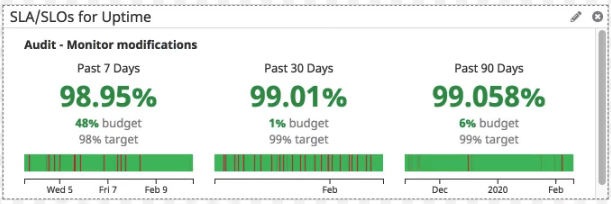
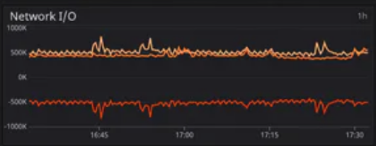
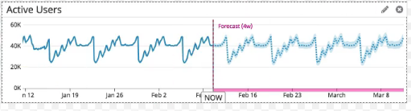
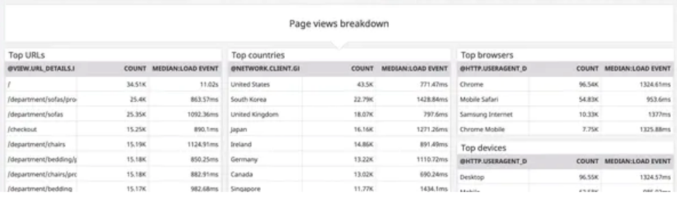
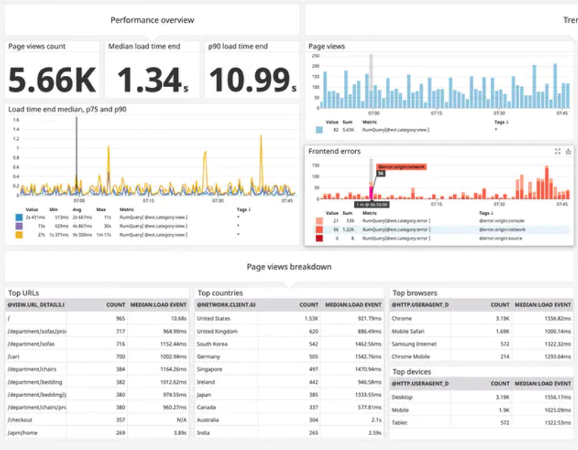
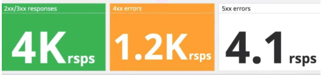
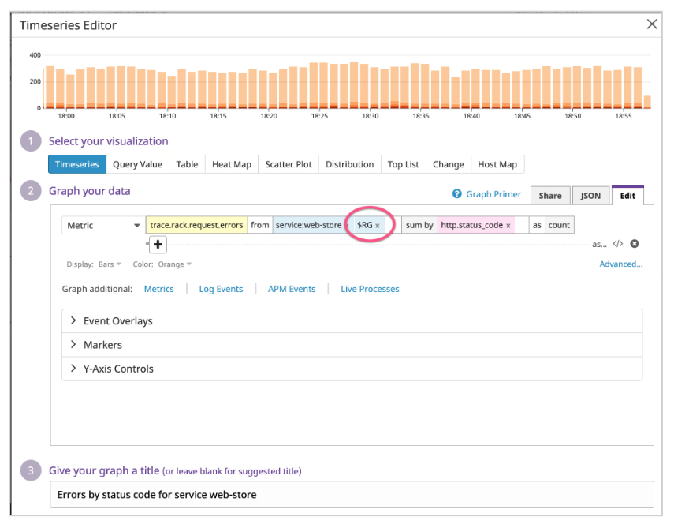
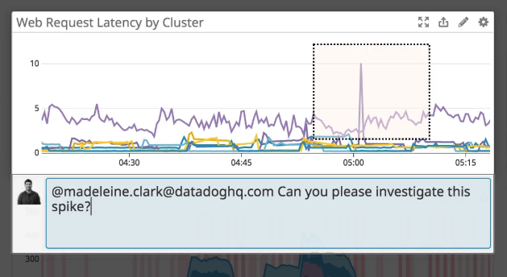
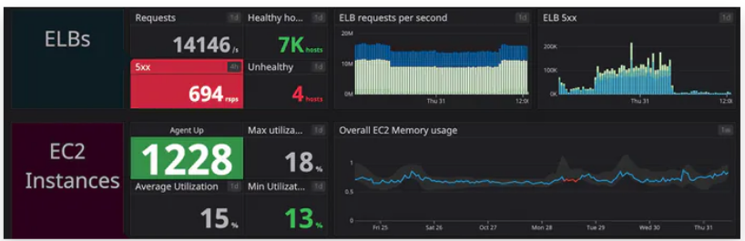

# dashboards

## Metrics
- checkout error

- cpu
  - 
  - 
- disk
  - 
- web
  - 
  - 
- network
  - 

## user events

- all events by events typed

- events information

- node health

- top 10 mode by average cpu load

- top logon failures by users

- user logon by users

- active user
  - 

- users with the highest risk score
- user with the most recent risk activity
-

## traces
- Lantency SLO
- App performence
  - total requests
  - total errors
  - latency xxms avg
  - total time spent by service
  - Name:
      - GET /home/orders
  - 
  - 

## Log
- http response code `amount of 2xx, 4xx, 5xx`
  - 
  - 
  - 
- service logs
  - 
- Error logs by endpoint
- error logs
  -

## additional
- 
- 

## cloud
- 
-

## timbr `dashboard create`

.
