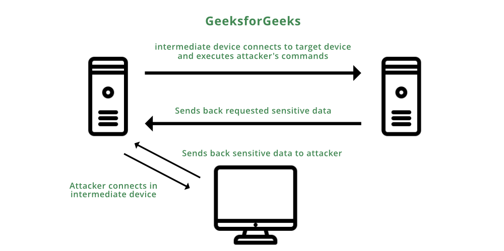

# Confidentiality Attacks

- [Confidentiality Attacks](#confidentiality-attacks)
  - [Confidentiality Attacks](#confidentiality-attacks-1)
  - [confidentiality attack methods](#confidentiality-attack-methods)
    - [Packet capture/sniffing](#packet-capturesniffing)
    - [Ping sweep / port scan](#ping-sweep--port-scan)
    - [Dumpster diving 垃圾装卸卡车](#dumpster-diving-垃圾装卸卡车)
    - [Electromagnetic interference (EMI) interception](#electromagnetic-interference-emi-interception)
    - [Wiretapping 窃听装置](#wiretapping-窃听装置)
    - [Social engineering](#social-engineering)
    - [Sending information over overt channels 明显的](#sending-information-over-overt-channels-明显的)
    - [FTP bounce](#ftp-bounce)

---

## Confidentiality Attacks

- confidentiality attack: **make confidential data viewable by an attacker. (like records, usernames, passwords or e-mails)**

- Because an attacker often makes a copy of the data, rather than trying to manipulate  the data or crash a system, confidentiality attacks often go `undetected`.

- Even if auditing software to track file access were in place, if no one suspected an issue, the audit logs might never be examined.

Example:
- a `web server` and a `database server` have a mutual trust relationship. The database server houses confidential customer information (like customer credit-card information).
- As a result, `company A` decided to protect the database server (example, patching known software vulnerabilities) better than the web server.
- However, the attacker leverages the trust relationship between the two servers to obtain customer credit-card information and then make a purchase from company B using the stolen credit-card information. The procedure is as follows:
  - The attacker `exploits a vulnerability` in company A’s web server and gains control of it.
  - The attacker `uses the trust relationship` between the web server and the database server to obtain customer credit-card information from the database server.
  - The attacker `uses the stolen credit-card` information to make a purchase from company B.

---

## confidentiality attack methods

### Packet capture/sniffing
- Use (like Wireshark), capture packets visible by a PC’s `network interface card (NIC)`, by placing the NIC in `promiscuous mode`.
- Some protocols (like Telnet and HTTP) are sent in plain text.
- Therefore, these types of captured packets can be read by an attacker, perhaps allowing the attacker to see confidential information.

### Ping sweep / port scan
- A confidentiality attack might begin with a scan of network resources to identify attack targets on a network.
- A ping sweep 扫视；袭击 could be used to `ping a series of IP addresses`.
- Ping replies might indicate to an attacker that `network resources were reachable at those IP addresses`.
- After a collection of IP addresses is identified, the attacker might `scan a range of UDP and/or TCP ports` to see `what services are available on the hosts at the specified IP addresses`.
- Also, port scans often help attackers identify the operating system running on a target system.

### Dumpster diving 垃圾装卸卡车
- companies throw away confidential information, without proper shredding,
- some attackers rummage through company dumpsters in hopes of discovering information that could be used to compromise network resources.

### Electromagnetic interference (EMI) interception
- Because data is often transmitted over wire (like unshielded twisted pair),
- attackers can sometimes copy information traveling over the wire, by intercepting the `electromagnetic interference (EMI)` being emitted 发散 by the transmission medium.
- These EMI emissions are sometimes called `emanations`.

### Wiretapping 窃听装置
- If an attacker gains physical access to a wiring closet,
  - `physically tap into telephone cabling` to eavesdrop on telephone conversations,
  - `insert a shared media hub` in-line with a network cable, allowing an attacker to connect to the hub and receive copies of packets flowing through the network cable.

### Social engineering
- Attackers sometimes use social techniques to obtain confidential information.
- Example, an attacker might pose as a member of an organization’s IT department and ask a company employee for his login credentials in order for the “IT staff to test the connection.”
  - `Pretexting`:
    - attack based on invented story or pretext.
    - Example: answer other's question to reset password.
  - `Baiting`:
    - using some kind of “gift” as a bait to get someone to install malicious software.
    - Example: an attacker could leave a USB, someone pick up and unwittingly install the malicious software.
  - `Quid Pro Quo`:
    - Latin for “something for something.”
    - Example:
      - one sharing her password in return for his “free” help.
      - To increase the chances of succeeding in his attack, use a `voice-over-IP (VoIP) telephone service` that allows for caller-ID spoofing. Thus, he could supply as his caller-ID the phone number and name of the actual helpdesk for Alice’s company.
      - This is an instance of another type of attack called `vishing`, which is short for VoIP phishing.

### Sending information over overt channels 明显的
- An attacker might send/receive confidential information over a network using an overt channel. which can communicate information as a series of codes and/or events.
- example:
  - `tunneling one protocol inside another`: like sending instant-messaging traffic via HTTP.
  - `Steganography 隐写术`: like sending a digital image with millions of pixels, “secret” information encoded in specific pixels, only the sender and the receiver know which pixels represent the encoded information.
  - binary data could be represented by sending a series of pings to a destination.
  - A single ping within a certain period of time could represent a binary 0, while two pings within that same time period represented a binary 1.

### FTP bounce
- FTP supports a variety of commands for `setting up a session and managing file transfers. `
- One of these commands is the `PORT` command, and it can, in some cases, be used by an attacker to access a system that would otherwise deny the attacker.
- Specifically, an attacker connects to an FTP server using the standard port of 21.
- However, FTP uses a secondary connection to send data.
- The client issues a `PORT` command to specify the destination port and destination IP address for the data transmission.
- Normally, the client would send its own IP address and an ephemeral 瞬息的 port number.
- The FTP server would then use a source port of 20 and a destination port specified by the client when sending data to the client.
- However, an attacker might issue a `PORT` command specifying the IP address of a device they want to access, along with an open port number on that device.
- As a result, the targeted device might allow an incoming connection from the FTP server’s IP address, while a connection coming in from the attacker’s IP address would be rejected.
- Fortunately, most modern FTP servers do not accept the `PORT` command coming from a device that specifies a different IP address than the client’s IP address.
