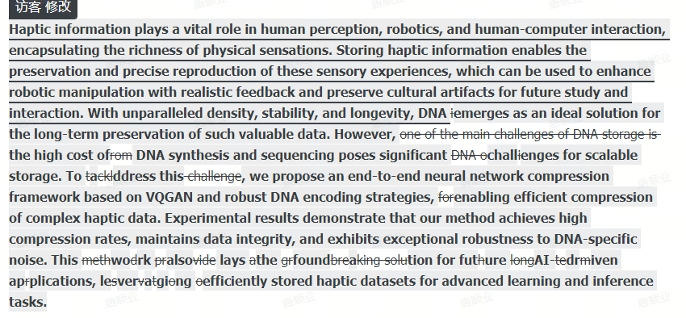

首先准备prompt提示词，一个好的prompt决定论文初稿的质量。prompt包括润色，扩展，翻译功能，以及是针对一段话还是多段话。
先手写一个大纲，这个大纲应该细化到每一个论文部分，而不是整篇文章的大纲。在此基础上可以gpt分点，以及每个分点下的子分点，并进行筛选。
根据大纲，去想一些想写的重点的内容（感觉上就是论文中让人眼前一亮的观点句子），可以细化到一个完整的句子，并经过自己组织后的语言。
用gpt扩展思路，可以专门写一个prompt

一些注意：
输出的语言不能太深奥，简单易读；输入的语言要保持专业的语气
用地道的词和地道的表达，这一部分有些难度，不能纯靠gpt

英文文章有启发式的写作风格，比如用一个问题引导下文
