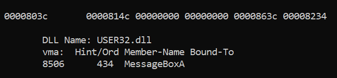
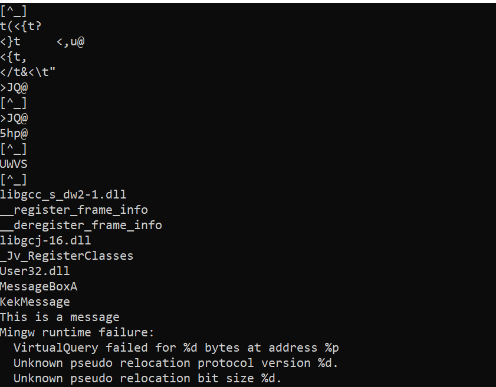

# Function Obfuscation

```
Note : This is not a tutorial to make a malware, but a practical case for educational/research purpose only. Any use for malicious purpose is not endorsed or encouraged. This is strictly for educational/research purpose only 
```

Today we are going to learn about function obfuscation in windows C++.

## Finding function loading

Whenever we write any windows program we use the various windows APIs. These APIs are loaded in the PE file and can be found in the data section. The address to the DLL that is required is included in the PE file as well as the API we need. When we call these APIs the loader then loads these APIs from the DLLs and thus they are executed.

```cpp
#include <Windows.h>

int main(int argc, char const *argv[]){
    
    MessageBoxA(NULL,"This is a message","KekMessage",MB_OKCANCEL);

    return 0;
}
```

Here is a simple `C++` function that displays a simple message box using the `MessageBoxA` API from the `USER32.dll`. We can easily ifnd which DLLs are loaded using the `PE Bear` application (download <a href="https://github.com/hasherezade/pe-bear">here</a>).


Alternatively we can use the following command
```
Objdump -xD (Name of PE file) | less
```



For the purpose of this tutorial I would bw using the PE Bear application.

Most of the Anti-Virus software analyse the PE file and thus are able to detect if it is loading any malicious API like `CreateProcessA`. In such case *Function Obfuscation* becomes an method to avoid such analysis. By using function obfuscation we are able to avoid this analysis but the detection may not be completely avoided and we may need to use advanced techniques like `PE Traversal`.

## Function Obfuscation

In case of function obfuscation we dynamically load the DLL at the runtime and extract the APIs that we need. Thus these APIs cannot be found in the `.idata` section of the PE file.  

```cpp
#include <Windows.h>

typedef int (WINAPI * pMessageBox)(
    HWND    hWnd,
    LPCTSTR lpText,
    LPCTSTR lpCaption,
    UINT    uType
);

int main(int argc, char const *argv[]){
    pMessageBox MsgBox = (pMessageBox)GetProcAddress(LoadLibraryA("User32.dll"),"MessageBoxA");
    MsgBox(NULL,(LPCTSTR)"This is a message",(LPCTSTR)"KekMessage",MB_OKCANCEL);
    // MessageBoxA(NULL,"This is a message","KekMessage",MB_OKCANCEL);
    return 0;
}
```

For this purpose we have used the `GetProcAddress` and `LoadLibraryA` APIs. We use the `LoadLibraryA` to dynamically load the DLL that we require for our purpose. By using the `GetProcAddress` API we are able to locate the address of the API that we require inside the DLL and thus able to use it.

But to actually use the API we have to first `typedef` the function have we want to use. The arguments and the DLL of the function that we require can be easily found in the <a href="https://learn.microsoft.com/en-us/windows/win32/api/winuser/">MSDN</a>.


As we can see from the above image that the `User32.dll` is not present and in consequence `MessageBoxA` is also not present. But there is a problem. If we dump the strings we can find that strings of out PE file then we can see the strings `User32.dll` and `MessageBoxA`.

```
strings (Filename)
```



Anti Virus software can use these strings to detect that our code is malicious. We can you any simple encryption algorithm to encrypt the strings and thus evade those softwares. An example of a simple encryption algorithm can be found below.

```cpp
#include <Windows.h>
#include <iostream>

typedef int (WINAPI * pMessageBox)(
    HWND    hWnd,
    LPCTSTR lpText,
    LPCTSTR lpCaption,
    UINT    uType
);

int main(int argc, char const *argv[]){
    char DLL[128]={0};
    char function[128]={0};
    int encrypted_dll[] = {85, 114, 99, 111, 47, 45, 40, 93, 100, 99};
    int encrypted_function[]={77, 100, 113, 112, 93, 98, 95, 59, 103, 111, 55};

    for(int i=0;i<10;i++){
        DLL[i] = (char)(encrypted_dll[i]+i); 
    }

    for(int i=0;i<11;i++){
        function[i] = (char)(encrypted_function[i]+i); 
    }

    pMessageBox MsgBox = (pMessageBox)GetProcAddress(LoadLibraryA(DLL),function);
    MsgBox(NULL,(LPCTSTR)"This is a message",(LPCTSTR)"KekMessage",MB_OKCANCEL);

    return 0;
}
```

The algorithm used here is very simple and I would strngly recommend you to use a tougher algorithm to implement in your code.