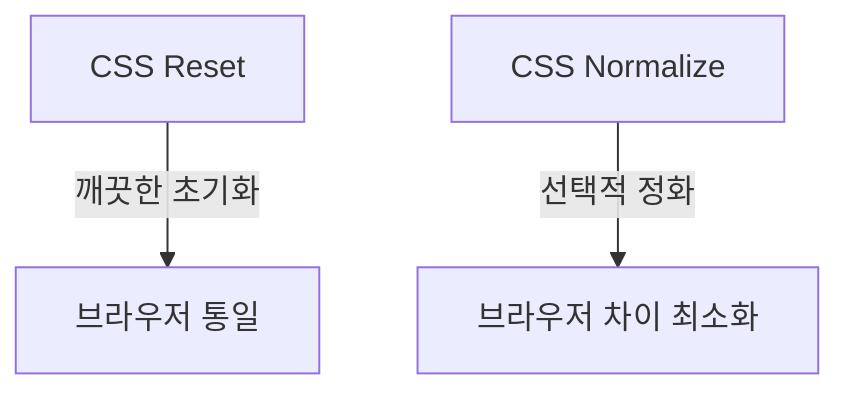

안녕하세요, 여러분! 이 세상에는 수많은 브라우저들이 존재합니다. 크롬부터 사파리, 파이어폭스까지! 아마도 여러분의 웹페이지가 어떤 브라우저에서 잘 돌아갈지 예측하는 건 마치 로또 번호 맞추기와 같죠. 😆 하지만 걱정 마세요! 오늘 우리는 CSS Reset과 CSS Normalize라는 두 명의 슈퍼히어로를 소개할 것입니다.

## CSS Reset: 깔끔한 시작을 위한 브라우저 통일작전 🧹

브라우저가 자체적으로 HTML 요소에 적용한 스타일이 있다면, CSS Reset은 그것을 "제로(Zero)"로 만들어줍니다. 즉, 웹페이지의 모든 것을 깨끗하게 초기화시켜준다는 뜻이에요. 예를 들어, 아래와 같이 CSS 코드를 작성하면 모든 HTML 요소의 스타일을 초기화할 수 있습니다.

```css
html, body, div, span, ... {
  margin: 0;
  padding: 0;
  border: 0;
  font-size: 100%;
  font: inherit;
  vertical-align: baseline;
}
```

이렇게 하면, 웹페이지의 모든 요소가 동일한 모습으로 보이게 됩니다. 본래의 브라우저 스타일이 사라져버리니, 여러분이 원하는 스타일을 적용하기가 훨씬 수월해진답니다!

## CSS Normalize: 브라우저 차이 최소화 🌈

CSS Normalize는 브라우저 간 차이를 최소화하면서, 브라우저가 제공하는 기본 스타일을 최대한 활용합니다. 예를 들어, 아래와 같이 코드를 작성하면 특정 브라우저에서만 발생하는 문제를 해결할 수 있어요.

```css
h1 {
  font-size: 2em;
  margin: 0.67em 0;
}

a {
  background-color: transparent;
}
```

여기서 CSS Normalize의 장점은 브라우저별로 미세하게 다른 부분만 통일시켜주기 때문에, 기본적인 사용성을 해치지 않는다는 점입니다.

## 어떤 걸 선택할까요? 🤔

CSS Reset은 모든 것을 깨끗하게 지워버리는 "깨끗이 정화" 스타일이고, CSS Normalize는 필요한 부분만 수정하는 "선택적 정화" 스타일입니다. 선택은 여러분의 목표와 필요에 따라 달라질 수 있어요.

## 🧜‍♂️ Reset과 Normalize 비교



어때요, 어렵지 않죠? 😆 이제 브라우저 문제로 머리를 싸매지 않아도 되겠어요. CSS Reset과 CSS Normalize, 두 슈퍼히어로가 여러분을 도와줄 테니까요! 🦸‍♂️🦸‍♀️
