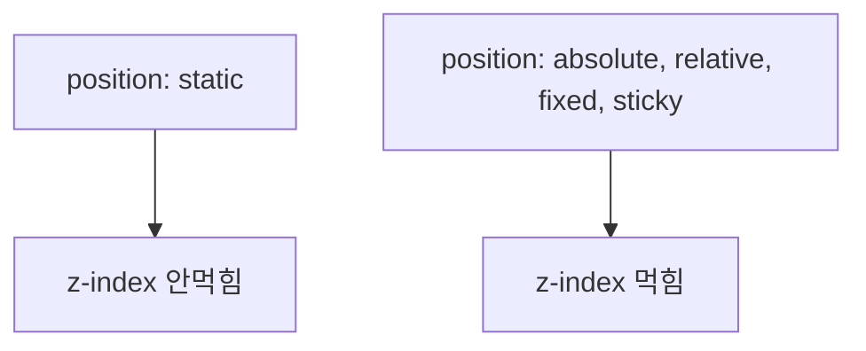

안녕하세요, 웹 개발자 여러분! 오늘은 3차원 세계에 발을 들여보겠습니다. 어떻게요, 궁금하지 않나요? 네, 오늘의 주인공은 바로 CSS의 `z-index` 속성입니다! 🌟

## z-index 없을 때

먼저, `z-index`가 없으면, HTML 문서에서 나중에 나온 요소가 먼저 나온 요소를 따라잡아요! 🏃‍♀️

```html
<div class="first box">1</div>
<div class="second box">2</div>
```

```css
.first.box {
  background: yellow;
}
.second.box {
  background: tomato;
  margin-top: -50px;
  margin-left: 50px;
}
```

위와 같이 코드를 작성하면, 두 번째 박스가 첫 번째 박스를 아주 쉽게 따라잡습니다.

## Position 속성이 등장하면?

하지만 여기에 `position` 속성이 등장하면 일이 꼬이기 시작해요. `position`이 `relative`나 `absolute`, `fixed`, `sticky`로 바뀌면 겹치는 순서도 바뀌죠.

```css
.first.box {
  background: yellow;
  position: relative;
  top: 50px;
  left: 50px;
}
```

이렇게 하면, 첫 번째 상자가 두 번째 상자 위로 다시 등장합니다.

## z-index의 등장! 🎬

이제 본격적으로 `z-index`가 등장합니다.

```css
.first.box {
  z-index: 1;
  background: yellow;
  position: relative;
  top: 50px;
  left: 50px;
}
.second.box {
  z-index: 2;
  background: tomato;
  position: relative;
}
```

이렇게 하면 두 번째 상자가 첫 번째 상자를 다시 앞질러서 나오게 됩니다. 이럴 때 사용되는 용어가 바로 `z-index`입니다. 상자 뒤에 숫자를 크게 적으면 앞으로 나오게 되고, 작게 적으면 뒤로 가게 됩니다.

## 주의사항 🚨

`position`이 `static`인 요소에는 `z-index`가 무용지물이에요. `position`을 `absolute, relative, fixed, sticky`로 변경하면서 `z-index`를 사용해야 효과가 나타납니다.



정리하면 `z-index`와 `position` 함께 사용해야 진정한 효과를 발휘한다고 생각하면 됩니다. 👫 오늘은 `z-index` 사용법을 탐구해봤습니다. 함께해주신 여러분, 정말 수고하셨습니다! 🎉💕
