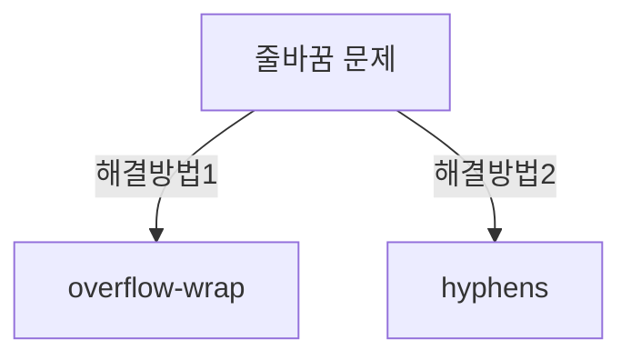

안녕하세요, 여러분! 이번엔 "영어와 한국어의 줄바꿈 차이와 그 해결법"에 대해 이야기해 봅시다!

## 영어는 왜 줄바꿈이 자동으로 안될까? 🎉

프로그래밍을 하다보면 한글은 줄을 잘 바꾸는데, 영어는 왜 그렇게 부모 요소를 넘어가는 걸까요? 한글은 단어의 중간에서도 줄바꿈을 하는게 기본 속성인 반면, 영어는 그렇지 않기 때문입니다.

## overflow-wrap: 실질적인 해결사 🦸‍♀️

CSS의 `overflow-wrap` 속성은 이 문제를 해결해 줄 수 있어요. 이걸 `break-word`로 설정하면, 부모 요소 안에서 단어가 넘치지 않게 됩니다.

```css
.example {
  overflow-wrap: break-word;
}
```

이제는 단어별로 줄바꿈이 되는걸 확인할 수 있어요!

## hyphens 속성으로 자동 줄바꿈 🌈

`hyphens` 속성을 `auto`로 설정하면, 자동으로 줄바꿈을 해 줍니다. 단어가 삐져나가려고 할 때, 마법처럼 `-` 기호가 나타나요!

```css
.example {
  hyphens: auto;
}
```

이렇게 하면 단어가 더 이상 삐져나가지 않고, 모든 브라우저에서 멋지게 보이게 됩니다!

## 📊 다이어그램을 통한 이해



이 다이어그램을 통해 여러분은 줄바꿈 문제를 어떻게 해결할 수 있는지 한 눈에 알 수 있을 겁니다!

## 마치며 🌟

웹 개발을 하다 보면 우리는 때때로 문제 해결의 달인이 되어야 해요. overflow-wrap, hyphens 같은 해결책을 알고 있으면 더 이상 단어가 삐져나가는 건 두렵지 않겠죠? 😎 그럼 오늘도 즐거운 코딩 되세요! 🌈👩‍💻👨‍💻
