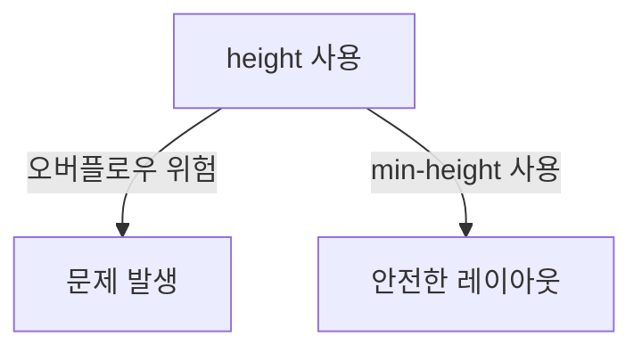

안녕하세요, 오늘 다룰 주제는 바로 CSS에서의 `height` 속성과 `min-height` 속성! "높이? 그게 뭐 중요하다고?"라고 생각할 수도 있지만, 높이를 잘못 설정하면 웹페이지가 엉망이 될 수 있어요. 😱 그럼 본격적으로 시작해 봅시다!

## 높이는 왜 중요한가요? 🤔

웹 페이지는 상자(box)로 이루어져 있습니다. 이 상자의 높이를 잘 설정해야 내부의 텍스트나 이미지가 제대로 보이거든요. 그래서 `height` 속성을 사용하는 것이죠. 하지만, 여기서 조심해야 할 함정이 있습니다!

### 🚫 height의 위험성

`height`를 직접 설정하면, 상자가 너무 작아져서 내용물이 밖으로 튀어나올 수 있어요. 이런 현상을 '오버플로우(overflow)'라고 합니다. 특히 모바일에서는 이런 문제가 더 자주 발생해요.

### 🎉 해결책: min-height 속성

이럴 때 사용하는 게 `min-height` 속성입니다. 이 속성을 사용하면, 상자의 높이가 너무 작아지지 않아요. 내용물이 많으면 상자의 높이가 자동으로 늘어나고, 내용물이 적으면 설정한 높이를 유지합니다. 완전 편리하죠?

## min-height의 활용법 🛠️

`min-height`를 사용할 때는 단위도 중요해요. 픽셀(px), 퍼센트(%) 등 여러 단위가 있지만, 반응형 웹 디자인을 생각한다면 퍼센트가 더 유용할 때도 있습니다. 이러한 단위 선택은 상황에 따라 달라져요. 따라서, 여러 경우를 시험해 보는 것이 중요합니다.

## 마무리 🎁

오늘은 CSS의 `height`와 `min-height`에 대해 알아보았습니다. 이 두 속성을 잘 활용하면 웹페이지 레이아웃을 더 안정적으로 만들 수 있어요. 기억하세요, 높이 설정은 작은 것 같지만 큰 영향을 미친다는 것을요! 😄

그럼 다음에 또 만나요! 행복한 코딩 되세요! 🎉👋
