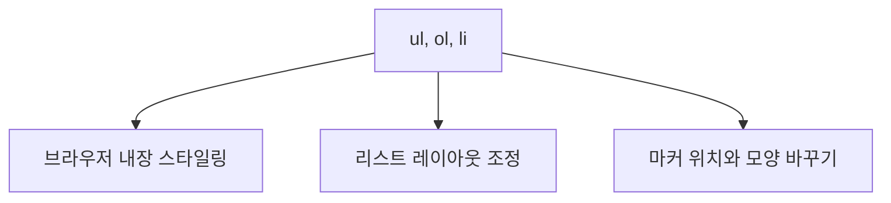

안녕하세요, 여러분! 리스트는 웹 페이지에서 꼭 필요한 친구죠. 오늘은 `<ul>`, `<ol>`, `<li>` 같은 HTML 리스트 요소를 어떻게 멋지게 꾸밀 수 있는지 알려드릴게요! 😎

## 내장 스타일이 뭐에요? 🤔

브라우저에 이미 내장된 스타일이 있어요. 이걸 **user agent stylesheet**라고 부르는데요, 이게 뭐냐면 브라우저가 자동으로 준 스타일입니다! 잠깐 볼까요?

```css
ul {
  display: block;
  list-style-type: disc;
  padding-inline-start: 40px;
}
ol {
  display: block;
  list-style-type: decimal;
  padding-inline-start: 40px;
}
```

브라우저가 얼마나 친절한지 보세요! 이미 기본적인 것들은 셋팅해 놓았어요. 😊

## 리스트 레이아웃은 어떻게 바꾸죠? 🛠

### 간격 조절하기

아이템 간에 더 많은 공간을 주려면 `line-height`를 사용해보세요! 

```css
ul, ol {
  line-height: 1.8;
}
```

### 들여쓰기 줄이기

40px은 너무 많다고요? `padding-inline-start`로 줄여보세요!

```css
ul, ol {
  padding-inline-start: 20px;
}
```

### 헐! 외부 공백도 없애줘!

`margin`을 0으로 설정하면 외부 공백도 없어져요.

```css
ul, ol {
  margin: 0;
}
```

## 마커는 어떻게 바꿀까요? ✨

### 마커 위치 옮기기

마커를 리스트 안으로 옮기려면 `list-style-position`을 `inside`로 바꾸세요!

```css
ul, ol {
  list-style-position: inside;
}
```

### 마커 모양 바꾸기

사각형으로 바꾸려면 이렇게 해보세요!

```css
ul {
  list-style-type: square;
}
ol {
  list-style-type: upper-alpha;
}
```

## 이미지 마커 사용하기 🖼

이미지로 마커를 설정하려면 `list-style-image`를 사용하세요!

```css
ul {
  list-style-image: url('your-image-url');
}
```

## 마무리 🧜‍♀️

어떤가요? 이제 `<ul>`, `<ol>`, `<li>` 요소가 더 이상 무서워 보이지 않죠? 🎉🎉 재미있게 코딩하시길 바라요! 😄


