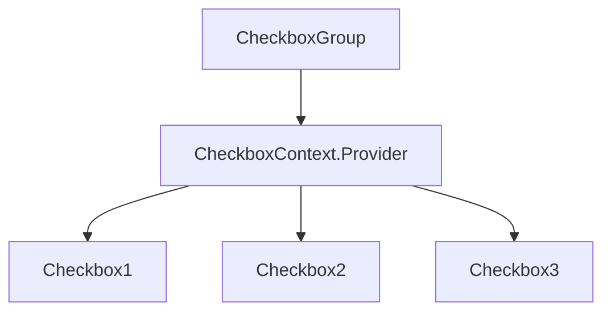

안녕하세요, 여러분! 오늘은 아주 재미있는 이야기로 찾아왔습니다. 바로 React 체크박스를 어떻게 만들고 관리하는지에 대한 미스터리를 풀어보려고 해요! 🕵️‍♂️ 준비됐나요? 그럼 가보자구~ 🚀

## 체크박스를 왜 쓸까요? 🤔

그러게요, 왜 쓸까요? 아주 간단합니다. 체크박스는 사용자로부터 '예' 또는 '아니요' 같은 간단한 응답을 받을 수 있는 최고의 방법입니다. 이는 특히 회원 가입 페이지나 설문조사 같은 곳에서 유용하죠!

## 체크박스 기초 설계 🏗️

```javascript
function Checkbox({ children, disabled, checked, onChange }) {
  return (
    <label>
      <input
        type="checkbox"
        disabled={disabled}
        checked={checked}
        onChange={({ target: { checked } }) => onChange(checked)}
      />
      {children}
    </label>
  );
}
```

여기서 `children`은 라벨의 이름이고, `disabled`는 체크박스를 사용할 수 없게 할지 결정하는 옵션입니다. `checked`는 체크박스가 선택되어 있는지 아닌지를 나타내고, `onChange`는 체크박스의 상태가 바뀔 때 불리는 함수입니다.

## 체크박스의 실전 활용 🥷

```javascript
import React from "react";
import Checkbox from "./Checkbox";

function App() {
  const [service, setService] = React.useState(false);
  const [marketing, setMarketing] = React.useState(false);

  return (
    <article>
      <header>
        <h3>체크박스</h3>
      </header>
      <Checkbox checked={service} onChange={setService}>
        (필수) 서비스 이용약관
      </Checkbox>
      <Checkbox checked={marketing} onChange={setMarketing}>
        (선택) 마케팅 수신
      </Checkbox>
      <footer>
        <button disabled={!service}>회원 가입</button>
      </footer>
    </article>
  );
}
```

여기서 `useState`는 React에서 상태를 관리하기 위해 사용하는 훅(hook)입니다. 이를 통해 `service`와 `marketing` 상태를 관리하고 있어요.

## 체크박스의 마법 같은 연결 🪄

아무래도 여러 체크박스가 동시에 쓰일 경우가 많죠. 이럴 때는 `CheckboxContext`를 사용해서 정보를 공유합니다. React의 `createContext` 함수로 만들 수 있어요.

```javascript
import { createContext } from "react";
const CheckboxContext = createContext();
```

## 체크박스 그룹을 만들어보자! 👨‍👩‍👦‍👦

이제 여러 체크박스를 묶어서 관리하는 `CheckboxGroup` 컴포넌트를 만들어 볼까요?



코드는 이렇게 생겼습니다!

```javascript
import CheckboxContext from "./CheckboxContext";

function CheckboxGroup({ label, children, disabled: groupDisabled, values, onChange }) {
  // 함수들...
  return (
    <fieldset>
      <legend>{label}</legend>
      <CheckboxContext.Provider value={{ isDisabled, isChecked, toggleValue }}>
        {children}
      </CheckboxContext.Provider>
    </fieldset>
  );
}
```

이런 식으로 체크박스가 많을 때도 아주 쉽게 관리할 수 있답니다! 😎

---

와우, 끝났어요! 이제 여러분도 체크박스 사용법에 대해 대략적인 이해가 되셨죠? 🥳 만약 더 궁금한 점이 있으면 언제든 댓글로 물어봐 주세요~ 다음에 또 새로운 이야기로 찾아올게요. 그럼 안녕! 👋😄
