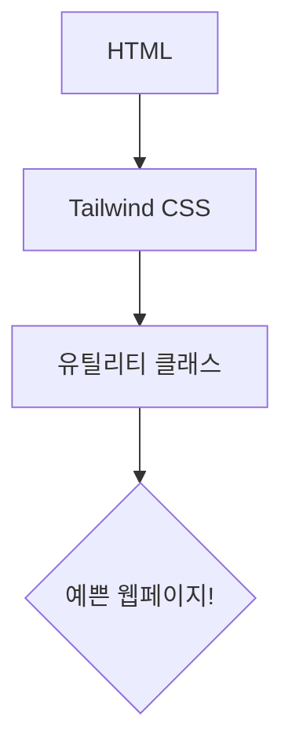

안녕하세요, 여러분! 이번에는 굉장히 핫한 친구, 바로 Tailwind CSS에 대해 풀어보려고 합니다. 대체 이 녀석이 뭐길래 개발자 사이에서 화제인지, 함께 알아봅시다!

## 왜 Tailwind CSS가 대박인가요? 🌟

일단 Tailwind CSS는 **유틸리티 클래스** 기반 입니다. 유틸리티 클래스라는 것은 특정 스타일을 정의해 놓은 작은 조각들이에요. 이 작은 조각들을 조합해서 웹페이지를 예쁘게 꾸미는 거죠.

> "유틸리티 클래스는 마치 레고 블럭 같아요! 레고 블럭을 어떻게 조립하느냐에 따라, 성을 만들 수도, 자동차를 만들 수도 있죠. 👷‍♀️"

## Tailwind는 HTML의 친한친구 🦸‍♂️

Tailwind를 사용한다면 HTML만으로도 웹페이지를 꾸밀 수 있어요! CSS 파일에 코드를 추가하지 않아도 됩니다. HTML의 `class` 속성에다 Tailwind의 유틸리티 클래스 이름을 적어주면 끝이거든요.

예를 들어, 파란색 버튼을 만들고 싶다면?

```html
<button class="bg-blue-500 text-white">파란 버튼</button>
```

이렇게 하면 됩니다! 간단하죠? 🎉

## Tailwind CSS의 유틸리티 클래스 예시 🎨

아래는 몇 가지 유틸리티 클래스 예시입니다.

- `.text-white`: 글자를 하얀색으로 만들어요.
- `.bg-blue-500`: 배경을 파란색으로 바꿉니다.
- `.px-4`: 양 옆에 패딩을 추가해요.

## Mermaid 다이어그램으로 Tailwind 이해하기 🧜‍♀️



이 다이어그램을 보면, HTML과 Tailwind CSS가 어떻게 연결되는지 쉽게 이해할 수 있어요. 여러분도 이런 식으로 웹페이지를 쉽고 빠르게 만들어보세요!

## Tailwind의 장단점 🎭

### 장점 ✅

1. 빠른 개발: 코드를 줄일 수 있어서 빠르게 개발할 수 있어요.
2. 쉬운 유지보수: 클래스만 변경하면 되니까 유지보수가 쉽습니다.

### 단점 ❌

1. 익숙해지는 데 시간이 좀 필요해요.
2. 프로젝트가 커지면 클래스 이름이 너무 많아져서 복잡해질 수 있어요.

## 결론: Tailwind CSS, 꼭 써보세요! 🎁

메인 프로젝트라면 도입이 꺼려질 수 있지만 사이드 프로젝트 및 취미 목적이라면 뭐하러 다른 걸 쓰고 고생하나요? Tailwind CSS로 쉽고 빠르게 웹 개발을 즐겨보세요! 이제 여러분도 Tailwind 마스터로 거듭나보아요! 🚀
