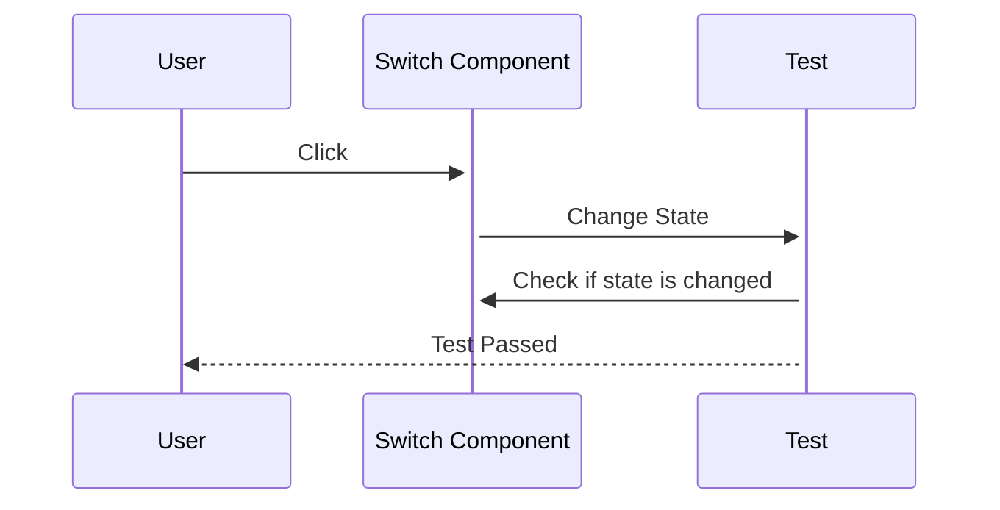

안녕하세요, 여러분! 오늘은 비동기 컴포넌트를 테스트하는 방법을 알아볼 거에요. 😆 React Testing Library가 얼마나 대단한지, 그리고 어떻게 비동기 컴포넌트를 쉽게 테스트할 수 있는지 알려드릴게요!

## 예제 컴포넌트: <Switch/> 컴포넌트의 비밀 😎

먼저, 테스트의 주인공인 `<Switch/>` 컴포넌트에 대해 알아보죠. 이 친구는 'ON'과 'OFF' 버튼으로 변신해요. 버튼을 누르면 ON, OFF가 번갈아 나타나는 마법을 보여줍니다! 그리고 상태를 바꾸는 데에는 0.5초가 걸려요. 와우, 이거 다 테스트해야 한다니, 두근두근하죠? 😲

```javascript
import React, { useState } from "react";

function Switch() {
  const [disabled, setDisabled] = useState(false);
  const [on, setOn] = useState(false);

  const handleClick = () => {
    setDisabled(true);
    setTimeout(() => {
      setOn(!on);
      setDisabled(false);
    }, 500);
  };

  return (
    <button disabled={disabled} onClick={handleClick}>
      {on ? "ON" : "OFF"}
    </button>
  );
}

export default Switch;
```

## 초기 상태 테스트: 첫 만남의 중요성 🌟

첫 만남은 중요하죠? `<Switch/>` 컴포넌트도 처음에는 'OFF' 상태를 보여주면서 클릭이 가능해야 해요. 이 부분을 테스트하기 위해 React Testing Library의 기본 함수를 사용할 거에요.

```javascript
test("OFF 버튼은 초기에 활성화 되어 있어야 한다", () => {
  render(<Switch />);
  const button = screen.getByRole("button");
  expect(button).toHaveTextContent("OFF");
  expect(button).toBeEnabled();
});
```

## 동기 상태 변경 테스트: 버튼 누르면 어떻게 될까요? 🤔

버튼을 누르면 `disabled` 상태가 'true'가 되어야 하죠. 이걸 테스트하는 것은 아주 쉬워요!

```javascript
test("버튼을 누르면 비활성화 되어야 한다", () => {
  render(<Switch />);
  const button = screen.getByRole("button");
  userEvent.click(button);
  expect(button).toBeDisabled();
});
```

## 비동기 상태 변경 테스트: 시간을 두고 봐야 더 재미있어요! 🕒

0.5초 동안 버튼 상태가 바뀌는 것을 테스트하려면 어떻게 해야 할까요? 바로 `findByRole()` 함수를 사용해서 해결할 수 있어요!

```javascript
test("버튼을 누르면 ON 상태가 활성화 되어야 한다", async () => {
  render(<Switch />);
  userEvent.click(screen.getByRole("button"));
  const button = await screen.findByRole("button", {
    name: /on/i
  });
  expect(button).toBeInTheDocument();
  expect(button).toBeEnabled();
});
```

이제 어떻게 하면 비동기 상태의 컴포넌트를 쉽게 테스트할 수 있는지 알게 되셨죠? 🎉

## 비동기 테스트의 작은 팁: async와 await 잊지 마세요! 🌈

비동기 테스트를 할 때는 `async`와 `await` 키워드를 사용하면 성공을 거둘 수 있어요. 그래서 반드시 이 키워드를 잘 활용해 보세요!



이렇게 해서 React Testing Library로 비동기 컴포넌트를 테스트하는 방법을 마스터했네요! 👏 다음에 또 재미있는 주제로 찾아뵐게요. 여러분, 화이팅! 💪😎
