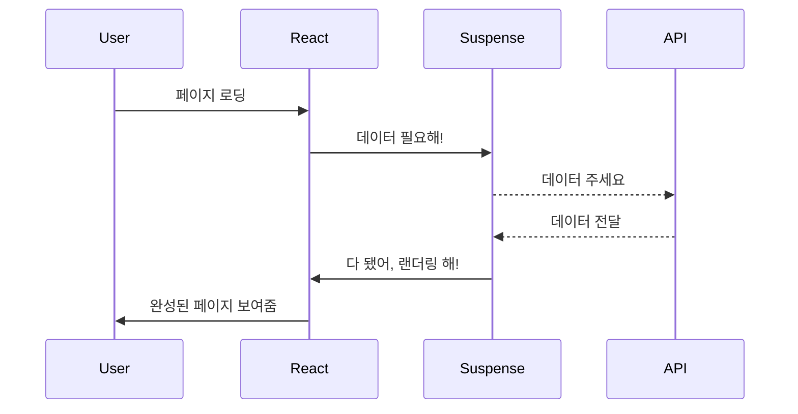

안녕하세요, 여러분! 오늘은 리액트 세계에서 소문만 무성하던, 아니, 팬들이 절박하게 기다려온 React v18의 엄청난 기능, Suspense에 대해 이야기할 예정입니다. 응, 드디어 이 시간이 왔어요! 🎉

## Suspense? 그게 뭐에요? 🤔

Suspense는 2018년에 첫 선을 보이고, React v16.6에서 실험적으로 추가되었습니다. "실험적으로"라니, 과학자도 놀랄 법한 용어죠? 😆 Suspense는 리액트에서 아주 큰 변화를 가져올 기능 중 하나랍니다.

## Suspense가 왜 대단한 건가요? 🌟

Suspense를 사용하면 컴포넌트 랜더링을 어떤 작업이 끝날 때까지 '잠깐!' 멈춰둘 수 있어요. 마치 마법사가 주문을 외우기 전까지 기다리는 거죠. 🧙‍♂️ 네트워크를 통해 데이터를 가져오는 작업이 대표적입니다.

## Suspense는 어떻게 동작하나요? 🛠️



Suspense는 랜더링을 '일시 중지'하고, 필요한 데이터가 준비될 때까지 기다린다음, 랜더링을 이어서 진행해요.

```jsx
<Suspense fallback={<Spinner />}>
  <UserList />
</Suspense>
```

## Suspense 사용 전과 후의 차이는? 🤷‍♀️

Suspense를 사용하기 전에는 주로 `componentDidMount()`나 `useEffect()` 훅을 사용했어요. 그런데 Suspense가 등장하면서 더 쉽고 깔끔하게 비동기 작업을 관리할 수 있게 되었답니다!

### Suspense 사용 전 코드 예제 🙄

```jsx
useEffect(() => {
  fetch(`https://jsonplaceholder.typicode.com/users/${userId}`)
    .then((response) => response.json())
    .then((user) => {
      setUser(user);
    });
}, []);
```

### Suspense 사용 후 코드 예제 😎

```jsx
<Suspense fallback={<Spinner />}>
  <UserList />
</Suspense>
```

놀라웠죠? Suspense를 사용하면 코드가 훨씬 간결해지고 관리하기 쉬워져요.

## 마치며 🎉

Suspense는 리액트의 미래를 바꿀 거대한 파급력을 가진 기능이에요. Suspense를 아직 사용해보지 않았다면, 이제라도 시도해보는 건 어떨까요? 🚀 이상 React v18의 놀라운 Suspense에 대한 이야기였습니다! 다음에 또 뵙겠습니다, 안녕! 👋😃
