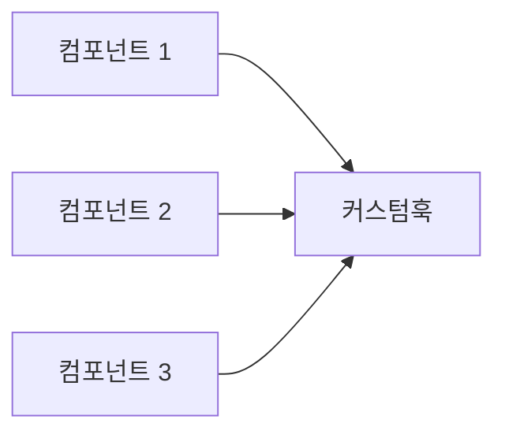

## 들어가기 전에

안녕하세요, 오늘은 여러분에게 React 훅을 이용한 API 요청의 비밀 레시피를 제공해 드릴 겁니다. 이미 잘 알고 계신 내용일지 모르지만, 우리의 레시피는 다르답니다!

## 요리의 첫 단계: useState와 useEffect 준비하기 🥄

어떤 요리든 준비물이 중요하죠. React에서 API 요청을 다루려면 `useState`와 `useEffect` 두 가지 훅을 준비해야 해요. 아래와 같이 간단하게 코드를 작성할 수 있어요.

```javascript
import React, { useState, useEffect } from "react";
```

## 요리재료 넣기: 데이터를 저장할 상태 만들기 🍲

상태는 요리재료와 같아요. 빈 상태부터 시작해서 API 호출로 데이터를 채워넣죠.

```javascript
const [data, setData] = useState(null);
const [loading, setLoading] = useState(true);
const [error, setError] = useState(null);
```

## 요리 시작: useEffect로 API 요청하기 🔥

그럼 이제 본격적으로 API를 요청해 볼까요? `useEffect`는 여기서 주인공입니다.

```javascript
useEffect(() => {
  fetch('API_주소')
    .then((response) => response.json())
    .then((data) => setData(data))
    .catch((error) => setError(error))
    .finally(() => setLoading(false));
}, []);
```

## 미식가를 위한 Tip: 커스텀 훅 만들기 🍱

만약 다양한 요리, 즉 다양한 컴포넌트에서 같은 API를 요청해야 한다면? 그럴 땐 커스텀 훅을 만들면 좋아요.



```javascript
function useFetch(url) {
  const [data, setData] = useState(null);
  const [loading, setLoading] = useState(true);
  const [error, setError] = useState(null);
  
  useEffect(() => {
    fetch(url)
      .then((response) => response.json())
      .then((data) => setData(data))
      .catch((error) => setError(error))
      .finally(() => setLoading(false));
  }, [url]);

  return { data, loading, error };
}
```

## 요리의 결실: 끝난 후 상태 확인하기 🍎

그래서 이렇게 만든 요리, 아니 코드를 어떻게 확인하나요?

```javascript
const { data, loading, error } = useFetch('API_주소');

if (loading) return <p>로딩 중...</p>;
if (error) return <p>오류 발생! 😱</p>;
return <div>{JSON.stringify(data)}</div>;
```

## 요약과 꿀팁 🍯

오늘은 React 훅을 이용해서 API 요청의 비밀 레시피를 공개했어요. 그리고 덤으로 커스텀 훅까지 배웠죠! 이제 여러분도 API 요청 마스터가 되셨다고 자부해도 됩니다!

React의 무한한 세계, 오늘도 함께 탐험해 주셔서 감사합니다! 🌈 다음에 또 새로운 주제로 만나요!

**뿅!** 🎉

