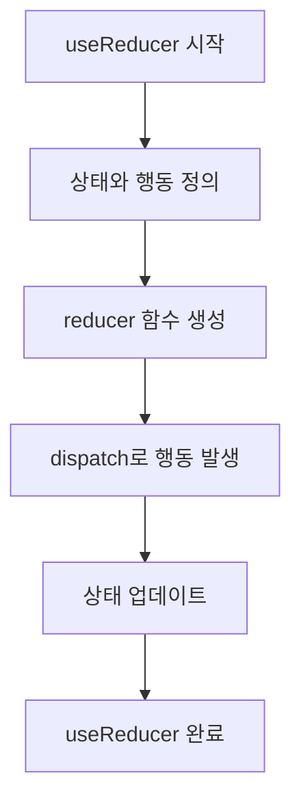

안녕하세요, React 개발자 여러분! 😀 오늘은 `useReducer` Hook을 이용한 상태 관리에 대해 자세히 알아볼거예요.

## 왜 useReducer가 중요한가요? 🤔

useState가 있어도 왜 useReducer가 필요한지 궁금해하시는 분들을 위해 말씀드리겠습니다. `useState`는 간단하고 빠르게 상태를 관리할 수 있지만, 복잡한 로직이나 여러 상태 간의 연계성을 다룰 때는 한계가 있어요. `useReducer`는 이런 한계를 깨고 복잡한 상태를 단순하게 만들어 줍니다!

## useReducer의 기본 문법 👨‍🏫

```javascript
const [state, dispatch] = useReducer(reducer, initialState);
```

여기서 `reducer`는 상태와 행동을 받아 새 상태를 반환하는 함수입니다. `initialState`는 초기 상태값을 설정하는 곳이죠. 그리고 `dispatch` 함수로 행동을 발생시키면, `reducer`가 새 상태로 업데이트 해줍니다.

## 카운터 예제로 이해하기 🎯

이제부터 `useReducer`를 이용해 간단한 카운터 앱을 만들어 볼게요.

```javascript
import React, { useReducer } from "react";

const initialState = { count: 0 };

function reducer(state, action) {
  switch (action.type) {
    case "INCREMENT":
      return { count: state.count + 1 };
    case "DECREMENT":
      return { count: state.count - 1 };
    default:
      throw new Error("Unsupported action");
  }
}

function Counter() {
  const [state, dispatch] = useReducer(reducer, initialState);

  return (
    <>
      <h2>{state.count}</h2>
      <button onClick={() => dispatch({ type: "INCREMENT" })}>증가</button>
      <button onClick={() => dispatch({ type: "DECREMENT" })}>감소</button>
    </>
  );
}
```

예제는 간단하게 만들어봤지만 여기서 `INCREMENT`나 `DECREMENT` 같은 행동에 추가적인 데이터를 넣어 복잡한 상태 변화도 쉽게 할 수 있답니다!

## 복잡한 상태 관리하기 🎩

아래 예제에선 카운트의 최대, 최소 값을 정해봤어요.

```javascript
function reducer(state, action) {
  switch (action.type) {
    case "INCREMENT":
      return state.count < 10 ? { count: state.count + 1 } : state;
    case "DECREMENT":
      return state.count > 0 ? { count: state.count - 1 } : state;
    default:
      throw new Error("Unsupported action");
  }
}
```

이렇게 하면 카운트가 0보다 작아지거나 10보다 커지는 것을 막을 수 있죠.

## 최종 코드 요약 📝

최종적으로 모든 코드를 다 이해했다면, 이제 당신은 `useReducer`를 마스터한 것이나 다름 없습니다. 축하해요! 🎉



이상으로 React에서 `useReducer`를 사용하여 복잡한 상태 관리를 할 수 있음을 알려 드렸습니다. 여러분도 이제 상태 관리 고수가 되어보세요! 🥳
