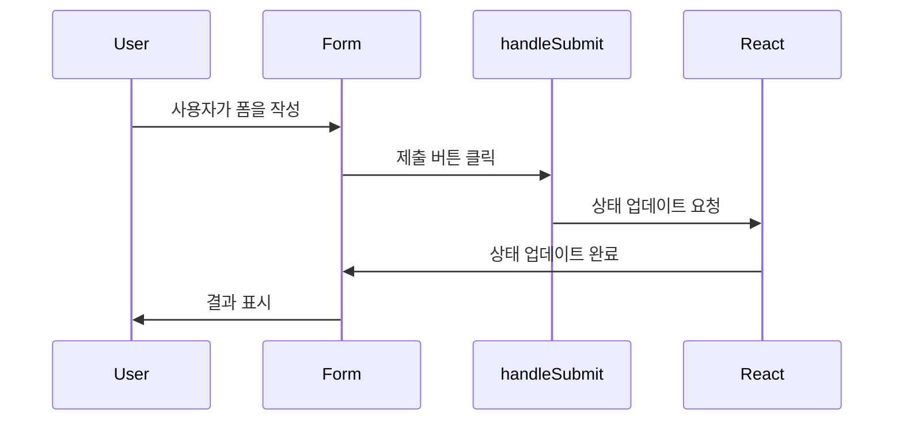

안녕하세요, 여러분 오늘은 React에서 `Uncontrolled Components`를 사용하는 신비한 방법에 대해 알아볼 겁니다. ✨

## 초보자를 위한 Uncontrolled Components 101 🎓

먼저, `Uncontrolled Components`가 무엇인지 알아봅시다. React는 `Controlled Components`와 `Uncontrolled Components`라는 두 가지 컴포넌트를 제공해요. Controlled는 말 그대로 제어를 React가 다 해주는 녀석이고, Uncontrolled는 브라우저가 자동으로 해주는 친구입니다! 이번 글에서는 후자에 집중할 거에요!

## 마법의 주문: DOM API 🧙‍♂️

첫 번째 방법은 마치 React가 없는 것처럼, 순수한 자바스크립트의 `DOM API`를 사용하는 거에요! 아래에 있는 코드 예시는 제출(submit) 이벤트에서 양식의 내부 값을 가져오는 방법입니다.

```javascript
function Form() {
  const handleSubmit = (event) => {
    event.preventDefault();
    const {
      title: { value: input },
      country: { value: select },
      description: { value: textArea },
    } = event.target;

    alert(JSON.stringify({ input, select, textArea }));
  };

  return (
    <form onSubmit={handleSubmit}>
      {/*...*/}
    </form>
  );
}
```

**주의!** 🚨 여기서는 `defaultValue`와 `defaultChecked` prop을 사용해야 해요. 그렇지 않으면, 값이 고정되어 변경이 안 되거든요!

## React 답게: useState() 후크 사용하기 🎣

두 번째 방법은 `useState` 후크를 사용하는 것입니다. 이렇게 하면 React 스타일로 상태 관리를 할 수 있어요! 아래의 코드를 봅시다.

```javascript
import { useState } from "react";

function Form() {
  const [input, setInput] = useState(null);

  const handleSubmit = (event) => {
    event.preventDefault();
    alert(JSON.stringify({ input: input?.value }));
  };

  return (
    <form onSubmit={handleSubmit}>
      <input
        name="title"
        defaultValue=""
        ref={(element) => setInput(element)}
      />
      {/*...*/}
    </form>
  );
}
```

여기서는 `ref` prop을 이용하여 각 HTML 요소에 대한 참조를 얻어옵니다. 이 참조를 이용해서 상태를 업데이트해요!

## 이해하기 쉬운 다이어그램 📊



## 마치며 🎉

요약하자면, `Uncontrolled Components`는 React에서도, React 없이도 사용할 수 있는 유연한 친구입니다. DOM API로도, useState 후크로도 상태 관리가 가능해요! 😎 오늘도 즐거운 코딩 되세요! 🌈 Happy Coding! 🚀
