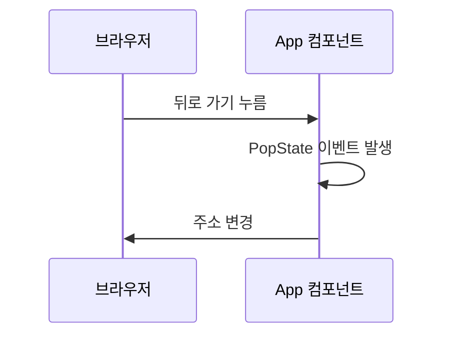

안녕하세요 여러분! 오늘은 React에서 주소창을 마치 마법사의 지팡이처럼 다룰 수 있는 방법을 알려드릴게요! 🧙‍♂️

## 컴포넌트와 `window.location`이 무슨 사이? 🤔

컴포넌트 내에서 `window.location`에 접근하면 아주 애매모호한 일들이 생깁니다. 단순히 클릭해서 페이지를 이동하고 싶은데, 뭔가 미묘하게 안 맞죠. 이 문제를 해결하기 위해서 우리가 할 일은 뭐다? 바로 컴포넌트를 적절히 다시 그려주는 일입니다!

## URL 상태를 React 상태로 만들자! 😎

```javascript
import React from "react";
function App() {
  const [location, setLocation] = React.useState({ ...window.location });
  const navigate = (path) => {
    window.history.pushState({}, "", path);
    setLocation({ ...window.location });  
  };
  return (
  <>
  <header>
    <button onClick={() => navigate("/home")}>Home</button>
    <button onClick={() => navigate("/about")}>About</button>
    <button onClick={() => navigate("/users/1")}>User 1</button>
    <button onClick={() => navigate("/users/2")}>User 2</button>
  </header>
  <main>
    <h1>현재 경로는 {location.pathname} 입니다.</h1>
  </main>
  </>
  );
}
```

뭐, 이렇게 하면 URL이 바뀔 때마다 UI도 함께 바뀌게 됩니다. 훌륭하죠? 👏

## 그럼 '뒤로 가기'는 어떻게? 🤨



간단하게 말하면 브라우저의 '뒤로 가기'와 '앞으로 가기' 버튼을 누르면 `PopState` 이벤트가 발생합니다. 이 이벤트를 처리해주면 주소 표시줄의 URL과 `<h1>` 요소 안의 현재 경로가 함께 바뀔 거에요.

## PopState 이벤트 처리하기 😁

```javascript
React.useEffect(() => {
  const popStateHandler = () => {
    setLocation({ ...window.location });
  };

  window.addEventListener("popstate", popStateHandler);

  return () => {
    window.removeEventListener("popstate", popStateHandler);
  };
}, []);
```

이렇게 하면 뒤로 가기나 앞으로 가기를 눌렀을 때도 URL이 바뀌면서 UI가 업데이트 됩니다. 완벽한 해결책 아니겠어요? 🎉

이상으로 'React에서 안전하게 `window.location` 객체에 접근하는 마법 같은 방법'을 마무리하겠습니다. 다음 번에 또 만나요! 👋😄
