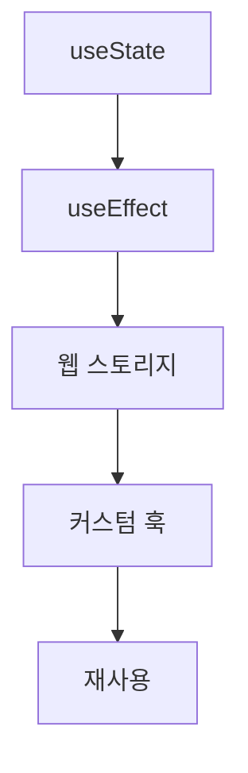

안녕하세요, 여러분! 오늘은 "React에서 웹 스토리지로 상태 유지하기"라는 정말 흥미로운 주제로 가득 채운 이야기를 해볼까 해요. 어떤가요, 두근두근 하시죠? 🤩

## 상태 관리의 고민, 끝! 🤔

알고 계시죠? React에는 `useState()`라는 훅이 있어요. 이걸로 상태 관리를 정말 쉽게 할 수 있습니다. 하지만 뒤로가기를 누르거나 새로고침을 하면 뭐가 돼요? 🥺 그렇죠, 모든 정보가 날라가버린답니다. 이제 그 문제를 해결할 비결을 공유하겠습니다.

## 웹 스토리지 소개 📦

웹 스토리지는 브라우저에 데이터를 저장하는 방법이에요. 간단히 말하면, 데이터를 저장해서 다음에 또 쓸 수 있게 해주는 아주 똑똑한 친구랍니다! 😎

## 상태를 웹 스토리지에 저장하기 📝

React의 `useEffect()` 훅을 쓰면 상태 정보를 웹 스토리지에 저장할 수 있어요. 코드를 보면서 설명하겠습니다.

```javascript
// PersistentCounter.jsx
import React, { useState, useEffect } from "react";
function Counter() {
  const [count, setCount] = useState(
    () => JSON.parse(window.localStorage.getItem("count")) || 0
  );
  useEffect(() => {
    window.localStorage.setItem("count", JSON.stringify(count));
  }, [count]);
  return <button onClick={() => setCount(count + 1)}>{count}</button>;
}
```

아주 간단하죠? 이렇게 `useEffect()`를 써서 상태 정보를 웹 스토리지에 저장합니다. ✨

## 커스텀 훅으로 중복 줄이기 🎉

여러 컴포넌트에서 웹 스토리지를 사용하려면, 커스텀 훅을 만들어 봅시다.

```javascript
// useLocalStorage.js
import { useState, useEffect } from "react";
function useLocalStorage(key, initialState) {
  const [state, setState] = useState(
    () => JSON.parse(window.localStorage.getItem(key)) || initialState
  );
  useEffect(() => {
    window.localStorage.setItem(key, JSON.stringify(state));
  }, [key, state]);
  return [state, setState];
}
```

이제 이 훅을 사용해서 다른 컴포넌트에서도 상태를 웹 스토리지에 저장할 수 있답니다!



## 마무리 🎉

여러분, 웹 스토리지와 React 훅을 이용해 상태를 유지하는 방법을 배웠습니다! 이제는 뒤로가기 버튼이나 새로고침을 눌러도 두렵지 않죠? 😎
