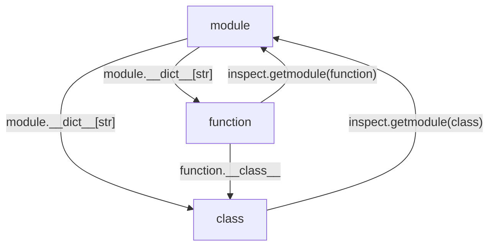

### Garbage Collection

Garbage Collector(GC)
: 사용하지 못하는 메모리를 자동으로 감지하여 메모리 해제를 해주는 장치

C/C++에서는 GC가 없어서 힙 메모리의 경우 할당하면 반드시 다시 직접 해제하여야 하고, 그렇지 않으면 메모리 누수가 발생하여 프로세스가 종료되기 전까지 남아있게 된다. 메모리 누수가 일어나면 프로세스가 실행된 이후로 메모리 사용량이 계속해서 늘어나면서 결국 메모리 부족 문제로 프로세스가 강제 종료되는 증상을 낳기도 한다. 번거로운 해제 과정을 자동으로 해주는 GC에 대해 알아보자.

CPython의 GC 구현 방식인 **Reference Counting**은 객체의 참조 횟수를 세어, 0이 되면 메모리를 해제하는 방식이다. 어떤 객체의 메모리 해제가 일어나면 그 객체가 참조하던 다른 객체의 참조 횟수를 1씩 감소시킨다. 이렇게 참조 횟수가 감소된 객체는 0인지 체크하여 메모리를 해제하는 식으로 반복한다.

`sys.getrefcount` 함수를 이용하여 참조횟수를 얻어올 수 있다. 단, 함수 내부 구현 중에서 해당 객체에 대한 참조를 한 번 하기 때문에 참조 횟수가 1만큼 크게 나온다.

```python
import sys
a = object()
sys.getrefcount(a) # 2

b = a
sys.getrefcount(a) # 3

del a
sys.getrefcount(b) # 2
```

Reference Counting 방식은 순환 참조를 해결할 수 없다.

```python
c = []
c.append(c)
sys.getrefcount(c) # 3
del c
```

리스트 `c`는 내부적으로 자기 자신을 참조하고 있어서 참조 횟수가 0으로 떨어지지 않는다. 이를 해결하기 위해 **cyclic garbage collector**라는 추가적인 장치가 필요하다. 일반적으로 Reference Counting 방식으로 작동한다는 garbage collector는 cyclic garbage collector이고, 줄여서 garbage collector라고 부른다.

### 메모리 구조

CPython에는 모든 파이썬 객체를 담을 수 있는 구조체인 `PyObject_HEAD`가 있다. 여기에는 `ob_refcnt`, `*ob_type`과 같은 각종 정보가 들어있다. 이 객체를 포인터로 가리켜 파이썬 객체처럼 사용한다. 추가적으로 GC의 기능을 수행하기 위해 `PyGC_HEAD` 구조체가 있다. 이는 GC에서 관리할 모든 파이썬 객체의 **메모리 상 앞부분에 할당**된다. 즉 `PyGC_Head*` 형변환을 한 뒤 1을 빼서 참조할 수 있도록 되어있다. `PyGC_HEAD`에는 `*_gc_next`와 `*_gc_prev`가 있고 doubly linked list를 이루어서 모든 파이썬 객체를 순회할 수 있게 되어있다.

### 순환 참조의 특징

순환 참조는 항상 다른 객체를 가리킬 수 있는, Container 객체로부터 생겨난다. 여기에는 array, dictionary, list, custom class, 외부 모듈의 class 등이 있다. GC는 이러한 객체에만 집중하여 순환 참조를 찾는다.

실제로 순환 참조는 드물게 일어나는 것이 아닌, 매우 자주 일어난다.

1. exception 객체가 가지고 있는 traceback 객체는 오류가 발생한 부분의 frame 객체를 참조한다. frame 객체는 exception 객체를 참조한다.

2. module-level 함수는 (globals 키워드를 수행할 때 필요하기 때문에) module의 dict를 참조한다. module의 dict는 이 함수를 참조한다.

3. instance는 자신을 생성한 class를 참조하고 이 class는 자기가 속해있는 module을 참조하고 이 module은 자신에게 포함된 instance들을 참조한다.

4. 그래프같은 자료구조를 다룰 때 내부 연결이 많은 것이 일반적이다.



### 순환 참조를 찾는 법

python 내부적으로 두 개의 linked list를 준비한다. **첫 번째 리스트**는 외부에서 참조할 수 있는 (Reachable) 객체만을 저장할 것이고, **두 번째 리스트**는 외부에서 참조할 수 없는 (Unreachable) 객체만을 저장할 것이다. 모든 파이썬 객체를 둘로 나눈 뒤 Unreachable 객체는 모두 메모리 해제를 하면 된다. 참고로 여기서 말하는 모든 파이썬 객체는 앞서 설명했듯이 Container 객체이다.

1. 평균적으로 Reachable 객체가 Unreachable 객체보다 많으므로 일단 모든 파이썬 객체를 첫 번째 리스트에 넣는다.

2. 위에서 설명한 PyGC_HEAD를 통해 모든 파이썬 객체를 순회하면서 자신이 참조하고 있는 다른 객체의 참조 횟수를 1씩 감소시킨다. 

3. 그러면 외부에서 직접 참조받고 있는 객체는 참조 횟수가 1이상일 것이고, 다른 객체로부터 참조받거나 Unreachable 객체는 참조 횟수가 0일 것이다.

4. 다시 순회하면서 참조 횟수가 0인 객체는 두 번째 리스트로 옮기고, 참조 횟수가 1이상인 객체는 그 객체에서 시작하여 도달할 수 있는 모든 객체를 첫 번째 리스트로 옮긴다.

5. 순회하면서 방문 체크를 하여 중복으로 여러 번 검사하지 않도록 한다.

이렇게 분리된 Unreachable 객체를 모두 콜백을 무시하고 제거하여 깔끔히 정리한다.

### Ref.

<https://devguide.python.org/internals/garbage-collector/>