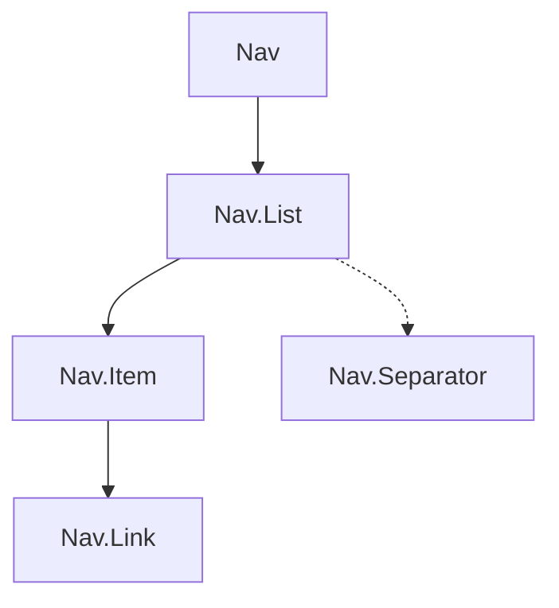

안녕하세요, 여러분! 오늘은 여러분을 위한 특별한 레시피를 가져왔어요. 바로 "React와 Styled Components로 사이드 네비게이션 UI를 만드는 방법"이죠! 🎉

## 컴파운트 컴포넌트: 가족보다 더 가까운 관계 👨‍👩‍👦

어려운 단어부터 나왔네요! 컴파운트 컴포넌트는 그냥 같이 쓰이는 친구들을 묶어주는 것입니다. 예를 들어, `<option>`은 `<select>` 안에서만 쓰이고, `<li>`는 `<ul>`이나 `<ol>` 안에서만 쓰이죠. 이런 친구들을 React에서는 컴파운트 컴포넌트로 묶어줍니다. 어떻게 묶는지 지금부터 차근차근 알아볼게요!

## 네비게이션 UI의 신세계: JSX가 나선다 🚀

HTML로 네비게이션을 만들면 태그가 좀 많이 나와요. `<nav>`, `<ul>`, `<li>` 이런 것들이죠. 하지만 JSX를 사용하면 `<Nav>` 하나로 끝낼 수 있어요!

```jsx
// 일반적인 HTML 네비게이션
<nav>
  <ul>
    <li><a href="/">Home</a></li>
  </ul>
</nav>

// JSX로 만든 네비게이션
<Nav>
  <Nav.List>
    <Nav.Item><Nav.Link to="/">Home</Nav.Link></Nav.Item>
  </Nav.List>
</Nav>
```

훨씬 간단하고 깔끔하지 않아요? 🎉

## 다이어그램으로 이해하기 📊



이 다이어그램을 보면 `Nav > Nav.List > Nav.Item > Nav.Link` 이렇게 구조가 되어 있음을 쉽게 알 수 있어요. 아, 그리고 `Nav.Separator`는 `Nav.List`와 병렬로 들어가는 친구입니다!

## Styled Components로 스타일링 척척 🎨

스타일링은 Styled Components를 사용하면 굉장히 쉬워져요. 아래 코드는 `Nav` 컴포넌트의 스타일을 정의한 예시입니다.

```jsx
import styled from "styled-components";

const Navigation = styled.nav`
  min-width: 200px;
  padding-right: 20px;
`;

function Nav({ children }) {
  return <Navigation>{children}</Navigation>;
}
```

이렇게 하면 모든 `Nav` 컴포넌트는 이 스타일을 따르게 되어요! 간단하죠? 😉

---

아주 쉽고 재밌게 리액트 사이드 네비게이션 UI를 만드는 방법을 알아봤어요. 이제 여러분도 이 기술을 활용해 웹사이트를 더 멋지게 만들 수 있을 거예요! 👏👏👏

더 알고 싶은 것이나 궁금한 것이 있다면 댓글로 남겨주세요! 다음에도 더 멋진 코드와 함께 돌아올게요! 🌟
