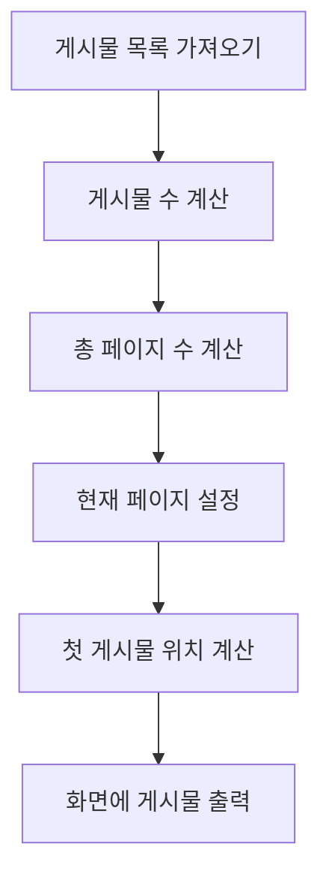

안녕하세요! 오늘은 웹사이트에서 자주 보는 페이지네이션을 소개할 거에요! 게시물이 무지~ 많다면, 한 번에 다 보여주기가 힘들죠? 이럴 때 사용하는게 바로 페이지네이션입니다.

## 파트1: 첫 번째 장, 모든 게시물을 다 보여주려고 해볼까?
JSON Placeholder라는 곳에서 게시물 데이터를 가져와서 먼저 모든 게시물을 화면에 뿌려보려고 했어요. 근데 이렇게 하니까 사람들이 스크롤에 지쳐서 쓰러지는 사태가 발생! 😲 

```jsx
// 모든 게시물을 불러와서 보여줍니다.
function Posts() {
  const [posts, setPosts] = useState([]);
  useEffect(() => {
    fetch("https://jsonplaceholder.typicode.com/posts")
    .then((res) => res.json())
    .then((data) => setPosts(data));
  }, []);

  return (
    <Layout>
      <header>
        <h1>게시물 목록</h1>
      </header>
      <main>
        {posts.map(({ id, title, body }) => (
          <article key={id}>
            <h3>{id}. {title}</h3>
            <p>{body}</p>
          </article>
        ))}
      </main>
    </Layout>
  );
}
```

## 파트2: 페이지네이션 알고리즘 배우기! 🎓
스크롤 문제 해결을 위해 페이지네이션 알고리즘이 필요해졌어요. 첫 번째로 알아야 할 것은 '전체 게시물 수 / 페이지 당 게시물 수 = 총 페이지 수' 입니다! 예를 들어, 게시물이 37개 있고, 페이지 당 게시물이 10개면, 총 페이지는 4개가 되는 거죠! 

그 다음, 현재 페이지에서 보여줄 게시물의 범위를 계산해야 해요. `첫 게시물의 위치 = (현재 페이지 - 1) * 페이지 당 게시물 수` 로 계산할 수 있어요!

## 파트3: 마법의 주문을 외워보자, 페이지네이션 구현! 🪄
이제 알고리즘을 배웠으니, 페이지네이션을 구현해볼까요? 현재 페이지에 맞는 게시물만 보여주도록 코드를 수정했어요!

```jsx
function Posts() {
  const [posts, setPosts] = useState([]);
  const [limit, setLimit] = useState(10);
  const [page, setPage] = useState(1);
  const offset = (page - 1) * limit;

  useEffect(() => {
    fetch("https://jsonplaceholder.typicode.com/posts")
    .then((res) => res.json())
    .then((data) => setPosts(data));
  }, []);
  
  return (
    <Layout>
      <header>
        <h1>게시물 목록</h1>
      </header>
      {posts.slice(offset, offset + limit).map(({ id, title, body }) => (
        <article key={id}>
          <h3>{id}. {title}</h3>
          <p>{body}</p>
        </article>
      ))}
    </Layout>
  );
}
```

## 다이어그램 📊


## 마무리: 페이지네이션, 이렇게 간단하죠!
이제 페이지네이션의 마법을 마스터했어요! 🧙‍♀️ 이제 사람들은 스크롤로 지치지 않고 행복하게 웹사이트를 둘러볼 수 있을 거에요. 다음에 또 재미있는 이야기로 찾아뵐게요! 🌈
