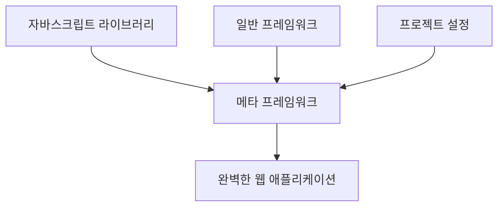

안녕하세요! 👋 여러분, 오늘은 메타 프레임워크에 대해 이야기하려고 합니다. 어떤 마법의 힘을 가지고 있는 건지 궁금하신가요? 잠깐만요, 토끼 귀를 세워주세요! 🐰

## 메타 프레임워크의 비밀 슈퍼파워 🦸‍♀️

메타 프레임워크가 대체 뭐에요? 일반 프레임워크가 슈퍼맨이라면, 메타 프레임워크는 아이언맨입니다. 왜냐하면 아이언맨은 기술을 더해서 더 강해지니까요! 🦾 메타 프레임워크는 다양한 라이브러리와 일반 프레임워크들을 조합해서 완벽한 하나를 만들어 냅니다. 🤖

## 메타 프레임워크 vs 일반 프레임워크 👊

일반 프레임워크는 한 가지 언어나 기술에 특화되어 있습니다. Java의 세계에서는 Spring이 대표적이죠. JavaScript 세계는? 여기서는 일반 프레임워크가 없어요. 대신 다양한 라이브러리와 프레임워크를 섞어서 사용합니다. 이런 것들을 다 관리하는 슈퍼히어로가 바로 메타 프레임워크입니다! 🦸‍♂️

## 메타 프레임워크의 필요성은? 🤷‍♀️

자바스크립트에서는 라이브러리가 너무 많아요. 패키지 매니저만 해도 npm, Yarn, pnpm 등이 있습니다. 하나하나 선택하다 보면 머리가 아파 올 것 같죠? 😫 메타 프레임워크가 여러분을 구해 줍니다! 어떻게? 모든 것을 선택해 주면서도 최적의 성능을 뽑아 줍니다. 😌

## 메타 프레임워크의 추천 리스트 📜

이 세상에는 다양한 메타 프레임워크가 있습니다. 그 중 몇 가지는 Next.js, Nuxt.js, Sapper 등이 있죠. 이들은 자바스크립트의 주류 프레임워크에 확장을 제공하면서도 고유한 장점을 갖고 있습니다. 😎

---

오늘의 이야기를 마무리하며, 메타 프레임워크가 웹 개발에 있어 강력한 도구라는 것을 깨달았으면 좋겠습니다. 다음에 또 뵙겠습니다. 안녕! 👋🎉
