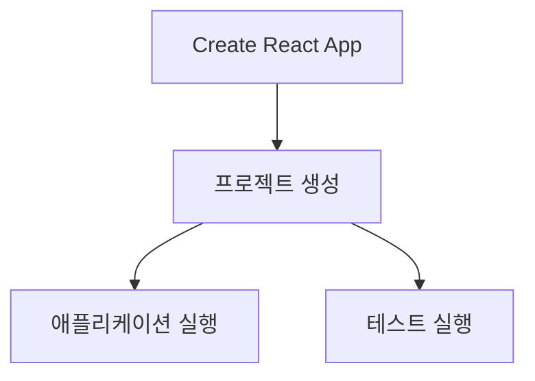

안녕하세요, 여러분! 🎉 오늘은 Create React App에 대해 살펴볼 예정입니다. React 프로젝트를 만들려면 알아야 할 것이 산더미처럼 많죠. 웹팩, 바벨, 뭐 어쩌고 저쩌고. 😱 다른 글에서 볼 수 있는 복잡한 정보는 건너뛰고, 이 글에서는 정확히 핵심만 파보겠습니다! ✨

## Create React App이 뭐에요? 🤔

React를 배우고 싶지만 설정 때문에 머리 아프다면, Create React App 하나로 그런 복잡한 설정을 다 해준답니다. 😲 명령어 하나로 바로 시작하세요!

## 프로젝트 만드는 법 🛠

첫 번째 단계는 정말 간단합니다. 아래와 같이 터미널에 명령어를 입력하세요.

```bash
$ npx create-react-app 앱이름 --use-npm
```

'--use-npm' 옵션은 npm을 패키지 매니저로 사용하겠다는 의미입니다. 만약 Yarn을 좋아하신다면, 그냥 옵션을 빼면 돼요!

## 파일 구조 살펴보기 📂

프로젝트가 성공적으로 생성되면, 이런 구조를 볼 수 있을 거에요:

```bash
$ cd my-amazing-app
$ tree -L 2 -I node_modules
.
├── README.md
├── package-lock.json
├── package.json
├── public
│  ├── favicon.ico
│  ├── index.html
│  ├── ...
└── src
  ├── App.css
  ├── App.js
  ├── ...
```

## 애플리케이션 실행 🏃‍♀️

코드를 작성한 뒤 결과를 확인하고 싶다면, 아래와 같이 하세요:

```bash
$ npm start
```

이제 브라우저에서 `http://localhost:3000`을 열면, 놀라운 React 앱을 볼 수 있어요! 🎉

## 테스트 어떻게 하나요? 🧪

Jest와 Testing Library가 이미 설정되어 있어요. 아래 명령어로 테스트를 실행하세요:

```bash
$ npm test
```

'watch' 모드를 사용하면 변경된 테스트만 실행할 수 있어요. 전체 테스트를 실행하려면, 'a' 키를 누르면 돼요!

## 머메이드 다이어그램을 활용한 이해 돕기 📊



## 마무리 🎬

이로써 Create React App에 대한 사용법이 끝났습니다! 이제 React 세계의 정복자가 될 준비가 되었죠? 💪

