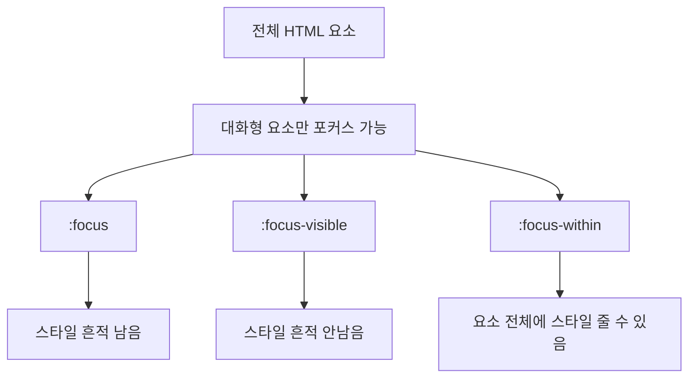

안녕하세요, 여러분! 🎉 오늘은 CSS에서 사용되는 `:focus`, `:focus-visible`, `:focus-within` 가상 클래스를 제대로 알아보고, 그 차이점과 사용법을 풀어내볼 거에요.

## 🌈 HTML 요소와 포커스의 비밀
먼저, HTML 요소(element)가 포커스를 받는다는 의미를 이해하려면, 어떤 요소만이 포커스의 주인공이 될 수 있는지 알아봐야 해요. 대표적으로 `<a>`, `<input>`, `<select>`, `<button>` 등이 있는데요, 이러한 요소들을 대화형 요소라고 불러요. 주로 사용자의 입력을 받는 용도로 사용돼요.

## 🎯 CSS :focus 가상 클래스의 정체
`:focus`는 마우스든 키보드든 뭐든지 간에 HTML 요소에 포커스가 가면, 그 요소를 화려하게 꾸밀 수 있어요. 예를 들면,

```css
:focus {
  /* 포커스가 가면 이렇게 예쁘게! */
  outline: 2px solid gold;
}
```

이렇게 하면 포커스 상태에서는 금빛 둘레선이 생기는 거죠.

## 😵 그런데, 문제가 있어요!
`:focus`로 스타일을 지정하면, 마우스로 클릭한 요소가 포커스를 받게 되는데, 문제는 다른 곳을 클릭해도 그 스타일이 그대로 남아있어요. 마치 뭐...초콜릿 얼룩이 옷에 묻은 것처럼요! 🍫

## 🕵️ :focus-visible로 해결하자!
`:focus-visible` 가상 클래스는 키보드 포커스에만 스타일을 적용하는 똑똑한 녀석이에요.

```css
:focus-visible {
  outline: 2px solid green;
}
```

이제 키보드로 포커스를 준 요소만 초록색으로 둘러싸일 거에요! 🌿

## 🌠 :focus-within로 요소 전체 변경
이 친구는 어떤 요소 안에 포커스가 있는 경우, 그 요소까지 포함해서 스타일을 줄 수 있어요. 예를 들어, 

```css
:focus-within {
  background-color: lightblue;
}
```

이 코드는 어떤 요소 안에 포커스가 가면, 그 요소 전체가 하늘색으로 변해요! 🦋

## 📊 다이어그램으로 이해하기

이 다이어그램을 보면, 전체 HTML 요소중에 대화형 요소만 포커스를 받을 수 있고, 그 때 다양한 가상 클래스를 사용할 수 있다는 것을 쉽게 이해할 수 있을 거에요. 📚

## 😆 마무리
오늘은 CSS의 `:focus`, `:focus-visible`, `:focus-within` 가상 클래스에 대해 알아봤어요. 이 친구들을 잘 활용하면 웹 페이지를 더 사용자 친화적으로 만들 수 있답니다. 앞으로 이 친구들과 잘 지내보세요! 🎉👏
