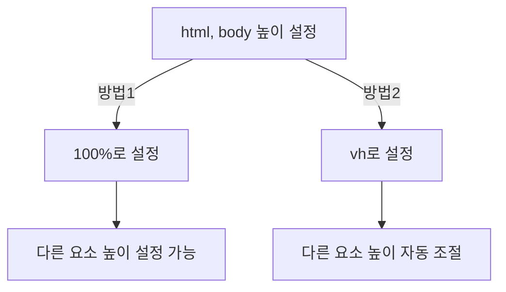
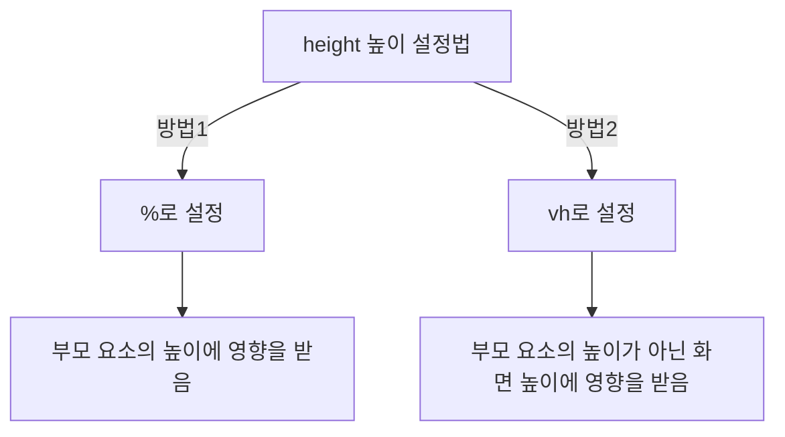

안녕하세요, 여러분! 이번 글에서는 CSS로 화면 높이를 잡는 기술에 대해 핵심만 짧게 알아보겠습니다. 이 글을 끝까지 읽으시면 더이상 %와 vh중에 뭘 써야할지에 대한 고민이 사라지실거에요! 🚀

## 🔍 주의해야 할 흔한 실수들

CSS를 다룰 때, 특히 초보자분들이 자주 하는 실수 중 하나는 `height` 속성을 100%로 설정하고, 그것만으로 해결될 것이라고 생각하는 거에요.

```css
.screen-height {
  height: 100%;
}
```

하지만 이렇게만 하면 대부분 변화가 없죠. 왜냐면, %는 부모 요소를 기준으로 하고, 부모 요소의 `height`는 기본적으로 `auto`로 설정되어 있기 때문이에요.

## 👍 html과 body 요소의 높이 조절

이럴 때, `html`과 `body` 요소의 높이를 100%로 설정하면 문제가 해결되곤 해요.

```css
html, body {
  height: 100%;
}
```

이렇게 하면 `html` 요소와 `body` 요소가 브라우저의 화면 높이를 차지하게 되고, 이를 기준으로 자식 요소들의 높이도 설정할 수 있는 원리에요. 이처럼 %는 부모요소의 높이에 영향을 받는것이 특징이에요!

## 🌟 뷰포트 높이 단위 활용하기

반면 뷰포트 단위, 즉 `vh`를 사용하면 부모 요소에 상관없이 사용자의 화면 높이에 맞게 설정할 수 있어요.

```css
.screen-height {
  height: 100vh;
}
```

### 📌 모바일에서 주의할 점

모바일에서는 주소 표시줄이 유동적으로 변하기 때문에 `vh` 단위를 사용할 때 조심해야 해요. 특히 iOS의 사파리나 안드로이드의 크롬에서는 이 문제가 자주 발생하죠.

## 📊 다이어그램을 활용한 이해 돕기



이 다이어그램을 보면, `html`과 `body`의 높이 설정에 따라 다른 요소들의 높이 설정 방법이 달라지는 것을 알 수 있어요. 😉

## 🎉 마무리하며

그래서 여러분, CSS로 화면 높이를 조절할 때는 이렇게 여러 가지 방법과 주의점이 있답니다. 각 상황에 맞는 최적의 방법을 선택하면 더 이상 화면 높이 때문에 고민하지 않아도 될 거에요! 🎈

이제 웹 레이아웃을 만드는 마법사가 되어보시죠! 🧙‍♂️🌟

안녕하세요, 여러분! 이번 글에서는 CSS로 화면 높이를 잡는 기술에 대해 깊이 있고 자세히 알아보겠습니다. 딱 그거죠, 웹 페이지의 레이아웃을 조절할 때 종종 겪는 고민들을 한방에 해결해보려고 해요! 🚀

## 🔍 주의해야 할 흔한 실수들

CSS를 다룰 때, 특히 초보자분들이 자주 하는 실수 중 하나는 `height` 속성을 100%로 설정하고, 그것만으로 해결될 것이라고 생각하는 거에요.

```css
.screen-height {
  height: 100%;
}
```

하지만 이렇게만 하면 대부분 변화가 없죠. 왜냐면, %는 부모 요소를 기준으로 하고, 부모 요소의 `height`는 기본적으로 `auto`로 설정되어 있기 때문이에요.

## 👍 html과 body 요소의 높이 조절

`html`과 `body` 요소의 높이를 100%로 설정하면 문제가 해결되곤 해요.

```css
html, body {
  height: 100%;
}
```

이렇게 하면 `html` 요소와 `body` 요소가 브라우저의 화면 높이를 차지하게 되고, 이를 기준으로 다른 요소들의 높이도 설정할 수 있어요.

## 🌟 뷰포트 높이 단위 활용하기

뷰포트 단위, 즉 `vh`를 사용하면 부모 요소에 상관없이 화면 높이에 맞게 설정할 수 있어요.

```css
.screen-height {
  height: 100vh;
}
```

### 📌 모바일에서 주의할 점

모바일에서는 주소 표시줄이 유동적으로 변하기 때문에 `vh` 단위를 사용할 때 조심해야 해요. 특히 iOS의 사파리나 안드로이드의 크롬에서는 이 문제가 자주 발생하죠.

## 📊 다이어그램을 활용한 이해 돕기



이 다이어그램을 보면, `html`과 `body`의 높이 설정에 따라 다른 요소들의 높이 설정 방법이 달라지는 것을 알 수 있어요. 😉

## 🎉 마무리하며

오늘은, CSS로 화면 높이를 조절하는 2가지 방법을 알아봤어요! 각 상황에 맞는 최적의 방법을 선택하면 더 이상 화면 높이 때문에 고민하지 않아도 될 거에요! 🎈 이제 웹 레이아웃을 만드는 마법사가 되어볼까요? 🧙‍♂️🌟
