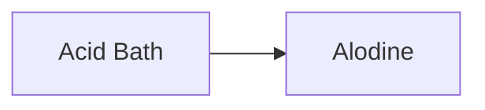
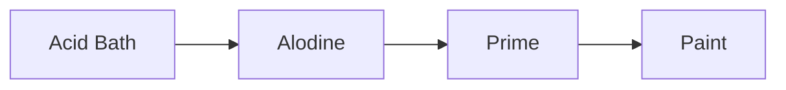

While waiting for my parts, I started to watch youtube videos on prepping the aluminum.

## Alodining

The way I understand it, Sling uses 6061 aluminum, which is highly corrosion resistent so it does not need priming internally like RV does.

However many people still choose to apply alodining. Some video shows the alodining process on internal parts.

I think alondining internal makes sense. First of all, why not. It's an extra layer of protection. Secondly, I'm on a waitlist for just about anything, so
there is no rush to finish fast.

So I think I will at least try to alodine the tail kit's internal parts when it gets here.

## Priming

And one question I have been trying to understand is, what about external parts? Can I apply primer over alodine? Or do I just paint top coat over?

I ran into a post [online](https://www.jalopyjournal.com/forum/threads/whats-the-proper-way-to-paint-aluminum.213174/) that answers my question:

> In the aircraft industry we first prep the bare aluminum with Alumaprep solution from any Dupont distributor or any equivalent weak phosphoric acid etch solution to clean and etch the surface. Then we apply alodine which is a conversion coating that "pickles the surface and makes it resistant to corrosion. This alco can be purchased from Dupont distributors. In the old days we would prime the dry, previously etched & alodined surface with zinc chromate primer but since it is a known carcinogen a good epoxy phosephate or chromate primer would be an excellent substitute.

So the answer appears to be yes. I can apply primer on top of alodine.

## My understanding to the process

So if I want to full prcess full experience, then the whole thing will go like this:

Internal parts:

Skins:

Purpose of each step:
* Acid bath: Give aluminum some tooth to bond with the next chemical
* Alodine: Anti-corrosion.
* Primer: make the paint stick.
* Paint: is the paint.

Since primer can also provide anti-corrosion effect to the skin, it seems I can skip the alodine step on the outer skins. 

And if I don't need alodine, I don't nee a dedicated acid bath as long as I use some self-etching primer product.

So I think my process for the skins will be more like this:

## Material

I believe the commercial name for the alodine solutions are Bonderite IC-33 and Bonderite 1201
* [IC-33](https://www.aircraftspruce.com/catalog/cspages/alumiprep.php)
* [1201](https://www.aircraftspruce.com/catalog/cspages/alodine1201.php)

## References

* https://www.jalopyjournal.com/forum/threads/whats-the-proper-way-to-paint-aluminum.213174/
* https://www.youtube.com/watch?v=A0qn1DKVqAo
* https://www.youtube.com/watch?v=tU9o8HOsQJw