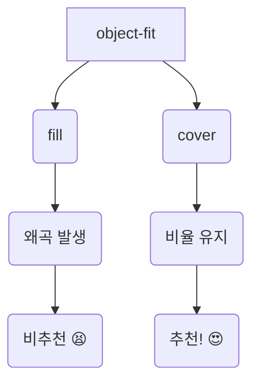
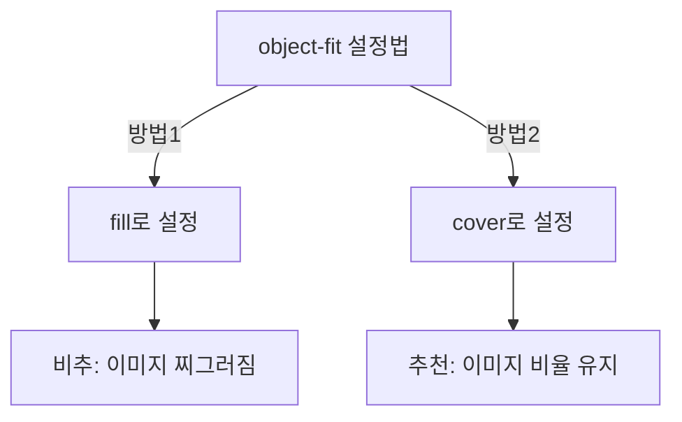

안녕하세요, 여러분! 이미지를 웹에 어떻게 안짤리고 잘 보이게 할 수 있을까요? 오늘은 CSS의 'object-fit' 속성을 통해 그 놀라운 비결을 알려드립니다! 🌈

## 💡 object-fit의 기본 설정: fill 🎈

이미지를 웹에 첨부하려고 하면 기본 설정으로 `fill`이 자동으로 적용됩니다. 하지만 `fill`은 이미지의 가로, 세로 비율을 무시해버려요. 그래서 이미지가 찌그러질 가능성이 크기 때문에 `fill`은 사실상 사용을 피하는 편이에요.

```html
<!-- fill 예제 -->

```

## 🌟 별도로 설정하지 않으면 뭐가 되나요? 🌠

방금 말했듯이, 별도로 `object-fit` 설정을 안 하면 웹 브라우저는 이미지의 원래 가로 세로 비율을 유지하려고 노력합니다. 헌데 이렇게 하면 원치 않게 이미지가 너무 커져서 페이지를 깨뜨리거나 스크롤바를 생성할 수 있어요.

## 😎 object-fit: cover, 그 놀라운 효과! 🚀

그때 사용되는게 바로 `object-fit: cover;` 입니다. 이 설정은 정말 놀라워요! 원본 이미지의 가로 세로 비율을 유지하면서도, 지정한 너비와 높이에 딱 맞게 이미지를 보여줍니다.

```html
<!-- cover 예제 -->

```

이렇게 하면 이미지의 일부가 잘릴 수 있어요. 그러나 잘린 부분을 감수하고 이미지의 비율을 유지하려는 당신! 이 설정은 당신을 위한 최고의 선택일 거에요.





## 🤓 object-fit의 위대함을 느껴보세요! 🎉

오늘 알려드린 `object-fit`을 사용해 이미지의 왜곡 문제를 해결하고, 웹 페이지를 더욱 아름답게 만들어보세요. 저는 다음글에서 또 찾아 뵙겠습니다, 감사합니다.
