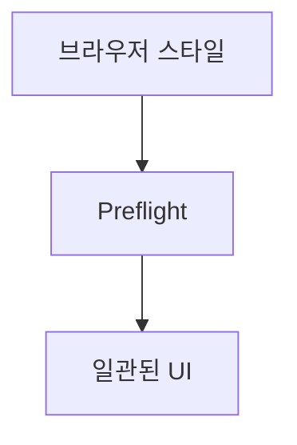

안녕하세요, 오늘은 웹 디자인과 스타일링의 마법사라고 불릴 만한 Tailwind의 Preflight에 대해 얘기해 볼 거예요. 왜 마법사라고 부르냐구요? 이유는 바로 이어서 알려 드릴게요. 😎

## 브라우저, 너의 스타일은 내가 지워주마! 🧹

브라우저는 각각 고유한 스타일을 가지고 있어서 같은 CSS를 주어도 살짝씩 다르게 출력됩니다. 하지만 이때 Preflight가 등장하는 순간! **Preflight는 브라우저가 마음대로 입힌 스타일을 다 지워버립니다.** 이렇게 되면 다른 브라우저 일지라도 일관된 UI를 만들 수 있죠.

## 뭐가 어떻게 변하는데? 🤔

- 모든 HTML 요소의 `margin`과 `padding`을 없앱니다.
- `<h1>`, `<h2>`, `<h3>` 등 헤딩에 적용된 스타일을 일괄 삭제합니다.
- 리스트(`<ul>`, `<ol>`)의 스타일도 지웁니다.
- 멀티미디어 요소(``, `<svg>`)의 `display` 속성을 `block`으로 설정합니다.



위 다이어그램에서 볼 수 있듯이, Preflight는 브라우저 스타일을 거쳐 일관된 UI를 만들어줍니다. 브라우저마다 조금씩 다른 스타일이 적용되는 것을 막아주는거죠!

## Tailwind Preflight 설정 방법 🛠

Preflight는 기본적으로 Tailwind에서 활성화되어 있습니다. 만약 비활성화하고 싶다면, 이렇게 하면 됩니다.

1. Tailwind 설정 파일을 열어주세요.
2. `corePlugins` 섹션에서 `preflight`를 `false`로 설정하세요.

```js
module.exports = {
  corePlugins: {
    preflight: false,
  },
};
```

## 마무리 🎉

이제 Preflight에 대해 알게 됐으니, Tailwind를 쓸 때는 더 이상 브라우저 스타일로 고생하지 않을 거예요. Tailwind와 Preflight의 조합은 진짜 환상적이니까요! 🚀✨
