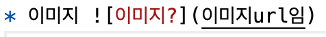

## 🤔 Problem

Nest.js 로 프로젝트를 진행하면서 여러 사람이 서버에 동시에 로그인을 하자, 당사자가 아닌 다른 사람의 회원정보가 나타나는 버그가 발생했다.




## 🌱 Solution

### 1. 로그로 찍어보기

일단 로그로 어떻게 된 일인지 확인해봤다.

```ts
@UseGuards(ATGuard)
@Controller("users")
export class UsersController {
  constructor(
    private userService: UsersService,
    private logger: LoggerService
  ) {}

  /** 나의 정보 가져오기/ 마이페이지, 메인페이지 사용 */
  @Get("me")
  async getMe(@GetCurrentUserInfo() user) {

    // 1. 여기선 user_id : 3 으로 출력되나 
    this.logger.log("1️⃣ 1. 자신의 회원정보 호출한 사람 ", user["sub"]); 

    const result = await this.userService.findUserById(user["sub"]);

    // 2. 여기선 user_id : 2 의 정보를 출력 후 user_id : 3 에게 응답
    this.logger.log("2️⃣2. 자신의 회원정보 호출 결과", result); 

    return result;
  }
}
```

user_id :  3 이 'users/me' 요청을 했을때 1️⃣ 로그에서는 정상적으로 요청한 사람의 정보를 출력했다.

그러나 서비스 계층 비즈니스 로직을 지난 뒤인 2️⃣ 로그에서는 user_id : 2 의 정보를 출력했다.

엑세스토큰 소유자의 것이 아닌 동시에 접속한 다른 사람의 정보를 전달한 것이다.

혼자 로컬에서 여러 계정으로 로그인해가며 작업을 할 땐 이런 현상이 없었기에, Node.js 의 싱글스레드 방식 때문이 아닐까 예상했다.


### 2. 비슷한 사례 찾아보기

**"로그인하면 다른 사람 정보가"···리디, 개인정보 유출 사고**
[https://v.daum.net/v/20230329083313717](https://v.daum.net/v/20230329083313717)

**올리브영 개인정보 노출 사건, 무슨 일이 일어났을까?**
[https://www.boannews.com/media/view.asp?idx=114594](https://www.boannews.com/media/view.asp?idx=114594)

리디북스의 경우 CDN 서버 캐시 설정 오류, 올리브영의 경우 CDN 오류 였다고 한다. 현재 내 서버는 CDN 방식을 사용하지 않고 있다.

> 올리브영, 아직 조사 중이라 상세 내용 공개 어려워
> 그러면서 “CDN(콘텐츠 배포 네트워크)에서 일시적인 오류가 발생해 일부 고객들의 정보가 노출된 것”이라고 설명했다. CDN이 엉키면 사용자가 특정 콘텐츠를 요청했을 때, 엉뚱한 결과가 출력되는데, 바로 그런 일이 일어났다는 것이다.

**Open AI 의 경우 Redis 라이브러리 버그**
[https://www.clien.net/service/board/news/17984872](https://www.clien.net/service/board/news/17984872)

**클리앙의 경우 Redis 라이브러리 버그**
[https://www.clien.net/service/board/annonce/17922106](https://www.clien.net/service/board/annonce/17922106)


Open AI 와 클리앙의 경우 레디스 라이브러리 버그로 발생했다고 한다. 하지만 내 서버에 레디스를 설치하기 전에도 해당 버그는 발생했었다.

> 정확한 원인이 파악되었습니다. 
> 
> 저희가 서버에서 세션을 저장하고 있는 redis(일종의 메모리db)가 한계수치 이상의 부하를 받으면 인덱스가 깨지는 현상이 발생한다고 합니다.
> 
> 국내 대형 쇼핑몰 두곳에서 최근 유사한 증상이 있어 관련자들에게 문의해본 바 저희와 같은 증상이었습니다.  
> 
> 이번의 여러 조치 중 redis 통신 최적화 작업도 진행하였기에  다시 재발되지 않을 것입니다. 
>
> 더 줄일 수 있는 요소가 있으므로  추가적인 작업을 진행할 예정입니다.


### 3. 나의 해결 방안

클라이언트에게 데이터를 돌려보내기 전에 한 번 더 검증을 진행하기로 했다.

들어오는 모든 요청을 인터셉터가 먼저 확인하고, 해당 엔드포인트가 Access Token 을 사용하는 메서드라면 user_id 를 originalUserSub 라는 변수에 기록해둔다.

그리고 응답을 반환하기 전, 반환 값에 들어있는 user_id 와 originalUserSub 의 동일 여부를 검증한다.

만약 검증을 통과하지 못한다면 해당 요청을 무효화하고 다시 실행하게끔 로직을 구성했다.

```ts
import { Injectable, NestInterceptor, ExecutionContext, CallHandler } from '@nestjs/common';
import { Observable } from 'rxjs';
import { switchMap } from 'rxjs/operators';
import { LoggerService } from '../../logger/logger.service';

@Injectable()
export class UserSubCheckInterceptor implements NestInterceptor {
  constructor(private readonly logger: LoggerService) {}

  intercept(context: ExecutionContext, next: CallHandler): Observable<any> {
    const request = context.switchToHttp().getRequest();
    const user = request.user;
    const originalUserSub = request.user.sub;

    return next.handle().pipe(
      switchMap(async (data) => {
        if (user['sub'] && data.user_id) {
          if (data.user_id && originalUserSub !== undefined && data.user_id !== originalUserSub) {
            // user["sub"] 값이 변경되었으므로 해당 메서드를 다시 호출합니다.
            this.logger.log("UserSubCheckInterceptor : user['sub'] 가 동일하지 않습니다 " + originalUserSub +  "!==" + data.user.user_id)
            return await next.handle().toPromise();
          }
        }
        return data;
      }),
    );
  }
}
```

[https://github.com/fog-of-war/dev-be/blob/dev/src/common/interceptor/user-sub-check.interceptor.ts](https://github.com/fog-of-war/dev-be/blob/dev/src/common/interceptor/user-sub-check.interceptor.ts)


<details markdown="block"><summary>상세설명</summary>
> `return await next.handle().toPromise()` 는 RxJS의 Observable을 사용하여 작성된 코드입니다. 
> 
> 이 코드는 next.handle()로부터 반환된 Observable을 Promise로 변환하여 비동기 작업을 수행합니다.
> 
> next.handle()는 인터셉터가 **현재 실행 중인 요청**을 처리하는데 사용되는 Observable을 반환합니다. 즉, **컨트롤러 메서드의 실행**을 나타냅니다.
> 
> .toPromise()는 Observable을 Promise로 변환하는 메서드입니다. 이를 통해 Observable이 아닌 비동기 코드와 함께 작업할 수 있습니다.
> 
> 따라서 `return await next.handle().toPromise()` 은 현재 인터셉터가 다시 `next.handle()`을 호출하고 해당 Observable을 Promise로 변환하여 현재 요청을 다시 실행하도록 하는 코드입니다. 이것은 **user["sub"]** 값이 변경된 경우에 해당 메서드를 한 번 더 실행하도록 하는 부분입니다. 
</details>


### 📎 Related articles

| 이슈명                                                 | 링크                                                                                                |
| ------------------------------------------------------ | --------------------------------------------------------------------------------------------------- |
| '로그인하면 다른 사람 정보가'…리디, 개인정보 유출 사고 | [ https://m.clien.net/service/board/news/17992854](https://m.clien.net/service/board/news/17992854) |
