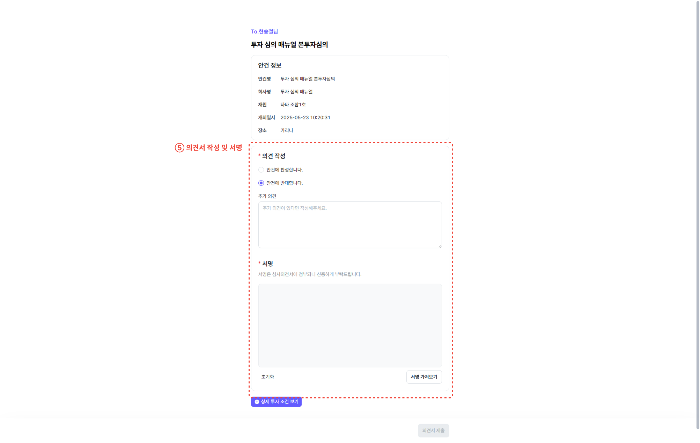

## 前置准备
首先需要安装好Rclone以及WinFsp。（均需要使用到，必备）

下载地址：  
Rclone [https://rclone.org/downloads/](https://rclone.org/downloads/)   
WinFsp [https://winfsp.dev/](https://winfsp.dev/)

首先将winFsp安装完，下载msi版本就行。直接下一步完成即可。

## 步骤

1. 将Rclone复制到任意文件夹（路径不能带有中文）
2. 打开cmd，cd到Rclone所在的目录。或者直接到Rclone所在的目录，右键点击，选择在终端打开，输入cmd，切换为cmd。
3. 输入rclone.exe config
4. 开始添加或修改你的webdav服务器，假设这里你添加的服务器name叫webdav。按照指令提示进行即可。具体如下
    1.   
    选择n。
    2.   
    名称就是挂载上去后显示在本地的名称  
    3.   
    根据自己的本选择对应的需要，**版本不同序号也不同**  
    4.   
    输入自己远程磁盘的位置，127.0.0.1:8080是无效的。
    5.   
    输入7，选择ohther site就行
    6.   
    下面是你自己的用户信息 你的webdav服务器连接的账号密码 我就不赘述了
    7. 
    选择yes，然后输入两遍webdab服务器账号的密码。
    8. 后续高级设置，以及确认，一直按回车就行。
    9. 结束后会回到初始界面，直接按q退出就行。
    10. 配置完成后可以正式启动程序了，输入命令    `rclone.exe mount webdav:/ Z: --vfs-cache-mode full` 将webdav挂载到Z盘
    webdav为最初设置的名字。

## 设置开机自启动
### 将Rclone设置为开机自启动

要让Rclone在Windows启动时自动挂载WebDAV为本地硬盘，可以按照以下步骤操作：

1. **创建批处理文件**：在`rclone.exe`所在的同级目录下新建一个名为`rclone.bat`的文件，文件内容如下：
`rclone.exe mount webdav:/ Z: --vfs-cache-mode full`

2. **创建VBS脚本**：在`rclone.exe`的同级目录下新建一个名为`rclone.vbs`的文件，文件内容如下：
    ```vbscript
    Set objShell = CreateObject("WScript.Shell")
    objShell.Run "D:\rclone-v1.66.0-windows-amd64\rclone.bat", 0, True
    ```
    注意：如果rclone文件夹的路径中包含空格，上述VBS脚本可能无法正常运行。
3. 设置开机自启：为rclone.vbs文件创建一个快捷方式，并将该快捷方式放入Windows的启动目录中：
`C:\%USERPROFILE%\AppData\Roaming\Microsoft\Windows\Start Menu\Programs\Startup`

通过以上步骤，每次Windows启动时，Rclone将自动挂载指定的WebDAV路径为本地硬盘