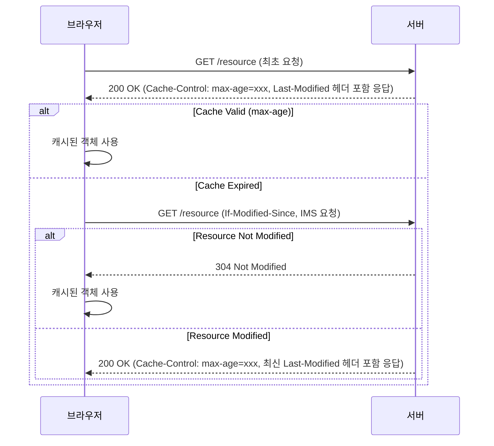

## Cache-Control 헤더에 대한 이해

---
`Cache-Control` 헤더는 웹 캐시 동작 방식을 제어하기 위해 사용됩니다.<br>
이를 통해 클라이언트와 서버는 어떻게, 얼마나 오랫동안 응답을 캐시할지 결정할 수 있습니다.<br>
캐시의 효율적인 사용을 통해 리소스 로드를 최적화하고, 네트워크 트래픽을 줄여 최종 로딩속도 향상에 도움을 줄 수 있습니다.

## Cache-Control 동작 방식

---
`Cache-Control` 헤더는 다양한 디렉티브(directives)를 사용하여 캐시 정책을 설정합니다.<br>
각 디렉티브는 브라우저와 CDN 서버가 객체를 어떻게 캐시하고 사용할 지에 대한 지침을 정의합니다.

- **public**: 응답을 모든(브라우저, CDN) 캐시가 저장할 수 있게 합니다.
- **private**: 응답을 브라우저에만 캐시되도록 합니다.
- **max-age=seconds**: 응답이 캐시에 저장된 후 몇 초 동안 유효한지 지정합니다. 지정된 시간이 지나면 다시 서버에 요청 합니다.
- **no-cache**: 캐시된 객체를 사용하기 전에 서버에 유효성 검사를 합니다, 캐시된 데이터가 있어도 항상 서버에 확인을 거칩니다.
- **no-store**: 응답이나 요청에 대한 어떤 정보도 캐시에(메모리,디스크 등) 저장하지 않도록 합니다.
- **must-revalidate**: 반드시 서버에 캐시 유효성 검사를 해야 합니다.

## Cache-Control과 Last-Modified 헤더의 관계

---
`Cache-Control` 헤더와 `Last-Modified` 헤더는 함께 사용되어 웹 캐시의 유효성을 검증합니다.<br>
`Cache-Control` 헤더는 캐시 정책을 정의하고, `Last-Modified` 헤더는 객체의 변경 여부를 확인하는 데 사용됩니다.



1. **최초 요청**: 
   - 브라우저가 서버에 `/resource` 경로로 요청을 보냅니다.
   - 서버는 `200 OK` 응답과 함께 `Cache-Control` 및 `Last-Modified` 헤더를 포함시켜 응답합니다.

2. **캐시 검증**:
   - 브라우저는 `Cache-Control` 헤더의 `max-age` 값을 기준으로 캐시가 유효한지 확인합니다.
   - 캐시가 유효한 경우, 브라우저는 캐시된 리소스를 사용합니다.
   - 캐시가 만료된 경우, 브라우저는 서버에 `If-Modified-Since` 헤더를 포함하여 조건부 요청을 보냅니다.

3. **서버 응답**:
   - 서버는 `Last-Modified` 값을 확인하여 객체가 변경되지 않았으면 `304 Not Modified` 응답을 반환합니다. **(데이터 전송 없음)**
   - 브라우저는 캐시된 객체를 계속 사용합니다.
   - 객체가 변경된 경우(원본 객체의 Last-Modified 시간이 더 최신인 경우), 서버는 `200 OK` 응답과 함께 갱신된 `Cache-Control` 및 `Last-Modified` 헤더를 포함하여 데이터를 전송합니다.


## Cache-Control 주요 지시자

---
### Cache-Control: max-age=xxxx

`max-age` 디렉티브는 응답이 캐시에 저장된 후 몇 초 동안 유효한지를 지정합니다.<br>
이 기간 동안 캐시된 객체는 서버와의 추가 확인 없이 사용될 수 있습니다.

예: 3600초(1시간) 까지 캐시가 유효하며, 유효 시간이 만료되면, 다시 서버로 캐시 유효성 검증을 합니다.
```
Cache-Control: max-age=3600
```

### Cache-Control: no-cache, no-store, must-revalidate

no-cache, no-store, must-revalidate 지시자를 조합하여 사용하는 이유는,<br>
브라우저나 CDN에 객체가 캐시되지 않도록 하며, 매번 서버에 유효성 검사를 요청하고, 만료된 데이터를 재사용하지 않도록 합니다.
이는 웹 애플리케이션의 최신 데이터가 항상 필요한 경우에 사용됩니다.

```
Cache-Control: no-cache, no-store, must-revalidate
```

## 결론

---
`Cache-Control` 헤더는 웹 캐싱을 세밀하게 제어하는 데 중요한 도구입니다.<br>
`Cache-Control`과 `Last-Modified` 헤더는 함께 사용되어 캐시 유효성 검사와 리소스 관리의 효율성을 높입니다.<br>
다양한 디렉티브를 통해 **캐시 정책을 정확하게 설정함**으로써 서버 부하를 줄이고, 네트워크 지연을 최소화하며, 사용자에게 더 빠른 응답을 제공할 수 있습니다.<br>

### 동적, 정적 객체의 특성에 맞는 Cache-Control 설정

**캐시 정책을 정확하게 설정한다**는 의미는, 동적/정적 객체를 구분하여 적절한 캐시정책을 사용함에 있습니다.

#### 동적 객체

동적 객체는 자주 변경되는 데이터, 그리고 사용자 요청에 따라 내용이 달라질 수 있는 객체의 데이터를 말합니다.<br>
이러한 객체에 대해서는 캐시 여부를 신중하게 관리해야 합니다.<br>
보통 캐시하면 안되는 실시간성 데이터이며, 아래와 같은 지시자를 사용하여 사용자와 원본 서버간에 데이터를 그대로 주고 받을 수 있도록 사용합니다.

```
Cache-Control: no-cache, no-store, must-revalidate
```


#### 정적 객체

정적 객체는 자주 변경되지 않는 데이터를 말하며, 보통 이미지, CSS, JS, Font 등이 있습니다.<br>
이러한 객체는 캐싱을 통해 성능을 극대화할 수 있습니다.

```
Cache-Control: max-age=3600
```


{:.prompt-tip}
> 최근의 웹 사이트를 보면, 짧은 MP4 영상 파일(예: 숏츠)을 사용하여 구성하는 사례들을 볼 수 있습니다. 이는 최근 사용자 경험에 따른 트렌드를 반영한 것으로 보입니다.\
> MP4 파일은 정적 객체이면서 크기가 큰 특징이 있습니다.\
> 영상 파일을 처리하기 위해서는 높은 트래픽이 필요한데, 일반적인 서버와 네트워크 환경에서는 이를 수용하기 어렵습니다.\
> 그래서 CDN 정적 캐시를 활용하여 많은 사용자에게 성능 저하 없이 데이터를 전송할 수 있습니다.

