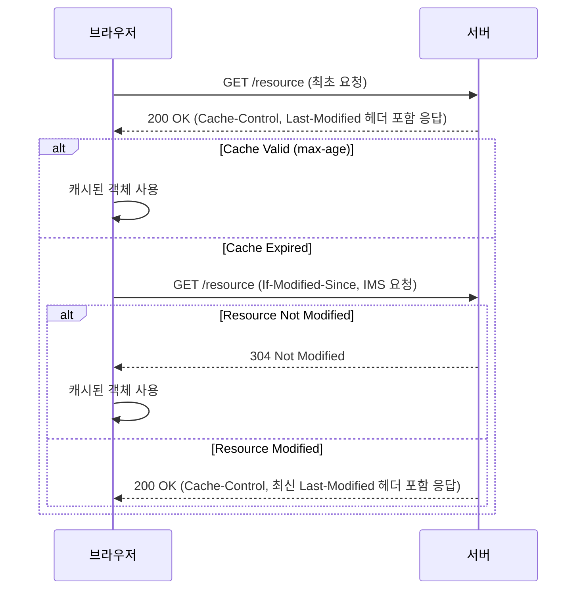

### Cache-Control과 Last-Modified 헤더의 관계

`Cache-Control` 헤더와 `Last-Modified` 헤더는 함께 사용되어 웹 캐시의 유효성을 검증합니다. 
`Cache-Control` 헤더는 캐시 정책을 정의하고, `Last-Modified` 헤더는 객체의 변경 여부를 확인하는 데 사용됩니다.

2. **최초 요청**: 
   - 브라우저가 서버에 `/resource` 경로로 요청을 보냅니다.
   - 서버는 `200 OK` 응답과 함께 `Cache-Control` 및 `Last-Modified` 헤더를 포함시켜 응답합니다.

2. **캐시 검증**:
   - 브라우저는 `Cache-Control` 헤더의 `max-age` 값을 기준으로 캐시가 유효한지 확인합니다.
   - 캐시가 유효한 경우, 브라우저는 캐시된 리소스를 사용합니다.
   - 캐시가 만료된 경우, 브라우저는 서버에 `If-Modified-Since` 헤더를 포함하여 조건부 요청을 보냅니다.

3. **서버 응답**:
   - 서버는 `Last-Modified` 값을 확인하여 객체가 변경되지 않았으면 `304 Not Modified` 응답을 반환합니다.
   - 브라우저는 캐시된 객체를 계속 사용합니다.
   - 객체가 변경된 경우(원본의 객체의 Last-Modified 시간이 더 최신인 경우), 서버는 `200 OK` 응답과 함께 갱신된 `Cache-Control` 및 `Last-Modified` 헤더를 포함하여 응답합니다.
