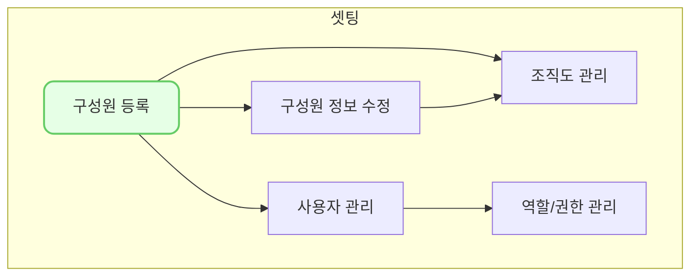

## github desktop 사용 시 주의점

- 최초 클론 시 다음과 같은 안내가 나옵니다.
🔹 To contribute to the parent project (부모 프로젝트에 기여)
🔹 For my own purposes (개인적인 용도)

- 반드시 두번째 'For my own porposes'를 선택해야 합니다.
- 첫번째 사항은 원본 프로젝트(cotes2020/jekyll-theme-chirpy)에 개선사항이나 버그 수정을 할 때 사용합니다. 
- 우리는 매뉴얼 작업임으로 ddock-ddock/lpworks.github.io에 개선해야 함으로 두번째 것을 선택해야 합니다.

## 파일 명명 및 경로

- _posts 폴더에 작성을 합니다.
- 파일명은 반드시 YYYY-MM-DD-제목으로 구성되어야 하며 띄어쓰기가 없어야 합니다.
	- 파일명은 생성일로 표시되고, 수정일은 실제 데이터가 업데이트된 날짜로 별도로 표기됩니다.
	- 옵시디언이나, 지킬은 기본적으로 순서가 파일이름 순 정렬이 됩니다. 따라서 여기 표시되는 날짜 정보는 노출순서에 가까운 개념임으로 노출순서를 커스터마이징 하는 용도로 사용하시기 바랍니다. 
- 확장자는 .md 입니다. (옵시디언으로 작업하면 자동으로 됩니다.)
 - 파일이름은 식별자임으로 실제 글 제목이 아닙니다. 제목은 하단에 프론트메터를 따릅니다.

## 프론트메터

본 문서 선두에 있는 것을 참고해주세요

- date는 수동으로 입력해주세요 국제표준시임으로 뒤에 +0800 은 변경하실 필요 없습니다.
- 카테고리는 MECE해야 하며 최대 2 단계로 등록 가능합니다.
	- 카테고리에 2개를 등록하면,  자동으로 앞에 있는 것이 대분류, 뒤에 있는 것이 그에 종속된 중분류가 됩니다. 
- 태그는 MECE할 필요가 없으며 무한대까지 가능합니다.
	- 일반적으로 소분류에 대응해도 무방합니다.
- Liquid는 동적컨텐츠를 사용해야 할 때 Liquid 기반 프로그래밍을 할 때 활성화 합니다. (기본 선택 하시면 됩니다.)

## 개요

- 기본적으로 마크다운 개요에 맞추어 우측에 목차가 표시됨으로 개요를 적극 사용해 주세요 
- 개요 작성 시 순번을 사용할 때 순번 표시를 강제하려면 .앞에 \ 를 사용하세요 `1.\` 식으로 작성하면 숫자가 자동완성되지 않고 앞에 지정된 숫자를 고정하게 됩니다.

## 이미지

### 옵시디언 설정 변경
- 옵션 > 파일 및 링크 
	- 새로 만드는 링크 형식 : 보관소의 절대 경로로 저장
	- wikilink 사용 안함
- 새 첨부 파일을 만들 위치 : 아래에 지정된 폴더
	- assets/img

### 이미지 등록 방법
- 위 설정을 한뒤 옵시디언에 단순히 붙여 넣기 하면 됩니다.
- 신중하게 붙여넣기 하여 불필요한 이미지가 생성되는 걸 억제하여 주세요
- 이미지는 들여쓰기를 하지 마시고 입력하시고 가로 사이즈는 자동으로 줄여집니다.
- 이미지 바로 밑에 `_이미지 설명_` 를 표기하면 캡션으로 처리됩니다.

_옵시디언 설정화면_

## 영상

- 영상은 iframe을 사용하며 width 입력을 할 수 있으나, 반응형이 되지 않습니다.
- iframe width="800" height="450" src="https://www.youtube.com/embed/MsNJAYDkx1g" frameborder="0" allowfullscreen
- 반응형을 위해 Liquid 방식으로 등록해야 하며 include embed/youtube.html id='MsNJAYDkx1g' 식으로 처리하면 됩니다.


## 링크

- 위의 영상 때문에 Liquid 방식이 강제되며, 링크는 liquid 상태에서 일반적인 마크다운 대괄호 링크 방식을 사용 할 수 없습니다.
- `[hr0007]()` 이러한 방법으로 liquid 구문으로 링크를 걸어야 합니다.
- 절대 경로는 `<https://dkdk.kr>` 식으로 지정 가능하며 반드시 https 형태의 사이트로만 연결이 가능합니다. 
  - <https://dkdk.kr>
- 각주는 `내용[^name]` 으로 하고 글의 끝에 동일한 `[^name]: 내용` 으로 구성하면 됩니다.
  - 똑똑[^dkdk]

## 다이어그램

- Mermaid 기반으로 도해합니다.

## Prompts
- 프롬프트는 마크다운 > 용법에 별도 스타일을 추가하는 방법입니다.
- `>` 용법으로 글을 작성한 뒤 다음줄에 `{: .prompt-tip } ` 식으로 작성하면 아래와 같이 적용됩니다.

> 단순히 `>` 만 사용했을 때

> `{:.prompt-tip:}` type prompt 입니다.
{: .prompt-tip }

>  `{:.prompt-info:}` type prompt 입니다.
{: .prompt-info }

> `{:.prompt-warning:}` type prompt 입니다.
{: .prompt-warning }

> `{:.prompt-danger:}` type prompt 입니다.
{: .prompt-danger }

## 표
- 표는 엑셀에서 작업 후 옵시디언 기능을 활용하는 게 유리합니다.
- 커뮤니티 플러그인 Advanced Table 설치가 필요합니다.

| Company                      | Contact          | Country |
|:---------------------------|:---------------|-------:|
| Alfreds Futterkiste          | Maria Anders     | Germany |
| Island Trading               | Helen Bennett    | UK      |
| Magazzini Alimentari Riuniti | Giovanni Rovelli | Italy   |

## 산식

- LaTeX 용법으로 작성합니다.
- $a \ne 0$, 일 때 $ax^2 + bx + c = 0$ 이라면,
$$ x = {-b \pm \sqrt{b^2-4ac} \over 2a} $$

## 참고사항
[^dkdk]:똑똑의 재직원을 똑똑커(dkdk.kr)라고 부른다.

