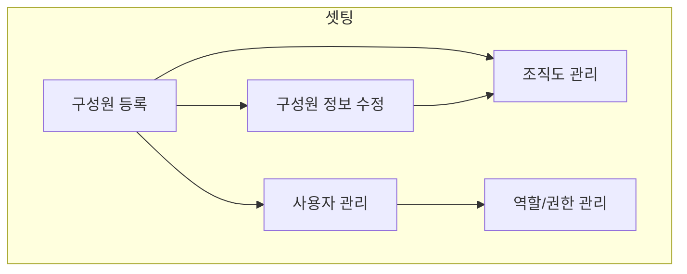

가장 먼저 우리 회사의 근무하는 사람들을 입력합니다. 이 화면은 VCworks에 접속하는 ID를 가진 사용자와는 다른 개념입니다. (첫 줄에는 목록에서 첫단락이 제목이 표시됨으로 간략하게 핵심을 작성해야 좋음)

## 동영상



## 설명

- `인사>인사 정보 관리>구성원`을 통해서 접근 가능합니다.
- 사원번호는 기존 ERP혹은 내부에서 사용 중인 사원번호를 입력하시면 됩니다.
	- 우리 시스템에서는 별도로 사번을 채번안하나?
- 입사일과 이메일주소가 왜? 필수값인가?
- 국적은 대한민국을 기본값으로 해두면 안되나?
- 여기에 좀 더 디테일한 게 필요하면 꼭 필요한 내용 위주로 작성

## 자주 묻는 질문

- 여기에 사람들이 자주 착각하거나 혼란스러워 하는 내용을 상세하게 작성
- 구성원(사용자) 추가를 했는데 결재라인에 뜨지 않아요!
	-  VCworks에는 구성원,사용자,거래처가 있습니다.
		- 구성원: 조직도 등 인사구성을 위한 정보입니다?
		- 사용자: ERP를 실제 사용하는 사람을 위한 정보입니다?
		- 거래처: 투자활동, 거래활동 등을 위한 정보입니다?
	- `인사-구성원`에서 사원을 추가하고 사번을 입력합니다.
		- 구성원이 추가되면 `설정-거래처관리`에 자동으로 개인이 추가됩니다.
	- 전자결재에 표시하려면 `설정-사용자 관리`에서 구성원을 연결해주어야 합니다.

## 코어 가이드 목차

- 초기셋팅
	- 구성원 등록([hr0001]()) 👈 _현재 문서
	- 구성원 정보수정 ([hr0002]())
	- 조직도 관리 ([hr0007]())  
	- 사용자 관리 ([se0005]())  
	- 역할/권한 관리 ([se0003]())  
- 결성(조합등록)
	- 조합조회 ([fd0001]())  
	- 조합정보개요 등록 (fd0009)
	- 투자의무달성현황 등록 (fd0010)
	- 조합원명부 등록 (fd0011)
	- 조합원 개별 추가(fd0051)
	- 재원별 회계원장 등록 (fm0010)
	- 금융정보 등록(계좌등록)(fd0009)
	- 필수 필요서류 등록 (fd0013)
	- 보수정보 등록 (fd0012)
	- 출자/배분 등록 (fd0006)
	- 운영지시서 등록 (io0002)
	- 전자결재 (ed0001)
- 운용(투자심사)
- 회수
- 배분

## 선후행 구조도

