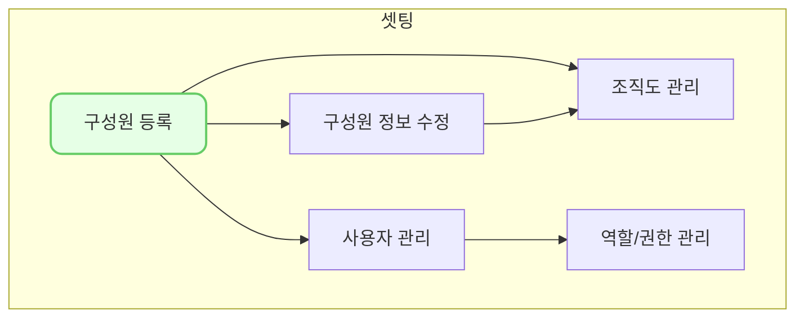

구성원 등록(hr0001)에서는 우리 회사의 구성원의 기본 정보만 입력하여 간단하게 등록할 수 있습니다.

> #### 구성원과 사용자는 어떻게 다른가요 ?
> - `구성원`은 VCworks에 접속할 수 있는 ID를 가진 `사용자`와는 다른 개념입니다.
> 	- 대부분의 경우 구성원 = 사용자 이지만,
> 	- 우리회사의 임직원이지만 VCworks를 사용하지 않는 경우 구성원 O, 사용자 X 입니다.
> 	- 반대로 우리회사의 임직원은 아니지만 VCworks의 ID를 가지고 있는 외부인의 경우 구성원 X, 사용자 O 입니다.
{: .prompt-info }

## 동영상



## 설명

- 구성원 등록(hr0001)은 `인사 > 인사 정보 관리 > 구성원`을 통해서 접근 가능합니다.

1. 우측 상단의 [신규 등록] 버튼을 클릭합니다.
2. 구성원 등록 드로어가 열리면, 구성원 정보를 입력합니다.
	* **이름**: 등록할 구성원의 이름을 입력
	- **재직상태**: 등록할 구성원의 재직 상태를 선택 (재직/퇴직/휴직/입사예정)
	- **사원번호**: 기존 ERP혹은 내부에서 사용 중인 사원번호 입력
	- **입사일**: 등록할 구성원의 입사일을 입력
	- **휴대전화번호**: 등록할 구성원의 휴대폰 번호 입력
		- ※ `-`를 포함하여 010-1234-1234 형식으로 입력해야 합니다.
	- **국적**: 등록할 구성원의 국적을 선택
	- **이메일 주소**: 등록할 구성원의 회사 이메일 주소를 입력
3. 구성원 정보 입력을 완료 했으면 [저장] 버튼을 클릭합니다.
4. 신규 구성원 등록을 완료했습니다.

## 자주 묻는 질문

> 어떤 사람을 `구성원`에 등록해야 하나요 ?
{: .prompt-tip }
- VC웍스 내에서 구성원의 정보가 필요한 모든 곳에서 구성원 등록(hr0001)의 목록을 참조하고 있습니다.
- 예를 들면, 조합의 대표펀드매니저, 핵심운용인력을 등록하거나, 투자심의위원회 참석자를 입력하는 등의 경우에 사용되고 있습니다.
- 따라서 해당 구성원을 시스템 내에서 사용해야 하는 경우에 등록하면 됩니다.

> `구성원`과 `사용자`는 어떻게 연결 할 수 있나요 ?
{: .prompt-tip }
- 구성원과 사용자는 [구성원 수정(hr0002)](https://guide.vcworks.kr/posts/hr0002/) 에서 연결 할 수도 있고, [사용자 관리(se0005)](https://guide.vcworks.kr/posts/se0005/)에서 연결 할 수도 있습니다.
- 자세한 연결 방법은 위 페이지 별 링크에서 확인 할 수 있습니다.

## 선후행 구조도

