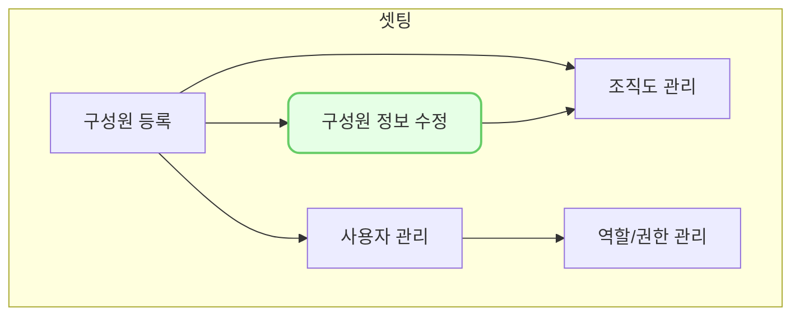

구성원을 등록한 다음에는 직위,주소,성별,부서 등 다양한 추가 정보를 입력할 수 있습니다. 

## 동영상



## 설명

- 주민등록번호는 앞에서는 필수값이 아니라 여기서 필수값인데 괜찮은가? 
- 주민등록번호가 필수값이며 꼭 등록해야 하는 이유를 여기에 기술
	- 주민등록번호에 대한 암호화 정책을 여기에 기술
- 성별도 앞에서는 필수값이 아니나 여기서는 필수값인 이유를 기술

## 자주 묻는 질문

> 학력,경력,자격,문서정보를 입력할 수 없어요!
{: .prompt-tip }

- 학력,경력,자격정보는 향후 인사관리가 구현되면 추가될 예정입니다.
- 빠른 개발이 필요하시면 구체적인 요구사항을 정리하셔서 we@dkdk.kr 로 요청해주세요!

## 선후행 구조도

