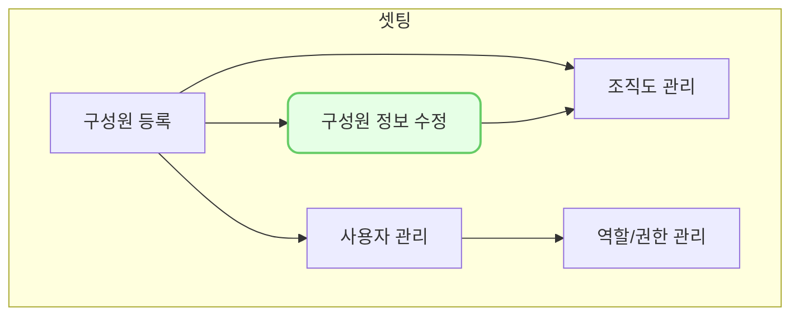

구성원 수정(hr0002)에서는 구성원의 직위, 주소, 성별, 부서 등 다양한 추가 정보를 입력할 수 있습니다. 

## 동영상



## 설명

- 구성원 수정(hr0002)은 `인사 > 인사 정보 관리 > 구성원 > 행 클릭`을 통해서 접근 가능합니다.

1. 상세정보를 조회 또는 수정하고자 하는 구성원의 행을 클릭합니다.
2. 해당 구성원의 상세 화면(hr0002)이 열리며, 이 화면에서 해당 구성원으로 등록된 상세 정보를 확인 할 수 있습니다.
3. 수정을 원하는 경우 좌측 상단의 [수정]버튼을 클릭합니다.
4. 정보를 입력합니다.
	- 기본 정보
		* **이름**: 구성원의 이름을 입력
		- **재직상태**: 구성원의 재직 상태를 선택 (재직/퇴직/휴직/입사예정)
		- **사원번호**: 기존 ERP혹은 내부에서 사용 중인 사원번호 입력
		- **주민등록번호**: 
			- ※ 해당 임직원을 VCworks 내에서 거래처로 관리하기 위해서 구성원 정보를 수정하는 경우 주민등록번호를 필수로 입력해야 합니다.
		- 직위: 현재 본 회사(VC)에 등록된 직위가 나오며, 구성원의 직위를 선택
		- 주소: 구성원의 주소를 입력
		- **국적**: 구성원의 국적을 선택
		- **성별**: 구성원의 성별을 선택 (남/여)
			- ※ 추후 제안서 자동 생성을 위해 성별을 필수로 입력해야 합니다.
		- 사용자 ID: 현재 [사용자관리(se0005)](https://guide.vcworks.kr/posts/se0005)에 등록된 모든 ID가 나오며, 해당 구성원과 매칭되는 ID를 선택 
		- **이메일 주소**: 구성원의 회사 이메일 주소를 입력
		- **휴대전화번호**: 구성원의 휴대폰 번호 입력
			- ※ `-`를 포함하여 010-1234-1234 형식으로 입력해야 합니다.
		- 내선번호: 구성원의 내선번호가 있는 경우 입력
		- **입사일**: 구성원의 입사일을 입력
		- 퇴사일: 구성원의 재직상태가 `퇴직`인 경우 퇴사일을 입력
	- 부서(팀) 및 직책정보
		- 부서(팀): 현재 [조직도(hr0007)](https://guide.vcworks.kr/posts/hr0007/)에 등록된 부서가 나오며, 구성원이 소속된 부서(팀)을 선택
		- 직책 : 현재 본 회사(VC)에 등록된 직책이 나오며, 구성원의 부서(팀)내 직책을 선택
		- 1명의 구성원에 대해서 여러개의 부서(팀) 및 직책을 입력할 수 있습니다.
	- 학력 사항
		- 입력 자체는 선택사항이나, 행을 추가한 경우 `학교명`, `학과(전공명)`, `학위 구분`, `입학일`, `졸업일`, `취득국가` 를 필수로 입력해야 합니다.
	- 경력 사항
		- 입력 자체는 선택사항이나, 행을 추가한 경우 `법인유형`, `경력 구분`, `회사명`, `부서명`, `직위`, `입사일`, `퇴사일` 을 필수로 입력해야 합니다.
		- 경력 구분 : 
			- A : 주식, 채권 및 대체 투자(Alternative Investment)와 관련된 법인 또는 부서에 재직 중에 투자 대상 발굴, 투자 검토 및 심사, 사후 관리 및 회수 등 실무 또는 의사 결정 과정에의 참여가 주된 업무인 경우에 한함  
				- 단, 단기 수익 획득 목적 투자와 주관사 업무 · 인수 업무로 인한 투자 제외  
			- B : A 이외 기타 금융기관, 유관분야(산업계, 투자자문 및 관련 컨설팅, 법무법인, 회계법인, 투자회사 관리업무 등)의 재직경력  
			- C : A, B에 속하지 아니하는 경력  
			- ※ 동일 재직회사에서 이동 등으로 인해 업무구분이나 관련경력 해당여부가 달라지는 경우 구분하여 작성
	- 자격 정보
		- 입력 자체는 선택사항이나, 행을 추가한 경우 `자격명`, `취득일`, `발급기관`을 필수로 입력해야 합니다.
5. 정보 입력 및 수정을 완료한 경우 [저장] 버튼을 클릭합니다.
6. 구성원 정보 수정을 완료했습니다.

> #### 경력 구분은 왜 작성하나요?
> - 추후 구성원에 등록된 내용을 기반으로 주요 양식에 대한 제안서 자동 생성을 지원할 예정입니다. 해당 기능을 위해 미리 등록하는 건입니다.
{: .prompt-info }

## 자주 묻는 질문

>입력한 개인정보는 어떻게 관리되나요 ?
{: .prompt-tip }
- 개인정보와 같은 민감정보는 암호화되어 DB에 저장하고 있으니 안심하고 사용하셔도 됩니다.

> 직위/직책은 수정할 수 없나요?
{: .prompt-tip }
- 직위/직책은 회사(VC)별로 수정 가능하나 현재 해당 메뉴가 개발되지 않아 향후 기능이 추가될 예정입니다.
- 직위/직책 추가나 변경을 원하시면 we@dkdk.kr 로 요청 부탁드립니다.

> 구성원을 삭제하려면 어떻게 해야하나요?
{: .prompt-tip }
- 해당 구성원이 연결된 수많은 과거 정보 (결재 문서, 투자심의, 조합 등등)의 이력관리 때문에 삭제기능은 제공하지 않습니다.
- 구성원이 더 이상 재직하지 않는 경우 재직상태를 `퇴직`으로 변경해 주세요.
- 그럼에도 불구하고 삭제가 필요한 경우 we@dkdk.kr 로 요청 부탁드립니다.

## 선후행 구조도

