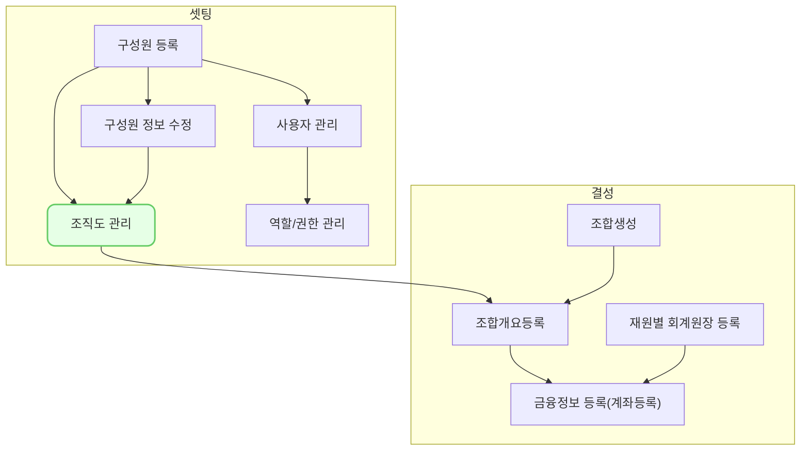

구성원을 만든 다음에는 조직을 만들고 이 조직에 구성원을 배속 시킬 수 있습니다. 

## 동영상



## 설명

- 조직은 계층형 구조로 만들 수 있으며, 상위 부서를 설정하여 다단계로 구성할 수 있습니다
- 사용하지 않는 조직은 사용여부를 꺼주세요
- 직책관련 이슈
	- 미래에 대해 발령이 안됨(?) 이었나 해당 내용을 정리함
	
## 자주 묻는 질문

> 조직을 테스트로 만들어봤는데 삭제가 안되요!
{: .prompt-tip }

- 조직은 이력관리를 위해 정책적으로 삭제할 수 없습니다.
- 조직은 생성 뒤 삭제할 수 없으니 신중하게 생성해주세요
- 만약 불필요한 조직이 많다면 기존의 조직의 이름을 변경하여 사용하는 것을 추천 드립니다.
- 그럼에도 불구하고 삭제가 필요한 경우 we@dkdk.kr 로 요청해주세요

## 선후행 구조도

