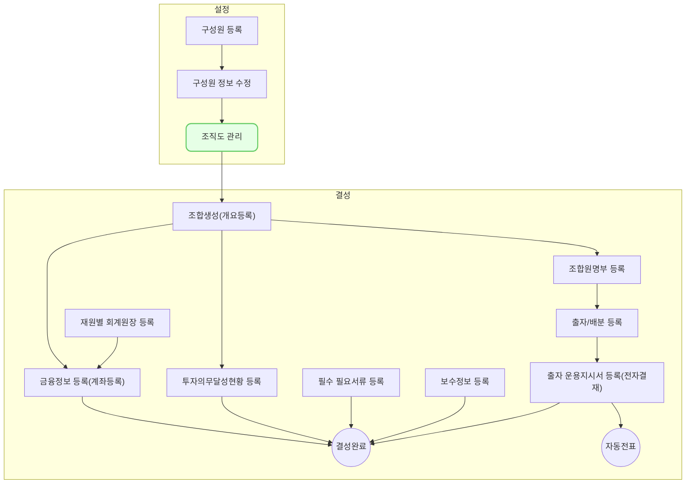

조직도 메뉴에서는 부서를 생성하거나 수정, 미사용처리 할 수 있으며 구성원들을 조직에 연결 시킬 수 있습니다. 

## 동영상



## 설명

- 조직도(hr0007)은 `인사 > 인사 정보 관리 > 조직도`를 통해서 접근 가능합니다.
- 부서는 계층형 구조로 만들 수 있으며, 상위 부서를 설정하여 다단계로 구성할 수 있습니다
##### 부서 등록하기
1. 좌측 `조직 부서` 섹션 우측 상단의 [신규 등록] 버튼을 클릭합니다.
2. 부서 등록 드로어가 열리면, 부서 정보를 입력합니다.
	* **부서명**: 등록할 부서의 이름을 입력
	- 상위부서: 등록할 부서의 상위 부서를 선택
	- **출력 순서**: 등록할 부서의 출력 순서를 입력
		- 동일 레벨의 다른 부서들과 비교하여 숫자가 작은 경우 조직도 상단에 노출됩니다. 
	- **사용 여부**: 등록할 부서의 사용 여부를 선택
3. 부서 정보 입력을 완료 했으면 [저장] 버튼을 클릭합니다.
4. 신규 부서 등록을 완료했습니다.
##### 부서 정보 수정하기 (구성원 연결하기)
1. 상세정보를 조회 또는 수정하고자 하는 구성원의 행을 클릭합니다.
2. 해당 구성원의 상세 화면(hr0002)이 열리며, 이 화면에서 해당 구성원으로 등록된 상세 정보를 확인 할 수 있습니다.
3. 수정을 원하는 경우 좌측 상단의 [수정]버튼을 클릭합니다.
4. 정보를 입력합니다.
5. 정보 입력 및 수정을 완료한 경우 [저장] 버튼을 클릭합니다.
6. 구성원 정보 수정을 완료했습니다.
##### 부서 삭제하기

## 자주 묻는 질문

> `구성원`과 `조직`은 어떻게 연결 할 수 있나요 ?
{: .prompt-tip }
- 구성원과 조직은 [구성원 수정(hr0002)](https://guide.vcworks.kr/posts/hr0002/) 내 `부서(팀) 및 직책정보` 에서 연결 할 수도 있고, [조직도(hr0007)](https://guide.vcworks.kr/posts/hr0007/)에서 연결 할 수도 있습니다.
- 자세한 연결 방법은 위 페이지 별 링크에서 확인 할 수 있습니다.

## 선후행 구조도

