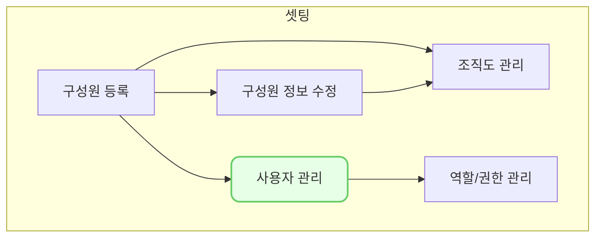

사용자 관리 (se0005)에서는 VCworks에 ID를 생성하는 방법과 생성한 ID를 관리하는 방법을 설명합니다.

## 동영상



## 설명
- `설정 > 사용자 관리`에서 VCworks에서 사용할 ID(계정)을 생성할 수 있습니다.
- `인사 > 구성원`에서 먼저 구성원을 등록해두시면 구성원 정보와 사용자 ID와 연결할 수 있습니다.
	- 구성원 정보를 연결하면 구성원의 부서, 직위, 재직상태를 함께 조회할 수 있습니다.
	- 구성원 연결 없이 사용자 ID만 생성하고자 하시면 구성원 정보 없이도 ID 생성이 가능합니다.

#### 사용자 ID 생성

VCworks에서 사용할 ID를 생성하는 방법은 다음과 같습니다.

1. `신규 등록` 버튼을 클릭해 주세요.
	- 사용자 등록 드로어가 열립니다.
2. 아이디, 이름, 이메일, 역할, 사용 여부를 입력 또는 선택해 주세요.
	- 아이디는 한 번 생성하시면 수정할 수 없습니다. 신중히 등록해주세요.
	- 구성원 정보를 연결하시려면 `인사-구성원`에서 먼저 구성원을 등록해주세요.
	- 구성원을 선택하시면 구성원 정보에 등록된 이름과 이메일이 자동 입력 됩니다.
	- 역할을 추가하시려면 `설정-역할/권한`에서 먼저 역할을 등록해주세요.
	- ID 하나에 여러 개의 역할을 부여할 수 있으며, 역할에 설정된 권한은 합집합으로 적용됩니다.
3. `저장`을 클릭해 주세요.
	- 입력한 ID로 계정이 생성됩니다.
	- 최초 생성한 ID의 비밀번호는 `설정한ID+1234`로 자동 설정됩니다.

#### 사용자 ID 정보 수정

최초 생성 시 설정한 아이디 정보 외의 항목들을 수정할 수 있습니다.
사용자 ID(계정) 정보를 수정하는 방법은 다음과 같습니다.

1. 수정이 필요한 ID를 클릭해 주세요.
	- 사용자 상세 드로어가 열립니다. 
2. `수정` 버튼을 클릭해 주세요.
	- 사용자 정보를 수정할 수 있는 모드로 변경됩니다.
3. 수정하고자 하는 정보를 입력 또는 선택해 주세요.
	- 비밀번호는 해당 ID로 로그인 후, `마이페이지-기본 정보-비밀번호 재설정`에서 변경하실 수 있습니다.
	- 비밀번호를 잃어버린 경우 `로그인 페이지-비밀번호 찾기`에서 비밀번호를 변경해주세요.
	- 비밀번호 찾기, 비밀번호 재설정은 ID에 등록된 이메일을 통해 진행되므로, 수신 가능한 이메일을 설정해주셔야 합니다.
4. `저장` 버튼을 클릭해 주세요.
	- 수정한 정보가 ID에 반영됩니다.

## 자주 묻는 질문

> `설정`에서 `사용자 관리` 메뉴가 안보여요.
{: .prompt-tip }
- 로그인 한 ID에 `관리자` 역할이 부여된 경우에만 `사용자 관리`메뉴에서 VCworks 계정 정보를 생성하고, 수정하실 수 있습니다.
- VCworks에 최초로 생성된 계정에는 `관리자` 역할이 부여되어 있습니다.
- `관리자` 역할이 부여된 계정을 찾기 어려우시면 [we@dkdk.kr](mailto:we@dkdk.kr)로 문의를 남겨주세요.
 
> 이름과 이메일을 수정하고 싶은데, 수정이 안됩니다.
{: .prompt-tip }
- 구성원을 선택한 경우, 구성원의 이름과 이메일 정보를 사용하기 때문에 수정할 수 없습니다.
- `인사-구성원`에서 해당 구성원의 이름과 이메일 정보를 수정하시면, 연결된 ID의 이름과 이메일 정보도 자동으로 수정됩니다.

> 역할이 뭔가요? 
{: .prompt-tip }
- VCworks의 권한을 설정하는 단위입니다.
- `설정-역할/권한 관리`에서 역할을 생성하거나, 역할에 설정된 권한을 수정할 수 있습니다.
- `역할/권한 관리`의 자세한 내용은 역할/권한 관리 (se0003)문서에서 조회하실 수 있습니다.

> 사용하지 않는 ID를 삭제하고 싶어요.
{: .prompt-tip }
- 사용하지 않는 ID의 `사용여부`를 `부`로 설정시면, 해당 ID로 로그인이 불가능합니다.
- ID를 화면 상에서 영구적으로 삭제하는 기능은 현재 제공하고 있지 않습니다.
- 사용 시 많은 불편함이 느껴지신다면 [we@dkdk.kr](mailto:we@dkdk.kr)로 의견을 남겨주세요!

## 선후행 구조도

