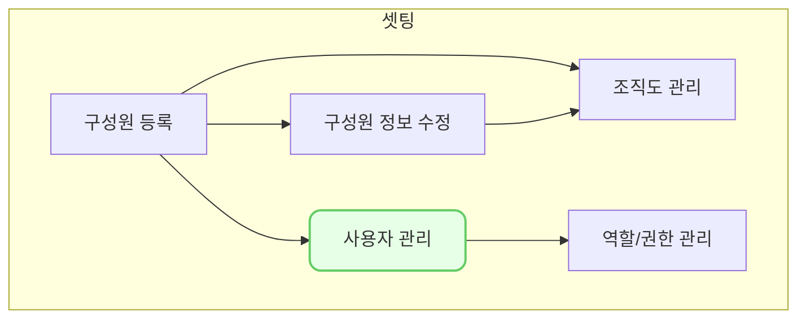

`설정-사용자관리`에서 VCworks를 사용하기 위한 ID를 생성하고 구성원을 할당할 수 있습니다.

## 동영상



## 설명

- 우리 조직의 구성원이라면 `인사-구성원`에서 먼저 구성원을 등록해주신 다음 사용자를 등록하세요!
- 만약 우리 조직의 구성원이 아니면서 VCworks를 사용할 수 있도록 하려면 곧바로 `설정-사용자 관리`에서 아이디를 생성하시면 됩니다.
- 이메일로 패스워드 초기화가 가능하기 때문에 꼭 확인하시고 등록해주세요
	
## 자주 묻는 질문

> 역할에 관리자만 나오는데 어떻게 해야 하나요?
{: .prompt-tip }

- 역할은 `설정-역할/권한관리` 에서 다양하게 만들 수 있습니다.
- 초기 셋팅하는 사람에게는 관리자 권한을 주고 나머지분들에게는 우선 권한을 주지 마시고 진행하세요!
- 다음 글에서 자세히 설명될 예정입니다.

## 선후행 구조도

