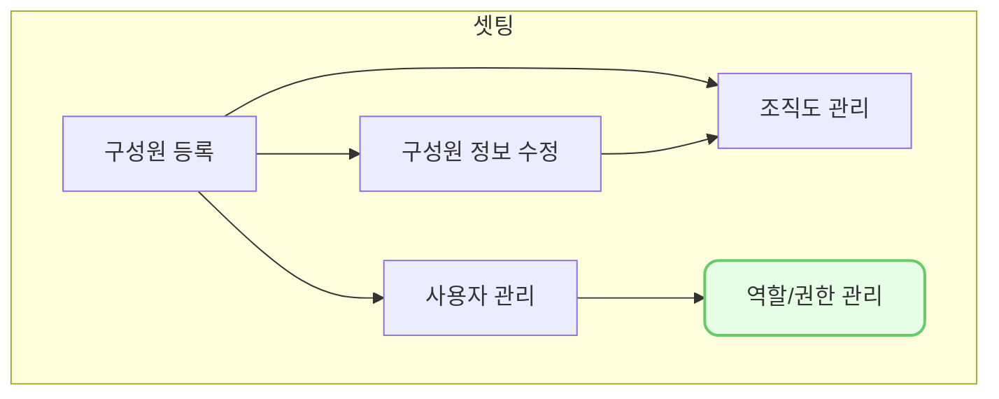

`설정-역할/권한 관리`에서 `설정-사용자 관리`에 필요한 역할을 구체적으로 맞춤 설정할 수 있으며, 이곳에서 바로 역할에 맞는 사용자를 추가할 수 있습니다.

## 동영상



## 설명

- 역할을 우선 추가하고, 권한을 설정합니다. 
	- 현재는 화면(메뉴) 권한만 제공됩니다.
- 하단의 사용자 목록을 통해 일괄적으로 사용자를 할당할 수 있습니다.
- VCworks에 신규 화면이 추가될 경우 기본적으로 화면 접근권한은 "없음" 처리 되기 때문에 관리자가 역할별로 권한을 추가로 넣어주어야 합니다.
## 자주 묻는 질문

> 조합이나, 포트폴리오 혹은 특정 화면 요소별로 권한 설정은 안되나요?
{: .prompt-tip }

- 조합별 조회 권한, 포트폴리오별 조회 권한 등은 고객사의 니즈 수준을 파악하여 우선순위를 설정하여 개발하고자 합니다. 필요하시다면 we@dkdk.kr 로 요청사항을 작성해서 연락주세요!
- 특정화면의 특정기능별 요소는 위 데이터별 접근 권한을 구성한 이후에 개발될 예정입니다.

> 역할 삭제가 안되나요?
{: .prompt-tip }

- 역할도 조직도와 마찬가지로 이력관리를 위해 삭제를 기본 제공하지 않습니다.
- 만약 불필요한 역할이 많다면 기존의 역할 이름을 변경하여 사용하는 것을 추천 드립니다.
- 그럼에도 불구하고 삭제가 필요한 경우 we@dkdk.kr 로 요청해주세요

## 선후행 구조도

