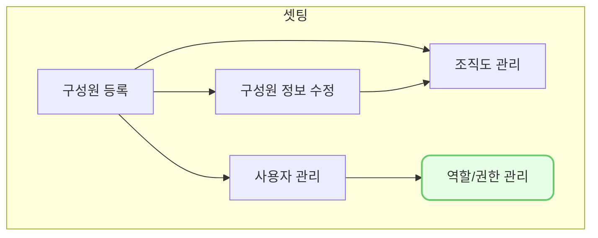

역할/권한 관리 (se0005)에서는 VC works에 역할을 생성하고, 역할 별로 권한을 설정하는 방법을 설명합니다.

## 동영상



## 설명
- `설정-역할/권한 관리`에서 역할을 생성하고, 역할에 권한을 할당하는 방식으로 권한을 설정할 수 있습니다.
- 사용자 ID에 생성한 역할을 부여하면, 해당 ID는 역할에 설정된 권한을 적용 받습니다.
- 사용자 ID에는 반드시 1개 이상의 역할을 부여해야 하며, 필요 시 여러 개의 역할을 부여할 수도 있습니다.
- 현재는 화면 권한만 설정 가능하지만 조합별 권한, 포트폴리오별 권한 등 추가적인 권한을 설정할 수 있도록 업데이트 예정입니다.
- VCworks에 신규 화면이 추가될 경우, 기본적으로 모든 역할에 화면 접근 권한이 없도록 처리 되기 때문에 신규 메뉴 사용을 원하시면 관리자의 추가 권한 설정이 필요합니다.

#### 역할 생성 및 권한 설정

VCworks에서 역할을 생성하고, 역할별로 권한을 할당하거나 역할을 부여할 사용자 ID를 설정하는 방법은 다음과 같습니다.

###### 역할 생성
1. 역할 설정 섹션에서 `등록` 버튼을 클릭해 주세요.
2. 역할명, 설명, 사용 여부를 입력 또는 선택해 주세요.
	- 설명 항목에는 역할에 대한 간략한 메모를 기록해둘 수 있습니다.
	- 사용 여부를 on으로 설정해둬야 역할별 권한이 적용됩니다.
3. `저장` 버튼을 클릭해 주세요.
	- 역할이 신규 등록됩니다.

###### 역할별 권한 설정
1. 역할 설정 섹션에서 역할을 선택해 주세요.
2. 권한 설정 섹션에서 `수정` 버튼을 클릭해 주세요.
3. 권한 설정 섹션에서 `메뉴 권한` 탭을 클릭해 주세요.
4. 해당 역할에 권한을 할당할 메뉴를 선택해 주세요.
	- 대메뉴명/중메뉴명을 선택하는 경우, 해당 메뉴에 할당된 하위 메뉴를 일괄 선택하실 수 있습니다.
5. `저장` 버튼을 클릭해 주세요.
	- 선택한 메뉴의 권한이 해당 역할에 할당됩니다.

###### 역할 적용 사용자 ID 설정
[tip] `설정-사용자 관리`에서 ID별로 역할을 부여할 수도 있습니다.
1. 역할 설정 섹션에서 역할을 선택해 주세요.
2. 권한 설정 섹션에서 `수정` 버튼을 클릭해 주세요.
3. 사용자 목록 하단에 `+` 버튼을 통해 행을 추가해 주세요.
4. 추가된 행의 `이름` 필드를 더블 클릭해 주세요.
5. 역할을 부여하고자 하는 사용자 ID를 선택해 주세요.
	- 이름 옆 영문은 사용자 ID입니다.
6. 역할을 부여하고자 하는 사용자 ID 개수만큼 1~5를 반복해 주세요.
7. `저장` 버튼을 클릭해 주세요.
	- 사용자 목록에 추가한 ID에 해당 역할 및 권한이 적용됩니다.

#### 역할별 설정 내용 수정

기존에 설정한 역할 및 권한 설정 내용을 수정하는 방법은 다음과 같습니다.
1. 역할 설정 섹션에서 수정이 필요한 역할을 선택해 주세요.
2. 권한 설정 섹션에서 `수정` 버튼을 클릭해 주세요.
3. 수정하고자 하는 정보를 입력 또는 선택해 주세요.
	- 관리자 역할은 `사용 여부`를 `부`로 수정할 수 없습니다.
	- `설정-사용자 관리`, `설정-역할/권한 관리`에 대한 메뉴 진입 권한은 별도의 설정이 불가능하며, 관리자 역할이 부여된 ID로만 진입할 수 있습니다.
4. `저장`버튼을 클릭해 주세요.
	- 수정한 정보가 역할에 반영됩니다.

## 자주 묻는 질문

> 사용하지 않는 역할을 삭제하고 싶어요.
{: .prompt-tip }
-  사용하지 않는 역할의 `사용 여부`를 `부`로 설정하시면, 해당 역할에 할당된 권한이 적용되지 않습니다.
- 역할을 화면 상에서 영구적으로 삭제하는 기능은 현재 제공하고 있지 않습니다.
- 사용 시 많은 불편함이 느껴지신다면  [we@dkdk.kr](mailto:we@dkdk.kr)로 문의를 남겨주세요.

> 사용하지 않는 역할의 `사용 여부`를 `부`로 수정하려는데, 수정이 되지 않습니다.
{: .prompt-tip }
- 역할의 `사용 여부`가 수정 불가능한 사유는 다음과 같습니다.
	- 해당 역할이 관리자 역할(최초 가입 시 생성된 역할)인 경우
		- 관리자 역할의 `사용 여부`는 수정 불가능하므로, 역할 부여 사용자 목록을 수정해 주세요.
	- `사용 여부`를 `OFF`할 경우, 특정 ID에 설정된 역할이 1개 미만이 되는 경우
		- 사용자 ID에는 `사용 여부`가 `여`인 역할이 최소 1개 이상 부여되어야 합니다.
		- 다른 역할을 부여해준 뒤 해당 역할의 `사용 여부`를 `부`로 설정해 주세요.

> 사용자 목록에서 사용자를 제거할 수 없습니다.
{: .prompt-tip }
- 사용자 ID에는 `사용 여부`가 `여`인 역할이 최소 1개 이상 부여되어야 합니다.
- 선택한 사용자를 제거 시, 해당 ID에 부여된 역할이 1개 미만이 되는 경우 부여된 역할을 제거할 수 없습니다.
- 다른 역할을 부여해준 뒤 해당 역할의 사용자 목록에서 사용자 ID를 제거 주세요.

> 권한을 기능, 포트폴리오, 조합 단위로 설정하고 싶어요.
{: .prompt-tip }
- 현재는 메뉴 권한만 설정 가능합니다.
- 기능별, 포트폴리오별, 조합별 권한은 고객사의 수요를 파악하여 업데이트 할 예정입니다.
- 설정이 필요한 세부 권한이 있다면 we@dkdk.kr로 의견을 남겨주세요.

> 역할을 할당했는데, 권한이 적용되지 않아요.
{: .prompt-tip }
- 역할의 `사용 여부`를 확인해주세요.
- `사용 여부`가 off인 경우 해당 역할에 설정된 권한은 적용되지 않습니다.

## 선후행 구조도

